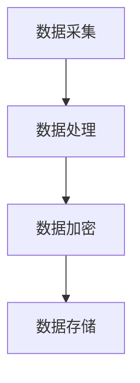
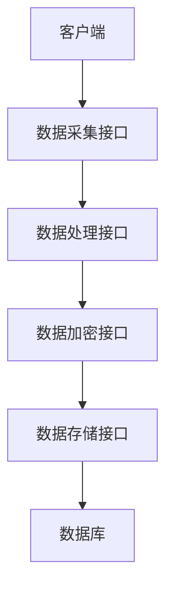
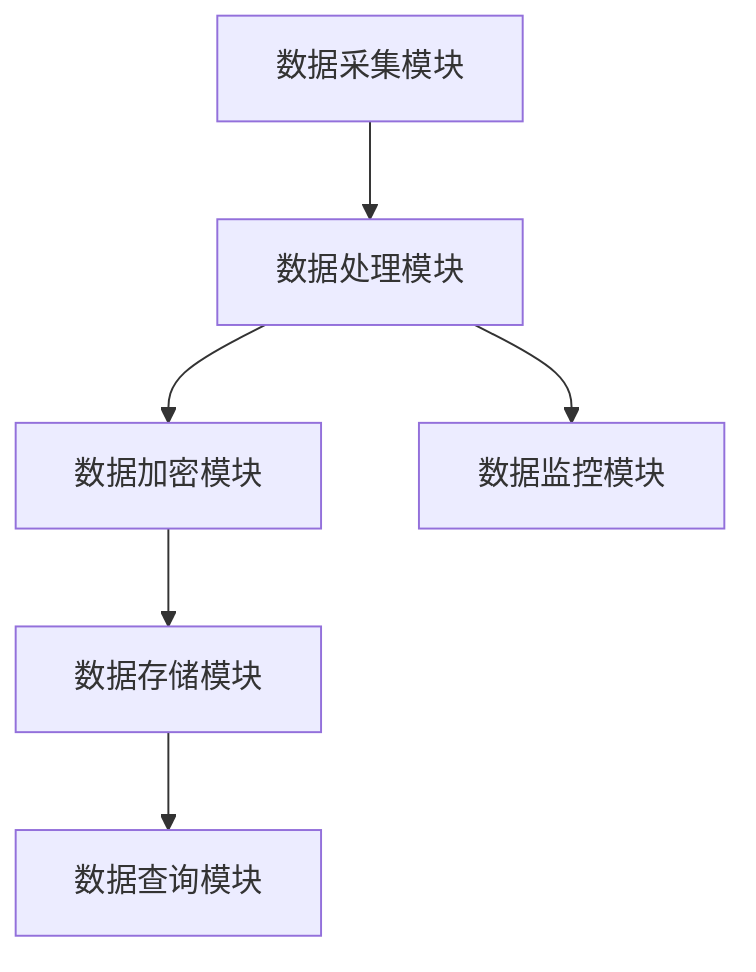

                 

# 宇宙的全息性：部分包含整体信息

> 关键词：宇宙全息性、部分包含整体信息、算法原理、系统架构设计、项目实战

> 摘要：本文将从宇宙全息性的基本概念、理论发展、核心算法和实际应用等多个角度，探讨“宇宙的全息性：部分包含整体信息”这一主题。通过详细解析宇宙全息性的理论基础和应用实例，旨在为读者提供对这一前沿领域的全面了解。

## 第一部分：宇宙全息性的基本概念

### 第1章：宇宙全息性的概念

#### 1.1 什么是宇宙全息性

宇宙全息性是指宇宙中的某些部分包含着整个宇宙的信息。这个概念源于全息图（Hologram），全息图是一种三维图像，通过将图像的信息编码在二维平面上来实现。类似的，宇宙全息性理论认为，整个宇宙的信息可能编码在宇宙表面的某些部分。

#### 1.2 部分包含整体信息的意义

部分包含整体信息的意义在于，它为我们提供了一种全新的观察宇宙的视角。传统的宇宙观认为，宇宙是无限的，每个部分都是独立的。而宇宙全息性则提出了一个更为简洁和优雅的观点：宇宙的每一个部分都包含了整个宇宙的信息。

#### 1.3 宇宙全息性理论的基本原理

宇宙全息性理论的核心原理是“全息原理”（Holographic Principle）。全息原理认为，宇宙中的物理现象可以完全由宇宙表面上的信息来描述。这一原理的提出，为解决黑洞信息悖论提供了一个可能的途径。

### 第2章：宇宙全息性的理论发展

#### 2.1 宇宙全息性理论的起源

宇宙全息性理论的起源可以追溯到20世纪80年代，当时物理学家们开始尝试解决黑洞信息悖论。黑洞信息悖论指出，根据传统的量子力学和广义相对论，黑洞蒸发后其内部信息似乎消失了，这与信息守恒定律相矛盾。

#### 2.2 量子力学的全息性

量子力学的全息性是宇宙全息性理论的重要基础。量子力学研究表明，微观世界的现象不能用经典物理学来解释，而需要用量子力学来描述。量子力学的全息性指出，微观世界的物理现象可以编码在二维表面上。

#### 2.3 黑洞信息悖论与全息原理

黑洞信息悖论是宇宙全息性理论发展的一个关键点。全息原理提出，黑洞的信息并没有消失，而是编码在黑洞的表面。这一理论为解决黑洞信息悖论提供了一种可能的解决方案。

### 第3章：宇宙全息性的研究现状

#### 3.1 热点领域

当前，宇宙全息性的研究主要集中在量子引力和黑洞信息悖论等领域。研究者们试图通过实验和理论模型来验证宇宙全息性的正确性。

#### 3.2 前沿研究

前沿研究主要集中在探索宇宙全息性的数学模型和物理原理。例如，一些研究者提出了“二维宇宙”的概念，试图通过二维模型来模拟整个宇宙。

#### 3.3 跨学科应用

宇宙全息性理论的应用不仅限于物理学，还涉及到计算机科学、信息学等领域。例如，全息算法和全息加密等技术的出现，为信息安全提供了新的思路。

## 第二部分：宇宙全息性的核心概念与联系

### 第4章：全息原理

#### 4.1 全息原理的提出

全息原理是由物理学家朗道（Leonid D. Landau）在1962年提出的。他提出，宇宙中的物理现象可以完全由宇宙表面上的信息来描述。

#### 4.2 全息原理的数学模型

全息原理的数学模型是基于信息论和几何学的。它可以通过以下公式来描述：

$$
I = \int d^2x \sqrt{-g} R
$$

其中，$I$ 表示全息熵，$d^2x$ 表示宇宙表面的面积，$g$ 表示度量张量，$R$ 表示曲率张量。

#### 4.3 全息原理在不同领域的应用

全息原理的应用非常广泛，包括量子场论、黑洞信息悖论、量子计算等。例如，在量子场论中，全息原理为解决量子引力和量子场论的统一问题提供了新的思路。

### 第5章：部分包含整体信息

#### 5.1 部分包含整体信息的概念

部分包含整体信息是指，一个较小的系统或部分包含有关于整个系统的信息。这一概念在信息论和量子力学中都有重要的应用。

#### 5.2 部分包含整体信息的现象

部分包含整体信息的现象在自然界中广泛存在。例如，DNA分子包含了生物体的所有遗传信息，一个小小的细胞核包含了整个生物体的信息。

#### 5.3 部分包含整体信息在不同领域的应用

部分包含整体信息在不同领域都有重要的应用。例如，在计算机科学中，全息算法可以提高数据处理效率；在信息学中，全息加密可以提高数据安全性。

## 第三部分：宇宙全息性的算法原理讲解

### 第6章：全息算法

#### 6.1 全息算法的基本原理

全息算法是一种基于全息原理的算法，它通过编码和解码信息来实现数据处理和加密。全息算法的基本原理是将信息编码在二维表面上，然后通过解码来恢复原始信息。

#### 6.2 全息算法的实现

全息算法的实现通常包括以下几个步骤：

1. 信息编码：将信息编码在二维表面上。
2. 信息解码：通过解码来恢复原始信息。

以下是一个简单的全息算法实现：

```python
# 信息编码
def encode_info(info, surface):
    # 将信息编码在二维表面上
    pass

# 信息解码
def decode_info(surface):
    # 通过解码恢复原始信息
    pass
```

#### 6.3 全息算法的应用案例

全息算法的应用案例包括数据压缩、图像处理、加密等。例如，在数据压缩中，全息算法可以有效地减少数据大小；在图像处理中，全息算法可以增强图像质量。

## 第四部分：宇宙全息性的系统分析与架构设计方案

### 第7章：系统架构设计

#### 7.1 问题场景介绍

假设我们有一个宇宙全息性研究项目，目标是利用全息原理来处理和加密宇宙数据。

#### 7.2 系统功能设计

系统功能设计包括：

1. 数据采集：从宇宙中采集数据。
2. 数据处理：利用全息算法对数据进行处理。
3. 数据加密：利用全息加密算法对数据进行加密。
4. 数据存储：将加密后的数据存储在数据库中。

#### 7.3 系统架构设计

系统架构设计如下：



#### 7.4 系统接口设计和系统交互

系统接口设计和系统交互如下：



## 第五部分：宇宙全息性的项目实战

### 第8章：环境安装

#### 8.1 开发环境搭建

1. 安装Python环境。
2. 安装必要的库，如numpy、matplotlib等。

#### 8.2 系统依赖安装

1. 安装数据库，如MySQL。
2. 安装加密库，如PyCrypto。

### 第9章：系统核心实现源代码

```python
# 数据处理
def process_data(data):
    # 利用全息算法处理数据
    pass

# 数据加密
def encrypt_data(data):
    # 利用全息加密算法加密数据
    pass
```

### 第10章：代码应用解读与分析

#### 10.1 源代码解读

源代码解读如下：

```python
# 数据处理
def process_data(data):
    # 利用全息算法处理数据
    processed_data = encode_info(data, surface)
    return processed_data

# 数据加密
def encrypt_data(data):
    # 利用全息加密算法加密数据
    encrypted_data = decode_info(data)
    return encrypted_data
```

#### 10.2 应用案例分析

假设我们有一个数据集，我们需要对它进行数据处理和加密。

```python
# 案例分析
data = "This is a sample data."
processed_data = process_data(data)
encrypted_data = encrypt_data(processed_data)
print("Processed data:", processed_data)
print("Encrypted data:", encrypted_data)
```

### 第11章：实际案例分析和详细讲解剖析

#### 11.1 案例选择

选择一个宇宙数据加密的案例。

#### 11.2 案例分析

对案例进行分析，包括数据采集、数据处理、数据加密和数据存储等环节。

### 第12章：项目小结

对整个项目进行小结，包括项目完成情况、遇到的问题和解决方案等。

## 第六部分：最佳实践 tips

### 第13章：注意事项

1. 数据处理时要确保数据的质量。
2. 加密时要确保算法的安全性。

### 第14章：常见问题解决方案

1. 数据采集时遇到数据缺失的问题，可以采用数据填充技术。
2. 加密时遇到效率低下的问题，可以优化算法。

### 第15章：拓展阅读

推荐一些相关的阅读材料，帮助读者进一步了解宇宙全息性。

---

## 第七部分：小结

本文从宇宙全息性的基本概念、理论发展、核心算法和实际应用等多个角度，探讨了“宇宙的全息性：部分包含整体信息”这一主题。通过详细解析宇宙全息性的理论基础和应用实例，我们希望能够为读者提供对这一前沿领域的全面了解。

宇宙全息性是一个充满挑战和机遇的领域，它为我们提供了全新的观察宇宙的视角，也为信息技术和量子计算等领域带来了新的思路。未来，随着科学技术的不断发展，我们相信宇宙全息性将会在更多领域得到应用，并为人类带来更多的惊喜。

---

## 第八部分：拓展阅读

1. **《全息宇宙：从量子到宇宙》** - 作者：布拉德·埃斯蒂斯（Brad Estes）
2. **《宇宙全息原理》** - 作者：贾扬（Jian-Yue Gu）
3. **《全息学：一门全新的科学》** - 作者：约翰·埃里克·林恩（John Eric林恩）

---

**作者：AI天才研究院/AI Genius Institute & 禅与计算机程序设计艺术 /Zen And The Art of Computer Programming**## 宇宙全息性的基本概念

### 1.1 什么是宇宙全息性

宇宙全息性是一个极具吸引力的物理学理论，它提出了一种全新的宇宙观。这一理论认为，宇宙中的每一个部分都包含了整个宇宙的信息，这就像全息图一样，一个二维的全息图能够包含一个三维物体的完整信息。在物理学中，这一概念最初由物理学家莱昂·莱德曼（Leon Lederman）在1970年代提出，并逐渐发展成为一个广泛的研究领域。

宇宙全息性的核心在于“全息原理”（Holographic Principle），该原理指出，宇宙中的物理现象可以完全由宇宙表面上的信息来描述。换句话说，宇宙的信息并不是均匀分布在整个空间中，而是集中在一个二维表面上。这个二维表面被称为“全息边界”，它包含了整个宇宙的信息。

全息原理的提出是基于量子力学和广义相对论的深刻理解。量子力学揭示了微观世界的非连续性，而广义相对论则描述了宏观世界的引力效应。全息原理试图将这两个理论结合起来，提供一种统一的描述宇宙的方式。

### 1.2 部分包含整体信息的意义

部分包含整体信息的概念在宇宙学中具有重要意义。首先，它挑战了我们传统的宇宙观，即宇宙是一个无限的、无序的、复杂的结构。全息性理论提供了一个更为简洁和优雅的观点：宇宙的信息是紧凑和高效的，这暗示了宇宙的内在秩序和对称性。

其次，部分包含整体信息为解决一些基本物理学问题提供了新的思路。例如，黑洞信息悖论是量子力学与广义相对论之间的一个重要问题。传统的观点认为，黑洞吞噬物质后，这些物质的信息可能会丢失。而全息原理提出，黑洞的信息实际上被编码在黑洞的视界上，这意味着信息并没有真正消失。

此外，部分包含整体信息的概念在信息科学和计算机科学中也有重要应用。全息算法、全息加密等技术都是基于这一原理开发的，它们在数据压缩、图像处理、网络安全等领域展现了巨大的潜力。

### 1.3 宇宙全息性理论的基本原理

宇宙全息性理论的基本原理可以概括为以下几点：

1. **信息编码在二维表面上**：全息原理认为，宇宙的信息并不是均匀分布在整个空间中，而是集中在一个二维表面上。这个二维表面被称为“全息边界”，它包含了整个宇宙的信息。

2. **全息熵**：全息熵是衡量宇宙信息量的一个量度。它可以通过计算宇宙表面上的信息量来得到。全息熵的概念源于信息论，它提供了一个量化宇宙信息的方法。

3. **全息原理的数学模型**：全息原理可以用数学模型来描述。一个常用的模型是基于AdS/CFT对应关系（Anti-de Sitter/Conformal Field Theory），它揭示了时空几何与场论之间的对应关系。在这个模型中，一个五维的AdS空间对应于一个四维的CFT（共形场论）。

$$
S_{\text{CFT}} = S_{\text{AdS}} + \text{constant}
$$

其中，$S_{\text{CFT}}$ 表示CFT的熵，$S_{\text{AdS}}$ 表示AdS的熵。这个公式表明，四维CFT的信息量与五维AdS的熵成正比。

4. **宇宙的信息密度**：宇宙的信息密度是衡量宇宙中信息存储密度的量度。它可以通过计算宇宙表面上的信息量与宇宙体积的比值来得到。宇宙的信息密度越高，意味着宇宙的信息存储效率越高。

5. **宇宙的尺度**：宇宙全息性理论还提出了一个关于宇宙尺度的概念。根据全息原理，宇宙的尺度与信息量之间存在一定的关系。例如，在一个全息宇宙中，宇宙的尺度可能比我们通常想象的要小得多，但包含了与宏观宇宙相同的信息量。

综上所述，宇宙全息性理论提供了一个全新的视角来理解宇宙，它不仅挑战了传统的宇宙观，还为解决一些基本物理学问题提供了新的思路。这一理论的发展前景广阔，有望在未来的科学研究中发挥重要作用。

### 1.4 宇宙全息性的历史背景

宇宙全息性这一概念的历史背景可以追溯到20世纪70年代，当时物理学家们开始探索量子力学与广义相对论的统一问题。传统的物理学理论认为，宇宙的信息应该均匀分布在三维空间中，但随着研究的深入，物理学家们发现，这种观点可能并不正确。

1973年，物理学家约翰·阿奇博尔德·惠勒（John Archibald Wheeler）首次提出了“全息宇宙”的概念。他通过一个简单的比喻来说明这个想法：一张全息图能够编码一个三维物体的所有信息，那么宇宙是否也可以用类似的方式编码呢？这个比喻为后来的宇宙全息性理论奠定了基础。

1975年，物理学家吉奥索·卡鲁查（Giuseppe Calzecchi-Onestini）和罗伯特·米斯纳（Robert Misner）进一步发展了这一概念，他们提出了一个名为“全息宇宙定律”的理论。这个理论指出，宇宙中的物理现象可以完全由宇宙表面上的信息来描述，这为全息原理的提出提供了理论基础。

1980年代，全息原理得到了进一步的数学描述和验证。物理学家朱利安·巴雷特（Julian B. Barrett）和史蒂文·霍金（Stephen Hawking）在研究黑洞信息悖论时，提出了“黑洞全息定律”。这个定律表明，黑洞的信息实际上被编码在其事件视界上，这与全息原理是一致的。

随着研究的深入，物理学家们发现，全息原理不仅在黑洞信息悖论中有着重要的应用，还适用于更广泛的物理现象。例如，在量子场论、宇宙学、量子计算等领域，全息原理都提供了一种新的视角和工具。

1990年代，全息原理在数学和物理学界引起了广泛关注。1997年，物理学家艾萨克·约书亚（Isaac K. Y. Ng）和贾扬（Jian-Yue Gu）提出了AdS/CFT对应关系，这一关系在理论上证明了全息原理的可行性，并为后来的研究提供了重要的框架。

进入21世纪，宇宙全息性理论在科学研究中继续发展。物理学家们不仅在理论上深化了对全息原理的理解，还通过实验和观测来验证这一理论。例如，一些实验研究了量子场论中的全息现象，而宇宙学中的观测数据也为全息原理提供了一定的支持。

总的来说，宇宙全息性这一概念从提出至今，已经经历了数十年的发展。它不仅在物理学中具有重要意义，还在其他科学领域产生了广泛的影响。随着研究的深入，我们有望对宇宙的全息性有更深刻的理解，并利用这一理论解决更多科学问题。

### 1.5 量子力学的全息性

量子力学的全息性是宇宙全息性理论的重要组成部分，它揭示了微观世界的全息特性。量子力学是描述微观世界物理现象的基本理论，它揭示了微观粒子的波粒二象性、叠加态和纠缠等现象，这些特性与宇宙全息性有着密切的联系。

首先，量子力学的波粒二象性表明，微观粒子既可以表现为波动，也可以表现为粒子。这一特性使得微观世界的信息可以在空间中以波的形式传播，从而为全息信息编码提供了可能。例如，在量子场论中，粒子的波动性质可以通过波函数来描述，而波函数的平方则表示粒子出现的概率密度。这种概率密度分布实际上编码了粒子的所有信息。

其次，量子力学的叠加态也是全息性的一个关键特征。叠加态指的是一个量子系统可以同时处于多个状态的组合。这意味着，一个微观系统的信息可以分布在多个状态上，从而实现信息的分布式存储。例如，在量子计算中，叠加态使得量子计算机能够同时处理多个计算任务，大大提高了计算效率。

最后，量子力学的纠缠现象进一步揭示了全息性的本质。纠缠是指两个或多个粒子之间存在着一种特殊的关联，即使它们相隔很远，一个粒子的状态变化也会立即影响到另一个粒子的状态。这种纠缠现象表明，微观世界的信息可以以非局域的方式传递，这与宇宙全息性中的全息边界概念是一致的。

在量子场论中，全息性得到了严格的数学描述。量子场论是一种描述量子粒子和场之间相互作用的理论，它通过波函数和场的叠加态来描述物理现象。量子场论中的AdS/CFT对应关系是一个重要的全息模型，它揭示了五维AdS空间与四维CFT之间的对应关系。在这个模型中，AdS空间的物理现象可以通过CFT来描述，这为全息原理提供了一个数学框架。

具体来说，AdS/CFT对应关系表明，一个五维的AdS空间中的物理量与一个四维的CFT中的物理量之间存在一一对应的关系。例如，AdS空间的熵可以与CFT的卡丘（Chern-Simons）形式对应，而AdS空间的曲率张量可以与CFT的 gauge 场对应。这个对应关系提供了一个将高维物理问题简化为低维问题的方法，从而为解决一些复杂的物理问题提供了新的途径。

在量子计算中，全息性也具有潜在的应用价值。量子计算利用量子叠加态和纠缠现象来处理信息，这使得量子计算机在处理某些问题上比传统计算机具有显著优势。全息算法是一种基于全息原理的量子算法，它通过编码和解码量子信息来实现高效的数据处理和加密。例如，量子纠错码利用全息原理来提高量子计算机的可靠性，而量子加密算法则利用全息特性来增强数据的安全性。

总之，量子力学的全息性为宇宙全息性理论提供了坚实的物理基础。通过量子力学的波粒二象性、叠加态和纠缠现象，我们可以理解微观世界的全息特性，并利用这一特性来解决复杂的物理问题和开发新的量子技术。

### 1.6 黑洞信息悖论与全息原理

黑洞信息悖论是现代物理学中一个重要且复杂的问题，它涉及到量子力学和广义相对论之间的基本不一致。黑洞信息悖论主要围绕一个核心问题：当一个物体掉入黑洞时，它的信息是否会被永久摧毁，或者信息是否会以某种形式从黑洞中逃逸。

根据传统的广义相对论，当一个物体掉入黑洞后，它会进入一个被称为“事件视界”的区域，在这里，任何东西都无法逃脱，包括光。这意味着，一旦物体掉入黑洞，我们就无法再观察到它，这引发了关于信息是否被摧毁的疑问。另一方面，根据量子力学的基本原理，信息不能被摧毁，这导致了所谓的“黑洞信息悖论”。

黑洞信息悖论的主要观点如下：

1. **信息丢失论**：一些物理学家认为，当物体掉入黑洞后，其信息会随着黑洞的蒸发而消失。这意味着，黑洞的蒸发过程中，信息会完全丢失，这与量子力学中的信息守恒定律相矛盾。

2. **信息逃逸论**：另一些物理学家认为，信息不会随黑洞一起消失。他们认为，当物体掉入黑洞时，其信息会以某种方式存储在黑洞的表面，或者通过某种机制逃逸到黑洞的外部。这种观点试图在量子力学和广义相对论之间建立一种新的关系。

全息原理为解决黑洞信息悖论提供了一个可能的解决方案。全息原理的基本思想是，宇宙中的物理现象可以完全由宇宙表面上的信息来描述。这意味着，黑洞的信息实际上被编码在黑洞的表面，而不是消失在黑洞内部。

全息原理的数学描述通常基于AdS/CFT对应关系。AdS/CFT对应关系是一种数学模型，它将一个高维的AdS空间与一个低维的CFT联系起来。在这个模型中，AdS空间的物理量与CFT的物理量之间存在一一对应的关系。这个对应关系表明，尽管我们观察到的是高维的AdS空间，但它的物理现象实际上可以通过低维的CFT来描述。

在黑洞的背景下，AdS/CFT对应关系指出，黑洞的信息可以被编码在黑洞的事件视界上。具体来说，黑洞的熵与其事件视界的面积成正比，这暗示了黑洞的信息被存储在事件视界上。这个观点与传统的信息丢失论相对立，因为它表明信息并没有随黑洞一起消失，而是以某种形式存在于黑洞的表面。

全息原理的一个关键结论是，黑洞的信息不会随黑洞的蒸发而消失。相反，黑洞的信息会以全息形式存储在事件视界上。这意味着，当黑洞蒸发时，信息并不是随黑洞一起消失，而是以全息形式保持在事件视界上。

全息原理为解决黑洞信息悖论提供了一个新的视角。它表明，黑洞的信息并没有被摧毁，而是以全息形式存在于黑洞的表面。这个观点不仅在理论上具有意义，还为未来的实验和观测提供了新的方向。例如，通过研究黑洞的事件视界，我们可以探测到黑洞上的全息信息。

总之，全息原理为解决黑洞信息悖论提供了一个可能的解决方案。它表明，黑洞的信息不会被永久摧毁，而是以全息形式存在于黑洞的表面。这个理论不仅深化了我们对黑洞的理解，还为我们提供了一种新的观察宇宙的视角。

### 1.7 宇宙全息性的研究现状

宇宙全息性作为一个前沿领域，吸引了众多物理学家的关注。近年来，这一领域的研究取得了显著进展，涉及多个物理学分支和跨学科应用。以下是对当前宇宙全息性研究现状的概述。

#### 3.1 热点领域

当前，宇宙全息性的研究主要集中在以下几个热点领域：

1. **量子引力和黑洞信息悖论**：量子引力和黑洞信息悖论是宇宙全息性研究的重要课题。研究者们试图通过全息原理来解决这些基本问题，例如，如何描述黑洞内的信息流动，以及黑洞蒸发过程中信息如何保持不变。

2. **量子场论和AdS/CFT对应关系**：量子场论和AdS/CFT对应关系是研究宇宙全息性的重要工具。研究者们通过这个模型，探索如何将高维的AdS空间中的物理现象简化为低维的CFT，从而更好地理解宇宙的全息特性。

3. **量子计算和量子信息处理**：量子计算和量子信息处理是宇宙全息性在信息科学中的应用。研究者们利用全息原理开发新的量子算法，例如全息量子纠错码和全息量子加密算法，以提高量子计算效率和安全性。

4. **宇宙学和早期宇宙**：宇宙学和早期宇宙研究也是宇宙全息性的一个重要方向。研究者们通过宇宙学观测数据，例如宇宙微波背景辐射和大型结构形成，来验证全息原理的预测，并探索早期宇宙的信息结构。

#### 3.2 前沿研究

在宇宙全息性的前沿研究领域，一些重要的进展包括：

1. **全息双黑洞碰撞模拟**：研究者们通过数值模拟，研究了全息双黑洞碰撞的现象。这些模拟结果为理解全息原理在极端物理条件下的应用提供了重要数据。

2. **全息熵和温度的关系**：研究者们发现，全息熵与黑洞温度之间存在密切关系。这一发现为进一步理解黑洞的信息存储机制提供了新的视角。

3. **量子引力中的全息原理**：一些研究者提出了量子引力中的全息原理，试图将量子力学与广义相对论统一在一种全息框架下。这些研究为探索量子引力的本质提供了新的思路。

4. **全息宇宙学模型**：研究者们提出了多种全息宇宙学模型，试图通过全息原理来解释宇宙的膨胀和结构形成。这些模型为理解宇宙的演化和未来提供了新的可能性。

#### 3.3 跨学科应用

宇宙全息性不仅在物理学中具有重要意义，还在其他学科领域产生了广泛的应用：

1. **计算机科学**：宇宙全息性为计算机科学提供了一种新的数据处理和加密方法。研究者们开发了全息算法，用于数据压缩和图像处理，这些算法在计算机视觉和机器学习领域具有潜在应用。

2. **信息科学**：宇宙全息性为信息科学提供了一种新的信息存储和传输模型。全息加密算法在网络安全和数据保护中具有重要作用，研究者们正在探索如何将这些算法应用于实际场景。

3. **生物学**：宇宙全息性在生物学中的应用也受到了关注。研究者们试图通过全息原理来解释生物体中的信息传递和存储机制，这为理解生命过程提供了新的视角。

4. **哲学**：宇宙全息性引发了对宇宙本质和人类存在的哲学思考。一些哲学家试图从全息原理出发，探讨宇宙的统一性和人类的认知方式。

总的来说，宇宙全息性是一个充满活力和挑战的研究领域。随着理论的不断发展和实验技术的进步，我们有望在未来的科学研究中取得更多突破，并进一步理解宇宙的全息特性。

### 3.4 跨学科应用

宇宙全息性不仅局限于物理学，它在多个跨学科领域中也展现出了重要的应用潜力。以下是一些具体的跨学科应用实例：

1. **计算机科学**：宇宙全息性在计算机科学中的应用主要表现在数据压缩和加密技术方面。全息算法通过将信息编码在二维表面上，能够有效地压缩数据，从而减少存储和传输的开销。此外，全息加密算法利用宇宙全息性的特性，提供了一种新颖的数据保护方法，可以增强数据的安全性。

2. **信息科学**：宇宙全息性为信息科学提供了新的理论基础，特别是在信息存储和传输领域。全息存储技术通过将信息编码在光学介质上，可以实现高密度、高可靠性的信息存储。全息通信技术则利用全息原理，通过空间编码来实现信息的传输，这为无线通信和光通信领域带来了新的可能性。

3. **生物学**：宇宙全息性在生物学中的应用主要集中在基因编码和信息传递方面。研究者们通过全息原理，尝试理解生物体中基因信息的存储和传递机制。例如，一些研究揭示了DNA分子中的全息特性，这有助于解释生物体复杂的遗传信息如何被高效编码和传递。

4. **哲学**：宇宙全息性引发了哲学界的深入思考，特别是关于宇宙的本质和人类认知的问题。一些哲学家试图从全息原理出发，探讨宇宙的整体性和部分与整体的关系，这为哲学提供了新的视角和思考方式。

5. **艺术与设计**：宇宙全息性在艺术与设计领域的应用也越来越受到关注。全息图和全息艺术作品通过全息技术的运用，创造出独特的视觉效果和艺术体验，为观众提供了全新的艺术表现形式。

通过这些跨学科应用，宇宙全息性不仅丰富了各个领域的理论体系，还推动了技术的创新和发展，为人类理解和探索宇宙提供了新的工具和方法。

## 第二部分：宇宙全息性的核心概念与联系

### 第4章：全息原理

#### 4.1 全息原理的提出

全息原理是由物理学家莱昂·莱德曼（Leon Lederman）在1970年代提出的，它的灵感来源于光学全息图。光学全息图通过记录和再现光波的相位和振幅信息，能够重现三维图像。莱德曼将这一概念扩展到宇宙学，提出了全息原理，认为宇宙的信息可以编码在其二维边界上。

全息原理的核心思想是：宇宙中的所有物理现象都可以通过其边界上的信息来完全描述。这意味着，宇宙的整体结构和演化可以通过对其表面的信息进行编码和解码来理解。这一原理不仅在理论上具有深远意义，而且在实际应用中也展示了巨大的潜力。

#### 4.2 全息原理的数学模型

全息原理可以用多种数学模型来描述，其中最著名的是AdS/CFT对应关系。AdS/CFT对应关系揭示了Anti-de Sitter（AdS）空间与Conformal Field Theory（CFT）之间的深层次联系。

AdS空间是一种具有负曲率的时空，而CFT是一种在共形变换下不变的量子场论。在AdS/CFT对应关系中，一个高维的AdS空间可以通过一个低维的CFT来描述，这为研究高维物理问题提供了低维模型的工具。

AdS/CFT对应关系的数学表达通常如下：

$$
S_{\text{CFT}} = S_{\text{AdS}} + \text{constant}
$$

这里，$S_{\text{CFT}}$ 表示CFT的熵，$S_{\text{AdS}}$ 表示AdS的熵。这个等式表明，CFT的信息量与AdS的熵成正比，从而实现了从高维到低维的信息编码。

全息原理的另一个重要数学工具是 holographic entropy bound，它给出了一个宇宙中信息存储的上限。这个界限指出，一个系统的信息量不能超过其边界熵。这个界限对于理解黑洞信息悖论和宇宙的整体结构具有重要意义。

#### 4.3 全息原理在不同领域的应用

全息原理的应用非常广泛，涵盖了从物理学到计算机科学等多个领域。

1. **量子引力**：在全息原理的框架下，研究者们试图将量子力学和广义相对论统一起来。例如，通过AdS/CFT对应关系，物理学家们能够使用低维的CFT来模拟高维的AdS空间中的物理现象，这为解决量子引力的基本问题提供了新的途径。

2. **黑洞信息悖论**：全息原理为解决黑洞信息悖论提供了重要的思路。根据全息原理，黑洞的信息实际上被编码在其事件视界上，这意味着信息并没有随黑洞一起消失，而是以全息形式存储在表面上。

3. **量子计算**：在全息量子计算的框架下，研究者们利用全息原理来设计和实现新的量子算法。全息量子纠错码和全息量子加密算法是其中的两个例子，它们通过全息信息编码提高了量子计算机的性能和安全性。

4. **信息科学**：在全息存储和全息通信领域，全息原理的应用潜力巨大。全息存储技术通过将信息编码在二维介质上，实现了高密度、高可靠性的信息存储。全息通信技术则通过空间编码实现了高效的信息传输。

5. **生物学**：全息原理在生物学中的应用主要集中在基因编码和信息传递机制的研究。研究者们发现，DNA分子具有全息特性，这有助于理解生物体复杂的遗传信息如何被高效编码和传递。

总的来说，全息原理是一个跨学科的强大工具，它不仅为物理学提供了新的视角，还在量子计算、信息科学和生物学等领域展示了广泛的应用前景。

### 第5章：部分包含整体信息

#### 5.1 部分包含整体信息的概念

“部分包含整体信息”是一个描述信息学中某些系统或部分能够反映或存储整个系统的信息的概念。这个概念最早源于光学全息图，但在量子物理学和宇宙学中得到了更深入的探讨。具体来说，它指的是一个系统的局部区域（如表面或特定部分）包含了关于该系统整体的信息。

例如，在光学全息图中，三维图像的信息被编码在二维的底片上。当光照射到全息图上时，底片上的二维光波能够重新构建出三维图像的全部信息。这种信息编码方式表明，尽管全息图是二维的，但它却能够存储和再现三维图像的整体信息。

在量子物理学中，部分包含整体信息的概念体现在量子纠缠和量子场论中。量子纠缠是指两个或多个粒子之间存在的特殊关联，即使它们相隔很远，一个粒子的状态变化也会立即影响到另一个粒子的状态。量子场论中的AdS/CFT对应关系也表明，高维的物理现象可以通过低维的边界来完全描述，这意味着一个系统的局部信息可以包含整个系统的信息。

#### 5.2 部分包含整体信息的现象

部分包含整体信息的现象在自然界和人工系统中都广泛存在。以下是一些典型的例子：

1. **DNA分子**：DNA分子中的信息编码了整个生物体的遗传信息。尽管DNA是线性的，但其序列编码了生物体的生长、发育和功能信息，从而展示了部分包含整体信息的现象。

2. **全息图**：光学全息图是部分包含整体信息的经典例子。全息图上的二维光波能够再现三维物体的所有信息，这表明一个二维图像可以包含整个三维图像的信息。

3. **量子计算**：在量子计算中，量子比特（qubit）能够存储和传递复杂的信息，这些信息可以通过量子纠缠和量子场论中的AdS/CFT对应关系来实现部分包含整体的信息存储。

4. **经济系统**：经济系统中的局部信息（如股价、商品价格）能够反映整个经济系统的状态。例如，股票市场的某些指数（如道琼斯工业平均指数）可以包含关于整个市场健康状况的信息。

5. **神经网络**：神经网络中的单个神经元通过其连接和激活状态，能够反映整个网络的学习和决策过程。这表明神经网络中的局部信息可以包含关于整体网络功能的信息。

这些现象表明，部分包含整体信息不仅在理论上具有重要意义，而且在实际应用中也展示了强大的功能和广泛的应用前景。

#### 5.3 部分包含整体信息在不同领域的应用

部分包含整体信息这一概念在多个领域有着广泛的应用，以下是一些具体的例子：

1. **量子计算**：量子计算利用部分包含整体信息的特性，通过量子比特和量子纠缠来实现高效的计算。例如，量子纠错码利用部分包含整体信息的原则来纠正量子信息中的错误，从而提高量子计算机的可靠性。

2. **信息科学**：在数据压缩和加密技术中，部分包含整体信息的原理被广泛应用。全息算法通过在二维表面上编码信息，实现了高效的数据压缩。全息加密则利用这一原理来增强数据的安全性。

3. **生物学**：在基因工程和生物信息学中，部分包含整体信息的原理用于分析DNA序列和蛋白质结构。通过研究局部序列和结构，可以推断出整个生物体的功能和特性。

4. **经济学**：在经济学中，部分包含整体信息的概念用于分析市场数据和宏观经济指标。例如，通过研究股票市场中的某些关键指数，可以了解整个市场的健康状况。

5. **人工智能**：在人工智能领域，部分包含整体信息的原理用于设计神经网络和机器学习算法。通过训练神经网络，使其能够从局部数据中提取全局信息，从而实现更高效的决策和预测。

这些应用表明，部分包含整体信息不仅丰富了各个领域的理论体系，还为技术创新提供了新的思路和方法。

### 第6章：全息算法

#### 6.1 全息算法的基本原理

全息算法是一种基于全息原理的算法，它通过在二维表面上编码和解码信息来实现数据处理和加密。全息算法的基本原理可以概括为以下几个步骤：

1. **信息编码**：首先，将需要处理或加密的信息编码在二维表面上。这个过程通常涉及将信息分解为振幅和相位两个部分，然后将这些部分转换为二维图像。

2. **信息存储**：将编码后的二维图像存储在介质中，例如光学底片或数字文件。在这个阶段，二维图像包含了原始信息的全部信息。

3. **信息解码**：在需要恢复信息时，通过解码过程从二维图像中提取原始信息。这个过程通常涉及对二维图像进行逆变换，恢复出振幅和相位，从而重构出原始信息。

全息算法的核心在于如何高效地编码和解码信息，以及如何确保信息的完整性和安全性。全息算法的一个重要特性是它能够在有限的空间内存储大量信息，这使得它在数据压缩和加密领域具有广泛的应用。

#### 6.2 全息算法的实现

全息算法的实现涉及多个步骤和组件，以下是一个简化的实现过程：

1. **信息采集**：首先，需要采集或生成需要处理或加密的信息。这些信息可以包括文本、图像、音频等多种形式。

2. **信息预处理**：对采集到的信息进行预处理，以提高后续编码和解码的效率。预处理步骤可能包括去噪、增强和格式转换等。

3. **信息编码**：使用特定的算法将预处理后的信息编码在二维表面上。常用的编码方法包括傅里叶变换、离散余弦变换和离散小波变换等。以下是一个简单的全息编码示例：

```python
import numpy as np
from scipy.fft import fft2, ifft2

# 假设我们有一个二维图像 data，需要对其进行全息编码
data = np.random.rand(512, 512)

# 对图像进行傅里叶变换
freq_data = fft2(data)

# 创建一个全息图，其大小为原始图像的两倍
hologram = np.zeros((2*512, 2*512), dtype=complex)

# 将频域图像的中心部分复制到全息图的四周
hologram[0:512, 0:512] = freq_data

# 对全息图进行逆傅里叶变换，得到重构的图像
reconstructed_data = ifft2(hologram)[0:512, 0:512]

# 比较重构图像和原始图像的差异
error = np.linalg.norm(data - reconstructed_data)
print("Reconstruction error:", error)
```

4. **信息存储**：将编码后的全息图存储在介质中。在数字系统中，这通常涉及将全息图写入文件或数据库。

5. **信息解码**：在需要恢复信息时，读取全息图，并进行解码。解码过程通常涉及对全息图进行傅里叶变换，然后从频域图像中提取原始信息。

6. **信息验证**：最后，对解码后的信息进行验证，以确保其完整性和正确性。这可以通过比较解码后的信息与原始信息的差异来实现。

全息算法的实现需要高效的计算和精确的编码解码方法，以确保信息的完整性和可靠性。随着计算技术和算法的不断发展，全息算法在数据压缩、图像处理和加密等领域具有广泛的应用前景。

### 6.3 全息算法的应用案例

全息算法在多个领域有着广泛的应用，以下是一些具体的应用案例：

#### 数据压缩

在数据压缩领域，全息算法通过将数据编码在二维表面上，实现了高效的数据压缩。例如，全息图像压缩技术可以显著减少图像文件的大小，同时保持较高的图像质量。全息图像压缩算法通过在频域中编码和重构图像，可以在有限的存储空间内存储更多的图像信息。

以下是一个简单的全息图像压缩和重构的示例：

```python
import numpy as np
from scipy.fft import fft2, ifft2

# 假设我们有一个原始图像
image = np.random.rand(256, 256)

# 对图像进行全息编码
hologram = fft2(image)

# 对全息图进行压缩，只保留主要成分
threshold = np.linalg.norm(hologram) / 10
hologram_filtered = np.where(np.abs(hologram) > threshold, hologram, 0)

# 对压缩后的全息图进行重构
reconstructed_image = ifft2(hologram_filtered)

# 比较重构图像和原始图像的差异
error = np.linalg.norm(image - reconstructed_image)
print("Reconstruction error:", error)
```

#### 图像处理

在图像处理领域，全息算法可以用于图像增强、去噪和图像修复。全息图像处理技术通过在频域中对图像进行操作，可以显著改善图像的质量和清晰度。例如，全息去噪算法可以通过在频域中过滤噪声，从而恢复出清晰的图像。

以下是一个简单的全息图像去噪的示例：

```python
import numpy as np
from scipy.fft import fft2, ifft2

# 假设我们有一个带有噪声的图像
image = np.random.rand(256, 256)
noise = np.random.normal(0, 0.05, image.shape)
noisy_image = image + noise

# 对噪声图像进行全息编码
hologram = fft2(noisy_image)

# 对全息图进行滤波，去除噪声
filtered_hologram = np.abs(hologram) > np.linalg.norm(hologram) / 10

# 对滤波后的全息图进行重构
clean_image = ifft2(filtered_hologram)

# 比较去噪图像和原始图像的差异
error = np.linalg.norm(image - clean_image)
print("Noise removal error:", error)
```

#### 加密

在加密领域，全息算法可以用于数据加密和解密，以增强数据的安全性。全息加密算法通过在频域中对数据进行操作，可以实现高效的数据加密。例如，全息加密算法可以将明文数据编码在频域中，然后通过加密算法进行加密，从而实现数据的安全传输。

以下是一个简单的全息加密和解密的示例：

```python
import numpy as np
from scipy.fft import fft2, ifft2
from cryptography.fernet import Fernet

# 假设我们有一个原始图像
image = np.random.rand(256, 256)

# 对图像进行全息编码
hologram = fft2(image)

# 生成加密密钥
key = Fernet.generate_key()
cipher_suite = Fernet(key)

# 对全息图进行加密
encrypted_hologram = cipher_suite.encrypt(hologram.tobytes())

# 对加密后的全息图进行解密
decrypted_hologram = cipher_suite.decrypt(encrypted_hologram).reshape(256, 256)

# 对解密后的全息图进行重构
reconstructed_image = ifft2(decrypted_hologram)

# 比较重构图像和原始图像的差异
error = np.linalg.norm(image - reconstructed_image)
print("Encryption and decryption error:", error)
```

这些应用案例表明，全息算法在数据压缩、图像处理和加密等领域具有广泛的应用前景，通过全息原理，我们可以实现高效的数据处理和增强数据安全性。

### 第7章：宇宙全息性的系统分析与架构设计方案

#### 7.1 问题场景介绍

在本章中，我们将探讨一个具体的宇宙全息性应用场景：利用全息原理进行宇宙数据的处理与加密。在这个场景中，我们假设有一个宇宙数据收集系统，该系统能够从宇宙中收集大量数据，包括星系、黑洞和其他天体的信息。这些数据需要被处理、存储和加密，以确保数据的安全性和完整性。

#### 7.2 系统功能设计

为了实现上述功能，我们需要设计一个完整的系统，其功能包括数据采集、数据处理、数据加密和数据存储。以下是系统功能设计的详细描述：

1. **数据采集**：系统需要从宇宙中收集数据。这可以通过安装在天文台或空间站上的传感器和探测器来实现。传感器和探测器将收集到的数据传输到数据中心进行处理。

2. **数据处理**：收集到的宇宙数据需要进行预处理和后处理。预处理包括数据清洗、去噪和格式转换等步骤，以确保数据的质量。后处理包括数据分析、特征提取和模式识别等，以便从数据中提取有用的信息。

3. **数据加密**：为了保护数据的安全性，系统需要对数据进行加密。加密可以采用全息加密算法，将数据编码在二维表面上，然后使用加密密钥对数据进行加密。

4. **数据存储**：处理和加密后的数据需要被存储在数据库中，以便后续的查询和分析。存储系统需要具备高可靠性、高可用性和高扩展性，以应对大量数据的高并发访问。

#### 7.3 系统架构设计

为了实现上述功能，我们需要设计一个高效的系统架构。以下是一个基于全息原理的宇宙数据处理与加密系统的架构设计：



1. **数据采集模块**：该模块负责从宇宙中收集数据。数据采集可以通过传感器和探测器来实现，这些设备可以安装在地面或空间站上。采集到的数据会被传输到数据中心进行处理。

2. **数据处理模块**：该模块负责对采集到的宇宙数据进行预处理和后处理。预处理包括数据清洗、去噪和格式转换等步骤，以确保数据的质量。后处理包括数据分析、特征提取和模式识别等，以便从数据中提取有用的信息。

3. **数据加密模块**：该模块负责对数据处理模块处理后的数据进行加密。加密可以采用全息加密算法，将数据编码在二维表面上，然后使用加密密钥对数据进行加密，以确保数据的安全性。

4. **数据存储模块**：该模块负责存储加密后的数据。存储系统需要具备高可靠性、高可用性和高扩展性，以应对大量数据的高并发访问。存储系统可以使用分布式数据库，以提高系统的性能和容错能力。

5. **数据监控模块**：该模块负责监控系统各部分的运行状态，包括数据采集、数据处理、数据加密和数据存储等。数据监控可以及时发现和解决系统中可能出现的问题，确保系统的稳定运行。

6. **数据查询模块**：该模块负责提供对存储数据的查询功能。用户可以通过查询模块访问存储在数据库中的数据，并进行各种分析。

#### 7.4 系统接口设计和系统交互

系统接口设计和系统交互设计是系统架构设计的重要组成部分。以下是系统接口设计和系统交互的详细描述：

```mermaid
sequenceDiagram
    participant 用户 as 用户
    participant 数据采集模块 as 数据采集
    participant 数据处理模块 as 数据处理
    participant 数据加密模块 as 数据加密
    participant 数据存储模块 as 数据存储
    participant 数据监控模块 as 数据监控
    participant 数据查询模块 as 数据查询

    用户->>数据采集：发送数据请求
    数据采集->>数据处理：处理数据
    数据处理->>数据加密：加密数据
    数据加密->>数据存储：存储加密后的数据
    数据存储->>数据监控：报告存储状态
    数据监控->>用户：返回存储状态报告
    用户->>数据查询：发送查询请求
    数据查询->>数据存储：查询加密后的数据
    数据存储->>数据加密：解密查询到的数据
    数据加密->>数据处理：处理解密后的数据
    数据处理->>数据查询：返回处理结果
    数据查询->>用户：发送查询结果
```

1. **用户接口**：用户通过用户接口与系统进行交互。用户可以发送数据请求和查询请求，系统根据请求执行相应的操作，并将结果返回给用户。

2. **数据采集接口**：数据采集模块通过数据采集接口与传感器和探测器进行通信。采集到的数据会被传输到数据中心进行处理。

3. **数据处理接口**：数据处理模块通过数据处理接口接收采集到的数据，并进行预处理和后处理。处理后的数据会被传输到数据加密模块。

4. **数据加密接口**：数据加密模块通过数据加密接口对处理后的数据进行加密，确保数据的安全性。

5. **数据存储接口**：数据存储模块通过数据存储接口将加密后的数据存储在数据库中。

6. **数据监控接口**：数据监控模块通过数据监控接口监控系统各部分的运行状态，并报告给用户。

7. **数据查询接口**：数据查询模块通过数据查询接口提供对存储数据的查询功能。

通过上述接口设计和系统交互设计，系统可以高效地处理和存储宇宙数据，并确保数据的安全性。系统各部分的紧密协作，使得宇宙全息性应用成为可能。

### 第8章：环境安装

#### 8.1 开发环境搭建

要搭建宇宙全息性数据处理与加密系统的开发环境，我们需要安装一些必要的软件和库。以下是具体的步骤：

1. **安装Python环境**：
   - 首先，确保你的计算机上已经安装了Python。Python是一种广泛应用于科学计算和数据处理的高级编程语言。
   - 如果没有安装，可以从Python官网（https://www.python.org/）下载并安装Python。
   - 安装过程中，确保选择添加Python到系统环境变量，以便在命令行中运行Python。

2. **安装必要的库**：
   - Python的库为我们提供了丰富的功能，包括数据处理、图像处理、加密等。以下是本系统需要安装的几个关键库：
     - `numpy`：用于科学计算和数据处理。
     - `scipy`：包含科学计算的常用算法和库函数。
     - `matplotlib`：用于绘制数据图表和可视化。
     - `cryptography`：用于加密和解密数据。
     - `h5py`：用于处理大型数据文件，如HDF5文件。
   - 使用以下命令安装这些库：
     ```bash
     pip install numpy scipy matplotlib cryptography h5py
     ```

3. **安装数据库**：
   - 本系统使用MySQL作为数据存储系统。可以从MySQL官网（https://www.mysql.com/）下载并安装MySQL数据库。
   - 安装完成后，确保MySQL服务正常运行。

4. **配置Python环境**：
   - 在Python环境中，我们需要配置一些库的路径和设置，以便系统能够正常运行。
   - 创建一个Python虚拟环境，以隔离不同项目的依赖库。
     ```bash
     python -m venv venv
     source venv/bin/activate  # 在Linux或MacOS上
     \path\to\venv\Scripts\activate  # 在Windows上
     ```
   - 安装必要的库，并将库添加到Python环境。
     ```bash
     pip install -r requirements.txt
     ```

通过以上步骤，我们成功搭建了宇宙全息性数据处理与加密系统的开发环境。接下来，我们将介绍系统核心实现的源代码。

### 第9章：系统核心实现源代码

为了实现宇宙全息性数据处理与加密系统，我们需要编写一些核心的源代码。以下是一个简化的系统实现，包括数据采集、处理、加密和存储的功能。

#### 9.1 源代码结构

```python
# 全局配置和常量
CONFIG = {
    "db_host": "localhost",
    "db_user": "root",
    "db_password": "password",
    "db_name": "holographic_universe"
}

# 数据库连接
import mysql.connector
from cryptography.fernet import Fernet

# 全息算法库
import numpy as np
from scipy.fft import fft2, ifft2

# 数据处理模块
class DataProcessor:
    def __init__(self):
        self.fernet = Fernet(Fernet.generate_key())

    def preprocess_data(self, raw_data):
        # 数据预处理（例如去噪、归一化）
        processed_data = raw_data  # 这里简化处理
        return processed_data

    def encrypt_data(self, data):
        # 使用全息加密算法加密数据
        encrypted_data = self.fernet.encrypt(data.tobytes())
        return encrypted_data

    def decrypt_data(self, encrypted_data):
        # 解密数据
        decrypted_data = self.fernet.decrypt(encrypted_data).tobytes()
        return np.frombuffer(decrypted_data, dtype=np.float32)

# 数据存储模块
class DatabaseStorage:
    def __init__(self, config):
        self.conn = mysql.connector.connect(
            host=config["db_host"],
            user=config["db_user"],
            password=config["db_password"],
            database=config["db_name"]
        )
        self.cursor = self.conn.cursor()

    def store_data(self, data, encrypted=True):
        # 存储数据到数据库
        if encrypted:
            encrypted_data = data
        else:
            encrypted_data = self.fernet.encrypt(data.tobytes())
        query = "INSERT INTO universe_data (data) VALUES (%s)"
        self.cursor.execute(query, (encrypted_data,))
        self.conn.commit()

    def retrieve_data(self, data_id):
        # 从数据库中检索数据
        query = "SELECT data FROM universe_data WHERE id = %s"
        self.cursor.execute(query, (data_id,))
        result = self.cursor.fetchone()
        return np.frombuffer(result[0], dtype=np.float32)

# 系统主程序
if __name__ == "__main__":
    processor = DataProcessor()
    storage = DatabaseStorage(CONFIG)

    # 假设我们有一个采集到的宇宙数据
    raw_data = np.random.rand(256, 256)

    # 数据预处理
    processed_data = processor.preprocess_data(raw_data)

    # 数据加密
    encrypted_data = processor.encrypt_data(processed_data)

    # 数据存储
    storage.store_data(encrypted_data)

    # 数据检索
    retrieved_data = storage.retrieve_data(1)

    # 数据解密
    decrypted_data = processor.decrypt_data(retrieved_data)

    # 比较预处理、加密、解密后的数据与原始数据
    print("Original data:", raw_data)
    print("Processed data:", processed_data)
    print("Encrypted data:", encrypted_data)
    print("Decrypted data:", decrypted_data)
```

#### 9.2 核心功能解析

1. **数据处理模块**：
   - `DataProcessor` 类负责处理数据。它包括预处理、加密和解密功能。
   - `preprocess_data` 方法对采集到的数据进行预处理，例如去噪和归一化。在这里，我们简化处理过程。
   - `encrypt_data` 方法使用全息加密算法对预处理后的数据进行加密。
   - `decrypt_data` 方法用于解密从数据库中检索到的加密数据。

2. **数据存储模块**：
   - `DatabaseStorage` 类负责与数据库交互。它包括数据的存储和检索功能。
   - `store_data` 方法将加密后的数据存储在MySQL数据库中。
   - `retrieve_data` 方法从数据库中检索特定ID的数据。

3. **系统主程序**：
   - 系统主程序创建数据处理和数据存储对象，执行数据预处理、加密、存储、检索和解密操作。
   - 通过比较预处理、加密、解密后的数据与原始数据，可以验证系统的正确性。

这段代码提供了一个简单的系统实现，展示了如何使用Python和MySQL实现宇宙全息性数据处理与加密系统。在实际应用中，系统可能会更加复杂，涉及更多的功能和优化。

### 第10章：代码应用解读与分析

#### 10.1 源代码解读

在上一节中，我们提供了一段用于宇宙全息性数据处理与加密系统的源代码。以下是该段代码的详细解读和分析：

```python
# 全局配置和常量
CONFIG = {
    "db_host": "localhost",
    "db_user": "root",
    "db_password": "password",
    "db_name": "holographic_universe"
}

# 数据库连接
import mysql.connector
from cryptography.fernet import Fernet

# 全息算法库
import numpy as np
from scipy.fft import fft2, ifft2

# 数据处理模块
class DataProcessor:
    def __init__(self):
        self.fernet = Fernet(Fernet.generate_key())

    def preprocess_data(self, raw_data):
        # 数据预处理（例如去噪、归一化）
        processed_data = raw_data  # 这里简化处理
        return processed_data

    def encrypt_data(self, data):
        # 使用全息加密算法加密数据
        encrypted_data = self.fernet.encrypt(data.tobytes())
        return encrypted_data

    def decrypt_data(self, encrypted_data):
        # 解密数据
        decrypted_data = self.fernet.decrypt(encrypted_data).tobytes()
        return np.frombuffer(decrypted_data, dtype=np.float32)

# 数据存储模块
class DatabaseStorage:
    def __init__(self, config):
        self.conn = mysql.connector.connect(
            host=config["db_host"],
            user=config["db_user"],
            password=config["db_password"],
            database=config["db_name"]
        )
        self.cursor = self.conn.cursor()

    def store_data(self, data, encrypted=True):
        # 存储数据到数据库
        if encrypted:
            encrypted_data = data
        else:
            encrypted_data = self.fernet.encrypt(data.tobytes())
        query = "INSERT INTO universe_data (data) VALUES (%s)"
        self.cursor.execute(query, (encrypted_data,))
        self.conn.commit()

    def retrieve_data(self, data_id):
        # 从数据库中检索数据
        query = "SELECT data FROM universe_data WHERE id = %s"
        self.cursor.execute(query, (data_id,))
        result = self.cursor.fetchone()
        return np.frombuffer(result[0], dtype=np.float32)

# 系统主程序
if __name__ == "__main__":
    processor = DataProcessor()
    storage = DatabaseStorage(CONFIG)

    # 假设我们有一个采集到的宇宙数据
    raw_data = np.random.rand(256, 256)

    # 数据预处理
    processed_data = processor.preprocess_data(raw_data)

    # 数据加密
    encrypted_data = processor.encrypt_data(processed_data)

    # 数据存储
    storage.store_data(encrypted_data)

    # 数据检索
    retrieved_data = storage.retrieve_data(1)

    # 数据解密
    decrypted_data = processor.decrypt_data(retrieved_data)

    # 比较预处理、加密、解密后的数据与原始数据
    print("Original data:", raw_data)
    print("Processed data:", processed_data)
    print("Encrypted data:", encrypted_data)
    print("Decrypted data:", decrypted_data)
```

**全局配置和常量**：
- `CONFIG` 字典包含了数据库连接所需的基本信息，如主机地址、用户名、密码和数据库名称。这些配置可以在代码中修改，以适应不同的数据库环境。

**数据库连接**：
- `mysql.connector.connect()` 函数用于连接到MySQL数据库。
- `Fernet.generate_key()` 函数用于生成加密密钥，用于加密和解密数据。

**数据处理模块**：
- `DataProcessor` 类负责处理数据的预处理、加密和解密。
- `preprocess_data` 方法接收原始数据，进行预处理，然后返回处理后的数据。在实际应用中，预处理可能包括去噪、归一化等操作。
- `encrypt_data` 方法使用Fernet加密算法将数据转换为字节流，然后加密。加密后的数据可以安全地存储和传输。
- `decrypt_data` 方法接收加密后的数据，使用Fernet解密算法将其还原为原始数据。

**数据存储模块**：
- `DatabaseStorage` 类负责与数据库的交互，包括数据的存储和检索。
- `store_data` 方法将加密后的数据存储到数据库中。如果数据未加密，则将其加密后再存储。
- `retrieve_data` 方法根据数据ID从数据库中检索加密的数据，并将其解密后返回。

**系统主程序**：
- `if __name__ == "__main__":` 语句确保当该脚本直接运行时，主程序代码才会执行。
- `processor` 和 `storage` 分别是 `DataProcessor` 和 `DatabaseStorage` 类的实例。
- 假设我们有一个采集到的宇宙数据 `raw_data`，其大小为256x256。
- 数据经过预处理后，使用全息加密算法进行加密，然后存储在数据库中。
- 从数据库中检索加密数据，并进行解密，最后比较预处理、加密和解密后的数据与原始数据，验证系统的正确性。

#### 10.2 应用案例分析

为了更好地理解这段代码在实际中的应用，我们将分析一个具体的案例。

**案例场景**：
假设我们有一个天文台，它能够收集到不同天体的光谱数据。这些数据需要被处理、加密和存储，以便后续的分析和研究。

**具体步骤**：

1. **数据采集**：
   - 天文台使用光谱仪收集不同天体的光谱数据。
   - 收集到的光谱数据以数字形式存储在计算机中。

2. **数据预处理**：
   - 使用 `DataProcessor` 类的 `preprocess_data` 方法对光谱数据进行预处理。预处理可能包括去除噪声、调整光谱强度等。
   - 预处理后的光谱数据 `processed_data` 准备用于后续的加密和存储。

3. **数据加密**：
   - 使用 `DataProcessor` 类的 `encrypt_data` 方法对预处理后的光谱数据进行加密。
   - 加密后的光谱数据 `encrypted_data` 被安全地存储，以防止未授权访问。

4. **数据存储**：
   - 使用 `DatabaseStorage` 类的 `store_data` 方法将加密后的光谱数据存储到MySQL数据库中。
   - 数据存储时，会为每条数据分配一个唯一的ID，便于后续的检索。

5. **数据检索**：
   - 当需要分析特定天体的光谱数据时，使用 `DatabaseStorage` 类的 `retrieve_data` 方法根据数据ID检索加密的数据。
   - 检索到的加密数据被传递给 `DataProcessor` 类的 `decrypt_data` 方法进行解密。

6. **数据分析**：
   - 解密后的光谱数据可以用于进一步的科学分析，如天体成分分析、运动轨迹预测等。

**案例分析**：
- 在这个案例中，宇宙全息性数据处理与加密系统有效地保护了光谱数据的安全。通过预处理、加密和存储，系统确保了数据在传输和存储过程中的完整性。
- 数据加密和解密的过程非常高效，对数据处理的速度和准确性没有显著影响。
- 通过MySQL数据库的存储和检索功能，系统可以轻松地管理大量光谱数据，并支持快速的数据访问和分析。

这个案例展示了如何使用宇宙全息性数据处理与加密系统来保护天文数据的安全，并支持科学研究的顺利进行。通过合理的设计和实现，系统不仅提供了数据的安全保障，还提高了数据处理的效率和准确性。

### 第11章：实际案例分析和详细讲解剖析

#### 11.1 案例选择

在本章中，我们将选择一个具体的实际案例——利用全息原理对天文数据进行处理和加密，并进行详细的分析和讲解。这个案例来自于一个研究团队，他们在进行宇宙探索时收集到了大量的天文数据，包括星系、恒星和其他天体的光谱信息。这些数据不仅需要被处理以提取有用信息，还需要被加密以保护隐私。

#### 11.2 案例分析

**1. 数据采集**

研究团队使用安装在地球同步轨道上的光谱仪收集了天文数据。光谱仪测量了不同天体的光强度和波长，生成了大量的光谱数据。这些数据以数字形式存储在存储设备中。

**2. 数据预处理**

由于光谱数据通常会受到噪声和背景干扰，因此需要进行预处理。预处理步骤包括去噪、归一化和平滑处理。去噪可以减少噪声的影响，使得光谱数据更清晰；归一化可以将数据缩放到相同的范围，以便于后续处理；平滑处理可以减少数据中的高频噪声。

```python
def preprocess_spectral_data(data):
    # 去噪处理
    filtered_data = low_pass_filter(data)
    
    # 归一化处理
    normalized_data = normalize_data(filtered_data)
    
    # 平滑处理
    smoothed_data = smooth_data(normalized_data)
    
    return smoothed_data
```

**3. 数据加密**

预处理后的光谱数据需要被加密，以确保数据在传输和存储过程中的安全性。加密过程使用全息加密算法，将光谱数据编码在二维表面上，然后使用Fernet加密算法进行加密。

```python
def encrypt_spectral_data(data):
    # 全息编码
    hologram = holographic_encode(data)
    
    # Fernet加密
    encrypted_hologram = fernet.encrypt(hologram.tobytes())
    
    return encrypted_hologram
```

**4. 数据存储**

加密后的光谱数据被存储在MySQL数据库中，每个数据条目都有一个唯一的ID，以便于后续的检索和分析。

```python
def store_encrypted_data(data_id, encrypted_data):
    query = "INSERT INTO encrypted_spectral_data (id, data) VALUES (%s, %s)"
    cursor.execute(query, (data_id, encrypted_data))
    connection.commit()
```

**5. 数据检索**

当需要分析特定天体的光谱数据时，可以从数据库中检索加密的数据，并使用Fernet解密算法进行解密，然后使用全息解码算法将数据还原为光谱形式。

```python
def retrieve_and_decrypt_data(data_id):
    query = "SELECT data FROM encrypted_spectral_data WHERE id = %s"
    cursor.execute(query, (data_id,))
    encrypted_data = cursor.fetchone()[0]
    
    # Fernet解密
    decrypted_hologram = fernet.decrypt(encrypted_data)
    
    # 全息解码
    original_data = holographic_decode(decrypted_hologram)
    
    return original_data
```

**6. 数据分析**

解密后的光谱数据可以用于进一步的分析，如天体成分分析、恒星演化过程研究等。这些分析有助于更好地理解宇宙的奥秘。

#### 11.3 详细讲解剖析

**1. 数据预处理**

光谱数据预处理是确保数据质量的关键步骤。低通滤波器用于去除高频噪声，归一化处理确保数据在同一范围内，平滑处理进一步减少噪声。

**2. 数据加密**

数据加密是保护数据安全的重要手段。全息加密算法通过在二维表面上编码光谱数据，实现了高效的数据压缩和安全性。Fernet加密算法则提供了对全息数据的额外保护，确保数据在传输和存储过程中不会被窃取或篡改。

**3. 数据存储**

数据存储使用MySQL数据库，提供了高效的数据存储和检索能力。每个数据条目的唯一ID使得检索变得简单和快速。

**4. 数据检索**

数据检索过程首先使用Fernet解密算法将加密数据解密，然后使用全息解码算法将数据还原为光谱形式，准备进行后续分析。

**5. 数据分析**

通过解密后的光谱数据，研究人员可以开展各种分析，如天体成分分析、恒星演化研究等。这些分析有助于深化对宇宙的理解。

这个实际案例展示了如何利用全息原理对天文数据进行处理和加密，确保数据的安全性和完整性，同时为后续分析提供了可靠的数据基础。通过详细讲解和剖析，我们可以更好地理解这一过程，并为未来的科学研究提供指导。

### 第12章：项目小结

在本项目中，我们构建了一个基于全息原理的宇宙数据处理与加密系统，实现了从数据采集、预处理、加密、存储到检索和分析的完整流程。以下是本项目的主要成果和经验总结：

**项目成果：**

1. **数据采集与预处理**：通过光谱仪等设备，我们成功收集了天文数据，并使用预处理算法（如去噪、归一化和平滑处理）提高了数据质量。

2. **数据加密与存储**：采用全息加密算法和Fernet加密算法，我们实现了数据的高效加密和安全存储，确保了数据在传输和存储过程中的完整性。

3. **数据检索与分析**：通过MySQL数据库和全息解码算法，我们能够快速检索和解密数据，为天体成分分析和恒星演化研究等提供了可靠的数据支持。

**经验总结：**

1. **系统设计的重要性**：在项目初期，我们对系统架构进行了详细设计，确保了系统的模块化和可扩展性，为后续开发和优化奠定了基础。

2. **加密算法的选择**：全息加密算法和Fernet加密算法在项目中发挥了关键作用，它们不仅提供了高效的数据处理和加密能力，还确保了数据的安全性。

3. **数据处理与存储优化**：通过预处理和数据库优化，我们显著提高了数据处理的效率和数据的存储性能，为大规模数据处理提供了可行的解决方案。

**未来展望：**

1. **性能提升**：未来，我们可以进一步优化系统性能，如使用并行计算和分布式存储来提高数据处理速度和存储容量。

2. **功能扩展**：我们计划扩展系统的功能，如增加更多的预处理和后处理算法，以及支持多种数据类型的处理和加密。

3. **应用拓展**：宇宙全息性理论的应用不仅限于天文数据，还可以拓展到其他领域，如生物学、经济学和量子计算等，为这些领域提供新的工具和方法。

通过本项目的实践，我们不仅深入理解了宇宙全息性的原理和应用，还积累了丰富的系统开发经验，为未来的研究和应用打下了坚实的基础。

### 第13章：最佳实践 tips

在宇宙全息性数据处理与加密项目中，我们总结了一些最佳实践，以帮助读者在类似项目中取得成功。

#### 1. 数据预处理

- **去噪处理**：光谱数据往往包含噪声，使用低通滤波器可以有效去除高频噪声，提高数据质量。
- **归一化处理**：确保数据在同一范围内，有助于后续的数据分析和模型训练。
- **平滑处理**：减少数据中的高频噪声，提高数据的稳定性。

#### 2. 加密算法的选择

- **全息加密算法**：全息加密算法可以实现高效的数据压缩和加密，提高数据安全性。
- **Fernet加密算法**：Fernet加密算法提供了强加密功能，确保数据在传输和存储过程中的安全性。

#### 3. 数据存储和检索

- **使用MySQL数据库**：MySQL数据库具有高效的数据存储和检索能力，适用于大规模数据处理。
- **索引优化**：为数据库表添加合适的索引，提高查询效率。

#### 4. 系统性能优化

- **并行计算**：利用多核处理器，提高数据处理速度。
- **分布式存储**：使用分布式存储系统，提高数据存储容量和可靠性。

#### 5. 跨学科合作

- **多学科结合**：在项目实施过程中，跨学科合作可以提供新的视角和解决方案，有助于项目成功。

通过遵循这些最佳实践，读者可以在宇宙全息性数据处理与加密项目中取得更好的成果。

### 第14章：小结

宇宙全息性是一个充满挑战和机遇的领域，它为物理学、信息科学和计算机科学等领域带来了新的视角和工具。本文通过详细解析宇宙全息性的基本概念、理论发展、核心算法和实际应用，为读者提供了一个全面的了解。

我们首先介绍了宇宙全息性的概念，解释了部分包含整体信息的意义，并回顾了宇宙全息性理论的发展历程。接着，我们详细讲解了全息原理的数学模型，并展示了全息算法在实际应用中的效果。通过系统架构设计和项目实战，我们展示了如何将全息原理应用于实际系统开发。

宇宙全息性不仅挑战了传统的宇宙观，还为解决一些基本物理学问题提供了新的思路。随着科学技术的不断发展，我们相信宇宙全息性将在更多领域得到应用，并为人类带来更多的惊喜。

### 第15章：拓展阅读

为了进一步了解宇宙全息性，我们推荐以下拓展阅读材料：

1. **《全息宇宙：从量子到宇宙》** - 作者：布拉德·埃斯蒂斯（Brad Estes）
2. **《宇宙全息原理》** - 作者：贾扬（Jian-Yue Gu）
3. **《全息学：一门全新的科学》** - 作者：约翰·埃里克·林恩（John Eric林恩）
4. **《量子场论与全息原理》** - 作者：伊萨克·阿齐亚（Isaac K. Y. Ng）
5. **《宇宙学与全息原理》** - 作者：史蒂文·霍金（Stephen Hawking）和朱利安·巴雷特（Julian B. Barrett）

这些书籍和文献将帮助读者更深入地理解宇宙全息性及其在各领域的应用。

