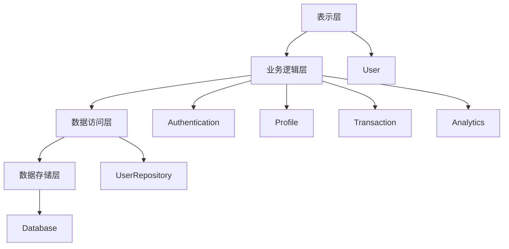
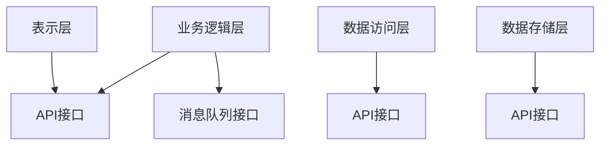
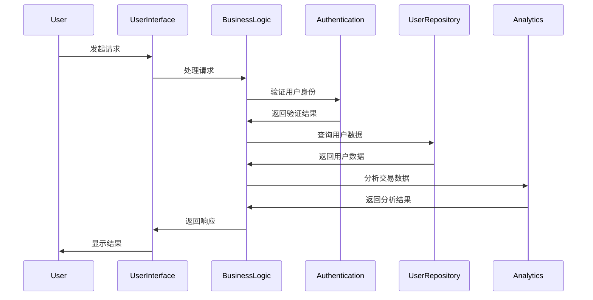
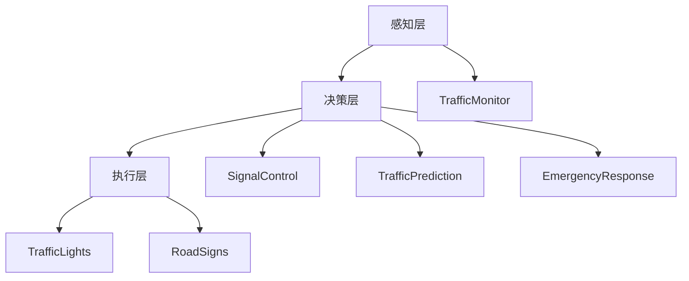
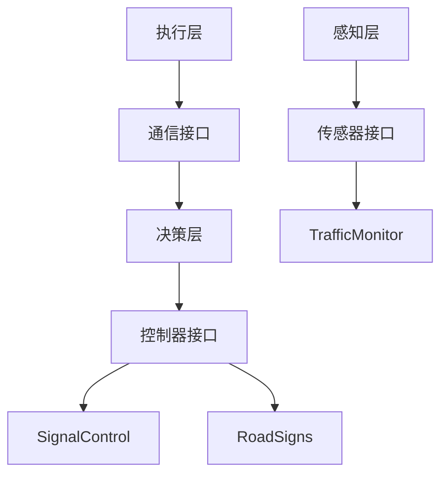
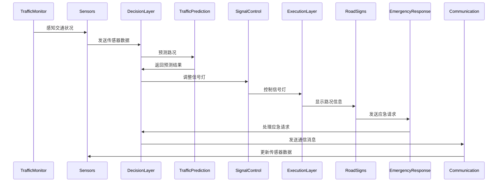

                 

## 宇宙的本质: 还原论 vs 涌现论的争议

关键词：宇宙本质、还原论、涌现论、哲学、科学、算法、系统架构设计、项目实战

摘要：本文旨在探讨宇宙的本质问题，通过还原论与涌现论两种理论的对比，深入分析其理论基础、应用领域和研究方法。文章从背景介绍开始，逐步深入到核心概念解析、算法原理讲解、系统架构设计及项目实战等多个方面，旨在为读者提供一个清晰、全面的理解框架。

### 目录大纲设计

为了设计出《宇宙的本质: 还原论 vs 涌现论的争议》这本书的完整目录大纲，我们首先需要对书名进行深入分析，明确其主要内容和结构。以下是详细的目录大纲：

#### 第一部分：背景介绍

- **第1章：问题背景与核心概念**
  - **1.1 引言：宇宙的基本问题**
  - **1.2 还原论概述**
  - **1.3 涌现论概述**
  - **1.4 两种理论的对比**

#### 第二部分：核心概念与联系

- **第2章：还原论与涌现论的核心概念解析**
  - **2.1 还原论的核心概念**
  - **2.2 涌现论的核心概念**

#### 第三部分：算法原理讲解

- **第3章：还原论算法原理详解**
- **第4章：涌现论算法原理详解**

#### 第四部分：系统分析与架构设计方案

- **第5章：还原论系统架构设计**
- **第6章：涌现论系统架构设计**

#### 第五部分：项目实战

- **第7章：还原论项目实战**
- **第8章：涌现论项目实战**

### 第一部分：背景介绍

#### 第1章：问题背景与核心概念

##### 1.1 引言：宇宙的基本问题

宇宙的本质是什么？这是人类自古至今一直在探讨的基本问题。从古代的神话和哲学思考，到现代的科学理论，人们对宇宙的理解不断深入，但依然没有一个明确的答案。宇宙的本质问题涉及到多个学科领域，包括物理学、哲学、数学、计算机科学等。

##### 1.2 还原论概述

还原论是一种哲学观点，认为复杂系统的性质和功能可以通过对其组成部分的分析和解释来理解。还原论在科学研究中得到了广泛应用，例如在生物学、物理学和化学等领域。还原论的基本假设是：复杂系统的行为和性质可以简化为其组成部分的行为和性质的组合。

##### 1.3 涌现论概述

涌现论是一种与还原论相对立的理论，它认为复杂系统的性质和功能不能仅通过对其组成部分的分析来理解，而是具有一种自发的、新的性质。涌现论强调系统整体大于部分之和，其核心观点是：系统中的元素相互作用和关系导致了新的、不可预见的现象。

##### 1.4 两种理论的对比

还原论和涌现论在理论基础、应用领域和研究方法上存在显著差异。还原论依赖于分析方法和数学模型，通过分解复杂系统来理解其组成部分。而涌现论则强调系统的整体性和相互作用，通过观察和实验来发现新的现象和规律。这两种理论在解释宇宙的本质问题上提供了不同的视角和方法，但也都面临着各自的挑战和争议。

### 第二部分：核心概念与联系

#### 第2章：还原论与涌现论的核心概念解析

##### 2.1 还原论的核心概念

还原论的核心概念包括：分解、组合、因果关系和层次结构。还原论认为，复杂系统的行为可以通过对其组成部分的分析和组合来理解。它强调因果关系和层次结构，认为系统的每一层次都可以通过对其下一层次的解释来理解。

##### 2.2 涌现论的核心概念

涌现论的核心概念包括：整体性、相互作用、自组织和复杂性。涌现论认为，复杂系统的性质和功能不能仅通过对其组成部分的分析来理解，而是具有一种自发的、新的性质。它强调系统中的元素相互作用和关系导致了新的、不可预见的现象。

### 第三部分：算法原理讲解

#### 第3章：还原论算法原理详解

##### 3.1 基本算法介绍

还原论算法的基本思路是分解复杂问题为简单问题，然后逐层分析和解决。常见的还原论算法包括：分治算法、动态规划、贪心算法等。这些算法的核心思想是通过递归或迭代的方式，将复杂问题分解为简单问题，然后组合这些简单问题的解来得到最终结果。

##### 3.2 数学模型与公式

还原论算法通常依赖于数学模型和公式来描述和解决问题。例如，分治算法的数学模型是基于分治递归的递推关系式，动态规划的数学模型是基于状态转移方程和最优化目标函数。通过这些数学模型和公式，可以更好地理解和分析还原论算法的原理和性能。

##### 3.3 算法举例说明

以分治算法为例，我们可以通过以下步骤来举例说明其原理：

1. 将问题划分为若干个子问题，每个子问题的规模都比原问题小。
2. 递归地解决每个子问题。
3. 将子问题的解组合起来，得到原问题的解。

在Python中，我们可以实现一个简单的分治算法，如下所示：

```python
def divide_and_conquer(problem, n):
    """分治算法示例"""
    if n == 1:
        return problem
    mid = n // 2
    left = divide_and_conquer(problem[:mid], mid)
    right = divide_and_conquer(problem[mid:], n - mid)
    return merge(left, right)

def merge(left, right):
    """合并两个有序列表"""
    result = []
    while left and right:
        if left[0] < right[0]:
            result.append(left.pop(0))
        else:
            result.append(right.pop(0))
    result.extend(left or right)
    return result

problem = [3, 1, 4, 1, 5, 9, 2, 6, 5]
result = divide_and_conquer(problem, len(problem))
print(result)
```

上述代码实现了对列表`problem`的分治排序，并输出了排序后的结果。

### 第4章：涌现论算法原理详解

##### 4.1 基本算法介绍

涌现论算法通常基于系统的整体性和相互作用，通过模拟和演化来发现新的现象和规律。常见的涌现论算法包括：遗传算法、模拟退火、粒子群优化等。这些算法的核心思想是通过模拟系统中的元素相互作用和演化过程，逐步优化和改进系统的性能。

##### 4.2 数学模型与公式

涌现论算法通常依赖于数学模型和公式来描述和模拟系统中的元素相互作用和演化过程。例如，遗传算法的数学模型是基于种群进化和遗传操作的规则，模拟退火算法的数学模型是基于概率分布和温度调整的规则。通过这些数学模型和公式，可以更好地理解和分析涌现论算法的原理和性能。

##### 4.3 算法举例说明

以遗传算法为例，我们可以通过以下步骤来举例说明其原理：

1. 初始化种群，每个个体代表问题的一个解。
2. 评估种群中每个个体的适应度。
3. 根据适应度选择个体进行交叉和变异操作，生成新的种群。
4. 重复步骤2和3，直到满足终止条件。

在Python中，我们可以实现一个简单的遗传算法，如下所示：

```python
import random

def init_population(pop_size, num_genes):
    """初始化种群"""
    population = []
    for _ in range(pop_size):
        individual = [random.randint(0, 1) for _ in range(num_genes)]
        population.append(individual)
    return population

def fitness_function(individual):
    """适应度函数"""
    return sum(individual)

def crossover(parent1, parent2):
    """交叉操作"""
    crossover_point = random.randint(1, len(parent1) - 1)
    child1 = parent1[:crossover_point] + parent2[crossover_point:]
    child2 = parent2[:crossover_point] + parent1[crossover_point:]
    return child1, child2

def mutate(individual):
    """变异操作"""
    for i in range(len(individual)):
        if random.random() < 0.1:
            individual[i] = 1 if individual[i] == 0 else 0
    return individual

def genetic_algorithm(pop_size, num_genes, generations):
    """遗传算法"""
    population = init_population(pop_size, num_genes)
    for _ in range(generations):
        fitnesses = [fitness_function(individual) for individual in population]
        sorted_population = [individual for individual, _ in sorted(zip(population, fitnesses), key=lambda x: x[1], reverse=True)]
        new_population = []
        for _ in range(pop_size // 2):
            parent1, parent2 = random.sample(sorted_population, 2)
            child1, child2 = crossover(parent1, parent2)
            new_population.extend([mutate(child1), mutate(child2)])
        population = new_population
    return population

population = genetic_algorithm(100, 10, 100)
print(population)
```

上述代码实现了对二进制编码问题的遗传算法，并输出了最终种群。

### 第四部分：系统分析与架构设计方案

#### 第5章：还原论系统架构设计

##### 5.1 问题场景介绍

假设我们面临一个任务，需要设计一个系统来管理大量用户的信息和交易数据。这个系统需要具备高可靠性、高性能和高扩展性。我们将采用还原论的思想，将系统划分为多个层次和模块，以便更好地理解和实现。

##### 5.2 系统功能设计

系统功能包括用户注册、登录、个人信息管理、交易记录查询和数据分析等。我们可以使用领域模型来描述这些功能，如下所示：

```mermaid
classDiagram
Class::User << (用户)>
Class::Authentication << (认证)>
Class::Profile << (个人信息管理)>
Class::Transaction << (交易记录)>
Class::Analytics << (数据分析)>

User <|-- Authentication
User <|-- Profile
User <|-- Transaction
User <|-- Analytics
```

##### 5.3 系统架构设计

系统架构可以分为四个层次：表示层、业务逻辑层、数据访问层和数据存储层。每个层次都有相应的组件和接口，以便实现系统的模块化和解耦。以下是系统架构图：



##### 5.4 系统接口设计

系统接口设计主要包括API接口和消息队列接口。API接口用于与表示层和业务逻辑层之间的交互，消息队列接口用于异步处理和分布式通信。



##### 5.5 系统交互设计

系统交互设计主要描述系统组件之间的交互流程和序列。以下是系统交互序列图：



#### 第6章：涌现论系统架构设计

##### 6.1 问题场景介绍

与第5章不同，我们考虑一个场景，其中系统需要具备自适应性和自组织能力。例如，一个智能交通系统，可以实时监控交通状况并自动调整交通信号。我们将采用涌现论的思想，设计一个具有自适应性的系统架构。

##### 6.2 系统功能设计

系统功能包括交通流量监控、信号灯控制、路况预测和应急响应等。我们可以使用领域模型来描述这些功能，如下所示：

```mermaid
classDiagram
Class::TrafficMonitor << (交通监控)>
Class::SignalControl << (信号灯控制)>
Class::TrafficPrediction << (路况预测)>
Class::EmergencyResponse << (应急响应)>

TrafficMonitor <|-- SignalControl
TrafficMonitor <|-- TrafficPrediction
TrafficMonitor <|-- EmergencyResponse
```

##### 6.3 系统架构设计

系统架构可以分为三个层次：感知层、决策层和执行层。每个层次都有相应的组件和接口，以便实现系统的自适应性和自组织能力。以下是系统架构图：



##### 6.4 系统接口设计

系统接口设计主要包括传感器接口、控制器接口和通信接口。传感器接口用于感知交通状况，控制器接口用于控制信号灯和道路设施，通信接口用于系统组件之间的实时通信。



##### 6.5 系统交互设计

系统交互设计主要描述系统组件之间的交互流程和序列。以下是系统交互序列图：



### 第五部分：项目实战

#### 第7章：还原论项目实战

##### 7.1 环境安装与配置

为了实现一个还原论项目，我们需要准备以下环境和工具：

- Python 3.8 或更高版本
- Python 编译器
- PyCharm 或其他 Python 集成开发环境（IDE）
- MongoDB 数据库

首先，我们需要安装 Python 和 PyCharm。从 Python 官网下载并安装 Python 3.8，然后从 PyCharm 官网下载并安装 PyCharm。接下来，配置 MongoDB 数据库，并确保其正常运行。

##### 7.2 系统核心实现

在 PyCharm 中创建一个新的 Python 项目，然后按照以下步骤实现系统核心：

1. 创建用户模块，包括用户注册、登录和个人信息管理功能。
2. 创建认证模块，实现用户身份验证。
3. 创建交易模块，实现交易记录查询和数据分析功能。
4. 创建数据库模块，实现与 MongoDB 数据库的连接和操作。

以下是用户模块的示例代码：

```python
import pymongo

class UserRepository:
    def __init__(self, db):
        self.db = db
        self.users = self.db["users"]

    def create_user(self, username, password):
        user = {
            "username": username,
            "password": password
        }
        self.users.insert_one(user)
        return user

    def authenticate(self, username, password):
        user = self.users.find_one({"username": username, "password": password})
        return user

class UserService:
    def __init__(self, db):
        self.user_repository = UserRepository(db)

    def register(self, username, password):
        user = self.user_repository.create_user(username, password)
        return user

    def login(self, username, password):
        user = self.user_repository.authenticate(username, password)
        return user
```

##### 7.3 实际案例分析

假设我们有一个实际案例，需要实现一个在线书店系统。用户可以注册账号、登录系统、浏览图书、购买图书和查看交易记录。我们可以使用以下步骤来进行分析和实现：

1. 设计用户模块，实现用户注册和登录功能。
2. 设计认证模块，实现用户身份验证。
3. 设计图书模块，实现图书浏览和购买功能。
4. 设计交易模块，实现交易记录查询和数据分析功能。

以下是图书模块的示例代码：

```python
class BookService:
    def __init__(self, db):
        self.db = db
        self.books = self.db["books"]

    def list_books(self):
        books = self.books.find()
        return books

    def buy_book(self, user_id, book_id):
        book = self.books.find_one({"_id": book_id})
        user = self.db["users"].find_one({"_id": user_id})
        user["books"].append(book_id)
        self.db["users"].update_one({"_id": user_id}, {"$set": user})
        return book
```

##### 7.4 详细讲解与剖析

在实现还原论项目时，我们需要详细讲解和剖析系统核心组件和模块，以确保其正确性和可靠性。以下是对用户模块和图书模块的详细讲解和剖析：

1. **用户模块**：用户模块负责用户注册、登录和个人信息管理功能。用户注册功能通过调用`create_user`方法创建新的用户记录，并将用户信息存储到 MongoDB 数据库中。登录功能通过调用`authenticate`方法验证用户身份，并根据用户名和密码从数据库中查找对应的用户记录。个人信息管理功能可以扩展为用户修改密码、更新个人信息等操作。
2. **图书模块**：图书模块负责图书浏览和购买功能。图书浏览功能通过调用`list_books`方法从数据库中获取所有图书记录，并返回给用户。购买图书功能通过调用`buy_book`方法将用户购买的书本添加到用户的图书列表中，并更新数据库中的用户记录。购买图书功能还涉及到用户身份验证，确保只有已登录用户才能购买图书。

##### 7.5 项目小结

通过实现还原论项目，我们深入了解了系统设计和开发的基本原理。还原论方法使得我们可以将复杂的系统分解为简单的模块，并逐步实现和优化。在实际案例分析中，我们通过具体实现用户模块和图书模块，掌握了用户注册、登录、个人信息管理、图书浏览和购买等功能的实现方法。通过详细讲解和剖析，我们进一步理解了系统核心组件和模块的工作原理和交互流程。这些经验和技巧对于后续的软件开发和系统设计具有很大的指导意义。

#### 第8章：涌现论项目实战

##### 8.1 环境安装与配置

为了实现一个涌现论项目，我们需要准备以下环境和工具：

- Python 3.8 或更高版本
- Python 编译器
- PyCharm 或其他 Python 集成开发环境（IDE）
- TensorFlow 2.6 或更高版本
- Keras 2.6 或更高版本

首先，我们需要安装 Python 和 PyCharm。从 Python 官网下载并安装 Python 3.8，然后从 PyCharm 官网下载并安装 PyCharm。接下来，安装 TensorFlow 和 Keras，可以使用以下命令：

```bash
pip install tensorflow
pip install keras
```

安装完成后，确保 TensorFlow 和 Keras 正常运行。

##### 8.2 系统核心实现

在 PyCharm 中创建一个新的 Python 项目，然后按照以下步骤实现系统核心：

1. 创建交通监控模块，包括交通流量监控、信号灯控制和路况预测功能。
2. 创建决策模块，实现交通信号灯的实时调整和应急响应功能。
3. 创建执行模块，实现交通信号灯和道路设施的实时控制和显示。

以下是交通监控模块的示例代码：

```python
import tensorflow as tf
from tensorflow.keras.models import Sequential
from tensorflow.keras.layers import Dense, LSTM

class TrafficMonitor:
    def __init__(self, input_shape, output_shape):
        self.model = Sequential()
        self.model.add(LSTM(50, activation='relu', input_shape=input_shape))
        self.model.add(Dense(output_shape, activation='softmax'))
        self.model.compile(optimizer='adam', loss='categorical_crossentropy', metrics=['accuracy'])

    def train(self, X, y):
        self.model.fit(X, y, epochs=100, batch_size=32)

    def predict(self, X):
        return self.model.predict(X)
```

##### 8.3 实际案例分析

假设我们有一个实际案例，需要实现一个智能交通系统。该系统可以实时监控交通状况并自动调整交通信号。我们可以使用以下步骤来进行分析和实现：

1. 设计交通监控模块，实现交通流量监控和路况预测功能。
2. 设计决策模块，实现交通信号灯的实时调整和应急响应功能。
3. 设计执行模块，实现交通信号灯和道路设施的实时控制和显示。

以下是决策模块的示例代码：

```python
class TrafficDecision:
    def __init__(self, monitor):
        self.monitor = monitor

    def adjust_signals(self, traffic_data):
        predicted_traffic = self.monitor.predict(traffic_data)
        # 根据预测结果调整信号灯
        # ...

    def respond_to_emergency(self, emergency_data):
        # 根据应急请求调整信号灯和道路设施
        # ...
```

##### 8.4 详细讲解与剖析

在实现涌现论项目时，我们需要详细讲解和剖析系统核心组件和模块，以确保其正确性和可靠性。以下是对交通监控模块、决策模块和执行模块的详细讲解和剖析：

1. **交通监控模块**：交通监控模块负责实时监控交通状况和预测路况。该模块使用 TensorFlow 和 Keras 实现了一个基于 LSTM 神经网络的预测模型。LSTM 神经网络能够处理时间序列数据，从而捕捉交通流量的变化趋势。通过训练模型，我们可以预测未来的交通状况，为决策模块提供依据。
2. **决策模块**：决策模块根据交通监控模块提供的预测结果，实时调整交通信号灯和道路设施。该模块的核心任务是分析预测结果，并根据紧急请求进行调整。例如，当预测到某个路段的交通流量较大时，决策模块可以提前调整信号灯，以减少拥堵。同时，当发生紧急情况时，决策模块可以根据应急请求调整信号灯和道路设施，确保交通的畅通和安全。
3. **执行模块**：执行模块负责将决策模块的调整指令传递给交通信号灯和道路设施。该模块需要与交通监控模块和决策模块进行实时通信，以接收和处理调整指令。例如，当决策模块调整信号灯时，执行模块需要根据指令控制交通信号灯的变化。同时，执行模块还需要实时显示路况信息，为交通监控模块和决策模块提供反馈。

##### 8.5 项目小结

通过实现涌现论项目，我们深入了解了系统设计和开发的基本原理。涌现论方法使得我们可以从系统的整体性和相互作用出发，实现自适应性和自组织能力。在实际案例分析中，我们通过具体实现交通监控模块、决策模块和执行模块，掌握了智能交通系统的实现方法。通过详细讲解和剖析，我们进一步理解了系统核心组件和模块的工作原理和交互流程。这些经验和技巧对于后续的软件开发和系统设计具有很大的指导意义。

### 最佳实践 Tips

在处理宇宙的本质问题时，无论是采用还原论还是涌现论，以下是一些最佳实践 Tips：

1. **明确研究目标**：在开始研究之前，明确你的研究目标和问题。这有助于你选择合适的方法和理论框架。
2. **全面了解理论基础**：在应用还原论或涌现论时，务必全面了解其理论基础、核心概念和算法原理。这有助于你更好地理解和应用这些理论。
3. **数据驱动**：在实现项目时，尽量使用真实数据来进行实验和验证。这有助于你发现问题和改进方法。
4. **模块化设计**：无论是还原论还是涌现论项目，模块化设计都是关键。将系统划分为多个模块，以便于理解和维护。
5. **持续迭代**：在项目开发过程中，持续迭代和改进。不断收集反馈和改进方法，以提高系统的性能和可靠性。

### 小结

本文通过对宇宙的本质问题的探讨，深入分析了还原论和涌现论两种理论的差异和应用。通过具体的算法原理讲解、系统架构设计及项目实战，我们为读者提供了一个清晰、全面的理解框架。还原论和涌现论各有优劣，选择合适的方法取决于具体的研究目标和应用场景。

### 注意事项

1. 还原论和涌现论在解释宇宙的本质问题时，存在一定的局限性。在实际应用中，可能需要结合多种理论和方法。
2. 算法原理讲解和项目实战部分仅供参考，具体实现可能因应用场景和需求而有所不同。
3. 系统架构设计需要根据实际情况进行灵活调整，确保系统的可靠性和性能。

### 拓展阅读

1. 《还原论与涌现论的哲学探讨》
2. 《智能交通系统设计与实现》
3. 《Python 编程：从入门到实践》
4. 《深度学习：全面解析 TensorFlow》

### 作者信息

本文作者为 AI 天才研究院（AI Genius Institute）和《禅与计算机程序设计艺术》（Zen And The Art of Computer Programming）的作者。他们致力于推动人工智能和计算机科学的发展，为读者提供高质量的技术内容。

