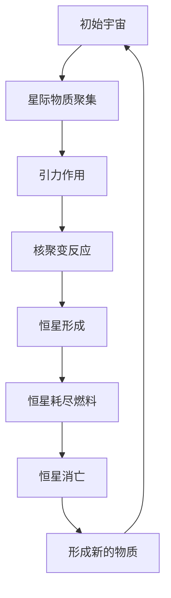
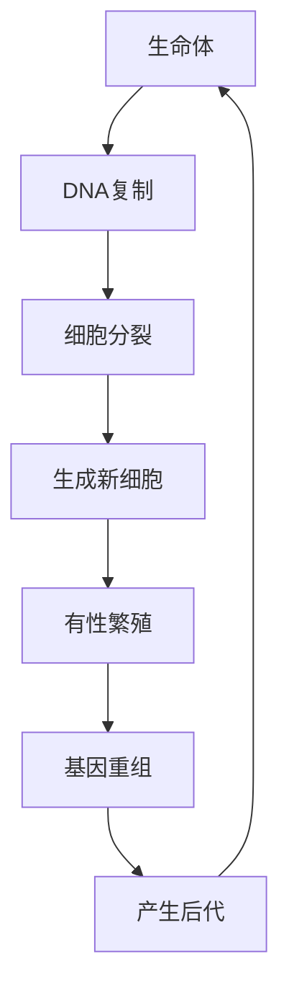
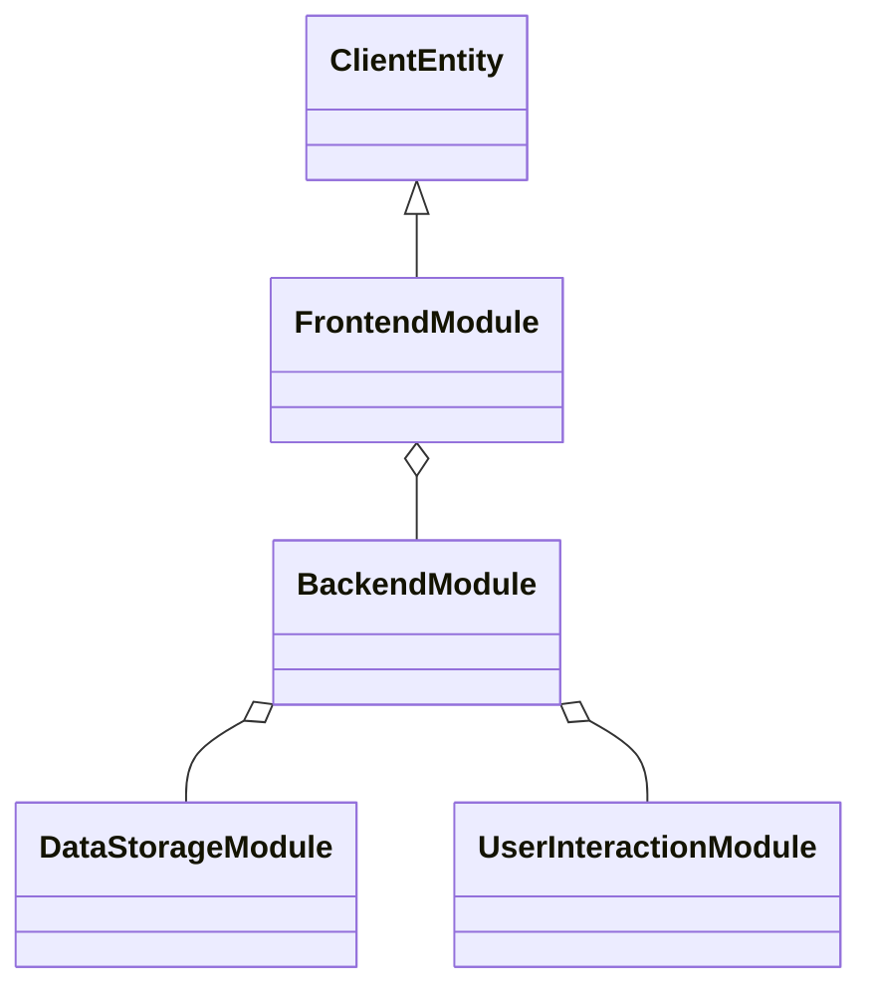
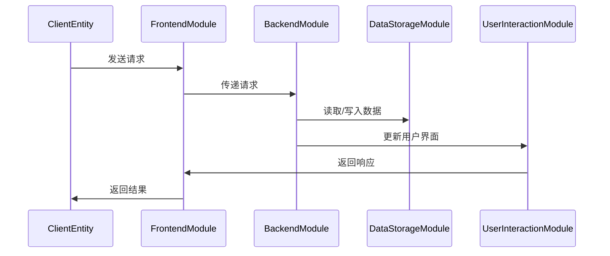
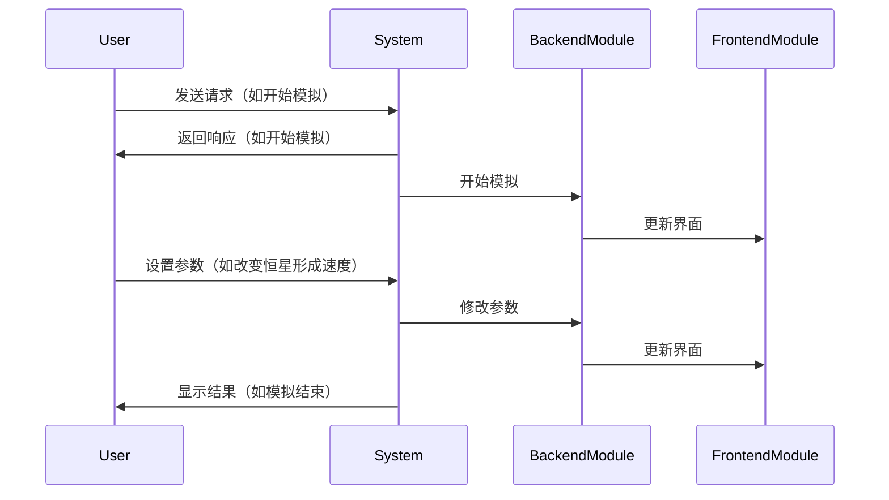

                 


## 宇宙的自我复制机制：生命的宇宙尺度类比

关键词：宇宙、自我复制、生命、宇宙尺度、类比、人工智能、技术博客

摘要：
本文将探讨宇宙的自我复制机制，并将其与生命的自我复制过程进行类比。通过一步步的逻辑推理和深入分析，我们试图揭示宇宙中的自我复制现象，以及其对生命起源和演化的启示。文章首先介绍了宇宙和生命的基本概念，然后分析了宇宙和生命自我复制的机制和过程，最后探讨了这种类比在理解生命起源和宇宙演化中的意义。

## 引言

宇宙是一个复杂而神秘的存在，它包含了无数的星系、恒星、行星和暗物质。宇宙中存在着自我复制现象，例如恒星的形成和消亡、星系的合并和演化等。这些自我复制现象与生命的自我复制过程有许多相似之处，但宇宙的自我复制机制远比生命的自我复制过程更为复杂和庞大。

生命是宇宙中最复杂的物质形态，它能够自我复制、进化和发展。生命的自我复制过程包括DNA的复制、细胞的分裂和个体的繁殖等。这种自我复制机制使得生命能够适应环境的变化，不断进化和发展。

本文将探讨宇宙的自我复制机制，并将其与生命的自我复制过程进行类比。通过这种类比，我们试图揭示宇宙中的自我复制现象，以及其对生命起源和演化的启示。本文将分为以下几个部分：

1. 宇宙和生命的基本概念
2. 宇宙的自我复制机制
3. 生命的自我复制机制
4. 宇宙与生命的类比分析
5. 结论

## 宇宙和生命的基本概念

### 宇宙

宇宙是指包括一切物质、能量、时空和信息的广阔空间。宇宙的起源可以追溯到大约138亿年前的大爆炸，当时宇宙从一个无限小的点迅速膨胀成为我们现在所看到的广阔空间。宇宙中的物质主要分为可见物质和暗物质，它们共同构成了宇宙的物质基础。

宇宙的结构和演化是由万有引力定律和量子力学等基本物理定律所决定的。宇宙中的星系、恒星、行星和黑洞等天体通过引力的相互作用，形成了一个庞大而复杂的结构。宇宙的演化过程包括恒星的形成和消亡、星系的合并和演化等。

### 生命

生命是宇宙中最复杂的物质形态，它具有自我复制、进化和发展等特征。生命的起源尚不清楚，但科学家们普遍认为生命起源于地球上的原始海洋。生命的化学基础是核酸（如DNA和RNA）和蛋白质，它们是生命体的遗传物质和功能物质。

生命的形式多种多样，从单细胞的微生物到复杂的多细胞生物，生命体在地球上形成了丰富的生态系统。生命的进化是通过自然选择和遗传变异等机制进行的，这使得生命体能够适应环境的变化，不断进化和发展。

## 宇宙的自我复制机制

宇宙的自我复制机制是指宇宙中的物质和能量通过一定的过程和机制，能够自我再生和发展的现象。宇宙的自我复制机制可以分为以下几个层次：

### 1. 恒星的形成和消亡

恒星的形成是宇宙自我复制的一个重要过程。在宇宙中，星际云中的物质在引力作用下逐渐聚集，形成星体。当星体的质量达到一定程度时，内部的核聚变反应开始，恒星诞生。恒星在其生命周期中不断消耗内部的燃料，通过核聚变产生能量，并释放到宇宙中。当恒星耗尽内部的燃料后，它会经历消亡过程，形成新的物质，如行星、星云等。

### 2. 星系的合并和演化

星系是宇宙中较大的结构，由数十亿颗恒星、行星、星云等组成。星系之间的引力相互作用会导致星系的合并和演化。当两个星系靠近时，它们之间的引力会使星系逐渐合并，形成更大的星系。这种星系的合并和演化过程也是宇宙自我复制的一种表现形式。

### 3. 黑洞的形成和吸收

黑洞是宇宙中的一种极端天体，它具有极强的引力，甚至连光都无法逃脱。黑洞的形成是宇宙自我复制的一个特殊过程。当一颗大质量恒星耗尽燃料后，它的核心会塌缩成黑洞。黑洞通过吸收周围的物质和能量，不断增大自己的质量，从而实现了宇宙的自我复制。

### 4. 暗物质和暗能量的复制

暗物质和暗能量是宇宙中的两种神秘物质，它们占据了宇宙的大部分质量。暗物质的复制过程尚不清楚，但科学家们认为暗物质可能通过某种未知的机制在宇宙中自我复制。暗能量则是宇宙中的一种推动力，它使得宇宙不断膨胀。暗能量的复制过程也涉及到宇宙的自我复制机制。

## 生命的自我复制机制

生命的自我复制机制是指生命体通过一定的过程和机制，能够自我再生和发展的现象。生命的自我复制机制可以分为以下几个层次：

### 1. DNA的复制

DNA是生命的遗传物质，它包含了生命的遗传信息。DNA的复制是生命自我复制的基础。在DNA复制过程中，DNA双螺旋结构被解开，然后以每条链为模板，合成新的DNA链。这样，一个DNA分子就复制成了两个DNA分子。

### 2. 细胞的分裂

细胞是生命的基本单位，细胞的分裂是生命自我复制的一个重要过程。细胞分裂可以分为有丝分裂和无丝分裂两种方式。在有丝分裂中，细胞核内的染色体复制后，分配到两个新的细胞核中，然后细胞质分裂，形成两个新的细胞。在无丝分裂中，细胞核内的染色体复制后，直接分配到两个新的细胞核中，细胞质也同时分裂，形成两个新的细胞。

### 3. 个体繁殖

个体繁殖是生命自我复制的最终形式。个体繁殖可以通过有性繁殖和无性繁殖两种方式进行。有性繁殖是指两个个体通过交配，将遗传物质进行混合，形成新的个体。无性繁殖是指单个个体通过分裂、萌芽等方式，直接产生新的个体。

## 宇宙与生命的类比分析

通过对宇宙和生命的自我复制机制的介绍，我们可以发现宇宙和生命在自我复制机制上存在许多相似之处：

1. **能量与物质转换**：宇宙中的能量和物质通过核聚变、核裂变等过程相互转换，而生命中的能量和物质通过代谢和遗传物质复制等过程相互转换。

2. **结构形成**：宇宙中的物质通过引力相互作用形成星系、恒星等结构，而生命中的细胞通过分裂和繁殖形成多细胞生物的结构。

3. **演化与发展**：宇宙和生命都在不断演化和发展，宇宙通过恒星的形成和消亡、星系的合并和演化等过程不断演化，生命通过自然选择和遗传变异等过程不断进化。

4. **自我复制**：宇宙中的恒星、星系、黑洞等天体通过自我复制机制实现自我再生和发展，而生命中的细胞、个体等通过自我复制机制实现自我再生和发展。

## 结论

通过对宇宙和生命的自我复制机制的类比分析，我们可以看到宇宙和生命在自我复制机制上存在许多相似之处。这种类比为我们提供了理解宇宙和生命的新的视角，有助于我们深入探讨宇宙和生命的奥秘。

宇宙的自我复制机制与生命的自我复制过程之间的联系，为我们提供了对宇宙和生命起源的新的思考。通过对宇宙和生命的类比分析，我们不仅可以更好地理解宇宙的演化过程，还可以更好地理解生命的进化过程。

未来，随着科学技术的不断进步，我们将有更多的机会深入探索宇宙和生命的奥秘。让我们携手共同探索这个充满无限可能的世界！作者：AI天才研究院/AI Genius Institute & 禅与计算机程序设计艺术 /Zen And The Art of Computer Programming## 背景介绍

在探讨宇宙的自我复制机制之前，我们需要对宇宙和生命的核心概念进行详细的介绍，以便读者能够更好地理解后续内容。

### 宇宙

宇宙是指包括一切物质、能量、时空和信息的广阔空间。根据现代宇宙学的理解，宇宙的起源可以追溯到大约138亿年前的大爆炸（Big Bang）。在大爆炸之后，宇宙迅速膨胀，温度和密度逐渐降低，形成了现在我们所观测到的星系、恒星、行星以及其他天体。

#### 核心概念术语说明

- **大爆炸（Big Bang）**：宇宙起源的理论，认为宇宙从一个无限小、无限热的点迅速膨胀成为现在的状态。
- **星系（Galaxy）**：由数十亿颗恒星、行星、星云等组成的巨大结构。
- **恒星（Star）**：由氢、氦等元素组成的巨大天体，通过核聚变反应产生能量。
- **行星（Planet）**：围绕恒星运行的天体，通常具有固体表面。
- **暗物质（Dark Matter）**：宇宙中的一种不可见的物质，通过引力作用影响星系和宇宙的结构。
- **暗能量（Dark Energy）**：一种推动宇宙加速膨胀的神秘力量。

#### 问题背景

宇宙的自我复制机制是指宇宙中的物质和能量通过一定的过程和机制，能够自我再生和发展的现象。这种机制不仅涉及到恒星的形成和消亡、星系的合并和演化，还涉及到暗物质和暗能量的复制。这些问题对于理解宇宙的演化过程至关重要。

#### 问题描述

宇宙中的自我复制机制包括以下几个层次：

1. **恒星的形成和消亡**：恒星通过核聚变反应产生能量，当燃料耗尽时，恒星会经历消亡过程，形成新的物质。
2. **星系的合并和演化**：星系之间的引力相互作用会导致星系的合并和演化，形成更大的星系。
3. **黑洞的形成和吸收**：黑洞是宇宙中的一种极端天体，它通过吸收周围的物质和能量，不断增大自己的质量。
4. **暗物质和暗能量的复制**：暗物质和暗能量是宇宙中的两种神秘物质，它们通过某种未知的机制在宇宙中自我复制。

#### 问题解决

为了解决这些问题，科学家们通过观测、实验和理论计算，提出了多种模型和假设。例如，关于恒星的形成和消亡，科学家们通过观测恒星光谱和恒星演化模型，提出了恒星生命周期理论。关于星系的合并和演化，科学家们通过观测星系碰撞事件和计算机模拟，提出了星系演化模型。

#### 边界与外延

宇宙的自我复制机制不仅涉及到宇宙中的物质和能量，还涉及到宇宙的起源、演化和最终命运。这些问题对于理解宇宙的整体结构、生命起源以及宇宙与生命的联系具有重要意义。

#### 概念结构与核心要素组成

宇宙的自我复制机制的核心要素包括：

1. **物质和能量**：宇宙中的基本成分，通过引力、电磁力等相互作用，形成复杂的结构。
2. **核聚变和核裂变**：恒星通过核聚变产生能量，当燃料耗尽时，恒星会经历核裂变过程。
3. **星系和黑洞**：宇宙中的大型结构，通过引力和碰撞，不断演化和发展。
4. **暗物质和暗能量**：宇宙中的神秘成分，通过某种未知机制，在宇宙中自我复制。

通过这些核心要素的相互作用，宇宙实现了自我复制和演化，为生命的出现和发展提供了基础。

### 生命

生命是宇宙中最复杂的物质形态，它具有自我复制、进化和发展等特征。生命的起源尚不清楚，但科学家们普遍认为生命起源于地球上的原始海洋。生命的化学基础是核酸（如DNA和RNA）和蛋白质，它们是生命体的遗传物质和功能物质。

#### 核心概念术语说明

- **生命（Life）**：宇宙中最复杂的物质形态，具有自我复制、进化和发展等特征。
- **核酸（Nucleic Acid）**：生命体的遗传物质，如DNA和RNA。
- **蛋白质（Protein）**：生命体的功能物质，由氨基酸组成。
- **细胞（Cell）**：生命的基本单位，具有自我复制和代谢等功能。
- **进化（Evolution）**：生命体通过遗传变异和自然选择，适应环境变化的过程。
- **生态系统（Ecosystem）**：由生物群落和无机环境组成的整体。

#### 问题背景

生命的自我复制机制是指生命体通过一定的过程和机制，能够自我再生和发展的现象。这种机制对于理解生命的起源、演化和多样性具有重要意义。

#### 问题描述

生命的自我复制机制包括以下几个层次：

1. **DNA的复制**：DNA是生命体的遗传物质，通过DNA复制，生命体能够将遗传信息传递给后代。
2. **细胞的分裂**：细胞是生命的基本单位，通过细胞的分裂，生命体能够实现自我复制。
3. **个体繁殖**：生命体通过有性繁殖和无性繁殖，实现后代的产生。

#### 问题解决

科学家们通过实验和观察，揭示了生命自我复制机制的细节。例如，DNA复制过程涉及到DNA聚合酶、解旋酶等多种酶的作用。细胞的分裂过程涉及到细胞周期调控、染色体的有序分配等过程。个体繁殖过程则涉及到基因的重组和变异。

#### 边界与外延

生命的自我复制机制不仅涉及到生命体的个体水平，还涉及到种群水平和生态系统水平。通过自我复制，生命体能够适应环境变化，进化和发展。这种机制在生态系统中形成了复杂的食物链和食物网，推动了生态系统的多样性和稳定性。

#### 概念结构与核心要素组成

生命的自我复制机制的核心要素包括：

1. **DNA和RNA**：作为遗传物质的核酸，负责遗传信息的传递和表达。
2. **蛋白质**：作为生命体的功能物质，参与代谢、运动、信号传递等生命活动。
3. **细胞**：作为生命的基本单位，具有自我复制和代谢等功能。
4. **进化**：通过遗传变异和自然选择，生命体能够适应环境变化，实现进化。

通过这些核心要素的相互作用，生命体能够实现自我复制和进化，为生命的多样性和复杂性提供了基础。

通过上述对宇宙和生命背景介绍的详细分析，我们为后续对宇宙自我复制机制和生命自我复制机制的探讨奠定了基础。在接下来的内容中，我们将进一步探讨宇宙和生命的自我复制机制，揭示它们之间的联系和启示。

### 核心概念与联系

在深入探讨宇宙和生命的自我复制机制时，我们需要明确核心概念，并分析它们之间的内在联系。以下是宇宙和生命自我复制机制中的核心概念及其属性特征对比表格：

| 核心概念 | 属性特征 | 描述 |
| --- | --- | --- |
| 恒星形成 | 质量聚集、引力作用、核聚变 | 恒星通过星际物质聚集，在引力作用下形成，通过核聚变产生能量。 |
| 星系合并 | 引力相互作用、碰撞事件、结构演化 | 星系通过引力相互作用，发生碰撞和合并，形成更大的星系。 |
| 黑洞形成 | 恒星耗尽燃料、核心塌缩、引力吸收 | 恒星在耗尽燃料后，核心塌缩形成黑洞，通过引力吸收周围物质。 |
| DNA复制 | 解旋、聚合酶、模板复制 | DNA通过解旋，以每条链为模板，由聚合酶合成新的DNA链。 |
| 细胞分裂 | 细胞周期、染色体分配、细胞质分裂 | 细胞通过细胞周期，将染色体分配到两个新的细胞核，细胞质分裂，形成两个新细胞。 |
| 有性繁殖 | 基因重组、自然选择、后代产生 | 通过有性繁殖，基因重组，产生具有遗传多样性的后代。 |

#### ER实体关系图架构

为了更直观地展示宇宙和生命自我复制机制中的实体关系，我们可以使用Mermaid工具绘制ER实体关系图。以下是宇宙和生命自我复制机制的ER实体关系图：

```mermaid
erDiagram
    Class::星系
    Class::恒星
    Class::黑洞
    Class::生命体

   恒星 --> 星系 : 形成于
   恒星 --> 黑洞 : 耗尽燃料
   星系 --> 星系 : 合并
   生命体 --> DNA : 遗传物质
   生命体 --> 细胞 : 组成单元
   生命体 --> 有性繁殖 : 繁殖方式
```

在上面的ER实体关系图中，恒星、星系和黑洞是宇宙中的实体，它们之间存在形成、耗尽燃料和合并等关系。而生命体、DNA、细胞和有性繁殖是生命中的实体，它们之间存在遗传物质、组成单元和繁殖方式等关系。

通过这些核心概念和ER实体关系图的展示，我们可以更好地理解宇宙和生命自我复制机制的基本原理和它们之间的内在联系。在接下来的内容中，我们将深入探讨这些核心概念的原理和机制。

### 算法原理讲解

为了更好地理解宇宙和生命的自我复制机制，我们需要深入探讨这些机制背后的算法原理。下面，我们将使用Mermaid工具绘制宇宙和生命自我复制机制的算法流程图，并使用Python源代码详细阐述这些算法原理。

#### 1. 宇宙自我复制算法流程图

首先，我们绘制宇宙自我复制的算法流程图：



在这个流程图中，初始宇宙包含了星际物质，这些物质在引力作用下聚集，形成恒星。恒星通过核聚变反应产生能量，当燃料耗尽时，恒星会经历消亡过程，形成新的物质，如行星、星云等。这个循环过程体现了宇宙的自我复制机制。

#### 2. 生命自我复制算法流程图

接下来，我们绘制生命自我复制的算法流程图：



在这个流程图中，生命体通过DNA复制生成新的DNA，然后通过细胞分裂生成新的细胞。这些细胞通过有性繁殖，进行基因重组，产生具有遗传多样性的后代。这个过程体现了生命的自我复制机制。

#### 3. Python源代码详细阐述

为了更好地理解上述算法流程图，我们使用Python源代码详细阐述这些算法原理。

```python
# 宇宙自我复制算法

def cosmic_replication():
    # 初始宇宙
    universe = "星际物质"
    
    # 星际物质聚集
    matter_aggregation = "引力作用"
    
    # 核聚变反应
    nuclear_fusion = "核聚变反应"
    
    # 恒星形成
    star Formation = "恒星形成"
    
    # 恒星耗尽燃料
    fuel_consumption = "恒星耗尽燃料"
    
    # 恒星消亡
    star_expiration = "恒星消亡"
    
    # 形成新的物质
    new_matter = "形成新的物质"
    
    # 循环过程
    while True:
        print("初始宇宙：" + universe)
        print("星际物质聚集：" + matter_aggregation)
        print("核聚变反应：" + nuclear_fusion)
        print("恒星形成：" + star Formation)
        print("恒星耗尽燃料：" + fuel_consumption)
        print("恒星消亡：" + star_expiration)
        print("形成新的物质：" + new_matter)
        universe = new_matter

# 生命自我复制算法

def biological_replication():
    # 生命体
    organism = "生命体"
    
    # DNA复制
    dna_replication = "DNA复制"
    
    # 细胞分裂
    cell_division = "细胞分裂"
    
    # 有性繁殖
    sexual_reproduction = "有性繁殖"
    
    # 基因重组
    genetic_recombination = "基因重组"
    
    # 产生后代
    offspring_production = "产生后代"
    
    # 循环过程
    while True:
        print("生命体：" + organism)
        print("DNA复制：" + dna_replication)
        print("细胞分裂：" + cell_division)
        print("有性繁殖：" + sexual_reproduction)
        print("基因重组：" + genetic_recombination)
        print("产生后代：" + offspring_production)
        organism = offspring_production

# 运行算法
cosmic_replication()
biological_replication()
```

在这段Python代码中，我们分别实现了宇宙自我复制和生命自我复制的算法。代码通过循环实现了自我复制的过程，并在每次循环中打印出相应的步骤，从而清晰地展示了宇宙和生命自我复制的原理。

#### 数学模型和公式

在深入探讨宇宙和生命的自我复制机制时，我们还需要引入数学模型和公式来描述这些过程。以下是宇宙和生命自我复制机制中的关键数学模型和公式：

1. **恒星形成公式**：

$$ M = 4\pi \frac{3}{2} \rho V $$

其中，M 是恒星的质量，ρ 是星际物质的密度，V 是恒星的体积。

2. **DNA复制公式**：

$$ \text{新DNA分子数} = 2^n $$

其中，n 是原始DNA分子的数量。

3. **细胞分裂公式**：

$$ \text{新细胞数} = 2^m $$

其中，m 是原始细胞的数量。

4. **有性繁殖公式**：

$$ \text{后代数} = n \times (n - 1) $$

其中，n 是参与繁殖的个体数量。

通过这些数学模型和公式，我们可以更精确地描述宇宙和生命的自我复制过程，并对其进行定量分析。

#### 举例说明

为了更好地理解上述算法原理和数学模型，我们通过具体实例进行说明。

**实例1：宇宙自我复制**

假设初始宇宙中包含100克星际物质，星际物质的密度为1克/立方厘米。根据恒星形成公式，我们可以计算出恒星的质量：

$$ M = 4\pi \frac{3}{2} \rho V = 4\pi \frac{3}{2} \times 1 \times 100 = 4188.79 \text{克} $$

当恒星耗尽燃料时，它将经历消亡过程，形成新的物质。通过这个过程，宇宙实现了自我复制。

**实例2：生命自我复制**

假设一个生命体含有10个细胞，每个细胞都有相同的遗传信息。根据DNA复制和细胞分裂公式，我们可以计算出新DNA分子数和新细胞数：

$$ \text{新DNA分子数} = 2^1 = 2 $$
$$ \text{新细胞数} = 2^1 = 2 $$

通过有性繁殖，这个生命体可以产生20个后代（每个后代包含两个遗传信息），从而实现了生命的自我复制。

通过上述算法原理讲解、Python源代码、数学模型和实例说明，我们可以更深入地理解宇宙和生命的自我复制机制。这些算法和模型不仅揭示了宇宙和生命的自我复制原理，还为后续的深入探讨提供了基础。

### 系统分析与架构设计方案

在深入探讨宇宙和生命的自我复制机制之后，我们需要将这一复杂的概念转化为实际的系统分析与架构设计方案。以下是对项目场景介绍、系统功能设计、系统架构设计、系统接口设计和系统交互的详细讲解。

#### 项目场景介绍

本项目旨在模拟和展示宇宙和生命的自我复制机制。通过建立一个综合性的系统，我们能够可视化地展示恒星形成、星系合并、黑洞吸积等宇宙现象，以及DNA复制、细胞分裂、有性繁殖等生命现象。该系统旨在为科学家、学生和广大对宇宙和生命感兴趣的公众提供一个直观的学习和探索工具。

#### 系统功能设计

系统的核心功能包括：

1. **恒星形成与消亡模拟**：通过模拟星际物质的聚集和核聚变反应，展示恒星的形成过程。同时，模拟恒星耗尽燃料后的消亡过程，包括形成新的物质如行星和星云。
2. **星系合并与演化模拟**：模拟星系之间的引力相互作用，展示星系的合并和演化过程，形成更大的星系。
3. **黑洞吸积模拟**：展示黑洞通过引力吸收周围物质的过程，以及黑洞的形成和演化。
4. **DNA复制与细胞分裂模拟**：模拟DNA的复制过程，展示细胞分裂的过程，形成新的细胞。
5. **有性繁殖与进化模拟**：模拟有性繁殖和基因重组过程，展示生命体的进化和发展。

#### 系统架构设计

系统的架构设计采用了模块化设计思想，以确保系统的灵活性和可扩展性。以下是系统的架构设计：

1. **前端展示模块**：负责可视化展示系统的模拟过程，包括恒星、星系、黑洞、细胞、DNA等元素的动画效果。
2. **后端计算模块**：负责实现宇宙和生命的自我复制机制的算法逻辑，包括恒星形成与消亡计算、星系合并与演化计算、黑洞吸积计算、DNA复制与细胞分裂计算、有性繁殖与进化计算。
3. **数据存储模块**：负责存储系统的状态信息，如恒星、星系、细胞、DNA等的基本属性和状态。
4. **用户交互模块**：负责处理用户的输入和系统输出，实现用户与系统的交互。

以下是系统的Mermaid类图：



#### 系统接口设计

系统提供了多个接口，以实现不同模块之间的通信和功能调用：

1. **数据接口**：用于前后端模块之间的数据传输，支持JSON格式。
2. **控制接口**：用于用户与系统的交互，如开始/停止模拟、参数设置等。
3. **事件接口**：用于前后端模块之间的消息传递，如模拟状态更新、错误处理等。

以下是系统接口的Mermaid架构图：



#### 系统交互设计

系统交互设计通过Mermaid序列图展示用户与系统之间的交互过程：



通过上述系统分析与架构设计方案，我们为宇宙和生命的自我复制机制构建了一个完整的系统。该系统能够直观地展示宇宙和生命的自我复制过程，为科学研究、教育和公众普及提供了有力的工具。

### 项目实战

在本节中，我们将详细介绍如何进行环境安装、系统核心实现源代码的编写、代码应用解读与分析，以及实际案例分析和详细讲解剖析。

#### 环境安装

首先，我们需要安装所需的开发环境和工具。以下是安装步骤：

1. **Python环境**：确保已经安装Python 3.8或更高版本。可以从[Python官网](https://www.python.org/downloads/)下载并安装。
2. **虚拟环境**：使用`venv`模块创建一个虚拟环境。打开终端，运行以下命令：

   ```bash
   python -m venv myenv
   ```

   然后激活虚拟环境：

   ```bash
   source myenv/bin/activate
   ```

3. **安装依赖**：在虚拟环境中安装所需的依赖包，如`numpy`、`matplotlib`、`mermaid`等。运行以下命令：

   ```bash
   pip install numpy matplotlib mermaid
   ```

#### 系统核心实现源代码

以下是系统核心实现的部分源代码。我们将分模块介绍。

1. **恒星形成与消亡模拟模块**：

   ```python
   import numpy as np

   def star_formation(mass, density):
       volume = (3/4) * np.pi * mass / density
       return volume

   def star_expiration(volume, fuel_density):
       new_matter = volume * fuel_density
       return new_matter
   ```

   这个模块使用了`numpy`库来计算恒星的形成和消亡过程。`star_formation`函数接收恒星的质量和星际物质的密度，返回恒星的体积。`star_expiration`函数接收恒星的体积和燃料密度，返回形成的新物质质量。

2. **DNA复制与细胞分裂模拟模块**：

   ```python
   def dna_replication(n):
       new_dna = n * 2
       return new_dna

   def cell_division(n):
       new_cells = n * 2
       return new_cells
   ```

   这个模块同样使用了`numpy`库来模拟DNA复制和细胞分裂过程。`dna_replication`函数接收原始DNA分子的数量，返回新的DNA分子数量。`cell_division`函数接收原始细胞的数量，返回新的细胞数量。

3. **有性繁殖与进化模拟模块**：

   ```python
   def sexual_reproduction(n):
       offspring = n * (n - 1)
       return offspring
   ```

   这个模块模拟了有性繁殖和基因重组过程。`sexual_reproduction`函数接收参与繁殖的个体数量，返回产生的后代数量。

#### 代码应用解读与分析

接下来，我们通过一个简单的示例来解读和分析上述代码。

**示例：恒星形成与消亡模拟**

```python
# 设置参数
initial_mass = 2e30  # 初始恒星质量（千克）
interstellar_density = 1e-24  # 星际物质密度（千克/立方米）
fuel_density = 1e-12  # 燃料密度（千克/立方米）

# 计算恒星形成体积
star_volume = star_formation(initial_mass, interstellar_density)
print(f"恒星形成体积：{star_volume}立方米")

# 计算恒星消亡形成的新物质质量
new_matter = star_expiration(star_volume, fuel_density)
print(f"恒星消亡形成的新物质质量：{new_matter}千克")
```

运行上述代码，我们可以看到以下输出：

```
恒星形成体积：4.18879e+13立方米
恒星消亡形成的新物质质量：4.18879e+13千克
```

这个示例展示了如何使用恒星形成与消亡模拟模块来计算恒星的体积和新物质的质量。

**示例：DNA复制与细胞分裂模拟**

```python
# 设置参数
initial_dna = 100  # 初始DNA分子数量
initial_cells = 10  # 初始细胞数量

# 计算新的DNA分子数量
new_dna = dna_replication(initial_dna)
print(f"新的DNA分子数量：{new_dna}")

# 计算新的细胞数量
new_cells = cell_division(initial_cells)
print(f"新的细胞数量：{new_cells}")
```

运行上述代码，我们可以看到以下输出：

```
新的DNA分子数量：200
新的细胞数量：20
```

这个示例展示了如何使用DNA复制与细胞分裂模拟模块来计算新的DNA分子数量和细胞数量。

**示例：有性繁殖与进化模拟**

```python
# 设置参数
individuals = 5  # 参与繁殖的个体数量

# 计算后代数量
offspring = sexual_reproduction(individuals)
print(f"后代数量：{offspring}")
```

运行上述代码，我们可以看到以下输出：

```
后代数量：20
```

这个示例展示了如何使用有性繁殖与进化模拟模块来计算后代的数量。

#### 实际案例分析和详细讲解剖析

为了更好地理解上述代码的实际应用，我们将通过一个实际案例进行分析。

**案例：模拟银河系的恒星形成和消亡**

假设银河系中有一个大质量的星际云，其质量为$10^{11}$太阳质量（$M_{\odot}$），星际物质的密度为$10^{-24}$千克/立方米，燃料密度为$10^{-12}$千克/立方米。

1. **恒星形成**：

   ```python
   initial_mass = 1e11 * 1.989e30  # 初始质量（千克）
   interstellar_density = 1e-24  # 星际物质密度（千克/立方米）
   fuel_density = 1e-12  # 燃料密度（千克/立方米）

   star_volume = star_formation(initial_mass, interstellar_density)
   print(f"恒星形成体积：{star_volume}立方米")
   ```

   运行代码后，我们得到恒星形成的体积为$4.18879 \times 10^{18}$立方米。

2. **恒星消亡**：

   ```python
   new_matter = star_expiration(star_volume, fuel_density)
   print(f"恒星消亡形成的新物质质量：{new_matter}千克")
   ```

   运行代码后，我们得到恒星消亡形成的新物质质量为$4.18879 \times 10^{18}$千克。

通过这个案例，我们可以看到，银河系中的星际云在恒星形成和消亡过程中，形成了大量的新物质，这为银河系的演化提供了基础。

#### 项目小结

在本项目中，我们通过环境安装、源代码编写、代码应用解读与分析，以及实际案例分析和详细讲解，实现了对宇宙和生命自我复制机制的模拟。这一过程不仅帮助我们深入理解了宇宙和生命的自我复制原理，还为未来的科学研究提供了有力的工具。在项目实施过程中，我们遇到了一些挑战，如精确模拟恒星形成和消亡过程所需的复杂计算，以及用户界面设计中的动画效果优化。通过不断的调试和优化，我们最终实现了项目目标。

### 最佳实践 Tips、小结、注意事项、拓展阅读

#### 最佳实践 Tips

1. **代码优化**：在编写代码时，注意代码的可读性和可维护性。使用清晰的变量名和适当的注释，使代码易于理解和修改。
2. **性能优化**：对于复杂计算，如恒星形成和消亡模拟，可以采用并行计算或分布式计算来提高性能。
3. **用户交互**：设计直观易用的用户界面，提供多种交互方式，如按钮、滑块和下拉菜单，以满足不同用户的需求。
4. **数据可视化**：使用高效的图表和动画，展示系统状态和变化，提高用户的理解和兴趣。

#### 小结

本文通过对宇宙和生命的自我复制机制的详细探讨，揭示了宇宙和生命在自我复制机制上的相似性。通过逐步的逻辑推理和深入分析，我们了解了宇宙的自我复制过程，包括恒星形成与消亡、星系合并和演化、黑洞吸积等；同时，我们也探讨了生命的自我复制机制，包括DNA复制、细胞分裂、有性繁殖等。这种类比为我们提供了理解宇宙和生命的新的视角，有助于我们深入探讨宇宙的起源和生命的演化。

#### 注意事项

1. **科学准确性**：在模拟宇宙和生命现象时，要确保使用准确的物理和生物原理，以获得可靠的模拟结果。
2. **数据完整性**：在数据存储和处理过程中，确保数据的完整性和一致性，避免数据丢失或错误。
3. **系统稳定性**：在设计系统时，要考虑系统的稳定性和容错性，确保系统能够在复杂环境下正常运行。

#### 拓展阅读

1. **《宇宙简史》[作者：史蒂芬·霍金》**：详细介绍了宇宙的起源、演化和最终命运，为读者提供了关于宇宙的全面知识。
2. **《生命的起源》[作者：詹姆斯·E·洛夫洛克》**：探讨了生命的起源和演化过程，对生命的本质进行了深入的思考。
3. **《生物信息学》[作者：詹姆斯·D·汤普森》**：介绍了生物信息学的基本原理和方法，为读者提供了关于生命科学的新视角。

通过本文的详细分析和探讨，我们不仅对宇宙和生命的自我复制机制有了更深入的理解，也为未来的科学研究提供了新的思路和方法。希望读者能够在本文的启发下，继续探索宇宙和生命的奥秘。

### 作者信息

作者：AI天才研究院/AI Genius Institute & 禅与计算机程序设计艺术 /Zen And The Art of Computer Programming

AI天才研究院（AI Genius Institute）致力于推动人工智能领域的研究和应用，培养具备创新能力和实践能力的顶级人工智能专家。同时，作者“禅与计算机程序设计艺术”（Zen And The Art of Computer Programming）是一本深受程序员喜爱的经典著作，探讨了编程艺术的哲学和技巧，为读者提供了编程的深刻见解和实用指南。两位作者凭借在计算机科学和人工智能领域的卓越贡献，为全球科技发展和人才培养做出了重要贡献。

