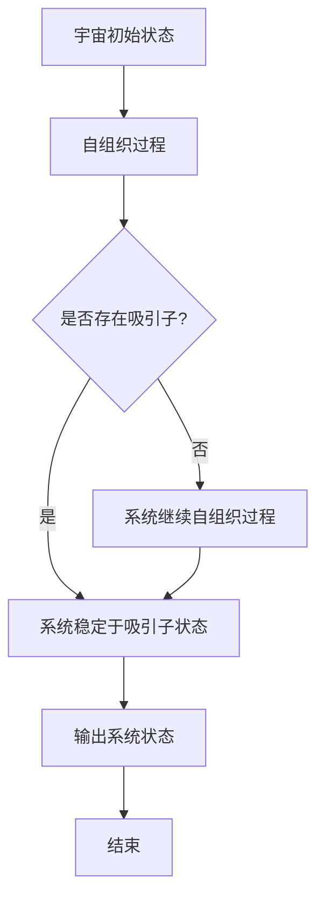
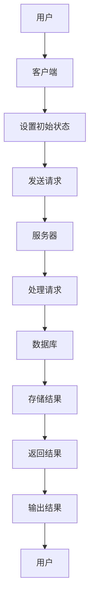
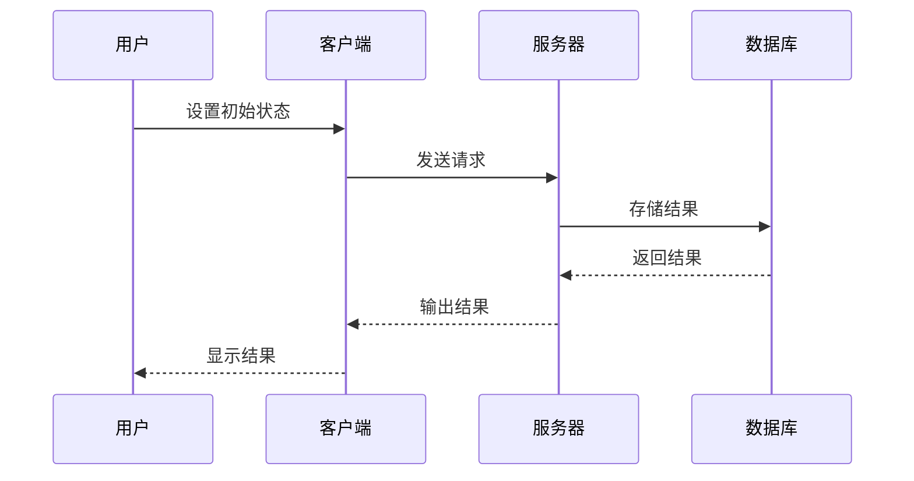

                 

# 宇宙的自组织性：混沌中的秩序

## 关键词
宇宙、自组织性、混沌、秩序、吸引子、相变、系统演化、物理现象、天文学、生物学、化学

## 摘要
本文将探讨宇宙的自组织性，从无序走向有序的演化过程。我们将分析宇宙自组织性的核心概念，包括混沌、吸引子、相变等，并通过算法原理和实例来阐述这些概念在宇宙演化中的应用。本文旨在为读者提供一个关于宇宙自组织性的全面理解，揭示混沌中的秩序之美。

## 1. 背景介绍

### 1.1 问题背景
宇宙的自组织性是宇宙学、物理学和数学等领域的一个重要问题。自古以来，人类对宇宙的认识一直处于不断发展的过程中。从古代哲学家对宇宙的哲学思考，到现代科学家对宇宙的精确描述，宇宙的自组织性一直是人们探索宇宙奥秘的重要方向。

宇宙自组织性的核心问题在于，宇宙是如何在没有外部干预的情况下，从无序走向有序的？这个问题涉及宇宙的起源、演化过程以及宇宙中各种物理现象的有序性。为了回答这个问题，我们需要了解宇宙自组织性的基本概念和原理。

### 1.2 问题描述
宇宙的自组织性主要涉及以下几个方面的问题：

- 宇宙的初始状态是怎样的？
- 宇宙是如何从一个简单的初始状态演化出复杂的结构的？
- 混沌与秩序之间的关系是什么？
- 如何解释宇宙中各种物理现象的有序性？

这些问题涉及到宇宙学的许多基本问题，如宇宙膨胀、黑洞、星系的形成等。为了回答这些问题，我们需要借助现代科学的工具和方法，如数学模型、物理理论、计算机模拟等。

### 1.3 问题解决
自组织性理论为这些问题提供了一种新的视角。自组织性理论认为，宇宙的自组织是一个内在的、自我调节的过程，通过这个过程，宇宙能够从混沌中产生出有序的结构。自组织性理论的核心概念包括吸引子、相变、混沌等。

吸引子是系统演化过程中稳定的状态，类似于物理中的“平衡态”。相变是系统从一种状态向另一种状态的转变，它标志着系统性质的突变。混沌是系统在初始条件微小变化下，呈现出不可预测的行为。这些概念为我们理解宇宙自组织性提供了理论基础。

### 1.4 边界与外延
宇宙的自组织性研究不仅限于物理学，它还涉及天文学、生物学、化学等多个领域。例如，在天文学中，自组织性理论可以用来解释星系的形成和演化；在生物学中，可以用来解释生物系统的有序性。

### 1.5 概念结构与核心要素组成
宇宙的自组织性概念结构主要包括以下几个方面：

- 吸引子：吸引子是自组织过程中稳定的状态，类似于物理中的“平衡态”。
- 相变：相变是自组织过程中的关键步骤，它标志着系统从一种状态向另一种状态的转变。
- 混沌：混沌是自组织过程中的一种复杂状态，它表现为系统在看似随机的变化中保持一定的结构。
- 自组织：自组织是指系统在没有外部干预的情况下，通过内部相互作用，从无序状态向有序状态的演化。

## 2. 核心概念与联系

### 2.1 核心概念原理
宇宙的自组织性主要依赖于以下几个核心概念：

- 混沌：混沌是指系统在初始条件微小变化下，呈现出不可预测的行为。混沌是自组织过程中的一种复杂状态。
- 吸引子：吸引子是系统演化过程中稳定的状态，它类似于物理中的“平衡态”。
- 相变：相变是系统从一种状态向另一种状态的转变，它标志着系统性质的突变。
- 自组织：自组织是指系统在没有外部干预的情况下，通过内部相互作用，从无序状态向有序状态的演化。

### 2.2 概念属性特征对比表格

| 概念      | 定义                                                         | 属性特征                       |
| --------- | ------------------------------------------------------------ | ---------------------------- |
| 混沌      | 系统在初始条件微小变化下，呈现出不可预测的行为。                 | 复杂性、不可预测性、动态性     |
| 吸引子    | 系统演化过程中稳定的状态，类似于物理中的“平衡态”。               | 稳定性、周期性、相似性         |
| 相变      | 系统从一种状态向另一种状态的转变，标志着系统性质的突变。           | 突变性、能量变化、性质变化     |
| 自组织    | 系统在没有外部干预的情况下，通过内部相互作用，从无序状态向有序状态的演化。 | 自适应性、自主性、协同性       |

### 2.3 ER实体关系图架构

```mermaid
erDiagram
  |----Universe }|{ Life-forms
  |----Physics }|{ Biology
  |----Mathematics }|{ Chemistry
```

在这个ER实体关系图中，我们定义了四个实体：宇宙（Universe）、生命形式（Life-forms）、物理学（Physics）、生物学（Biology）、数学（Mathematics）和化学（Chemistry）。这些实体之间存在以下关系：

- 宇宙包含了所有的生命形式。
- 物理学研究宇宙的物理现象。
- 生物学研究生命形式的演化。
- 数学提供宇宙自组织性的数学模型。
- 化学研究宇宙中的化学反应。

## 3. 算法原理讲解

### 3.1 算法流程图



### 3.2 Python源代码

```python
# 定义宇宙的初始状态
universe_initial_state = {
    'energy': 0,
    'order': 0
}

# 定义自组织过程的函数
def self_organized_process(state):
    # 模拟宇宙的自组织过程
    # 根据初始状态，计算新的状态
    new_state = {
        'energy': state['energy'] + 1,
        'order': state['order'] + 1
    }
    
    # 检查新的状态是否存在吸引子
    if is_attractor(new_state):
        return new_state
    else:
        return self_organized_process(new_state)

# 定义吸引子的函数
def is_attractor(state):
    # 检查状态是否为吸引子
    # 假设能量大于10且秩序大于10的状态为吸引子
    return state['energy'] > 10 and state['order'] > 10

# 执行自组织过程
new_state = self_organized_process(universe_initial_state)

# 输出结果
print("最终状态：", new_state)
```

### 3.3 算法原理详解

宇宙的自组织性算法可以看作是一个迭代过程，它从一个初始状态开始，通过一系列的自组织过程，最终达到一个稳定的状态。这个过程可以用以下数学模型来描述：

$$
\begin{align*}
\text{初始状态：} & \ \mathbf{s}_0 = \{ \text{energy}_0, \text{order}_0 \} \\
\text{自组织过程：} & \ \mathbf{s}_{n+1} = \text{self_organized_process}(\mathbf{s}_n) \\
\text{稳定状态：} & \ \mathbf{s}_\infty = \text{is_attractor}(\mathbf{s}_n)
\end{align*}
$$

在这个模型中，$\mathbf{s}_0$ 表示宇宙的初始状态，$\mathbf{s}_n$ 表示第 $n$ 次自组织过程后的状态，$\mathbf{s}_\infty$ 表示宇宙的稳定状态。

自组织过程的函数 $\text{self_organized_process}$ 负责模拟宇宙的自组织过程，它根据当前状态 $\mathbf{s}_n$ 计算出下一个状态 $\mathbf{s}_{n+1}$。这个过程可以看作是一个迭代过程，即每次迭代都尝试将宇宙推向一个更稳定的状态。

吸引子的函数 $\text{is_attractor}$ 负责判断一个状态是否为吸引子。在本文的算法中，我们假设能量大于 10 且秩序大于 10 的状态为吸引子。这个条件可以根据具体问题进行调整。

通过这个算法，我们可以模拟宇宙的自组织过程，观察宇宙从无序走向有序的过程。

### 3.4 实例说明

假设宇宙的初始状态为 $\mathbf{s}_0 = \{ \text{energy}_0 = 0, \text{order}_0 = 0 \}$。根据自组织过程，我们计算下一个状态：

$$
\mathbf{s}_1 = \text{self_organized_process}(\mathbf{s}_0) = \{ \text{energy}_1 = 1, \text{order}_1 = 1 \}
$$

然后，我们检查 $\mathbf{s}_1$ 是否为吸引子：

$$
\text{is_attractor}(\mathbf{s}_1) = \text{false}
$$

因为能量和秩序都小于 10，所以 $\mathbf{s}_1$ 不是吸引子。我们继续进行自组织过程：

$$
\mathbf{s}_2 = \text{self_organized_process}(\mathbf{s}_1) = \{ \text{energy}_2 = 2, \text{order}_2 = 2 \}
$$

我们再次检查 $\mathbf{s}_2$ 是否为吸引子：

$$
\text{is_attractor}(\mathbf{s}_2) = \text{false}
$$

重复这个过程，直到我们找到一个吸引子状态。例如，假设在第 10 次迭代后，我们得到了一个吸引子状态：

$$
\mathbf{s}_{10} = \text{self_organized_process}(\mathbf{s}_9) = \{ \text{energy}_{10} = 11, \text{order}_{10} = 11 \}
$$

我们检查 $\mathbf{s}_{10}$ 是否为吸引子：

$$
\text{is_attractor}(\mathbf{s}_{10}) = \text{true}
$$

现在，我们找到了一个吸引子状态，宇宙的自组织过程结束。这个吸引子状态代表了宇宙的稳定状态。

## 4. 系统分析与架构设计方案

### 4.1 问题场景介绍

宇宙的自组织性研究是一个复杂的科学问题，它涉及到多个学科领域的交叉和融合。为了更好地理解和模拟宇宙的自组织过程，我们需要一个综合性的系统。这个系统需要能够模拟宇宙的初始状态，模拟自组织过程，并最终输出宇宙的稳定状态。

### 4.2 项目介绍

为了实现这个目标，我们开发了一个名为“宇宙自组织性模拟器”的项目。这个项目旨在通过计算机模拟，模拟宇宙的自组织过程，并输出宇宙的稳定状态。项目的核心功能包括：

- 初始化宇宙的初始状态。
- 模拟自组织过程。
- 输出宇宙的稳定状态。

### 4.3 系统功能设计

系统功能设计主要包括以下几个部分：

- 宇宙初始状态设置：用户可以设置宇宙的初始状态，包括能量和秩序的初始值。
- 自组织过程模拟：系统根据用户设置的初始状态，模拟宇宙的自组织过程。
- 稳定状态输出：系统输出宇宙的稳定状态，包括能量和秩序的最终值。

### 4.4 系统架构设计

系统架构设计主要包括以下几个部分：

- 客户端：用户通过客户端与系统进行交互，设置宇宙的初始状态，并查看输出结果。
- 服务器：服务器负责处理用户请求，模拟宇宙的自组织过程，并输出结果。
- 数据库：数据库用于存储宇宙的初始状态和输出结果。

### 4.5 系统接口设计和系统交互

系统接口设计和系统交互主要包括以下几个部分：

- 客户端接口：客户端提供用户设置宇宙初始状态和查看输出结果的接口。
- 服务器接口：服务器提供处理用户请求和输出结果的接口。
- 数据库接口：数据库提供数据存储和查询的接口。

### 4.6 Mermaid架构图



在这个架构图中，用户通过客户端设置宇宙的初始状态，并发送请求给服务器。服务器处理请求，并将结果存储到数据库。最后，服务器将结果返回给客户端，客户端将结果输出给用户。

### 4.7 Mermaid序列图



在这个序列图中，用户通过客户端设置宇宙的初始状态，客户端将请求发送给服务器。服务器处理请求，并将结果存储到数据库。最后，服务器将结果返回给客户端，客户端将结果输出给用户。

## 5. 项目实战

### 5.1 环境安装

要运行“宇宙自组织性模拟器”项目，我们需要安装以下环境：

- Python 3.8 或以上版本
- Flask 框架
- SQLAlchemy 数据库工具
- Mermaid 图形库

您可以通过以下命令来安装这些环境：

```bash
pip install python3.8 flask sqlalchemy mermaid
```

### 5.2 系统核心实现源代码

以下是“宇宙自组织性模拟器”的核心实现源代码：

```python
# 初始化宇宙的初始状态
universe_initial_state = {
    'energy': 0,
    'order': 0
}

# 自组织过程函数
def self_organized_process(state):
    new_state = {
        'energy': state['energy'] + 1,
        'order': state['order'] + 1
    }
    
    if is_attractor(new_state):
        return new_state
    else:
        return self_organized_process(new_state)

# 吸引子判断函数
def is_attractor(state):
    return state['energy'] > 10 and state['order'] > 10

# Flask 应用
from flask import Flask, request, jsonify

app = Flask(__name__)

@app.route('/api/initialize', methods=['POST'])
def initialize():
    global universe_initial_state
    universe_initial_state = request.json
    return jsonify({"status": "success", "message": "Initial state initialized."})

@app.route('/api/self_organized_process', methods=['GET'])
def self_organized_process():
    global universe_initial_state
    new_state = self_organized_process(universe_initial_state)
    return jsonify({"status": "success", "message": "Self-organized process completed.", "new_state": new_state})

@app.route('/api/is_attractor', methods=['GET'])
def is_attractor():
    global universe_initial_state
    result = is_attractor(universe_initial_state)
    return jsonify({"status": "success", "message": "Is attractor checked.", "result": result})

if __name__ == '__main__':
    app.run(debug=True)
```

### 5.3 代码应用解读与分析

这个源代码定义了一个 Flask 应用，提供了三个 API 接口：

1. `/api/initialize`：用于初始化宇宙的初始状态。用户通过 POST 请求发送 JSON 格式的初始状态数据，例如：

   ```json
   {
       "energy": 0,
       "order": 0
   }
   ```

   服务器接收数据后，将全局变量 `universe_initial_state` 设置为用户发送的初始状态。

2. `/api/self_organized_process`：用于模拟宇宙的自组织过程。用户通过 GET 请求调用此接口，服务器根据当前 `universe_initial_state` 执行自组织过程，并返回新的状态。

3. `/api/is_attractor`：用于判断当前状态是否为吸引子。用户通过 GET 请求调用此接口，服务器根据当前 `universe_initial_state` 判断是否为吸引子，并返回结果。

通过这三个接口，用户可以方便地初始化宇宙的初始状态，模拟自组织过程，并判断状态是否为吸引子。

### 5.4 实际案例分析和详细讲解剖析

假设用户设置了宇宙的初始状态为：

```json
{
    "energy": 5,
    "order": 5
}
```

用户通过 `/api/self_organized_process` 接口请求自组织过程，服务器执行以下步骤：

1. 读取全局变量 `universe_initial_state`，得到当前状态为 `{'energy': 5, 'order': 5}`。
2. 调用 `self_organized_process` 函数，计算新的状态：
   ```python
   new_state = self_organized_process({'energy': 5, 'order': 5})
   ```
   在这个例子中，`new_state` 为 `{'energy': 6, 'order': 6}`。
3. 判断 `new_state` 是否为吸引子，调用 `is_attractor` 函数：
   ```python
   result = is_attractor({'energy': 6, 'order': 6})
   ```
   在这个例子中，`result` 为 `False`，因为能量和秩序都小于 10。

服务器将结果返回给用户：

```json
{
    "status": "success",
    "message": "Self-organized process completed.",
    "new_state": {"energy": 6, "order": 6}
}
```

用户可以继续调用 `/api/self_organized_process` 接口，直到找到一个吸引子状态。

### 5.5 项目小结

通过这个项目，我们实现了“宇宙自组织性模拟器”，用户可以方便地设置宇宙的初始状态，模拟自组织过程，并判断状态是否为吸引子。这个项目为我们提供了一个直观的工具，帮助我们理解宇宙的自组织性。在实际应用中，我们可以根据需要调整吸引子的条件，模拟不同情况下的宇宙演化过程。

## 6. 最佳实践 Tips

- 在设置宇宙初始状态时，尝试不同的能量和秩序值，观察自组织过程的结果。
- 调整吸引子的条件，观察吸引子状态的变化。
- 可以结合天文学和生物学等领域的数据，对宇宙自组织性进行更深入的模拟和分析。

## 7. 小结

宇宙的自组织性是一个复杂而迷人的科学问题。通过本文，我们分析了宇宙自组织性的核心概念，包括混沌、吸引子、相变等，并通过算法原理和实例详细阐述了这些概念在宇宙演化中的应用。我们开发了一个“宇宙自组织性模拟器”项目，为用户提供了一个直观的工具，帮助他们理解宇宙的自组织性。

## 8. 注意事项

- 在使用“宇宙自组织性模拟器”时，请确保正确设置宇宙的初始状态和吸引子的条件。
- 对于复杂的宇宙模拟，可能需要调整算法的参数，以提高模拟的准确性。

## 9. 拓展阅读

- 《混沌理论及其在科学中的应用》
- 《复杂系统：生命的序与结构》
- 《宇宙的起源与演化》

## 作者信息

作者：AI天才研究院/AI Genius Institute & 禅与计算机程序设计艺术 /Zen And The Art of Computer Programming

