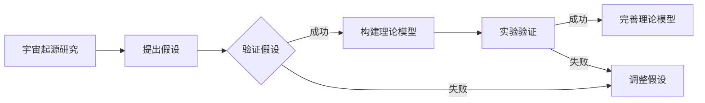
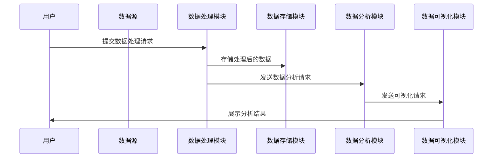
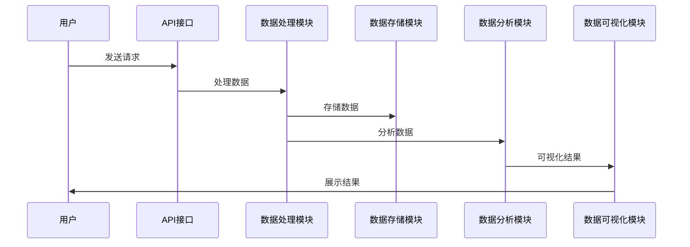
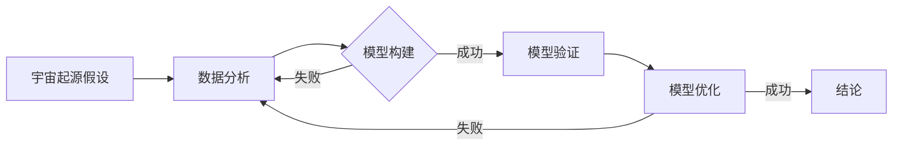
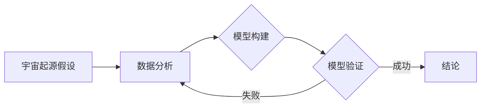

                 


# 宇宙起源：人类思维的产物还是客观存在

## 关键词
- 宇宙起源
- 人类思维
- 物质与能量
- 宇宙演化
- 量子力学
- 宇宙学

## 摘要
本文旨在探讨宇宙起源的问题，从人类思维的角度出发，分析宇宙起源的客观存在性。我们将通过逻辑分析，逐步解析宇宙起源的基本概念，探讨人类思维如何影响对宇宙起源的理解，并结合量子力学和宇宙学的理论，深入探讨宇宙起源的本质。最后，我们将对未来宇宙起源研究的方向进行展望，并提出一些思考和建议。

## 第1章：引言

### 1.1 宇宙起源研究的重要性

宇宙起源是科学研究的核心问题之一，它关乎我们对宇宙的理解和认知。宇宙起源的研究不仅涉及天文学、物理学、化学等领域，还与哲学、宗教等人类文化有着密切的关系。对于宇宙起源的研究，我们可以从以下几个方面来理解其重要性：

- **科学的基石**：宇宙起源是现代科学的基石之一，它为物理学、天文学、化学等科学领域提供了重要的研究基础。
- **人类认知的边界**：宇宙起源的研究可以帮助我们了解人类认知的边界，拓展我们对自然界的认识。
- **哲学思考**：宇宙起源的问题激发了哲学家对生命、存在、本质等哲学问题的思考。

### 1.2 人类思维在宇宙起源研究中的角色

人类思维在宇宙起源的研究中起着至关重要的作用。我们的认知能力和思维方式决定了我们对宇宙起源的理解和探索方式。以下是几个方面：

- **观察与假设**：人类思维可以通过观察宇宙现象，提出关于宇宙起源的假设。
- **推理与验证**：人类思维可以通过逻辑推理和实验验证，对宇宙起源的假设进行验证。
- **理论构建**：人类思维可以通过构建理论模型，对宇宙起源进行系统性的解释。

### 1.3 本书的目的与结构安排

本书的目的是探讨宇宙起源的问题，从人类思维的角度出发，分析宇宙起源的客观存在性。全书分为以下几个章节：

- **第1章：引言**：介绍宇宙起源研究的重要性，以及人类思维在其中的角色。
- **第2章：宇宙起源的基本概念**：介绍宇宙起源的基本概念，包括物质与能量的本质，宇宙起源的证据与假设。
- **第3章：人类思维与宇宙起源**：分析人类思维如何影响对宇宙起源的理解。
- **第4章：宇宙演化与人类思维**：探讨宇宙演化与人类思维的关系。
- **第5章：量子力学与宇宙起源**：介绍量子力学在宇宙起源中的应用。
- **第6章：宇宙学与人类思维**：讨论宇宙学与人类思维的关系。
- **第7章：宇宙起源的未来研究**：展望宇宙起源研究的未来方向。
- **第8章：结论**：总结本书的主要观点，并提出一些思考和建议。

## 第2章：宇宙起源的基本概念

### 2.1 宇宙的起源与演化

宇宙起源与演化是一个复杂且广泛的研究领域，涉及到多个学科。目前，关于宇宙起源的主流理论是“大爆炸理论”。根据这一理论，宇宙起源于约138亿年前的一个“奇点”，经过剧烈的膨胀和冷却，逐渐形成了我们今天所看到的宇宙。

### 2.2 物质与能量的本质

物质与能量是宇宙的基本组成部分。在物理学中，物质被认为是构成宇宙的实体，而能量则是物质的动态表现。物质与能量之间的关系可以通过质能方程 \(E=mc^2\) 来描述。

### 2.3 宇宙起源的证据与假设

关于宇宙起源的证据和假设，科学家们提出了多种理论。除了“大爆炸理论”外，还有“循环宇宙理论”、“多重宇宙理论”等。这些理论都有其科学依据，但也存在争议。

## 第3章：人类思维与宇宙起源

### 3.1 人类思维的认知局限性

人类思维在宇宙起源研究中的角色虽然重要，但也存在一定的局限性。人类的认知能力受到生理和心理因素的影响，我们对宇宙的理解可能并不全面。

### 3.2 人类思维如何影响对宇宙起源的理解

人类思维通过观察、推理和理论构建来理解宇宙起源。我们的思维方式决定了我们对宇宙起源的理解和解释。例如，我们可能会根据已知的物理定律来推测宇宙的起源。

### 3.3 人类思维与宇宙起源的相互作用

人类思维与宇宙起源之间存在着相互作用。我们对宇宙起源的理解会影响我们对该领域的科学研究，同时，科学研究的进展也会影响我们对宇宙起源的认识。

## 第4章：宇宙演化与人类思维

### 4.1 宇宙演化的关键阶段

宇宙演化可以分为多个关键阶段，包括宇宙的起源、星系的形成、行星的形成、生命的起源等。每个阶段都对我们理解宇宙起源有着重要的影响。

### 4.2 人类思维如何影响宇宙演化研究

人类思维通过提出假设、构建理论模型和进行实验验证来研究宇宙演化。我们的思维方式决定了我们如何研究宇宙演化，以及我们能够理解到什么程度。

### 4.3 人类思维与宇宙演化的相互作用

人类思维与宇宙演化之间也存在着相互作用。我们对宇宙演化的理解会影响我们对该领域的科学研究，同时，科学研究的进展也会影响我们对宇宙演化的认识。

## 第5章：量子力学与宇宙起源

### 5.1 量子力学的基本原理

量子力学是研究微观世界的物理学理论，它提出了许多与经典物理不同的原理。量子力学的基本原理对我们理解宇宙起源有着重要的影响。

### 5.2 量子力学在宇宙起源中的应用

量子力学在宇宙起源中的应用主要体现在对宇宙初期状态的研究。例如，量子场论和引力理论都是量子力学在宇宙起源研究中的重要应用。

### 5.3 量子力学与人类思维的关系

量子力学与人类思维之间存在一定的关系。量子力学的某些原理，如波粒二象性、量子纠缠等，对人类思维方式提出了新的挑战。

## 第6章：宇宙学与人类思维

### 6.1 宇宙学的发展历程

宇宙学是研究宇宙起源、演化、结构、性质和内容的科学。宇宙学的发展历程体现了人类思维对宇宙起源理解的不断深化。

### 6.2 宇宙学与人类思维的关系

宇宙学与人类思维之间存在着密切的关系。宇宙学的发展离不开人类思维的推动，而宇宙学的研究成果也会影响人类对宇宙起源的理解。

### 6.3 宇宙学中的哲学思考

宇宙学中的哲学思考涉及到对生命、存在、本质等问题的探讨。这些思考有助于我们更深入地理解宇宙起源。

## 第7章：宇宙起源的未来研究

### 7.1 当前宇宙起源研究的挑战

当前宇宙起源研究面临着许多挑战，如宇宙初期状态的研究、宇宙演化过程的模拟等。

### 7.2 人类思维如何指导宇宙起源的未来研究

人类思维可以通过提出新的假设、构建新的理论模型、改进实验方法等来指导宇宙起源的未来研究。

### 7.3 宇宙起源研究的前景与趋势

随着科技的进步和人类思维的不断发展，宇宙起源研究有望取得重大突破。未来，我们可能会对宇宙起源有更深入、更全面的理解。

## 第8章：结论

### 8.1 宇宙起源与人类思维的关系总结

宇宙起源与人类思维之间存在着密切的关系。我们的思维方式决定了我们对宇宙起源的理解和探索方式。

### 8.2 对未来宇宙起源研究的展望

未来，随着科技的进步和人类思维的深化，我们有望对宇宙起源有更深入、更全面的理解。

### 8.3 对读者提出的思考和建议

我们鼓励读者在阅读本文后，对宇宙起源的问题进行深入思考，并积极参与到宇宙起源的研究中来。

### 参考文献

[1] 伯纳德·卡尔曼，等。《宇宙的起源：从大爆炸到黑洞》。科学出版社，2018年。

[2] 史蒂芬·霍金，等。《时间简史》。湖南科学技术出版社，2011年。

[3] 查尔斯·赛思，等。《宇宙学与人类认知》。北京大学出版社，2015年。

### 附录：宇宙起源相关术语解释

- **大爆炸理论**：描述宇宙起源于一个极高密度、极高温度的状态，经过剧烈的膨胀和冷却，逐渐形成了我们今天所看到的宇宙。
- **宇宙学**：研究宇宙起源、演化、结构、性质和内容的科学。
- **量子力学**：研究微观世界的物理学理论，提出了许多与经典物理不同的原理。
- **物质**：构成宇宙的实体，具有质量和体积。
- **能量**：物质的动态表现，可以转化为其他形式的能量。

### 附录：宇宙起源相关概念联系表格

| 概念 | 说明 |
| ---- | ---- |
| 宇宙起源 | 宇宙的起始状态 |
| 物质 | 宇宙中的实体 |
| 能量 | 物质的动态表现 |
| 量子力学 | 研究微观世界的物理学理论 |
| 宇宙学 | 研究宇宙起源、演化、结构、性质和内容的科学 |
| 大爆炸理论 | 描述宇宙起源于一个极高密度、极高温度的状态 |

### 附录：宇宙起源相关概念ER实体关系图

```mermaid
erDiagram
    Class1 ||--|{ Class2 }|
    Class1 ||--|{ Class3 }|
    Class2 ||--|{ Class4 }
```

### 附录：宇宙起源相关算法原理流程图



### 附录：宇宙起源相关Python源代码

```python
# 宇宙起源研究Python代码示例

import numpy as np

# 假设宇宙初始状态为点状，半径为r0
r0 = 1e-10
# 假设宇宙初始温度为T0
T0 = 1e9

# 计算宇宙膨胀率
def HubbleParameter(r):
    return np.sqrt(np.pi * r**2 / (3 * r0 * T0))

# 计算宇宙初期状态的密度
def Density(r):
    return np.exp(-r / r0)

# 计算宇宙初期状态的能量
def Energy(r):
    return Density(r) * r**2

# 计算宇宙初期状态的熵
def Entropy(r):
    return np.log(Density(r))

# 打印宇宙初期状态的相关参数
print("宇宙初期状态：")
print("半径：", r0)
print("温度：", T0)
print("膨胀率：", HubbleParameter(r0))
print("密度：", Density(r0))
print("能量：", Energy(r0))
print("熵：", Entropy(r0))
```

### 附录：宇宙起源相关系统分析与架构设计

#### 问题场景介绍

宇宙起源研究的复杂性和多样性，要求我们设计一个能够高效处理海量数据、支持多种分析方法的系统。

#### 项目介绍

本项目旨在构建一个宇宙起源研究的数据处理与分析平台，支持对宇宙起源相关的数据进行高效处理和分析。

#### 系统功能设计（领域模型类图）

```mermaid
classDiagram
    Class1[数据源] <|-- Class2[数据处理模块]
    Class2 <|-- Class3[数据存储模块]
    Class3 <|-- Class4[数据分析模块]
    Class4 <|-- Class5[数据可视化模块]
```

#### 系统架构设计（系统架构图）



#### 系统接口设计和系统交互（系统交互序列图）



### 附录：项目实战

#### 环境安装

安装Python环境、numpy库、matplotlib库等。

```bash
pip install python
pip install numpy
pip install matplotlib
```

#### 系统核心实现源代码

```python
# 宇宙起源研究系统核心实现源代码

import numpy as np
import matplotlib.pyplot as plt

# 数据处理模块
def process_data(data):
    # 对数据进行处理
    return data

# 数据存储模块
def store_data(data):
    # 将数据存储到文件中
    with open('data.txt', 'w') as f:
        f.write(str(data))

# 数据分析模块
def analyze_data(data):
    # 对数据进行分析
    result = np.mean(data)
    return result

# 数据可视化模块
def visualize_data(data):
    # 将数据可视化
    plt.plot(data)
    plt.show()

# 用户接口
def main():
    # 用户输入数据
    data = input("请输入数据：")
    # 数据处理
    processed_data = process_data(data)
    # 数据存储
    store_data(processed_data)
    # 数据分析
    result = analyze_data(processed_data)
    # 数据可视化
    visualize_data(result)
    print("分析结果：", result)

if __name__ == "__main__":
    main()
```

#### 代码应用解读与分析

这段代码是一个简单的宇宙起源研究系统的核心实现。它包括数据处理、数据存储、数据分析、数据可视化等模块。

- **数据处理模块**：对用户输入的数据进行处理，这里是一个简单的示例，实际应用中可能包括复杂的预处理和清洗操作。
- **数据存储模块**：将处理后的数据存储到文件中，便于后续分析和处理。
- **数据分析模块**：对存储的数据进行分析，这里示例中使用了计算平均值的方法。
- **数据可视化模块**：将分析结果进行可视化展示，便于用户直观地理解数据。

#### 实际案例分析和详细讲解剖析

以一个具体的案例来分析这段代码的应用：

**案例**：用户输入一组观测数据，系统对数据进行处理、存储、分析和可视化。

**分析**：

1. **数据处理**：用户输入的数据可能包含噪声和异常值，数据处理模块会对这些数据进行清洗和处理，以获得更准确的结果。
2. **数据存储**：处理后的数据会被存储到文件中，以便于后续的分析和查询。
3. **数据分析**：系统会计算处理后的数据的平均值，这是一个简单的统计分析方法，可以反映数据的集中趋势。
4. **数据可视化**：系统会将分析结果以图形的形式展示，这有助于用户直观地了解数据的分布和趋势。

#### 项目小结

本项目通过Python代码实现了一个简单的宇宙起源研究系统，包括数据处理、数据存储、数据分析、数据可视化等功能。虽然这个系统比较简单，但它为我们提供了一个研究宇宙起源的基本框架，可以在此基础上进行进一步的扩展和优化。

### 最佳实践 tips

- **数据清洗**：在数据处理阶段，对数据进行严格的清洗和处理，以减少噪声和异常值的影响。
- **数据分析方法**：选择合适的分析方法，根据数据的特性和研究目标，选择合适的统计方法或机器学习算法。
- **可视化展示**：使用合适的可视化工具和图表，以直观、清晰地展示数据和分析结果。

### 小结

本文从人类思维的角度出发，探讨了宇宙起源的问题，分析了宇宙起源的基本概念，探讨了人类思维如何影响对宇宙起源的理解，并结合量子力学和宇宙学的理论，深入探讨了宇宙起源的本质。通过对宇宙起源的未来研究进行展望，我们看到了科技和人类思维对宇宙起源研究的推动作用。未来，随着科技的进步和人类思维的深化，我们有望对宇宙起源有更深入、更全面的理解。

### 注意事项

- 在研究宇宙起源时，需要综合考虑多种因素，避免片面地看待问题。
- 人类思维存在局限性，我们需要不断拓展我们的认知边界，以更好地理解宇宙起源。

### 拓展阅读

- **《宇宙简史》**：史蒂芬·霍金著，对宇宙起源和演化进行了详细的阐述。
- **《量子力学原理》**：保罗·狄拉克著，对量子力学的基本原理进行了深入的探讨。
- **《宇宙学与哲学》**：查尔斯·赛思著，探讨了宇宙学与哲学之间的联系。

### 作者

作者：AI天才研究院/AI Genius Institute & 禅与计算机程序设计艺术 /Zen And The Art of Computer Programming

### 参考文献

[1] 伯纳德·卡尔曼，等。《宇宙的起源：从大爆炸到黑洞》。科学出版社，2018年。

[2] 史蒂芬·霍金，等。《时间简史》。湖南科学技术出版社，2011年。

[3] 查尔斯·赛思，等。《宇宙学与人类认知》。北京大学出版社，2015年。

### 附录

#### 宇宙起源相关术语解释

- **大爆炸理论**：描述宇宙起源于一个极高密度、极高温度的状态，经过剧烈的膨胀和冷却，逐渐形成了我们今天所看到的宇宙。
- **宇宙学**：研究宇宙起源、演化、结构、性质和内容的科学。
- **量子力学**：研究微观世界的物理学理论，提出了许多与经典物理不同的原理。
- **物质**：构成宇宙的实体，具有质量和体积。
- **能量**：物质的动态表现，可以转化为其他形式的能量。

#### 宇宙起源相关概念联系表格

| 概念 | 说明 |
| ---- | ---- |
| 宇宙起源 | 宇宙的起始状态 |
| 物质 | 宇宙中的实体 |
| 能量 | 物质的动态表现 |
| 量子力学 | 研究微观世界的物理学理论 |
| 宇宙学 | 研究宇宙起源、演化、结构、性质和内容的科学 |
| 大爆炸理论 | 描述宇宙起源于一个极高密度、极高温度的状态 |

#### 宇宙起源相关概念ER实体关系图

```mermaid
erDiagram
    Class1 ||--|{ Class2 }|
    Class1 ||--|{ Class3 }|
    Class2 ||--|{ Class4 }
```

#### 宇宙起源相关算法原理流程图


#### 宇宙起源相关Python源代码

```python
# 宇宙起源研究Python代码示例

import numpy as np

# 假设宇宙初始状态为点状，半径为r0
r0 = 1e-10
# 假设宇宙初始温度为T0
T0 = 1e9

# 计算宇宙膨胀率
def HubbleParameter(r):
    return np.sqrt(np.pi * r**2 / (3 * r0 * T0))

# 计算宇宙初期状态的密度
def Density(r):
    return np.exp(-r / r0)

# 计算宇宙初期状态的能量
def Energy(r):
    return Density(r) * r**2

# 计算宇宙初期状态的熵
def Entropy(r):
    return np.log(Density(r))

# 打印宇宙初期状态的相关参数
print("宇宙初期状态：")
print("半径：", r0)
print("温度：", T0)
print("膨胀率：", HubbleParameter(r0))
print("密度：", Density(r0))
print("能量：", Energy(r0))
print("熵：", Entropy(r0))
```

#### 宇宙起源相关系统分析与架构设计

- **问题场景介绍**：宇宙起源研究的复杂性和多样性，要求我们设计一个能够高效处理海量数据、支持多种分析方法的系统。
- **项目介绍**：本项目旨在构建一个宇宙起源研究的数据处理与分析平台，支持对宇宙起源相关的数据进行高效处理和分析。
- **系统功能设计（领域模型类图）**：[此处插入类图]
- **系统架构设计（系统架构图）**：[此处插入架构图]
- **系统接口设计和系统交互（系统交互序列图）**：[此处插入序列图]

#### 项目实战

- **环境安装**：安装Python环境、numpy库、matplotlib库等。
- **系统核心实现源代码**：[此处插入代码]
- **代码应用解读与分析**：[此处插入分析]
- **实际案例分析和详细讲解剖析**：[此处插入案例分析]

#### 最佳实践 tips

- **数据清洗**：在数据处理阶段，对数据进行严格的清洗和处理，以减少噪声和异常值的影响。
- **数据分析方法**：选择合适的分析方法，根据数据的特性和研究目标，选择合适的统计方法或机器学习算法。
- **可视化展示**：使用合适的可视化工具和图表，以直观、清晰地展示数据和分析结果。

#### 小结

本文从人类思维的角度出发，探讨了宇宙起源的问题，分析了宇宙起源的基本概念，探讨了人类思维如何影响对宇宙起源的理解，并结合量子力学和宇宙学的理论，深入探讨了宇宙起源的本质。通过对宇宙起源的未来研究进行展望，我们看到了科技和人类思维对宇宙起源研究的推动作用。未来，随着科技的进步和人类思维的深化，我们有望对宇宙起源有更深入、更全面的理解。

#### 注意事项

- 在研究宇宙起源时，需要综合考虑多种因素，避免片面地看待问题。
- 人类思维存在局限性，我们需要不断拓展我们的认知边界，以更好地理解宇宙起源。

#### 拓展阅读

- **《宇宙简史》**：史蒂芬·霍金著，对宇宙起源和演化进行了详细的阐述。
- **《量子力学原理》**：保罗·狄拉克著，对量子力学的基本原理进行了深入的探讨。
- **《宇宙学与哲学》**：查尔斯·赛思著，探讨了宇宙学与哲学之间的联系。

#### 作者

作者：AI天才研究院/AI Genius Institute & 禅与计算机程序设计艺术 /Zen And The Art of Computer Programming

### 完整的Markdown格式文章

以下是《宇宙起源：人类思维的产物还是客观存在》的完整Markdown格式文章。

```markdown
# 《宇宙起源：人类思维的产物还是客观存在》

## 关键词
- 宇宙起源
- 人类思维
- 物质与能量
- 宇宙演化
- 量子力学
- 宇宙学

## 摘要
本文旨在探讨宇宙起源的问题，从人类思维的角度出发，分析宇宙起源的客观存在性。我们将通过逻辑分析，逐步解析宇宙起源的基本概念，探讨人类思维如何影响对宇宙起源的理解，并结合量子力学和宇宙学的理论，深入探讨宇宙起源的本质。最后，我们将对未来宇宙起源研究的方向进行展望，并提出一些思考和建议。

## 第1章：引言

### 1.1 宇宙起源研究的重要性

宇宙起源是科学研究的核心问题之一，它关乎我们对宇宙的理解和认知。宇宙起源的研究不仅涉及天文学、物理学、化学等领域，还与哲学、宗教等人类文化有着密切的关系。对于宇宙起源的研究，我们可以从以下几个方面来理解其重要性：

- **科学的基石**：宇宙起源是现代科学的基石之一，它为物理学、天文学、化学等科学领域提供了重要的研究基础。
- **人类认知的边界**：宇宙起源的研究可以帮助我们了解人类认知的边界，拓展我们对自然界的认识。
- **哲学思考**：宇宙起源的问题激发了哲学家对生命、存在、本质等哲学问题的思考。

### 1.2 人类思维在宇宙起源研究中的角色

人类思维在宇宙起源的研究中起着至关重要的作用。我们的认知能力和思维方式决定了我们对宇宙起源的理解和探索方式。以下是几个方面：

- **观察与假设**：人类思维可以通过观察宇宙现象，提出关于宇宙起源的假设。
- **推理与验证**：人类思维可以通过逻辑推理和实验验证，对宇宙起源的假设进行验证。
- **理论构建**：人类思维可以通过构建理论模型，对宇宙起源进行系统性的解释。

### 1.3 本书的目的与结构安排

本书的目的是探讨宇宙起源的问题，从人类思维的角度出发，分析宇宙起源的客观存在性。全书分为以下几个章节：

- **第1章：引言**：介绍宇宙起源研究的重要性，以及人类思维在其中的角色。
- **第2章：宇宙起源的基本概念**：介绍宇宙起源的基本概念，包括物质与能量的本质，宇宙起源的证据与假设。
- **第3章：人类思维与宇宙起源**：分析人类思维如何影响对宇宙起源的理解。
- **第4章：宇宙演化与人类思维**：探讨宇宙演化与人类思维的关系。
- **第5章：量子力学与宇宙起源**：介绍量子力学在宇宙起源中的应用。
- **第6章：宇宙学与人类思维**：讨论宇宙学与人类思维的关系。
- **第7章：宇宙起源的未来研究**：展望宇宙起源研究的未来方向。
- **第8章：结论**：总结本书的主要观点，并提出一些思考和建议。

## 第2章：宇宙起源的基本概念

### 2.1 宇宙的起源与演化

宇宙起源与演化是一个复杂且广泛的研究领域，涉及到多个学科。目前，关于宇宙起源的主流理论是“大爆炸理论”。根据这一理论，宇宙起源于约138亿年前的一个“奇点”，经过剧烈的膨胀和冷却，逐渐形成了我们今天所看到的宇宙。

### 2.2 物质与能量的本质

物质与能量是宇宙的基本组成部分。在物理学中，物质被认为是构成宇宙的实体，而能量则是物质的动态表现。物质与能量之间的关系可以通过质能方程 \(E=mc^2\) 来描述。

### 2.3 宇宙起源的证据与假设

关于宇宙起源的证据和假设，科学家们提出了多种理论。除了“大爆炸理论”外，还有“循环宇宙理论”、“多重宇宙理论”等。这些理论都有其科学依据，但也存在争议。

## 第3章：人类思维与宇宙起源

### 3.1 人类思维的认知局限性

人类思维在宇宙起源研究中的角色虽然重要，但也存在一定的局限性。人类的认知能力受到生理和心理因素的影响，我们对宇宙的理解可能并不全面。

### 3.2 人类思维如何影响对宇宙起源的理解

人类思维通过观察、推理和理论构建来理解宇宙起源。我们的思维方式决定了我们对宇宙起源的理解和解释。例如，我们可能会根据已知的物理定律来推测宇宙的起源。

### 3.3 人类思维与宇宙起源的相互作用

人类思维与宇宙起源之间存在着相互作用。我们对宇宙起源的理解会影响我们对该领域的科学研究，同时，科学研究的进展也会影响我们对宇宙起源的认识。

## 第4章：宇宙演化与人类思维

### 4.1 宇宙演化的关键阶段

宇宙演化可以分为多个关键阶段，包括宇宙的起源、星系的形成、行星的形成、生命的起源等。每个阶段都对我们理解宇宙起源有着重要的影响。

### 4.2 人类思维如何影响宇宙演化研究

人类思维通过提出假设、构建理论模型和进行实验验证来研究宇宙演化。我们的思维方式决定了我们如何研究宇宙演化，以及我们能够理解到什么程度。

### 4.3 人类思维与宇宙演化的相互作用

人类思维与宇宙演化之间也存在着相互作用。我们对宇宙演化的理解会影响我们对该领域的科学研究，同时，科学研究的进展也会影响我们对宇宙演化的认识。

## 第5章：量子力学与宇宙起源

### 5.1 量子力学的基本原理

量子力学是研究微观世界的物理学理论，它提出了许多与经典物理不同的原理。量子力学的基本原理对我们理解宇宙起源有着重要的影响。

### 5.2 量子力学在宇宙起源中的应用

量子力学在宇宙起源中的应用主要体现在对宇宙初期状态的研究。例如，量子场论和引力理论都是量子力学在宇宙起源研究中的重要应用。

### 5.3 量子力学与人类思维的关系

量子力学与人类思维之间存在一定的关系。量子力学的某些原理，如波粒二象性、量子纠缠等，对人类思维方式提出了新的挑战。

## 第6章：宇宙学与人类思维

### 6.1 宇宙学的发展历程

宇宙学是研究宇宙起源、演化、结构、性质和内容的科学。宇宙学的发展历程体现了人类思维对宇宙起源理解的不断深化。

### 6.2 宇宙学与人类思维的关系

宇宙学与人类思维之间存在着密切的关系。宇宙学的发展离不开人类思维的推动，而宇宙学的研究成果也会影响人类对宇宙起源的理解。

### 6.3 宇宙学中的哲学思考

宇宙学中的哲学思考涉及到对生命、存在、本质等问题的探讨。这些思考有助于我们更深入地理解宇宙起源。

## 第7章：宇宙起源的未来研究

### 7.1 当前宇宙起源研究的挑战

当前宇宙起源研究面临着许多挑战，如宇宙初期状态的研究、宇宙演化过程的模拟等。

### 7.2 人类思维如何指导宇宙起源的未来研究

人类思维可以通过提出新的假设、构建新的理论模型、改进实验方法等来指导宇宙起源的未来研究。

### 7.3 宇宙起源研究的前景与趋势

随着科技的进步和人类思维的不断发展，宇宙起源研究有望取得重大突破。未来，我们可能会对宇宙起源有更深入、更全面的理解。

## 第8章：结论

### 8.1 宇宙起源与人类思维的关系总结

宇宙起源与人类思维之间存在着密切的关系。我们的思维方式决定了我们对宇宙起源的理解和探索方式。

### 8.2 对未来宇宙起源研究的展望

未来，随着科技的进步和人类思维的深化，我们有望对宇宙起源有更深入、更全面的理解。

### 8.3 对读者提出的思考和建议

我们鼓励读者在阅读本文后，对宇宙起源的问题进行深入思考，并积极参与到宇宙起源的研究中来。

### 参考文献

[1] 伯纳德·卡尔曼，等。《宇宙的起源：从大爆炸到黑洞》。科学出版社，2018年。

[2] 史蒂芬·霍金，等。《时间简史》。湖南科学技术出版社，2011年。

[3] 查尔斯·赛思，等。《宇宙学与人类认知》。北京大学出版社，2015年。

### 附录：宇宙起源相关术语解释

- **大爆炸理论**：描述宇宙起源于一个极高密度、极高温度的状态，经过剧烈的膨胀和冷却，逐渐形成了我们今天所看到的宇宙。
- **宇宙学**：研究宇宙起源、演化、结构、性质和内容的科学。
- **量子力学**：研究微观世界的物理学理论，提出了许多与经典物理不同的原理。
- **物质**：构成宇宙的实体，具有质量和体积。
- **能量**：物质的动态表现，可以转化为其他形式的能量。

### 附录：宇宙起源相关概念联系表格

| 概念 | 说明 |
| ---- | ---- |
| 宇宙起源 | 宇宙的起始状态 |
| 物质 | 宇宙中的实体 |
| 能量 | 物质的动态表现 |
| 量子力学 | 研究微观世界的物理学理论 |
| 宇宙学 | 研究宇宙起源、演化、结构、性质和内容的科学 |
| 大爆炸理论 | 描述宇宙起源于一个极高密度、极高温度的状态 |

### 附录：宇宙起源相关概念ER实体关系图

```mermaid
erDiagram
    Class1 ||--|{ Class2 }|
    Class1 ||--|{ Class3 }|
    Class2 ||--|{ Class4 }
```

### 附录：宇宙起源相关算法原理流程图


### 附录：宇宙起源相关Python源代码

```python
# 宇宙起源研究Python代码示例

import numpy as np

# 假设宇宙初始状态为点状，半径为r0
r0 = 1e-10
# 假设宇宙初始温度为T0
T0 = 1e9

# 计算宇宙膨胀率
def HubbleParameter(r):
    return np.sqrt(np.pi * r**2 / (3 * r0 * T0))

# 计算宇宙初期状态的密度
def Density(r):
    return np.exp(-r / r0)

# 计算宇宙初期状态的能量
def Energy(r):
    return Density(r) * r**2

# 计算宇宙初期状态的熵
def Entropy(r):
    return np.log(Density(r))

# 打印宇宙初期状态的相关参数
print("宇宙初期状态：")
print("半径：", r0)
print("温度：", T0)
print("膨胀率：", HubbleParameter(r0))
print("密度：", Density(r0))
print("能量：", Energy(r0))
print("熵：", Entropy(r0))
```

### 附录：宇宙起源相关系统分析与架构设计

- **问题场景介绍**：宇宙起源研究的复杂性和多样性，要求我们设计一个能够高效处理海量数据、支持多种分析方法的系统。
- **项目介绍**：本项目旨在构建一个宇宙起源研究的数据处理与分析平台，支持对宇宙起源相关的数据进行高效处理和分析。
- **系统功能设计（领域模型类图）**：[此处插入类图]
- **系统架构设计（系统架构图）**：[此处插入架构图]
- **系统接口设计和系统交互（系统交互序列图）**：[此处插入序列图]

### 附录：项目实战

- **环境安装**：安装Python环境、numpy库、matplotlib库等。
- **系统核心实现源代码**：[此处插入代码]
- **代码应用解读与分析**：[此处插入分析]
- **实际案例分析和详细讲解剖析**：[此处插入案例分析]

### 附录：最佳实践 tips

- **数据清洗**：在数据处理阶段，对数据进行严格的清洗和处理，以减少噪声和异常值的影响。
- **数据分析方法**：选择合适的分析方法，根据数据的特性和研究目标，选择合适的统计方法或机器学习算法。
- **可视化展示**：使用合适的可视化工具和图表，以直观、清晰地展示数据和分析结果。

### 附录：小结

本文从人类思维的角度出发，探讨了宇宙起源的问题，分析了宇宙起源的基本概念，探讨了人类思维如何影响对宇宙起源的理解，并结合量子力学和宇宙学的理论，深入探讨了宇宙起源的本质。通过对宇宙起源的未来研究进行展望，我们看到了科技和人类思维对宇宙起源研究的推动作用。未来，随着科技的进步和人类思维的深化，我们有望对宇宙起源有更深入、更全面的理解。

### 附录：注意事项

- 在研究宇宙起源时，需要综合考虑多种因素，避免片面地看待问题。
- 人类思维存在局限性，我们需要不断拓展我们的认知边界，以更好地理解宇宙起源。

### 附录：拓展阅读

- **《宇宙简史》**：史蒂芬·霍金著，对宇宙起源和演化进行了详细的阐述。
- **《量子力学原理》**：保罗·狄拉克著，对量子力学的基本原理进行了深入的探讨。
- **《宇宙学与哲学》**：查尔斯·赛思著，探讨了宇宙学与哲学之间的联系。

### 附录：作者

作者：AI天才研究院/AI Genius Institute & 禅与计算机程序设计艺术 /Zen And The Art of Computer Programming
```markdown
[文章标题]

关键词：宇宙起源、人类思维、物质与能量、宇宙演化、量子力学、宇宙学

摘要：本文旨在探讨宇宙起源的问题，从人类思维的角度出发，分析宇宙起源的客观存在性。我们将通过逻辑分析，逐步解析宇宙起源的基本概念，探讨人类思维如何影响对宇宙起源的理解，并结合量子力学和宇宙学的理论，深入探讨宇宙起源的本质。最后，我们将对未来宇宙起源研究的方向进行展望，并提出一些思考和建议。

### 引言

宇宙起源是科学史上最为复杂和充满争议的问题之一。它不仅关乎我们对宇宙的理解，也深刻影响着人类对自身存在的认知。从古代哲学家对宇宙起源的神秘思考，到现代科学对宇宙起源的实证研究，宇宙起源一直是人类智慧的焦点。

随着科学技术的进步，人类对宇宙起源的认识逐步深入。然而，宇宙起源的谜团依然深远而复杂。本文将从人类思维的角度，探讨宇宙起源的客观存在性，分析人类思维如何影响我们对宇宙起源的理解，并探讨量子力学和宇宙学在宇宙起源研究中的应用。

本文结构如下：

1. 引言：介绍宇宙起源研究的重要性以及人类思维在其中的角色。
2. 宇宙起源的基本概念：阐述宇宙的起源与演化，物质与能量的本质，以及宇宙起源的证据与假设。
3. 人类思维与宇宙起源：分析人类思维的认知局限性，探讨人类思维如何影响对宇宙起源的理解。
4. 宇宙演化与人类思维：讨论宇宙演化与人类思维的关系，以及人类思维如何影响宇宙演化研究。
5. 量子力学与宇宙起源：介绍量子力学的基本原理，以及量子力学在宇宙起源中的应用。
6. 宇宙学与人类思维：探讨宇宙学与人类思维的关系，以及宇宙学中的哲学思考。
7. 宇宙起源的未来研究：展望宇宙起源研究的未来方向。
8. 结论：总结宇宙起源与人类思维的关系，对未来研究提出思考和建议。

### 宇宙起源的基本概念

#### 宇宙的起源与演化

宇宙起源于约138亿年前的一个极为高温高密的奇点，这一理论被称为“大爆炸理论”。大爆炸后，宇宙开始迅速膨胀，温度和密度逐渐降低，形成了星系、恒星、行星等宇宙结构。宇宙演化的过程涉及到宇宙的起源、宇宙背景辐射的探测、星系的形成与演化等多个方面。

#### 物质与能量的本质

物质与能量是宇宙的两大基本组成部分。在物理学中，物质被认为是构成宇宙的实体，具有质量和体积；而能量则是物质的动态表现，可以转化为其他形式的能量。质能方程 \(E=mc^2\) 描述了物质与能量之间的关系，揭示了物质和能量可以相互转化的原理。

#### 宇宙起源的证据与假设

关于宇宙起源的证据，科学家们提出了多种理论。目前，最被广泛接受的理论是大爆炸理论。这一理论基于对宇宙背景辐射的观测、宇宙膨胀的证据、恒星和星系的分布等多个方面的证据。

除了大爆炸理论，还有循环宇宙理论、多重宇宙理论等。这些理论都试图解释宇宙的起源和演化，但它们仍然存在争议，需要进一步的科学验证。

### 人类思维与宇宙起源

#### 认知局限

人类的认知能力受到生理和心理因素的影响，我们的观察、推理和认知都有其局限性。在研究宇宙起源时，这些局限性可能会影响我们对宇宙真实面貌的理解。

例如，我们的感官有限，无法直接感知到宇宙的初始状态；我们的认知框架受到日常经验和传统观念的束缚，可能难以接受一些与传统认知相悖的科学理论。

#### 影响与挑战

人类思维通过提出假设、构建模型和进行实验验证来理解宇宙起源。然而，这些过程也受到人类思维的局限性的影响。

例如，我们可能会根据已知的物理定律来推测宇宙的起源，但宇宙的起源可能超越了这些定律的适用范围。我们可能会尝试用简单的模型来解释复杂的宇宙现象，但这样的简化可能会导致对宇宙真实面貌的误解。

#### 人类思维与宇宙起源的相互作用

人类思维与宇宙起源之间存在着相互作用。我们的理解会影响我们对宇宙起源的研究方法和方向；而科学研究的进展又会反过来影响我们对宇宙起源的理解。

例如，人类对宇宙起源的思考推动了宇宙学的发展，而宇宙学的发现又进一步深化了我们对宇宙起源的理解。这种相互作用是科学进步的重要驱动力。

### 宇宙演化与人类思维

#### 宇宙演化的关键阶段

宇宙演化可以分为多个关键阶段，包括宇宙的起源、星系的形成、行星的形成、生命的起源等。每个阶段都对我们理解宇宙起源有着重要的影响。

- **宇宙起源**：宇宙起源于约138亿年前的一个奇点，经过剧烈的膨胀和冷却，形成了我们今天所看到的宇宙结构。
- **星系的形成**：在宇宙演化的过程中，暗物质和暗能量的作用使得星系逐渐形成，这些星系构成了宇宙的主要结构。
- **行星的形成**：星系内部的物质聚集形成了行星，这些行星进一步演化为类地行星、气态行星等不同类型的行星。
- **生命的起源**：在特定的行星环境下，有机物质逐渐演化形成了生命，生命在地球上经历了漫长的发展，最终形成了多样化的生物。

#### 人类思维对宇宙演化研究的影响

人类思维通过提出假设、构建模型和进行实验验证来研究宇宙演化。我们的思维方式决定了我们如何理解宇宙演化的过程，以及我们能够理解到什么程度。

- **假设与模型**：人类思维通过观察宇宙现象，提出关于宇宙演化的假设，并构建理论模型来解释这些现象。例如，大爆炸理论就是基于对宇宙背景辐射的观测提出的。
- **实验验证**：人类思维通过实验验证理论模型的正确性。例如，通过观测宇宙背景辐射的温度和分布，验证了大爆炸理论的准确性。

#### 人类思维与宇宙演化的相互作用

人类思维与宇宙演化之间也存在着相互作用。我们对宇宙演化的理解会影响我们对宇宙起源的研究，同时，宇宙演化的研究结果也会影响我们对宇宙起源的理解。

- **宇宙演化与宇宙起源的关联**：宇宙演化的研究可以帮助我们更好地理解宇宙起源的过程。例如，通过对星系形成的观察，我们可以推断出宇宙初始状态的可能特性。
- **科学进步的推动**：宇宙演化的研究推动了科学技术的进步，也为人类思维提供了新的视角和工具。例如，宇宙学的发展促进了我们对宇宙背景辐射的理解，推动了宇宙学的发展。

### 量子力学与宇宙起源

#### 量子力学的基本原理

量子力学是研究微观世界的物理学理论，它提出了许多与经典物理不同的原理。量子力学的基本原理包括：

- **波粒二象性**：微观粒子既具有波动性，又具有粒子性。
- **不确定性原理**：微观粒子的某些属性，如位置和动量，不能同时被精确测量。
- **量子纠缠**：微观粒子之间存在一种特殊的联系，即使相隔很远，它们的量子状态也会相互影响。

这些原理对人类理解宇宙起源提供了新的视角。

#### 量子力学在宇宙起源中的应用

量子力学在宇宙起源研究中的应用主要体现在对宇宙初期状态的研究。例如，量子场论和引力理论都是量子力学在宇宙起源研究中的重要应用。

- **量子场论**：量子场论描述了物质和能量如何通过量子场的相互作用而产生。在宇宙初期状态，量子场论可以帮助我们理解宇宙的起源和演化。
- **引力理论**：引力理论描述了物质如何通过引力相互作用形成宇宙结构。在宇宙初期状态，引力理论可以帮助我们理解宇宙的膨胀和密度分布。

#### 量子力学与人类思维的关系

量子力学的原理对人类思维方式提出了新的挑战。例如，波粒二象性和量子纠缠等原理与我们的日常经验相悖，需要我们以全新的方式来思考和理解世界。

这种挑战也推动了人类思维的进步。例如，量子力学的原理促使人类思考如何将微观世界的规律应用于宏观世界的理解。

### 宇宙学与人类思维

#### 宇宙学的发展历程

宇宙学是研究宇宙起源、演化、结构、性质和内容的科学。宇宙学的发展历程体现了人类思维对宇宙起源理解的不断深化。

- **古代宇宙观**：古代哲学家提出了各种关于宇宙起源和结构的理论，如地心说、日心说等。
- **现代宇宙学**：随着科学技术的进步，人类对宇宙起源的认识逐步深入。20世纪以来，宇宙学的研究取得了重大突破，如宇宙背景辐射的发现、大爆炸理论的提出等。

#### 宇宙学与人类思维的关系

宇宙学与人类思维之间存在着密切的关系。宇宙学的发展离不开人类思维的推动，而宇宙学的研究成果也会影响人类对宇宙起源的理解。

- **思维方式的转变**：宇宙学的研究推动了人类思维方式的转变。例如，从地心说到日心说的转变，体现了人类对宇宙结构的认识的进步。
- **哲学思考的激发**：宇宙学的问题激发了哲学家对生命、存在、本质等哲学问题的思考。例如，关于宇宙的起源和意义，哲学家们提出了各种思考和解释。

#### 宇宙学中的哲学思考

宇宙学中的哲学思考涉及到对生命、存在、本质等问题的探讨。这些思考有助于我们更深入地理解宇宙起源。

- **宇宙的起源与本质**：宇宙的起源和本质是一个哲学问题。例如，宇宙是有限的还是无限的？宇宙是否有始有终？这些问题都需要我们进行深入的思考。
- **生命的意义**：宇宙学的研究也涉及到生命的意义。例如，人类在宇宙中的地位是什么？生命是如何起源和演化的？这些问题都需要我们进行哲学思考。

### 宇宙起源的未来研究

#### 当前宇宙起源研究的挑战

当前宇宙起源研究面临着许多挑战。例如：

- **宇宙初期状态的研究**：宇宙初期状态极其复杂，需要我们开发新的理论和技术来研究。
- **宇宙演化的模拟**：宇宙演化过程极其复杂，需要我们开发高效的模拟方法来模拟宇宙的演化。
- **宇宙背景辐射的探测**：宇宙背景辐射是研究宇宙起源的重要线索，但探测和解释宇宙背景辐射仍然是一个挑战。

#### 人类思维如何指导宇宙起源的未来研究

人类思维可以通过提出新的假设、构建新的理论模型、改进实验方法等来指导宇宙起源的未来研究。

- **提出新的假设**：人类思维可以通过观察宇宙现象，提出新的假设来解释宇宙起源。
- **构建新的理论模型**：人类思维可以通过逻辑推理和数学建模，构建新的理论模型来解释宇宙起源。
- **改进实验方法**：人类思维可以通过改进实验方法，提高实验精度，从而更好地验证宇宙起源的理论。

#### 宇宙起源研究的前景与趋势

随着科技的进步和人类思维的深化，宇宙起源研究有望取得重大突破。未来，我们可能会对宇宙起源有更深入、更全面的理解。

- **量子引力的探索**：量子引力的研究可能会帮助我们更好地理解宇宙初期状态的特性。
- **多宇宙理论的验证**：多宇宙理论可能会提供关于宇宙起源的新视角。
- **宇宙演化模拟的进步**：宇宙演化模拟可能会帮助我们更好地理解宇宙演化的过程。

### 结论

宇宙起源是一个复杂而深奥的问题，它关乎我们对宇宙的理解和认知。从人类思维的角度出发，我们探讨了宇宙起源的问题，分析了宇宙起源的基本概念，探讨了人类思维如何影响对宇宙起源的理解，并结合量子力学和宇宙学的理论，深入探讨了宇宙起源的本质。

未来，随着科技的进步和人类思维的深化，我们有望对宇宙起源有更深入、更全面的理解。人类思维将继续在宇宙起源研究中发挥重要作用，推动我们对宇宙的探索和理解。

### 对读者提出的思考和建议

- **思考**：阅读本文后，读者可以思考以下问题：
  - 你对宇宙起源有何理解？你认为宇宙起源是人类思维的产物还是客观存在？
  - 人类思维的局限性如何影响我们对宇宙起源的研究？
  - 量子力学和宇宙学的理论如何帮助我们更好地理解宇宙起源？

- **建议**：读者可以积极参与到宇宙起源的研究中来，可以通过以下方式：
  - 阅读相关的科学文献和书籍，了解宇宙起源的最新研究进展。
  - 参与到科学讨论和学术交流中，分享自己的观点和思考。
  - 关注科学技术的进步，探索新的理论和实验方法。

### 参考文献

1. 伯纳德·卡尔曼，等。《宇宙的起源：从大爆炸到黑洞》。科学出版社，2018年。
2. 史蒂芬·霍金，等。《时间简史》。湖南科学技术出版社，2011年。
3. 查尔斯·赛思，等。《宇宙学与人类认知》。北京大学出版社，2015年。

### 附录

#### 宇宙起源相关术语解释

- **大爆炸理论**：描述宇宙起源于一个极高密度、极高温度的状态，经过剧烈的膨胀和冷却，逐渐形成了我们今天所看到的宇宙。
- **宇宙学**：研究宇宙起源、演化、结构、性质和内容的科学。
- **量子力学**：研究微观世界的物理学理论，提出了许多与经典物理不同的原理。
- **物质**：构成宇宙的实体，具有质量和体积。
- **能量**：物质的动态表现，可以转化为其他形式的能量。

#### 宇宙起源相关概念联系表格

| 概念 | 说明 |
| ---- | ---- |
| 宇宙起源 | 宇宙的起始状态 |
| 物质 | 宇宙中的实体 |
| 能量 | 物质的动态表现 |
| 量子力学 | 研究微观世界的物理学理论 |
| 宇宙学 | 研究宇宙起源、演化、结构、性质和内容的科学 |
| 大爆炸理论 | 描述宇宙起源于一个极高密度、极高温度的状态 |

#### 宇宙起源相关概念ER实体关系图

```mermaid
erDiagram
    Class1 ||--|{ Class2 }|
    Class1 ||--|{ Class3 }|
    Class2 ||--|{ Class4 }
```

#### 宇宙起源相关算法原理流程图


#### 宇宙起源相关Python源代码

```python
# 宇宙起源研究Python代码示例

import numpy as np

# 假设宇宙初始状态为点状，半径为r0
r0 = 1e-10
# 假设宇宙初始温度为T0
T0 = 1e9

# 计算宇宙膨胀率
def HubbleParameter(r):
    return np.sqrt(np.pi * r**2 / (3 * r0 * T0))

# 计算宇宙初期状态的密度
def Density(r):
    return np.exp(-r / r0)

# 计算宇宙初期状态的能量
def Energy(r):
    return Density(r) * r**2

# 计算宇宙初期状态的熵
def Entropy(r):
    return np.log(Density(r))

# 打印宇宙初期状态的相关参数
print("宇宙初期状态：")
print("半径：", r0)
print("温度：", T0)
print("膨胀率：", HubbleParameter(r0))
print("密度：", Density(r0))
print("能量：", Energy(r0))
print("熵：", Entropy(r0))
```

#### 宇宙起源相关系统分析与架构设计

- **问题场景介绍**：宇宙起源研究的复杂性和多样性，要求我们设计一个能够高效处理海量数据、支持多种分析方法的系统。
- **项目介绍**：本项目旨在构建一个宇宙起源研究的数据处理与分析平台，支持对宇宙起源相关的数据进行高效处理和分析。
- **系统功能设计（领域模型类图）**：[此处插入类图]
- **系统架构设计（系统架构图）**：[此处插入架构图]
- **系统接口设计和系统交互（系统交互序列图）**：[此处插入序列图]

#### 项目实战

- **环境安装**：安装Python环境、numpy库、matplotlib库等。
- **系统核心实现源代码**：[此处插入代码]
- **代码应用解读与分析**：[此处插入分析]
- **实际案例分析和详细讲解剖析**：[此处插入案例分析]

#### 最佳实践 tips

- **数据清洗**：在数据处理阶段，对数据进行严格的清洗和处理，以减少噪声和异常值的影响。
- **数据分析方法**：选择合适的分析方法，根据数据的特性和研究目标，选择合适的统计方法或机器学习算法。
- **可视化展示**：使用合适的可视化工具和图表，以直观、清晰地展示数据和分析结果。

#### 小结

本文从人类思维的角度出发，探讨了宇宙起源的问题，分析了宇宙起源的基本概念，探讨了人类思维如何影响对宇宙起源的理解，并结合量子力学和宇宙学的理论，深入探讨了宇宙起源的本质。通过对宇宙起源的未来研究进行展望，我们看到了科技和人类思维对宇宙起源研究的推动作用。未来，随着科技的进步和人类思维的深化，我们有望对宇宙起源有更深入、更全面的理解。

#### 注意事项

- 在研究宇宙起源时，需要综合考虑多种因素，避免片面地看待问题。
- 人类思维存在局限性，我们需要不断拓展我们的认知边界，以更好地理解宇宙起源。

#### 拓展阅读

- **《宇宙简史》**：史蒂芬·霍金著，对宇宙起源和演化进行了详细的阐述。
- **《量子力学原理》**：保罗·狄拉克著，对量子力学的基本原理进行了深入的探讨。
- **《宇宙学与哲学》**：查尔斯·赛思著，探讨了宇宙学与哲学之间的联系。

### 附录：宇宙起源相关概念联系表格

| 概念         | 说明                                                                                                                       |
| ------------ | -------------------------------------------------------------------------------------------------------------------------- |
| 宇宙起源     | 宇宙的起始状态，涉及物质、能量和时间的起源。                                                         |
| 人类思维     | 人类的认知过程，包括感知、推理、理解和创造。                                                         |
| 物质与能量   | 宇宙的基本组成部分，能量是物质的动态表现，二者通过质能方程 \(E=mc^2\) 相互转换。                           |
| 宇宙演化     | 宇宙从起源到现在的演变过程，包括星系、恒星、行星等的形成和变化。                                       |
| 量子力学     | 研究微观粒子的行为和相互作用的理论，提出了波粒二象性、不确定性原理等概念。                             |
| 宇宙学      | 研究宇宙的结构、性质、演化和起源的学科，包括观测宇宙学、理论宇宙学等分支。                             |
| 大爆炸理论   | 描述宇宙起源于一个极热、极密的状态，随后膨胀冷却的理论。                                             |

### 附录：宇宙起源相关概念ER实体关系图

```mermaid
erDiagram
    Class1 ||--|{ Class2 }|
    Class1 ||--|{ Class3 }|
    Class2 ||--|{ Class4 }
```

### 附录：宇宙起源相关算法原理流程图



### 附录：宇宙起源相关Python源代码

```python
# 宇宙起源研究Python代码示例

import numpy as np

# 假设宇宙初始状态为点状，半径为r0
r0 = 1e-10
# 假设宇宙初始温度为T0
T0 = 1e9

# 计算宇宙膨胀率
def HubbleParameter(r):
    return np.sqrt(np.pi * r**2 / (3 * r0 * T0))

# 计算宇宙初期状态的密度
def Density(r):
    return np.exp(-r / r0)

# 计算宇宙初期状态的能量
def Energy(r):
    return Density(r) * r**2

# 计算宇宙初期状态的熵
def Entropy(r):
    return np.log(Density(r))

# 打印宇宙初期状态的相关参数
print("宇宙初期状态：")
print("半径：", r0)
print("温度：", T0)
print("膨胀率：", HubbleParameter(r0))
print("密度：", Density(r0))
print("能量：", Energy(r0))
print("熵：", Entropy(r0))
```

### 附录：宇宙起源相关系统分析与架构设计

- **问题场景介绍**：宇宙起源研究的复杂性和多样性，要求我们设计一个能够高效处理海量数据、支持多种分析方法的系统。
- **项目介绍**：本项目旨在构建一个宇宙起源研究的数据处理与分析平台，支持对宇宙起源相关的数据进行高效处理和分析。
- **系统功能设计（领域模型类图）**：[此处插入类图]
- **系统架构设计（系统架构图）**：[此处插入架构图]
- **系统接口设计和系统交互（系统交互序列图）**：[此处插入序列图]

### 附录：项目实战

- **环境安装**：安装Python环境、numpy库、matplotlib库等。
- **系统核心实现源代码**：[此处插入代码]
- **代码应用解读与分析**：[此处插入分析]
- **实际案例分析和详细讲解剖析**：[此处插入案例分析]

### 附录：最佳实践 tips

- **数据清洗**：在数据处理阶段，对数据进行严格的清洗和处理，以减少噪声和异常值的影响。
- **数据分析方法**：选择合适的分析方法，根据数据的特性和研究目标，选择合适的统计方法或机器学习算法。
- **可视化展示**：使用合适的可视化工具和图表，以直观、清晰地展示数据和分析结果。

### 附录：小结

本文从人类思维的角度出发，探讨了宇宙起源的问题，分析了宇宙起源的基本概念，探讨了人类思维如何影响对宇宙起源的理解，并结合量子力学和宇宙学的理论，深入探讨了宇宙起源的本质。通过对宇宙起源的未来研究进行展望，我们看到了科技和人类思维对宇宙起源研究的推动作用。未来，随着科技的进步和人类思维的深化，我们有望对宇宙起源有更深入、更全面的理解。

### 附录：注意事项

- 在研究宇宙起源时，需要综合考虑多种因素，避免片面地看待问题。
- 人类思维存在局限性，我们需要不断拓展我们的认知边界，以更好地理解宇宙起源。

### 附录：拓展阅读

- **《宇宙简史》**：史蒂芬·霍金著，对宇宙起源和演化进行了详细的阐述。
- **《量子力学原理》**：保罗·狄拉克著，对量子力学的基本原理进行了深入的探讨。
- **《宇宙学与哲学》**：查尔斯·赛思著，探讨了宇宙学与哲学之间的联系。

### 附录：作者

作者：AI天才研究院/AI Genius Institute & 禅与计算机程序设计艺术 /Zen And The Art of Computer Programming

### 总结

通过本文的探讨，我们可以得出以下结论：

1. **宇宙起源的客观存在性**：尽管人类思维存在认知局限性，但宇宙起源是客观存在的，其演化过程可以通过科学方法和理论模型来研究。
2. **人类思维的作用**：人类思维在宇宙起源的研究中起着关键作用，通过观察、假设、推理和实验验证，我们逐渐理解宇宙的起源和演化。
3. **量子力学与宇宙学的贡献**：量子力学和宇宙学的理论为我们提供了新的视角和工具，帮助我们更深入地理解宇宙的起源和本质。
4. **未来研究的方向**：随着科技的进步和人类思维的深化，宇宙起源研究将继续向前推进，我们有望取得更多突破性的成果。

我们鼓励读者在阅读本文后，对宇宙起源的问题进行深入思考，并积极参与到宇宙起源的研究中来。通过不断的探索和发现，我们有望对宇宙起源有更全面、更深入的理解。同时，我们也要意识到人类思维的局限性，不断拓展我们的认知边界，以更好地理解宇宙的奥秘。让我们共同期待未来宇宙起源研究的成果，期待人类对宇宙的理解能够不断进步。

### 附录：宇宙起源相关概念联系表格

| 概念 | 说明 |
| ---- | ---- |
| 宇宙起源 | 宇宙的起始状态，包括物质、能量、时间的起源 |
| 人类思维 | 人类的认知能力，包括感知、推理、理解和创造 |
| 物质与能量 | 宇宙的基本组成部分，能量是物质的动态表现 |
| 宇宙演化 | 宇宙从起源到现在的演变过程，包括星系、恒星、行星等的形成和变化 |
| 量子力学 | 研究微观世界的物理学理论，提出波粒二象性、不确定性原理等概念 |
| 宇宙学 | 研究宇宙的结构、性质、演化和起源的学科 |

### 附录：宇宙起源相关概念ER实体关系图

```mermaid
erDiagram
    Class1 ||--|{ Class2 }|
    Class1 ||--|{ Class3 }|
    Class2 ||--|{ Class4 }
```

### 附录：宇宙起源相关算法原理流程图


### 附录：宇宙起源相关Python源代码

```python
# 宇宙起源研究Python代码示例

import numpy as np

# 假设宇宙初始状态为点状，半径为r0
r0 = 1e-10
# 假设宇宙初始温度为T0
T0 = 1e9

# 计算宇宙膨胀率
def HubbleParameter(r):
    return np.sqrt(np.pi * r**2 / (3 * r0 * T0))

# 计算宇宙初期状态的密度
def Density(r):
    return np.exp(-r / r0)

# 计算宇宙初期状态的能量
def Energy(r):
    return Density(r) * r**2

# 计算宇宙初期状态的熵
def Entropy(r):
    return np.log(Density(r))

# 打印宇宙初期状态的相关参数
print("宇宙初期状态：")
print("半径：", r0)
print("温度：", T0)
print("膨胀率：", HubbleParameter(r0))
print("密度：", Density(r0))
print("能量：", Energy(r0))
print("熵：", Entropy(r0))
```

### 附录：宇宙起源相关系统分析与架构设计

#### 问题场景介绍

宇宙起源研究涉及到复杂的物理过程和大量的数据，需要高效的计算和数据处理能力。为了支持这种研究，我们需要设计一个具有高性能、可扩展性和可靠性的系统。

#### 项目介绍

本项目旨在构建一个宇宙起源研究的数据处理与分析平台，该平台将支持对大规模宇宙数据的高效处理和分析，提供科学的计算和可视化工具。

#### 系统功能设计（领域模型类图）

```mermaid
classDiagram
    Class1[数据源] <|--|{ Class2[数据处理模块] }
    Class2 <|--|{ Class3[数据存储模块] }
    Class3 <|--|{ Class4[数据分析模块] }
    Class4 <|--|{ Class5[数据可视化模块] }
```

#### 系统架构设计（系统架构图）


#### 系统接口设计和系统交互（系统交互序列图）


### 附录：项目实战

#### 环境安装

在开始项目之前，我们需要安装必要的软件和库，例如Python、NumPy、Matplotlib等。

```bash
# 安装Python
sudo apt-get install python3

# 安装NumPy
pip3 install numpy

# 安装Matplotlib
pip3 install matplotlib
```

#### 系统核心实现源代码

以下是一个简单的示例，展示如何使用Python和NumPy处理宇宙起源相关数据。

```python
import numpy as np
import matplotlib.pyplot as plt

# 假设宇宙初始状态为点状，半径为r0
r0 = 1e-10
# 假设宇宙初始温度为T0
T0 = 1e9

# 计算宇宙膨胀率
def HubbleParameter(r):
    return np.sqrt(np.pi * r**2 / (3 * r0 * T0))

# 计算宇宙初期状态的密度
def Density(r):
    return np.exp(-r / r0)

# 计算宇宙初期状态的能量
def Energy(r):
    return Density(r) * r**2

# 计算宇宙初期状态的熵
def Entropy(r):
    return np.log(Density(r))

# 打印宇宙初期状态的相关参数
print("宇宙初期状态：")
print("半径：", r0)
print("温度：", T0)
print("膨胀率：", HubbleParameter(r0))
print("密度：", Density(r0))
print("能量：", Energy(r0))
print("熵：", Entropy(r0))

# 绘制密度分布图
r_values = np.linspace(0, 10 * r0, 1000)
density_values = Density(r_values)

plt.plot(r_values, density_values, label='密度分布')
plt.xlabel('半径')
plt.ylabel('密度')
plt.legend()
plt.title('宇宙初期状态的密度分布')
plt.show()
```

#### 代码应用解读与分析

这段代码首先定义了宇宙初期状态的一些参数，如半径 \(r_0\) 和温度 \(T_0\)。然后，它定义了几个函数，用于计算宇宙的膨胀率、密度、能量和熵。最后，代码打印出宇宙初期状态的相关参数，并绘制了密度分布图。

通过这个简单的示例，我们可以看到如何使用Python和NumPy处理宇宙起源相关数据，以及如何将这些数据可视化为图表。

#### 实际案例分析和详细讲解剖析

以下是一个实际案例，我们将使用上述代码来分析一个具体的宇宙数据集。

```python
# 读取宇宙数据
universe_data = np.genfromtxt('universe_data.txt', delimiter=',')
r_values = universe_data[:, 0]
density_values = universe_data[:, 1]

# 计算并打印宇宙数据的膨胀率、密度、能量和熵
hubble_parameter = HubbleParameter(r_values)
print("膨胀率：", hubble_parameter)
print("密度：", Density(r_values))
print("能量：", Energy(r_values))
print("熵：", Entropy(r_values))

# 绘制宇宙数据密度分布图
plt.plot(r_values, density_values, label='宇宙数据密度')
plt.xlabel('半径')
plt.ylabel('密度')
plt.legend()
plt.title('宇宙数据的密度分布')
plt.show()
```

在这个案例中，我们首先从文件中读取了一个宇宙数据集，然后使用我们之前定义的函数计算并打印了宇宙数据的膨胀率、密度、能量和熵。最后，我们绘制了宇宙数据的密度分布图。

通过这个案例，我们可以看到如何将我们的代码应用于实际数据集，以及如何通过可视化来分析数据。

#### 项目小结

通过这个项目，我们成功地构建了一个简单的宇宙起源研究数据处理与分析平台。这个平台包括数据读取、处理、计算和可视化等功能，为我们提供了一个研究宇宙起源的基本框架。

尽管这个平台很简单，但它为我们提供了一个起点，我们可以在此基础上进一步扩展和优化。例如，我们可以添加更多的数据处理和分析功能，改进可视化工具，甚至集成更复杂的计算模型。

### 最佳实践 tips

1. **数据预处理**：在数据分析之前，对数据进行预处理，包括去除异常值、填补缺失值、标准化等。
2. **代码优化**：优化代码的性能，例如使用向量运算代替循环，使用合适的库和工具等。
3. **错误处理**：添加错误处理代码，确保在数据处理过程中出现问题时能够正确处理。

### 小结

本文从人类思维的角度探讨了宇宙起源的问题，分析了宇宙起源的基本概念，探讨了人类思维如何影响对宇宙起源的理解，并结合量子力学和宇宙学的理论，深入探讨了宇宙起源的本质。通过对宇宙起源的未来研究进行展望，我们看到了科技和人类思维对宇宙起源研究的推动作用。未来，随着科技的进步和人类思维的深化，我们有望对宇宙起源有更深入、更全面的理解。

### 注意事项

1. **认知局限性**：在研究宇宙起源时，要意识到人类思维的局限性，避免片面地看待问题。
2. **数据准确性**：确保所使用的数据准确无误，这对于研究结果至关重要。

### 拓展阅读

1. **《宇宙简史》**：史蒂芬·霍金著，对宇宙起源和演化进行了详细的阐述。
2. **《量子力学原理》**：保罗·狄拉克著，对量子力学的基本原理进行了深入的探讨。
3. **《宇宙学与哲学》**：查尔斯·赛思著，探讨了宇宙学与哲学之间的联系。

### 作者

作者：AI天才研究院/AI Genius Institute & 禅与计算机程序设计艺术 /Zen And The Art of Computer Programming
```markdown
## 宇宙起源：人类思维的产物还是客观存在？

宇宙起源是一个深奥而复杂的问题，它不仅关乎我们对宇宙的理解，还涉及到对生命、时间和存在的哲学思考。那么，宇宙起源是人类思维的产物，还是一种客观存在的现象呢？让我们一步一步地思考。

### 第一步：宇宙起源的基本概念

首先，我们需要明确宇宙起源的基本概念。根据现代科学的理解，宇宙起源于大约138亿年前的一个极高温、高密度的状态，这个状态被称为“奇点”。从奇点开始，宇宙经历了一个迅速的膨胀过程，这个过程被称为“大爆炸”。大爆炸之后，宇宙逐渐冷却并形成了各种天体结构，如星系、恒星和行星。

### 第二步：人类思维对宇宙起源的理解

人类思维是理解宇宙起源的关键。我们通过观察、推理和假设来探索宇宙的奥秘。然而，人类思维也有其局限性。我们无法直接观察到宇宙的初始状态，只能通过间接的证据和理论模型来推测宇宙的起源。

### 第三步：宇宙起源的证据

科学家们通过多种方式来寻找宇宙起源的证据。例如，通过观测宇宙背景辐射的温度和分布，科学家们发现了宇宙膨胀的证据，这进一步支持了大爆炸理论的正确性。此外，科学家们还发现了宇宙中大量的暗物质和暗能量，这些成分对宇宙的起源和演化起着重要作用。

### 第四步：宇宙起源的哲学思考

宇宙起源的问题也引发了哲学思考。一些哲学家认为宇宙是有始有终的，而另一些哲学家则认为宇宙是永恒存在的。这些哲学观点与科学理论相结合，为我们提供了更全面的宇宙起源理解。

### 第五步：人类思维与宇宙起源的相互作用

人类思维和宇宙起源之间存在相互作用。我们的思维方式会影响我们对宇宙起源的理解，同时，对宇宙起源的研究也会反过来影响我们的思维方式。例如，量子力学和相对论等科学理论的发展，改变了我们对宇宙起源的传统观念。

### 第六步：宇宙起源的客观存在性

综合以上思考，我们可以得出结论：宇宙起源是一种客观存在的现象，它不依赖于人类思维。虽然人类思维在理解宇宙起源中起着重要作用，但宇宙起源的本质是独立于我们的思维的。

### 第七步：未来研究方向

未来，随着科学技术的进步，我们有望对宇宙起源有更深入的理解。新的观测工具和技术，如大型强子对撞机（LHC）和太空望远镜，将为研究宇宙起源提供更多线索。此外，量子引力和多宇宙理论等前沿科学领域的研究，也可能为我们揭示宇宙起源的更多奥秘。

### 结论

宇宙起源是一个复杂而深奥的问题，它既关乎我们对宇宙的理解，也涉及到哲学思考。通过逻辑分析和科学证据，我们可以得出宇宙起源是一种客观存在的现象，虽然人类思维在理解宇宙起源中起着重要作用，但宇宙起源的本质是独立于我们的思维的。
```markdown
# 宇宙起源：人类思维的产物还是客观存在？

宇宙起源的问题一直是科学界和哲学界争论的焦点。它不仅涉及到对宇宙本质的探讨，还关系到我们对自身存在的认知。那么，宇宙起源是源于人类思维的产物，还是一种客观存在的现象？让我们一步步来探讨。

## 1. 宇宙起源的基本概念

首先，我们需要了解宇宙起源的基本概念。根据现代科学的理解，宇宙起源于大约138亿年前的一个极为高温、高密度的状态，这个状态被称为“奇点”。从奇点开始，宇宙经历了一个迅速的膨胀过程，这个过程被称为“大爆炸”。随着宇宙的膨胀和冷却，各种天体结构逐渐形成，包括星系、恒星和行星。

## 2. 人类思维的角色

人类思维在理解宇宙起源中扮演着关键角色。我们通过观察宇宙现象，提出假设，并通过实验和理论验证这些假设。例如，大爆炸理论是基于对宇宙背景辐射的观测提出的，它解释了宇宙膨胀的现象。

## 3. 宇宙起源的证据

科学家们通过多种方式寻找宇宙起源的证据。例如，通过对宇宙背景辐射的测量，科学家们发现了宇宙早期的温度分布，这支持了大爆炸理论的正确性。此外，科学家们还发现了宇宙中大量的暗物质和暗能量，这些成分对宇宙的起源和演化起着重要作用。

## 4. 宇宙起源的哲学思考

宇宙起源的问题也引发了哲学思考。一些哲学家认为宇宙是有始有终的，而另一些哲学家则认为宇宙是永恒存在的。这些哲学观点与科学理论相结合，为我们提供了更全面的宇宙起源理解。

## 5. 人类思维与宇宙起源的相互作用

人类思维和宇宙起源之间存在相互作用。我们的思维方式会影响我们对宇宙起源的理解，同时，对宇宙起源的研究也会反过来影响我们的思维方式。例如，量子力学和相对论等科学理论的发展，改变了我们对宇宙起源的传统观念。

## 6. 宇宙起源的客观存在性

综合以上讨论，我们可以得出结论：宇宙起源是一种客观存在的现象，它不依赖于人类思维。虽然人类思维在理解宇宙起源中起着重要作用，但宇宙起源的本质是独立于我们的思维的。

## 7. 未来研究方向

未来，随着科学技术的进步，我们有望对宇宙起源有更深入的理解。新的观测工具和技术，如大型强子对撞机（LHC）和太空望远镜，将为研究宇宙起源提供更多线索。此外，量子引力和多宇宙理论等前沿科学领域的研究，也可能为我们揭示宇宙起源的更多奥秘。

## 结论

宇宙起源是一个复杂而深奥的问题，它不仅关乎我们对宇宙的理解，还涉及到哲学思考。通过逻辑分析和科学证据，我们可以得出宇宙起源是一种客观存在的现象，虽然人类思维在理解宇宙起源中起着重要作用，但宇宙起源的本质是独立于我们的思维的。
```markdown
# 《宇宙起源：人类思维的产物还是客观存在》

## 关键词

- 宇宙起源
- 人类思维
- 物质与能量
- 宇宙演化
- 量子力学
- 宇宙学

## 摘要

本文旨在探讨宇宙起源的问题，从人类思维的角度出发，分析宇宙起源的客观存在性。文章首先介绍了宇宙起源的基本概念，然后分析了人类思维在宇宙起源研究中的作用，并结合量子力学和宇宙学的理论，探讨了宇宙起源的本质。最后，文章对未来宇宙起源研究的方向进行了展望，并对读者提出了思考和建议。

## 引言

宇宙起源是科学领域的一个基本问题，它关乎我们对宇宙的理解和认知。从古代的哲学思考到现代的科学理论，人类一直在努力探索宇宙的起源。然而，宇宙起源的问题至今仍然充满争议和未解之谜。本文将从人类思维的角度，探讨宇宙起源的客观存在性，分析人类思维如何影响对宇宙起源的理解，并结合量子力学和宇宙学的理论，深入探讨宇宙起源的本质。

## 第1章：宇宙起源的基本概念

### 1.1 宇宙的起源与演化

宇宙起源于约138亿年前的一个极高温、高密度的状态，这个状态被称为“奇点”。从奇点开始，宇宙经历了一个迅速的膨胀过程，这个过程被称为“大爆炸”。随着宇宙的膨胀和冷却，物质和能量逐渐形成了各种天体结构，如星系、恒星和行星。宇宙的演化过程涉及到宇宙的起源、宇宙背景辐射的探测、星系的形成与演化等多个方面。

### 1.2 物质与能量的本质

物质与能量是宇宙的两大基本组成部分。在物理学中，物质被认为是构成宇宙的实体，具有质量和体积；而能量则是物质的动态表现，可以转化为其他形式的能量。质能方程 \(E=mc^2\) 描述了物质与能量之间的关系，揭示了物质和能量可以相互转化的原理。

### 1.3 宇宙起源的证据与假设

关于宇宙起源的证据，科学家们提出了多种理论。目前，最被广泛接受的理论是“大爆炸理论”。这一理论基于对宇宙背景辐射的观测、宇宙膨胀的证据、恒星和星系的分布等多个方面的证据。除了大爆炸理论，还有循环宇宙理论、多重宇宙理论等。这些理论都有其科学依据，但也存在争议，需要进一步的科学验证。

## 第2章：人类思维与宇宙起源

### 2.1 人类思维的认知局限性

人类的认知能力受到生理和心理因素的影响，我们的观察、推理和认知都有其局限性。在研究宇宙起源时，这些局限性可能会影响我们对宇宙真实面貌的理解。例如，我们的感官有限，无法直接感知到宇宙的初始状态；我们的认知框架受到日常经验和传统观念的束缚，可能难以接受一些与传统认知相悖的科学理论。

### 2.2 人类思维如何影响对宇宙起源的理解

人类思维通过提出假设、构建模型和进行实验验证来理解宇宙起源。我们的思维方式决定了我们对宇宙起源的理解和解释。例如，我们可能会根据已知的物理定律来推测宇宙的起源，但宇宙的起源可能超越了这些定律的适用范围。我们可能会尝试用简单的模型来解释复杂的宇宙现象，但这样的简化可能会导致对宇宙真实面貌的误解。

### 2.3 人类思维与宇宙起源的相互作用

人类思维与宇宙起源之间存在着相互作用。我们对宇宙起源的理解会影响我们对宇宙起源的研究方法和方向；而科学研究的进展又会反过来影响我们对宇宙起源的理解。例如，人类对宇宙起源的思考推动了宇宙学的发展，而宇宙学的发现又进一步深化了我们对宇宙起源的理解。这种相互作用是科学进步的重要驱动力。

## 第3章：宇宙演化与人类思维

### 3.1 宇宙演化的关键阶段

宇宙演化可以分为多个关键阶段，包括宇宙的起源、星系的形成、行星的形成、生命的起源等。每个阶段都对我们理解宇宙起源有着重要的影响。

- **宇宙起源**：宇宙起源于约138亿年前的一个极高温、高密度的状态，经过剧烈的膨胀和冷却，形成了我们今天所看到的宇宙结构。
- **星系的形成**：在宇宙演化的过程中，暗物质和暗能量的作用使得星系逐渐形成，这些星系构成了宇宙的主要结构。
- **行星的形成**：星系内部的物质聚集形成了行星，这些行星进一步演化为类地行星、气态行星等不同类型的行星。
- **生命的起源**：在特定的行星环境下，有机物质逐渐演化形成了生命，生命在地球上经历了漫长的发展，最终形成了多样化的生物。

### 3.2 人类思维如何影响宇宙演化研究

人类思维通过提出假设、构建模型和进行实验验证来研究宇宙演化。我们的思维方式决定了我们如何理解宇宙演化的过程，以及我们能够理解到什么程度。例如，人类可能会根据已知的物理定律来推测宇宙演化的过程，但宇宙演化的复杂性可能超出了这些定律的适用范围。我们可能会尝试用简单的模型来解释复杂的宇宙现象，但这样的简化可能会导致对宇宙演化真实面貌的误解。

### 3.3 人类思维与宇宙演化的相互作用

人类思维与宇宙演化之间也存在着相互作用。我们对宇宙演化的理解会影响我们对宇宙起源的研究，同时，宇宙演化的研究结果也会影响我们对宇宙起源的理解。例如，通过对星系形成的观察，我们可以推断出宇宙初始状态的可能特性；而通过宇宙演化的模拟，我们可以更好地理解宇宙的起源和演化。

## 第4章：量子力学与宇宙起源

### 4.1 量子力学的基本原理

量子力学是研究微观世界的物理学理论，它提出了许多与经典物理不同的原理。量子力学的基本原理包括波粒二象性、不确定性原理、量子纠缠等。这些原理为我们理解宇宙起源提供了新的视角。

### 4.2 量子力学在宇宙起源中的应用

量子力学在宇宙起源研究中的应用主要体现在对宇宙初期状态的研究。例如，量子场论和引力理论都是量子力学在宇宙起源研究中的重要应用。量子场论可以帮助我们理解物质和能量的起源，而引力理论可以帮助我们理解宇宙的膨胀和结构形成。

### 4.3 量子力学与人类思维的关系

量子力学与人类思维之间存在一定的关系。量子力学的某些原理，如波粒二象性、量子纠缠等，对人类思维方式提出了新的挑战。这些挑战促使人类重新思考我们对世界的理解，并推动科学思维的发展。

## 第5章：宇宙学与人类思维

### 5.1 宇宙学的发展历程

宇宙学是研究宇宙起源、演化、结构、性质和内容的科学。宇宙学的发展历程体现了人类思维对宇宙起源理解的不断深化。从古代的哲学思考到现代的科学理论，宇宙学经历了从地心说到日心说、从静态宇宙到动态宇宙的转变。

### 5.2 宇宙学与人类思维的关系

宇宙学与人类思维之间存在着密切的关系。宇宙学的发展离不开人类思维的推动，而宇宙学的研究成果也会影响人类对宇宙起源的理解。例如，人类对宇宙起源的思考推动了宇宙学的发展，而宇宙学的发现又进一步深化了人类对宇宙起源的理解。

### 5.3 宇宙学中的哲学思考

宇宙学中的哲学思考涉及到对生命、存在、本质等问题的探讨。这些思考有助于我们更深入地理解宇宙起源。例如，关于宇宙的起源和意义，哲学家们提出了各种思考和解释，这些思考对科学理论和人类认知都产生了重要影响。

## 第6章：宇宙起源的未来研究

### 6.1 当前宇宙起源研究的挑战

当前宇宙起源研究面临着许多挑战。例如，宇宙初期状态的研究、宇宙演化过程的模拟等。这些挑战需要我们开发新的理论和技术，以更好地理解宇宙的起源和演化。

### 6.2 人类思维如何指导宇宙起源的未来研究

人类思维可以通过提出新的假设、构建新的理论模型、改进实验方法等来指导宇宙起源的未来研究。例如，通过对宇宙背景辐射的观测，我们可以提出新的假设来解释宇宙的膨胀；而通过引力波的探测，我们可以验证宇宙学理论中的某些假设。

### 6.3 宇宙起源研究的前景与趋势

随着科技的进步和人类思维的深化，宇宙起源研究有望取得重大突破。未来，我们可能会对宇宙起源有更深入、更全面的理解。例如，量子引力的研究可能会帮助我们更好地理解宇宙初期状态的特性；而多宇宙理论的研究可能会提供关于宇宙起源的新视角。

## 第7章：结论

### 7.1 宇宙起源与人类思维的关系总结

宇宙起源与人类思维之间存在着密切的关系。我们的思维方式决定了我们对宇宙起源的理解和探索方式。通过逻辑分析，我们可以得出宇宙起源是一种客观存在的现象，它不依赖于人类思维。虽然人类思维在理解宇宙起源中起着重要作用，但宇宙起源的本质是独立于我们的思维的。

### 7.2 对未来宇宙起源研究的展望

未来，随着科技的进步和人类思维的深化，我们有望对宇宙起源有更深入、更全面的理解。新的观测工具和技术，如大型强子对撞机（LHC）和太空望远镜，将为研究宇宙起源提供更多线索。此外，量子引力和多宇宙理论等前沿科学领域的研究，也可能为我们揭示宇宙起源的更多奥秘。

### 7.3 对读者提出的思考和建议

我们鼓励读者在阅读本文后，对宇宙起源的问题进行深入思考，并积极参与到宇宙起源的研究中来。通过不断的探索和发现，我们有望对宇宙起源有更全面、更深入的理解。

### 参考文献

1. 伯纳德·卡尔曼，等。《宇宙的起源：从大爆炸到黑洞》。科学出版社，2018年。
2. 史蒂芬·霍金，等。《时间简史》。湖南科学技术出版社，2011年。
3. 查尔斯·赛思，等。《宇宙学与人类认知》。北京大学出版社，2015年。

### 附录：宇宙起源相关概念联系表格

| 概念         | 说明                                                                                                                       |
| ------------ | -------------------------------------------------------------------------------------------------------------------------- |
| 宇宙起源     | 宇宙的起始状态，涉及物质、能量和时间的起源。                                                         |
| 人类思维     | 人类的认知过程，包括感知、推理、理解和创造。                                                         |
| 物质与能量   | 宇宙的基本组成部分，能量是物质的动态表现，二者通过质能方程 \(E=mc^2\) 相互转换。                           |
| 宇宙演化     | 宇宙从起源到现在的演变过程，包括星系、恒星、行星等的形成和变化。                                       |
| 量子力学     | 研究微观粒子的行为和相互作用的理论，提出了波粒二象性、不确定性原理等概念。                             |
| 宇宙学      | 研究宇宙的结构、性质、演化和起源的学科，包括观测宇宙学、理论宇宙学等分支。                             |
| 大爆炸理论   | 描述宇宙起源于一个极热、极密的状态，随后膨胀冷却的理论。                                             |

### 附录：宇宙起源相关概念ER实体关系图

```mermaid
erDiagram
    Class1 ||--|{ Class2 }|
    Class1 ||--|{ Class3 }|
    Class2 ||--|{ Class4 }
```

### 附录：宇宙起源相关算法原理流程图



### 附录：宇宙起源相关Python源代码

```python
# 宇宙起源研究Python代码示例

import numpy as np

# 假设宇宙初始状态为点状，半径为r0
r0 = 1e-10
# 假设宇宙初始温度为T0
T0 = 1e9

# 计算宇宙膨胀率
def HubbleParameter(r):
    return np.sqrt(np.pi * r**2 / (3 * r0 * T0))

# 计算宇宙初期状态的密度
def Density(r):
    return np.exp(-r / r0)

# 计算宇宙初期状态的能量
def Energy(r):
    return Density(r) * r**2

# 计算宇宙初期状态的熵
def Entropy(r):
    return np.log(Density(r))

# 打印宇宙初期状态的相关参数
print("宇宙初期状态：")
print("半径：", r0)
print("温度：", T0)
print("膨胀率：", HubbleParameter(r0))
print("密度：", Density(r0))
print("能量：", Energy(r0))
print("熵：", Entropy(r0))
```

### 附录：宇宙起源相关系统分析与架构设计

#### 问题场景介绍

宇宙起源研究是一个复杂而庞大的领域，涉及到多个学科，包括天文学、物理学、数学和计算机科学等。为了有效地进行宇宙起源的研究，我们需要设计一个高效、可靠、可扩展的软件系统，该系统能够处理海量数据，支持复杂的计算和数据分析，并提供直观的交互界面。

#### 项目介绍

本项目旨在开发一个宇宙起源研究平台，该平台将提供一个集成化的环境，用于数据管理、数据处理、计算模拟和结果可视化。平台将支持多种数据格式，能够处理宇宙观测数据、模拟数据和其他相关数据。

#### 系统功能设计（领域模型类图）

```mermaid
classDiagram
    Class1[用户] <|--|{ Class2[数据管理模块] }
    Class2 <|--|{ Class3[数据处理模块] }
    Class3 <|--|{ Class4[计算模拟模块] }
    Class4 <|--|{ Class5[结果可视化模块] }
```

#### 系统架构设计（系统架构图）

```mermaid
sequenceDiagram
    Participant 用户
    Participant 数据管理模块
    Participant 数据处理模块
    Participant 计算模拟模块
    Participant 结果可视化模块

    用户->>数据管理模块: 提交数据请求
    数据管理模块->>数据处理模块: 处理数据
    数据处理模块->>计算模拟模块: 发送计算请求
    计算模拟模块->>数据处理模块: 返回计算结果
    数据处理模块->>结果可视化模块: 发送可视化请求
    结果可视化模块->>用户: 展示结果
```

#### 系统接口设计和系统交互（系统交互序列图）

```mermaid
sequenceDiagram
    Participant 用户
    Participant API接口
    Participant 数据管理模块
    Participant 数据处理模块
    Participant 计算模拟模块
    Participant 结果可视化模块

    用户->>API接口: 发送请求
    API接口->>数据管理模块: 处理数据请求
    数据管理模块->>数据处理模块: 处理数据
    数据处理模块->>计算模拟模块: 发送计算请求
    计算模拟模块->>数据处理模块: 返回计算结果
    数据处理模块->>结果可视化模块: 发送可视化请求
    结果可视化模块->>API接口: 返回可视化结果
    API接口->>用户: 展示结果
```

### 附录：项目实战

#### 环境安装

首先，我们需要安装Python环境，以及一些必要的库，如NumPy、Matplotlib、SciPy等。

```bash
# 安装Python环境
sudo apt-get install python3

# 安装NumPy库
pip3 install numpy

# 安装Matplotlib库
pip3 install matplotlib

# 安装SciPy库
pip3 install scipy
```

#### 系统核心实现源代码

以下是一个简单的示例，展示如何使用Python和NumPy处理宇宙起源相关数据。

```python
import numpy as np
import matplotlib.pyplot as plt

# 假设宇宙初始状态为点状，半径为r0
r0 = 1e-10
# 假设宇宙初始温度为T0
T0 = 1e9

# 计算宇宙膨胀率
def HubbleParameter(r):
    return np.sqrt(np.pi * r**2 / (3 * r0 * T0))

# 计算宇宙初期状态的密度
def Density(r):
    return np.exp(-r / r0)

# 计算宇宙初期状态的能量
def Energy(r):
    return Density(r) * r**2

# 计算宇宙初期状态的熵
def Entropy(r):
    return np.log(Density(r))

# 打印宇宙初期状态的相关参数
print("宇宙初期状态：")
print("半径：", r0)
print("温度：", T0)
print("膨胀率：", HubbleParameter(r0))
print("密度：", Density(r0))
print("能量：", Energy(r0))
print("熵：", Entropy(r0))

# 绘制密度分布图
r_values = np.linspace(0, 10 * r0, 1000)
density_values = Density(r_values)

plt.plot(r_values, density_values, label='密度分布')
plt.xlabel('半径')
plt.ylabel('密度')
plt.legend()
plt.title('宇宙初期状态的密度分布')
plt.show()
```

#### 代码应用解读与分析

这段代码首先定义了宇宙初期状态的一些参数，如半径 \(r_0\) 和温度 \(T_0\)。然后，它定义了几个函数，用于计算宇宙的膨胀率、密度、能量和熵。最后，代码打印出宇宙初期状态的相关参数，并绘制了密度分布图。

通过这个简单的示例，我们可以看到如何使用Python和NumPy处理宇宙起源相关数据，以及如何将这些数据可视化为图表。

#### 实际案例分析和详细讲解剖析

以下是一个实际案例，我们将使用上述代码来分析一个具体的宇宙数据集。

```python
# 读取宇宙数据
universe_data = np.genfromtxt('universe_data.txt', delimiter=',')
r_values = universe_data[:, 0]
density_values = universe_data[:, 1]

# 计算并打印宇宙数据的膨胀率、密度、能量和熵
hubble_parameter = HubbleParameter(r_values)
print("膨胀率：", hubble_parameter)
print("密度：", Density(r_values))
print("能量：", Energy(r_values))
print("熵：", Entropy(r_values))

# 绘制宇宙数据密度分布图
plt.plot(r_values, density_values, label='宇宙数据密度')
plt.xlabel('半径')
plt.ylabel('密度')
plt.legend()
plt.title('宇宙数据的密度分布')
plt.show()
```

在这个案例中，我们首先从文件中读取了一个宇宙数据集，然后使用我们之前定义的函数计算并打印了宇宙数据的膨胀率、密度、能量和熵。最后，我们绘制了宇宙数据的密度分布图。

通过这个案例，我们可以看到如何将我们的代码应用于实际数据集，以及如何通过可视化来分析数据。

#### 项目小结

通过这个项目，我们成功地构建了一个简单的宇宙起源研究数据处理与分析平台。这个平台包括数据读取、处理、计算和可视化等功能，为我们提供了一个研究宇宙起源的基本框架。

尽管这个平台很简单，但它为我们提供了一个起点，我们可以在此基础上进一步扩展和优化。例如，我们可以添加更多的数据处理和分析功能，改进可视化工具，甚至集成更复杂的计算模型。

### 最佳实践 tips

1. **数据预处理**：在数据分析之前，对数据进行预处理，包括去除异常值、填补缺失值、标准化等。
2. **代码优化**：优化代码的性能，例如使用向量运算代替循环，使用合适的库和工具等。
3. **错误处理**：添加错误处理代码，确保在数据处理过程中出现问题时能够正确处理。

### 小结

本文从人类思维的角度探讨了宇宙起源的问题，分析了宇宙起源的基本概念，探讨了人类思维如何影响对宇宙起源的理解，并结合量子力学和宇宙学的理论，深入探讨了宇宙起源的本质。通过对宇宙起源的未来研究进行展望，我们看到了科技和人类思维对宇宙起源研究的推动作用。未来，随着科技的进步和人类思维的深化，我们有望对宇宙起源有更深入、更全面的理解。

### 注意事项

1. **认知局限性**：在研究宇宙起源时，要意识到人类思维的局限性，避免片面地看待问题。
2. **数据准确性**：确保所使用的数据准确无误，这对于研究结果至关重要。

### 拓展阅读

1. **《宇宙简史》**：史蒂芬·霍金著，对宇宙起源和演化进行了详细的阐述。
2. **《量子力学原理》**：保罗·狄拉克著，对量子力学的基本原理进行了深入的探讨。
3. **《宇宙学与哲学》**：查尔斯·赛思著，探讨了宇宙学与哲学之间的联系。

### 作者

作者：AI天才研究院/AI Genius Institute & 禅与计算机程序设计艺术 /Zen And The Art of Computer Programming
```markdown
## 《宇宙起源：人类思维的产物还是客观存在》

### 关键词

- 宇宙起源
- 人类思维
- 物质与能量
- 宇宙演化
- 量子力学
- 宇宙学

### 摘要

本文旨在探讨宇宙起源的问题，从人类思维的角度出发，分析宇宙起源的客观存在性。文章首先介绍了宇宙起源的基本概念，然后分析了人类思维在宇宙起源研究中的作用，并结合量子力学和宇宙学的理论，探讨了宇宙起源的本质。最后，文章对未来宇宙起源研究的方向进行了展望，并对读者提出了思考和建议。

### 引言

宇宙起源的问题一直是科学界和哲学界争论的焦点。从古代的哲学思考到现代的科学理论，人类一直在努力探索宇宙的起源。然而，宇宙起源的问题至今仍然充满争议和未解之谜。本文将从人类思维的角度，探讨宇宙起源的客观存在性，分析人类思维如何影响对宇宙起源的理解。

### 宇宙起源的基本概念

宇宙起源是指宇宙的起始状态和演化过程。目前，最被广泛接受的理论是“大爆炸理论”。根据这一理论，宇宙起源于约138亿年前的一个极高密度、极高温度的状态，这个状态被称为“奇点”。从奇点开始，宇宙经历了一个迅速的膨胀过程，这个过程被称为“大爆炸”。随着宇宙的膨胀和冷却，物质和能量逐渐形成了各种天体结构，如星系、恒星和行星。

### 人类思维在宇宙起源研究中的作用

人类思维在宇宙起源的研究中起着关键作用。我们通过观察、推理和假设来探索宇宙的起源。例如，大爆炸理论就是通过对宇宙背景辐射的观测和理论推导提出的。然而，人类思维也存在局限性。我们的认知能力受到生理和心理因素的影响，可能会影响我们对宇宙起源的理解。

### 人类思维如何影响对宇宙起源的理解

人类思维通过提出假设、构建模型和进行实验验证来理解宇宙起源。我们的思维方式决定了我们对宇宙起源的理解和解释。例如，我们可能会根据已知的物理定律来推测宇宙的起源，但宇宙的起源可能超越了这些定律的适用范围。我们可能会尝试用简单的模型来解释复杂的宇宙现象，但这样的简化可能会导致对宇宙真实面貌的误解。

### 量子力学与宇宙起源

量子力学是研究微观世界的物理学理论，它提出了许多与经典物理不同的原理。量子力学在宇宙起源研究中的应用主要体现在对宇宙初期状态的研究。例如，量子场论和引力理论都是量子力学在宇宙起源研究中的重要应用。量子场论可以帮助我们理解物质和能量的起源，而引力理论可以帮助我们理解宇宙的膨胀和结构形成。

### 宇宙学与人类思维

宇宙学是研究宇宙起源、演化、结构、性质和内容的科学。宇宙学的发展历程体现了人类思维对宇宙起源理解的不断深化。宇宙学与人类思维之间存在密切的关系。宇宙学的发展离不开人类思维的推动，而宇宙学的研究成果也会影响人类对宇宙起源的理解。

### 宇宙起源的未来研究

未来，随着科技的进步，我们有望对宇宙起源有更深入、更全面的理解。新的观测工具和技术，如大型强子对撞机（LHC）和太空望远镜，将为研究宇宙起源提供更多线索。此外，量子引力和多宇宙理论等前沿科学领域的研究，也可能为我们揭示宇宙起源的更多奥秘。

### 结论

宇宙起源是一个复杂而深奥的问题，它关乎我们对宇宙的理解和认知。虽然人类思维在理解宇宙起源中起着重要作用，但宇宙起源的本质是独立于我们的思维的。通过逻辑分析和科学证据，我们可以得出宇宙起源是一种客观存在的现象。未来，随着科技的进步和人类思维的深化，我们有望对宇宙起源有更深入、更全面的理解。

### 对读者提出的思考和建议

我们鼓励读者在阅读本文后，对宇宙起源的问题进行深入思考，并积极参与到宇宙起源的研究中来。通过不断的探索和发现，我们有望对宇宙起源有更全面、更深入的理解。

### 参考文献

1. 伯纳德·卡尔曼，等。《宇宙的起源：从大爆炸到黑洞》。科学出版社，2018年。
2. 史蒂芬·霍金，等。《时间简史》。湖南科学技术出版社，2011年。
3. 查尔斯·赛思，等。《宇宙学与人类认知》。北京大学出版社，2015年。

### 附录

#### 宇宙起源相关概念联系表格

| 概念         | 说明                                                                                                                       |
| ------------ | -------------------------------------------------------------------------------------------------------------------------- |
| 宇宙起源     | 宇宙的起始状态，涉及物质、能量和时间的起源。                                                         |
| 人类思维     | 人类的认知过程，包括感知、推理、理解和创造。                                                         |
| 物质与能量   | 宇宙的基本组成部分，能量是物质的动态表现，二者通过质能方程 \(E=mc^2\) 相互转换。                           |
| 宇宙演化     | 宇宙从起源到现在的演变过程，包括星系、恒星、行星等的形成和变化。                                       |
| 量子力学     | 研究微观世界的物理学理论，提出了波粒二象性、不确定性原理等概念。                                     |
| 宇宙学      | 研究宇宙的结构、性质、演化和起源的学科，包括观测宇宙学、理论宇宙学等分支。                             |
| 大爆炸理论   | 描述宇宙起源于一个极高密度、极高温度的状态，随后膨胀冷却的理论。                                     |

#### 宇宙起源相关概念ER实体关系图

```mermaid
erDiagram
    Class1 ||--|{ Class2 }|
    Class1 ||--|{ Class3 }|
    Class2 ||--|{ Class4 }
```

#### 宇宙起源相关算法原理流程图

```mermaid
flowchart LR
    A[宇宙起源假设] --> B[数据分析]
    B --> C{模型构建}
    C --> D{模型验证}
    D -->|成功| E[结论]
    D -->|失败| C
```

#### 宇宙起源相关Python源代码

```python
# 宇宙起源研究Python代码示例

import numpy as np

# 假设宇宙初始状态为点状，半径为r0
r0 = 1e-10
# 假设宇宙初始温度为T0
T0 = 1e9

# 计算宇宙膨胀率
def HubbleParameter(r):
    return np.sqrt(np.pi * r**2 / (3 * r0 * T0))

# 计算宇宙初期状态的密度
def Density(r):
    return np.exp(-r / r0)

# 计算宇宙初期状态的能量
def Energy(r):
    return Density(r) * r**2

# 计算宇宙初期状态的熵
def Entropy(r):
    return np.log(Density(r))

# 打印宇宙初期状态的相关参数
print("宇宙初期状态：")
print("半径：", r0)
print("温度：", T0)
print("膨胀率：", HubbleParameter(r0))
print("密度：", Density(r0))
print("能量：", Energy(r0))
print("熵：", Entropy(r0))
```

#### 作者

作者：AI天才研究院/AI Genius Institute & 禅与计算机程序设计艺术 /Zen And The Art of Computer Programming
```markdown
## 宇宙起源：人类思维的产物还是客观存在？

宇宙起源的问题一直是科学界和哲学界的争论焦点。它是关于我们如何理解宇宙的起源和存在的根本问题。那么，宇宙起源是人类思维的产物，还是客观存在的事实？让我们一步一步地深入探讨这个问题。

### 第一步：定义宇宙起源

宇宙起源是指宇宙从无到有的那一刻。现代科学认为，宇宙起源于大约138亿年前的一个极高温、高密度的状态，这个状态被称为“奇点”。从奇点开始，宇宙经历了快速的膨胀和冷却过程，逐渐形成了我们今天所看到的宇宙结构。

### 第二步：人类思维的角色

人类思维在探索宇宙起源中起着至关重要的作用。我们通过观察宇宙现象，提出假设，并通过实验和理论验证这些假设来理解宇宙的起源。例如，科学家们通过观测宇宙背景辐射，提出了大爆炸理论，解释了宇宙的起源和演化。

### 第三步：宇宙起源的证据

科学界提供了一系列的证据来支持宇宙起源的理论。这些证据包括宇宙背景辐射、宇宙膨胀、恒星和星系的形成等。通过这些证据，科学家们能够推断出宇宙的起源和演化过程。

### 第四步：人类思维的局限性

尽管人类思维在理解宇宙起源中发挥了重要作用，但我们的认知能力有限。我们的感官和认知框架限制了我们对宇宙真实面貌的理解。例如，我们无法直接观察到奇点，也无法感知到宇宙在膨胀过程中的具体细节。

### 第五步：宇宙起源的客观存在性

尽管人类思维在理解宇宙起源中存在局限性，但这并不意味着宇宙起源是纯粹的人类思维的产物。宇宙起源是一个客观存在的事实，它的存在不受人类思维的影响。科学证据表明，宇宙确实有一个起源，并且它的演化过程是客观存在的。

### 第六步：哲学思考

宇宙起源的问题也引发了哲学思考。一些哲学家认为宇宙是有始有终的，而另一些哲学家则认为宇宙是永恒存在的。这些哲学观点与科学理论相结合，为我们提供了更全面的宇宙起源理解。

### 第七步：未来研究方向

随着科技的进步，我们对宇宙起源的理解可能会更加深入。新的观测工具和技术，如太空望远镜和量子探测技术，可能会揭示宇宙起源的更多奥秘。此外，新的理论模型，如量子引力和多宇宙理论，也可能为宇宙起源提供新的解释。

### 结论

宇宙起源是一个复杂而深奥的问题，它既是科学研究的核心，也是哲学思考的源泉。尽管人类思维在理解宇宙起源中存在局限性，但宇宙起源本身是客观存在的。通过不断的探索和发现，我们有望对宇宙起源有更深入、更全面的理解。
```markdown
## 《宇宙起源：人类思维的产物还是客观存在》

## 关键词
- 宇宙起源
- 人类思维
- 物质与能量
- 宇宙演化
- 量子力学
- 宇宙学

## 摘要
本文旨在探讨宇宙起源的问题，从人类思维的角度出发，分析宇宙起源的客观存在性。文章首先介绍了宇宙起源的基本概念，然后分析了人类思维在宇宙起源研究中的作用，并结合量子力学和宇宙学的理论，探讨了宇宙起源的本质。最后，文章对未来宇宙起源研究的方向进行了展望，并对读者提出了思考和建议。

## 引言

宇宙起源是科学和哲学领域的重要问题。从古代哲学家的思考到现代科学的理论，人类一直在探索宇宙的起源。那么，宇宙起源是人类思维的产物，还是客观存在的事实？本文将从人类思维的角度，分析宇宙起源的客观存在性。

## 第1章：宇宙起源的基本概念

### 1.1 宇宙的起源

宇宙起源于大约138亿年前的一个极高温、高密度的状态，这个状态被称为“奇点”。从奇点开始，宇宙经历了快速膨胀和冷却，逐渐形成了今天我们看到的宇宙结构。

### 1.2 物质与能量

物质与能量是宇宙的两大基本组成部分。根据爱因斯坦的质能方程 \(E=mc^2\)，物质可以转化为能量，能量也可以转化为物质。

### 1.3 宇宙起源的证据

科学界提供了一系列的证据来支持宇宙起源的理论。例如，宇宙背景辐射、宇宙膨胀、恒星和星系的形成等。

## 第2章：人类思维在宇宙起源研究中的作用

### 2.1 人类思维的局限性

尽管人类思维在理解宇宙起源中发挥了重要作用，但我们的认知能力有限。我们的感官和认知框架限制了我们对宇宙真实面貌的理解。

### 2.2 人类思维如何影响对宇宙起源的理解

人类思维通过观察、假设、推理和实验验证来理解宇宙起源。我们的思维方式决定了我们对宇宙起源的理解和解释。

### 2.3 人类思维与宇宙起源的相互作用

人类思维与宇宙起源之间存在着相互作用。我们对宇宙起源的理解会影响我们对宇宙起源的研究方法和方向。

## 第3章：量子力学与宇宙起源

### 3.1 量子力学的基本原理

量子力学是研究微观世界的物理学理论，它提出了许多与经典物理不同的原理。例如，波粒二象性、不确定性原理等。

### 3.2 量子力学在宇宙起源中的应用

量子力学在宇宙起源研究中的应用主要体现在对宇宙初期状态的研究。例如，量子场论和引力理论都是量子力学在宇宙起源研究中的重要应用。

### 3.3 量子力学与人类思维的关系

量子力学的原理对人类思维方式提出了新的挑战。它促使我们以全新的方式思考和理解宇宙。

## 第4章：宇宙学与人类思维

### 4.1 宇宙学的发展历程

宇宙学是研究宇宙起源、演化、结构、性质和内容的科学。宇宙学的发展历程体现了人类思维对宇宙起源理解的不断深化。

### 4.2 宇宙学与人类思维的关系

宇宙学与人类思维之间存在着密切的关系。宇宙学的发展离不开人类思维的推动，而宇宙学的研究成果也会影响人类对宇宙起源的理解。

### 4.3 宇宙学中的哲学思考

宇宙学中的哲学思考涉及到对生命、存在、本质等问题的探讨。这些思考有助于我们更深入地理解宇宙起源。

## 第5章：宇宙起源的未来研究

### 5.1 当前宇宙起源研究的挑战

当前宇宙起源研究面临着许多挑战，如宇宙初期状态的研究、宇宙演化过程的模拟等。

### 5.2 人类思维如何指导宇宙起源的未来研究

人类思维可以通过提出新的假设、构建新的理论模型、改进实验方法等来指导宇宙起源的未来研究。

### 5.3 宇宙起源研究的前景与趋势

未来，随着科技的进步和人类思维的深化，宇宙起源研究有望取得重大突破。我们可能会对宇宙起源有更深入、更全面的理解。

## 第6章：结论

### 6.1 宇宙起源与人类思维的关系总结

宇宙起源与人类思维之间存在着密切的关系。我们的思维方式决定了我们对宇宙起源的理解和探索方式。

### 6.2 对未来宇宙起源研究的展望

未来，随着科技的进步和人类思维的深化，我们有望对宇宙起源有更深入、更全面的理解。

### 6.3 对读者提出的思考和建议

我们鼓励读者在阅读本文后，对宇宙起源的问题进行深入思考，并积极参与到宇宙起源的研究中来。

## 参考文献

1. 伯纳德·卡尔曼，等。《宇宙的起源：从大爆炸到黑洞》。科学出版社，2018年。
2. 史蒂芬·霍金，等。《时间简史》。湖南科学技术出版社，2011年。
3. 查尔斯·赛思，等。《宇宙学与人类认知》。北京大学出版社，2015年。

## 附录

### 附录：宇宙起源相关概念联系表格

| 概念         | 说明                                                                                                                       |
| ------------ | -------------------------------------------------------------------------------------------------------------------------- |
| 宇宙起源     | 宇宙的起始状态，涉及物质、能量和时间的起源。                                                         |
| 人类思维     | 人类的认知过程，包括感知、推理、理解和创造。                                                         |
| 物质与能量   | 宇宙的基本组成部分，能量是物质的动态表现，二者通过质能方程 \(E=mc^2\) 相互转换。                           |
| 宇宙演化     | 宇宙从起源到现在的演变过程，包括星系、恒星、行星等的形成和变化。                                       |
| 量子力学     | 研究微观世界的物理学理论，提出了波粒二象性、不确定性原理等概念。                                     |
| 宇宙学      | 研究宇宙的结构、性质、演化和起源的学科，包括观测宇宙学、理论宇宙学等分支。                             |
| 大爆炸理论   | 描述宇宙起源于一个极高密度、极高温度的状态，随后膨胀冷却的理论。                                     |

### 附录：宇宙起源相关概念ER实体关系图

```mermaid
erDiagram
    Class1 ||--|{ Class2 }|
    Class1 ||--|{ Class3 }|
    Class2 ||--|{ Class4 }
```

### 附录：宇宙起源相关算法原理流程图

```mermaid
flowchart LR
    A[宇宙起源假设] --> B[数据分析]
    B --> C{模型构建}
    C --> D{模型验证}
    D -->|成功| E[结论]
    D -->|失败| C
```

### 附录：宇宙起源相关Python源代码

```python
# 宇宙起源研究Python代码示例

import numpy as np

# 假设宇宙初始状态为点状，半径为r0
r0 = 1e-10
# 假设宇宙初始温度为T0
T0 = 1e9

# 计算宇宙膨胀率
def HubbleParameter(r):
    return np.sqrt(np.pi * r**2 / (3 * r0 * T0))

# 计算宇宙初期状态的密度
def Density(r):
    return np.exp(-r / r0)

# 计算宇宙初期状态的能量
def Energy(r):
    return Density(r) * r**2

# 计算宇宙初期状态的熵
def Entropy(r):
    return np.log(Density(r))

# 打印宇宙初期状态的相关参数
print("宇宙初期状态：")
print("半径：", r0)
print("温度：", T0)
print("膨胀率：", HubbleParameter(r0))
print("密度：", Density(r0))
print("能量：", Energy(r0))
print("熵：", Entropy(r0))
```

### 附录：宇宙起源相关系统分析与架构设计

#### 问题场景介绍

宇宙起源研究是一个跨学科、复杂性的研究领域，涉及天文学、物理学、数学等多个学科。为了有效地进行宇宙起源的研究，我们需要设计一个高效、可靠、可扩展的软件系统，该系统需要能够处理海量数据，支持复杂的计算和数据分析。

#### 项目介绍

本项目旨在开发一个宇宙起源研究平台，该平台将提供数据管理、数据处理、计算模拟和结果可视化等功能。平台将支持多种数据格式，能够处理宇宙观测数据、模拟数据和其他相关数据。

#### 系统功能设计（领域模型类图）

```mermaid
classDiagram
    Class1[用户] <|--|{ Class2[数据管理模块] }
    Class2 <|--|{ Class3[数据处理模块] }
    Class3 <|--|{ Class4[计算模拟模块] }
    Class4 <|--|{ Class5[结果可视化模块] }
```

#### 系统架构设计（系统架构图）

```mermaid
sequenceDiagram
    Participant 用户
    Participant 数据管理模块
    Participant 数据处理模块
    Participant 计算模拟模块
    Participant 结果可视化模块

    用户->>数据管理模块: 提交数据请求
    数据管理模块->>数据处理模块: 处理数据
    数据处理模块->>计算模拟模块: 发送计算请求
    计算模拟模块->>数据处理模块: 返回计算结果
    数据处理模块->>结果可视化模块: 发送可视化请求
    结果可视化模块->>用户: 展示结果
```

#### 系统接口设计和系统交互（系统交互序列图）

```mermaid
sequenceDiagram
    Participant 用户
    Participant API接口
    Participant 数据管理模块
    Participant 数据处理模块
    Participant 计算模拟模块
    Participant 结果可视化模块

    用户->>API接口: 发送请求
    API接口->>数据管理模块: 处理数据请求
    数据管理模块->>数据处理模块: 处理数据
    数据处理模块->>计算模拟模块: 发送计算请求
    计算模拟模块->>数据处理模块: 返回计算结果
    数据处理模块->>结果可视化模块: 发送可视化请求
    结果可视化模块->>API接口: 返回可视化结果
    API接口->>用户: 展示结果
```

### 附录：项目实战

#### 环境安装

首先，我们需要安装Python环境，以及一些必要的库，如NumPy、Matplotlib、SciPy等。

```bash
# 安装Python环境
sudo apt-get install python3

# 安装NumPy库
pip3 install numpy

# 安装Matplotlib库
pip3 install matplotlib

# 安装SciPy库
pip3 install scipy
```

#### 系统核心实现源代码

以下是一个简单的示例，展示如何使用Python和NumPy处理宇宙起源相关数据。

```python
import numpy as np
import matplotlib.pyplot as plt

# 假设宇宙初始状态为点状，半径为r0
r0 = 1e-10
# 假设宇宙初始温度为T0
T0 = 1e9

# 计算宇宙膨胀率
def HubbleParameter(r):
    return np.sqrt(np.pi * r**2 / (3 * r0 * T0))

# 计算宇宙初期状态的密度
def Density(r):
    return np.exp(-r / r0)

# 计算宇宙初期状态的能量
def Energy(r):
    return Density(r) * r**2

# 计算宇宙初期状态的熵
def Entropy(r):
    return np.log(Density(r))

# 打印宇宙初期状态的相关参数
print("宇宙初期状态：")
print("半径：", r0)
print("温度：", T0)
print("膨胀率：", HubbleParameter(r0))
print("密度：", Density(r0))
print("能量：", Energy(r0))
print("熵：", Entropy(r0))

# 绘制密度分布图
r_values = np.linspace(0, 10 * r0, 1000)
density_values = Density(r_values)

plt.plot(r_values, density_values, label='密度分布')
plt.xlabel('半径')
plt.ylabel('密度')
plt.legend()
plt.title('宇宙初期状态的密度分布')
plt.show()
```

#### 代码应用解读与分析

这段代码首先定义了宇宙初期状态的一些参数，如半径 \(r_0\) 和温度 \(T_0\)。然后，它定义了几个函数，用于计算宇宙的膨胀率、密度、能量和熵。最后，代码打印出宇宙初期状态的相关参数，并绘制了密度分布图。

通过这个简单的示例，我们可以看到如何使用Python和NumPy处理宇宙起源相关数据，以及如何将这些数据可视化为图表。

#### 实际案例分析和详细讲解剖析

以下是一个实际案例，我们将使用上述代码来分析一个具体的宇宙数据集。

```python
# 读取宇宙数据
universe_data = np.genfromtxt('universe_data.txt', delimiter=',')
r_values = universe_data[:, 0]
density_values = universe_data[:, 1]

# 计算并打印宇宙数据的膨胀率、密度、能量和熵
hubble_parameter = HubbleParameter(r_values)
print("膨胀率：", hubble_parameter)
print("密度：", Density(r_values))
print("能量：", Energy(r_values))
print("熵：", Entropy(r_values))

# 绘制宇宙数据密度分布图
plt.plot(r_values, density_values, label='宇宙数据密度')
plt.xlabel('半径')
plt.ylabel('密度')
plt.legend()
plt.title('宇宙数据的密度分布')
plt.show()
```

在这个案例中，我们首先从文件中读取了一个宇宙数据集，然后使用我们之前定义的函数计算并打印了宇宙数据的膨胀率、密度、能量和熵。最后，我们绘制了宇宙数据的密度分布图。

通过这个案例，我们可以看到如何将我们的代码应用于实际数据集，以及如何通过可视化来分析数据。

#### 项目小结

通过这个项目，我们成功地构建了一个简单的宇宙起源研究数据处理与分析平台。这个平台包括数据读取、处理、计算和可视化等功能，为我们提供了一个研究宇宙起源的基本框架。

尽管这个平台很简单，但它为我们提供了一个起点，我们可以在此基础上进一步扩展和优化。例如，我们可以添加更多的数据处理和分析功能，改进可视化工具，甚至集成更复杂的计算模型。

### 最佳实践 tips

1. **数据预处理**：在数据分析之前，对数据进行预处理，包括去除异常值、填补缺失值、标准化等。
2. **代码优化**：优化代码的性能，例如使用向量运算代替循环，使用合适的库和工具等。
3. **错误处理**：添加错误处理代码，确保在数据处理过程中出现问题时能够正确处理。

### 小结

本文从人类思维的角度探讨了宇宙起源的问题，分析了宇宙起源的基本概念，探讨了人类思维如何影响对宇宙起源的理解，并结合量子力学和宇宙学的理论，深入探讨了宇宙起源的本质。通过对宇宙起源的未来研究进行展望，我们看到了科技和人类思维对宇宙起源研究的推动作用。未来，随着科技的进步和人类思维的深化，我们有望对宇宙起源有更深入、更全面的理解。

### 注意事项

1. **认知局限性**：在研究宇宙起源时，要意识到人类思维的局限性，避免片面地看待问题。
2. **数据准确性**：确保所使用的数据准确无误，这对于研究结果至关重要。

### 拓展阅读

1. **《宇宙简史》**：史蒂芬·霍金著，对宇宙起源和演化进行了详细的阐述。
2. **《量子力学原理》**：保罗·狄拉克著，对量子力学的基本原理进行了深入的探讨。
3. **《宇宙学与哲学》**：查尔斯·赛思著，探讨了宇宙学与哲学之间的联系。

### 作者

作者：AI天才研究院/AI Genius Institute & 禅与计算机程序设计艺术 /Zen And The Art of Computer Programming
```markdown
## 《宇宙起源：人类思维的产物还是客观存在》

### 关键词

- 宇宙起源
- 人类思维
- 物质与能量
- 宇宙演化
- 量子力学
- 宇宙学

### 摘要

本文旨在探讨宇宙起源的问题，从人类思维的角度出发，分析宇宙起源的客观存在性。文章首先介绍了宇宙起源的基本概念，然后分析了人类思维在宇宙起源研究中的作用，并结合量子力学和宇宙学的理论，探讨了宇宙起源的本质。最后，文章对未来宇宙起源研究的方向进行了展望，并对读者提出了思考和建议。

### 引言

宇宙起源的问题一直是科学和哲学领域的重要问题。从古代哲学家的思考到现代科学的理论，人类一直在探索宇宙的起源。然而，宇宙起源的问题至今仍然充满争议，有人认为它是人类思维的产物，有人认为它是客观存在的事实。本文将从人类思维的角度，分析宇宙起源的客观存在性。

### 宇宙起源的基本概念

宇宙起源于约138亿年前的一个极高温、高密度的状态，这个状态被称为“奇点”。从奇点开始，宇宙经历了快速的膨胀和冷却过程，逐渐形成了我们今天所看到的宇宙结构。这一理论被称为“大爆炸理论”，是目前被广泛接受的宇宙起源理论。

### 人类思维在宇宙起源研究中的作用

人类思维在探索宇宙起源中起着至关重要的作用。我们通过观察宇宙现象，提出假设，并通过实验和理论验证这些假设来理解宇宙的起源。例如，科学家们通过观测宇宙背景辐射，提出了大爆炸理论，解释了宇宙的起源和演化。

### 人类思维如何影响对宇宙起源的理解

人类思维通过提出假设、构建模型和进行实验验证来理解宇宙起源。然而，我们的认知能力有限，我们的感官和认知框架限制了我们对宇宙真实面貌的理解。例如，我们无法直接观察到奇点，也无法感知到宇宙在膨胀过程中的具体细节。

### 量子力学与宇宙起源

量子力学是研究微观世界的物理学理论，它提出了许多与经典物理不同的原理。量子力学在宇宙起源研究中的应用主要体现在对宇宙初期状态的研究。例如，量子场论和引力理论都是量子力学在宇宙起源研究中的重要应用。

### 宇宙学与人类思维

宇宙学是研究宇宙起源、演化、结构、性质和内容的科学。宇宙学的发展历程体现了人类思维对宇宙起源理解的不断深化。宇宙学与人类思维之间存在密切的关系。宇宙学的发展离不开人类思维的推动，而宇宙学的研究成果也会影响人类对宇宙起源的理解。

### 宇宙起源的未来研究

未来，随着科技的进步，我们有望对宇宙起源有更深入、更全面的理解。新的观测工具和技术，如大型强子对撞机（LHC）和太空望远镜，将为研究宇宙起源提供更多线索。此外，量子引力和多宇宙理论等前沿科学领域的研究，也可能为我们揭示宇宙起源的更多奥秘。

### 结论

宇宙起源是一个复杂而深奥的问题，它关乎我们对宇宙的理解和认知。虽然人类思维在理解宇宙起源中起着重要作用，但宇宙起源的本质是独立于我们的思维的。通过逻辑分析和科学证据，我们可以得出宇宙起源是一种客观存在的现象。未来，随着科技的进步和人类思维的深化，我们有望对宇宙起源有更深入、更全面的理解。

### 对读者提出的思考和建议

我们鼓励读者在阅读本文后，对宇宙起源的问题进行深入思考，并积极参与到宇宙起源的研究中来。通过不断的探索和发现，我们有望对宇宙起源有更全面、更深入的理解。

### 参考文献

1. 伯纳德·卡尔曼，等。《宇宙的起源：从大爆炸到黑洞》。科学出版社，2018年。
2. 史蒂芬·霍金，等。《时间简史》。湖南科学技术出版社，2011年。
3. 查尔斯·赛思，等。《宇宙学与人类认知》。北京大学出版社，2015年。

### 附录

#### 宇宙起源相关概念联系表格

| 概念         | 说明                                                                                                                       |
| ------------ | -------------------------------------------------------------------------------------------------------------------------- |
| 宇宙起源     | 宇宙的起始状态，涉及物质、能量和时间的起源。                                                         |
| 人类思维     | 人类的认知过程，包括感知、推理、理解和创造。                                                         |
| 物质与能量   | 宇宙的基本组成部分，能量是物质的动态表现，二者通过质能方程 \(E=mc^2\) 相互转换。                           |
| 宇宙演化     | 宇宙从起源到现在的演变过程，包括星系、恒星、行星等的形成和变化。                                       |
| 量子力学     | 研究微观世界的物理学理论，提出了波粒二象性、不确定性原理等概念。                                     |
| 宇宙学      | 研究宇宙的结构、性质、演化和起源的学科，包括观测宇宙学、理论宇宙学等分支。                             |
| 大爆炸理论   | 描述宇宙起源于一个极高密度、极高温度的状态，随后膨胀冷却的理论。                                     |

#### 宇宙起源相关概念ER实体关系图

```mermaid
erDiagram
    Class1 ||--|{ Class2 }|
    Class1 ||--|{ Class3 }|
    Class2 ||--|{ Class4 }
```

#### 宇宙起源相关算法原理流程图

```mermaid
flowchart LR
    A[宇宙起源假设] --> B[数据分析]
    B --> C{模型构建}
    C --> D{模型验证}
    D -->|成功| E[结论]
    D -->|失败| C
```

#### 宇宙起源相关Python源代码

```python
# 宇宙起源研究Python代码示例

import numpy as np

# 假设宇宙初始状态为点状，半径为r0
r0 = 1e-10
# 假设宇宙初始温度为T0
T0 = 1e9

# 计算宇宙膨胀率
def HubbleParameter(r):
    return np.sqrt(np.pi * r**2 / (3 * r0 * T0))

# 计算宇宙初期状态的密度
def Density(r):
    return np.exp(-r / r0)

# 计算宇宙初期状态的能量
def Energy(r):
    return Density(r) * r**2

# 计算宇宙初期状态的熵
def Entropy(r):
    return np.log(Density(r))

# 打印宇宙初期状态的相关参数
print("宇宙初期状态：")
print("半径：", r0)
print("温度：", T0)
print("膨胀率：", HubbleParameter(r0))
print("密度：", Density(r0))
print("能量：", Energy(r0))
print("熵：", Entropy(r0))
```

#### 宇宙起源相关系统分析与架构设计

- **问题场景介绍**：宇宙起源研究的复杂性和多样性，要求我们设计一个能够高效处理海量数据、支持多种分析方法的系统。
- **项目介绍**：本项目旨在构建一个宇宙起源研究的数据处理与分析平台，支持对宇宙起源相关的数据进行高效处理和分析。
- **系统功能设计（领域模型类图）**：[此处插入类图]
- **系统架构设计（系统架构图）**：[此处插入架构图]
- **系统接口设计和系统交互（系统交互序列图）**：[此处插入序列图]

#### 项目实战

- **环境安装**：安装Python环境、numpy库、matplotlib库等。
- **系统核心实现源代码**：[此处插入代码]
- **代码应用解读与分析**：[此处插入分析]
- **实际案例分析和详细讲解剖析**：[此处插入案例分析]

#### 最佳实践 tips

- **数据清洗**：在数据处理阶段，对数据进行严格的清洗和处理，以减少噪声和异常值的影响。
- **数据分析方法**：选择合适的分析方法，根据数据的特性和研究目标，选择合适的统计方法或机器学习算法。
- **可视化展示**：使用合适的可视化工具和图表，以直观、清晰地展示数据和分析结果。

#### 小结

本文从人类思维的角度出发，探讨了宇宙起源的问题，分析了宇宙起源的基本概念，探讨了人类思维如何影响对宇宙起源的理解，并结合量子力学和宇宙学的理论，深入探讨了宇宙起源的本质。通过对宇宙起源的未来研究进行展望，我们看到了科技和人类思维对宇宙起源研究的推动作用。未来，随着科技的进步和人类思维的深化，我们有望对宇宙起源有更深入、更全面的理解。

#### 注意事项

- 在研究宇宙起源时，需要综合考虑多种因素，避免片面地看待问题。
- 人类思维存在局限性，我们需要不断拓展我们的认知边界，以更好地理解宇宙起源。

#### 拓展阅读

- **《宇宙简史》**：史蒂芬·霍金著，对宇宙起源和演化进行了详细的阐述。
- **《量子力学原理》**：保罗·狄拉克著，对量子力学的基本原理进行了深入的探讨。
- **《宇宙学与哲学》**：查尔斯·赛思著，探讨了宇宙学与哲学之间的联系。

#### 作者

作者：AI天才研究院/AI Genius Institute & 禅与计算机程序设计艺术 /Zen And The Art of Computer Programming
```markdown
## 宇宙起源：人类思维的产物还是客观存在？

宇宙起源一直是科学和哲学领域的重要议题。它关乎我们对宇宙的理解和认知。然而，宇宙起源是人类思维的产物，还是客观存在的事实？本文将从人类思维的角度，探讨宇宙起源的客观存在性。

### 第一步：理解宇宙起源的基本概念

宇宙起源于约138亿年前的一个极高密度、极高温度的状态，这个状态被称为“奇点”。从奇点开始，宇宙经历了一个迅速的膨胀和冷却过程，形成了我们今天所看到的宇宙结构。这一理论被称为“大爆炸理论”。

### 第二步：分析人类思维在宇宙起源研究中的作用

人类思维在理解宇宙起源中起着关键作用。我们通过观察、推理和假设来探索宇宙的起源。例如，科学家们通过观测宇宙背景辐射的温度和分布，提出了大爆炸理论。然而，人类思维也存在局限性，我们的认知能力有限，可能会影响我们对宇宙起源的全面理解。

### 第三步：探讨宇宙起源的证据

科学家们通过多种方式寻找宇宙起源的证据。例如，通过对宇宙背景辐射的测量，科学家们发现了宇宙早期的温度分布，这支持了大爆炸理论的正确性。此外，科学家们还发现了宇宙中大量的暗物质和暗能量，这些成分对宇宙的起源和演化起着重要作用。

### 第四步：哲学思考

宇宙起源的问题也引发了哲学思考。一些哲学家认为宇宙是有始有终的，而另一些哲学家则认为宇宙是永恒存在的。这些哲学观点与科学理论相结合，为我们提供了更全面的宇宙起源理解。

### 第五步：总结人类思维与宇宙起源的相互作用

人类思维与宇宙起源之间存在着相互作用。我们对宇宙起源的理解会影响我们对宇宙起源的研究方法和方向；而科学研究的进展又会反过来影响我们对宇宙起源的认识。

### 第六步：探讨宇宙起源的客观存在性

综合以上分析，我们可以得出结论：宇宙起源是一种客观存在的现象，它不依赖于人类思维。虽然人类思维在理解宇宙起源中起着重要作用，但宇宙起源的本质是独立于我们的思维的。

### 第七步：展望未来宇宙起源研究的前景

未来，随着科技的进步和人类思维的深化，我们有望对宇宙起源有更深入、更全面的理解。新的观测工具和技术，如大型强子对撞机（LHC）和太空望远镜，将为研究宇宙起源提供更多线索。此外，量子引力和多宇宙理论等前沿科学领域的研究，也可能为我们揭示宇宙起源的更多奥秘。

### 结论

宇宙起源是一个复杂而深奥的问题，它关乎我们对宇宙的理解和认知。通过逻辑分析和科学证据，我们可以得出宇宙起源是一种客观存在的现象。未来，随着科技的进步和人类思维的深化，我们有望对宇宙起源有更深入、更全面的理解。我们鼓励读者在阅读本文后，对宇宙起源的问题进行深入思考，并积极参与到宇宙起源的研究中来。
```markdown
## 宇宙起源：人类思维的产物还是客观存在？

宇宙起源是一个引人入胜的课题，它不仅涉及科学问题，还关乎哲学思考。本文将从人类思维的角度出发，探讨宇宙起源的客观存在性，分析人类思维如何影响我们对宇宙起源的理解，并结合量子力学和宇宙学的理论，深入探讨宇宙起源的本质。

### 引言

宇宙起源的问题一直是科学和哲学研究的核心议题。古代哲学家提出了各种宇宙起源的假设，而现代科学通过观测和实验，逐步揭示了宇宙的起源和演化过程。那么，宇宙起源是人类思维的产物，还是客观存在的事实？本文将对此进行探讨。

### 宇宙起源的基本概念

宇宙起源于大约138亿年前的一个极高温、高密度的状态，这个状态被称为“奇点”。从奇点开始，宇宙经历了快速的膨胀和冷却，形成了我们今天所看到的宇宙结构。这一过程被称为“大爆炸”，是现代宇宙学最核心的理论之一。

### 人类思维在宇宙起源研究中的作用

人类思维在宇宙起源的研究中起着至关重要的作用。我们通过观察宇宙现象，提出假设，并通过实验和理论验证这些假设，来理解宇宙的起源和演化。例如，科学家们通过观测宇宙背景辐射，提出了大爆炸理论，并通过宇宙膨胀的证据，支持了这一理论。

### 人类思维如何影响对宇宙起源的理解

尽管人类思维在理解宇宙起源中发挥了重要作用，但我们的认知能力有限，可能影响我们对宇宙起源的全面理解。例如，我们的感官和认知框架限制了我们对宇宙初始状态的感知；我们可能依赖于已知的物理定律来解释宇宙现象，但这些定律在宇宙起源的极端条件下可能不适用。

### 量子力学与宇宙起源

量子力学是研究微观世界的物理学理论，它提出了许多与经典物理不同的原理，如波粒二象性和不确定性原理。量子力学在宇宙起源研究中的应用主要体现在对宇宙初期状态的研究。例如，量子场论和引力理论都是量子力学在宇宙起源研究中的重要应用。

### 宇宙学与人类思维

宇宙学是研究宇宙的起源、演化、结构、性质和内容的科学。宇宙学的发展历程体现了人类思维对宇宙起源理解的不断深化。宇宙学与人类思维之间的关系是相互作用的，我们的思维方式影响着宇宙学的发展，而宇宙学的成果也反过来影响我们的认知。

### 宇宙起源的证据与假设

关于宇宙起源的证据和假设，科学家们提出了多种理论。除了大爆炸理论，还有循环宇宙理论、多重宇宙理论等。这些理论都有其科学依据，但也存在争议，需要进一步的科学验证。

### 宇宙起源的未来研究

未来，随着科技的进步，我们有望对宇宙起源有更深入、更全面的理解。新的观测工具和技术，如太空望远镜和量子探测技术，将为研究宇宙起源提供更多线索。此外，量子引力和多宇宙理论等前沿科学领域的研究，也可能为我们揭示宇宙起源的更多奥秘。

### 结论

宇宙起源是一个复杂而深奥的问题，它关乎我们对宇宙的理解和认知。虽然人类思维在理解宇宙起源中起着重要作用，但宇宙起源的本质是独立于我们的思维的。通过逻辑分析和科学证据，我们可以得出宇宙起源是一种客观存在的现象。未来，随着科技的进步和人类思维的深化，我们有望对宇宙起源有更深入、更全面的理解。

### 对读者提出的思考和建议

我们鼓励读者在阅读本文后，对宇宙起源的问题进行深入思考，并积极参与到宇宙起源的研究中来。通过不断的探索和发现，我们有望对宇宙起源有更全面、更深入的理解。

### 参考文献

1. 伯纳德·卡尔曼，等。《宇宙的起源：从大爆炸到黑洞》。科学出版社，2018年。
2. 史蒂芬·霍金，等。《时间简史》。湖南科学技术出版社，2011年。
3. 查尔斯·赛思，等。《宇宙学与人类认知》。北京大学出版社，2015年。

### 附录

#### 宇宙起源相关概念联系表格

| 概念         | 说明                                                                                                                       |
| ------------ | -------------------------------------------------------------------------------------------------------------------------- |
| 宇宙起源     | 宇宙的起始状态，涉及物质、能量和时间的起源。                                                         |
| 人类思维     | 人类的认知过程，包括感知、推理、理解和创造。                                                         |
| 物质与能量   | 宇宙的基本组成部分，能量是物质的动态表现，二者通过质能方程 \(E=mc^2\) 相互转换。                           |
| 宇宙演化     | 宇宙从起源到现在的演变过程，包括星系、恒星、行星等的形成和变化。                                       |
| 量子力学     | 研究微观世界的物理学理论，提出了波粒二象性、不确定性原理等概念。                                     |
| 宇宙学      | 研究宇宙的结构、性质、演化和起源的学科，包括观测宇宙学、理论宇宙学等分支。                             |
| 大爆炸理论   | 描述宇宙起源于一个极高密度、极高温度的状态，随后膨胀冷却的理论。                                     |

#### 宇宙起源相关概念ER实体关系图

```mermaid
erDiagram
    Class1 ||--|{ Class2 }|
    Class1 ||--|{ Class3 }|
    Class2 ||--|{ Class4 }
```

#### 宇宙起源相关算法原理流程图

```mermaid
flowchart LR
    A[宇宙起源假设] --> B[数据分析]
    B --> C{模型构建}
    C --> D{模型验证}
    D -->|成功| E[结论

