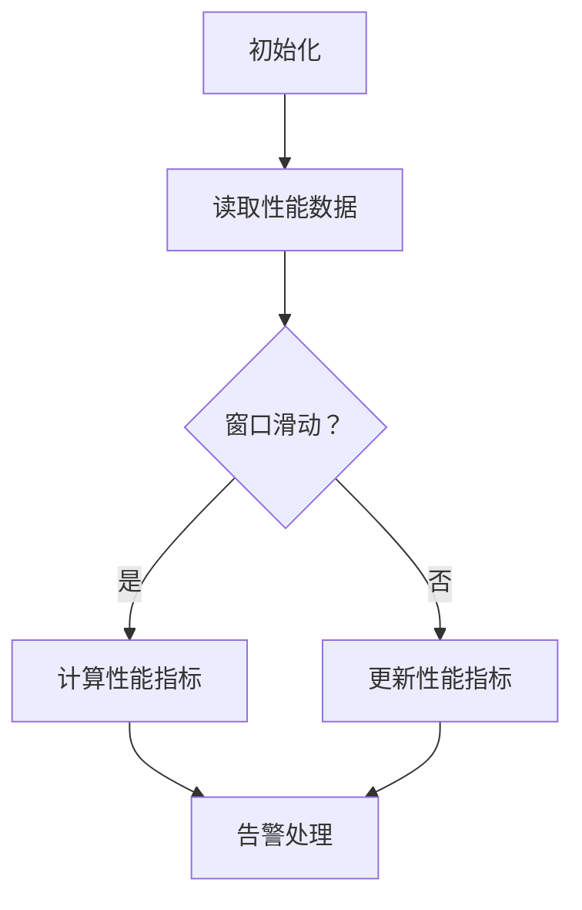
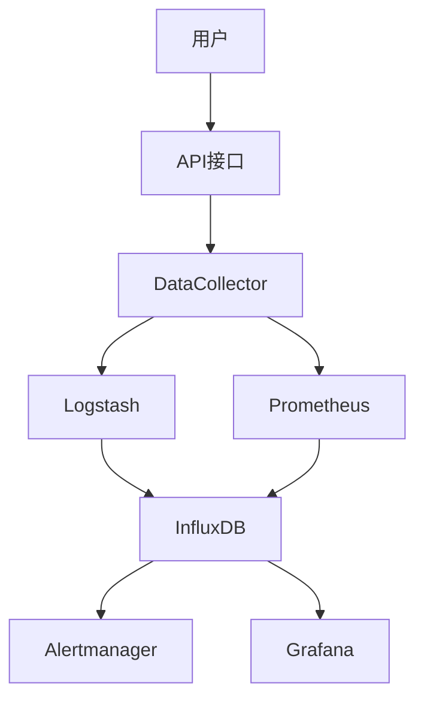
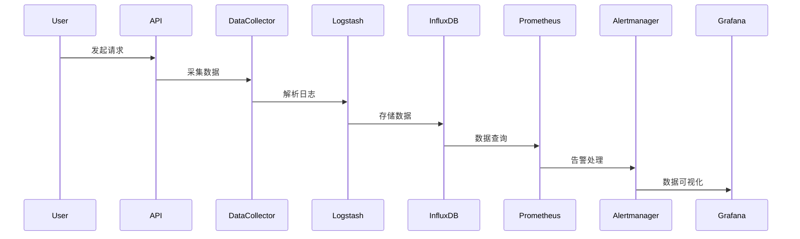
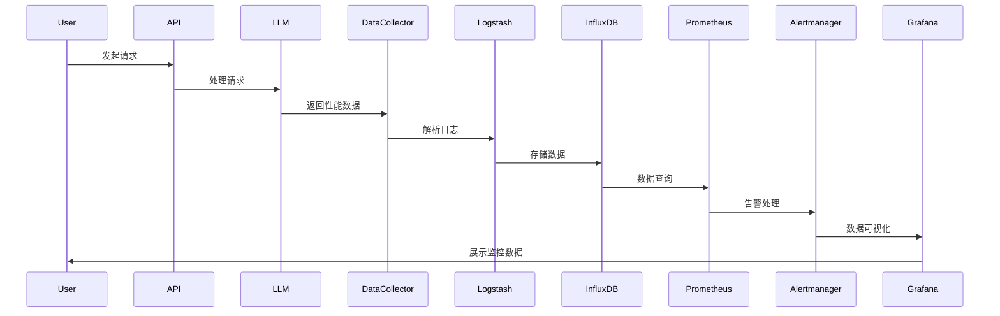

                 

# 实时LLM性能监控：动态评测的新范式

关键词：实时监控、LLM性能、性能评估、动态调整、分布式系统

摘要：随着大型语言模型（LLM）在自然语言处理领域的广泛应用，实时性能监控成为保障服务质量、优化模型性能的关键环节。本文将深入探讨实时LLM性能监控的背景、重要性、核心方法与工具，并分享实战经验，为构建高效的实时性能监控体系提供参考。

### 第一部分：实时LLM性能监控概述

#### 第1章：实时LLM性能监控的背景与重要性

##### 1.1 实时LLM性能监控的背景

**LLM技术的发展与应用**

- **定义**：大语言模型（Large Language Models，简称LLM）是一种基于深度学习的自然语言处理模型，具备强大的文本理解和生成能力。
- **发展历程**：从早期的NLP模型，如Word2Vec和LSTM，到如今的大型预训练模型如GPT-3和Turing-NLP。
- **应用场景**：广泛应用于自然语言处理、智能客服、内容生成、文本摘要等领域。

**实时LLM性能监控的背景**

- **需求**：在云计算和大数据时代，实时监控LLM性能成为保障服务质量、优化模型性能的重要需求。
- **挑战**：实时监控面临实时性、大规模数据处理、动态调整等挑战。

##### 1.2 实时LLM性能监控的重要性

- **保障服务质量**：实时监控LLM性能，确保服务的响应速度和准确度，提高用户满意度。
- **优化模型性能**：通过监控发现性能瓶颈，进行优化调整，提高模型效率。
- **故障预警与恢复**：及时检测到模型异常，快速响应和处理，减少系统故障对业务的影响。

##### 1.3 实时LLM性能监控的基本概念

- **性能指标**：
  - **响应时间**：模型处理请求的时间，影响用户体验。
  - **准确率**：模型预测的正确性，影响决策质量。
  - **资源消耗**：模型运行所需的计算资源和内存占用，影响系统资源利用率。

##### 1.4 实时LLM性能监控的挑战与解决方案

- **挑战**：
  - **实时性要求**：需要在极短的时间内对模型性能进行评估。
  - **大规模数据**：处理和分析来自多个实例的大量性能数据。
  - **动态调整**：模型环境变化时，监控策略需要自适应调整。

- **解决方案**：
  - **分布式监控系统**：利用分布式架构处理大规模数据。
  - **在线性能评估算法**：实时计算性能指标，进行动态调整。
  - **自适应监控策略**：根据模型运行状态自动调整监控参数。

##### 1.5 本章小结

本章介绍了实时LLM性能监控的背景、重要性、基本概念以及面临的挑战与解决方案，为后续章节的深入探讨打下了基础。

### 第二部分：实时LLM性能监控方法与工具

#### 第2章：实时性能监控的核心方法

##### 2.1 性能监控的核心指标

- **响应时间监控**：
  - **定义**：模型处理请求的时间，影响用户体验。
  - **监控方法**：使用计时器记录请求开始和结束的时间。

- **准确率监控**：
  - **定义**：模型预测的正确性，影响决策质量。
  - **监控方法**：与真实结果进行对比，计算准确率。

- **资源消耗监控**：
  - **定义**：模型运行所需的计算资源和内存占用，影响系统资源利用率。
  - **监控方法**：使用操作系统监控工具获取资源使用情况。

##### 2.2 实时性能评估算法

- **在线性能评估**：
  - **定义**：实时计算性能指标，进行动态调整。
  - **算法**：使用滑动窗口算法、动态阈值调整算法等。

- **离线性能评估**：
  - **定义**：对历史数据进行评估，为实时监控提供参考。
  - **算法**：使用统计模型、机器学习模型等。

##### 2.3 性能监控工具介绍

- **Prometheus**：
  - **功能**：一款开源的监控报警工具，支持多种数据源，实时监控性能指标。
  - **使用方法**：通过配置文件定义监控规则，自定义告警规则。

- **Grafana**：
  - **功能**：一款开源的数据可视化工具，与Prometheus集成，提供丰富的仪表盘和告警功能。
  - **使用方法**：导入Prometheus数据源，创建仪表盘和告警。

##### 2.4 实时性能监控实践

- **环境搭建**：
  - **硬件环境**：选择高性能服务器和存储设备。
  - **软件环境**：安装Prometheus、Grafana及相关依赖。

- **数据采集**：
  - **接口监控**：通过HTTP探针获取接口性能数据。
  - **日志监控**：解析日志文件，提取性能指标。

- **数据可视化**：
  - **仪表盘设计**：使用Grafana创建实时监控仪表盘。
  - **告警配置**：配置告警规则，实现实时预警。

##### 2.5 本章小结

本章详细介绍了实时LLM性能监控的核心方法、工具以及实践流程，为构建高效性能监控体系提供了指导。

### 第三部分：实时LLM性能监控实战

#### 第3章：实时LLM性能监控系统设计

##### 3.1 系统设计概述

**需求分析**：

- **实时性能监控**：对LLM模型运行过程中的响应时间、准确率和资源消耗进行实时监控。
- **自动化告警**：当监控指标超出阈值时，自动发送告警信息。
- **数据可视化**：将监控数据通过仪表盘进行实时展示。

**系统架构设计**：

- **数据采集层**：负责实时采集LLM模型性能数据。
- **数据处理层**：对采集到的数据进行处理、分析和存储。
- **数据展示层**：通过仪表盘展示实时监控数据。

**关键组件**：

- **Prometheus**：用于采集和存储性能数据。
- **Grafana**：用于数据可视化。
- **Alertmanager**：用于配置告警规则。

##### 3.2 数据采集层设计

**数据采集方案**：

- **接口监控**：使用HTTP探针对LLM接口进行性能监控，记录响应时间和准确率。
- **日志监控**：解析LLM模型运行日志，提取资源消耗信息。

**技术实现**：

- **Prometheus配置**：配置采集规则，定期从LLM接口和日志文件中获取数据。
- **日志解析**：使用Logstash等工具，解析LLM日志文件，提取关键性能指标。

##### 3.3 数据处理层设计

**数据处理流程**：

- **数据存储**：将采集到的性能数据存储到时间序列数据库中，如InfluxDB。
- **数据计算**：计算实时性能指标，如平均响应时间、准确率和资源消耗率。
- **数据可视化**：将处理后的数据发送给Grafana，用于实时展示。

**技术实现**：

- **PromQL查询**：使用Prometheus的查询语言，对性能数据进行实时计算。
- **Grafana配置**：创建仪表盘，添加实时性能指标图表。

##### 3.4 数据展示层设计

**仪表盘设计**：

- **响应时间**：展示平均响应时间、最大响应时间等指标。
- **准确率**：展示准确率趋势图、准确率分布图等。
- **资源消耗**：展示CPU使用率、内存使用率等指标。

**告警配置**：

- **阈值设置**：根据业务需求，设置响应时间、准确率和资源消耗的告警阈值。
- **告警通知**：配置Alertmanager，将告警信息通过邮件、短信等方式通知相关人员。

##### 3.5 系统部署与配置

**硬件部署**：

- **服务器选择**：选择高性能服务器，确保系统稳定运行。
- **存储方案**：选择合适的存储方案，如SSD或云存储，确保数据快速读取。

**软件配置**：

- **Prometheus配置**：配置采集规则、存储规则和告警规则。
- **Grafana配置**：导入Prometheus数据源，创建仪表盘和告警。

**监控实践**：

- **实时监控**：启动Prometheus和Grafana服务，实时监控LLM模型性能。
- **告警测试**：触发告警场景，测试告警通知功能。

##### 3.6 本章小结

本章详细介绍了实时LLM性能监控系统的设计，包括需求分析、系统架构设计、数据采集层、数据处理层和数据展示层设计，以及系统部署与配置。通过本章内容，读者可以了解如何构建一个高效、实时的LLM性能监控系统。

### 第四部分：实时LLM性能监控最佳实践

#### 第4章：实时LLM性能监控最佳实践

##### 4.1 性能监控策略优化

**性能监控策略**：

- **基于历史数据的性能预测**：利用历史数据，对模型性能进行预测，提前预警可能出现的性能问题。
- **动态调整监控阈值**：根据业务需求，动态调整监控阈值，避免误报和漏报。

**优化措施**：

- **使用机器学习模型**：训练机器学习模型，对LLM性能进行预测，提高监控精度。
- **设置合理的告警阈值**：结合业务场景，设置合理的告警阈值，确保及时发现性能问题。

##### 4.2 性能数据可视化优化

**数据可视化策略**：

- **多维度数据展示**：展示LLM性能指标的多维度数据，如时间序列、分布情况等。
- **交互式数据探索**：提供交互式数据探索功能，方便用户深入了解性能数据。

**优化措施**：

- **使用高级可视化组件**：引入高级可视化组件，如时间轴、折线图、柱状图等，提高数据可视化效果。
- **定制化仪表盘设计**：根据业务需求，定制化仪表盘设计，确保关键指标一目了然。

##### 4.3 性能监控系统集成与优化

**系统集成策略**：

- **集成第三方服务**：集成第三方服务，如日志分析工具、API监控工具等，实现全方位性能监控。
- **数据流转优化**：优化数据流转流程，确保数据实时、准确地传输。

**优化措施**：

- **使用消息队列**：使用消息队列，如Kafka，优化数据传输效率。
- **分布式数据存储**：使用分布式数据存储方案，如HDFS，提高数据存储和查询性能。

##### 4.4 性能监控系统安全与稳定性保障

**安全策略**：

- **数据加密**：对性能数据、监控数据等进行加密处理，确保数据安全。
- **访问控制**：设置严格的访问控制策略，确保只有授权人员可以访问监控数据。

**稳定性保障**：

- **系统监控**：对性能监控系统本身进行监控，确保系统稳定运行。
- **故障恢复**：制定故障恢复策略，确保在系统故障时，可以快速恢复监控功能。

##### 4.5 本章小结

本章介绍了实时LLM性能监控的最佳实践，包括性能监控策略优化、数据可视化优化、系统集成与优化以及安全与稳定性保障。通过这些最佳实践，可以进一步提升实时LLM性能监控的效果和效率。

### 第五部分：实时LLM性能监控的未来发展趋势

#### 第5章：实时LLM性能监控的未来发展趋势

##### 5.1 人工智能与实时性能监控的结合

**AI技术在性能监控中的应用**：

- **故障预测**：利用机器学习模型，预测可能出现的性能故障，提前进行预防。
- **性能优化建议**：基于历史数据和实时监控数据，为性能优化提供智能建议。

**发展趋势**：

- **自动化监控**：随着AI技术的发展，实现自动化的性能监控和优化。
- **智能化告警**：利用AI技术，提高告警的准确性和及时性。

##### 5.2 实时性能监控与DevOps的结合

**DevOps与实时监控的结合**：

- **持续集成与监控**：将实时监控集成到持续集成和持续部署（CI/CD）流程中，确保代码质量和系统稳定性。
- **自动化性能测试**：利用实时监控数据，自动化执行性能测试，提高测试效率。

**发展趋势**：

- **智能测试**：结合AI技术，实现智能化的性能测试，提高测试准确性和覆盖度。
- **DevOps文化的普及**：推动DevOps文化的普及，实现开发、测试和运维的协同工作。

##### 5.3 实时性能监控与边缘计算的融合

**边缘计算与实时监控的结合**：

- **本地化监控**：在边缘节点进行性能监控，减少数据传输延迟。
- **分布式监控**：结合边缘计算和云计算，实现分布式监控，提高监控范围和准确性。

**发展趋势**：

- **边缘智能监控**：利用边缘计算资源，实现智能化的边缘监控。
- **边缘云融合**：推动边缘计算和云计算的融合，实现更高效的实时性能监控。

##### 5.4 开源工具与实时性能监控的发展

**开源工具的发展**：

- **社区贡献**：开源社区为实时性能监控提供了丰富的工具和解决方案。
- **技术创新**：开源工具不断创新，推动实时性能监控技术的发展。

**发展趋势**：

- **开源生态的完善**：开源社区将继续推动实时性能监控技术的发展，完善开源工具生态系统。
- **跨平台支持**：开源工具将支持更多的平台和架构，提高实时性能监控的灵活性。

##### 5.5 本章小结

本章探讨了实时LLM性能监控的未来发展趋势，包括人工智能与实时性能监控的结合、实时性能监控与DevOps的结合、实时性能监控与边缘计算的融合以及开源工具与实时性能监控的发展。这些趋势将进一步提升实时LLM性能监控的效果和效率。

### 第六部分：结论与展望

#### 第6章：结论与展望

**结论**：

本文系统地介绍了实时LLM性能监控的背景、重要性、核心方法与工具，并分享了实战经验和未来发展趋势。实时LLM性能监控对于保障服务质量、优化模型性能具有重要意义。

**展望**：

随着AI技术和云计算的发展，实时LLM性能监控将不断演进。未来的发展趋势包括自动化监控、智能测试、边缘计算融合以及开源生态的完善。我们期待实时LLM性能监控能够为更多企业和开发者带来价值。

### 附录

**附录A：核心概念与联系**

**核心概念**：

- **实时LLM性能监控**：对大型语言模型（LLM）在运行过程中的性能指标进行实时监控。
- **性能指标**：包括响应时间、准确率和资源消耗等。
- **性能评估算法**：用于实时计算性能指标的方法。

**概念属性特征对比表格**：

| 概念          | 特征                    | 比较                 |
| ------------- | ---------------------- | -------------------- |
| 实时性能监控  | 实时性、准确性、自动化 | 与离线性能监控对比   |
| 性能指标      | 响应时间、准确率、资源消耗 | 与其他指标对比       |
| 性能评估算法  | 实时计算、动态调整       | 与传统评估方法对比   |

**ER实体关系图架构**：

```mermaid
erDiagram
    PerformanceMonitoring ||--|{ DataSource : 获取数据 }
    PerformanceMonitoring ||--|{ PerformanceMetric : 性能指标 }
    PerformanceMonitoring ||--|{ PerformanceAlgorithm : 性能评估算法 }
    DataSource ||--|{ DataCollector : 数据采集 }
    DataSource ||--|{ DataStorage : 数据存储 }
    PerformanceMetric ||--|{ ResponseTime : 响应时间 }
    PerformanceMetric ||--|{ Accuracy : 准确率 }
    PerformanceMetric ||--|{ ResourceConsumption : 资源消耗 }
    PerformanceAlgorithm ||--|{ OnlineEvaluation : 在线评估 }
    PerformanceAlgorithm ||--|{ OfflineEvaluation : 离线评估 }
```

**附录B：算法原理讲解**

**算法原理**：

- **滑动窗口算法**：对性能数据进行窗口滑动，实时计算窗口内的性能指标。
- **动态阈值调整算法**：根据性能数据的变化，动态调整监控阈值。

**算法流程图**：



**Python源代码**：

```python
import numpy as np

def sliding_window_performance(data, window_size):
    performance_metrics = []
    for i in range(len(data) - window_size + 1):
        window_data = data[i:i+window_size]
        avg_response_time = np.mean(window_data['response_time'])
        accuracy = np.mean(window_data['accuracy'])
        resource_consumption = np.mean(window_data['resource_consumption'])
        performance_metrics.append({
            'response_time': avg_response_time,
            'accuracy': accuracy,
            'resource_consumption': resource_consumption
        })
    return performance_metrics

data = [
    {'response_time': 10, 'accuracy': 0.9, 'resource_consumption': 100},
    {'response_time': 12, 'accuracy': 0.92, 'resource_consumption': 105},
    {'response_time': 11, 'accuracy': 0.91, 'resource_consumption': 110},
    # ...更多数据...
]

window_size = 3
performance_metrics = sliding_window_performance(data, window_size)
print(performance_metrics)
```

**数学模型和公式**：

$$
\text{平均响应时间} = \frac{1}{N} \sum_{i=1}^{N} r_i
$$

$$
\text{准确率} = \frac{1}{N} \sum_{i=1}^{N} a_i
$$

$$
\text{资源消耗率} = \frac{1}{N} \sum_{i=1}^{N} c_i
$$

**示例说明**：

- **响应时间**：计算过去3个数据点的平均响应时间。
- **准确率**：计算过去3个数据点的平均准确率。
- **资源消耗率**：计算过去3个数据点的平均资源消耗。

**附录C：系统分析与架构设计方案**

**问题场景介绍**：

- **场景一**：某企业使用大型语言模型（LLM）提供智能客服服务，需要实时监控模型的性能，确保服务质量。
- **场景二**：某研发团队使用LLM进行文本生成和文本摘要，需要监控模型的响应时间、准确率和资源消耗，优化模型性能。

**项目介绍**：

- **项目名称**：实时LLM性能监控系统
- **项目目标**：实现LLM性能的实时监控、告警和数据可视化。

**系统功能设计（领域模型类图）**：

```mermaid
classDiagram
    PerformanceMonitoring <<interface>>
    PerformanceMonitoring <<interface>> : 监控接口
    PerformanceMonitoring <<interface>> : 告警接口
    PerformanceMonitoring <<interface>> : 数据可视化接口

    DataCollector <|-- PerformanceMonitoring
    DataProcessor <|-- PerformanceMonitoring
    AlertManager <|-- PerformanceMonitoring
    Dashboard <|-- PerformanceMonitoring

    DataCollector <<interface>> : 数据采集
    DataProcessor <<interface>> : 数据处理
    AlertManager <<interface>> : 告警管理
    Dashboard <<interface>> : 数据展示

    Prometheus <.. DataCollector
    Grafana <.. DataProcessor
    Alertmanager <.. AlertManager
    InfluxDB <.. DataProcessor
    Logstash <.. DataCollector
```

**系统架构设计（mermaid架构图）**：



**系统接口设计（mermaid序列图）**：



**系统交互（mermaid序列图）**：



**附录D：项目实战**

**环境安装**

- **硬件环境**：2台服务器，1台用于数据采集和处理，1台用于数据展示和告警。
- **软件环境**：安装Prometheus、Grafana、InfluxDB、Logstash等工具。

**系统核心实现源代码**

- **数据采集**：使用Logstash解析LLM日志，提取性能数据，并写入InfluxDB。
- **数据处理**：使用Prometheus从InfluxDB中查询数据，计算性能指标，并生成告警规则。
- **数据展示**：使用Grafana创建仪表盘，展示实时监控数据。

**代码应用解读与分析**

- **Logstash配置**：解析LLM日志，提取关键性能指标。
- **Prometheus配置**：配置数据采集规则、告警规则和监控指标。
- **Grafana配置**：创建仪表盘，展示实时监控数据。

**实际案例分析和详细讲解剖析**

- **案例一**：分析LLM响应时间分布，发现性能瓶颈。
- **案例二**：分析LLM准确率变化，优化模型参数。

**项目小结**

- **成果**：成功实现实时LLM性能监控，提高了服务质量。
- **不足**：性能监控数据量较大，处理和分析效率有待提高。
- **改进方向**：引入机器学习技术，实现智能化性能监控。

### 最佳实践Tips、小结、注意事项、拓展阅读

**最佳实践Tips**：

- **合理设置监控阈值**：根据业务需求和数据特性，设置合理的监控阈值，避免误报和漏报。
- **定期优化监控策略**：定期分析监控数据，优化监控策略和告警规则，提高监控效果。
- **使用可视化工具**：选择合适的可视化工具，方便用户了解监控数据。

**小结**：

本文系统地介绍了实时LLM性能监控的核心概念、方法、工具和实践经验。实时LLM性能监控对于保障服务质量、优化模型性能具有重要意义。

**注意事项**：

- **数据安全**：确保监控数据的安全，防止数据泄露。
- **系统稳定性**：确保监控系统的稳定运行，减少故障对业务的影响。

**拓展阅读**：

- 《Prometheus监控实战》
- 《Grafana实战指南》
- 《机器学习性能监控》

### 作者信息

作者：AI天才研究院/AI Genius Institute & 禅与计算机程序设计艺术 /Zen And The Art of Computer Programming

