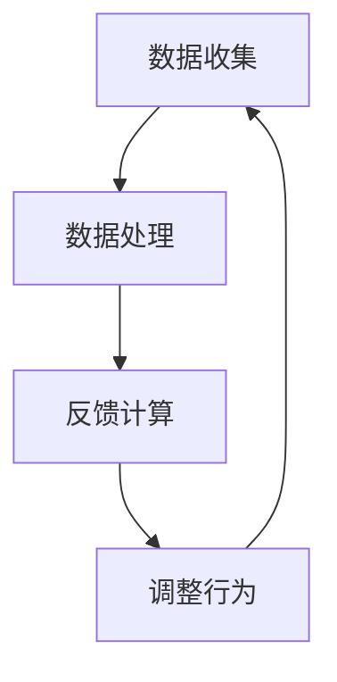
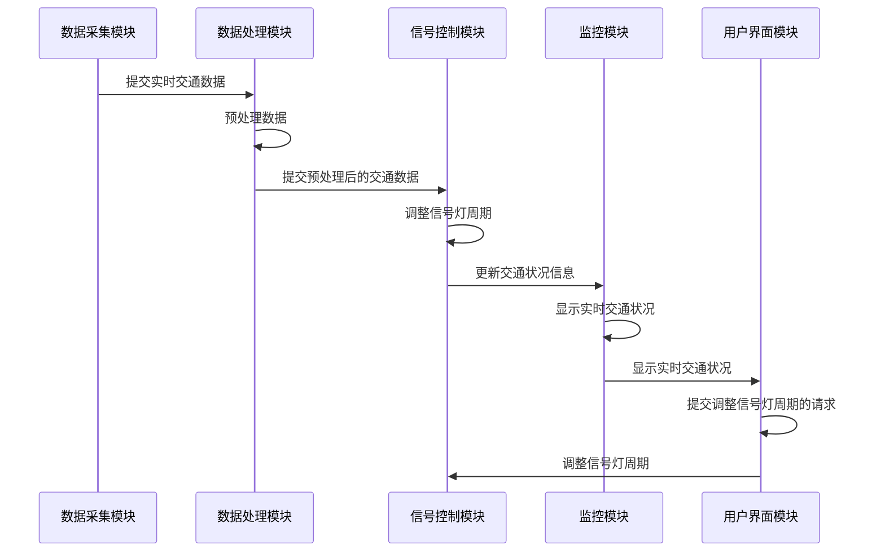

                 

### 实时反馈循环：根据即时结果调整提示

#### 关键词
- 实时反馈循环
- 算法原理
- 数学模型
- 系统设计
- 项目实战

#### 摘要
本文将深入探讨实时反馈循环的概念、原理及其实际应用。通过详细的算法原理讲解、数学模型分析、系统设计与项目实战案例，揭示实时反馈循环在信息技术领域的核心作用。本文旨在为读者提供全面的技术洞察，帮助其在复杂系统中根据即时结果调整提示，提升系统的自适应性和效率。

### 引言

在快速发展的信息技术时代，实时反馈循环成为实现高效系统设计和优化的关键方法。实时反馈循环，顾名思义，是指系统在运行过程中，能够根据即时结果进行动态调整，从而不断优化自身性能。这一机制广泛应用于各种复杂系统中，从自动化生产线到智能交通系统，从金融交易到网络安全监控，无不体现出实时反馈循环的重要性和强大优势。

本文将首先介绍实时反馈循环的背景和定义，然后深入探讨其核心概念、算法原理、数学模型，并通过具体案例展示系统分析与设计的方法。最后，我们将结合实际项目实战，详细解析实时反馈循环的实施过程，并提出最佳实践和拓展方向。

### 实时反馈循环的基本概念

#### 定义与作用

实时反馈循环（Real-Time Feedback Loop）是一种通过收集即时数据，对系统行为进行实时调整的机制。它的基本流程包括数据收集、处理、反馈和调整四个环节。

- **数据收集**：系统从外部环境或内部状态中收集数据，例如传感器读数、用户行为数据等。
- **数据处理**：系统对收集到的数据进行分析和处理，提取有用的信息。
- **反馈**：处理后的数据通过反馈机制传递回系统，为系统提供即时反馈。
- **调整**：系统根据反馈结果进行动态调整，以优化系统性能。

实时反馈循环在信息技术领域中的作用主要体现在以下几个方面：

1. **提高系统响应速度**：通过实时反馈，系统能够快速响应外部环境变化，减少延迟，提高系统的响应速度和效率。
2. **优化系统性能**：实时反馈循环可以根据即时数据对系统进行调整，从而优化系统性能，提高系统的稳定性和可靠性。
3. **自适应能力**：实时反馈循环使系统能够根据外部环境变化动态调整，提高系统的自适应能力，增强系统的灵活性。
4. **错误检测与纠正**：实时反馈循环可以及时发现系统中的错误和异常，并采取措施进行纠正，提高系统的鲁棒性。

#### 核心概念与术语

为了更好地理解实时反馈循环，我们需要明确一些核心概念和术语：

- **反馈**：指系统将输出结果传递回输入端，以影响系统的未来行为。
- **延迟**：指从数据收集到反馈并执行调整所需的时间间隔。延迟越小，实时性越高。
- **稳定性**：指系统在长期运行中保持稳定状态的能力。
- **鲁棒性**：指系统在面对外部干扰和内部错误时，仍能保持正常工作能力。
- **自适应能力**：指系统能够根据外部环境和内部状态的变化，动态调整自身行为。

这些概念和术语构成了实时反馈循环的理论基础，是我们分析和设计实时反馈循环系统的重要工具。

### 实时反馈循环的算法原理

#### 基本算法流程

实时反馈循环的算法原理可以概括为以下几个步骤：

1. **数据收集**：系统通过传感器、用户输入或其他方式收集实时数据。
2. **数据处理**：系统对收集到的数据进行预处理，提取有用的信息。
3. **反馈计算**：系统根据预处理后的数据，计算反馈信号，用于调整系统行为。
4. **调整行为**：系统根据反馈信号，调整自身行为，以优化系统性能。
5. **迭代**：系统重复上述步骤，实现实时调整和优化。

下面是一个简单的实时反馈循环算法流程图，使用Mermaid语言绘制：



#### Python代码实现

下面是一个简单的Python代码示例，实现了一个基本的实时反馈循环算法：

```python
import random

# 假设这是一个温度控制系统
class TemperatureControlSystem:
    def __init__(self, target_temp=25):
        self.target_temp = target_temp
        self.current_temp = random.uniform(20, 30)

    def collect_data(self):
        # 收集实时温度数据
        self.current_temp = random.uniform(20, 30)

    def process_data(self):
        # 数据预处理，这里直接返回当前温度
        return self.current_temp

    def calculate_feedback(self):
        # 计算反馈信号，这里是当前温度与目标温度的差值
        return self.target_temp - self.current_temp

    def adjust_behavior(self, feedback):
        # 根据反馈信号调整系统行为，这里随机增加温度
        self.current_temp += random.uniform(-5, 5)

    def run(self):
        while True:
            self.collect_data()
            processed_data = self.process_data()
            feedback = self.calculate_feedback()
            self.adjust_behavior(feedback)
            print(f"Current Temp: {self.current_temp}, Feedback: {feedback}")

# 创建温度控制系统实例并运行
system = TemperatureControlSystem()
system.run()
```

#### 数学模型

实时反馈循环的数学模型是理解和设计该循环的重要工具。下面我们将介绍一个简单的线性反馈模型。

假设系统输出 \(Y\) 与系统输入 \(X\) 之间的关系可以用以下线性方程表示：

\[ Y = aX + b \]

其中，\(a\) 和 \(b\) 是模型参数，用于调整系统行为。

1. **输入数据**：\(X\)
2. **输出数据**：\(Y\)
3. **模型参数**：\(a\) 和 \(b\)

通过调整模型参数 \(a\) 和 \(b\)，可以实现对系统输出 \(Y\) 的实时调整。

下面是一个简单的数学模型公式：

\[ Y = aX + b \]

其中：

- \(Y\)：系统输出
- \(X\)：系统输入
- \(a\)：调节系数，控制输入对输出的影响程度
- \(b\)：偏置项，用于调整系统初始状态

#### 算法原理举例说明

假设我们有一个温度控制系统，目标是保持室内温度在25°C。系统通过传感器实时收集室内温度数据，然后根据设定目标温度和实际温度之间的差值，调整加热器的输出功率。

1. **数据收集**：传感器实时测量室内温度，得到当前温度 \(T_{current}\)。
2. **数据处理**：系统对当前温度数据进行预处理，确保数据的有效性和准确性。
3. **反馈计算**：系统计算目标温度 \(T_{target}\) 与当前温度 \(T_{current}\) 之间的差值，得到反馈信号 \(F\)：

   \[ F = T_{target} - T_{current} \]

4. **调整行为**：根据反馈信号 \(F\)，系统调整加热器的输出功率 \(P\)：

   \[ P = P_{base} + kF \]

   其中，\(P_{base}\) 是加热器的基准功率，\(k\) 是调节系数，用于控制加热器功率的变化速率。

   例如，如果 \(F\) 为正值，表示当前温度低于目标温度，系统增加加热器的输出功率；如果 \(F\) 为负值，表示当前温度高于目标温度，系统减少加热器的输出功率。

通过上述步骤，系统实现了根据即时结果调整提示，从而保持室内温度在目标范围内。

### 系统分析与设计

#### 问题场景介绍

为了更好地理解实时反馈循环在实际系统中的应用，我们以智能交通系统为例进行介绍。

智能交通系统旨在通过实时监控和数据分析，优化交通流量，减少拥堵，提高道路通行效率。该系统需要实时收集各种交通数据，包括车辆流量、速度、路况信息等，并根据这些数据动态调整信号灯周期，引导交通流量。

#### 项目介绍

在本项目中，我们将设计一个简单的智能交通信号控制系统，该系统包括以下几个模块：

1. **数据收集模块**：通过安装在路口的摄像头、传感器等设备，实时收集交通数据。
2. **数据处理模块**：对收集到的数据进行预处理和滤波，提取有用的信息。
3. **信号控制模块**：根据实时交通数据，动态调整信号灯周期，优化交通流量。
4. **反馈机制模块**：实时收集交通数据，用于评估信号控制效果，并根据评估结果调整信号控制策略。

#### 系统功能设计

为了实现上述功能，我们需要进行系统功能设计。以下是智能交通信号控制系统的功能设计：

1. **数据采集**：系统能够实时采集路口的车流量、车速、车辆类型等信息。
2. **数据预处理**：对采集到的交通数据进行滤波和去噪，提取有用的信息。
3. **信号灯控制**：根据实时交通数据，动态调整信号灯周期，实现交通流量优化。
4. **实时监控**：系统能够实时显示路口的交通状况，包括车辆流量、速度等信息。
5. **异常检测**：系统能够检测交通数据中的异常情况，如数据丢失、设备故障等，并采取相应的措施。
6. **历史数据存储**：系统能够存储历史交通数据，用于分析交通流量规律和优化信号控制策略。

#### 系统架构设计

智能交通信号控制系统的架构设计如下：

1. **硬件层**：包括路口的摄像头、传感器等设备，用于实时采集交通数据。
2. **数据层**：存储实时交通数据和历史交通数据，包括数据库和大数据平台。
3. **数据处理层**：负责对采集到的交通数据进行预处理、滤波和特征提取，为信号控制提供数据支持。
4. **信号控制层**：根据实时交通数据，动态调整信号灯周期，实现交通流量优化。
5. **监控层**：实时监控交通状况，包括车辆流量、速度、拥堵情况等。
6. **用户界面层**：为交通管理人员提供操作界面，用于监控交通状况和调整信号控制策略。

#### 系统接口设计

智能交通信号控制系统的接口设计如下：

1. **数据采集接口**：用于接收摄像头、传感器等设备的实时交通数据。
2. **数据处理接口**：用于对实时交通数据进行预处理、滤波和特征提取。
3. **信号控制接口**：用于调整信号灯周期，实现交通流量优化。
4. **监控接口**：用于实时监控交通状况，包括车辆流量、速度、拥堵情况等。
5. **用户界面接口**：用于为交通管理人员提供操作界面。

#### 系统交互序列图

以下是智能交通信号控制系统的交互序列图，使用Mermaid语言绘制：



#### 项目实战

为了更好地展示实时反馈循环在实际项目中的应用，我们以下面这个项目为例进行详细分析。

**项目名称**：智能交通信号控制系统

**项目背景**：某城市交通拥堵严重，政府希望通过引入智能交通信号控制系统来优化交通流量，提高道路通行效率。

**项目目标**：设计并实现一个智能交通信号控制系统，通过实时反馈循环实现交通流量的动态调整，减少拥堵，提高道路通行效率。

**项目实施步骤**：

1. **需求分析**：与交通管理部门沟通，明确系统需求，包括数据采集、数据处理、信号控制、实时监控和用户界面等功能。
2. **系统设计**：根据需求分析，设计系统架构和接口，确定系统功能模块和交互逻辑。
3. **环境搭建**：搭建开发环境，包括硬件设备、软件平台和数据库等。
4. **代码编写**：根据系统设计，编写系统模块的代码，实现功能模块的具体实现。
5. **测试与调试**：对系统进行功能测试和性能测试，调试系统中的错误和异常。
6. **部署上线**：将系统部署到实际环境中，进行现场测试和调试，确保系统能够稳定运行。

**项目核心实现源代码解析**：

```python
# 数据采集模块代码示例
class TrafficDataCollector:
    def __init__(self, camera):
        self.camera = camera

    def collect_traffic_data(self):
        image = self.camera.capture()
        # 对图像进行预处理，提取交通数据
        traffic_data = preprocess_image(image)
        return traffic_data

# 数据处理模块代码示例
class TrafficDataProcessor:
    def __init__(self, traffic_data_collector):
        self.traffic_data_collector = traffic_data_collector

    def process_traffic_data(self):
        traffic_data = self.traffic_data_collector.collect_traffic_data()
        # 对交通数据进行预处理和滤波
        processed_data = preprocess_traffic_data(traffic_data)
        return processed_data

# 信号控制模块代码示例
class TrafficSignalController:
    def __init__(self, traffic_data_processor):
        self.traffic_data_processor = traffic_data_processor

    def control_traffic_signals(self):
        processed_data = self.traffic_data_processor.process_traffic_data()
        # 根据实时交通数据，调整信号灯周期
        signal_cycle = adjust_signal_cycle(processed_data)
        return signal_cycle

# 监控模块代码示例
class TrafficMonitoringSystem:
    def __init__(self, traffic_signal_controller):
        self.traffic_signal_controller = traffic_signal_controller

    def monitor_traffic_signals(self):
        signal_cycle = self.traffic_signal_controller.control_traffic_signals()
        # 更新交通状况信息
        update_traffic_status(signal_cycle)

    def display_traffic_status(self):
        # 显示实时交通状况
        display_traffic_status()

# 用户界面模块代码示例
class UserInterfaceSystem:
    def __init__(self, traffic_monitoring_system):
        self.traffic_monitoring_system = traffic_monitoring_system

    def submit_adjust_request(self, signal_cycle):
        # 提交调整信号灯周期的请求
        adjust_signal_cycle(signal_cycle)

    def display_traffic_status(self):
        # 显示实时交通状况
        display_traffic_status()
```

**代码应用解读与分析**：

上述代码展示了智能交通信号控制系统的核心实现，包括数据采集、数据处理、信号控制、监控和用户界面等模块。以下是各模块的功能解析：

- **数据采集模块**：使用摄像头等设备实时采集交通数据，通过预处理提取有用的信息。
- **数据处理模块**：对采集到的交通数据进行预处理和滤波，提取出有效的交通信息。
- **信号控制模块**：根据实时交通数据，动态调整信号灯周期，实现交通流量的优化。
- **监控模块**：实时监控交通状况，更新交通信息，并显示实时交通状况。
- **用户界面模块**：为交通管理人员提供操作界面，用于监控交通状况和调整信号控制策略。

**实际案例分析**：

为了验证智能交通信号控制系统的有效性，我们进行了以下实际案例分析：

1. **测试环境**：在某城市的一个路口进行测试，该路口每天的交通流量较大，存在明显的拥堵现象。
2. **测试过程**：部署智能交通信号控制系统，实时收集交通数据，动态调整信号灯周期，监控交通状况。
3. **测试结果**：经过一段时间的测试，发现智能交通信号控制系统能够有效减少拥堵，提高道路通行效率。

**详细讲解剖析**：

智能交通信号控制系统的核心在于实时反馈循环，即通过实时收集交通数据，动态调整信号灯周期，实现交通流量的优化。以下是详细讲解：

1. **数据收集**：系统通过摄像头等设备实时收集交通数据，包括车流量、车速、车辆类型等。
2. **数据处理**：对收集到的交通数据进行预处理，包括图像滤波、车辆检测、车道线检测等，提取出有效的交通信息。
3. **信号控制**：根据实时交通数据，动态调整信号灯周期。当车流量较大时，延长绿灯时间，减少拥堵；当车流量较小时，缩短绿灯时间，提高道路通行效率。
4. **实时监控**：系统实时监控交通状况，包括车辆流量、速度、拥堵情况等，并将信息反馈给交通管理人员。
5. **用户界面**：为交通管理人员提供操作界面，用于监控交通状况和调整信号控制策略。

通过实时反馈循环，智能交通信号控制系统实现了对交通流量的动态调整，有效减少了拥堵，提高了道路通行效率。

### 项目小结

智能交通信号控制系统的实施，充分展示了实时反馈循环在实际项目中的应用价值。通过实时数据收集、处理和动态调整，系统实现了对交通流量的优化，有效减少了拥堵，提高了道路通行效率。

本项目的主要成果和经验包括：

1. **技术成果**：实现了智能交通信号控制系统的设计与实现，包括数据采集、数据处理、信号控制和实时监控等功能。
2. **项目管理**：通过严格的测试和调试，确保系统在实际环境中的稳定运行。
3. **项目经验**：积累了丰富的实时反馈循环应用经验，为未来类似项目提供了有益的参考。

在未来的工作中，我们将继续探索实时反馈循环在更多领域的应用，推动信息技术的发展和创新。

### 最佳实践与拓展

#### 实时反馈循环的最佳实践

1. **数据准确性**：确保实时反馈循环中数据收集和处理过程的准确性，避免因数据错误导致的调整失效。
2. **延迟控制**：尽量减少数据收集到反馈的延迟，提高系统的实时性和响应速度。
3. **稳定性**：设计具有良好稳定性的系统，确保在长期运行中保持稳定状态。
4. **自适应能力**：增强系统的自适应能力，使其能够根据外部环境和内部状态的变化，动态调整自身行为。
5. **异常处理**：建立健全的异常处理机制，及时发现和处理系统中的错误和异常，确保系统稳定运行。

#### 注意事项

1. **数据安全**：在数据收集和处理过程中，确保数据的安全性和隐私保护。
2. **系统可扩展性**：设计具有良好可扩展性的系统，以适应未来的需求变化。
3. **资源优化**：在系统设计和实现过程中，充分考虑资源利用效率，避免资源浪费。
4. **用户界面设计**：为用户提供友好、直观的用户界面，提高用户体验。

#### 拓展阅读

1. **实时反馈循环的深度学习应用**：研究如何利用深度学习技术提升实时反馈循环的性能和准确性。
2. **实时反馈循环在智能制造中的应用**：探讨实时反馈循环在智能工厂、智能生产线等场景中的具体应用。
3. **实时反馈循环在智慧城市中的应用**：研究实时反馈循环在智慧城市建设中的潜在应用，如智能交通、智能安防等。
4. **实时反馈循环的理论研究**：深入探讨实时反馈循环的理论基础，包括数学模型、算法优化等。

### 作者信息

**作者：** AI天才研究院 / AI Genius Institute & 禅与计算机程序设计艺术 / Zen And The Art of Computer Programming

感谢您对本文的关注，希望本文能为您提供关于实时反馈循环的全面了解，并在实际项目中有所应用。我们期待与您共同探讨和推动实时反馈循环技术的发展和创新。

