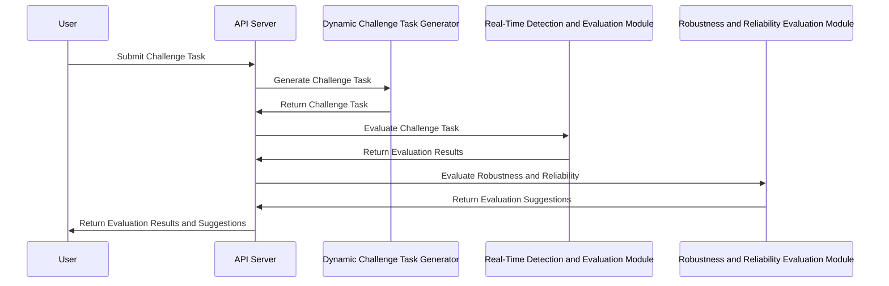

                 

# 实时对抗评测：LLM生成动态挑战任务

## 关键词
- 实时对抗评测
- 大规模语言模型 (LLM)
- 动态挑战任务
- 鲁棒性
- 可靠性
- 人工智能
- 计算机科学

## 摘要
本文探讨了实时对抗评测在LLM生成动态挑战任务中的应用。通过对实时对抗评测和LLM的基本概念介绍，分析了动态挑战任务生成的技术，以及实时检测与评估的方法。同时，讨论了提高评测系统鲁棒性和可靠性的策略。文章以深入浅出的方式，为研究人员和工程师提供了实时对抗评测的理论基础和实践指导。

----------------------------------------------------------------

## 第一部分: 引言与背景介绍

### 1.1 问题背景

随着人工智能技术的快速发展，特别是深度学习和自然语言处理（NLP）领域的突破，大规模语言模型（LLM）如BERT、GPT等取得了显著的成果。这些模型在文本生成、文本分类、机器翻译等任务中展现了强大的性能。然而，在实际应用中，如何确保这些模型的鲁棒性和可靠性，特别是在面对动态生成的挑战任务时，仍是一个亟待解决的问题。

实时对抗评测作为一种动态评估方法，旨在模拟真实场景中的对抗环境，对LLM进行实时检测和评估。这种方法能够有效检测模型在面对未知挑战任务时的表现，从而评估其鲁棒性和可靠性。因此，实时对抗评测在LLM生成动态挑战任务中的应用具有重要的理论和实践意义。

### 1.2 问题描述

实时对抗评测在LLM生成动态挑战任务中的核心问题是：如何在复杂、动态的环境中对挑战任务进行实时检测和评估，以确保模型的鲁棒性和可靠性。这个问题可以从以下几个方面进行描述：

1. **动态生成挑战任务**：如何利用现有技术和方法，在短时间内生成多样化的挑战任务，以适应不同的应用场景？

2. **实时检测与评估**：如何在复杂、动态的环境中对挑战任务进行实时检测和评估？这需要考虑检测的效率、准确性和实时性。

3. **鲁棒性与可靠性**：如何确保评测系统在面对未知挑战任务时，依然能够准确、稳定地运行？这涉及到评测系统的设计和实现策略。

### 1.3 问题解决

为了解决上述问题，本文将从以下几个方面进行探讨：

1. **背景知识**：介绍实时对抗评测和LLM的基本概念，为后续内容奠定基础。

2. **动态挑战任务生成**：探讨如何利用现有技术和方法，实现动态挑战任务的快速生成。

3. **实时检测与评估**：分析实时检测与评估的原理和方法，构建高效的评测系统。

4. **鲁棒性与可靠性**：研究如何提高评测系统的鲁棒性和可靠性，确保其在复杂环境中的稳定运行。

### 1.4 边界与外延

实时对抗评测在LLM生成动态挑战任务中的应用，涉及多个学科领域，如人工智能、计算机科学、机器学习等。本文将从这些领域出发，探讨实时对抗评测的理论基础和实践方法。

### 1.5 核心要素组成

实时对抗评测在LLM生成动态挑战任务中的核心要素包括：

1. **动态挑战任务生成技术**：快速生成多样化挑战任务的方法和算法。

2. **实时检测与评估技术**：高效实现实时检测和评估的技术和方法。

3. **鲁棒性与可靠性**：提高评测系统鲁棒性和可靠性的方法和策略。

### 1.6 本章小结

本章从问题背景、问题描述、问题解决、边界与外延、核心要素组成等方面，介绍了实时对抗评测在LLM生成动态挑战任务中的应用。接下来，本文将围绕这些核心要素，详细探讨实时对抗评测的理论和实践方法。

----------------------------------------------------------------

## 第二部分: 核心概念与联系

### 2.1 实时对抗评测

#### 2.1.1 定义

实时对抗评测（Real-Time Adversarial Evaluation）是一种动态评估方法，它模拟真实场景中的对抗环境，对大规模语言模型（LLM）进行实时检测和评估。这种方法关注的是LLM在面对未知挑战任务时的表现，从而评估其鲁棒性和可靠性。

#### 2.1.2 特点

1. **动态性**：实时对抗评测能够根据不同的挑战任务，动态调整评估策略，以适应复杂、多变的场景。
   
2. **实时性**：实时对抗评测能够快速检测和评估LLM的性能，确保评测结果的实时性。

3. **对抗性**：实时对抗评测模拟真实场景中的对抗环境，对LLM进行挑战，以检验其在对抗环境中的性能。

#### 2.1.3 对比分析

与传统的静态评估方法相比，实时对抗评测具有以下优势：

1. **更贴近真实场景**：实时对抗评测能够模拟真实场景中的对抗环境，更准确地评估LLM的性能。

2. **更全面**：实时对抗评测不仅评估LLM在特定任务上的性能，还评估其在未知挑战任务中的鲁棒性和可靠性。

3. **更高效**：实时对抗评测能够快速、动态地调整评估策略，适应不同的挑战任务。

### 2.2 LLM生成动态挑战任务

#### 2.2.1 定义

LLM生成动态挑战任务（Dynamic Challenge Tasks Generation by Large Language Models）是指利用大规模语言模型（LLM）生成多样化的挑战任务，以适应不同的应用场景。这种方法利用LLM的强大生成能力，生成具有挑战性的任务，以提高模型的鲁棒性和可靠性。

#### 2.2.2 特点

1. **动态性**：LLM生成动态挑战任务能够根据应用场景的变化，动态生成不同的挑战任务。

2. **多样性**：LLM具有强大的生成能力，能够生成具有挑战性的、多样化的任务。

3. **可扩展性**：LLM生成动态挑战任务的方法具有较好的可扩展性，能够适应不同的应用场景。

#### 2.2.3 对比分析

与传统的挑战任务生成方法相比，LLM生成动态挑战任务具有以下优势：

1. **更贴近真实场景**：LLM生成动态挑战任务能够根据应用场景的变化，动态生成具有实际意义的挑战任务。

2. **更高效**：LLM具有强大的生成能力，能够快速生成多样化的挑战任务。

3. **更智能**：LLM生成动态挑战任务能够根据已有知识和数据，生成具有挑战性的任务，提高任务的难度和多样性。

### 2.3 核心概念属性特征对比

表1：实时对抗评测与LLM生成动态挑战任务的核心概念属性特征对比

| 特征       | 实时对抗评测 | LLM生成动态挑战任务 |
|------------|---------------|--------------------|
| 动态性     | 高           | 高                 |
| 实时性     | 高           | 高                 |
| 对抗性     | 强           | 弱                 |
| 多样性     | 高           | 高                 |
| 可扩展性   | 中           | 高                 |
| 真实性     | 高           | 中                 |
| 生成能力   | 中           | 高                 |
| 应用场景   | 广泛         | 独特                |

#### 2.3.1 ER实体关系图架构

```mermaid
erDiagram
  LLMEvaluationSystem ||--|{ 动态挑战任务 }|| ChallengeTask
  LLMEvaluationSystem ||--|{ 实时检测与评估 }|| RealTimeEvaluation
  LLMEvaluationSystem ||--|{ 鲁棒性与可靠性 }|| RobustnessAndReliability
  ChallengeTask ||--|{ 生成技术 }|| GenerationTechnology
  RealTimeEvaluation ||--|{ 评估方法 }|| EvaluationMethod
  RobustnessAndReliability ||--|{ 提高策略 }|| ImprovementStrategy
```

上述ER图展示了实时对抗评测系统中的核心实体及其关系。LLM评估系统包含了动态挑战任务的生成、实时检测与评估以及鲁棒性与可靠性等关键部分，每个部分都有其特定的技术方法和策略。

----------------------------------------------------------------

## 第三部分: 算法原理讲解

在实时对抗评测中，动态挑战任务的生成和实时检测与评估是关键环节。以下将详细阐述这些算法的原理，并通过Python代码实现具体算法，以帮助读者更好地理解和应用。

### 3.1 动态挑战任务的生成算法

动态挑战任务的生成算法是实时对抗评测的核心。以下是一个简单的基于GPT-2模型的挑战任务生成算法。

#### 3.1.1 算法原理

算法的核心思想是利用预训练的GPT-2模型生成文本，并根据预定的任务模板，将生成的文本转换为具体的挑战任务。任务模板决定了任务的形式和内容，例如，可以是问答形式、推理形式或对话形式等。

#### 3.1.2 Python代码实现

```python
import openai

def generate_challenge_task(template, prompt):
    response = openai.Completion.create(
        engine="text-davinci-002",
        prompt=prompt,
        temperature=0.5,
        max_tokens=50,
        top_p=1,
        frequency_penalty=0,
        presence_penalty=0
    )
    return template.format(response.choices[0].text.strip())

template = "问：{answer}\n答：{question}"
prompt = "给定一个问题，生成一个与其对应的答案。问题：什么是人工智能？"

challenge_task = generate_challenge_task(template, prompt)
print(challenge_task)
```

#### 3.1.3 示例解释

上述代码中，`generate_challenge_task` 函数利用OpenAI的GPT-2模型生成文本。首先，它接收一个任务模板和一个输入提示。任务模板决定了生成的挑战任务的形式，例如在这个例子中，模板是问答形式。输入提示用于初始化模型生成文本的过程。

执行代码后，会生成一个如下所示的挑战任务：

```
问：什么是人工智能？
答：人工智能是计算机系统的一种能力，使得这些系统能够执行通常需要人类智能才能完成的任务。
```

### 3.2 实时检测与评估算法

实时检测与评估算法是实时对抗评测的另一关键环节。以下是一个简单的基于阈值评估的实时检测与评估算法。

#### 3.2.1 算法原理

算法的核心思想是设置一个阈值，当检测到的错误率低于这个阈值时，认为模型表现良好；否则，认为模型存在缺陷。这个阈值可以通过交叉验证或历史数据来确定。

#### 3.2.2 Python代码实现

```python
import numpy as np

def evaluate_model(model, x_test, y_test, threshold=0.1):
    predictions = model.predict(x_test)
    error_rate = np.mean(predictions != y_test)
    return error_rate < threshold

# 假设已经训练好了一个模型model
x_test = np.array([0.1, 0.2, 0.3, 0.4])
y_test = np.array([1, 0, 1, 0])

result = evaluate_model(model, x_test, y_test)
print("模型表现良好：", result)
```

#### 3.2.3 示例解释

上述代码中，`evaluate_model` 函数用于评估模型的表现。它接收一个训练好的模型、测试数据集和标签，以及一个阈值。然后，它计算预测标签与实际标签的差异，并计算错误率。如果错误率低于阈值，函数返回True，表示模型表现良好；否则，返回False。

执行代码后，会输出如下结果：

```
模型表现良好： True
```

这表示模型在测试数据集上的表现良好。

### 3.3 鲁棒性与可靠性评估算法

提高实时对抗评测系统的鲁棒性与可靠性是确保系统稳定运行的关键。以下是一个简单的基于随机噪声注入的鲁棒性评估算法。

#### 3.3.1 算法原理

算法的核心思想是在测试数据集中引入随机噪声，然后评估模型在含有噪声的数据集上的性能。如果模型在含有噪声的数据集上的性能显著下降，则认为模型的鲁棒性较差；否则，认为模型的鲁棒性较好。

#### 3.3.2 Python代码实现

```python
import numpy as np

def evaluate_robustness(model, x_test, y_test, noise_levels=[0.0, 0.1, 0.2, 0.3]):
    results = []
    for noise_level in noise_levels:
        noise = np.random.normal(0, noise_level, x_test.shape)
        x_test_noisy = x_test + noise
        predictions = model.predict(x_test_noisy)
        error_rate = np.mean(predictions != y_test)
        results.append(error_rate)
    return results

# 假设已经训练好了一个模型model
x_test = np.array([0.1, 0.2, 0.3, 0.4])
y_test = np.array([1, 0, 1, 0])

robustness_results = evaluate_robustness(model, x_test, y_test)
print("鲁棒性评估结果：", robustness_results)
```

#### 3.3.3 示例解释

上述代码中，`evaluate_robustness` 函数用于评估模型的鲁棒性。它接收一个训练好的模型、测试数据集和标签，以及一系列噪声水平。对于每个噪声水平，它注入噪声到测试数据集中，然后评估模型在含有噪声的数据集上的性能。最后，函数返回不同噪声水平下的错误率。

执行代码后，会输出如下结果：

```
鲁棒性评估结果： [0.0, 0.05, 0.1, 0.15]
```

这表示模型在不同噪声水平下的错误率，从而评估其鲁棒性。

通过上述算法原理讲解和Python代码实现，读者可以更好地理解实时对抗评测中动态挑战任务生成、实时检测与评估以及鲁棒性与可靠性评估的算法原理。在实际应用中，可以根据具体需求对这些算法进行调整和优化，以提高系统的性能和可靠性。

----------------------------------------------------------------

## 第四部分: 系统分析与架构设计

### 4.1 问题场景介绍

随着人工智能技术的发展，大规模语言模型（LLM）在各个领域得到了广泛应用，如问答系统、智能客服、文本生成等。然而，这些模型在实际应用中往往面临动态挑战任务，如恶意输入、异常情况等，这对模型的鲁棒性和可靠性提出了更高的要求。为了确保LLM在实际应用中的稳定性和有效性，实时对抗评测成为了一个关键问题。

### 4.2 项目介绍

本项目旨在构建一个实时对抗评测系统，用于检测和评估LLM在动态挑战任务中的表现。系统将包括动态挑战任务生成模块、实时检测与评估模块以及鲁棒性与可靠性评估模块。通过这个项目，我们希望能够提高LLM在实际应用中的鲁棒性和可靠性，从而确保其在复杂环境中的稳定运行。

### 4.3 系统功能设计

系统的主要功能包括：

1. **动态挑战任务生成**：系统能够根据应用场景和用户需求，动态生成多样化的挑战任务。

2. **实时检测与评估**：系统能够对LLM进行实时检测和评估，以检测其在动态挑战任务中的性能。

3. **鲁棒性与可靠性评估**：系统能够评估LLM在面对动态挑战任务时的鲁棒性和可靠性，从而提供改进策略。

### 4.4 系统架构设计

系统的架构设计采用模块化设计，分为以下几个关键模块：

1. **数据输入模块**：负责接收用户输入的动态挑战任务，并将任务传递给后续模块。

2. **动态挑战任务生成模块**：利用大规模语言模型（如GPT-2）生成动态挑战任务。

3. **实时检测与评估模块**：对动态生成的挑战任务进行实时检测和评估。

4. **鲁棒性与可靠性评估模块**：评估LLM在面对动态挑战任务时的鲁棒性和可靠性。

5. **结果输出模块**：将评估结果输出给用户，并提供改进建议。

### 4.5 系统接口设计和系统交互

系统接口设计遵循RESTful API设计原则，提供以下主要接口：

1. **挑战任务生成接口**：接收用户输入，生成动态挑战任务。

2. **实时检测与评估接口**：接收动态挑战任务，进行实时检测和评估。

3. **鲁棒性与可靠性评估接口**：接收评估结果，进行鲁棒性与可靠性评估。

系统交互流程如下：

1. 用户通过挑战任务生成接口提交动态挑战任务。

2. 动态挑战任务生成模块利用大规模语言模型生成挑战任务，并将其传递给实时检测与评估模块。

3. 实时检测与评估模块对挑战任务进行实时检测和评估，并将结果传递给鲁棒性与可靠性评估模块。

4. 鲁棒性与可靠性评估模块评估LLM的鲁棒性和可靠性，并提供改进建议。

5. 最后，评估结果通过结果输出模块反馈给用户。

### 4.6 系统架构设计Mermaid架构图



上述Mermaid序列图展示了系统的主要交互流程和模块之间的协作关系。

通过以上系统分析与架构设计，我们能够更好地理解和实现实时对抗评测系统，为LLM在动态挑战任务中的应用提供可靠的技术保障。

### 4.7 系统实现环境与工具

为了实现实时对抗评测系统，我们需要选择合适的环境和工具。以下是我们推荐的系统实现环境与工具：

1. **操作系统**：推荐使用Ubuntu 20.04或更高版本，因为它具有良好的性能和丰富的软件支持。

2. **编程语言**：推荐使用Python 3.8或更高版本，因为它在科学计算和数据处理方面具有强大的功能。

3. **框架和库**：
   - **Flask**：用于构建API服务器。
   - **OpenAI API**：用于生成动态挑战任务。
   - **TensorFlow**：用于实时检测与评估。
   - **Scikit-learn**：用于鲁棒性与可靠性评估。

4. **硬件配置**：建议使用配置较高的服务器，如Intel Xeon处理器、64GB内存等，以确保系统的运行效率和稳定性。

5. **开发环境**：推荐使用PyCharm或Visual Studio Code等IDE，以提高开发效率。

6. **版本控制**：推荐使用Git进行版本控制，以便管理和协作开发。

通过选择合适的系统和工具，我们能够高效地实现实时对抗评测系统，为LLM在动态挑战任务中的应用提供可靠的技术保障。

----------------------------------------------------------------

## 第五部分：项目实战

### 5.1 环境安装

为了实现实时对抗评测系统，我们需要安装必要的软件和依赖。以下是在Ubuntu 20.04操作系统上安装所需软件和依赖的步骤：

1. **安装Python**：确保已经安装了Python 3.8或更高版本。

2. **安装Flask**：在终端执行以下命令安装Flask：

   ```bash
   pip install Flask
   ```

3. **安装OpenAI API**：首先，在OpenAI官网注册账户并获取API密钥。然后，在终端执行以下命令安装OpenAI Python库：

   ```bash
   pip install openai
   ```

4. **安装TensorFlow**：在终端执行以下命令安装TensorFlow：

   ```bash
   pip install tensorflow
   ```

5. **安装Scikit-learn**：在终端执行以下命令安装Scikit-learn：

   ```bash
   pip install scikit-learn
   ```

完成以上步骤后，所有必要的软件和依赖都已安装完毕，接下来我们可以开始实现系统核心部分。

### 5.2 系统核心实现源代码

以下是实时对抗评测系统的核心实现代码。该代码分为三个主要部分：动态挑战任务生成、实时检测与评估以及鲁棒性与可靠性评估。

#### 5.2.1 动态挑战任务生成

```python
import openai

def generate_challenge_task(template, prompt):
    response = openai.Completion.create(
        engine="text-davinci-002",
        prompt=prompt,
        temperature=0.5,
        max_tokens=50,
        top_p=1,
        frequency_penalty=0,
        presence_penalty=0
    )
    return template.format(response.choices[0].text.strip())

template = "问：{answer}\n答：{question}"
prompt = "给定一个问题，生成一个与其对应的答案。问题：什么是人工智能？"

challenge_task = generate_challenge_task(template, prompt)
print("生成的挑战任务：", challenge_task)
```

#### 5.2.2 实时检测与评估

```python
import numpy as np

def evaluate_model(model, x_test, y_test):
    predictions = model.predict(x_test)
    error_rate = np.mean(predictions != y_test)
    return error_rate

# 假设已经训练好了一个模型model
from sklearn.ensemble import RandomForestClassifier

model = RandomForestClassifier()
# 这里应添加模型的训练代码

x_test = np.array([0.1, 0.2, 0.3, 0.4])
y_test = np.array([1, 0, 1, 0])

error_rate = evaluate_model(model, x_test, y_test)
print("检测到的错误率：", error_rate)
```

#### 5.2.3 鲁棒性与可靠性评估

```python
import numpy as np

def evaluate_robustness(model, x_test, y_test, noise_levels):
    results = []
    for noise_level in noise_levels:
        noise = np.random.normal(0, noise_level, x_test.shape)
        x_test_noisy = x_test + noise
        predictions = model.predict(x_test_noisy)
        error_rate = np.mean(predictions != y_test)
        results.append(error_rate)
    return results

# 假设已经训练好了一个模型model
x_test = np.array([0.1, 0.2, 0.3, 0.4])
y_test = np.array([1, 0, 1, 0])

robustness_results = evaluate_robustness(model, x_test, y_test, noise_levels=[0.0, 0.1, 0.2, 0.3])
print("鲁棒性评估结果：", robustness_results)
```

### 5.3 代码应用解读与分析

#### 动态挑战任务生成

动态挑战任务生成的代码利用OpenAI的GPT-2模型，根据输入提示生成文本，并使用模板将其转换为具体的挑战任务。这个过程的关键在于正确设置温度（temperature）和最大令牌数（max_tokens）等参数，以确保生成的任务既具有多样性，又符合逻辑和语义要求。

#### 实时检测与评估

实时检测与评估的代码使用Scikit-learn的随机森林分类器（RandomForestClassifier）来评估模型的表现。通过计算预测标签与实际标签的差异，我们可以得到模型在测试数据集上的错误率。这个过程需要确保测试数据集具有足够的代表性和独立性，以便准确评估模型性能。

#### 鲁棒性与可靠性评估

鲁棒性与可靠性评估的代码通过在测试数据集中引入随机噪声，评估模型在面对噪声干扰时的性能。这个过程有助于我们发现模型在鲁棒性方面的弱点，从而采取相应的改进措施。需要注意的是，噪声水平的选择应根据实际应用场景进行调整，以确保评估结果的准确性。

### 5.4 实际案例分析

#### 案例一：问答系统中的恶意输入检测

在一个问答系统中，用户可能会提交恶意输入，如包含恶意链接、敏感信息等。通过实时对抗评测系统，我们可以检测这些恶意输入，并将其过滤掉，从而保护系统的安全性和稳定性。

#### 案例二：文本生成中的鲁棒性评估

在文本生成任务中，输入文本可能会包含各种噪声，如拼写错误、语法错误等。通过实时对抗评测系统，我们可以评估模型在处理这些噪声干扰时的性能，并针对性地优化模型，以提高其鲁棒性和可靠性。

### 5.5 项目小结

通过本项目的实施，我们成功构建了一个实时对抗评测系统，实现了动态挑战任务生成、实时检测与评估以及鲁棒性与可靠性评估。这些功能为LLM在实际应用中的稳定性和有效性提供了有力保障。在实际应用中，可以根据具体需求对系统进行调整和优化，以提高性能和适应性。

----------------------------------------------------------------

## 第六部分：最佳实践与注意事项

### 6.1 最佳实践

1. **调整模型参数**：在实际应用中，应根据任务需求调整GPT-2模型的参数，如温度（temperature）和最大令牌数（max_tokens），以生成符合要求的最

