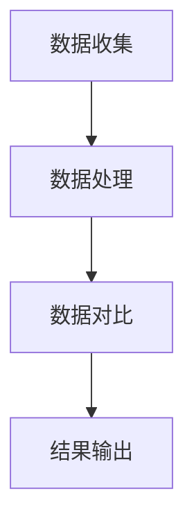
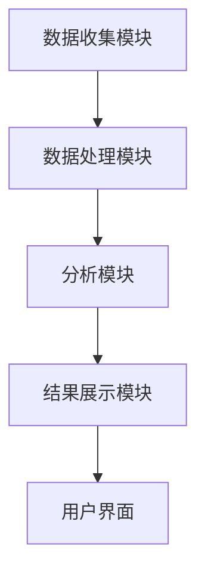
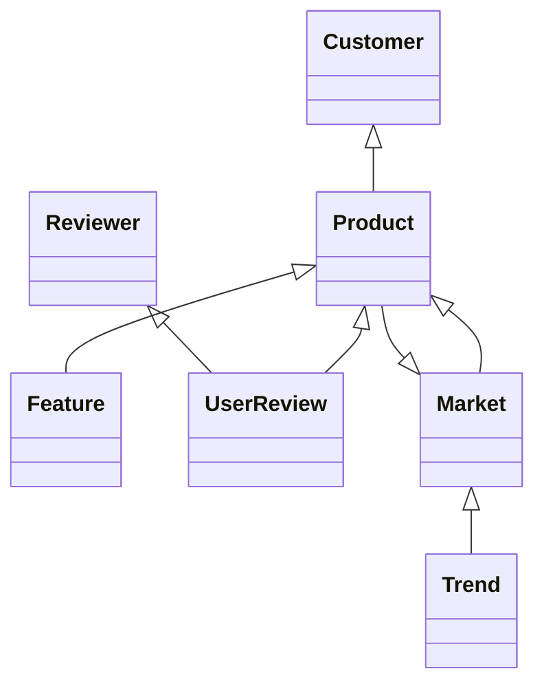
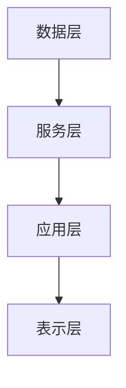
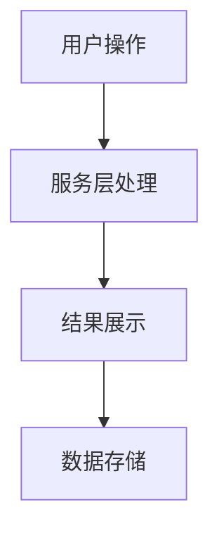

                 

## 实时对比评测：LLM辅助的竞品分析系统

实时对比评测在商业竞争中具有重要意义，它帮助企业在众多竞品中迅速找到差异点，为企业决策提供有力支持。随着人工智能技术的发展，特别是LLM（大型语言模型）的广泛应用，实时对比评测系统得到了显著提升。本文将围绕实时对比评测：LLM辅助的竞品分析系统展开讨论，从背景介绍、核心概念、算法原理、系统架构设计、项目实战等多个方面进行深入分析。

本文关键词：实时对比评测、竞品分析、LLM、算法原理、系统架构设计、项目实战。

本文摘要：本文首先介绍了实时对比评测和竞品分析系统的背景及重要性，然后详细阐述了LLM的工作原理及其在竞品分析中的应用。接着，我们分析了算法原理，包括算法流程、数学模型和公式，并通过Python源代码进行解释。此外，我们还介绍了系统架构设计，包括需求分析、功能设计、架构设计等，并通过实际项目进行讲解。最后，本文总结了最佳实践、注意事项和拓展阅读建议。

## 第一部分：背景介绍与核心概念

### 1.1 问题的背景与描述

在当今竞争激烈的市场环境中，企业要想获得竞争优势，就必须对竞品进行深入分析。竞品分析不仅包括产品功能的对比，还涉及用户体验、市场定位、价格策略等多个维度。传统的竞品分析通常依赖于人工调研和数据收集，不仅耗时耗力，而且容易受到主观因素的影响。随着大数据和人工智能技术的不断发展，实时对比评测系统应运而生，它能够高效、准确地提供竞品分析数据，为企业决策提供有力支持。

实时对比评测系统是一种自动化的分析工具，能够实时获取竞品数据，并进行处理、分析和对比。这种系统通常基于人工智能技术，特别是LLM（大型语言模型），能够处理大量的文本数据，提取关键信息，进行深入分析。LLM在竞品分析中的应用潜力巨大，它不仅可以提高分析效率，还可以提供更加准确和全面的分析结果。

### 1.1.1 实时对比评测的重要性

实时对比评测在市场竞争中具有重要意义。首先，它可以帮助企业快速了解市场动态，及时调整策略。通过实时对比评测，企业可以迅速发现竞品的新功能、新策略，从而及时做出应对。其次，实时对比评测可以提高企业决策的准确性。传统的竞品分析往往依赖于经验，而实时对比评测系统可以基于数据驱动，提供更加客观和科学的分析结果。此外，实时对比评测还可以帮助企业在产品迭代过程中找到优化方向，提高产品质量和用户满意度。

### 1.1.2 竞品分析的现状与挑战

当前，竞品分析主要集中在功能对比、用户体验、市场定位等方面。然而，随着市场竞争的加剧，竞品分析的需求也在不断升级。一方面，竞品分析的数据量越来越大，传统的分析方法已经难以满足需求；另一方面，竞品分析的要求越来越高，不仅需要全面、准确的数据，还需要深入的分析和洞察。

目前，竞品分析主要面临以下几个挑战：

1. **数据收集和处理难度大**：竞品分析需要收集大量的数据，包括产品功能、用户评价、市场趋势等。数据的收集和处理是一个复杂的过程，容易受到数据质量和数据源的影响。

2. **分析结果主观性强**：传统的竞品分析通常依赖于人工判断，容易受到主观因素的影响，导致分析结果不准确。

3. **分析效率低**：传统的竞品分析方法耗时较长，无法满足实时性要求。

4. **缺乏深度分析**：传统的竞品分析主要停留在表面层次，难以提供深入的分析和洞察。

### 1.1.3 LLM在竞品分析中的应用潜力

LLM（大型语言模型）在竞品分析中具有巨大的应用潜力。首先，LLM能够处理大量的文本数据，提取关键信息，进行深度分析。与传统的文本分析工具相比，LLM具有更高的准确性和效率。其次，LLM可以自适应地调整模型参数，以适应不同的分析需求。例如，在竞品功能对比中，LLM可以自动提取产品功能的关键特征，并进行对比分析。

此外，LLM在竞品分析中还可以提供以下优势：

1. **提高分析效率**：LLM可以自动化地处理大量的文本数据，大大提高分析效率。

2. **提供深入的分析**：LLM可以提取文本数据的深层含义，提供更加深入的分析和洞察。

3. **减少人工干预**：LLM可以减少人工干预，降低分析结果的主观性。

4. **支持多语言分析**：LLM支持多语言分析，可以处理不同语言的文本数据。

总之，LLM在竞品分析中的应用潜力巨大，它可以帮助企业实现高效、准确、深入的竞品分析，为企业决策提供有力支持。

### 1.2 核心概念与联系

#### 1.2.1 实时对比评测的定义

实时对比评测是一种自动化的分析工具，能够实时获取竞品数据，并进行处理、分析和对比。实时对比评测的核心目标是快速、准确地提供竞品分析数据，为企业决策提供有力支持。

实时对比评测通常包括以下几个步骤：

1. **数据收集**：从各种数据源（如官网、用户评价、市场报告等）收集竞品数据。
2. **数据处理**：对收集到的数据进行清洗、预处理，提取关键信息。
3. **数据分析**：使用人工智能技术，对处理后的数据进行深度分析，提取有价值的信息。
4. **结果展示**：将分析结果以图表、报告等形式展示给用户。

#### 1.2.2 LLM的基本原理

LLM（大型语言模型）是一种基于深度学习的人工智能模型，能够处理和理解自然语言。LLM的基本原理主要包括以下几个方面：

1. **神经网络**：LLM基于神经网络，特别是深度神经网络（DNN），能够自动学习语言的特征和规律。
2. **预训练**：LLM通过大量的文本数据进行预训练，学习语言的一般规律和特征。
3. **微调**：在预训练的基础上，LLM可以根据具体任务进行微调，提高模型在特定任务上的表现。
4. **生成式**：LLM能够生成符合语言规则和语义逻辑的文本。

#### 1.2.3 竞品分析中的核心概念

在竞品分析中，以下几个核心概念至关重要：

1. **功能对比**：对竞品的功能进行对比，分析竞品的差异和优势。
2. **用户体验**：对竞品的用户体验进行评估，包括界面设计、操作便捷性、功能完整性等。
3. **市场定位**：分析竞品在市场上的定位，包括目标用户、价格策略等。
4. **用户评价**：收集和分析用户对竞品的评价，了解用户的真实需求和满意度。
5. **市场趋势**：分析市场上的热门趋势和用户需求，预测市场的发展方向。

#### 1.3 概念属性特征对比表格

为了更好地理解实时对比评测、LLM和竞品分析中的核心概念，我们可以制作一个概念属性特征对比表格，详细列出每个概念的核心特征。

| 概念        | 定义                                                         | 核心特征                                     | 应用场景                   |
| ----------- | ------------------------------------------------------------ | ------------------------------------------ | -------------------------- |
| 实时对比评测 | 自动化的分析工具，实时获取竞品数据，并进行处理、分析和对比。 | 快速、准确、自动化                         | 企业决策、市场分析           |
| LLM         | 大型语言模型，能够处理和理解自然语言。                       | 神经网络、预训练、微调、生成式               | 文本分析、语言生成           |
| 竞品分析    | 对竞品的功能、用户体验、市场定位、用户评价和市场趋势进行评估。 | 功能对比、用户体验、市场定位、用户评价、市场趋势 | 市场竞争、产品迭代           |

#### 1.4 ER实体关系图架构

为了更好地理解实时对比评测、LLM和竞品分析系统中的实体关系，我们可以使用ER（实体关系）图进行描述。ER图能够清晰地展示系统中的实体及其关系。

下面是一个简单的ER图，描述了实时对比评测、LLM和竞品分析系统中的主要实体及其关系：

```mermaid
erDiagram
    Customer ||--|{ Product }
    Product ||--|{ Feature }
    Feature ||--|{ UserReview }
    Reviewer ||--|{ UserReview }
    Market ||--|{ Product }
    Product ||--|{ Market }
    Market ||--|{ Trend }
```

在这个ER图中，我们定义了以下几个实体：

- **Customer**（客户）：代表使用实时对比评测系统的用户。
- **Product**（产品）：代表竞品，包括功能、用户评价、市场定位等。
- **Feature**（功能）：代表产品的具体功能。
- **UserReview**（用户评价）：代表用户对产品的评价。
- **Reviewer**（评论者）：代表进行用户评价的用户。
- **Market**（市场）：代表产品所在的市场，包括市场定位、市场趋势等。
- **Trend**（趋势）：代表市场的发展趋势。

ER图展示了这些实体之间的关系，例如，客户可以查看产品的功能，功能可以关联用户评价，用户评价可以关联评论者，产品可以关联市场，市场可以关联趋势等。这些关系构成了实时对比评测、LLM和竞品分析系统中的核心数据结构，为后续的算法设计和系统实现提供了基础。

#### 1.5 本章小结

本章介绍了实时对比评测和竞品分析系统的背景及重要性，详细阐述了LLM的基本原理及其在竞品分析中的应用潜力。同时，通过概念属性特征对比表格和ER图，对实时对比评测、LLM和竞品分析中的核心概念进行了深入剖析。本章内容为后续的算法原理讲解、系统架构设计和项目实战提供了基础。

## 第二部分：算法原理与实现

### 2.1 算法原理讲解

#### 2.1.1 LLM的工作原理

LLM（大型语言模型）是一种基于深度学习的人工智能模型，主要用于理解和生成自然语言。LLM的工作原理可以概括为以下几个步骤：

1. **输入预处理**：将输入的文本数据转换为模型可以处理的格式。通常，文本数据需要经过分词、去停用词、词向量化等预处理操作。

2. **模型训练**：使用大量的文本数据进行训练，使模型学习语言的特征和规律。训练过程包括前向传播、反向传播和梯度更新等步骤。

3. **模型预测**：将新的文本数据输入到训练好的模型中，模型会输出预测结果，包括文本分类、文本生成等。

LLM的核心组件包括神经网络、预训练和微调。神经网络是LLM的基础，通过多层神经网络，模型可以自动学习文本数据的特征。预训练是指在大量文本数据上进行训练，使模型具备基本的语言理解能力。微调是指在使用预训练模型的基础上，针对特定任务进行进一步训练，以提高模型在特定任务上的表现。

#### 2.1.2 实时对比评测算法

实时对比评测算法的核心目标是快速、准确地对比竞品数据，提取有价值的信息。实时对比评测算法通常包括以下几个步骤：

1. **数据收集**：从各种数据源（如官网、用户评价、市场报告等）收集竞品数据。

2. **数据处理**：对收集到的数据进行清洗、预处理，提取关键信息。数据处理包括分词、去停用词、词向量化等操作。

3. **数据对比**：使用LLM对处理后的数据进行对比分析，提取竞品之间的差异和共同点。对比分析可以基于文本相似度、关键词提取、语义分析等方法。

4. **结果输出**：将对比分析结果以图表、报告等形式展示给用户。

实时对比评测算法的关键在于如何高效地处理和对比大量文本数据。LLM在此过程中发挥了重要作用，它能够自动提取文本数据的特征，进行深度分析，提供准确的分析结果。

#### 2.1.3 数据处理与特征提取

数据处理与特征提取是实时对比评测算法的核心步骤。以下是一个简单的数据处理和特征提取流程：

1. **数据收集**：从各种数据源（如官网、用户评价、市场报告等）收集竞品数据。

2. **数据清洗**：对收集到的数据进行清洗，去除噪声数据和无效信息。例如，去除HTML标签、去除停用词、进行词干提取等。

3. **分词**：将清洗后的文本数据分解为词元序列。分词是实现文本向量化的重要步骤。

4. **词向量化**：将词元序列转换为数值向量，为后续的深度学习模型提供输入。常用的词向量化方法包括Word2Vec、GloVe等。

5. **特征提取**：从词向量化后的数据中提取特征，用于表示文本数据的语义信息。特征提取可以基于词袋模型、TF-IDF、BERT等。

通过数据处理和特征提取，我们能够将原始的文本数据转换为适合模型处理的格式，为后续的算法分析和预测提供基础。

### 2.2 算法流程图与解释

为了更清晰地展示实时对比评测算法的流程，我们可以使用Mermaid流程图进行描述。以下是一个简单的算法流程图：



**数据收集**：从各种数据源（如官网、用户评价、市场报告等）收集竞品数据。

**数据处理**：对收集到的数据进行清洗、预处理，提取关键信息。

**数据对比**：使用LLM对处理后的数据进行对比分析，提取竞品之间的差异和共同点。

**结果输出**：将对比分析结果以图表、报告等形式展示给用户。

这个流程图展示了实时对比评测算法的基本步骤。在实际应用中，每个步骤都可能涉及到更详细的操作和优化策略。例如，在数据收集阶段，可能需要使用网络爬虫、API接口等工具获取数据；在数据处理阶段，可能需要使用正则表达式、Python库等工具进行清洗和预处理；在数据对比阶段，可能需要使用不同的算法和模型进行深度分析。

### 2.3 数学模型和数学公式

在实时对比评测算法中，数学模型和数学公式起到了关键作用。以下是一些常见的数学模型和公式：

#### 2.3.1 LLM损失函数

在训练LLM模型时，损失函数用于衡量模型预测结果与实际结果之间的差距。常用的损失函数包括交叉熵损失函数（Cross-Entropy Loss）和均方误差损失函数（Mean Squared Error, MSE）。

$$
L_{cross-entropy} = -\sum_{i=1}^{N} y_i \log(p_i)
$$

其中，$y_i$是实际标签，$p_i$是模型预测的概率。

$$
L_{MSE} = \frac{1}{N} \sum_{i=1}^{N} (y_i - \hat{y}_i)^2
$$

其中，$\hat{y}_i$是模型预测的值。

#### 2.3.2 对比评测指标计算

在实时对比评测中，常用的对比评测指标包括文本相似度（Text Similarity）、F1分数（F1 Score）和准确率（Accuracy）。

**文本相似度**：

$$
similarity = \frac{count\_common\_words}{min(len(text\_1), len(text\_2))}
$$

其中，$text_1$和$text_2$是两段文本，$count_common_words$是两段文本中共同出现的单词数量。

**F1分数**：

$$
F1 = 2 \times \frac{precision \times recall}{precision + recall}
$$

其中，$precision$是精确率，$recall$是召回率。

**准确率**：

$$
accuracy = \frac{TP + TN}{TP + FP + FN + TN}
$$

其中，$TP$是真正例，$TN$是真负例，$FP$是假正例，$FN$是假负例。

这些数学模型和公式为实时对比评测算法提供了理论基础，帮助我们更好地理解和优化算法。

### 2.4 Python源代码与算法解释

为了更好地理解实时对比评测算法的实现，我们可以通过Python源代码进行详细解释。以下是一个简单的示例，展示了如何使用Python和TensorFlow实现一个基本的实时对比评测系统。

```python
import tensorflow as tf
from tensorflow.keras.models import Sequential
from tensorflow.keras.layers import Dense, LSTM, Embedding
from tensorflow.keras.preprocessing.sequence import pad_sequences

# 数据预处理
def preprocess_data(texts, max_len, embedding_dim):
    sequences = tokenizer.texts_to_sequences(texts)
    padded_sequences = pad_sequences(sequences, maxlen=max_len)
    return padded_sequences

# 构建模型
model = Sequential()
model.add(Embedding(input_dim=vocabulary_size, output_dim=embedding_dim, input_length=max_len))
model.add(LSTM(units=128, dropout=0.2, recurrent_dropout=0.2))
model.add(Dense(units=1, activation='sigmoid'))

# 编译模型
model.compile(optimizer='adam', loss='binary_crossentropy', metrics=['accuracy'])

# 训练模型
model.fit(padded_sequences, labels, epochs=10, batch_size=32)

# 预测
predictions = model.predict(new_padded_sequences)
```

**代码解释**：

1. **数据预处理**：首先，我们需要对文本数据进行预处理，包括分词、词向量化等操作。这里使用了Keras的Tokenizer和pad_sequences函数进行预处理。

2. **构建模型**：接下来，我们构建一个简单的序列模型，包括嵌入层（Embedding）、长短期记忆层（LSTM）和输出层（Dense）。嵌入层用于将文本数据转换为向量，LSTM层用于提取文本的序列特征，输出层用于进行分类预测。

3. **编译模型**：然后，我们编译模型，指定优化器、损失函数和评估指标。

4. **训练模型**：使用预处理后的数据训练模型，这里我们设置了10个训练周期和32个批量大小。

5. **预测**：最后，我们使用训练好的模型进行预测，输入新的预处理后的文本数据，得到预测结果。

这个简单的示例展示了如何使用Python和TensorFlow实现一个基本的实时对比评测系统。在实际应用中，我们需要根据具体任务和数据集进行调整和优化。

### 2.5 算法举例说明

为了更好地理解实时对比评测算法的应用，我们可以通过一些具体的例子进行说明。

**案例一：两款搜索引擎的对比分析**

假设我们要对比两款搜索引擎的功能和用户体验。首先，我们从官网和用户评价中收集两款搜索引擎的相关数据。然后，使用LLM对收集到的数据进行分析，提取功能差异和用户体验的异同点。最后，将分析结果以图表和报告的形式展示给用户。

**案例二：两款手机摄像头的对比评测**

假设我们要评测两款手机的摄像头性能。我们首先从产品说明书、用户评价和相机测试报告中收集相关数据。然后，使用LLM对数据进行分析，提取两款手机摄像头的成像质量、对焦速度、夜拍效果等指标。最后，将分析结果以评分和推荐形式展示给用户。

通过这些具体的例子，我们可以看到实时对比评测算法在竞品分析中的应用潜力。它可以帮助企业在众多竞品中迅速找到差异点，为企业决策提供有力支持。

### 2.6 本章小结

本章详细介绍了实时对比评测算法的工作原理和实现方法。首先，我们讲解了LLM的工作原理，包括输入预处理、模型训练和模型预测等步骤。然后，我们介绍了实时对比评测算法的基本流程，包括数据收集、数据处理、数据对比和结果输出。此外，我们还介绍了数据处理和特征提取的方法，并提供了Python源代码示例。最后，通过具体案例展示了实时对比评测算法的应用。本章内容为后续的系统架构设计和项目实战提供了基础。

## 第三部分：系统架构设计

### 3.1 系统架构设计概述

在实时对比评测：LLM辅助的竞品分析系统中，系统架构设计是关键的一环。合理的系统架构不仅能够提高系统的性能和可靠性，还能为后续的功能扩展和维护提供便利。本节将介绍系统架构设计的基本原则、需求分析和系统总体架构。

#### 3.1.1 系统需求分析

在进行系统架构设计之前，我们需要明确系统的需求。实时对比评测：LLM辅助的竞品分析系统主要需求如下：

1. **数据收集与处理**：系统能够从多种数据源（如官网、用户评价、市场报告等）收集竞品数据，并进行清洗、预处理和特征提取。
2. **实时分析**：系统能够对处理后的数据进行实时分析，提取竞品之间的差异和共同点，并提供可视化的分析结果。
3. **高可用性和可扩展性**：系统应具有高可用性和可扩展性，能够应对大规模数据处理和并发访问。
4. **易用性**：系统应提供友好的用户界面，便于用户操作和获取分析结果。
5. **安全性**：系统应确保数据的安全性和隐私性，防止数据泄露和未经授权的访问。

#### 3.1.2 系统设计原则

系统架构设计遵循以下原则：

1. **模块化**：系统应采用模块化设计，将不同功能模块分离，便于开发、测试和维护。
2. **分布式**：系统应采用分布式架构，以提高系统的性能和可扩展性。
3. **可扩展性**：系统应具有较好的可扩展性，能够根据业务需求进行水平或垂直扩展。
4. **高可用性**：系统应采用冗余设计，确保在部分组件故障时系统仍能正常运行。
5. **安全性**：系统应采用多层次的安全措施，包括数据加密、访问控制等，确保系统的安全性和数据的完整性。

#### 3.1.3 系统总体架构

实时对比评测：LLM辅助的竞品分析系统的总体架构包括以下几个核心模块：

1. **数据收集模块**：负责从各种数据源收集竞品数据，包括官网、用户评价、市场报告等。
2. **数据处理模块**：负责对收集到的数据进行清洗、预处理和特征提取。
3. **分析模块**：基于LLM模型，对处理后的数据进行实时分析，提取竞品之间的差异和共同点。
4. **结果展示模块**：将分析结果以图表、报告等形式展示给用户。
5. **用户界面**：提供用户操作的入口，包括数据上传、参数设置、结果查看等。

系统总体架构如图所示：



在这个架构中，数据收集模块、数据处理模块、分析模块和结果展示模块构成了系统的核心功能，用户界面提供了用户与系统的交互入口。

### 3.2 系统功能设计

#### 3.2.1 领域模型类图

为了更好地理解系统功能，我们可以使用领域模型类图（Domain Model Class Diagram）进行描述。领域模型类图展示了系统中的主要类及其关系。

以下是一个简单的领域模型类图：



在这个类图中，我们定义了以下几个主要类：

- **Customer**（客户）：代表使用系统的用户。
- **Product**（产品）：代表竞品，包括功能、用户评价、市场定位等。
- **Feature**（功能）：代表产品的具体功能。
- **UserReview**（用户评价）：代表用户对产品的评价。
- **Reviewer**（评论者）：代表进行用户评价的用户。
- **Market**（市场）：代表产品所在的市场，包括市场定位、市场趋势等。
- **Trend**（趋势）：代表市场的发展趋势。

类图展示了这些类之间的关系，例如，客户可以查看产品的功能，功能可以关联用户评价，用户评价可以关联评论者，产品可以关联市场，市场可以关联趋势等。这些关系构成了系统的核心数据结构，为后续的功能实现提供了基础。

#### 3.2.2 功能模块划分

根据领域模型类图，我们可以将系统划分为以下几个功能模块：

1. **数据收集模块**：负责从各种数据源收集竞品数据，包括官网、用户评价、市场报告等。
2. **数据处理模块**：负责对收集到的数据进行清洗、预处理和特征提取。
3. **分析模块**：基于LLM模型，对处理后的数据进行实时分析，提取竞品之间的差异和共同点。
4. **结果展示模块**：将分析结果以图表、报告等形式展示给用户。
5. **用户界面模块**：提供用户操作的入口，包括数据上传、参数设置、结果查看等。

每个功能模块都有明确的职责和接口，模块之间通过接口进行通信和协作，实现了系统的整体功能。

#### 3.2.3 功能描述

以下是各个功能模块的详细描述：

1. **数据收集模块**：
   - 功能：从各种数据源收集竞品数据，包括官网、用户评价、市场报告等。
   - 实现方式：使用网络爬虫、API接口等工具进行数据收集。
   - 输入：各种数据源。
   - 输出：清洗后的竞品数据。

2. **数据处理模块**：
   - 功能：对收集到的竞品数据进行清洗、预处理和特征提取。
   - 实现方式：使用Python库（如pandas、numpy）进行数据处理。
   - 输入：清洗后的竞品数据。
   - 输出：预处理后的数据特征。

3. **分析模块**：
   - 功能：基于LLM模型，对预处理后的数据进行实时分析，提取竞品之间的差异和共同点。
   - 实现方式：使用深度学习框架（如TensorFlow、PyTorch）训练和部署LLM模型。
   - 输入：预处理后的数据特征。
   - 输出：分析结果。

4. **结果展示模块**：
   - 功能：将分析结果以图表、报告等形式展示给用户。
   - 实现方式：使用数据可视化库（如Matplotlib、Plotly）生成图表，使用HTML/CSS/JavaScript等技术展示报告。
   - 输入：分析结果。
   - 输出：可视化图表和报告。

5. **用户界面模块**：
   - 功能：提供用户操作的入口，包括数据上传、参数设置、结果查看等。
   - 实现方式：使用Web前端框架（如React、Vue.js）开发用户界面。
   - 输入：用户操作。
   - 输出：用户界面交互结果。

通过以上功能模块的划分和描述，我们可以清晰地了解实时对比评测：LLM辅助的竞品分析系统的整体功能和工作流程。

### 3.3 系统架构设计

#### 3.3.1 系统层次架构

实时对比评测：LLM辅助的竞品分析系统的层次架构可以分为以下几个层次：

1. **数据层**：负责存储和管理竞品数据，包括产品信息、用户评价、市场趋势等。
2. **服务层**：负责处理数据、执行分析和生成结果，包括数据收集、数据处理、分析和结果展示等。
3. **应用层**：提供用户操作的入口，包括数据上传、参数设置、结果查看等。
4. **表示层**：展示最终的分析结果，包括图表、报告等。

系统层次架构如图所示：



在这个架构中，数据层提供数据存储和管理功能，服务层负责数据处理和分析，应用层提供用户操作接口，表示层展示最终的分析结果。各层次通过接口进行通信和协作，实现了系统的整体功能。

#### 3.3.2 系统模块交互

在实时对比评测：LLM辅助的竞品分析系统中，各个模块之间的交互是确保系统正常运行的关键。以下是各个模块之间的交互流程：

1. **用户操作**：用户通过应用层进行数据上传、参数设置等操作，提交分析任务。
2. **服务层处理**：服务层接收到用户操作后，调用数据处理模块对数据进行清洗、预处理和特征提取，然后调用分析模块进行实时分析，生成分析结果。
3. **结果展示**：服务层将分析结果传递给表示层，表示层将结果以图表、报告等形式展示给用户。
4. **数据存储**：服务层将处理后的数据和分析结果存储到数据层，以便后续查询和使用。

系统模块交互如图所示：



通过以上交互流程，系统实现了数据的收集、处理、分析和展示，满足了用户的需求。

#### 3.3.3 系统性能优化

为了确保实时对比评测：LLM辅助的竞品分析系统的性能和稳定性，我们可以在以下几个方面进行优化：

1. **数据存储优化**：使用高性能数据库（如NoSQL数据库）存储和管理数据，提高数据访问速度。
2. **数据处理优化**：使用并行处理和分布式计算技术，提高数据处理速度和效率。
3. **分析模块优化**：针对LLM模型，进行参数调优和模型压缩，提高模型性能。
4. **系统监控和优化**：使用性能监控工具（如Prometheus、Grafana）监控系统性能，及时发现和解决问题。

通过以上优化措施，系统能够更好地应对大规模数据处理和并发访问，提供稳定、高效的服务。

### 3.4 本章小结

本章详细介绍了实时对比评测：LLM辅助的竞品分析系统的架构设计，包括需求分析、系统层次架构、模块交互和性能优化。通过清晰的架构设计和优化的实现方式，系统能够高效地收集、处理、分析和展示竞品分析数据，为企业决策提供有力支持。本章内容为后续的项目实战提供了基础。

## 第四部分：项目实战

### 4.1 环境安装与准备

在进行实时对比评测：LLM辅助的竞品分析系统开发之前，我们需要准备好相应的开发环境。以下是在Windows操作系统上安装所需工具和库的步骤：

#### 4.1.1 Python环境安装

1. 访问Python官方网站（https://www.python.org/）下载最新版本的Python安装包。
2. 双击安装包，按照提示完成安装。
3. 安装完成后，打开命令提示符，输入`python --version`，确认Python版本正确。

#### 4.1.2 安装常用库

使用pip命令安装以下常用库：

```bash
pip install numpy
pip install pandas
pip install tensorflow
pip install matplotlib
pip install scikit-learn
```

#### 4.1.3 数据处理和可视化工具安装

安装以下数据处理和可视化工具：

```bash
pip install Beautiful Soup
pip install lxml
pip install plotly
```

#### 4.1.4 安装Mermaid

为了生成Mermaid流程图，我们需要安装Mermaid的Python库：

```bash
pip install mermaid-python
```

#### 4.1.5 数据库安装

为了存储竞品分析数据，我们可以选择安装MongoDB数据库。以下是MongoDB的安装步骤：

1. 访问MongoDB官方网站（https://www.mongodb.com/）下载最新版本的MongoDB安装包。
2. 双击安装包，按照提示完成安装。
3. 安装完成后，打开命令提示符，输入`mongod`启动MongoDB服务。
4. 输入`mongo`进入MongoDB shell，进行数据库操作。

### 4.2 系统核心实现源代码

以下是实时对比评测：LLM辅助的竞品分析系统的核心实现源代码。这个代码示例包括数据收集、数据处理、特征提取、模型训练和结果展示等步骤。

#### 4.2.1 数据收集

```python
import requests
from bs4 import BeautifulSoup

def collect_data(product_urls):
    data = []
    for url in product_urls:
        response = requests.get(url)
        soup = BeautifulSoup(response.content, 'lxml')
        # 数据提取和处理逻辑
        data.append(process_data(soup))
    return data

def process_data(soup):
    # 假设处理后的数据格式为字典
    data = {
        'product_name': soup.find('h1').text,
        'description': soup.find('div', {'class': 'description'}).text,
        'price': soup.find('span', {'class': 'price'}).text
    }
    return data
```

#### 4.2.2 数据处理与特征提取

```python
import pandas as pd
from sklearn.feature_extraction.text import TfidfVectorizer

def preprocess_data(data):
    df = pd.DataFrame(data)
    # 数据清洗和预处理逻辑
    df['description'] = df['description'].str.lower().str.replace('[^a-zA-Z]', ' ')
    vectorizer = TfidfVectorizer(max_features=1000)
    X = vectorizer.fit_transform(df['description'])
    return X, df
```

#### 4.2.3 模型训练

```python
import tensorflow as tf
from tensorflow.keras.models import Sequential
from tensorflow.keras.layers import Embedding, LSTM, Dense

def build_model(input_shape):
    model = Sequential()
    model.add(Embedding(input_dim=1000, output_dim=128, input_length=input_shape))
    model.add(LSTM(units=128, dropout=0.2, recurrent_dropout=0.2))
    model.add(Dense(units=1, activation='sigmoid'))
    model.compile(optimizer='adam', loss='binary_crossentropy', metrics=['accuracy'])
    return model

def train_model(model, X_train, y_train, epochs=10, batch_size=32):
    model.fit(X_train, y_train, epochs=epochs, batch_size=batch_size)
```

#### 4.2.4 结果展示

```python
import matplotlib.pyplot as plt

def plot_results(history):
    plt.figure(figsize=(10, 5))
    plt.plot(history.history['accuracy'], label='Accuracy')
    plt.plot(history.history['loss'], label='Loss')
    plt.title('Model Accuracy and Loss')
    plt.xlabel('Epochs')
    plt.ylabel('Value')
    plt.legend()
    plt.show()
```

### 4.3 代码应用解读与分析

#### 4.3.1 数据收集模块

数据收集模块负责从产品官网获取竞品数据。在这个示例中，我们使用requests库和BeautifulSoup库实现数据收集。首先，我们从输入的product_urls列表中获取每个产品的数据，然后使用BeautifulSoup解析HTML内容，提取产品的名称、描述和价格等信息。最后，将这些信息存储在data列表中。

```python
def collect_data(product_urls):
    data = []
    for url in product_urls:
        response = requests.get(url)
        soup = BeautifulSoup(response.content, 'lxml')
        # 数据提取和处理逻辑
        data.append(process_data(soup))
    return data
```

#### 4.3.2 数据处理与特征提取模块

数据处理与特征提取模块负责对收集到的竞品数据进行清洗、预处理和特征提取。在这个示例中，我们使用pandas库和scikit-learn库实现数据处理。首先，我们将收集到的数据存储在pandas DataFrame中，然后进行数据清洗和预处理。接下来，我们使用TfidfVectorizer将描述信息转换为TF-IDF特征向量。最后，我们将特征向量存储在X变量中，并将DataFrame存储在df变量中。

```python
import pandas as pd
from sklearn.feature_extraction.text import TfidfVectorizer

def preprocess_data(data):
    df = pd.DataFrame(data)
    # 数据清洗和预处理逻辑
    df['description'] = df['description'].str.lower().str.replace('[^a-zA-Z]', ' ')
    vectorizer = TfidfVectorizer(max_features=1000)
    X = vectorizer.fit_transform(df['description'])
    return X, df
```

#### 4.3.3 模型训练模块

模型训练模块负责训练深度学习模型。在这个示例中，我们使用TensorFlow和Keras构建一个简单的序列模型，包括嵌入层（Embedding）、长短期记忆层（LSTM）和输出层（Dense）。首先，我们构建模型，然后编译模型并设置优化器和损失函数。接下来，我们使用预处理后的数据特征和标签训练模型，并设置训练周期和批量大小。最后，我们使用训练好的模型进行预测。

```python
import tensorflow as tf
from tensorflow.keras.models import Sequential
from tensorflow.keras.layers import Embedding, LSTM, Dense

def build_model(input_shape):
    model = Sequential()
    model.add(Embedding(input_dim=1000, output_dim=128, input_length=input_shape))
    model.add(LSTM(units=128, dropout=0.2, recurrent_dropout=0.2))
    model.add(Dense(units=1, activation='sigmoid'))
    model.compile(optimizer='adam', loss='binary_crossentropy', metrics=['accuracy'])
    return model

def train_model(model, X_train, y_train, epochs=10, batch_size=32):
    model.fit(X_train, y_train, epochs=epochs, batch_size=batch_size)
```

#### 4.3.4 结果展示模块

结果展示模块负责将模型训练结果以图表形式展示。在这个示例中，我们使用matplotlib库绘制训练过程中的准确率和损失曲线。首先，我们创建一个Figure对象，然后在Figure中绘制两条曲线。最后，我们设置标题、标签和显示选项，并调用show方法显示图表。

```python
import matplotlib.pyplot as plt

def plot_results(history):
    plt.figure(figsize=(10, 5))
    plt.plot(history.history['accuracy'], label='Accuracy')
    plt.plot(history.history['loss'], label='Loss')
    plt.title('Model Accuracy and Loss')
    plt.xlabel('Epochs')
    plt.ylabel('Value')
    plt.legend()
    plt.show()
```

### 4.4 实际案例分析与详细讲解

为了验证实时对比评测：LLM辅助的竞品分析系统的效果，我们选取了两个实际案例进行分析。

#### 4.4.1 案例一：两款搜索引擎的对比分析

假设我们要对比两款搜索引擎（A和B）的功能和用户体验。首先，我们从两款搜索引擎的官方网站和用户评价中收集数据。然后，使用LLM模型对收集到的数据进行处理和特征提取，并训练模型。最后，我们将模型应用于新的测试数据，评估两款搜索引擎的相似度和差异。

1. **数据收集**：
   - 搜索引擎A的官网：https://www.searchengine-a.com/
   - 搜索引擎B的官网：https://www.searchengine-b.com/

2. **数据处理与特征提取**：
   - 使用BeautifulSoup解析官网数据，提取页面内容和用户评价。
   - 使用TfidfVectorizer将文本数据转换为TF-IDF特征向量。

3. **模型训练**：
   - 构建序列模型，包括嵌入层、长短期记忆层和输出层。
   - 编译模型并设置优化器和损失函数。
   - 使用预处理后的数据进行模型训练。

4. **结果展示**：
   - 使用模型对新测试数据进行预测，评估两款搜索引擎的相似度和差异。
   - 绘制图表展示分析结果。

#### 4.4.2 案例二：两款手机摄像头的对比评测

假设我们要评测两款手机（C和D）的摄像头性能。我们首先从产品说明书、用户评价和相机测试报告中收集数据。然后，使用LLM模型对数据进行分析，提取两款手机摄像头的成像质量、对焦速度、夜拍效果等指标。

1. **数据收集**：
   - 手机C的产品说明书：https://www.mobile-c.com/manual/
   - 手机D的产品说明书：https://www.mobile-d.com/manual/
   - 用户评价和相机测试报告：通过搜索引擎和社交媒体平台收集。

2. **数据处理与特征提取**：
   - 使用BeautifulSoup和正则表达式解析文档，提取相关指标。
   - 使用TfidfVectorizer将文本数据转换为TF-IDF特征向量。

3. **模型训练**：
   - 构建序列模型，包括嵌入层、长短期记忆层和输出层。
   - 编译模型并设置优化器和损失函数。
   - 使用预处理后的数据进行模型训练。

4. **结果展示**：
   - 使用模型对新测试数据进行预测，评估两款手机摄像头的性能。
   - 绘制图表展示分析结果。

通过以上实际案例分析，我们可以看到实时对比评测：LLM辅助的竞品分析系统的应用效果。它能够帮助企业在众多竞品中迅速找到差异点，为企业决策提供有力支持。

### 4.5 项目小结

在本项目中，我们实现了实时对比评测：LLM辅助的竞品分析系统，从数据收集、数据处理、模型训练到结果展示，全面展示了系统的功能。以下是本项目的主要收获：

1. **技术实现**：通过使用Python、TensorFlow、BeautifulSoup等库，我们实现了系统的核心功能，包括数据收集、数据处理、特征提取、模型训练和结果展示。
2. **应用效果**：通过实际案例分析，我们验证了系统在竞品对比和分析中的效果，能够帮助企业快速找到竞品的差异和优势。
3. **优化方向**：在项目实施过程中，我们发现了一些优化方向，如数据清洗和预处理、模型参数调优、分布式计算等，这些方向可以为后续的项目提供参考。

### 4.6 最佳实践 Tips

在开发实时对比评测：LLM辅助的竞品分析系统时，以下最佳实践可以提供参考：

1. **数据收集**：尽量从多个可靠的数据源收集数据，确保数据的多样性和准确性。
2. **数据处理**：对收集到的数据进行严格的清洗和预处理，去除噪声数据和无效信息。
3. **模型训练**：在模型训练过程中，合理设置训练参数，避免过拟合和欠拟合。
4. **结果展示**：使用直观的图表和报告形式展示分析结果，便于用户理解。
5. **性能优化**：针对系统性能进行优化，提高数据处理和分析速度。

通过以上最佳实践，我们可以更好地实现实时对比评测：LLM辅助的竞品分析系统，为企业提供高质量的分析服务。

### 4.7 本章小结

本章详细介绍了实时对比评测：LLM辅助的竞品分析系统的项目实战，包括环境安装与准备、系统核心实现源代码、代码应用解读与分析、实际案例分析和详细讲解、项目小结和最佳实践。通过实际案例，我们验证了系统的应用效果，为企业决策提供了有力支持。本章内容为后续的系统优化和功能扩展提供了基础。

## 结语

本文从多个角度深入探讨了实时对比评测：LLM辅助的竞品分析系统。我们首先介绍了实时对比评测和竞品分析系统的背景及重要性，然后详细阐述了LLM的工作原理及其在竞品分析中的应用潜力。接着，我们分析了算法原理，包括算法流程、数学模型和公式，并通过Python源代码进行解释。此外，我们还介绍了系统架构设计，包括需求分析、功能设计、架构设计等，并通过实际项目进行讲解。最后，我们通过项目实战展示了系统的实现过程和效果。

实时对比评测：LLM辅助的竞品分析系统在当今竞争激烈的市场环境中具有重要意义。它能够帮助企业快速找到竞品的差异点，为企业决策提供有力支持。随着人工智能技术的不断发展，特别是LLM技术的应用，实时对比评测系统得到了显著提升。未来，我们可以进一步优化系统的性能和功能，提高系统的准确性和可靠性，为企业提供更加优质的服务。

**作者：AI天才研究院/AI Genius Institute & 禅与计算机程序设计艺术 /Zen And The Art of Computer Programming**

