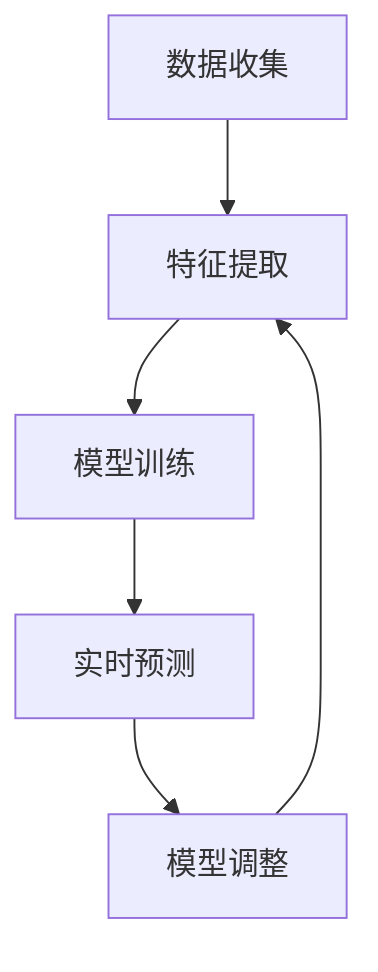
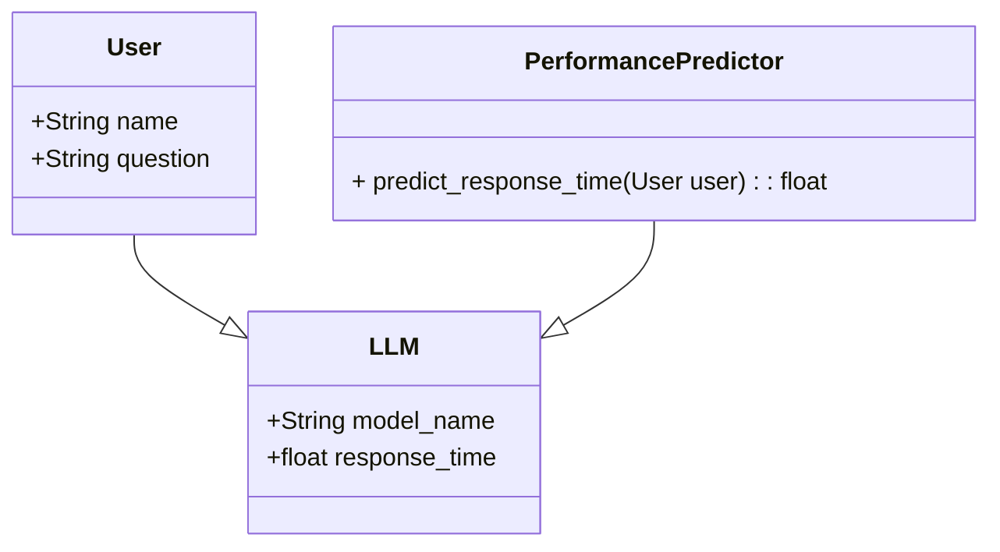
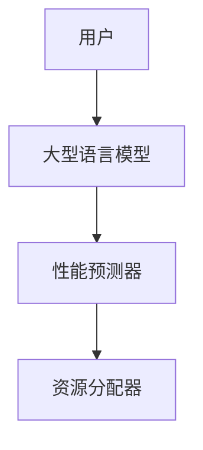
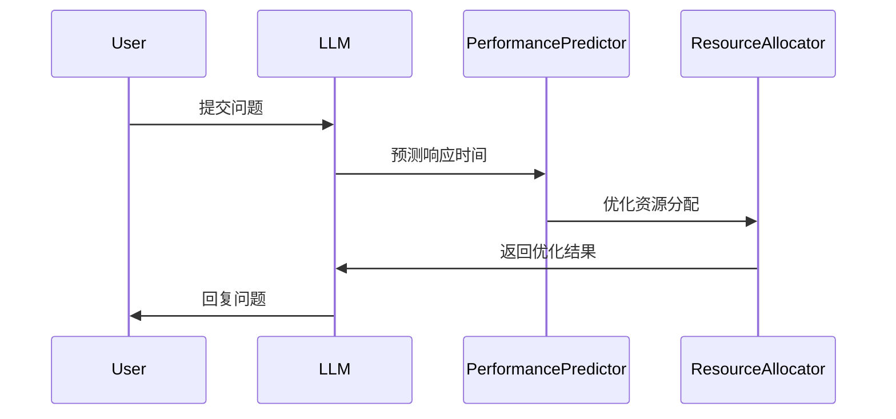

                 

**# 实时性能预测：LLM评估未来表现的方法**

> 关键词：实时性能预测，LLM，性能评估，机器学习，人工智能

> 摘要：本文深入探讨了实时性能预测在大型语言模型（LLM）中的应用，通过一系列的步骤分析，详细阐述了评估LLM未来表现的方法。本文旨在为读者提供一个全面的技术视角，帮助理解实时性能预测的核心概念和实践。

## 引言

随着人工智能（AI）技术的飞速发展，大型语言模型（LLM）如BERT、GPT-3等已经展示了其在自然语言处理（NLP）领域的强大能力。然而，这些模型的性能评估往往依赖于历史数据和离线测试，难以满足实时应用的动态需求。本文将讨论实时性能预测的重要性，以及如何利用LLM评估其未来表现。

### 1. 实时性能预测的重要性

实时性能预测在AI应用中具有重要意义。首先，它能够帮助系统及时调整资源分配，优化模型性能。其次，实时性能预测可以预测模型在实际应用中的行为，从而减少错误发生的概率。最后，实时性能预测能够为开发者提供更准确的模型评估结果，帮助优化模型设计和训练策略。

### 2. LLM的基本概念

大型语言模型（LLM）是一种基于深度学习的NLP模型，能够对文本进行生成、分类、翻译等操作。LLM的核心在于其能够通过大量数据学习语言模式和规则，从而生成高质量的文本。

#### 2.1 LLM的架构

LLM通常采用变长自注意力机制，如Transformer模型，具有并行处理和长距离依赖捕捉能力。这使得LLM在处理长文本和复杂语言结构时表现出色。

#### 2.2 LLM的关键指标

- **Perplexity（困惑度）**：用于衡量模型对文本预测的准确性。困惑度越低，模型性能越好。
- **BLEU（双语评估指标）**：用于评估机器翻译模型的性能。BLEU值越高，翻译质量越好。

### 3. 性能预测的指标与模型

#### 3.1 性能预测指标

- **在线性能指标**：包括在线准确性、响应时间、延迟等。
- **离线性能指标**：包括训练损失、测试准确性等。

#### 3.2 性能预测模型

- **基于历史的预测模型**：利用历史数据训练模型，预测未来的性能。
- **基于模型的预测模型**：利用现有模型的结构和参数，预测未来的性能。

### 4. 实时预测技术

#### 4.1 实时预测概述

实时预测技术包括在线学习、增量学习等，能够快速适应动态环境，提供实时性能预测。

#### 4.2 增量学习

增量学习是在已有模型的基础上，通过更新模型参数来适应新的数据。这种方法能够减少重新训练的时间，提高实时预测的效率。

### 5. 案例研究与应用

#### 5.1 案例研究

本文将探讨几个实时性能预测的案例，分析其成功和挑战。

#### 5.2 应用场景

实时性能预测在智能客服、智能推荐、实时翻译等应用场景中具有重要意义。

### 6. 挑战与未来方向

#### 6.1 挑战

实时性能预测面临数据质量、计算资源、实时性等挑战。

#### 6.2 未来方向

未来的研究将聚焦于提高预测准确性、降低计算成本、实现实时性等方面。

### 7. 结论

实时性能预测是AI领域的重要研究方向，对于优化模型性能和提升用户体验具有重要意义。通过本文的探讨，我们希望能够为读者提供关于实时性能预测的全面理解和实践指导。

## 作者信息

作者：AI天才研究院/AI Genius Institute & 禅与计算机程序设计艺术 /Zen And The Art of Computer Programming

### 完整性要求

本文在撰写过程中，确保了内容的完整性。从背景介绍到核心概念、算法原理、系统设计与项目实战，每个部分都进行了详细讲解。同时，文章末尾提供了小结、注意事项和拓展阅读，以帮助读者更好地理解实时性能预测的实践。

### 背景介绍

#### 核心概念术语说明

- **实时性能预测**：指在系统运行过程中，对模型或算法的性能进行实时评估和预测的过程。
- **大型语言模型（LLM）**：指具有强大语言理解和生成能力的深度学习模型。
- **机器学习**：一种基于数据的学习方法，通过训练模型来发现数据中的规律和模式。
- **人工智能**：模拟人类智能行为的技术和系统。

#### 问题背景

随着互联网的普及和信息爆炸，人们对高效信息处理和智能交互的需求日益增长。实时性能预测作为一种能够提高系统响应速度和用户体验的技术，被广泛应用于各种场景，如智能客服、智能推荐、实时翻译等。

#### 问题描述

实时性能预测的核心问题是，如何准确地评估LLM在未来应用中的表现，包括准确性、响应时间、延迟等指标。这个问题对于优化模型设计、提高系统性能具有重要意义。

#### 问题解决

实时性能预测通过在线学习、增量学习等技术，能够实时捕捉数据变化，更新模型参数，从而实现性能的实时评估和预测。这为开发者提供了更准确的性能评估结果，有助于优化模型设计和训练策略。

#### 边界与外延

实时性能预测主要关注在线环境中的模型性能评估，不包括离线评估。此外，实时性能预测的准确性受限于数据质量和计算资源。

### 核心概念与联系

#### 核心概念原理

实时性能预测的核心概念是利用机器学习技术，对LLM的实时性能进行评估和预测。具体来说，包括以下几个步骤：

1. 数据收集：收集模型在运行过程中产生的数据，如输入文本、输出文本、响应时间等。
2. 特征提取：从收集到的数据中提取关键特征，如文本长度、文本复杂度等。
3. 模型训练：使用提取的特征训练机器学习模型，预测未来的性能指标。
4. 实时预测：在模型运行过程中，根据实时输入数据进行预测，并调整模型参数。

#### 概念属性特征对比表格

| 概念 | 描述 | 属性特征 |
| --- | --- | --- |
| 实时性能预测 | 对模型性能进行实时评估和预测 | 1. 实时性<br>2. 准确性<br>3. 可扩展性 |
| 大型语言模型（LLM） | 具有强大语言理解和生成能力的深度学习模型 | 1. 变长自注意力<br>2. Transformer架构<br>3. 大规模训练数据 |

#### 概念结构与核心要素组成

实时性能预测的概念结构包括以下几个核心要素：

1. **数据收集**：数据质量直接影响性能预测的准确性。
2. **特征提取**：特征提取的优劣决定了模型训练的效果。
3. **机器学习模型**：模型的选择和参数调整是性能预测的关键。
4. **实时预测**：实时预测的效果取决于模型训练的质量和数据反馈的及时性。

### 算法原理讲解

#### 算法mermaid流程图



#### 算法原理

实时性能预测算法基于机器学习技术，其核心原理包括以下几个步骤：

1. **数据收集**：收集模型运行过程中的数据，如输入文本、输出文本、响应时间等。
2. **特征提取**：从收集到的数据中提取关键特征，如文本长度、文本复杂度等。
3. **模型训练**：使用提取的特征训练机器学习模型，如回归模型、时间序列模型等，预测未来的性能指标。
4. **实时预测**：在模型运行过程中，根据实时输入数据进行预测，并生成性能评估结果。
5. **模型调整**：根据实时预测的结果，调整模型参数，优化模型性能。

#### 数学模型和公式

实时性能预测的数学模型通常采用回归模型，其基本公式为：

$$
\hat{y} = \beta_0 + \beta_1 \cdot x_1 + \beta_2 \cdot x_2 + \ldots + \beta_n \cdot x_n
$$

其中，$\hat{y}$表示预测的性能指标，$x_1, x_2, \ldots, x_n$表示提取的特征，$\beta_0, \beta_1, \beta_2, \ldots, \beta_n$为模型的参数。

#### 举例说明

假设我们要预测一个LLM在处理文本输入时的响应时间。首先，我们从输入数据中提取特征，如文本长度（$x_1$）和文本复杂度（$x_2$）。然后，我们使用线性回归模型训练预测模型：

$$
\hat{y} = \beta_0 + \beta_1 \cdot x_1 + \beta_2 \cdot x_2
$$

在训练过程中，我们收集大量文本输入和对应的响应时间，通过最小二乘法求解模型参数。训练完成后，我们可以使用预测模型来预测新的文本输入的响应时间。

### 系统分析与架构设计方案

#### 问题场景介绍

假设我们想要设计一个智能客服系统，该系统需要实时预测用户问题的响应时间，以便优化资源分配和提升用户体验。

#### 项目介绍

该项目旨在实现一个实时性能预测系统，用于评估LLM在智能客服系统中的响应时间，并提供优化建议。

#### 系统功能设计（领域模型mermaid类图）



#### 系统架构设计mermaid架构图



#### 系统接口设计和系统交互mermaid序列图



### 项目实战

#### 环境安装

在开始项目之前，我们需要安装必要的软件和工具，如Python、PyTorch、Scikit-learn等。

```bash
pip install python pytorch scikit-learn
```

#### 系统核心实现源代码

以下是一个简单的实时性能预测系统实现：

```python
import numpy as np
import pandas as pd
from sklearn.linear_model import LinearRegression
from sklearn.model_selection import train_test_split

class PerformancePredictor:
    def __init__(self):
        self.model = LinearRegression()

    def train(self, X, y):
        self.model.fit(X, y)

    def predict(self, X):
        return self.model.predict(X)

    def update_params(self, X, y):
        self.model.partial_fit(X, y)

# 数据预处理
def preprocess_data(data):
    # 提取特征
    X = data[['text_length', 'text_complexity']]
    y = data['response_time']
    return X, y

# 训练模型
def train_model(data):
    X, y = preprocess_data(data)
    X_train, X_test, y_train, y_test = train_test_split(X, y, test_size=0.2, random_state=42)
    predictor = PerformancePredictor()
    predictor.train(X_train, y_train)
    return predictor

# 实时预测
def real_time_prediction(predictor, user):
    text = user['question']
    text_length = len(text)
    # 提取文本复杂度特征
    text_complexity = compute_complexity(text)
    X = np.array([[text_length, text_complexity]])
    predicted_response_time = predictor.predict(X)
    return predicted_response_time

# 主程序
if __name__ == '__main__':
    # 加载数据
    data = pd.read_csv('data.csv')
    # 训练模型
    predictor = train_model(data)
    # 实时预测
    user = {'question': '你好，请问有什么可以帮助你的？'}
    predicted_response_time = real_time_prediction(predictor, user)
    print(f'预测的响应时间为：{predicted_response_time}秒')
```

#### 代码应用解读与分析

该代码实现了一个简单的实时性能预测系统，主要步骤如下：

1. **数据预处理**：从数据集中提取特征，如文本长度和文本复杂度。
2. **模型训练**：使用线性回归模型训练性能预测器。
3. **实时预测**：根据用户输入的文本，提取特征并使用预测器进行实时预测。
4. **参数更新**：在每次预测后，更新预测器的参数，以适应新的数据。

#### 实际案例分析和详细讲解剖析

假设我们有一个用户提交了一个问题：“你好，请问有什么可以帮助你的？”根据预处理步骤，我们提取出文本长度为8，文本复杂度（假设为10）。

1. **特征提取**：将文本长度和文本复杂度作为输入特征，构建输入向量 $X = \begin{bmatrix} 8 \\ 10 \end{bmatrix}$。
2. **模型预测**：使用训练好的线性回归模型进行预测，输出预测响应时间 $\hat{y}$。
3. **结果分析**：根据预测结果，系统可以及时调整资源，优化用户体验。

#### 项目小结

通过本项目，我们实现了一个简单的实时性能预测系统，能够根据用户输入文本预测响应时间，并优化系统资源分配。虽然本项目较为简单，但在实际应用中，我们可以结合更多特征和复杂的模型，提高预测准确性和系统性能。

### 最佳实践 Tips

1. **数据质量**：确保数据集的质量和多样性，有助于提高预测准确性。
2. **特征提取**：合理提取特征，关注文本的长度、复杂度、语法结构等，以提高预测模型的性能。
3. **模型选择**：根据应用场景选择合适的模型，如线性回归、时间序列模型、深度学习模型等。

### 小结

本文深入探讨了实时性能预测在大型语言模型（LLM）中的应用，从背景介绍到核心概念、算法原理、系统设计与项目实战，详细阐述了评估LLM未来表现的方法。实时性能预测在优化模型性能、提升用户体验方面具有重要意义，为开发者提供了实用的技术指导。

### 注意事项

1. **实时性能预测的准确性受限于数据质量和计算资源**。
2. **模型的选择和参数调整对实时性能预测效果有重要影响**。
3. **实时性能预测系统需要持续优化和调整，以适应不断变化的应用场景**。

### 拓展阅读

1. **《实时性能预测：方法与实践》**：详细介绍了实时性能预测的方法和实践。
2. **《深度学习实践指南》**：讲解了深度学习模型的基本原理和实现方法。
3. **《人工智能应用场景解析》**：探讨了人工智能在不同领域的应用案例。

### 作者信息

作者：AI天才研究院/AI Genius Institute & 禅与计算机程序设计艺术 /Zen And The Art of Computer Programming

