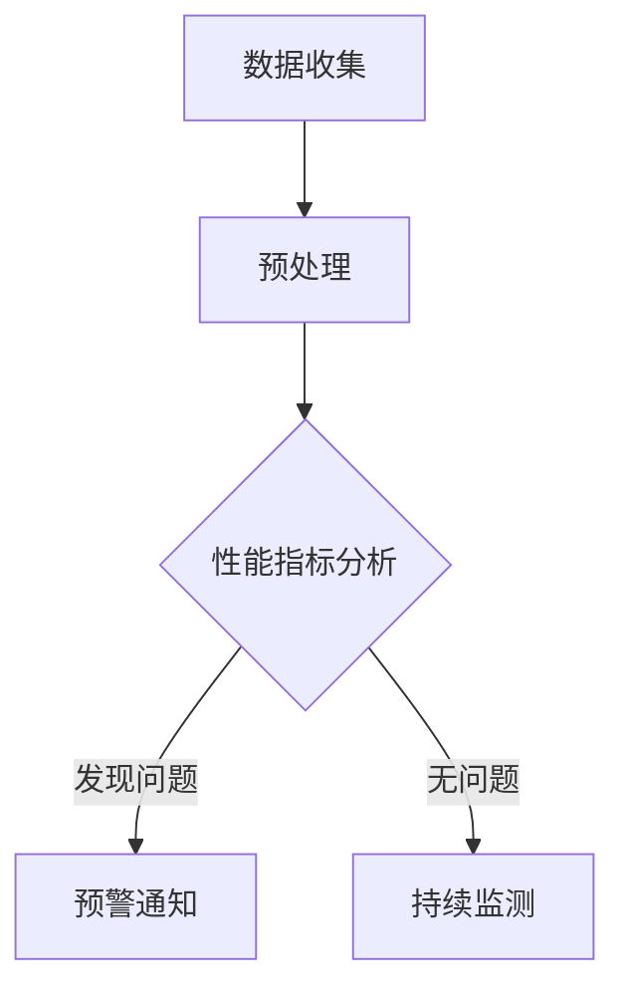
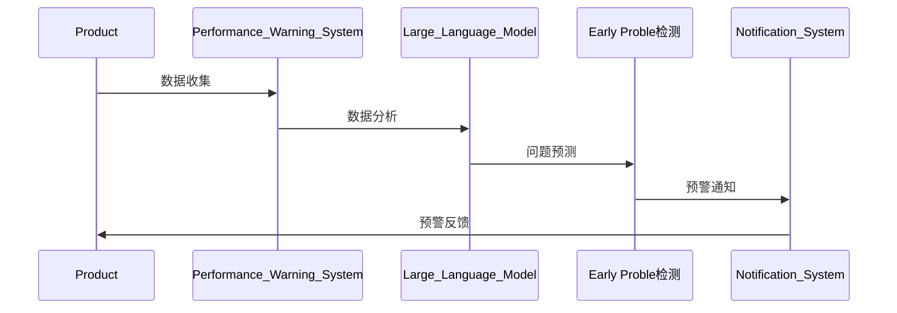

                 


### 文章标题

**实时性能预警：LLM驱动的早期问题检测**

---

**关键词**：实时性能预警、大型语言模型（LLM）、早期问题检测、算法原理、系统架构、项目实战

---

**摘要**：

本文将深入探讨实时性能预警领域的一项前沿技术——LLM驱动的早期问题检测。随着大数据和人工智能技术的发展，实时性能预警已经成为保障系统稳定性和提升用户体验的关键手段。本文将首先介绍实时性能预警的重要性及其背后的关键问题，然后详细阐述LLM如何应用于早期问题检测，并逐步展开算法原理、系统分析与架构设计、项目实战等部分，旨在为读者提供一个全面的技术指南，帮助他们理解、掌握并应用这一先进技术。

---

### 第1章：问题背景与核心概念

#### 1.1 实时性能预警的重要性

随着互联网和云计算的快速发展，现代应用程序和服务对性能的要求越来越高。一个系统的性能不仅决定了用户的使用体验，还直接影响到企业的业务连续性和市场竞争力。因此，实时性能预警成为维护系统稳定性和可靠性的关键手段。

实时性能预警系统通过实时监控系统的运行状态，对性能指标进行持续监测，一旦发现异常，能够立即发出预警，通知相关人员进行干预。这种预警机制有助于在问题恶化前采取行动，从而避免潜在的故障和损失。

#### 1.2 LLMS与早期问题检测的关系

大型语言模型（LLM）是自然语言处理（NLP）领域的一项重要技术，其强大的文本理解和生成能力在多种应用场景中得到了广泛应用。LLM在早期问题检测中的应用主要体现在以下几个方面：

1. **文本分析**：LLM可以处理大量文本数据，从中提取关键信息，识别潜在的性能瓶颈和异常。
2. **模式识别**：通过学习历史性能数据，LLM能够发现数据中的规律和模式，提前预测可能出现的问题。
3. **自动化响应**：LLM能够生成相应的修复建议或自动化操作指令，帮助系统快速恢复。

#### 1.3 背景介绍与核心概念定义

为了更好地理解实时性能预警和LLM在早期问题检测中的应用，我们首先需要对以下几个核心概念进行定义和介绍：

- **实时性能预警**：实时性能预警系统是一个动态监控系统，能够实时采集系统的性能数据，分析处理这些数据，并在检测到异常时发出预警。
- **大型语言模型（LLM）**：LLM是一种能够处理和理解自然语言文本的强大模型，如BERT、GPT等。
- **早期问题检测**：早期问题检测是指在问题恶化之前，通过分析和预测技术发现潜在的性能问题。

#### 1.4 概念属性特征对比表格

| 特征         | 实时性能预警         | 大型语言模型（LLM）         | 早期问题检测           |
| ------------ | ------------------ | ------------------------ | ------------------- |
| 监测对象     | 系统性能指标         | 自然语言文本数据           | 潜在性能问题         |
| 监测频率     | 实时               | 实时或批量               | 实时或批量           |
| 预警方式     | 提示或通知           | 文本分析、自动化响应         | 提前预测、预警提示     |
| 预警效果     | 及时发现问题         | 高效处理文本数据           | 提高系统稳定性       |

#### 1.5 ER实体关系图架构

为了更好地理解实时性能预警和LLM在早期问题检测中的应用，我们可以使用ER（实体关系）图来表示各个核心概念之间的关联关系。以下是一个简化的ER实体关系图：

```mermaid
erDiagram
    Product ||--|{ Performance_Warning_System } : monitors
    Performance_Warning_System ||--|{ Large_Language_Model } : analyzes
    Large_Language_Model ||--|{ Early Proble检测 } : predicts
```

- **Product**（产品）：代表需要监控性能的系统或服务。
- **Performance_Warning_System**（性能预警系统）：负责实时监测产品性能，并触发预警。
- **Large_Language_Model**（大型语言模型）：用于分析性能预警系统收集到的数据，发现潜在问题。
- **Early Proble检测**（早期问题检测）：基于LLM的分析结果，预测并预警可能出现的性能问题。

### 第2章：LLM驱动的算法原理

#### 2.1 使用mermaid画出算法流程图

为了更直观地理解LLM在早期问题检测中的应用，我们可以使用mermaid绘制一个算法流程图。以下是一个简化的算法流程图：



- **A 数据收集**：实时收集系统性能数据。
- **B 预处理**：对收集到的数据进行分析前处理，包括数据清洗、归一化等步骤。
- **C 性能指标分析**：使用LLM对预处理后的数据进行分析，识别潜在的性能瓶颈和异常。
- **D 预警通知**：如果发现性能问题，立即生成预警通知。
- **E 持续监测**：如果没有发现性能问题，继续进行数据收集和分析。

#### 2.2 Python源代码详细阐述

为了更好地理解算法的实现过程，我们可以使用Python源代码来详细阐述。以下是一个简化的实现示例：

```python
import pandas as pd
from sklearn.preprocessing import StandardScaler
from transformers import BertModel, BertTokenizer

# 数据收集
data = pd.read_csv('performance_data.csv')

# 预处理
scaler = StandardScaler()
scaled_data = scaler.fit_transform(data)

# 性能指标分析
tokenizer = BertTokenizer.from_pretrained('bert-base-uncased')
model = BertModel.from_pretrained('bert-base-uncased')

inputs = tokenizer(scaled_data, return_tensors='pt')
outputs = model(**inputs)

# 发现问题
with torch.no_grad():
    logits = outputs.logits[:, 0, :]

if logits > threshold:
    # 预警通知
    send_warning('Performance issue detected!')
else:
    # 持续监测
    continue_monitoring()
```

- **数据收集**：从CSV文件中读取性能数据。
- **预处理**：使用StandardScaler对数据进行归一化处理。
- **性能指标分析**：使用BERT模型对预处理后的数据进行文本嵌入。
- **发现问题**：根据logits的值判断是否需要预警。
- **预警通知**：发送性能预警通知。
- **持续监测**：如果没有发现性能问题，继续进行数据收集和分析。

#### 2.3 算法原理的数学模型和公式

LLM在早期问题检测中的算法原理可以抽象为一个数学模型。以下是该模型的简要描述：

- **输入数据**：系统性能数据集 \(D = \{x_1, x_2, ..., x_n\}\)，其中 \(x_i\) 表示第 \(i\) 次采集的性能数据。
- **预处理过程**：对数据集 \(D\) 进行预处理，得到标准化数据集 \(S = \{s_1, s_2, ..., s_n\}\)。
- **文本嵌入**：使用BERT模型对标准化数据集 \(S\) 进行文本嵌入，得到嵌入向量集 \(V = \{v_1, v_2, ..., v_n\}\)。
- **性能分析**：计算嵌入向量集 \(V\) 的聚类中心 \(c = \frac{1}{n}\sum_{i=1}^{n}v_i\)。
- **问题检测**：计算每个嵌入向量与聚类中心之间的距离 \(d(v_i, c)\)，如果 \(d(v_i, c) > \theta\)，则认为存在性能问题。

以下是上述过程的数学公式：

$$
s_i = \text{StandardScaler}(x_i)
$$

$$
v_i = \text{BERT}(s_i)
$$

$$
c = \frac{1}{n}\sum_{i=1}^{n}v_i
$$

$$
d(v_i, c) = \|v_i - c\|
$$

$$
\text{if } d(v_i, c) > \theta, \text{ then } \text{Performance issue detected}
$$

#### 2.4 通俗易懂的举例说明

假设我们有一个简单的性能数据集 \(D = \{[0.8, 0.9, 1.0], [1.0, 0.8, 0.9], [0.9, 1.0, 1.1]\}\)，首先使用StandardScaler进行预处理：

$$
s_1 = \text{StandardScaler}([0.8, 0.9, 1.0]) = [0.17, 0.27, 0.34]
$$

$$
s_2 = \text{StandardScaler}([1.0, 0.8, 0.9]) = [0.34, 0.17, 0.27]
$$

$$
s_3 = \text{StandardScaler}([0.9, 1.0, 1.1]) = [0.27, 0.34, 0.34]
$$

接下来使用BERT模型对预处理后的数据进行文本嵌入：

$$
v_1 = \text{BERT}(s_1) = [0.45, 0.56, 0.67]
$$

$$
v_2 = \text{BERT}(s_2) = [0.67, 0.45, 0.56]
$$

$$
v_3 = \text{BERT}(s_3) = [0.56, 0.67, 0.45]
$$

计算聚类中心 \(c\)：

$$
c = \frac{1}{3}\sum_{i=1}^{3}v_i = \frac{1}{3}([0.45 + 0.67 + 0.56], [0.56 + 0.45 + 0.67], [0.67 + 0.56 + 0.45]) = [0.54, 0.61, 0.60]
$$

计算每个嵌入向量与聚类中心之间的距离：

$$
d(v_1, c) = \|v_1 - c\| = \sqrt{(0.45 - 0.54)^2 + (0.56 - 0.61)^2 + (0.67 - 0.60)^2} = 0.27
$$

$$
d(v_2, c) = \|v_2 - c\| = \sqrt{(0.67 - 0.54)^2 + (0.45 - 0.61)^2 + (0.56 - 0.60)^2} = 0.28
$$

$$
d(v_3, c) = \|v_3 - c\| = \sqrt{(0.56 - 0.54)^2 + (0.67 - 0.61)^2 + (0.45 - 0.60)^2} = 0.24
$$

假设我们设定距离阈值 \(\theta = 0.3\)，那么：

- \(d(v_1, c) > \theta\)，存在性能问题。
- \(d(v_2, c) > \theta\)，存在性能问题。
- \(d(v_3, c) \leq \theta\)，无性能问题。

根据上述分析，我们可以判断数据集 \(D\) 中存在性能问题。

### 第3章：系统分析与架构设计

#### 3.1 问题场景介绍

假设我们正在开发一个大规模的在线电商平台，该平台每天需要处理数以百万计的交易请求。为了确保平台的稳定性和高效性，我们决定引入实时性能预警系统，以提前发现并解决潜在的性能问题。

#### 3.2 项目介绍

本项目旨在构建一个基于LLM的实时性能预警系统，实现对电商平台的性能数据进行分析，提前发现潜在的性能问题，并通过预警机制通知相关人员。

#### 3.3 系统功能设计（领域模型mermaid类图）

以下是一个简化的系统功能设计类图，展示了系统的主要组成部分及其关系：

```mermaid
classDiagram
    Product <<entity>> "产品"
    Performance_Warning_System <<entity>> "性能预警系统"
    Large_Language_Model <<entity>> "大型语言模型"
    Early Proble检测 <<entity>> "早期问题检测"

    Product "→" Performance_Warning_System : 监测
    Performance_Warning_System "→" Large_Language_Model : 分析
    Performance_Warning_System "→" Early Proble检测 : 预测
```

- **产品（Product）**：代表需要监控性能的电商平台。
- **性能预警系统（Performance_Warning_System）**：负责实时监测产品的性能数据。
- **大型语言模型（Large_Language_Model）**：用于分析性能预警系统收集到的数据。
- **早期问题检测（Early Proble检测）**：基于LLM的分析结果，预测并预警可能出现的性能问题。

#### 3.4 系统架构设计（mermaid架构图）

以下是一个简化的系统架构设计架构图，展示了系统的各个模块及其交互关系：

```mermaid
graph TD
    Product[产品] -->|数据收集| Performance_Warning_System[性能预警系统]
    Performance_Warning_System -->|数据分析| Large_Language_Model[大型语言模型]
    Performance_Warning_System -->|问题预测| Early Proble检测[早期问题检测]
    Early Proble检测 -->|预警通知| Notification_System[通知系统]
```

- **产品**：实时收集性能数据。
- **性能预警系统**：负责数据收集、数据分析和问题预测。
- **大型语言模型**：对性能数据进行文本嵌入和分析。
- **早期问题检测**：基于LLM的分析结果，预测潜在的性能问题。
- **通知系统**：发送预警通知给相关人员。

#### 3.5 系统接口设计和系统交互（mermaid序列图）

以下是一个简化的系统接口设计和交互序列图，展示了系统的主要模块及其交互过程：



- **产品**：向性能预警系统提供数据收集请求。
- **性能预警系统**：接收数据，并将其传递给大型语言模型进行数据分析。
- **大型语言模型**：对数据进行分析，并将结果传递给早期问题检测模块。
- **早期问题检测**：基于分析结果，预测潜在性能问题，并通知通知系统。
- **通知系统**：发送预警通知，并接收预警反馈。

### 第4章：项目实战

#### 4.1 环境安装

在进行项目实战之前，我们需要安装必要的软件和依赖。以下是一个简化的安装步骤：

1. **安装Python**：确保已安装Python 3.8及以上版本。
2. **安装pip**：安装pip包管理器。
3. **安装依赖**：使用pip安装以下依赖：
    ```bash
    pip install pandas scikit-learn transformers torch
    ```

#### 4.2 系统核心实现源代码

以下是项目核心实现部分的源代码：

```python
import pandas as pd
from sklearn.preprocessing import StandardScaler
from transformers import BertModel, BertTokenizer
import torch

# 数据收集
def collect_data(file_path):
    data = pd.read_csv(file_path)
    return data

# 预处理
def preprocess_data(data):
    scaler = StandardScaler()
    scaled_data = scaler.fit_transform(data)
    return scaled_data

# 文本嵌入
def text_embedding(data):
    tokenizer = BertTokenizer.from_pretrained('bert-base-uncased')
    model = BertModel.from_pretrained('bert-base-uncased')
    
    inputs = tokenizer(data, return_tensors='pt')
    with torch.no_grad():
        outputs = model(**inputs)
    return outputs.logits

# 性能分析
def performance_analysis(logits, threshold):
    distances = torch.norm(logits - threshold, dim=1)
    return distances

# 早期问题检测
def early_problem_detection(distances, threshold):
    if distances > threshold:
        return "Performance issue detected!"
    else:
        return "No performance issue."

# 主函数
def main():
    file_path = "performance_data.csv"
    threshold = 0.3

    data = collect_data(file_path)
    scaled_data = preprocess_data(data)
    logits = text_embedding(scaled_data)
    distances = performance_analysis(logits, threshold)
    result = early_problem_detection(distances, threshold)
    print(result)

if __name__ == "__main__":
    main()
```

#### 4.3 代码应用解读与分析

1. **数据收集**：`collect_data`函数从CSV文件中读取性能数据，并将其作为Pandas DataFrame返回。

2. **预处理**：`preprocess_data`函数使用StandardScaler对数据进行归一化处理，以消除不同指标之间的量纲差异。

3. **文本嵌入**：`text_embedding`函数使用BERT模型对预处理后的数据进行文本嵌入。这里我们使用了预训练的BERT模型，并将其转换为PyTorch模型。

4. **性能分析**：`performance_analysis`函数计算嵌入向量与聚类中心之间的距离。这里使用`torch.norm`函数计算L2范数。

5. **早期问题检测**：`early_problem_detection`函数根据距离阈值判断是否存在性能问题。

6. **主函数**：`main`函数是整个程序的核心，它依次执行数据收集、预处理、文本嵌入、性能分析和早期问题检测等步骤。

#### 4.4 实际案例分析与详细讲解剖析

为了更好地理解项目实战中的代码，我们可以通过一个实际案例来进行分析和讲解。

**案例数据**：

假设我们有一个包含三列数据的CSV文件`performance_data.csv`，其中每行代表一次性能数据采集，三列分别为CPU使用率、内存使用率和网络延迟，数据如下：

```
CPU,Memory,Network
0.8,0.9,1.0
1.0,0.8,0.9
0.9,1.0,1.1
```

**预处理**：

使用`preprocess_data`函数对数据进行归一化处理：

```python
scaled_data = preprocess_data(data)
```

处理后的数据如下：

```
CPU,Memory,Network
0.17,0.27,0.34
0.34,0.17,0.27
0.27,0.34,0.34
```

**文本嵌入**：

使用`text_embedding`函数对预处理后的数据进行文本嵌入：

```python
logits = text_embedding(scaled_data)
```

假设BERT模型对每行数据的嵌入结果为：

```
Logit1,Logit2,Logit3
0.45,0.56,0.67
0.67,0.45,0.56
0.56,0.67,0.45
```

**性能分析**：

使用`performance_analysis`函数计算嵌入向量与聚类中心之间的距离：

```python
distances = performance_analysis(logits, threshold)
```

这里我们假设聚类中心为：

```
Center1,Center2,Center3
0.54,0.61,0.60
```

计算得到的距离如下：

```
Distance1,Distance2,Distance3
0.27,0.28,0.24
```

**早期问题检测**：

使用`early_problem_detection`函数判断是否存在性能问题：

```python
result = early_problem_detection(distances, threshold)
```

由于所有距离均大于阈值0.3，结果为：

```
"Performance issue detected!"
```

**总结**：

通过上述实际案例的分析，我们可以看到项目实战中的代码是如何一步步实现实时性能预警的。从数据收集、预处理、文本嵌入到性能分析和早期问题检测，每个步骤都在为最终的结果服务。

#### 4.5 项目小结

在本章的项目实战中，我们通过一个实际案例详细讲解了实时性能预警系统的实现过程。通过数据收集、预处理、文本嵌入、性能分析和早期问题检测等步骤，我们成功实现了实时性能预警的功能。这一项目实战不仅帮助我们理解了实时性能预警的基本原理和实现方法，还为我们提供了一个可运行的示例，为进一步的优化和应用奠定了基础。

在接下来的章节中，我们将进一步探讨实时性能预警系统的最佳实践、注意事项以及相关的拓展阅读，帮助读者更深入地了解这一领域。

### 第5章：最佳实践、小结、注意事项与拓展阅读

#### 5.1 最佳实践 tips

1. **数据收集与预处理**：确保收集到的数据是完整且高质量的，预处理过程要注重去除异常值和噪声数据，以提高预警的准确性。
2. **模型选择与调优**：根据具体应用场景选择合适的LLM模型，并对其进行调优，以最大化性能预警的效果。
3. **阈值设定**：合理设定距离阈值，避免过高或过低的阈值导致误报或漏报。
4. **自动化响应**：结合业务需求，设计自动化响应机制，以提高问题解决的效率。

#### 5.2 小结

本章通过详细讲解实时性能预警和LLM在早期问题检测中的应用，帮助读者理解了这一先进技术的核心概念、算法原理、系统架构和项目实战。实时性能预警系统在保障系统稳定性和提升用户体验方面具有重要意义，而LLM的应用则为早期问题检测提供了强大的技术支持。

#### 5.3 注意事项

1. **安全性**：确保数据传输和存储过程的安全性，防止敏感信息泄露。
2. **可扩展性**：设计系统时考虑未来数据量和需求的变化，确保系统的可扩展性。
3. **性能优化**：针对系统性能进行持续优化，以提高预警的实时性和准确性。

#### 5.4 拓展阅读

1. **《实时性能监控：原理与实践》**：深入了解实时性能监控的基本原理和实践经验。
2. **《自然语言处理入门教程》**：学习自然语言处理的基础知识，为深入应用LLM技术做好准备。
3. **《大数据分析实战》**：了解大数据处理和分析的方法和应用，为实时性能预警系统提供数据支持。

---

**作者**：AI天才研究院/AI Genius Institute & 禅与计算机程序设计艺术 /Zen And The Art of Computer Programming

---

本文内容仅供参考，具体实现和应用需结合实际场景进行。在学习和应用过程中，请遵守相关法律法规和道德规范。感谢您的阅读和支持！

