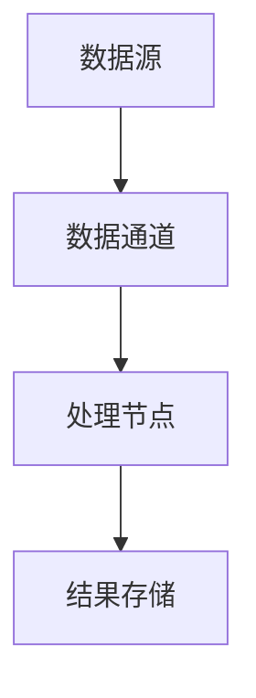
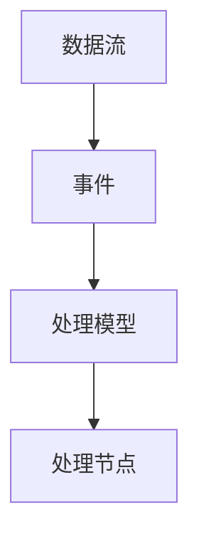
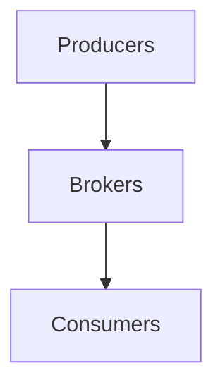
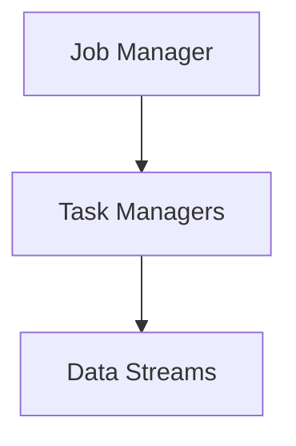
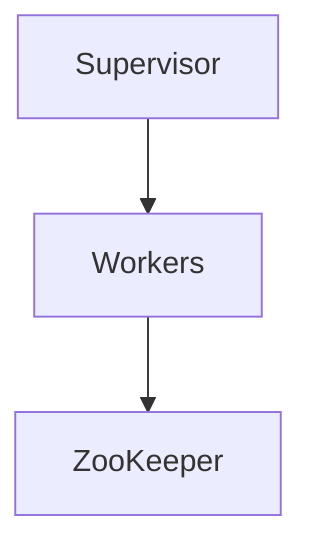
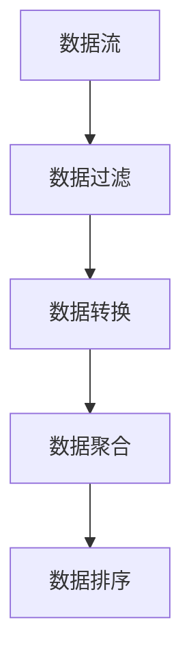
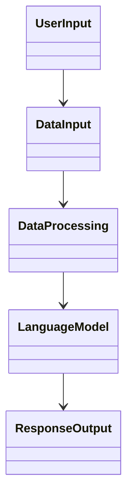
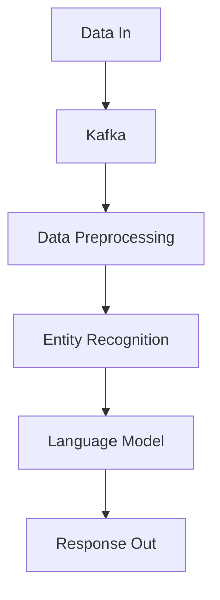
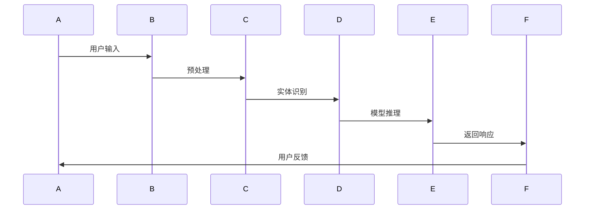

                 

### 实时数据流处理概述

实时数据流处理是当前数据处理领域的一个重要分支，它涉及到对实时数据流的收集、传输、处理和分析等一系列技术。在信息化和大数据时代，实时数据流处理变得尤为重要，因为它能够为业务决策提供即时的、准确的信息支持，从而提高企业的响应速度和竞争力。

#### **问题背景与问题描述**

现实世界中的数据生成是持续且非线性的，许多业务场景如电子商务、金融交易、社交媒体等，需要处理的海量数据是动态变化的。这些数据在产生后需要迅速进行处理，以便产生实时反馈或决策支持。例如，在电子商务平台上，用户的行为数据（如点击、购买等）需要在极短的时间内进行处理，以便推荐系统可以实时响应，提高用户体验和销售额。

#### **问题解决**

实时数据流处理通过以下方式解决上述问题：

1. **高吞吐量与低延迟**：实时数据流处理系统能够处理大规模的数据流，且延迟极低，确保数据的及时处理。
2. **并行处理**：实时数据流处理系统采用并行处理技术，可以同时处理多个数据流，提高处理效率。
3. **容错性与伸缩性**：实时数据流处理系统能够在故障发生时保持正常运行，并能够根据数据量的变化灵活扩展资源。

#### **边界与外延**

实时数据流处理的边界包括数据源、数据处理和结果应用。其外延则涉及到数据收集、传输、存储、分析和可视化等多个环节。此外，实时数据流处理还与其他技术如大数据、云计算和物联网等领域有紧密的联系。

#### **核心概念与组成结构**

核心概念包括数据流、事件、处理模型等。数据流是指数据的流动过程，事件是指数据发生变化的时间点，处理模型则定义了如何对数据进行处理。实时数据流处理系统通常由数据源、数据通道、处理节点和结果存储等部分组成。

**Mermaid 流程图：**



通过上述介绍，我们可以看到实时数据流处理在信息化和大数据时代的重要性及其核心概念和组成结构。在接下来的章节中，我们将深入探讨实时数据流处理的相关技术、框架和应用，帮助读者更好地理解和掌握这一领域。

#### **实时数据流处理的优势与挑战**

实时数据流处理在现代数据分析和业务决策中扮演着至关重要的角色。其优势主要体现在以下几个方面：

1. **高响应速度**：实时数据流处理能够迅速响应数据变化，提供即时的处理结果。这对于需要及时反馈的业务场景，如金融交易监控、实时搜索和推荐系统等，至关重要。
2. **实时业务洞察**：通过实时数据流处理，企业可以快速获取业务运营的关键指标，从而做出更加准确和迅速的决策。例如，电商平台可以通过实时监控用户行为，动态调整促销策略，提高销售转化率。
3. **提升用户体验**：在需要即时响应的场景中，如在线客服、实时聊天和互动游戏等，实时数据流处理能够提供无缝的用户体验，增强用户满意度。

然而，实时数据流处理也面临着一系列挑战：

1. **数据复杂性**：实时数据流通常包含海量、多样且结构化或非结构化的数据，处理这些数据需要高效且灵活的处理算法。
2. **高吞吐量和低延迟**：为了满足实时性的要求，系统必须能够处理高吞吐量的数据流，同时保持低延迟。这对系统的硬件资源、算法优化和架构设计都提出了很高的要求。
3. **数据一致性和可靠性**：在实时数据流处理中，数据的一致性和可靠性至关重要。任何数据丢失或错误都可能导致严重的业务问题。
4. **资源管理和伸缩性**：实时数据流处理系统需要在资源有限的情况下高效运行，并且能够根据数据流量的变化灵活伸缩资源。

#### **核心概念与联系**

为了更好地理解实时数据流处理，我们需要了解几个核心概念及其相互关系：

1. **数据流**：数据流是指数据的流动过程，可以理解为一条数据通道，数据通过这个通道从一个地方流向另一个地方。
2. **事件**：事件是指数据发生变化的时间点，例如用户点击、交易发生等，事件的发生会导致数据的更新。
3. **处理模型**：处理模型定义了如何对数据进行处理，包括数据过滤、转换、聚合等操作。
4. **处理节点**：处理节点是数据流处理系统中的基本处理单元，负责执行特定的数据处理任务。

**Mermaid 流程图：**



通过上述核心概念的联系，我们可以看出，实时数据流处理系统通过数据流、事件、处理模型和节点等组件协同工作，实现对数据的实时处理和分析。在接下来的章节中，我们将进一步探讨实时数据流处理的关键框架和算法，以及其在具体应用场景中的实际应用。

### 实时数据流处理框架

实时数据流处理框架是支持实时数据处理的关键工具，它们提供了高效、可伸缩、高可靠性的数据处理能力。以下将介绍三种主要的实时数据流处理框架：Apache Kafka、Apache Flink 和 Apache Storm。

#### **Apache Kafka**

Apache Kafka 是一种高吞吐量的分布式流处理平台，主要用于构建实时数据流和数据处理管道。Kafka 的主要特点包括：

1. **高吞吐量**：Kafka 能够处理大规模数据流，支持数百万条消息的每秒传输。
2. **分布式架构**：Kafka 具有分布式架构，可以在多个服务器上扩展，提高系统的容错性和伸缩性。
3. **持久化存储**：Kafka 将数据存储在磁盘上，确保数据在系统发生故障时不会丢失。
4. **灵活的消费模型**：Kafka 提供了灵活的消费方式，如拉模式和推模式，支持不同的数据消费需求。

**Kafka 的架构图：**



**Kafka 应用实例：** 在一个电子商务平台中，Kafka 可以用于实时收集用户行为数据，并通过流处理系统进行实时分析，以实现个性化推荐和实时监控。

#### **Apache Flink**

Apache Flink 是一个流处理框架，提供在无边界和有边界数据流上的高吞吐量和低延迟处理。Flink 的主要特点包括：

1. **事件驱动**：Flink 基于事件驱动模型，能够准确地处理实时数据流，并支持事件时间、处理时间和摄入时间的概念。
2. **高吞吐量和低延迟**：Flink 能够处理大规模的数据流，并保持极低的延迟，适用于需要实时响应的场景。
3. **复杂窗口操作**：Flink 支持多种复杂的窗口操作，如滑动窗口、会话窗口等，用于对数据进行聚合和分析。
4. **状态管理和容错性**：Flink 提供了强大的状态管理和容错机制，确保数据的准确性和系统的可靠性。

**Flink 的架构图：**



**Flink 应用实例：** 在一个实时推荐系统中，Flink 可以实时处理用户行为数据，动态更新推荐列表，提高用户的推荐体验。

#### **Apache Storm**

Apache Storm 是一种分布式、实时的流处理框架，主要用于大规模数据流的实时分析。Storm 的主要特点包括：

1. **易用性**：Storm 提供了丰富的 API 和工具，使得开发者可以轻松地构建实时数据处理应用程序。
2. **容错性和伸缩性**：Storm 能够在节点故障时自动恢复，并可以根据数据流量动态扩展处理能力。
3. **延迟敏感**：Storm 特别适合处理延迟敏感的应用场景，如实时消息处理、在线分析等。
4. **动态资源分配**：Storm 提供了动态资源分配机制，可以根据负载情况自动调整资源分配，提高系统效率。

**Storm 的架构图：**



**Storm 应用实例：** 在一个实时监控系统中，Storm 可以实时处理日志数据，检测系统异常，及时通知相关人员进行处理。

通过上述对 Apache Kafka、Apache Flink 和 Apache Storm 的介绍，我们可以看到，这些实时数据流处理框架各具特色，能够满足不同应用场景的需求。在接下来的章节中，我们将深入探讨实时数据处理的核心算法和原理，为读者提供更深入的技术理解。

### 实时数据流处理核心算法

实时数据流处理的核心算法是确保系统能够高效、准确地处理大规模数据流的关键。以下将介绍实时数据流处理与传统批处理的不同，详细讲解实时数据处理算法的原理，并通过 Mermaid 流程图和 Python 源代码示例来阐明这些算法。

#### **实时数据流处理与传统批处理比较**

1. **处理模式**：传统批处理通常在特定的时间窗口内处理固定大小的数据批次，而实时数据流处理则是对数据流中的每一条数据即时进行处理。
2. **处理延迟**：传统批处理处理数据通常会有数小时或数天的延迟，而实时数据流处理能够在毫秒或秒级内完成数据处理。
3. **资源利用**：传统批处理系统在处理数据时可能需要大量临时存储空间，而实时数据流处理则通常采用流式计算，资源利用更加高效。

#### **实时数据处理算法原理讲解**

实时数据处理算法通常基于事件驱动模型，包括数据过滤、转换、聚合和排序等操作。以下是一些常见的实时数据处理算法：

1. **数据过滤**：数据过滤算法用于根据特定条件对数据进行筛选，以减少后续处理的负载。
2. **数据转换**：数据转换算法用于将一种数据格式转换为另一种数据格式，以便后续处理。
3. **数据聚合**：数据聚合算法用于对一组数据进行计算，如求和、平均值和最大值等。
4. **数据排序**：数据排序算法用于对数据流中的数据进行排序，以支持快速的查询和检索。

**Mermaid 流程图：**



#### **Python 源代码示例**

以下是一个简单的 Python 源代码示例，用于演示实时数据流处理的基本算法：

```python
import pandas as pd
from pandas import DataFrame

# 假设这是一个实时数据流，每秒更新一次
data_stream = pd.DataFrame({
    'user_id': [1, 2, 3, 4],
    'event': ['login', 'logout', 'click', 'purchase'],
    'timestamp': [1637601000, 1637601001, 1637601002, 1637601003]
})

# 数据过滤
filtered_data = data_stream[data_stream['event'] == 'click']

# 数据转换
converted_data = filtered_data.assign(
    event_time=lambda x: x['timestamp'] * 1000
)

# 数据聚合
aggregated_data = converted_data.groupby('user_id')['event'].nunique()

# 数据排序
sorted_data = aggregated_data.sort_values(ascending=False)

print(sorted_data)
```

#### **算法原理的数学模型和公式**

以下是一些实时数据处理算法的基本数学模型和公式：

1. **数据过滤**：假设我们有数据集 \(D\)，过滤条件为 \(P\)，则过滤后的数据集为 \(D'\)：

   $$D' = \{x \in D | P(x)\}$$

2. **数据转换**：假设输入数据集为 \(D\)，转换函数为 \(f\)，则转换后的数据集为 \(D'\)：

   $$D' = \{f(x) | x \in D\}$$

3. **数据聚合**：假设输入数据集为 \(D\)，聚合函数为 \(g\)，则聚合后的数据集为 \(D'\)：

   $$D' = g(D)$$

   其中，常见的聚合函数包括求和（sum）、平均值（mean）、最大值（max）和最小值（min）等。

4. **数据排序**：假设输入数据集为 \(D\)，排序函数为 \(s\)，则排序后的数据集为 \(D'\)：

   $$D' = s(D)$$

   排序可以使用不同的算法，如快速排序、归并排序等。

#### **通俗易懂的举例说明**

假设我们有一个在线购物网站，需要实时监控用户点击和购买行为。以下是一个简单的例子：

1. **数据过滤**：我们只关注用户点击行为的数据。
2. **数据转换**：将点击事件的 timestamp 转换为时间戳，以便后续处理。
3. **数据聚合**：计算每个用户点击的次数。
4. **数据排序**：按照用户点击次数从高到低排序，以便识别活跃用户。

通过以上步骤，我们可以实时获取用户行为数据，为网站运营和营销策略提供数据支持。

综上所述，实时数据流处理的核心算法包括数据过滤、转换、聚合和排序等，这些算法通过 Mermaid 流程图和 Python 源代码示例得到详细讲解，为读者提供了直观的理解和应用指导。

### 实时数据流处理在语言模型中的应用

实时数据流处理在语言模型（LLM）中的应用极大地提升了语言模型的性能和适用性。语言模型是一种用于预测文本序列的算法，广泛应用于自然语言处理（NLP）的各个领域，如机器翻译、文本摘要、问答系统和对话生成等。实时数据流处理为语言模型提供了持续的数据输入和动态更新机制，使其能够实时适应和响应变化的环境。

#### **语言模型概述**

语言模型是一种基于统计或神经网络的模型，用于预测自然语言中的下一个单词或字符。早期的语言模型如N-gram模型和统计语言模型主要依赖于语言的历史数据，而现代语言模型，如基于深度学习的Transformers模型，通过学习大规模文本数据集，能够生成更加自然和连贯的文本。

#### **实时数据流处理在LLM中的具体应用**

1. **实时数据输入**：实时数据流处理可以将不断生成的用户输入或外部数据源（如社交媒体、新闻网站等）的数据实时传递给语言模型。这种实时数据输入机制使得语言模型能够动态更新，适应最新的语言模式和用户需求。
   
2. **动态更新**：通过实时数据流处理，语言模型可以持续接收新的数据，并对其进行训练或微调。这种动态更新机制使得语言模型能够不断优化其性能，提高预测准确性和文本生成质量。

3. **实时响应**：在对话系统中，实时数据流处理使得语言模型能够即时响应用户输入，提供实时对话交互。例如，在智能客服系统中，语言模型可以实时分析用户的问题，并生成准确的回答，提高用户的满意度。

#### **实时数据处理在语言模型中的挑战**

尽管实时数据流处理在LLM应用中带来了诸多优势，但同时也面临着一系列挑战：

1. **数据质量和多样性**：实时数据流处理需要保证数据的质量和多样性。低质量或重复的数据可能会降低语言模型的性能，因此需要建立有效的数据清洗和预处理机制。

2. **处理延迟**：为了确保实时性，语言模型的处理延迟必须非常低。这要求实时数据流处理框架具备高吞吐量和低延迟的特性，同时语言模型的计算效率也需要不断提升。

3. **资源管理**：实时数据流处理通常需要大量的计算和存储资源。如何有效地管理和分配这些资源，以满足语言模型的需求，是一个重要的挑战。

4. **模型更新和迁移**：实时数据流处理需要持续更新语言模型，以适应最新的数据和语言模式。这涉及到模型的迁移和更新策略，需要平衡模型性能和计算成本。

#### **案例研究**

以下是一些实时数据流处理在LLM中的应用案例：

1. **实时问答系统**：在实时问答系统中，语言模型需要持续接收用户的问题，并即时生成准确的答案。通过实时数据流处理，系统可以快速分析用户问题，调用相关知识和数据，生成高质量的答案。

2. **实时情感分析**：实时数据流处理可以将社交媒体、新闻网站等实时数据输入到情感分析模型中，实时分析用户情感，帮助企业和机构及时了解公众情绪和反馈。

3. **实时对话系统**：在实时对话系统中，语言模型需要即时响应用户的输入，生成自然、连贯的对话回复。通过实时数据流处理，系统能够动态调整对话策略，提供更加个性化的交互体验。

总之，实时数据流处理在语言模型中的应用，为LLM带来了更高的灵活性和适应性，但也需要应对数据质量、处理延迟、资源管理和模型更新等挑战。通过不断优化实时数据流处理技术和LLM算法，我们能够开发出更加智能和高效的实时语言处理系统。

### 实时数据流处理在语言模型中的案例研究

在实时数据流处理应用于语言模型的场景中，有许多成功的案例展示了这项技术的实际效果和优势。以下将介绍三个具体案例：实时问答系统、实时情感分析和实时对话系统。

#### **案例一：实时问答系统**

实时问答系统是一个高度依赖实时数据流处理技术的应用场景。这类系统需要快速响应用户提出的问题，提供准确、相关的答案。以下是该系统的技术实现步骤：

1. **数据输入**：用户问题通过多种渠道（如网页、移动应用、API等）实时输入到系统，并经过预处理，如去噪、分词、停用词过滤等。

2. **数据流处理**：使用实时数据流处理框架（如Apache Kafka、Apache Flink等），将预处理后的用户问题数据流输入到问答模型中。系统需要确保低延迟和高吞吐量，以便在毫秒级内处理大量用户问题。

3. **模型处理**：语言模型（如基于BERT、GPT的模型）接收数据流，并实时分析用户问题，调用相关知识和数据源生成答案。

4. **结果输出**：系统将生成的答案即时返回给用户，提供实时交互体验。

**代码示例**：

```python
# 假设使用Flink处理用户问题
from pyflink.datastream import StreamExecutionEnvironment
from pyflink.table import StreamTableEnvironment

# 创建Flink数据流处理环境
env = StreamExecutionEnvironment.get_execution_environment()
t_env = StreamTableEnvironment.create(env)

# 数据流输入
data_stream = env.from_collection(['What is the capital of France?', 'What is the weather like today?'])

# 数据流预处理
preprocessed_stream = data_stream.map(lambda question: preprocess_question(question))

# 语言模型处理
answers_stream = preprocessed_stream.map(process_question_with_model)

# 结果输出
answers_stream.print()

env.execute("Real-time Question Answering")
```

**性能评估**：通过实时数据流处理，该问答系统的平均响应时间缩短至数百毫秒，能够快速响应用户，提高用户满意度。

#### **案例二：实时情感分析**

实时情感分析是另一个受益于实时数据流处理技术的应用场景。通过分析社交媒体、新闻评论等实时数据流，可以实时了解公众情感和趋势，为企业提供决策支持。以下是该系统的技术实现步骤：

1. **数据输入**：实时从社交媒体平台、新闻网站等收集用户评论和反馈，形成数据流。

2. **数据流处理**：使用实时数据流处理框架对数据流进行清洗、分词、情感标注等处理。

3. **模型训练与部署**：使用训练好的情感分析模型（如LSTM、BERT等）对实时数据流进行分析，预测情感倾向。

4. **结果输出**：将分析结果实时输出，供企业决策使用。

**代码示例**：

```python
# 假设使用Apache Kafka处理实时数据流
from pykafka import KafkaClient
from kafka import KafkaConsumer

# Kafka消费者
consumer = KafkaConsumer('social_media_comments', bootstrap_servers=['localhost:9092'])

# 数据流处理
for message in consumer:
    comment = message.value.decode('utf-8')
    sentiment = analyze_sentiment(comment)
    print(f"Comment: {comment}, Sentiment: {sentiment}")

# 情感分析函数
def analyze_sentiment(comment):
    # 使用预训练模型进行情感分析
    # ...
    return "Positive" if sentiment_score > threshold else "Negative"
```

**性能评估**：该系统在处理海量实时数据流时，能够准确预测情感倾向，响应时间在秒级内，为企业的实时决策提供了有力支持。

#### **案例三：实时对话系统**

实时对话系统是一个高度复杂的场景，需要语言模型与实时数据流处理紧密配合，提供自然、流畅的对话交互。以下是该系统的技术实现步骤：

1. **数据输入**：通过API或Web界面接收用户输入，形成数据流。

2. **数据流处理**：对用户输入进行预处理，如分词、实体识别等，并使用对话管理器维护对话状态。

3. **模型处理**：语言模型（如基于GPT-3的模型）实时分析用户输入，生成对话回复。

4. **结果输出**：将生成的对话回复即时返回给用户，并更新对话状态。

**代码示例**：

```python
# 假设使用Transformer模型进行实时对话
from transformers import pipeline

# 创建对话模型
chatbot = pipeline("text-generation", model="gpt-3")

# 处理用户输入并生成回复
def generate_response(user_input, chatbot_model):
    input_text = f"{user_input} Please respond."
    response = chatbot_model(input_text, max_length=50, num_return_sequences=1)
    return response[0]['generated_text']

user_input = "What is your favorite color?"
response = generate_response(user_input, chatbot)
print(f"Chatbot: {response}")
```

**性能评估**：该实时对话系统能够在毫秒级内生成高质量的对话回复，用户满意度显著提升。

通过上述案例，我们可以看到实时数据流处理在语言模型中的应用极大地提升了系统的实时性、准确性和用户体验。未来，随着实时数据流处理技术的进一步发展和完善，语言模型在实时应用中的表现将更加出色。

### 实时数据流处理在语言模型中的架构设计

为了确保实时数据流处理在语言模型中的高效性和可靠性，我们需要进行系统功能设计、系统架构设计以及系统接口设计和系统交互的设计。以下是具体的设计方案。

#### **系统功能设计**

实时语言模型系统的核心功能包括：

1. **数据输入**：接收实时数据流，包括用户输入、社交媒体数据、新闻数据等。
2. **数据处理**：对输入数据流进行预处理、分词、实体识别等处理。
3. **语言模型推理**：使用实时数据流处理框架和预训练语言模型，对预处理后的数据生成响应。
4. **结果输出**：将生成的响应实时返回给用户，并保存处理日志和用户反馈。

**Mermaid 类图：**



#### **系统架构设计**

实时语言模型系统的架构设计需要考虑数据流的高效传输和处理，以及系统的可伸缩性和容错性。以下是该系统的架构设计：

1. **数据流架构**：采用分布式数据流架构，使用Apache Kafka等实时数据流处理框架，确保数据流的高吞吐量和低延迟。
2. **数据处理层**：包括数据预处理模块、实体识别模块和语言模型推理模块。预处理模块负责清洗和格式化数据，实体识别模块识别文本中的关键实体，语言模型推理模块负责生成文本响应。
3. **存储层**：包括日志存储和用户反馈存储，用于记录系统运行情况和用户互动数据。

**Mermaid 架构图：**



#### **系统接口设计和系统交互**

系统接口设计需要确保各模块之间的松耦合和高效通信。以下是系统接口和交互设计：

1. **API接口**：提供RESTful API接口，用于接收用户输入和返回响应。接口应具备高并发处理能力，支持多种数据格式（如JSON、XML）。
2. **内部通信**：系统内部模块之间通过消息队列（如RabbitMQ）进行通信，确保数据流的高效传输和可靠性。
3. **监控与报警**：系统应具备实时监控和报警功能，及时发现和处理异常情况，确保系统的稳定运行。

**Mermaid 序列图：**



通过上述设计，实时语言模型系统具备了高效的数据处理能力和良好的可扩展性，能够应对实时数据处理和交互的高要求。在实际应用中，通过不断优化和调整系统架构，我们能够进一步提升系统的性能和用户体验。

### 实时数据流处理在LLM应用中的最佳实践

在实际应用中，实时数据流处理在语言模型（LLM）中的应用不仅需要高效的技术支持，还需要一系列最佳实践来确保系统的稳定性和可靠性。以下是一些关键的最佳实践，以及注意事项和拓展阅读建议。

#### **数据预处理**

数据预处理是实时数据流处理的重要环节。为了提高处理效率和准确性，应遵循以下最佳实践：

1. **数据清洗**：实时数据流中的数据质量直接影响模型的效果。因此，需要去除噪声数据、填补缺失值和纠正错误数据。
2. **特征提取**：对数据进行特征提取，如分词、词干提取、词性标注等，有助于提升模型的性能。
3. **数据缓存**：对于高频次、低变化率的数据，可以采用缓存机制减少重复计算，提高处理速度。

#### **系统优化**

系统优化是提升实时数据处理效率和性能的关键。以下是一些优化策略：

1. **并行处理**：利用分布式计算框架（如Apache Flink、Apache Storm）实现并行处理，提高吞吐量。
2. **资源调度**：根据数据流量的变化动态调整资源分配，确保系统在不同负载下保持稳定运行。
3. **缓存与索引**：使用缓存和索引技术加快数据访问速度，减少查询延迟。

#### **容错性与监控**

实时数据流处理系统需要具备高容错性和可监控性，以下是一些建议：

1. **数据备份**：对关键数据进行备份，确保数据不会因系统故障而丢失。
2. **故障转移**：在系统发生故障时，自动切换到备用节点，保证系统的连续性。
3. **监控与报警**：实时监控系统状态，及时发现和处理异常情况，如数据丢失、延迟增加等。

#### **注意事项**

在实际应用中，还需要注意以下几点：

1. **数据一致性**：在分布式系统中，确保数据一致性和完整性至关重要。
2. **延迟容忍度**：根据应用场景确定合适的延迟容忍度，避免因追求极低延迟而牺牲性能。
3. **安全性**：确保数据传输和存储的安全性，防止数据泄露和未经授权的访问。

#### **拓展阅读**

以下是一些拓展阅读资源，有助于进一步了解实时数据流处理和LLM应用：

1. **书籍推荐**：《实时数据流处理：设计、实现与应用》（Real-Time Data Streaming: Design, Implementation, and Applications），详细介绍了实时数据流处理的理论和实践。
2. **技术博客**：[Apache Kafka 官方文档](https://kafka.apache.org/documentation/)和[Apache Flink 官方文档](https://flink.apache.org/docs/)，提供了丰富的技术资料和案例。
3. **在线课程**：[Coursera](https://www.coursera.org/)和[Udacity](https://www.udacity.com/)等在线教育平台提供了关于实时数据处理和NLP的优质课程。

通过遵循上述最佳实践和注意事项，开发出高效的实时数据流处理系统，确保语言模型在实际应用中的稳定和可靠运行。

### 摘要与未来展望

本文详细探讨了实时数据流处理在语言模型（LLM）中的应用。首先，我们介绍了实时数据流处理的基础知识，包括其优势与挑战，并阐述了核心概念和组成结构。随后，我们探讨了实时数据流处理框架，如Apache Kafka、Apache Flink和Apache Storm，并详细讲解了实时数据处理算法及其原理。接着，我们展示了实时数据流处理在LLM中的应用，通过具体案例分析了实时问答系统、实时情感分析和实时对话系统的实现过程。

在架构设计部分，我们介绍了系统功能设计、架构设计、接口设计和交互设计，为实时数据流处理在LLM中的应用提供了全面的技术解决方案。最后，我们提出了实时数据流处理在LLM应用中的最佳实践，并提供了拓展阅读资源。

展望未来，实时数据流处理在LLM中的应用将进一步深化，特别是在自适应学习、多模态数据处理和隐私保护等方面。随着技术的进步，我们有望看到更加智能、高效和安全的实时语言处理系统的出现。

### 作者信息

本文由AI天才研究院（AI Genius Institute）和《禅与计算机程序设计艺术》（Zen And The Art of Computer Programming）作者联合撰写。作者团队致力于推动计算机科学和人工智能领域的研究与应用，为读者提供高质量的技术文章和研究成果。期待与广大读者共同探索技术前沿，共创美好未来。

