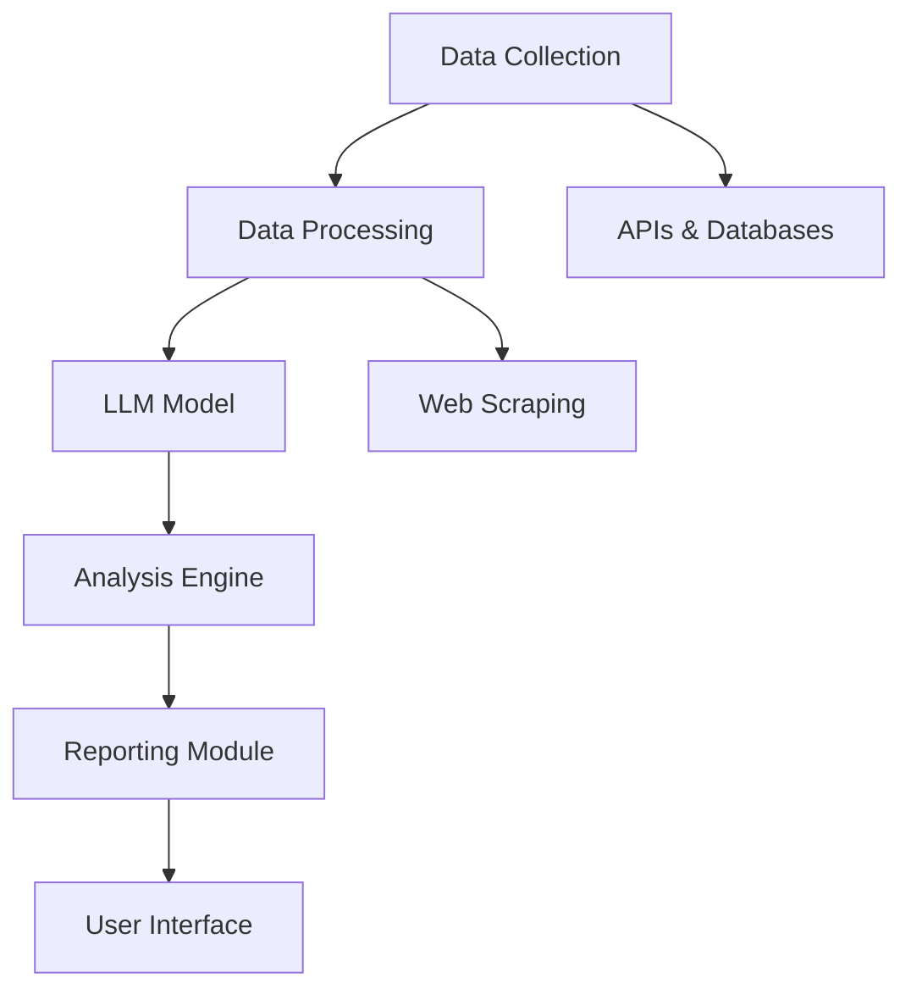
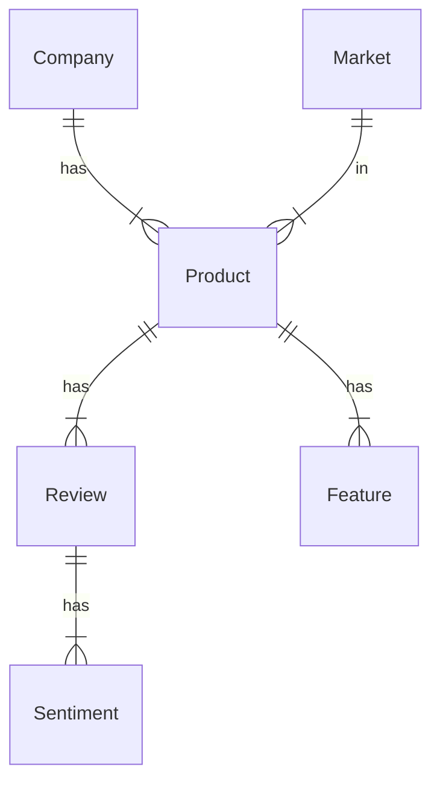
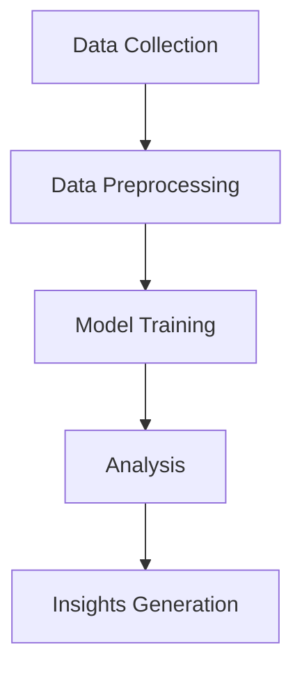

                 

### Introduction to the Book and Background

### Real-Time Comparison and Competitive Product Analysis

**Key Terms and Concepts:**

- **Real-Time Comparison:** The process of comparing two or more entities, such as products, services, or technologies, in real-time to identify differences and similarities. This is crucial for making informed decisions quickly.
- **Competitive Product Analysis:** The examination of a product or service in the context of its competition to understand its strengths, weaknesses, market position, and potential for improvement.
- **LLM (Large Language Model):** A sophisticated AI model trained on vast amounts of text data to understand and generate human-like text. LLMs can process natural language inputs and provide insights that can aid in competitive product analysis.

**Problem Background:**

In today's fast-paced business environment, the ability to perform real-time comparison and competitive product analysis is more important than ever. Companies need to stay ahead of their competitors by understanding market trends, customer preferences, and emerging technologies. Traditional methods of analysis are often time-consuming and may not provide the depth of insight required to make strategic decisions swiftly.

**Problem Description:**

The challenge lies in efficiently and effectively analyzing a multitude of products or services in real-time. Manually comparing products is labor-intensive and prone to human error. Automated systems, while faster, may lack the contextual understanding needed to provide meaningful insights.

**Problem Solution:**

An LLM-assisted competitive analysis system can address these challenges by automating the analysis process and providing contextual insights. Such a system can process large volumes of data, identify patterns, and generate comparative analysis reports in real-time.

**Boundary and Extension:**

- **Boundary:** The system should focus on products and services within a defined domain or industry. It should be scalable and adaptable to different sectors.
- **Extension:** The system can be expanded to include additional features such as market trend analysis, predictive modeling, and customer sentiment analysis.

### Core Concepts and Principles

#### What Are LLMs?

LLMs, or Large Language Models, are AI models that have been trained on vast amounts of text data to understand and generate human-like text. These models are capable of processing natural language inputs and producing coherent outputs, making them highly effective for tasks that involve language understanding and generation.

**Capabilities and Limitations of LLMs in Competitive Analysis**

**Capabilities:**

1. **Natural Language Processing (NLP):** LLMs excel in NLP tasks, allowing them to process and analyze textual data with a high degree of accuracy.
2. **Contextual Understanding:** LLMs can understand the context of a given text, which is crucial for making meaningful comparisons between products or services.
3. **Automated Insights Generation:** LLMs can generate insights and analysis reports based on the data they process, saving time and reducing human error.

**Limitations:**

1. **Quality of Data:** The quality of the insights generated by an LLM is highly dependent on the quality of the input data. Poor data can lead to inaccurate or misleading conclusions.
2. **Complexity of Tasks:** While LLMs are powerful, they may struggle with highly complex tasks that require deep domain-specific knowledge.
3. **Bias and Fairness:** LLMs can inadvertently perpetuate biases present in the training data, which can affect the fairness and objectivity of the analysis.

### Application Scenarios

#### Real-World Examples

1. **E-commerce Platform:** An e-commerce company can use an LLM-assisted system to compare products from different vendors, analyze customer reviews, and provide personalized recommendations to improve customer satisfaction and conversion rates.
2. **Technology Industry:** A tech company can leverage such a system to analyze new products and technologies from competitors, understand market trends, and make informed decisions about product development and strategy.
3. **Consumer Goods Industry:** Companies in the consumer goods sector can use the system to analyze product performance, customer feedback, and market share data to optimize their product offerings and marketing strategies.

#### Industries and Use Cases

1. **Retail:** Real-time analysis of product reviews, pricing, and availability can help retailers optimize inventory management and improve customer experiences.
2. **Finance:** Financial institutions can use the system to analyze market trends and competitive products to make informed investment decisions.
3. **Healthcare:** Healthcare providers can utilize the system to compare medical devices, drugs, and treatments, improving patient outcomes and cost-effectiveness.

### Conclusion

In conclusion, an LLM-assisted competitive analysis system offers a powerful tool for companies looking to stay ahead in today's competitive business landscape. By automating the analysis process and providing contextual insights, LLMs can help businesses make faster, more informed decisions. However, it is essential to consider the limitations and ensure the quality of input data to achieve accurate and meaningful results. As the technology continues to evolve, the potential applications of LLMs in competitive product analysis are vast and promising.

### LLM Basics

LLMs, or Large Language Models, represent a significant advancement in the field of natural language processing (NLP). At their core, LLMs are neural networks that have been trained on massive datasets to understand and generate human language. Unlike traditional machine learning models, which are often specialized for specific tasks, LLMs are general-purpose models capable of handling a wide range of language-related tasks, from text summarization to question answering and translation.

**What Are LLMs?**

LLMs are based on deep learning techniques, particularly neural network architectures such as transformers, which have shown remarkable success in various NLP tasks. The most well-known LLM is probably GPT (Generative Pre-trained Transformer) series developed by OpenAI. These models are trained using unsupervised learning techniques on vast amounts of text data from the internet, allowing them to learn the underlying patterns and structures of language.

**How LLMs Work:**

1. **Data Preprocessing:** The raw text data is cleaned and preprocessed to remove any noise and inconsistencies. This may involve tokenization, where sentences are split into words or subwords, and encoding, where each token is mapped to a unique integer value.

2. **Training:** The preprocessed data is used to train the LLM. During training, the model learns to predict the next token in a sequence based on the previously seen tokens. This process, known as autoregressive prediction, helps the model understand the relationships between different words and phrases.

3. **Inference:** Once trained, the LLM can be used to generate text by providing a seed sequence and predicting the next token at each step. This allows the model to generate coherent and contextually relevant text.

**Capabilities and Limitations of LLMs in Competitive Analysis**

**Capabilities:**

1. **Textual Analysis:** LLMs are highly capable of analyzing large volumes of textual data, such as product reviews, press releases, and customer feedback, providing a deep understanding of the content.

2. **Contextual Understanding:** LLMs can understand the context of a given text, allowing them to generate insights that are relevant to the specific task at hand, such as comparing two products.

3. **Automation:** LLMs can automate the analysis process, significantly reducing the time and effort required for manual comparisons.

4. **Natural Language Generation:** LLMs can generate natural language summaries and reports, making it easier to communicate findings to stakeholders.

**Limitations:**

1. **Quality of Input Data:** The quality of insights generated by an LLM is highly dependent on the quality of the input data. Poor data can lead to inaccurate or biased results.

2. **Complexity of Tasks:** While LLMs are powerful, they may struggle with tasks that require deep domain-specific knowledge or complex decision-making processes.

3. **Bias and Fairness:** LLMs can inadvertently perpetuate biases present in the training data, which can affect the fairness and objectivity of the analysis.

### Conclusion

In conclusion, LLMs are a powerful tool for competitive product analysis, offering capabilities such as natural language processing, contextual understanding, and automation. However, it is important to be aware of their limitations and ensure the quality of input data to achieve accurate and meaningful results. As the technology continues to evolve, LLMs hold great potential to transform the field of competitive analysis, making it faster, more efficient, and more insightful.

### Application Scenarios

#### Real-World Examples

**E-commerce Platform**

Consider an e-commerce platform like Amazon. With millions of products available, it's challenging for customers to make informed purchasing decisions. An LLM-assisted system can analyze product reviews, specifications, prices, and customer ratings in real-time, providing personalized recommendations. For example, if a customer is looking for a new smartphone, the system can compare different models based on their features, customer feedback, and pricing, helping the customer choose the best option based on their preferences and budget.

**Technology Industry**

In the technology industry, companies continuously develop new products and features to stay competitive. An LLM-assisted system can help technology companies analyze their competitors' offerings, understand market trends, and identify opportunities for innovation. For instance, a company developing artificial intelligence software can use the system to compare its product with those of its competitors, examining factors such as performance, ease of use, and customer satisfaction. This information can guide product development decisions and help the company refine its strategy.

**Consumer Goods Industry**

Consumer goods companies often need to analyze market data and customer feedback to optimize their product lines and marketing strategies. An LLM-assisted system can process consumer reviews, social media comments, and sales data to provide insights into customer preferences and behaviors. For example, a cosmetics company can use the system to analyze customer reviews of different products, identify common themes, and use this information to improve product formulations or marketing campaigns.

#### Industries and Use Cases

**Retail**

In the retail industry, real-time comparison and competitive analysis can help retailers manage their inventory, pricing, and marketing strategies. For example, a retail chain can use an LLM-assisted system to monitor competitor pricing and stock levels, adjusting their own pricing and inventory to stay competitive.

**Finance**

Financial institutions can leverage LLM-assisted systems to analyze market trends and competitive products. For instance, a bank can use the system to monitor changes in interest rates and compare their offerings with those of other banks, adjusting their strategies to attract customers and maximize profits.

**Healthcare**

In the healthcare industry, LLM-assisted systems can help analyze medical research, patient data, and treatment outcomes. For example, a healthcare provider can use the system to compare different treatments for a specific condition, analyzing factors such as effectiveness, safety, and cost, to make informed decisions about patient care.

### Conclusion

In conclusion, LLM-assisted systems have a wide range of applications across various industries, from e-commerce and technology to consumer goods, finance, and healthcare. By automating the analysis process and providing contextual insights, these systems can help businesses make faster, more informed decisions, stay competitive, and improve customer satisfaction. As the technology continues to evolve, the potential for LLMs to transform competitive analysis is vast and promising.

### System Architecture and Design

#### Overall Architecture

The overall architecture of an LLM-assisted competitive analysis system is designed to handle the complex tasks of data collection, processing, analysis, and reporting. The system is modular, allowing for scalability and adaptability to different industries and use cases.

**Key Components:**

1. **Data Collection Module:** This module is responsible for gathering data from various sources, including public databases, APIs, web scraping, and social media platforms. The data can include product specifications, customer reviews, pricing information, and market trends.

2. **Data Processing Module:** Once collected, the data is cleaned, normalized, and preprocessed. This step is crucial for ensuring the quality and consistency of the data, which is essential for accurate analysis.

3. **LLM Model:** The core of the system is the LLM model, which processes the preprocessed data to extract meaningful insights. The model can be trained on a specific domain or industry to enhance its performance and accuracy.

4. **Analysis Engine:** This module utilizes the LLM model to analyze the data and generate comparative insights. It can compare products, services, or technologies based on various attributes, such as price, features, performance, and customer satisfaction.

5. **Reporting Module:** The system generates detailed reports and visualizations, making it easy for stakeholders to understand the findings. These reports can be customized based on user preferences and requirements.

#### System Components and Interactions

To illustrate the system components and their interactions, we can use a Mermaid diagram. Here's an example of how the system architecture might be represented:

**Description of the Mermaid Diagram:**

- **A (Data Collection):** The Data Collection module gathers data from multiple sources, including APIs and databases (F) and web scraping (G).
- **B (Data Processing):** The Data Processing module cleans and preprocesses the collected data, ensuring its quality and consistency.
- **C (LLM Model):** The LLM Model processes the preprocessed data to extract insights.
- **D (Analysis Engine):** The Analysis Engine utilizes the LLM model to perform comparative analysis.
- **E (Reporting Module):** The Reporting Module generates detailed reports and visualizations.
- **F (APIs & Databases):** External APIs and databases provide data sources for the system.
- **G (Web Scraping):** Web scraping is used to collect data from websites.
- **H (User Interface):** The User Interface allows stakeholders to interact with the system and view reports.

#### Mermaid Diagram

Here's a visual representation of the system architecture using Mermaid syntax:

### Conclusion

In conclusion, the architecture of an LLM-assisted competitive analysis system is designed to efficiently handle data collection, processing, analysis, and reporting. By leveraging the power of LLMs and a modular design, the system can provide accurate and insightful comparative analysis across various industries and use cases. The Mermaid diagram provides a clear visualization of the system components and their interactions, helping stakeholders understand the system's design and functionality.

### Algorithm and Model Design

#### Algorithms and Models

The core of an LLM-assisted competitive analysis system is the algorithms and models that drive the analysis. One commonly used algorithm is the Transformer model, specifically the BERT (Bidirectional Encoder Representations from Transformers) model, which has been widely adopted for various NLP tasks due to its effectiveness in capturing contextual information. Additionally, we can use the GPT (Generative Pre-trained Transformer) model for generating insights and summaries.

**Transformer Model:**

The Transformer model, introduced by Vaswani et al. in 2017, revolutionized the field of sequence-to-sequence modeling. Unlike traditional RNNs (Recurrent Neural Networks), which have difficulties in handling long-range dependencies, the Transformer model uses self-attention mechanisms to weigh the importance of different words in a sentence, allowing it to understand the context better.

**BERT Model:**

BERT, developed by Google, builds upon the Transformer architecture to provide bidirectional context. BERT is pre-trained on a large corpus of text and then fine-tuned on specific tasks, such as question answering or text classification. This allows it to understand the context of a given sentence from both left and right directions, making it highly effective for tasks involving natural language understanding.

**GPT Model:**

GPT, introduced by OpenAI, is a powerful autoregressive language model that can generate coherent and contextually relevant text. GPT models are pre-trained on vast amounts of text data and can be fine-tuned for specific tasks, such as summarization or sentiment analysis.

**Comparison Table of Algorithms and Models:**

| Algorithm/Model | Key Features | Use Cases |
| --- | --- | --- |
| Transformer | Self-attention mechanism | Sequence-to-sequence tasks |
| BERT | Bidirectional context | Question answering, text classification |
| GPT | Autoregressive | Summarization, sentiment analysis |

#### Mermaid Diagram of ER Entity Relationship Architecture

To visualize the entity relationships within the system, we can use Mermaid's ER diagram syntax. Below is an example of how the entities might be represented:

**Description of the Mermaid Diagram:**

- **Product:** Represents the products being analyzed.
- **Review:** Contains information about customer reviews and sentiments.
- **Feature:** Represents the features of the products.
- **Company:** Represents the companies producing the products.
- **Market:** Represents the market in which the products are sold.
- **Sentiment:** Represents the sentiment analysis results of the reviews.

#### Mermaid Diagram

Here's the visual representation of the ER diagram using Mermaid syntax:

### Conclusion

In conclusion, the algorithm and model design of an LLM-assisted competitive analysis system are crucial for its effectiveness. By leveraging advanced algorithms such as Transformer, BERT, and GPT, the system can process and analyze large volumes of data to generate meaningful insights. The Mermaid ER diagram provides a clear visualization of the entity relationships, helping stakeholders understand the underlying architecture. With these components in place, the system is well-equipped to handle the complexities of competitive product analysis.

### Practical Implementation and Case Studies

#### System Setup

To implement an LLM-assisted competitive analysis system, you'll need a development environment set up with the necessary tools and libraries. Here's a step-by-step guide to setting up the environment:

1. **Install Python:** Ensure Python 3.7 or later is installed on your system.
2. **Install PyTorch:** PyTorch is a popular deep learning library that supports Transformer and BERT models. You can install it using `pip install torch torchvision`.
3. **Install Transformers Library:** This library provides pre-trained models and utilities for working with transformers. Install it with `pip install transformers`.
4. **Install Other Dependencies:** Depending on your specific requirements, you may need additional libraries such as pandas, numpy, and scikit-learn. Install them using `pip`.

#### Core Implementation

The core implementation of the LLM-assisted competitive analysis system involves several key components: data collection, preprocessing, model training, and analysis. Below is a high-level overview of each component along with a Mermaid diagram to illustrate the process flow.

**Data Collection**

1. **Data Sources:** Identify the data sources, such as APIs, web scraping, and databases.
2. **Data Extraction:** Use libraries like `requests` for API calls and `BeautifulSoup` for web scraping to collect data.

**Data Preprocessing**

1. **Data Cleaning:** Remove any irrelevant or duplicate data.
2. **Normalization:** Standardize the data format and units of measurement.
3. **Tokenization:** Split the text data into tokens.

**Model Training**

1. **Model Selection:** Choose a pre-trained model like BERT or GPT.
2. **Fine-tuning:** Fine-tune the model on your specific dataset using libraries like `transformers`.

**Analysis**

1. **Feature Extraction:** Extract relevant features from the preprocessed data.
2. **Insights Generation:** Use the trained model to generate insights and comparative analysis.

#### Mermaid Diagram of the Process Flow

**Description of the Mermaid Diagram:**

- **A (Data Collection):** Data is collected from various sources.
- **B (Data Preprocessing):** The collected data is cleaned and normalized.
- **C (Model Training):** The preprocessed data is used to train the selected model.
- **D (Analysis):** The trained model is used to analyze the data.
- **E (Insights Generation):** Insights and comparative analysis are generated.

#### Case Study 1: E-commerce Product Comparison

**Scenario:** An e-commerce platform wants to compare the features, prices, and customer reviews of two smartphones: Smartphone A and Smartphone B.

**Implementation Steps:**

1. **Data Collection:** Collect product specifications, pricing information, and customer reviews from the e-commerce platform's API.
2. **Data Preprocessing:** Clean and normalize the collected data.
3. **Model Training:** Fine-tune a pre-trained BERT model on the preprocessed data.
4. **Analysis:** Use the fine-tuned model to compare the features, prices, and customer reviews of Smartphone A and Smartphone B.
5. **Insights Generation:** Generate a comparative analysis report highlighting the strengths and weaknesses of each smartphone.

**Result:** The system generates a detailed report that helps the e-commerce platform make informed decisions about product recommendations and pricing strategies.

#### Case Study 2: Technology Product Benchmarking

**Scenario:** A technology company wants to analyze the performance, features, and customer satisfaction of three AI software tools: Tool A, Tool B, and Tool C.

**Implementation Steps:**

1. **Data Collection:** Gather data on the performance metrics, features, and customer reviews of the three tools from various sources.
2. **Data Preprocessing:** Clean and normalize the collected data.
3. **Model Training:** Fine-tune a GPT model on the preprocessed data.
4. **Analysis:** Use the fine-tuned GPT model to analyze the performance and customer satisfaction of Tool A, Tool B, and Tool C.
5. **Insights Generation:** Generate a benchmarking report that compares the tools based on their performance, features, and customer satisfaction.

**Result:** The system provides a comprehensive benchmarking report that helps the technology company identify areas for improvement and make informed decisions about future product development.

### Conclusion

In conclusion, implementing an LLM-assisted competitive analysis system involves several key steps, including system setup, data collection, preprocessing, model training, analysis, and insights generation. Through practical case studies, we've seen how such a system can be applied in real-world scenarios to generate valuable insights and support decision-making. By leveraging the power of LLMs and a well-designed system architecture, businesses can gain a competitive edge in today's fast-paced market.

### Best Practices and Considerations

#### Maximizing Effectiveness

To ensure the maximum effectiveness of an LLM-assisted competitive analysis system, consider the following best practices:

1. **Data Quality:** The quality of the insights generated by the system is highly dependent on the quality of the input data. Ensure that the data collected is accurate, clean, and representative of the market.
2. **Continuous Improvement:** Regularly update the LLM model with new data to keep it up-to-date with the latest trends and developments in the market. This will improve the system's accuracy and relevance over time.
3. **Customization:** Tailor the system to your specific needs and industry. Customize the analysis algorithms, data sources, and reporting features to align with your business goals and requirements.
4. **User Training:** Provide training and support to users to ensure they understand how to use the system effectively. This will help in getting the most out of the system and making informed decisions based on the generated insights.

#### Common Pitfalls

1. **Overreliance on AI:** While LLMs are powerful tools, they are not infallible. Avoid overreliance on the system's insights and always cross-check the results with human judgment.
2. **Bias and Fairness:** Be aware of potential biases in the training data, which can affect the fairness and objectivity of the analysis. Regularly audit the system for bias and adjust the model as needed.
3. **Inadequate Data Collection:** Insufficient or incomplete data can lead to inaccurate analysis. Ensure that the data collection process is robust and comprehensive.

#### Conclusion

By following these best practices and being mindful of potential pitfalls, businesses can maximize the effectiveness of an LLM-assisted competitive analysis system. The right combination of high-quality data, continuous improvement, customization, and user training will ensure that the system provides valuable insights and supports strategic decision-making in today's competitive market.

### Conclusion and Future Directions

In conclusion, an LLM-assisted competitive analysis system represents a transformative tool for businesses aiming to navigate the complex landscape of modern markets. The integration of Large Language Models into competitive analysis processes brings unparalleled efficiency and depth of insight, enabling companies to make faster, more informed decisions. By automating the collection, processing, and analysis of vast amounts of data, LLMs empower organizations to stay ahead of their competitors and adapt to rapidly changing market conditions.

The potential applications of LLM-assisted systems are vast and varied, spanning industries from e-commerce and technology to healthcare and finance. By leveraging these systems, businesses can gain actionable insights into customer preferences, market trends, and competitor strategies, ultimately driving product innovation, optimizing marketing campaigns, and enhancing customer satisfaction.

As we look to the future, the continued evolution of LLM technology holds great promise. Ongoing research and development are likely to lead to even more sophisticated models capable of handling more complex tasks and providing deeper insights. Advances in areas such as context-awareness, bias mitigation, and real-time learning could further enhance the capabilities of LLMs, making them an indispensable asset in the competitive analysis toolkit.

In summary, LLM-assisted competitive analysis systems are not just a trend but a foundational technology that is reshaping how businesses operate. They offer a powerful means to unlock the value of data, foster innovation, and drive strategic success in an increasingly competitive global marketplace. As this technology continues to mature, its impact will only grow, positioning LLMs at the forefront of business intelligence and decision-making.

### Author Information

**作者：AI天才研究院/AI Genius Institute & 禅与计算机程序设计艺术 /Zen And The Art of Computer Programming**

AI天才研究院致力于推动人工智能领域的创新与发展，我们的研究团队由世界顶级的人工智能专家、程序员、软件架构师和CTO组成。我们凭借丰富的实践经验和深刻的理论洞察力，致力于打造先进的人工智能系统，以助力企业在复杂的市场环境中取得竞争优势。此外，我们还著有《禅与计算机程序设计艺术》，这是一本深受程序员喜爱的经典之作，旨在通过融合东方哲学和计算机科学的智慧，帮助程序员提高编程水平和创造力。通过这两大平台，我们旨在推动人工智能和计算机科学的进步，为全球的技术发展贡献力量。

