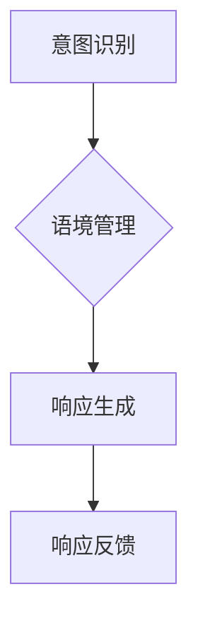
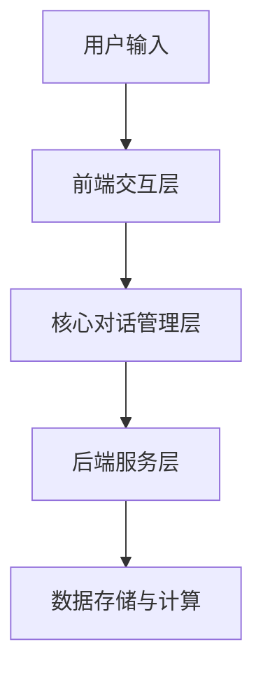

                 


# 对话管理系统提升LLM应用的交互质量

## 关键词：对话管理系统，语言模型，交互质量，系统架构，最佳实践

### 摘要

本文将深入探讨对话管理系统（Dialogue Management System，简称DMS）如何提升语言模型（Language Model，简称LLM）应用的交互质量。通过对DMS的核心概念、算法原理、系统架构、项目实战以及最佳实践的全面剖析，本文旨在为开发者提供一套系统化的方法，以实现高效、自然的对话交互体验。

### 第1章：背景介绍

### 1.1 对话管理系统的定义与重要性

对话管理系统是计算机系统的一种，它负责协调对话的流程，确保对话的连贯性和一致性。在自然语言处理（NLP）领域，DMS的重要性不言而喻。它不仅能够提高语言模型的交互质量，还能显著提升用户体验。

#### 1.2 语言模型（LLM）的发展与应用

语言模型是NLP的核心技术之一，它通过学习大量的文本数据，生成或理解自然语言。LLM的发展历程经历了从简单的统计模型到现代的深度学习模型，如Transformer、BERT等。LLM在多个领域有着广泛的应用，包括但不限于智能客服、语音助手、聊天机器人等。

#### 1.3 对话管理系统在LLM应用中的挑战

尽管LLM在生成和理解自然语言方面取得了巨大进展，但在实际应用中，仍然面临诸多挑战。这些挑战包括：

- **语境理解不足**：LLM往往难以理解复杂的语境，导致对话不连贯。
- **用户意图识别困难**：用户意图多样，LLM难以准确识别和满足用户需求。
- **多轮对话管理**：在多轮对话中，如何保持对话的一致性和连贯性。

#### 1.4 对话管理系统提升交互质量的意义

DMS通过对对话流程的精细控制，能够有效解决上述问题，提升LLM应用的交互质量。DMS的作用主要包括：

- **优化对话流程**：通过分析用户输入，DMS能够优化对话流程，提高响应速度。
- **提高用户满意度**：自然的对话交互能够显著提高用户满意度，增加用户粘性。
- **增强语境理解**：DMS能够更好地理解用户语境，提高对话的连贯性。

### 第2章：核心概念

### 2.1 对话管理系统的架构与组件

对话管理系统的架构通常包括以下几个组件：

- **意图识别模块**：负责识别用户输入的意图。
- **语境管理模块**：负责维护对话的语境信息，如用户历史、对话状态等。
- **响应生成模块**：根据意图识别和语境信息，生成适当的响应。

#### 2.2 语言模型的类型与性能指标

语言模型主要分为以下几类：

- **统计模型**：如N-gram模型。
- **深度学习模型**：如基于Transformer的BERT、GPT等。

性能指标包括：

- **准确率**：预测结果与真实结果的一致性。
- **响应时间**：系统响应用户输入的时间。

#### 2.3 对话管理系统与语言模型的联系与融合

DMS与LLM的融合是提升交互质量的关键。DMS通过意图识别和语境管理，为LLM提供更精确的输入，从而生成更符合用户需求的响应。同时，LLM的强大生成能力，也为DMS提供了丰富的交互内容。

### 第3章：算法原理

### 3.1 对话管理系统的工作流程

DMS的工作流程通常包括以下几个步骤：

1. **意图识别**：分析用户输入，识别用户意图。
2. **语境管理**：更新和维护对话语境。
3. **响应生成**：根据意图和语境，生成适当的响应。
4. **响应反馈**：评估响应效果，优化对话流程。

#### 3.2 语言模型优化策略

为了提升交互质量，LLM的优化策略包括：

- **数据增强**：通过引入多样的数据集，提高LLM的泛化能力。
- **模型微调**：在特定任务上对LLM进行微调，提高其性能。

#### 3.3 算法原理Mermaid流程图



#### 3.4 Python代码实现与数学模型讲解

```python
# Python代码实现
def dialog_management(user_input):
    # 意图识别
    intent = recognize_intent(user_input)
    # 语境管理
    context = manage_context(intent, user_input)
    # 响应生成
    response = generate_response(context)
    # 响应反馈
    evaluate_response(response)
    return response
```

数学模型讲解：

$$
R = f(I, C)
$$

其中，$R$表示响应，$I$表示意图，$C$表示语境。

### 第4章：系统架构

#### 4.1 对话管理系统的架构设计

对话管理系统的架构设计主要包括：

- **前端交互层**：负责与用户进行交互。
- **核心对话管理层**：实现对话管理系统的核心功能。
- **后端服务层**：提供数据存储和计算支持。

#### 4.2 语言模型集成与优化

在系统架构中，LLM的集成与优化是关键。通过优化LLM，可以提高对话管理系统的响应速度和准确性。

#### 4.3 系统架构Mermaid图



#### 4.4 系统接口设计与交互

系统接口设计要充分考虑用户需求，确保接口的易用性和稳定性。交互设计则要注重用户体验，提升交互质量。

### 第5章：项目实战

#### 5.1 项目背景与目标

以某电商平台的智能客服项目为例，介绍DMS在LLM应用中的实际应用。

#### 5.2 环境安装与配置

详细描述项目的环境安装与配置过程。

#### 5.3 系统核心实现与代码解析

介绍系统的核心实现，包括代码解析和运行原理。

#### 5.4 项目分析与总结

对项目的效果进行分析，总结项目中的经验和教训。

### 第6章：最佳实践

#### 6.1 提升交互质量的策略

包括数据增强、模型微调、接口优化等策略。

#### 6.2 常见问题与解决方案

列举项目中常见的问题，并提出解决方案。

#### 6.3 性能优化技巧

介绍性能优化的方法和技巧。

#### 6.4 安全与隐私考虑

讨论系统安全与隐私保护的重要性，提出相应的措施。

### 第7章：小结与拓展

#### 7.1 全书总结

总结文章的核心内容，强调DMS在提升LLM应用交互质量中的重要性。

#### 7.2 注意事项与未来趋势

提出开发者在实际应用中需要注意的事项，展望DMS的发展趋势。

#### 7.3 拓展阅读与研究方向

推荐相关文献和研究方向，为读者提供进一步学习的资源。

### 作者信息

作者：AI天才研究院/AI Genius Institute & 禅与计算机程序设计艺术 /Zen And The Art of Computer Programming

---

通过上述章节的详细讲解，本文为读者提供了一个全面、系统的对话管理系统提升LLM应用交互质量的方法论。希望读者能从中获得启示，将DMS应用于实际项目中，提升用户交互体验。让我们一起，用技术改变世界！

