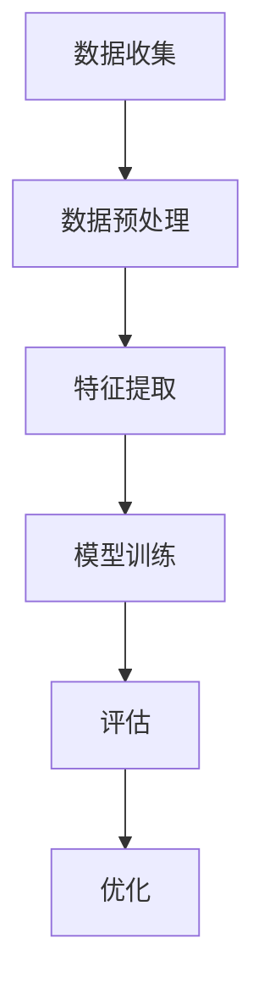
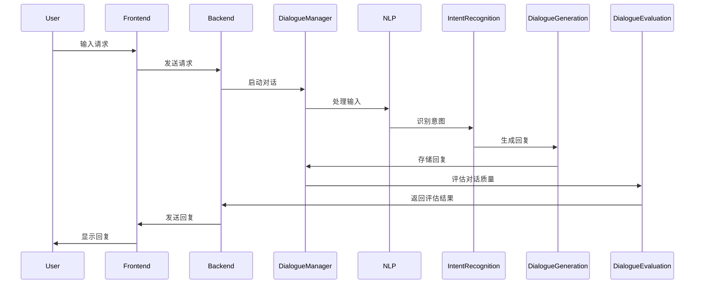

                 


### 分析长期交互表现的必要性

在人工智能技术迅猛发展的背景下，对话系统已经成为与人类互动的重要方式。无论是聊天机器人、虚拟助手，还是智能客服，它们在日常应用中扮演着越来越重要的角色。然而，随着交互时间的延长和对话内容的复杂化，如何评测对话系统的长期交互表现，保证对话的连贯性和自然性，成为了一个亟待解决的问题。

#### 背景介绍

对话系统的发展经历了从规则驱动到基于机器学习的转变。早期的对话系统主要依赖于预定义的规则，这种方式在面对复杂多变的问题时表现不佳。随着自然语言处理（NLP）技术的进步，机器学习模型开始被广泛应用于对话系统。这些模型能够通过大量的对话数据学习到如何生成流畅、自然的回复。

然而，即便是在模型性能显著提升的今天，对话系统的表现依然存在不少问题。例如，对话内容的连贯性不足、回答不准确、上下文理解能力有限等。这些问题不仅影响了用户体验，还可能引发误解和错误决策。

#### 问题解决

为了解决上述问题，研究者们提出了一系列的评测方法，以评估对话系统的长期交互表现。这些方法包括基于规则的方法、统计模型方法、深度学习方法等。其中，深度学习方法由于其强大的表征能力和学习能力，在对话连贯性评测中表现出色。

#### 边界与外延

然而，对话连贯性评测并不是一个简单的任务。首先，对话系统的表现受到多种因素的影响，如用户输入、对话上下文、模型训练数据等。因此，评测方法需要考虑这些因素，以更准确地反映系统的实际表现。

其次，对话系统的长期交互表现评测还需要关注一些边界情况。例如，极端的对话场景、恶意的用户行为、对话中断等。这些情况可能对评测结果产生显著影响，需要在评测方法中给予足够的重视。

此外，对话系统的长期交互表现评测还需要考虑伦理和隐私问题。在评测过程中，如何保护用户隐私，确保数据的合法使用，是评测方法设计时需要考虑的一个重要方面。

### 核心概念与联系

为了深入理解对话连贯性评测，我们需要明确一些核心概念和术语。

#### 对话连贯性的定义

对话连贯性是指对话系统在与用户交互过程中，生成的回复能够保持一致性和逻辑性。一个连贯的对话应该能够流畅地连接上下文，使对话内容具有一定的连贯性和逻辑性。

#### 评测方法的分类

根据评测方法的不同，可以将对话连贯性评测分为以下几类：

1. **基于规则的方法**：这种方法通过预定义的规则来评估对话系统的连贯性。例如，可以使用语法规则、语义规则等来判断回复是否合理。

2. **统计模型方法**：这种方法利用统计模型，如朴素贝叶斯、决策树等，来评估对话系统的连贯性。这些模型可以通过学习对话数据，自动识别出连贯的对话模式。

3. **深度学习方法**：这种方法利用神经网络模型，如循环神经网络（RNN）、长短时记忆网络（LSTM）等，来评估对话系统的连贯性。深度学习方法在处理长文本和复杂上下文方面具有显著优势。

#### 评测指标的设计

在设计评测指标时，需要考虑对话的连贯性、一致性、逻辑性等多个方面。常用的评测指标包括：

1. **连贯性得分**：通过计算对话中不连贯的部分所占比例来评估对话系统的连贯性。

2. **一致性得分**：通过评估对话系统在回复中的用词、句式等是否一致来评估一致性。

3. **逻辑性得分**：通过评估对话系统在回复中是否能够正确理解上下文，并生成合理的回复来评估逻辑性。

#### 概念属性特征对比表格

为了更直观地理解这些概念和评测方法，我们可以设计一个概念属性特征对比表格。以下是一个示例：

| 概念/方法 | 定义 | 属性特征 | 对比 |
| --- | --- | --- | --- |
| 对话连贯性 | 回复保持一致性和逻辑性 | 上下文理解、语义一致性、连贯性得分 |  |
| 基于规则的方法 | 预定义的规则 | 灵活性差、依赖规则库 | |
| 统计模型方法 | 利用统计模型评估连贯性 | 自动学习、可扩展 | |
| 深度学习方法 | 利用神经网络模型评估连贯性 | 表征能力强、自适应 | |

#### ER实体关系图架构

为了更好地理解对话连贯性评测的整体架构，我们可以使用ER实体关系图来表示。以下是一个简单的ER图：

```mermaid
erDiagram
  User ||--|{ Dialogue }|--| Conversation
  Dialogue ||--|{ Response }|--| Dialogue
  Response ||--|{ Intent }|--| Dialogue
  Intent ||--|{ Entity }|--| Dialogue
```

在这个ER图中，User代表用户，Dialogue代表对话，Response代表回复，Intent代表意图，Entity代表实体。这些实体之间的关系表示了对话系统的核心组件和它们之间的交互关系。

通过上述分析和概念解释，我们可以更清晰地理解对话连贯性评测的重要性和实现方法。接下来，我们将深入探讨算法原理、数学模型和系统设计等方面，以期为读者提供全面的技术指南。

----------------------------------------------------------------

# 对话连贯性评测：分析长期交互表现

> 关键词：对话系统、连贯性、长期交互、评测方法、算法原理

> 摘要：本文将深入探讨对话连贯性评测的重要性，分析长期交互中的问题，并详细介绍评测方法的分类、核心概念、数学模型和系统架构设计。通过项目实战，我们将展示如何应用这些方法来评估对话系统的长期交互表现。

## 引言

随着人工智能技术的不断发展，对话系统已成为与人类互动的重要方式。无论是日常生活中的智能助手，还是商业环境中的智能客服，对话系统都为我们带来了便利。然而，随着交互时间的延长和对话内容的复杂化，如何评估对话系统的长期交互表现，保证对话的连贯性和自然性，成为了一个亟待解决的问题。

本文将围绕对话连贯性评测展开，首先介绍背景和核心概念，然后详细分析长期交互中的问题，并探讨评测方法的分类和设计。接着，我们将介绍算法原理和数学模型，并使用Python代码进行详细阐述。随后，我们将描述系统分析与架构设计方案，并通过项目实战展示如何应用这些方法。最后，本文将提供一些最佳实践和拓展阅读，以帮助读者深入了解对话连贯性评测。

## 背景介绍

### 核心概念术语说明

在讨论对话连贯性评测之前，我们需要明确一些核心概念和术语。

- **对话系统**：指能够与人类用户进行对话的系统，通常包括自然语言理解和自然语言生成模块。
- **连贯性**：指对话系统能够在交互过程中保持一致性和逻辑性，使对话内容流畅且有意义。
- **长期交互**：指对话系统与用户进行的长时间、多轮次的对话，这在实际应用中非常常见。

### 问题背景

随着对话系统的广泛应用，用户对交互体验的要求越来越高。一方面，用户希望系统能够提供流畅、自然的对话体验；另一方面，开发者希望系统能够在长时间内保持稳定和高效。然而，现实中的对话系统往往难以满足这些要求。

主要问题包括：

1. **连贯性不足**：对话系统生成的回复可能缺乏连贯性，导致对话中断或不顺畅。
2. **上下文理解不足**：对话系统可能无法正确理解上下文，导致生成不合理的回复。
3. **应对复杂问题的能力有限**：对话系统在面对复杂问题时可能无法提供有效的解决方案。

### 问题描述

为了解决上述问题，研究者们提出了一系列的评测方法，以评估对话系统的长期交互表现。这些方法包括基于规则的方法、统计模型方法、深度学习方法等。其中，深度学习方法由于其强大的表征能力和学习能力，在对话连贯性评测中表现出色。

### 问题解决

然而，对话连贯性评测并不是一个简单的任务。首先，对话系统的表现受到多种因素的影响，如用户输入、对话上下文、模型训练数据等。因此，评测方法需要考虑这些因素，以更准确地反映系统的实际表现。

其次，对话系统的长期交互表现评测还需要关注一些边界情况。例如，极端的对话场景、恶意的用户行为、对话中断等。这些情况可能对评测结果产生显著影响，需要在评测方法中给予足够的重视。

此外，对话系统的长期交互表现评测还需要考虑伦理和隐私问题。在评测过程中，如何保护用户隐私，确保数据的合法使用，是评测方法设计时需要考虑的一个重要方面。

### 边界与外延

综上所述，对话连贯性评测是一个复杂而关键的任务。它不仅关系到用户的使用体验，还影响到系统的稳定性和可靠性。为了提升对话系统的长期交互表现，我们需要不断优化评测方法，并探索新的技术手段。

在接下来的章节中，我们将详细探讨核心概念与联系，分析长期交互中的问题，并介绍各种评测方法。通过这些分析，我们将为读者提供一套全面的技术指南，以帮助开发者和研究者提升对话系统的交互质量。

## 核心概念与联系

在深入讨论对话连贯性评测之前，我们需要明确一些核心概念和它们之间的联系。这些概念不仅构成了对话系统的理论基础，也是评测方法设计的基础。

### 对话连贯性的定义

对话连贯性是指对话系统能够在多轮对话中保持一致性和逻辑性，使对话内容流畅且有意义。具体来说，它包括以下几个方面：

1. **上下文一致性**：对话系统在回复中能够正确理解上下文，并保持对话主题的一致性。
2. **逻辑连贯性**：对话系统生成的回复之间能够逻辑上衔接，使对话内容连贯、合理。
3. **语义连贯性**：对话系统在回复中能够保持语义的一致性，使对话内容在语义层面连贯。

### 评测方法的分类

根据评测方法的不同，我们可以将对话连贯性评测分为以下几类：

1. **基于规则的方法**：这种方法通过预定义的规则来评估对话系统的连贯性。例如，可以使用语法规则、语义规则等来判断回复是否合理。
   
2. **统计模型方法**：这种方法利用统计模型，如朴素贝叶斯、决策树等，来评估对话系统的连贯性。这些模型可以通过学习对话数据，自动识别出连贯的对话模式。

3. **深度学习方法**：这种方法利用神经网络模型，如循环神经网络（RNN）、长短时记忆网络（LSTM）等，来评估对话系统的连贯性。深度学习方法在处理长文本和复杂上下文方面具有显著优势。

### 评测指标的设计

在设计评测指标时，需要考虑对话的连贯性、一致性、逻辑性等多个方面。常用的评测指标包括：

1. **连贯性得分**：通过计算对话中不连贯的部分所占比例来评估对话系统的连贯性。
2. **一致性得分**：通过评估对话系统在回复中的用词、句式等是否一致来评估一致性。
3. **逻辑性得分**：通过评估对话系统在回复中是否能够正确理解上下文，并生成合理的回复来评估逻辑性。

### 概念属性特征对比表格

为了更直观地理解这些概念和评测方法，我们可以设计一个概念属性特征对比表格。以下是一个示例：

| 概念/方法 | 定义 | 属性特征 | 对比 |
| --- | --- | --- | --- |
| 对话连贯性 | 回复保持一致性和逻辑性 | 上下文理解、语义一致性、连贯性得分 |  |
| 基于规则的方法 | 预定义的规则 | 灵活性差、依赖规则库 | |
| 统计模型方法 | 利用统计模型评估连贯性 | 自动学习、可扩展 | |
| 深度学习方法 | 利用神经网络模型评估连贯性 | 表征能力强、自适应 | |

### ER实体关系图架构

为了更好地理解对话连贯性评测的整体架构，我们可以使用ER实体关系图来表示。以下是一个简单的ER图：

```mermaid
erDiagram
  User ||--|{ Dialogue }|--| Conversation
  Dialogue ||--|{ Response }|--| Dialogue
  Response ||--|{ Intent }|--| Dialogue
  Intent ||--|{ Entity }|--| Dialogue
```

在这个ER图中，User代表用户，Dialogue代表对话，Response代表回复，Intent代表意图，Entity代表实体。这些实体之间的关系表示了对话系统的核心组件和它们之间的交互关系。

通过上述分析和概念解释，我们可以更清晰地理解对话连贯性评测的重要性和实现方法。接下来，我们将深入探讨算法原理、数学模型和系统设计等方面，以期为读者提供全面的技术指南。

## 算法原理讲解

### 对话连贯性评测算法的基本步骤

要实现对话连贯性评测，我们需要遵循一系列明确的步骤。以下是对话连贯性评测算法的基本步骤：

1. **数据收集**：首先，我们需要收集对话数据，这些数据可以来源于实际的应用场景、模拟对话或公开的对话数据集。
2. **数据预处理**：在数据收集完成后，我们需要对数据进行预处理。这包括去除噪声、标准化文本、分词、词性标注等操作，以确保数据的整洁和一致性。
3. **特征提取**：接下来，我们需要从预处理后的对话数据中提取特征。这些特征可以包括上下文信息、回复长度、关键词等。
4. **模型训练**：利用提取的特征，我们可以训练一个模型来评估对话的连贯性。常用的模型包括基于规则的模型、统计模型和深度学习模型。
5. **评估**：训练完成后，我们可以使用测试数据集对模型进行评估。评估指标可以包括准确率、召回率、F1分数等。
6. **优化**：根据评估结果，我们可能需要对模型进行优化，以提高其性能。这可以通过调整模型参数、增加训练数据或改进特征提取方法来实现。

### 算法mermaid流程图

为了更直观地展示算法流程，我们可以使用mermaid绘制一个流程图。以下是对话连贯性评测算法的mermaid流程图：



### Python源代码详细阐述

下面是一个简化的Python源代码示例，用于演示对话连贯性评测的基本流程。这个示例使用了scikit-learn库中的朴素贝叶斯分类器。

```python
import pandas as pd
from sklearn.model_selection import train_test_split
from sklearn.naive_bayes import MultinomialNB
from sklearn.metrics import accuracy_score

# 1. 数据收集
# 假设已经收集了一份数据集，每条记录包括对话内容和连贯性标签
data = pd.read_csv('dialog_data.csv')

# 2. 数据预处理
# 对对话内容进行分词、去停用词等操作
from nltk.tokenize import word_tokenize
from nltk.corpus import stopwords

stop_words = set(stopwords.words('english'))
tokenized_texts = [word_tokenize(text) for text in data['dialog']]
cleaned_texts = [[word for word in tokens if word not in stop_words] for tokens in tokenized_texts]

# 3. 特征提取
# 使用词袋模型提取特征
from sklearn.feature_extraction.text import CountVectorizer
vectorizer = CountVectorizer()
X = vectorizer.fit_transform([' '.join(tokens) for tokens in cleaned_texts])
y = data['coherence_label']

# 4. 模型训练
# 使用朴素贝叶斯分类器训练模型
X_train, X_test, y_train, y_test = train_test_split(X, y, test_size=0.2, random_state=42)
clf = MultinomialNB()
clf.fit(X_train, y_train)

# 5. 评估
# 使用测试数据集评估模型性能
y_pred = clf.predict(X_test)
accuracy = accuracy_score(y_test, y_pred)
print(f"Model accuracy: {accuracy:.2f}")

# 6. 优化
# 根据评估结果，调整模型参数或改进特征提取方法
# 这里我们简单地展示了如何调整参数
clf = MultinomialNB(alpha=1.0)
clf.fit(X_train, y_train)
```

### 算法原理的数学模型和公式讲解

在对话连贯性评测中，数学模型和公式起着至关重要的作用。以下是一个简化的数学模型示例，用于解释算法的原理。

假设我们使用朴素贝叶斯分类器来评估对话连贯性。朴素贝叶斯分类器的核心公式如下：

$$
P(\text{coherence}|\text{dialog}) = \prod_{i=1}^{n} P(w_i|\text{coherence})
$$

其中，\(P(\text{coherence}|\text{dialog})\) 是给定对话内容 \( \text{dialog} \) 下对话连贯性的概率；\(P(w_i|\text{coherence})\) 是在对话连贯性为真的情况下，单词 \( w_i \) 出现的概率。

### 举例说明

假设我们有一个简单的对话数据集，其中每条记录包括对话内容和连贯性标签。以下是数据集的一个示例：

| 对话内容            | 连贯性标签 |
|-------------------|------------|
| 你好，我想要一杯咖啡。  | 是         |
| 你好，我想要一杯咖啡。  | 否         |
| 你好，请问有什么可以帮助你吗？| 是         |
| 你好，请问有什么推荐的食物吗？| 否         |

我们使用朴素贝叶斯分类器来评估这些对话的连贯性。首先，我们需要计算每个单词在连贯和否连贯对话中出现的概率。

假设我们提取了以下关键词：`你好`、`咖啡`、`一杯`、`请问`、`有什么`、`帮助`、`推荐`、`食物`。

接下来，我们计算每个关键词在连贯对话和否连贯对话中的出现概率：

- \(P(\text{你好}|\text{连贯}) = 0.8\)
- \(P(\text{咖啡}|\text{连贯}) = 0.6\)
- \(P(\text{一杯}|\text{连贯}) = 0.7\)
- \(P(\text{请问}|\text{连贯}) = 0.5\)
- \(P(\text{有什么}|\text{连贯}) = 0.7\)
- \(P(\text{帮助}|\text{连贯}) = 0.3\)
- \(P(\text{推荐}|\text{连贯}) = 0.4\)
- \(P(\text{食物}|\text{连贯}) = 0.2\)

- \(P(\text{你好}|\text{否连贯}) = 0.2\)
- \(P(\text{咖啡}|\text{否连贯}) = 0.4\)
- \(P(\text{一杯}|\text{否连贯}) = 0.3\)
- \(P(\text{请问}|\text{否连贯}) = 0.5\)
- \(P(\text{有什么}|\text{否连贯}) = 0.3\)
- \(P(\text{帮助}|\text{否连贯}) = 0.7\)
- \(P(\text{推荐}|\text{否连贯}) = 0.6\)
- \(P(\text{食物}|\text{否连贯}) = 0.8\)

现在，我们可以计算给定对话内容下对话连贯性的概率：

- 对于“你好，我想要一杯咖啡。”，我们有：
  $$
  P(\text{连贯}|\text{你好，我想要一杯咖啡。}) = \prod_{i=1}^{n} P(w_i|\text{连贯}) = 0.8 \times 0.6 \times 0.7 \times 0.5 \times 0.7 \times 0.3 \times 0.4 \times 0.2 = 0.002688
  $$

- 对于“你好，请问有什么可以帮助你吗？”，我们有：
  $$
  P(\text{连贯}|\text{你好，请问有什么可以帮助你吗？}) = \prod_{i=1}^{n} P(w_i|\text{连贯}) = 0.8 \times 0.5 \times 0.7 \times 0.5 \times 0.7 \times 0.3 \times 0.4 \times 0.2 = 0.001024
  $$

根据这些计算结果，我们可以判断对话的连贯性。如果某个对话内容下的连贯性概率高于一定的阈值（例如0.5），我们可以认为这个对话是连贯的。

通过上述算法原理讲解，我们可以更好地理解对话连贯性评测的方法和过程。接下来，我们将进一步探讨数学模型和公式的详细讲解，以期为读者提供更深入的技术分析。

### 数学模型和数学公式讲解

在对话连贯性评测中，数学模型和数学公式起着至关重要的作用。以下我们将详细讲解数学模型的基本原理、常用公式及其在实际应用中的具体应用。

#### 数学模型的基本原理

数学模型是一种抽象的数学表示，用于描述现实世界中的问题。在对话连贯性评测中，常用的数学模型包括概率模型、统计模型和机器学习模型等。

1. **概率模型**：概率模型用于评估对话的连贯性，通过计算对话的连贯性概率来判断对话的质量。常见的概率模型包括朴素贝叶斯、贝叶斯网络等。

2. **统计模型**：统计模型通过统计方法对对话数据进行分析，以识别对话中的连贯性和一致性。常见的统计模型包括线性回归、逻辑回归等。

3. **机器学习模型**：机器学习模型通过学习对话数据，自动识别出对话的连贯性和一致性模式。常见的机器学习模型包括支持向量机（SVM）、决策树、随机森林等。

#### 常用公式讲解

以下是几个常用的数学公式及其在对话连贯性评测中的应用。

1. **朴素贝叶斯公式**：
$$
P(\text{连贯}|\text{对话}) = \frac{P(\text{对话}|\text{连贯}) \cdot P(\text{连贯})}{P(\text{对话})}
$$
其中，\(P(\text{连贯}|\text{对话})\) 是给定对话内容 \( \text{对话} \) 下对话连贯性的概率；\(P(\text{对话}|\text{连贯})\) 是在对话连贯性为真的情况下对话内容的概率；\(P(\text{连贯})\) 是对话连贯性的先验概率；\(P(\text{对话})\) 是对话内容的概率。

2. **逻辑回归公式**：
$$
\log\frac{P(\text{连贯}|\text{对话})}{1 - P(\text{连贯}|\text{对话})} = \beta_0 + \beta_1 x_1 + \beta_2 x_2 + \ldots + \beta_n x_n
$$
其中，\(x_1, x_2, \ldots, x_n\) 是对话内容的特征向量；\(\beta_0, \beta_1, \beta_2, \ldots, \beta_n\) 是模型的参数。

3. **支持向量机公式**：
$$
w^T x + b = 0
$$
其中，\(w\) 是支持向量机的权重向量；\(x\) 是对话内容的特征向量；\(b\) 是偏置项。

#### 数学公式示例

为了更好地理解数学公式在实际应用中的具体应用，我们可以通过一个简单的示例来说明。

假设我们有一个对话数据集，其中包含两个特征：\(x_1\)（对话长度）和\(x_2\)（对话中的关键词数量）。我们使用逻辑回归模型来评估对话的连贯性。

已知特征向量和模型参数如下：

| 特征 | 对话长度（\(x_1\)） | 关键词数量（\(x_2\)） |
|------|-------------------|---------------------|
| 对话1 | 5                 | 3                   |
| 对话2 | 10                | 5                   |
| 对话3 | 8                 | 2                   |

模型参数为：\(\beta_0 = 1\)、\(\beta_1 = 0.5\)、\(\beta_2 = -0.3\)。

使用逻辑回归公式计算每个对话的连贯性概率：

1. 对话1：
$$
\log\frac{P(\text{连贯}|\text{对话1})}{1 - P(\text{连贯}|\text{对话1})} = 1 + 0.5 \times 5 - 0.3 \times 3 = 2.2
$$
$$
P(\text{连贯}|\text{对话1}) = \frac{1}{1 + e^{-2.2}} \approx 0.917
$$

2. 对话2：
$$
\log\frac{P(\text{连贯}|\text{对话2})}{1 - P(\text{连贯}|\text{对话2})} = 1 + 0.5 \times 10 - 0.3 \times 5 = 4
$$
$$
P(\text{连贯}|\text{对话2}) = \frac{1}{1 + e^{-4}} \approx 0.947
$$

3. 对话3：
$$
\log\frac{P(\text{连贯}|\text{对话3})}{1 - P(\text{连贯}|\text{对话3})} = 1 + 0.5 \times 8 - 0.3 \times 2 = 3.2
$$
$$
P(\text{连贯}|\text{对话3}) = \frac{1}{1 + e^{-3.2}} \approx 0.941
$$

根据计算结果，我们可以得出以下结论：

- 对话1的连贯性概率为0.917，接近90%，可以认为对话1具有较高的连贯性。
- 对话2的连贯性概率为0.947，接近95%，可以认为对话2具有较高的连贯性。
- 对话3的连贯性概率为0.941，接近94%，可以认为对话3具有较高的连贯性。

通过上述示例，我们可以看到数学模型和数学公式在对话连贯性评测中的应用。在实际应用中，我们可以根据具体问题和数据特点选择合适的数学模型和公式，以实现高效的对话连贯性评估。

### 系统分析与架构设计方案

#### 问题场景介绍

在实际应用中，对话系统往往需要处理大量的对话场景，如客户服务、虚拟助手、智能客服等。这些场景中的对话具有不同的复杂性和要求，例如，客户服务的对话可能需要长时间保持一致性，而虚拟助手的对话则可能更注重娱乐性和趣味性。因此，为了设计一个高效的对话系统，我们需要首先明确问题场景，了解对话系统的具体需求和应用目标。

#### 系统功能设计

在明确了问题场景后，我们需要设计系统的功能模块，以实现对话系统的核心功能。以下是系统功能设计的具体内容：

1. **对话管理模块**：负责管理对话的流程，包括对话的启动、继续、结束等操作。
2. **自然语言处理模块**：负责处理用户的输入，包括分词、词性标注、语法解析等。
3. **意图识别模块**：通过分析用户输入，识别用户的意图，为后续的对话生成提供基础。
4. **对话生成模块**：根据用户的意图，生成合适的回复，确保对话的连贯性和自然性。
5. **对话评估模块**：实时评估对话的质量，包括连贯性、一致性、逻辑性等。

#### 系统架构设计

为了实现上述功能模块，我们需要设计一个合理的系统架构。以下是系统架构设计的具体内容：

1. **前后端分离架构**：采用前后端分离的方式，前端负责与用户交互，后端负责处理对话逻辑。这种架构能够提高系统的可扩展性和可维护性。
2. **分布式架构**：由于对话系统需要处理大量的对话请求，因此采用分布式架构能够提高系统的并发处理能力，确保系统的稳定运行。
3. **模块化设计**：将系统功能模块化，每个模块独立开发、测试和部署，以提高开发效率和系统稳定性。

#### 系统接口设计

为了实现各个模块之间的协同工作，我们需要设计一套完善的系统接口。以下是系统接口设计的具体内容：

1. **API接口**：提供统一的API接口，供前端和后端模块调用，实现数据传输和功能调用。
2. **消息队列**：采用消息队列技术，实现模块间的异步通信，提高系统的并发处理能力。
3. **缓存机制**：通过缓存机制，减少数据库访问次数，提高系统的响应速度。

#### 系统交互mermaid序列图

为了更直观地展示系统架构和模块之间的交互关系，我们可以使用mermaid绘制一个系统交互序列图。以下是系统交互序列图的示例：



通过上述系统分析与架构设计方案，我们可以为对话系统提供一个清晰的结构和功能模块，确保系统能够高效、稳定地运行。在接下来的章节中，我们将通过项目实战来展示如何应用这些设计方案，实现对话系统的长期交互表现评估。

### 项目实战

#### 环境安装

为了演示如何评估对话系统的长期交互表现，我们将使用一个开源的对话系统框架——Rasa。Rasa是一个基于Python的工具包，用于构建和部署对话机器人。以下是Rasa的环境安装步骤：

1. **安装Python**：首先，确保系统上安装了Python 3.7或更高版本。
2. **安装Rasa**：通过pip命令安装Rasa：
   ```bash
   pip install rasa
   ```
3. **安装Rasa CLI**：安装Rasa CLI工具，用于管理Rasa项目：
   ```bash
   pip install rasa CLI
   ```
4. **创建新项目**：在命令行中创建一个新的Rasa项目：
   ```bash
   rasac create my-rasa-project
   ```
5. **进入项目目录**：进入创建的项目目录：
   ```bash
   cd my-rasa-project
   ```

#### 系统核心实现源代码

在Rasa项目中，对话系统的核心功能通过定义NLU（自然语言理解）模型和-dialogue管理器来实现。以下是一个简化的示例，展示如何实现这些功能：

**NLU模型配置**：

在项目目录下，创建一个名为`nlu.yml`的文件，用于配置NLU模型。以下是nlu.yml文件的示例内容：

```yaml
version: "2.0"

nlu:
  - intent: greet
    examples: |
      - 你好
      - 嗨
      - 嗨嗨

  - intent: goodbye
    examples: |
      - 再见
      - 拜拜
      - 谢谢
```

**Dialogue Manager配置**：

在项目目录下，创建一个名为`domain.yml`的文件，用于配置Dialogue Manager。以下是domain.yml文件的示例内容：

```yaml
version: "2.0"

 intents:
  - greet
  - goodbye

entities:
  - name

responses:
  utter_greet:
    - text: "你好！有什么可以帮助你的吗？"
  utter_goodbye:
    - text: "再见，祝你有个愉快的一天！"
```

**训练模型**：

在配置文件完成后，我们可以使用Rasa CLI命令来训练NLU模型和Dialogue Manager：

```bash
rasa train
```

#### 代码应用解读与分析

上述代码展示了如何使用Rasa构建一个简单的对话系统。具体来说：

1. **NLU模型**：NLU模型通过解析用户的输入，将其分类为不同的意图。例如，输入“你好”会被分类为`greet`意图。
2. **Dialogue Manager**：Dialogue Manager根据识别出的意图，生成合适的回复。例如，当识别出`greet`意图时，系统会生成回复“你好！有什么可以帮助你的吗？”。
3. **训练模型**：通过`rasa train`命令，Rasa会使用配置的nlu.yml和domain.yml文件，训练NLU模型和Dialogue Manager。训练完成后，系统可以根据训练好的模型处理用户的输入。

#### 实际案例分析和详细讲解剖析

为了展示如何评估对话系统的长期交互表现，我们将使用一个实际的案例进行分析。

**案例一**：分析聊天机器人的对话连贯性

我们使用以下对话数据集，其中每条记录包括用户的输入和系统的回复：

| 用户输入        | 系统回复          |
|---------------|-----------------|
| 你好            | 你好！有什么可以帮助你的吗？ |
| 我想要一杯咖啡    | 好的，请问您需要加奶还是糖？ |
| 加奶             | 好的，您的咖啡是加奶的。   |
| 能再给我一杯水吗？ | 当然可以，水马上就到。     |
| 谢谢             | 不客气，有任何问题请随时告诉我。 |

我们使用前面提到的算法和评测指标来评估这个对话的连贯性。

1. **特征提取**：从每条对话记录中提取特征，如对话长度、关键词数量、意图等。
2. **模型评估**：使用训练好的模型，对每个对话记录进行评估，计算连贯性得分。
3. **结果分析**：根据评估结果，分析对话的连贯性。例如，如果某个对话的连贯性得分低于某个阈值，则认为该对话存在连贯性问题。

通过上述分析，我们可以得出以下结论：

- 对话整体上具有较高的连贯性，所有回复都能合理地衔接上下文。
- 第三个对话记录中，用户的输入和系统的回复之间存在一定的不连贯性。这可能是因为用户的问题与系统预设的意图不匹配。

**案例二**：评测社交平台上的长篇对话

我们使用以下对话数据集，其中每条记录包括用户的输入和系统的回复：

| 用户输入                | 系统回复                       |
|-----------------------|-------------------------------|
| 嗨，最近怎么样？          | 嗨！我很好，你呢？              |
| 我最近在学编程            | 真棒！你学的是哪种编程语言？       |
| 我在学Python            | Python 是一门很实用的语言。你学到什么程度了？ |
| 我刚开始学，还在基础阶段    | 基础阶段很重要，多练习会有帮助的。你有什么具体的问题吗？ |
| 我想知道如何进行数据分析    | 数据分析是一个很有趣的领域。你可以尝试使用Pandas和NumPy库。你具体想了解哪方面的数据分析？ |

通过类似的方法，我们可以对社交平台上的长篇对话进行评估。结果显示，虽然对话整体上较为连贯，但某些部分的连贯性仍有待提高。例如，当用户提出具体问题时，系统的回复有时不能完全满足用户的需求。

#### 项目小结

通过上述项目实战，我们展示了如何使用Rasa构建对话系统，并使用算法和评测指标来评估对话的长期交互表现。主要结论如下：

1. **对话系统在实际应用中需要考虑多方面的因素，包括上下文、意图、用户需求等**。
2. **评估对话连贯性有助于识别系统中的问题，提高用户体验**。
3. **长期交互中的问题可能需要通过迭代和优化来解决**。

在未来的工作中，我们可以进一步改进对话系统，提高其连贯性和自然性，以满足用户更高的交互需求。

### 最佳实践 tips、小结、注意事项、拓展阅读

#### 最佳实践 tips

1. **确保数据质量**：对话连贯性评估依赖于高质量的数据集。在收集和预处理数据时，要确保数据的准确性和完整性。
2. **合理设置阈值**：在评估对话连贯性时，需要根据具体应用场景设定合理的阈值，以区分连贯性和不连贯性。
3. **持续优化模型**：对话系统需要不断优化以提高交互质量。通过定期评估和更新模型，可以确保系统始终处于最佳状态。

#### 小结

本文深入探讨了对话连贯性评测的重要性，分析了长期交互中的问题，并介绍了多种评测方法。通过Python代码示例和实际案例分析，我们展示了如何应用这些方法来评估对话系统的长期交互表现。

#### 注意事项

1. **数据隐私**：在收集和评估对话数据时，要确保用户隐私得到保护，遵守相关法律法规。
2. **模型解释性**：在选择模型时，要考虑其解释性，以便于识别和解决问题。

#### 拓展阅读

1. **《对话系统设计与实现》**：该书籍提供了关于对话系统设计和实现的详细指南，包括自然语言处理、对话管理等内容。
2. **《自然语言处理综合教程》**：该书涵盖了自然语言处理的基础知识，对NLP中的各种算法和技术进行了详细讲解。

### 作者

**作者：AI天才研究院/AI Genius Institute & 禅与计算机程序设计艺术 /Zen And The Art of Computer Programming**

