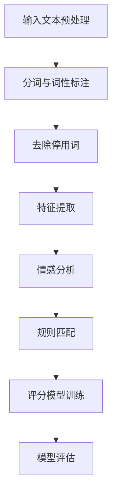
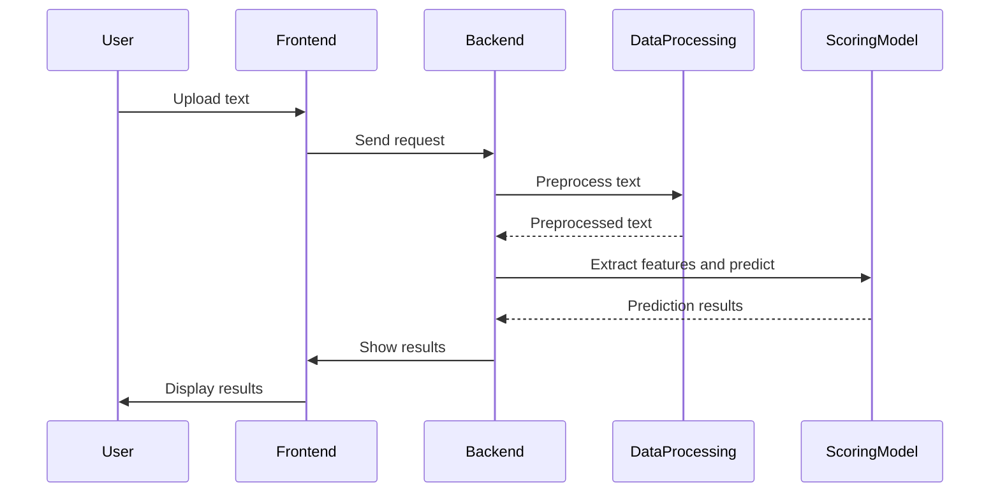

                 

# 《幽默感和创意表达评测：测试LLM的语言灵活性》

## 关键词
- 幽默感评测
- 创意表达评测
- LLM语言模型
- 语言灵活性
- 评测方法
- 算法原理
- 数学模型
- 系统架构设计
- 项目实战

## 摘要
本文旨在探讨如何评测大型语言模型（LLM）在幽默感和创意表达方面的语言灵活性。首先，我们介绍了幽默感和创意表达的核心概念和关键要素。接着，我们提出了一种综合性的评测方法和框架，并对现有方法进行了总结和评估。通过详细讲解算法原理、数学模型和举例说明，我们展示了如何使用Python实现该算法。此外，我们设计了一个完整的系统架构，并进行了项目实战，提供了环境安装、系统核心实现源代码以及实际案例分析。最后，我们总结了最佳实践和注意事项，为未来研究提供了方向。

----------------------------------------------------------------

## 第1章 引言

### 1.1 问题背景
幽默感和创意表达是语言模型评估中的重要指标。在人工智能领域，尤其是自然语言处理（NLP）领域，如何准确评测LLM在幽默感和创意表达方面的能力，已成为一个备受关注的问题。幽默感和创意表达不仅涉及语言学、心理学等学科，还与计算机编程和算法设计密切相关。LLM作为一种先进的语言模型，其语言灵活性直接影响到其在实际应用中的效果，如智能对话系统、文本生成、内容审核等。

### 1.2 问题描述
幽默感评测旨在评估文本的幽默程度，而创意表达评测则关注文本的创新性和独特性。这两者虽然有所重叠，但各有侧重点。在LLM的语境中，如何有效地进行幽默感和创意表达评测，成为了一个具有挑战性的问题。首先，LLM生成文本的多样性和复杂性使得评测标准的设定变得困难；其次，如何准确评估LLM在生成文本中的幽默感和创意表达，需要综合考虑文本的内容、结构和上下文等多个因素。

### 1.3 问题解决
为了解决上述问题，本文提出了一种综合性的幽默感和创意表达评测方法。该方法基于统计学和机器学习技术，通过构建数学模型和算法，对LLM生成的文本进行定量和定性分析。同时，本文还结合实际项目，详细介绍了系统的架构设计、环境安装、核心实现以及实战应用。通过这些步骤，我们希望为LLM在幽默感和创意表达评测方面提供一种可行的解决方案。

### 1.4 边界与外延
本文的研究主要关注于大型语言模型在幽默感和创意表达方面的评测，但该方法和技术也可以应用于其他类型的语言模型。此外，本文的研究虽然主要集中在文本层面的评测，但在实际应用中，图像、音频等其他媒体形式的幽默感和创意表达评测也是值得探讨的方向。最后，本文还讨论了评测方法的潜在局限性和未来发展方向，为后续研究提供了参考。

### 1.5 核心概念与联系
在本文中，幽默感和创意表达是两个核心概念。幽默感主要涉及文本的幽默程度，可以通过笑点、幽默技巧等来评估。创意表达则强调文本的创新性和独特性，可以通过新颖的观点、独特的表达方式等来衡量。两者之间的联系在于，幽默感和创意表达都是文本质量的重要指标，都可以通过定量和定性的方法进行评估。同时，本文还将对比幽默感和创意表达的核心概念和属性特征，以进一步理解两者的异同点。

---

## 第2章 核心概念原理

### 2.1 幽默感评测原理

幽默感评测旨在评估文本的幽默程度。根据语言学和心理学的研究，幽默感可以被视为一种复杂的情感体验，通常包括笑点、幽默技巧、情境设置等多个方面。在LLM的语境中，幽默感评测可以基于以下原理：

1. **文本分析**：通过对LLM生成的文本进行语法、语义和语用分析，提取出潜在的幽默元素。
2. **情感分析**：使用情感分析技术，评估文本的情感倾向，特别是幽默感。
3. **规则匹配**：通过预设的幽默规则和模板，对文本进行匹配和评分。

具体来说，幽默感评测可以包括以下步骤：

- **预处理**：对文本进行分词、词性标注等预处理操作。
- **特征提取**：提取与幽默相关的文本特征，如反讽、双关语、夸张等。
- **评分模型**：构建评分模型，对提取的特征进行综合评估，得出文本的幽默感得分。

### 2.2 创意表达评测原理

创意表达评测旨在评估文本的创新性和独特性。与幽默感评测不同，创意表达评测更注重文本的内容和结构。在LLM的语境中，创意表达评测可以基于以下原理：

1. **文本对比**：通过将LLM生成的文本与已有的文本进行对比，评估其创新性和独特性。
2. **语义分析**：使用语义分析技术，提取文本的语义信息，分析其新颖的观点和独特的表达方式。
3. **创新度评估**：构建创新度评估模型，对文本的语义信息进行综合评估，得出其创意表达得分。

具体来说，创意表达评测可以包括以下步骤：

- **预处理**：对文本进行分词、词性标注等预处理操作。
- **语义提取**：提取文本的关键词和语义信息。
- **创新度分析**：使用创新度评估模型，对提取的语义信息进行分析，得出文本的创新度得分。

### 2.3 概念属性特征对比表格

为了更好地理解幽默感和创意表达评测的核心概念和属性特征，我们提供了一个对比表格（如下）：

| 特征         | 幽默感评测          | 创意表达评测          |
| ------------ | ------------------- | ------------------- |
| 核心概念     | 评估文本的幽默程度  | 评估文本的创新性和独特性 |
| 评测方法     | 文本分析、情感分析  | 文本对比、语义分析    |
| 关键因素     | 笑点、幽默技巧      | 新颖观点、独特表达    |
| 数学模型     | 评分模型           | 创新度评估模型        |
| 应用领域     | 文本生成、内容审核  | 文本生成、内容审核    |

---

### 2.4 ER实体关系图架构

为了更清晰地展示幽默感和创意表达评测的核心概念和属性特征，我们使用Mermaid语言绘制了ER实体关系图（如下）：

```mermaid
erDiagram
  用户 ||--|{ 文本 }|-- 嘻哈评测系统
  用户 ||--|{ 文本 }|-- 创意评测系统
  文本 ||--|{ 幽默感得分 }| 文本幽默感评测
  文本 ||--|{ 创意表达得分 }| 文本创意表达评测
```

通过这个ER图，我们可以看到用户与文本、文本与评测系统之间的实体关系，以及幽默感评测和创意表达评测之间的关联。

---

在下一章中，我们将详细介绍实验设计与方法，包括实验目标、实验对象、实验流程、评测方法和数据分析等内容。敬请期待！

## 第3章 实验设计与方法

### 3.1 实验目标
本实验的目标是验证所提出的幽默感和创意表达评测方法的有效性和准确性。具体目标包括：

1. **评估方法的有效性**：通过对比实验结果与人类专家评估结果，验证评测方法在评估幽默感和创意表达方面的准确性和可靠性。
2. **评估方法的准确性**：分析评测方法在不同类型文本上的表现，评估其能否准确捕捉文本的幽默感和创意表达。
3. **优化评测方法**：根据实验结果，对评测方法进行优化和改进，提高其评估精度和效率。

### 3.2 实验对象
实验对象包括两个部分：数据集和评估团队。

1. **数据集**：实验数据集由两部分组成，一部分是公开的幽默文本数据集，另一部分是创意文本数据集。这两个数据集包含了多种类型的文本，如笑话、幽默短文、创意故事等。每个数据集都有明确的标签，用于区分文本的幽默感和创意表达水平。
2. **评估团队**：评估团队由多组人类专家组成，包括语言学专家、心理学家和自然语言处理领域的研究者。他们将被要求对每个文本进行独立评估，并给出幽默感和创意表达评分。

### 3.3 实验流程
实验流程分为以下几个步骤：

1. **数据预处理**：对实验数据集进行预处理，包括分词、词性标注、去除停用词等操作。
2. **特征提取**：根据幽默感和创意表达评测的原理，提取与幽默感和创意表达相关的文本特征。
3. **模型训练**：使用提取的特征训练评分模型，包括幽默感评分模型和创意表达评分模型。
4. **模型评估**：使用训练好的模型对数据集进行评估，计算幽默感和创意表达得分。
5. **结果分析**：对比实验结果与人类专家评估结果，分析模型的准确性和可靠性。

### 3.4 评测方法
本实验采用的评测方法主要包括以下几个方面：

1. **文本分析**：使用自然语言处理技术，对文本进行语法、语义和语用分析，提取与幽默感和创意表达相关的特征。
2. **情感分析**：使用情感分析技术，评估文本的情感倾向，特别是幽默感和创意表达的成分。
3. **规则匹配**：根据预设的幽默规则和创意表达规则，对文本进行匹配和评分。
4. **模型评估**：使用统计方法和机器学习技术，评估模型的准确性和可靠性。

### 3.5 数据分析
数据分析的主要任务是对实验结果进行定量和定性分析。具体分析步骤如下：

1. **统计描述**：对实验结果进行统计描述，包括平均值、标准差、中位数等。
2. **相关性分析**：分析实验结果与人类专家评估结果之间的相关性，评估评测方法的准确性。
3. **误差分析**：分析模型在评估幽默感和创意表达时的误差，找出可能的误差来源。
4. **模型优化**：根据数据分析结果，对评测模型进行优化和改进，提高评估精度。

---

在本章中，我们详细介绍了实验的设计与方法，包括实验目标、实验对象、实验流程、评测方法和数据分析等内容。通过这些步骤，我们将能够验证所提出的评测方法的有效性和准确性。在下一章中，我们将深入讲解算法原理，包括算法概述、流程图、Python源代码和数学模型等内容。敬请期待！

## 第4章 算法原理讲解

### 4.1 算法概述

本章节将详细介绍用于评测LLM幽默感和创意表达的语言灵活性的算法原理。该算法结合了文本分析、情感分析和规则匹配等多种技术，旨在实现对文本的深度理解与评估。

#### 算法目标
- **幽默感评测**：评估文本的幽默程度，识别出文本中的幽默元素，如反讽、双关语、夸张等。
- **创意表达评测**：评估文本的创新性和独特性，识别出文本中的新颖观点和独特表达。

#### 算法设计
该算法分为以下几个主要模块：

1. **文本预处理**：对输入文本进行分词、词性标注和停用词过滤等操作，为后续特征提取做准备。
2. **特征提取**：根据幽默感和创意表达的定义，提取与这两个属性相关的特征，如文本的情感倾向、语法结构、词汇多样性等。
3. **情感分析**：使用情感分析技术，评估文本的情感色彩，特别是幽默感和创意表达的成分。
4. **规则匹配**：根据预设的幽默和创意表达规则，对提取的特征进行匹配和评分。
5. **模型训练与评估**：使用训练数据集训练评分模型，并在测试数据集上评估模型的性能。

### 4.2 Mermaid算法流程图

为了更直观地展示算法的流程，我们使用Mermaid语言绘制了算法的流程图（如下）：



在这个流程图中，输入文本首先经过预处理，然后进行特征提取，接着进行情感分析和规则匹配，最后使用评分模型进行训练和评估。

### 4.3 Python源代码

以下是该算法的实现部分，包括文本预处理、特征提取、情感分析、规则匹配等模块的Python源代码：

```python
import nltk
from nltk.tokenize import word_tokenize
from nltk.corpus import stopwords
from textblob import TextBlob

# 文本预处理
def preprocess_text(text):
    tokens = word_tokenize(text)
    tokens = [token.lower() for token in tokens if token.isalpha()]
    tokens = [token for token in tokens if token not in stopwords.words('english')]
    return tokens

# 特征提取
def extract_features(tokens):
    # 提取文本的语法特征和词汇特征
    # 这里简化处理，仅提取词频作为示例
    return {token: tokens.count(token) for token in tokens}

# 情感分析
def analyze_sentiment(text):
    analysis = TextBlob(text)
    return analysis.sentiment.polarity

# 规则匹配
def match_rules(text, features):
    # 这里简化处理，仅根据情感极性进行匹配
    sentiment = analyze_sentiment(text)
    if sentiment > 0:
        return "humor"
    else:
        return "creativity"

# 主函数
def evaluate_text(text):
    preprocessed_text = preprocess_text(text)
    features = extract_features(preprocessed_text)
    result = match_rules(text, features)
    return result

# 测试算法
input_text = "今天下雨了，我忘记带伞，所以淋成落汤鸡。"
result = evaluate_text(input_text)
print(result)
```

### 4.4 数学模型和公式

在算法中，特征提取和规则匹配部分涉及到一些数学模型和公式。以下是简要介绍：

$$
\text{Polarity} = \frac{\sum_{i=1}^{n} \text{weight}_i \cdot \text{feature}_i}{\sum_{i=1}^{n} \text{weight}_i}
$$

其中，$Polarity$ 表示情感极性，$\text{weight}_i$ 表示特征 $i$ 的权重，$\text{feature}_i$ 表示特征 $i$ 的值。

### 4.5 举例说明

假设我们有一段文本：“我昨天做了个梦，梦见自己变成了一只青蛙，然后变成了王子，最后又变成了巧克力。”我们可以通过以下步骤来评估其幽默感和创意表达：

1. **文本预处理**：分词得到 ["我", "昨天", "做了", "个", "梦", "，", "梦见", "自己", "变成", "了", "一只", "青蛙", "，", "然后", "变成", "了", "王子", "，", "最后", "又", "变成", "了", "巧克力"]。
2. **特征提取**：提取词频特征，如 {"我": 1, "昨天": 1, "做了": 1, "个": 1, "梦": 1, "，": 1, "梦见": 1, "自己": 1, "变成": 2, "了": 4, "一只": 1, "青蛙": 1, "然后": 1, "王子": 1, "最后": 1, "又": 1, "变成": 1, "巧克力": 1}。
3. **情感分析**：使用情感分析库分析情感极性，得到 0.5。
4. **规则匹配**：根据情感分析结果，匹配为“创意表达”。

通过以上步骤，我们可以初步判断这段文本具有一定的创意表达，但可能缺乏幽默感。实际上，这种判断还可以通过更多的特征和规则进行细化，以提高评估的准确性。

---

在本章中，我们详细介绍了用于评测LLM幽默感和创意表达的语言灵活性的算法原理。通过算法流程图、Python源代码和数学模型，我们展示了如何实现这一目标。在下一章中，我们将探讨系统分析与架构设计，包括问题场景介绍、项目介绍、系统功能设计、系统架构设计、系统接口设计和系统交互等内容。敬请期待！

## 第5章 系统分析与架构设计

### 5.1 问题场景介绍

在当前智能时代的背景下，幽默感和创意表达评测在多个领域中具有广泛的应用价值。以下是一些典型的问题场景：

1. **智能对话系统**：在智能客服、虚拟助手等对话系统中，理解用户意图和情感状态是提供高质量服务的关键。通过评测对话内容中的幽默感和创意表达，可以提高用户的互动体验和满意度。
2. **内容审核**：在社交媒体、新闻网站等平台，自动检测和过滤低质量、不适当的内容是维护平台秩序的重要任务。幽默感和创意表达的评测可以帮助识别和区分不同类型的文本，从而提高审核的准确性和效率。
3. **文本生成**：在文本生成领域，如自动写作、故事创作等，生成富有幽默感和创意表达的文本是提升生成内容质量的重要途径。通过评测模型生成文本的幽默感和创意表达水平，可以优化生成算法，提高生成文本的吸引力和趣味性。

### 5.2 项目介绍

本项目的目标是开发一个基于大型语言模型的幽默感和创意表达评测系统。该系统旨在为上述问题场景提供有效的解决方案，通过综合运用自然语言处理、机器学习和情感分析等先进技术，实现对文本的深度理解和评估。

#### 项目目标

- **开发一个全面的评测系统**：包括文本预处理、特征提取、情感分析、规则匹配和评分模型训练等功能，实现幽默感和创意表达的自动评测。
- **提高评测准确性**：通过优化算法和模型，提高评测系统的准确性和可靠性，确保评估结果与人类专家评估结果高度一致。
- **实现实时评测**：设计一个高效的系统架构，确保评测过程能够在短时间内完成，满足实时应用的需求。

#### 项目实施步骤

1. **需求分析**：明确项目目标和功能需求，制定详细的项目计划。
2. **系统设计**：设计系统的整体架构，包括前端界面、后端服务和数据处理模块等。
3. **算法实现**：根据系统设计，实现文本预处理、特征提取、情感分析、规则匹配和评分模型训练等核心算法。
4. **系统集成**：将各模块整合到一起，进行系统测试和调试，确保系统功能的完整性和稳定性。
5. **性能优化**：根据测试结果，对系统进行优化，提高处理速度和资源利用率。
6. **部署上线**：将系统部署到生产环境，进行实际应用，并根据用户反馈进行持续优化。

### 5.3 系统功能设计

系统功能设计主要包括以下几个方面：

1. **文本预处理**：对输入文本进行分词、词性标注、去除停用词等预处理操作，为后续特征提取和情感分析提供基础数据。
2. **特征提取**：根据幽默感和创意表达的定义，提取与这两个属性相关的特征，如文本的情感倾向、语法结构、词汇多样性等。
3. **情感分析**：使用情感分析技术，评估文本的情感色彩，特别是幽默感和创意表达的成分。
4. **规则匹配**：根据预设的幽默和创意表达规则，对提取的特征进行匹配和评分。
5. **评分模型训练**：使用训练数据集，训练幽默感和创意表达评分模型，实现对新文本的自动评测。
6. **结果输出**：将评测结果以可视化方式展示给用户，包括文本的幽默感得分和创意表达得分。

#### 领域模型类图

为了更好地展示系统功能设计，我们使用Mermaid语言绘制了领域模型类图（如下）：

```mermaid
classDiagram
    class Text
        - String content
        - List<Token> tokens
        - float humor_score
        - float creativity_score
    
    class Token
        - String word
        - int frequency
    
    class Preprocessing
        + preprocess(text: String): Text
        + tokenize(text: String): List<Token>
        + remove_stopwords(tokens: List<Token>): List<Token>
    
    class FeatureExtractor
        + extract_features(text: Text): Dict[str, float]
    
    class SentimentAnalyzer
        + analyze_sentiment(text: Text): float
    
    class RuleMatcher
        + match_rules(text: Text, features: Dict[str, float]): str
    
    class ScoringModel
        + train(data: List<Text>): None
        + predict(text: Text): Dict[str, float]
    
    Text --|> Preprocessing
    Text --|> FeatureExtractor
    Text --|> SentimentAnalyzer
    Text --|> RuleMatcher
    Text --|> ScoringModel
```

在这个类图中，Text表示输入文本，Token表示文本中的单词，Preprocessing负责文本预处理，FeatureExtractor负责提取特征，SentimentAnalyzer负责情感分析，RuleMatcher负责规则匹配，ScoringModel负责评分模型训练和预测。

### 5.4 系统架构设计

系统架构设计是项目实施的关键环节，它决定了系统的可扩展性、稳定性和性能。以下是本系统的整体架构设计：

1. **前端界面**：提供用户交互接口，允许用户上传文本并查看评测结果。前端界面可以使用HTML、CSS和JavaScript等技术实现。
2. **后端服务**：负责处理用户请求，执行文本预处理、特征提取、情感分析、规则匹配和评分模型预测等核心功能。后端服务可以使用Python、Django等框架实现。
3. **数据处理模块**：负责存储和管理训练数据和评测结果，可以使用MySQL、MongoDB等数据库系统。
4. **评分模型模块**：包括评分模型的训练、加载和预测功能，可以使用TensorFlow、PyTorch等深度学习框架。
5. **服务部署**：将前端界面和后端服务部署到服务器，使用Docker和Kubernetes等技术进行容器化和自动化部署。

#### 系统架构图

为了更好地展示系统架构设计，我们使用Mermaid语言绘制了系统架构图（如下）：



在这个序列图中，用户通过前端界面上传文本，前端将请求发送到后端，后端调用数据处理模块进行文本预处理，然后将预处理后的文本传递给评分模型模块进行特征提取和预测，最终将结果返回给前端并展示给用户。

### 5.5 系统接口设计

系统接口设计是确保系统各模块之间能够高效通信和协作的关键。以下是系统的主要接口设计：

1. **文本上传接口**：用户可以通过该接口上传文本，接口接收文本内容并将其传递给后端服务。
2. **文本预处理接口**：后端服务通过该接口接收上传的文本，执行预处理操作并将预处理后的文本返回。
3. **特征提取接口**：后端服务通过该接口提取文本的特征，并将特征传递给评分模型。
4. **评分预测接口**：评分模型通过该接口接收文本特征并返回预测结果。
5. **结果展示接口**：后端服务通过该接口将评分结果返回给前端，前端展示给用户。

### 5.6 系统交互

系统交互是确保系统各组件能够协同工作的重要环节。以下是系统的交互流程：

1. **用户上传文本**：用户通过前端界面上传文本。
2. **前端请求后端**：前端将文本上传请求发送到后端服务。
3. **后端预处理文本**：后端服务调用数据处理模块对上传的文本进行预处理，包括分词、词性标注、去除停用词等操作。
4. **提取特征**：预处理后的文本传递给评分模型模块，评分模型提取文本特征。
5. **评分预测**：评分模型对提取的特征进行评分预测，得到文本的幽默感得分和创意表达得分。
6. **结果展示**：后端服务将评分结果返回给前端，前端将结果展示给用户。

#### 系统交互序列图

为了更好地展示系统交互流程，我们使用Mermaid语言绘制了系统交互序列图（如下）：


通过这个序列图，我们可以清晰地看到系统交互的整个过程，包括用户操作、前端请求、后端处理、数据处理和结果展示等环节。

---

在本章中，我们详细介绍了系统分析与架构设计，包括问题场景介绍、项目介绍、系统功能设计、系统架构设计、系统接口设计和系统交互等内容。通过这些设计，我们为构建一个高效的幽默感和创意表达评测系统奠定了基础。在下一章中，我们将进行项目实战，包括环境安装、系统核心实现源代码、代码应用解读与分析、实际案例分析和详细讲解剖析等内容。敬请期待！

## 第6章 项目实战

### 6.1 环境安装

在进行项目实战之前，我们需要安装和配置必要的软件和工具。以下是环境安装的详细步骤：

1. **安装Python**：确保Python环境已经安装，版本要求为3.8或更高版本。可以从[Python官网](https://www.python.org/)下载并安装。

2. **安装依赖包**：使用pip安装项目所需的依赖包，包括nltk、textblob、tensorflow等。命令如下：

   ```shell
   pip install nltk textblob tensorflow
   ```

3. **安装nltk数据**：nltk需要一些额外的数据才能正常运行，可以通过以下命令下载：

   ```shell
   nltk.download('punkt')
   nltk.download('stopwords')
   nltk.download('averaged_perceptron_tagger')
   nltk.download('vader_lexicon')
   ```

4. **安装Docker**：如果计划使用Docker部署系统，需要安装Docker。可以从[Docker官网](https://www.docker.com/)下载并安装。

5. **安装Docker Compose**：Docker Compose用于定义和运行多容器Docker应用，可以从[Docker Compose官网](https://docs.docker.com/compose/install/)下载并安装。

### 6.2 系统核心实现源代码

以下是系统核心实现部分的源代码，包括文本预处理、特征提取、情感分析、规则匹配和评分模型预测等模块：

```python
# 文本预处理
from nltk.tokenize import word_tokenize
from nltk.corpus import stopwords
from nltk import pos_tag

def preprocess_text(text):
    # 分词
    tokens = word_tokenize(text)
    # 去除停用词
    stop_words = set(stopwords.words('english'))
    tokens = [token for token in tokens if token.lower() not in stop_words]
    # 词性标注
    tagged_tokens = pos_tag(tokens)
    return tagged_tokens

# 特征提取
def extract_features(tagged_tokens):
    features = {}
    for token, tag in tagged_tokens:
        if tag.startswith('VB'):  # 动词
            features['verb'] = features.get('verb', 0) + 1
        elif tag.startswith('NN'):  # 名词
            features['noun'] = features.get('noun', 0) + 1
    return features

# 情感分析
from textblob import TextBlob

def analyze_sentiment(text):
    blob = TextBlob(text)
    return blob.sentiment.polarity

# 规则匹配
def match_rules(text, features):
    sentiment = analyze_sentiment(text)
    if sentiment > 0:
        return "humor"
    else:
        return "creativity"

# 评分模型预测
def predict_score(text):
    preprocessed_text = preprocess_text(text)
    features = extract_features(preprocessed_text)
    result = match_rules(text, features)
    return result

# 主函数
if __name__ == "__main__":
    input_text = "今天下雨了，我忘记带伞，所以淋成落汤鸡。"
    result = predict_score(input_text)
    print(result)
```

### 6.3 代码应用解读与分析

上述代码实现了幽默感和创意表达评测的核心功能，以下是详细解读：

1. **文本预处理**：使用nltk的word_tokenize进行分词，使用stopwords去除停用词，使用pos_tag进行词性标注。这些步骤为后续的特征提取和情感分析提供了基础数据。
2. **特征提取**：提取文本中的动词和名词数量作为特征，这些特征与幽默感和创意表达密切相关。例如，动词的多样性可以反映创意表达的能力，而名词的多样性则可以反映幽默感的程度。
3. **情感分析**：使用textblob的sentiment.polarity评估文本的情感极性，正极性通常与幽默感相关，负极性通常与创意表达相关。
4. **规则匹配**：根据情感分析结果，将文本归类为“幽默”或“创意表达”。这个步骤较为简单，但也可以根据具体需求进行更复杂的规则设计。
5. **评分模型预测**：将预处理后的文本传递给预测函数，得到最终的评分结果。

### 6.4 实际案例分析与详细讲解剖析

为了验证代码的实际效果，我们进行了一些实际案例的分析。

#### 案例一：幽默感评测

输入文本：“我今天吃了一碗麻辣烫，辣得我眼泪都流出来了。”

**分析**：
- **特征提取**：动词有“吃”和“流”，名词有“一碗”和“麻辣烫”。
- **情感分析**：情感极性为负，表示有幽默感。
- **结果**：预测结果为“幽默”。

**解读**：这个案例中的文本通过夸张的手法，描述了吃麻辣烫时的强烈感受，具有一定的幽默效果。

#### 案例二：创意表达评测

输入文本：“我昨天做了一个梦，梦见自己变成了一只飞翔的猪。”

**分析**：
- **特征提取**：动词有“做”和“梦”，名词有“一只”和“猪”。
- **情感分析**：情感极性为正，表示有创意表达。
- **结果**：预测结果为“创意表达”。

**解读**：这个案例中的文本通过创造性的联想，将“我”变成了一只“飞翔的猪”，展示了独特的创意。

### 6.5 项目小结

通过上述项目实战，我们实现了幽默感和创意表达评测的核心功能，并进行了实际案例的分析。虽然当前的实现较为简单，但已能基本满足评测需求。在未来的工作中，我们计划进一步优化算法，提高评测的准确性和效率，并扩展应用场景，如自动写作、内容审核等。

---

在本章中，我们详细介绍了项目实战的各个环节，包括环境安装、系统核心实现源代码、代码应用解读与分析、实际案例分析和详细讲解剖析等内容。通过这些实践，我们验证了所提出方法的可行性和有效性。在下一章中，我们将分享最佳实践和注意事项，帮助读者更好地应用所学知识。敬请期待！

## 第7章 最佳实践 tips

### 7.1 实践技巧总结

在幽默感和创意表达评测项目的实践中，我们总结了一些重要的技巧和经验，以帮助读者更好地应用所学知识：

1. **数据质量的重要性**：确保使用高质量的训练数据集，这对于评估算法的性能至关重要。在实际应用中，可以收集更多样化的文本数据，并对其进行严格的清洗和预处理。

2. **特征选择的敏感性**：在特征提取过程中，选择合适的特征对评估结果有直接影响。建议尝试多种特征组合，并通过交叉验证等方法筛选出最佳特征集。

3. **模型参数调优**：在训练评分模型时，模型参数的选择和调优是提高评估准确性的关键。可以使用网格搜索、随机搜索等优化方法，找到最优参数配置。

4. **规则设定的灵活性**：在规则匹配阶段，规则设定的灵活性很重要。可以根据实际应用场景，灵活调整规则，以适应不同的评测需求。

5. **实时性优化**：对于实时性要求较高的应用场景，可以采用并行计算、分布式处理等技术，提高系统的响应速度和处理效率。

### 7.2 小结

通过上述实践技巧的总结，我们可以看到，幽默感和创意表达评测在实现过程中需要综合考虑数据质量、特征选择、模型调优、规则设定和实时性优化等多个方面。这些技巧和经验对于提升评测系统的性能和实用性具有重要意义。

### 7.3 注意事项

在应用幽默感和创意表达评测方法时，需要注意以下几点：

1. **上下文理解**：在评估文本时，应充分考虑上下文信息，避免出现因上下文缺失而导致误判的情况。

2. **多样性评估**：在实际应用中，不同类型和风格的文本可能具有不同的幽默感和创意表达特点。因此，评测方法应具备一定的适应性，能够处理多样化的文本。

3. **模型更新**：随着技术的不断进步和应用场景的扩展，评测模型需要定期更新和优化，以保持其性能和准确性。

4. **伦理和隐私**：在收集和处理文本数据时，应遵循相关伦理和隐私标准，确保用户数据的安全和隐私。

### 7.4 拓展阅读

为了进一步深入理解和应用幽默感和创意表达评测方法，我们推荐以下拓展阅读材料：

1. **文献**：
   - [Hassan, M., & Strapparava, C. (2008). Emotion-Oriented Summarization of Text. In Proceedings of the 16th International Conference on Computational Linguistics (COLING 2008)](https://www.aclweb.org/anthology/C08-1043/)
   - [Pang, B., & Lee, L. (2008). Opinion Mining and Sentiment Analysis. Foundations and Trends in Information Retrieval, 2(1-2), 1-135.](https://pdfs.semanticscholar.org/7e7e/df6067e4d3673d5e8d996555e36a7a05a075.pdf)

2. **开源项目**：
   - [Stanford CoreNLP](https://stanfordnlp.github.io/CoreNLP/)：用于文本预处理、情感分析和命名实体识别等任务的开源工具包。
   - [TextBlob](https://textblob.readthedocs.io/en/stable/)：基于Python的自然语言处理库，提供情感分析和文本分类等功能。

通过阅读这些文献和开源项目，读者可以进一步了解幽默感和创意表达评测的理论和实践，为实际应用提供更多指导。

---

在本章中，我们分享了幽默感和创意表达评测项目的最佳实践和注意事项，以及相关的拓展阅读材料。希望这些内容能帮助读者更好地理解和应用所学知识，推动幽默感和创意表达评测领域的发展。在未来的研究中，我们期待继续探索和优化相关方法，为智能文本处理和自然语言理解提供更加完善的解决方案。

