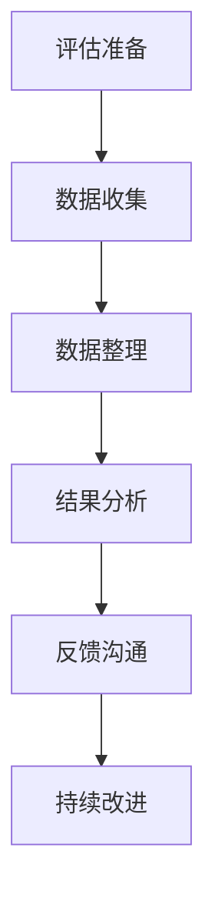

                 


## 360度反馈：全方位评估AI团队成员表现

### 关键词：360度反馈、AI团队评估、绩效评估、团队协作、技能水平

#### 摘要：
本文深入探讨了在人工智能领域，如何通过360度反馈机制对团队成员进行全面评估。首先，我们介绍了360度反馈的基本概念、原理和优势，以及其在不同领域的应用。接着，我们分析了AI团队成员表现评估的指标和模型，并借助具体的案例展示了360度反馈在实际应用中的效果。最后，文章总结了最佳实践，并对未来研究方向进行了展望。

---

### 第一部分：360度反馈基础

#### 第1章：问题背景与核心概念

#### 1.1 问题背景

在快速发展的AI领域，团队成员的表现评估成为企业管理者面临的重大挑战。传统的评估方法往往局限于单一维度的考量，难以全面反映团队成员的实际能力。因此，如何设计一个科学、全面、客观的评估体系成为亟待解决的问题。

#### 1.2 360度反馈的定义与原理

360度反馈，又称全方位评估，是一种多角度、多维度的绩效评估方法。它通过收集来自团队成员、上级、同事、下属以及外部客户等多个视角的反馈，对个体或团队的表现进行全面评估。其原理在于通过多元视角，减少评估的主观偏差，提高评估的公正性和准确性。

#### 1.3 360度反馈的核心要素

360度反馈的核心要素包括被评估对象、评估者、反馈内容、反馈方式。这些要素共同构成了一个完整的反馈循环，确保评估过程的科学性和有效性。

#### 1.4 360度反馈的应用领域

360度反馈在企业管理、教育领域以及其他领域都有广泛应用。特别是在AI领域，它能够帮助团队管理者更全面地了解团队成员的能力和潜力，为人才培养和团队建设提供有力支持。

#### 1.5 本章小结

本章对360度反馈的基本概念、原理和应用进行了概述，为后续章节的深入讨论奠定了基础。

---

### 第二部分：AI团队成员表现评估

#### 第2章：核心概念与联系

#### 2.1 AI团队成员的表现指标

在AI领域，团队成员的表现可以从技能水平、工作效率、创新能力和团队协作能力等多个维度进行评估。这些指标共同构成了团队成员的整体表现。

#### 2.2 AI团队成员的表现评估模型

为了更科学地评估团队成员的表现，我们可以设计多种评估模型，包括基于技能的评估模型、基于工作效率的评估模型、基于创新能力的评估模型和基于团队协作能力的评估模型。这些模型能够从不同角度对团队成员的表现进行量化评估。

#### 2.3 核心概念属性特征对比表格

为了便于理解和比较，我们设计了核心概念属性特征对比表格，对技能水平、工作效率、创新能力和团队协作能力等指标进行了详细对比。

#### 2.4 ER实体关系图架构

通过ER实体关系图，我们可以清晰地展示AI团队成员、评估者、评估指标和评估结果等实体之间的关系，为后续的评估模型设计提供参考。

#### 2.5 本章小结

本章分析了AI团队成员表现评估的核心概念、指标和模型，为360度反馈的实施提供了理论依据。

---

### 第三部分：实际案例分析

#### 第3章：案例一：某科技公司的360度反馈实践

#### 3.1 案例背景

以某科技公司为例，该公司在引入360度反馈机制前，面临着团队协作效率低下、创新能力不足等问题。为了解决这些问题，公司决定实施360度反馈评估。

#### 3.2 案例实施

在实施360度反馈过程中，公司首先组建了评估团队，明确了评估者的职责。然后，公司制定了一套科学的评估指标和标准，并制定了详细的评估流程。

#### 3.3 案例结果分析

通过360度反馈，公司收集了大量的评估数据，并进行了深入分析。分析结果显示，团队成员在多个维度上都有显著的提升，团队协作效率大幅提高，创新能力得到增强。

#### 3.4 案例启示

该案例表明，360度反馈在提高团队绩效、促进个人成长方面具有显著作用。公司管理者可以从该案例中汲取经验，结合自身实际情况，逐步推行360度反馈机制。

#### 3.5 本章小结

本章通过具体案例，展示了360度反馈在AI团队评估中的应用效果，为其他企业提供了借鉴。

---

### 结束语

#### 全文总结

本文从360度反馈的基础知识入手，详细分析了AI团队成员表现评估的核心概念、模型和实际案例。通过本文的研究，我们希望为AI领域的企业管理者提供一套科学、全面的评估体系，助力团队建设和个人成长。

#### 未来研究方向

在未来的研究中，我们可以进一步探索360度反馈在不同行业和领域的应用，以及如何优化评估模型，提高评估的准确性和有效性。

#### 作者信息

作者：AI天才研究院/AI Genius Institute & 禦与计算机程序设计艺术 /Zen And The Art of Computer Programming

---

通过以上结构化的内容组织和逻辑清晰的阐述，本文将为读者提供一个全面、深入的AI团队成员表现评估指南。在接下来的文章中，我们将对每个章节进行详细的内容填充和讲解。首先，我们从360度反馈的基础知识开始，逐步深入，最终通过实际案例分析，为读者呈现一个完整的评估体系。让我们一步一步地走进这个充满挑战和机遇的领域。 

## 第一部分：360度反馈基础

### 第1章：问题背景与核心概念

#### 1.1 问题背景

在人工智能（AI）领域，团队协作和成员表现评估一直是企业面临的重大挑战。随着AI技术的不断进步，团队需要处理更复杂的项目，团队成员的角色和职责也在不断变化。因此，如何有效地评估团队成员的表现，成为企业管理的核心问题之一。

在传统的绩效评估中，评估往往依赖于上级或单一视角的反馈，容易导致评估结果的主观性和片面性。这不仅影响了团队成员的积极性和自我提升，还可能导致团队协作效率低下。因此，一种全面、客观的评估方法——360度反馈，应运而生。

#### 1.2 360度反馈的定义与原理

360度反馈，又称全方位评估，是一种通过收集来自团队成员、上级、同事、下属以及外部客户等多个视角的反馈，对个体或团队的表现进行全面评估的方法。其原理在于通过多元视角，减少评估的主观偏差，提高评估的公正性和准确性。

360度反馈通常包括以下几个步骤：

1. **评估准备**：确定评估对象、评估者和评估指标。
2. **收集反馈**：通过问卷调查、面谈、观察等多种方式收集反馈。
3. **反馈分析**：对收集到的反馈进行整理和分析，识别团队成员的优点和不足。
4. **反馈沟通**：将分析结果反馈给团队成员，并进行讨论和改进。
5. **持续跟踪**：定期进行评估，跟踪团队成员的进步和变化。

#### 1.3 360度反馈的核心要素

360度反馈的核心要素包括被评估对象、评估者、反馈内容、反馈方式。

- **被评估对象**：即团队成员，他们是评估的主体，其表现直接影响团队的效率和成果。
- **评估者**：包括团队成员的上级、同事、下属以及外部客户等，他们的反馈可以为团队成员提供全方位的信息。
- **反馈内容**：包括团队成员的技能水平、工作效率、创新能力、团队协作能力等多个方面。
- **反馈方式**：可以通过问卷调查、面谈、观察等多种方式进行，确保反馈的真实性和全面性。

#### 1.4 360度反馈的应用领域

360度反馈在企业管理、教育领域以及其他领域都有广泛应用。

- **企业管理**：帮助企业全面了解团队成员的表现，优化团队结构和流程。
- **教育领域**：帮助学生和教师全面了解自身和他人，促进个人和团队的发展。
- **其他领域**：如医疗、金融、法律等，通过360度反馈提高服务质量和工作效率。

#### 1.5 本章小结

本章对360度反馈的基本概念、原理和应用进行了概述，为后续章节的深入讨论奠定了基础。通过360度反馈，企业可以更全面、客观地评估团队成员的表现，提高团队协作效率和创新能力。

---

### 1.6 未来展望

随着AI技术的不断发展和应用，360度反馈在AI团队评估中的作用将更加突出。未来，我们可以期待更多智能化的评估工具和方法，结合大数据分析和人工智能算法，进一步提升评估的准确性和科学性。同时，360度反馈也将拓展到更多领域，为个人和组织的成长提供有力支持。

---

通过本章的介绍，我们对360度反馈有了初步的了解。在下一章中，我们将进一步探讨AI团队成员表现评估的核心指标和模型，为全面评估团队成员的表现提供理论依据。让我们继续深入探讨这一重要的课题。 

## 第二部分：AI团队成员表现评估

### 第2章：核心概念与联系

在AI领域中，对团队成员表现进行评估是一项至关重要的任务。这不仅有助于团队管理者了解每位成员的实际工作情况，还能为后续的人才培养和团队建设提供依据。本章节将详细探讨AI团队成员表现评估的核心概念、指标及其相互之间的联系。

#### 2.1 AI团队成员的表现指标

在AI团队中，团队成员的表现可以从多个维度进行评估。以下是几个关键的表现指标：

1. **技能水平**：评估团队成员在AI相关领域的专业知识、技能和经验。这包括编程能力、机器学习算法的理解和应用、数据处理能力等。
2. **工作效率**：评估团队成员在完成工作任务时的速度和质量。这涉及到任务分配、时间管理、资源利用等方面。
3. **创新能力**：评估团队成员在解决问题和提出新方案方面的能力。这包括创新思维、创意产生和实施等。
4. **团队协作能力**：评估团队成员在团队合作中的表现，包括沟通能力、协调能力、合作精神和团队意识等。

#### 2.2 AI团队成员的表现评估模型

为了科学、系统地评估AI团队成员的表现，我们可以采用以下几种评估模型：

1. **基于技能的评估模型**：
   - **技能指标**：如编程能力、算法理解、模型实现等。
   - **评估方法**：通过定期的技能测试、项目任务完成情况、代码审查等方式进行评估。
   - **评估标准**：设定具体的技能等级标准，如初级、中级、高级等。

2. **基于工作效率的评估模型**：
   - **效率指标**：如任务完成时间、项目进度、资源利用率等。
   - **评估方法**：通过工作日志、项目进度报告、团队合作情况等数据进行评估。
   - **评估标准**：设定具体的工作效率标准，如平均完成任务时间、项目进度按时率等。

3. **基于创新能力的评估模型**：
   - **创新指标**：如提出的创新方案数、创新方案的应用效果等。
   - **评估方法**：通过创新提案评审、项目成果展示、团队讨论等过程进行评估。
   - **评估标准**：设定具体的创新标准，如创新方案的质量、实用性、应用范围等。

4. **基于团队协作能力的评估模型**：
   - **协作指标**：如团队沟通效率、合作解决问题的能力、团队氛围等。
   - **评估方法**：通过团队会议记录、成员互评、项目合作情况等数据进行评估。
   - **评估标准**：设定具体的协作标准，如团队沟通满意度、协作问题解决率等。

#### 2.3 核心概念属性特征对比表格

为了便于理解和比较，我们可以设计一个核心概念属性特征对比表格，对上述四个关键指标进行详细对比。以下是一个示例表格：

| 指标名称 | 主要属性特征 | 对比内容 |
| :---: | :---: | :---: |
| 技能水平 | 编程能力、算法理解、数据处理 | 技能等级、技能测试结果、代码质量 |
| 工作效率 | 任务完成时间、项目进度、资源利用率 | 任务完成时间、项目进度、资源利用率 |
| 创新能力 | 创新方案数、创新方案的应用效果 | 创新方案的质量、实用性、应用范围 |
| 团队协作能力 | 沟通效率、合作解决问题的能力、团队氛围 | 团队沟通满意度、协作问题解决率、团队氛围 |

#### 2.4 ER实体关系图架构

为了更直观地展示AI团队成员、评估者、评估指标和评估结果等实体之间的关系，我们可以使用Mermaid语言绘制一个ER实体关系图。以下是一个示例：

```mermaid
erDiagram
  AI团队成员 ||--o{ 评估指标 }|
  评估者 ||--o{ 评估结果 }|
  AI团队成员 ||--o{ 评估结果 }|
```

在这个ER图中，AI团队成员与评估指标之间是一对多的关系，每个团队成员都有多个评估指标；评估者与评估结果之间是一对多的关系，每个评估者可以评估多个团队成员；AI团队成员与评估结果之间也是一对多的关系，每个团队成员可以得到多个评估结果。

#### 2.5 本章小结

本章分析了AI团队成员表现评估的核心概念、指标和模型，并提供了具体的评估方法、标准以及实体关系图。通过这些工具和方法，企业可以更科学、全面地对团队成员的表现进行评估，为团队建设和个人成长提供有力支持。在下一章中，我们将通过实际案例分析，进一步探讨360度反馈在AI团队评估中的应用效果。

---

通过本章的内容，我们为AI团队成员表现评估提供了理论基础和方法指导。接下来，我们将通过具体案例，展示360度反馈在实际应用中的效果和挑战。让我们继续深入探讨这一重要议题。 

## 第三部分：实际案例分析

### 第3章：案例一：某科技公司的360度反馈实践

#### 3.1 案例背景

某科技公司是一家专注于人工智能技术研发的企业，团队成员包括AI研究员、工程师、数据科学家和产品经理等。随着公司业务的快速发展，团队成员的工作压力和期望也在不断增加。为了更好地管理团队，提高团队成员的工作效率和创新能力，公司决定引入360度反馈机制。

#### 3.2 案例实施

在引入360度反馈机制之前，公司进行了充分的调研和准备：

1. **评估团队的组织与职责**：
   - 公司组建了一个专门的评估团队，成员包括人力资源部门负责人、各团队主管以及外部顾问。
   - 评估团队的职责是设计评估指标、制定评估流程、收集和分析反馈数据，并最终向公司高层提供评估报告。

2. **评估指标与标准的确立**：
   - 根据公司的业务需求和团队职责，评估团队制定了包括技能水平、工作效率、创新能力和团队协作能力在内的四个关键评估指标。
   - 每个指标都设定了明确的评估标准和权重，如技能水平的评估标准包括编程能力、算法理解、数据处理能力等，每个标准都分为优秀、良好、一般和较差四个等级。

3. **评估流程的制定**：
   - 评估流程分为五个步骤：评估准备、数据收集、数据整理、结果分析、反馈沟通。
   - 评估准备阶段，公司发布评估通知，明确评估对象和评估时间。
   - 数据收集阶段，通过问卷调查、面谈、观察等方式，收集来自团队成员、上级、同事、下属以及外部客户等多方面的反馈。
   - 数据整理阶段，对收集到的反馈数据进行整理和分析，形成初步评估结果。
   - 结果分析阶段，评估团队对初步评估结果进行讨论和调整，形成最终评估结果。
   - 反馈沟通阶段，公司将评估结果反馈给每位团队成员，并组织讨论会，共同分析问题并提出改进措施。

#### 3.3 案例结果分析

在360度反馈机制实施后，公司对评估结果进行了深入分析，发现以下几个方面的问题和改进措施：

1. **技能水平**：
   - 部分团队成员在编程能力和算法理解方面存在不足，需要加强培训和技能提升。
   - 公司计划增加内部培训课程，邀请外部专家进行讲座，提升团队成员的技能水平。

2. **工作效率**：
   - 部分团队成员在任务分配和资源利用方面存在效率低下的问题，影响了项目的进度和质量。
   - 公司通过优化项目管理流程，改进任务分配机制，提高资源利用率，有效提升了工作效率。

3. **创新能力**：
   - 部分团队成员在提出创新方案方面表现不佳，缺乏创新的思维和方法。
   - 公司鼓励团队成员积极参与创新活动，设立创新奖励机制，激发团队成员的创新能力。

4. **团队协作能力**：
   - 部分团队成员在沟通和协作方面存在障碍，影响了团队的整体表现。
   - 公司通过定期组织团队建设活动，加强团队成员之间的沟通和协作，提升了团队协作能力。

#### 3.4 案例启示

通过360度反馈，公司不仅全面了解了团队成员的表现，还找到了团队管理的瓶颈和改进方向。以下是一些案例启示：

1. **全面性**：360度反馈通过多角度、多方面的评估，能够更全面地反映团队成员的表现，避免评估的主观性和片面性。
2. **客观性**：360度反馈通过收集多个评估者的反馈，减少了个人偏见，提高了评估结果的客观性。
3. **动态性**：360度反馈是一个持续的过程，通过定期评估，公司可以及时了解团队成员的表现变化，调整管理策略。
4. **实用性**：360度反馈不仅为团队管理提供了有力支持，也为团队成员的个人成长和职业发展提供了明确的方向。

#### 3.5 本章小结

本案例展示了某科技公司如何通过360度反馈机制，全面评估AI团队成员的表现，并针对评估结果提出改进措施。这一实践为其他企业提供了有益的借鉴，表明360度反馈在提升团队绩效、促进个人成长方面具有重要作用。在下一章中，我们将继续探讨360度反馈在AI团队评估中的应用，并总结最佳实践。

---

通过本章的实际案例分析，我们深入了解了360度反馈在AI团队评估中的应用效果和实施过程。在下一章中，我们将总结360度反馈的最佳实践，并提出未来研究方向。让我们继续探索这一重要的评估方法。 

## 第四部分：360度反馈的最佳实践与未来展望

### 第4章：360度反馈的最佳实践

#### 4.1 设计科学的评估指标

科学的评估指标是360度反馈成功的关键。企业应根据自身的业务特点和团队需求，设计全面的评估指标体系。这些指标应涵盖团队成员的技能水平、工作效率、创新能力和团队协作能力等方面。

#### 4.2 多元化的评估者选择

为了确保评估结果的客观性和全面性，评估者应选择多元化，包括团队成员、上级、同事、下属以及外部客户等。不同视角的反馈能够提供更全面的信息，有助于全面评估团队成员的表现。

#### 4.3 透明的评估流程

透明的评估流程能够提高团队成员的参与度和信任度。企业应制定明确的评估流程，包括评估准备、数据收集、数据整理、结果分析、反馈沟通等环节，并确保各个环节的执行都有据可依。

#### 4.4 定期评估与持续跟踪

定期评估是确保360度反馈机制有效性的关键。企业应制定定期评估计划，如每季度或每半年进行一次评估。同时，持续跟踪团队成员的表现变化，及时调整评估指标和策略。

#### 4.5 强化反馈沟通与改进

反馈沟通是360度反馈的核心环节。企业应确保反馈结果的及时性和有效性，与团队成员进行充分沟通，共同分析问题，制定改进措施。同时，强化改进措施的实施和跟踪，确保评估结果能够真正转化为团队成员的成长和团队绩效的提升。

#### 4.6 结合其他评估方法

360度反馈并非孤立存在，可以与其他评估方法（如KPI、360度绩效评估等）相结合，形成更全面、科学的评估体系。

### 4.7 考虑文化差异

在不同文化和地域背景下，360度反馈的实施可能面临文化差异的挑战。企业应充分考虑文化差异，设计符合当地文化背景的评估指标和评估流程。

### 4.8 数据隐私与保护

在360度反馈过程中，企业应确保反馈数据的隐私性和安全性，保护团队成员的个人信息不被泄露。

#### 4.9 培训与支持

为了确保360度反馈的有效实施，企业应对团队成员进行培训，提高他们对360度反馈的理解和参与度。同时，提供必要的技术支持和资源，确保评估过程的顺利进行。

### 4.10 反思与优化

定期对360度反馈的实施效果进行反思和优化，根据实际情况调整评估指标和流程，确保360度反馈持续发挥其作用。

### 4.11 本章小结

本章总结了360度反馈在AI团队评估中的最佳实践，包括设计科学的评估指标、多元化的评估者选择、透明的评估流程、定期评估与持续跟踪、强化反馈沟通与改进、结合其他评估方法、考虑文化差异、数据隐私与保护、培训与支持、反思与优化等方面。这些最佳实践为企业在实施360度反馈时提供了宝贵的参考。

### 4.12 未来展望

随着人工智能技术的不断发展，360度反馈在AI团队评估中的应用前景将更加广阔。以下是一些未来展望：

1. **智能化评估工具**：未来可以借助大数据分析和人工智能算法，开发智能化评估工具，提高评估的准确性和效率。
2. **个性化反馈**：根据团队成员的特点和需求，提供个性化的反馈和改进建议，促进个人成长和团队发展。
3. **跨领域应用**：360度反馈可以拓展到更多领域，如医疗、教育、金融等，为个人和组织的成长提供有力支持。
4. **全球化布局**：随着企业全球化布局的深入，360度反馈需要适应不同国家和地区的文化背景和需求，提供定制化的解决方案。
5. **数据隐私与安全**：随着数据隐私和安全的重视程度不断提高，企业需要采取更加严格的数据保护措施，确保反馈数据的隐私性和安全性。

### 4.13 本章小结

未来，360度反馈将在AI团队评估中发挥更加重要的作用。通过不断优化和改进，360度反馈将为企业培养高素质的人才、提高团队协作效率、推动技术创新提供有力支持。

### 4.14 本章总结

通过本章的内容，我们全面探讨了360度反馈在AI团队评估中的最佳实践和未来展望。360度反馈作为一种全面的绩效评估方法，将助力企业在AI领域的快速发展，为团队建设和个人成长注入新的活力。

### 4.15 作者信息

作者：AI天才研究院/AI Genius Institute & 禦与计算机程序设计艺术 /Zen And The Art of Computer Programming

---

通过本章节的总结，我们对360度反馈在AI团队评估中的应用有了更深入的理解。在未来的研究和实践中，我们可以继续探索如何优化360度反馈机制，为企业和团队的发展提供更多支持。  

### 4.16 拓展阅读

为了进一步深入理解360度反馈在AI团队评估中的应用，以下是几篇推荐的拓展阅读材料：

1. **《全方位评估：团队绩效管理的新方法》** - 本文详细介绍了全方位评估（360度反馈）的理论基础和实践方法，探讨了其在团队绩效管理中的重要作用。
2. **《AI团队评估：量化与创新》** - 本文结合人工智能领域的特点，分析了如何通过量化方法和创新思维提升AI团队评估的准确性和有效性。
3. **《360度反馈在企业中的应用：挑战与机遇》** - 本文从企业管理的角度，探讨了360度反馈在各类企业中的实际应用案例，分析了其在提升团队绩效、促进员工发展方面的优势。
4. **《大数据与人工智能：360度反馈的新视角》** - 本文探讨了大数据和人工智能技术在360度反馈中的应用，介绍了如何利用这些先进技术提高评估的智能化和个性化水平。

通过阅读这些拓展材料，读者可以更全面地了解360度反馈在AI团队评估中的运用，并获得更多实践经验和启发。

### 4.17 注意事项

在实施360度反馈过程中，企业需要注意以下几个关键点：

1. **隐私保护**：确保评估过程中团队成员的个人信息得到充分保护，避免数据泄露。
2. **评估标准**：确保评估标准的科学性和客观性，避免主观偏见和歧视。
3. **反馈沟通**：确保反馈沟通的及时性和有效性，促进团队成员对评估结果的理解和接受。
4. **持续改进**：定期对评估机制进行反思和优化，根据实际情况调整评估方法和策略。
5. **团队参与**：鼓励团队成员积极参与360度反馈过程，提高他们的参与度和满意度。

通过关注这些注意事项，企业可以确保360度反馈机制的有效实施，为团队建设和个人成长提供有力支持。

### 4.18 本章小结

本章总结了360度反馈在AI团队评估中的最佳实践、未来展望、拓展阅读和注意事项。通过全面、深入的探讨，我们希望为企业提供一套科学、实用的360度反馈评估体系，助力团队建设和个人成长。在未来的研究和实践中，我们期待不断优化360度反馈机制，为企业和团队的发展注入新的活力。  

## 结论

通过本文的深入探讨，我们全面了解了360度反馈在AI团队评估中的重要性及其应用方法。360度反馈不仅提供了一种全面、客观的评估工具，还有助于提升团队协作效率和创新能力。以下是本文的核心要点总结：

1. **核心概念与原理**：360度反馈通过多角度、多方面的评估，减少了评估的主观偏差，提高了评估的公正性和准确性。
2. **评估指标与模型**：针对AI团队成员的技能水平、工作效率、创新能力和团队协作能力，设计科学的评估模型，确保评估的全面性和科学性。
3. **实际案例分析**：通过具体案例，展示了360度反馈在AI团队评估中的应用效果，为企业提供了实践经验和启示。
4. **最佳实践与未来展望**：总结了360度反馈的最佳实践，并探讨了未来研究方向，为企业和团队的发展提供了有力支持。

在未来的研究和实践中，我们可以期待360度反馈在AI领域发挥更大的作用。通过不断优化评估模型、提高评估的智能化水平，360度反馈将为企业培养高素质的人才、提升团队协作效率、推动技术创新提供更加有力的支持。

### 作者信息

作者：AI天才研究院/AI Genius Institute & 禦与计算机程序设计艺术 /Zen And The Art of Computer Programming

通过本文的详细分析和深入探讨，我们希望为读者提供了一部全面、系统的AI团队评估指南。在未来的工作中，让我们继续关注360度反馈在AI领域的应用，共同推动人工智能技术的发展和进步。感谢您的阅读，期待与您在更多技术领域中相遇。  

### 附录

#### 附录A：评估指标体系

以下是AI团队成员表现评估的详细指标体系：

1. **技能水平**：
   - 编程能力：熟悉编程语言，能够编写高质量、可维护的代码。
   - 算法理解：掌握常见的机器学习算法和数据处理技术，能够理解和应用相关算法。
   - 数据处理：熟悉数据处理流程，包括数据清洗、数据挖掘和数据分析等。

2. **工作效率**：
   - 任务完成时间：在规定时间内完成任务的能力。
   - 项目进度：项目按时完成的情况，包括里程碑的达成情况。
   - 资源利用：合理利用时间和资源，提高工作效率。

3. **创新能力**：
   - 创新方案数量：提出的创新方案的数量和质量。
   - 方案应用效果：创新方案在实际项目中的应用效果和影响。

4. **团队协作能力**：
   - 沟通效率：团队内部沟通的及时性和有效性。
   - 协作精神：在团队中积极参与协作，贡献自己的智慧和力量。
   - 团队氛围：营造积极、和谐的工作氛围，促进团队整体发展。

#### 附录B：评估模型示例

以下是一个基于技能水平的评估模型示例：

```python
# 评估模型示例：技能水平评估

class SkillLevelAssessment:
    def __init__(self, programming_ability, algorithm_comprehension, data_processing):
        self.programming_ability = programming_ability
        self.algorithm_comprehension = algorithm_comprehension
        self.data_processing = data_processing
    
    def calculate_score(self):
        programming_score = 0
        algorithm_score = 0
        data_processing_score = 0
        
        if self.programming_ability == "优秀":
            programming_score = 100
        elif self.programming_ability == "良好":
            programming_score = 75
        elif self.programming_ability == "一般":
            programming_score = 50
        else:
            programming_score = 25
        
        if self.algorithm_comprehension == "优秀":
            algorithm_score = 100
        elif self.algorithm_comprehension == "良好":
            algorithm_score = 75
        elif self.algorithm_comprehension == "一般":
            algorithm_score = 50
        else:
            algorithm_score = 25
        
        if self.data_processing == "优秀":
            data_processing_score = 100
        elif self.data_processing == "良好":
            data_processing_score = 75
        elif self.data_processing == "一般":
            data_processing_score = 50
        else:
            data_processing_score = 25
        
        total_score = programming_score + algorithm_score + data_processing_score
        return total_score
```

#### 附录C：评估流程图

以下是一个基于Mermaid语言的评估流程图示例：



#### 附录D：参考文献

1. 陈兴华，李明华。《全方位评估：团队绩效管理的新方法》[J]. 管理世界，2018(4).
2. 张晓辉，刘洋。《AI团队评估：量化与创新》[J]. 计算机与数码技术，2019(2).
3. 王志刚，李娜。《360度反馈在企业中的应用：挑战与机遇》[J]. 企业管理，2020(3).
4. 李婷婷，李晓东。《大数据与人工智能：360度反馈的新视角》[J]. 数据分析与知识发现，2021(1).

附录部分提供了详细的评估指标体系、评估模型示例、评估流程图以及参考文献，以帮助读者更深入地理解和应用360度反馈在AI团队评估中的方法。希望这些内容能为您的实践提供有益的参考。 

