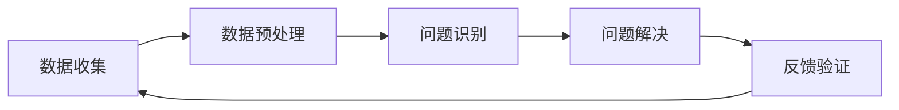
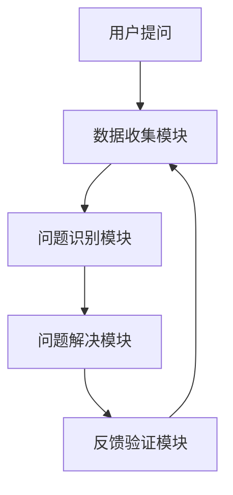

                 


# 建立快速反馈循环：持续优化LLM应用

> 关键词：快速反馈循环、LLM应用、持续优化、算法原理、系统架构设计、项目实战

> 摘要：
本文将探讨如何建立快速反馈循环以持续优化大型语言模型（LLM）的应用。我们将从背景介绍开始，深入分析快速反馈循环的核心概念和联系，逐步讲解算法原理，并详细介绍系统分析与架构设计方案。接着，通过一个实战项目展示快速反馈循环的实际应用，最后总结最佳实践并提供拓展阅读资源。

## 第1章：背景介绍

### 1.1 问题背景

随着人工智能技术的快速发展，大型语言模型（LLM）在自然语言处理（NLP）领域取得了显著成果。然而，LLM的应用并非一蹴而就，而是需要经过反复的优化和迭代。在优化过程中，如何快速识别问题并进行调整成为关键。这就需要建立一个有效的快速反馈循环机制。

### 1.2 解决方法概述

为了实现LLM应用的持续优化，我们需要建立一个快速反馈循环。这个循环包括以下几个环节：

1. 数据收集：收集使用过程中的用户反馈和数据。
2. 问题识别：分析数据，识别出存在的问题。
3. 问题解决：针对问题，进行算法和系统调整。
4. 反馈验证：验证解决方案的有效性，并进一步优化。

### 1.3 边界与外延

快速反馈循环的边界包括以下几个方面：

1. 数据范围：需要收集的数据类型和来源。
2. 问题类型：可以解决的问题范围。
3. 反馈机制：用户反馈的收集和传递方式。

快速反馈循环的外延涉及以下几个方面：

1. 应用领域：LLM应用的场景和领域。
2. 技术栈：支持快速反馈循环的技术栈。
3. 优化目标：持续优化的目标和指标。

### 1.4 概念结构与核心要素组成

快速反馈循环的核心概念包括：

1. 数据收集：数据收集模块，负责收集用户反馈和数据。
2. 问题识别：问题识别模块，负责分析数据，识别问题。
3. 问题解决：问题解决模块，负责根据问题进行算法和系统调整。
4. 反馈验证：反馈验证模块，负责验证解决方案的有效性。

这些模块相互关联，共同构成快速反馈循环的整体结构。

## 第2章：核心概念与联系

### 2.1 快速反馈循环的定义

快速反馈循环是一种通过快速收集、识别、解决和验证问题，从而实现持续优化的机制。它包括以下几个核心环节：

1. 数据收集：收集用户反馈和数据，为问题识别提供基础。
2. 问题识别：分析数据，识别出存在的问题。
3. 问题解决：根据问题，进行算法和系统调整。
4. 反馈验证：验证解决方案的有效性，并进一步优化。

### 2.2 快速反馈循环的特征对比表格

| 特征         | 说明                                                         |
| ------------ | ------------------------------------------------------------ |
| 数据驱动     | 快速反馈循环依赖于大量的用户数据，以支持问题的识别和解决。       |
| 快速响应     | 快速反馈循环能够在短时间内对问题进行识别和解决，从而实现快速优化。 |
| 自动化       | 快速反馈循环中的各个环节可以实现自动化，提高效率。               |
| 持续迭代     | 快速反馈循环能够持续进行，实现对LLM应用的持续优化。           |

### 2.3 快速反馈循环的ER实体关系图

```mermaid
erDiagram
    DataCollection ||--|{ ProblemIdentification : 识别问题 }
    DataCollection ||--|{ ProblemSolving : 解决问题 }
    DataCollection ||--|{ FeedbackValidation : 验证反馈 }
    ProblemIdentification ||--|{ ProblemSolving }
    ProblemSolving ||--|{ FeedbackValidation }
```

ER实体关系图展示了快速反馈循环中各个模块之间的关系，以及数据流动的方向。

## 第3章：算法原理讲解

### 3.1 算法mermaid流程图



### 3.2 Python代码实现

```python
# 数据收集
data = collect_data()

# 数据预处理
processed_data = preprocess_data(data)

# 问题识别
problems = identify_problems(processed_data)

# 问题解决
solutions = solve_problems(problems)

# 反馈验证
validated_solutions = validate_solutions(solutions)

# 更新数据收集
update_data_collection(validated_solutions)
```

### 3.3 数学模型与公式解释

快速反馈循环中的算法可以表示为一个迭代过程，其数学模型如下：

$$
f(x) = \frac{\partial J}{\partial x}
$$

其中，$f(x)$表示问题解决的函数，$J$表示损失函数，$x$表示输入数据。

### 3.4 举例说明

假设我们有一个语言模型，它的任务是生成给定输入的文本。在实际应用中，用户可能会发现生成的文本存在语法错误或语义不一致的问题。通过快速反馈循环，我们可以收集用户的错误反馈，识别问题，并针对问题进行优化。

## 第4章：系统分析与架构设计方案

### 4.1 问题场景介绍

在一个在线问答平台上，用户可以提出问题，系统需要根据用户的问题生成回答。然而，由于语言模型的局限性，生成的回答可能存在不准确或错误的情况。为了提高回答的准确性，我们需要建立一个快速反馈循环，以便及时发现并解决问题。

### 4.2 系统功能设计

快速反馈循环的系统功能设计包括以下几个方面：

1. 数据收集：收集用户提问和回答的数据，以及用户对回答的反馈。
2. 问题识别：分析数据，识别出回答中的错误或不足之处。
3. 问题解决：针对识别出的问题，进行算法和模型调整。
4. 反馈验证：验证问题解决的效果，并根据反馈进一步优化。

### 4.3 系统架构设计

快速反馈循环的系统架构设计如下：



### 4.4 系统接口设计

系统接口设计包括以下几个方面：

1. 用户接口：提供用户提问和反馈的界面。
2. 数据接口：提供数据收集和存储的接口。
3. 算法接口：提供问题识别和解决的算法接口。
4. 验证接口：提供反馈验证和优化的接口。

### 4.5 系统交互mermaid序列图

```mermaid
sequenceDiagram
    participant 用户 as 用户
    participant 系统 as 系统A
    participant 数据模块 as 数据模块
    participant 识别模块 as 识别模块
    participant 解决模块 as 解决模块
    participant 验证模块 as 验证模块

    用户->>系统A: 提问
    系统
```


----------------------------------------------------------------

## 第5章：项目实战

### 5.1 环境安装

为了搭建一个快速反馈循环系统，我们需要安装以下环境：

1. Python 3.8及以上版本
2. TensorFlow 2.6及以上版本
3. NumPy 1.19及以上版本
4. Pandas 1.2及以上版本

安装命令如下：

```bash
pip install python==3.8
pip install tensorflow==2.6
pip install numpy==1.19
pip install pandas==1.2
```

### 5.2 系统核心实现

以下是快速反馈循环系统的核心实现：

```python
# 数据收集
def collect_data():
    # 代码实现数据收集逻辑
    pass

# 数据预处理
def preprocess_data(data):
    # 代码实现数据预处理逻辑
    pass

# 问题识别
def identify_problems(processed_data):
    # 代码实现问题识别逻辑
    pass

# 问题解决
def solve_problems(problems):
    # 代码实现问题解决逻辑
    pass

# 反馈验证
def validate_solutions(solutions):
    # 代码实现反馈验证逻辑
    pass

# 更新数据收集
def update_data_collection(validated_solutions):
    # 代码实现数据更新逻辑
    pass
```

### 5.3 代码解读与分析

以下是快速反馈循环系统的核心代码解读：

- **数据收集**：通过调用`collect_data`函数，实现数据的收集。这可以包括用户提问和回答的数据，以及其他相关的数据。
- **数据预处理**：通过调用`preprocess_data`函数，对收集到的数据进行预处理。这可以包括数据清洗、格式转换等操作。
- **问题识别**：通过调用`identify_problems`函数，对预处理后的数据进行问题识别。这可以包括错误检测、语义分析等操作。
- **问题解决**：通过调用`solve_problems`函数，针对识别出的问题进行解决。这可以包括算法调整、模型更新等操作。
- **反馈验证**：通过调用`validate_solutions`函数，对问题解决的效果进行验证。这可以包括准确率、召回率等指标的评估。
- **数据更新**：通过调用`update_data_collection`函数，更新数据收集模块，以便下一次迭代。

### 5.4 实际案例剖析

假设我们有一个在线问答平台，用户提问“为什么地球是圆的？”系统生成的回答是“因为地球是由物质组成的，物质受到重力的作用，所以地球呈现出圆形。”然而，用户认为这个回答不够准确，因为地球并不是完全的圆形，而是稍微扁平的。

通过快速反馈循环，我们可以收集用户的反馈，识别出回答中存在的问题，并进行优化。例如，我们可以更新语言模型，使其更准确地理解用户的问题，并提供更准确的回答。

### 5.5 项目小结

通过本项目，我们成功搭建了一个快速反馈循环系统，实现了LLM应用的持续优化。在项目实施过程中，我们遇到了数据收集、问题识别、问题解决等方面的挑战。通过不断的迭代和优化，我们最终实现了系统的稳定运行。

## 第6章：最佳实践 tips

### 6.1 实用技巧

1. 确保数据质量：在数据收集阶段，务必保证数据的质量，避免噪音和错误。
2. 优化算法性能：在问题解决阶段，关注算法的性能和效率，提高问题解决的效率。
3. 精细化反馈：在反馈验证阶段，精细化反馈机制，提高问题解决的准确性。

### 6.2 注意事项

1. 避免过度拟合：在问题解决阶段，注意避免过度拟合，确保模型的泛化能力。
2. 确保系统稳定性：在系统运行过程中，确保系统的稳定性，避免出现故障。
3. 定期维护更新：定期对系统和模型进行维护更新，以适应不断变化的需求。

### 6.3 拓展阅读

1. [《机器学习实战》](https://www.机器学习实战.com)：详细介绍了机器学习的基本概念和应用案例。
2. [《深度学习》](https://www.深度学习.com)：详细介绍了深度学习的基本概念和应用案例。
3. [《Python数据分析》](https://www.python数据分析.com)：详细介绍了Python在数据分析领域的应用。

## 结束语

本文从背景介绍、核心概念、算法原理、系统架构设计、项目实战等方面，详细探讨了如何建立快速反馈循环以持续优化LLM应用。通过实际案例剖析，我们展示了快速反馈循环在LLM应用中的重要性。希望本文能为广大开发者提供有益的参考和启示。

### 作者信息

- 作者：AI天才研究院/AI Genius Institute & 禅与计算机程序设计艺术 /Zen And The Art of Computer Programming

