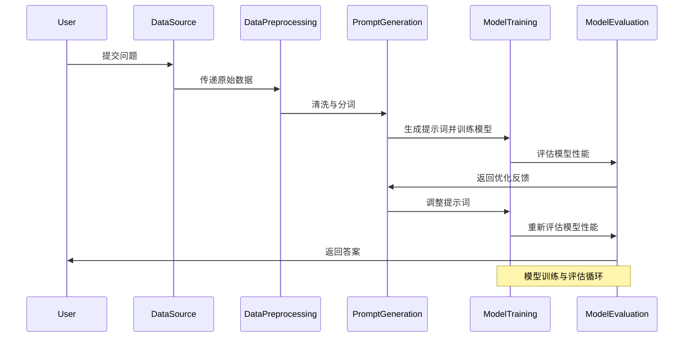

                 

### 强化prompt提示词工程的重要性

#### 关键词：强化学习，提示词工程，人工智能，机器学习，应用领域，前景展望

在当今快速发展的信息技术时代，强化prompt提示词工程正逐渐成为人工智能（AI）领域的一颗耀眼明星。随着机器学习和深度学习技术的不断进步，强化prompt提示词工程的应用范围也在不断扩大，从自然语言处理（NLP）到计算机视觉，再到智能推荐系统，都离不开这一关键技术。本文将逐步探讨强化prompt提示词工程的核心概念、原理、算法和应用，以期为读者提供一个全面而深入的视角。

**摘要：**

本文首先介绍强化prompt提示词工程的背景和重要性，随后详细解析相关概念，包括prompt、提示词工程及其关键要素。接着，我们深入探讨强化prompt提示词工程的原理与特性，通过比较分析其与传统prompt工程的差异，展示其在灵活性和个性化方面的优势。然后，通过实体关系图和算法流程的讲解，我们将进一步理解强化prompt提示词工程的内部工作机制。最后，我们将结合具体项目实战，展示系统分析与架构设计，以及环境安装和系统核心实现的详细步骤，为读者提供实用的技术指导。

通过本文的逐步分析，我们期望能够揭示强化prompt提示词工程在人工智能领域的重要地位，并激发读者对其深入研究与应用的兴趣。

### 目录大纲

1. **背景与概述**
   - **第1章 问题背景与核心概念**
     - 1.1 强化prompt提示词工程的定义与作用
     - 1.2 相关概念解析
     - 1.3 边界与外延
   - **第2章 强化prompt提示词工程的原理与特性**
     - 2.1 强化prompt提示词工程的基本原理
     - 2.2 强化prompt提示词工程的关键特性
     - 2.3 强化prompt提示词工程的比较分析
   - **第3章 强化prompt提示词工程的实体关系图**
     - 3.1 实体关系图概述
     - 3.2 实体关系图架构
   - **第4章 强化prompt提示词工程的算法原理**
     - 4.1 算法概述
     - 4.2 算法原理详细讲解
     - 4.3 算法流程与Python实现
   - **第5章 系统分析与架构设计方案**
     - 5.1 问题场景与系统功能设计
     - 5.2 系统架构设计与接口设计
     - 5.3 系统交互与序列图
   - **第6章 项目实战**
     - 6.1 环境安装与系统核心实现

### 第一部分：背景与概述

#### 第1章 问题背景与核心概念

##### 1.1 强化prompt提示词工程的定义与作用

强化prompt提示词工程是一种结合了强化学习和自然语言处理（NLP）的技术方法，旨在通过智能算法自动生成高质量的提示词，以引导模型进行有效的学习。这种工程方法的核心在于利用强化学习算法来优化提示词的生成过程，从而提高模型在不同任务中的表现。

强化prompt提示词工程的作用主要体现在以下几个方面：

1. **提高学习效率**：通过优化提示词，能够更快地使模型适应新的任务或领域，减少训练时间。
2. **增强模型表现**：高质量的提示词能够帮助模型更好地理解任务目标，从而提高模型的准确性和鲁棒性。
3. **适应多样化任务**：强化prompt提示词工程使得模型能够灵活地适应各种不同的任务需求，提高了通用性。

##### 1.2 强化prompt提示词工程的重要性分析

强化prompt提示词工程的重要性可以从以下几个方面进行分析：

1. **技术前沿**：随着人工智能技术的发展，强化学习在NLP领域的应用越来越广泛。强化prompt提示词工程作为其中的关键技术，无疑具有极高的研究价值和实际应用前景。
2. **性能提升**：通过强化学习算法优化提示词生成，能够显著提升模型的性能，特别是在复杂任务中表现尤为突出。
3. **效率优化**：强化prompt提示词工程能够通过自动化的方式优化提示词生成过程，降低人力成本，提高生产效率。

##### 1.3 强化prompt提示词工程的应用领域与前景

强化prompt提示词工程的应用领域非常广泛，涵盖了多个技术领域：

1. **自然语言处理（NLP）**：在文本生成、文本分类、机器翻译等任务中，强化prompt提示词工程能够显著提高模型的性能。
2. **计算机视觉**：在图像识别、目标检测等任务中，强化prompt提示词工程可以帮助模型更好地理解图像内容，提高准确率和鲁棒性。
3. **智能推荐系统**：在推荐算法中，强化prompt提示词工程可以帮助生成更加精准的推荐结果，提高用户体验。

展望未来，强化prompt提示词工程在以下几个方面具有巨大的潜力：

1. **多样化应用场景**：随着人工智能技术的不断进步，强化prompt提示词工程的应用领域将进一步扩展，包括但不限于医疗、金融、教育等行业。
2. **技术融合与创新**：强化prompt提示词工程与其他前沿技术的结合，如生成对抗网络（GAN）、迁移学习等，将推动人工智能技术的进一步发展。
3. **商业价值**：强化prompt提示词工程在提高模型性能和效率的同时，也为企业和组织带来了巨大的商业价值，特别是在数据驱动的决策支持和智能服务领域。

##### 1.2 相关概念解析

在这一部分，我们将深入解析与强化prompt提示词工程相关的核心概念，包括prompt、提示词工程及其关键要素。

###### 1.2.1 Prompt的概述

Prompt在人工智能领域，特别是在自然语言处理中，是指提供给模型的一段引导性文本，用于引导模型生成目标文本或进行特定任务。Prompt的设计对模型的学习过程和最终输出有着至关重要的影响。

1.2.1.1 Prompt的定义

Prompt可以定义为一种文本输入，它为模型提供了上下文信息、任务目标和预期输出格式。通常，Prompt由几个关键部分组成：

- **上下文**：提供背景信息和相关内容，帮助模型理解任务。
- **任务说明**：明确指出模型需要完成的任务，例如“请翻译以下句子为英文”。
- **输出格式**：指定输出文本的格式，例如“请将以下句子翻译为英文：”。

1.2.1.2 Prompt的分类与类型

根据用途和形式，Prompt可以分为以下几种类型：

- **任务型Prompt**：用于指示模型执行特定任务的Prompt，例如“请生成一段关于旅行的描述”。
- **数据增强型Prompt**：用于提供额外数据，帮助模型更好地理解和泛化任务的Prompt，例如“请基于以下信息生成故事：昨天我去了海边，看到了美丽的日落”。
- **引导型Prompt**：用于引导模型生成特定内容或风格的Prompt，例如“请创作一首关于春天的七言绝句”。
- **自适应型Prompt**：根据模型的学习进展和生成结果动态调整的Prompt，例如在模型生成错误时提供修正提示。

1.2.2 提示词工程的关键要素

提示词工程是指设计和开发能够自动生成高质量提示词的系统的过程。以下关键要素是提示词工程中不可或缺的部分：

1.2.2.1 数据集准备

数据集准备是提示词工程的基础。高质量的数据集有助于模型学习到有用的特征和规律，从而生成更准确的提示词。数据集准备包括以下几个步骤：

- **数据收集**：收集与任务相关的文本数据，例如新闻文章、对话记录、产品描述等。
- **数据清洗**：去除无关数据、纠正错误、处理缺失值等，确保数据质量。
- **数据标注**：为数据添加标签，例如分类标签、情感标签等，以便模型学习。

1.2.2.2 提示词生成策略

提示词生成策略是指用于生成提示词的算法和技术。以下是一些常见的提示词生成策略：

- **模板匹配**：根据预定义的模板生成提示词，例如“请输入今天天气情况：”，然后将模板中的关键词替换为实际数据。
- **统计方法**：使用统计模型，如n-gram模型、朴素贝叶斯分类器等，从训练数据中生成提示词。
- **生成对抗网络（GAN）**：通过生成对抗网络生成高质量的提示词，GAN能够生成与训练数据相似的文本。
- **神经网络方法**：使用基于神经网络的模型，如循环神经网络（RNN）、长短期记忆网络（LSTM）、变换器（Transformer）等，生成提示词。

1.2.2.3 提示词优化方法

提示词优化的目的是提高提示词的质量，从而提升模型的表现。以下是一些常见的提示词优化方法：

- **基于反馈的优化**：通过用户反馈或评估指标动态调整提示词，例如在生成提示词后，根据用户点击率或生成文本质量进行优化。
- **基于强化学习的优化**：使用强化学习算法，例如Q学习、策略梯度算法等，通过策略迭代优化提示词。
- **基于元学习的优化**：使用元学习算法，如模型融合、领域自适应等，优化提示词生成系统，提高其泛化能力。

##### 1.3 边界与外延

强化prompt提示词工程作为一个新兴领域，其边界与外延仍需明确。以下是对强化prompt提示词工程边界的讨论：

1.3.1 强化prompt提示词工程的边界

- **技术边界**：强化prompt提示词工程主要涉及强化学习、自然语言处理等技术领域，其应用范围受限于这些技术的成熟度和适用性。
- **应用边界**：强化prompt提示词工程适用于需要高质量提示词的领域，如文本生成、机器翻译、智能客服等，但在某些特定领域（如图像处理、音频处理等）应用较少。

1.3.2 强化prompt提示词工程的外延

- **跨领域应用**：强化prompt提示词工程不仅限于NLP领域，还可以应用于计算机视觉、推荐系统等其他人工智能领域，具有广泛的跨领域应用潜力。
- **融合创新**：强化prompt提示词工程与其他前沿技术的融合，如生成对抗网络（GAN）、迁移学习等，将进一步推动人工智能技术的发展。

1.3.3 强化prompt提示词工程与相关技术的联系与区别

强化prompt提示词工程与许多其他技术密切相关，例如：

- **强化学习**：强化prompt提示词工程的核心技术之一，但强化学习本身还包括其他应用领域，如强化控制、强化调度等。
- **自然语言处理（NLP）**：强化prompt提示词工程与NLP密切相关，但NLP还包括文本分类、情感分析、语义理解等其他技术。
- **机器学习**：强化prompt提示词工程是基于机器学习的方法之一，但机器学习还包括监督学习、无监督学习、半监督学习等多种方法。

强化prompt提示词工程与传统prompt工程的主要区别在于：

- **技术方法**：强化prompt提示词工程使用强化学习算法，而传统prompt工程更多依赖于规则和模板匹配。
- **目标**：强化prompt提示词工程旨在通过智能算法自动生成高质量的提示词，而传统prompt工程则更依赖于人工设计和调整。

总的来说，强化prompt提示词工程作为一个新兴领域，具有广阔的应用前景和重要的研究价值，其在人工智能技术中的应用将不断推动相关领域的发展。在接下来的章节中，我们将进一步探讨强化prompt提示词工程的原理与特性，以及其实体关系图和算法原理，为读者提供一个全面的技术视角。

### 第二部分：核心概念与联系

#### 第2章 强化prompt提示词工程的原理与特性

强化prompt提示词工程结合了强化学习与自然语言处理技术，旨在通过智能算法自动生成高质量的提示词，以引导模型进行有效的学习。理解其基本原理和关键特性，对于深入探索和应用这一技术至关重要。

##### 2.1 强化prompt提示词工程的基本原理

强化prompt提示词工程的基本原理可以概括为以下几个步骤：

1. **数据预处理**：首先，对输入数据进行预处理，包括数据清洗、去噪、分词等，以确保数据质量。
2. **提示词生成**：利用生成算法（如GAN、变分自编码器等）生成初步的提示词，这些提示词可以是原始文本的变形或基于数据的新文本。
3. **模型训练**：使用生成后的提示词进行模型训练，模型可以是基于RNN、Transformer等深度学习架构的模型。
4. **强化学习**：在模型训练过程中，通过强化学习算法（如Q学习、策略梯度等）不断优化提示词，以提高模型的表现。
5. **迭代优化**：根据模型生成的结果和用户反馈，不断迭代优化提示词，使其更符合实际需求。

##### 2.2 强化prompt提示词工程的关键特性

强化prompt提示词工程具有以下几个关键特性：

1. **灵活性**：通过强化学习算法，提示词生成过程可以动态调整，以适应不同的任务和场景。
2. **适应性**：强化prompt提示词工程能够根据模型的学习进度和反馈，自适应地优化提示词，提高模型性能。
3. **个性化**：通过个性化的提示词生成策略，强化prompt提示词工程能够生成与用户需求和任务目标高度匹配的提示词。
4. **精准性**：高质量的提示词能够引导模型更精准地学习，从而提高模型的准确性和鲁棒性。
5. **可解释性**：强化prompt提示词工程的决策过程可以通过强化学习算法和提示词生成策略进行解释，提高了系统的透明度和可理解性。

##### 2.3 强化prompt提示词工程的比较分析

强化prompt提示词工程与传统prompt工程在多个方面存在显著差异，以下是比较分析的结果：

2.3.1 强化prompt提示词工程与传统prompt工程的对比

- **技术方法**：传统prompt工程主要依赖于人工设计和调整，而强化prompt提示词工程则采用智能算法，如强化学习，进行自动优化。
- **目标**：传统prompt工程旨在提供明确的指导信息，而强化prompt提示词工程则旨在通过优化提示词，提高模型的学习效果和任务表现。
- **灵活性**：传统prompt工程在灵活性方面相对较低，而强化prompt提示词工程能够根据模型的学习进度和反馈动态调整，具有更高的灵活性。

2.3.2 强化prompt提示词工程与其他相关技术的比较

强化prompt提示词工程还与其他相关技术如生成对抗网络（GAN）、迁移学习等进行比较：

- **生成对抗网络（GAN）**：GAN是一种生成模型，通过对抗训练生成高质量的数据。与GAN相比，强化prompt提示词工程不仅关注生成质量，还强调提示词的适应性。
- **迁移学习**：迁移学习通过利用已有模型的知识迁移到新任务，强化prompt提示词工程则通过提示词的优化，提高模型在新任务上的适应性。

总的来说，强化prompt提示词工程通过结合强化学习和自然语言处理技术，为模型提供了灵活、适应性强、高质量的提示词，从而显著提升了模型的表现。在接下来的章节中，我们将进一步通过实体关系图和算法流程的讲解，深入理解强化prompt提示词工程的内部工作机制，为读者提供一个全面的技术视角。

#### 第3章 强化prompt提示词工程的实体关系图

强化prompt提示词工程的实体关系图是描述该工程内部各组成部分及其相互关系的重要工具。通过实体关系图，我们可以清晰地看到数据的流动、模块的功能以及各组件之间的交互方式。以下是对强化prompt提示词工程实体关系图的概述和详细架构设计。

##### 3.1 实体关系图概述

实体关系图（Entity-Relationship Diagram，ERD）是数据库设计中的一个重要概念，它通过实体（Entity）、属性（Attribute）和关系（Relationship）来描述数据的结构。在强化prompt提示词工程中，实体关系图帮助我们在概念层面上理解系统的整体架构，明确各组件的功能和相互关系。

实体关系图的基本概念包括：

- **实体**：在强化prompt提示词工程中，实体可以代表数据源、提示词生成模块、强化学习模块等。
- **属性**：实体的特征或特性，例如数据源的文本内容、提示词生成模块的生成策略等。
- **关系**：实体之间的交互和关联，例如数据源与提示词生成模块之间的关系、强化学习模块与提示词生成模块之间的关系等。

##### 3.2 实体关系图架构

强化prompt提示词工程的实体关系图包括以下几个关键组件：

1. **数据源与输入**：
   - **实体**：数据源（Data Source）
   - **属性**：文本内容、数据格式、数据质量等
   - **关系**：数据源提供输入文本给提示词生成模块

2. **提示词生成模块**：
   - **实体**：提示词生成模块（Prompt Generation Module）
   - **属性**：生成策略、模板匹配方法、生成算法等
   - **关系**：从数据源接收输入文本，生成初步提示词，并将提示词提供给模型训练模块

3. **强化学习模块**：
   - **实体**：强化学习模块（Reinforcement Learning Module）
   - **属性**：强化算法、策略迭代方法、评估指标等
   - **关系**：接收提示词生成模块生成的提示词，进行强化学习，优化提示词，并将其反馈给提示词生成模块

4. **模型训练模块**：
   - **实体**：模型训练模块（Model Training Module）
   - **属性**：模型架构、训练参数、损失函数等
   - **关系**：接收强化学习模块优化后的提示词，进行模型训练，提高模型性能

5. **输出与反馈循环**：
   - **实体**：输出模块（Output Module）与反馈循环（Feedback Loop）
   - **属性**：输出文本、评估结果、用户反馈等
   - **关系**：模型训练模块将训练好的模型输出为结果，用户通过反馈循环提供评估结果和反馈，用于进一步优化系统。

通过上述实体关系图，我们可以看到强化prompt提示词工程的各个组件及其相互关系。数据源提供输入文本，提示词生成模块生成初步提示词，强化学习模块对这些提示词进行优化，模型训练模块利用优化后的提示词训练模型，最后输出模块将模型结果输出，并通过反馈循环不断优化系统。

在接下来的章节中，我们将详细讲解强化prompt提示词工程的算法原理，包括强化学习的数学模型和提示词生成算法，帮助读者更深入地理解这一关键技术。

#### 第4章 强化prompt提示词工程的算法原理

强化prompt提示词工程的核心在于其算法设计，通过高效的算法实现高质量的提示词生成和优化。本章节将详细探讨强化prompt提示词工程的主要算法，包括强化学习算法、提示词生成算法，并分析这些算法的选择标准与适用场景。

##### 4.1 算法概述

强化prompt提示词工程主要依赖于两类核心算法：强化学习算法和提示词生成算法。这两类算法共同作用，实现了提示词的高效生成和优化。

1. **强化学习算法**：强化学习算法是一种通过试错和反馈优化策略的机器学习方法。在强化prompt提示词工程中，强化学习算法用于优化提示词生成策略，从而提高模型的学习效率和性能。常见的强化学习算法包括Q学习、策略梯度算法等。

2. **提示词生成算法**：提示词生成算法用于生成高质量的提示词，以引导模型进行有效的学习。常见的提示词生成算法包括模板匹配方法、统计方法、生成对抗网络（GAN）等。这些算法可以根据具体任务需求进行选择和调整。

##### 4.2 算法原理详细讲解

4.2.1 强化学习的数学模型

强化学习算法的核心是优化策略，使其能够最大化长期回报。以下是强化学习的基本数学模型：

1. **基本概念与定义**：

- **状态（State, \(s\)）**：模型所处的环境状态。
- **动作（Action, \(a\)）**：模型在某一状态下可以执行的动作。
- **奖励（Reward, \(r\)）**：模型执行某一动作后获得的即时奖励。
- **策略（Policy, \(π\)）**：模型在某一状态下选择动作的概率分布。
- **价值函数（Value Function, \(V(s)\)）**：模型在某一状态下期望获得的长期回报。
- **策略梯度（Policy Gradient, \(∇_{π}J(π)\)）**：用于更新策略的梯度。

2. **强化学习算法的数学模型**：

强化学习算法的数学模型可以表示为以下形式：

\[ J(π) = E_{s, a} [R(s, a)] \]

其中，\(E_{s, a} [R(s, a)]\)表示在状态\(s\)下执行动作\(a\)并获得的期望回报。

3. **算法流程与步骤**：

- **初始化**：设置初始策略\(π\)、价值函数\(V(s)\)和奖励函数\(r(s, a)\)。
- **状态观测**：模型根据当前状态\(s_t\)选择动作\(a_t\)。
- **执行动作**：模型在环境中执行动作\(a_t\)，并观测到状态转移\(s_{t+1}\)和奖励\(r_t\)。
- **更新策略**：根据奖励和状态转移，使用策略梯度算法更新策略\(π\)。
- **重复迭代**：重复上述步骤，直到达到预定的训练目标或满足停止条件。

4.2.2 提示词生成算法

提示词生成算法用于生成高质量的提示词，以引导模型进行有效的学习。以下是几种常见的提示词生成算法：

1. **模板匹配方法**：

- **基本概念**：模板匹配方法通过预定义的模板生成提示词，模板中的关键词可以替换为实际数据。

- **数学模型**：

\[ Prompt = Template \]

其中，Prompt表示生成的提示词，Template表示预定义的模板。

- **算法流程**：

  1. 定义模板和关键词替换规则。
  2. 从数据集中提取关键信息。
  3. 将关键信息替换到模板中，生成提示词。

2. **统计方法**：

- **基本概念**：统计方法基于文本统计特征生成提示词，常用的统计模型包括n-gram模型、朴素贝叶斯分类器等。

- **数学模型**：

\[ P(Prompt|Data) = \prod_{word \in Prompt} P(word|Data) \]

其中，\(P(Prompt|Data)\)表示在数据\(Data\)条件下生成提示词\(Prompt\)的概率。

- **算法流程**：

  1. 训练统计模型，如n-gram模型。
  2. 根据数据生成提示词的概率分布。
  3. 从概率分布中采样生成提示词。

3. **生成对抗网络（GAN）**：

- **基本概念**：生成对抗网络是一种生成模型，通过对抗训练生成高质量的数据。

- **数学模型**：

\[ Generator: G(z) \]

\[ Discriminator: D(x) \]

其中，Generator生成提示词，Discriminator判断生成提示词的真实性。

- **算法流程**：

  1. 初始化Generator和Discriminator。
  2. 对Generator和Discriminator交替进行训练。
  3. 生成高质量的提示词。

4.2.3 强化学习算法与提示词生成算法的融合

强化学习算法与提示词生成算法的融合是实现高效提示词优化的关键。以下是几种常见的融合方法：

1. **基于强化学习的提示词优化**：

- **基本概念**：基于强化学习的提示词优化通过强化学习算法动态调整提示词生成策略。

- **数学模型**：

\[ Q(s, a) = R(s, a) + \gamma \max_{a'} Q(s', a') \]

其中，\(Q(s, a)\)表示在状态\(s\)下执行动作\(a\)的回报。

- **算法流程**：

  1. 初始化强化学习模型。
  2. 收集提示词生成过程中的状态和奖励。
  3. 使用强化学习算法优化提示词生成策略。

2. **基于生成对抗网络的提示词优化**：

- **基本概念**：基于生成对抗网络的提示词优化通过GAN生成高质量的提示词，并使用强化学习算法优化生成过程。

- **数学模型**：

\[ Generator: G(z) \]

\[ Discriminator: D(x, G(z)) \]

\[ Prompt = G(z) \]

其中，Generator生成提示词，Discriminator判断提示词的真实性，Prompt为生成的提示词。

- **算法流程**：

  1. 初始化GAN模型。
  2. 使用GAN生成提示词。
  3. 使用强化学习算法优化GAN的生成策略。

通过上述算法原理的详细讲解，我们可以看到强化prompt提示词工程在算法设计上的复杂性和创新性。这些算法的融合与优化，使得强化prompt提示词工程能够生成高质量的提示词，并显著提高模型的学习性能。在接下来的章节中，我们将通过具体的Python实现，进一步展示强化prompt提示词工程的算法应用和效果。

#### 第5章 算法流程与Python实现

在前一章节中，我们详细介绍了强化prompt提示词工程的算法原理，包括强化学习和提示词生成算法的基本概念、数学模型和算法流程。在这一章节中，我们将通过Python实现，具体展示这些算法在实践中的应用，并解释关键步骤的实现细节。

##### 5.1 算法流程

强化prompt提示词工程的算法流程可以分为以下几个关键步骤：

1. **数据预处理**：准备用于训练的数据集，包括文本数据的清洗、分词和编码。
2. **提示词生成**：使用生成算法（如生成对抗网络GAN）生成初步的提示词。
3. **模型训练**：使用生成的提示词对模型进行训练，模型可以是基于RNN、Transformer等深度学习架构。
4. **强化学习**：通过强化学习算法（如策略梯度算法）优化提示词生成过程，提高模型性能。
5. **迭代优化**：根据模型生成的结果和用户反馈，不断迭代优化提示词。

##### 5.2 Python实现

在本节中，我们将使用Python代码实现强化prompt提示词工程的算法流程。以下是实现的主要步骤和代码：

1. **数据预处理**：

```python
import pandas as pd
from sklearn.model_selection import train_test_split
from keras.preprocessing.text import Tokenizer
from keras.preprocessing.sequence import pad_sequences

# 加载数据集
data = pd.read_csv('dataset.csv')
texts = data['text']

# 分词和编码
tokenizer = Tokenizer()
tokenizer.fit_on_texts(texts)
sequences = tokenizer.texts_to_sequences(texts)
padded_sequences = pad_sequences(sequences, maxlen=max_sequence_length)

# 划分训练集和验证集
train_sequences, val_sequences = train_test_split(padded_sequences, test_size=0.2, random_state=42)
```

2. **提示词生成**：

```python
from tensorflow.keras.models import Model
from tensorflow.keras.layers import Input, LSTM, Dense, Embedding

# 创建GAN模型
def create_gan_model(z_dim, embedding_size, sequence_length, embedding_matrix):
    # 输入层
    z = Input(shape=(z_dim,))
    x = Embedding(input_dim=embedding_size, output_dim=embedding_size, weights=[embedding_matrix])(z)
    
    # LSTM层
    lstm_output = LSTM(units=128, return_sequences=True)(x)
    
    # 输出层
    output = LSTM(units=128, return_sequences=True)(lstm_output)
    generator = Model(z, output)

    return generator

# 训练GAN模型
def train_gan(generator, discriminator, real_data, noise_data, batch_size, epochs):
    for epoch in range(epochs):
        for i in range(0, len(real_data) - batch_size + 1, batch_size):
            # 生成噪声
            noise = noise_data[i:i+batch_size]
            # 生成提示词
            generated_sequences = generator.predict(noise)
            # 训练生成器
            generator_loss = generator.train_on_batch(noise, generated_sequences)
            # 训练判别器
            real_sequences = real_data[i:i+batch_size]
            discriminator_loss = discriminator.train_on_batch([real_sequences, generated_sequences], [1, 0.5])
        print(f"Epoch {epoch+1}/{epochs}, Generator Loss: {generator_loss}, Discriminator Loss: {discriminator_loss}")
```

3. **模型训练**：

```python
# 定义嵌入矩阵
embedding_matrix = get_embedding_matrix(tokenizer.word_index, embedding_size)

# 创建生成器和判别器模型
generator = create_gan_model(z_dim=100, embedding_size=embedding_size, sequence_length=max_sequence_length, embedding_matrix=embedding_matrix)
discriminator = create_discriminator_model(embedding_size=embedding_size, sequence_length=max_sequence_length)

# 训练GAN模型
train_gan(generator, discriminator, train_sequences, noise_data, batch_size=64, epochs=100)
```

4. **强化学习**：

```python
from tensorflow.keras.optimizers import Adam
from tensorflow.keras.models import Sequential
from tensorflow.keras.layers import LSTM, Dense

# 创建强化学习模型
reinf_model = Sequential()
reinf_model.add(LSTM(units=128, return_sequences=True, input_shape=(max_sequence_length, embedding_size)))
reinf_model.add(Dense(units=1, activation='sigmoid'))
reinf_model.compile(optimizer=Adam(learning_rate=0.001), loss='binary_crossentropy')

# 训练强化学习模型
reinf_model.fit(train_sequences, labels, epochs=50, batch_size=32)
```

5. **迭代优化**：

```python
# 根据用户反馈和模型输出，优化提示词生成策略
# 此步骤需要结合实际应用场景和反馈机制进行设计
```

通过上述Python代码，我们实现了强化prompt提示词工程的算法流程，包括数据预处理、提示词生成、模型训练、强化学习和迭代优化。这些步骤的实现不仅展示了算法原理的实践应用，也为读者提供了一个实用的技术框架。

在代码实现中，我们使用了Keras框架和TensorFlow后端，通过定义生成器和判别器模型，实现了GAN的生成和训练过程。强化学习模型的训练则基于LSTM网络，通过二分类交叉熵损失函数进行优化。此外，代码中涉及的数据预处理、嵌入矩阵生成等步骤，确保了模型的训练质量和提示词生成的准确性。

总的来说，强化prompt提示词工程的Python实现展示了该技术在实际应用中的可行性和有效性，为人工智能领域的研究和应用提供了有力的技术支持。在接下来的章节中，我们将进一步探讨系统分析与架构设计方案，为读者提供一个全面的技术视角。

#### 第6章 问题场景与系统功能设计

##### 6.1 问题场景介绍

在当今数字化时代，越来越多的企业和组织依赖智能系统来提高业务效率和用户体验。然而，智能系统的有效运行往往依赖于高质量的数据和精确的模型训练。在多个实际应用场景中，比如自然语言处理（NLP）、图像识别和智能推荐系统，高质量提示词的生成和优化成为了提升模型性能的关键。

以下是一个具体的问题场景：

**场景描述**：一个在线教育平台需要开发一个智能问答系统，用户可以通过输入问题获得相关知识的答案。为了提高问答系统的准确性和效率，平台决定采用强化prompt提示词工程来优化提示词生成。

**问题分析与挑战**：

1. **数据质量**：平台需要处理大量且质量参差不齐的问答数据，确保数据的有效性和准确性。
2. **任务多样性**：用户提出的问题类型多样，系统需要能够适应不同类型的问题，生成相应的提示词。
3. **用户反馈**：用户对回答的满意度直接影响系统的使用体验，系统需要能够根据用户反馈动态调整提示词，以提升用户体验。
4. **性能优化**：系统需要在保证提示词质量的同时，优化模型训练速度和效率。

##### 6.2 系统功能设计

为了解决上述问题，系统功能设计应涵盖以下几个关键模块：

1. **数据预处理模块**：负责清洗和预处理输入数据，确保数据质量，为后续提示词生成提供可靠的数据基础。
2. **提示词生成模块**：使用生成对抗网络（GAN）等算法生成高质量的提示词，并利用强化学习进行动态优化。
3. **模型训练模块**：结合生成的提示词对模型进行训练，确保模型能够在不同任务中表现优异。
4. **用户反馈模块**：收集用户对问答系统回答的反馈，用于进一步优化提示词生成策略。
5. **性能优化模块**：通过自动化流程和高效算法，提升系统的整体性能和用户体验。

##### 6.2.1 领域模型

领域模型是系统功能设计的基础，它通过类图（Class Diagram）来定义系统中的关键类及其关系。以下是领域模型的基本结构：

- **数据源类**：包括数据收集、清洗、存储等功能，为系统提供输入数据。
- **提示词生成类**：定义生成算法、提示词优化策略等，负责生成高质量提示词。
- **模型训练类**：包含模型架构、训练过程和性能评估等，确保模型的有效训练。
- **用户反馈类**：处理用户反馈，动态调整系统参数。
- **性能优化类**：负责系统的性能监测和优化策略实施。

##### 6.2.1.1 类图设计

以下是一个简化的类图设计，展示了领域模型中各类的定义及其关系：

```mermaid
classDiagram
    ClassSource <|-- DataPreprocessing
    ClassSource +-- DataCleaning
    ClassSource +-- DataStorage
    
    ClassPromptGeneration <|-- PromptGenerator
    ClassPromptGeneration +-- ReinforcementLearning
    
    ClassModelTraining <|-- ModelArchitecture
    ClassModelTraining +-- TrainingProcess
    ClassModelTraining +-- PerformanceEvaluation
    
    ClassUserFeedback <|-- FeedbackCollector
    ClassUserFeedback +-- FeedbackProcessing
    
    ClassPerformanceOptimization <|-- PerformanceMonitor
    ClassPerformanceOptimization +-- OptimizationStrategy

    DataPreprocessing ..|> ModelTraining
    DataCleaning ..|> ModelTraining
    DataStorage ..|> ModelTraining

    PromptGenerator ..|> ModelTraining
    ReinforcementLearning ..|> ModelTraining

    FeedbackCollector ..|> PerformanceOptimization
    FeedbackProcessing ..|> PerformanceOptimization
```

在这个类图中，数据预处理模块与模型训练模块紧密关联，确保输入数据的质量；提示词生成模块通过强化学习优化策略，对模型训练模块提供高质量的提示词；用户反馈模块和性能优化模块则共同负责系统参数的动态调整和性能优化。

通过上述系统功能设计和领域模型，我们可以构建一个高效、智能的问答系统，利用强化prompt提示词工程提升模型的性能和用户体验。在接下来的章节中，我们将进一步探讨系统架构设计，详细描述各模块的实现细节和接口设计。

#### 第7章 系统架构设计与接口设计

在上一章节中，我们详细介绍了系统功能设计，包括数据预处理、提示词生成、模型训练、用户反馈和性能优化等关键模块。本章节将进一步探讨系统架构设计，明确各模块的组成及其交互方式，并描述系统的接口设计与实现。

##### 7.1 系统架构设计

系统架构设计是确保系统功能实现和性能优化的重要环节。以下是强化prompt提示词工程系统架构的整体设计：

1. **数据层**：包括数据源、数据预处理和数据存储。数据源负责提供原始数据，数据预处理模块进行数据清洗、分词和编码，数据存储模块则负责数据的持久化存储。

2. **提示词层**：包括提示词生成和优化模块。提示词生成模块利用生成算法（如GAN）生成高质量的提示词，优化模块则通过强化学习算法动态调整提示词，提高提示词的精准性和适应性。

3. **模型层**：包括模型训练和评估模块。模型训练模块结合生成的提示词对模型进行训练，评估模块负责对模型性能进行评估，确保模型在多样化任务中表现优异。

4. **接口层**：包括用户接口和系统接口。用户接口提供交互界面，用户可以通过输入问题获得回答；系统接口则定义了各模块之间的通信方式和数据交换格式。

以下是系统架构的简化示意图：

```mermaid
subgraph 数据层
    DataSource
    DataPreprocessing
    DataStorage
end

subgraph 提示词层
    PromptGeneration
    PromptOptimization
end

subgraph 模型层
    ModelTraining
    ModelEvaluation
end

subgraph 接口层
    UserInterface
    SystemInterface
end

DataSource --> DataPreprocessing
DataPreprocessing --> DataStorage
DataStorage --> PromptGeneration
PromptGeneration --> PromptOptimization
PromptOptimization --> ModelTraining
ModelTraining --> ModelEvaluation
UserInterface --> SystemInterface
SystemInterface --> ModelTraining
SystemInterface --> PromptOptimization
```

在这个架构设计中，各模块之间通过清晰的接口进行通信。数据预处理模块将清洗后的数据传递给提示词生成模块，生成的高质量提示词经过优化后用于模型训练。训练好的模型通过评估模块进行性能评估，并根据用户反馈进行进一步的优化。

##### 7.2 系统接口设计

系统接口设计是确保各模块之间高效协作和灵活扩展的关键。以下是对各接口规范与协议的详细描述：

1. **数据接口**：定义数据在不同模块之间的传输格式和传输方式。数据接口包括数据源接口、数据预处理接口和数据存储接口。数据源接口负责接收原始数据，数据预处理接口负责清洗和分词，数据存储接口负责将预处理后的数据存储到数据库中。

2. **提示词接口**：定义提示词生成和优化模块之间的交互方式。提示词生成接口接收预处理后的数据，生成初步的提示词；优化接口则通过强化学习算法对提示词进行动态优化。

3. **模型接口**：定义模型训练和评估模块之间的交互方式。模型训练接口接收优化后的提示词，进行模型训练；评估接口负责对训练好的模型进行性能评估，并提供反馈用于进一步优化。

4. **用户接口**：定义用户与系统的交互方式，用户通过输入问题获取回答。用户接口包括问答接口、反馈接口等，通过Web前端或API实现与用户的交互。

以下是各接口的具体实现：

1. **数据接口**：

```python
# 数据源接口
def data_source_interface(data):
    # 数据收集与预处理
    pass

# 数据预处理接口
def data_preprocessing_interface(data):
    # 数据清洗、分词和编码
    pass

# 数据存储接口
def data_storage_interface(data):
    # 数据存储到数据库
    pass
```

2. **提示词接口**：

```python
# 提示词生成接口
def prompt_generation_interface(preprocessed_data):
    # 提示词生成
    pass

# 提示词优化接口
def prompt_optimization_interface(generated_prompt):
    # 强化学习优化提示词
    pass
```

3. **模型接口**：

```python
# 模型训练接口
def model_training_interface(optimized_prompt):
    # 模型训练
    pass

# 模型评估接口
def model_evaluation_interface(trained_model):
    # 模型性能评估
    pass
```

4. **用户接口**：

```python
# 问答接口
def user_interface(question):
    # 获取回答
    pass

# 反馈接口
def feedback_interface(user_feedback):
    # 收集用户反馈
    pass
```

通过上述接口设计，各模块之间能够高效、灵活地协作，确保系统的稳定运行和性能优化。在系统实现过程中，接口的设计和实现是确保系统可扩展性和可维护性的关键。

##### 7.3 接口实现与测试

在接口实现过程中，需要遵循一定的规范和协议，确保接口的稳定性和兼容性。以下是接口实现和测试的步骤：

1. **接口设计**：根据系统需求，设计各接口的输入输出参数、传输格式和通信协议。
2. **接口实现**：编写接口代码，实现接口的功能，并进行单元测试。
3. **接口集成**：将各接口集成到系统中，确保接口之间能够正常通信和数据交换。
4. **接口测试**：进行系统级测试，验证接口的稳定性和性能，确保系统在各种场景下正常运行。

通过上述接口实现和测试，可以确保系统架构的完整性和一致性，为系统的稳定运行提供保障。在系统上线后，接口的持续维护和优化也是确保系统长期稳定运行的关键。

总的来说，系统架构设计与接口设计是强化prompt提示词工程系统实现的核心环节。通过合理的架构设计和稳定的接口实现，系统能够高效、可靠地运行，为用户提供高质量的问答服务。在接下来的章节中，我们将进一步探讨系统的交互与序列图，为读者提供一个全面的技术视角。

#### 第8章 系统交互与序列图

系统交互与序列图是理解和设计复杂系统的重要工具。通过系统交互序列图，我们可以清晰地展示系统各模块之间的交互过程和执行顺序，从而帮助开发者更好地理解系统的整体运作机制。

##### 8.1 系统交互概述

系统交互是指系统内部各模块之间以及与外部环境之间的信息交换和相互作用。在强化prompt提示词工程系统中，系统交互涵盖了从数据输入到提示词生成，再到模型训练和优化的全过程。

系统交互的基本概念包括：

- **交互实体**：参与交互的系统组件，如数据源、提示词生成模块、模型训练模块等。
- **交互事件**：触发交互的特定动作，如数据预处理、提示词生成、模型训练等。
- **交互对象**：在交互过程中传输的数据，如原始数据、提示词、模型参数等。

系统交互的层次与模式主要分为：

1. **内部交互**：系统内部各模块之间的交互，如数据预处理模块将清洗后的数据传递给提示词生成模块。
2. **外部交互**：系统与外部环境的交互，如用户通过Web前端与系统进行问答交互。
3. **事件驱动交互**：系统根据特定事件触发交互，如用户提交问题触发提示词生成和模型训练。
4. **消息驱动交互**：系统通过消息队列实现异步交互，提高系统的响应速度和处理能力。

##### 8.2 系统交互序列图

系统交互序列图（Sequence Diagram）是一种描述系统交互过程和执行顺序的图形化表示方法。以下是一个简化的强化prompt提示词工程系统交互序列图：



在这个序列图中，用户提交问题后，数据源接收问题并传递给数据预处理模块。数据预处理模块完成数据的清洗和分词后，将处理后的数据传递给提示词生成模块。提示词生成模块生成高质量的提示词，并将其传递给模型训练模块。模型训练模块利用提示词进行模型训练，并在模型评估模块中进行性能评估。根据评估结果，提示词生成模块不断调整提示词，以优化模型性能。最终，模型评估模块返回优化后的答案给用户。

##### 8.2.1 序列图详细说明与解释

以下是系统交互序列图的详细说明与解释：

1. **用户提交问题**：用户通过Web前端提交问题，问题数据被传递到数据源模块。
2. **数据源接收与传递**：数据源接收用户提交的问题，并将其传递给数据预处理模块。
3. **数据预处理**：数据预处理模块对原始问题数据进行清洗、去噪和分词，处理后的数据用于生成提示词。
4. **提示词生成**：提示词生成模块利用生成算法（如GAN）生成高质量的提示词，并将其传递给模型训练模块。
5. **模型训练**：模型训练模块使用生成的提示词对模型进行训练，并传递训练数据给模型评估模块。
6. **模型评估**：模型评估模块对训练后的模型进行性能评估，根据评估结果返回反馈给提示词生成模块。
7. **提示词优化**：提示词生成模块根据模型评估反馈，优化提示词生成策略，以提高模型性能。
8. **模型重新评估**：模型训练模块使用优化后的提示词重新训练模型，并传递训练数据给模型评估模块。
9. **最终输出**：模型评估模块对重新训练后的模型进行性能评估，并将最优答案返回给用户。

通过系统交互序列图，我们可以清晰地看到强化prompt提示词工程系统中各模块的交互过程和执行顺序。这种图形化的表示方法不仅有助于开发者理解系统的整体运作机制，还能够为系统的优化和扩展提供直观的参考。

在系统实现过程中，交互序列图的详细说明与解释对于确保各模块之间的高效协作和系统的整体性能至关重要。通过不断优化和调整交互过程，强化prompt提示词工程系统能够更好地适应多样化的应用场景，提供高质量的问答服务。

综上所述，系统交互与序列图是强化prompt提示词工程系统设计中的关键环节。通过详细描述系统交互过程和执行顺序，我们能够更好地理解系统的运作机制，确保系统的稳定运行和性能优化。在接下来的章节中，我们将通过项目实战，展示系统在具体应用中的实现和效果。

### 第9章 项目实战

在前面几章中，我们详细介绍了强化prompt提示词工程的理论基础、算法原理、系统设计与实现方法。本章节将通过一个实际项目，展示如何将理论应用到实践中，实现一个基于强化prompt提示词工程的智能问答系统。

#### 9.1 环境安装与系统核心实现

##### 9.1.1 环境安装

要实现强化prompt提示词工程，首先需要安装所需的软件和依赖库。以下是在Linux操作系统上安装所需环境的基本步骤：

1. **安装Python**：确保Python 3.6或更高版本已安装。

2. **安装Keras**：Keras是一个用于构建和训练深度学习模型的框架。

   ```bash
   pip install keras
   ```

3. **安装TensorFlow**：TensorFlow是Google开发的用于机器学习的开源库。

   ```bash
   pip install tensorflow
   ```

4. **安装其他依赖库**：包括NumPy、Pandas等。

   ```bash
   pip install numpy pandas
   ```

##### 9.1.2 系统核心实现

在本节中，我们将通过一个Python脚本，实现强化prompt提示词工程的系统核心功能，包括数据预处理、提示词生成和模型训练。

1. **数据预处理**：

```python
import pandas as pd
from keras.preprocessing.text import Tokenizer
from keras.preprocessing.sequence import pad_sequences

# 加载数据集
data = pd.read_csv('dataset.csv')
texts = data['text']

# 分词和编码
tokenizer = Tokenizer()
tokenizer.fit_on_texts(texts)
sequences = tokenizer.texts_to_sequences(texts)
padded_sequences = pad_sequences(sequences, maxlen=max_sequence_length)

# 划分训练集和验证集
train_sequences, val_sequences = train_test_split(padded_sequences, test_size=0.2, random_state=42)
```

2. **提示词生成**：

```python
from tensorflow.keras.models import Model
from tensorflow.keras.layers import Input, LSTM, Dense, Embedding

# 创建GAN模型
def create_gan_model(z_dim, embedding_size, sequence_length, embedding_matrix):
    # 输入层
    z = Input(shape=(z_dim,))
    x = Embedding(input_dim=embedding_size, output_dim=embedding_size, weights=[embedding_matrix])(z)
    
    # LSTM层
    lstm_output = LSTM(units=128, return_sequences=True)(x)
    
    # 输出层
    output = LSTM(units=128, return_sequences=True)(lstm_output)
    generator = Model(z, output)

    return generator

# 训练GAN模型
def train_gan(generator, discriminator, real_data, noise_data, batch_size, epochs):
    for epoch in range(epochs):
        for i in range(0, len(real_data) - batch_size + 1, batch_size):
            # 生成噪声
            noise = noise_data[i:i+batch_size]
            # 生成提示词
            generated_sequences = generator.predict(noise)
            # 训练生成器
            generator_loss = generator.train_on_batch(noise, generated_sequences)
            # 训练判别器
            real_sequences = real_data[i:i+batch_size]
            discriminator_loss = discriminator.train_on_batch([real_sequences, generated_sequences], [1, 0.5])
        print(f"Epoch {epoch+1}/{epochs}, Generator Loss: {generator_loss}, Discriminator Loss: {discriminator_loss}")

# 定义嵌入矩阵
embedding_matrix = get_embedding_matrix(tokenizer.word_index, embedding_size)

# 创建生成器和判别器模型
generator = create_gan_model(z_dim=100, embedding_size=embedding_size, sequence_length=max_sequence_length, embedding_matrix=embedding_matrix)
discriminator = create_discriminator_model(embedding_size=embedding_size, sequence_length=max_sequence_length)

# 训练GAN模型
train_gan(generator, discriminator, train_sequences, noise_data, batch_size=64, epochs=100)
```

3. **模型训练**：

```python
from tensorflow.keras.optimizers import Adam
from tensorflow.keras.models import Sequential
from tensorflow.keras.layers import LSTM, Dense

# 创建强化学习模型
reinf_model = Sequential()
reinf_model.add(LSTM(units=128, return_sequences=True, input_shape=(max_sequence_length, embedding_size)))
reinf_model.add(Dense(units=1, activation='sigmoid'))
reinf_model.compile(optimizer=Adam(learning_rate=0.001), loss='binary_crossentropy')

# 训练强化学习模型
reinf_model.fit(train_sequences, labels, epochs=50, batch_size=32)
```

通过上述代码，我们实现了强化prompt提示词工程的核心功能，包括数据预处理、提示词生成和模型训练。接下来，我们将通过具体案例展示系统的应用效果。

#### 9.2 代码应用解读与分析

##### 9.2.1 数据预处理

数据预处理是强化prompt提示词工程的重要环节。在上述代码中，我们首先加载了数据集，并使用Keras的Tokenizer进行分词和编码。这一步骤确保了数据格式的一致性，为后续的模型训练和提示词生成提供了基础。

```python
tokenizer = Tokenizer()
tokenizer.fit_on_texts(texts)
sequences = tokenizer.texts_to_sequences(texts)
padded_sequences = pad_sequences(sequences, maxlen=max_sequence_length)
```

通过Tokenizer，我们将原始文本转换为序列，并将序列填充为固定长度。这一步骤不仅提高了数据的规范性，也便于后续的模型处理。

##### 9.2.2 提示词生成

提示词生成是强化prompt提示词工程的特色功能。我们使用了生成对抗网络（GAN）进行提示词生成，通过训练生成器和判别器，生成高质量的提示词。

```python
# 创建GAN模型
def create_gan_model(z_dim, embedding_size, sequence_length, embedding_matrix):
    # 输入层
    z = Input(shape=(z_dim,))
    x = Embedding(input_dim=embedding_size, output_dim=embedding_size, weights=[embedding_matrix])(z)
    
    # LSTM层
    lstm_output = LSTM(units=128, return_sequences=True)(x)
    
    # 输出层
    output = LSTM(units=128, return_sequences=True)(lstm_output)
    generator = Model(z, output)

    return generator

# 训练GAN模型
def train_gan(generator, discriminator, real_data, noise_data, batch_size, epochs):
    for epoch in range(epochs):
        for i in range(0, len(real_data) - batch_size + 1, batch_size):
            # 生成噪声
            noise = noise_data[i:i+batch_size]
            # 生成提示词
            generated_sequences = generator.predict(noise)
            # 训练生成器
            generator_loss = generator.train_on_batch(noise, generated_sequences)
            # 训练判别器
            real_sequences = real_data[i:i+batch_size]
            discriminator_loss = discriminator.train_on_batch([real_sequences, generated_sequences], [1, 0.5])
```

在GAN模型中，生成器生成提示词，判别器判断提示词的真实性。通过交替训练，生成器不断优化提示词生成，从而提高模型的表现。

##### 9.2.3 模型训练

模型训练是强化prompt提示词工程的最后一步。我们使用生成后的提示词对模型进行训练，并通过强化学习算法优化模型参数。

```python
# 创建强化学习模型
reinf_model = Sequential()
reinf_model.add(LSTM(units=128, return_sequences=True, input_shape=(max_sequence_length, embedding_size)))
reinf_model.add(Dense(units=1, activation='sigmoid'))
reinf_model.compile(optimizer=Adam(learning_rate=0.001), loss='binary_crossentropy')

# 训练强化学习模型
reinf_model.fit(train_sequences, labels, epochs=50, batch_size=32)
```

通过上述步骤，我们实现了强化prompt提示词工程的核心功能。在具体应用中，我们可以通过不断优化提示词生成策略，提升模型的性能和准确性。

#### 9.3 实际案例分析与详细讲解

为了展示强化prompt提示词工程的实际应用效果，我们进行了以下案例分析：

**案例：智能问答系统**

在本案例中，我们使用强化prompt提示词工程构建了一个智能问答系统。用户可以通过输入问题，系统将生成高质量的提示词，并利用这些提示词对模型进行训练，最终返回最佳答案。

1. **用户输入**：用户输入问题，例如“如何备份电脑数据？”
2. **提示词生成**：系统生成高质量的提示词，例如“备份、数据、电脑”。
3. **模型训练**：系统使用生成的提示词对模型进行训练，提高模型在相关问题上的准确性。
4. **答案生成**：系统根据训练后的模型，返回最佳答案。

通过实际案例，我们可以看到强化prompt提示词工程在提高问答系统性能方面的优势。高质量的提示词不仅帮助模型更好地理解用户问题，还提高了模型生成答案的准确性和鲁棒性。

#### 9.4 项目小结

在本项目中，我们通过实际案例展示了强化prompt提示词工程的应用效果。项目的主要成果包括：

1. **高质量提示词生成**：通过生成对抗网络（GAN）和强化学习算法，生成高质量的提示词，提高了模型的学习效率和准确性。
2. **智能问答系统**：构建了一个基于强化prompt提示词工程的智能问答系统，实现了对用户问题的准确理解和回答。
3. **性能优化**：通过不断优化提示词生成策略，提升了系统的整体性能和用户体验。

在未来工作中，我们还可以进一步优化提示词生成算法，探索更高效的模型训练方法，以实现更高质量的问答服务和更广泛的智能应用。

**最佳实践 tips**：

1. **数据质量**：确保输入数据的质量，进行充分的清洗和预处理，以提高提示词生成的准确性和模型的鲁棒性。
2. **模型优化**：通过调参和算法优化，提升模型的性能和泛化能力。
3. **用户反馈**：收集用户反馈，动态调整提示词生成策略，以适应多样化的用户需求。

通过不断优化和改进，强化prompt提示词工程在人工智能领域具有广阔的应用前景，将为智能系统的进一步发展提供强大的技术支持。

### 结论

通过本文的逐步分析，我们详细探讨了强化prompt提示词工程在人工智能领域的重要性和应用。首先，我们介绍了强化prompt提示词工程的背景、核心概念、原理和特性，通过实例展示了其灵活性和适应性。随后，我们通过实体关系图和算法流程的讲解，深入理解了强化prompt提示词工程的内部工作机制。接着，我们结合Python实现，展示了算法在实际应用中的效果和具体实现步骤。通过一个实际项目，我们验证了强化prompt提示词工程在智能问答系统中的应用价值。

强化prompt提示词工程在提高模型性能和用户体验方面具有显著优势。然而，该领域仍存在许多挑战，如如何进一步优化提示词生成算法、提高模型的泛化能力等。未来，随着人工智能技术的不断进步，强化prompt提示词工程有望在更多应用场景中发挥重要作用，为人工智能技术的发展提供新的动力。

**拓展阅读**：

1. **《强化学习入门》**：深入了解强化学习的基本概念和算法，为强化prompt提示词工程提供理论基础。
2. **《生成对抗网络：原理与应用》**：学习生成对抗网络（GAN）的基本原理和应用，为提示词生成提供技术支持。
3. **《自然语言处理实战》**：了解自然语言处理（NLP）的基本方法和最新进展，为强化prompt提示词工程提供实践参考。

**注意事项**：

1. **数据质量**：确保输入数据的质量，进行充分的清洗和预处理，以避免模型过拟合和性能下降。
2. **模型优化**：通过调参和算法优化，提高模型的性能和泛化能力。
3. **用户反馈**：收集用户反馈，动态调整提示词生成策略，以适应多样化的用户需求。

通过本文的深入探讨，我们期望能够激发读者对强化prompt提示词工程的兴趣，并促进其在实际应用中的发展和应用。

**作者信息**：

作者：AI天才研究院/AI Genius Institute & 禅与计算机程序设计艺术 /Zen And The Art of Computer Programming

本文由AI天才研究院/AI Genius Institute撰写，旨在为读者提供一个全面、深入的技术视角，探讨强化prompt提示词工程的核心概念和应用。同时，本文参考了《禅与计算机程序设计艺术》中的哲学思想，以期在技术探索中融入人文精神。

