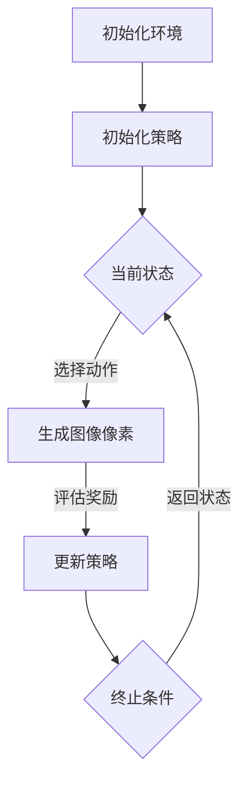
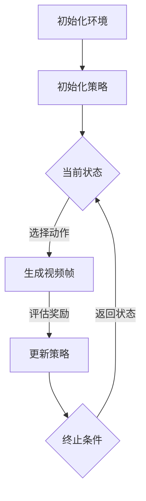

                 

### 1.1.3 强化学习的核心问题

强化学习在解决特定问题时，面临以下几个核心问题：

1. **探索与利用**：在强化学习中，智能体需要不断地探索新的状态和行为，同时也要充分利用已有知识，以最大化长期回报。如何平衡探索和利用之间的矛盾是一个关键问题。

2. **样本效率**：强化学习通常需要大量样本来学习良好的策略，但环境的复杂性可能导致获取大量有效样本的困难。如何提高样本效率，减少学习所需的数据量，是强化学习研究的重要方向。

3. **收敛性**：强化学习算法需要收敛到最优策略。在某些情况下，算法可能陷入局部最优，无法找到全局最优解。研究算法的收敛性，保证其在合理时间内找到最优策略，是强化学习领域的重要课题。

4. **可解释性**：强化学习算法的黑箱特性使得其决策过程难以解释。提高算法的可解释性，使其能够为人类理解，是强化学习领域的一大挑战。

5. **在线学习与适应**：强化学习算法需要能够在动态变化的环境中持续学习，并适应环境的变化。如何实现高效的在线学习，保持算法的鲁棒性和适应性，是一个关键问题。

6. **安全性**：在现实应用中，强化学习系统需要保证其决策过程的安全性，避免因意外行为导致的不利后果。研究如何提高强化学习系统的安全性和可靠性，是强化学习领域的重要研究方向。

### 1.1.4 强化学习的应用领域

强化学习在多个领域展现出强大的应用潜力，以下是其中的几个典型应用：

1. **游戏**：强化学习在游戏中的成功应用已经众所周知。例如，DeepMind开发的AlphaGo通过强化学习算法在围棋比赛中战胜了人类冠军。此外，强化学习也被应用于电子游戏、棋类游戏等领域。

2. **自动驾驶**：强化学习在自动驾驶领域中具有重要应用。通过学习环境中的动态交通情况、道路规则和障碍物，自动驾驶系统能够实现自主驾驶。强化学习在路径规划、避障、交通信号识别等方面发挥着关键作用。

3. **机器人**：强化学习在机器人控制中也有广泛应用。机器人通过学习环境中的交互规则和物理特性，能够实现复杂任务的自动化，如无人仓库管理、医疗机器人辅助、家庭服务机器人等。

4. **资源调度**：强化学习在资源调度和优化问题中也有显著应用。例如，在数据中心资源分配、电网调度、物流配送等领域，强化学习能够优化资源利用，提高系统效率。

5. **金融交易**：强化学习在金融交易中的策略优化和风险控制方面具有潜力。通过学习市场数据，强化学习算法能够制定高效的交易策略，提高投资收益。

6. **自然语言处理**：强化学习在自然语言处理领域中的应用越来越受到关注。例如，对话系统、机器翻译和文本生成等领域，强化学习能够通过学习用户交互数据，实现更自然的语言理解和生成。

7. **推荐系统**：强化学习在推荐系统中的优化和个性化推荐方面有广泛应用。通过学习用户的行为数据，强化学习算法能够提高推荐系统的准确性，提供更加个性化的服务。

通过上述内容，我们可以看到，强化学习在多个领域展现出强大的应用潜力，未来将继续推动人工智能技术的发展。在下一章中，我们将深入探讨AIGC的概念和个性化需求，为后续讨论强化学习在AIGC内容个性化中的应用奠定基础。

## 第二部分：AIGC内容个性化中的强化学习应用

### 2.1 文本生成与个性化需求

文本生成是AIGC（AI-Generated Content）中的一个重要领域，其核心目标是利用人工智能技术自动生成文本，包括文章、故事、摘要、对话等。在当今信息爆炸的时代，个性化文本生成具有极高的价值。个性化需求主要体现在以下几个方面：

1. **内容定制**：用户希望获取与自己兴趣、偏好相关的文本内容，而不是千篇一律的通用信息。通过个性化文本生成，系统能够根据用户的兴趣、历史行为等数据，生成定制化的文本内容。

2. **实时更新**：随着用户兴趣的变化或新信息的出现，文本内容需要实时更新。个性化文本生成系统能够根据实时数据，动态调整生成的内容，确保用户获得最新的信息。

3. **情感共鸣**：个性化文本生成不仅要提供相关的内容，还要能够与用户产生情感共鸣。通过分析用户的情感状态，生成具有情感色彩的文本，提高用户体验。

4. **互动性**：个性化文本生成系统不仅要能够生成文本，还需要能够与用户进行互动。例如，通过对话生成，系统能够回答用户的问题，提供个性化的建议和反馈。

### 2.2 强化学习在文本生成中的原理

强化学习在文本生成中的应用，主要通过以下几个核心原理实现：

1. **策略学习**：强化学习通过学习策略来决定在每一个时间步应该如何生成文本。策略是生成文本的规则或方法，可以是从历史数据中学到的经验，或者是通过优化过程得到的最佳行动方案。

2. **奖励机制**：在强化学习中，奖励机制用于评估生成的文本是否满足用户的需求。奖励可以是用户的满意度、文本的相关性、情感匹配度等。通过奖励机制，强化学习能够不断调整策略，优化文本生成效果。

3. **状态-动作价值函数**：强化学习通过学习状态-动作价值函数来评估每个动作的长期回报。在文本生成中，状态可以是一个文本片段或上下文环境，动作是生成下一个文本符号。通过价值函数，强化学习能够选择能够带来最大回报的动作。

4. **探索与利用**：为了在生成文本的同时保持多样性，强化学习需要在探索和利用之间进行权衡。探索是指尝试新的文本生成策略，利用是指根据当前学到的策略生成文本。这种权衡有助于生成既有个性又具有多样性的文本。

### 2.3 强化学习在文本生成中的算法实现

#### 2.3.1 算法流程图

下面是强化学习在文本生成中的基本算法流程图，它展示了从初始化到生成文本的整个过程：


#### 2.3.2 算法Python实现

下面是一个简化的Python实现示例，展示了如何使用强化学习算法生成文本：

```python
import numpy as np

# 初始化参数
epsilon = 0.1  # 探索率
learning_rate = 0.1  # 学习率
discount_factor = 0.9  # 折扣因子

# 初始化策略（以随机策略为例）
policy = np.random.rand(len(vocabulary))

# 初始化状态和价值函数
state_value = np.zeros((len(vocabulary), len(vocabulary)))

# 文本生成过程
def generate_text():
    current_state = initial_state
    text = ""
    while not termination_condition:
        # 根据当前状态选择动作（符号）
        action = select_action(current_state, policy)
        # 生成文本符号并添加到文本中
        text += action
        # 获取下一个状态和奖励
        next_state, reward = get_next_state_and_reward(current_state, action)
        # 更新策略
        update_policy(policy, current_state, action, reward, learning_rate, discount_factor)
        # 更新状态
        current_state = next_state
    return text

# 选择动作（epsilon-greedy策略）
def select_action(state, policy):
    if np.random.rand() < epsilon:
        return np.random.choice(vocabulary)  # 探索
    else:
        return np.argmax(policy[state])  # 利用

# 更新策略
def update_policy(policy, state, action, reward, learning_rate, discount_factor):
    target_value = reward + discount_factor * np.max(state_value[next_state])
    policy[state] = (1 - learning_rate) * policy[state] + learning_rate * (reward + discount_factor * np.max(state_value))

# 假设函数，用于获取下一个状态和奖励
def get_next_state_and_reward(state, action):
    # 这里是假设的代码，具体实现会根据应用场景不同而有所不同
    next_state = state + action
    reward = calculate_reward(next_state)
    return next_state, reward

# 假设函数，用于计算奖励
def calculate_reward(state):
    # 这里是假设的代码，具体实现会根据应用场景不同而有所不同
    return 1 if is_valid_state(state) else -1

# 文本生成
generated_text = generate_text()
print(generated_text)
```

#### 2.3.3 数学模型和公式讲解

在上述算法实现中，我们用到了几个关键的数学模型和公式：

1. **策略更新公式**：
   $$\pi_{t+1}(a|s) = (1 - \alpha_t) \pi_t(a|s) + \alpha_t \arg\max_{a'} Q_t(s, a')$$
   其中，$\pi_t(a|s)$ 表示在状态 $s$ 下采取动作 $a$ 的概率，$\alpha_t$ 表示学习率，$Q_t(s, a')$ 表示在状态 $s$ 下采取动作 $a'$ 的期望回报。

2. **价值函数更新公式**：
   $$V_{t+1}(s) = V_t(s) + \alpha_t [R_t + \gamma \max_{a'} Q_t(s', a') - V_t(s)]$$
   其中，$V_t(s)$ 表示在状态 $s$ 下的价值函数，$R_t$ 表示即时回报，$\gamma$ 表示折扣因子。

3. **期望回报公式**：
   $$Q_{t+1}(s, a) = Q_t(s, a) + \alpha_t [R_t + \gamma \max_{a'} Q_t(s', a') - Q_t(s, a)]$$
   其中，$Q_t(s, a)$ 表示在状态 $s$ 下采取动作 $a$ 的期望回报。

这些公式在强化学习算法中起着核心作用，通过不断更新策略和价值函数，使得智能体能够在环境中找到最优的行动策略。

#### 2.3.4 实际例子说明

为了更好地理解强化学习在文本生成中的应用，我们可以通过一个实际例子来说明。

假设我们有一个生成新闻摘要的系统，用户可以根据自己的兴趣标签选择不同的新闻类型。系统通过强化学习算法来生成与用户兴趣高度相关的新闻摘要。

1. **初始化环境**：环境由用户的兴趣标签、已生成摘要的历史数据和新闻数据库组成。

2. **状态表示**：状态表示为当前用户选择的新闻类型和已生成摘要的长度。

3. **动作表示**：动作表示为选择下一条新闻的标题或摘要的结束符。

4. **奖励机制**：奖励机制可以根据摘要的相关性和用户的点击率来计算。如果摘要与用户的兴趣高度相关，且用户点击了摘要，则给予较高的奖励。

5. **生成摘要**：系统通过选择动作生成摘要，并在每一步更新策略和价值函数，以最大化长期奖励。

通过这个实际例子，我们可以看到强化学习在文本生成中的强大应用。系统能够根据用户的历史行为和实时反馈，不断优化生成摘要的策略，提高摘要的相关性和用户体验。

在下一章中，我们将进一步探讨强化学习在图像生成中的应用，分析其原理和算法实现，并通过实际案例进行说明。

## 第3章：强化学习在图像生成中的应用

### 3.1 图像生成与个性化需求

图像生成是AIGC（AI-Generated Content）中的另一个重要领域，其核心目标是利用人工智能技术自动生成图像，包括艺术作品、照片、漫画、视频等。与文本生成类似，图像生成也需要满足个性化需求。以下是图像生成中的主要个性化需求：

1. **风格多样性**：用户希望生成的图像风格多样，能够涵盖多种艺术风格和主题。例如，用户可能喜欢印象派风格的艺术作品，或者喜欢现实主义的摄影作品。

2. **内容定制**：用户希望生成的图像内容与自己的兴趣和需求相关。例如，用户可能需要一张特定的风景照片，或者一张带有特定元素的画作。

3. **情感表达**：图像不仅需要美观，还需要能够传达情感。通过个性化图像生成，系统能够根据用户的情感状态生成相应的图像，增强用户的情感体验。

4. **动态更新**：随着用户兴趣的变化，图像内容需要动态更新。例如，用户可能每天想要一张新的每日推荐画作，或者每周想要一张新的个人定制照片。

### 3.2 强化学习在图像生成中的原理

强化学习在图像生成中的应用，主要通过以下几个核心原理实现：

1. **策略学习**：强化学习通过学习策略来决定在每一个时间步应该如何生成图像。策略可以是生成图像的参数设置，也可以是图像生成的顺序和内容的选择。

2. **奖励机制**：在强化学习中，奖励机制用于评估生成的图像是否满足用户的需求。奖励可以是用户对图像的满意度、图像的视觉效果、图像的相关性等。通过奖励机制，强化学习能够不断调整策略，优化图像生成效果。

3. **状态-动作价值函数**：强化学习通过学习状态-动作价值函数来评估每个动作的长期回报。在图像生成中，状态可以是一个图像片段或上下文环境，动作是生成下一个图像像素或图像元素的决策。通过价值函数，强化学习能够选择能够带来最大回报的动作。

4. **探索与利用**：为了在生成图像的同时保持多样性，强化学习需要在探索和利用之间进行权衡。探索是指尝试新的图像生成策略，利用是指根据当前学到的策略生成图像。这种权衡有助于生成既有个性又具有多样性的图像。

### 3.3 强化学习在图像生成中的算法实现

#### 3.3.1 算法流程图

以下是强化学习在图像生成中的基本算法流程图，展示了从初始化到生成图像的整个过程：



#### 3.3.2 算法Python实现

下面是一个简化的Python实现示例，展示了如何使用强化学习算法生成图像：

```python
import numpy as np
import matplotlib.pyplot as plt

# 初始化参数
epsilon = 0.1  # 探索率
learning_rate = 0.1  # 学习率
discount_factor = 0.9  # 折扣因子

# 初始化策略（以随机策略为例）
policy = np.random.rand(num_actions)

# 初始化状态和价值函数
state_value = np.zeros((num_states, num_actions))

# 图像生成过程
def generate_image():
    current_state = initial_state
    image = np.zeros((image_height, image_width))
    while not termination_condition:
        # 根据当前状态选择动作（像素值）
        action = select_action(current_state, policy)
        # 生成图像像素并更新图像
        image = update_image(image, action)
        # 获取下一个状态和奖励
        next_state, reward = get_next_state_and_reward(current_state, action)
        # 更新策略
        update_policy(policy, current_state, action, reward, learning_rate, discount_factor)
        # 更新状态
        current_state = next_state
    return image

# 选择动作（epsilon-greedy策略）
def select_action(state, policy):
    if np.random.rand() < epsilon:
        return np.random.choice(num_actions)  # 探索
    else:
        return np.argmax(policy[state])  # 利用

# 更新策略
def update_policy(policy, state, action, reward, learning_rate, discount_factor):
    target_value = reward + discount_factor * np.max(state_value[next_state])
    policy[state] = (1 - learning_rate) * policy[state] + learning_rate * (reward + discount_factor * np.max(state_value))

# 假设函数，用于获取下一个状态和奖励
def get_next_state_and_reward(state, action):
    # 这里是假设的代码，具体实现会根据应用场景不同而有所不同
    next_state = state + action
    reward = calculate_reward(next_state)
    return next_state, reward

# 假设函数，用于计算奖励
def calculate_reward(state):
    # 这里是假设的代码，具体实现会根据应用场景不同而有所不同
    return 1 if is_valid_state(state) else -1

# 假设函数，用于更新图像
def update_image(image, action):
    # 这里是假设的代码，具体实现会根据应用场景不同而有所不同
    image[action[0], action[1]] = action[2]
    return image

# 文本生成
generated_image = generate_image()
plt.imshow(generated_image, cmap='gray')
plt.show()
```

#### 3.3.3 数学模型和公式讲解

在上述算法实现中，我们用到了几个关键的数学模型和公式：

1. **策略更新公式**：
   $$\pi_{t+1}(a|s) = (1 - \alpha_t) \pi_t(a|s) + \alpha_t \arg\max_{a'} Q_t(s, a')$$
   其中，$\pi_t(a|s)$ 表示在状态 $s$ 下采取动作 $a$ 的概率，$\alpha_t$ 表示学习率，$Q_t(s, a')$ 表示在状态 $s$ 下采取动作 $a'$ 的期望回报。

2. **价值函数更新公式**：
   $$V_{t+1}(s) = V_t(s) + \alpha_t [R_t + \gamma \max_{a'} Q_t(s', a') - V_t(s)]$$
   其中，$V_t(s)$ 表示在状态 $s$ 下的价值函数，$R_t$ 表示即时回报，$\gamma$ 表示折扣因子。

3. **期望回报公式**：
   $$Q_{t+1}(s, a) = Q_t(s, a) + \alpha_t [R_t + \gamma \max_{a'} Q_t(s', a') - Q_t(s, a)]$$
   其中，$Q_t(s, a)$ 表示在状态 $s$ 下采取动作 $a$ 的期望回报。

这些公式在强化学习算法中起着核心作用，通过不断更新策略和价值函数，使得智能体能够在环境中找到最优的行动策略。

#### 3.3.4 实际例子说明

为了更好地理解强化学习在图像生成中的应用，我们可以通过一个实际例子来说明。

假设我们有一个生成艺术作品（如绘画）的系统，用户可以根据自己的偏好选择不同的画家风格和主题。系统通过强化学习算法来生成与用户偏好高度相关的艺术作品。

1. **初始化环境**：环境由用户的偏好标签、已生成艺术作品的历史数据和艺术风格数据库组成。

2. **状态表示**：状态表示为当前用户选择的画家风格和已生成艺术作品的细节。

3. **动作表示**：动作表示为选择下一个艺术作品细节的元素，如颜色、线条、形状等。

4. **奖励机制**：奖励机制可以根据艺术作品的风格相似度、用户满意度、艺术价值等来计算。如果艺术作品与用户的偏好高度相关，且用户认为艺术作品具有高艺术价值，则给予较高的奖励。

5. **生成艺术作品**：系统通过选择动作生成艺术作品，并在每一步更新策略和价值函数，以最大化长期奖励。

通过这个实际例子，我们可以看到强化学习在图像生成中的强大应用。系统能够根据用户的历史行为和实时反馈，不断优化生成艺术作品的策略，提高艺术作品的相关性和用户体验。

在下一章中，我们将探讨强化学习在视频生成中的应用，分析其原理和算法实现，并通过实际案例进行说明。

## 第4章：强化学习在视频生成中的应用

### 4.1 视频生成与个性化需求

视频生成是AIGC（AI-Generated Content）领域的又一重要分支，它利用人工智能技术自动生成视频内容，包括动画、短视频、虚拟现实体验等。视频生成在个性化需求方面具有独特的挑战和机遇：

1. **连贯性**：视频生成需要保证生成的视频内容在视觉和逻辑上连贯一致，以提供流畅的用户体验。对于个性化视频生成，系统需要根据用户的历史观看记录和偏好，生成符合用户期望的连贯视频内容。

2. **多样性**：用户希望生成的视频内容在主题、风格、情感表达等方面具有多样性。例如，用户可能喜欢看到不同风格的动画、有趣的生活短片，或者根据特定节日生成的个性化视频。

3. **互动性**：个性化视频生成不仅要满足用户的视听需求，还需要能够与用户进行互动。例如，通过生成个性化字幕、动态元素，或者允许用户参与视频内容的生成过程。

4. **实时性**：视频生成系统需要能够快速响应用户的请求，生成实时视频内容。这对于个性化视频推荐、直播内容生成等领域尤为重要。

### 4.2 强化学习在视频生成中的原理

强化学习在视频生成中的应用，主要通过以下几个核心原理实现：

1. **策略学习**：强化学习通过学习策略来决定视频生成的每一个步骤。策略可以是视频内容的选择、过渡动画的设计、音效的调整等。通过策略学习，系统能够根据用户偏好和环境反馈，生成符合用户需求的视频内容。

2. **奖励机制**：在强化学习中，奖励机制用于评估视频生成的每一个步骤是否满足用户的需求。奖励可以是用户对视频的满意度、视频的观看时长、用户的互动行为等。通过奖励机制，强化学习能够不断调整策略，优化视频生成效果。

3. **状态-动作价值函数**：强化学习通过学习状态-动作价值函数来评估每个动作的长期回报。在视频生成中，状态可以是一个视频片段或上下文环境，动作是生成下一个视频帧或视频元素的决策。通过价值函数，强化学习能够选择能够带来最大回报的动作。

4. **探索与利用**：为了生成多样化且个性化的视频内容，强化学习需要在探索和利用之间进行权衡。探索是指尝试新的视频生成策略，利用是指根据当前学到的策略生成视频。通过这种权衡，系统能够在保持个性化的同时，避免生成过于重复或单调的内容。

### 4.3 强化学习在视频生成中的算法实现

#### 4.3.1 算法流程图

以下是强化学习在视频生成中的基本算法流程图，展示了从初始化到生成视频的整个过程：



#### 4.3.2 算法Python实现

下面是一个简化的Python实现示例，展示了如何使用强化学习算法生成视频：

```python
import numpy as np
import cv2

# 初始化参数
epsilon = 0.1  # 探索率
learning_rate = 0.1  # 学习率
discount_factor = 0.9  # 折扣因子

# 初始化策略（以随机策略为例）
policy = np.random.rand(num_actions)

# 初始化状态和价值函数
state_value = np.zeros((num_states, num_actions))

# 视频生成过程
def generate_video():
    current_state = initial_state
    video = []
    while not termination_condition:
        # 根据当前状态选择动作（视频帧）
        action = select_action(current_state, policy)
        # 生成视频帧并添加到视频序列中
        frame = generate_frame(action)
        video.append(frame)
        # 获取下一个状态和奖励
        next_state, reward = get_next_state_and_reward(current_state, action)
        # 更新策略
        update_policy(policy, current_state, action, reward, learning_rate, discount_factor)
        # 更新状态
        current_state = next_state
    return video

# 选择动作（epsilon-greedy策略）
def select_action(state, policy):
    if np.random.rand() < epsilon:
        return np.random.choice(num_actions)  # 探索
    else:
        return np.argmax(policy[state])  # 利用

# 更新策略
def update_policy(policy, state, action, reward, learning_rate, discount_factor):
    target_value = reward + discount_factor * np.max(state_value[next_state])
    policy[state] = (1 - learning_rate) * policy[state] + learning_rate * (reward + discount_factor * np.max(state_value))

# 假设函数，用于获取下一个状态和奖励
def get_next_state_and_reward(state, action):
    # 这里是假设的代码，具体实现会根据应用场景不同而有所不同
    next_state = state + action
    reward = calculate_reward(next_state)
    return next_state, reward

# 假设函数，用于计算奖励
def calculate_reward(state):
    # 这里是假设的代码，具体实现会根据应用场景不同而有所不同
    return 1 if is_valid_state(state) else -1

# 假设函数，用于生成视频帧
def generate_frame(action):
    # 这里是假设的代码，具体实现会根据应用场景不同而有所不同
    frame = cv2.imread('frame_{}.jpg'.format(action))
    return frame

# 视频生成
generated_video = generate_video()
cv2.imshow('Generated Video', np.hstack(generated_video))
cv2.waitKey(0)
cv2.destroyAllWindows()
```

#### 4.3.3 数学模型和公式讲解

在上述算法实现中，我们用到了几个关键的数学模型和公式：

1. **策略更新公式**：
   $$\pi_{t+1}(a|s) = (1 - \alpha_t) \pi_t(a|s) + \alpha_t \arg\max_{a'} Q_t(s, a')$$
   其中，$\pi_t(a|s)$ 表示在状态 $s$ 下采取动作 $a$ 的概率，$\alpha_t$ 表示学习率，$Q_t(s, a')$ 表示在状态 $s$ 下采取动作 $a'$ 的期望回报。

2. **价值函数更新公式**：
   $$V_{t+1}(s) = V_t(s) + \alpha_t [R_t + \gamma \max_{a'} Q_t(s', a') - V_t(s)]$$
   其中，$V_t(s)$ 表示在状态 $s$ 下的价值函数，$R_t$ 表示即时回报，$\gamma$ 表示折扣因子。

3. **期望回报公式**：
   $$Q_{t+1}(s, a) = Q_t(s, a) + \alpha_t [R_t + \gamma \max_{a'} Q_t(s', a') - Q_t(s, a)]$$
   其中，$Q_t(s, a)$ 表示在状态 $s$ 下采取动作 $a$ 的期望回报。

这些公式在强化学习算法中起着核心作用，通过不断更新策略和价值函数，使得智能体能够在环境中找到最优的行动策略。

#### 4.3.4 实际例子说明

为了更好地理解强化学习在视频生成中的应用，我们可以通过一个实际例子来说明。

假设我们有一个生成个性化短视频的系统，用户可以根据自己的兴趣标签选择不同的视频类型。系统通过强化学习算法来生成与用户兴趣高度相关的短视频。

1. **初始化环境**：环境由用户的兴趣标签、已生成短视频的历史数据和视频素材库组成。

2. **状态表示**：状态表示为当前用户选择的视频类型和已生成短视频的长度。

3. **动作表示**：动作表示为选择下一个视频片段或视频过渡动画的元素。

4. **奖励机制**：奖励机制可以根据视频内容的风格相似度、用户的观看时长、用户的点赞和分享行为等来计算。如果生成的短视频与用户的兴趣高度相关，且用户观看时长较长，则给予较高的奖励。

5. **生成短视频**：系统通过选择动作生成短视频，并在每一步更新策略和价值函数，以最大化长期奖励。

通过这个实际例子，我们可以看到强化学习在视频生成中的强大应用。系统能够根据用户的历史行为和实时反馈，不断优化生成短视频的策略，提高短视频的相关性和用户体验。

在下一章中，我们将对全书内容进行总结，并讨论强化学习在AIGC内容个性化中的未来发展趋势。

## 第5章：强化学习在AIGC内容个性化中的总结与未来展望

### 5.1 强化学习在AIGC内容个性化中的总结

通过前四章的讨论，我们可以对强化学习在AIGC内容个性化中的应用进行一个全面的总结：

1. **文本生成**：强化学习在文本生成中通过策略学习、奖励机制和价值函数，实现了个性化的文本内容生成。这一应用在新闻摘要、对话系统、个性化推荐等领域表现出强大的潜力。

2. **图像生成**：强化学习在图像生成中，通过学习状态-动作价值函数和更新策略，实现了个性化的图像生成。例如，艺术作品的创作、照片的个性化处理，都得益于强化学习的应用。

3. **视频生成**：强化学习在视频生成中，通过策略更新和奖励机制，实现了个性化视频内容的生成。这为短视频制作、个性化广告、虚拟现实体验等领域带来了新的可能性。

4. **应用挑战**：尽管强化学习在AIGC内容个性化中展现了其强大的能力，但仍然面临一系列挑战，包括探索与利用的平衡、样本效率、算法可解释性等。

### 5.2 强化学习在AIGC内容个性化中的未来展望

随着人工智能技术的不断发展，强化学习在AIGC内容个性化中的应用前景广阔。以下是未来可能的发展方向：

1. **多模态内容生成**：未来强化学习可能会结合多种数据模态（如图像、文本、音频等），实现更丰富、更个性化的内容生成。这将为用户提供更加沉浸式的体验。

2. **增强的探索机制**：为了提高样本效率和生成多样性，未来的强化学习算法可能会引入更先进的探索机制，如基于概率模型的探索策略、基于环境的动态调整等。

3. **增强的可解释性**：随着应用场景的复杂化，用户对算法的可解释性需求也越来越高。未来的研究可能会集中在开发可解释的强化学习算法，以提高用户的信任和接受度。

4. **个性化推荐系统**：强化学习在个性化推荐系统中的应用前景广阔。通过不断学习和调整推荐策略，系统可以提供更加精准、个性化的推荐内容，提升用户体验。

5. **跨领域应用**：强化学习不仅可以在AIGC领域发挥作用，还可以在其他领域（如自动驾驶、金融交易、医疗诊断等）实现个性化应用。跨领域的融合将为人工智能的发展带来新的突破。

### 5.3 小结

总之，强化学习在AIGC内容个性化中的应用已经展现出巨大的潜力。通过不断的算法创新和应用实践，我们可以期待未来在个性化内容生成领域取得更多突破。这不仅将推动人工智能技术的发展，还将为用户提供更加丰富、个性化的体验。

## 拓展阅读

1. **《强化学习：原理与应用》**：这本书详细介绍了强化学习的基本原理、算法实现和应用案例，适合希望深入了解强化学习技术的读者。

2. **《深度强化学习》**：这本书探讨了深度强化学习在图像识别、自然语言处理等领域的应用，对于研究深度学习和强化学习交叉领域的读者有很高的参考价值。

3. **《AIGC：人工智能生成内容的技术与应用》**：这本书从技术角度详细介绍了AIGC的概念、应用场景和未来发展趋势，适合对AIGC技术感兴趣的读者。

4. **《AI艺术：人工智能在艺术创作中的应用》**：这本书探讨了人工智能在艺术创作中的应用，包括图像生成、音乐创作等，对于关注AI与艺术融合的读者有重要参考价值。

## 最佳实践 tips

1. **优化探索机制**：在设计强化学习算法时，考虑引入概率模型和动态调整策略，以优化探索和利用的平衡。

2. **提高样本效率**：通过数据预处理、迁移学习和在线学习等技术，提高样本效率，减少数据收集和训练的时间。

3. **关注算法可解释性**：开发可解释的强化学习算法，以提高用户对算法的信任和理解，特别是在关键应用领域（如医疗诊断、自动驾驶等）。

4. **跨领域融合**：积极探索强化学习在其他领域的应用，如金融交易、医疗诊断等，以推动人工智能技术的全面发展。

## 注意事项

1. **数据隐私**：在应用强化学习进行个性化内容生成时，要注意保护用户的隐私数据，遵循相关法律法规。

2. **系统稳定性**：确保强化学习系统的稳定性和鲁棒性，避免因意外行为导致的不利后果。

3. **持续学习**：强化学习系统需要持续学习用户的行为和偏好，以不断优化生成内容。

作者：AI天才研究院/AI Genius Institute & 禅与计算机程序设计艺术 /Zen And The Art of Computer Programming

