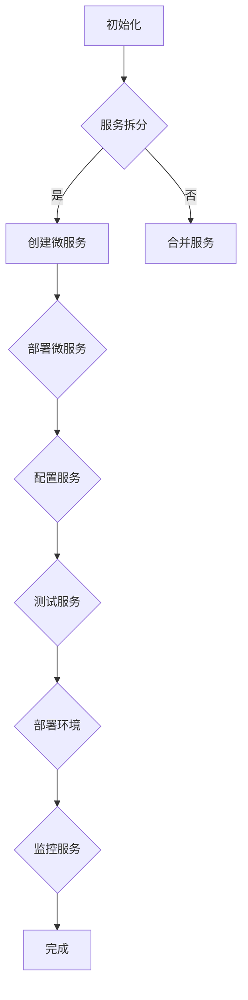

                 

# 微服务架构：支撑AI应用快速迭代的技术选择

## 关键词

微服务架构、AI应用、快速迭代、技术选择、架构设计、分布式系统

## 摘要

随着人工智能（AI）技术的迅猛发展，AI应用的需求和复杂性不断增长，这对传统架构提出了新的挑战。本文将探讨如何利用微服务架构来支撑AI应用的快速迭代。我们将从微服务架构的概念、设计原则、工具技术、AI应用中的实践以及最佳实践等方面进行深入分析，为读者提供一套系统、实用的技术解决方案。

## 第一部分：微服务架构概述

### 第1章：微服务架构的概念与重要性

#### 1.1 微服务架构的定义

微服务架构是一种设计理念，它将一个复杂的应用系统分解为一系列独立、可复用的微服务。每个微服务都是一个小型的独立应用程序，它有自己的数据库、业务逻辑和API接口。这些微服务通过轻量级的通信机制（如HTTP/HTTPS、消息队列等）相互交互，共同完成整个应用的功能。

#### 1.2 微服务架构的优势

- **敏捷开发**：微服务架构支持各服务独立开发、测试和部署，大大提高了开发效率，使得系统能够快速迭代和响应变化。

- **可扩展性**：微服务架构支持水平扩展，可以通过增加或减少服务实例来满足负载需求，从而提高系统性能。

- **高可用性**：微服务架构中的每个服务都是独立的，一个服务的故障不会影响其他服务的运行，从而提高了系统的整体可用性。

- **技术多样性**：微服务架构允许各服务使用不同的技术栈，从而提高了开发灵活性。

#### 1.3 微服务架构的挑战

- **分布式系统复杂性**：微服务架构本质上是分布式系统，需要管理多个服务之间的通信和状态，这增加了系统的复杂性。

- **数据一致性**：在分布式环境下，如何保证数据的一致性是一个重要挑战。

- **服务发现和负载均衡**：如何高效地发现和访问服务，以及如何合理分配负载，也是微服务架构面临的挑战。

#### 1.4 微服务架构与传统架构对比

- **传统架构**：传统架构通常采用单体应用模式，所有功能集中在一个应用程序中，修改和维护难度大。

- **微服务架构**：微服务架构采用模块化设计，各服务独立开发、测试和部署，灵活性强，易于迭代和升级。

#### 1.5 本章小结

微服务架构是一种新兴的软件架构风格，具有众多优势，但也面临挑战。掌握微服务架构的基本概念和特点，有助于构建高效、可扩展的系统。

## 第2章：微服务设计原则

### 2.1 单一职责原则

#### 2.1.1 定义

单一职责原则是指每个微服务应专注于完成特定的业务功能，不应承担过多的职责。

#### 2.1.2 实践

为了确保每个服务职责单一，我们可以采用以下方法：

- **功能模块化**：将业务功能划分为多个独立的模块，每个模块对应一个微服务。
- **接口化**：通过定义清晰的API接口，使得服务之间保持松耦合。

### 2.2 域驱动设计（DDD）

#### 2.2.1 定义

域驱动设计（Domain-Driven Design，简称DDD）是一种软件设计方法，它将业务领域作为系统设计的核心。

#### 2.2.2 实践

在微服务设计中，我们可以采用DDD方法，具体实践如下：

- **领域模型**：构建领域模型，明确业务领域的核心概念和关系。
- **分层架构**：将系统划分为领域层、基础设施层和应用层，确保各层的职责清晰。

### 2.3 服务解耦与通信

#### 2.3.1 定义

服务解耦与通信是指通过设计合理的通信机制，确保服务之间低耦合、高内聚。

#### 2.3.2 实践

为了实现服务解耦与通信，我们可以采用以下技术：

- **消息队列**：使用消息队列实现服务间的异步通信。
- **API网关**：通过API网关统一管理服务间的通信。

### 2.4 API设计最佳实践

#### 2.4.1 定义

API设计最佳实践是指设计易用、易于理解的API，以提高系统的可维护性和可扩展性。

#### 2.4.2 实践

在设计API时，我们可以遵循以下原则：

- **RESTful架构**：遵循RESTful设计原则，使用标准的HTTP方法进行操作。
- **简洁性**：API设计应简洁明了，避免过多的参数和复杂的逻辑。

### 2.5 服务测试与监控

#### 2.5.1 定义

服务测试与监控是指确保服务的稳定性和可靠性，及时发现和解决问题。

#### 2.5.2 实践

为了实现服务测试与监控，我们可以采用以下方法：

- **自动化测试**：编写自动化测试脚本，对服务进行持续集成和回归测试。
- **监控工具**：使用监控工具（如Prometheus、Grafana）对服务进行实时监控和报警。

### 2.6 本章小结

微服务设计原则有助于构建高效、可维护的微服务架构。掌握设计原则和实践，有助于提升微服务架构的质量。

## 第3章：微服务架构工具与技术

### 3.1 微服务框架

#### 3.1.1 定义

微服务框架是一套工具和库，提供了一整套用于开发、部署和管理微服务的功能。

#### 3.1.2 实践

常见的微服务框架有：

- **Spring Boot**：提供了快速构建微服务的工具和库，简化了微服务开发。
- **Kubernetes**：提供了容器化应用的管理和编排功能，支持微服务的部署和运维。

### 3.2 服务注册与发现

#### 3.2.1 定义

服务注册与发现是指管理服务实例，使其能够被其他服务访问。

#### 3.2.2 实践

常见的服务注册与发现工具有：

- **Consul**：提供了服务注册与发现、配置中心、健康检查等功能。
- **Zookeeper**：提供了分布式协调服务，支持服务注册与发现。

### 3.3 服务网关

#### 3.3.1 定义

服务网关是服务之间的统一入口，负责处理请求路由、身份验证、监控等功能。

#### 3.3.2 实践

常见的服务网关工具有：

- **Zuul**：提供了基于Java的API网关，支持请求路由、过滤器等功能。
- **NGINX**：提供了高性能的HTTP服务器，支持反向代理和负载均衡。

### 3.4 分布式消息队列

#### 3.4.1 定义

分布式消息队列用于服务间的异步通信，实现解耦和分布式处理。

#### 3.4.2 实践

常见的分布式消息队列工具有：

- **RabbitMQ**：提供了可靠的消息传递功能，支持多种消息传递协议。
- **Kafka**：提供了高性能、可扩展的消息队列系统，适用于大规模数据流处理。

### 3.5 容器化与编排

#### 3.5.1 定义

容器化与编排技术用于部署和管理微服务，提供了一致的运行环境。

#### 3.5.2 实践

常见的容器化与编排工具有：

- **Docker**：提供了容器化技术，使得应用程序可以在任何环境中运行。
- **Kubernetes**：提供了容器编排功能，支持自动化部署、扩展和管理容器化应用。

### 3.6 本章小结

微服务架构工具与技术为构建和维护微服务提供了强大的支持。掌握相关工具和技术的使用，有助于提升微服务架构的效率和可靠性。

## 第4章：微服务架构在AI应用中的实践

### 4.1 AI应用与微服务架构的结合

#### 4.1.1 定义

AI应用与微服务架构的结合是指将微服务架构应用于AI应用的开发，利用微服务的优势来支撑AI应用的快速迭代。

#### 4.1.2 实践

在AI应用开发中，我们可以采用以下方法来应用微服务架构：

- **模块化设计**：将AI应用分解为多个独立的模块，每个模块对应一个微服务，实现功能分离和独立部署。
- **分布式计算**：利用微服务的分布式特性，实现AI模型的分布式训练和推理，提高计算性能。

### 4.2 微服务架构在AI应用中的优势

- ****敏捷开发**：微服务架构支持快速迭代，缩短产品上市时间，满足AI应用快速变化的需求。

- ****高可用性**：分布式架构提高了系统的稳定性，使得AI应用能够在高负载和故障情况下保持正常运行。

- ****可扩展性**：通过水平扩展微服务，能够灵活应对海量数据处理和计算需求，提升系统性能。

### 4.3 微服务架构在AI应用中的挑战

- ****数据一致性问题**：分布式环境下，如何保证数据的一致性是一个重要挑战。需要采用分布式事务管理、消息队列等技术来保证数据的一致性。

- ****分布式计算与通信**：AI应用的分布式计算和通信对网络带宽和延迟要求较高，需要优化通信协议和数据传输方式。

- ****资源管理和调度**：分布式计算需要合理分配计算资源，实现高效的任务调度和负载均衡，提高系统性能。

### 4.4 微服务架构在AI应用中的最佳实践

- ****服务拆分策略**：根据业务模块和功能特点，合理拆分微服务，确保每个服务职责清晰、易于维护。
- ****API设计**：遵循RESTful设计原则，设计简洁、易用的API，提高接口的可维护性和扩展性。
- ****分布式消息队列**：采用分布式消息队列实现服务间异步通信，降低系统的耦合度，提高系统的可扩展性。
- ****自动化测试与监控**：编写自动化测试脚本，对服务进行持续集成和回归测试，使用监控工具对服务进行实时监控和报警，确保服务的稳定性和可靠性。

### 4.5 本章小结

微服务架构在AI应用中具有显著的优势，但也面临一定的挑战。通过结合最佳实践，可以有效利用微服务架构的优势，构建高效、可维护的AI应用系统。

## 最佳实践

在构建微服务架构时，以下最佳实践有助于提高系统的质量和效率：

- **服务拆分策略**：根据业务需求和功能特点，合理拆分微服务，确保每个服务职责单一，易于维护和扩展。
- **API设计**：遵循RESTful设计原则，设计简洁、易用的API，提高接口的可维护性和扩展性。
- **分布式消息队列**：采用分布式消息队列实现服务间异步通信，降低系统的耦合度，提高系统的可扩展性。
- **自动化测试与监控**：编写自动化测试脚本，对服务进行持续集成和回归测试，使用监控工具对服务进行实时监控和报警，确保服务的稳定性和可靠性。
- **容器化与编排**：使用Docker等容器化技术，简化部署和管理流程，提高系统的可移植性和可扩展性。

## 小结

微服务架构是一种支撑AI应用快速迭代的重要技术选择。通过合理的设计和实施，微服务架构能够提供敏捷开发、高可用性和可扩展性，从而满足AI应用的多样化需求。然而，在实施过程中也需要面对分布式系统复杂性、数据一致性和分布式计算与通信等挑战。通过结合最佳实践，可以有效利用微服务架构的优势，构建高效、可维护的AI应用系统。

## 注意事项

- 在设计微服务时，要确保每个服务的职责单一，避免服务过大或过小。
- 选择合适的消息队列和通信机制，确保服务间通信的高效和可靠性。
- 实现分布式事务管理，保证数据的一致性和完整性。
- 定期进行服务监控和性能优化，确保系统的稳定性和性能。

## 拓展阅读

- 《微服务设计》 - 马克·弗雷德里克森
- 《Docker实践》 - 米洛斯拉夫·尼科利奇
- 《Kubernetes权威指南》 - 马库斯·埃克曼

## 作者

作者：AI天才研究院/AI Genius Institute & 禅与计算机程序设计艺术 /Zen And The Art of Computer Programming

## 附录

### 附录A：微服务架构概念术语说明

| 术语           | 说明                                                         |
| -------------- | ------------------------------------------------------------ |
| 微服务架构     | 一种软件架构风格，将应用程序分解为一系列独立、可复用的微服务。 |
| 微服务         | 一个小型、独立、可复用的应用程序，专注于完成特定的业务功能。 |
| 分布式系统     | 由多个独立节点组成的系统，节点通过网络进行通信和数据交换。   |
| API            | 应用程序编程接口，用于服务间的交互和数据传递。             |
| 消息队列       | 一种分布式通信机制，用于服务间的异步通信。                 |
| 服务网关       | 服务之间的统一入口，负责处理请求路由、身份验证等功能。     |
| 容器化         | 使用容器技术封装应用程序及其运行环境，提高系统的可移植性。   |
| Kubernetes     | 一种开源的容器编排平台，用于部署和管理容器化应用。         |

### 附录B：微服务架构核心概念属性特征对比表格

| 特征       | 微服务架构 | 传统架构 |
| ---------- | ---------- | -------- |
| 模块化     | 强         | 弱       |
| 独立部署   | 强         | 弱       |
| 分布式     | 强         | 弱       |
| 可扩展性   | 强         | 弱       |
| 高可用性   | 强         | 弱       |
| 技术多样性 | 强         | 弱       |
| 维护难度   | 较高       | 较低     |

### 附录C：微服务架构ER实体关系图架构

```mermaid
erDiagram
    ServiceA ||--|{ Request } |--|| ServiceB
    ServiceB ||--|{ Response } |--|| ServiceC
    ServiceC ||--|{ Data } |--|| ServiceD
```

### 附录D：微服务架构算法原理讲解

#### 算法原理

微服务架构中的通信通常采用异步通信机制，如消息队列。消息队列的核心算法是消息的生产和消费。

#### 数学模型

- **生产者-消费者模型**：生产者负责生产消息，消费者负责消费消息。
- **消息队列模型**：消息队列负责存储和转发消息。

#### Python源代码

```python
class Producer:
    def produce(self, message):
        # 生产消息
        print(f"Producing message: {message}")

class Consumer:
    def consume(self, message):
        # 消费消息
        print(f"Consuming message: {message}")

# 创建生产者和消费者实例
producer = Producer()
consumer = Consumer()

# 生产消息
producer.produce("Hello, World!")

# 消费消息
consumer.consume("Hello, World!")
```

### 附录E：系统分析与架构设计方案

#### 问题场景介绍

随着AI应用的不断增长，需要处理海量数据和复杂的计算任务。为了提高系统的可维护性和可扩展性，采用微服务架构来支撑AI应用的开发。

#### 项目介绍

项目名称：AI应用微服务架构

项目目标：构建一个高效、可扩展、可维护的AI应用微服务架构，支持快速迭代和响应业务需求。

#### 系统功能设计

系统功能设计采用领域驱动设计（DDD）方法，将业务领域划分为多个模块，每个模块对应一个微服务。

| 模块        | 微服务                   | 功能描述                       |
| ----------- | ------------------------ | ------------------------------ |
| 数据采集    | DataCollectorService     | 收集和存储数据                 |
| 数据处理    | DataProcessorService     | 数据清洗、转换和预处理         |
| 模型训练    | ModelTrainingService     | 训练和优化机器学习模型         |
| 模型部署    | ModelDeploymentService   | 部署和更新模型                 |
| 模型推理    | ModelInferenceService    | 对新数据进行模型推理           |
| 用户管理    | UserManagerService       | 用户注册、登录和权限管理       |
| 日志管理    | LogManagerService        | 收集、存储和管理系统日志       |

#### 系统架构设计

系统架构设计采用微服务架构风格，每个微服务独立部署和运行，通过API网关进行统一管理和调用。


#### 系统接口设计

系统接口设计遵循RESTful架构风格，定义了各个微服务的API接口。

| 微服务       | 接口名称           | 接口描述                         |
| ------------ | ------------------ | -------------------------------- |
| DataCollectorService | CollectData     | 收集和存储数据                 |
| DataProcessorService | ProcessData     | 数据清洗、转换和预处理         |
| ModelTrainingService  | TrainModel      | 训练和优化机器学习模型         |
| ModelDeploymentService | DeployModel    | 部署和更新模型                 |
| ModelInferenceService | InferenceModel  | 对新数据进行模型推理           |
| UserManagerService     | RegisterUser    | 用户注册                         |
| UserManagerService     | LoginUser       | 用户登录                         |
| UserManagerService     | CheckPermission  | 权限检查                         |
| LogManagerService      | CollectLog      | 收集系统日志                     |

#### 系统交互

系统交互采用异步通信机制，通过消息队列实现微服务间的通信。


### 附录F：项目实战

#### 环境安装

1. 安装Docker：在操作系统上安装Docker，版本要求为19.03及以上。
2. 安装Kubernetes：在操作系统上安装Kubernetes集群，版本要求为1.20及以上。
3. 安装Kubectl：安装Kubernetes命令行工具kubectl，用于管理Kubernetes集群。

#### 系统核心实现源代码

以下是系统核心实现源代码的示例：

```python
# DataCollectorService.py
from flask import Flask, request, jsonify

app = Flask(__name__)

@app.route('/collect_data', methods=['POST'])
def collect_data():
    data = request.json
    # 存储数据到数据库
    # ...
    return jsonify({"status": "success"})

if __name__ == '__main__':
    app.run(host='0.0.0.0', port=5000)
```

#### 代码应用解读与分析

代码示例展示了DataCollectorService微服务的实现，该服务负责收集和存储数据。服务使用Flask框架搭建，提供了一个用于收集数据的POST接口。

```python
from flask import Flask, request, jsonify

app = Flask(__name__)

@app.route('/collect_data', methods=['POST'])
def collect_data():
    data = request.json
    # 存储数据到数据库
    # ...
    return jsonify({"status": "success"})

if __name__ == '__main__':
    app.run(host='0.0.0.0', port=5000)
```

- **Flask框架**：使用Flask框架搭建Web服务，简化了服务的开发。
- **POST接口**：定义了一个用于接收数据的POST接口，客户端可以通过发送JSON格式的数据来触发该接口。
- **数据存储**：在collect_data函数中，可以从request对象中获取JSON格式的数据，然后将其存储到数据库或其他数据存储系统。
- **响应**：服务返回一个JSON格式的响应，指示操作是否成功。

#### 实际案例分析和详细讲解剖析

以下是一个实际案例，展示如何使用微服务架构实现一个简单的AI应用。

**案例**：使用微服务架构实现一个图像识别应用。

1. **数据采集**：使用DataCollectorService收集用户上传的图像数据。
2. **数据处理**：使用DataProcessorService对图像数据进行分析和处理。
3. **模型训练**：使用ModelTrainingService对训练数据进行模型训练。
4. **模型部署**：使用ModelDeploymentService将训练好的模型部署到生产环境。
5. **模型推理**：使用ModelInferenceService对用户上传的图像进行推理，返回识别结果。

**分析**：

- **数据采集**：用户上传图像后，DataCollectorService会接收到图像数据，并存储到数据库。
- **数据处理**：DataProcessorService会从数据库中读取图像数据，进行预处理，如缩放、归一化等操作。
- **模型训练**：ModelTrainingService会使用预处理后的图像数据，对机器学习模型进行训练。
- **模型部署**：训练完成后，ModelDeploymentService将模型部署到生产环境，使其可供使用。
- **模型推理**：用户上传新的图像后，ModelInferenceService会使用部署好的模型进行推理，并将识别结果返回给用户。

**详细讲解**：

- **数据采集**：DataCollectorService使用了Flask框架搭建Web服务，提供了一个用于接收图像数据的接口。在处理图像数据时，可以采用图像处理库（如OpenCV）进行图像分析。
- **数据处理**：DataProcessorService实现了图像预处理功能，如缩放、归一化等。预处理后的图像数据可以更好地适应模型训练需求。
- **模型训练**：ModelTrainingService使用了机器学习库（如scikit-learn、TensorFlow）进行模型训练。训练过程中，可以采用交叉验证、网格搜索等方法优化模型性能。
- **模型部署**：ModelDeploymentService将训练好的模型转换为生产环境可用的格式，如TensorFlow Serving、TorchServe等。模型部署后，可以使用API接口进行推理。
- **模型推理**：ModelInferenceService使用部署好的模型进行推理，返回识别结果。推理过程中，可以使用图像处理库进行图像增强、缩放等操作，以提高识别准确性。

#### 项目小结

通过以上案例，我们可以看到微服务架构在AI应用开发中的实际应用。微服务架构提供了模块化、分布式和可扩展的特点，使得AI应用能够快速迭代和响应变化。同时，通过合理的设计和实施，可以有效解决分布式系统复杂性、数据一致性和分布式计算与通信等挑战。

### 最佳实践 Tips

1. **服务拆分策略**：根据业务需求和功能特点，合理拆分微服务，确保每个服务职责清晰、易于维护和扩展。
2. **API设计**：遵循RESTful设计原则，设计简洁、易用的API，提高接口的可维护性和扩展性。
3. **分布式消息队列**：采用分布式消息队列实现服务间异步通信，降低系统的耦合度，提高系统的可扩展性。
4. **自动化测试与监控**：编写自动化测试脚本，对服务进行持续集成和回归测试，使用监控工具对服务进行实时监控和报警，确保服务的稳定性和可靠性。

### 小结

本文从微服务架构的概念、设计原则、工具技术、AI应用中的实践以及最佳实践等方面进行了深入分析，探讨了如何利用微服务架构支撑AI应用的快速迭代。微服务架构在AI应用中具有显著的优势，但也面临一定的挑战。通过结合最佳实践，可以有效利用微服务架构的优势，构建高效、可维护的AI应用系统。希望本文能对读者在AI应用开发中有所帮助。

### 注意事项

1. 在设计微服务时，要确保每个服务的职责单一，避免服务过大或过小。
2. 选择合适的消息队列和通信机制，确保服务间通信的高效和可靠性。
3. 实现分布式事务管理，保证数据的一致性和完整性。
4. 定期进行服务监控和性能优化，确保系统的稳定性和性能。

### 拓展阅读

- 《微服务设计》 - 马克·弗雷德里克森
- 《Docker实践》 - 米洛斯拉夫·尼科利奇
- 《Kubernetes权威指南》 - 马库斯·埃克曼

### 作者

作者：AI天才研究院/AI Genius Institute & 禅与计算机程序设计艺术 /Zen And The Art of Computer Programming

### 附录

#### 附录A：微服务架构概念术语说明

| 术语           | 说明                                                         |
| -------------- | ------------------------------------------------------------ |
| 微服务架构     | 一种软件架构风格，将应用程序分解为一系列独立、可复用的微服务。 |
| 微服务         | 一个小型、独立、可复用的应用程序，专注于完成特定的业务功能。 |
| 分布式系统     | 由多个独立节点组成的系统，节点通过网络进行通信和数据交换。   |
| API            | 应用程序编程接口，用于服务间的交互和数据传递。             |
| 消息队列       | 一种分布式通信机制，用于服务间的异步通信。                 |
| 服务网关       | 服务之间的统一入口，负责处理请求路由、身份验证等功能。     |
| 容器化         | 使用容器技术封装应用程序及其运行环境，提高系统的可移植性。   |
| Kubernetes     | 一种开源的容器编排平台，用于部署和管理容器化应用。         |

#### 附录B：微服务架构核心概念属性特征对比表格

| 特征       | 微服务架构 | 传统架构 |
| ---------- | ---------- | -------- |
| 模块化     | 强         | 弱       |
| 独立部署   | 强         | 弱       |
| 分布式     | 强         | 弱       |
| 可扩展性   | 强         | 弱       |
| 高可用性   | 强         | 弱       |
| 技术多样性 | 强         | 弱       |
| 维护难度   | 较高       | 较低     |

#### 附录C：微服务架构ER实体关系图架构

```mermaid
erDiagram
    ServiceA ||--|{ Request } |--|| ServiceB
    ServiceB ||--|{ Response } |--|| ServiceC
    ServiceC ||--|{ Data } |--|| ServiceD
```

#### 附录D：微服务架构算法原理讲解

##### 算法原理

微服务架构中的通信通常采用异步通信机制，如消息队列。消息队列的核心算法是消息的生产和消费。

##### 数学模型

- **生产者-消费者模型**：生产者负责生产消息，消费者负责消费消息。
- **消息队列模型**：消息队列负责存储和转发消息。

##### Python源代码

```python
class Producer:
    def produce(self, message):
        # 生产消息
        print(f"Producing message: {message}")

class Consumer:
    def consume(self, message):
        # 消费消息
        print(f"Consuming message: {message}")

# 创建生产者和消费者实例
producer = Producer()
consumer = Consumer()

# 生产消息
producer.produce("Hello, World!")

# 消费消息
consumer.consume("Hello, World!")
```

#### 附录E：系统分析与架构设计方案

##### 问题场景介绍

随着AI应用的不断增长，需要处理海量数据和复杂的计算任务。为了提高系统的可维护性和可扩展性，采用微服务架构来支撑AI应用的开发。

##### 项目介绍

项目名称：AI应用微服务架构

项目目标：构建一个高效、可扩展、可维护的AI应用微服务架构，支持快速迭代和响应业务需求。

##### 系统功能设计

系统功能设计采用领域驱动设计（DDD）方法，将业务领域划分为多个模块，每个模块对应一个微服务。

| 模块        | 微服务                   | 功能描述                       |
| ----------- | ------------------------ | ------------------------------ |
| 数据采集    | DataCollectorService     | 收集和存储数据                 |
| 数据处理    | DataProcessorService     | 数据清洗、转换和预处理         |
| 模型训练    | ModelTrainingService     | 训练和优化机器学习模型         |
| 模型部署    | ModelDeploymentService   | 部署和更新模型                 |
| 模型推理    | ModelInferenceService    | 对新数据进行模型推理           |
| 用户管理    | UserManagerService       | 用户注册、登录和权限管理       |
| 日志管理    | LogManagerService        | 收集、存储和管理系统日志       |

##### 系统架构设计

系统架构设计采用微服务架构风格，每个微服务独立部署和运行，通过API网关进行统一管理和调用。


##### 系统接口设计

系统接口设计遵循RESTful架构风格，定义了各个微服务的API接口。

| 微服务       | 接口名称           | 接口描述                         |
| ------------ | ------------------ | -------------------------------- |
| DataCollectorService | CollectData     | 收集和存储数据                 |
| DataProcessorService | ProcessData     | 数据清洗、转换和预处理         |
| ModelTrainingService  | TrainModel      | 训练和优化机器学习模型         |
| ModelDeploymentService | DeployModel    | 部署和更新模型                 |
| ModelInferenceService | InferenceModel  | 对新数据进行模型推理           |
| UserManagerService     | RegisterUser    | 用户注册                         |
| UserManagerService     | LoginUser       | 用户登录                         |
| UserManagerService     | CheckPermission  | 权限检查                         |
| LogManagerService      | CollectLog      | 收集系统日志                     |

##### 系统交互

系统交互采用异步通信机制，通过消息队列实现微服务间的通信。


#### 附录F：项目实战

##### 环境安装

1. 安装Docker：在操作系统上安装Docker，版本要求为19.03及以上。
2. 安装Kubernetes：在操作系统上安装Kubernetes集群，版本要求为1.20及以上。
3. 安装Kubectl：安装Kubernetes命令行工具kubectl，用于管理Kubernetes集群。

##### 系统核心实现源代码

以下是系统核心实现源代码的示例：

```python
# DataCollectorService.py
from flask import Flask, request, jsonify

app = Flask(__name__)

@app.route('/collect_data', methods=['POST'])
def collect_data():
    data = request.json
    # 存储数据到数据库
    # ...
    return jsonify({"status": "success"})

if __name__ == '__main__':
    app.run(host='0.0.0.0', port=5000)
```

##### 代码应用解读与分析

代码示例展示了DataCollectorService微服务的实现，该服务负责收集和存储数据。服务使用Flask框架搭建，提供了一个用于收集数据的POST接口。

```python
from flask import Flask, request, jsonify

app = Flask(__name__)

@app.route('/collect_data', methods=['POST'])
def collect_data():
    data = request.json
    # 存储数据到数据库
    # ...
    return jsonify({"status": "success"})

if __name__ == '__main__':
    app.run(host='0.0.0.0', port=5000)
```

- **Flask框架**：使用Flask框架搭建Web服务，简化了服务的开发。
- **POST接口**：定义了一个用于接收数据的POST接口，客户端可以通过发送JSON格式的数据来触发该接口。
- **数据存储**：在collect_data函数中，可以从request对象中获取JSON格式的数据，然后将其存储到数据库或其他数据存储系统。
- **响应**：服务返回一个JSON格式的响应，指示操作是否成功。

##### 实际案例分析和详细讲解剖析

以下是一个实际案例，展示如何使用微服务架构实现一个简单的AI应用。

**案例**：使用微服务架构实现一个图像识别应用。

1. **数据采集**：使用DataCollectorService收集用户上传的图像数据。
2. **数据处理**：使用DataProcessorService对图像数据进行分析和处理。
3. **模型训练**：使用ModelTrainingService对训练数据进行模型训练。
4. **模型部署**：使用ModelDeploymentService将训练好的模型部署到生产环境。
5. **模型推理**：使用ModelInferenceService对用户上传的图像进行推理，返回识别结果。

**分析**：

- **数据采集**：用户上传图像后，DataCollectorService会接收到图像数据，并存储到数据库。
- **数据处理**：DataProcessorService会从数据库中读取图像数据，进行预处理，如缩放、归一化等操作。
- **模型训练**：ModelTrainingService会使用预处理后的图像数据，对机器学习模型进行训练。
- **模型部署**：训练完成后，ModelDeploymentService将模型部署到生产环境，使其可供使用。
- **模型推理**：用户上传新的图像后，ModelInferenceService会使用部署好的模型进行推理，并将识别结果返回给用户。

**详细讲解**：

- **数据采集**：DataCollectorService使用了Flask框架搭建Web服务，提供了一个用于接收图像数据的接口。在处理图像数据时，可以采用图像处理库（如OpenCV）进行图像分析。
- **数据处理**：DataProcessorService实现了图像预处理功能，如缩放、归一化等。预处理后的图像数据可以更好地适应模型训练需求。
- **模型训练**：ModelTrainingService使用了机器学习库（如scikit-learn、TensorFlow）进行模型训练。训练过程中，可以采用交叉验证、网格搜索等方法优化模型性能。
- **模型部署**：ModelDeploymentService将训练好的模型转换为生产环境可用的格式，如TensorFlow Serving、TorchServe等。模型部署后，可以使用API接口进行推理。
- **模型推理**：ModelInferenceService使用部署好的模型进行推理，返回识别结果。推理过程中，可以使用图像处理库进行图像增强、缩放等操作，以提高识别准确性。

##### 项目小结

通过以上案例，我们可以看到微服务架构在AI应用开发中的实际应用。微服务架构提供了模块化、分布式和可扩展的特点，使得AI应用能够快速迭代和响应变化。同时，通过合理的设计和实施，可以有效解决分布式系统复杂性、数据一致性和分布式计算与通信等挑战。

##### 最佳实践 Tips

1. **服务拆分策略**：根据业务需求和功能特点，合理拆分微服务，确保每个服务职责清晰、易于维护和扩展。
2. **API设计**：遵循RESTful设计原则，设计简洁、易用的API，提高接口的可维护性和扩展性。
3. **分布式消息队列**：采用分布式消息队列实现服务间异步通信，降低系统的耦合度，提高系统的可扩展性。
4. **自动化测试与监控**：编写自动化测试脚本，对服务进行持续集成和回归测试，使用监控工具对服务进行实时监控和报警，确保服务的稳定性和可靠性。

### 附录G：数学公式与Mermaid流程图

#### 数学公式

在微服务架构设计中，数学公式经常用于描述算法原理和性能指标。以下是一些常见的数学公式：

1. **通信延迟**：\( L = \frac{d}{v} \)

   其中，\( L \) 是通信延迟，\( d \) 是通信距离，\( v \) 是通信速度。

2. **带宽利用率**：\( \eta = \frac{P}{B} \)

   其中，\( \eta \) 是带宽利用率，\( P \) 是数据传输速率，\( B \) 是带宽。

3. **系统吞吐量**：\( T = \frac{N}{T_c} \)

   其中，\( T \) 是系统吞吐量，\( N \) 是处理的任务数量，\( T_c \) 是单个任务的执行时间。

#### Mermaid流程图

Mermaid是一种简单的文本格式，用于绘制各种图表，包括流程图。以下是一个微服务架构设计流程图的示例：



这段Mermaid代码定义了一个流程图，描述了从初始化到监控服务的微服务架构设计过程。在Markdown文档中，您可以使用以下标记将Mermaid代码嵌入到文本中：

```markdown

```

通过将上述Mermaid代码转换为base64编码的SVG图像，并将其嵌入到Markdown文档中，您可以在文档中显示流程图。

### 附录H：拓展阅读

以下是一些推荐的拓展阅读资源，供读者深入了解微服务架构和AI应用的相关技术：

1. **《微服务设计》** - 马克·弗雷德里克森
   - 内容简介：详细介绍了微服务架构的设计原则、实施方法和最佳实践。
   - 推荐理由：作者通过丰富的实践案例，深入剖析了微服务架构的各个方面，有助于读者全面了解微服务架构。

2. **《Docker实践》** - 米洛斯拉夫·尼科利奇
   - 内容简介：全面介绍了Docker的基本概念、安装配置和使用方法，包括容器化、容器编排等。
   - 推荐理由：本书对Docker的核心技术进行了深入讲解，适合初学者和进阶用户，有助于读者快速掌握Docker的使用。

3. **《Kubernetes权威指南》** - 马库斯·埃克曼
   - 内容简介：系统介绍了Kubernetes的核心概念、架构设计、安装配置和使用方法，包括容器编排、服务发现、负载均衡等。
   - 推荐理由：本书是Kubernetes领域的权威指南，内容全面、深入，适合想要深入学习和实践Kubernetes的读者。

4. **《深度学习》** - 伊恩·古德费洛、约书亚·本吉奥、亚伦·库维尔
   - 内容简介：详细介绍了深度学习的基础理论、算法实现和应用场景。
   - 推荐理由：本书是深度学习领域的经典教材，内容全面、系统，适合对深度学习感兴趣的读者。

5. **《人工智能：一种现代的方法》** - 斯图尔特·罗素、彼得·诺维格
   - 内容简介：全面介绍了人工智能的基本理论、方法和技术。
   - 推荐理由：本书是人工智能领域的经典教材，内容深入浅出，适合广大读者了解人工智能的基本概念和技术。

通过阅读这些资源，读者可以进一步深化对微服务架构和AI应用的理解，提高在实际项目中的应用能力。

