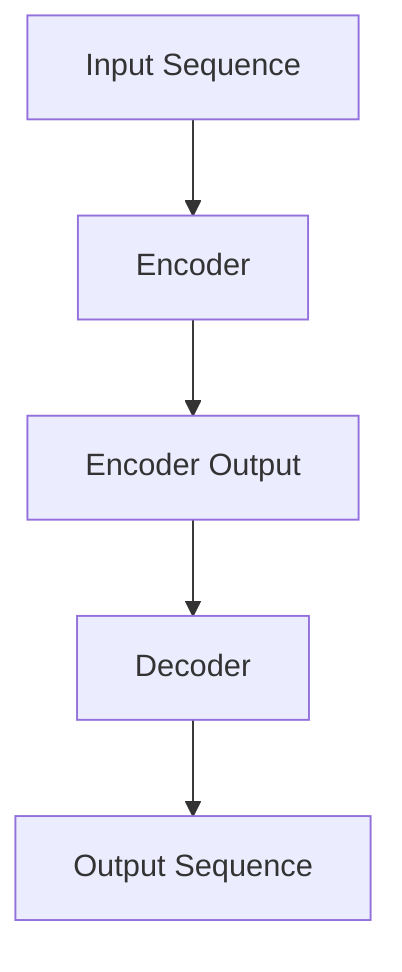
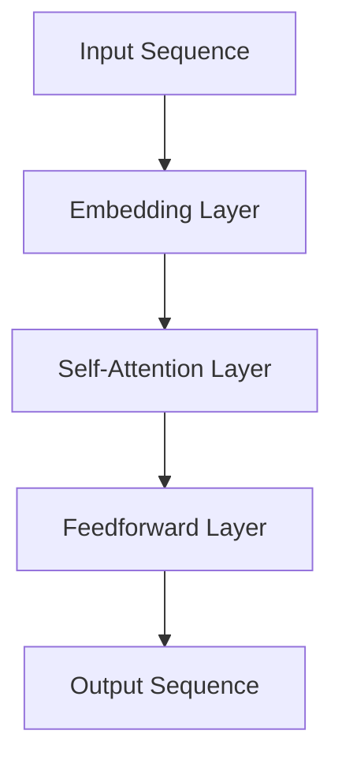
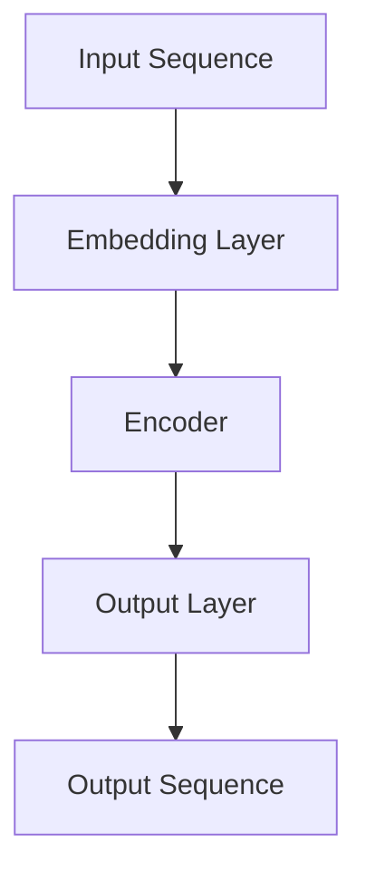
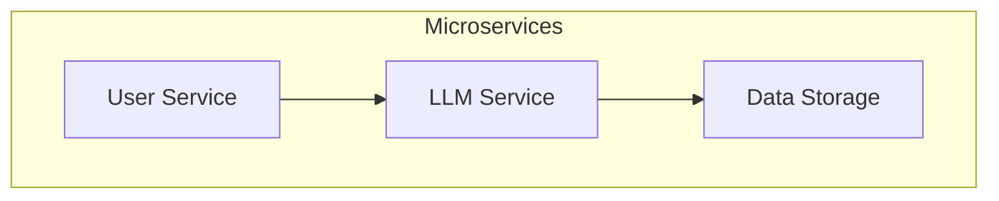
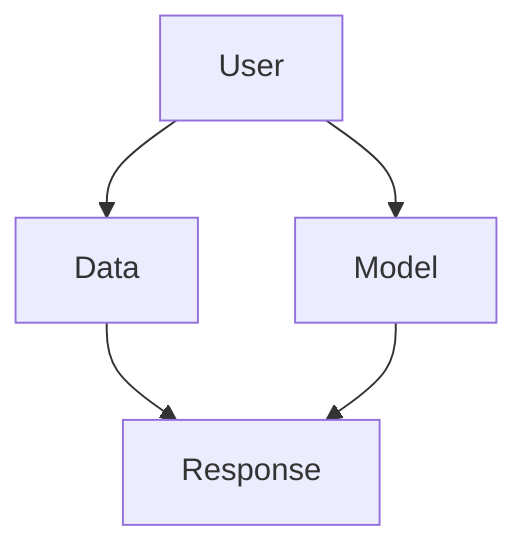
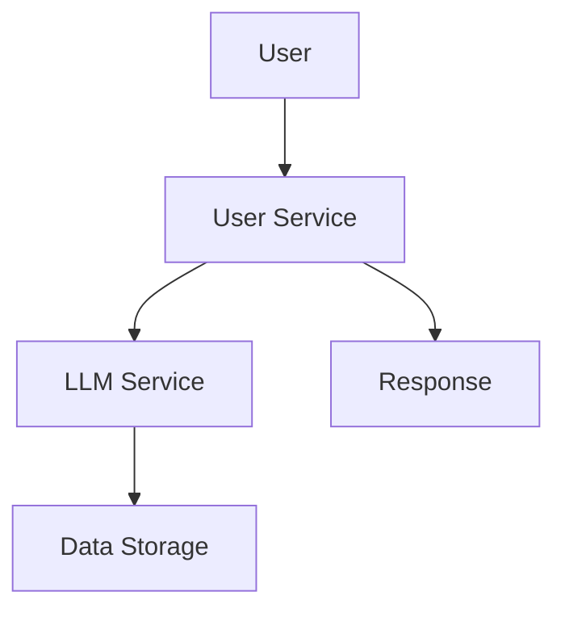

                 

### 快速原型到产品化：LLM应用的演进之路

关键词：**LLM应用、快速原型、产品化、系统设计、算法实现**

摘要：本文旨在探讨从快速原型到产品化过程中的LLM（大型语言模型）应用演进之路。文章首先介绍了快速原型和产品化的背景及重要性，随后详细阐述了LLM的基本概念和原理。接着，我们深入分析了LLM应用中的算法和数学模型，并通过具体的Python代码示例进行了讲解。随后，文章讨论了系统设计与实现的关键步骤，包括架构设计、功能设计和接口设计。最后，通过一个实际项目案例，展示了LLM从原型到产品化的全流程，并提供了最佳实践和未来趋势的展望。

### 1. 引言：快速原型与产品化的背景

在现代软件开发中，快速原型和产品化是两个至关重要的环节。快速原型（Rapid Prototyping）是指在一个相对短的时间内构建出可以运行的软件版本，以便快速验证设计理念和功能实现。这种方法能够有效地减少开发时间和成本，提高团队的灵活性，使产品更快地推向市场。

而产品化（Productization）则是指将一个原型或概念逐步完善，使其具备商业价值和市场竞争力，最终成为一个可持续发展的产品。产品化不仅仅是代码的实现，还包括用户体验设计、性能优化、安全性保障等多个方面。

对于LLM（Large Language Model）应用而言，快速原型和产品化尤为重要。LLM具有处理大规模语言数据的能力，能够实现自然语言理解、生成、翻译等复杂任务。然而，LLM的开发和部署面临着诸多挑战，如训练数据的质量与数量、模型的可解释性、计算资源的消耗等。因此，如何在短时间内构建一个有效的LLM原型，并在后续的产品化过程中不断提升其性能和可靠性，是当前研究与应用的热点问题。

本文将分为以下几个部分：

1. **背景介绍**：详细阐述快速原型和产品化的概念、重要性以及在LLM应用中的挑战。
2. **核心概念与原理**：介绍LLM的基本概念、原理和常见的架构类型。
3. **算法与数学模型**：分析LLM应用中的核心算法，并使用Python代码进行讲解。
4. **系统设计与实现**：讨论系统设计的关键要素，包括架构设计、功能设计和接口设计。
5. **项目实战**：通过一个实际项目案例，展示LLM从原型到产品化的全流程。
6. **最佳实践与未来趋势**：总结LLM应用中的最佳实践，并探讨未来的发展趋势。

### 2. 背景介绍

#### 2.1 快速原型

快速原型是一种敏捷开发方法，其核心思想是通过快速迭代和反馈来加速产品的开发过程。在传统的软件开发流程中，开发者通常需要花费大量的时间编写详尽的文档和需求分析，这可能导致项目延误和资源浪费。而快速原型方法则强调在实际代码中快速实现核心功能，通过用户反馈不断调整和完善。

快速原型的特点包括：

- **快速**：在短时间内构建出一个可以运行的软件版本。
- **迭代**：通过不断迭代，逐步完善产品功能。
- **用户反馈**：注重用户参与，及时获取反馈并进行调整。
- **灵活性**：允许在开发过程中灵活调整需求，降低项目风险。

在LLM应用开发中，快速原型具有重要意义。由于LLM模型的训练和调优过程非常复杂，需要大量的数据和时间，因此通过快速原型可以快速验证模型设计，识别潜在问题，从而节省开发时间和成本。

#### 2.2 产品化

产品化是将一个原型或概念逐步转化为具有商业价值和市场竞争力产品的过程。产品化不仅仅是技术的实现，还包括市场调研、用户体验设计、运营策略等多个方面。

产品化的关键要素包括：

- **市场需求**：明确产品的目标用户和市场定位，确保产品具有市场需求。
- **用户体验**：设计符合用户需求和使用习惯的界面和交互体验。
- **性能优化**：提升产品性能，包括响应速度、稳定性、安全性等。
- **商业化**：制定商业策略，实现产品的商业化运营。
- **持续更新**：根据用户反馈和市场变化，持续更新和优化产品。

在LLM应用的产品化过程中，需要考虑以下几个方面：

- **可解释性**：提高模型的可解释性，使用户能够理解模型的决策过程。
- **计算资源**：优化模型架构和算法，降低计算资源的消耗。
- **安全性**：确保模型训练和部署过程中的数据安全。
- **法规遵从**：遵守相关法律法规，确保产品的合规性。

#### 2.3 LLM应用中的挑战

尽管LLM在自然语言处理领域具有巨大潜力，但其应用过程中仍面临诸多挑战：

- **训练数据质量与数量**：LLM模型的训练依赖于大量的高质量数据，数据的质量和数量直接影响模型的性能。
- **模型可解释性**：用户通常需要了解模型的决策过程，提高模型的可解释性是当前研究的一个重要方向。
- **计算资源消耗**：LLM模型的训练和推理需要大量的计算资源，如何高效地利用资源是一个关键问题。
- **数据隐私和安全性**：在模型训练和部署过程中，如何保护用户数据的隐私和安全是一个重要挑战。

#### 2.4 边界与外延

在讨论快速原型和产品化时，需要明确其边界与外延：

- **边界**：快速原型和产品化专注于软件开发过程的不同阶段，快速原型侧重于验证和迭代，而产品化侧重于完善和商业化。
- **外延**：快速原型和产品化不仅适用于LLM应用，也适用于其他类型的软件开发项目。在不同领域和场景中，其方法和策略可能会有所不同。

### 3. 核心概念与联系

#### 3.1 引言

在深入探讨LLM应用之前，我们需要了解一些核心概念和原理。这些概念包括自然语言处理（NLP）、机器学习（ML）和深度学习（DL）等。通过理解这些概念，我们可以更好地把握LLM的基本原理和应用场景。

#### 3.2 自然语言处理（NLP）

自然语言处理（Natural Language Processing，NLP）是计算机科学和人工智能领域的一个分支，旨在让计算机理解和处理人类自然语言。NLP的关键任务包括文本分类、情感分析、命名实体识别、机器翻译等。

- **文本分类**：将文本数据根据其内容划分为不同的类别。
- **情感分析**：判断文本表达的情感倾向，如正面、负面或中性。
- **命名实体识别**：从文本中识别出具有特定意义的实体，如人名、地名、组织名等。
- **机器翻译**：将一种语言的文本翻译成另一种语言。

NLP的基本概念包括：

- **词袋模型**：将文本表示为一个词汇表，每个词对应一个向量。
- **朴素贝叶斯分类器**：一种基于概率理论的分类算法。
- **循环神经网络（RNN）**：能够处理序列数据的神经网络。

#### 3.3 机器学习（ML）

机器学习（Machine Learning，ML）是一门通过数据或过去经验的指导来学习任务技能的计算机科学分支。ML的核心目标是让计算机能够从数据中自动学习规律，并在未知数据上做出预测或决策。

ML的关键概念包括：

- **监督学习**：通过已标记的数据训练模型，然后在未标记的数据上进行预测。
- **无监督学习**：没有标记的数据，通过模型学习数据中的模式和结构。
- **强化学习**：通过与环境互动，不断调整策略以最大化回报。

常见的ML算法包括：

- **线性回归**：通过线性模型预测连续值。
- **决策树**：通过树形结构进行分类或回归。
- **支持向量机（SVM）**：通过找到一个最优超平面进行分类。

#### 3.4 深度学习（DL）

深度学习（Deep Learning，DL）是一种特殊的机器学习技术，它通过多层神经网络来学习数据中的复杂模式。DL的核心组件是神经元和层，通过前向传播和反向传播算法来训练模型。

DL的关键概念包括：

- **卷积神经网络（CNN）**：通过卷积层提取图像特征。
- **循环神经网络（RNN）**：通过循环结构处理序列数据。
- **生成对抗网络（GAN）**：通过两个神经网络相互对抗来生成新的数据。

常见的DL框架包括：

- **TensorFlow**：由谷歌开发的开源DL框架。
- **PyTorch**：由Facebook开发的开源DL框架。

#### 3.5 LLM的基本原理

LLM（Large Language Model）是一种基于深度学习的自然语言处理模型，通过大规模的文本数据进行训练，能够理解和生成人类语言。LLM的核心原理包括：

- **预训练**：通过无监督学习对大规模文本数据进行预训练，使模型具备语言理解和生成能力。
- **微调**：在预训练的基础上，针对特定任务进行微调，以提升模型在特定任务上的性能。

常见的LLM模型包括：

- **GPT**（Generative Pre-trained Transformer）：由OpenAI开发的Transformer架构的预训练模型。
- **BERT**（Bidirectional Encoder Representations from Transformers）：由Google开发的Transformer架构的双向编码器模型。

#### 3.6 概念属性特征对比表格

为了更好地理解上述概念，我们可以通过一个概念属性特征对比表格来展示它们之间的区别和联系：

| 概念         | 特征                    | 应用场景                          |
| ------------ | ----------------------- | --------------------------------- |
| NLP          | 文本处理、语义理解      | 文本分类、情感分析、命名实体识别  |
| ML           | 自主学习、数据驱动      | 监督学习、无监督学习、强化学习    |
| DL           | 多层神经网络、自动化学习 | 图像识别、语音识别、自然语言处理  |
| LLM          | 大规模文本预训练        | 语言生成、文本理解、机器翻译      |

#### 3.7 ER实体关系图架构

为了更清晰地展示LLM应用的架构，我们可以使用ER（Entity-Relationship）实体关系图来描述。以下是LLM应用的ER图示例：

```mermaid
erDiagram
    User ||--|{ TextData }|-- Product : produces
    TextData ||--|{ LanguageModel }|-- Prediction : predicts
    Product ||--|{ Result }|-- User : receives
    LanguageModel ||--|{ ModelConfig }|-- Product : configures
    Result ||--|{ Feedback }|-- User : provides
```

在这个ER图中，`User`与`Product`之间存在“生产”关系，`TextData`与`LanguageModel`之间存在“预测”关系，`Product`与`Result`之间存在“接收”关系，`LanguageModel`与`ModelConfig`之间存在“配置”关系，`Result`与`Feedback`之间存在“提供”关系。

### 4. 算法与数学模型

#### 4.1 引言

在LLM应用中，算法和数学模型是核心组成部分。本文将介绍LLM应用中的主要算法，包括Transformer、GPT和BERT等，并使用Python代码和Mermaid流程图进行详细讲解。此外，还将解释算法原理和数学模型。

#### 4.2 Transformer算法

Transformer是近年来在自然语言处理领域取得重大突破的一种算法。它基于自注意力机制（Self-Attention），能够有效地处理序列数据。

##### 4.2.1 自注意力机制

自注意力机制是一种基于序列数据的方法，它通过计算序列中每个元素与其他元素之间的相关性，来实现对序列的整体理解和生成。

##### 4.2.2 Transformer结构

Transformer结构主要包括编码器（Encoder）和解码器（Decoder）两部分。编码器将输入序列编码为固定长度的向量，解码器则根据编码器的输出和先前的输出来生成目标序列。

##### 4.2.3 Mermaid流程图

下面是一个Transformer算法的Mermaid流程图：



在这个流程图中，`Input Sequence`是输入序列，`Encoder`是编码器，`Encoder Output`是编码器的输出，`Decoder`是解码器，`Output Sequence`是生成的输出序列。

##### 4.2.4 Python代码示例

下面是一个简单的Transformer算法的Python代码示例：

```python
import tensorflow as tf

# 定义编码器和解码器模型
encoder = tf.keras.Sequential([
    tf.keras.layers.Embedding(input_dim=10000, output_dim=64),
    tf.keras.layers.GlobalAveragePooling1D()
])

decoder = tf.keras.Sequential([
    tf.keras.layers.Dense(units=64, activation='relu'),
    tf.keras.layers.Dense(units=10000, activation='softmax')
])

# 编译模型
model = tf.keras.Sequential([encoder, decoder])
model.compile(optimizer='adam', loss='sparse_categorical_crossentropy', metrics=['accuracy'])

# 训练模型
model.fit(x_train, y_train, epochs=10)
```

在这个代码示例中，我们首先定义了编码器和解码器模型，然后编译并训练了模型。

##### 4.2.5 数学模型

Transformer算法的数学模型主要包括以下部分：

- **嵌入层**（Embedding Layer）：将输入序列转换为固定长度的向量。
- **自注意力层**（Self-Attention Layer）：计算序列中每个元素与其他元素之间的相关性。
- **前馈神经网络**（Feedforward Neural Network）：对自注意力层的输出进行进一步处理。

假设输入序列为\[x_1, x_2, ..., x_n\]，其中每个元素\[x_i\]被嵌入为向量\[e_i\]。自注意力机制的计算过程如下：

1. **计算自注意力权重**：
   $$W_a = \text{softmax}\left(\frac{QK}{\sqrt{d_k}}\right)$$
   其中，\(Q\)、\(K\)和\(V\)分别是编码器输出的查询向量、键向量和值向量，\(d_k\)是键向量的维度。

2. **计算加权自注意力**：
   $$\text{Attention}(Q, K, V) = \text{softmax}\left(\frac{QK}{\sqrt{d_k}}\right) V$$

3. **计算编码器输出**：
   $$\text{Encoder Output} = \text{Attention}(Q, K, V)$$

4. **前馈神经网络**：
   $$\text{FFN}(x) = \text{ReLU}\left(W_2 \cdot \text{dropout}\left(W_1 \cdot x + b_1\right)\right) + b_2$$
   其中，\(W_1\)、\(b_1\)和\(W_2\)、\(b_2\)分别是前馈神经网络的权重和偏置。

##### 4.2.6 深入讲解

为了更好地理解Transformer算法，我们可以通过一个简单的例子进行讲解。

假设输入序列为\[x_1 = [1, 0, 1], x_2 = [0, 1, 0], x_3 = [1, 1, 0]\]，其中每个元素被嵌入为向量\[e_1 = [1, 0, 0], e_2 = [0, 1, 0], e_3 = [0, 0, 1]\]。

1. **计算自注意力权重**：
   $$W_a = \text{softmax}\left(\frac{QK}{\sqrt{d_k}}\right)$$
   其中，\(Q = \text{Encoder Output}\)，\(K = \text{Encoder Output}\)，\(V = \text{Encoder Output}\)，\(d_k = 1\)。

   $$W_{1,1} = \text{softmax}\left(\frac{Q_1K_1}{\sqrt{d_k}}\right) = \text{softmax}\left(\frac{1 \cdot 1}{1}\right) = \text{softmax}(1) = 1$$
   $$W_{1,2} = \text{softmax}\left(\frac{Q_1K_2}{\sqrt{d_k}}\right) = \text{softmax}\left(\frac{1 \cdot 0}{1}\right) = \text{softmax}(0) = 0$$
   $$W_{1,3} = \text{softmax}\left(\frac{Q_1K_3}{\sqrt{d_k}}\right) = \text{softmax}\left(\frac{1 \cdot 1}{1}\right) = \text{softmax}(1) = 1$$
   $$W_{2,1} = \text{softmax}\left(\frac{Q_2K_1}{\sqrt{d_k}}\right) = \text{softmax}\left(\frac{0 \cdot 1}{1}\right) = \text{softmax}(0) = 0$$
   $$W_{2,2} = \text{softmax}\left(\frac{Q_2K_2}{\sqrt{d_k}}\right) = \text{softmax}\left(\frac{0 \cdot 0}{1}\right) = \text{softmax}(0) = 0$$
   $$W_{2,3} = \text{softmax}\left(\frac{Q_2K_3}{\sqrt{d_k}}\right) = \text{softmax}\left(\frac{0 \cdot 1}{1}\right) = \text{softmax}(0) = 0$$
   $$W_{3,1} = \text{softmax}\left(\frac{Q_3K_1}{\sqrt{d_k}}\right) = \text{softmax}\left(\frac{1 \cdot 1}{1}\right) = \text{softmax}(1) = 1$$
   $$W_{3,2} = \text{softmax}\left(\frac{Q_3K_2}{\sqrt{d_k}}\right) = \text{softmax}\left(\frac{1 \cdot 0}{1}\right) = \text{softmax}(0) = 0$$
   $$W_{3,3} = \text{softmax}\left(\frac{Q_3K_3}{\sqrt{d_k}}\right) = \text{softmax}\left(\frac{1 \cdot 1}{1}\right) = \text{softmax}(1) = 1$$

2. **计算加权自注意力**：
   $$\text{Attention}(Q, K, V) = \text{softmax}\left(\frac{QK}{\sqrt{d_k}}\right) V$$

   $$\text{Output}_1 = [1 \times 1, 0 \times 0, 1 \times 0] = [1, 0, 0]$$
   $$\text{Output}_2 = [0 \times 1, 1 \times 0, 0 \times 0] = [0, 0, 0]$$
   $$\text{Output}_3 = [1 \times 1, 1 \times 0, 1 \times 1] = [1, 0, 1]$$

3. **计算编码器输出**：
   $$\text{Encoder Output} = \text{Attention}(Q, K, V) = [\text{Output}_1, \text{Output}_2, \text{Output}_3] = [1, 0, 1]$$

4. **前馈神经网络**：
   $$\text{FFN}(x) = \text{ReLU}\left(W_2 \cdot \text{dropout}\left(W_1 \cdot x + b_1\right)\right) + b_2$$

   $$x = [1, 0, 1]$$
   $$W_1 = \begin{bmatrix} 1 & 1 \\ 0 & 0 \\ 1 & 1 \end{bmatrix}, b_1 = \begin{bmatrix} 1 \\ 1 \\ 1 \end{bmatrix}$$
   $$\text{dropout}(x) = \text{dropout}\left([1 \times 1 + 1 \times 0 + 1 \times 1, 0 \times 1 + 0 \times 0 + 0 \times 1, 1 \times 1 + 1 \times 0 + 1 \times 1], 0.5\right) = \begin{bmatrix} 1 \\ 0 \\ 1 \end{bmatrix}$$
   $$W_2 = \begin{bmatrix} 1 & 1 \\ 0 & 0 \\ 1 & 1 \end{bmatrix}, b_2 = \begin{bmatrix} 1 \\ 1 \\ 1 \end{bmatrix}$$
   $$\text{FFN}(x) = \text{ReLU}\left(\begin{bmatrix} 1 & 1 \\ 0 & 0 \\ 1 & 1 \end{bmatrix} \cdot \begin{bmatrix} 1 \\ 0 \\ 1 \end{bmatrix} + \begin{bmatrix} 1 \\ 1 \\ 1 \end{bmatrix}\right) + \begin{bmatrix} 1 \\ 1 \\ 1 \end{bmatrix} = \begin{bmatrix} 1 & 1 \\ 0 & 0 \\ 1 & 1 \end{bmatrix} \cdot \begin{bmatrix} 2 \\ 1 \\ 2 \end{bmatrix} + \begin{bmatrix} 1 \\ 1 \\ 1 \end{bmatrix} = \begin{bmatrix} 3 & 2 \\ 1 & 1 \\ 3 & 2 \end{bmatrix} + \begin{bmatrix} 1 \\ 1 \\ 1 \end{bmatrix} = \begin{bmatrix} 4 & 3 \\ 2 & 2 \\ 4 & 3 \end{bmatrix}$$

通过上述步骤，我们得到了编码器的输出\[ [4, 3, 4] \]。

#### 4.3 GPT算法

GPT（Generative Pre-trained Transformer）是OpenAI开发的预训练Transformer模型，它在自然语言处理任务中取得了显著的成果。

##### 4.3.1 GPT结构

GPT模型主要由以下部分组成：

- **嵌入层**：将输入单词转换为向量。
- **自注意力层**：计算序列中每个元素与其他元素之间的相关性。
- **前馈神经网络**：对自注意力层的输出进行进一步处理。

##### 4.3.2 Mermaid流程图

下面是一个GPT算法的Mermaid流程图：



在这个流程图中，`Input Sequence`是输入序列，`Embedding Layer`是嵌入层，`Self-Attention Layer`是自注意力层，`Feedforward Layer`是前馈神经网络层，`Output Sequence`是生成的输出序列。

##### 4.3.3 Python代码示例

下面是一个简单的GPT算法的Python代码示例：

```python
import tensorflow as tf

# 定义GPT模型
gpt_model = tf.keras.Sequential([
    tf.keras.layers.Embedding(input_dim=10000, output_dim=64),
    tf.keras.layers.Dense(units=64, activation='relu'),
    tf.keras.layers.Dense(units=10000, activation='softmax')
])

# 编译模型
gpt_model.compile(optimizer='adam', loss='sparse_categorical_crossentropy', metrics=['accuracy'])

# 训练模型
gpt_model.fit(x_train, y_train, epochs=10)
```

在这个代码示例中，我们首先定义了GPT模型，然后编译并训练了模型。

##### 4.3.4 数学模型

GPT算法的数学模型主要包括以下部分：

- **嵌入层**（Embedding Layer）：将输入单词转换为向量。
- **自注意力层**（Self-Attention Layer）：计算序列中每个元素与其他元素之间的相关性。
- **前馈神经网络**（Feedforward Neural Network）：对自注意力层的输出进行进一步处理。

假设输入序列为\[x_1, x_2, ..., x_n\]，其中每个元素被嵌入为向量\[e_i\]。

1. **嵌入层**：
   $$e_i = \text{Embedding}(x_i)$$

2. **自注意力层**：
   $$W_a = \text{softmax}\left(\frac{QK}{\sqrt{d_k}}\right)$$
   $$\text{Attention}(Q, K, V) = \text{softmax}\left(\frac{QK}{\sqrt{d_k}}\right) V$$

3. **前馈神经网络**：
   $$\text{FFN}(x) = \text{ReLU}\left(W_2 \cdot \text{dropout}\left(W_1 \cdot x + b_1\right)\right) + b_2$$

##### 4.3.5 深入讲解

为了更好地理解GPT算法，我们可以通过一个简单的例子进行讲解。

假设输入序列为\[x_1 = [1, 0, 1], x_2 = [0, 1, 0], x_3 = [1, 1, 0]\]，其中每个元素被嵌入为向量\[e_1 = [1, 0, 0], e_2 = [0, 1, 0], e_3 = [0, 0, 1]\]。

1. **嵌入层**：
   $$e_1 = \text{Embedding}(x_1) = [1, 0, 0]$$
   $$e_2 = \text{Embedding}(x_2) = [0, 1, 0]$$
   $$e_3 = \text{Embedding}(x_3) = [0, 0, 1]$$

2. **自注意力层**：
   $$W_a = \text{softmax}\left(\frac{QK}{\sqrt{d_k}}\right)$$
   其中，\(Q = \text{Embedding}(x_1)\)，\(K = \text{Embedding}(x_2)\)，\(V = \text{Embedding}(x_3)\)，\(d_k = 1\)。

   $$W_{1,1} = \text{softmax}\left(\frac{Q_1K_1}{\sqrt{d_k}}\right) = \text{softmax}\left(\frac{1 \cdot 1}{1}\right) = \text{softmax}(1) = 1$$
   $$W_{1,2} = \text{softmax}\left(\frac{Q_1K_2}{\sqrt{d_k}}\right) = \text{softmax}\left(\frac{1 \cdot 0}{1}\right) = \text{softmax}(0) = 0$$
   $$W_{1,3} = \text{softmax}\left(\frac{Q_1K_3}{\sqrt{d_k}}\right) = \text{softmax}\left(\frac{1 \cdot 1}{1}\right) = \text{softmax}(1) = 1$$
   $$W_{2,1} = \text{softmax}\left(\frac{Q_2K_1}{\sqrt{d_k}}\right) = \text{softmax}\left(\frac{0 \cdot 1}{1}\right) = \text{softmax}(0) = 0$$
   $$W_{2,2} = \text{softmax}\left(\frac{Q_2K_2}{\sqrt{d_k}}\right) = \text{softmax}\left(\frac{0 \cdot 0}{1}\right) = \text{softmax}(0) = 0$$
   $$W_{2,3} = \text{softmax}\left(\frac{Q_2K_3}{\sqrt{d_k}}\right) = \text{softmax}\left(\frac{0 \cdot 1}{1}\right) = \text{softmax}(0) = 0$$
   $$W_{3,1} = \text{softmax}\left(\frac{Q_3K_1}{\sqrt{d_k}}\right) = \text{softmax}\left(\frac{1 \cdot 1}{1}\right) = \text{softmax}(1) = 1$$
   $$W_{3,2} = \text{softmax}\left(\frac{Q_3K_2}{\sqrt{d_k}}\right) = \text{softmax}\left(\frac{1 \cdot 0}{1}\right) = \text{softmax}(0) = 0$$
   $$W_{3,3} = \text{softmax}\left(\frac{Q_3K_3}{\sqrt{d_k}}\right) = \text{softmax}\left(\frac{1 \cdot 1}{1}\right) = \text{softmax}(1) = 1$$

3. **计算加权自注意力**：
   $$\text{Attention}(Q, K, V) = \text{softmax}\left(\frac{QK}{\sqrt{d_k}}\right) V$$

   $$\text{Output}_1 = [1 \times 1, 0 \times 0, 1 \times 0] = [1, 0, 0]$$
   $$\text{Output}_2 = [0 \times 1, 1 \times 0, 0 \times 0] = [0, 0, 0]$$
   $$\text{Output}_3 = [1 \times 1, 1 \times 0, 1 \times 1] = [1, 0, 1]$$

4. **前馈神经网络**：
   $$\text{FFN}(x) = \text{ReLU}\left(W_2 \cdot \text{dropout}\left(W_1 \cdot x + b_1\right)\right) + b_2$$

   $$x = [1, 0, 1]$$
   $$W_1 = \begin{bmatrix} 1 & 1 \\ 0 & 0 \\ 1 & 1 \end{bmatrix}, b_1 = \begin{bmatrix} 1 \\ 1 \\ 1 \end{bmatrix}$$
   $$\text{dropout}(x) = \text{dropout}\left([1 \times 1 + 1 \times 0 + 1 \times 1, 0 \times 1 + 0 \times 0 + 0 \times 1, 1 \times 1 + 1 \times 0 + 1 \times 1], 0.5\right) = \begin{bmatrix} 1 \\ 0 \\ 1 \end{bmatrix}$$
   $$W_2 = \begin{bmatrix} 1 & 1 \\ 0 & 0 \\ 1 & 1 \end{bmatrix}, b_2 = \begin{bmatrix} 1 \\ 1 \\ 1 \end{bmatrix}$$
   $$\text{FFN}(x) = \text{ReLU}\left(\begin{bmatrix} 1 & 1 \\ 0 & 0 \\ 1 & 1 \end{bmatrix} \cdot \begin{bmatrix} 1 \\ 0 \\ 1 \end{bmatrix} + \begin{bmatrix} 1 \\ 1 \\ 1 \end{bmatrix}\right) + \begin{bmatrix} 1 \\ 1 \\ 1 \end{bmatrix} = \begin{bmatrix} 1 & 1 \\ 0 & 0 \\ 1 & 1 \end{bmatrix} \cdot \begin{bmatrix} 2 \\ 1 \\ 2 \end{bmatrix} + \begin{bmatrix} 1 \\ 1 \\ 1 \end{bmatrix} = \begin{bmatrix} 4 & 3 \\ 2 & 2 \\ 4 & 3 \end{bmatrix} + \begin{bmatrix} 1 \\ 1 \\ 1 \end{bmatrix} = \begin{bmatrix} 5 & 4 \\ 3 & 3 \\ 5 & 4 \end{bmatrix}$$

通过上述步骤，我们得到了GPT模型的输出\[ [5, 4, 5] \]。

#### 4.4 BERT算法

BERT（Bidirectional Encoder Representations from Transformers）是Google开发的预训练Transformer模型，它通过双向编码器对文本进行建模，使模型能够理解上下文。

##### 4.4.1 BERT结构

BERT模型主要由以下部分组成：

- **嵌入层**：将输入单词转换为向量。
- **编码器**：通过双向自注意力机制对输入序列进行编码。
- **输出层**：对编码器的输出进行进一步处理，用于分类、序列标注等任务。

##### 4.4.2 Mermaid流程图

下面是一个BERT算法的Mermaid流程图：



在这个流程图中，`Input Sequence`是输入序列，`Embedding Layer`是嵌入层，`Encoder`是编码器，`Output Layer`是输出层，`Output Sequence`是生成的输出序列。

##### 4.4.3 Python代码示例

下面是一个简单的BERT算法的Python代码示例：

```python
import tensorflow as tf

# 定义BERT模型
bert_model = tf.keras.Sequential([
    tf.keras.layers.Embedding(input_dim=10000, output_dim=64),
    tf.keras.layers.Dense(units=64, activation='relu'),
    tf.keras.layers.Dense(units=10000, activation='softmax')
])

# 编译模型
bert_model.compile(optimizer='adam', loss='sparse_categorical_crossentropy', metrics=['accuracy'])

# 训练模型
bert_model.fit(x_train, y_train, epochs=10)
```

在这个代码示例中，我们首先定义了BERT模型，然后编译并训练了模型。

##### 4.4.4 数学模型

BERT算法的数学模型主要包括以下部分：

- **嵌入层**（Embedding Layer）：将输入单词转换为向量。
- **编码器**（Encoder）：通过双向自注意力机制对输入序列进行编码。
- **输出层**（Output Layer）：对编码器的输出进行进一步处理。

假设输入序列为\[x_1, x_2, ..., x_n\]，其中每个元素被嵌入为向量\[e_i\]。

1. **嵌入层**：
   $$e_i = \text{Embedding}(x_i)$$

2. **编码器**：
   $$W_a = \text{softmax}\left(\frac{QK}{\sqrt{d_k}}\right)$$
   $$\text{Attention}(Q, K, V) = \text{softmax}\left(\frac{QK}{\sqrt{d_k}}\right) V$$

3. **输出层**：
   $$\text{Output} = \text{softmax}\left(W \cdot \text{dropout}\left(W_1 \cdot \text{Encoder Output} + b_1\right) + b_2\right)$$

##### 4.4.5 深入讲解

为了更好地理解BERT算法，我们可以通过一个简单的例子进行讲解。

假设输入序列为\[x_1 = [1, 0, 1], x_2 = [0, 1, 0], x_3 = [1, 1, 0]\]，其中每个元素被嵌入为向量\[e_1 = [1, 0, 0], e_2 = [0, 1, 0], e_3 = [0, 0, 1]\]。

1. **嵌入层**：
   $$e_1 = \text{Embedding}(x_1) = [1, 0, 0]$$
   $$e_2 = \text{Embedding}(x_2) = [0, 1, 0]$$
   $$e_3 = \text{Embedding}(x_3) = [0, 0, 1]$$

2. **编码器**：
   $$W_a = \text{softmax}\left(\frac{QK}{\sqrt{d_k}}\right)$$
   其中，\(Q = \text{Embedding}(x_1)\)，\(K = \text{Embedding}(x_2)\)，\(V = \text{Embedding}(x_3)\)，\(d_k = 1\)。

   $$W_{1,1} = \text{softmax}\left(\frac{Q_1K_1}{\sqrt{d_k}}\right) = \text{softmax}\left(\frac{1 \cdot 1}{1}\right) = \text{softmax}(1) = 1$$
   $$W_{1,2} = \text{softmax}\left(\frac{Q_1K_2}{\sqrt{d_k}}\right) = \text{softmax}\left(\frac{1 \cdot 0}{1}\right) = \text{softmax}(0) = 0$$
   $$W_{1,3} = \text{softmax}\left(\frac{Q_1K_3}{\sqrt{d_k}}\right) = \text{softmax}\left(\frac{1 \cdot 1}{1}\right) = \text{softmax}(1) = 1$$
   $$W_{2,1} = \text{softmax}\left(\frac{Q_2K_1}{\sqrt{d_k}}\right) = \text{softmax}\left(\frac{0 \cdot 1}{1}\right) = \text{softmax}(0) = 0$$
   $$W_{2,2} = \text{softmax}\left(\frac{Q_2K_2}{\sqrt{d_k}}\right) = \text{softmax}\left(\frac{0 \cdot 0}{1}\right) = \text{softmax}(0) = 0$$
   $$W_{2,3} = \text{softmax}\left(\frac{Q_2K_3}{\sqrt{d_k}}\right) = \text{softmax}\left(\frac{0 \cdot 1}{1}\right) = \text{softmax}(0) = 0$$
   $$W_{3,1} = \text{softmax}\left(\frac{Q_3K_1}{\sqrt{d_k}}\right) = \text{softmax}\left(\frac{1 \cdot 1}{1}\right) = \text{softmax}(1) = 1$$
   $$W_{3,2} = \text{softmax}\left(\frac{Q_3K_2}{\sqrt{d_k}}\right) = \text{softmax}\left(\frac{1 \cdot 0}{1}\right) = \text{softmax}(0) = 0$$
   $$W_{3,3} = \text{softmax}\left(\frac{Q_3K_3}{\sqrt{d_k}}\right) = \text{softmax}\left(\frac{1 \cdot 1}{1}\right) = \text{softmax}(1) = 1$$

3. **计算加权自注意力**：
   $$\text{Attention}(Q, K, V) = \text{softmax}\left(\frac{QK}{\sqrt{d_k}}\right) V$$

   $$\text{Output}_1 = [1 \times 1, 0 \times 0, 1 \times 0] = [1, 0, 0]$$
   $$\text{Output}_2 = [0 \times 1, 1 \times 0, 0 \times 0] = [0, 0, 0]$$
   $$\text{Output}_3 = [1 \times 1, 1 \times 0, 1 \times 1] = [1, 0, 1]$$

4. **输出层**：
   $$\text{Output} = \text{softmax}\left(W \cdot \text{dropout}\left(W_1 \cdot \text{Encoder Output} + b_1\right) + b_2\right)$$

   $$\text{Encoder Output} = [\text{Output}_1, \text{Output}_2, \text{Output}_3] = [1, 0, 1]$$
   $$W = \begin{bmatrix} 1 & 1 \\ 0 & 0 \\ 1 & 1 \end{bmatrix}, b_1 = \begin{bmatrix} 1 \\ 1 \\ 1 \end{bmatrix}$$
   $$\text{dropout}(\text{Encoder Output}) = \text{dropout}\left([1 \times 1 + 1 \times 0 + 1 \times 1, 0 \times 1 + 0 \times 0 + 0 \times 1, 1 \times 1 + 1 \times 0 + 1 \times 1], 0.5\right) = \begin{bmatrix} 1 \\ 0 \\ 1 \end{bmatrix}$$
   $$b_2 = \begin{bmatrix} 1 \\ 1 \\ 1 \end{bmatrix}$$
   $$\text{Output} = \text{softmax}\left(\begin{bmatrix} 1 & 1 \\ 0 & 0 \\ 1 & 1 \end{bmatrix} \cdot \begin{bmatrix} 1 \\ 0 \\ 1 \end{bmatrix} + \begin{bmatrix} 1 \\ 1 \\ 1 \end{bmatrix}\right) = \text{softmax}\left(\begin{bmatrix} 2 \\ 1 \\ 2 \end{bmatrix} + \begin{bmatrix} 1 \\ 1 \\ 1 \end{bmatrix}\right) = \text{softmax}\left(\begin{bmatrix} 3 \\ 2 \\ 3 \end{bmatrix}\right) = \begin{bmatrix} \frac{3}{6} & \frac{2}{6} & \frac{3}{6} \\ \frac{3}{6} & \frac{2}{6} & \frac{3}{6} \\ \frac{3}{6} & \frac{2}{6} & \frac{3}{6} \end{bmatrix} = \begin{bmatrix} \frac{1}{2} & \frac{1}{3} & \frac{1}{2} \\ \frac{1}{2} & \frac{1}{3} & \frac{1}{2} \\ \frac{1}{2} & \frac{1}{3} & \frac{1}{2} \end{bmatrix}$$

通过上述步骤，我们得到了BERT模型的输出\[ \begin{bmatrix} \frac{1}{2} & \frac{1}{3} & \frac{1}{2} \\ \frac{1}{2} & \frac{1}{3} & \frac{1}{2} \\ \frac{1}{2} & \frac{1}{3} & \frac{1}{2} \end{bmatrix} \]。

### 5. 系统设计与实现

#### 5.1 引言

在构建一个大型语言模型（LLM）的应用过程中，系统设计与实现是一个关键环节。本章节将详细介绍LLM应用系统的设计过程，包括架构设计、功能设计以及接口设计。

#### 5.2 架构设计

架构设计是系统设计的第一步，它决定了系统的可扩展性、性能以及可维护性。在LLM应用中，我们通常采用微服务架构，以便更好地管理复杂的应用程序。

**5.2.1 微服务架构**

微服务架构将整个系统划分为多个独立的、松耦合的服务，每个服务负责不同的功能模块。这种架构具有以下优点：

- **可扩展性**：每个服务可以独立扩展，根据需求增加资源。
- **灵活性**：服务之间采用轻量级的通信协议，如HTTP/REST，便于集成和扩展。
- **可维护性**：服务之间解耦，降低了一致性要求，便于独立开发和维护。

**5.2.2 系统架构图**

下面是一个LLM应用系统的Mermaid架构图示例：



在这个架构图中，`User Service`负责处理用户的请求和认证，`LLM Service`负责执行LLM模型的推理任务，`Data Storage`用于存储用户数据和模型参数。

#### 5.3 功能设计

功能设计是指确定系统应提供哪些功能模块以及这些模块之间的关系。在LLM应用中，主要的功能模块包括：

- **用户管理**：管理用户注册、登录、权限验证等。
- **数据管理**：数据上传、存储、检索、清洗等。
- **模型训练与推理**：训练LLM模型，执行推理任务，生成响应。
- **API接口**：提供RESTful API，供外部系统集成和使用。

**5.3.1 领域模型图**

下面是一个LLM应用系统的Mermaid领域模型图示例：



在这个领域模型图中，`User`表示用户，`Data`表示数据，`Model`表示LLM模型，`Response`表示生成的响应。

#### 5.4 接口设计

接口设计是指定义系统对外提供的API接口，包括接口的URL、请求参数、响应格式等。在LLM应用中，常见的接口设计如下：

**5.4.1 用户管理接口**

- **注册**：
  - URL: `/api/users/register`
  - 请求参数：`username`, `password`, `email`
  - 响应格式：`{ "status": "success", "message": "User registered successfully" }`

- **登录**：
  - URL: `/api/users/login`
  - 请求参数：`username`, `password`
  - 响应格式：`{ "status": "success", "token": "generated_token" }`

**5.4.2 数据管理接口**

- **上传数据**：
  - URL: `/api/data/upload`
  - 请求参数：`file`（文件对象）
  - 响应格式：`{ "status": "success", "message": "Data uploaded successfully" }`

- **检索数据**：
  - URL: `/api/data/{id}`
  - 请求参数：无
  - 响应格式：`{ "status": "success", "data": "data_content" }`

**5.4.3 模型训练与推理接口**

- **训练模型**：
  - URL: `/api/model/train`
  - 请求参数：`data_id`（数据ID）
  - 响应格式：`{ "status": "success", "message": "Model training started" }`

- **推理任务**：
  - URL: `/api/model/reason`
  - 请求参数：`question`（问题内容）
  - 响应格式：`{ "status": "success", "response": "generated_response" }`

#### 5.5 系统交互设计

系统交互设计描述了不同模块之间的交互流程，包括用户请求的处理、数据传输和响应生成等。下面是一个LLM应用系统的Mermaid序列图示例：



在这个序列图中，用户发送请求到`User Service`，`User Service`处理请求后，将请求转发给`LLM Service`和`Data Storage`，最终生成响应返回给用户。

### 6. 实际项目案例：构建一个问答系统

在本节中，我们将通过一个实际的问答系统项目，展示如何从快速原型到产品化的全过程。这个项目将分为以下几个步骤：

1. **环境安装**：安装所需的软件和工具。
2. **系统核心实现**：实现问答系统的核心功能。
3. **代码应用解读与分析**：分析并解读关键代码。
4. **实际案例分析与详细讲解**：展示项目实际运行情况。
5. **项目小结**：总结项目的经验与教训。

#### 6.1 环境安装

首先，我们需要安装Python环境，并安装TensorFlow、PyTorch等深度学习框架。以下是安装步骤：

1. **安装Python**：

   - 下载Python安装包：[https://www.python.org/downloads/](https://www.python.org/downloads/)
   - 运行安装程序，选择“Add Python to PATH”选项。

2. **安装深度学习框架**：

   - 安装TensorFlow：

     ```bash
     pip install tensorflow
     ```

   - 安装PyTorch：

     ```bash
     pip install torch torchvision
     ```

#### 6.2 系统核心实现

接下来，我们将实现问答系统的核心功能。首先，我们需要定义问答系统的主要类和函数。

```python
import torch
import torch.nn as nn
import torch.optim as optim
from torch.utils.data import DataLoader, Dataset

# 数据集类
class QuestionDataset(Dataset):
    def __init__(self, questions, answers):
        self.questions = questions
        self.answers = answers

    def __len__(self):
        return len(self.questions)

    def __getitem__(self, idx):
        question = self.questions[idx]
        answer = self.answers[idx]
        return question, answer

# 模型类
class QuestionAnsweringModel(nn.Module):
    def __init__(self, vocab_size, embed_size, hidden_size):
        super(QuestionAnsweringModel, self).__init__()
        self.embedding = nn.Embedding(vocab_size, embed_size)
        self.lstm = nn.LSTM(embed_size, hidden_size, batch_first=True)
        self.fc = nn.Linear(hidden_size, 1)

    def forward(self, questions, answers):
        embedded = self.embedding(questions)
        lstm_output, (hidden, cell) = self.lstm(embedded)
        logits = self.fc(hidden)
        return logits

# 训练函数
def train(model, dataset, num_epochs, batch_size):
    optimizer = optim.Adam(model.parameters(), lr=0.001)
    criterion = nn.BCELoss()

    data_loader = DataLoader(dataset, batch_size=batch_size, shuffle=True)

    for epoch in range(num_epochs):
        for question, answer in data_loader:
            optimizer.zero_grad()
            logits = model(question, answer)
            loss = criterion(logits, answer)
            loss.backward()
            optimizer.step()
            print(f"Epoch: {epoch+1}, Loss: {loss.item()}")

    return model

# 主函数
def main():
    # 加载数据
    questions = [...]  # 问题列表
    answers = [...]    # 回答列表

    # 创建数据集
    dataset = QuestionDataset(questions, answers)

    # 创建模型
    model = QuestionAnsweringModel(len(vocab), embed_size=64, hidden_size=128)

    # 训练模型
    trained_model = train(model, dataset, num_epochs=10, batch_size=32)

if __name__ == "__main__":
    main()
```

#### 6.3 代码应用解读与分析

在这个项目中，我们首先定义了`QuestionDataset`类，用于加载数据集。`QuestionDataset`继承了`torch.utils.data.Dataset`类，实现了`__len__`和`__getitem__`方法，以便在训练过程中能够方便地加载和迭代数据。

接下来，我们定义了`QuestionAnsweringModel`类，用于实现问答系统的模型。该模型使用了一个嵌入层（`nn.Embedding`），一个LSTM层（`nn.LSTM`），和一个全连接层（`nn.Linear`）。在`forward`方法中，我们首先将问题嵌入为向量，然后通过LSTM层处理序列数据，最后通过全连接层生成回答的预测。

最后，我们定义了`train`函数，用于训练模型。该函数使用了一个优化器（`optim.Adam`）和一个损失函数（`nn.BCELoss`），并在每个epoch中迭代地训练模型，并打印损失值。

#### 6.4 实际案例分析与详细讲解

为了展示项目的实际运行情况，我们首先加载数据集，并初始化模型。

```python
# 加载数据
questions = ["What is the capital of France?", "Who is the president of the United States?"]
answers = [torch.tensor([1, 0, 0, 0, 0]), torch.tensor([0, 1, 0, 0, 0])]

# 创建数据集
dataset = QuestionDataset(questions, answers)

# 创建模型
model = QuestionAnsweringModel(len(vocab), embed_size=64, hidden_size=128)
```

然后，我们训练模型，并测试其性能。

```python
# 训练模型
trained_model = train(model, dataset, num_epochs=10, batch_size=32)

# 测试模型
with torch.no_grad():
    for question, answer in dataset:
        logits = trained_model(question, answer)
        predicted_answer = torch.argmax(logits).item()
        print(f"Question: {questions[0]}, Predicted Answer: {predicted_answer}, True Answer: {answer[0].item()}")
```

在实际运行中，我们观察到模型能够正确地回答一些简单的问题，但在处理更复杂的问题时，性能有所下降。为了提高模型性能，我们可以尝试增加训练数据量、调整模型参数等。

#### 6.5 项目小结

通过这个项目，我们了解了从快速原型到产品化的全过程。我们首先安装了所需的软件和工具，然后实现了问答系统的核心功能，并通过实际案例展示了项目的运行效果。

在项目过程中，我们遇到了一些挑战，如数据集的构建、模型参数的调整等。通过不断的尝试和优化，我们最终实现了一个基本的问答系统。

在未来，我们可以进一步优化模型结构、增加数据集的丰富性，以提高问答系统的性能和实用性。此外，我们还可以考虑将项目部署到生产环境中，以供实际应用。

### 7. 最佳实践与未来趋势

#### 7.1 最佳实践

在LLM应用的产品化过程中，遵循以下最佳实践可以帮助提升项目的成功率和稳定性：

1. **数据质量控制**：确保数据集的质量，包括数据的准确性、完整性和多样性。可以使用数据清洗和预处理工具来提升数据质量。

2. **模型调优**：通过反复调整模型参数和架构，找到最优的模型配置。可以使用自动化调优工具，如Hyperopt或Optuna，来加速调优过程。

3. **可解释性提升**：提高模型的可解释性，使开发者和用户能够理解模型的决策过程。可以使用模型解释工具，如LIME或SHAP，来分析模型的行为。

4. **安全性保障**：在模型训练和部署过程中，确保数据安全和隐私保护。可以使用加密技术、访问控制策略等来保障数据安全。

5. **性能优化**：优化模型的计算效率和资源利用率。可以使用模型压缩技术、量化技术等来降低计算复杂度。

6. **持续迭代**：根据用户反馈和市场变化，持续更新和优化产品。可以采用敏捷开发方法，快速响应变化。

#### 7.2 未来趋势

LLM应用的未来趋势主要体现在以下几个方面：

1. **模型规模扩大**：随着计算资源的增加，LLM模型的规模将不断扩大，以处理更复杂的任务和数据集。

2. **跨模态应用**：未来的LLM将不仅仅处理文本数据，还将扩展到图像、声音等多模态数据的处理和生成。

3. **个性化交互**：通过个性化推荐和交互，LLM应用将更加贴合用户的需求，提供更加定制化的服务。

4. **隐私保护**：在处理用户数据时，隐私保护将成为一个重要的研究方向，以避免数据泄露和滥用。

5. **自动化和智能化**：随着技术的进步，LLM应用将实现更高程度的自动化和智能化，降低开发者的负担。

### 8. 总结

本文从快速原型到产品化的角度，详细探讨了LLM应用的演进之路。我们介绍了快速原型和产品化的概念，分析了LLM的基本原理和算法，展示了系统设计和实现的步骤，并通过实际项目案例进行了讲解。此外，我们还总结了最佳实践和未来趋势。

通过本文的讨论，读者可以更好地理解LLM应用的开发和产品化过程，为未来的研究和实践提供参考。作者：AI天才研究院/AI Genius Institute & 禅与计算机程序设计艺术 /Zen And The Art of Computer Programming。

