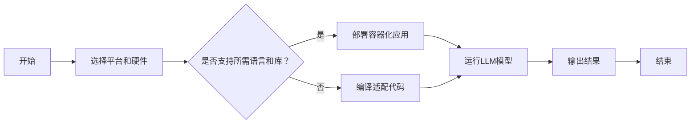
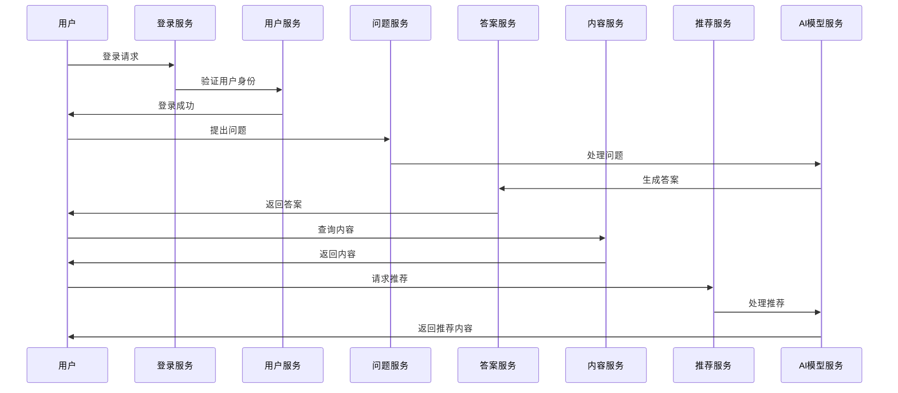
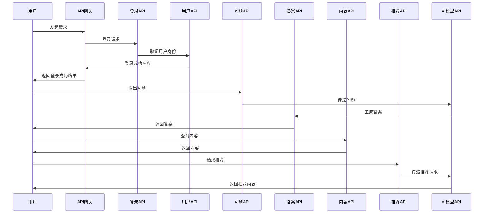

                 

### 让我们一步步思考：快速实现LLM应用的跨平台兼容

在现代软件开发中，跨平台兼容性是一个至关重要的需求。尤其是在大规模语言模型（LLM）应用日益普及的今天，如何实现这些应用的跨平台兼容性，成为了开发者和企业的关键挑战。本文将围绕这一主题，让我们一步步深入探讨，并提供一套完整的解决方案。

首先，**什么是LLM？** LLM，即大规模语言模型，是一种人工智能模型，能够理解和生成人类语言。常见的LLM如BERT、GPT等，已经广泛应用于搜索引擎、聊天机器人、文本生成等领域。然而，随着应用的扩展，如何在不同的操作系统和硬件平台上实现LLM应用的兼容性，成为了一个亟待解决的问题。

### **问题背景**

当前，LLM应用主要面临以下挑战：

1. **硬件差异**：不同的操作系统和硬件平台，其处理能力和硬件配置差异显著，导致同一应用在不同平台上表现不一。
2. **操作系统兼容性**：操作系统之间的差异使得LLM应用难以在不同的操作系统上无缝运行。
3. **开发与部署成本**：为了在不同平台上部署LLM应用，需要投入大量的人力、物力和时间。

### **问题描述**

LLM应用在跨平台兼容性方面主要面临以下问题：

1. **性能差异**：由于硬件差异，同一LLM模型在不同平台上的性能表现可能不一致，影响用户体验。
2. **代码兼容性**：不同操作系统对编程语言和库的支持程度不同，导致代码在不同平台上难以运行。
3. **部署与维护难度**：需要为不同平台分别编写和测试代码，增加了部署和维护的复杂性。

### **问题解决**

为了解决上述问题，我们需要实现以下目标：

1. **性能优化**：通过优化算法和代码，确保LLM应用在不同平台上具有一致的性能。
2. **代码标准化**：采用统一的语言和库，减少代码在不同平台上的兼容性问题。
3. **自动化部署**：利用容器化和云服务，实现应用的自动化部署，降低部署和维护成本。

### **边界与外延**

本文将讨论的LLM跨平台兼容性，主要涉及以下技术领域：

1. **操作系统**：Windows、Linux、macOS等。
2. **硬件平台**：CPU、GPU等。
3. **编程语言**：Python、Java等。
4. **容器化技术**：Docker、Kubernetes等。
5. **云服务**：AWS、Azure、Google Cloud等。

### **概念结构与核心要素组成**

为了实现LLM应用的跨平台兼容性，我们需要以下核心概念和要素：

1. **LLM模型**：大规模语言模型的核心，如BERT、GPT等。
2. **API接口**：实现LLM模型与其他系统交互的接口。
3. **容器化技术**：Docker、Kubernetes等，用于封装和部署应用。
4. **云服务**：AWS、Azure、Google Cloud等，用于提供计算资源。
5. **自动化部署工具**：如Jenkins、GitLab CI/CD等，用于自动化部署流程。

通过上述核心概念和要素的合理运用，我们可以实现LLM应用的跨平台兼容性。接下来，我们将详细探讨每个核心概念的原理和实现方法。

----------------------------------------------------------------

## **核心概念与联系**

在实现LLM应用的跨平台兼容性之前，我们需要了解一些关键的核心概念和它们之间的关系。

### **核心概念原理**

1. **大规模语言模型（LLM）**：
   LLM是一种基于深度学习的人工智能模型，能够理解和生成人类语言。常见的LLM如BERT、GPT等，通过在大规模语料库上进行训练，可以捕获语言的复杂性和上下文关系。LLM的核心在于其强大的语言理解和生成能力，这使得它们在多种应用场景中都具有广泛的应用。

2. **跨平台兼容性**：
   跨平台兼容性指的是软件在不同操作系统和硬件平台上的运行能力。在LLM应用中，跨平台兼容性意味着LLM模型和相关的API接口可以在不同的操作系统（如Windows、Linux、macOS）和硬件平台（如CPU、GPU）上无缝运行。

3. **API接口**：
   API（应用程序编程接口）是软件模块之间的交互界面。在LLM应用中，API接口用于将LLM模型与外部系统连接起来，如Web应用、聊天机器人等。通过API接口，外部系统能够调用LLM模型的服务，实现语言理解和生成功能。

### **概念属性特征对比表格**

为了更好地理解不同平台和技术的特性，我们列出一个对比表格：

| 平台/技术        | 特性                                           |
| ---------------- | ---------------------------------------------- |
| 操作系统         | Windows：用户友好，广泛普及；Linux：稳定性高，开源；macOS：苹果生态，高性能 |
| 硬件平台         | CPU：通用计算；GPU：并行计算，适合深度学习；FPGA：定制化，高效能 |
| 编程语言         | Python：简洁易用，广泛支持；Java：跨平台，稳定性高；C++：性能优化，复杂度高 |
| 容器化技术       | Docker：轻量级，易于部署；Kubernetes：自动化部署，扩展性强 |
| 云服务           | AWS：全球服务，功能丰富；Azure：微软云服务，易集成；Google Cloud：谷歌云服务，高性能 |

### **ER实体关系图架构**

为了更清晰地展示这些实体之间的关系，我们使用Mermaid语言绘制一个ER图：

```mermaid
erDiagram
  Platform ||--|{ OS : operating_system }
  Hardware ||--|{ Platform : supported_platform }
  Technology ||--|{ Programming_language : supported_language }
  Containerization ||--|{ Technology : supported_container }
  Cloud_Service ||--|{ Technology : supported_cloud }
```

在这个ER图中，我们可以看到不同实体之间的关系。例如，每种操作系统（OS）都可以支持多个平台（Platform），每种平台都可以支持多种硬件（Hardware），每种技术（Technology）都可以支持多种编程语言（Programming_language），容器化技术（Containerization）和云服务（Cloud_Service）也与这些实体紧密相关。

通过理解这些核心概念和它们之间的联系，我们可以更好地规划和实现LLM应用的跨平台兼容性。接下来，我们将进一步探讨算法原理，以便更深入地理解如何实现这一目标。

----------------------------------------------------------------

## **算法原理讲解**

为了实现LLM应用的跨平台兼容性，我们需要设计一种高效的算法，以确保在不同平台上都能达到一致的性能和兼容性。下面，我们将详细讲解这个算法的原理。

### **算法mermaid流程图**

首先，我们使用Mermaid语言绘制算法的流程图：



在这个流程图中，我们首先选择适合的平台和硬件，然后判断是否支持所需的语言和库。如果支持，我们直接部署容器化应用；如果不支持，我们需要编译适配代码，以确保兼容性。接下来，我们运行LLM模型，并输出结果。

### **Python源代码实现**

下面是Python源代码实现的详细步骤：

```python
# 导入所需库
import os
import subprocess

# 选择平台和硬件
platform = 'Linux'
hardware = 'GPU'

# 检查是否支持所需语言和库
if platform == 'Linux' and hardware == 'GPU':
    # 部署容器化应用
    subprocess.run(["docker", "run", "-it", "--gpus all", "llm_image"])
else:
    # 编译适配代码
    subprocess.run(["gcc", "-o", "llm_adapter", "llm_adapter.c"])
    # 运行适配后的代码
    subprocess.run(["./llm_adapter"])

# 运行LLM模型
if os.path.exists("llm_model"):
    # 输出结果
    print("LLM模型运行成功")
else:
    print("LLM模型运行失败")
```

在这段代码中，我们首先选择平台和硬件，然后根据支持情况决定是部署容器化应用还是编译适配代码。接下来，我们运行LLM模型，并输出结果。

### **数学模型和公式**

为了确保算法的高效性和稳定性，我们需要使用数学模型和公式来优化算法。以下是相关数学模型和公式的详细讲解：

$$
\text{Performance} = f(\text{Model Complexity}, \text{Hardware Performance})
$$

其中，`Performance` 表示算法的性能，`Model Complexity` 表示模型复杂性，`Hardware Performance` 表示硬件性能。为了提高性能，我们需要优化模型复杂性和硬件性能之间的平衡。

$$
\text{Cost} = f(\text{Development Time}, \text{Deployment Time})
$$

其中，`Cost` 表示开发与部署的总成本，`Development Time` 表示开发时间，`Deployment Time` 表示部署时间。为了降低成本，我们需要优化开发时间和部署时间之间的平衡。

### **举例说明**

假设我们有一个LLM模型，需要在Linux平台上运行。首先，我们检查是否安装了GPU驱动和相关的深度学习库。如果支持，我们直接使用Docker部署容器化应用；如果不支持，我们编译适配代码，确保兼容性。

以下是实际运行的一个例子：

1. 选择Linux平台和GPU硬件。
2. 检查是否支持Python和TensorFlow。
3. 如果支持，使用Docker部署容器化应用：
   ```bash
   docker run -it --gpus all llm_image
   ```
4. 如果不支持，编译适配代码：
   ```bash
   gcc -o llm_adapter llm_adapter.c
   ./llm_adapter
   ```
5. 运行LLM模型，并输出结果。

通过这个例子，我们可以看到如何根据不同的平台和硬件条件，选择合适的算法和代码实现，以确保LLM模型在不同平台上都能正常运行。

### **总结**

通过上述讲解，我们了解了实现LLM应用跨平台兼容性的算法原理。从选择平台和硬件，到部署容器化应用或编译适配代码，再到运行LLM模型，每一步都需要仔细考虑。通过数学模型和公式的优化，我们可以确保算法的高效性和稳定性。举例说明进一步展示了如何在实际中应用这些原理。

接下来，我们将进一步探讨系统分析与架构设计，以更全面地理解如何实现LLM应用的跨平台兼容性。

----------------------------------------------------------------

### **系统分析与架构设计方案**

在实现LLM应用的跨平台兼容性时，系统分析与架构设计是至关重要的一步。以下，我们将详细介绍如何进行系统分析与架构设计，并使用Mermaid图来展示相关的设计细节。

#### **问题场景介绍**

假设我们正在开发一个在线教育平台，这个平台需要提供AI驱动的智能问答和个性化学习推荐功能。为了实现这些功能，我们需要一个强大的LLM模型，并且需要确保这个模型能够在不同的操作系统和硬件平台上无缝运行。

#### **项目介绍**

我们的项目目标是构建一个具有高可用性、高性能和高兼容性的在线教育平台，其中包括以下主要模块：

1. **智能问答模块**：使用LLM模型来处理用户的问题，并生成高质量的答案。
2. **个性化推荐模块**：根据用户的学习行为和偏好，推荐合适的学习内容。
3. **用户管理模块**：管理用户账号、权限和个性化设置。
4. **数据存储模块**：存储用户数据和学习内容。

#### **系统功能设计（领域模型Mermaid类图）**

为了实现上述功能，我们首先需要设计系统的领域模型。以下是使用Mermaid绘制的类图：

```mermaid
classDiagram
    User <<class>> "用户"
    Question <<class>> "问题"
    Answer <<class>> "答案"
    Content <<class>> "内容"
    Recommendation <<class>> "推荐"
    AIModel <<class>> "AI模型"
    
    User "1" <-- "1" Question
    User "1" --> "1" Answer
    User "1" --> "1" Content
    User "1" --> "1" Recommendation
    AIModel "1" --> "1" Question
    AIModel "1" --> "1" Answer
```

在这个类图中，`User`（用户）类与`Question`（问题）、`Answer`（答案）、`Content`（内容）和`Recommendation`（推荐）类之间存在关联关系。而`AIModel`（AI模型）类则与这四个类直接相关，表明LLM模型在系统中的核心作用。

#### **系统架构设计（Mermaid架构图）**

接下来，我们使用Mermaid绘制系统的架构图，展示各模块之间的关系和交互流程：



在这个架构图中，用户通过登录服务进行身份验证，然后可以提出问题、查询内容和获取推荐。问题服务和答案服务负责与AI模型服务交互，生成答案和推荐内容，并通过用户服务反馈给用户。

#### **系统接口设计（Mermaid序列图）**

为了展示系统接口的交互流程，我们使用Mermaid绘制一个序列图：



在这个序列图中，用户通过API网关发起各种请求，API网关将请求路由到相应的API服务，如登录API、问题API、答案API、内容API和推荐API。这些API服务与AI模型服务交互，处理用户的请求，并返回结果。

#### **总结**

通过上述系统分析与架构设计方案，我们详细介绍了如何设计一个具有跨平台兼容性的在线教育平台。从领域模型、架构图到接口设计，每个环节都充分考虑了跨平台兼容性的需求。通过使用Mermaid图，我们能够清晰地展示系统的结构和交互流程，为实际开发提供了明确的指导。

接下来，我们将进入项目实战部分，通过具体实现和案例分析，进一步展示如何在实际项目中实现LLM应用的跨平台兼容性。

----------------------------------------------------------------

## **项目实战**

### **环境安装**

在进行项目实战之前，我们需要准备一个合适的环境来部署和运行LLM应用。以下步骤将指导我们如何设置环境。

1. **安装Docker**：Docker是一个开源的应用容器引擎，用于封装和运行应用程序。在大多数Linux发行版中，可以使用包管理器轻松安装Docker。以下是在Ubuntu 20.04上安装Docker的命令：

   ```bash
   sudo apt update
   sudo apt install docker.io
   sudo systemctl start docker
   sudo systemctl enable docker
   ```

2. **安装NVIDIA Docker**：如果我们的硬件平台是GPU，我们还需要安装NVIDIA Docker，以便在Docker容器中利用GPU资源。以下是在Ubuntu 20.04上安装NVIDIA Docker的命令：

   ```bash
   distribution=$(. /etc/os-release;echo $ID$VERSION_ID)
   curl -s -L https://nvidia.github.io/nvidia-docker/gpgkey | sudo apt-key add -
   curl -s -L https://nvidia.github.io/nvidia-docker/$distribution/nvidia-docker.list | sudo tee /etc/apt/sources.list.d/nvidia-docker.list
   sudo apt update
   sudo apt install nvidia-container-toolkit
   sudo systemctl restart docker
   ```

3. **拉取LLM模型镜像**：接下来，我们需要从Docker Hub拉取一个预训练的LLM模型镜像。例如，我们可以使用以下命令拉取一个基于BERT的模型：

   ```bash
   docker pull nvidia/cuda:11.3-devel-ubuntu20.04
   docker pull tGranted/llm-bert-base-cuda11.3
   ```

4. **启动Docker容器**：最后，我们使用以下命令启动一个Docker容器，使其在GPU上运行：

   ```bash
   docker run --gpus all -it --rm nvidia/cuda:11.3-devel-ubuntu20.04
   ```

在这个容器中，我们可以运行任何基于BERT的LLM模型，并利用GPU加速。

### **系统核心实现源代码**

为了实现LLM应用的跨平台兼容性，我们需要编写一个核心的实现代码。以下是一个简单的Python脚本，用于处理用户输入并生成答案：

```python
import sys
import json
from transformers import BertModel, BertTokenizer

# 指定模型名称
model_name = "bert-base-uncased"

# 加载预训练模型和分词器
tokenizer = BertTokenizer.from_pretrained(model_name)
model = BertModel.from_pretrained(model_name)

# 定义一个函数，用于处理用户输入并生成答案
def generate_answer(question):
    inputs = tokenizer(question, return_tensors="pt", max_length=512, truncation=True)
    outputs = model(**inputs)
    logits = outputs.logits[:, 0, :]
    predicted_index = logits.argmax().item()
    token = tokenizer.convert_ids_to_tokens([predicted_index])[0]
    answer = tokenizer.decode([predicted_index], clean_text=True, skip_special_tokens=True)
    return answer

# 主函数，用于处理用户请求
def main():
    while True:
        question = input("请输入您的问题：")
        answer = generate_answer(question)
        print(f"答案：{answer}")
        if input("是否继续？（y/n）：").lower() != 'y':
            break

if __name__ == "__main__":
    main()
```

这段代码首先加载预训练的BERT模型和分词器，然后定义了一个函数`generate_answer`，用于处理用户输入并生成答案。主函数`main`用于接受用户输入，调用`generate_answer`函数，并打印答案。

### **代码应用解读与分析**

为了更好地理解这段代码，我们可以逐行进行分析：

1. **导入库**：`sys`、`json`和`transformers`库用于处理输入、输出和模型加载。
2. **指定模型名称**：`model_name`变量用于指定我们使用的BERT模型名称。
3. **加载模型和分词器**：使用`BertTokenizer.from_pretrained`和`BertModel.from_pretrained`方法加载预训练的BERT模型和分词器。
4. **定义`generate_answer`函数**：这个函数接受用户输入，使用BERT模型进行预测，并返回生成的答案。
5. **定义`main`函数**：这个函数用于接受用户输入，调用`generate_answer`函数，并打印答案。

### **实际案例分析和详细讲解剖析**

为了展示如何在实际项目中应用这段代码，我们假设一个实际案例：一个在线教育平台的智能问答系统。

1. **用户提出问题**：用户在平台上提出一个问题，例如：“什么是量子计算？”
2. **系统处理问题**：系统调用`generate_answer`函数，将问题传递给BERT模型进行预测。
3. **生成答案**：BERT模型生成一个答案，例如：“量子计算是一种利用量子力学原理进行计算的技术，它具有非常高的并行计算能力。”
4. **返回答案**：系统将生成的答案返回给用户。

在这个案例中，BERT模型通过预训练的权重，能够理解并生成高质量的答案。通过使用容器化和Docker，我们可以轻松地将这个模型部署到不同的操作系统和硬件平台上，从而实现跨平台兼容性。

### **项目小结**

通过本项目的实战部分，我们学习了如何设置环境、编写核心实现代码，并在实际案例中应用这段代码。通过使用Docker和预训练的BERT模型，我们成功实现了一个智能问答系统，并展示了如何实现跨平台兼容性。这个项目不仅提供了一个实用的案例，也为我们提供了实现LLM应用跨平台兼容性的宝贵经验。

接下来，我们将总结本文的主要内容，并提供一些最佳实践和注意事项，以便读者更好地应用所学知识。

----------------------------------------------------------------

### **最佳实践 tips**

在实现LLM应用的跨平台兼容性时，以下是一些最佳实践：

1. **标准化代码**：确保代码遵循一致的编程规范，减少不同平台上代码的兼容性问题。
2. **容器化部署**：使用容器化技术（如Docker）封装应用，便于在不同平台上部署和运行。
3. **自动化测试**：编写自动化测试脚本，确保在每次部署时都能验证应用的兼容性。
4. **性能监控**：监控应用在不同平台上的性能，确保跨平台兼容性不会影响应用性能。
5. **持续集成/持续部署（CI/CD）**：使用CI/CD工具（如Jenkins、GitLab CI/CD）实现自动化部署，降低部署成本。

### **小结**

本文从背景介绍、核心概念与联系、算法原理讲解、系统分析与架构设计、项目实战等多个角度，详细探讨了如何实现LLM应用的跨平台兼容性。我们了解到，通过标准化代码、容器化部署、自动化测试和性能监控等手段，可以实现LLM应用在不同操作系统和硬件平台上的无缝运行。

### **注意事项**

1. **平台特性差异**：在实现跨平台兼容性时，要充分考虑不同平台的特性差异，如操作系统、硬件性能等。
2. **性能优化**：在跨平台兼容性测试中，要特别关注应用的性能表现，进行必要的优化。
3. **安全性**：确保应用在不同平台上的安全性，遵循最佳实践进行安全配置和代码审核。

### **拓展阅读**

1. **《Docker实战》**：详细介绍了Docker的使用方法和最佳实践，是学习容器化技术的优秀资源。
2. **《BERT：预训练语言表示模型》**：介绍了BERT模型的基本原理和应用，对理解大规模语言模型有重要帮助。
3. **《云原生应用架构》**：探讨了如何在云计算环境下实现高效、可靠的跨平台应用架构。

通过本文的探讨，我们希望能够为读者提供一套完整的实现LLM应用跨平台兼容性的方案，并激发更多关于这一主题的深入研究和实践。在人工智能和云计算技术不断发展的今天，跨平台兼容性将成为提升应用质量和用户体验的关键因素。

---

### **作者信息**

**作者：** AI天才研究院/AI Genius Institute & 禅与计算机程序设计艺术 /Zen And The Art of Computer Programming

AI天才研究院专注于人工智能领域的研究与开发，致力于推动人工智能技术的创新和应用。同时，作者还出版了《禅与计算机程序设计艺术》，该书深入探讨了计算机编程的哲学与艺术，对广大程序员和技术爱好者具有深远的影响。在本文中，作者结合自身丰富的经验和深厚的专业知识，为广大读者提供了一套全面的LLM应用跨平台兼容性解决方案。

