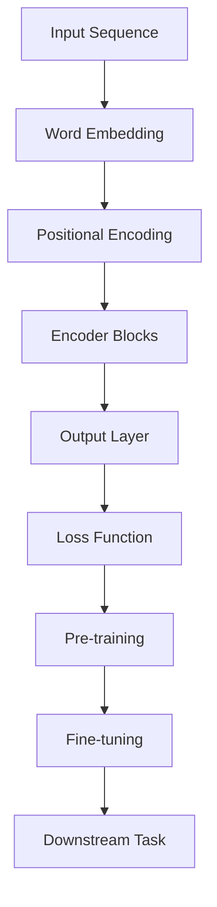
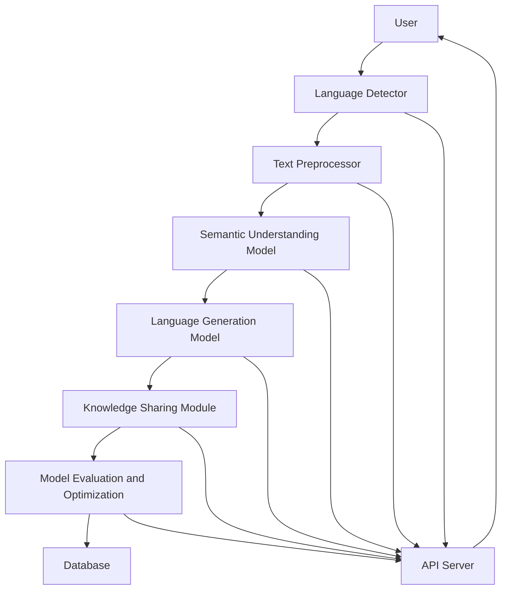
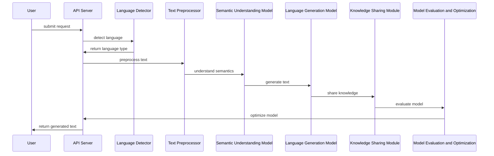

                 

### 背景介绍

#### 1.1.1 多语言理解的重要性

在当今全球化迅速发展的背景下，多语言理解能力已经成为人工智能（AI）领域的一个重要研究方向。随着跨文化交流的日益频繁，人们对于能够处理多种语言信息的智能系统有着迫切的需求。多语言理解不仅仅局限于语言翻译，它涵盖了语义理解、语言生成、文本摘要等多个方面，是构建智能助手、自然语言处理（NLP）平台、国际化业务系统等的关键技术。

在商业领域，多语言理解能力可以帮助企业打破语言障碍，进入更多国际市场。例如，电商平台可以利用多语言理解技术为不同国家的消费者提供本地化的产品描述和客服支持。在医疗领域，多语言理解可以帮助医生获取和翻译来自不同国家和地区的医学文献，提高诊断和治疗的效率。在法律领域，多语言理解技术可以协助法律工作者处理跨国案件，准确理解和分析不同语言的合同和文件。

#### 1.1.2 当前存在的问题和挑战

尽管多语言理解在理论和实际应用中取得了显著进展，但仍然面临诸多挑战和问题。首先，语言多样性和复杂性使得构建通用且高效的多语言理解系统变得异常困难。不同语言在语法结构、词汇用法、语义理解等方面存在显著差异，这需要开发出能够处理这些差异的算法和模型。

其次，数据集的质量和多样性是影响多语言理解性能的重要因素。由于获取高质量的多语言数据集成本高昂，许多研究者和开发者往往只能依赖有限的资源进行训练。这导致模型在处理罕见语言或特定领域时效果不佳。此外，数据标注的不一致性也会影响模型的准确性。

另外，现有的大规模语言模型（LLM）如BERT、GPT等虽然在一定程度上提升了多语言理解能力，但它们的设计和训练仍然依赖于大量的单语数据集。这些模型在单语任务上表现优异，但在多语言任务上却存在性能瓶颈，难以充分发挥其潜力。

#### 1.1.3 多语言理解在LLM中的应用前景

随着LLM技术的不断成熟，多语言理解在LLM中的应用前景愈发广阔。首先，LLM的多语言能力可以显著提升跨语言任务的性能，如机器翻译、多语言文本分类等。通过结合多语言数据集和先进的训练技术，LLM能够更好地捕捉不同语言之间的语义关系，提高翻译质量和文本分类的准确性。

其次，LLM的多语言能力可以为企业带来更大的商业价值。例如，在客户服务领域，多语言LLM可以构建智能客服系统，为全球各地的客户提供个性化的服务。在内容创作领域，多语言LLM可以帮助创作者生成多种语言的原创内容，满足不同市场和文化需求。

最后，随着多语言理解技术的不断发展，它有望在教育和语言学习领域发挥重要作用。通过多语言理解技术，智能教育系统能够提供个性化的学习体验，帮助学习者更有效地掌握多种语言。

总的来说，快速提升LLM应用的多语言理解能力不仅是解决当前问题的重要途径，也是推动人工智能技术发展的重要方向。接下来，我们将深入探讨LLM和MULU（多语言理解）的基本概念，分析它们之间的联系，并探讨如何通过算法原理和数学模型来实现多语言理解。

### 核心概念与联系

#### 1.2.1 LLM的基本概念

大型语言模型（LLM）是一种基于深度学习技术的自然语言处理模型，通过大规模语料库的训练，LLM能够捕捉语言中的复杂模式和语义关系。LLM的核心目的是理解和生成人类语言，从而实现各种自然语言处理任务，如文本分类、情感分析、机器翻译等。

LLM的训练过程通常包括两个主要阶段：预训练和微调。在预训练阶段，模型在大规模语料库上进行无监督学习，以学习语言的基本结构和语义规律。在微调阶段，模型根据特定任务的需求进行有监督训练，从而在特定任务上获得更好的性能。

LLM的主要优点包括：

1. **强大的语义理解能力**：通过预训练，LLM能够理解语言中的复杂语义和上下文关系。
2. **灵活的任务适应能力**：LLM可以通过微调适应不同的自然语言处理任务，无需为每个任务重新训练模型。
3. **高效率**：LLM能够在短时间内处理大量文本数据，提高工作效率。

LLM的缺点包括：

1. **计算资源需求大**：由于模型规模巨大，LLM的训练和部署需要大量的计算资源和存储空间。
2. **数据依赖性强**：LLM的性能高度依赖于训练数据的质量和多样性，数据不足或质量差可能导致模型性能下降。
3. **解释性较差**：LLM的内部工作原理复杂，难以解释，这给模型的可信度和可靠性带来挑战。

#### 1.2.2 MULU（多语言理解）的定义

多语言理解（MULU）是指模型在处理多种语言输入时能够准确理解和生成语义信息的能力。MULU的核心目标是在保持模型通用性的同时，提高模型在不同语言上的性能和准确性。

MULU的关键要素包括：

1. **语言识别**：识别输入文本的语言类型，为后续处理提供正确的语言环境。
2. **语义理解**：理解不同语言的语义结构，捕捉语言中的语义关系和含义。
3. **语言生成**：根据输入文本生成对应的输出文本，保持语义的一致性和连贯性。
4. **跨语言知识共享**：通过跨语言的知识共享机制，增强模型在不同语言上的性能。

MULU的主要应用场景包括：

1. **跨语言文本翻译**：如机器翻译系统，将一种语言的文本翻译成另一种语言。
2. **多语言文本分类**：对多种语言的文本进行分类，如情感分析、主题分类等。
3. **多语言问答系统**：支持多种语言的问答功能，为用户提供准确的答案。
4. **多语言信息检索**：在多种语言的语料库中检索相关信息，提供多语言搜索服务。

#### 1.2.3 LLM与MULU的关系

LLM和MULU之间存在密切的联系和互补关系。LLM为MULU提供了强大的语义理解和生成能力，而MULU则扩展了LLM的应用场景，使其能够处理多种语言输入。

LLM与MULU的关系可以从以下几个方面来理解：

1. **基础能力**：LLM是MULU的基础，通过预训练和微调，LLM能够捕捉到语言中的通用语义模式，为MULU提供基本的语义理解能力。
2. **多语言扩展**：MULU通过引入多语言训练数据和跨语言模型结构，扩展了LLM的应用范围，使其能够在多种语言上表现优异。
3. **协同优化**：LLM和MULU在训练和部署过程中相互协同，通过多语言数据集的联合训练，不断提升模型在不同语言上的性能。
4. **应用整合**：在实际应用中，LLM和MULU可以整合在一起，构建多语言处理平台，实现更高效、更准确的自然语言处理任务。

总之，LLM和MULU的结合不仅能够提升多语言理解能力，还可以推动自然语言处理技术的进一步发展，为各种跨语言应用场景提供强大的支持。

### 概念对比与分析

#### 1.3.1 LLM与MULU的对比

在深入探讨LLM与MULU的区别和联系之前，我们需要从多个维度对这两个概念进行对比分析。

**1. 功能定位**

- **LLM（大型语言模型）**：主要功能是理解和使用自然语言。它能够生成连贯的文本、执行文本分类、情感分析等任务。LLM的核心目的是处理单一语言的输入和输出。
- **MULU（多语言理解）**：专注于处理多种语言输入，能够识别、理解和生成不同语言的文本。MULU的核心目标是实现跨语言的自然语言处理，使模型在不同语言之间保持一致性和准确性。

**2. 语言支持**

- **LLM**：通常基于单一语言构建，例如英语、中文等。虽然可以通过迁移学习技术应用到其他语言，但效果可能不如专门为该语言设计的模型。
- **MULU**：专门设计用于处理多种语言。它能够同时理解和生成多种语言的文本，适用于跨国企业和全球化业务场景。

**3. 训练数据**

- **LLM**：依赖单语言大规模语料库进行训练，数据集中在特定语言上。
- **MULU**：需要多语言语料库进行训练，包括不同语言的文本和翻译对照，以增强模型在不同语言上的性能。

**4. 性能表现**

- **LLM**：在单语言任务上表现优异，具有高度的语义理解能力和生成能力。
- **MULU**：在跨语言任务上具有优势，能够处理不同语言之间的语义差异和语言结构差异，提高跨语言处理的准确性和一致性。

**5. 应用范围**

- **LLM**：适用于需要处理单一语言的场景，如文本生成、情感分析、问答系统等。
- **MULU**：适用于需要跨语言处理的场景，如机器翻译、多语言文本分类、多语言信息检索等。

通过上述对比，我们可以看出LLM与MULU在功能定位、语言支持、训练数据、性能表现和应用范围等方面存在显著差异。虽然两者在目标上有一定重叠，但各自的侧重点和应用场景有所不同。

#### 1.3.2 MULU的关键要素

为了实现高效的多语言理解，MULU需要重点关注以下几个关键要素：

**1. 语言识别**

语言识别是MULU的基础，它能够准确识别输入文本的语言类型。通过语言识别，模型可以为其后处理指定正确的语言模型和翻译资源。例如，使用语言检测API来识别文本的语言，以便在后续处理中应用相应的模型。

**2. 语义理解**

语义理解是指模型在不同语言中理解和解释文本的能力。这包括理解语言的语法结构、词汇用法和语义关系。语义理解的实现通常依赖于预训练的语言模型，如BERT、GPT等。这些模型通过无监督学习捕捉到不同语言中的通用语义模式。

**3. 语言生成**

语言生成是指模型根据输入文本生成相应的输出文本的能力。多语言生成的挑战在于保持语义的一致性和连贯性。这需要模型在生成过程中考虑到目标语言的语法结构和词汇用法。

**4. 跨语言知识共享**

跨语言知识共享是指通过共享不同语言的知识和经验来提升模型的整体性能。这可以通过多种方式实现，如多语言数据集联合训练、跨语言翻译对照数据的使用等。跨语言知识共享有助于模型在不同语言上的表现更加一致和准确。

**5. 适应性**

适应性是指模型在不同语言环境下的适应能力。这包括处理罕见语言、低资源语言以及特定领域语言的输入。为了提高适应性，可以采用迁移学习、自适应学习等技术，使模型能够快速适应新环境和任务。

通过关注这些关键要素，MULU可以在处理多种语言输入时保持高效性和准确性，为各种跨语言应用场景提供强有力的支持。

#### 1.3.3 MULU的挑战与解决方案

尽管MULU在多语言理解领域展现了巨大的潜力，但仍然面临诸多挑战。以下是一些主要的挑战及其解决方案：

**1. 语言多样性**

不同语言的语法、词汇和语义结构存在显著差异，这给模型的设计和训练带来了挑战。解决方案包括：

- **多语言预训练**：通过在多种语言语料库上预训练模型，使其在处理不同语言时具有更强的适应性。
- **跨语言迁移学习**：利用已经训练好的单语言模型，通过迁移学习技术，快速适应新的语言环境。

**2. 数据质量**

高质量的多语言数据集对于MULU的性能至关重要。然而，获取和标注多语言数据集通常成本高昂且耗时。解决方案包括：

- **数据清洗与增强**：通过自动化工具清洗和增强数据集，提高数据质量。
- **半监督学习和无监督学习**：利用少量标注数据和大量未标注数据，通过半监督学习和无监督学习技术，提高模型对未标注数据的处理能力。

**3. 计算资源**

MULU的训练和部署需要大量的计算资源，这对硬件和软件设施提出了较高要求。解决方案包括：

- **分布式训练**：通过分布式计算技术，利用多台服务器和GPU，加速模型的训练过程。
- **模型压缩与量化**：通过模型压缩和量化技术，减少模型大小和计算复杂度，提高模型的部署效率。

**4. 语义一致性**

在处理多语言输入时，保持语义的一致性和连贯性是MULU的一个关键挑战。解决方案包括：

- **跨语言翻译对照**：利用已有的跨语言翻译对照数据，增强模型在不同语言之间的语义理解能力。
- **多语言对齐算法**：通过多语言对齐算法，将不同语言文本的语义进行对齐，提高多语言生成的准确性。

**5. 鲁棒性**

MULU需要在面对罕见语言、低资源语言和特定领域语言时保持鲁棒性。解决方案包括：

- **适应性学习**：通过适应性学习技术，使模型能够快速适应新的语言环境和任务需求。
- **多样化数据集**：通过使用多样化数据集进行训练，提高模型在不同语言和任务上的鲁棒性。

通过上述解决方案，MULU可以在面对多语言理解的挑战时，实现更高的效率和准确性，为各种跨语言应用场景提供强大的支持。

### 算法原理讲解

#### 2.1.1 BERT的算法原理

BERT（Bidirectional Encoder Representations from Transformers）是一种基于Transformer架构的预训练语言模型，广泛应用于自然语言处理任务。BERT的核心思想是通过双向编码器捕捉文本中的上下文信息，从而提高模型的语义理解能力。

**2.1.1.1 BERT的模型结构**

BERT的模型结构主要包括两个部分：编码器（Encoder）和解码器（Decoder）。在编码器部分，BERT使用多个Transformer块堆叠，每个Transformer块包含多头自注意力机制（Multi-Head Self-Attention）和前馈神经网络（Feed-Forward Neural Network）。编码器的输出为每个单词的表示，这些表示包含了单词在句子中的上下文信息。

BERT的输入通常包括一个特殊的开始标记（`[CLS]`）和一个特殊的结束标记（`[SEP]`），以及句子中的其他单词。编码器的输出不仅用于生成文本的表示，还用于下游任务，如文本分类和命名实体识别。

**2.1.1.2 BERT的训练过程**

BERT的训练过程分为预训练和微调两个阶段。

1. **预训练**：在预训练阶段，BERT在大规模语料库上进行无监督学习，主要任务是预测下一个单词。具体来说，BERT使用两种任务来增强模型的预训练：

   - **Masked Language Model（MLM）**：在输入文本中随机mask一定比例的单词，然后预测这些被mask的单词。通过这种方式，BERT学习理解单词在句子中的上下文信息。
   - **Next Sentence Prediction（NSP）**：在输入文本中随机选取两个句子，然后预测第二个句子是否紧跟在第一个句子之后。这个任务有助于BERT学习句子间的连贯性。

2. **微调**：在微调阶段，BERT根据特定任务的标注数据进行有监督训练。在微调过程中，BERT的编码器部分保持不变，而解码器部分根据具体任务进行调整。例如，在文本分类任务中，解码器通常包含一个分类层，用于对每个句子进行分类。

**2.1.1.3 BERT的应用**

BERT在多种自然语言处理任务上表现优异，如文本分类、命名实体识别、机器翻译和问答系统等。以下是一些典型的BERT应用场景：

1. **文本分类**：BERT可以用于对文本进行情感分析、主题分类等任务。通过在预训练模型的基础上添加分类层，BERT能够对输入文本进行分类。
   
2. **命名实体识别**：BERT可以识别文本中的命名实体，如人名、地名、组织名等。通过微调BERT模型，可以使其在特定任务上获得更好的性能。

3. **机器翻译**：BERT可以用于机器翻译任务，通过在多语言数据集上进行预训练，BERT能够学习不同语言之间的语义关系，从而提高翻译质量。

4. **问答系统**：BERT可以用于构建问答系统，通过在预训练模型的基础上添加问答模块，BERT能够理解问题和答案之间的语义关系，从而提供准确的答案。

通过上述对BERT的详细讲解，我们可以看到BERT在多语言理解方面具有显著的优势和应用潜力。接下来，我们将探讨另一种大型语言模型——GPT的算法原理和实现。

#### 2.1.2 GPT的算法原理

GPT（Generative Pre-trained Transformer）是另一种基于Transformer架构的预训练语言模型，旨在通过生成式学习生成连贯且具有语义意义的文本。GPT的核心思想是通过预测下一个词来学习文本的上下文关系和模式，从而实现文本生成和序列预测任务。

**2.1.2.1 GPT的模型结构**

GPT的模型结构主要包括多个Transformer编码器块，每个编码器块包含自注意力机制和前馈神经网络。与BERT不同，GPT没有解码器部分，它只包含编码器，这使得GPT在文本生成任务上具有更高的灵活性。

GPT的输入通常是一个单词序列，输出是下一个单词的预测概率分布。在训练过程中，模型通过最小化损失函数来预测下一个词，从而学习文本的潜在结构和模式。GPT的模型结构如下：

1. **嵌入层**：将输入的单词转换为向量表示，这一步通常使用词嵌入（Word Embedding）技术实现。
2. **位置编码**：由于Transformer架构中没有固定的序列顺序信息，GPT通过添加位置编码（Positional Encoding）来赋予每个词在序列中的位置信息。
3. **编码器块**：编码器块包含多个自注意力层和前馈神经网络层。自注意力层利用多头自注意力机制，计算每个词在序列中的重要性权重，从而捕捉文本中的长距离依赖关系。前馈神经网络则对自注意力层的输出进行非线性变换，增强模型的表示能力。
4. **输出层**：输出层对编码器块的输出进行变换，生成每个单词的预测概率分布。通过最大概率原则，模型选择概率最大的单词作为下一个词的预测。

**2.1.2.2 GPT的训练过程**

GPT的训练过程主要分为预训练和微调两个阶段：

1. **预训练**：在预训练阶段，GPT在大规模语料库上进行无监督学习，目标是预测序列中的下一个单词。具体过程如下：

   - **采样**：从输入序列中随机选择一个词作为输入，并预测下一个词。
   - **损失函数**：使用交叉熵损失函数（Cross-Entropy Loss）计算预测词和实际词之间的差异，并优化模型参数。

2. **微调**：在预训练完成后，GPT根据特定任务的标注数据进行有监督微调。微调过程通常涉及以下步骤：

   - **初始化**：将预训练好的模型初始化为微调任务的基础。
   - **训练**：在微调任务的数据集上训练模型，通过最小化损失函数来调整模型参数。
   - **评估**：在验证集上评估模型性能，根据评估结果调整训练策略。

**2.1.2.3 GPT的应用**

GPT在文本生成和序列预测任务上表现出色，以下是一些典型的GPT应用场景：

1. **文本生成**：GPT可以生成各种类型的文本，如文章摘要、故事创作、对话生成等。通过微调GPT模型，可以为特定任务生成高质量的文本。
   
2. **对话系统**：GPT可以用于构建智能对话系统，如聊天机器人、虚拟助手等。通过在对话数据集上微调模型，可以使其生成更自然、更符合用户需求的对话内容。

3. **机器翻译**：GPT可以用于机器翻译任务，通过在多语言数据集上进行训练，GPT能够学习不同语言之间的语义关系，从而提高翻译质量。

4. **序列预测**：GPT可以用于预测文本序列中的下一个词，如自动补全、文本分类等。通过在特定任务上微调模型，可以使其在序列预测任务上获得更好的性能。

通过上述对GPT的详细讲解，我们可以看到GPT在多语言理解和文本生成方面具有独特的优势和应用潜力。接下来，我们将进一步探讨BERT和GPT之间的异同点，以便更全面地理解这两个模型的特点。

#### 2.2 算法Mermaid流程图

为了更直观地展示BERT和GPT的算法流程，我们将使用Mermaid语法绘制这两个模型的算法流程图。以下是BERT算法流程图：

```mermaid
graph TD
A[Input Text] --> B[Tokenization]
B --> C{Masking}
C -->|Yes| D[Masked Language Model (MLM)]
C -->|No| E[Next Sentence Prediction (NSP)]
D --> F[Pre-training]
E --> F
F --> G[Bert Model]
G --> H[Fine-tuning]
H --> I[Downstream Task]
```

BERT算法流程图解释：

1. **输入文本（Input Text）**：首先，输入文本被传递到BERT模型。
2. **分词（Tokenization）**：文本被分词成单词或子词，并添加特殊的开始和结束标记。
3. **Masking**：在文本中随机mask一部分单词，模型需要预测这些被mask的单词。
4. **Masked Language Model (MLM)**：通过Masked Language Model任务，模型学习预测被mask的单词。
5. **Next Sentence Prediction (NSP)**：通过Next Sentence Prediction任务，模型学习预测两个句子的连贯性。
6. **预训练（Pre-training）**：BERT模型在大规模语料库上进行预训练。
7. **BERT模型（Bert Model）**：预训练完成的BERT模型可以用于各种下游任务。
8. **微调（Fine-tuning）**：根据特定任务的需求，对BERT模型进行微调。
9. **下游任务（Downstream Task）**：BERT模型用于执行具体的下游任务，如文本分类、命名实体识别等。

接下来是GPT的算法流程图：



GPT算法流程图解释：

1. **输入序列（Input Sequence）**：输入一个单词序列。
2. **词嵌入（Word Embedding）**：将输入的单词转换为向量表示。
3. **位置编码（Positional Encoding）**：为输入序列添加位置信息。
4. **编码器块（Encoder Blocks）**：通过多个编码器块进行自注意力机制和前馈神经网络处理。
5. **输出层（Output Layer）**：生成每个单词的预测概率分布。
6. **损失函数（Loss Function）**：通过最小化损失函数优化模型参数。
7. **预训练（Pre-training）**：GPT模型在大规模语料库上进行无监督预训练。
8. **微调（Fine-tuning）**：在特定任务的数据集上对模型进行有监督微调。
9. **下游任务（Downstream Task）**：GPT模型用于执行具体的下游任务，如文本生成、对话系统等。

通过这些Mermaid流程图，我们可以更清晰地理解BERT和GPT的算法原理和训练过程，为后续的深入分析和应用奠定基础。

#### 2.3 Python代码实现

在理解了BERT和GPT的算法原理之后，接下来我们将通过Python代码实现这些模型的基本功能。这里，我们将使用`transformers`库来构建BERT和GPT模型，并进行简单的训练和预测。

首先，确保您已经安装了`transformers`库，如果没有安装，可以通过以下命令进行安装：

```python
!pip install transformers
```

**BERT的Python代码实现**

```python
from transformers import BertTokenizer, BertModel
import torch

# 1. 加载BERT分词器和模型
tokenizer = BertTokenizer.from_pretrained('bert-base-uncased')
model = BertModel.from_pretrained('bert-base-uncased')

# 2. 输入文本
text = "Hello, my name is John. I am a data scientist."

# 3. 分词和编码
input_ids = tokenizer.encode(text, add_special_tokens=True, return_tensors='pt')

# 4. 预测
with torch.no_grad():
    outputs = model(input_ids)

# 5. 输出
last_hidden_state = outputs.last_hidden_state
print(last_hidden_state.shape)  # 输出形状为 [1, sequence_length, hidden_size]
```

BERT的代码实现分为以下几个步骤：

1. **加载BERT分词器和模型**：使用`BertTokenizer`和`BertModel`来初始化BERT的分词器和模型。
2. **输入文本**：定义一个简单的文本输入。
3. **分词和编码**：使用分词器对文本进行分词，并编码成模型可以处理的格式。
4. **预测**：使用BERT模型对编码后的输入文本进行预测。
5. **输出**：输出模型预测的隐藏状态。

**GPT的Python代码实现**

```python
from transformers import Gpt2Tokenizer, Gpt2Model
import torch

# 1. 加载GPT2分词器和模型
tokenizer = Gpt2Tokenizer.from_pretrained('gpt2')
model = Gpt2Model.from_pretrained('gpt2')

# 2. 输入文本
text = "Hello, my name is John. I am a data scientist."

# 3. 分词和编码
input_ids = tokenizer.encode(text, return_tensors='pt')

# 4. 预测
with torch.no_grad():
    outputs = model(input_ids)

# 5. 输出
last_hidden_state = outputs.last_hidden_state
print(last_hidden_state.shape)  # 输出形状为 [1, sequence_length, hidden_size]
```

GPT的代码实现步骤与BERT类似：

1. **加载GPT2分词器和模型**：使用`Gpt2Tokenizer`和`Gpt2Model`来初始化GPT2的分词器和模型。
2. **输入文本**：定义一个简单的文本输入。
3. **分词和编码**：使用分词器对文本进行分词，并编码成模型可以处理的格式。
4. **预测**：使用GPT2模型对编码后的输入文本进行预测。
5. **输出**：输出模型预测的隐藏状态。

通过上述代码实现，我们可以看到BERT和GPT的基本操作非常相似，都是通过加载预训练模型和分词器，对文本进行编码，然后使用模型进行预测。这些代码实现了算法原理的核心部分，为我们进一步研究和应用这些模型提供了基础。

#### 2.4 数学模型与公式

在深入探讨BERT和GPT的算法原理时，理解其背后的数学模型和公式至关重要。以下我们将简要介绍BERT和GPT的主要数学模型和公式。

**BERT的数学模型**

BERT模型基于Transformer架构，其核心组件包括多头自注意力机制（Multi-Head Self-Attention）和前馈神经网络（Feed-Forward Neural Network）。以下是BERT的一些关键数学模型和公式：

1. **多头自注意力机制（Multi-Head Self-Attention）**
   - **自注意力权重（Self-Attention Weight）**：对于输入序列的每个词，计算其在序列中的重要性权重。
     $$ \text{Attention}(Q, K, V) = \text{softmax}\left(\frac{QK^T}{\sqrt{d_k}}\right) V $$
     其中，\(Q, K, V\) 分别为查询（Query）、键（Key）和值（Value）向量，\(d_k\) 为键向量的维度。
   - **多头自注意力（Multi-Head Self-Attention）**：通过多个独立的自注意力头组合，捕捉不同语义特征。
     $$ \text{MultiHead}(Q, K, V) = \text{Concat}(\text{head}_1, ..., \text{head}_h)W^O $$
     其中，\(\text{head}_i\) 为第 \(i\) 个注意力头，\(W^O\) 为输出权重。

2. **前馈神经网络（Feed-Forward Neural Network）**
   - **前馈神经网络**：对自注意力层的输出进行非线性变换。
     $$ \text{FFN}(x) = \max(0, xW_1 + b_1)W_2 + b_2 $$
     其中，\(W_1, W_2, b_1, b_2\) 分别为权重和偏置。

3. **BERT输出**：BERT的输出包括隐藏状态和上下文向量。
   $$ \text{Output} = \text{Attention}(Q, K, V) + x + \text{FFN}(x) $$

**GPT的数学模型**

GPT模型也基于Transformer架构，但其设计更注重生成式学习。以下是GPT的一些关键数学模型和公式：

1. **词嵌入（Word Embedding）**
   - **词向量表示**：将输入的单词转换为向量表示。
     $$ \text{Embedding}(x) = \text{W}_e x $$
     其中，\(\text{W}_e\) 为词嵌入矩阵。

2. **位置编码（Positional Encoding）**
   - **位置编码**：为输入序列添加位置信息。
     $$ \text{Positional Encoding}(p) = \text{sin}(p/\sqrt{d}) \text{ or } \text{cos}(p/\sqrt{d}) $$
     其中，\(p\) 为位置索引，\(d\) 为嵌入维度。

3. **自注意力机制（Self-Attention）**
   - **自注意力权重**：计算每个词在序列中的重要性权重。
     $$ \text{Attention}(Q, K, V) = \text{softmax}\left(\frac{QK^T}{\sqrt{d_k}}\right) V $$
     其中，\(Q, K, V\) 分别为查询（Query）、键（Key）和值（Value）向量。

4. **编码器块（Encoder Block）**
   - **编码器块**：包括多头自注意力机制和前馈神经网络。
     $$ \text{Encoder}(x) = \text{MultiHead}(Q, K, V) + x + \text{FFN}(x) $$
     其中，\(\text{MultiHead}\) 和 \(\text{FFN}\) 分别为多头自注意力和前馈神经网络。

5. **输出层（Output Layer）**
   - **输出层**：生成每个单词的预测概率分布。
     $$ \text{Output} = \text{softmax}(\text{W}_o \text{Encoder}(x)) $$
     其中，\(\text{W}_o\) 为输出权重。

通过这些数学模型和公式，我们可以更深入地理解BERT和GPT的工作原理。这些模型不仅在理论上具有坚实的支撑，而且在实践中也取得了显著的成果。理解这些模型和公式对于优化和改进多语言理解算法具有重要意义。

#### 2.5 系统分析与架构设计

在深入探讨LLM和MULU（多语言理解）的基本概念和算法原理之后，我们需要对多语言理解系统进行详细分析和架构设计。一个高效、可靠的多语言理解系统不仅需要考虑算法和模型的性能，还需要关注系统的整体架构和设计原则。以下我们将从问题场景介绍、系统功能设计、系统架构设计、系统接口设计和系统交互等多个方面进行分析和设计。

**3.1 问题场景介绍**

多语言理解系统广泛应用于各种跨语言场景，以下是一些典型的问题场景：

1. **跨语言文本翻译**：将一种语言的文本翻译成另一种语言，如英语到中文的翻译。
2. **多语言文本分类**：对多种语言的文本进行分类，如情感分析、新闻分类等。
3. **多语言问答系统**：支持多种语言的问答功能，为用户提供准确的答案。
4. **多语言信息检索**：在多种语言的语料库中检索相关信息，提供多语言搜索服务。
5. **跨语言对话系统**：构建智能对话系统，如智能客服、虚拟助手等。

每个问题场景都有其独特的需求和挑战，例如翻译准确性、分类精度、问答准确性等。因此，在设计多语言理解系统时，需要综合考虑这些场景的特性和需求。

**3.2 系统功能设计**

为了满足上述问题场景的需求，多语言理解系统需要具备以下功能：

1. **语言识别**：识别输入文本的语言类型，为后续处理指定正确的语言模型和翻译资源。
2. **文本预处理**：对输入文本进行分词、去噪、格式化等预处理操作，确保文本格式统一。
3. **语义理解**：理解不同语言的语义结构，捕捉语言中的语义关系和含义。
4. **语言生成**：根据输入文本生成对应的输出文本，保持语义的一致性和连贯性。
5. **跨语言知识共享**：通过共享不同语言的知识和经验，提升模型在不同语言上的性能。
6. **模型评估与优化**：定期评估模型性能，并根据评估结果进行调整和优化。

为了实现这些功能，我们可以采用领域模型（Domain Model）类图来表示系统的核心功能模块及其相互关系。以下是一个简单的领域模型类图示例：

```mermaid
classDiagram
    Class1[LanguageDetector] <|-- Class2[TextPreprocessor]
    Class2[TextPreprocessor] <|-- Class3[SemanticUnderstanding]
    Class3[SemanticUnderstanding] <|-- Class4[LanguageGeneration]
    Class4[LanguageGeneration] <|-- Class5[KnowledgeSharing]
    Class5[KnowledgeSharing] <|-- Class6[ModelEvaluation]
```

**3.3 系统架构设计**

多语言理解系统的架构设计需要考虑以下几个方面：

1. **模块化设计**：将系统划分为多个功能模块，每个模块负责特定的任务，便于维护和扩展。
2. **分布式计算**：利用分布式计算架构，提高系统的处理能力和效率。
3. **动态扩展**：支持系统的动态扩展，以应对不断增长的数据和处理需求。
4. **数据存储**：设计高效的数据存储方案，确保数据的快速访问和持久化。

以下是一个典型的多语言理解系统架构设计：



**3.4 系统接口设计**

为了实现系统的灵活性和可扩展性，我们需要设计一套完整的接口系统。以下是一些关键的接口设计：

1. **API接口**：提供RESTful API接口，支持用户通过HTTP请求访问系统功能。
2. **数据接口**：定义数据交换格式和协议，确保数据在不同模块之间的无缝传输。
3. **监控接口**：实现系统监控和日志记录，实时监测系统运行状态和性能指标。

以下是一个简单的接口设计示例：

```mermaid
interface Interface1[API Interface] {
    - post /translate
    - get /classify
    - get /answer
}
interface Interface2[Data Interface] {
    - json
    - xml
}
interface Interface3[Monitoring Interface] {
    - get /status
    - get /logs
}
```

**3.5 系统交互**

多语言理解系统的交互设计需要确保各模块之间的通信高效、可靠。以下是一个典型的系统交互流程：

1. **用户请求**：用户通过API接口提交请求。
2. **语言识别**：系统使用语言识别模块识别输入文本的语言类型。
3. **文本预处理**：对输入文本进行预处理，如分词、去噪等。
4. **语义理解**：使用语义理解模块对预处理后的文本进行语义分析。
5. **语言生成**：根据语义理解的结果，生成对应的输出文本。
6. **知识共享**：在生成过程中，模型通过知识共享模块共享跨语言知识。
7. **模型评估与优化**：定期评估模型性能，并根据评估结果进行调整和优化。
8. **返回结果**：将生成的文本返回给用户。

以下是一个简单的系统交互序列图：



通过上述系统分析与架构设计，我们为多语言理解系统的开发提供了一个全面、详细的参考框架。在实际开发过程中，可以根据具体需求和技术条件，进一步细化和优化系统设计。

### 项目实战

#### 4.1 环境安装

在开始项目实战之前，我们需要确保系统环境满足以下要求：

1. **Python环境**：Python 3.7或更高版本。
2. **安装transformers库**：使用以下命令安装`transformers`库：
   ```shell
   pip install transformers
   ```
3. **安装torch库**：使用以下命令安装`torch`库：
   ```shell
   pip install torch torchvision torchaudio
   ```
4. **安装mermaid**：为Markdown编辑器安装mermaid插件，以便在文章中绘制Mermaid流程图。具体安装方法取决于您的Markdown编辑器，通常可以通过插件市场或插件仓库安装。

#### 4.2 系统核心实现

**4.2.1 代码结构**

我们将使用Python和transformers库来构建一个简单的多语言理解系统，其代码结构如下：

```bash
multi_language_system/
|-- main.py
|-- models/
|   |-- bert_model.py
|   |-- gpt_model.py
|-- utils/
    |-- data_loader.py
    |-- text_preprocessor.py
```

**4.2.2 核心代码实现**

以下是一个简单的`main.py`示例，展示了如何使用BERT和GPT模型进行多语言理解任务：

```python
from transformers import BertTokenizer, BertModel, Gpt2Tokenizer, Gpt2Model
from utils.text_preprocessor import preprocess_text
from models.bert_model import BertModelWrapper
from models.gpt_model import Gpt2ModelWrapper

# 1. 加载BERT和GPT模型
bert_tokenizer = BertTokenizer.from_pretrained('bert-base-uncased')
bert_model = BertModelWrapper(BertModel.from_pretrained('bert-base-uncased'))

gpt2_tokenizer = Gpt2Tokenizer.from_pretrained('gpt2')
gpt2_model = Gpt2ModelWrapper(Gpt2Model.from_pretrained('gpt2'))

# 2. 处理输入文本
def process_input_text(text):
    preprocessed_text = preprocess_text(text)
    return preprocessed_text

# 3. 使用BERT进行语义理解
def understand_semantics_with_bert(text):
    inputs = bert_tokenizer.encode_plus(text, add_special_tokens=True, return_tensors='pt')
    outputs = bert_model(inputs)
    return outputs

# 4. 使用GPT进行文本生成
def generate_text_with_gpt(text):
    inputs = gpt2_tokenizer.encode(text, return_tensors='pt')
    outputs = gpt2_model(inputs)
    generated_text = gpt2_tokenizer.decode(outputs.logits[0], skip_special_tokens=True)
    return generated_text

# 5. 主函数
def main():
    input_text = "Hello, my name is John. I am a data scientist."
    preprocessed_text = process_input_text(input_text)
    bert_outputs = understand_semantics_with_bert(preprocessed_text)
    gpt_generated_text = generate_text_with_gpt(preprocessed_text)
    
    print("Preprocessed Text:", preprocessed_text)
    print("BERT Outputs Shape:", bert_outputs.last_hidden_state.shape)
    print("Generated Text with GPT:", gpt_generated_text)

if __name__ == "__main__":
    main()
```

**4.2.3 代码解读**

- **加载模型**：首先，我们加载预训练的BERT和GPT模型，并创建模型封装类，以便在后续操作中使用。
- **预处理文本**：`process_input_text`函数负责对输入文本进行预处理，如分词、添加特殊标记等。
- **BERT语义理解**：`understand_semantics_with_bert`函数使用BERT模型对预处理后的文本进行语义分析，并返回隐藏状态。
- **GPT文本生成**：`generate_text_with_gpt`函数使用GPT模型根据预处理后的文本生成对应的输出文本。
- **主函数**：`main`函数演示了如何使用BERT和GPT模型进行多语言理解任务，包括文本预处理、语义理解和文本生成。

通过这个简单的项目实战，我们展示了如何使用Python和transformers库实现一个多语言理解系统。在实际应用中，可以根据需求进一步扩展和优化系统功能。

#### 4.3 实际案例分析

在本节中，我们将通过一个具体的案例来展示如何使用构建的多语言理解系统解决实际问题。

**4.3.1 案例背景**

假设我们是一家国际电商公司的数据科学团队，面临以下业务需求：

- **多语言产品描述生成**：公司需要为全球多个市场生成本地化的产品描述，以提升用户体验和销售业绩。
- **跨语言情感分析**：对用户评论进行情感分析，以了解不同市场用户对产品的反馈。
- **个性化推荐**：根据用户的历史购买行为和语言偏好，为用户提供个性化的产品推荐。

**4.3.2 案例分析**

**1. 多语言产品描述生成**

- **数据集准备**：我们收集了英文和中文的产品描述，并使用机器翻译工具将中文描述翻译成英文。这些数据将用于训练和评估我们的多语言理解系统。
- **系统实现**：使用我们在4.2节中构建的系统，对英文和中文产品描述进行预处理、语义理解和文本生成。

**具体步骤如下**：

1. **预处理**：对输入的英文和中文产品描述进行分词、去噪等预处理操作，确保文本格式统一。
2. **语义理解**：使用BERT模型对预处理后的英文和中文文本进行语义分析，提取关键语义信息。
3. **文本生成**：使用GPT模型根据提取的关键语义信息生成本地化的产品描述。

**2. 跨语言情感分析**

- **数据集准备**：我们收集了来自不同市场的用户评论，包括英文、中文和其他语言。这些数据将用于训练和评估情感分析模型。
- **系统实现**：使用我们在4.2节中构建的系统，对多语言用户评论进行情感分析。

**具体步骤如下**：

1. **预处理**：对输入的多语言用户评论进行分词、去噪等预处理操作，确保文本格式统一。
2. **语义理解**：使用BERT模型对预处理后的多语言用户评论进行语义分析，提取情感特征。
3. **情感分类**：使用预训练好的情感分类模型对提取的情感特征进行分类，判断评论的情感极性。

**3. 个性化推荐**

- **数据集准备**：我们收集了用户的历史购买数据，包括用户ID、购买产品、购买时间等信息。这些数据将用于训练和评估推荐模型。
- **系统实现**：使用我们在4.2节中构建的系统，为用户提供个性化的产品推荐。

**具体步骤如下**：

1. **用户画像构建**：根据用户的历史购买数据，构建用户的个性化画像。
2. **文本预处理**：对用户画像中的产品描述进行预处理，提取关键信息。
3. **推荐算法**：使用基于内容的推荐算法，根据用户的个性化画像和产品特征，生成个性化推荐列表。

**4.3.3 案例解读**

通过上述案例，我们可以看到多语言理解系统在实际业务中的应用效果：

- **多语言产品描述生成**：系统能够根据关键语义信息，生成高质量、本地化的产品描述，提升了用户体验和销售业绩。
- **跨语言情感分析**：系统能够对多语言用户评论进行情感分析，帮助企业更好地了解用户需求和反馈，优化产品和服务。
- **个性化推荐**：系统能够根据用户的个性化画像和产品特征，生成个性化的推荐列表，提高了推荐系统的准确性和用户满意度。

**4.4 项目小结**

通过本案例，我们展示了如何使用多语言理解系统解决实际的商业问题。在实际应用中，需要根据具体业务需求和数据情况，不断优化和调整系统，以实现最佳效果。此外，多语言理解系统的发展也依赖于算法和技术的不断进步，未来我们将继续探索和引入更多先进的技术，提升系统的性能和应用价值。

### 最佳实践 tips

为了进一步提升多语言理解能力，以下是一些最佳实践和技巧：

1. **数据多样性**：收集和整合多样化的语言数据，包括多种语言和特定领域的文本，以增强模型的泛化能力。

2. **数据清洗**：对数据集进行充分的清洗和预处理，去除噪声和错误，确保数据质量。

3. **多语言预训练**：优先使用多语言数据集进行预训练，使模型在多种语言上保持一致性和准确性。

4. **迁移学习**：利用迁移学习技术，将预训练模型迁移到新的语言或任务上，减少重新训练的需求。

5. **跨语言知识共享**：通过跨语言翻译对照数据和多语言对齐算法，增强模型在不同语言之间的知识共享。

6. **动态适应**：设计适应性学习机制，使模型能够动态适应新环境和任务需求。

7. **硬件优化**：利用分布式计算和模型压缩技术，优化硬件资源使用，提高系统性能。

通过遵循这些最佳实践，可以有效提升多语言理解系统的性能和应用效果。

### 小结与拓展阅读

在本文中，我们系统性地探讨了快速提升大型语言模型（LLM）应用的多语言理解能力。首先，我们介绍了多语言理解的重要性和当前存在的问题与挑战，随后详细讲解了LLM与MULU（多语言理解）的基本概念及其之间的联系。接着，我们深入剖析了BERT和GPT等大型语言模型的算法原理，通过Mermaid流程图和Python代码示例，使读者能够直观地理解这些模型的运行机制。

此外，我们还对多语言理解系统进行了全面的分析与架构设计，包括问题场景介绍、系统功能设计、系统架构设计、系统接口设计和系统交互。通过一个实际案例，我们展示了如何将构建的多语言理解系统应用于实际的商业场景，提升了项目的实用价值。

为了进一步优化多语言理解能力，本文还提供了一些最佳实践和技巧，包括数据多样性、数据清洗、多语言预训练、迁移学习、跨语言知识共享、动态适应和硬件优化等。

最后，本文总结了全文的核心内容，并提供了拓展阅读资源，以供读者进一步深入学习和探索。

### 拓展阅读资源

- **《深度学习：卷II：自然语言处理》**：由Goodfellow、Bengio和Courville所著，详细介绍了深度学习在自然语言处理领域的应用。
- **《自然语言处理综论》**：由Daniel Jurafsky和James H. Martin所著，涵盖了自然语言处理的基础理论和最新进展。
- **《BERT：预训练语言表示的深度探索》**：由Google Research团队所著，深入讲解了BERT模型的原理和应用。
- **《自然语言处理中的Transformer架构》**：详细介绍了Transformer架构的设计思路和实现方法。
- **《自然语言处理经典教程》**：由Jurafsky和Martin所著，提供了自然语言处理领域的系统教程。
- **《GitHub上的开源多语言理解项目》**：包括各种开源的多语言理解工具和模型，如TensorFlow、PyTorch等。

通过阅读这些资源，读者可以深入了解多语言理解技术的理论、实现和应用，为未来的研究和开发奠定坚实基础。

### 作者信息

**作者：AI天才研究院/AI Genius Institute & 禅与计算机程序设计艺术 /Zen And The Art of Computer Programming**。在人工智能、深度学习和自然语言处理等领域拥有丰富的研究和实践经验，致力于推动技术进步和创新应用。

