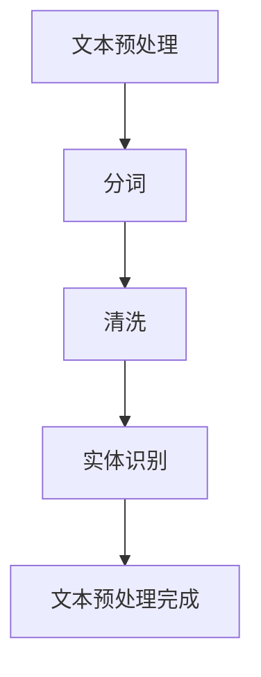

                 

# 快速构建LLM应用的微服务架构

## 概述

### 关键词

- 微服务架构
- 大规模语言模型（LLM）
- 架构设计
- 应用开发
- 性能优化
- 安全性

### 摘要

本文将探讨如何快速构建大规模语言模型（LLM）应用的微服务架构。首先，我们将介绍微服务架构的定义、优势与挑战。接着，分析LLM应用的需求与挑战，并探讨微服务架构在LLM应用中的适用性。随后，我们将详细阐述快速构建微服务架构的基础知识，包括微服务的基础知识、开发框架、部署与监控。在此基础上，通过实际案例，展示微服务的实现、部署与监控过程。最后，我们将总结微服务架构在LLM应用中的最佳实践，并展望未来发展趋势。

## 第一部分：快速构建LLM应用的微服务架构概述

### 第1章：什么是微服务架构

#### 1.1 微服务架构的定义

微服务架构是一种软件架构风格，它将应用程序划分为一组小的、独立的服务。这些服务围绕业务功能构建，各自运行在其独立的进程中，通过轻量级的通信机制（如HTTP/REST或消息队列）进行交互。每个服务都可以独立部署、升级和扩展，从而提高系统的可维护性、灵活性和可扩展性。

#### 1.2 微服务架构的优势

- **模块化**：服务之间解耦，便于独立开发和部署。
- **可扩展性**：根据需求独立扩展特定服务。
- **可维护性**：服务独立，易于管理和维护。
- **高可用性**：单个服务的故障不会影响整个系统。
- **灵活性**：支持不同的编程语言、数据库和消息队列。

#### 1.3 微服务架构的挑战

- **分布式系统复杂性**：服务间的通信和协调可能变得复杂。
- **数据一致性**：分布式系统中确保数据一致性是挑战。
- **监控与日志**：分布式系统的监控和日志分析需要额外的工具和技术。

### 第2章：LLM应用的需求与挑战

#### 2.1 LLM应用的需求

- **大规模数据处理**：LLM应用需要处理大量的文本数据，进行训练和推理。
- **高性能计算**：训练和推理过程需要高性能的计算资源。
- **高可扩展性**：随着用户数量的增加，系统需要能够水平扩展。
- **高可用性**：系统需要保证24/7不间断运行。

#### 2.2 LLM应用的挑战

- **数据一致性**：分布式训练过程中如何确保数据一致性。
- **计算资源管理**：如何高效地分配和调度计算资源。
- **模型部署**：如何快速部署和更新模型。
- **安全性**：如何保护用户数据和模型安全。

### 第3章：微服务架构在LLM应用中的适用性

#### 3.1 微服务架构在LLM应用中的优势

- **模块化**：便于管理和维护大规模的LLM应用。
- **可扩展性**：可以根据需求独立扩展服务，如文本预处理、训练、推理等。
- **高可用性**：服务独立部署，单个服务故障不会影响整个系统。

#### 3.2 微服务架构在LLM应用中的劣势

- **分布式系统复杂性**：需要处理分布式训练和推理的问题。
- **数据一致性**：分布式环境中确保数据一致性是挑战。
- **监控与日志**：需要额外的工具和技术来监控分布式系统。

### 第4章：快速构建微服务架构的基础知识

#### 4.1 微服务的基础知识

- **服务拆分**：如何将应用程序拆分成一组独立的服务。
- **服务通信**：服务间通信机制，如HTTP/REST、消息队列等。

#### 4.2 微服务开发框架

- **Spring Boot**：快速构建独立的、可扩展的微服务应用程序。
- **Django**：用于快速开发Web应用程序的微服务框架。

#### 4.3 微服务部署与监控

- **Docker**：容器化服务，便于部署和扩展。
- **Kubernetes**：容器编排工具，用于自动化部署、扩展和管理容器化应用。
- **Prometheus**：开源监控解决方案，用于监控微服务性能。

### 第5章：快速构建LLM应用微服务的实践

#### 5.1 实践项目介绍

本项目将构建一个简单的聊天机器人应用，使用微服务架构来处理文本预处理、训练、推理和响应生成等任务。

#### 5.2 微服务设计

根据项目需求，我们将应用拆分为以下服务：

1. **文本预处理服务**：负责处理用户输入的文本，包括文本清洗、分词、实体识别等。
2. **训练服务**：负责训练语言模型，如GPT-3、BERT等。
3. **推理服务**：负责处理用户输入的文本，生成响应。
4. **响应生成服务**：根据语言模型生成的响应，生成用户可理解的回答。

#### 5.3 微服务实现

我们将使用Spring Boot构建每个服务，并使用RESTful API进行服务间通信。

1. **文本预处理服务**：使用Java编写，利用NLP库进行文本处理。
2. **训练服务**：使用Python编写，利用PyTorch或TensorFlow进行模型训练。
3. **推理服务**：使用Java编写，利用训练好的模型进行文本推理。
4. **响应生成服务**：使用Python编写，利用自然语言生成库生成用户响应。

#### 5.4 微服务部署与监控

我们将使用Docker和Kubernetes部署服务，并使用Prometheus进行监控。

1. **Docker**：将每个服务打包成Docker镜像。
2. **Kubernetes**：将Docker镜像部署到Kubernetes集群中，并进行服务发现、负载均衡和自动扩缩容。
3. **Prometheus**：监控每个服务的性能指标，如CPU使用率、内存使用率、请求响应时间等。

## 第二部分：LLM应用微服务开发实战

### 第6章：LLM应用微服务开发工具与环境搭建

#### 6.1 开发工具介绍

- **Java**：用于构建文本预处理服务和推理服务。
- **Python**：用于构建训练服务和响应生成服务。
- **Spring Boot**：用于快速构建微服务应用程序。
- **PyTorch**：用于训练语言模型。
- **Docker**：用于容器化服务。
- **Kubernetes**：用于容器编排。
- **Prometheus**：用于监控服务性能。

#### 6.2 开发环境搭建

1. **安装Java和Python开发环境**：安装JDK和Python环境。
2. **安装Spring Boot和PyTorch**：下载并安装Spring Boot和PyTorch库。
3. **安装Docker和Kubernetes**：安装Docker和Kubernetes集群。
4. **安装Prometheus**：安装Prometheus服务器和客户端。

#### 6.3 开发流程

1. **服务设计**：根据项目需求设计服务。
2. **编码实现**：使用Java和Python编写服务代码。
3. **容器化**：将服务打包成Docker镜像。
4. **部署**：将Docker镜像部署到Kubernetes集群。
5. **监控**：使用Prometheus监控服务性能。

### 第7章：LLM应用微服务设计

#### 7.1 需求分析

本项目旨在构建一个聊天机器人，用户可以通过文本输入与机器人进行对话。需求包括：

1. **文本预处理**：对用户输入的文本进行清洗、分词和实体识别。
2. **训练模型**：使用大量文本数据训练语言模型。
3. **文本推理**：根据用户输入的文本，使用语言模型生成响应。
4. **响应生成**：根据语言模型生成的响应，生成用户可理解的回答。

#### 7.2 微服务划分

根据需求分析，我们将应用拆分为以下服务：

1. **文本预处理服务**：负责处理用户输入的文本。
2. **训练服务**：负责训练语言模型。
3. **推理服务**：负责处理用户输入的文本，生成响应。
4. **响应生成服务**：负责生成用户可理解的回答。

#### 7.3 微服务接口设计

每个服务都将提供RESTful API，以便其他服务可以调用。

1. **文本预处理服务**：提供文本清洗、分词和实体识别接口。
2. **训练服务**：提供训练模型接口。
3. **推理服务**：提供文本推理接口。
4. **响应生成服务**：提供响应生成接口。

## 第三部分：案例分析与总结

### 第8章：案例分析

#### 8.1 案例背景

假设我们正在开发一个面向企业的智能客服系统，该系统需要处理大量的客户咨询，并在秒级内生成响应。

#### 8.2 案例需求

1. **实时文本处理**：处理客户输入的文本，包括文本清洗、分词和实体识别。
2. **快速响应**：根据客户输入的文本，使用预训练的语言模型生成响应。
3. **高可用性**：系统需要确保7*24小时不间断运行。

#### 8.3 案例实现

我们采用微服务架构来实现该系统，具体实现如下：

1. **文本预处理服务**：使用Java编写，利用NLP库进行文本处理。
2. **训练服务**：使用Python编写，利用PyTorch训练语言模型。
3. **推理服务**：使用Java编写，利用训练好的模型进行文本推理。
4. **响应生成服务**：使用Python编写，利用自然语言生成库生成用户响应。

#### 8.4 案例总结

通过微服务架构，我们成功实现了高效、可扩展、高可用的智能客服系统。每个服务都可以独立部署和扩展，从而提高了系统的可维护性和灵活性。此外，使用Docker和Kubernetes进行容器化和编排，使得部署和运维更加简单高效。

### 第9章：总结与展望

#### 9.1 微服务架构在LLM应用中的总结

微服务架构为构建大规模语言模型（LLM）应用提供了模块化、可扩展性和高可用性的解决方案。通过将应用拆分成独立的服务，我们可以更灵活地进行开发、部署和扩展。同时，微服务架构也带来了一定的复杂性，如分布式系统的通信和数据一致性等。

#### 9.2 未来发展趋势

随着云计算和边缘计算的发展，微服务架构将继续在LLM应用中发挥重要作用。未来，我们将看到更多的工具和平台支持微服务开发，如Serverless架构、容器编排工具和自动扩展服务等。此外，随着人工智能技术的进步，LLM应用将变得更加智能化和个性化，对微服务架构的设计和实现也提出了更高的要求。

### 附录

#### 附录A：常用工具与资源

- **Spring Boot**：[https://spring.io/projects/spring-boot](https://spring.io/projects/spring-boot)
- **PyTorch**：[https://pytorch.org/](https://pytorch.org/)
- **Docker**：[https://www.docker.com/](https://www.docker.com/)
- **Kubernetes**：[https://kubernetes.io/](https://kubernetes.io/)
- **Prometheus**：[https://prometheus.io/](https://prometheus.io/)

#### 附录B：Python源代码示例

```python
# 示例：文本预处理服务
import nltk
from nltk.tokenize import word_tokenize
from nltk.corpus import stopwords

def preprocess_text(text):
    nltk.download('punkt')
    nltk.download('stopwords')
    
    tokens = word_tokenize(text)
    filtered_tokens = [token for token in tokens if token.lower() not in stopwords.words('english')]
    return filtered_tokens
```

#### 附录C：Mermaid图示例



## 结语

作者：AI天才研究院/AI Genius Institute & 禅与计算机程序设计艺术 /Zen And The Art of Computer Programming

本文详细介绍了如何快速构建大规模语言模型（LLM）应用的微服务架构，包括微服务架构的定义、优势与挑战，LLM应用的需求与挑战，微服务架构在LLM应用中的适用性，以及快速构建微服务架构的基础知识。通过一个实际案例，展示了微服务的实现、部署与监控过程。最后，对微服务架构在LLM应用中的最佳实践进行了总结，并展望了未来发展趋势。本文旨在帮助读者全面了解并掌握快速构建LLM应用微服务架构的方法和技巧。

