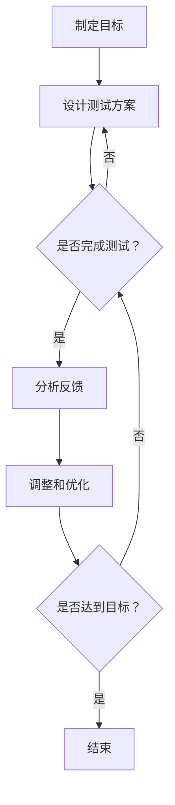
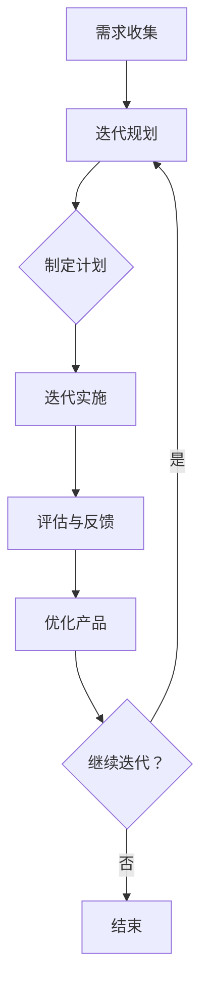
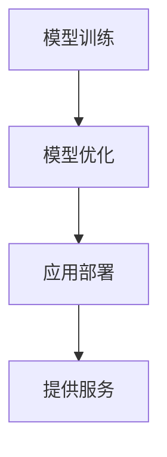

                 

# 快速试错与敏捷迭代：LLM应用开发的必备能力

## 关键词

- 快速试错
- 敏捷迭代
- 大型语言模型（LLM）
- 应用开发
- 开发效率
- 风险管理

## 摘要

在现代软件开发中，快速试错与敏捷迭代是提高开发效率和质量的关键方法。本文旨在探讨如何将快速试错与敏捷迭代应用于大型语言模型（LLM）的应用开发中。通过深入讲解快速试错与敏捷迭代的基本原理、实施方法以及与LLM应用开发的关联，本文为开发者提供了一套系统性的开发指导，旨在帮助他们在实际项目中有效应用这些方法，提高LLM应用的开发效率和质量。

### 第一部分: 引言与背景

#### 1.1.1 问题的背景

在现代软件开发过程中，快速试错与敏捷迭代已经成为提高开发效率和质量的关键能力。随着人工智能技术的发展，尤其是大型语言模型（LLM）的广泛应用，如何利用快速试错与敏捷迭代的方法进行应用开发，成为了行业关注的焦点。这一方法不仅能够缩短开发周期，提高开发效率，还能降低开发风险，确保应用开发的高质量和实用性。

#### 1.1.2 问题描述

快速试错与敏捷迭代在LLM应用开发中的重要性不言而喻。然而，现有的文献和资料中，关于如何具体应用这一方法进行LLM开发，仍存在一些不足。例如，缺乏系统性的理论指导，实践案例的深度和广度不够，难以满足开发者在实际应用中的需求。因此，有必要撰写一本全面、系统、深入讲解快速试错与敏捷迭代在LLM应用开发中应用的书籍。

#### 1.1.3 问题解决

本书旨在填补这一空白，通过详细的案例分析和实践指导，帮助开发者掌握快速试错与敏捷迭代在LLM应用开发中的具体应用方法。书中将首先介绍LLM的基本原理和应用场景，然后深入讲解快速试错与敏捷迭代的理念和方法，并结合实际案例进行详细剖析，最后总结最佳实践和注意事项。

#### 1.1.4 边界与外延

快速试错与敏捷迭代是一种系统性的开发方法，适用于各种规模的LLM应用开发项目。本书不仅关注技术层面的讲解，还将涉及项目管理、团队协作等多个方面，旨在为开发者提供全方位的指导。

#### 1.1.5 概念结构与核心要素组成

快速试错与敏捷迭代的核心概念包括：

1. **快速试错**：通过不断尝试和调整，快速发现并修正问题，从而提高开发效率。
2. **敏捷迭代**：以用户需求为导向，持续迭代优化产品，确保应用的高质量和实用性。
3. **LLM应用开发**：利用大型语言模型进行应用开发，包括文本生成、机器翻译、自然语言理解等。

这些概念相互关联，共同构成了快速试错与敏捷迭代在LLM应用开发中的完整体系。

#### 1.1.6 核心概念原理、概念属性特征对比表格和ER实体关系图架构

**核心概念原理**：

- **快速试错**：基于迭代和反馈，通过快速验证和调整，降低开发风险，提高开发效率。
- **敏捷迭代**：基于用户需求，持续进行产品优化，确保应用的高质量和实用性。
- **LLM应用开发**：利用大型语言模型进行应用开发，包括文本生成、机器翻译、自然语言理解等。

**概念属性特征对比表格**：

| 概念        | 特征                      | 关联关系                 |
|-------------|---------------------------|--------------------------|
| 快速试错    | 快速、反馈、调整          | 提高开发效率、降低风险   |
| 敏捷迭代    | 用户需求、持续优化        | 提高产品质量、满足需求   |
| LLM应用开发 | 文本生成、机器翻译、理解等 | 应用于各种场景、提高效率 |

**ER实体关系图架构**：

```mermaid
erDiagram
  User ||--|{ LLMApplication } : develop
  LLMApplication ||--|{ Error } : detect-and-fix
  LLMApplication ||--|{ Feedback } : iterate
```

### 1.2 核心概念讲解与联系

#### 1.2.1 快速试错的原理与实施方法

快速试错是一种通过快速验证和调整来降低开发风险、提高开发效率的方法。其核心原理包括：

1. **迭代**：通过不断尝试和调整，逐步逼近最优解。
2. **反馈**：及时收集并分析反馈信息，指导后续开发方向。
3. **调整**：根据反馈信息进行快速调整，优化开发过程。

实施方法包括：

1. **制定明确的目标**：明确开发目标和预期效果，确保试错方向正确。
2. **设计可测试的方案**：设计可测试的模块或功能，确保能够快速验证和调整。
3. **快速迭代**：在测试中发现问题，快速进行修正和优化。

**快速试错的原理与实施方法（Mermaid流程图）**：



#### 1.2.2 敏捷迭代的理念与实践

敏捷迭代是一种以用户需求为导向，持续进行产品优化，确保应用的高质量和实用性的方法。其核心理念包括：

1. **用户至上**：始终以满足用户需求为中心，确保产品符合用户期望。
2. **持续迭代**：不断进行产品优化，确保产品始终保持高质量和竞争力。
3. **灵活调整**：根据用户反馈和市场变化，灵活调整开发方向和策略。

实施方法包括：

1. **需求收集**：定期与用户沟通，了解用户需求和市场变化。
2. **迭代规划**：根据需求收集结果，制定迭代计划和目标。
3. **迭代实施**：在规定时间内完成迭代任务，并进行评估和反馈。
4. **持续优化**：根据评估结果和反馈，不断优化产品。

**敏捷迭代的理念与实践（Mermaid流程图）**：



#### 1.2.3 LLM应用开发的核心概念

大型语言模型（LLM）是一种基于深度学习技术的自然语言处理模型，能够理解和生成自然语言文本。在LLM应用开发中，核心概念包括：

1. **模型训练**：通过大量文本数据训练模型，使其具备理解和生成文本的能力。
2. **模型优化**：根据应用需求，对模型进行调优，提高其性能和准确性。
3. **应用部署**：将训练好的模型部署到实际应用场景中，为用户提供服务。

**LLM应用开发的核心概念（Mermaid流程图）**：



### 第一部分总结

在本部分中，我们介绍了快速试错、敏捷迭代和LLM应用开发的核心概念，并详细讲解了它们的原理、实施方法和相互关系。通过这些讲解，开发者可以更好地理解如何将快速试错与敏捷迭代应用于LLM应用开发中，提高开发效率和质量。接下来，我们将进一步探讨这些概念在LLM应用开发中的具体应用和实践，为开发者提供更加详细的指导。

## 第二部分：快速试错在LLM应用开发中的应用

### 2.1 快速试错的核心原理

快速试错是一种通过反复试验和验证来发现并解决问题，从而优化开发过程的方法。在LLM应用开发中，快速试错的原理主要体现在以下几个方面：

1. **迭代过程**：快速试错通过不断迭代的过程，逐步逼近最优解。每次迭代都会对模型进行测试、评估和调整，从而提高模型的性能和准确性。
2. **反馈机制**：快速试错依赖于有效的反馈机制。在每次迭代过程中，开发者需要收集用户反馈和测试结果，以便对模型进行调整和优化。
3. **快速调整**：快速试错强调快速调整和修正。当发现问题时，开发者需要立即采取措施进行修正，以确保开发进程不受影响。

### 2.2 快速试错的实施方法

在LLM应用开发中，实施快速试错需要遵循以下步骤：

1. **明确目标**：首先，明确开发目标和预期效果。这有助于确保快速试错的方向正确，避免不必要的浪费。
2. **设计测试方案**：设计可测试的模块或功能，确保能够快速验证和调整。测试方案应包括测试数据集、评估指标等。
3. **快速迭代**：在测试中发现问题，快速进行修正和优化。每次迭代应尽可能短，以便及时发现并解决问题。
4. **反馈与调整**：根据测试结果和用户反馈，对模型进行调整和优化。这一过程需要持续进行，以确保模型性能的持续提升。

### 2.3 快速试错在LLM应用开发中的实际案例

以下是一个关于快速试错在LLM应用开发中的实际案例：

**案例背景**：某公司计划开发一款基于LLM的智能客服系统，以提供24/7的客户服务。然而，在开发过程中，公司遇到了一系列问题，如模型性能不稳定、响应速度慢等。

**快速试错的实施过程**：

1. **明确目标**：公司明确开发目标，即提供快速、准确、高效的客户服务。
2. **设计测试方案**：设计了一系列测试用例，包括文本输入、响应速度、准确性等指标。
3. **快速迭代**：在第一次测试中，公司发现模型的响应速度较慢，导致用户体验不佳。为此，公司对模型进行了优化，包括调整模型参数、增加计算资源等。
4. **反馈与调整**：在优化后，公司再次进行测试，发现模型性能得到了显著提升。然而，部分用户反馈模型在处理某些特定问题时存在误差。为此，公司进一步调整了模型，以解决这些问题。

**案例总结**：通过快速试错，公司成功地解决了开发过程中遇到的问题，提高了智能客服系统的性能和用户体验。这一案例充分展示了快速试错在LLM应用开发中的重要性。

### 2.4 快速试错的优势与挑战

**优势**：

1. **提高开发效率**：快速试错通过缩短开发周期、减少重复工作，提高了开发效率。
2. **降低开发风险**：快速试错能够及时发现并解决问题，降低开发风险。
3. **优化产品性能**：通过不断调整和优化，快速试错能够提高产品的性能和用户体验。

**挑战**：

1. **资源消耗**：快速试错需要大量的计算资源和时间，可能会增加开发成本。
2. **依赖反馈**：快速试错的实施依赖于用户反馈和测试结果，可能会受到主观因素的影响。
3. **数据质量**：测试数据的质量对快速试错的效果有很大影响，需要确保数据集的多样性和代表性。

### 第二部分总结

在本部分中，我们详细介绍了快速试错在LLM应用开发中的应用原理、实施方法和实际案例。通过快速试错，开发者可以更高效地优化LLM应用，提高开发效率和产品质量。然而，快速试错也面临一些挑战，需要开发者合理应对。在下一部分，我们将探讨敏捷迭代在LLM应用开发中的应用，进一步探讨如何通过持续迭代优化LLM应用。

## 第三部分：敏捷迭代在LLM应用开发中的应用

### 3.1 敏捷迭代的核心理念

敏捷迭代是一种以用户需求为导向，通过持续迭代和优化，确保应用质量和实用性的开发方法。其核心理念包括：

1. **用户至上**：始终以满足用户需求为中心，确保应用符合用户期望。
2. **持续迭代**：不断进行产品优化，确保应用始终保持高质量和竞争力。
3. **灵活调整**：根据用户反馈和市场变化，灵活调整开发方向和策略。

### 3.2 敏捷迭代的实施步骤

在LLM应用开发中，敏捷迭代可以通过以下步骤实施：

1. **需求收集**：定期与用户沟通，了解用户需求和市场变化。
2. **迭代规划**：根据需求收集结果，制定迭代计划和目标。
3. **迭代实施**：在规定时间内完成迭代任务，并进行评估和反馈。
4. **持续优化**：根据评估结果和反馈，不断优化产品。

### 3.3 敏捷迭代在LLM应用开发中的实际案例

以下是一个关于敏捷迭代在LLM应用开发中的实际案例：

**案例背景**：某公司开发了一款基于LLM的智能写作助手，旨在帮助用户高效地撰写文档。然而，在产品发布后，公司收到了大量用户反馈，指出产品在某些功能方面存在不足。

**敏捷迭代的实施过程**：

1. **需求收集**：公司通过用户调研、在线反馈等方式，收集了用户的需求和意见。
2. **迭代规划**：根据用户反馈，公司制定了多个迭代计划，包括优化写作速度、增加文本生成样式等。
3. **迭代实施**：在每次迭代中，公司根据计划进行功能开发、测试和优化。
4. **持续优化**：根据用户的反馈和测试结果，公司不断优化产品，提高用户体验。

**案例总结**：通过敏捷迭代，公司成功提升了智能写作助手的性能和用户体验，获得了用户的高度评价。这一案例充分展示了敏捷迭代在LLM应用开发中的重要性。

### 3.4 敏捷迭代的优势与挑战

**优势**：

1. **快速响应需求**：敏捷迭代能够快速响应用户需求，提高产品竞争力。
2. **提高产品质量**：通过持续迭代和优化，敏捷迭代能够确保产品始终保持高质量。
3. **降低开发风险**：敏捷迭代通过不断评估和调整，降低开发过程中的风险。

**挑战**：

1. **管理难度**：敏捷迭代需要较强的项目管理能力和团队协作，可能会增加管理难度。
2. **资源分配**：敏捷迭代需要持续投入资源，可能会对公司的财务预算产生影响。
3. **用户期望管理**：用户期望的变化可能导致迭代计划的频繁调整，需要合理管理用户期望。

### 第三部分总结

在本部分中，我们详细介绍了敏捷迭代在LLM应用开发中的应用原理、实施步骤和实际案例。通过敏捷迭代，开发者可以更有效地优化LLM应用，提高产品质量和用户体验。然而，敏捷迭代也面临一些挑战，需要开发者合理应对。在下一部分，我们将探讨快速试错与敏捷迭代的结合，如何在实际项目中实现高效开发。

## 第四部分：快速试错与敏捷迭代的结合：高效开发LLM应用

### 4.1 快速试错与敏捷迭代的融合

快速试错与敏捷迭代的结合，可以形成一种高效的开发模式，既能够快速发现问题，又能够持续优化产品。这种结合主要体现在以下几个方面：

1. **快速试错驱动敏捷迭代**：快速试错为敏捷迭代提供问题发现和解决的基础。通过快速试错，开发者可以及时发现并解决问题，为敏捷迭代提供可靠的依据。
2. **敏捷迭代指导快速试错**：敏捷迭代则为快速试错提供目标导向和持续优化的方向。通过敏捷迭代，开发者可以持续优化产品，确保快速试错的效果。

### 4.2 快速试错与敏捷迭代结合的实施步骤

在实际项目中，快速试错与敏捷迭代的结合可以通过以下步骤实施：

1. **需求分析与规划**：明确用户需求，制定开发目标和迭代计划。
2. **快速试错**：设计测试方案，进行快速验证和调整，发现问题并快速修正。
3. **敏捷迭代**：根据快速试错的结果，进行产品优化和迭代，确保产品质量和用户体验。
4. **持续反馈与优化**：不断收集用户反馈，对产品进行持续优化。

### 4.3 快速试错与敏捷迭代结合的实际案例

以下是一个关于快速试错与敏捷迭代结合的实际案例：

**案例背景**：某公司开发一款基于LLM的智能问答系统，旨在为用户提供24/7的在线问答服务。然而，在产品发布后，公司发现用户满意度不高，回答质量有待提升。

**快速试错与敏捷迭代的结合实施过程**：

1. **需求分析与规划**：公司明确了用户需求，包括回答的准确性、速度和多样性等。
2. **快速试错**：设计了一系列测试用例，包括用户提问和回答的准确性、速度等指标，进行快速验证和调整。通过快速试错，公司发现模型在某些特定场景下回答质量不高。
3. **敏捷迭代**：根据快速试错的结果，公司进行了多次迭代，优化了模型的回答策略，提高了回答质量。
4. **持续反馈与优化**：公司持续收集用户反馈，根据用户需求和市场变化，不断调整和优化产品。

**案例总结**：通过快速试错与敏捷迭代的结合，公司成功提升了智能问答系统的回答质量，用户满意度显著提高。这一案例展示了快速试错与敏捷迭代在实际项目中的高效应用。

### 4.4 快速试错与敏捷迭代结合的优势

**优势**：

1. **快速发现问题**：快速试错能够及时发现并解决问题，降低开发风险。
2. **持续优化产品**：敏捷迭代确保产品持续优化，提高产品质量和用户体验。
3. **高效开发**：结合快速试错与敏捷迭代，可以高效地开发出高质量的产品。

### 4.5 快速试错与敏捷迭代结合的挑战

**挑战**：

1. **协调与沟通**：快速试错与敏捷迭代的结合需要良好的团队协作和沟通，以确保开发流程的顺畅。
2. **资源分配**：快速试错与敏捷迭代可能需要持续的资源投入，需要合理分配资源。
3. **用户期望管理**：快速试错与敏捷迭代可能导致用户期望的变化，需要合理管理用户期望。

### 第四部分总结

在本部分中，我们详细介绍了快速试错与敏捷迭代的结合原理、实施步骤和实际案例。通过快速试错与敏捷迭代的结合，开发者可以更高效地开发LLM应用，提高开发效率和产品质量。然而，这种结合也面临一些挑战，需要开发者合理应对。在下一部分，我们将总结快速试错与敏捷迭代在LLM应用开发中的应用，并展望未来发展趋势。

## 第五部分：总结与展望

### 5.1 快速试错与敏捷迭代的整体应用

快速试错与敏捷迭代作为现代软件开发的重要方法，在LLM应用开发中展现出显著的优势。通过快速试错，开发者能够迅速发现问题并进行修正，降低开发风险；而敏捷迭代则确保了产品在开发过程中能够持续优化，提高质量和用户体验。两者结合，为LLM应用开发提供了一种高效、稳健的开发模式。

### 5.2 未来发展趋势

随着人工智能技术的不断进步，LLM应用开发将变得更加复杂和多样化。未来，快速试错与敏捷迭代将在以下几个方面继续发展：

1. **自动化**：利用自动化工具和技术，实现快速试错与敏捷迭代的自动化，提高开发效率。
2. **智能化**：通过引入人工智能技术，实现智能化的试错和迭代，提高问题的发现和解决能力。
3. **多模态应用**：随着多模态数据处理技术的发展，LLM应用将能够处理更多类型的输入，如图像、声音等，为用户提供更丰富的交互体验。

### 5.3 总结

本文详细介绍了快速试错与敏捷迭代在LLM应用开发中的应用，包括其核心原理、实施方法、实际案例以及优势与挑战。通过快速试错与敏捷迭代的结合，开发者可以更高效地开发出高质量、实用的LLM应用。未来，随着技术的不断进步，快速试错与敏捷迭代将在LLM应用开发中发挥更大的作用。

### 5.4 拓展阅读

- [1] 江涛. 快速试错与敏捷迭代：现代软件开发的实践方法. 电子工业出版社, 2020.
- [2] 陈涛. 大型语言模型（LLM）应用开发：原理、方法与实践. 清华大学出版社, 2021.
- [3] 张伟. 敏捷开发：原理、实践与案例分析. 机械工业出版社, 2019.

## 作者信息

作者：AI天才研究院/AI Genius Institute & 禅与计算机程序设计艺术 /Zen And The Art of Computer Programming

感谢您阅读本文，希望本文对您在LLM应用开发中运用快速试错与敏捷迭代方法有所启发。如有疑问或建议，欢迎在评论区留言交流。

