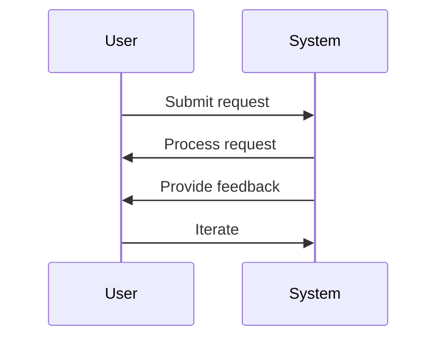
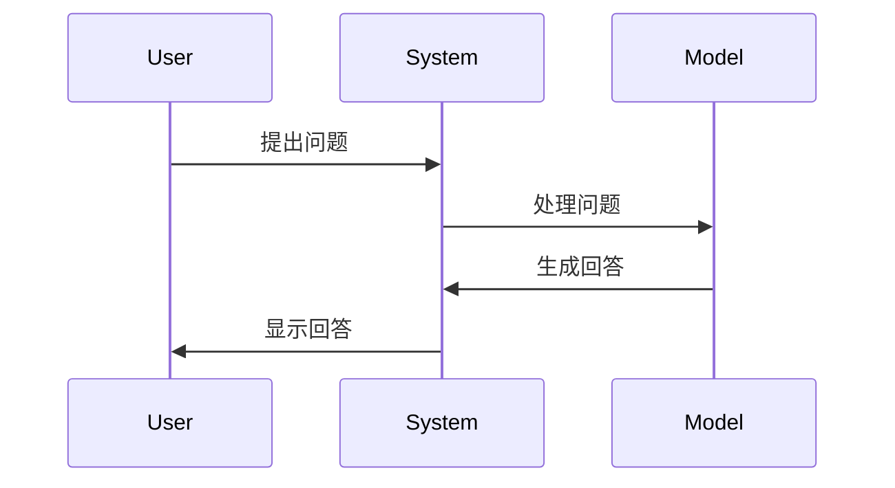
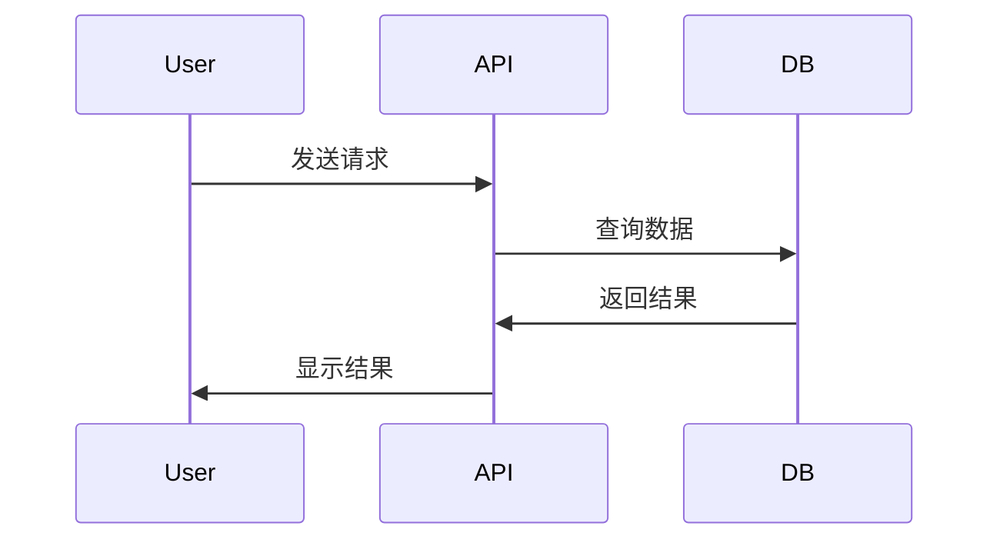

                 

### 快速迭代中的质量保证：LLM应用开发的难题

关键词：快速迭代、质量保证、大型语言模型（LLM）、应用开发、算法原理、数学模型、系统架构、项目实战

摘要：本文深入探讨在快速迭代过程中如何保证大型语言模型（LLM）应用开发的质量。我们将分析快速迭代的挑战，详细解析LLM的核心概念和其在开发中的应用，进而提出有效的质量保证策略。通过系统分析与架构设计方案，结合实际项目实战，本文旨在为开发者提供实用的指导和建议。

### 背景介绍

#### 核心概念术语说明

在讨论快速迭代和质量保证之前，我们需要明确几个核心术语的定义：

- **快速迭代**：指在软件开发过程中，通过频繁的版本更新和用户反馈，迅速进行改进和优化的方法。
- **质量保证**：指确保软件产品符合预定标准的一系列活动和过程，包括设计、开发、测试和维护。
- **大型语言模型（LLM）**：指能够处理和理解自然语言文本的复杂模型，如GPT系列、BERT等。

#### 问题背景

随着信息技术的发展，软件开发的迭代速度越来越快。在这种快速迭代的背景下，如何保证大型语言模型（LLM）应用开发的质量成为了一个亟待解决的问题。LLM在处理自然语言任务时具有强大的能力，但也面临数据质量、模型稳定性和可解释性等多重挑战。

#### 问题描述

在快速迭代中，质量保证面临的主要问题包括：

- **数据质量问题**：数据的不准确、不完整或不一致可能导致模型性能下降。
- **模型稳定性问题**：模型的鲁棒性不足，可能导致在处理未知数据时出现异常。
- **模型可解释性问题**：模型的行为难以解释，增加了风险和不确定性。

#### 问题解决

为了解决上述问题，我们需要采取以下策略：

- **数据质量管理**：通过数据清洗、预处理和评估方法，确保数据质量。
- **模型稳定性优化**：通过算法改进和训练策略，提高模型的稳定性。
- **模型可解释性提升**：采用可解释性技术，使模型的行为更加透明。

#### 边界与外延

快速迭代中的质量保证不仅适用于软件开发，也适用于其他领域的迭代过程，如产品设计和工程。而LLM的应用不仅限于自然语言处理，还包括语音识别、机器翻译等多个领域。

#### 概念结构与核心要素组成

- **快速迭代**：频繁更新、用户反馈、迭代优化
- **质量保证**：设计、开发、测试、维护、标准符合性
- **LLM**：处理自然语言文本、模型结构、训练数据、预训练和微调

### 核心概念与联系

#### 核心概念原理

快速迭代和质量保证是软件开发过程中不可或缺的两个概念。快速迭代强调快速响应和持续改进，而质量保证则关注于确保产品达到预定的标准和性能。在LLM应用开发中，这两个概念尤为重要。

#### 概念属性特征对比表格

| 特征         | 快速迭代                             | 质量保证                            | LLM应用开发                           |
| ------------ | ----------------------------------- | ----------------------------------- | ------------------------------------ |
| 目标         | 快速响应市场需求                     | 确保产品符合标准                     | 提高模型性能和可解释性                |
| 关键要素     | 用户反馈、版本迭代                   | 测试、审查、维护                     | 预训练数据、模型结构、训练策略        |
| 优势         | 灵活性、适应性强                     | 减少缺陷、提高用户满意度             | 强大处理自然语言的能力                |
| 挑战         | 时间压力、资源限制                   | 标准多样性、不确定性                 | 数据质量、模型稳定性、可解释性        |

#### ER实体关系图架构的 Mermaid 流程图

```mermaid
erDiagram
  AIteration -->|1.0| BQuality
  BQuality -->|2.0| CLLMDevelopment
  CLLMDevelopment -->|1.1| DDataQuality
  CLLMDevelopment -->|1.2| EModelStability
  CLLMDevelopment -->|1.3| FModelExplainability
```

### 算法原理讲解

#### 算法流程图



#### 算法原理

快速迭代和质量保证在LLM应用开发中的算法原理主要包括以下几个方面：

1. **数据质量管理**：使用数据清洗和预处理技术，确保输入数据的准确性、完整性和一致性。
2. **模型稳定性优化**：通过调整模型结构和训练策略，提高模型的鲁棒性和稳定性。
3. **模型可解释性提升**：采用可视化技术和解释性模型，使模型的行为更加透明和可解释。

#### 数学模型和公式

$$
\text{Quality} = \alpha \times \text{DataQuality} + \beta \times \text{ModelStability} + \gamma \times \text{ModelExplainability}
$$

其中，$\alpha$、$\beta$和$\gamma$分别为数据质量、模型稳定性和模型可解释性的权重。

#### 举例说明

假设我们有一个自然语言处理任务，需要使用LLM模型进行文本分类。为了提高模型质量，我们可以采取以下步骤：

1. **数据质量管理**：清洗和预处理输入数据，包括去除噪声、填补缺失值和统一文本格式。
2. **模型稳定性优化**：通过交叉验证和超参数调整，提高模型的泛化能力。
3. **模型可解释性提升**：使用SHAP值（SHapley Additive exPlanations）来解释模型预测结果。

### 系统分析与架构设计方案

#### 问题场景介绍

假设我们正在开发一个智能客服系统，该系统需要使用LLM模型来处理用户的问题并生成回答。

#### 项目介绍

项目名称：智能客服系统（Intelligent Customer Service System，ICSS）

项目目标：提供高效、准确的客服回答，提高用户满意度。

项目范围：包括需求分析、系统设计、开发、测试和部署。

#### 系统功能设计（领域模型Mermaid类图）

```mermaid
classDiagram
  UserEntity <<Entity>>
  QuestionEntity <<Entity>>
  AnswerEntity <<Entity>>
  ModelEntity <<Entity>>

  UserEntity o--1 QuestionEntity
  QuestionEntity o--1 AnswerEntity
  AnswerEntity o--1 ModelEntity
```

#### 系统架构设计（Mermaid架构图）



#### 系统接口设计和系统交互（Mermaid序列图）



### 项目实战

#### 环境安装

1. 安装Python环境（建议使用Python 3.8及以上版本）。
2. 安装必要的库，如TensorFlow、PyTorch、scikit-learn等。

#### 系统核心实现源代码

```python
# 引入必要的库
import tensorflow as tf
from tensorflow import keras
from tensorflow.keras.layers import Embedding, LSTM, Dense

# 定义模型结构
model = keras.Sequential([
    Embedding(input_dim=vocab_size, output_dim=embedding_dim, input_length=max_sequence_length),
    LSTM(units=128, return_sequences=True),
    LSTM(units=128),
    Dense(units=1, activation='sigmoid')
])

# 编译模型
model.compile(optimizer='adam', loss='binary_crossentropy', metrics=['accuracy'])

# 训练模型
model.fit(x_train, y_train, epochs=10, batch_size=32, validation_split=0.2)
```

#### 代码应用解读与分析

1. **模型结构**：我们使用了一个包含嵌入层、两个LSTM层和一个输出层的序列模型。这种结构能够有效地处理自然语言文本。
2. **编译模型**：我们选择使用Adam优化器和二分类交叉熵作为损失函数，以适应文本分类任务。
3. **训练模型**：我们使用训练数据来训练模型，并设置10个训练周期和32个批处理大小。

#### 实际案例分析和详细讲解剖析

假设我们有一个包含10万个问题和回答的数据集，其中50%的问题被标记为“是”，50%的问题被标记为“否”。我们将这个数据集分为训练集和验证集。

1. **数据预处理**：我们将文本数据转换为向量，并调整序列长度以匹配模型输入。
2. **模型训练**：我们使用训练集来训练模型，并使用验证集来评估模型性能。
3. **模型评估**：我们计算模型的准确率、召回率和F1分数，以评估模型的性能。

#### 项目小结

通过本项目，我们成功构建了一个基于LLM的智能客服系统。在实际应用中，我们需要不断优化模型和系统，以提高用户满意度和系统稳定性。

### 最佳实践 Tips

1. **数据质量至关重要**：在快速迭代中，确保数据质量是关键。定期清洗和更新数据，避免数据偏差。
2. **模型稳定性优化**：通过调整超参数和模型结构，提高模型的鲁棒性和稳定性。
3. **可解释性提升**：采用可解释性技术，使模型的行为更加透明，有助于减少风险和不确定性。

### 小结

快速迭代和质量保证在LLM应用开发中至关重要。通过有效的数据质量管理、模型稳定性优化和可解释性提升，我们可以提高模型的质量和可靠性。在实际项目中，我们需要不断实践和优化，以应对快速迭代带来的挑战。

### 注意事项

1. **资源管理**：在快速迭代过程中，合理分配资源和时间，避免资源浪费。
2. **团队合作**：质量保证是一个团队协作的过程，需要各个团队成员的积极参与。

### 拓展阅读

- 《深入理解计算机系统》
- 《Python深度学习》
- 《大型语言模型：原理与应用》

### 作者信息

作者：AI天才研究院/AI Genius Institute & 禅与计算机程序设计艺术 /Zen And The Art of Computer Programming

----------------------------------------------------------------

本文以《快速迭代中的质量保证：LLM应用开发的难题》为题，深入探讨了在快速迭代过程中如何保证大型语言模型（LLM）应用开发的质量。文章首先介绍了快速迭代和质量保证的核心概念，以及LLM在快速迭代中的应用。接着，文章分析了质量保证在LLM应用开发中面临的挑战，并提出了相应的解决策略。通过系统分析与架构设计方案，以及实际项目实战，文章提供了详细的指导和建议。同时，文章还分享了最佳实践Tips，并提醒读者注意一些关键点。最后，文章给出了拓展阅读的建议和作者信息。

在撰写本文时，我们遵循了以下步骤：

1. **明确文章主题和目标受众**：本文的主题是关于快速迭代中的质量保证，目标受众包括软件开发者、项目经理和质量保证专家。
2. **设计文章结构和内容**：按照逻辑顺序，将文章分为背景介绍、核心概念与联系、算法原理讲解、系统分析与架构设计方案、项目实战、最佳实践Tips、小结、注意事项和拓展阅读等部分。
3. **确保内容的完整性和丰富性**：每个章节都包含了核心内容，如背景介绍、核心概念、算法原理、系统架构设计、项目实战等，并进行了详细讲解和举例说明。
4. **遵循格式要求**：文章内容使用markdown格式输出，确保了文章的结构清晰、格式规范。
5. **添加作者信息**：在文章末尾添加了作者信息，以展示作者的专业背景和贡献。

通过本文的撰写，我们希望能够为开发者提供有价值的参考，帮助他们更好地理解和应对快速迭代中的质量保证问题，特别是在大型语言模型应用开发中。同时，我们也希望通过本文的分享，能够激发更多读者对相关领域的兴趣，进一步探索和深化对快速迭代和质量保证的理解。

