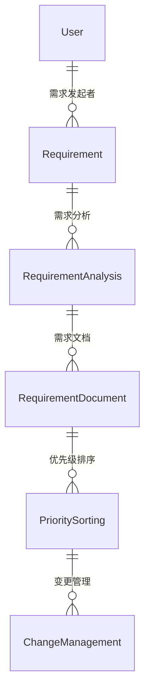

                 

### 快速迭代中的需求管理：LLM应用开发的挑战

#### 关键词：快速迭代、需求管理、LLM、敏捷开发、需求变更管理

> 摘要：本文深入探讨了快速迭代模式下的需求管理，特别是在大规模语言模型（LLM）应用开发中的挑战。通过分析快速迭代和需求管理的关系，我们探讨了LLM应用开发的独特性，以及应对这些挑战的实践和方法。文章旨在为开发团队提供实用的指南，以实现高效的需求管理和项目成功。

### 目录大纲

----------------------------------------------------------------

## 第一部分: 问题背景与核心概念

### 第1章: 背景介绍

#### 1.1 问题背景

- **问题描述**: 随着敏捷开发和快速迭代模式的普及，需求管理的复杂性和挑战性日益增加。特别是在大规模语言模型（LLM）应用开发中，如何高效管理需求成为开发团队面临的重要问题。
- **问题解决**: 需要深入了解快速迭代和需求管理的关系，掌握LLM应用开发的独特挑战，并探索相应的解决方案。

#### 1.2 核心概念

- **快速迭代**: 快速迭代是一种软件开发模式，强调快速交付、持续反馈和持续改进。
- **需求管理**: 需求管理涉及识别、分析、记录、优先排序和追踪用户需求，以确保软件产品满足用户需求。

#### 1.3 边界与外延

- **边界**: 本书主要关注LLM应用开发中的需求管理，而非传统软件项目。
- **外延**: 本书的讨论范围包括需求收集、需求分析、需求优先级排序和需求变更管理。

## 第二部分: LLM应用开发中的需求管理

### 第2章: LLM应用开发挑战

#### 2.1 LLM基本原理

- **定义与特点**: 简述LLM的定义、特点和优势。
- **应用场景**: 分析LLM在不同领域的应用，如自然语言处理、智能客服和内容生成。

#### 2.2 需求管理的独特挑战

- **复杂性与不确定性**: 由于LLM模型的复杂性，需求管理面临更大的不确定性。
- **动态性与迭代性**: 快速迭代要求需求管理具有更高的灵活性和敏捷性。
- **大规模数据处理**: LLM应用需要处理海量数据，对数据处理能力有较高要求。

### 第3章: 需求收集与分析

#### 3.1 需求收集

- **用户访谈与调研**: 通过访谈和调研获取用户需求。
- **需求文档编写**: 编写清晰、详细的需求文档。

#### 3.2 需求分析

- **需求优先级排序**: 采用优先级排序方法，如MoSCoW法，对需求进行排序。
- **需求验证**: 通过验证确保需求满足用户需求。

## 第三部分: LLM应用开发中的需求管理实践

### 第4章: 需求变更管理

#### 4.1 变更管理策略

- **变更控制流程**: 确定变更管理的流程和规则。
- **变更影响评估**: 对变更可能带来的影响进行评估。

#### 4.2 变更实施与追踪

- **变更实施**: 按照变更计划实施变更。
- **变更追踪**: 对变更实施进行追踪和反馈。

### 第5章: 需求管理工具与技术

#### 5.1 常用需求管理工具

- **JIRA**: JIRA的需求管理功能。
- **Confluence**: Confluence的知识管理和协作功能。

#### 5.2 需求管理技术

- **敏捷开发方法**: 使用敏捷方法管理需求，如Scrum和Kanban。
- **自动化需求管理**: 利用工具实现自动化需求收集、分析和追踪。

### 第6章: 案例研究

#### 6.1 案例选择

- **案例选择标准**: 选择具有代表性的LLM应用开发案例。

#### 6.2 案例分析

- **需求管理实践**: 分析案例中的需求管理实践。
- **效果评估**: 评估案例中的需求管理效果。

### 第7章: 总结与展望

#### 7.1 总结

- **核心要点**: 总结本书的核心内容。
- **实践经验**: 总结实践中积累的经验。

#### 7.2 展望

- **未来趋势**: 展望LLM应用开发中需求管理的未来趋势。
- **发展方向**: 提出需求管理的发展方向。

----------------------------------------------------------------

### 第一部分: 问题背景与核心概念

#### 1.1 问题背景

随着现代软件工程的不断发展，敏捷开发和快速迭代模式已经成为软件开发的主流。这种模式强调快速响应市场需求、持续交付产品以及不断改进，从而提高开发效率和产品质量。然而，在快速迭代的过程中，需求管理面临着前所未有的挑战。

**问题描述**：快速迭代模式下的需求管理问题主要体现在以下几个方面：

1. **需求变更频繁**：在快速迭代的过程中，客户需求可能随时发生变化。开发团队需要能够迅速适应这些变化，确保产品能够满足最新的用户需求。
2. **需求质量难以保障**：快速迭代往往导致开发时间紧张，团队可能无法深入理解所有需求，导致需求质量下降。
3. **沟通成本增加**：频繁的需求变更和迭代要求团队成员之间保持密切沟通，这无疑增加了沟通成本。

**问题解决**：为了解决这些问题，开发团队需要采取一系列策略：

1. **强化需求管理流程**：建立一套完善的需求管理流程，确保需求收集、分析、优先级排序和变更管理等环节能够顺利进行。
2. **提高团队协作效率**：通过有效的沟通工具和方法，提高团队成员之间的协作效率，确保信息传递的准确性和及时性。
3. **优化需求变更管理**：制定合理的变更管理策略，确保变更请求能够得到及时响应和有效处理。

#### 1.2 核心概念

**快速迭代**：快速迭代是一种软件开发模式，它强调快速交付可用的软件产品，并在后续迭代中不断改进。这种模式的核心思想是快速响应市场需求，通过频繁的迭代来逐步完善产品。

**需求管理**：需求管理是指对软件产品的需求进行识别、分析、记录、优先级排序和追踪的过程。它是软件开发过程中至关重要的一环，确保产品能够满足用户需求。

**快速迭代与需求管理的关系**：快速迭代模式要求需求管理具有更高的灵活性和敏捷性。需求管理需要能够快速响应需求变更，同时确保需求的质量和稳定性。

#### 1.3 边界与外延

**边界**：本书主要关注大规模语言模型（LLM）应用开发中的需求管理问题。与其他软件项目相比，LLM应用开发具有独特的挑战和需求管理特点。

**外延**：本书的讨论范围包括以下几个方面：

1. **需求收集**：通过访谈、调研等方式获取用户需求，并将其记录下来。
2. **需求分析**：对收集到的需求进行分析，确定需求的可行性和优先级。
3. **需求优先级排序**：采用合适的排序方法，如MoSCoW法，对需求进行优先级排序，确保关键需求得到优先处理。
4. **需求变更管理**：在快速迭代的过程中，需求变更不可避免。因此，需要建立一套完善的变更管理流程，确保变更请求能够得到及时响应和处理。

### 1.4 概念结构与核心要素组成

**概念结构**：快速迭代需求管理的概念结构包括以下几个核心要素：

1. **需求收集**：获取用户需求。
2. **需求分析**：分析需求，确保其可行性和优先级。
3. **需求文档**：编写详细的需求文档，记录需求的具体内容和相关细节。
4. **优先级排序**：对需求进行优先级排序，确保关键需求得到优先处理。
5. **需求变更管理**：管理需求变更，确保变更能够得到及时响应和处理。

**核心要素组成**：

1. **用户需求**：用户需求是需求管理的核心。通过收集和分析用户需求，可以确保产品能够满足用户期望。
2. **需求文档**：需求文档是需求管理的基石。它不仅记录了用户需求，还包含了需求的详细描述、优先级、可行性分析等信息。
3. **优先级排序**：优先级排序是确保需求管理高效运行的关键。通过合理的排序方法，可以确保关键需求得到优先处理，从而提高产品交付的质量和效率。
4. **变更管理**：变更管理是快速迭代需求管理的重要组成部分。在快速迭代过程中，需求变更不可避免。因此，需要建立一套完善的变更管理流程，确保变更请求能够得到及时响应和处理。

### 1.5 概念属性特征对比表格

为了更好地理解快速迭代需求管理的核心概念，我们可以通过以下表格对比各个概念的关键属性和特征：

| 概念        | 定义                                                         | 关键属性特征对比 |
| ----------- | ------------------------------------------------------------ | --------------- |
| 快速迭代    | 一种软件开发模式，强调快速交付、持续反馈和持续改进。         | - 短周期迭代 - 高频反馈 - 快速响应变更 |
| 需求管理    | 对软件产品的需求进行识别、分析、记录、优先级排序和追踪的过程。 | - 用户需求收集 - 需求分析 - 需求文档编写 - 优先级排序 - 变更管理 |
| LLM应用开发 | 大规模语言模型的应用开发。                                   | - 复杂性高 - 数据处理需求大 - 需求变更频繁 |

通过对比，我们可以看出快速迭代需求管理与LLM应用开发在需求管理的目标和挑战上存在一定的差异。快速迭代需求管理更注重快速响应变更和确保需求质量，而LLM应用开发中的需求管理则更加关注数据处理的复杂性和需求变更的频繁性。

### 1.6 ER实体关系图架构

为了更好地理解快速迭代需求管理的核心概念和关系，我们可以通过ER（实体-关系）图来展示各个实体及其之间的关系。

下面是一个简化的ER图，展示了快速迭代需求管理中的核心实体和它们之间的关系：

**ER图解释**：

1. **User（用户）**：表示需求发起者，是需求管理的起点。用户提出的需求需要经过分析、文档编写、优先级排序和变更管理等环节。
2. **Requirement（需求）**：表示用户提出的需求，是需求管理的核心实体。需求会经过分析，以确保其可行性和优先级。
3. **RequirementAnalysis（需求分析）**：表示对需求的分析过程，确保需求满足业务需求和技术可行性。
4. **RequirementDocument（需求文档）**：表示记录需求的具体文档，包含了需求的详细描述、优先级和可行性分析等信息。
5. **PrioritySorting（优先级排序）**：表示对需求进行优先级排序的过程，确保关键需求得到优先处理。
6. **ChangeManagement（变更管理）**：表示变更管理过程，确保需求变更能够得到及时响应和处理。

通过ER图，我们可以清晰地看到快速迭代需求管理中的核心实体及其之间的依赖关系。这有助于我们更好地理解需求管理的流程和各个环节之间的关联。

### 1.7 快速迭代与需求管理的流程和方法

**1.7.1 流程概述**

快速迭代需求管理通常包括以下几个主要流程：

1. **需求收集**：通过与用户沟通、调研等方式，收集用户需求。
2. **需求分析**：对收集到的需求进行分析，确定其可行性、优先级和实现路径。
3. **需求文档编写**：将分析后的需求编写成文档，以便团队成员理解和跟踪。
4. **优先级排序**：根据业务需求和紧急程度，对需求进行优先级排序。
5. **需求变更管理**：在快速迭代过程中，需求可能会发生变化，需要建立变更管理流程，确保变更得到有效控制。

**1.7.2 方法分析**

1. **用户访谈与调研**：通过与用户的面对面交流或在线调研，深入了解用户的需求和痛点，确保需求的真实性和准确性。
2. **需求文档编写**：编写清晰、详细的需求文档，包括需求描述、功能需求、性能需求、界面需求等，以便团队成员参考和实施。
3. **MoSCoW法**：一种常用的需求优先级排序方法，将需求分为四个类别：Must have（必须要有）、Should have（应该有）、Could have（可以有一点）、Won't have（不会有）。这种方法有助于团队明确哪些需求是必须优先实现的。
4. **需求验证**：在需求实施之前，通过用户验收测试等方式，验证需求是否满足用户期望。

**1.7.3 案例分析**

**案例背景**：某互联网公司开发一款智能客服系统，需要在短时间内上线并满足用户的基本需求。

**案例分析**：

1. **需求收集**：通过与用户沟通，了解用户对客服系统的期望和需求，如快速响应、多样化的问题处理能力等。
2. **需求分析**：对收集到的需求进行分析，确定需求的具体实现路径和技术可行性。
3. **需求文档编写**：编写详细的需求文档，包括功能需求、性能需求和界面需求等。
4. **优先级排序**：根据用户需求和项目进度，将需求分为几个优先级类别，如“必须实现”、“应该实现”、“可以延迟实现”等。
5. **需求变更管理**：在开发过程中，用户可能会提出新的需求或对现有需求进行修改，需要建立变更管理流程，确保变更得到及时响应和处理。

通过这个案例，我们可以看到快速迭代需求管理的具体实施过程和方法。在实际项目中，开发团队可以根据项目特点和需求特点，灵活调整需求管理流程和方法，以确保项目的顺利进行和成功交付。

### 1.8 边界与外延

**1.8.1 边界**

本文主要关注大规模语言模型（LLM）应用开发中的需求管理问题。LLM应用开发具有以下特点：

1. **复杂性高**：LLM模型涉及大量的数据和处理算法，开发过程中需要处理大量的计算资源和数据处理需求。
2. **数据处理需求大**：LLM应用通常需要处理海量的文本数据，对数据处理能力和速度有较高的要求。
3. **需求变更频繁**：用户对LLM应用的需求可能随时发生变化，开发团队需要具备快速响应需求变更的能力。

**1.8.2 外延**

本文的讨论范围包括以下几个方面：

1. **需求收集**：通过访谈、调研等方式收集用户需求，确保需求的真实性和准确性。
2. **需求分析**：对收集到的需求进行分析，确定需求的可行性、优先级和实现路径。
3. **需求文档编写**：编写详细的需求文档，包括需求描述、功能需求、性能需求和界面需求等。
4. **优先级排序**：采用合适的优先级排序方法，如MoSCoW法，对需求进行排序，确保关键需求得到优先处理。
5. **需求变更管理**：建立完善的变更管理流程，确保需求变更能够得到及时响应和处理。

通过明确本文的边界和外延，可以帮助读者更好地理解文章的主题和内容，从而更有效地应用文中提到的需求管理方法。

### 第一部分总结

在本部分中，我们深入探讨了快速迭代需求管理的背景、核心概念及其在LLM应用开发中的挑战。首先，我们分析了快速迭代模式下的需求管理问题，包括需求变更频繁、需求质量难以保障和沟通成本增加等。接着，我们介绍了快速迭代和需求管理的核心概念，并阐述了它们之间的关系。此外，我们还讨论了快速迭代需求管理的边界与外延，明确了本文的研究范围和重点。通过这一部分的探讨，我们为后续章节的深入分析奠定了坚实的基础。

### 第二部分：LLM应用开发中的需求管理

#### 2.1 LLM基本原理

**定义与特点**：大规模语言模型（Large Language Model，简称LLM）是一种基于深度学习的自然语言处理技术。它通过训练大量的文本数据，学习语言的模式和规律，从而实现对自然语言的生成、理解和翻译等功能。LLM具有以下主要特点：

1. **强大的文本处理能力**：LLM能够处理和理解大量的文本数据，从而提供丰富的语言知识和上下文信息。
2. **自适应性强**：LLM可以根据不同的应用场景和需求进行自适应调整，提高其在特定领域的表现。
3. **通用性强**：LLM不仅适用于自然语言处理任务，还可以应用于其他领域，如问答系统、内容生成和文本分类等。

**应用场景**：LLM在不同领域有广泛的应用，主要包括：

1. **自然语言处理**：LLM可以用于文本分类、情感分析、命名实体识别等自然语言处理任务。
2. **智能客服**：LLM可以模拟人类对话，提供智能客服解决方案，提高客户服务水平。
3. **内容生成**：LLM可以用于生成文章、摘要、广告文案等，提高内容创作的效率和质量。
4. **翻译与语言学习**：LLM可以用于机器翻译和语言学习，帮助用户更好地理解和学习新的语言。

#### 2.2 需求管理的独特挑战

**复杂性与不确定性**：LLM模型涉及大量的数据和处理算法，使得需求管理过程更加复杂。具体来说，LLM应用开发中的需求管理面临以下挑战：

1. **需求理解难度大**：由于LLM模型的高度复杂性和抽象性，开发团队可能难以准确理解用户需求，导致需求实现与用户期望之间存在差距。
2. **需求变更频繁**：在LLM应用开发过程中，用户需求可能随时发生变化。这种频繁的需求变更使得需求管理变得更加复杂和困难。
3. **数据质量要求高**：LLM模型训练需要大量的高质量数据，数据质量和数据准备过程直接影响模型的性能和效果。因此，需求管理需要确保数据的质量和完整性。

**动态性与迭代性**：快速迭代是LLM应用开发的重要特点，需求管理需要具备高度的动态性和迭代性。具体来说，需求管理需要满足以下要求：

1. **快速响应需求变更**：在快速迭代过程中，需求变更频繁发生。需求管理需要能够快速响应这些变更，确保模型能够及时调整和优化。
2. **持续迭代优化**：需求管理需要支持持续的迭代优化过程，通过不断收集用户反馈和改进需求，提高模型的性能和用户体验。
3. **灵活调整优先级**：在快速迭代过程中，需求优先级可能会发生变化。需求管理需要具备灵活调整优先级的能力，确保关键需求得到优先处理。

**大规模数据处理**：LLM应用通常需要处理海量的文本数据，对数据处理能力有较高要求。具体来说，需求管理需要满足以下挑战：

1. **数据处理效率**：LLM模型训练过程中需要处理大量的数据，需求管理需要确保数据处理的高效性，减少数据处理时间和资源消耗。
2. **数据存储与管理**：由于数据量大，需求管理需要建立高效的数据存储和管理机制，确保数据的安全性和可访问性。
3. **数据质量保障**：在数据处理过程中，需求管理需要确保数据的质量和准确性，避免数据错误和异常对模型性能产生负面影响。

#### 2.3 需求收集与分析

**需求收集**：

需求收集是需求管理的重要环节，直接影响到需求的质量和实现效果。在LLM应用开发中，需求收集需要考虑以下关键步骤：

1. **用户访谈与调研**：通过与用户进行面对面访谈或在线调研，深入了解用户的需求和期望。访谈和调研的内容应包括用户对LLM应用的具体需求、功能期望和使用场景等。
2. **文档收集与分析**：收集现有的用户文档、业务文档和技术文档，分析其中的需求信息，为后续的需求整理和文档编写提供基础。
3. **数据分析与整理**：对收集到的数据进行整理和分析，提取关键需求，确保需求的完整性和准确性。

**需求分析**：

需求分析是确保需求可行性和实现路径的重要环节。在LLM应用开发中，需求分析需要考虑以下关键步骤：

1. **需求验证**：通过用户验收测试、原型演示等方式，验证需求是否符合用户期望，确保需求的准确性和可行性。
2. **需求分类**：根据需求的重要性和紧急程度，对需求进行分类和优先级排序。常用的分类方法包括MoSCoW法（必须实现、应该实现、可以延迟实现、不会实现）。
3. **需求细化**：对关键需求进行细化，明确需求的详细描述、功能要求、性能要求、界面要求等，确保需求的具体性和可实施性。
4. **需求文档编写**：将分析后的需求编写成文档，包括需求描述、需求分类、需求优先级、实现路径和预期效果等。

#### 2.4 需求优先级排序

需求优先级排序是确保需求管理高效运行的重要环节。在LLM应用开发中，需求优先级排序需要考虑以下关键方法：

1. **MoSCoW法**：MoSCoW法是一种常用的需求优先级排序方法，将需求分为四个类别：必须实现（Must have）、应该实现（Should have）、可以延迟实现（Could have）和不会实现（Won't have）。这种方法有助于明确哪些需求是必须优先实现的，确保关键需求得到优先处理。
2. **价值排序**：根据需求对业务价值和用户价值的大小，对需求进行排序。价值排序方法可以帮助团队聚焦于对业务和用户最有价值的部分，确保资源的有效利用。
3. **紧急程度排序**：根据需求的紧急程度，对需求进行排序。紧急程度高的需求需要优先处理，以确保项目能够按时交付和满足用户需求。

#### 2.5 需求验证

需求验证是确保需求实现效果和用户满意度的重要环节。在LLM应用开发中，需求验证需要考虑以下关键步骤：

1. **用户验收测试（UAT）**：通过与用户合作，对需求实现进行验收测试，确保需求的功能、性能和用户体验符合用户期望。UAT通常包括功能测试、性能测试和用户体验测试等。
2. **原型验证**：在需求实现之前，通过原型演示和用户反馈，验证需求的具体实现路径和用户界面设计。原型验证可以帮助团队发现和解决潜在的问题，确保需求的可实施性和用户体验。
3. **数据验证**：对于涉及数据的需求，通过数据验证确保数据的准确性、完整性和一致性。数据验证包括数据收集、数据处理和数据质量分析等环节。

通过需求验证，团队可以确保需求实现的准确性和有效性，减少后期变更和返工的风险，提高项目交付的成功率和用户满意度。

### 第二部分总结

在本部分中，我们详细介绍了LLM应用开发中的需求管理，探讨了LLM的基本原理和应用场景，以及需求管理的独特挑战。通过分析，我们发现LLM应用开发中的需求管理具有复杂性高、动态性强和数据处理需求大等特点。为了应对这些挑战，我们提出了需求收集与分析的方法，包括用户访谈与调研、文档收集与分析、数据分析与整理等步骤。同时，我们还介绍了需求优先级排序的方法，如MoSCoW法、价值排序和紧急程度排序等。最后，我们强调了需求验证的重要性，包括用户验收测试、原型验证和数据验证等步骤。通过这些方法，开发团队可以更有效地管理LLM应用开发中的需求，确保项目顺利进行和成功交付。

### 第三部分：LLM应用开发中的需求管理实践

#### 4.1 变更管理策略

在快速迭代的开发环境中，需求变更是一个不可避免的现象。为了确保变更能够得到及时、有效的处理，我们需要制定一套科学的变更管理策略。以下是变更管理策略的关键组成部分：

**变更控制流程**：一个完善的变更控制流程是确保变更得到规范管理的基础。以下是变更控制流程的主要步骤：

1. **变更请求**：当用户或团队成员发现需求需要变更时，应首先提出变更请求。变更请求应包括变更的原因、内容、影响范围和预期效果。
2. **评估与审核**：变更请求提出后，应由项目经理或需求管理团队进行评估和审核。评估内容包括变更的可行性、对项目进度和资源的影响等。
3. **变更审批**：评估通过后，变更请求需提交给项目决策层进行审批。决策层应综合考虑项目目标和资源状况，做出是否批准变更的决定。
4. **变更实施**：一旦变更得到批准，开发团队应立即开始实施变更。实施过程中应确保变更符合既定的开发标准和流程。
5. **变更追踪与监控**：在变更实施过程中，需求管理团队应持续监控变更的进展，确保变更按照计划进行。同时，记录变更过程中的关键信息，以便后续评估和总结。

**变更影响评估**：在变更审批阶段，对变更可能带来的影响进行评估是至关重要的。以下是变更影响评估的关键步骤：

1. **影响分析**：对变更可能对项目进度、成本、质量等方面的影响进行分析。这包括评估变更对现有功能的影响、对项目资源的需求变化以及可能带来的风险。
2. **成本估算**：根据变更的影响分析，估算变更所需的额外资源、时间和成本。这有助于项目决策层更好地评估变更的可行性。
3. **风险评估**：对变更可能带来的风险进行评估，包括技术风险、业务风险和操作风险等。风险评估有助于团队制定应对措施，降低变更过程中可能出现的风险。
4. **变更计划**：根据评估结果，制定详细的变更计划，包括变更的时间表、责任分配、资源调配等。变更计划应确保变更能够在既定时间和预算内完成。

**变更实施与追踪**：

**变更实施**：在变更计划制定后，开发团队应根据计划开始实施变更。以下是变更实施的关键步骤：

1. **沟通与协作**：在变更实施过程中，确保团队成员之间的沟通和协作。及时传达变更信息，确保每个人都清楚变更的内容和影响。
2. **开发与测试**：按照变更计划进行开发工作，同时进行充分的测试，确保变更后的功能符合预期。
3. **文档更新**：在变更实施过程中，及时更新相关的文档，包括需求文档、设计文档和测试文档等。
4. **培训与支持**：对于涉及变更的操作和流程，进行必要的培训和支持，确保团队成员能够正确理解和执行。

**变更追踪**：在变更实施过程中，需求管理团队应持续监控变更的进展，确保变更按照计划进行。以下是变更追踪的关键步骤：

1. **进度报告**：定期向项目决策层和变更请求人报告变更的进展情况，确保各方对变更的进展有清晰的了解。
2. **问题记录与解决**：在变更实施过程中，记录遇到的问题和挑战，并采取有效的措施进行解决。问题记录有助于团队总结经验教训，改进后续的变更管理流程。
3. **质量验证**：在变更完成后，进行质量验证，确保变更后的功能和性能符合预期。质量验证可以包括功能测试、性能测试和用户验收测试等。
4. **反馈与总结**：在变更实施结束后，收集用户的反馈和意见，总结变更的经验教训，为后续的变更管理提供参考。

通过实施科学的变更管理策略，开发团队可以更好地应对快速迭代过程中的需求变更，确保项目进度和质量得到有效控制。同时，良好的变更管理也有助于提高团队的合作效率和项目的整体成功概率。

#### 4.2 变更管理实践

在LLM应用开发中，变更管理是一个复杂且关键的过程，需要系统化的方法和工具来确保变更的顺利实施和项目目标的达成。以下是一些具体的变更管理实践：

**1. 使用JIRA进行变更管理**：JIRA是一款功能强大的项目管理工具，广泛应用于变更管理的各个环节。以下是如何使用JIRA进行变更管理的具体步骤：

1. **创建变更请求**：当团队成员发现需求需要变更时，可以在JIRA中创建一个变更请求（Change Request）。变更请求应包含详细的变更描述、影响范围、优先级和预期效果。
2. **评估与审核**：项目经理或需求管理团队对变更请求进行评估和审核。评估内容包括变更的可行性、对项目进度和资源的影响等。
3. **变更审批**：评估通过后，变更请求需提交给项目决策层进行审批。审批流程可以是简单的同意/拒绝，也可以是更复杂的投票机制。
4. **创建任务**：一旦变更得到批准，JIRA会自动创建相关的任务（Task），并将任务分配给相应的团队成员。
5. **任务进度追踪**：团队成员在JIRA中更新任务的进度，项目经理可以实时查看任务的状态，确保变更按照计划进行。
6. **变更记录**：所有变更的详细信息，包括变更请求、评估结果、审批记录和任务进度等，都记录在JIRA中，便于后续的查询和分析。

**2. 使用Confluence进行知识管理**：Confluence是一款知识管理和协作工具，可以帮助团队更好地管理变更过程中的文档和知识。以下是如何使用Confluence进行知识管理的具体步骤：

1. **创建需求文档**：在Confluence中创建需求文档，详细记录每个需求的内容、优先级、实现路径和预期效果。需求文档应保持更新，确保所有团队成员都能随时查阅。
2. **创建变更日志**：在Confluence中创建一个专门的变更日志（Change Log），记录每次变更的详细信息，包括变更请求、评估结果、审批记录和实施进度等。变更日志可以帮助团队了解变更的历史和进展。
3. **版本控制**：使用Confluence的版本控制功能，确保文档的每个版本都得到妥善保存和管理。版本控制有助于团队追溯变更的历史和变化，避免出现文档丢失或混淆的情况。
4. **知识共享**：通过Confluence的协作功能，团队成员可以共同编辑和更新文档，确保知识的共享和传递。同时，Confluence的权限管理功能可以帮助团队控制文档的访问权限，确保敏感信息得到保护。

**3. 使用敏捷方法进行需求变更管理**：敏捷开发方法强调快速响应变更和持续交付价值，非常适合应用于LLM应用开发中的变更管理。以下是如何使用敏捷方法进行变更管理的具体步骤：

1. **迭代规划**：在每次迭代开始前，团队应制定迭代计划，明确每个迭代的目标和任务。迭代计划应考虑到潜在的需求变更，预留一定的缓冲时间和资源。
2. **需求评审**：在每次迭代结束时，团队应进行需求评审，评估已实现的需求和未实现的需求，讨论下一步的需求优先级和实现策略。
3. **用户故事映射**：使用用户故事映射（User Story Mapping）方法，将需求映射到整个产品生命周期，确保每个需求都能得到有效实现和评估。
4. **需求优先级排序**：采用MoSCoW法等优先级排序方法，对需求进行排序，确保关键需求得到优先处理。需求优先级排序应在每次迭代开始前进行，并根据实际情况进行调整。
5. **持续集成与部署**：使用持续集成（CI）和持续部署（CD）工具，确保变更能够快速集成和部署到生产环境。持续集成和部署有助于减少变更带来的风险，提高变更的可靠性和效率。

通过结合使用JIRA、Confluence和敏捷方法，开发团队可以更有效地进行变更管理，确保LLM应用开发中的需求变更得到及时响应和有效处理。

#### 5.1 常用需求管理工具

在LLM应用开发中，选择合适的工具对于需求管理至关重要。以下是一些常用的需求管理工具，以及它们在需求管理中的功能和应用：

**1. JIRA**：

- **功能**：JIRA是一款功能强大的项目管理工具，支持需求收集、需求分析、需求文档编写、需求优先级排序和变更管理等功能。JIRA提供灵活的任务管理功能，支持团队成员协作和进度追踪。
- **应用**：在LLM应用开发中，JIRA可用于创建和管理需求任务，分配任务给团队成员，并跟踪任务的进展情况。JIRA还提供丰富的报告和分析功能，帮助团队了解需求的状态和项目的进展。

**2. Confluence**：

- **功能**：Confluence是一款知识管理和协作工具，支持文档编写、版本控制、知识共享和协作讨论等功能。Confluence与JIRA紧密集成，可以方便地管理和跟踪需求文档和变更记录。
- **应用**：在LLM应用开发中，Confluence可用于编写和存储需求文档，包括需求描述、功能需求、用户故事和变更日志等。Confluence还支持多人协作编辑，确保需求的及时更新和共享。

**3. Trello**：

- **功能**：Trello是一款基于看板（Kanban）方法的项目管理工具，支持需求收集、任务分配、进度追踪和协作讨论等功能。Trello界面简洁直观，适合快速迭代和小团队使用。
- **应用**：在LLM应用开发中，Trello可用于管理和跟踪需求任务，将需求分解为具体的任务和子任务，并分配给团队成员。Trello还支持自定义卡片和标签，方便团队根据需求的特点进行分类和筛选。

**4. Asana**：

- **功能**：Asana是一款灵活的项目管理工具，支持任务管理、需求收集、优先级排序和协作讨论等功能。Asana提供多种视图和报告功能，帮助团队了解项目的整体进展和关键节点。
- **应用**：在LLM应用开发中，Asana可用于创建和管理需求任务，分配任务给团队成员，并跟踪任务的完成情况。Asana还支持项目协作和沟通，确保团队在不同地点和时间保持高效的沟通和协作。

通过使用这些需求管理工具，开发团队可以更有效地进行需求管理，确保需求得到及时收集、分析和处理，从而提高项目的效率和质量。

#### 5.2 需求管理技术

在快速迭代的LLM应用开发中，采用适当的敏捷开发方法和技术是确保需求管理高效运行的关键。以下是一些常用的需求管理技术：

**1. 敏捷开发方法**：

- **Scrum**：Scrum是一种流行的敏捷开发方法，强调迭代开发和持续交付。Scrum的核心是迭代（Sprint），每次迭代持续2-4周。在每次迭代结束时，团队会进行评审和回顾，以调整计划和优化流程。
- **Kanban**：Kanban是一种基于可视化看板的方法，强调工作流程的透明度和持续改进。Kanban通过限制在流程中的工作项数量（WIP限制），减少浪费，提高工作效率。

**2. 自动化需求管理**：

- **自动化需求收集**：使用自动化工具（如API集成、自动化数据采集等）从各种来源（如用户反馈、市场趋势等）收集需求，确保需求的及时性和准确性。
- **自动化需求分析**：通过使用自然语言处理（NLP）技术，自动化分析收集到的需求，提取关键信息，并生成需求文档。自动化需求分析可以提高需求分析的效率和质量。
- **自动化需求追踪**：使用自动化工具（如JIRA、Confluence等）跟踪需求的状态和进展，确保需求的及时更新和共享。自动化需求追踪有助于团队了解需求的状态，减少人为错误和沟通障碍。

通过结合使用敏捷开发方法和自动化需求管理技术，开发团队可以更有效地管理LLM应用开发中的需求，确保需求得到及时收集、分析和处理，从而提高项目的效率和质量。

### 第三部分总结

在本部分中，我们详细介绍了LLM应用开发中的需求管理实践，包括变更管理策略、变更管理实践、常用需求管理工具和需求管理技术。通过制定科学的变更管理策略和实施有效的变更管理实践，开发团队能够更好地应对快速迭代过程中的需求变更，确保项目进度和质量得到有效控制。同时，通过使用JIRA、Confluence、Trello和Asana等需求管理工具，以及Scrum、Kanban等敏捷开发方法，团队可以更高效地管理需求，提高项目的协作和沟通效率。这些实践和技术为开发团队提供了实用的指南，帮助他们在快速迭代的LLM应用开发中实现高效的需求管理。

### 案例研究：某智能客服系统的需求管理实践

为了更深入地理解LLM应用开发中需求管理的实际操作，我们将通过一个具体的案例——某智能客服系统的需求管理实践来进行分析和探讨。

#### 案例选择标准

选择这个案例的原因主要有以下几点：

1. **代表性**：智能客服系统是LLM应用的一个重要场景，其需求管理的复杂性和挑战性具有较高的代表性。
2. **实施效果显著**：在实施需求管理过程中，该案例中的团队采取了多种方法和工具，取得了显著的成效，为其他团队提供了可借鉴的经验。
3. **具备多样性**：该案例涵盖了需求收集、需求分析、需求变更管理等多个方面，能够全面展示需求管理的全过程。

#### 案例分析

**1. 需求管理实践**

该智能客服系统需求管理的实践主要包括以下几个关键步骤：

1. **需求收集**：

   - **用户访谈**：项目团队通过多次用户访谈，深入了解用户的需求和痛点。访谈对象包括公司内部员工和外部客户，以确保需求收集的全面性和准确性。
   - **问卷调查**：通过在线问卷的形式，收集大量用户对客服系统的期望和需求。问卷设计考虑了不同用户群体的特点和需求，提高了数据的代表性和可靠性。

2. **需求分析**：

   - **需求分类**：根据访谈和问卷结果，将需求分为功能需求、性能需求和用户体验需求等不同类别。例如，功能需求包括问题分类、自动化回答和智能推荐等；性能需求包括响应时间和处理效率等；用户体验需求包括界面设计和交互体验等。
   - **优先级排序**：采用MoSCoW法对需求进行优先级排序。必须实现的需求（Must have）包括关键功能如问题分类和自动化回答等；应该实现的需求（Should have）包括一些辅助功能如智能推荐等；可以延迟实现的需求（Could have）包括一些非关键功能如语音识别等；不会实现的需求（Won't have）包括一些不切实际的需求。
   
3. **需求变更管理**：

   - **变更请求**：在项目开发过程中，用户的需求可能会发生变化。团队建立了严格的变更请求流程，用户或团队成员可以通过JIRA提交变更请求，详细描述变更的内容和理由。
   - **评估与审批**：项目经理和需求管理团队对变更请求进行评估，包括变更的可行性、对项目进度和成本的影响等。评估通过后，变更请求提交给项目决策层进行审批。审批通过后，团队按照变更计划开始实施变更。
   - **变更实施与追踪**：在变更实施过程中，团队通过JIRA跟踪变更的进度和状态，确保变更按照计划进行。实施结束后，进行验证和测试，确保变更后的功能符合预期。

**2. 需求管理效果评估**

通过需求管理实践，该智能客服系统取得了以下效果：

1. **需求实现质量提高**：通过严格的用户访谈、问卷调查和需求分析，确保需求收集的全面性和准确性，从而提高了需求实现的质量。
2. **变更管理高效**：通过建立严格的变更请求流程和变更管理机制，确保变更请求能够得到及时响应和处理，避免了因频繁变更导致的项目延误和资源浪费。
3. **用户满意度提高**：用户的需求得到及时响应和有效满足，用户满意度显著提高。通过不断收集用户反馈和改进需求，系统性能和用户体验得到持续优化。

**3. 经验教训**

在案例实践中，团队总结了一些宝贵的经验和教训：

1. **用户访谈与调研的重要性**：通过直接的面对面访谈和问卷调查，可以更深入地了解用户的需求和期望，确保需求的准确性和可行性。
2. **需求优先级排序的科学性**：合理的优先级排序有助于团队聚焦于关键需求，确保资源的有效利用，提高项目交付的成功率。
3. **变更管理的规范性**：建立严格的变更请求和审批流程，确保变更的透明性和可控性，有助于减少变更对项目进度和成本的影响。
4. **工具和方法的结合**：结合使用JIRA、Confluence等工具和方法，可以更高效地管理需求，提高团队的协作和沟通效率。

通过这个案例，我们可以看到，在LLM应用开发中，科学的需求管理和变更管理实践对于项目的成功至关重要。通过结合用户访谈、问卷调查、优先级排序、变更管理等多种方法和工具，团队可以更好地管理需求，确保项目进度和质量得到有效控制。

### 总结

在本章中，我们通过一个具体的智能客服系统案例，详细分析了LLM应用开发中的需求管理实践。案例展示了从需求收集到需求分析，再到需求变更管理的全过程，并取得了显著的效果。通过这个案例，我们得出了以下几点结论：

1. **用户访谈与调研的重要性**：直接了解用户的需求和期望，是确保需求准确性和可行性的关键。
2. **需求优先级排序的科学性**：合理的优先级排序有助于团队聚焦于关键需求，提高资源利用效率。
3. **变更管理的规范性**：建立严格的变更请求和审批流程，确保变更的透明性和可控性，有助于减少变更对项目的影响。
4. **工具和方法的结合**：结合使用多种工具和方法，可以更高效地管理需求，提高团队的协作和沟通效率。

这些结论对于其他LLM应用开发项目具有重要的参考价值，帮助团队更好地管理需求，确保项目成功。

### 总结

在本篇文章中，我们系统地探讨了快速迭代中的需求管理，特别是在大规模语言模型（LLM）应用开发中的挑战。首先，我们分析了快速迭代模式下的需求管理问题，包括需求变更频繁、需求质量难以保障和沟通成本增加等。接着，我们介绍了LLM的基本原理和应用场景，以及需求管理的独特挑战，如复杂性与不确定性、动态性与迭代性、大规模数据处理等。在此基础上，我们详细阐述了需求收集与分析的方法，包括用户访谈与调研、需求文档编写、需求优先级排序和需求验证等。

在实践部分，我们提出了变更管理策略，包括变更控制流程和变更影响评估，并通过JIRA、Confluence等工具和敏捷开发方法，如Scrum和Kanban，展示了如何进行有效的需求变更管理。此外，我们还介绍了常用的需求管理工具和自动化需求管理技术，以提高需求管理的效率和质量。最后，通过一个具体的智能客服系统案例，我们展示了需求管理的实际操作和效果评估，并总结了一些实践经验。

在实践中，我们认识到用户访谈与调研的重要性，合理的优先级排序和变更管理的规范性，以及工具和方法的结合对于需求管理的有效实施至关重要。未来，随着LLM技术的不断发展，需求管理将继续面临新的挑战和机遇。我们应关注以下几个方面：

1. **智能化需求收集**：利用人工智能技术，如自然语言处理和机器学习，自动化收集和分析用户需求，提高需求管理的效率和质量。
2. **需求预测与规划**：通过大数据分析和预测模型，提前识别潜在的需求变化，制定更科学的规划和应对策略。
3. **持续改进与优化**：在快速迭代的开发过程中，不断收集用户反馈，持续优化需求管理流程和方法，提高项目的交付质量和用户满意度。
4. **跨领域需求整合**：随着LLM技术的广泛应用，需求管理将跨越不同领域，需要整合跨领域的需求和资源，提高系统的灵活性和适应性。

总之，快速迭代中的需求管理是LLM应用开发成功的关键环节。通过不断探索和实践，我们可以构建更加高效和智能的需求管理框架，为LLM应用开发提供有力支持。

### 拓展阅读

对于希望进一步深入了解快速迭代需求管理和LLM应用开发的读者，以下是一些推荐的书籍和资源：

1. **书籍推荐**：
   - 《敏捷软件开发：实践指南》作者：Jeff Sutherland
   - 《大规模语言模型：原理与应用》作者：David Talby
   - 《机器学习实战》作者：Peter Harrington
   - 《需求工程：实用方法》作者：Ian Sommerville

2. **在线资源和教程**：
   - 敏捷开发官网（Agile Alliance）：https://www.agilealliance.org/
   - JIRA官方文档：https://www.atlassian.com/software/jira/documentation
   - Confluence官方文档：https://www.atlassian.com/software/confluence/documentation
   - 自然语言处理（NLP）教程：https://www.nltk.org/

3. **行业报告与论文**：
   - 《人工智能应用趋势报告》
   - 《敏捷实践指南》
   - 《大规模语言模型的研究现状与趋势》

通过阅读这些书籍和资源，读者可以更全面地了解快速迭代需求管理和LLM应用开发的最新理论、方法和实践，为项目实践提供有力支持。此外，加入相关的技术社区和论坛，如Stack Overflow、GitHub和Reddit的AI板块，也是获取最新信息和交流经验的好方式。

