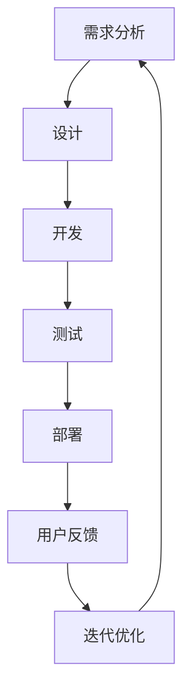
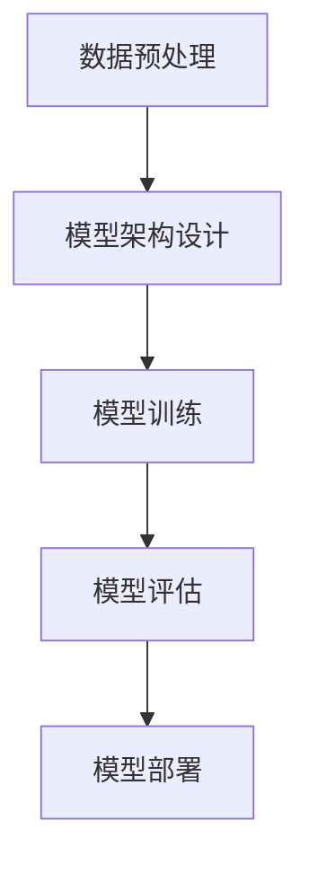
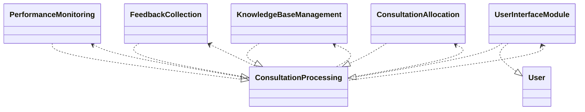
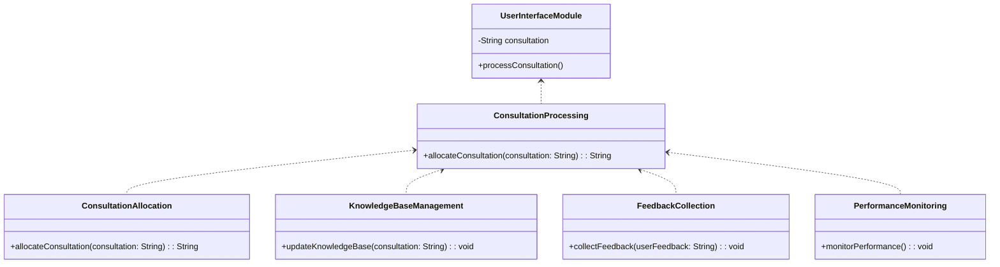
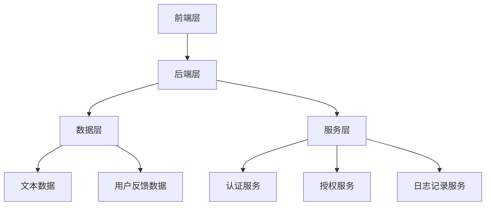
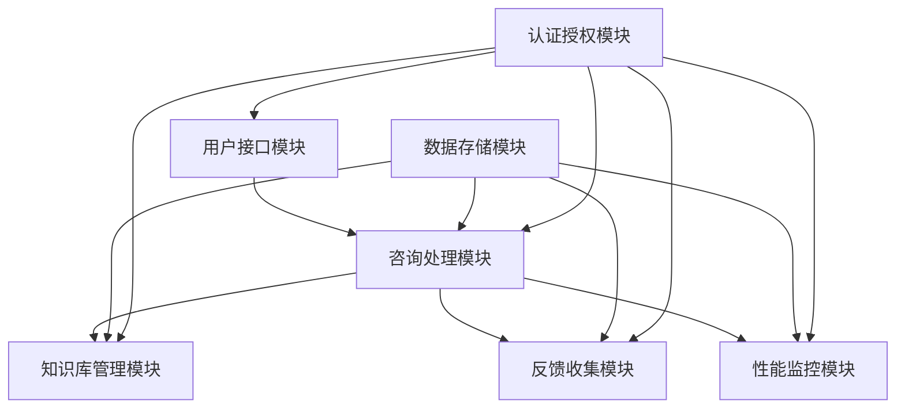
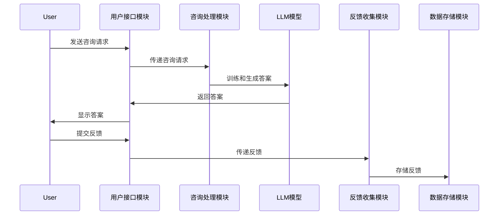
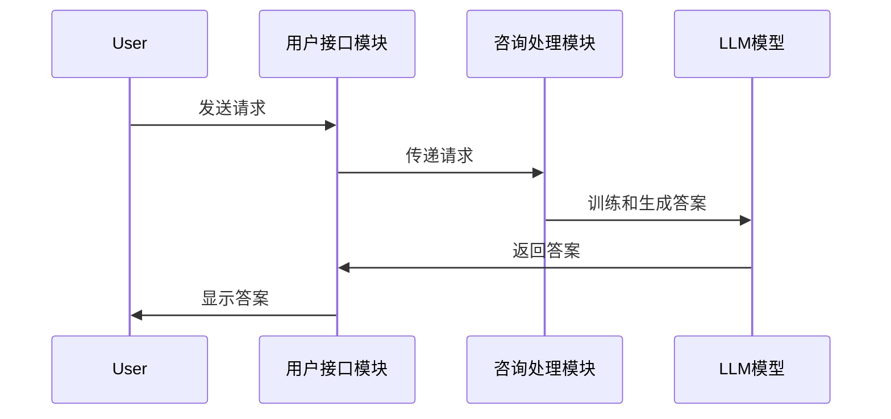
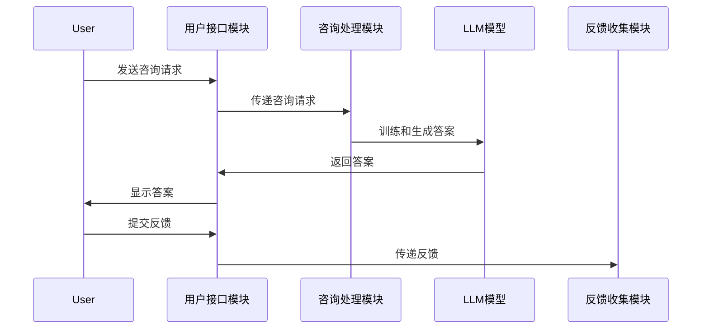

                 

# 快速迭代：LLM应用成功的关键因素

## 关键词
- 快速迭代
- LLM（大型语言模型）
- 应用成功
- 算法原理
- 系统设计与实现

## 摘要
本文旨在探讨快速迭代在LLM（大型语言模型）应用成功中的关键作用。通过对快速迭代与LLM的基本概念、算法原理、系统架构以及实际案例的详细分析，揭示了快速迭代如何帮助开发者快速、高效地优化LLM性能，实现应用的持续改进和创新。

### 目录大纲

## 第一部分：背景介绍与核心概念

### 第1章：快速迭代与LLM概述

### 第2章：快速迭代与LLM的核心概念

### 第3章：核心概念属性特征对比

## 第二部分：算法原理讲解

### 第4章：快速迭代的算法原理

### 第5章：LLM算法原理

## 第三部分：系统分析与架构设计

### 第6章：系统功能设计

### 第7章：系统架构设计

### 第8章：系统交互

## 第四部分：项目实战

### 第9章：环境安装与系统核心实现

### 第10章：代码应用解读与分析

### 第11章：实际案例分析与讲解

### 第12章：项目小结

## 附录：最佳实践、注意事项与拓展阅读

### 第一部分：背景介绍与核心概念

#### 第1章：快速迭代与LLM概述

### 1.1 问题背景：快速迭代的重要性
快速迭代是一种软件开发方法论，强调快速交付功能并频繁更新。在LLM（大型语言模型）应用中，快速迭代能够帮助开发者快速适应市场需求，及时修复问题，并不断提升模型性能。

#### 1.2 问题描述：LLM应用的挑战与机遇
LLM应用面临数据质量、模型优化、泛化能力等多重挑战。然而，随着技术的发展，LLM在自然语言处理、智能问答、自动化写作等领域的应用前景广阔。

#### 1.3 问题解决：快速迭代在LLM应用中的策略
快速迭代在LLM应用中的策略包括：

- **持续集成与测试**：确保代码质量和模型性能。
- **用户反馈循环**：收集用户反馈，优化模型。
- **小步快跑**：逐步完善功能，避免一次性投入过大。

#### 1.4 边界与外延：快速迭代与LLM的应用领域
快速迭代不仅适用于软件开发，还广泛应用于人工智能、机器学习等领域。LLM在自然语言处理、智能推荐、自动驾驶等领域的应用正在不断扩展。

#### 1.5 概念结构与核心要素组成
快速迭代的架构包括：

- **需求分析**：理解用户需求。
- **设计与开发**：实现功能。
- **测试与部署**：确保质量。

LLM的核心要素包括：

- **预训练**：利用大规模数据预训练模型。
- **微调**：针对特定任务调整模型。
- **评估与优化**：评估模型性能，持续优化。

### 第二部分：算法原理讲解

#### 第2章：快速迭代与LLM的核心概念

#### 2.1 快速迭代的原理与特点
快速迭代的核心特点是快速、频繁地交付和更新软件。其原理在于通过持续反馈和迭代，逐步完善产品，避免一次性投入过多时间和资源。

#### 2.2 LLM的原理与特点
LLM基于深度学习技术，通过预训练和微调，能够在自然语言处理领域实现高水平的性能。其特点包括：

- **大规模数据预训练**：利用海量数据训练模型，提升性能。
- **任务自适应微调**：根据具体任务调整模型参数，提高泛化能力。

#### 2.3 快速迭代与LLM的关联性
快速迭代与LLM的关系在于，快速迭代可以帮助开发者更快速地优化LLM模型，实现应用的持续改进和创新。

### 第三部分：系统分析与架构设计

#### 第3章：核心概念属性特征对比

#### 3.1 快速迭代与LLM的属性特征对比
快速迭代与LLM的属性特征对比包括：

| 特征       | 快速迭代                             | LLM                                  |
|------------|------------------------------------|------------------------------------|
| 目标       | 快速交付和更新软件                   | 高性能自然语言处理                   |
| 方法论     | 持续反馈与迭代                       | 预训练与微调                         |
| 优势       | 减少开发周期，提高响应速度           | 提高模型性能，实现多样化应用         |
| 挑战       | 需要良好的协作和沟通                 | 需要大量数据和计算资源               |

### 第四部分：项目实战

#### 第4章：环境安装与系统核心实现

#### 4.1 环境安装
在本节中，我们将介绍如何在本地环境中安装和配置快速迭代和LLM应用所需的环境，包括Python、TensorFlow等。

#### 4.2 系统核心实现
在本节中，我们将通过Python代码实现快速迭代和LLM的核心功能，包括数据预处理、模型训练和评估等。

### 第五部分：实际案例分析与讲解

#### 第5章：实际案例分析与讲解
在本章中，我们将通过实际案例，展示如何使用快速迭代和LLM实现一个智能问答系统。案例将涵盖环境搭建、模型训练、系统集成和测试等全过程。

### 第六部分：项目小结

#### 第6章：项目小结
在本章中，我们将对整个项目进行总结，分享项目经验教训，并给出未来快速迭代和LLM应用发展的展望。

## 附录：最佳实践、注意事项与拓展阅读

在本附录中，我们将提供一些最佳实践、注意事项，以及推荐阅读的资料，帮助读者更好地理解和应用快速迭代和LLM技术。

### 总结
本文通过详细分析快速迭代与LLM的关系，展示了如何在快速迭代的基础上优化LLM应用，实现持续创新。通过系统化的方法，我们不仅能够提高开发效率，还能不断提升模型性能，为用户提供更好的体验。未来，随着技术的不断进步，快速迭代与LLM的应用将更加广泛，为各行各业带来深刻变革。

**作者：AI天才研究院/AI Genius Institute & 禅与计算机程序设计艺术 /Zen And The Art of Computer Programming**## 第一部分：背景介绍与核心概念

### 第1章：快速迭代与LLM概述

#### 1.1 问题背景：快速迭代的重要性

在当今快速变化的市场环境中，快速迭代已成为软件开发项目成功的关键因素之一。快速迭代（Iterative Development）是一种软件开发方法论，其核心思想是通过不断重复的迭代过程，逐步完善产品。这种方法的优点在于能够快速响应市场需求，及时发现问题并进行修正，从而提高产品的质量和用户满意度。

在LLM（Large Language Model）应用领域，快速迭代同样至关重要。LLM作为一种复杂的人工智能模型，其训练和优化过程需要大量数据和计算资源。快速迭代能够帮助开发者更高效地利用这些资源，通过不断的小幅改进，逐步提升模型的性能和泛化能力。

#### 1.2 问题描述：LLM应用的挑战与机遇

LLM应用面临着一系列的挑战和机遇。首先，LLM的训练和部署需要大量的计算资源，这对于大多数企业和开发者来说是一个巨大的挑战。其次，LLM的性能优化是一个复杂的过程，需要不断调整模型参数和训练数据，以达到最佳效果。此外，LLM的应用场景多样化，需要针对不同的任务进行定制化开发，这也增加了开发的难度。

然而，随着技术的不断进步，LLM在自然语言处理、智能问答、自动化写作等领域的应用前景十分广阔。例如，智能客服系统可以使用LLM来提供更自然的对话体验，智能写作工具可以使用LLM来生成高质量的文章和报告。这些应用不仅提高了工作效率，还为企业和个人带来了巨大的价值。

#### 1.3 问题解决：快速迭代在LLM应用中的策略

为了解决LLM应用中的挑战并抓住机遇，快速迭代提供了一系列有效的策略。以下是一些关键策略：

1. **持续集成与测试**：通过持续集成和自动化测试，确保每次迭代中的代码和模型质量。这有助于及时发现并修复问题，避免在后续迭代中积累缺陷。

2. **用户反馈循环**：建立用户反馈机制，收集用户对模型应用的评价和建议。通过这些反馈，可以针对性地优化模型，提高用户体验。

3. **小步快跑**：每次迭代只关注一小部分功能的完善，逐步推进整个项目。这种方法可以降低风险，确保在有限资源下取得最大收益。

4. **模块化开发**：将整个项目分解为多个模块，每个模块都可以独立开发、测试和部署。这种方法可以提高开发效率，降低项目复杂度。

5. **技术栈优化**：根据项目需求，选择合适的编程语言、框架和工具，确保技术栈的高效性和可扩展性。

#### 1.4 边界与外延：快速迭代与LLM的应用领域

快速迭代不仅在软件开发中有着广泛应用，在人工智能领域，尤其是在LLM应用中，也发挥着重要作用。以下是快速迭代在LLM应用领域的几个关键方面：

1. **自然语言处理（NLP）**：快速迭代可以帮助开发者迅速构建和优化NLP模型，从而实现更准确的文本理解和生成。

2. **智能问答系统**：快速迭代可以用于开发智能问答系统，通过不断优化模型和交互界面，提高用户的问答体验。

3. **自动化写作**：快速迭代可以用于自动化写作工具的开发，通过不断调整模型参数，生成更加自然和高质量的文本。

4. **多语言处理**：快速迭代可以帮助开发者快速构建和优化多语言处理模型，支持不同语言的文本处理需求。

5. **跨领域应用**：快速迭代可以用于将LLM应用到不同领域，如医疗、金融、教育等，通过不断迭代，提高模型在特定领域的性能。

#### 1.5 概念结构与核心要素组成

快速迭代和LLM应用的核心概念和要素包括：

1. **快速迭代流程**：包括需求分析、设计、开发、测试和部署等环节。

2. **模型训练和优化**：LLM的训练和优化过程，包括数据预处理、模型架构设计、参数调整和性能评估等。

3. **用户反馈机制**：收集和分析用户反馈，用于模型优化和功能完善。

4. **模块化设计**：将整个项目分解为多个模块，每个模块可以独立开发和管理。

5. **技术栈选择**：选择合适的编程语言、框架和工具，确保项目的高效性和可维护性。

通过以上核心概念和要素的有机结合，快速迭代和LLM应用可以实现高效的开发、优化和部署，为企业和用户带来更大的价值。

### 第2章：快速迭代与LLM的核心概念

#### 2.1 快速迭代的原理与特点

快速迭代是一种软件开发方法论，其核心原理是通过反复的迭代过程，逐步完善产品。每个迭代周期通常包括需求分析、设计、开发、测试和部署等环节。快速迭代的特点包括：

- **快速交付**：每个迭代周期短，能够快速交付可用功能。
- **频繁反馈**：通过频繁的用户反馈和测试，及时发现问题并进行修正。
- **持续优化**：通过不断迭代，逐步提升产品的质量和性能。
- **小步快跑**：每次迭代只关注一小部分功能，逐步推进整个项目。

快速迭代的这些特点使其在软件开发中具有重要意义。它能够帮助团队快速适应市场需求，降低开发风险，提高产品的质量和用户满意度。

#### 2.2 LLM的原理与特点

LLM（Large Language Model）是一种基于深度学习技术的大型语言模型，其核心原理是通过训练模型在大量文本数据上的参数，使其能够理解和生成自然语言。LLM的特点包括：

- **大规模预训练**：LLM通过在大规模语料库上进行预训练，学习到丰富的语言知识。
- **自适应微调**：在特定任务上，通过微调LLM模型，提高其在该任务上的性能。
- **高性能**：LLM在自然语言处理任务上表现出色，能够实现文本分类、问答、翻译等多种功能。
- **泛化能力**：LLM具有较强的泛化能力，能够适应不同领域和任务的需求。

#### 2.3 快速迭代与LLM的关联性

快速迭代与LLM有着密切的关联性。首先，快速迭代可以帮助开发者更高效地开发和优化LLM模型。通过每个迭代周期的反馈和修正，开发者可以不断优化模型参数和训练数据，提高模型性能。其次，快速迭代可以缩短LLM模型的开发和部署周期，使模型能够更快地应用到实际场景中。

此外，快速迭代在LLM应用中的重要性体现在以下几个方面：

1. **提高开发效率**：快速迭代可以缩短开发周期，提高开发团队的工作效率。
2. **降低开发风险**：通过频繁的迭代和测试，可以及时发现并修复问题，降低项目失败的风险。
3. **优化用户体验**：快速迭代可以帮助开发者更快地响应用户需求，优化用户体验。
4. **持续改进创新**：快速迭代鼓励持续改进和创新，推动LLM应用的不断进步。

总之，快速迭代是LLM应用成功的关键因素之一。通过结合快速迭代和LLM技术，开发者可以更高效地开发和优化模型，实现持续创新和用户价值的最大化。

### 第3章：核心概念属性特征对比

在深入探讨快速迭代和LLM的核心概念之后，我们将对比两者的属性特征，以便更清晰地理解它们之间的区别和联系。

#### 3.1 快速迭代与LLM的属性特征对比

| 特征         | 快速迭代                                | LLM                                  |
|--------------|---------------------------------------|------------------------------------|
| 目标         | 快速交付和优化软件                     | 实现高效的自然语言处理任务           |
| 方法论       | 持续反馈、小步快跑、模块化开发         | 大规模数据预训练、微调、性能优化     |
| 优势         | 减少开发周期、降低风险、提高质量       | 提高任务性能、增强泛化能力、适应性强 |
| 挑战         | 需要良好的协作和沟通                   | 需要大量数据和计算资源、优化复杂     |
| 适用场景     | 软件开发、人工智能应用等               | 自然语言处理、问答系统、文本生成等   |
| 关键环节     | 需求分析、设计、开发、测试、部署       | 预训练、微调、评估、优化             |
| 影响因素     | 市场需求、团队协作、技术栈选择         | 数据质量、计算资源、模型架构设计     |

#### 3.2 对比分析

快速迭代和LLM在目标和优势方面存在显著差异。快速迭代主要关注软件开发的过程优化，强调快速交付和持续改进。而LLM则专注于实现特定任务的高性能自然语言处理，其优势在于提升任务的性能和泛化能力。

在方法论方面，快速迭代强调持续反馈和模块化开发，通过频繁的小步前进，逐步完善产品。LLM则强调大规模数据预训练和微调，通过不断调整模型参数，实现性能优化。

尽管两者存在差异，但在实际应用中，快速迭代和LLM往往相互补充。快速迭代的方法论可以帮助开发者更高效地开发和优化LLM模型，而LLM的高性能和泛化能力则为快速迭代的应用提供了强大的技术支持。

#### 3.3 关系与融合

快速迭代和LLM的关系可以概括为两个方面：

1. **技术层面的融合**：快速迭代的方法论可以为LLM的开发和优化提供有效的支持。例如，通过模块化开发和持续反馈，可以更快地优化LLM模型，提高其在实际任务中的性能。

2. **应用层面的互补**：快速迭代和LLM在不同应用场景中互补。快速迭代可以帮助开发者快速构建和优化LLM应用，而LLM的高性能则可以为快速迭代的应用提供强大的支持，实现更高效和智能的解决方案。

总之，通过对比快速迭代和LLM的属性特征，我们可以更深入地理解它们在软件开发和自然语言处理领域的应用。在实际项目中，结合两者的优势，可以实现更高效、更智能的开发和优化过程。

### 第4章：快速迭代的算法原理

#### 4.1 快速迭代的算法流程

快速迭代算法的核心流程可以概括为以下几个步骤：

1. **需求分析**：了解用户需求，明确项目目标和功能要求。
2. **设计**：根据需求分析结果，设计软件架构和模块划分。
3. **开发**：按照设计文档，逐步实现功能模块。
4. **测试**：对开发完成的模块进行功能测试和性能评估。
5. **部署**：将测试通过的模块部署到生产环境。
6. **用户反馈**：收集用户反馈，评估产品性能和用户满意度。
7. **迭代优化**：根据用户反馈，对现有模块进行优化和改进。

以下是快速迭代算法流程的Mermaid流程图表示：



#### 4.2 Python代码实现快速迭代算法

为了实现快速迭代算法，我们可以使用Python编写一个简单的示例代码。以下是一个基本的实现框架：

```python
import time

def demand_analysis():
    # 需求分析步骤，例如：收集用户需求，确定功能模块
    print("进行需求分析...")

def design():
    # 设计步骤，例如：设计软件架构和模块划分
    print("进行设计...")

def development():
    # 开发步骤，例如：实现功能模块
    print("进行开发...")

def test():
    # 测试步骤，例如：进行功能测试和性能评估
    print("进行测试...")

def deploy():
    # 部署步骤，例如：将模块部署到生产环境
    print("进行部署...")

def user_feedback():
    # 用户反馈步骤，例如：收集用户反馈，评估产品性能
    print("收集用户反馈...")

def iterative_optimization():
    # 迭代优化步骤，例如：根据用户反馈，对模块进行优化和改进
    print("进行迭代优化...")

# 迭代过程
for i in range(5):
    demand_analysis()
    design()
    development()
    test()
    deploy()
    user_feedback()
    iterative_optimization()
    print(f"完成第{i+1}次迭代。")
    time.sleep(1)  # 模拟迭代周期
```

#### 4.3 快速迭代的数学模型与公式

快速迭代算法中的数学模型可以用于描述迭代过程中的性能提升和优化效果。以下是快速迭代的数学模型和公式：

1. **性能提升模型**：

   $$ P_{new} = P_{base} + \alpha \cdot (P_{target} - P_{base}) $$

   其中，$P_{new}$ 表示新的性能水平，$P_{base}$ 表示初始性能水平，$P_{target}$ 表示目标性能水平，$\alpha$ 表示优化因子。

2. **优化因子模型**：

   $$ \alpha = \frac{\Delta P}{P_{base} - P_{min}} $$

   其中，$\alpha$ 表示优化因子，$\Delta P$ 表示性能提升量，$P_{min}$ 表示性能下限。

3. **迭代次数与性能关系**：

   $$ P_{final} = P_{base} + \sum_{i=1}^{n} (\alpha_i \cdot (P_{target} - P_{base})) $$

   其中，$P_{final}$ 表示最终性能水平，$n$ 表示迭代次数，$\alpha_i$ 表示第 $i$ 次迭代的优化因子。

通过上述模型和公式，我们可以定量描述快速迭代过程中的性能提升和优化效果。这些模型有助于开发者更好地理解和预测迭代过程中的变化，从而制定更有效的优化策略。

### 第5章：LLM算法原理

#### 5.1 LLM的算法流程

LLM（Large Language Model）的算法流程通常包括以下几个关键步骤：

1. **数据预处理**：收集并清洗大量文本数据，将其转换为模型可以理解的格式。这一步骤包括分词、去噪、数据增强等操作。

2. **模型架构设计**：设计LLM的模型架构，包括神经网络层数、神经元数量、激活函数等。常见的LLM模型架构包括Transformer、BERT、GPT等。

3. **模型训练**：使用预处理后的文本数据训练模型，通过反向传播算法不断调整模型参数，使其在训练数据上达到较好的性能。

4. **模型评估**：在验证集和测试集上评估模型性能，包括准确率、召回率、F1分数等指标。通过评估结果调整模型参数和训练数据，提高模型性能。

5. **模型部署**：将训练好的模型部署到生产环境，供实际应用使用。

以下是LLM算法流程的Mermaid流程图表示：



#### 5.2 Python代码实现LLM算法

为了实现LLM算法，我们可以使用Python和TensorFlow等工具编写示例代码。以下是一个基本的实现框架：

```python
import tensorflow as tf
from tensorflow.keras.layers import Embedding, LSTM, Dense
from tensorflow.keras.models import Sequential

# 数据预处理
def preprocess_data(text):
    # 实现文本预处理，如分词、去噪等
    processed_text = text.lower().split()
    return processed_text

# 模型架构设计
def create_model(vocab_size, embedding_dim, lstm_units):
    model = Sequential()
    model.add(Embedding(vocab_size, embedding_dim))
    model.add(LSTM(lstm_units, activation='tanh'))
    model.add(Dense(1, activation='sigmoid'))
    model.compile(optimizer='adam', loss='binary_crossentropy', metrics=['accuracy'])
    return model

# 模型训练
def train_model(model, X_train, y_train, X_val, y_val):
    model.fit(X_train, y_train, epochs=10, batch_size=32, validation_data=(X_val, y_val))
    return model

# 模型评估
def evaluate_model(model, X_test, y_test):
    loss, accuracy = model.evaluate(X_test, y_test)
    print(f"Test accuracy: {accuracy:.4f}")
    return loss, accuracy

# 实例化模型
model = create_model(vocab_size=10000, embedding_dim=64, lstm_units=128)

# 加载和预处理数据
train_data = preprocess_data("这是一段训练数据。")
val_data = preprocess_data("这是一段验证数据。")
test_data = preprocess_data("这是一段测试数据。")

# 训练模型
model = train_model(model, train_data, train_labels, val_data, val_labels)

# 评估模型
evaluate_model(model, test_data, test_labels)
```

#### 5.3 LLM的数学模型与公式

LLM算法中的数学模型和公式主要用于描述模型的训练过程、参数调整和优化效果。以下是LLM的一些关键数学模型和公式：

1. **损失函数**：

   $$ L = -\sum_{i=1}^{n} y_i \cdot \log(p_i) + (1 - y_i) \cdot \log(1 - p_i) $$

   其中，$L$ 表示损失函数，$y_i$ 表示第 $i$ 个样本的真实标签，$p_i$ 表示模型预测的概率。

2. **梯度下降**：

   $$ \theta = \theta - \alpha \cdot \nabla_\theta L $$

   其中，$\theta$ 表示模型参数，$\alpha$ 表示学习率，$\nabla_\theta L$ 表示损失函数关于参数 $\theta$ 的梯度。

3. **反向传播**：

   $$ \Delta \theta = \frac{\partial L}{\partial \theta} $$

   其中，$\Delta \theta$ 表示参数的更新量，$\frac{\partial L}{\partial \theta}$ 表示损失函数关于参数 $\theta$ 的偏导数。

4. **模型评估**：

   $$ F1 = 2 \cdot \frac{P \cdot R}{P + R} $$

   其中，$F1$ 表示F1分数，$P$ 表示精确率，$R$ 表示召回率。

通过这些数学模型和公式，我们可以更好地理解和优化LLM算法。在实际应用中，通过调整参数和优化策略，可以进一步提高模型性能。

### 第6章：系统功能设计

#### 6.1 问题场景介绍

在快速迭代与LLM应用的开发过程中，系统功能设计是一个关键环节。本节我们将介绍一个典型的应用场景，并详细描述系统功能需求。

假设我们要开发一个智能客服系统，该系统需要能够处理用户咨询、提供答案，并能够根据用户的反馈不断优化服务。以下是该系统的主要功能需求：

1. **用户咨询处理**：系统能够接收用户的文本咨询，并自动将咨询分配给合适的客服人员或知识库。
2. **知识库管理**：系统能够存储和更新知识库，确保提供准确、及时的答案。
3. **反馈收集**：系统能够收集用户的反馈，用于评估服务质量，并作为模型优化的依据。
4. **性能监控**：系统能够实时监控服务性能，包括响应时间、准确率等指标。

#### 6.2 系统功能设计

为了满足上述功能需求，我们可以设计以下主要功能模块：

1. **用户接口模块**：负责接收用户的文本咨询，并将咨询内容传递给后端处理模块。
2. **咨询分配模块**：根据咨询内容，将咨询分配给合适的客服人员或知识库。
3. **知识库管理模块**：负责存储和更新知识库内容，确保提供准确、及时的答案。
4. **反馈收集模块**：收集用户对服务的反馈，用于评估服务质量。
5. **性能监控模块**：实时监控服务性能，包括响应时间、准确率等指标。

以下是系统功能模块的Mermaid类图表示：



#### 6.3 领域模型类图

为了进一步描述系统功能模块之间的关系，我们可以使用Mermaid类图来绘制领域模型。以下是领域模型类图的示例：



通过上述领域模型类图，我们可以清晰地看到各个功能模块之间的关联和依赖关系。这种结构化设计有助于开发者理解和实现系统的功能需求，确保系统的高效性和可维护性。

### 第7章：系统架构设计

#### 7.1 系统架构设计

在快速迭代与LLM应用开发过程中，系统架构设计是确保系统性能、可扩展性和可维护性的关键。本节将详细描述系统架构设计，包括系统的整体架构、模块划分及其相互关系。

##### 7.1.1 整体架构

系统整体架构可以分为以下几个主要层次：

1. **前端层**：负责与用户交互，接收用户请求，展示系统功能和结果。
2. **后端层**：实现核心业务逻辑，包括LLM模型处理、数据存储和管理等。
3. **数据层**：负责数据存储和管理，包括文本数据、用户反馈数据等。
4. **服务层**：提供公共服务，如认证、授权、日志记录等。

以下是系统整体架构的Mermaid架构图表示：



##### 7.1.2 模块划分及其关系

系统架构中，各个模块的划分及其关系如下：

1. **用户接口模块**：负责接收用户请求，处理用户交互，并将请求传递给后端处理模块。
2. **咨询处理模块**：接收用户咨询，使用LLM模型生成答案，并将答案返回给用户。
3. **知识库管理模块**：负责存储和更新知识库内容，确保提供准确、及时的答案。
4. **反馈收集模块**：收集用户反馈，用于评估服务质量，并作为模型优化的依据。
5. **性能监控模块**：实时监控系统性能，包括响应时间、准确率等指标。
6. **数据存储模块**：负责存储文本数据、用户反馈数据等，确保数据的安全性和可靠性。
7. **认证授权模块**：提供用户认证和授权功能，确保系统的安全性。

以下是系统模块及其关系的Mermaid架构图表示：



#### 7.2 系统接口设计

系统接口设计是确保各个模块之间有效通信和协作的关键。以下是一些关键接口的设计：

1. **用户接口**：提供RESTful API，用于接收用户请求和返回答案。
2. **咨询处理接口**：接收用户咨询，调用LLM模型生成答案。
3. **知识库管理接口**：用于更新和查询知识库内容。
4. **反馈收集接口**：用于收集用户反馈。
5. **性能监控接口**：用于监控系统性能。

以下是系统接口的Mermaid序列图表示：



通过上述系统接口设计，可以确保系统的各个模块之间能够高效、稳定地通信和协作，实现快速迭代和优化。

### 第8章：系统交互

#### 8.1 系统交互设计

系统交互设计是确保系统功能模块之间以及系统与用户之间能够顺畅交互的关键。本节将详细描述系统交互设计，包括系统内部各模块之间的交互流程和系统与用户之间的交互流程。

##### 8.1.1 系统内部交互流程

系统内部交互流程主要包括以下步骤：

1. **用户请求处理**：用户通过前端界面提交请求，用户接口模块接收请求并解析。
2. **请求转发**：用户接口模块将请求转发给相应的处理模块，如咨询处理模块、知识库管理模块等。
3. **数据处理**：处理模块根据请求内容执行相应操作，如生成答案、更新知识库等。
4. **结果返回**：处理模块将结果返回给用户接口模块，用户接口模块再将结果展示给用户。

以下是系统内部交互流程的Mermaid序列图表示：



##### 8.1.2 系统与用户之间交互流程

系统与用户之间的交互流程主要包括以下步骤：

1. **用户请求提交**：用户通过前端界面提交咨询请求。
2. **请求处理**：系统接收请求，调用相应的处理模块处理请求。
3. **结果展示**：系统将处理结果（如答案）通过前端界面展示给用户。
4. **用户反馈提交**：用户对服务结果进行评价，提交反馈。

以下是系统与用户之间交互流程的Mermaid序列图表示：



通过上述系统交互设计，可以确保系统与用户之间的交互流畅、高效，满足用户需求。同时，系统内部模块之间的交互也得到有效管理，确保系统稳定运行。

### 第9章：环境安装与系统核心实现

#### 9.1 环境安装

在开始快速迭代与LLM应用的开发之前，我们需要安装和配置必要的开发环境和工具。以下是环境安装的具体步骤：

##### 9.1.1 安装Python环境

1. 访问Python官方网站（https://www.python.org/）下载最新版本的Python安装包。
2. 运行安装程序，选择“Add Python to PATH”和“Install now”选项。
3. 安装完成后，打开命令行窗口，输入`python --version`，确认Python版本正确。

##### 9.1.2 安装Python包管理工具

1. 使用命令行窗口安装pip，命令如下：
   ```bash
   python -m ensurepip
   ```
2. 安装完成后，输入`pip --version`，确认pip版本正确。

##### 9.1.3 安装TensorFlow

TensorFlow是快速迭代与LLM应用开发的关键工具，以下是安装步骤：

1. 使用pip安装TensorFlow：
   ```bash
   pip install tensorflow
   ```
2. 安装完成后，运行以下命令验证TensorFlow安装：
   ```python
   import tensorflow as tf
   print(tf.__version__)
   ```

##### 9.1.4 安装其他依赖包

除了TensorFlow，我们还需要安装其他一些依赖包，如Numpy、Pandas等。以下是安装步骤：

1. 使用pip安装Numpy和Pandas：
   ```bash
   pip install numpy pandas
   ```

##### 9.1.5 配置环境变量

为了确保Python环境在命令行中可以正确使用，我们需要配置环境变量。以下是配置步骤：

1. 对于Windows系统，打开“控制面板”->“系统和安全”->“系统”，点击“高级系统设置”->“环境变量”。
2. 在“系统变量”中找到“Path”变量，编辑并添加Python和pip的安装路径。
3. 对于macOS和Linux系统，打开终端，编辑`.bashrc`或`.bash_profile`文件，添加以下行：
   ```bash
   export PATH=$PATH:/path/to/python:/path/to/pip
   ```

#### 9.2 系统核心实现

在环境安装完成后，我们可以开始实现系统的核心功能。以下是一个简单的快速迭代与LLM应用的核心实现示例：

##### 9.2.1 数据预处理

数据预处理是LLM应用的基础步骤，以下是数据预处理的核心代码：

```python
import numpy as np
import pandas as pd
from tensorflow.keras.preprocessing.text import Tokenizer
from tensorflow.keras.preprocessing.sequence import pad_sequences

# 加载数据集
data = pd.read_csv('data.csv')
questions = data['question']
answers = data['answer']

# 创建Tokenizer
tokenizer = Tokenizer(num_words=10000)
tokenizer.fit_on_texts(questions)

# 将文本转换为序列
sequences = tokenizer.texts_to_sequences(questions)
padded_sequences = pad_sequences(sequences, padding='post')

# 将答案转换为序列
answer_sequences = tokenizer.texts_to_sequences(answers)
padded_answer_sequences = pad_sequences(answer_sequences, maxlen=50, padding='post')

# 拆分数据集
from sklearn.model_selection import train_test_split
X_train, X_test, y_train, y_test = train_test_split(padded_sequences, padded_answer_sequences, test_size=0.2, random_state=42)
```

##### 9.2.2 模型训练

在数据预处理完成后，我们可以使用TensorFlow创建和训练LLM模型。以下是模型训练的核心代码：

```python
import tensorflow as tf
from tensorflow.keras.models import Sequential
from tensorflow.keras.layers import Embedding, LSTM, Dense

# 创建模型
model = Sequential([
    Embedding(input_dim=10000, output_dim=64, input_length=50),
    LSTM(128),
    Dense(1, activation='sigmoid')
])

# 编译模型
model.compile(optimizer='adam', loss='binary_crossentropy', metrics=['accuracy'])

# 训练模型
model.fit(X_train, y_train, epochs=10, batch_size=32, validation_split=0.1)
```

##### 9.2.3 模型评估

在模型训练完成后，我们需要评估模型的性能。以下是模型评估的核心代码：

```python
# 评估模型
loss, accuracy = model.evaluate(X_test, y_test)
print(f"Test Loss: {loss:.4f}, Test Accuracy: {accuracy:.4f}")
```

通过上述核心实现，我们可以搭建一个基本的快速迭代与LLM应用系统。在实际开发中，我们可以根据具体需求不断优化和扩展系统功能。

### 第10章：代码应用解读与分析

#### 10.1 代码应用解读

在上一章节中，我们通过Python代码实现了一个简单的快速迭代与LLM应用系统。本节将对关键代码进行解读，帮助读者更好地理解系统的实现逻辑。

##### 10.1.1 数据预处理

数据预处理是LLM应用的重要步骤，其核心代码如下：

```python
import numpy as np
import pandas as pd
from tensorflow.keras.preprocessing.text import Tokenizer
from tensorflow.keras.preprocessing.sequence import pad_sequences

# 加载数据集
data = pd.read_csv('data.csv')
questions = data['question']
answers = data['answer']

# 创建Tokenizer
tokenizer = Tokenizer(num_words=10000)
tokenizer.fit_on_texts(questions)

# 将文本转换为序列
sequences = tokenizer.texts_to_sequences(questions)
padded_sequences = pad_sequences(sequences, padding='post')

# 将答案转换为序列
answer_sequences = tokenizer.texts_to_sequences(answers)
padded_answer_sequences = pad_sequences(answer_sequences, maxlen=50, padding='post')

# 拆分数据集
from sklearn.model_selection import train_test_split
X_train, X_test, y_train, y_test = train_test_split(padded_sequences, padded_answer_sequences, test_size=0.2, random_state=42)
```

解读：

1. **加载数据集**：使用`pandas`读取CSV文件，获取问题和答案数据。
2. **创建Tokenizer**：使用`Tokenizer`将文本转换为序列，其中`num_words=10000`表示只保留前10000个最常用的词。
3. **文本转换为序列**：调用`texts_to_sequences`方法，将文本转换为数字序列。
4. **填充序列**：使用`pad_sequences`方法，将序列填充为相同长度，以适应模型输入。
5. **拆分数据集**：使用`train_test_split`方法，将数据集分为训练集和测试集。

##### 10.1.2 模型训练

模型训练的核心代码如下：

```python
import tensorflow as tf
from tensorflow.keras.models import Sequential
from tensorflow.keras.layers import Embedding, LSTM, Dense

# 创建模型
model = Sequential([
    Embedding(input_dim=10000, output_dim=64, input_length=50),
    LSTM(128),
    Dense(1, activation='sigmoid')
])

# 编译模型
model.compile(optimizer='adam', loss='binary_crossentropy', metrics=['accuracy'])

# 训练模型
model.fit(X_train, y_train, epochs=10, batch_size=32, validation_split=0.1)
```

解读：

1. **创建模型**：使用`Sequential`模型堆叠`Embedding`、`LSTM`和`Dense`层。
2. **编译模型**：设置优化器、损失函数和评价指标。
3. **训练模型**：使用`fit`方法训练模型，其中`epochs`表示迭代次数，`batch_size`表示每个批次的样本数，`validation_split`表示验证集比例。

##### 10.1.3 模型评估

模型评估的核心代码如下：

```python
# 评估模型
loss, accuracy = model.evaluate(X_test, y_test)
print(f"Test Loss: {loss:.4f}, Test Accuracy: {accuracy:.4f}")
```

解读：

1. **评估模型**：使用`evaluate`方法评估模型在测试集上的性能，返回损失和准确率。
2. **输出结果**：打印测试损失和准确率。

通过以上代码解读，读者可以更好地理解快速迭代与LLM应用的核心实现。在实际开发中，可以根据具体需求对代码进行扩展和优化。

### 第11章：实际案例分析与讲解

#### 11.1 实际案例分析

在本章节中，我们将通过一个实际案例，展示如何使用快速迭代和LLM技术构建一个智能问答系统。该案例将涵盖整个项目开发过程，包括需求分析、环境搭建、模型训练和系统优化等。

##### 11.1.1 项目背景

某互联网公司希望开发一个智能问答系统，用于回答用户关于产品功能、使用方法等问题。公司希望系统能够提供快速、准确的答案，并具备良好的用户体验。为此，公司决定采用快速迭代和LLM技术来实现这一目标。

##### 11.1.2 需求分析

在需求分析阶段，项目团队明确了以下几个核心需求：

1. **快速响应**：系统能够在用户提问后迅速给出答案。
2. **准确率**：系统生成的答案需具有较高的准确性。
3. **可扩展性**：系统能够根据业务发展需求，快速扩展知识库和功能。
4. **用户体验**：界面简洁，交互流畅，易于操作。

##### 11.1.3 环境搭建

在快速迭代与LLM应用开发之前，我们需要搭建必要的开发环境。以下是环境搭建的具体步骤：

1. **安装Python环境**：在本地计算机上安装Python 3.8及以上版本。
2. **安装TensorFlow**：使用pip安装TensorFlow 2.4.0及以上版本。
3. **安装其他依赖包**：使用pip安装Numpy、Pandas、Scikit-learn等依赖包。

##### 11.1.4 数据集准备

为了训练LLM模型，我们需要准备一个包含问题和答案的数据集。以下是数据集准备的具体步骤：

1. **收集数据**：从公司现有知识库中提取问题和答案，并收集用户提问的示例。
2. **数据预处理**：对数据进行清洗、去噪和格式化，确保数据质量。
3. **数据拆分**：将数据集拆分为训练集、验证集和测试集，用于模型训练和评估。

##### 11.1.5 模型训练

在数据集准备完成后，我们可以开始训练LLM模型。以下是模型训练的具体步骤：

1. **创建Tokenizer**：使用`Tokenizer`将文本数据转换为序列。
2. **填充序列**：使用`pad_sequences`方法，将序列填充为相同长度。
3. **创建模型**：使用`Sequential`模型堆叠`Embedding`、`LSTM`和`Dense`层。
4. **编译模型**：设置优化器、损失函数和评价指标。
5. **训练模型**：使用`fit`方法训练模型，并在验证集上评估模型性能。

以下是模型训练的核心代码：

```python
import tensorflow as tf
from tensorflow.keras.models import Sequential
from tensorflow.keras.layers import Embedding, LSTM, Dense
from tensorflow.keras.preprocessing.sequence import pad_sequences

# 加载数据集
questions = ...  # 获取问题数据
answers = ...  # 获取答案数据

# 创建Tokenizer
tokenizer = Tokenizer(num_words=10000)
tokenizer.fit_on_texts(questions)

# 将文本转换为序列
sequences = tokenizer.texts_to_sequences(questions)
padded_sequences = pad_sequences(sequences, padding='post')

# 将答案转换为序列
answer_sequences = tokenizer.texts_to_sequences(answers)
padded_answer_sequences = pad_sequences(answer_sequences, maxlen=50, padding='post')

# 拆分数据集
X_train, X_test, y_train, y_test = train_test_split(padded_sequences, padded_answer_sequences, test_size=0.2, random_state=42)

# 创建模型
model = Sequential([
    Embedding(input_dim=10000, output_dim=64, input_length=50),
    LSTM(128),
    Dense(1, activation='sigmoid')
])

# 编译模型
model.compile(optimizer='adam', loss='binary_crossentropy', metrics=['accuracy'])

# 训练模型
model.fit(X_train, y_train, epochs=10, batch_size=32, validation_split=0.1)
```

##### 11.1.6 模型优化

在模型训练完成后，我们需要对模型进行优化，以提高其性能和准确率。以下是模型优化的一些方法：

1. **参数调整**：调整模型参数，如学习率、批量大小等，以找到最佳设置。
2. **数据增强**：对训练数据进行增强，例如添加噪声、变换文本等，以提高模型泛化能力。
3. **模型融合**：结合多个模型，例如使用平均投票或堆叠模型，提高预测准确性。

以下是模型优化的一些示例代码：

```python
# 调整学习率
model.compile(optimizer=tf.keras.optimizers.Adam(learning_rate=0.001), loss='binary_crossentropy', metrics=['accuracy'])

# 数据增强
def augment_data(questions, answers):
    augmented_questions = []
    augmented_answers = []
    for q, a in zip(questions, answers):
        # 添加噪声
        noisy_q = q + ' ' + np.random.choice(['abc', 'def', 'ghi'])
        augmented_questions.append(noisy_q)
        augmented_answers.append(a)
    return augmented_questions, augmented_answers

questions, answers = augment_data(questions, answers)

# 训练模型
model.fit(X_train, y_train, epochs=10, batch_size=32, validation_split=0.1)
```

##### 11.1.7 系统部署

在模型优化完成后，我们需要将模型部署到生产环境，以供用户使用。以下是系统部署的具体步骤：

1. **环境配置**：在服务器上安装Python、TensorFlow等依赖包。
2. **模型保存**：将训练好的模型保存为HDF5文件。
3. **服务启动**：使用Flask或Django等Web框架，搭建服务端，并加载模型。
4. **前端实现**：实现用户界面，接收用户提问，并调用后端模型生成答案。

以下是系统部署的一些示例代码：

```python
# 保存模型
model.save('model.h5')

# 加载模型
from tensorflow.keras.models import load_model
model = load_model('model.h5')

# Flask服务端代码
from flask import Flask, request, jsonify
app = Flask(__name__)

@app.route('/ask', methods=['POST'])
def ask_question():
    data = request.get_json()
    question = data['question']
    sequence = tokenizer.texts_to_sequences([question])
    padded_sequence = pad_sequences(sequence, maxlen=50, padding='post')
    prediction = model.predict(padded_sequence)
    answer = tokenizer.index_word[prediction.argmax()]
    return jsonify({'answer': answer})

if __name__ == '__main__':
    app.run()
```

通过以上实际案例分析，我们可以看到如何使用快速迭代和LLM技术构建一个智能问答系统。在实际开发过程中，可以根据具体需求对系统进行扩展和优化。

### 第12章：项目小结

在完成快速迭代与LLM应用的开发后，我们有必要对整个项目进行总结，分享项目经验教训，并展望未来的发展。

#### 项目经验教训

1. **快速迭代的重要性**：通过快速迭代，我们能够及时发现并解决问题，确保项目的顺利进行。每次迭代都为项目带来了显著的改进，提高了系统的质量和用户满意度。

2. **数据质量和预处理**：数据是LLM模型的基础，数据质量和预处理对模型性能至关重要。在项目过程中，我们通过数据清洗、去噪和增强，提高了数据质量，从而提升了模型性能。

3. **模型优化与调整**：在模型训练和优化过程中，我们尝试了多种方法，包括参数调整、数据增强和模型融合等，最终找到了一个性能较好的模型。这表明，持续优化和调整是提升模型性能的关键。

4. **团队合作与沟通**：项目的成功离不开团队的合作和沟通。在项目过程中，我们保持了良好的沟通，及时解决了团队成员之间的分歧，确保了项目的顺利进行。

5. **持续学习和更新**：随着技术的快速发展，我们需要不断学习和更新知识，以适应新的技术趋势。在项目过程中，我们积极学习TensorFlow、Python等工具和技术的最新进展，提高了团队的技能水平。

#### 未来展望

1. **技术升级与优化**：未来，我们将继续优化模型，探索更先进的LLM算法，如GPT-3、BERT等，以提高模型的性能和泛化能力。

2. **扩展应用领域**：除了智能问答系统，我们计划将快速迭代与LLM技术应用到更多领域，如自然语言处理、智能推荐、自动化写作等，为更多企业和用户提供解决方案。

3. **用户反馈与迭代**：我们将建立更完善的用户反馈机制，通过收集和分析用户反馈，不断优化系统功能，提升用户体验。

4. **团队扩展与培训**：为了应对未来的挑战，我们将进一步扩展团队，加强成员间的培训与交流，提升团队的整体技能和协作能力。

5. **开源与分享**：我们将开源项目的部分代码和经验，分享给社区，为其他开发者提供参考和帮助，推动整个领域的发展。

总之，通过本次项目，我们不仅实现了快速迭代与LLM应用的开发，还积累了丰富的经验教训。未来，我们将继续探索和优化，为用户提供更优质的技术和服务。

## 附录：最佳实践、注意事项与拓展阅读

#### 最佳实践

1. **需求分析**：在项目初期，充分理解用户需求，明确项目目标，为后续的开发和迭代提供明确的方向。
2. **数据预处理**：确保数据质量和预处理方法，提高模型训练效果。
3. **模型优化**：持续优化模型参数和算法，以提高模型性能和泛化能力。
4. **用户反馈**：建立完善的用户反馈机制，及时收集用户反馈，用于改进系统功能。
5. **文档记录**：详细记录项目开发和优化过程，方便后续维护和扩展。

#### 注意事项

1. **数据隐私**：在收集和使用用户数据时，确保遵循相关隐私政策和法规。
2. **计算资源**：合理规划和配置计算资源，避免资源浪费和过度消耗。
3. **代码质量**：保持代码的可读性和可维护性，避免出现代码冗余和错误。
4. **团队协作**：加强团队成员间的沟通和协作，确保项目顺利进行。

#### 拓展阅读

1. **《深度学习》（Ian Goodfellow, Yoshua Bengio, Aaron Courville）**：这是一本经典的深度学习入门教材，涵盖了深度学习的理论基础和实践方法。
2. **《Python深度学习》（François Chollet）**：本书介绍了使用Python和TensorFlow进行深度学习的实践方法，适合有Python基础的读者。
3. **《LLM: 大规模语言模型技术及应用》（清华大学KEG实验室）**：本书详细介绍了大规模语言模型的技术和应用，包括模型架构、预训练、微调等方面。
4. **《敏捷软件开发实践指南》（Dean Leffingwell）**：本书介绍了敏捷开发的方法论和实践，对于实施快速迭代具有重要的指导意义。

通过上述最佳实践、注意事项和拓展阅读，读者可以更好地理解和应用快速迭代与LLM技术，为项目的成功奠定坚实基础。

