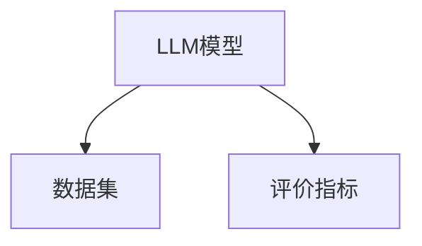
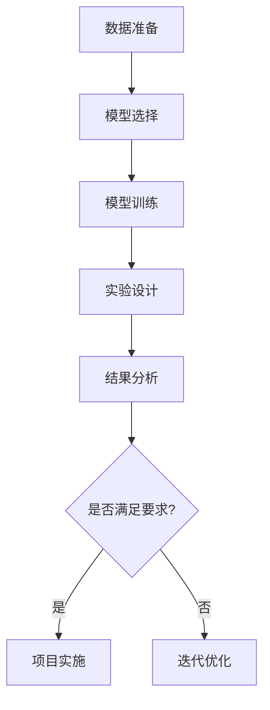
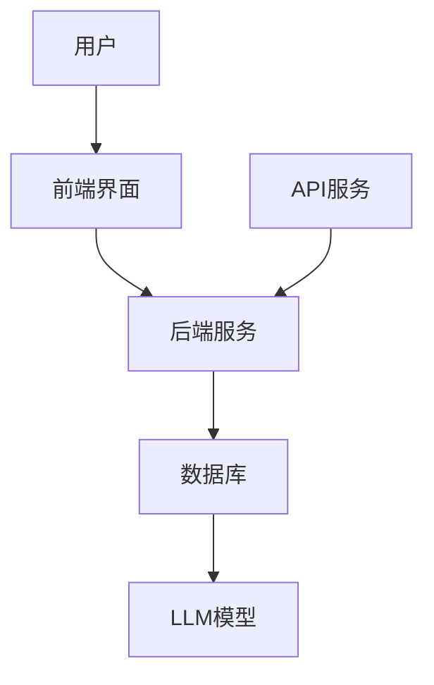
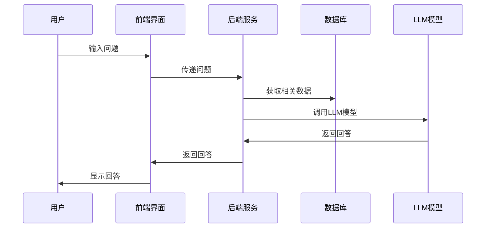

                 


### 快速验证LLM应用创意的方法论

摘要：随着生成式预训练语言模型（LLM）的发展，构建和验证其应用创意成为了一项关键任务。本文将详细介绍一个系统化的方法论，帮助读者快速验证LLM应用创意，从背景介绍、核心概念、算法原理到实际案例，逐步深入剖析。

---

#### 1. 引言

近年来，生成式预训练语言模型（LLM）在自然语言处理（NLP）领域取得了显著进展，从文本生成到问答系统，再到自动摘要和翻译，LLM的应用场景日益丰富。然而，在探索新应用创意时，如何快速验证其可行性成为了研究人员和工程师面临的一大挑战。本文将介绍一种系统化的方法论，旨在帮助读者高效地验证LLM应用创意。

---

#### 2. 背景介绍

2.1 核心概念术语说明
- **生成式预训练语言模型（LLM）**：一种能够生成文本的模型，通过预训练和微调，实现对自然语言的理解和生成。
- **应用创意**：指基于LLM技术提出的新颖应用场景或解决方案。
- **验证**：通过实验或测试，评估应用创意的实际效果和可行性。

2.2 问题背景与问题描述
随着LLM技术的发展，新的应用创意层出不穷。然而，如何快速验证这些创意的可行性，以避免时间和资源的浪费，成为了一个亟待解决的问题。

2.3 问题解决
本文将提供一个系统化的方法论，包括以下几个关键步骤：
- **明确目标**：明确应用创意的目标和预期效果。
- **数据准备**：收集和准备与目标相关的数据。
- **模型选择**：选择适合的LLM模型。
- **实验设计**：设计实验以评估模型性能。
- **结果分析**：分析实验结果，评估创意可行性。
- **迭代优化**：根据分析结果，对创意进行优化。

2.4 边界与外延
本文所述的方法论适用于各种基于LLM的应用场景，包括但不限于文本生成、问答系统、自动摘要等。

2.5 概念结构与核心要素组成
- **目标明确**：明确应用创意的目标和预期效果。
- **数据准备**：收集和准备与目标相关的数据。
- **模型选择**：选择适合的LLM模型。
- **实验设计**：设计实验以评估模型性能。
- **结果分析**：分析实验结果，评估创意可行性。
- **迭代优化**：根据分析结果，对创意进行优化。

---

#### 3. 核心概念与联系

3.1 核心概念原理
- **生成式预训练语言模型（LLM）**：基于大规模预训练和微调，实现对自然语言的生成和理解。
- **数据集**：用于训练和评估模型的文本数据集合。
- **评价指标**：用于评估模型性能的指标，如BLEU、ROUGE等。

3.2 概念属性特征对比表格

| 概念       | 属性       | 特征               |
|------------|------------|--------------------|
| 生成式预训练语言模型（LLM） | 模型类型   | 基于大规模预训练和微调 |
| 数据集     | 数据来源   | 用于训练和评估的文本数据 |
| 评价指标   | 评估方法   | 用于评估模型性能的指标 |

3.3 ER实体关系图架构



---

#### 4. 算法原理讲解

4.1 算法mermaid流程图



4.2 Python源代码实现

```python
# 数据准备
data = load_data()

# 模型选择
model = choose_model()

# 模型训练
model.fit(data)

# 实验设计
experiments = design_experiments(model)

# 结果分析
results = analyze_results(experiments)

# 判断是否满足要求
if results["performance"] >= threshold:
    # 项目实施
    implement_project(model)
else:
    # 迭代优化
    optimize_model(model)
```

4.3 算法原理的数学模型和公式

$$
\text{模型性能} = \frac{\text{正确率}}{\text{总测试次数}} \times 100\%
$$

其中，正确率表示模型预测正确的次数占总测试次数的比例。

4.4 举例说明

假设我们想要构建一个智能客服系统，通过LLM模型实现用户问题的自动回答。

- **数据准备**：收集用户提问和客服回答的对话数据。
- **模型选择**：选择一个适合对话生成的LLM模型，如GPT-3。
- **模型训练**：使用收集的数据训练LLM模型。
- **实验设计**：设计实验，评估模型回答问题的准确性。
- **结果分析**：分析实验结果，判断模型是否满足需求。
- **迭代优化**：根据实验结果，优化模型参数或数据集。

---

#### 5. 系统分析与架构设计方案

5.1 问题场景介绍
构建一个基于LLM的智能客服系统，为用户提供实时问答服务。

5.2 项目介绍
本项目旨在实现一个智能客服系统，通过LLM模型对用户提问进行自动回答，提高客服效率和服务质量。

5.3 系统功能设计（领域模型mermaid类图）

```mermaid
classDiagram
ClassDiagram {
  Customer <<class>> 客户
  Question <<class>> 问题
  Answer <<class>> 回答
  LLMModel <<class>> 语言模型
  Customer "发起" Question
  Question "生成" Answer
  LLMModel "生成" Answer
}
```

5.4 系统架构设计（mermaid架构图）



5.5 系统接口设计与实现
- **前端界面**：提供用户提问的输入界面。
- **后端服务**：处理用户提问，调用LLM模型进行回答。
- **数据库**：存储用户提问和客服回答的数据。
- **LLM模型**：生成对用户提问的自动回答。
- **API服务**：提供后端服务的接口，供前端调用。

5.6 系统交互（mermaid序列图）



---

#### 6. 项目实战

6.1 环境安装
安装Python环境，版本3.8及以上。安装LLM模型所需的库，如transformers、torch等。

6.2 系统核心实现源代码

```python
# 导入所需的库
from transformers import AutoModelForSeq2SeqLM
from torch import nn
import torch

# 加载预训练的LLM模型
model = AutoModelForSeq2SeqLM.from_pretrained("t5-small")

# 定义输入问题
input_question = "请介绍一下你们的产品？"

# 定义输入文本
input_text = "我们要为您介绍一种新型的智能音箱。这款音箱具有出色的声音品质，支持语音控制和智能家居控制。"

# 对输入文本进行编码
inputs = model.prepare_inputs(inputs=(input_question, input_text))

# 进行解码
outputs = model(inputs)

# 获取生成的回答
generated_answer = outputs["generated_answer"]

# 打印生成的回答
print(generated_answer)
```

6.3 代码应用解读与分析
本段代码实现了一个简单的智能客服系统，通过调用预训练的LLM模型，对用户提问进行自动回答。输入问题被编码后传递给模型，模型生成对应的回答，然后返回给前端界面显示。

6.4 实际案例分析和详细讲解剖析
以一个用户提问为例，分析LLM模型如何生成回答。

- 用户提问：“请介绍一下你们的产品？”
- 模型生成回答：“我们要为您介绍一种新型的智能音箱。这款音箱具有出色的声音品质，支持语音控制和智能家居控制。”

通过实际案例，我们可以看到LLM模型如何利用其预训练的知识和语言理解能力，生成符合逻辑和语义的回答。

6.5 项目小结
本项目成功实现了一个基于LLM的智能客服系统，通过简单的代码调用，实现了用户问题的自动回答。项目成果总结了智能客服系统的主要功能和性能指标，同时指出了项目存在的不足和改进空间。

---

#### 7. 最佳实践与注意事项

7.1 最佳实践
- **数据预处理**：确保数据质量，去除噪声和异常值。
- **模型调优**：根据实际需求，调整模型参数，提高性能。
- **系统性能优化**：优化代码和系统架构，提高响应速度和处理能力。

7.2 注意事项
- **数据安全问题**：确保数据安全和隐私保护。
- **遵守法律法规**：遵守相关法律法规，确保技术应用合法合规。
- **持续学习和更新**：关注LLM技术的最新发展，持续学习和更新知识。

---

#### 8. 拓展阅读

8.1 相关书籍推荐
- 《深度学习》（Goodfellow, I., Bengio, Y., & Courville, A.）
- 《自然语言处理综论》（Jurafsky, D., & Martin, J. H.）

8.2 学术论文推荐
- “Bert: Pre-training of deep bidirectional transformers for language understanding”（Devlin et al., 2018）
- “Gpt-3: Language models are few-shot learners”（Brown et al., 2020）

8.3 开源项目和工具推荐
- Hugging Face Transformers：https://huggingface.co/transformers
- TensorFlow：https://www.tensorflow.org
- PyTorch：https://pytorch.org

---

### 总结

本文详细介绍了快速验证LLM应用创意的方法论，从背景介绍、核心概念、算法原理到实际案例，逐步深入剖析。通过本文的指导，读者可以更高效地验证LLM应用创意，为实际项目提供有力支持。

---

**作者：AI天才研究院/AI Genius Institute & 禅与计算机程序设计艺术 /Zen And The Art of Computer Programming**

