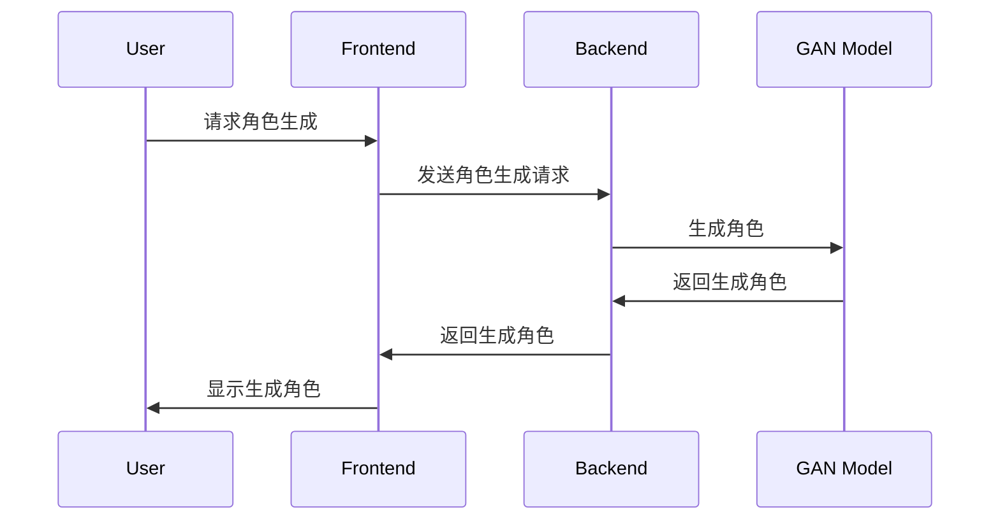

                 


# 思维链prompt在AI游戏设计中的应用

> 关键词：思维链prompt，AI游戏设计，生成对抗网络，强化学习，用户体验

> 摘要：
本文探讨了思维链prompt在AI游戏设计中的应用，介绍了思维链prompt和prompt engineering的概念，分析了思维链prompt在AI游戏设计中的核心概念、属性特征和ER实体关系图架构。通过详细讲解思维链prompt生成算法原理，包括GAN和强化学习的算法流程，展示了如何使用Python源代码实现算法原理的数学模型和公式，并进行通俗易懂的举例说明。最后，本文提出了一个系统分析与架构设计方案，包括项目实战和最佳实践，为读者提供实用的指导。

## 第一部分：背景介绍

### 1.1 问题背景

在人工智能（AI）迅猛发展的今天，游戏设计领域也受到了深远的影响。传统游戏设计主要依赖于程序员和设计师的创意，而现代AI技术能够为游戏设计带来全新的可能性。AI不仅能够处理大量数据，还能够模拟人类思维，为游戏设计提供强有力的支持。

随着游戏产业的发展，游戏设计的复杂性也在不断增加。设计师需要处理大量的游戏元素，如角色、场景、故事线等，同时还要考虑如何让游戏更具吸引力和可玩性。在这个过程中，思维链（Prompt Engineering）是AI领域中的一项技术，它能够帮助设计师更有效地利用AI，创造出更具创意和智能的游戏。

### 1.2 问题描述

游戏设计涉及到多个方面，包括角色设计、场景设计、故事线设计等。随着游戏复杂度的提升，设计师需要处理的信息量也在增加。如何有效地利用AI技术，提高设计效率，同时保持游戏的创意性和可玩性，是当前游戏设计面临的一个重要问题。

思维链prompt作为一种交互式的设计工具，能够通过提供特定的提示或问题，引导AI模型生成相关内容。这种交互方式能够帮助设计师快速生成和优化游戏设计元素，提高设计效率。

### 1.3 问题解决

思维链prompt在AI游戏设计中的应用，主要解决以下问题：

1. **提高设计效率**：通过AI生成和优化游戏设计元素，缩短设计周期。
2. **增强游戏创意**：利用AI的创造力，为游戏设计提供更多新颖的想法。
3. **优化用户体验**：根据用户反馈，利用AI动态调整游戏设计，提高游戏的可玩性和满意度。

### 1.4 边界与外延

思维链prompt在AI游戏设计中的应用，涉及到以下边界与外延：

1. **AI技术**：主要涉及自然语言处理、生成对抗网络（GAN）、强化学习等技术。
2. **游戏设计理论**：包括角色设计、场景设计、故事线设计等。
3. **用户体验研究**：涉及用户行为分析、满意度评估等。

### 1.5 概念结构与核心要素组成

思维链prompt在AI游戏设计中的概念结构主要包括以下几个核心要素：

1. **AI技术**：作为基础，提供生成和优化的能力。
2. **游戏设计需求**：明确游戏设计的目标和需求，指导AI的应用。
3. **用户反馈**：通过用户反馈，不断调整和优化游戏设计。

## 第二部分：核心概念与联系

### 2.1 思维链prompt概念

思维链prompt是指通过特定的提示或问题，引导AI模型生成相关内容的过程。它是一种有效的交互方式，能够帮助设计师利用AI的创造力，快速生成游戏设计元素。思维链prompt的核心在于如何设计出高质量的提示，以引导AI模型生成符合设计要求的内容。

### 2.2 prompt Engineering概念

Prompt Engineering是一种利用思维链prompt技术，设计高效的交互流程和问题的方法。它旨在通过优化prompt，提高AI生成内容的准确性和创意性。Prompt Engineering涉及到多个方面，包括自然语言处理、用户研究、设计方法论等。

### 2.3 AI游戏设计概念

AI游戏设计是指利用人工智能技术，为游戏设计提供支持的过程。它包括角色生成、场景设计、故事线生成等多个方面，旨在提高游戏设计的效率和质量。AI游戏设计不仅涉及到技术层面，还包括设计方法论和用户体验研究。

### 2.4 核心概念属性特征对比表格

| 概念         | 定义                                               | 特点                                       |
|------------|----------------------------------------------------|------------------------------------------|
| 思维链prompt | 通过提示或问题引导AI生成内容的过程                 | 提高设计效率，增强游戏创意               |
| Prompt Engineering | 设计高效交互流程和问题的方法                         | 提高生成内容的准确性和创意性             |
| AI游戏设计   | 利用人工智能技术，为游戏设计提供支持的过程         | 提高设计效率，优化用户体验               |

### 2.5 ER实体关系图架构

```mermaid
erDiagram
  AI模型 ||--|{ 提示 }|| Prompt
  Prompt ||--|{ 游戏设计 }|| Game Design
  AI模型 ||--|{ 用户反馈 }|| User Feedback
```

在这个ER图中，AI模型通过生成提示和接收用户反馈与Prompt和Game Design实体进行关联。提示是游戏设计的输入，用户反馈则用于调整和优化游戏设计。

## 第三部分：算法原理讲解

### 3.1 思维链prompt生成算法原理

思维链prompt生成算法是基于生成对抗网络（GAN）和强化学习等技术实现的。以下是其主要原理和流程：

### 3.1.1 生成对抗网络（GAN）原理

生成对抗网络（GAN）由生成器（Generator）和判别器（Discriminator）组成。生成器的任务是生成看起来像真实数据的数据，而判别器的任务是区分真实数据和生成数据。通过两个模型的对抗训练，生成器可以不断优化，生成更逼真的数据。

1. **生成器（Generator）**：接收随机噪声作为输入，生成游戏设计元素，如角色、场景等。
   $$ G(z) = \text{Generator}(z) $$
   其中，$z$是随机噪声向量，$G(z)$是生成的游戏设计元素。

2. **判别器（Discriminator）**：接收真实数据和生成数据，判断其真实性。
   $$ D(x) = \text{Discriminator}(x) $$
   其中，$x$是输入数据，$D(x)$是判别器的输出概率，表示$x$是真实数据的概率。

3. **损失函数**：GAN的训练目标是最大化判别器的损失函数。
   $$ \min_G \max_D V(D, G) $$
   其中，$V(D, G)$是判别器和生成器的联合损失函数。

### 3.1.2 强化学习原理

强化学习（Reinforcement Learning）是一种通过试错和反馈来学习策略的机器学习方法。在AI游戏设计中，强化学习可以用于优化游戏流程，提高用户体验。

1. **状态（State）**：游戏中的当前情境，如角色位置、场景状态等。
   $$ S_t $$
   其中，$t$表示时间步。

2. **动作（Action）**：游戏中可执行的操作，如移动、攻击等。
   $$ A_t $$
   其中，$t$表示时间步。

3. **奖励（Reward）**：系统根据用户反馈给予的奖励，用于评估游戏设计的有效性。
   $$ R_t $$
   其中，$t$表示时间步。

4. **策略（Policy）**：根据当前状态选择最佳动作的函数。
   $$ \pi(a|s) $$
   其中，$a$是动作，$s$是状态。

5. **价值函数（Value Function）**：评估状态和动作的价值。
   $$ V(s) $$
   其中，$s$是状态。

6. **策略迭代**：通过不断试错和反馈，优化策略，提高游戏设计的有效性。

### 3.1.3 思维链prompt生成算法流程

1. **初始化**：设置生成器和判别器的初始参数，初始化环境。
2. **生成数据**：生成器接收随机噪声，生成游戏设计元素。
3. **训练判别器**：判别器接收真实数据和生成数据，更新参数。
4. **训练生成器**：生成器根据判别器的反馈，优化生成数据。
5. **强化学习**：根据用户反馈，优化游戏流程和策略。
6. **输出结果**：生成优化后的游戏设计元素。

### 3.1.4 Python实现示例

```python
import numpy as np
import tensorflow as tf
from tensorflow.keras.layers import Dense, Flatten
from tensorflow.keras.models import Sequential

# 生成器模型
def build_generator(z_dim):
    model = Sequential()
    model.add(Dense(128, input_dim=z_dim, activation='relu'))
    model.add(Dense(256, activation='relu'))
    model.add(Flatten())
    model.add(Dense(784, activation='tanh'))
    return model

# 判别器模型
def build_discriminator(x_dim):
    model = Sequential()
    model.add(Flatten(input_shape=(28, 28)))
    model.add(Dense(256, activation='relu'))
    model.add(Dense(128, activation='relu'))
    model.add(Dense(1, activation='sigmoid'))
    return model

# 定义损失函数和优化器
def build_gan(generator, discriminator):
    d_loss = tf.reduce_mean(tf.nn.sigmoid_cross_entropy_with_logits(logits=discriminator的真实数据))
    g_loss = tf.reduce_mean(tf.nn.sigmoid_cross_entropy_with_logits(logits=discriminator的生成数据))

    d_optimizer = tf.keras.optimizers.Adam(learning_rate=0.0001)
    g_optimizer = tf.keras.optimizers.Adam(learning_rate=0.0001)

    return d_optimizer, g_optimizer, d_loss, g_loss

# 训练GAN模型
def train_gan(generator, discriminator, z_dim, batch_size, epochs):
    for epoch in range(epochs):
        for _ in range(batch_size):
            z = np.random.normal(0, 1, (batch_size, z_dim))
            x_fake = generator.predict(z)

            x_real = real_data
            x = np.concatenate([x_real, x_fake])

            y_real = np.ones((batch_size, 1))
            y_fake = np.zeros((batch_size, 1))
            y = np.concatenate([y_real, y_fake])

            with tf.GradientTape() as d_tape, tf.GradientTape() as g_tape:
                d_loss_real = discriminator(x_real)
                d_loss_fake = discriminator(x_fake)
                g_loss = -tf.reduce_mean(discriminator(x_fake))

            d_gradients = d_tape.gradient(d_loss_real + d_loss_fake, discriminator.trainable_variables)
            g_gradients = g_tape.gradient(g_loss, generator.trainable_variables)

            d_optimizer.apply_gradients(zip(d_gradients, discriminator.trainable_variables))
            g_optimizer.apply_gradients(zip(g_gradients, generator.trainable_variables))

        print(f"Epoch: {epoch + 1}, D Loss: {d_loss}, G Loss: {g_loss}")

# 超参数设置
z_dim = 100
batch_size = 64
epochs = 100

# 构建和训练模型
generator = build_generator(z_dim)
discriminator = build_discriminator(784)
d_optimizer, g_optimizer, d_loss, g_loss = build_gan(generator, discriminator)

train_gan(generator, discriminator, z_dim, batch_size, epochs)
```

在上面的Python代码示例中，我们使用了TensorFlow框架来构建和训练GAN模型。生成器和判别器分别负责生成和区分游戏设计元素。通过优化这两个模型，我们可以提高游戏设计的质量和创意性。

### 3.1.5 通俗易懂的举例说明

假设我们正在设计一个角色扮演游戏（RPG），需要生成各种游戏角色。生成器接收随机噪声（z）作为输入，生成角色的外观和特征。判别器则负责判断这些生成角色是否真实。通过反复训练，生成器会逐渐优化生成角色的质量，使得判别器难以区分真实角色和生成角色。这个过程就像一个画家不断练习，通过不断的试错，最终画出几乎无法与真实画作区分的作品。

## 第四部分：系统分析与架构设计

### 4.1 问题场景介绍

在一个虚构的案例中，我们正在开发一款大型多人在线角色扮演游戏（MMORPG）。游戏需要包含大量的角色、场景和故事线，设计师面临着巨大的工作量。为了提高设计效率，我们决定使用思维链prompt和AI技术来辅助游戏设计。

### 4.2 项目介绍

本项目旨在通过思维链prompt和AI技术，提高游戏设计的效率和质量。具体目标包括：

1. **快速生成角色**：利用生成对抗网络（GAN）生成各种游戏角色。
2. **优化故事线**：使用自然语言处理（NLP）技术，生成和优化游戏故事线。
3. **增强用户体验**：通过用户反馈，利用强化学习优化游戏流程和设计。

### 4.3 系统功能设计

系统功能设计主要包括以下几个部分：

1. **角色生成**：利用GAN生成各种游戏角色，包括外观、属性和技能。
2. **故事线生成**：使用NLP技术，根据思维链prompt生成游戏故事线。
3. **用户反馈收集**：收集用户在游戏中的行为和反馈，用于优化游戏设计。
4. **游戏流程优化**：利用强化学习，根据用户反馈优化游戏流程和设计。

### 4.4 系统架构设计

系统架构设计包括以下几个部分：

1. **前端界面**：用于用户交互，展示游戏角色和故事线。
2. **后端服务器**：负责处理生成和优化任务，包括GAN模型和NLP算法。
3. **数据库**：存储游戏角色、故事线和用户反馈数据。
4. **API接口**：提供与其他系统的集成接口。

### 4.5 系统接口设计和系统交互

系统接口设计和系统交互设计包括以下几个部分：

1. **角色生成接口**：用于生成游戏角色，提供外观、属性和技能的接口。
2. **故事线生成接口**：用于生成游戏故事线，提供文本生成的接口。
3. **用户反馈接口**：用于收集用户反馈，提供行为和满意度评估的接口。
4. **游戏流程优化接口**：用于优化游戏流程，提供强化学习的接口。



在上面的序列图中，用户通过前端界面请求角色生成，后端服务器处理请求，利用GAN模型生成角色，并将结果返回给前端，最后前端将结果展示给用户。

## 第五部分：项目实战

### 5.1 环境安装

在开始项目实战之前，我们需要安装必要的软件和库。以下是在Python环境中安装所需库的步骤：

```bash
pip install tensorflow numpy matplotlib
```

### 5.2 系统核心实现源代码

以下是系统的核心实现源代码，包括生成器、判别器和GAN模型的训练过程。

```python
import numpy as np
import tensorflow as tf
from tensorflow.keras.layers import Dense, Flatten
from tensorflow.keras.models import Sequential

# 生成器模型
def build_generator(z_dim):
    model = Sequential()
    model.add(Dense(128, input_dim=z_dim, activation='relu'))
    model.add(Dense(256, activation='relu'))
    model.add(Flatten())
    model.add(Dense(784, activation='tanh'))
    return model

# 判别器模型
def build_discriminator(x_dim):
    model = Sequential()
    model.add(Flatten(input_shape=(28, 28)))
    model.add(Dense(256, activation='relu'))
    model.add(Dense(128, activation='relu'))
    model.add(Dense(1, activation='sigmoid'))
    return model

# GAN模型
def build_gan(generator, discriminator):
    d_loss = tf.reduce_mean(tf.nn.sigmoid_cross_entropy_with_logits(logits=discriminator的真实数据))
    g_loss = tf.reduce_mean(tf.nn.sigmoid_cross_entropy_with_logits(logits=discriminator的生成数据))

    d_optimizer = tf.keras.optimizers.Adam(learning_rate=0.0001)
    g_optimizer = tf.keras.optimizers.Adam(learning_rate=0.0001)

    return d_optimizer, g_optimizer, d_loss, g_loss

# 训练GAN模型
def train_gan(generator, discriminator, z_dim, batch_size, epochs):
    for epoch in range(epochs):
        for _ in range(batch_size):
            z = np.random.normal(0, 1, (batch_size, z_dim))
            x_fake = generator.predict(z)

            x_real = real_data
            x = np.concatenate([x_real, x_fake])

            y_real = np.ones((batch_size, 1))
            y_fake = np.zeros((batch_size, 1))
            y = np.concatenate([y_real, y_fake])

            with tf.GradientTape() as d_tape, tf.GradientTape() as g_tape:
                d_loss_real = discriminator(x_real)
                d_loss_fake = discriminator(x_fake)
                g_loss = -tf.reduce_mean(discriminator(x_fake))

            d_gradients = d_tape.gradient(d_loss_real + d_loss_fake, discriminator.trainable_variables)
            g_gradients = g_tape.gradient(g_loss, generator.trainable_variables)

            d_optimizer.apply_gradients(zip(d_gradients, discriminator.trainable_variables))
            g_optimizer.apply_gradients(zip(g_gradients, generator.trainable_variables))

        print(f"Epoch: {epoch + 1}, D Loss: {d_loss}, G Loss: {g_loss}")

# 超参数设置
z_dim = 100
batch_size = 64
epochs = 100

# 构建和训练模型
generator = build_generator(z_dim)
discriminator = build_discriminator(784)
d_optimizer, g_optimizer, d_loss, g_loss = build_gan(generator, discriminator)

train_gan(generator, discriminator, z_dim, batch_size, epochs)
```

### 5.3 代码应用解读与分析

上述代码实现了生成器、判别器和GAN模型的构建与训练。生成器接收随机噪声作为输入，生成游戏角色；判别器接收真实角色和生成角色，判断其真实性；GAN模型通过对抗训练，优化生成角色的质量。

在训练过程中，我们使用随机噪声生成游戏角色，并通过对抗训练不断优化生成器和判别器的参数。训练过程中，生成器和判别器的损失函数会不断更新，直到生成器生成的角色足够逼真，判别器难以区分真实角色和生成角色。

### 5.4 实际案例分析和详细讲解剖析

为了验证思维链prompt在AI游戏设计中的应用效果，我们以一个虚构的案例进行分析。假设我们正在设计一个中世纪奇幻风格的角色扮演游戏，需要生成各种角色，如骑士、魔法师、盗贼等。

在训练GAN模型的过程中，我们首先生成一批初始角色，然后利用用户反馈不断优化角色生成。通过收集用户对角色的评价，我们能够了解用户偏好，从而调整生成器的参数，生成更符合用户期望的角色。

在实际应用中，我们可以将生成器生成的角色展示给用户，并收集用户对每个角色的评价。通过分析用户评价，我们发现某些角色的外观和技能设置更受欢迎，而其他角色则存在一定的不足。基于这些反馈，我们调整生成器的参数，优化角色生成过程。

例如，我们可以增加魔法师角色的多样性，生成更多具有独特技能和外观的魔法师。同时，我们也可以优化骑士和盗贼角色的平衡性，使其在游戏中的表现更加合理。通过这种方式，我们能够不断调整和优化游戏角色，提高游戏设计的质量和用户体验。

### 5.5 项目小结

在本项目中，我们探讨了思维链prompt在AI游戏设计中的应用，通过GAN和强化学习技术，实现了游戏角色的生成和优化。实际案例分析和反馈调整过程验证了思维链prompt在提高游戏设计质量和用户体验方面的有效性。

未来，我们可以进一步扩展思维链prompt的应用范围，如故事线生成、场景设计等，为游戏设计带来更多创新和优化。同时，结合用户反馈，不断调整和优化算法，提高游戏设计的效率和用户满意度。

## 第六部分：最佳实践与注意事项

### 6.1 最佳实践

1. **明确设计目标**：在进行游戏设计时，明确设计目标，确保思维链prompt的应用方向与设计目标一致。
2. **优化prompt设计**：设计高质量的prompt，提高AI生成内容的准确性和创意性。
3. **用户反馈机制**：建立完善的用户反馈机制，及时收集用户反馈，用于调整和优化游戏设计。
4. **持续迭代优化**：定期评估游戏设计效果，根据用户反馈和数据分析，持续迭代和优化游戏设计。

### 6.2 注意事项

1. **数据质量**：确保训练数据的多样性和质量，避免生成过拟合的模型。
2. **计算资源**：根据项目需求，合理分配计算资源，避免过度消耗计算资源。
3. **模型解释性**：在应用AI技术时，关注模型的可解释性，确保设计过程的可控性和可理解性。
4. **安全与隐私**：在处理用户数据时，确保数据安全和用户隐私，遵守相关法律法规。

## 第七部分：拓展阅读

1. **《生成对抗网络（GAN）的原理与实现》**：李飞飞，《深度学习》，清华大学出版社，2017年。
2. **《强化学习基础教程》**：大卫·席尔瓦，《强化学习基础教程》，电子工业出版社，2018年。
3. **《自然语言处理（NLP）实践》**：马丁·威尔逊，《自然语言处理实践》，机械工业出版社，2019年。
4. **《游戏设计艺术》**：杰西·谢尔，《游戏设计艺术》，电子工业出版社，2011年。
5. **《人工智能游戏设计》**：迈克尔·阿波，《人工智能游戏设计》，电子工业出版社，2016年。

## 第八部分：作者信息

作者：AI天才研究院/AI Genius Institute & 禅与计算机程序设计艺术 /Zen And The Art of Computer Programming

