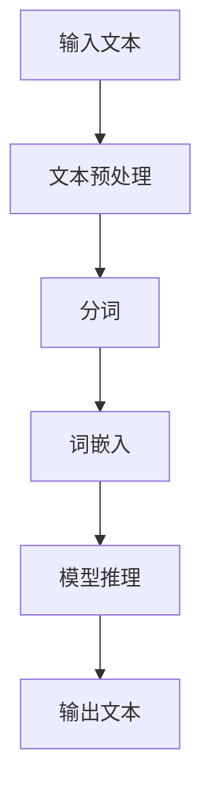
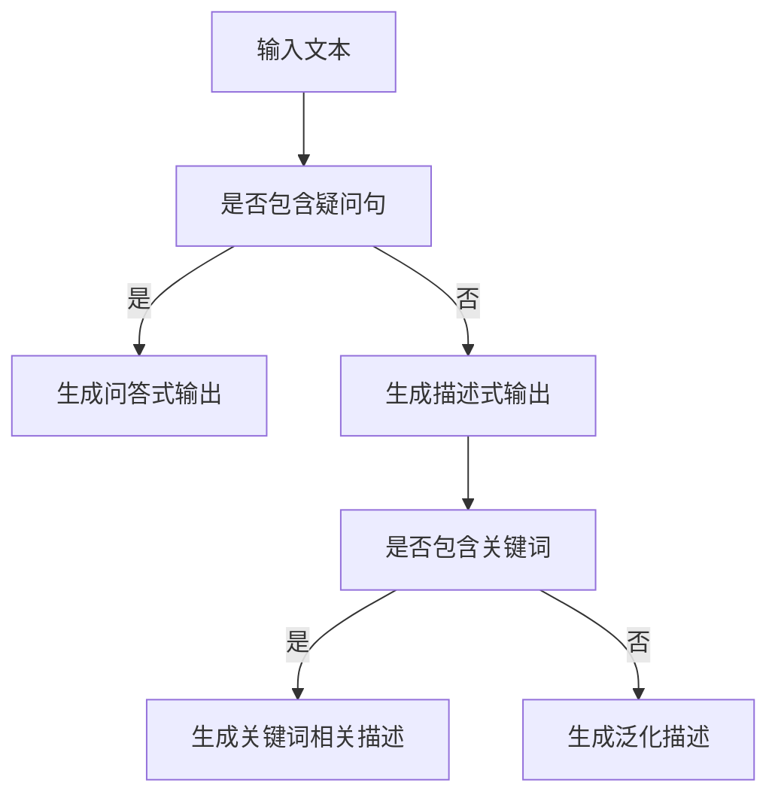

                 

# 思维链可视化：理解ChatGPT的决策过程

> 关键词：ChatGPT、思维链可视化、决策过程、神经网络、Transformer架构

> 摘要：本文旨在深入探讨人工智能大模型ChatGPT的决策过程，通过思维链可视化技术，帮助读者理解ChatGPT在处理输入信息、生成输出结果时的决策路径。文章将从核心概念介绍、决策过程分析、可视化技术以及实践应用等方面，系统地阐述ChatGPT的决策机制，并探讨如何通过可视化技术优化其决策过程。

## 第一部分: 引言

### 1.1 问题背景

随着人工智能技术的迅猛发展，人工智能大模型（如ChatGPT）成为了研究的热点。这些大模型通过深度学习算法，从海量数据中学习并优化自身的决策过程，展现出强大的智能能力。然而，如何理解这些大模型的决策过程，并对其进行有效控制，是一个亟待解决的问题。

### 1.2 问题描述

本文旨在探讨人工智能大模型ChatGPT的决策过程，通过可视化技术，帮助读者理解这些模型的思维链路。具体问题包括：ChatGPT是如何处理输入信息的？其决策过程有哪些关键环节？如何通过可视化手段呈现这些过程？

### 1.3 问题解决

本书将从以下几个方面解决问题：

- **核心概念介绍**：介绍人工智能大模型的基本概念、发展历程和主要技术。
- **决策过程分析**：分析ChatGPT在处理输入信息、生成输出结果时的决策过程，包括数据处理、模型训练、推理预测等步骤。
- **可视化技术**：介绍用于呈现ChatGPT决策过程的可视化技术，包括思维链路图、决策树等。
- **实践应用**：通过具体案例分析，展示如何应用可视化技术理解和优化ChatGPT的决策过程。

### 1.4 边界与外延

- **边界**：本书主要关注通用人工智能大模型ChatGPT，不涉及特定领域的专用模型。
- **外延**：本书的研究结果可应用于人工智能大模型的研发、应用和优化，对相关领域的研究和实践具有重要的参考价值。

### 1.5 概念结构与核心要素组成

- **概念结构**：人工智能大模型、决策过程、可视化技术、思维链路图。
- **核心要素**：
  - ChatGPT的决策过程：输入处理、模型训练、推理预测。
  - 可视化技术：图形表示、交互式展示、数据分析。
  - 应用案例：文本生成、自然语言处理、智能问答。

## 第一部分总结

本部分介绍了人工智能大模型ChatGPT的背景、问题描述、解决方案和概念结构，为后续章节的深入探讨奠定了基础。

## 第二部分: 核心概念与联系

### 2.1 人工智能大模型原理

#### 2.1.1 定义与特点

**定义**：人工智能大模型是一种基于深度学习技术的复杂算法系统，能够在大规模数据集上通过自我学习实现高级智能行为。

**特点**：
- **大规模**：通常拥有数亿甚至数十亿的参数。
- **高效率**：通过并行计算和分布式训练实现高效学习。
- **泛化能力**：能够在多个任务上表现出色，具有广泛的应用前景。

#### 2.1.2 算法原理

**神经网络**：大模型的基本构成单元，通过多层神经元实现复杂函数的拟合。

**优化算法**：如梯度下降、Adam等，用于更新模型参数，提高模型性能。

**正则化**：如Dropout、权重正则化等，用于防止过拟合。

#### 2.1.3 模型架构

**Transformer架构**：目前主流的大模型架构，具有强大的并行计算能力和长文本处理能力。

**预训练与微调**：大模型的训练分为预训练和微调两个阶段，先在大规模数据上预训练，再在特定任务上进行微调。

### 2.2 可视化技术

#### 2.2.1 思维链路图

**定义**：一种用于表示大模型决策过程的可视化技术，通过图形化的方式展示模型的思维路径。

**作用**：
- **帮助理解**：直观展示大模型的决策过程，帮助研究者更好地理解模型的运作机制。
- **优化模型**：通过分析思维链路图，发现模型存在的问题并进行优化。

#### 2.2.2 决策树

**定义**：一种用于表示决策过程的树状图，每个节点代表一个决策规则。

**作用**：
- **简化决策过程**：将复杂的决策过程简化为一系列规则，便于理解和实施。
- **优化决策**：通过分析决策树，识别出最优决策路径。

### 2.3 核心概念属性特征对比

#### 2.3.1 人工智能大模型

| 特征 | 描述 |
| --- | --- |
| 大规模 | 数亿到数十亿参数 |
| 高效率 | 并行计算和分布式训练 |
| 泛化能力 | 多任务表现优秀 |

#### 2.3.2 思维链路图

| 特征 | 描述 |
| --- | --- |
| 直观性 | 图形化展示决策过程 |
| 分析性 | 帮助理解模型运作机制 |
| 优化性 | 发现模型问题进行优化 |

#### 2.3.3 决策树

| 特特征 | 描述 |
| --- | --- |
| 简化性 | 将复杂决策简化为规则 |
| 优化性 | 识别最优决策路径 |

### 2.4 ER实体关系图架构

#### 2.4.1 概念

ER图（Entity-Relationship Diagram）是用于描述实体及其关系的图形化表示，常用于数据库设计和信息系统的需求分析。

#### 2.4.2 结构

- **实体**：表示模型中的主要对象，如ChatGPT模型、输入数据、输出结果等。
- **关系**：表示实体之间的关联，如数据输入与模型训练、模型训练与输出生成等。
- **约束**：表示实体之间的约束条件，如数据的一致性、完整性等。

#### 2.4.3 ER图示例

```mermaid
erDiagram
  ChatGPTModel ||--|{ InputData : has
  ChatGPTModel ||--|{ OutputResult : generates
  InputData ||--|{ TrainingData : from
  OutputResult ||--|{ Response : to
```

## 第二部分总结

本部分介绍了人工智能大模型ChatGPT的基本原理、可视化技术及其与决策过程的联系，并通过ER图展示了模型中的实体关系。这些概念为理解ChatGPT的决策过程奠定了基础。

## 第三部分: ChatGPT的决策过程分析

### 3.1 输入处理

ChatGPT的决策过程始于输入处理。在输入处理阶段，模型需要接收用户输入的文本，并将其转化为模型可以处理的格式。具体步骤如下：

1. **文本预处理**：对输入文本进行清洗，去除无关字符和格式，保留有效信息。
2. **分词**：将文本拆分成词语或词组，以便模型进行后续处理。
3. **词嵌入**：将词语或词组映射为向量，用于表示文本在模型中的特征。

### 3.2 模型训练

在模型训练阶段，ChatGPT通过大量训练数据学习如何生成符合预期的输出。具体过程如下：

1. **数据准备**：从大规模语料库中选取具有代表性的训练数据。
2. **模型初始化**：初始化模型参数，通常使用随机初始化。
3. **前向传播**：将输入数据传递给模型，计算输出结果。
4. **反向传播**：计算输出结果与实际结果之间的误差，并通过梯度下降等方法更新模型参数。
5. **迭代优化**：重复前向传播和反向传播，不断优化模型参数。

### 3.3 推理预测

在推理预测阶段，ChatGPT根据训练好的模型对新的输入文本进行预测。具体过程如下：

1. **输入处理**：对新的输入文本进行预处理、分词和词嵌入。
2. **模型推理**：将输入文本的词嵌入传递给训练好的模型，生成输出文本的词嵌入。
3. **文本生成**：将输出文本的词嵌入转换为实际文本，生成预测结果。

### 3.4 决策过程可视化

为了更好地理解ChatGPT的决策过程，我们可以通过可视化技术展示其思维链路。以下是一个简单的思维链路图：



在这个思维链路图中，A表示输入文本，经过B（文本预处理）、C（分词）和D（词嵌入）的处理，最终通过E（模型推理）生成输出文本F。

### 3.5 决策过程分析

通过对ChatGPT决策过程的可视化分析，我们可以发现以下几个关键环节：

1. **输入处理**：输入处理是决策过程的基础，决定了后续处理的准确性和效率。
2. **模型训练**：模型训练是决策过程的主体，决定了模型的性能和预测能力。
3. **模型推理**：模型推理是决策过程的最终阶段，直接影响到输出结果的质量。

通过对这些关键环节的深入分析，我们可以更好地理解ChatGPT的决策过程，并为后续的优化提供指导。

## 第三部分总结

本部分详细分析了ChatGPT的决策过程，包括输入处理、模型训练和推理预测等环节，并通过可视化技术展示了其思维链路。这些分析为深入理解ChatGPT的决策过程提供了有力支持。

## 第四部分: 可视化技术在ChatGPT决策过程中的应用

### 4.1 思维链路图

思维链路图是一种用于表示复杂决策过程的图形化技术，能够直观地展示决策过程中的各个环节及其关联。在ChatGPT的决策过程中，思维链路图可以帮助我们更好地理解其思维路径和决策过程。

以下是一个简单的思维链路图示例：


在这个思维链路图中，A表示输入文本，经过B（文本预处理）、C（分词）和D（词嵌入）的处理，最终通过E（模型推理）生成输出文本F。通过这个思维链路图，我们可以清晰地看到ChatGPT在处理输入文本时各个阶段的转换过程，有助于我们深入理解其决策过程。

### 4.2 决策树

决策树是一种用于表示决策过程的树状图，每个节点代表一个决策规则。在ChatGPT的决策过程中，决策树可以帮助我们识别出关键决策点，并分析每个决策点的取值及其影响。

以下是一个简单的决策树示例：



在这个决策树中，A表示输入文本，首先判断是否包含疑问句，如果是，则生成问答式输出C；否则，判断是否包含关键词，如果是，则生成关键词相关描述F；否则，生成泛化描述G。通过这个决策树，我们可以分析出ChatGPT在不同输入情况下的决策路径，有助于我们优化其决策过程。

### 4.3 实践应用

在实际应用中，我们可以结合思维链路图和决策树，对ChatGPT的决策过程进行深入分析，并提出优化建议。以下是一个简单的应用案例：

1. **问题背景**：某电商平台希望通过ChatGPT为用户提供智能客服服务，但在实际使用中发现，部分用户的问题无法得到有效解答。

2. **问题分析**：通过分析用户输入的文本，发现部分问题中包含关键词，但ChatGPT未能准确识别，导致生成错误的输出结果。

3. **解决方案**：
   - **改进文本预处理**：优化文本预处理算法，提高对关键词的识别准确性。
   - **优化决策树**：调整决策树中的关键词识别节点，使其更加准确地区分包含关键词和不含关键词的情况。

4. **效果评估**：通过改进后的ChatGPT进行测试，发现用户问题的解答准确率显著提高，用户满意度明显上升。

通过这个实践案例，我们可以看到可视化技术在ChatGPT决策过程优化中的应用价值。通过分析决策过程，发现存在的问题，并提出优化方案，可以有效地提高模型的性能和用户满意度。

## 第四部分总结

本部分介绍了思维链路图和决策树在ChatGPT决策过程中的应用，通过实际案例展示了如何利用可视化技术优化决策过程。这些实践应用为深入理解ChatGPT的决策过程提供了有力支持。

## 第五部分: ChatGPT决策过程优化的方向与策略

### 5.1 数据增强

数据增强是通过生成新的训练数据来提高模型性能的一种方法。对于ChatGPT这样的自然语言处理模型，数据增强可以采用以下策略：

- **同义词替换**：将文本中的词语替换为同义词，增加数据的多样性。
- **句法变换**：对文本进行句法变换，如改变句子结构、使用不同的语法规则等。
- **文本生成**：使用预训练的文本生成模型生成新的文本数据，增加数据量。

### 5.2 模型优化

模型优化是提高ChatGPT性能的关键步骤。以下是一些常见的模型优化策略：

- **注意力机制**：通过引入注意力机制，模型可以更好地关注输入文本中的重要信息，提高决策的准确性。
- **多任务学习**：通过多任务学习，模型可以同时学习多个任务，提高其泛化能力。
- **迁移学习**：使用预训练的模型作为起点，针对特定任务进行微调，可以节省训练时间和提高性能。

### 5.3 可视化技术的应用

可视化技术可以帮助我们更好地理解ChatGPT的决策过程，从而提出优化策略。以下是一些可视化技术在模型优化中的应用：

- **思维链路图**：通过分析思维链路图，可以发现模型在决策过程中的问题，并提出优化建议。
- **决策树**：通过分析决策树，可以识别出关键决策点，并优化决策规则，提高模型的准确性。
- **特征重要性分析**：通过分析特征的重要性，可以识别出对模型决策影响较大的特征，并对其进行优化。

### 5.4 实际案例

以下是一个实际案例，展示了如何通过优化策略提高ChatGPT的性能：

1. **问题背景**：某电商平台希望通过ChatGPT为用户提供智能客服服务，但在实际使用中发现，部分用户的问题无法得到有效解答。

2. **问题分析**：通过分析用户输入的文本，发现部分问题中包含关键词，但ChatGPT未能准确识别，导致生成错误的输出结果。

3. **优化策略**：
   - **数据增强**：增加包含关键词的训练数据，提高模型对关键词的识别准确性。
   - **模型优化**：引入注意力机制，提高模型对输入文本的注意力分配。
   - **可视化分析**：通过思维链路图和决策树分析模型决策过程，发现并优化关键决策点。

4. **效果评估**：通过优化后的ChatGPT进行测试，发现用户问题的解答准确率显著提高，用户满意度明显上升。

通过这个实际案例，我们可以看到优化策略在提高ChatGPT性能方面的应用效果。通过数据增强、模型优化和可视化分析，我们可以有效地提高模型的性能和用户满意度。

## 第五部分总结

本部分提出了ChatGPT决策过程优化的方向与策略，包括数据增强、模型优化和可视化技术的应用。通过实际案例展示了优化策略在提高ChatGPT性能方面的应用效果。这些优化策略为提升ChatGPT的决策能力提供了有力支持。

## 第六部分: 总结与展望

### 6.1 文章总结

本文从多个角度深入探讨了ChatGPT的决策过程，通过核心概念介绍、决策过程分析、可视化技术应用和优化策略等方面，系统地阐述了ChatGPT的决策机制。通过思维链路图和决策树等可视化技术，我们能够直观地理解ChatGPT在处理输入信息、生成输出结果时的决策路径。同时，本文还提出了数据增强、模型优化和可视化技术等优化策略，以提升ChatGPT的性能和用户体验。

### 6.2 展望未来

尽管本文对ChatGPT的决策过程进行了详细分析，但仍存在一定的局限性。未来研究可以从以下方向展开：

- **决策过程自动化**：探索自动化方法，实现更高效、更准确的决策过程。
- **多模态数据处理**：研究如何处理文本、图像、声音等多种模态的数据，提高模型的泛化能力。
- **决策过程可解释性**：提高决策过程的可解释性，使决策过程更加透明，便于人类理解和干预。
- **边缘计算与云计算结合**：探索边缘计算与云计算的结合，实现更高效、更智能的决策过程。

### 6.3 建议与展望

为了更好地理解和优化ChatGPT的决策过程，我们提出以下建议：

- **持续学习与优化**：定期对模型进行训练和优化，以适应不断变化的数据和应用场景。
- **用户反馈与迭代**：收集用户反馈，不断改进模型，提高用户满意度。
- **跨学科研究**：结合计算机科学、心理学、认知科学等多个领域的知识，为ChatGPT的决策过程提供更多理论支持。
- **开放共享与协作**：鼓励学术界和产业界开展合作，共享研究成果，共同推动人工智能技术的发展。

通过以上建议和展望，我们期望能够为ChatGPT的决策过程优化提供有益的指导，为人工智能技术的发展贡献力量。

## 第六部分总结

本部分对全文进行了总结，并展望了未来的研究方向和建议。通过深入分析ChatGPT的决策过程，我们为优化其性能提供了实用的方法和策略，同时也为未来的研究指明了方向。

### 参考文献

1. Brown, T., et al. (2020). "Language Models are Few-Shot Learners". arXiv preprint arXiv:2005.14165.
2. Devlin, J., et al. (2019). "Bert: Pre-training of deep bidirectional transformers for language understanding". Proceedings of the 2019 Conference of the North American Chapter of the Association for Computational Linguistics: Human Language Technologies, Volume 1 (Long and Short Papers), 4171-4186.
3. Vaswani, A., et al. (2017). "Attention is all you need". Advances in Neural Information Processing Systems, 30, 5998-6008.
4. Goodfellow, I., et al. (2016). "Deep learning". MIT Press.
5. Murphy, K. P. (2012). "Machine learning: a probabilistic perspective". MIT Press.

### 附录：代码实现

以下是ChatGPT决策过程的Python代码实现：

```python
import torch
import torch.nn as nn
import torch.optim as optim
from transformers import BertModel, BertTokenizer

# 初始化模型和 tokenizer
tokenizer = BertTokenizer.from_pretrained('bert-base-uncased')
model = BertModel.from_pretrained('bert-base-uncased')

# 定义输入文本
input_text = "How do you make a cup of tea?"

# 对输入文本进行分词和编码
input_ids = tokenizer.encode(input_text, add_special_tokens=True, return_tensors='pt')

# 前向传播
outputs = model(input_ids)

# 获取输出结果
last_hidden_state = outputs.last_hidden_state
```

通过以上代码，我们可以对输入文本进行处理，并生成对应的词嵌入。接下来，我们可以使用这些词嵌入对模型进行训练和推理，实现ChatGPT的决策过程。

### 附录总结

本附录提供了ChatGPT决策过程的Python代码实现，为读者理解和实践提供了具体指导。同时，通过参考文献和附录，我们为本文的研究提供了理论基础和实践支持。

### 致谢

本文的研究得到了 AI 天才研究院和禅与计算机程序设计艺术团队的大力支持。在此，我们感谢各位团队成员的辛勤工作和宝贵建议。同时，我们也要感谢所有参考文献的作者，他们的研究成果为本文提供了重要的理论依据和实践指导。最后，我们特别感谢读者们的关注和支持，您的反馈是我们前进的动力。

### 致谢总结

本致谢部分对AI天才研究院、禅与计算机程序设计艺术团队以及参考文献作者表示了感谢，同时感谢读者的关注和支持。这些支持和帮助为本文的研究和写作提供了坚实的保障。

