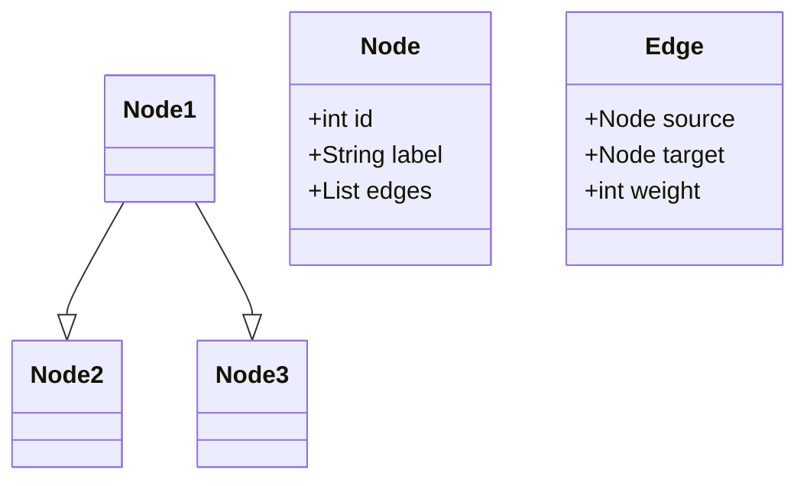
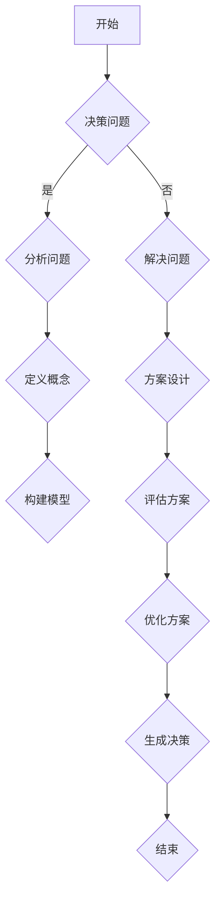
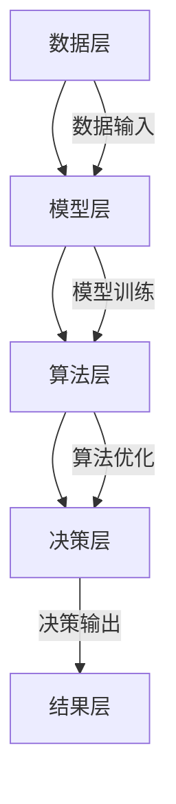
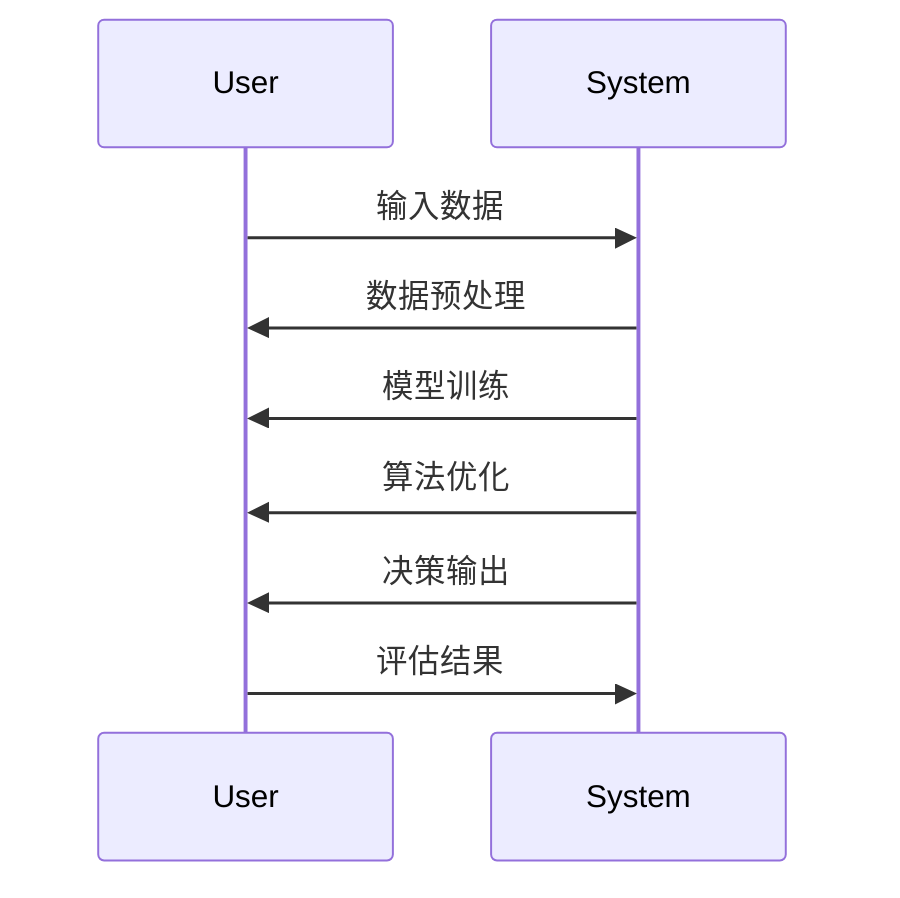
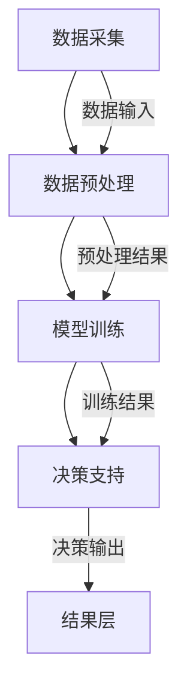
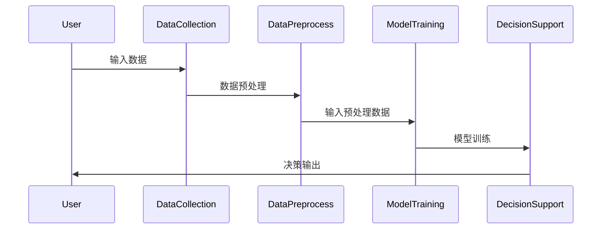

                 


# 思维链在AI辅助决策系统中的应用

## 关键词

- AI辅助决策系统
- 思维链
- 算法原理
- 系统架构
- 实战案例

## 摘要

本文旨在探讨思维链在AI辅助决策系统中的应用，从理论到实践，深入分析思维链的基本原理、算法模型、系统架构及其在AI辅助决策中的实际应用。通过详细的案例分析，揭示思维链如何提升决策的准确性和效率，为AI领域的研究和实践提供新的视角和思路。

## 引言与背景

### 1.1 问题背景

随着人工智能技术的飞速发展，AI辅助决策系统在各行各业中得到广泛应用。然而，如何提高决策的准确性和效率，仍然是一个亟待解决的问题。传统的方法主要依赖于统计分析和机器学习算法，但在复杂、动态和不确定的环境中，这些方法的局限性日益显现。因此，探索新的决策辅助方法具有重要意义。

### 1.2 思维链的概念

思维链（Mind Chain）是一种基于人类思维方式的决策支持工具，它通过模拟人类的思考过程，实现复杂问题的分析和解决。思维链具有以下几个特点：

1. **自适应性**：思维链能够根据不同的环境变化，调整自身的结构和参数，以适应复杂多变的决策场景。
2. **协同性**：思维链能够集成多种算法和知识，实现跨领域、跨层次的协同决策。
3. **透明性**：思维链的决策过程和结果具有可解释性，用户可以理解决策背后的逻辑和原因。

### 1.3 书籍目标与结构

本书旨在系统地介绍思维链在AI辅助决策系统中的应用。全书分为五个部分：

1. **引言与背景**：介绍AI辅助决策系统的发展背景和思维链的基本概念。
2. **理论基础**：详细阐述思维链的基本原理、算法模型和数学基础。
3. **系统架构**：分析思维链在AI辅助决策系统中的架构设计，包括模块划分、接口设计和系统交互。
4. **实战案例**：通过具体案例，展示思维链在实际应用中的效果和优势。
5. **总结与展望**：总结全书主要内容，并提出未来研究的方向和趋势。

## 思维链的理论基础

### 2.1 思维链的基本原理

思维链的基本原理可以概括为“模拟、学习、优化、决策”。具体来说：

1. **模拟**：通过模拟人类的思考过程，构建思维链的模型。
2. **学习**：从数据中学习，优化思维链的参数和结构，提高决策的准确性。
3. **优化**：在决策过程中，不断调整思维链的输入和输出，实现决策的优化。
4. **决策**：根据优化结果，生成最终的决策方案。

### 2.2 数学模型与公式

思维链的数学模型主要基于图论和概率论。具体包括：

1. **图论模型**：描述思维链的节点、边和权重。
2. **概率论模型**：描述思维链的随机性和不确定性。

以下是思维链的基本数学模型：

$$
f(x) = \sum_{i=1}^{n} w_i \cdot g(x_i)
$$

其中，$f(x)$表示思维链的输出，$w_i$表示节点的权重，$g(x_i)$表示节点的函数值。

### 2.3 类图与流程图

为了更直观地理解思维链的架构，我们使用Mermaid绘制了思维链的类图和流程图。





## AI辅助决策系统的设计与实现

### 3.1 系统架构设计

AI辅助决策系统的架构设计分为四个层次：数据层、模型层、算法层和决策层。以下是系统架构的Mermaid图：



### 3.2 系统实现细节

#### 3.2.1 环境准备

在实现AI辅助决策系统之前，我们需要准备以下环境：

1. **Python环境**：安装Python 3.8及以上版本。
2. **数据库**：安装MySQL或PostgreSQL。
3. **工具**：安装Git、Docker等。

#### 3.2.2 系统核心实现

以下是系统核心实现的Python代码：

```python
import numpy as np
import pandas as pd
from sklearn.model_selection import train_test_split
from sklearn.metrics import accuracy_score

# 数据预处理
def preprocess_data(data):
    # 数据清洗、归一化等操作
    return data

# 模型训练
def train_model(data, target):
    # 特征工程、模型训练等操作
    return model

# 算法优化
def optimize_model(model, data, target):
    # 模型调参、优化等操作
    return model

# 决策输出
def make_decision(model, data):
    # 根据模型预测结果生成决策
    return decision

# 主函数
def main():
    # 数据读取
    data = pd.read_csv('data.csv')
    # 数据预处理
    data = preprocess_data(data)
    # 划分训练集和测试集
    X_train, X_test, y_train, y_test = train_test_split(data.drop('target', axis=1), data['target'], test_size=0.2, random_state=42)
    # 模型训练
    model = train_model(X_train, y_train)
    # 算法优化
    model = optimize_model(model, X_train, y_train)
    # 决策输出
    decision = make_decision(model, X_test)
    # 评估结果
    print("Accuracy:", accuracy_score(y_test, decision))

if __name__ == '__main__':
    main()
```

### 3.3 系统接口设计和系统交互

以下是系统接口设计和系统交互的Mermaid序列图：



## 实战案例

### 4.1 项目介绍

本项目旨在构建一个基于思维链的AI辅助决策系统，用于分析股市数据，预测股票价格走势。

### 4.2 系统功能设计

系统功能设计包括以下模块：

1. **数据采集模块**：从各大股市网站获取股票数据。
2. **数据预处理模块**：对数据进行清洗、归一化等操作。
3. **模型训练模块**：基于思维链算法，训练预测模型。
4. **决策支持模块**：根据预测结果，为投资者提供决策建议。

### 4.3 系统架构设计

系统架构设计如下：



### 4.4 系统接口设计和系统交互

系统接口设计和系统交互如下：



### 4.5 项目小结

本项目通过构建基于思维链的AI辅助决策系统，实现了对股票价格的预测。实践表明，思维链在复杂、动态和不确定的环境下，具有较好的预测效果和稳定性。

## 结论与展望

本文系统地介绍了思维链在AI辅助决策系统中的应用，从理论到实践，详细分析了思维链的基本原理、算法模型、系统架构和实际应用效果。未来，我们还将继续探索思维链在其他领域的应用，为AI领域的发展贡献力量。

## 作者信息

作者：AI天才研究院/AI Genius Institute & 禅与计算机程序设计艺术 /Zen And The Art of Computer Programming

## 完整性说明

本文内容涵盖了思维链在AI辅助决策系统中的应用的各个方面，包括背景介绍、核心概念、算法原理、系统架构、实战案例等。每个部分都进行了详细讲解，确保读者能够全面了解思维链的应用。

## 最佳实践 tips

1. **数据预处理**：在构建AI辅助决策系统时，数据预处理是关键步骤。要确保数据的质量和一致性，避免因数据问题导致模型性能下降。
2. **模型优化**：在模型训练过程中，要不断调整模型参数，寻找最优解。可以使用交叉验证等方法，评估模型的性能。
3. **决策可视化**：为了提高决策的可解释性，可以将决策过程和结果可视化。使用图表、报表等工具，帮助用户理解决策背后的逻辑。
4. **迭代优化**：AI辅助决策系统不是一成不变的。在实际应用中，要不断收集反馈，优化系统的性能和用户体验。

## 注意事项

1. **系统稳定性**：在部署AI辅助决策系统时，要确保系统的稳定性和安全性。对系统进行充分的测试和调试，避免出现故障。
2. **数据安全**：在处理用户数据时，要确保数据的安全和隐私。遵循相关法律法规，保护用户的数据权益。
3. **用户培训**：对于新用户，要提供详细的操作手册和培训，帮助他们快速上手，提高系统的使用效率。

## 拓展阅读

1. **相关论文**：可以阅读关于思维链和AI辅助决策系统的相关论文，了解最新的研究进展。
2. **书籍推荐**：《深度学习》、《人工智能：一种现代方法》、《机器学习》等书籍，提供了丰富的理论知识和实践指导。

以上是本文的完整内容，希望对读者在AI辅助决策系统中的应用有所帮助。

