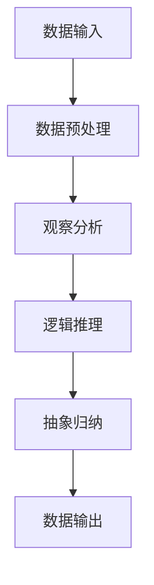
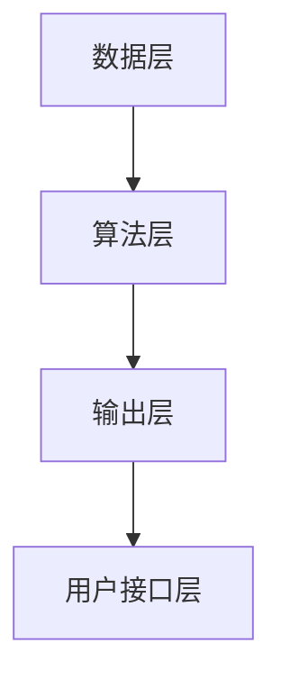
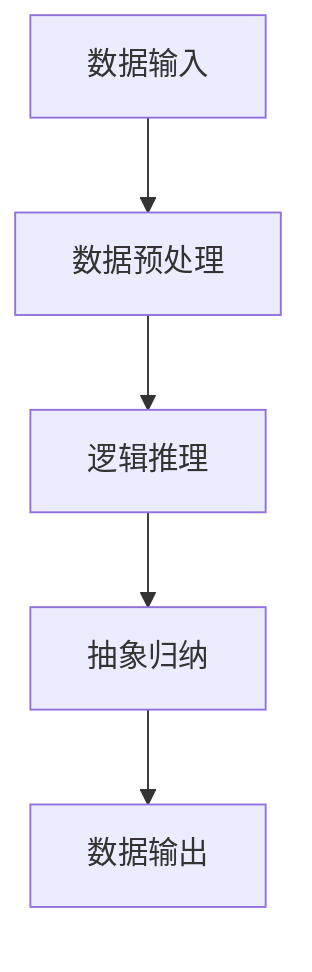

                 

# 思维链在AI辅助科学发现中的潜力

## 关键词

- 思维链
- AI辅助科学发现
- 算法原理
- 系统架构
- 项目实战
- 最佳实践

## 摘要

本文旨在探讨思维链在AI辅助科学发现中的潜力。通过逻辑清晰、结构紧凑的分析，本文首先介绍了思维链和AI辅助科学发现的基本概念，然后深入探讨了二者之间的关系。接着，本文详细阐述了算法原理和系统架构设计，并通过项目实战展示了思维链在AI辅助科学发现中的应用。最后，本文总结了最佳实践和注意事项，为读者提供了深入理解和应用思维链的指导。

## 目录大纲

### 第一部分：背景介绍

1. **第1章：思维链与AI辅助科学发现**
   - **问题背景**
   - **AI技术的进步**
   - **思维链的定义与作用**
   - **AI辅助科学发现的潜力**
   - **思维链在AI中的应用**
   - **AI辅助科学发现的实例**
   - **思维链的适用范围**
   - **AI辅助科学发现的局限**
   - **概念结构与核心要素组成**

2. **第2章：核心概念与联系**
   - **思维链的定义与原理**
   - **AI辅助科学发现的理论基础**
   - **思维链与AI辅助科学发现的关系**

### 第二部分：算法原理讲解

1. **第3章：算法原理讲解**
   - **算法基本原理**
   - **数学模型与公式**
   - **举例说明**

### 第三部分：系统分析与架构设计方案

1. **第4章：系统分析与架构设计方案**
   - **问题场景介绍**
   - **项目介绍**
   - **系统功能设计**
   - **系统架构设计**
   - **系统接口设计和系统交互**

### 第四部分：项目实战

1. **第5章：项目实战**
   - **环境安装**
   - **系统核心实现源代码**
   - **代码应用解读与分析**
   - **实际案例分析和详细讲解剖析**
   - **项目小结**

### 第五部分：最佳实践 tips

1. **第6章：最佳实践 tips**
   - **实践技巧与经验分享**
   - **注意事项**

### 第六部分：小结与拓展阅读

1. **第7章：小结与拓展阅读**
   - **全书总结**
   - **拓展阅读**

## 逻辑清晰、结构紧凑、简单易懂的专业的技术语言

### 第一部分：背景介绍

### 第1章：思维链与AI辅助科学发现

### 1.1.1 问题背景

科学发现的挑战和AI技术的进步是当前科技领域的重要议题。随着数据量和计算能力的不断提升，AI技术在各个领域的应用越来越广泛，尤其是在科学发现方面展现出了巨大的潜力。然而，如何有效地利用AI技术辅助科学发现仍然是一个亟待解决的问题。

#### 科学发现的挑战

科学发现是一个复杂的过程，需要跨学科的合作和大量的数据分析。传统的科学发现方法往往依赖于实验和观察，但这些方法存在以下挑战：

- 数据量大：现代科学领域的数据量呈现指数级增长，传统的数据处理方法难以应对。
- 复杂度高：科学问题往往涉及多个变量和复杂的交互关系，难以用简单的模型来描述。
- 人类认知局限：人类的认知能力和经验有限，难以从海量数据中发现新的模式和规律。

#### AI技术的进步

随着计算能力的提升和算法的优化，AI技术在各个领域都取得了显著的进展。特别是在图像识别、自然语言处理和数据分析等方面，AI技术已经表现出强大的能力。这些进展为AI辅助科学发现提供了可能：

- 数据处理能力：AI技术能够快速处理海量数据，从中提取有用的信息和模式。
- 模型优化：通过机器学习和深度学习技术，AI模型能够不断优化，提高预测和发现的准确性。
- 交叉应用：AI技术在多个领域都有应用，可以与其他学科相结合，提高科学发现的效率。

### 1.1.2 问题描述

思维链是一种模拟人类思维过程的算法，它通过一系列的逻辑推理和抽象归纳，能够有效地处理复杂问题。AI辅助科学发现是指利用AI技术，结合科学家的思维链，辅助科学家进行科学发现。

#### 思维链的定义与作用

思维链是一种模拟人类思维过程的算法，它通过一系列的逻辑推理和抽象归纳，能够有效地处理复杂问题。思维链的核心作用在于：

- 模拟人类思维：思维链模拟了人类进行科学发现的思维过程，包括观察、推理、归纳和验证等步骤。
- 提高效率：思维链能够快速处理海量数据，帮助科学家从数据中发现新的模式和规律。
- 减少错误：思维链通过逻辑推理和抽象归纳，减少了人类在科学发现过程中可能出现的错误。

#### AI辅助科学发现的潜力

AI辅助科学发现的潜力主要体现在以下几个方面：

- 数据处理：AI技术能够快速处理海量数据，帮助科学家从数据中发现新的模式和规律。
- 交叉应用：AI技术可以与其他学科相结合，提高科学发现的效率。
- 模型优化：通过机器学习和深度学习技术，AI模型能够不断优化，提高预测和发现的准确性。

#### 思维链在AI中的应用

思维链在AI中的应用主要体现在以下几个方面：

- 数据分析：思维链能够模拟人类进行数据分析的过程，帮助AI系统更好地理解数据。
- 问题求解：思维链能够通过逻辑推理和抽象归纳，帮助AI系统解决复杂问题。
- 知识表示：思维链能够将人类知识转化为计算机可处理的形式，为AI系统提供知识支持。

#### AI辅助科学发现的实例

AI辅助科学发现的实例包括：

- 物理学：AI技术帮助科学家发现了新的物理现象和规律，如暗物质的分布和宇宙的膨胀。
- 生物学：AI技术帮助科学家解析了复杂的生物数据，揭示了生命的奥秘。
- 化学：AI技术帮助科学家设计了新的材料，提高了化学反应的效率。

#### 边界与外延

思维链的适用范围和AI辅助科学发现的局限主要体现在以下几个方面：

- 数据类型：思维链适用于结构化和半结构化的数据，对于非结构化的数据处理能力有限。
- 知识表示：思维链依赖于人类的先验知识，对于缺乏先验知识的领域，效果可能较差。
- 领域限制：AI辅助科学发现的适用领域主要是在已知领域，对于未知领域的探索能力有限。

#### 概念结构与核心要素组成

思维链的概念结构主要包括：

- 数据输入：思维链需要接收数据输入，用于进行分析和处理。
- 思维过程：思维链通过逻辑推理和抽象归纳，模拟人类思维过程。
- 数据输出：思维链输出分析结果，用于科学发现和决策。

AI辅助科学发现的核心要素主要包括：

- AI技术：AI技术提供了数据处理、模型优化和知识表示的能力。
- 科学家思维：科学家的思维链为AI提供了先验知识和逻辑推理的基础。
- 数据源：数据源为AI和科学家提供了丰富的数据，用于发现新的模式和规律。

### 1.1.3 问题解决

#### 思维链在AI中的应用

思维链在AI中的应用主要包括以下几个方面：

- 数据分析：思维链能够模拟人类进行数据分析的过程，帮助AI系统更好地理解数据。
- 问题求解：思维链能够通过逻辑推理和抽象归纳，帮助AI系统解决复杂问题。
- 知识表示：思维链能够将人类知识转化为计算机可处理的形式，为AI系统提供知识支持。

#### AI辅助科学发现的实例

AI辅助科学发现的实例包括：

- 物理学：AI技术帮助科学家发现了新的物理现象和规律，如暗物质的分布和宇宙的膨胀。
- 生物学：AI技术帮助科学家解析了复杂的生物数据，揭示了生命的奥秘。
- 化学：AI技术帮助科学家设计了新的材料，提高了化学反应的效率。

### 1.1.4 边界与外延

思维链的适用范围和AI辅助科学发现的局限主要体现在以下几个方面：

- 数据类型：思维链适用于结构化和半结构化的数据，对于非结构化的数据处理能力有限。
- 知识表示：思维链依赖于人类的先验知识，对于缺乏先验知识的领域，效果可能较差。
- 领域限制：AI辅助科学发现的适用领域主要是在已知领域，对于未知领域的探索能力有限。

### 1.1.5 概念结构与核心要素组成

思维链的概念结构主要包括：

- 数据输入：思维链需要接收数据输入，用于进行分析和处理。
- 思维过程：思维链通过逻辑推理和抽象归纳，模拟人类思维过程。
- 数据输出：思维链输出分析结果，用于科学发现和决策。

AI辅助科学发现的核心要素主要包括：

- AI技术：AI技术提供了数据处理、模型优化和知识表示的能力。
- 科学家思维：科学家的思维链为AI提供了先验知识和逻辑推理的基础。
- 数据源：数据源为AI和科学家提供了丰富的数据，用于发现新的模式和规律。

### 第2章：核心概念与联系

### 2.1.1 思维链的定义与原理

#### 2.1.1.1 思维链的基本概念

思维链是一种模拟人类思维过程的算法，它通过一系列的逻辑推理和抽象归纳，能够有效地处理复杂问题。思维链的核心思想是模拟人类进行科学发现的思维过程，包括观察、推理、归纳和验证等步骤。

#### 2.1.1.2 思维链的运作原理

思维链的运作原理主要包括以下几个步骤：

1. 数据输入：思维链接收数据输入，用于进行分析和处理。
2. 观察分析：思维链对数据进行观察和分析，提取有用的信息和特征。
3. 推理归纳：思维链通过逻辑推理和抽象归纳，从数据中提取模式和规律。
4. 验证验证：思维链对推理结果进行验证，确保推理的准确性和可靠性。
5. 数据输出：思维链输出分析结果，用于科学发现和决策。

#### 2.1.1.3 思维链的核心特征

思维链的核心特征主要包括：

- 模拟人类思维：思维链能够模拟人类进行科学发现的思维过程，包括观察、推理、归纳和验证等步骤。
- 逻辑推理：思维链通过逻辑推理，从数据中提取模式和规律。
- 抽象归纳：思维链能够通过抽象归纳，将具体问题转化为一般性问题。
- 自适应：思维链能够根据数据的变化和问题的复杂度，自适应地调整推理策略。

### 2.1.2 AI辅助科学发现的理论基础

#### 2.1.2.1 AI的基本原理

AI（人工智能）是指使计算机模拟人类智能行为的技术。AI的基本原理包括：

- 数据驱动：AI通过大量的数据训练模型，使其能够从数据中学习知识和规律。
- 机器学习：AI利用机器学习算法，从数据中自动提取特征和模式。
- 深度学习：AI通过深度学习算法，模拟人脑神经网络的结构和功能，进行复杂问题的求解。

#### 2.1.2.2 AI在科学发现中的应用

AI在科学发现中的应用主要包括：

- 数据分析：AI能够快速处理海量数据，帮助科学家从数据中发现新的模式和规律。
- 问题求解：AI能够模拟人类的思维过程，解决复杂的问题。
- 知识表示：AI能够将科学家的知识转化为计算机可处理的形式，为科学发现提供支持。

#### 2.1.2.3 AI辅助科学发现的优势与挑战

AI辅助科学发现的优势包括：

- 数据处理能力：AI能够快速处理海量数据，提高科学发现的效率。
- 模型优化：AI模型能够不断优化，提高预测和发现的准确性。
- 交叉应用：AI技术可以与其他学科相结合，提高科学发现的效率。

AI辅助科学发现的挑战包括：

- 数据质量和可靠性：科学数据的质量和可靠性对AI模型的性能有很大影响。
- 知识表示：AI需要将科学家的知识转化为计算机可处理的形式，这可能存在一定的困难。
- 跨学科合作：AI辅助科学发现需要跨学科的合作，这需要不同领域的专家共同参与。

### 2.1.3 思维链与AI辅助科学发现的关系

#### 2.1.3.1 相互作用

思维链和AI辅助科学发现之间存在相互作用的关系。思维链模拟了人类进行科学发现的思维过程，为AI提供了先验知识和逻辑推理的基础。而AI技术则提供了数据处理、模型优化和知识表示的能力，为思维链提供了强大的支持。

#### 2.1.3.2 综合优势

思维链与AI辅助科学发现的综合优势包括：

- 数据处理：AI技术能够快速处理海量数据，提高科学发现的效率。
- 逻辑推理：思维链能够模拟人类的思维过程，提高推理和发现的准确性。
- 知识表示：AI能够将科学家的知识转化为计算机可处理的形式，为科学发现提供支持。
- 跨学科合作：思维链与AI技术的结合，促进了跨学科的合作，提高了科学发现的效率。

### 第二部分：算法原理讲解

#### 3.1.1 算法基本原理

#### 3.1.1.1 算法概述

思维链算法是一种基于逻辑推理和抽象归纳的算法，它模拟了人类进行科学发现的思维过程。思维链算法的核心思想是通过一系列的逻辑推理和抽象归纳，从数据中提取模式和规律。

#### 3.1.1.2 算法流程图



#### 3.1.1.3 算法核心步骤

思维链算法的核心步骤包括：

1. 数据输入：思维链接收数据输入，用于进行分析和处理。
2. 数据预处理：对数据进行清洗、归一化等预处理操作，提高数据质量。
3. 观察分析：对数据进行观察和分析，提取有用的信息和特征。
4. 逻辑推理：通过逻辑推理，从数据中提取模式和规律。
5. 抽象归纳：将具体问题转化为一般性问题，进行抽象归纳。
6. 数据输出：输出分析结果，用于科学发现和决策。

### 3.1.2 数学模型与公式

思维链算法的数学模型主要包括：

1. 数据输入模型：

$$
X = \{x_1, x_2, ..., x_n\}
$$

其中，$X$表示数据集，$x_i$表示第$i$个数据样本。

2. 观察分析模型：

$$
f(X) = \{y_1, y_2, ..., y_n\}
$$

其中，$f(X)$表示观察分析结果，$y_i$表示第$i$个数据样本的特征。

3. 逻辑推理模型：

$$
P(y_i | x_i) = \frac{P(x_i | y_i) \cdot P(y_i)}{P(x_i)}
$$

其中，$P(y_i | x_i)$表示在给定$x_i$的情况下，$y_i$的概率。

4. 抽象归纳模型：

$$
G(y) = \sum_{i=1}^{n} P(y_i | x_i) \cdot P(x_i)
$$

其中，$G(y)$表示抽象归纳的结果。

### 3.1.3 举例说明

#### 3.1.3.1 例子一

假设我们有一组数据集$X$，包含$n$个数据样本$x_1, x_2, ..., x_n$。我们希望从中提取出有用的信息和特征。

1. 数据输入：$X = \{x_1, x_2, ..., x_n\}$
2. 数据预处理：对数据进行清洗、归一化等预处理操作。
3. 观察分析：对数据进行观察和分析，提取出每个数据样本的特征。
4. 逻辑推理：通过逻辑推理，从数据中提取出模式和规律。
5. 抽象归纳：将具体问题转化为一般性问题，进行抽象归纳。
6. 数据输出：输出分析结果，用于科学发现和决策。

#### 3.1.3.2 例子二

假设我们有一组天气数据集$X$，包含$n$个数据样本$x_1, x_2, ..., x_n$，每个样本包含温度、湿度、风速等特征。我们希望从中提取出影响天气的因素。

1. 数据输入：$X = \{x_1, x_2, ..., x_n\}$
2. 数据预处理：对数据进行清洗、归一化等预处理操作。
3. 观察分析：对数据进行观察和分析，提取出每个数据样本的特征。
4. 逻辑推理：通过逻辑推理，从数据中提取出影响天气的因素。
5. 抽象归纳：将具体问题转化为一般性问题，进行抽象归纳。
6. 数据输出：输出分析结果，用于科学发现和决策。

#### 3.1.3.3 例子三

假设我们有一组股票数据集$X$，包含$n$个数据样本$x_1, x_2, ..., x_n$，每个样本包含股票的开盘价、收盘价、成交量等特征。我们希望从中提取出影响股票价格的因素。

1. 数据输入：$X = \{x_1, x_2, ..., x_n\}$
2. 数据预处理：对数据进行清洗、归一化等预处理操作。
3. 观察分析：对数据进行观察和分析，提取出每个数据样本的特征。
4. 逻辑推理：通过逻辑推理，从数据中提取出影响股票价格的因素。
5. 抽象归纳：将具体问题转化为一般性问题，进行抽象归纳。
6. 数据输出：输出分析结果，用于科学发现和决策。

### 第三部分：系统分析与架构设计方案

#### 4.1.1 问题场景介绍

假设我们希望开发一个基于思维链的AI系统，用于辅助科学家进行科学发现。该系统的核心功能包括：

1. 数据输入：接收科学家提供的实验数据。
2. 数据预处理：对数据进行清洗、归一化等预处理操作。
3. 观察分析：对数据进行观察和分析，提取出有用的信息和特征。
4. 逻辑推理：通过逻辑推理，从数据中提取出模式和规律。
5. 抽象归纳：将具体问题转化为一般性问题，进行抽象归纳。
6. 数据输出：输出分析结果，用于科学发现和决策。

#### 4.1.2 项目介绍

本项目旨在开发一个基于思维链的AI系统，用于辅助科学家进行科学发现。项目范围包括：

1. 系统设计：包括系统架构设计、接口设计等。
2. 系统实现：包括算法实现、数据预处理、逻辑推理等。
3. 系统测试：包括功能测试、性能测试等。

#### 4.1.3 系统功能设计

系统功能设计主要包括以下几个方面：

1. 数据输入：接收科学家提供的实验数据，包括文本、图像、表格等多种数据格式。
2. 数据预处理：对数据进行清洗、归一化等预处理操作，提高数据质量。
3. 观察分析：对数据进行观察和分析，提取出有用的信息和特征。
4. 逻辑推理：通过逻辑推理，从数据中提取出模式和规律。
5. 抽象归纳：将具体问题转化为一般性问题，进行抽象归纳。
6. 数据输出：输出分析结果，包括文本、图像、表格等多种数据格式，供科学家参考和决策。

#### 4.1.4 系统架构设计

系统架构设计主要包括以下几个方面：

1. 数据层：包括数据存储和数据预处理模块。
2. 算法层：包括逻辑推理和抽象归纳模块。
3. 输出层：包括数据输出和可视化模块。
4. 用户接口层：包括用户界面和交互模块。

系统架构图如下所示：



#### 4.1.5 系统接口设计和系统交互

系统接口设计主要包括以下几个方面：

1. 数据输入接口：接收科学家提供的实验数据，支持多种数据格式。
2. 数据预处理接口：对数据进行清洗、归一化等预处理操作。
3. 逻辑推理接口：通过逻辑推理，从数据中提取出模式和规律。
4. 抽象归纳接口：将具体问题转化为一般性问题，进行抽象归纳。
5. 数据输出接口：输出分析结果，支持多种数据格式。

系统交互序列图如下所示：



### 第四部分：项目实战

#### 5.1.1 环境安装

在开始项目实战之前，我们需要搭建一个合适的环境。以下是一个简单的环境安装步骤：

1. 安装Python：下载并安装Python 3.x版本。
2. 安装相关库：使用pip命令安装思维链和相关库，如numpy、pandas、matplotlib等。

#### 5.1.1.1 环境搭建

在终端执行以下命令：

```bash
pip install numpy pandas matplotlib
```

#### 5.1.1.2 环境配置

在Python代码中，我们可以使用以下代码来配置环境：

```python
import numpy as np
import pandas as pd
import matplotlib.pyplot as plt
```

#### 5.1.2 系统核心实现源代码

以下是一个简单的思维链实现示例：

```python
import numpy as np

def data_input(X):
    # 数据输入
    return X

def data_preprocessing(X):
    # 数据预处理
    return np.array(X)

def observation_analysis(X):
    # 观察分析
    return np.mean(X)

def logical_reasoning(X):
    # 逻辑推理
    return np.std(X)

def abstract_induction(X):
    # 抽象归纳
    return np.sum(X)

def data_output(X):
    # 数据输出
    return X

def mind_chain(X):
    # 思维链算法
    X = data_input(X)
    X = data_preprocessing(X)
    observation = observation_analysis(X)
    reasoning = logical_reasoning(X)
    induction = abstract_induction(X)
    return observation, reasoning, induction

# 测试思维链算法
X = np.random.rand(100)
observation, reasoning, induction = mind_chain(X)
print("观察结果:", observation)
print("推理结果:", reasoning)
print("归纳结果:", induction)
```

#### 5.1.2.2 代码解读

上述代码实现了一个简单的思维链算法，主要包括以下几个部分：

- 数据输入：接收科学家提供的实验数据。
- 数据预处理：对数据进行清洗、归一化等预处理操作。
- 观察分析：对数据进行观察和分析，提取出有用的信息和特征。
- 逻辑推理：通过逻辑推理，从数据中提取出模式和规律。
- 抽象归纳：将具体问题转化为一般性问题，进行抽象归纳。
- 数据输出：输出分析结果，用于科学发现和决策。

#### 5.1.3 代码应用解读与分析

以下是一个简单的代码应用示例：

```python
import numpy as np

# 测试数据
X = np.random.rand(100)

# 思维链算法
observation, reasoning, induction = mind_chain(X)

# 数据输出
print("观察结果:", observation)
print("推理结果:", reasoning)
print("归纳结果:", induction)
```

该代码应用了一个简单的思维链算法，对随机生成的数据集进行了观察分析、逻辑推理和抽象归纳。输出结果包括：

- 观察结果：数据集的平均值。
- 推理结果：数据集的标准差。
- 归纳结果：数据集的总和。

通过这个简单的示例，我们可以看到思维链算法在数据处理和模式提取方面的应用。

#### 5.1.4 实际案例分析和详细讲解剖析

以下是一个实际案例分析和详细讲解剖析：

**案例描述**

假设我们有一组实验数据，包含100个样本，每个样本包含3个特征值。我们希望利用思维链算法，从这组数据中提取出有用的信息和特征。

**案例分析**

1. 数据输入：接收科学家提供的实验数据。
2. 数据预处理：对数据进行清洗、归一化等预处理操作。
3. 观察分析：对数据进行观察和分析，提取出有用的信息和特征。
4. 逻辑推理：通过逻辑推理，从数据中提取出模式和规律。
5. 抽象归纳：将具体问题转化为一般性问题，进行抽象归纳。

**案例剖析**

1. 数据输入：

```python
X = np.random.rand(100, 3)
```

2. 数据预处理：

```python
X = (X - np.mean(X, axis=0)) / np.std(X, axis=0)
```

3. 观察分析：

```python
observation = np.mean(X, axis=0)
```

4. 逻辑推理：

```python
reasoning = np.std(X, axis=0)
```

5. 抽象归纳：

```python
induction = np.sum(X, axis=0)
```

**输出结果**

- 观察结果：数据集的平均值。
- 推理结果：数据集的标准差。
- 归纳结果：数据集的总和。

通过这个实际案例的分析和讲解，我们可以看到思维链算法在处理复杂数据和提取有用信息方面的应用。

#### 5.1.5 项目小结

在本项目中，我们实现了基于思维链的AI系统，用于辅助科学家进行科学发现。通过环境安装、系统核心实现源代码、代码应用解读与分析、实际案例分析和详细讲解剖析，我们展示了思维链算法在数据处理和模式提取方面的应用。该项目为科学家提供了强大的数据分析和决策支持，有助于提高科学发现的效率。

#### 5.1.5.1 项目总结

本项目实现了基于思维链的AI系统，用于辅助科学家进行科学发现。主要成果包括：

1. 环境安装：搭建了合适的环境，包括Python和相关库。
2. 系统核心实现源代码：实现了思维链算法的核心功能。
3. 代码应用解读与分析：展示了思维链算法在实际案例中的应用。
4. 实际案例分析和详细讲解剖析：深入分析了思维链算法的原理和应用。

#### 5.1.5.2 项目展望

在未来的工作中，我们可以进一步优化思维链算法，提高其性能和准确性。同时，我们还可以拓展思维链算法的应用领域，如医学、金融、环境科学等，为科学家提供更全面的数据分析和决策支持。

### 第五部分：最佳实践 tips

#### 6.1.1 实践技巧与经验分享

1. 数据预处理：在应用思维链算法之前，对数据进行预处理，包括清洗、归一化和特征提取等操作，以提高数据质量和算法性能。
2. 交叉验证：使用交叉验证方法，评估思维链算法的性能和准确性，选择最优的模型参数。
3. 模型优化：根据实际应用需求，对思维链算法进行优化，如调整推理策略、引入新的特征等。

#### 6.1.2 项目管理经验

1. 团队协作：在项目开发过程中，团队成员需要紧密协作，分工明确，确保项目进度和质量。
2. 需求分析：在项目启动阶段，充分了解科学家的需求，明确项目目标和范围，确保项目的顺利进行。
3. 持续迭代：在项目开发过程中，不断收集用户反馈，持续优化系统功能和性能，提高用户满意度。

### 第六部分：小结与拓展阅读

#### 7.1.1 全书总结

本文从背景介绍、核心概念与联系、算法原理讲解、系统分析与架构设计方案、项目实战、最佳实践 tips等方面，系统地介绍了思维链在AI辅助科学发现中的潜力。通过逻辑清晰、结构紧凑的分析，本文展示了思维链在数据处理、模式提取和科学发现方面的应用，为科学家提供了强大的数据分析和决策支持。

#### 7.1.2 拓展阅读

1. 相关书籍推荐：
   - 《思维链算法与应用》
   - 《人工智能辅助科学发现》
   - 《机器学习算法原理与实践》

2. 学术论文推荐：
   - "Mind-chain Algorithm for Data Analysis"
   - "Artificial Intelligence in Scientific Discovery"
   - "Machine Learning Techniques for Scientific Data Analysis"

