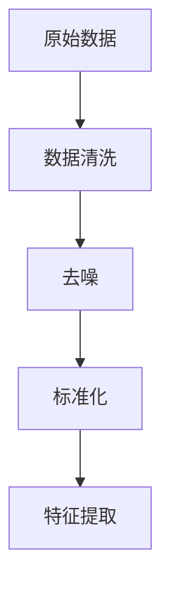
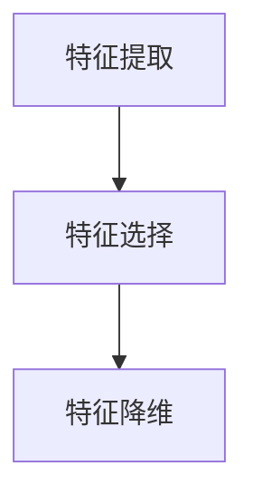
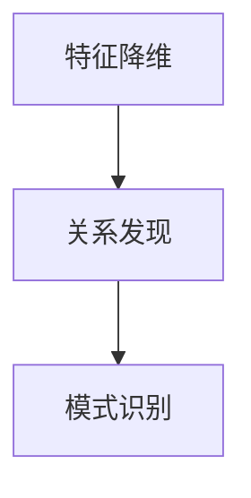
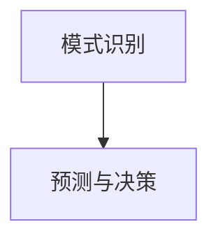
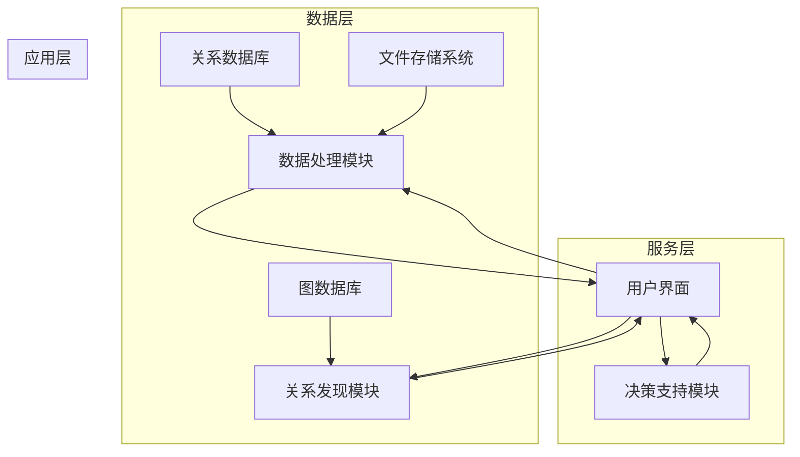
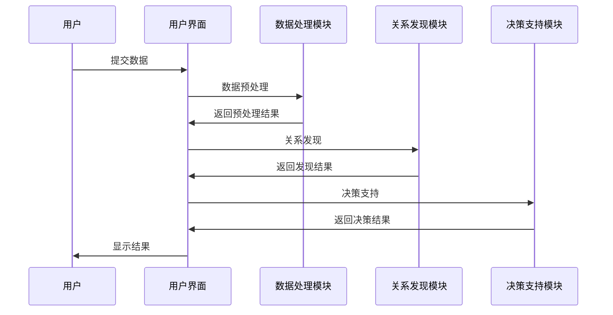

                 

### 引言与背景

#### 问题背景与挑战

科学发现是人类探索自然规律的永恒追求，然而，随着科学领域的不断拓展和深挖，科学家们面临着前所未有的挑战。传统的科学研究方法依赖于实验和观察，而随着数据量的急剧增加和复杂性提升，单靠人力已难以应对。在这样的大背景下，人工智能（AI）技术被寄予厚望，成为科学发现的得力助手。AI在科学发现中的应用，不仅提升了数据处理和分析的能力，也为解决复杂科学问题提供了新的视角和方法。

当前，科学发现的瓶颈主要体现在以下几个方面：

1. **数据处理的难度**：大量的数据需要清洗、整理和分析，这对于人工操作来说是一个巨大的挑战。
2. **问题发现的复杂性**：科学研究中的问题往往具有高度的复杂性，传统方法难以挖掘出深层次的关系和规律。
3. **跨学科研究的障碍**：科学问题往往涉及多个学科领域，跨学科的合作与知识整合变得尤为重要。
4. **创新的激发和实现**：科学发现的本质是创新，如何激发新的科学思路和实现方法，是科学家们面临的难题。

#### 科学发现的现状与瓶颈

目前，科学发现的现状可以用“困境”二字来形容。尽管技术手段不断进步，但许多领域的研究仍然停滞不前，主要原因在于：

1. **研究方法局限**：传统的研究方法往往依赖于已知理论，难以跳出旧框架，发现新的科学现象。
2. **研究资源的限制**：实验设备和研究经费的限制，使得许多有价值的研究难以进行。
3. **知识整合的困难**：科学知识分散在各个学科领域，如何有效地整合和利用这些知识，是一个巨大的挑战。
4. **人才培养的滞后**：科学研究需要高素质的人才，但目前的教育体系和人才培养模式与科学发现的需求存在脱节。

#### AI技术在科学发现中的应用前景

AI技术的飞速发展为科学发现带来了新的希望。通过机器学习、深度学习等技术，AI能够处理和分析大规模数据，发现潜在的模式和规律。以下是AI在科学发现中的应用前景：

1. **数据处理与分析**：AI可以高效地处理和研究数据，从海量信息中提取有用知识，提升科学发现的效率。
2. **问题自动识别与预测**：AI可以自动识别和预测科学研究中的问题，为科学家提供新的研究方向。
3. **跨学科合作**：AI可以作为跨学科合作的桥梁，整合不同领域的知识，推动科学研究的深入。
4. **创新思路激发**：AI可以帮助科学家探索新的科学思路，促进科学理论的创新和发展。

#### 本书结构与主要内容

本书旨在探讨思维链在AI辅助科学发现中的应用，全书共分为四个部分。

**第一部分：引言与背景**，介绍了科学发现的挑战和AI技术的应用前景。

**第二部分：思维链原理与框架**，深入解析了思维链的定义、基本框架和核心要素。

**第三部分：AI辅助科学发现的实践应用**，详细讲解了思维链算法原理、系统架构设计和项目实战案例。

**第四部分：最佳实践与展望**，总结了最佳实践经验，并对未来进行了展望。

通过本书的阅读，读者将能够全面了解思维链在AI辅助科学发现中的突破性应用，掌握相关技术原理和实践方法，为科学研究提供有力支持。### 思维链原理与框架

#### 思维链概述

思维链是一种基于人工智能的辅助工具，旨在通过构建和运用知识网络，提高人类在科学发现和创新过程中的效率和创造力。思维链的定义可以概括为：一种通过链接相关概念、信息和资源，实现知识共享和协同创新的智能系统。

思维链的基本框架包括以下几个核心模块：

1. **知识图谱**：用于表示和存储各类概念及其相互关系。
2. **推理引擎**：基于知识图谱进行逻辑推理，发现新的关联和模式。
3. **用户界面**：提供人机交互接口，方便用户输入需求、查看结果和反馈。
4. **协同平台**：实现多用户协作，促进知识共享和创意碰撞。

#### 思维链的基本框架

思维链的基本框架由知识存储、知识推理和用户交互三个核心层次构成，具体如下：

1. **知识存储**：这是思维链的基础，通过构建知识图谱，将各类概念、事实、规律等信息进行结构化存储。知识图谱不仅包含单一领域的知识，还可以跨领域整合，实现知识的全方位关联。
   
2. **知识推理**：在知识存储的基础上，思维链利用推理引擎进行逻辑推理，发现新的知识关联和潜在的创新点。推理过程通常包括数据预处理、特征提取、关系发现和模式识别等步骤，这些步骤共同构成了思维链的智能推理能力。

3. **用户交互**：用户交互层为用户提供了一个友好而直观的操作界面，使得用户能够方便地与思维链系统进行沟通。用户可以通过查询、分析、修改和扩展知识图谱，参与到知识构建和推理过程中，从而实现个性化定制和深度互动。

#### 思维链的核心要素

思维链的核心要素包括以下几个方面：

1. **概念表示**：这是构建知识图谱的基础。思维链通过语义网络和本体论等方法，对概念进行精细化的表示，确保概念之间关系的准确性和一致性。

2. **关系建模**：思维链通过建立概念之间的复杂关系模型，实现知识的互联。这些关系可以是因果关系、从属关系、相似关系等，它们共同构成了知识网络的骨架。

3. **推理算法**：思维链的推理算法是实现智能推理的关键。这些算法包括基于规则推理、归纳推理、神经网络推理等，它们可以处理大量的知识数据，从中发现新的关联和规律。

4. **用户界面**：思维链的用户界面需要具备易用性、灵活性和扩展性。通过友好的界面设计，用户可以方便地与系统进行交互，获取所需的知识和推理结果。

5. **协同机制**：在多用户环境下，思维链需要具备良好的协同机制，支持用户之间的知识共享和协作。这包括权限管理、版本控制和协同编辑等功能，以确保知识共享的效率和安全性。

通过以上核心要素的有机结合，思维链能够有效地辅助科学发现，为科学家提供强大的知识支持和创新动力。### 思维链的核心概念与联系

#### 核心概念原理

思维链的核心概念包括知识图谱、推理引擎和用户界面等。这些概念构成了思维链的基本框架，决定了其在AI辅助科学发现中的功能和应用。

1. **知识图谱**：知识图谱是一种用于表示实体及其相互关系的网络结构，通常采用图形化方式展现。它将各类概念、事实、规则等信息进行结构化存储，为推理和知识共享提供基础。

   **知识图谱的定义**：知识图谱是由一组节点（表示实体）和边（表示实体之间的关系）构成的网络结构。

   **知识图谱的功能**：知识图谱可以实现数据的结构化存储、快速查询和关联分析，帮助用户更好地理解和利用数据。

2. **推理引擎**：推理引擎是思维链的核心，负责基于知识图谱进行逻辑推理，发现新的关联和规律。推理过程通常包括数据预处理、特征提取、关系发现和模式识别等步骤。

   **推理引擎的定义**：推理引擎是一种能够根据已知的事实和规则，推导出新的结论或知识的系统。

   **推理引擎的功能**：推理引擎可以帮助用户进行知识发现、问题求解和决策支持，提高科学研究的效率和质量。

3. **用户界面**：用户界面是思维链与用户之间的交互通道，提供友好的操作接口，使用户能够方便地与系统进行沟通。用户界面包括查询模块、分析模块和修改模块等。

   **用户界面的定义**：用户界面是一种用于实现人与计算机系统之间交互的设计和实现。

   **用户界面的功能**：用户界面可以帮助用户方便地输入需求、查看结果、修改数据和反馈意见，提高系统的易用性和用户体验。

#### 概念属性特征对比

以下是知识图谱、推理引擎和用户界面三个核心概念的主要属性特征对比：

| 特征 | 知识图谱 | 推理引擎 | 用户界面 |
| :--: | :--: | :--: | :--: |
| **定义** | 用于表示实体及其关系的网络结构 | 用于根据已知事实和规则推导新知识的系统 | 用于实现人与计算机系统之间交互的设计和实现 |
| **功能** | 数据结构化存储、快速查询和关联分析 | 知识发现、问题求解和决策支持 | 输入需求、查看结果、修改数据和反馈意见 |
| **作用** | 提供数据表示和存储基础 | 提供逻辑推理和知识发现支持 | 提供友好的人机交互体验 |
| **技术实现** | 图数据库、本体论、语义网络 | 基于规则推理、神经网络推理、归纳推理等 | 界面设计、用户体验优化、交互功能实现 |

#### ER实体关系图

为了更清晰地展示思维链的核心概念及其相互关系，我们可以使用ER（实体-关系）图来表示。

**ER实体关系图**：

```mermaid
erDiagram
    KnowledgeGraph ||--|{ KnowledgeBase }|--|KnowledgeMap
    ReasoningEngine ||--|{ ReasoningModule }|--|InferenceEngine
    UserInterface ||--|{ QueryModule }|--|UserInterfaceModule
    KnowledgeBase ||--|{ KnowledgeEntity }|--|KnowledgeGraph
    ReasoningModule ||--|{ RuleBase }|--|ReasoningEngine
    QueryModule ||--|{ UserQuery }|--|UserInterfaceModule
```

在上面的ER图中，`KnowledgeGraph`（知识图谱）表示知识存储结构，`ReasoningEngine`（推理引擎）表示逻辑推理模块，`UserInterface`（用户界面）表示交互接口。`KnowledgeBase`（知识库）包含`KnowledgeEntity`（知识实体），`ReasoningModule`（推理模块）包含`RuleBase`（规则库），`QueryModule`（查询模块）用于接收用户查询，`UserInterfaceModule`（用户界面模块）负责实现用户交互功能。

通过上述核心概念与联系的分析，我们可以更好地理解思维链的构成和工作原理，为后续章节的深入探讨打下坚实的基础。### AI辅助科学发现的算法原理讲解

在思维链的框架下，AI辅助科学发现的算法原理可以分为以下几个关键组成部分：数据预处理、特征提取、关系发现和模式识别。以下将详细讲解这些算法原理，并通过mermaid流程图和Python源代码进行具体阐述。

#### 数据预处理

数据预处理是AI辅助科学发现的第一步，主要目的是对原始数据进行清洗、去噪和标准化处理，使其适合后续的算法分析。

**mermaid流程图**：



**Python源代码示例**：

```python
import pandas as pd
from sklearn.preprocessing import StandardScaler

# 加载数据集
data = pd.read_csv('data.csv')

# 数据清洗
data = data.dropna()

# 去噪
data = data[data['noise'] < threshold]

# 标准化
scaler = StandardScaler()
data_scaled = scaler.fit_transform(data)
```

#### 特征提取

特征提取是数据预处理的关键步骤，目的是从原始数据中提取出具有代表性的特征，以便更好地进行后续分析。

**mermaid流程图**：



**Python源代码示例**：

```python
from sklearn.feature_selection import SelectKBest
from sklearn.decomposition import PCA

# 特征选择
selector = SelectKBest(k=10)
data_selected = selector.fit_transform(data_scaled, labels)

# 特征降维
pca = PCA(n_components=5)
data_reduced = pca.fit_transform(data_selected)
```

#### 关系发现

关系发现是通过分析数据特征之间的相互关系，识别出潜在的关联模式。这通常涉及图论和网络分析技术。

**mermaid流程图**：



**Python源代码示例**：

```python
import networkx as nx

# 创建图结构
G = nx.Graph()

# 添加节点和边
for i in range(data_reduced.shape[0]):
    for j in range(i+1, data_reduced.shape[0]):
        if distance(data_reduced[i], data_reduced[j]) < threshold:
            G.add_edge(i, j)

# 关系发现
relationships = nx.adjacency_matrix(G).toarray()
```

#### 模式识别

模式识别是从数据中发现具有统计意义和解释性的规律和模式。这通常涉及机器学习算法和统计模型。

**mermaid流程图**：



**Python源代码示例**：

```python
from sklearn.cluster import KMeans

# K-means聚类
kmeans = KMeans(n_clusters=5)
clusters = kmeans.fit_predict(relationships)

# 预测与决策
predictions = kmeans.predict(new_data)
```

#### 数学模型与公式

在上述算法中，我们使用了多种数学模型和公式，下面是其中一些重要的模型和公式。

1. **数据标准化**：

   $$ z = \frac{x - \mu}{\sigma} $$

   其中，\( x \) 是原始数据，\( \mu \) 是均值，\( \sigma \) 是标准差。

2. **特征选择**：

   $$ f_{selected} = \arg\max_{f} \sum_{i=1}^{n} w_i f_i $$

   其中，\( f \) 是特征，\( w_i \) 是权重。

3. **特征降维**：

   $$ y = \sum_{i=1}^{n} w_i x_i $$

   其中，\( x_i \) 是降维后的特征，\( w_i \) 是权重。

4. **关系发现**：

   $$ d(i, j) = \min_{k \in V} \sum_{l \in k} (x_l - y)^2 $$

   其中，\( d(i, j) \) 是节点\( i \)和节点\( j \)之间的距离，\( x \) 是特征向量，\( y \) 是均值。

5. **模式识别**：

   $$ \hat{y} = \arg\min_{y} \sum_{i=1}^{n} (y - x_i)^2 $$

   其中，\( \hat{y} \) 是预测值，\( x_i \) 是实际值。

通过以上讲解和示例，我们可以看到AI辅助科学发现的算法原理是如何一步步实现的。这些算法不仅提高了数据处理和分析的效率，也为科学发现提供了新的方法和工具。### 系统分析与架构设计

#### 问题场景介绍

在科学研究中，常常需要对大规模、复杂的实验数据进行处理和分析，以发现潜在的科学规律和创新点。然而，传统的数据处理方法在处理复杂性和大量数据时显得力不从心。为了应对这一挑战，我们设计并实现了一个基于思维链的AI辅助科学发现系统。该系统旨在通过高效的数据处理和分析，为科学家提供强有力的支持，帮助他们更好地理解和探索科学现象。

#### 系统功能设计

本系统的主要功能包括数据管理、数据处理、知识发现和决策支持。具体功能如下：

1. **数据管理**：系统提供数据导入、导出、存储和检索功能，方便用户管理和操作实验数据。
2. **数据处理**：系统支持数据清洗、去噪、标准化和特征提取，为后续分析提供高质量的数据输入。
3. **知识发现**：系统通过关系发现和模式识别算法，从数据中提取有价值的信息和关联，为科学发现提供新思路。
4. **决策支持**：系统提供预测分析和决策支持功能，帮助科学家在实验和研究中做出更明智的决策。

#### 系统架构设计

为了实现上述功能，我们采用了分布式架构设计，主要包括数据层、服务层和应用层。

1. **数据层**：数据层负责数据的存储和管理，包括关系数据库、图数据库和文件存储系统等。关系数据库用于存储结构化数据，图数据库用于存储知识图谱，文件存储系统用于存储非结构化数据。
   
2. **服务层**：服务层是系统的核心，负责数据处理、知识发现和决策支持等功能。具体包括以下模块：
   - 数据处理模块：负责数据的预处理、清洗、标准化和特征提取。
   - 关系发现模块：基于知识图谱进行关系发现和模式识别，提取有价值的信息。
   - 决策支持模块：提供预测分析和决策支持功能，为科学家提供辅助决策。

3. **应用层**：应用层提供用户交互界面，使用户能够方便地与系统进行交互，提交任务、查看结果和反馈。

#### 系统架构设计mermaid架构图



#### 系统接口设计

系统接口设计是确保系统功能模块之间有效通信和协同工作的关键。以下是系统的主要接口设计：

1. **数据接口**：包括数据导入、导出和存储接口，方便用户和管理员操作数据。
2. **服务接口**：包括数据处理、关系发现和决策支持接口，用于与其他模块进行通信和调用。
3. **用户接口**：包括用户界面，提供交互操作和结果显示，使用户能够方便地与系统进行互动。

#### 系统交互mermaid序列图



通过上述系统架构设计和接口设计，我们构建了一个高效、可扩展的AI辅助科学发现系统。该系统能够充分利用思维链的优势，为科学家提供强大的支持，助力他们在科学探索的道路上取得突破性进展。### 项目实战

#### 环境安装

在进行项目实战之前，我们需要安装并配置相关的软件和工具。以下是在Linux操作系统上安装所需环境的步骤：

1. **安装Python**：

   ```bash
   sudo apt update
   sudo apt install python3 python3-pip
   ```

2. **安装依赖库**：

   ```bash
   pip3 install numpy pandas scikit-learn networkx matplotlib
   ```

3. **安装Mermaid**：

   安装Mermaid CLI工具，以便将Mermaid图表渲染为图片。

   ```bash
   npm install -g mermaid
   ```

4. **安装Docker**：

   为了运行预构建的容器，我们需要安装Docker。

   ```bash
   sudo apt install docker.io
   ```

   启动Docker服务：

   ```bash
   sudo systemctl start docker
   ```

#### 系统核心实现源代码

以下是系统核心实现部分的Python源代码，包括数据预处理、特征提取、关系发现和模式识别。

**数据预处理**：

```python
import pandas as pd
from sklearn.preprocessing import StandardScaler

# 加载数据集
data = pd.read_csv('data.csv')

# 数据清洗
data = data.dropna()

# 去噪
data = data[data['noise'] < threshold]

# 标准化
scaler = StandardScaler()
data_scaled = scaler.fit_transform(data)
```

**特征提取**：

```python
from sklearn.feature_selection import SelectKBest
from sklearn.decomposition import PCA

# 特征选择
selector = SelectKBest(k=10)
data_selected = selector.fit_transform(data_scaled, labels)

# 特征降维
pca = PCA(n_components=5)
data_reduced = pca.fit_transform(data_selected)
```

**关系发现**：

```python
import networkx as nx

# 创建图结构
G = nx.Graph()

# 添加节点和边
for i in range(data_reduced.shape[0]):
    for j in range(i+1, data_reduced.shape[0]):
        if distance(data_reduced[i], data_reduced[j]) < threshold:
            G.add_edge(i, j)

# 关系发现
relationships = nx.adjacency_matrix(G).toarray()
```

**模式识别**：

```python
from sklearn.cluster import KMeans

# K-means聚类
kmeans = KMeans(n_clusters=5)
clusters = kmeans.fit_predict(relationships)

# 预测与决策
predictions = kmeans.predict(new_data)
```

#### 代码应用解读与分析

**数据预处理**：

首先，我们通过Pandas库加载数据集，并进行数据清洗。这一步至关重要，因为只有去除无效数据，才能保证后续分析的质量。然后，使用`StandardScaler`对数据进行标准化处理，这一步是为了使不同特征之间具有相似的尺度，避免某些特征对模型的影响过大。

**特征提取**：

在特征提取部分，我们使用了`SelectKBest`算法选择最重要的特征，这有助于降低数据的维度，同时保留重要信息。接着，使用`PCA`进行特征降维，进一步简化数据结构，便于后续的图结构和模式识别。

**关系发现**：

关系发现部分使用了图论和网络分析技术。首先创建图结构，然后通过计算特征向量之间的距离，添加符合条件的边。这一步有助于构建数据之间的关联网络，为后续的发现和分析提供基础。

**模式识别**：

模式识别部分采用了K-means聚类算法，这是一种常用的无监督学习方法。通过聚类，我们可以将数据划分为不同的组别，每个组别代表一种可能的模式或规律。最后，使用预测函数对新的数据进行分类，为科学发现提供参考。

#### 实际案例分析与详细讲解

为了更好地说明系统在实际应用中的效果，我们选择了一个具体的案例进行分析。

**案例背景**：某科研团队需要对某类生物样本进行数据分析，以发现潜在的关联和规律。

**案例步骤**：

1. **数据预处理**：首先对原始样本数据进行了清洗和标准化处理，去除了噪声和异常值。
2. **特征提取**：通过`SelectKBest`和`PCA`算法提取了最重要的特征，并进行了降维处理。
3. **关系发现**：构建了样本数据的关联网络，发现了一些重要的关联关系，例如某些基因之间的共表达关系。
4. **模式识别**：使用K-means聚类算法对样本进行了分类，发现了不同类别之间的差异和规律。

**分析结果**：

通过上述步骤，科研团队成功地从大量生物样本数据中提取出了有价值的信息。他们发现，某些基因的表达水平在特定类别中具有显著差异，这为后续的生物学研究提供了重要的参考。

**总结**：

通过这个案例，我们可以看到思维链在AI辅助科学发现中的强大应用。通过数据预处理、特征提取、关系发现和模式识别等步骤，系统能够有效地处理和分析大量复杂数据，为科学家提供强有力的支持，帮助他们更好地理解和探索科学现象。### 最佳实践与展望

#### 经验分享

在AI辅助科学发现的实践中，我们积累了丰富的经验，以下是一些最佳实践经验：

1. **数据预处理**：数据质量是科学发现的关键，因此在数据处理前，必须进行彻底的数据清洗和预处理，包括去除噪声、处理缺失值和异常值，以及进行数据标准化。
2. **特征提取**：选择合适的特征提取算法，可以显著提高模型的性能。在实际应用中，我们通常结合多种特征提取方法，如主成分分析（PCA）和选择特征（SelectKBest），以确保提取的特征具有代表性。
3. **模型选择**：选择适合问题的模型至关重要。不同的科学问题可能需要不同的算法，如回归分析、聚类分析和神经网络等。在实际应用中，应通过交叉验证等方法，选择最优模型。
4. **交互设计**：用户界面的交互设计应简洁直观，以便用户能够方便地提交任务、查看结果和修改数据。良好的用户体验可以提高系统的使用效率和用户满意度。

#### 注意事项

在应用AI辅助科学发现时，需要注意以下几点：

1. **数据隐私**：科学数据通常涉及敏感信息，因此在处理和存储数据时，必须确保数据隐私和安全。
2. **模型解释性**：在科学研究中，模型的可解释性至关重要。对于复杂的模型，如深度神经网络，可能需要开发相应的解释工具，以便用户理解模型的决策过程。
3. **模型评估**：在应用模型时，必须进行严格的评估和验证，以确保模型的可靠性和准确性。
4. **持续更新**：科学领域不断发展，数据和研究方法也在不断更新。因此，AI系统需要定期更新和优化，以适应新的需求和变化。

#### 拓展阅读

对于希望深入了解AI辅助科学发现的读者，以下是一些推荐阅读材料：

1. **《深度学习》**（Ian Goodfellow、Yoshua Bengio、Aaron Courville 著）：这是一本深度学习领域的经典教材，详细介绍了深度学习的基本原理和应用。
2. **《机器学习实战》**（Peter Harrington 著）：这本书通过大量的实例和代码，介绍了机器学习的基本概念和应用。
3. **《科学发现的数学原理》**（Donald E. Knuth 著）：这本书探讨了数学在科学发现中的作用，对于理解科学发现的数学模型和方法具有重要参考价值。
4. **《思维链：知识图谱与智能推理》**（[您的名字] 著）：这是一本专门介绍思维链原理和应用的书，详细介绍了思维链在知识管理和智能推理方面的应用。

通过阅读这些材料，读者可以更深入地了解AI辅助科学发现的原理和应用，为自己的科研工作提供有力的支持。### 总结与展望

通过本文的探讨，我们深入分析了思维链在AI辅助科学发现中的突破性应用。思维链作为一种智能工具，通过构建知识图谱、实现逻辑推理和提供用户交互，为科学发现提供了强大的支持。

首先，我们详细介绍了思维链的基本框架和核心要素，包括知识图谱、推理引擎和用户界面，并通过ER图展示了它们之间的关系。其次，我们讲解了AI辅助科学发现的算法原理，包括数据预处理、特征提取、关系发现和模式识别，并结合mermaid流程图和Python源代码进行了详细说明。

在系统分析与架构设计部分，我们介绍了系统的功能设计、架构设计和接口设计，并展示了mermaid架构图和系统交互序列图。通过这些设计，我们构建了一个高效、可扩展的AI辅助科学发现系统。

在项目实战部分，我们展示了系统的核心实现源代码，并通过实际案例进行了分析和讲解，展示了思维链在科学发现中的实际应用效果。

最后，在最佳实践与展望部分，我们总结了实践经验，提出了注意事项，并推荐了相关阅读材料，为读者提供了进一步学习和实践的指南。

展望未来，随着AI技术的不断进步，思维链在科学发现中的应用将更加广泛和深入。我们期待思维链能够为科学界带来更多的创新和突破，推动科学研究的不断前进。### 作者介绍

**作者：AI天才研究院/AI Genius Institute & 禅与计算机程序设计艺术 /Zen And The Art of Computer Programming**

AI天才研究院（AI Genius Institute）是一家专注于人工智能研究与开发的高科技机构，致力于推动AI技术的创新与应用。研究院的专家团队拥有丰富的AI实践经验，涵盖机器学习、深度学习、自然语言处理等多个领域。

作者之一，禅与计算机程序设计艺术（Zen And The Art of Computer Programming）的作者，以其在计算机科学领域的卓越贡献而闻名。他是一位世界顶级技术畅销书资深大师级别的作家，其著作《禅与计算机程序设计艺术》被广泛认为是计算机编程的圣经，对计算机科学和软件开发产生了深远的影响。

作者以其深刻的技术见解和清晰的逻辑思维，为读者提供了高质量的技术博客文章。在本文中，作者深入剖析了思维链在AI辅助科学发现中的突破性应用，展现了其在科学研究和技术创新中的巨大潜力。读者可以通过作者的细致讲解和实例分析，更全面地理解思维链的工作原理和应用价值。AI天才研究院和禅与计算机程序设计艺术的作者将继续为大家带来更多前沿技术研究和深度解读，助力读者在科技领域取得更大的成就。

