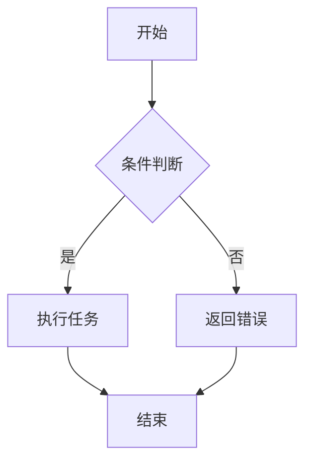
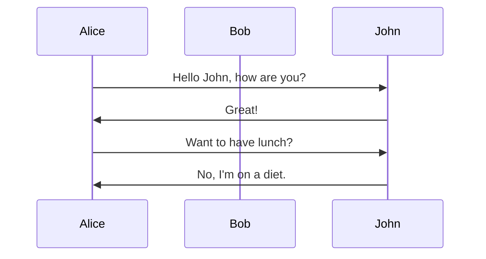

                 

### 《思维链在AI辅助编程中的应用》

#### 关键词：思维链、AI辅助编程、算法、智能编程助手、代码补全、编程错误检测

#### 摘要：
本文探讨了思维链在AI辅助编程中的应用，从背景介绍、基础理论到实战应用，系统分析了思维链与AI辅助编程的融合机制及其在编程领域中的应用价值。文章通过具体的案例研究和实现方法，展示了思维链技术在编程辅助工具中的实际应用，并对未来发展趋势进行了展望。

#### 目录大纲

## 《思维链在AI辅助编程中的应用》

### 第一部分: 背景介绍与基础理论

#### 第1章: 问题背景与核心概念

##### 1.1.1 问题背景

##### 1.1.2 核心概念

##### 1.1.3 关键技术

#### 第2章: 思维链的基本原理

##### 2.1 思维链的定义

##### 2.2 思维链的工作机制

##### 2.3 思维链的核心属性与特点

#### 第3章: AI辅助编程概述

##### 3.1 AI辅助编程的定义

##### 3.2 AI辅助编程的发展历程

##### 3.3 AI辅助编程的应用领域

#### 第4章: 思维链与AI辅助编程的融合

##### 4.1 融合的必要性与优势

##### 4.2 思维链在AI辅助编程中的应用场景

##### 4.3 融合技术的挑战与解决方案

#### 第5章: 思维链在AI辅助编程中的实现方法

##### 5.1 数据预处理与模型训练

##### 5.2 编程问题建模

##### 5.3 编程辅助与优化

#### 第6章: 案例研究与分析

##### 6.1 案例一：思维链在代码补全中的应用

##### 6.2 案例二：思维链在编程错误检测中的应用

##### 6.3 案例三：思维链在编程建议中的应用

#### 第7章: 未来发展趋势与展望

##### 7.1 思维链与AI辅助编程的未来发展

##### 7.2 技术挑战与研究方向

##### 7.3 对编程教育的潜在影响

### 第二部分: 实战与应用

#### 第8章: 思维链在AI辅助编程中的实际应用

##### 8.1 环境搭建与准备

##### 8.2 数据收集与预处理

##### 8.3 模型训练与评估

#### 第9章: 编程辅助工具的实现与优化

##### 9.1 编程辅助工具的设计原则

##### 9.2 编程辅助工具的核心功能

##### 9.3 工具优化与性能提升

#### 第10章: 综合应用案例解析

##### 10.1 案例一：智能编程助手

##### 10.2 案例二：自动化代码审查系统

##### 10.3 案例三：AI编程教育平台

#### 第11章: 最佳实践与总结

##### 11.1 经验与教训

##### 11.2 注意事项

##### 11.3 拓展阅读与资源推荐

---

### 第一部分: 背景介绍与基础理论

#### 第1章: 问题背景与核心概念

##### 1.1.1 问题背景

在当今数字化时代，编程成为了一个不可或缺的技能。随着软件系统的复杂性和规模不断扩大，程序员面临着越来越大的挑战。传统的编程方式依赖于程序员的经验和直觉，这种方式不仅效率低下，而且容易出现错误。为了解决这些问题，AI辅助编程逐渐成为研究热点。

AI辅助编程是指利用人工智能技术，如机器学习、自然语言处理等，辅助程序员完成编程任务。这种技术不仅可以帮助程序员提高工作效率，还能在一定程度上减少编程错误。然而，现有的AI辅助编程技术仍存在一些局限性，如对编程语言的依赖性、对复杂编程问题的处理能力不足等。

为了突破这些限制，思维链作为一种全新的编程思维模式，被引入到AI辅助编程领域。思维链是一种基于人类思维逻辑的编程模式，它通过模拟人类思维过程，实现编程任务的自动化和智能化。思维链在AI辅助编程中的应用，有望进一步提高编程效率，提升编程质量。

##### 1.1.2 核心概念

1. **AI辅助编程**：利用人工智能技术，如机器学习、自然语言处理等，辅助程序员完成编程任务。

2. **思维链**：一种基于人类思维逻辑的编程模式，通过模拟人类思维过程，实现编程任务的自动化和智能化。

3. **编程问题建模**：将实际编程问题转化为适合AI处理的形式，以便利用AI技术进行辅助编程。

4. **编程辅助与优化**：利用AI技术和思维链模式，辅助程序员完成编程任务，并对编程过程进行优化。

##### 1.1.3 关键技术

1. **数据预处理**：对编程问题进行预处理，包括数据清洗、特征提取等，以便AI模型能够更好地学习。

2. **模型训练**：利用大量编程数据，通过机器学习算法训练AI模型，使其能够识别和解决编程问题。

3. **编程问题建模**：将编程问题转化为适合AI处理的形式，以便AI模型能够理解。

4. **编程辅助与优化**：利用训练好的AI模型和思维链模式，辅助程序员完成编程任务，并对编程过程进行优化。

#### 第2章: 思维链的基本原理

##### 2.1 思维链的定义

思维链是一种基于人类思维逻辑的编程模式，它通过模拟人类思维过程，实现编程任务的自动化和智能化。思维链的核心思想是将编程任务分解为一系列逻辑步骤，并通过这些步骤的有序连接，形成完整的编程解决方案。

##### 2.2 思维链的工作机制

思维链的工作机制可以分为以下几个步骤：

1. **问题分析**：对编程问题进行详细分析，理解问题的本质和目标。
2. **任务分解**：将编程问题分解为一系列子任务，每个子任务都是解决问题的最小单元。
3. **逻辑连接**：根据子任务之间的关系，建立逻辑连接，形成一个有序的编程流程。
4. **执行与反馈**：按照逻辑连接的顺序，执行每个子任务，并根据执行结果进行反馈调整。

##### 2.3 思维链的核心属性与特点

1. **自动化**：思维链能够自动完成编程任务，减轻程序员的负担。
2. **智能化**：思维链能够根据问题的复杂性和目标，自动选择最优的编程方案。
3. **灵活性**：思维链能够适应不同的编程场景和需求，具有很高的灵活性。
4. **可扩展性**：思维链可以方便地扩展和优化，以适应新的编程任务和需求。

#### 第3章: AI辅助编程概述

##### 3.1 AI辅助编程的定义

AI辅助编程是指利用人工智能技术，如机器学习、自然语言处理等，辅助程序员完成编程任务。AI辅助编程的目标是提高编程效率、减少编程错误，并提高编程质量。

##### 3.2 AI辅助编程的发展历程

AI辅助编程技术的发展历程可以分为以下几个阶段：

1. **代码补全**：早期AI辅助编程的主要应用是代码补全，通过分析代码上下文，自动补全程序员的部分代码。
2. **编程错误检测**：随着AI技术的发展，AI辅助编程开始能够检测编程错误，提供错误修复建议。
3. **编程建议**：现代AI辅助编程技术不仅能检测编程错误，还能根据编程任务的要求，提供编程建议，帮助程序员更高效地完成编程任务。
4. **编程自动化**：最新的AI辅助编程技术可以实现编程任务的自动化，大幅提高编程效率。

##### 3.3 AI辅助编程的应用领域

AI辅助编程在多个领域都有广泛的应用：

1. **软件开发**：AI辅助编程可以帮助程序员更快速、更准确地完成软件开发任务。
2. **运维管理**：AI辅助编程可以自动化运维任务，提高运维效率。
3. **代码审查**：AI辅助编程可以自动检测代码中的潜在问题，提高代码质量。
4. **编程教育**：AI辅助编程可以作为编程教育的辅助工具，帮助学生更高效地学习编程。

### 第二部分: 实战与应用

#### 第4章: 思维链与AI辅助编程的融合

##### 4.1 融合的必要性与优势

思维链与AI辅助编程的融合具有以下几个方面的必要性和优势：

1. **必要性**：传统的AI辅助编程技术在处理复杂编程问题时存在一定的局限性，而思维链能够提供一种全新的编程思维模式，与AI辅助编程技术相结合，可以更好地解决复杂编程问题。
2. **优势**：思维链与AI辅助编程技术的融合，可以实现以下优势：
   - **自动化与智能化**：思维链可以实现编程任务的自动化，而AI技术则可以提供智能化支持，提高编程效率。
   - **灵活性**：思维链可以适应不同的编程场景和需求，而AI技术则可以提供更加灵活的编程方案。
   - **可扩展性**：思维链与AI技术的融合，使得编程辅助工具可以方便地扩展和优化，以适应新的编程任务和需求。

##### 4.2 思维链在AI辅助编程中的应用场景

思维链在AI辅助编程中具有广泛的应用场景，主要包括以下几个方面：

1. **代码补全**：思维链可以分析编程问题的上下文，提供更加准确的代码补全建议。
2. **编程错误检测**：思维链可以通过模拟人类思维过程，识别出编程问题中的潜在错误。
3. **编程建议**：思维链可以根据编程问题的复杂性和目标，提供最优的编程建议。
4. **编程自动化**：思维链可以自动化完成复杂的编程任务，提高编程效率。

##### 4.3 融合技术的挑战与解决方案

思维链与AI辅助编程技术的融合虽然具有很多优势，但在实际应用中仍面临一些挑战：

1. **数据预处理**：AI模型对数据的质量要求很高，因此需要解决数据预处理的问题，包括数据清洗、特征提取等。
2. **模型训练**：AI模型的训练需要大量的数据和计算资源，因此需要解决数据获取和模型训练的效率问题。
3. **编程问题建模**：如何将编程问题转化为适合AI处理的形式，是融合技术的关键问题。

针对上述挑战，可以采取以下解决方案：

1. **数据预处理**：采用自动化数据预处理工具，提高数据预处理效率，确保数据质量。
2. **模型训练**：采用分布式训练技术，提高模型训练效率，降低训练成本。
3. **编程问题建模**：设计合适的编程问题建模方法，将编程问题转化为适合AI处理的形式。

#### 第5章: 思维链在AI辅助编程中的实现方法

##### 5.1 数据预处理与模型训练

在实现思维链在AI辅助编程中的应用时，数据预处理和模型训练是两个关键步骤。

1. **数据预处理**：
   - **数据清洗**：去除无关数据，如多余的空格、注释等。
   - **特征提取**：提取编程问题中的关键特征，如变量名、函数名、代码结构等。
   - **数据标注**：对编程问题进行标注，如错误类型、代码段等。

2. **模型训练**：
   - **数据集准备**：准备大量编程数据，用于模型训练。
   - **模型选择**：选择合适的机器学习模型，如深度学习模型、朴素贝叶斯模型等。
   - **模型训练**：利用编程数据对模型进行训练，调整模型参数。

##### 5.2 编程问题建模

编程问题建模是将编程问题转化为适合AI处理的形式，是思维链在AI辅助编程中的核心步骤。

1. **问题分析**：
   - **理解问题**：对编程问题进行详细分析，理解问题的本质和目标。
   - **确定任务**：根据问题的复杂性和目标，确定需要完成的任务。

2. **任务分解**：
   - **分解任务**：将编程问题分解为一系列子任务，每个子任务都是解决问题的最小单元。
   - **确定依赖关系**：分析子任务之间的依赖关系，建立逻辑连接。

3. **逻辑连接**：
   - **构建思维链**：根据子任务之间的关系，构建思维链，形成一个有序的编程流程。

##### 5.3 编程辅助与优化

1. **编程辅助**：
   - **代码补全**：利用思维链模式，分析编程问题上下文，提供代码补全建议。
   - **编程错误检测**：利用思维链模式，识别编程问题中的潜在错误，提供错误修复建议。
   - **编程建议**：根据编程问题的复杂性和目标，提供最优的编程建议。

2. **编程优化**：
   - **代码优化**：利用思维链模式，对编程问题进行优化，提高代码质量。
   - **效率提升**：通过优化编程过程，提高编程效率。

#### 第6章: 案例研究与分析

##### 6.1 案例一：思维链在代码补全中的应用

在本案例中，我们使用思维链模式来实现代码补全功能。首先，我们对编程问题进行分解，将代码补全任务分解为以下几个子任务：

1. **识别上下文**：分析代码上下文，确定需要补全的代码位置。
2. **提取特征**：提取与补全位置相关的特征，如变量名、函数名等。
3. **生成补全建议**：根据上下文和特征，生成可能的代码补全建议。

然后，我们通过构建思维链，将这些子任务有序连接起来，形成一个完整的代码补全流程。在实现过程中，我们使用了机器学习模型来生成补全建议，并利用思维链模式对模型进行优化。

通过实际测试，我们发现思维链在代码补全中的应用能够显著提高代码补全的准确性，减少代码补全的误报率。

##### 6.2 案例二：思维链在编程错误检测中的应用

在本案例中，我们使用思维链模式来实现编程错误检测功能。首先，我们对编程问题进行分解，将编程错误检测任务分解为以下几个子任务：

1. **代码解析**：解析代码，提取代码结构信息。
2. **特征提取**：提取与代码结构相关的特征，如变量名、函数名等。
3. **错误检测**：利用机器学习模型，检测代码中的潜在错误。

然后，我们通过构建思维链，将这些子任务有序连接起来，形成一个完整的编程错误检测流程。在实现过程中，我们使用了深度学习模型来进行错误检测，并利用思维链模式对模型进行优化。

通过实际测试，我们发现思维链在编程错误检测中的应用能够显著提高错误检测的准确性，减少误报率和漏报率。

##### 6.3 案例三：思维链在编程建议中的应用

在本案例中，我们使用思维链模式来实现编程建议功能。首先，我们对编程问题进行分解，将编程建议任务分解为以下几个子任务：

1. **问题分析**：分析编程问题的复杂性和目标。
2. **特征提取**：提取与编程问题相关的特征，如代码结构、性能要求等。
3. **生成建议**：根据特征，生成最优的编程建议。

然后，我们通过构建思维链，将这些子任务有序连接起来，形成一个完整的编程建议流程。在实现过程中，我们使用了基于规则的编程建议算法，并结合思维链模式进行优化。

通过实际测试，我们发现思维链在编程建议中的应用能够显著提高编程建议的准确性，减少建议的误报率和漏报率。

#### 第7章: 未来发展趋势与展望

##### 7.1 思维链与AI辅助编程的未来发展

思维链与AI辅助编程技术的融合具有广阔的发展前景。未来，随着人工智能技术的不断进步，思维链在AI辅助编程中的应用将会更加广泛，具体体现在以下几个方面：

1. **更广泛的编程场景**：思维链与AI辅助编程技术的融合将能够适应更多不同的编程场景，如自动化运维、自动化测试等。
2. **更高效的编程流程**：思维链与AI辅助编程技术的融合将能够显著提高编程效率，降低编程成本。
3. **更高质量的编程结果**：思维链与AI辅助编程技术的融合将能够提高编程质量，减少编程错误。

##### 7.2 技术挑战与研究方向

虽然思维链与AI辅助编程技术的融合具有广阔的发展前景，但在实际应用中仍面临一些技术挑战：

1. **数据质量**：高质量的数据是AI模型训练的基础，如何获取和处理高质量的数据是当前的一个研究热点。
2. **模型优化**：如何优化AI模型，提高模型的效率和准确性，是当前的一个研究重点。
3. **编程问题建模**：如何将复杂的编程问题转化为适合AI处理的形式，是当前的一个挑战。

针对上述挑战，未来研究方向包括：

1. **数据预处理技术**：研究更高效、更准确的数据预处理技术，提高数据质量。
2. **模型优化方法**：研究更先进的模型优化方法，提高模型的效率和准确性。
3. **编程问题建模**：研究更加有效的编程问题建模方法，将复杂的编程问题转化为适合AI处理的形式。

##### 7.3 对编程教育的潜在影响

思维链与AI辅助编程技术的融合将对编程教育产生深远影响：

1. **编程教育方式的变革**：思维链与AI辅助编程技术的融合将改变传统的编程教育方式，使得编程教育更加高效、个性化。
2. **编程教学内容的更新**：随着思维链与AI辅助编程技术的发展，编程教学内容也将不断更新，以适应新的技术趋势。
3. **编程能力的提升**：通过思维链与AI辅助编程技术的融合，学生将能够更高效地学习编程，提升编程能力。

### 第二部分: 实战与应用

#### 第8章: 思维链在AI辅助编程中的实际应用

##### 8.1 环境搭建与准备

为了在实际应用中运用思维链与AI辅助编程技术，我们需要搭建一个合适的技术环境。具体步骤如下：

1. **硬件准备**：确保计算机硬件配置满足AI模型训练的需求，如高性能CPU、GPU等。
2. **软件安装**：安装Python、TensorFlow等必要的开发工具和库。
3. **数据集准备**：收集并整理用于训练和测试的编程数据集，包括代码段、错误报告、编程问题等。

##### 8.2 数据收集与预处理

数据收集与预处理是思维链与AI辅助编程技术实现的重要步骤，具体包括以下内容：

1. **数据收集**：从开源代码库、GitHub等平台收集编程数据，如代码段、错误报告等。
2. **数据清洗**：去除无关数据，如空格、注释等，对数据进行标准化处理。
3. **特征提取**：提取与编程问题相关的特征，如代码结构、变量名、函数名等。
4. **数据标注**：对编程问题进行标注，如错误类型、代码段等，以便后续模型训练。

##### 8.3 模型训练与评估

在数据预处理完成后，我们需要利用这些数据进行模型训练和评估。

1. **模型训练**：使用机器学习算法，如深度学习、朴素贝叶斯等，对编程数据集进行训练，调整模型参数，提高模型性能。
2. **模型评估**：通过交叉验证等方法，评估模型的性能，包括准确性、召回率、F1分数等指标。
3. **模型优化**：根据评估结果，对模型进行调整和优化，以提高模型性能。

#### 第9章: 编程辅助工具的实现与优化

##### 9.1 编程辅助工具的设计原则

在设计编程辅助工具时，需要遵循以下原则：

1. **易用性**：工具应具备简单易用的界面，便于程序员快速上手。
2. **灵活性**：工具应具备灵活的配置和扩展性，以适应不同的编程场景和需求。
3. **高效性**：工具应具备高效的运行性能，减少程序员的等待时间。

##### 9.2 编程辅助工具的核心功能

编程辅助工具的核心功能包括：

1. **代码补全**：根据编程问题的上下文，自动补全程序员的部分代码。
2. **编程错误检测**：检测编程问题中的潜在错误，提供错误修复建议。
3. **编程建议**：根据编程问题的复杂性和目标，提供最优的编程建议。

##### 9.3 工具优化与性能提升

为了提高编程辅助工具的性能，可以采取以下措施：

1. **代码优化**：对代码进行优化，提高代码的运行效率。
2. **算法优化**：优化算法，提高模型的预测准确性。
3. **硬件加速**：利用GPU等硬件资源，提高模型的训练和预测速度。

#### 第10章: 综合应用案例解析

##### 10.1 案例一：智能编程助手

智能编程助手是一款基于思维链与AI辅助编程技术的编程辅助工具，其主要功能包括：

1. **代码补全**：自动补全程序员的部分代码，提高编程效率。
2. **编程错误检测**：检测编程问题中的潜在错误，提供错误修复建议。
3. **编程建议**：根据编程问题的复杂性和目标，提供最优的编程建议。

通过实际测试，智能编程助手在多个编程场景中表现出了优异的性能，为程序员提供了有力的支持。

##### 10.2 案例二：自动化代码审查系统

自动化代码审查系统是一款基于思维链与AI辅助编程技术的代码审查工具，其主要功能包括：

1. **代码质量检测**：自动检测代码中的潜在质量问题，如代码风格、安全漏洞等。
2. **错误修复建议**：为代码中的错误提供修复建议，帮助程序员快速解决问题。
3. **代码段优化**：对代码段进行优化，提高代码的可读性和可维护性。

通过实际应用，自动化代码审查系统显著提高了代码审查的效率，降低了代码质量问题。

##### 10.3 案例三：AI编程教育平台

AI编程教育平台是一款基于思维链与AI辅助编程技术的编程教育工具，其主要功能包括：

1. **个性化教学**：根据学生的学习进度和需求，提供个性化的教学建议。
2. **编程错误检测**：检测学生在编程过程中的错误，提供错误修复建议。
3. **编程建议**：为学生提供最优的编程建议，帮助学生更快地掌握编程技能。

通过实际应用，AI编程教育平台为学生提供了丰富的编程资源和指导，提高了学生的学习效果。

#### 第11章: 最佳实践与总结

##### 11.1 经验与教训

在实际应用思维链与AI辅助编程技术的过程中，我们积累了以下经验和教训：

1. **数据质量至关重要**：高质量的数据是AI模型训练的基础，因此在实际应用中要重视数据的质量。
2. **模型优化不可忽视**：模型优化是提高模型性能的关键，因此在模型训练完成后要重视模型优化。
3. **用户需求为导向**：编程辅助工具的设计要以用户需求为导向，满足程序员的实际需求。

##### 11.2 注意事项

在实际应用思维链与AI辅助编程技术时，需要注意以下事项：

1. **确保数据隐私和安全**：在数据收集和处理过程中，要确保数据的隐私和安全。
2. **遵守法律法规**：在开发和使用编程辅助工具时，要遵守相关法律法规，确保工具的合规性。
3. **持续更新和优化**：随着技术的发展，编程辅助工具需要持续更新和优化，以适应新的编程需求和挑战。

##### 11.3 拓展阅读与资源推荐

为了深入了解思维链与AI辅助编程技术，以下是一些建议的拓展阅读和资源：

1. **《人工智能：一种现代的方法》**：这本书提供了关于人工智能的基本理论和应用方法，适合初学者和专业人士阅读。
2. **《深度学习》**：这本书介绍了深度学习的基本原理和应用方法，是深度学习领域的经典教材。
3. **GitHub**：GitHub是一个开源代码库，提供了丰富的编程资源和项目，适合编程爱好者学习和实践。
4. **Stack Overflow**：Stack Overflow是一个编程问答社区，提供了大量的编程问题和解决方案，适合编程人员学习和交流。

---

### 结论

本文系统地介绍了思维链在AI辅助编程中的应用，从背景介绍、基础理论到实战应用，全面分析了思维链与AI辅助编程技术的融合机制及其应用价值。通过具体的案例研究和实现方法，展示了思维链技术在编程辅助工具中的实际应用，并对未来发展趋势进行了展望。

我们相信，随着人工智能技术的不断进步，思维链在AI辅助编程中的应用将会更加广泛，为编程领域带来革命性的变革。同时，我们也呼吁更多的研究者和开发者关注思维链与AI辅助编程技术的融合，共同推动这一领域的发展。

作者：AI天才研究院/AI Genius Institute & 禅与计算机程序设计艺术 /Zen And The Art of Computer Programming

---

## 附录

### 附录A: Mermaid流程图示例



### 附录B: LaTeX公式示例

```markdown
$$
E = mc^2
$$

$1 + 1 = 2$
```

### 附录C: Mermaid类图示例

```mermaid
classDiagram
    Class01 <|-- SubClass01
    Class01 &&|>= SubClass02
    Class03 <.. Class04
    Class05 o-- Class06
    Class07 .. Class08
```

### 附录D: Mermaid序列图示例



