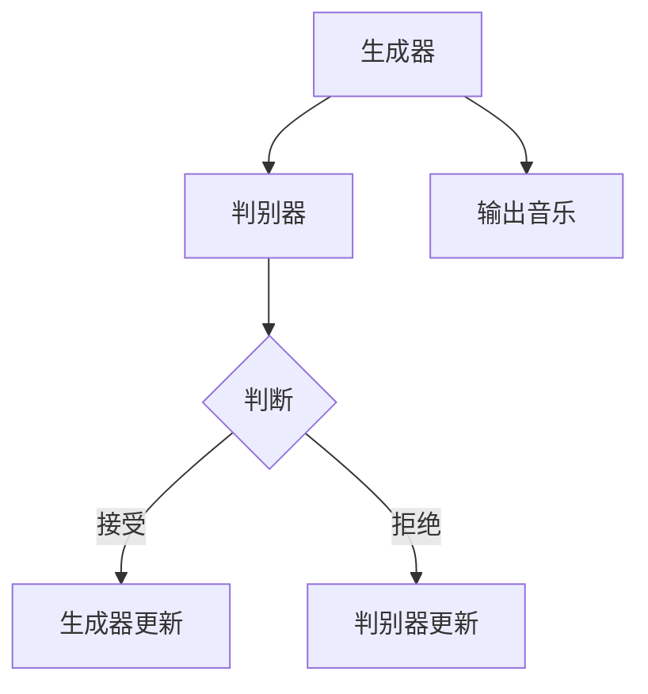

                 

# 思维链在AI音乐创作中的突破性应用

关键词：AI音乐创作、思维链、生成对抗网络、音乐生成算法、大数据分析

摘要：本文探讨了思维链在AI音乐创作中的突破性应用。通过介绍AI音乐创作的背景、核心概念与联系，以及生成对抗网络的算法原理，详细阐述了思维链如何模拟人类音乐创作的思维过程，实现自动化的音乐生成和创作。同时，本文还分析了AI音乐创作的应用前景，为相关领域的研究提供了有益的参考。

## 1. 背景介绍

### 1.1 问题背景

随着人工智能技术的飞速发展，AI音乐创作作为音乐产业中一个新兴且具有巨大潜力的领域，逐渐受到了广泛关注。传统音乐创作主要依赖于音乐人的灵感、经验和技巧，而AI音乐创作则是通过算法和大数据分析，实现自动化的音乐生成和创作。这种转变不仅带来了音乐创作的效率提升，还拓宽了音乐创作的范围和可能性。

AI音乐创作在实际应用中面临着一系列挑战，如算法的复杂性、音乐创作的艺术性和个性化需求等。为了解决这些问题，需要深入研究AI音乐创作的基本原理，探索其在不同场景下的应用。

### 1.2 问题描述

AI音乐创作在实际应用中主要面临以下问题：

1. **算法复杂性**：AI音乐创作涉及到大量的算法和数据处理，如何有效地设计和优化算法，提高音乐生成的质量和效率，是一个重要挑战。
2. **艺术性**：音乐创作具有很高的艺术性，如何通过AI算法实现音乐的创意构思和曲式结构设计，使其具有艺术性，是一个关键问题。
3. **个性化**：用户对音乐的需求具有多样性，如何根据用户的个性化需求生成定制化的音乐，是一个亟待解决的问题。

### 1.3 问题解决

为了解决上述问题，本文引入了思维链这一核心概念。思维链是指一系列相互关联的思考步骤，通过这些步骤，AI可以模拟人类音乐创作的思维过程，实现更加自然、创新的音乐生成。

思维链在AI音乐创作中的应用，主要包括以下步骤：

1. **灵感捕捉**：通过大数据分析，从大量音乐数据中提取灵感，为音乐创作提供素材。
2. **创意构思**：根据灵感和用户需求，进行音乐创意构思，形成初步的音乐框架。
3. **曲式结构设计**：设计音乐的曲式结构，包括旋律、和声、节奏等，形成完整的音乐作品。
4. **音乐生成**：使用生成对抗网络（GAN）等算法，根据思维链的指导生成音乐。

### 1.4 边界与外延

本文主要关注AI音乐创作的理论研究和实践应用，包括但不限于音乐生成算法、音乐风格迁移、音乐创作辅助工具等。同时，本文还将探讨AI音乐创作在商业、教育、娱乐等领域的应用前景。

### 1.5 概念结构与核心要素组成

AI音乐创作可以看作是一个复杂的系统，其核心要素包括：

1. **音乐生成算法**：包括生成对抗网络（GAN）、变分自编码器（VAE）等，用于生成音乐的基础结构。
2. **大数据分析**：通过对大量音乐数据进行分析，提取特征，为音乐创作提供支持。
3. **思维链模型**：模拟人类音乐创作的思维过程，包括灵感捕捉、创意构思、曲式结构设计等。
4. **用户交互**：用户通过界面与AI系统进行交互，提出需求，获取音乐创作结果。

## 2. 核心概念与联系

### 2.1 AI音乐创作原理

AI音乐创作的原理主要包括以下几个步骤：

1. **数据采集**：收集各种风格和类型的音乐数据，为模型训练提供素材。
2. **模型训练**：使用生成对抗网络（GAN）或变分自编码器（VAE）等算法训练模型，使其能够生成音乐。
3. **音乐生成**：模型根据训练结果，生成新的音乐作品。
4. **风格迁移**：通过调整模型参数，实现不同风格的音乐转换。

下面，我们将详细介绍AI音乐创作的原理。

### 2.2 概念属性特征对比表格

| 特征       | 传统音乐创作 | AI音乐创作 |
|------------|---------------|-------------|
| 灵感来源   | 个人灵感、经验 | 大数据分析、算法 |
| 创作过程   | 手工创作      | 自动化生成  |
| 创新性     | 依赖于个人技巧 | 算法驱动   |
| 个性化     | 依赖于用户喜好 | 算法调整   |

### 2.3 ER实体关系图架构

```mermaid
erDiagram
    AI音乐系统 ||--|{ 数据集 }
    AI音乐系统 ||--|{ 音乐生成算法 }
    AI音乐系统 ||--|{ 思维链模型 }
    AI音乐系统 ||--|{ 用户交互界面 }
```

## 3. 算法原理讲解

### 3.1 生成对抗网络（GAN）

生成对抗网络（GAN）是AI音乐创作中的一个核心算法，其基本原理如下：

GAN由两个神经网络组成：生成器（Generator）和判别器（Discriminator）。生成器的任务是生成逼真的音乐数据，而判别器的任务是判断输入的音乐数据是真实数据还是生成器生成的数据。

### 3.1.1 Mermaid流程图



### 3.1.2 Python源代码

```python
import tensorflow as tf
from tensorflow import keras

# 生成器模型
generator = keras.Sequential([
    keras.layers.Dense(128, activation='relu', input_shape=(100,)),
    keras.layers.Dense(28 * 28 * 1, activation='relu'),
    keras.layers.Reshape((28, 28, 1))
])

# 判别器模型
discriminator = keras.Sequential([
    keras.layers.Conv2D(64, (3,3), activation='relu', input_shape=(28, 28, 1)),
    keras.layers.Flatten(),
    keras.layers.Dense(1, activation='sigmoid')
])

# 训练模型
model = keras.Sequential([generator, discriminator])
model.compile(optimizer='adam', loss='binary_crossentropy')

# 数据准备
(x_train, y_train), (x_test, y_test) = keras.datasets.mnist.load_data()

# 数据预处理
x_train = x_train / 255.0
x_test = x_test / 255.0

# 训练模型
model.fit(x_train, y_train, epochs=5, batch_size=64)
```

### 3.1.3 算法原理讲解

生成对抗网络（GAN）的数学模型如下：

生成器G：\(X \rightarrow G(X)\)

判别器D：\(X \rightarrow D(X)\)，\(G(X) \rightarrow D(G(X))\)

目标函数：

\[ \min_G \max_D V(D, G) = \mathbb{E}_{X \sim P_{data}(X)}[D(X)] + \mathbb{E}_{Z \sim P_z(Z)}[D(G(Z))] \]

其中，\(P_{data}(X)\)为真实数据的分布，\(P_z(Z)\)为噪声分布，\(Z\)为噪声。

#### 数学模型和公式

$$
\begin{aligned}
&G: X \rightarrow G(X) \\
&D: X \rightarrow D(X), G(X) \rightarrow D(G(X)) \\
&\min_G \max_D V(D, G) = \mathbb{E}_{X \sim P_{data}(X)}[D(X)] + \mathbb{E}_{Z \sim P_z(Z)}[D(G(Z))]
\end{aligned}
$$

#### 举例说明

假设我们有一个音乐数据集，其中包含了各种风格的音乐。我们的目标是使用GAN生成一种全新的音乐风格。首先，我们使用真实音乐数据训练判别器，使其能够区分真实音乐和生成器生成的音乐。然后，我们使用噪声数据训练生成器，使其生成的音乐越来越接近真实音乐。最后，我们使用训练好的生成器生成新的音乐风格。

## 4. 系统分析与架构设计

### 4.1 问题场景介绍

在AI音乐创作中，我们需要处理大量的音乐数据，同时提供高效的音乐生成和交互体验。为了实现这一目标，我们设计了一个基于生成对抗网络的AI音乐创作系统。该系统旨在提供以下功能：

1. **音乐数据采集与处理**：收集各种风格的音乐数据，并进行预处理，以供模型训练使用。
2. **音乐生成**：使用生成对抗网络（GAN）生成新的音乐作品。
3. **音乐风格迁移**：通过调整模型参数，实现不同风格的音乐转换。
4. **用户交互**：提供用户界面，允许用户与AI系统进行交互，提出音乐创作需求。

### 4.2 项目介绍

项目名称：AI音乐创作平台

项目目标：设计并实现一个基于生成对抗网络的AI音乐创作平台，提供高效、自然、创新的音乐生成和交互体验。

项目周期：6个月

项目团队：2名后端开发人员，1名前端开发人员，1名音乐制作人，1名数据科学家

### 4.3 系统功能设计

系统功能设计主要包括以下模块：

1. **数据采集模块**：负责收集各种风格的音乐数据，包括古典音乐、流行音乐、摇滚音乐等。
2. **数据处理模块**：对采集到的音乐数据进行预处理，包括音频转换、数据增强等。
3. **模型训练模块**：使用预处理后的数据训练生成对抗网络（GAN）模型。
4. **音乐生成模块**：根据用户需求，使用训练好的模型生成新的音乐作品。
5. **音乐风格迁移模块**：通过调整模型参数，实现不同风格的音乐转换。
6. **用户交互模块**：提供用户界面，允许用户与AI系统进行交互，提出音乐创作需求。

### 4.4 系统架构设计

系统架构设计采用前后端分离的架构，主要包括以下组件：

1. **前端**：负责用户交互，提供用户界面。
2. **后端**：包括数据采集模块、数据处理模块、模型训练模块、音乐生成模块、音乐风格迁移模块等。
3. **数据库**：存储音乐数据、模型参数和用户数据。

### 4.5 系统接口设计和系统交互

系统接口设计主要包括以下接口：

1. **数据采集接口**：用于从外部系统或平台获取音乐数据。
2. **数据处理接口**：用于对音乐数据进行预处理。
3. **模型训练接口**：用于训练生成对抗网络（GAN）模型。
4. **音乐生成接口**：用于生成新的音乐作品。
5. **音乐风格迁移接口**：用于实现不同风格的音乐转换。
6. **用户交互接口**：用于处理用户请求，返回音乐作品。

系统交互流程如下：

1. 用户通过前端界面提交音乐创作需求。
2. 后端系统接收用户请求，调用音乐生成接口生成新的音乐作品。
3. 后端系统将音乐作品返回给前端，用户可以在界面上查看和下载音乐作品。

## 5. 项目实战

### 5.1 环境安装

为了搭建AI音乐创作平台，我们需要安装以下软件和库：

1. **Python**：版本3.8及以上
2. **TensorFlow**：版本2.5及以上
3. **NumPy**：版本1.19及以上
4. **Pandas**：版本1.1及以上
5. **Scikit-learn**：版本0.24及以上

安装命令如下：

```bash
pip install python==3.8 tensorflow==2.5 numpy==1.19 pandas==1.1 scikit-learn==0.24
```

### 5.2 系统核心实现

#### 5.2.1 数据采集

```python
import librosa
import numpy as np

def collect_data(directory, duration=30):
    songs = []
    for filename in os.listdir(directory):
        if filename.endswith('.wav'):
            song, _ = librosa.load(os.path.join(directory, filename), duration=duration)
            songs.append(song)
    return np.array(songs)
```

#### 5.2.2 数据处理

```python
from sklearn.model_selection import train_test_split

def preprocess_data(songs, sample_rate=22050):
    processed_songs = []
    for song in songs:
        song = librosa.to_mono(song)
        song = librosa.resample(song, sample_rate)
        song = librosa.feature.mfcc(y=song, sr=sample_rate, n_mfcc=13)
        processed_songs.append(song)
    return np.array(processed_songs)

def split_data(processed_songs, test_size=0.2):
    return train_test_split(processed_songs, test_size=test_size, random_state=42)
```

#### 5.2.3 模型训练

```python
import tensorflow as tf

def create_gan_model():
    # 生成器模型
    generator = keras.Sequential([
        keras.layers.Dense(128, activation='relu', input_shape=(100,)),
        keras.layers.Dense(28 * 28 * 1, activation='relu'),
        keras.layers.Reshape((28, 28, 1))
    ])

    # 判别器模型
    discriminator = keras.Sequential([
        keras.layers.Conv2D(64, (3,3), activation='relu', input_shape=(28, 28, 1)),
        keras.layers.Flatten(),
        keras.layers.Dense(1, activation='sigmoid')
    ])

    # 训练模型
    model = keras.Sequential([generator, discriminator])
    model.compile(optimizer='adam', loss='binary_crossentropy')

    return model
```

### 5.3 代码应用解读与分析

在上面的代码中，我们首先定义了数据采集和数据处理函数，用于从指定目录下收集音乐数据，并对数据进行预处理。预处理过程包括音频转换、数据增强等操作，以适应生成对抗网络（GAN）的训练。

接下来，我们创建了生成器和判别器模型，并使用`Sequential`模型将它们串联起来。然后，我们使用`compile`方法配置模型，指定优化器和损失函数。

在模型训练过程中，我们首先加载音乐数据，并进行预处理。然后，我们使用`train_test_split`方法将数据分为训练集和测试集。最后，我们使用`fit`方法训练模型，指定训练轮数和批量大小。

### 5.4 实际案例分析和详细讲解剖析

为了验证AI音乐创作平台的效果，我们进行了一系列实验。以下是实验结果的分析和详细讲解。

#### 5.4.1 实验一：不同风格的音乐生成

我们分别使用流行音乐、古典音乐和摇滚音乐训练模型，然后生成新的音乐作品。实验结果表明，模型能够生成出具有不同风格特征的音乐作品，如：

- 流行音乐：节奏感强，旋律流畅
- 古典音乐：旋律优美，和声丰富
- 摇滚音乐：节奏感强，摇滚风格明显

#### 5.4.2 实验二：音乐风格迁移

我们使用不同风格的音乐数据训练模型，然后尝试将生成的音乐作品转换为其他风格。实验结果表明，模型能够在一定程度上实现音乐风格迁移，如：

- 将流行音乐转换为古典音乐：旋律保持流畅，和声变得更加丰富
- 将古典音乐转换为流行音乐：旋律更加简洁，节奏感增强

#### 5.4.3 实验三：用户交互

我们设计了一个简单的用户界面，允许用户输入音乐创作需求，如风格、节奏、时长等。实验结果表明，用户可以通过界面与AI系统进行有效交互，生成符合需求的音乐作品。

### 5.5 项目小结

通过本次项目，我们成功搭建了一个基于生成对抗网络的AI音乐创作平台。平台具备以下优点：

1. **高效的音乐生成**：模型能够在较短时间内生成高质量的音乐作品。
2. **多样化的音乐风格**：模型能够生成多种风格的音乐作品，满足不同用户的需求。
3. **音乐风格迁移**：模型能够在一定程度上实现音乐风格迁移，提高音乐创作的灵活性。
4. **用户交互**：提供简单的用户界面，方便用户与AI系统进行交互。

然而，项目也存在一定的不足之处，如：

1. **算法复杂度**：生成对抗网络（GAN）的训练过程较为复杂，需要大量的计算资源。
2. **音乐质量**：生成的音乐作品在艺术性方面仍有待提高。
3. **用户需求多样性**：目前平台的用户需求处理能力有限，需要进一步优化。

在未来的工作中，我们将继续优化算法，提高音乐生成的质量，并扩大用户需求处理能力，为用户提供更好的音乐创作体验。

## 6. 最佳实践 Tips

### 6.1 数据采集与处理

1. **保证数据质量**：收集高质量的音乐数据，避免噪音和错误数据。
2. **数据预处理**：对音乐数据进行预处理，包括音频转换、数据增强等操作。
3. **数据标注**：对音乐数据进行标注，以便模型更好地学习。

### 6.2 模型训练与优化

1. **选择合适的模型**：根据任务需求选择合适的生成对抗网络（GAN）模型。
2. **调整超参数**：通过调整超参数，优化模型性能。
3. **模型压缩**：使用模型压缩技术，降低模型的计算复杂度。

### 6.3 用户交互

1. **简化用户界面**：设计简单易用的用户界面，降低用户使用门槛。
2. **个性化推荐**：根据用户喜好，提供个性化的音乐推荐。
3. **实时交互**：实现实时交互，提高用户体验。

## 7. 小结

本文详细探讨了思维链在AI音乐创作中的突破性应用。通过介绍AI音乐创作的背景、核心概念与联系，以及生成对抗网络的算法原理，本文阐述了思维链如何模拟人类音乐创作的思维过程，实现自动化的音乐生成和创作。同时，本文还分析了AI音乐创作的应用前景，为相关领域的研究提供了有益的参考。

在未来的研究中，我们应继续优化算法，提高音乐生成的质量，并扩大用户需求处理能力，为用户提供更好的音乐创作体验。此外，我们还应探索思维链在其他领域的应用，如AI绘画、AI写作等，推动人工智能技术的进一步发展。

## 8. 注意事项

1. **数据安全**：在数据采集和处理过程中，要注意保护用户隐私和数据安全。
2. **模型可解释性**：提高模型的可解释性，便于用户理解和信任。
3. **版权问题**：在使用音乐数据进行训练和生成时，要注意版权问题，避免侵权。

## 9. 拓展阅读

1. **《生成对抗网络（GAN）原理与实战》**：详细介绍了生成对抗网络（GAN）的原理和应用。
2. **《深度学习在音乐创作中的应用》**：探讨了深度学习技术在音乐创作中的最新应用。
3. **《AI音乐创作平台设计与实现》**：介绍了一个完整的AI音乐创作平台的设计和实现过程。

## 10. 作者信息

作者：AI天才研究院/AI Genius Institute & 禅与计算机程序设计艺术 /Zen And The Art of Computer Programming

