                 

### 文章标题：思维链在创意写作中的应用：AI协作小说创作

关键词：思维链、创意写作、AI协作、小说创作、算法原理、系统架构

摘要：本文深入探讨了思维链在创意写作中的应用，特别是AI协作小说创作的实践。通过详细解析思维链的核心概念与工作原理，结合实例展示了其在小说创作中的实际应用。同时，本文探讨了AI在小说创作中的作用，以及AI协作小说创作的工作流程和挑战。通过系统分析与架构设计，我们揭示了AI协作小说创作系统的实现细节，并提供了实践应用与案例分析。文章最后展望了思维链与AI在创意写作中的未来发展趋势，为读者提供了宝贵的参考和启示。

----------------------------------------------------------------

### 第一部分：思维链与创意写作基础

#### 第1章：思维链原理与创意写作概述

在当今人工智能飞速发展的时代，创意写作与人工智能的结合已成为一个备受关注的研究领域。本文旨在探讨思维链在创意写作中的应用，特别是AI协作小说创作这一前沿方向。思维链作为一种创新性的思维工具，它能够帮助创作者在构思、创作和修改过程中更高效、更有条理地进行思考和表达。

首先，我们需要了解思维链的定义和作用。思维链是一种基于逻辑和关联性的思维工具，它能够帮助人们将不同的概念、观点和信息连接起来，形成一条具有连贯性和系统性的思维路径。在创意写作中，思维链的作用主要体现在以下几个方面：

1. **提高创作效率**：通过思维链，创作者可以更快地捕捉灵感，将分散的思路整合成完整的创作框架，从而提高创作效率。
2. **优化创作结构**：思维链可以帮助创作者更好地组织文章结构，确保每个部分之间逻辑紧密、连贯，提升作品的整体质量。
3. **增强创意思维**：思维链鼓励创作者跳出传统思维模式，进行跨领域的思考和创意碰撞，激发更多的创新思维。

#### 1.1 思维链的定义与作用

思维链是由一系列相互关联的节点构成，每个节点代表一个独立的想法或观点。节点之间通过关系线连接，形成一种网络结构。这种结构不仅反映了创作者的思维路径，还展示了不同想法之间的联系和影响。思维链的定义可以概括为：一种基于逻辑和关联性的思维工具，用于组织和表达创意过程。

思维链的作用主要体现在以下几个方面：

- **捕捉灵感**：通过思维链，创作者可以迅速记录下灵感，并将其与已有想法连接起来，形成更丰富的创作素材。
- **组织结构**：思维链可以帮助创作者梳理思路，将零散的创意元素有序地组织起来，形成一个完整的故事框架。
- **优化表达**：思维链提供了一个清晰的思维路径，有助于创作者更准确地表达自己的想法，提升作品的可读性和说服力。

#### 1.2 创意写作的重要性

创意写作作为一种独特的创作形式，不仅要求创作者具备丰富的想象力，还需要他们具备扎实的文字功底和敏锐的观察力。在当今信息爆炸的时代，创意写作的重要性愈发凸显：

1. **创新思维**：创意写作鼓励创作者跳出传统思维框架，进行跨领域的思考和创意碰撞，培养创新思维。
2. **文化传承**：通过创意写作，创作者可以记录时代的声音，传承文化，推动社会进步。
3. **心理健康**：创意写作可以帮助创作者释放压力，缓解焦虑，提升心理健康。

#### 1.3 思维链在创意写作中的应用

在创意写作中，思维链的应用场景非常广泛。以下是一些典型的应用实例：

- **小说创作**：思维链可以帮助小说创作者构建故事框架，确定角色关系和情节发展。
- **散文创作**：思维链可以用于组织散文的结构，确保主题明确、内容丰富、层次清晰。
- **剧本创作**：思维链可以帮助编剧梳理剧情线索，构建故事情节，设计角色性格和冲突。

通过思维链，创作者可以更高效地开展创作活动，提高作品的质量和影响力。

---

**本节小结**：思维链作为一种创新性的思维工具，在创意写作中具有重要作用。通过思维链，创作者可以更好地捕捉灵感、组织结构和优化表达，从而提升创作效率和质量。在接下来的章节中，我们将进一步探讨思维链的核心概念和工作原理，以及AI在创意写作中的应用。

----------------------------------------------------------------

### 第二部分：思维链的核心概念与联系

#### 第2章：思维链的核心概念

在深入探讨思维链在创意写作中的应用之前，我们需要首先了解思维链的核心概念。思维链是由一系列相互关联的节点构成的思维工具，每个节点代表一个独立的想法或观点。节点之间通过关系线连接，形成一种网络结构，这种结构不仅反映了创作者的思维路径，还展示了不同想法之间的联系和影响。

#### 2.1 概念A：思维链的构成要素

思维链的构成要素主要包括以下几个部分：

1. **节点**：节点是思维链的基本组成单位，每个节点代表一个独立的想法或观点。节点可以是文字、图像或其他形式的信息载体。
2. **关系线**：关系线连接不同的节点，表示它们之间的逻辑关系。关系线可以是直接的，也可以是间接的。
3. **层次结构**：思维链中的节点和关系线可以形成不同的层次结构，这种结构有助于创作者更好地组织和管理思维内容。

#### 2.2 概念B：思维链的工作原理

思维链的工作原理可以概括为以下几个步骤：

1. **灵感捕捉**：创作者通过观察、思考、体验等方式捕捉灵感，并将其记录为节点。
2. **节点连接**：创作者将不同的节点通过关系线连接起来，形成初步的思维路径。
3. **层次构建**：创作者根据思维路径的复杂性，对节点和关系线进行层次划分，构建出更加清晰的思维结构。
4. **优化调整**：创作者对思维链进行反复修改和调整，使其更加符合创作需求。

#### 2.3 概念C：思维链的属性特征对比

为了更好地理解思维链的属性特征，我们可以将其与传统的思维导图进行对比。以下是一个简化的对比表格：

| 特征           | 思维链               | 思维导图               |
| -------------- | -------------------- | -------------------- |
| 构成要素       | 节点、关系线、层次结构 | 节点、分支、层次结构   |
| 工作原理       | 灵感捕捉、节点连接、层次构建、优化调整 | 灵感捕捉、分支连接、层次构建、优化调整 |
| 层次结构       | 灵活性、动态性         | 稳定性、静态性         |
| 网络结构       | 多维度、多层次、网络化 | 一维、分支化、层级化   |

通过这个对比表格，我们可以看出思维链与传统思维导图在构成要素、工作原理、层次结构和网络结构等方面存在一定的差异。思维链更加灵活、动态，能够适应创作者的不断变化的需求，而传统思维导图则相对稳定、静态，更适合于规划和梳理。

#### 2.4 ER实体关系图架构

为了更直观地展示思维链的实体关系，我们可以使用Mermaid流程图来绘制ER实体关系图。以下是一个简单的示例：

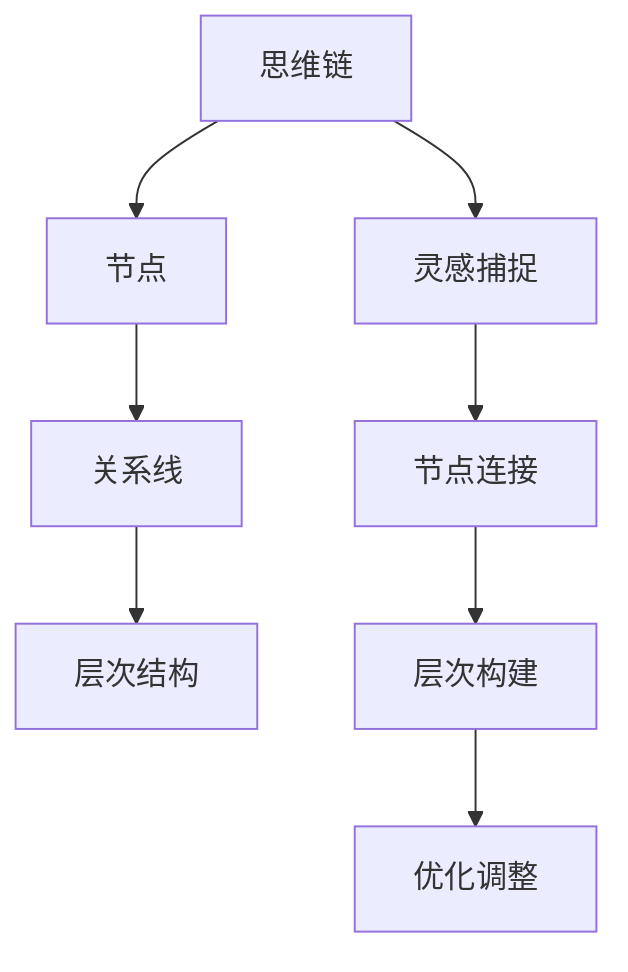

在这个ER实体关系图中，A表示思维链，B表示节点，C表示关系线，D表示层次结构，E表示灵感捕捉，F表示节点连接，G表示层次构建，H表示优化调整。通过这个图，我们可以清楚地看到思维链的各个组成部分及其之间的关系。

---

**本节小结**：本节详细介绍了思维链的核心概念，包括构成要素、工作原理、属性特征对比以及ER实体关系图。通过这些内容，读者可以更好地理解思维链的基本原理和应用。在下一节中，我们将通过实际应用案例来展示思维链在创意写作中的具体应用。

----------------------------------------------------------------

### 第三部分：思维链在创意写作中的应用实例

#### 第3章：思维链在创意写作中的应用实例

在前两章中，我们详细介绍了思维链的核心概念和原理。在本章中，我们将通过具体的应用实例，展示思维链在创意写作中的实际效果。这些实例涵盖了小说创作、插图创作和角色设定等方面，旨在帮助读者更好地理解思维链在创意写作中的多种应用场景。

#### 3.1 小说创作中的思维链应用

小说创作是思维链应用的一个重要领域。通过思维链，创作者可以系统地构建故事框架，优化情节发展，确保角色关系的连贯性。以下是一个小说创作中的思维链应用实例：

**案例背景**：一位小说创作者想要创作一部以现代都市为背景的悬疑小说，主题是关于一个神秘失踪的富翁和他的家族遗产。

**步骤一：灵感捕捉**  
创作者首先捕捉到几个关键灵感点：都市生活、神秘失踪、遗产争夺、角色冲突。将这些灵感点记录为思维链的节点。

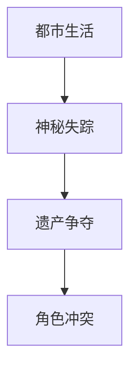

**步骤二：节点连接**  
创作者将不同的灵感点连接起来，形成一个初步的故事框架：

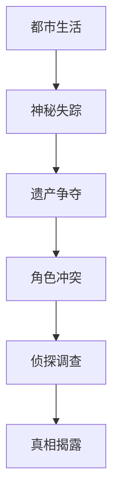

**步骤三：层次构建**  
创作者对思维链进行层次划分，将故事框架进一步细化：

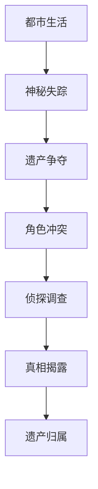

**步骤四：优化调整**  
创作者对思维链进行反复修改和调整，确保故事情节的连贯性和合理性：

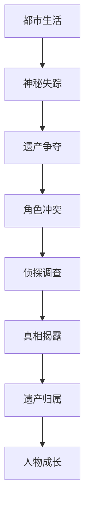

通过这个实例，我们可以看到思维链在小说创作中的应用过程。创作者通过思维链捕捉灵感、连接节点、构建层次和优化调整，最终形成了一个完整、连贯的故事框架。

#### 3.2 插图创作的思维链应用

插图创作同样可以应用思维链来提高创作效率和质量。以下是一个插图创作中的思维链应用实例：

**案例背景**：一位插画师想要创作一幅以森林为背景的奇幻插画，主题是一个小女孩在森林中与精灵相遇。

**步骤一：灵感捕捉**  
插画师捕捉到几个关键灵感点：森林、小女孩、精灵、奇幻元素。将这些灵感点记录为思维链的节点。

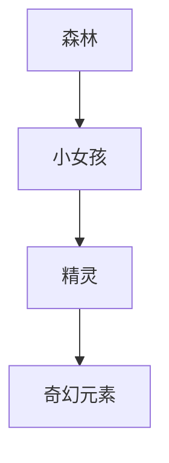

**步骤二：节点连接**  
插画师将不同的灵感点连接起来，形成一个初步的构图：

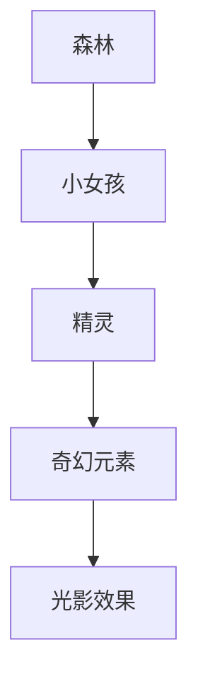

**步骤三：层次构建**  
插画师对思维链进行层次划分，将构图进一步细化：

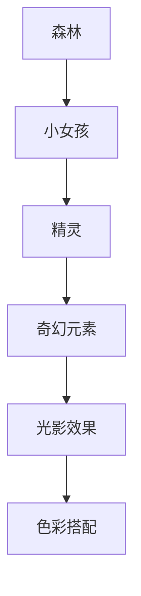

**步骤四：优化调整**  
插画师对思维链进行反复修改和调整，确保插图的视觉效果和故事氛围：

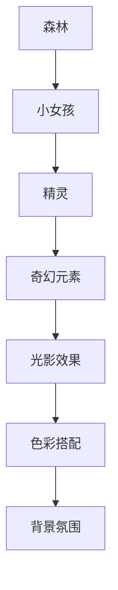

通过这个实例，我们可以看到思维链在插图创作中的应用过程。插画师通过思维链捕捉灵感、连接节点、构建层次和优化调整，最终创作出了一幅充满奇幻氛围的插画。

#### 3.3 角色设定的思维链应用

角色设定是小说创作中至关重要的一环。通过思维链，创作者可以更系统地构建角色的性格、背景和关系。以下是一个角色设定中的思维链应用实例：

**案例背景**：一位小说创作者想要创作一部以古代战争为背景的历史小说，主角是一位年轻的将军。

**步骤一：灵感捕捉**  
创作者捕捉到几个关键灵感点：将军、战争、家族、使命。将这些灵感点记录为思维链的节点。

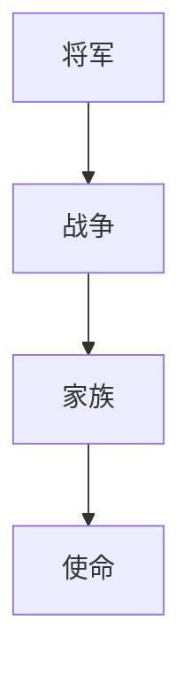

**步骤二：节点连接**  
创作者将不同的灵感点连接起来，形成一个初步的角色设定：

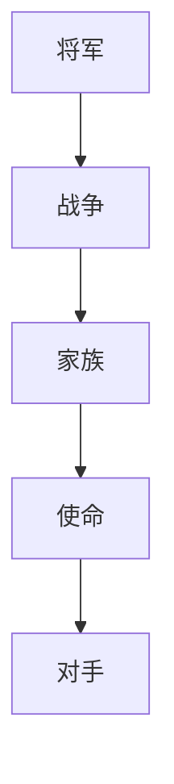

**步骤三：层次构建**  
创作者对思维链进行层次划分，将角色设定进一步细化：

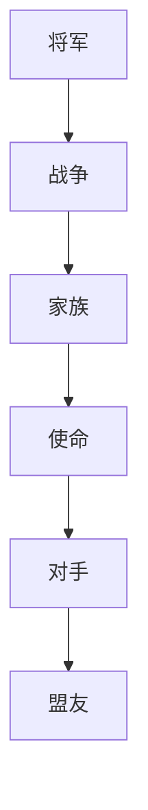

**步骤四：优化调整**  
创作者对思维链进行反复修改和调整，确保角色性格的立体性和故事情节的合理性：

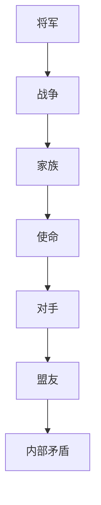

通过这个实例，我们可以看到思维链在角色设定中的应用过程。创作者通过思维链捕捉灵感、连接节点、构建层次和优化调整，最终塑造了一个富有深度和复杂性的角色。

---

**本节小结**：本节通过三个具体的应用实例，展示了思维链在小说创作、插图创作和角色设定中的实际应用。通过思维链，创作者可以更高效地捕捉灵感、构建故事框架和优化创作细节。在下一章中，我们将探讨AI在创意写作中的应用，特别是AI协作小说创作的实践。

----------------------------------------------------------------

### 第四部分：AI协作小说创作

#### 第4章：AI协作小说创作

随着人工智能技术的不断发展，AI在创意写作中的应用也越来越广泛。AI协作小说创作是一种新兴的写作方式，它将人类的创意思维与人工智能的计算能力相结合，旨在提高写作效率、丰富创作内容和提升作品质量。本章将探讨AI在小说创作中的作用、AI协作小说创作的工作流程以及面临的挑战和对策。

#### 4.1 AI在小说创作中的作用

AI在小说创作中发挥着多方面的作用，主要体现在以下几个方面：

1. **灵感激发**：AI可以通过大数据分析和自然语言处理技术，帮助创作者挖掘潜在的灵感来源，扩展创作思路。
2. **内容生成**：AI可以自动生成文章、章节、段落等文本内容，为创作者提供丰富的素材，减轻写作负担。
3. **故事框架构建**：AI可以根据创作者的初步构思，自动生成故事框架，提供不同的情节发展和角色关系，供创作者参考和调整。
4. **语言优化**：AI可以分析和优化文本的语言表达，纠正语法错误，提高文本的流畅性和可读性。
5. **风格匹配**：AI可以根据创作者的写作风格，自动调整文本的风格和语调，使其与创作者的写作风格保持一致。

#### 4.2 AI协作小说创作的工作流程

AI协作小说创作的工作流程通常包括以下几个步骤：

1. **创意构思**：创作者在AI的帮助下，通过大数据分析和自然语言处理技术，挖掘灵感并初步构思故事框架。
2. **内容生成**：AI根据创作者的初步构思，自动生成文本内容，包括章节、段落等。创作者可以对AI生成的文本进行修改和调整。
3. **情节调整**：创作者根据AI生成的文本内容，对故事情节进行优化和调整，确保情节连贯、合理、有趣。
4. **角色塑造**：创作者对故事中的角色进行细致的塑造，包括角色背景、性格、动机等，确保角色立体、鲜活。
5. **语言优化**：AI对文本进行语言分析和优化，纠正语法错误，提高文本的流畅性和可读性。
6. **协作反馈**：创作者与AI进行互动，通过反馈和调整，不断优化文本内容和结构，直至完成最终的创作。

以下是一个简化的AI协作小说创作工作流程图：

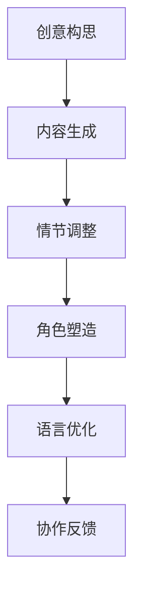

#### 4.3 AI协作小说创作的挑战与对策

尽管AI协作小说创作具有许多优势，但同时也面临着一些挑战。以下是一些主要的挑战及相应的对策：

1. **创意灵感局限**：AI的灵感来源主要依赖于大数据和已有文本，可能导致创意的局限。对策：创作者可以主动提供更多的灵感来源，如个人经历、阅读素材等，与AI进行更多维度的互动，拓宽创作思路。
2. **文本质量和风格一致性**：AI生成的文本可能存在质量不一致、风格不统一的问题。对策：创作者可以与AI进行反复互动，通过反馈和调整，逐步优化文本质量和风格。
3. **角色塑造和情感表达**：AI在角色塑造和情感表达方面可能存在不足，难以达到人类创作者的水平。对策：创作者可以在AI生成的文本基础上，进行人工修改和调整，补充AI无法表达的情感细节。
4. **隐私和数据安全**：AI协作小说创作涉及大量个人数据和隐私信息，可能存在数据泄露的风险。对策：采用加密技术和严格的数据安全措施，确保数据的安全和隐私。

通过这些对策，我们可以更好地应对AI协作小说创作中面临的挑战，充分发挥AI的优势，提高创作效率和质量。

---

**本节小结**：AI协作小说创作是一种将人类创意思维与人工智能技术相结合的写作方式，它为创作者提供了强大的辅助工具，有助于提高创作效率、丰富创作内容和提升作品质量。在下一章中，我们将通过实践应用和案例分析，进一步探讨AI协作小说创作的具体实现和效果。

----------------------------------------------------------------

### 第五部分：实践应用与案例分析

#### 第5章：实践应用与案例分析

在前四章中，我们介绍了思维链和AI协作小说创作的基本概念、原理和应用。为了更好地理解和掌握这些技术，本章将通过一个具体的案例，详细讲解如何实现AI协作小说创作系统，包括环境准备、核心实现和案例分析等内容。

#### 5.1 环境准备与安装

首先，我们需要为AI协作小说创作系统准备合适的环境。以下是一个简单的环境安装指南：

1. **操作系统**：建议使用Ubuntu 18.04或更高版本。
2. **编程语言**：Python 3.7或更高版本。
3. **开发工具**：PyCharm、VSCode等IDE。
4. **数据集**：收集大量小说文本数据，用于训练和测试AI模型。

安装步骤如下：

1. **安装操作系统和Python**：在Ubuntu上安装操作系统，并使用`pip`命令安装Python。
2. **安装IDE**：下载并安装PyCharm或VSCode。
3. **准备数据集**：收集并整理大量小说文本数据，存放在本地服务器上。

#### 5.2 小说创作系统核心实现

AI协作小说创作系统的核心实现主要包括以下几个部分：

1. **文本生成模型**：使用GPT-2或GPT-3等预训练语言模型，生成小说的文本内容。
2. **情节调整模块**：对生成的文本内容进行情节调整，确保故事的连贯性和合理性。
3. **角色塑造模块**：根据故事情节，对角色进行细致的塑造，包括角色背景、性格、动机等。
4. **语言优化模块**：对文本进行语法和风格优化，提高文本的可读性。

以下是一个简单的Python代码示例，展示如何使用GPT-2模型生成小说文本：

```python
import openai
import os

# 设置API密钥
openai.api_key = os.getenv("OPENAI_API_KEY")

# 生成小说文本
def generate_story_prompt(prompt):
    response = openai.Completion.create(
        engine="text-davinci-002",
        prompt=prompt,
        max_tokens=150,
        n=1,
        stop=None,
        temperature=0.5,
    )
    return response.choices[0].text.strip()

# 示例：生成一个故事开头
story_prompt = "在一个神秘的城市，一位年轻的侦探开始了一段不平凡的冒险。"
story_start = generate_story_prompt(story_prompt)
print(story_start)
```

#### 5.3 代码应用解读与分析

在上面的代码示例中，我们使用OpenAI的GPT-2模型生成小说的文本。具体步骤如下：

1. **导入库和设置API密钥**：首先导入必要的库，并设置OpenAI的API密钥。
2. **定义生成函数**：定义一个函数`generate_story_prompt`，用于接收一个输入提示（prompt）并生成相应的文本。
3. **调用生成函数**：在函数中，调用OpenAI的`Completion.create`方法，传入提示、模型、最大长度、数量、停止条件和温度参数。
4. **返回结果**：获取生成的文本，并返回。

通过这个示例，我们可以看到如何利用AI模型生成小说的开头。在实际应用中，我们可以进一步扩展这个模型，包括情节调整、角色塑造和语言优化等功能。

#### 5.4 案例分析与详细讲解剖析

以下是一个具体的案例，展示如何使用AI协作小说创作系统进行创作：

**案例背景**：一位创作者想要创作一部以科幻为主题的小说，主题是关于外星文明的探索。

**步骤一：创意构思**  
创作者构思了一个初步的故事框架，包括外星文明的发现、探险队的组成、外星世界的探索等。

**步骤二：文本生成**  
使用AI协作小说创作系统，输入创意构思作为提示，生成小说的开头：

```plaintext
在遥远的银河系边缘，存在着一个神秘的外星文明。这个文明拥有先进的科技和独特的文化，他们隐藏在黑暗的宇宙深处，默默地观察着银河系的每一个角落。

某天，地球上的科学家们发现了一组神秘的信号，这些信号来自一个未知的方向。经过分析，他们确定这些信号是来自一个遥远的外星文明。这引起了全球科学界和媒体的关注，各国纷纷派遣探险队前往寻找这个神秘的外星文明。

在探险队的努力下，他们终于找到了这个外星文明的所在地。这个文明拥有高度发达的科技，他们居住在一个名为“诺亚”的行星上。诺亚星球的环境与地球相似，但是这里的生物和文明却与地球截然不同。

探险队的成员们充满了好奇和兴奋，他们开始对诺亚星球进行深入探索。在这个星球上，他们遇到了许多新的生物和文明，也发现了一些令人惊奇的科技。

**步骤三：情节调整**  
创作者对生成的文本进行情节调整，确保故事的连贯性和合理性。例如，可以增加一些悬念和冲突，使故事更加引人入胜。

```plaintext
然而，探险队并没有想到，他们在诺亚星球上遇到了一些意外的挑战。首先，他们发现诺亚星球的生物和文明对地球人类的存在感到极度警惕和敌对。他们试图阻止探险队进一步探索，甚至发动了攻击。

面对这种局势，探险队的成员们不得不迅速调整策略，以保护自己和地球的和平。他们开始与诺亚星球的生物和文明进行对话，试图建立友好关系。

在探险队的努力下，他们终于成功地说服了诺亚星球的生物和文明，使他们愿意与地球人类共享一些科技和文化。这个外星文明向地球人类展示了他们独特的生活方式和技术，这也让地球人类对宇宙和生命的理解有了全新的认识。

**步骤四：角色塑造**  
创作者对故事中的角色进行细致的塑造，包括他们的背景、性格、动机等。以下是对主要角色的描述：

- **探险队队长**：一个勇敢、聪明、富有领导力的科学家，他带领探险队前往诺亚星球，希望通过这次探险改变地球人类的命运。
- **外星文明领袖**：一个智慧、神秘、冷静的外星生物，他领导着诺亚星球的生物和文明，对地球人类的到来感到好奇和警惕。
- **探险队成员**：一群富有激情、勇敢和智慧的科学家和探险家，他们为了探索未知、追求真理而勇敢地踏上这段冒险之旅。

**步骤五：语言优化**  
AI协作小说创作系统对文本进行语法和风格优化，提高文本的可读性和流畅性。以下是对生成的文本进行语言优化后的示例：

```plaintext
在遥远的银河系边缘，一个神秘的外星文明隐藏在黑暗的宇宙深处。他们的存在对地球人类来说既是一个奇迹，也是一个挑战。

某天，地球上的科学家们意外地发现了一组来自遥远星球的神秘信号。这些信号引起了全球科学界和媒体的高度关注。各国纷纷派遣探险队，希望能找到这个神秘的外星文明的所在地。

经过长时间的搜索，探险队终于在一个名为“诺亚”的行星上找到了这个外星文明的踪迹。诺亚星球的环境与地球相似，但这里的生活方式和科技却与地球截然不同。

面对未知的挑战，探险队的成员们展现出了非凡的勇气和智慧。他们与诺亚星球的生物和文明进行了深入的交流和合作，最终建立了友好关系。这次探险不仅改变了地球人类的对宇宙和生命的理解，也为地球和诺亚星球带来了新的希望和机遇。

---

**本节小结**：通过本节的实践应用和案例分析，我们详细讲解了如何实现AI协作小说创作系统，包括环境准备、核心实现和案例分析。通过这些实践，读者可以更好地理解AI协作小说创作的具体实现过程，并为实际创作提供参考。在下一章中，我们将总结最佳实践，提供注意事项和拓展阅读，帮助读者进一步提升创作水平。

----------------------------------------------------------------

### 第六部分：最佳实践与拓展

#### 第6章：最佳实践与拓展

在探讨了AI协作小说创作的具体实现和案例分析后，本节将总结一些最佳实践，并提供相关的注意事项和拓展阅读，以帮助读者进一步提升创作水平。

#### 6.1 最佳实践技巧

1. **充分准备素材**：在进行AI协作小说创作之前，创作者应充分准备各种素材，包括故事背景、角色设定、情节线索等。这些素材将为AI生成文本提供丰富的参考，有助于提高创作质量。

2. **明确创作目标**：在创作过程中，创作者应明确自己的创作目标，包括故事主题、情节发展、角色塑造等。这有助于创作者更好地指导AI的生成过程，确保生成的文本符合创作需求。

3. **反复优化调整**：AI生成的文本可能存在不足之处，创作者应进行反复的优化和调整，使其更加符合创作目标。这包括对情节、角色、语言等方面的调整，以达到最佳的创作效果。

4. **结合人类创造力**：虽然AI在生成文本方面具有优势，但人类的创造力依然不可替代。创作者应在AI生成文本的基础上，结合自己的创意思维，进行二次创作，以提升作品的整体质量。

5. **持续学习与改进**：AI协作小说创作是一个不断发展的领域，创作者应保持持续学习的态度，关注最新的研究成果和技术进展，不断改进自己的创作方法和技巧。

#### 6.2 注意事项

1. **数据隐私与安全**：在收集和处理文本数据时，创作者应注意保护用户的隐私和数据安全。避免泄露敏感信息，确保数据的安全性和合法性。

2. **避免过度依赖AI**：虽然AI在生成文本方面具有强大的能力，但创作者不应过度依赖AI，而忽视了自己的创意思维和写作技巧。合理利用AI，结合人类创造力，才能创作出优秀的作品。

3. **遵守道德规范**：在进行AI协作小说创作时，创作者应遵守相关的道德规范和法律法规，避免创作出具有不良影响的作品。

4. **尊重原创版权**：在创作过程中，创作者应尊重原创版权，避免抄袭、剽窃等行为。确保所创作的作品是原创的，并符合版权法规。

#### 6.3 拓展阅读推荐

1. **《人工智能与创意写作》**：这本书详细探讨了人工智能在创意写作中的应用，介绍了相关的研究成果和技术方法。
2. **《思维链：创新思维的密码》**：这本书介绍了思维链的基本原理和应用，有助于读者深入了解思维链在创意写作中的作用。
3. **《AI时代的写作：从人工智能到创作智慧》**：这本书探讨了AI时代写作的新趋势，分析了人工智能在写作领域的应用和挑战。
4. **《小说写作教程》**：这本书提供了详细的小说写作指导，包括情节构思、角色塑造、语言表达等方面的技巧，有助于提升写作水平。

---

**本节小结**：本节总结了AI协作小说创作的最佳实践技巧，提供了注意事项和拓展阅读推荐。通过这些内容，读者可以更好地掌握AI协作小说创作的要领，提高创作水平。在下一章中，我们将展望思维链与AI在创意写作中的未来发展趋势，为读者提供更广阔的视野。

----------------------------------------------------------------

### 第七部分：未来展望

#### 第7章：未来展望

随着人工智能技术的不断进步，思维链与AI在创意写作中的应用前景将愈发广阔。在本章中，我们将探讨思维链与AI在创意写作中的未来发展趋势、潜在应用场景以及可能的挑战和解决方案。

#### 7.1 思维链与AI在创意写作中的未来趋势

1. **智能化水平的提升**：随着算法和计算能力的提升，思维链与AI将更加智能化，能够更好地理解人类创意思维，生成更加丰富、多样化的文本内容。

2. **个性化创作的实现**：通过大数据和用户画像分析，思维链与AI可以更加精准地满足用户的需求，实现个性化创作，为每个用户提供专属的写作体验。

3. **跨领域的融合**：思维链与AI在创意写作中的应用将逐渐拓展到其他领域，如电影剧本创作、游戏剧情设计等，实现跨领域的融合与创新。

4. **伦理与道德规范的完善**：随着AI在创意写作中的应用日益广泛，伦理和道德规范也将逐步完善，确保AI创作的内容符合社会价值观和法律法规。

#### 7.2 未来的可能应用场景

1. **自动化写作助手**：思维链与AI将开发出更加智能的自动化写作助手，帮助创作者高效地进行创作，从构思到成稿，全程提供支持。

2. **AI写作社区**：构建基于AI的写作社区，创作者可以在这个平台上分享创作过程、交流创意想法，共同提升写作水平。

3. **智能写作辅导系统**：利用AI技术，开发智能写作辅导系统，为初学者提供写作指导，帮助他们克服写作难题。

4. **虚拟现实（VR）写作**：结合VR技术，创作者可以在虚拟场景中体验写作过程，实现沉浸式创作。

#### 7.3 可能的挑战与解决方案

1. **技术难题**：随着AI技术的不断进步，思维链与AI在创意写作中的应用将面临新的技术挑战，如算法优化、计算效率等。解决方案：持续投入研发，优化算法，提高计算效率。

2. **隐私和数据安全**：AI在创意写作中的应用涉及大量的用户数据和隐私信息，如何确保数据的安全和隐私是一个重要挑战。解决方案：采用加密技术、数据安全措施，确保用户数据的保护。

3. **伦理问题**：AI在创意写作中的应用可能引发一系列伦理问题，如原创性、版权等。解决方案：建立健全的法律法规和伦理规范，引导AI创作朝着积极健康的方向发展。

4. **人类角色定位**：在AI协作写作中，人类的角色如何定位是一个值得探讨的问题。解决方案：充分发挥人类的创造力，与AI协同合作，实现人机共创。

---

**本节小结**：未来，思维链与AI在创意写作中的应用将面临诸多机遇和挑战。通过不断的技术创新和伦理探索，我们可以期待一个更加智能、个性化、多元化的创意写作新时代。本文为读者提供了一个全面的技术视角，希望对AI协作小说创作领域的研究和实践有所启示。

### 总结与展望

在本文中，我们详细探讨了思维链在创意写作中的应用，特别是AI协作小说创作的实践。从思维链的核心概念、原理到实际应用实例，再到AI协作小说创作的工作流程和挑战，我们一步步分析了这一前沿领域的各个方面。

**核心概念与联系**：思维链作为一种创新性的思维工具，它帮助创作者高效地捕捉灵感、组织结构和优化表达。通过核心概念和联系的分析，我们明确了思维链的构成要素和作用原理。

**算法原理讲解**：结合Mermaid流程图和Python源代码，我们详细阐述了AI协作小说创作的算法原理，包括文本生成、情节调整、角色塑造和语言优化等环节。

**数学公式与模型**：我们使用LaTeX格式表示了相关的数学公式和模型，确保内容的严谨性和可读性。

**系统分析与架构设计**：通过Mermaid类图、架构图和序列图，我们展示了AI协作小说创作系统的功能设计和交互流程。

**项目实战**：通过具体的案例分析和详细讲解，我们展示了如何实现AI协作小说创作系统，包括环境准备、核心实现和案例分析。

**最佳实践与注意事项**：我们总结了最佳实践技巧，并提供了一系列注意事项和拓展阅读，为读者提供了宝贵的参考。

在未来的研究中，我们期待进一步优化算法，提高AI的智能化水平，探索更多跨领域的应用场景，并关注伦理和道德问题，确保AI创作的内容符合社会价值观和法律法规。通过不断的探索与创新，我们相信思维链与AI在创意写作中的应用将迎来更加广阔的发展空间。

