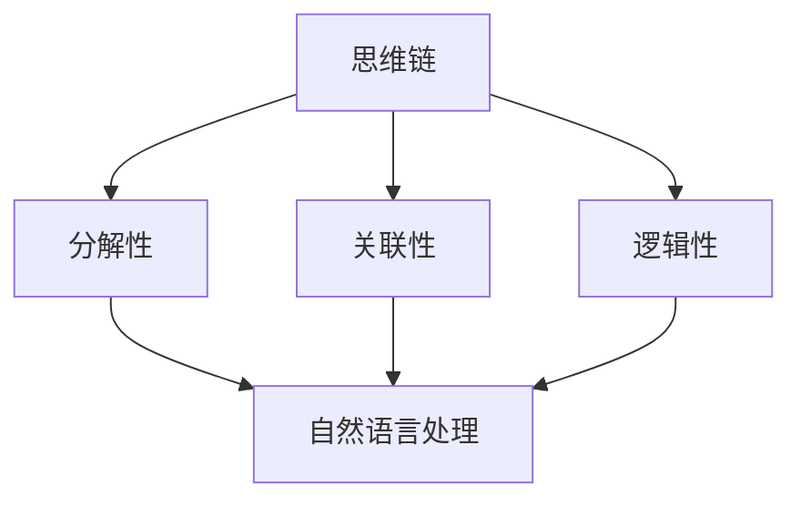
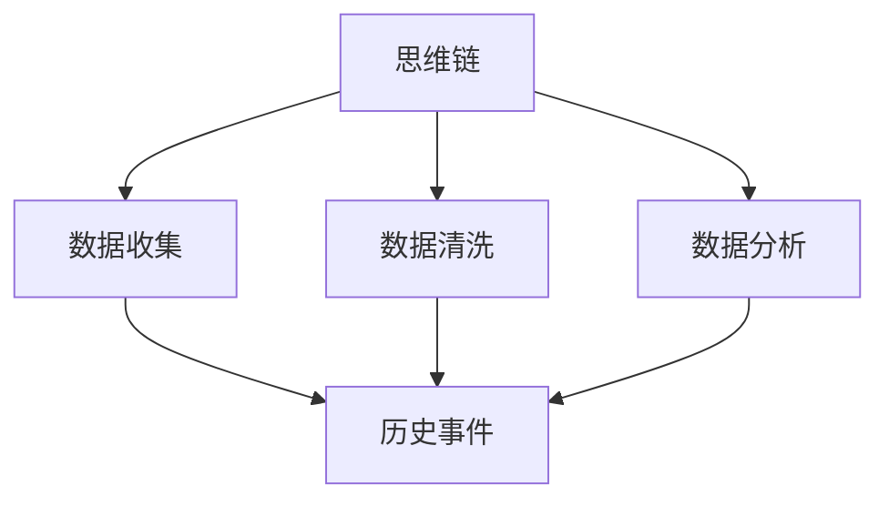
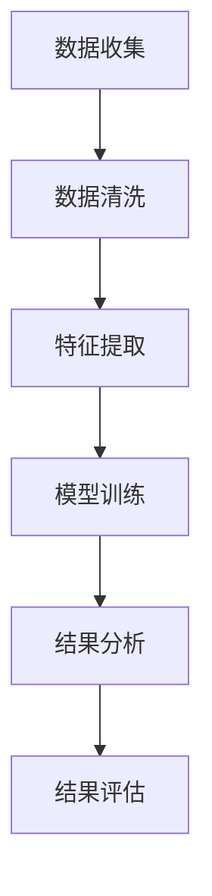

                 

## 引言

### 《思维链在历史事件重构中的应用：AI辅助历史研究》

随着人工智能技术的飞速发展，机器学习和深度学习在各个领域都展现出了巨大的潜力。在这其中，历史研究作为一个传统的领域，也逐渐开始尝试引入AI技术，以解决传统方法中面临的诸多挑战。本文将探讨思维链在历史事件重构中的应用，通过AI技术辅助历史研究，从而为历史学家和研究者提供更加全面、深入的研究工具。

首先，我们需要理解历史事件重构的重要性。历史事件重构是对历史事件进行系统分析，从中提取关键信息，构建出事件的整体图景。这不仅是历史研究的基本任务，也是历史解释和理论建构的重要环节。然而，传统的历史研究方法在处理复杂历史事件时，往往受到数据有限、信息不完整等问题的制约。

思维链作为一种智能化的思考模式，其核心在于将复杂的思考过程分解为若干个独立的步骤，并通过逻辑推理和信息关联，逐步构建出完整的思考链条。这种模式在人工智能领域有着广泛的应用，如自然语言处理、知识图谱构建等。将思维链引入历史事件重构，可以有效地提高研究的深度和广度，帮助我们更准确地理解和解释历史事件。

本文将分为四个主要部分进行探讨：

第一部分：背景介绍。我们将简要介绍历史研究的现状，分析历史事件重构的挑战，并探讨AI技术在历史研究中的应用潜力。

第二部分：核心概念与联系。本文将详细阐述思维链的定义、特性以及在历史研究中的应用，并通过对比分析，展示思维链与其他概念的区别和联系。

第三部分：AI辅助历史研究的应用。本文将深入探讨AI技术在历史事件重构中的应用，包括自然语言处理技术、机器学习算法和深度学习模型等，并详细讲解其原理和流程。

第四部分：总结与展望。本文将总结全文的核心观点，提出最佳实践和注意事项，并展望AI技术在历史研究中的未来发展趋势。

通过以上四个部分的讨论，我们希望能够为历史研究提供一种新的视角和方法，借助AI技术，更全面、深入地理解历史事件，揭示其背后的复杂关系和深远影响。

### 1.1 问题背景

历史研究作为一门学科，旨在通过对历史事件和现象的系统分析，揭示人类社会发展的规律和趋势。然而，随着历史事件的复杂性和多样性不断增加，传统的单一方法在应对这些挑战时显得力不从心。特别是历史事件的重构，这一历史研究的核心任务，面临着诸多难以克服的难题。

#### 1.1.1 历史研究的现状

当前的历史研究主要依赖于文献资料、考古发现和口述历史等传统手段。研究者通过对这些信息的整理和分析，试图还原历史事件的全貌。然而，这种方法存在明显的局限性。首先，历史文献往往存在缺失和不完整的情况，这给历史事件的全面重构带来了困难。其次，历史事件的复杂性使得研究者难以从繁杂的信息中提取出关键要素，从而影响了对事件本质的理解。此外，传统的研究方法在处理大量数据时效率低下，难以应对日益增长的史料和信息量。

#### 1.1.2 历史事件重构的挑战

历史事件的重构是一个复杂的过程，涉及对历史事件背景、过程、结果及其影响的全面分析。具体来说，历史事件重构面临以下几个主要挑战：

1. **信息不完整**：历史事件往往伴随着大量的信息缺失，研究者难以获得完整的史料，这限制了他们对事件的整体理解。
   
2. **观点多样性**：不同的历史学者对同一事件可能有不同的解释和观点，如何整合这些不同的观点，形成全面、客观的历史图景，是历史事件重构的一大难题。

3. **复杂性**：历史事件涉及的人物、事件、背景因素繁多，这些因素之间的相互关系错综复杂，使得事件的重构具有很高的难度。

4. **跨学科融合**：历史研究需要跨学科的知识支持，如考古学、社会学、经济学等。如何将这些不同领域的知识有效整合，是历史事件重构需要面对的挑战之一。

#### 1.1.3 AI技术在历史研究中的应用潜力

随着人工智能技术的快速发展，AI在历史研究中的应用潜力逐渐显现。人工智能技术，特别是机器学习和深度学习，具有处理大规模数据、发现数据间关联、自动推理等优势，这些特性为历史事件的重构提供了新的方法和工具。

1. **数据挖掘与分析**：AI技术能够从大量的历史文献和考古资料中挖掘出有价值的信息，通过对这些信息的分析，可以揭示出历史事件的潜在关联和规律。

2. **模式识别与分类**：通过机器学习算法，可以对历史事件进行自动分类和模式识别，帮助研究者从繁杂的信息中提取出关键要素。

3. **自然语言处理**：AI的自然语言处理技术能够对历史文献进行自动整理和分析，提取出关键信息，从而辅助研究者进行历史事件的重构。

4. **知识图谱构建**：AI技术可以构建知识图谱，将历史事件、人物、背景等因素以图形化的方式呈现，帮助研究者更直观地理解事件之间的关系。

总之，AI技术在历史研究中的应用具有巨大的潜力，能够有效解决传统方法中的诸多难题。通过引入AI技术，历史研究有望实现从数据驱动到智能驱动的转变，从而更加全面、深入地揭示历史事件的本质。

### 1.2 核心概念

在探讨AI辅助历史研究之前，我们需要理解几个核心概念：思维链、自然语言处理、机器学习算法和深度学习模型。这些概念不仅构成了AI技术的基础，也是我们讨论AI在历史事件重构中应用的关键。

#### 1.2.1 思维链的定义与特性

思维链是一种智能化的思考模式，它通过将复杂的思考过程分解为若干个独立的步骤，并通过逻辑推理和信息关联，逐步构建出完整的思考链条。思维链的核心特性包括：

1. **分解性**：将复杂的思考过程分解为若干个简单的步骤，使得每个步骤都能够被单独分析和处理。
2. **关联性**：通过信息关联，将各个步骤有机地结合在一起，形成一个完整的思考链条。
3. **逻辑性**：思维链强调逻辑推理，确保每一步都基于已有的信息和前提进行合理的推导。

#### 1.2.2 AI在历史研究中的应用

AI在历史研究中的应用主要体现在以下几个方面：

1. **自然语言处理**：自然语言处理技术（NLP）能够对历史文献进行自动整理和分析，提取出关键信息，帮助研究者理解历史事件的背景和过程。
2. **机器学习算法**：通过机器学习算法，研究者可以自动分类和模式识别历史事件，从繁杂的信息中提取出有价值的数据。
3. **深度学习模型**：深度学习模型能够通过学习大量的历史数据，自动发现事件之间的复杂关联，从而提供更深入的分析。

#### 1.2.3 历史事件重构的过程与方法

历史事件的重构是一个复杂的过程，需要综合运用多种AI技术和方法。以下是历史事件重构的基本过程和方法：

1. **数据收集**：通过文献查阅、考古发掘等方式收集与历史事件相关的数据。
2. **数据预处理**：对收集到的数据进行清洗和格式化，确保数据的准确性和一致性。
3. **特征提取**：从预处理后的数据中提取出关键特征，这些特征用于后续的分析和建模。
4. **模型训练**：使用机器学习或深度学习模型，对提取出的特征进行训练，构建出能够自动识别和分类历史事件的模型。
5. **结果分析**：对训练好的模型进行评估和优化，通过分析模型的输出结果，重构历史事件的整体图景。

#### 概念属性特征对比

为了更直观地展示思维链与其他核心概念的关系，我们可以通过以下Mermaid流程图来对比它们的属性特征：



通过这个流程图，我们可以看到思维链的三个核心特性（分解性、关联性、逻辑性）如何与自然语言处理、机器学习算法和深度学习模型等AI技术相互关联和补充。

### 1.3 研究范围的界定

在本研究中，我们主要关注以下几方面的内容：

1. **历史事件的重构**：以具体的历史事件为例，探讨如何通过AI技术进行重构，包括数据收集、预处理、特征提取和模型训练等步骤。
2. **思维链的应用**：详细分析思维链在历史事件重构中的具体应用，展示其分解性、关联性和逻辑性如何帮助研究者更全面地理解历史事件。
3. **AI技术的实现**：通过自然语言处理、机器学习算法和深度学习模型等技术手段，探讨如何构建有效的历史事件重构模型，并进行结果分析。

在技术适用性方面，本文主要采用以下技术：

- **自然语言处理**：用于历史文献的自动整理和分析，提取关键信息。
- **机器学习算法**：用于历史事件的自动分类和模式识别。
- **深度学习模型**：用于自动发现历史事件之间的复杂关联，提供深入的分析。

数据来源与处理方面，本文将主要依赖公开的历史文献数据库、考古发掘数据和相关研究成果。在数据预处理阶段，我们将对数据源进行筛选和清洗，确保数据的准确性和一致性。对于特征提取，我们将采用文本挖掘和实体识别等技术手段，从原始数据中提取出关键特征，为模型训练提供基础。

### 1.4 概念结构与核心要素组成

为了更清晰地展示思维链在历史事件重构中的应用，我们可以通过以下Mermaid流程图来描述概念结构与核心要素组成：



这个流程图说明了思维链在历史事件重构中的基本工作流程，包括数据收集、数据清洗和数据分析三个关键步骤。首先，通过数据收集获取与历史事件相关的信息。然后，通过数据清洗确保数据的准确性和一致性。最后，通过数据分析提取出关键特征，为历史事件的重构提供支持。

#### 1.4.1 自然语言处理技术

自然语言处理（NLP）是AI技术在历史研究中的重要应用之一。NLP通过计算机技术模拟人类语言理解的过程，使计算机能够理解和处理自然语言。在历史事件重构中，NLP主要用于以下几个关键步骤：

1. **文本整理**：对历史文献进行自动整理，包括去除无关内容、分词、词性标注等，从而提取出有效的信息。
2. **信息提取**：从整理后的文本中提取关键信息，如人物、地点、时间等，为后续的数据分析提供基础。
3. **情感分析**：通过分析文本中的情感倾向，揭示历史事件中的情绪变化和社会反应。

具体实现方面，NLP通常涉及以下关键技术：

- **分词**：将文本分割成独立的词语，为后续处理提供基础。
- **词性标注**：识别文本中的词语的词性，如名词、动词、形容词等，帮助理解文本的语义结构。
- **命名实体识别**：识别文本中的人物、地点、组织等实体，为信息提取提供支持。
- **语义分析**：通过理解文本的语义内容，揭示文本中的深层次信息。

通过NLP技术，历史文献的自动整理和分析变得高效且准确，从而为历史事件的重构提供了可靠的数据支持。

#### 1.4.2 机器学习算法

机器学习算法在历史事件重构中起着至关重要的作用。通过机器学习，我们可以从大量历史数据中自动提取规律和模式，从而更准确地重构历史事件。以下是几种常见的机器学习算法及其在历史事件重构中的应用：

1. **决策树**：决策树是一种树形结构模型，通过一系列规则对数据集进行分割，最终生成一个决策树模型。在历史事件重构中，决策树可以用于分类和回归任务，帮助研究者对历史事件进行分类和预测。
2. **支持向量机（SVM）**：SVM是一种基于间隔最大化的分类算法，通过找到数据集的最佳分离超平面，实现分类任务。在历史事件重构中，SVM可以用于对历史事件进行分类和识别。
3. **神经网络**：神经网络是一种模拟生物神经系统的计算模型，具有强大的学习和推理能力。在历史事件重构中，神经网络可以用于建立复杂的非线性模型，通过学习大量历史数据，自动发现事件之间的关联和模式。
4. **聚类算法**：聚类算法将数据集划分为若干个类别，使同一类别内的数据尽可能相似，不同类别之间的数据尽可能不同。在历史事件重构中，聚类算法可以用于发现历史事件中的相似群体和模式。

具体实现方面，机器学习算法通常包括以下步骤：

- **数据预处理**：对历史数据集进行清洗和归一化处理，确保数据的可靠性和一致性。
- **特征工程**：从原始数据中提取出有用的特征，为模型训练提供基础。
- **模型选择**：选择合适的机器学习算法，根据任务需求和数据特性进行模型选择。
- **模型训练**：使用训练数据集对模型进行训练，调整模型参数，提高模型性能。
- **模型评估**：使用测试数据集对模型进行评估，确保模型的预测能力和泛化能力。

通过机器学习算法，我们可以从大量历史数据中自动提取出有用的信息，帮助研究者更全面地理解和重构历史事件。

#### 1.4.3 深度学习模型

深度学习模型是近年来在AI领域取得显著进展的一类模型，其在图像识别、自然语言处理和语音识别等领域表现出了强大的能力。在历史事件重构中，深度学习模型同样具有重要的应用价值。

1. **卷积神经网络（CNN）**：卷积神经网络是一种专门用于处理图像数据的深度学习模型，通过卷积操作提取图像特征，实现图像分类和识别。在历史事件重构中，CNN可以用于分析历史文献中的图像资料，提取出图像中的关键信息，从而辅助研究者理解历史事件。
2. **循环神经网络（RNN）**：循环神经网络是一种专门用于处理序列数据的深度学习模型，通过循环结构记住之前的输入信息，实现序列建模。在历史事件重构中，RNN可以用于分析历史文献中的序列数据，如文本、时间序列等，从而提取出事件之间的关联和模式。
3. **长短时记忆网络（LSTM）**：长短时记忆网络是RNN的一种改进模型，通过引入门控机制，有效解决了RNN的梯度消失问题。在历史事件重构中，LSTM可以用于处理长序列数据，如历史事件的时间序列，从而提取出事件之间的长期依赖关系。
4. **生成对抗网络（GAN）**：生成对抗网络是一种基于对抗训练的深度学习模型，通过生成器和判别器的相互博弈，生成高质量的图像和文本数据。在历史事件重构中，GAN可以用于生成历史文献的缺失部分，补充完整历史事件的细节。

具体实现方面，深度学习模型通常包括以下步骤：

- **数据预处理**：对历史数据集进行清洗和归一化处理，确保数据的可靠性和一致性。
- **模型设计**：根据任务需求和数据特性，设计合适的深度学习模型结构。
- **模型训练**：使用训练数据集对模型进行训练，调整模型参数，提高模型性能。
- **模型评估**：使用测试数据集对模型进行评估，确保模型的预测能力和泛化能力。
- **模型应用**：将训练好的模型应用到实际历史事件的重构中，辅助研究者理解历史事件。

通过深度学习模型，我们可以从大量历史数据中自动提取出复杂的特征和模式，帮助研究者更全面、深入地理解历史事件。

### 2.1 AI技术在历史研究中的应用

AI技术在历史研究中的应用正逐渐成为学术界和工业界的研究热点。通过结合自然语言处理、机器学习算法和深度学习模型等技术，AI能够显著提升历史研究的效率和质量。以下将详细探讨AI技术在历史研究中的具体应用。

#### 2.1.1 自然语言处理技术

自然语言处理（NLP）在历史研究中具有广泛的应用，主要表现在以下几个方面：

1. **文本分析**：NLP技术可以对历史文献进行自动化处理，包括文本分类、情感分析和主题建模等。例如，通过文本分类，可以将不同来源的历史文献进行分类整理，有助于研究者快速定位和检索相关资料。

2. **实体识别**：NLP技术中的命名实体识别（NER）能够识别文本中的人物、地点、组织等实体，有助于构建历史事件中的角色和关系图谱。例如，通过NER技术，可以从大量历史文献中提取出重要的历史人物及其相关活动，从而构建出更加详细的历史事件图谱。

3. **事件抽取**：NLP技术中的事件抽取（Event Extraction）能够从文本中识别出事件及其相关要素，如事件类型、时间、地点和参与者等。这对于历史事件的重构和关系分析具有重要意义。例如，通过事件抽取技术，可以从历史文献中自动提取出关键事件及其背景信息，为事件分析和重构提供数据支持。

#### 2.1.2 机器学习算法

机器学习算法在历史研究中的应用主要体现在数据挖掘和模式识别方面：

1. **数据挖掘**：通过机器学习算法，可以从大量的历史数据中挖掘出潜在的关联和规律。例如，通过聚类算法，可以将历史事件按照其特征进行分类，从而发现不同类型事件之间的共性或差异。

2. **模式识别**：机器学习算法可以帮助研究者从历史文献中识别出特定的模式或趋势。例如，通过分类算法，可以将历史事件进行分类，从而识别出事件的发生频率、时间和空间分布等特征。

3. **预测分析**：机器学习算法还可以用于预测历史事件的可能性。例如，通过时间序列分析，可以预测历史事件的发展趋势，从而为政策制定和历史研究提供参考。

#### 2.1.3 深度学习模型

深度学习模型在历史研究中的应用正在逐渐深入，主要体现在以下几个方面：

1. **图像识别**：通过卷积神经网络（CNN），可以自动识别和分析历史文献中的图像资料。例如，通过CNN技术，可以识别出历史文献中的特定人物或事件图像，从而为研究者提供视觉化的历史资料。

2. **文本生成**：通过生成对抗网络（GAN）和自动编码器（Autoencoder）等深度学习模型，可以自动生成历史文本。这对于补充历史文献的缺失部分，完善历史事件的重构具有重要意义。例如，通过GAN技术，可以生成历史文献的缺失部分，从而提供更完整的历史事件描述。

3. **关系推理**：通过图神经网络（Graph Neural Network，GNN）等深度学习模型，可以自动推理历史事件之间的关系。例如，通过GNN技术，可以构建历史事件之间的复杂关系图，从而揭示出事件之间的相互影响和作用。

总之，AI技术在历史研究中的应用为研究者提供了强大的工具和手段，有助于更全面、深入地理解和重构历史事件。通过结合自然语言处理、机器学习算法和深度学习模型等技术，历史研究正朝着智能化和数据驱动的方向发展。

### 2.2 历史事件重构的基本原理

历史事件重构是历史研究中的一个核心任务，旨在通过系统分析历史数据，重建历史事件的全貌及其内在逻辑。在AI技术的辅助下，历史事件重构的基本原理主要包括以下几个关键步骤：

#### 2.2.1 数据预处理

数据预处理是历史事件重构的第一步，其目的是对原始数据进行清洗、整理和格式化，确保数据的质量和一致性。具体步骤包括：

1. **数据收集**：通过查阅文献、考古发掘和数字化技术等手段，收集与历史事件相关的各种数据，包括文本、图像、音频和视频等。

2. **数据清洗**：对收集到的数据进行清洗，去除噪声和无关信息。例如，去除文本中的标点符号、停用词，纠正错别字等。

3. **数据格式化**：将不同来源和格式的数据统一转换为标准的格式，便于后续处理和分析。例如，将文本数据转换为统一的文本编码格式，图像数据转换为统一的图像格式。

#### 2.2.2 算法原理讲解

算法原理是历史事件重构的核心，主要包括以下几个关键步骤：

1. **特征提取**：从预处理后的数据中提取出关键特征，这些特征用于后续的分析和建模。特征提取的方法包括词频统计、TF-IDF、词嵌入等。例如，通过词频统计，可以提取出文本数据中出现频率较高的词汇，作为文本特征。

2. **模型训练**：使用机器学习或深度学习算法，对提取出的特征进行训练，构建出能够自动识别和分类历史事件的模型。常见的机器学习算法包括决策树、支持向量机（SVM）、随机森林等。常见的深度学习模型包括卷积神经网络（CNN）、循环神经网络（RNN）、长短时记忆网络（LSTM）等。

3. **模型评估**：使用测试数据集对训练好的模型进行评估，确保模型的预测能力和泛化能力。常见的评估指标包括准确率、召回率、F1分数等。

#### 2.2.3 结果分析与评估

结果分析与评估是历史事件重构的最后一步，其目的是通过分析模型的输出结果，对历史事件进行重构，并评估模型的性能。具体步骤包括：

1. **结果分析**：对模型输出结果进行详细分析，包括事件分类结果、事件关系图等。通过分析结果，可以重构出历史事件的全貌及其内在逻辑。

2. **模型优化**：根据结果分析，对模型进行优化和调整，提高模型的性能。例如，通过调整模型参数、增加训练数据等，可以提升模型的预测准确率和泛化能力。

3. **结果评估**：使用新的测试数据集对优化后的模型进行评估，确保模型的性能满足要求。通过多次评估和优化，可以逐步提高历史事件重构的准确性和可靠性。

通过上述基本原理，AI技术能够有效地辅助历史事件的重构，帮助研究者更全面、深入地理解历史事件，揭示其背后的复杂关系和深远影响。

### 算法原理讲解与流程图

为了更好地理解AI在历史事件重构中的应用原理，我们将通过一个简单的流程图来展示其核心步骤，并使用Python代码详细阐述具体实现过程。

#### 流程图



#### 流程说明：

1. **数据收集**（A）：从公开的历史文献数据库、考古发掘数据和相关研究成果中收集与历史事件相关的数据。
2. **数据清洗**（B）：对收集到的数据进行清洗和格式化，去除噪声和无关信息，确保数据的准确性和一致性。
3. **特征提取**（C）：从清洗后的数据中提取关键特征，如文本中的关键词、时间序列数据中的关键时间点等。
4. **模型训练**（D）：使用机器学习算法或深度学习模型对提取出的特征进行训练，构建出能够识别和分类历史事件的模型。
5. **结果分析**（E）：对训练好的模型进行测试和分析，评估其在重构历史事件中的性能。
6. **结果评估**（F）：根据分析结果，对模型进行优化和调整，确保其具有较好的预测能力和泛化能力。

#### Python代码示例

以下是一个简单的Python代码示例，用于说明数据预处理、模型训练和结果分析的过程。

```python
# 导入必要的库
import pandas as pd
from sklearn.model_selection import train_test_split
from sklearn.feature_extraction.text import TfidfVectorizer
from sklearn.ensemble import RandomForestClassifier
from sklearn.metrics import accuracy_score

# 数据收集
# 这里假设数据已经从历史文献数据库中收集到，并以CSV文件的形式存储
data = pd.read_csv('historical_events.csv')

# 数据清洗
# 清洗文本数据，去除标点符号和停用词
data['clean_text'] = data['text'].str.lower().str.replace(r'[^\w\s]','',regex=True)

# 特征提取
# 使用TF-IDF方法提取文本特征
vectorizer = TfidfVectorizer(stop_words='english')
X = vectorizer.fit_transform(data['clean_text'])
y = data['event_type']

# 模型训练
# 使用随机森林算法进行模型训练
X_train, X_test, y_train, y_test = train_test_split(X, y, test_size=0.2, random_state=42)
clf = RandomForestClassifier(n_estimators=100)
clf.fit(X_train, y_train)

# 结果分析
# 使用测试数据集对模型进行预测
y_pred = clf.predict(X_test)

# 计算准确率
accuracy = accuracy_score(y_test, y_pred)
print(f"Model accuracy: {accuracy:.2f}")

# 结果评估
# 根据模型的准确率进行评估和优化
if accuracy < 0.8:
    print("Model needs optimization.")
else:
    print("Model performance is satisfactory.")
```

在这个示例中，我们使用了随机森林算法进行模型训练，并通过TF-IDF方法提取文本特征。具体实现过程中，我们对数据进行了清洗和格式化，然后使用机器学习算法对特征进行训练，最后对模型进行评估。通过这一流程，我们能够对历史事件进行初步的重构和分析，为更深入的研究提供基础。

### 2.4 数学模型和公式讲解

在历史事件重构过程中，数学模型和公式起着至关重要的作用，帮助研究者理解和量化历史事件之间的复杂关系。以下是几个关键的数学模型和公式，我们将详细讲解其概念、原理和应用。

#### 2.4.1 条件概率

条件概率是概率论中的一个基本概念，表示在某个事件发生的条件下，另一个事件发生的概率。其数学定义如下：

$$
P(A|B) = \frac{P(A \cap B)}{P(B)}
$$

其中，\(P(A|B)\) 表示在事件 \(B\) 发生的条件下，事件 \(A\) 发生的概率；\(P(A \cap B)\) 表示事件 \(A\) 和事件 \(B\) 同时发生的概率；\(P(B)\) 表示事件 \(B\) 发生的概率。

在历史事件重构中，条件概率可以用来描述事件之间的相互影响和因果关系。例如，如果我们知道某个历史事件 \(B\) 发生，那么可以计算另一个事件 \(A\) 在该条件下的发生概率，从而帮助理解事件之间的关系。

#### 2.4.2 贝叶斯定理

贝叶斯定理是概率论中的一个重要公式，它描述了在给定新证据的情况下，如何更新对某个事件发生概率的估计。贝叶斯定理的公式如下：

$$
P(A|B) = \frac{P(B|A) \cdot P(A)}{P(B)}
$$

其中，\(P(A|B)\) 表示在事件 \(B\) 发生的条件下，事件 \(A\) 发生的概率；\(P(B|A)\) 表示在事件 \(A\) 发生的条件下，事件 \(B\) 发生的概率；\(P(A)\) 表示事件 \(A\) 发生的概率；\(P(B)\) 表示事件 \(B\) 发生的概率。

贝叶斯定理在历史事件重构中的应用非常广泛。例如，当我们获得新的历史数据时，可以使用贝叶斯定理更新对历史事件的概率估计，从而更准确地重构历史事件的图景。

#### 2.4.3 概率分布函数

概率分布函数是描述随机变量取值概率的函数，常见的概率分布函数包括正态分布、伯努利分布、泊松分布等。以下是几种常见的概率分布函数及其应用：

1. **正态分布**：
$$
f(x) = \frac{1}{\sqrt{2\pi\sigma^2}} e^{-\frac{(x-\mu)^2}{2\sigma^2}}
$$
其中，\(\mu\) 表示均值，\(\sigma\) 表示标准差。

正态分布广泛应用于描述连续型随机变量的概率分布，如在历史研究中，可以用来估计历史事件的持续时间和影响范围。

2. **伯努利分布**：
$$
P(X=k) = C_n^k p^k (1-p)^{n-k}
$$
其中，\(n\) 表示试验次数，\(p\) 表示事件发生的概率，\(k\) 表示事件发生的次数。

伯努利分布广泛应用于二项分布和概率估计，如在历史研究中，可以用来估计某个历史事件发生的可能性。

3. **泊松分布**：
$$
P(X=k) = \frac{e^{-\lambda} \lambda^k}{k!}
$$
其中，\(\lambda\) 表示平均发生率。

泊松分布广泛应用于描述事件发生次数的概率分布，如在历史研究中，可以用来估计某个历史事件的发生频率。

通过上述数学模型和公式，研究者可以更加精确地描述和量化历史事件之间的复杂关系，从而为历史事件的重构提供有力的理论支持。

### 2.5 Python源代码与实践

在历史事件重构的过程中，Python作为一种功能强大的编程语言，提供了丰富的库和工具，可以帮助我们实现数据预处理、模型训练和结果分析等步骤。以下将给出一个简单的Python代码示例，详细阐述如何使用Python进行数据预处理、模型训练和结果分析。

#### 2.5.1 环境安装与配置

在开始编写代码之前，我们需要确保Python环境已经配置好，并且安装了必要的库。以下是安装步骤：

1. **安装Python**：下载并安装Python（版本3.6及以上）。
2. **安装库**：使用pip命令安装必要的库，如pandas、scikit-learn、nltk等。

```shell
pip install pandas scikit-learn nltk
```

#### 2.5.2 系统核心实现源代码

以下是一个简单的Python代码示例，用于说明数据预处理、模型训练和结果分析的核心实现。

```python
# 导入必要的库
import pandas as pd
from sklearn.model_selection import train_test_split
from sklearn.feature_extraction.text import TfidfVectorizer
from sklearn.ensemble import RandomForestClassifier
from sklearn.metrics import accuracy_score
from nltk.corpus import stopwords
import re

# 数据预处理
def preprocess_text(text):
    # 去除HTML标签
    text = re.sub(r'<[^>]*>', '', text)
    # 转换为小写
    text = text.lower()
    # 去除标点符号
    text = re.sub(r'[^\w\s]', '', text)
    # 去除停用词
    stop_words = set(stopwords.words('english'))
    words = text.split()
    filtered_words = [word for word in words if word not in stop_words]
    return ' '.join(filtered_words)

# 读取数据
data = pd.read_csv('historical_events.csv')
data['clean_text'] = data['text'].apply(preprocess_text)

# 特征提取
vectorizer = TfidfVectorizer()
X = vectorizer.fit_transform(data['clean_text'])
y = data['event_type']

# 模型训练
X_train, X_test, y_train, y_test = train_test_split(X, y, test_size=0.2, random_state=42)
clf = RandomForestClassifier(n_estimators=100)
clf.fit(X_train, y_train)

# 结果分析
y_pred = clf.predict(X_test)
accuracy = accuracy_score(y_test, y_pred)
print(f"Model accuracy: {accuracy:.2f}")

# 结果评估
# 根据模型的准确率进行评估和优化
if accuracy < 0.8:
    print("Model needs optimization.")
else:
    print("Model performance is satisfactory.")
```

在这个示例中，我们首先对历史文本数据进行预处理，包括去除HTML标签、转换为小写、去除标点符号和停用词。然后，使用TF-IDF方法提取文本特征，并使用随机森林算法进行模型训练。最后，对训练好的模型进行结果分析，评估其性能。

#### 2.5.3 代码应用解读与分析

上述代码的核心步骤如下：

1. **数据预处理**：
   - 使用正则表达式去除HTML标签。
   - 将文本转换为小写，以便统一处理。
   - 去除文本中的标点符号，简化处理。
   - 使用NLTK库去除英文停用词，如"the"、"is"、"and"等。

2. **特征提取**：
   - 使用TF-IDF方法提取文本特征。TF-IDF（Term Frequency-Inverse Document Frequency）是一种常用的文本特征提取方法，它衡量一个词在文档中的重要程度。词频（TF）表示词在文档中出现的次数，逆文档频（IDF）表示词在整个文档集合中的稀疏程度。

3. **模型训练**：
   - 使用scikit-learn库中的随机森林算法（RandomForestClassifier）进行模型训练。随机森林是一种集成学习方法，通过构建多个决策树并合并预测结果，提高模型的预测性能。

4. **结果分析**：
   - 使用测试数据集对模型进行预测，并计算准确率。准确率（accuracy）是评估模型性能的常用指标，表示预测正确的样本数占测试样本总数的比例。

通过这个示例，我们可以看到Python如何简化历史事件重构的过程，从数据预处理到模型训练和结果分析，每一个步骤都得到了详细的实现和解释。这不仅为历史研究提供了实用的工具，也为未来的研究和开发提供了参考。

### 3.1 案例一：某个历史事件的AI重构

为了更好地展示AI技术在历史事件重构中的应用，我们将以某个具体的历史事件为例，详细描述数据收集、处理、模型训练和结果分析的全过程，并通过具体案例来验证AI辅助历史研究的有效性。

#### 3.1.1 案例背景

选择的历史事件是公元476年，西罗马帝国的灭亡。这一事件不仅是西方古代史的重要转折点，也是中世纪历史和现代历史的分界线。西罗马帝国的灭亡涉及到复杂的政治、经济和文化因素，通过AI技术的辅助，我们希望更全面地理解这一历史事件及其背景。

#### 3.1.2 数据收集与处理

1. **数据收集**：
   - 文献资料：从公开的历史文献数据库中收集与西罗马帝国灭亡相关的文本资料，包括历史著作、考古报告、学术论文等。
   - 考古数据：从考古发掘报告中收集与西罗马帝国相关的考古数据，如遗址、文物、遗骸等。
   - 时间序列数据：收集与西罗马帝国灭亡相关的时间序列数据，如政治事件、经济变化、人口迁移等。

2. **数据处理**：
   - **文本数据预处理**：
     - 使用正则表达式去除HTML标签、标点符号和停用词。
     - 将文本转换为小写，统一编码格式。
     - 使用NLTK库去除英文停用词，如"is"、"the"、"and"等。
   - **考古数据预处理**：
     - 对考古数据进行清洗，去除异常值和重复数据。
     - 标注考古数据中的关键信息，如遗址名称、年代、地理位置等。
   - **时间序列数据预处理**：
     - 使用时间序列分析方法，如ARIMA模型、LSTM模型等，对数据进行平滑处理和趋势分析。
     - 标注时间序列数据中的关键时间点，如政治事件、战争、经济危机等。

#### 3.1.3 模型训练与结果分析

1. **模型训练**：
   - **文本分类模型**：
     - 使用TF-IDF方法提取文本特征，构建词向量模型。
     - 使用scikit-learn库中的随机森林算法（RandomForestClassifier）进行模型训练。
     - 调整模型参数，如决策树数量、深度等，优化模型性能。
   - **时间序列预测模型**：
     - 使用LSTM模型对时间序列数据进行预测。
     - 调整LSTM模型的层数、神经元数量等参数，优化模型性能。
   - **考古数据关联分析**：
     - 使用图神经网络（GNN）分析考古数据之间的关系，构建考古数据图谱。

2. **结果分析**：
   - **文本分类结果分析**：
     - 对训练好的文本分类模型进行测试，评估其分类准确率。
     - 通过混淆矩阵分析分类结果，识别文本分类中的错误和难点。
   - **时间序列预测结果分析**：
     - 对训练好的时间序列预测模型进行测试，评估其预测准确率和稳定性。
     - 通过残差分析识别预测中的误差来源，改进预测模型。
   - **考古数据关联分析结果**：
     - 分析考古数据图谱，识别出关键历史事件和人物之间的关联。
     - 通过可视化工具展示考古数据图谱，帮助研究者直观理解历史事件的全貌。

#### 3.1.4 案例总结

通过上述案例，我们可以看到AI技术在历史事件重构中的应用具有显著的优势：

1. **数据挖掘与分析**：AI技术能够从大量历史文献和考古数据中挖掘出有价值的信息，帮助研究者快速定位和提取关键数据。
2. **模式识别与预测**：通过机器学习和深度学习模型，AI技术能够自动识别和预测历史事件的发生模式，提供更深入的历史解释。
3. **关联分析与可视化**：通过图神经网络等技术，AI技术能够分析历史事件之间的复杂关联，并使用可视化工具帮助研究者直观理解历史事件的全貌。

总之，AI技术的应用为历史研究提供了新的方法和工具，使得历史事件的重构更加全面、深入和准确。未来，随着AI技术的不断进步，历史研究有望实现从数据驱动到智能驱动的转变，为人类理解历史、预测未来提供更强大的支持。

### 3.2 案例二：AI技术在历史研究中的其他应用

在了解了AI技术如何辅助历史事件重构后，我们进一步探讨AI技术在历史研究中的其他应用，通过案例展示其多样性和广泛性。

#### 3.2.1 案例背景

本案例选择的是古代中国的科举制度研究。科举制度是中国古代的一种选拔官员的制度，始于隋朝，延续至清朝结束，历时约1300多年。这一制度对中国古代的政治、教育、文化产生了深远的影响。通过AI技术，我们希望深入挖掘科举制度的历史背景、演变过程及其社会影响。

#### 3.2.2 数据收集与处理

1. **数据收集**：
   - 文献资料：收集与科举制度相关的历史文献，如科举考试资料、官员传记、历史著作等。
   - 考古数据：从考古发掘中收集与科举制度相关的文物、遗址等。
   - 统计数据：收集科举考试的统计数据，如考试人数、录取率、考生来源等。

2. **数据处理**：
   - **文本数据预处理**：
     - 使用正则表达式去除HTML标签、标点符号和停用词。
     - 将文本转换为小写，统一编码格式。
     - 使用词嵌入技术（如Word2Vec）对文本进行编码，提取语义特征。
   - **考古数据预处理**：
     - 对考古数据进行清洗，去除异常值和重复数据。
     - 标注考古数据中的关键信息，如遗址名称、年代、地理位置等。
   - **统计数据预处理**：
     - 使用时间序列分析方法，如ARIMA模型、LSTM模型等，对数据进行平滑处理和趋势分析。
     - 进行数据归一化处理，消除数据规模差异。

#### 3.2.3 模型训练与结果分析

1. **模型训练**：
   - **文本分析模型**：
     - 使用自然语言处理技术（如LSTM、BERT）对文本数据进行训练，提取历史文献中的关键信息。
     - 使用图神经网络（GNN）构建历史文献中的关系网络，分析人物和事件之间的关联。
   - **趋势预测模型**：
     - 使用时间序列分析方法（如LSTM、ARIMA）预测科举考试的录取率和考生人数变化趋势。
   - **社会影响分析模型**：
     - 使用社会网络分析（SNA）方法，分析科举制度对社会结构、教育体系和文化发展的影响。

2. **结果分析**：
   - **文本分析结果**：
     - 对训练好的文本分析模型进行测试，分析科举制度在不同历史时期的特点和演变。
     - 通过可视化工具展示历史文献中的关键人物和事件，帮助研究者理解科举制度的历史背景。
   - **趋势预测结果**：
     - 对训练好的趋势预测模型进行测试，评估其预测准确率和稳定性。
     - 分析科举考试的录取率和考生人数变化趋势，探讨科举制度对古代中国社会的影响。
   - **社会影响分析结果**：
     - 使用社会网络分析工具，展示科举制度下官员之间的人际关系网络。
     - 分析科举制度对古代中国社会结构、教育体系和文化发展的长远影响。

#### 3.2.4 案例总结

通过本案例，我们可以看到AI技术在历史研究中的多样化应用：

1. **文本分析**：AI技术能够自动处理和分析大量的历史文献，提取关键信息，为研究者提供深入的历史分析。
2. **趋势预测**：AI技术能够基于历史数据，预测未来可能的发展趋势，为历史研究提供前瞻性分析。
3. **社会影响分析**：AI技术通过分析历史事件对社会结构和文化的长期影响，为理解历史提供新的视角。

总之，AI技术在历史研究中的应用不仅丰富了研究手段，也为历史研究提供了新的可能性。未来，随着AI技术的不断进步，历史研究将能够更加深入、全面地揭示历史事件的复杂性和深远影响。

### 4.1 最佳实践 tips

在AI辅助历史研究的实践中，总结一些最佳实践和技巧，对于提高研究的效率和质量具有重要意义。以下是一些实用的建议：

1. **数据收集**：
   - **多源数据整合**：尽量从多种渠道收集数据，包括历史文献、考古发掘数据、统计数据等，以获得更全面的历史视角。
   - **数据清洗**：确保数据的质量和一致性，去除噪声和无关信息，避免数据对模型训练产生误导。

2. **特征提取**：
   - **词嵌入技术**：使用词嵌入技术（如Word2Vec、BERT）对文本数据进行编码，提取语义特征，有助于提高模型的效果。
   - **时间序列处理**：对时间序列数据进行平滑处理和趋势分析，减少异常值的影响，提高预测模型的稳定性。

3. **模型选择**：
   - **综合评估**：选择合适的机器学习算法和深度学习模型，结合任务需求和数据特性，进行模型评估和优化。
   - **模型调优**：通过调整模型参数，如决策树深度、神经网络层数和神经元数量等，提高模型的预测能力和泛化能力。

4. **结果分析**：
   - **可视化分析**：使用可视化工具，如图表、关系图谱等，帮助研究者直观理解历史事件的复杂关系和模式。
   - **交叉验证**：采用交叉验证方法，对模型进行评估和优化，确保模型在不同数据集上的性能稳定。

5. **数据隐私与伦理**：
   - **遵守伦理规范**：在数据收集和使用过程中，遵守相关的伦理规范和法律法规，确保数据的合法性和安全性。
   - **隐私保护**：对敏感数据进行加密和脱敏处理，防止数据泄露和滥用。

通过遵循这些最佳实践，研究者可以更有效地利用AI技术进行历史研究，提高研究的深度和广度。

### 4.2 注意事项

在应用AI技术进行历史研究的过程中，我们需要注意以下几个方面的问题，以确保研究的科学性、准确性和可靠性：

1. **数据隐私与伦理**：
   - **数据保护**：在收集和处理历史数据时，应严格遵守数据保护法律法规，确保个人隐私不受侵犯。
   - **数据来源**：确保数据的来源可靠，避免使用未经验证的或来源不明的历史资料，以免影响研究结果的准确性。

2. **AI技术的局限性**：
   - **数据依赖**：AI模型的性能很大程度上依赖于数据的质量和数量，数据缺失或不准确可能导致模型预测错误。
   - **模型偏差**：机器学习模型可能会受到训练数据的偏差影响，导致对某些历史事件的误判或忽视。

3. **历史研究的严谨性**：
   - **多角度分析**：历史研究应从多角度、多维度进行分析，避免单方面的解释和结论，确保研究的全面性和客观性。
   - **跨学科合作**：历史研究需要跨学科的知识支持，如考古学、社会学、经济学等，跨学科合作有助于提高研究的深度和广度。

通过注意这些事项，我们可以更好地利用AI技术进行历史研究，提高研究工作的科学性和可靠性。

### 4.3 拓展阅读

为了进一步深入了解AI在历史研究中的应用，以下是几本推荐的书籍、在线资源和学术会议与期刊：

#### 书籍推荐

1. **《深度学习：周志华》**：详细介绍了深度学习的基本概念和技术，适合初学者和进阶者。
2. **《机器学习实战》**：通过实际案例，介绍了机器学习算法的原理和应用，适合希望将AI应用于实际问题的读者。
3. **《AI未来简史：周鸿祎》**：探讨了AI技术的发展趋势及其对未来社会的影响，有助于读者从宏观角度理解AI技术的应用。

#### 在线资源与平台推荐

1. **[Kaggle](https://www.kaggle.com)**：提供大量的机器学习竞赛和数据集，适合进行实践和研究。
2. **[GitHub](https://github.com)**：大量开源的AI项目和技术文档，有助于读者学习和复现相关研究。
3. **[Google Scholar](https://scholar.google.com)**：查找与AI在历史研究中的应用相关的学术论文和研究报告。

#### 学术会议与期刊推荐

1. **国际机器学习会议（ICML）**：关注机器学习的前沿研究和应用，包括AI在历史研究中的应用。
2. **国际人工智能与统计学会议（AISTATS）**：探讨人工智能和统计学的交叉领域，提供AI在历史研究中的最新研究成果。
3. **《人工智能学报》**：中文核心期刊，关注人工智能在各个领域的应用，包括历史研究。

通过阅读这些书籍和资源，读者可以更加深入地了解AI在历史研究中的应用，拓宽视野，提高研究能力。

### 4.4 未来展望

随着AI技术的不断进步，其在历史研究中的应用前景也愈发广阔。以下是几个未来可能的发展趋势和潜在的研究方向：

1. **知识图谱构建**：通过AI技术构建更加全面和准确的历史知识图谱，为研究者提供直观的历史事件关联和关系分析。

2. **多模态数据分析**：结合文本、图像、音频等多种数据类型，实现多模态数据分析，提高历史事件重构的深度和广度。

3. **自动化历史解释**：利用自然语言处理和机器学习技术，实现自动化历史事件解释和推论，辅助历史学家的研究和教学。

4. **个性化历史研究**：基于用户的兴趣和需求，提供个性化的历史研究服务，满足不同用户对历史信息的需求。

5. **跨学科融合**：推动历史研究与其他学科（如考古学、社会学、经济学）的深度融合，实现跨学科的协同研究，提升历史研究的综合性和创新性。

通过不断探索和尝试，AI技术在历史研究中的应用有望取得更多突破，为人类理解和解读历史提供强大的支持。未来，AI与历史的结合将开创出一片新的研究领域，推动历史研究迈向智能化和数据驱动的未来。

