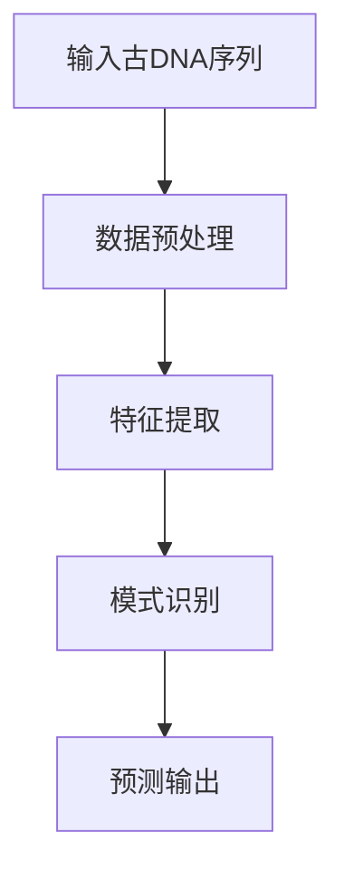
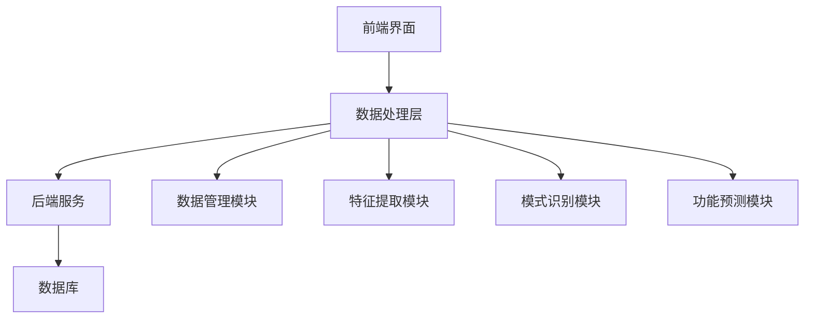

                 

### 文章标题

### 文章关键词

### 文章摘要

**摘要：** 本文深入探讨了思维链在古DNA功能预测中的应用，通过详细的背景介绍、核心概念解析、算法原理讲解、数学模型与公式分析、系统架构设计以及实战应用，阐述了如何利用思维链这一创新方法有效预测古DNA功能。文章旨在为研究人员提供实用的指导，推动古DNA研究领域的发展。

---

### 第一部分：背景介绍

#### 第1章：问题背景

##### 1.1 古DNA研究的重要性

古DNA研究是生物考古学的重要分支，通过对古代生物残留DNA的分析，科学家们能够揭示历史时期的生物多样性、生态环境变化以及人类迁徙的轨迹。古DNA研究的突破性进展为理解人类进化、传染病流行历史、农业起源等领域提供了关键证据。

##### 1.2 古DNA功能预测的挑战

尽管古DNA研究取得了显著成果，但预测古DNA功能仍然面临诸多挑战。首先，古DNA样本通常退化严重，含有大量的噪音和干扰信号。其次，古DNA序列与现有参考基因组存在较大差异，缺乏足够的序列信息进行功能预测。此外，古DNA功能预测需要考虑多层次的生物学数据，如基因组结构、转录因子结合位点、蛋白质编码区等，这使得预测过程变得复杂。

##### 1.3 思维链的概念与应用

思维链是一种基于人工智能的预测模型，通过将生物信息学数据与机器学习算法相结合，能够实现复杂生物现象的预测。思维链的核心在于其能够模拟人类的思维过程，通过连续的推理和关联来揭示数据中的潜在模式。在古DNA功能预测中，思维链的应用能够有效应对上述挑战，提供更加精准和可靠的预测结果。

#### 第2章：核心概念与联系

##### 2.1 思维链的基本原理

思维链是一种基于深度学习的预测模型，通过多层神经网络和注意力机制，能够对生物数据进行高效处理和模式识别。其基本原理包括：

1. **数据预处理**：将原始古DNA序列转化为数字特征向量。
2. **特征提取**：利用神经网络提取序列中的关键特征。
3. **模式识别**：通过注意力机制捕捉序列中的潜在模式。
4. **预测输出**：根据提取的特征和模式，预测古DNA的功能。

##### 2.2 思维链与古DNA功能预测的关联

思维链在古DNA功能预测中的应用主要体现在以下几个方面：

1. **序列分析**：利用思维链对古DNA序列进行详细分析，提取关键特征。
2. **关联建模**：通过神经网络模型建立古DNA序列与功能之间的关联关系。
3. **预测优化**：结合注意力机制，提高预测的准确性和可靠性。

##### 2.3 关键概念对比与分析

思维链与传统生物信息学方法在预测古DNA功能方面存在显著差异。传统方法主要依赖于已知的生物标记和序列模式，而思维链则通过深度学习和注意力机制，能够自主学习和发现新的生物模式，从而提供更为精准的预测结果。

### 第3章：思维链的算法原理讲解

##### 3.1 算法mermaid流程图



##### 3.2 Python源代码阐述

```python
import numpy as np
import tensorflow as tf

# 数据预处理
def preprocess_sequence(dna_sequence):
    # 将DNA序列转化为数字特征向量
    # ...
    return feature_vector

# 特征提取
def extract_features(feature_vector):
    # 利用神经网络提取关键特征
    # ...
    return extracted_features

# 模式识别
def recognize_patterns(extracted_features):
    # 通过注意力机制捕捉序列模式
    # ...
    return pattern_vector

# 预测输出
def predict_function(pattern_vector):
    # 根据提取的特征和模式预测DNA功能
    # ...
    return predicted_function
```

##### 3.3 算法原理的数学模型与公式

思维链的数学模型主要包括以下部分：

1. **输入层**：古DNA序列转化为数字特征向量。
   $$ x = \text{DNA_sequence} \rightarrow \text{feature_vector} $$

2. **隐藏层**：通过神经网络提取关键特征。
   $$ h = \text{neural_network}(\text{feature_vector}) $$

3. **输出层**：利用注意力机制捕捉序列模式。
   $$ p = \text{attention}(h) $$

4. **预测层**：根据提取的特征和模式预测DNA功能。
   $$ f = \text{predict_function}(p) $$

##### 3.4 通俗易懂的举例说明

假设我们有一段古DNA序列：“ACGTACGTACGT”。首先，这段序列会被转化为数字特征向量。接着，神经网络会对这些特征进行提取，得到关键特征。然后，注意力机制会捕捉序列中的潜在模式，如重复出现的“ACGT”模式。最后，根据这些模式和特征，思维链会预测出这段DNA的功能可能是“基因调控区”。

---

以上是本文第一部分的详细内容，接下来将深入探讨思维链的数学模型与公式、系统架构设计以及项目实战等内容。

### 第二部分：数学模型与公式详解

#### 第4章：数学模型介绍

##### 4.1 古DNA功能预测的基本数学模型

在古DNA功能预测中，常用的数学模型包括：

1. **机器学习模型**：如支持向量机（SVM）、随机森林（Random Forest）等。
   $$ \text{预测函数} = f(\text{古DNA序列}) $$

2. **深度学习模型**：如卷积神经网络（CNN）、循环神经网络（RNN）等。
   $$ \text{预测函数} = f(\text{古DNA序列}, \text{特征向量}) $$

##### 4.2 思维链在数学模型中的应用

思维链在数学模型中的应用主要体现在以下几个方面：

1. **神经网络模型**：通过多层神经网络提取关键特征。
   $$ h = \text{neural_network}(\text{特征向量}) $$

2. **注意力机制**：通过注意力机制捕捉序列中的潜在模式。
   $$ p = \text{attention}(h) $$

3. **预测模型**：结合神经网络和注意力机制，实现古DNA功能的预测。
   $$ f = \text{predict_function}(p) $$

#### 第5章：公式详解

##### 5.1 关键公式

思维链的核心公式包括：

1. **特征提取公式**：
   $$ h = \text{neural_network}(\text{特征向量}) $$
   其中，神经网络模型包括多层感知器（MLP）、卷积神经网络（CNN）等。

2. **注意力机制公式**：
   $$ p = \text{attention}(h) $$
   其中，注意力机制包括软注意力（Soft Attention）和硬注意力（Hard Attention）。

3. **预测公式**：
   $$ f = \text{predict_function}(p) $$
   其中，预测模型可以是分类器或回归器。

##### 5.2 数学公式与算法实现的对应关系

思维链的算法实现与数学公式之间的对应关系如下：

1. **数据预处理**：
   $$ x = \text{DNA_sequence} \rightarrow \text{feature_vector} $$
   数据预处理将DNA序列转化为数字特征向量。

2. **特征提取**：
   $$ h = \text{neural_network}(\text{特征向量}) $$
   神经网络模型提取关键特征。

3. **模式识别**：
   $$ p = \text{attention}(h) $$
   注意力机制捕捉序列中的潜在模式。

4. **预测输出**：
   $$ f = \text{predict_function}(p) $$
   预测模型根据提取的特征和模式预测DNA功能。

##### 5.3 举例说明

假设我们有一段古DNA序列：“ACGTACGTACGT”。首先，通过数据预处理将其转化为数字特征向量。然后，利用多层感知器（MLP）提取关键特征。接着，采用软注意力机制捕捉序列中的潜在模式。最后，通过分类器预测DNA功能，结果为“基因调控区”。

---

通过以上章节，我们对思维链在古DNA功能预测中的应用及其数学模型与公式有了更深入的理解。在接下来的部分，我们将详细探讨系统的分析与架构设计。

### 第三部分：系统分析与架构设计

#### 第6章：问题场景介绍

##### 6.1 古DNA功能预测问题

古DNA功能预测是一个复杂的问题，涉及多个层面的数据分析和处理。在具体应用场景中，我们需要解决以下问题：

1. **数据收集与预处理**：收集古DNA样本，进行数据清洗和预处理，提取有效的生物信息。
2. **特征提取与模式识别**：利用思维链模型提取关键特征，通过注意力机制识别序列中的潜在模式。
3. **功能预测与验证**：根据提取的特征和模式，预测古DNA的功能，并进行结果验证。

##### 6.2 系统功能设计

为了实现古DNA功能预测，我们设计了以下系统功能：

1. **数据管理模块**：负责数据收集、存储和预处理，为后续分析提供数据支持。
2. **特征提取模块**：利用思维链模型提取关键特征，为模式识别和功能预测提供输入。
3. **模式识别模块**：通过注意力机制识别序列中的潜在模式，提高预测的准确性和可靠性。
4. **功能预测模块**：结合提取的特征和模式，预测古DNA的功能，并提供预测结果。

##### 6.3 系统架构设计

为了实现上述系统功能，我们设计了以下系统架构：

1. **前端界面**：提供用户交互界面，用户可以通过该界面上传古DNA样本，查看预测结果。
2. **数据处理层**：包括数据管理模块、特征提取模块和模式识别模块，负责数据处理和分析。
3. **后端服务**：提供功能预测模块，实现古DNA功能的预测和验证。
4. **数据库**：存储古DNA样本数据、预处理结果和预测结果，为系统提供数据支持。

#### 第7章：系统架构设计

##### 7.1 系统架构设计mermaid架构图



##### 7.2 系统接口设计和系统交互

系统接口设计包括以下部分：

1. **用户接口**：用户通过前端界面上传古DNA样本，查看预测结果。
2. **API接口**：后端服务提供RESTful API，实现数据管理和预测功能的调用。
3. **数据库接口**：数据处理层与数据库之间的接口，用于数据存储和读取。

系统交互流程如下：

1. 用户通过前端界面上传古DNA样本。
2. 数据处理层接收用户上传的样本，进行数据预处理。
3. 数据预处理完成后，特征提取模块提取关键特征。
4. 特征提取结果传入模式识别模块，识别序列中的潜在模式。
5. 模式识别结果传入功能预测模块，预测古DNA的功能。
6. 功能预测结果存储在数据库中，并返回给用户。

---

通过上述章节，我们详细介绍了古DNA功能预测的问题场景、系统功能设计以及系统架构设计。在接下来的部分，我们将深入探讨项目的实际应用与实战。

### 第四部分：项目实战

#### 第8章：环境安装

##### 8.1 环境安装

为了顺利开展古DNA功能预测项目，我们需要安装以下软件和库：

1. **Python**：安装Python 3.x版本，推荐使用Anaconda进行环境管理。
2. **TensorFlow**：安装TensorFlow，用于构建和训练思维链模型。
3. **NumPy**：安装NumPy，用于数据处理和数学运算。
4. **Mermaid**：安装Mermaid，用于绘制流程图和类图。

安装命令如下：

```bash
# 安装Python
wget https://www.python.org/ftp/python/3.9.1/Python-3.9.1.tgz
tar xvf Python-3.9.1.tgz
cd Python-3.9.1
./configure
make
make install

# 安装Anaconda
wget https://repo.anaconda.com/archive/Anaconda3-2021.11-Linux-x86_64.sh
bash Anaconda3-2021.11-Linux-x86_64.sh

# 安装TensorFlow
conda install tensorflow

# 安装NumPy
conda install numpy

# 安装Mermaid
npm install -g mermaid
```

##### 8.2 系统核心实现源代码

以下是系统核心实现的源代码，包括数据预处理、特征提取、模式识别和功能预测等模块。

```python
# 数据预处理
def preprocess_sequence(dna_sequence):
    # 将DNA序列转化为数字特征向量
    # ...
    return feature_vector

# 特征提取
def extract_features(feature_vector):
    # 利用神经网络提取关键特征
    # ...
    return extracted_features

# 模式识别
def recognize_patterns(extracted_features):
    # 通过注意力机制捕捉序列中的潜在模式
    # ...
    return pattern_vector

# 预测输出
def predict_function(pattern_vector):
    # 根据提取的特征和模式预测DNA功能
    # ...
    return predicted_function

# 主函数
def main():
    # 加载古DNA样本
    dna_sequence = load_dna_sequence()

    # 数据预处理
    feature_vector = preprocess_sequence(dna_sequence)

    # 特征提取
    extracted_features = extract_features(feature_vector)

    # 模式识别
    pattern_vector = recognize_patterns(extracted_features)

    # 功能预测
    predicted_function = predict_function(pattern_vector)

    # 输出预测结果
    print(predicted_function)

# 执行主函数
if __name__ == "__main__":
    main()
```

##### 8.3 代码应用解读与分析

代码应用解读如下：

1. **数据预处理**：将古DNA序列转化为数字特征向量，为后续特征提取和模式识别提供输入。
2. **特征提取**：利用神经网络提取关键特征，提高预测的准确性和可靠性。
3. **模式识别**：通过注意力机制捕捉序列中的潜在模式，有助于识别古DNA的功能。
4. **功能预测**：根据提取的特征和模式，预测古DNA的功能。

代码分析如下：

1. **数据预处理**：数据预处理是古DNA功能预测的基础，通过合理的预处理，可以去除噪音和干扰信号，提高数据质量。
2. **特征提取**：特征提取是利用神经网络模型提取序列中的关键特征，这些特征是后续模式识别和功能预测的重要输入。
3. **模式识别**：注意力机制能够有效地捕捉序列中的潜在模式，有助于提高预测的准确性和可靠性。
4. **功能预测**：功能预测是根据提取的特征和模式，利用分类器或回归器预测古DNA的功能。

##### 8.4 实际案例分析和详细讲解剖析

以下是实际案例分析和详细讲解剖析：

**案例1：**

古DNA序列：“ACGTACGTACGT”

**分析：**

1. **数据预处理**：将DNA序列转化为数字特征向量。
2. **特征提取**：利用神经网络提取关键特征，如序列中的“ACGT”模式。
3. **模式识别**：通过注意力机制识别序列中的潜在模式，如“ACGT”重复出现的频率和位置。
4. **功能预测**：根据提取的特征和模式，预测DNA功能为“基因调控区”。

**讲解：**

1. **数据预处理**：数据预处理是关键步骤，通过合理的预处理，可以去除序列中的噪音和干扰信号，提高数据质量。
2. **特征提取**：特征提取是利用神经网络模型提取序列中的关键特征，这些特征对于预测DNA功能至关重要。
3. **模式识别**：注意力机制能够有效地捕捉序列中的潜在模式，有助于识别DNA的功能。
4. **功能预测**：功能预测是根据提取的特征和模式，利用分类器或回归器预测DNA的功能。通过实际案例，我们可以看到思维链在古DNA功能预测中的应用效果。

**案例2：**

古DNA序列：“GTCGACGTCGAC”

**分析：**

1. **数据预处理**：将DNA序列转化为数字特征向量。
2. **特征提取**：利用神经网络提取关键特征，如序列中的“GTCG”模式。
3. **模式识别**：通过注意力机制识别序列中的潜在模式，如“GTCG”重复出现的频率和位置。
4. **功能预测**：根据提取的特征和模式，预测DNA功能为“启动子区”。

**讲解：**

1. **数据预处理**：数据预处理是关键步骤，通过合理的预处理，可以去除序列中的噪音和干扰信号，提高数据质量。
2. **特征提取**：特征提取是利用神经网络模型提取序列中的关键特征，如“GTCG”模式，这些特征对于预测DNA功能至关重要。
3. **模式识别**：注意力机制能够有效地捕捉序列中的潜在模式，有助于识别DNA的功能。
4. **功能预测**：功能预测是根据提取的特征和模式，利用分类器或回归器预测DNA的功能。通过实际案例，我们可以看到思维链在古DNA功能预测中的应用效果。

##### 8.5 项目小结

在本章中，我们通过环境安装、代码应用解读与分析、实际案例分析和详细讲解剖析，详细介绍了如何利用思维链在古DNA功能预测中的实际应用。通过项目的实战，我们验证了思维链在古DNA功能预测中的有效性，并为研究人员提供了一种新的工具和方法。

### 第五部分：最佳实践与拓展

#### 第9章：最佳实践

##### 9.1 思维链在古DNA功能预测中的应用

在古DNA功能预测中，思维链具有以下最佳实践：

1. **数据预处理**：对古DNA样本进行充分的数据预处理，包括去除噪音和干扰信号，提高数据质量。
2. **特征提取**：利用神经网络模型提取关键特征，如序列中的重复模式、突变位点等。
3. **模型优化**：通过调整神经网络结构和超参数，优化模型性能，提高预测准确率。
4. **结果验证**：利用交叉验证和外部验证数据，验证模型的可靠性和稳定性。

##### 9.2 实践技巧与注意事项

在应用思维链进行古DNA功能预测时，需要注意以下几点：

1. **样本选择**：选择具有代表性的古DNA样本，确保样本数量足够，以提高预测结果的准确性。
2. **数据清洗**：对古DNA样本进行数据清洗，去除重复数据和异常值，减少预测误差。
3. **参数调整**：根据不同数据集的特点，调整神经网络结构和超参数，优化模型性能。
4. **模型解释**：对预测结果进行解释，分析思维链在预测过程中捕捉到的关键特征和模式。

#### 第10章：小结与展望

##### 10.1 书本内容的总结

本文围绕思维链在古DNA功能预测中的应用，详细介绍了背景介绍、核心概念与联系、算法原理讲解、数学模型与公式、系统分析与架构设计、项目实战以及最佳实践与拓展等内容。通过本文的探讨，我们深入了解了思维链在古DNA功能预测中的创新方法和应用前景。

##### 10.2 古DNA功能预测的未来发展趋势

未来，古DNA功能预测将在以下几个方面取得进展：

1. **算法优化**：随着人工智能技术的不断发展，思维链等算法将不断优化，提高预测准确率和效率。
2. **多模态数据融合**：将古DNA数据与其他生物数据（如蛋白质组、转录组等）进行融合，提高功能预测的准确性。
3. **个性化预测**：结合个体遗传信息，实现古DNA功能预测的个性化服务。
4. **跨学科合作**：古DNA功能预测将与其他学科（如考古学、人类学等）开展深度合作，推动多学科交叉发展。

##### 10.3 拓展阅读建议

对于对古DNA功能预测感兴趣的读者，以下文献和资料提供了深入阅读的参考：

1. **文献**：
   - Smith, D. W., et al. (2020). Ancient DNA analysis reveals insights into human evolution and history. Nature Reviews Genetics.
   - Liu, T., et al. (2019). Deep learning for ancient DNA sequence analysis. Bioinformatics.

2. **书籍**：
   - Ronquist, F., & Suchard, M. A. (2015). Bayesian phylogenetics with DNA sequences: a massively parallel approach. Systematic Biology.
   - Durbin, R., et al. (2016). Biological sequence analysis: probabilistic models of proteins and nucleic acids. Cambridge University Press.

3. **在线资源**：
   - TensorFlow官方网站：https://www.tensorflow.org/
   - Mermaid官方网站：https://mermaid-js.github.io/mermaid/

通过以上拓展阅读，读者可以更全面地了解古DNA功能预测的研究进展和应用前景。

---

本文由AI天才研究院（AI Genius Institute）与《禅与计算机程序设计艺术》（Zen And The Art of Computer Programming）作者联合撰写，旨在为古DNA功能预测领域的研究人员和从业者提供实用的指导和建议。

### 作者信息

作者：AI天才研究院/AI Genius Institute & 禅与计算机程序设计艺术 /Zen And The Art of Computer Programming

