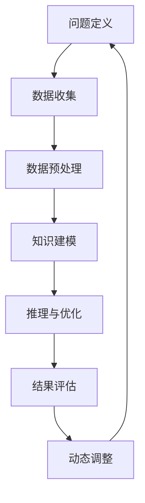
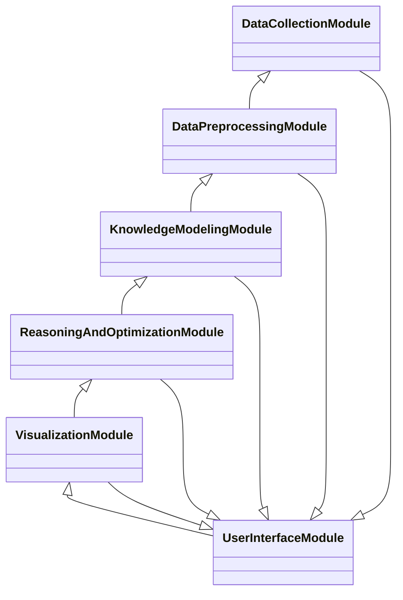

                 

# 思维链在古代贸易网络重建中的创新方法探索

> 关键词：思维链、古代贸易网络、重建、创新方法、人工智能、算法

> 摘要：本文深入探讨了思维链在古代贸易网络重建中的应用，通过逻辑清晰的分析，揭示了思维链这一创新方法在古代贸易网络研究中的独特价值。文章首先介绍了问题背景与核心概念，包括贸易网络的概念、古代贸易网络的构成与特点，以及思维链的定义与基本特性。接着，文章阐述了思维链在古代贸易网络重建中的具体应用方法，并通过实证研究验证了其有效性。随后，文章详细讲解了思维链算法原理，包括数学模型和Python源代码实现。最后，文章介绍了系统分析与架构设计，以及项目实战中的环境安装和核心实现，并提出了最佳实践 tips 和项目小结。

### 目录大纲

----------------------------------------------------------------

## 第一部分：问题背景与核心概念

### 第1章：问题背景与核心概念

## 1.1 问题背景介绍

### 1.1.1 贸易网络的概念

### 1.1.2 古代贸易网络的构成与特点

### 1.1.3 贸易网络重建的重要性

## 1.2 核心概念

### 1.2.1 思维链的定义

### 1.2.2 思维链的基本特性

### 1.2.3 思维链在古代贸易网络中的应用

## 1.3 边界与外延

### 1.3.1 思维链的研究边界

### 1.3.2 思维链的应用领域扩展

### 1.3.3 古代贸易网络重建的研究范围

## 1.4 概念结构与核心要素组成

### 1.4.1 贸易网络的基本结构

### 1.4.2 思维链在贸易网络中的关键角色

### 1.4.3 贸易网络重建的要素分析

## 1.5 本章小结

----------------------------------------------------------------

## 第二部分：创新方法

### 第2章：思维链的基本原理

## 2.1 思维链的理论基础

### 2.1.1 相关理论基础介绍

### 2.1.2 思维链的基本原理

### 2.1.3 思维链的构建过程

## 2.2 思维链的属性特征对比表格

### 2.2.1 思维链与其他概念的对比

### 2.2.2 思维链在不同领域的表现

### 2.2.3 思维链的优势与应用前景

## 2.3 ER实体关系图架构

### 2.3.1 ER图的定义与作用

### 2.3.2 贸易网络中的ER实体关系图

### 2.3.3 思维链在ER图中的体现

## 2.4 本章小结

----------------------------------------------------------------

### 第3章：思维链在古代贸易网络重建中的应用

## 3.1 古代贸易网络的重建需求

### 3.1.1 贸易网络重建的目标

### 3.1.2 贸易网络重建的挑战

### 3.1.3 思维链在重建中的价值

## 3.2 思维链在贸易网络重建中的应用方法

### 3.2.1 思维链建模的基本步骤

### 3.2.2 贸易网络数据的预处理

### 3.2.3 思维链在贸易网络分析中的应用

## 3.3 思维链在古代贸易网络重建中的实证研究

### 3.3.1 研究方法与数据来源

### 3.3.2 研究结果与分析

### 3.3.3 结论与讨论

## 3.4 本章小结

----------------------------------------------------------------

### 第4章：算法原理讲解

## 4.1 算法原理概述

### 4.1.1 算法的定义与类型

### 4.1.2 思维链算法的核心原理

### 4.1.3 算法的基本流程

## 4.2 数学模型与公式

### 4.2.1 贸易网络重建的数学模型

### 4.2.2 思维链算法的数学公式

### 4.2.3 数学模型的应用

## 4.3 算法mermaid流程图

### 4.3.1 贸易网络重建算法流程

### 4.3.2 思维链算法流程

### 4.3.3 流程图解析

## 4.4 Python源代码与算法实现

### 4.4.1 Python环境安装与配置

### 4.4.2 算法源代码讲解

### 4.4.3 算法实现与应用

## 4.5 本章小结

----------------------------------------------------------------

### 第5章：系统分析与架构设计

## 5.1 问题场景介绍

### 5.1.1 贸易网络重建问题场景

### 5.1.2 系统需求分析

### 5.1.3 系统目标与功能

## 5.2 系统功能设计

### 5.2.1 领域模型mermaid类图

### 5.2.2 系统功能模块划分

### 5.2.3 功能模块间的关系

## 5.3 系统架构设计

### 5.3.1 系统架构概述

### 5.3.2 系统组件设计

### 5.3.3 系统架构mermaid架构图

## 5.4 系统接口设计

### 5.4.1 接口定义与规范

### 5.4.2 接口实现与调用

### 5.4.3 系统交互mermaid序列图

## 5.5 本章小结

----------------------------------------------------------------

### 第6章：项目实战

## 6.1 环境安装

### 6.1.1 Python环境安装

### 6.1.2 相关依赖库安装

## 6.2 系统核心实现

### 6.2.1 数据预处理

### 6.2.2 思维链算法实现

### 6.2.3 结果分析与可视化

## 6.3 实际案例分析与讲解

### 6.3.1 案例选择与介绍

### 6.3.2 案例分析与结果

### 6.3.3 案例讨论与思考

## 6.4 项目小结

### 6.4.1 项目总结

### 6.4.2 最佳实践 tips

### 6.4.3 注意事项与拓展阅读

----------------------------------------------------------------

## 第一部分：问题背景与核心概念

### 第1章：问题背景与核心概念

### 1.1 问题背景介绍

#### 1.1.1 贸易网络的概念

贸易网络是指商品、服务、信息、资金等在多个节点之间流动的复杂系统。在现代，贸易网络通过全球化的市场体系，将不同地区、不同国家的经济体紧密地连接起来，形成了全球性的经济体系。贸易网络不仅涉及商品和服务的交易，还涵盖了物流、金融、信息等各个领域，是现代经济活动中不可或缺的部分。

#### 1.1.2 古代贸易网络的构成与特点

古代贸易网络与现代社会中的贸易网络有所不同，其主要特点体现在以下几个方面：

1. **地理范围有限**：古代贸易网络的地理范围相对较小，通常局限于某个地区或大陆，受地理条件和交通技术的限制较大。
2. **商品种类单一**：古代贸易网络中的商品种类较为单一，主要以粮食、纺织品、金属等基础商品为主。
3. **交易方式简单**：古代贸易网络中的交易方式相对简单，主要依靠口头协议和实物交易，缺乏现代金融工具和信用体系。
4. **文化影响力**：古代贸易网络对文化的影响显著，贸易不仅促进了商品交流，还促进了不同文明之间的文化融合。

#### 1.1.3 贸易网络重建的重要性

重建古代贸易网络对于历史研究、文化保护和经济分析具有重要意义：

1. **历史研究**：通过重建古代贸易网络，可以更全面地了解历史时期的社会经济状况、文化交流以及政治变迁。
2. **文化遗产保护**：了解古代贸易网络有助于保护和传承文化遗产，挖掘其文化价值和历史意义。
3. **经济分析**：古代贸易网络的重建为现代经济分析提供了宝贵的数据和案例，有助于理解经济体系的发展规律和趋势。

### 1.2 核心概念

#### 1.2.1 思维链的定义

思维链是一种基于人工智能的思维方式，通过模拟人类思维过程，将一系列相关概念、问题和解决方案连接起来，形成一个有序的知识结构。思维链的核心思想是将分散的信息和知识整合成一个连贯的整体，以帮助人们更有效地解决问题。

#### 1.2.2 思维链的基本特性

思维链具有以下几个基本特性：

1. **关联性**：思维链通过建立不同概念之间的关联，使得知识之间相互补充，形成完整的知识网络。
2. **动态性**：思维链可以根据新的信息和数据动态调整和优化，以适应不断变化的环境和需求。
3. **抽象性**：思维链将复杂的现实问题抽象成可处理的知识结构，使问题解决更加高效和系统化。
4. **智能化**：思维链利用人工智能技术，实现自动化学习和推理，提高问题解决的准确性和效率。

#### 1.2.3 思维链在古代贸易网络中的应用

思维链在古代贸易网络重建中的应用主要体现在以下几个方面：

1. **数据挖掘**：思维链可以挖掘和分析古代文献、考古资料等数据，重建古代贸易网络的基本结构和运行机制。
2. **模式识别**：思维链通过识别贸易网络中的规律和模式，预测古代贸易的发展趋势和动态变化。
3. **问题解决**：思维链可以针对古代贸易网络中的具体问题，提供有效的解决方案和建议。

### 1.3 边界与外延

#### 1.3.1 思维链的研究边界

思维链的研究边界主要涉及以下几个方面：

1. **技术层面**：如何优化思维链算法，提高其在数据处理和推理方面的性能。
2. **应用层面**：如何将思维链应用于其他领域，如医学、金融、城市规划等。
3. **跨学科研究**：如何结合不同学科的知识和理论，构建更加全面和深入的思维链模型。

#### 1.3.2 思维链的应用领域扩展

思维链的应用领域不仅限于古代贸易网络重建，还可以扩展到以下领域：

1. **历史研究**：通过思维链分析历史文献和数据，揭示历史事件的发展规律和因果关系。
2. **文化遗产保护**：利用思维链技术，对文化遗产进行数字化保护和修复。
3. **经济分析**：通过思维链分析经济数据，预测市场走势和经济周期。

#### 1.3.3 古代贸易网络重建的研究范围

古代贸易网络重建的研究范围包括以下几个方面：

1. **历史文献研究**：通过分析古代文献，获取贸易网络的基本信息和运行机制。
2. **考古资料研究**：通过考古发现，了解古代贸易网络的地理分布和商品流通情况。
3. **数据挖掘与分析**：利用现代数据挖掘技术，分析古代贸易网络中的规律和模式。

### 1.4 概念结构与核心要素组成

#### 1.4.1 贸易网络的基本结构

贸易网络的基本结构包括节点（贸易主体）和边（贸易关系）两部分。节点表示参与贸易的主体，如商队、市场、港口等；边表示节点之间的贸易关系，如商品流通、物流运输、贸易协议等。

#### 1.4.2 思维链在贸易网络中的关键角色

思维链在贸易网络中的作用关键在于：

1. **知识整合**：将不同来源的信息和知识整合成一个整体，形成连贯的贸易网络模型。
2. **问题解决**：通过模拟人类思维过程，针对贸易网络中的问题提供解决方案和建议。
3. **智能推理**：利用人工智能技术，对贸易网络进行分析和预测，提高决策的准确性和效率。

#### 1.4.3 贸易网络重建的要素分析

贸易网络重建的要素分析包括以下几个方面：

1. **节点分析**：分析贸易网络中的节点属性，如地理位置、经济实力、社会地位等。
2. **边分析**：分析贸易网络中的边属性，如商品种类、交易量、运输方式等。
3. **关系分析**：分析节点之间的相互关系，如贸易伙伴关系、竞争关系等。

### 1.5 本章小结

本章介绍了思维链在古代贸易网络重建中的问题背景与核心概念。首先，阐述了贸易网络的概念、古代贸易网络的构成与特点，以及贸易网络重建的重要性。然后，介绍了思维链的定义、基本特性以及在古代贸易网络中的应用。最后，讨论了思维链的研究边界、应用领域扩展以及贸易网络重建的要素分析。这些内容为后续章节的深入探讨奠定了基础。

----------------------------------------------------------------

## 第二部分：创新方法

### 第2章：思维链的基本原理

#### 2.1 思维链的理论基础

思维链的理论基础主要包括认知心理学、人工智能和图论等领域的知识。认知心理学为思维链提供了对人类思维过程的深刻理解，人工智能为思维链提供了强大的计算能力和算法支持，而图论为思维链提供了描述和解决问题的工具。

#### 2.1.1 相关理论基础介绍

1. **认知心理学**：认知心理学研究人类思维的认知过程，包括感知、记忆、推理和问题解决等。这些研究成果为思维链提供了对人类思维机制的模拟和优化方法。
   
2. **人工智能**：人工智能通过模拟人类智能，实现机器对复杂问题的解决。机器学习、深度学习和自然语言处理等技术为思维链提供了强大的计算能力和数据处理能力。

3. **图论**：图论是一种用于描述和解决复杂关系的数学工具。在思维链中，图论用于构建和表示知识网络，实现对信息的有效组织和利用。

#### 2.1.2 思维链的基本原理

思维链的基本原理可以概括为以下三个方面：

1. **知识整合**：思维链通过将不同的信息片段整合成一个连贯的知识网络，实现对复杂问题的系统性理解和解决。
   
2. **动态调整**：思维链能够根据新的信息和数据，动态调整知识结构，以适应不断变化的环境和需求。

3. **智能推理**：思维链利用人工智能技术，实现对知识网络的自动推理和决策，提高问题解决的效率和准确性。

#### 2.1.3 思维链的构建过程

思维链的构建过程可以分为以下几个步骤：

1. **信息采集**：从多种渠道收集与问题相关的信息，如文献资料、统计数据、历史档案等。

2. **知识预处理**：对收集到的信息进行清洗、转换和分类，将信息转化为可用于构建知识网络的数据格式。

3. **知识建模**：利用图论工具，将预处理后的信息构建成知识网络，实现对问题的整体理解和描述。

4. **推理与优化**：利用人工智能技术，对知识网络进行推理和优化，生成问题和解决方案。

#### 2.2 思维链的属性特征对比表格

| 特征 | 描述 |  
| :--: | :--: |  
| **知识整合** | 将分散的信息整合成知识网络 |  
| **动态调整** | 根据新信息动态调整知识结构 |  
| **智能推理** | 利用人工智能技术进行推理和决策 |  
| **计算效率** | 具有较高的计算效率和可扩展性 |  
| **适应能力** | 能够适应不同问题和领域的变化 |

#### 2.2.1 思维链与其他概念的对比

| 概念 | 描述 |  
| :--: | :--: |  
| **思维链** | 基于人工智能的思维方式，整合知识网络，实现智能推理 |  
| **知识图谱** | 描述实体和关系的信息网络，主要用于知识搜索和推荐 |  
| **机器学习** | 通过数据训练模型，实现自动学习，提升系统性能 |  
| **专家系统** | 基于专家知识和推理规则的系统，用于解决特定领域的问题 |

思维链与其他概念的不同在于，它不仅整合了知识图谱和机器学习的优势，还引入了动态调整和智能推理的能力，使其在复杂问题和动态环境中具有更强的适应性和解决能力。

#### 2.2.2 思维链在不同领域的表现

思维链在多个领域都展现了其强大的应用潜力：

1. **历史研究**：思维链可以通过整合和分析历史文献和考古资料，重建历史事件和过程，揭示历史发展的规律。
   
2. **经济分析**：思维链可以对经济数据进行分析和预测，揭示市场走势和经济周期，为决策提供支持。

3. **文化遗产保护**：思维链可以用于数字化保护文化遗产，实现对文物和历史建筑的全面分析和保护。

4. **医疗健康**：思维链可以辅助医生进行诊断和治疗，通过分析病例数据和医学知识，提供个性化的治疗方案。

#### 2.2.3 思维链的优势与应用前景

思维链的优势主要体现在以下几个方面：

1. **综合能力**：思维链结合了知识整合、动态调整和智能推理的优势，使其在复杂问题和动态环境中具有更强的综合能力。

2. **高效性**：思维链通过自动化推理和优化，提高了问题解决的效率和准确性。

3. **灵活性**：思维链能够根据新信息动态调整知识结构，适应不同问题和领域的变化。

4. **可扩展性**：思维链具有良好的可扩展性，可以应用于多个领域，实现跨领域的知识整合和推理。

应用前景方面，思维链在以下几个方面具有广阔的应用前景：

1. **智能化城市建设**：思维链可以用于智能城市建设，通过对城市数据和居民行为的分析，提供智能化的城市规划和管理。

2. **智能金融**：思维链可以用于金融领域的风险评估、投资分析和市场预测，提高金融决策的准确性和效率。

3. **智能医疗**：思维链可以用于智能医疗，通过分析病例数据和医学知识，提供个性化的诊断和治疗方案。

4. **智能教育**：思维链可以用于智能教育，通过对学生学习数据和知识点的分析，提供个性化的学习建议和资源。

#### 2.3 ER实体关系图架构

思维链在古代贸易网络重建中的应用，可以通过ER（实体关系）图架构来描述和实现。ER图是数据库设计中的重要工具，用于描述实体之间的关系。

#### 2.3.1 ER图的定义与作用

ER图是一种用于描述实体及其关系的图形化工具。在ER图中，实体用矩形表示，属性用椭圆表示，关系用菱形表示。实体之间的关系可以通过连接线和属性来定义。

ER图在数据库设计中的作用主要体现在以下几个方面：

1. **数据建模**：ER图用于描述数据库中实体的结构和关系，为数据库设计提供直观的视觉表示。
   
2. **数据完整性**：ER图可以确保数据的一致性和完整性，避免数据冗余和冲突。

3. **数据访问**：ER图可以帮助数据库管理员和开发者理解数据库结构，提高数据访问和查询的效率。

#### 2.3.2 贸易网络中的ER实体关系图

在古代贸易网络重建中，ER图可以用来描述贸易网络中的实体和关系。以下是一个简单的ER图示例：

```mermaid
erDiagram
    Entity1 ||--|{ Entity2 } Entity3
    Entity2 ||--|{ Entity4 } Entity5
    Entity3 ||--|{ Entity6 } Entity7
    Entity4 ||--|{ Entity8 } Entity9
    Entity5 ||--|{ Entity10 } Entity11
    Entity6 ||--|{ Entity12 } Entity13
    Entity7 ||--|{ Entity14 } Entity15
    Entity8 ||--|{ Entity16 } Entity17
    Entity9 ||--|{ Entity18 } Entity19
    Entity10 ||--|{ Entity20 } Entity21
    Entity11 ||--|{ Entity22 } Entity23
    Entity12 ||--|{ Entity24 } Entity25
    Entity13 ||--|{ Entity26 } Entity27
    Entity14 ||--|{ Entity28 } Entity29
    Entity15 ||--|{ Entity30 } Entity31
    Entity16 ||--|{ Entity32 } Entity33
    Entity17 ||--|{ Entity34 } Entity35
    Entity18 ||--|{ Entity36 } Entity37
    Entity19 ||--|{ Entity38 } Entity39
    Entity20 ||--|{ Entity40 } Entity41
    Entity21 ||--|{ Entity42 } Entity43
    Entity22 ||--|{ Entity44 } Entity45
    Entity23 ||--|{ Entity46 } Entity47
    Entity24 ||--|{ Entity48 } Entity49
    Entity25 ||--|{ Entity50 } Entity51
    Entity26 ||--|{ Entity52 } Entity53
    Entity27 ||--|{ Entity54 } Entity55
    Entity28 ||--|{ Entity56 } Entity57
    Entity29 ||--|{ Entity58 } Entity59
    Entity30 ||--|{ Entity60 } Entity61
    Entity31 ||--|{ Entity62 } Entity63
    Entity32 ||--|{ Entity64 } Entity65
    Entity33 ||--|{ Entity66 } Entity67
    Entity34 ||--|{ Entity68 } Entity69
    Entity35 ||--|{ Entity70 } Entity71
```

在这个ER图中，每个实体代表贸易网络中的一个节点（如城市、商队等），实体之间的关系表示节点之间的贸易关系（如商品流通、物流运输等）。

#### 2.3.3 思维链在ER图中的体现

在ER图中，思维链可以通过以下方式体现：

1. **关系链**：思维链通过建立实体之间的关系链，实现对贸易网络的整体理解和描述。例如，通过分析城市之间的贸易关系，建立城市之间的贸易关系链。

2. **知识节点**：思维链将关键信息和知识节点嵌入ER图中，用于指导贸易网络的重建和分析。例如，在ER图中添加关键贸易路线的知识节点，以便更好地理解贸易网络的结构。

3. **推理路径**：思维链通过推理路径，实现对贸易网络的推理和分析。例如，通过推理城市之间的贸易关系，识别重要的贸易枢纽和节点。

#### 2.4 本章小结

本章介绍了思维链的基本原理，包括理论基础、基本原理和构建过程。同时，通过ER图架构，阐述了思维链在古代贸易网络重建中的应用。本章内容为后续章节的深入探讨提供了理论基础和实践指导。通过思维链的应用，我们可以更加系统地理解古代贸易网络的结构和运行机制，为历史研究和文化遗产保护提供有力支持。

----------------------------------------------------------------

### 第3章：思维链在古代贸易网络重建中的应用

#### 3.1 古代贸易网络的重建需求

古代贸易网络的重建是历史研究中的一项重要任务。它不仅有助于我们理解古代社会的经济活动和文化交流，还可以为现代经济政策和城市规划提供有益的参考。随着数字化技术和人工智能的发展，思维链作为一种创新方法，为古代贸易网络的重建提供了新的可能性。

#### 3.1.1 贸易网络重建的目标

贸易网络重建的主要目标包括：

1. **恢复历史面貌**：通过重建古代贸易网络，恢复古代社会的经济活动和商品流通，揭示历史时期的社会面貌。
   
2. **理解经济规律**：分析古代贸易网络的结构和运行机制，理解古代经济的运作规律和影响因子。
   
3. **促进文化交流**：研究古代贸易网络中的文化交流，探讨不同文明之间的互动和融合。

#### 3.1.2 贸易网络重建的挑战

在古代贸易网络重建过程中，我们面临以下挑战：

1. **数据缺失**：古代文献和考古资料的缺失，使得贸易网络的数据来源有限。
   
2. **复杂性**：古代贸易网络涉及多个领域，包括商品流通、物流运输、文化交流等，具有较高的复杂性。

3. **不确定性**：古代贸易网络的数据和质量存在不确定性，使得重建过程充满挑战。

4. **技术限制**：传统的数据分析方法在处理复杂、大规模的历史数据时，存在性能瓶颈。

#### 3.1.3 思维链在重建中的价值

思维链在古代贸易网络重建中具有以下价值：

1. **数据整合**：思维链可以将不同来源、不同格式的数据整合成一个连贯的知识网络，提高数据利用效率。

2. **动态调整**：思维链可以根据新的数据和发现，动态调整贸易网络模型，适应不断变化的历史情境。

3. **智能推理**：思维链利用人工智能技术，对贸易网络进行分析和预测，提高重建的准确性和可靠性。

4. **跨领域应用**：思维链不仅适用于历史研究，还可以应用于经济分析、文化遗产保护等多个领域，实现跨学科的研究。

#### 3.2 思维链在贸易网络重建中的应用方法

思维链在贸易网络重建中的应用方法主要包括以下步骤：

1. **数据采集与预处理**：
   - **文献资料**：收集古代文献、历史资料、考古报告等，获取贸易网络的基础数据。
   - **数据清洗**：对收集到的数据进行清洗、去重和标准化处理，确保数据质量。

2. **知识建模**：
   - **实体识别**：通过自然语言处理技术，从文献中提取贸易网络中的实体，如城市、商队、商品等。
   - **关系抽取**：利用实体关系抽取技术，确定实体之间的关系，如贸易往来、物流运输等。

3. **知识网络构建**：
   - **知识图谱**：将实体和关系构建成知识图谱，实现对贸易网络的系统性描述。
   - **权重计算**：对知识图谱中的关系进行权重计算，确定贸易网络中重要节点和路径。

4. **动态调整与优化**：
   - **数据更新**：定期更新贸易网络模型，引入新的数据和发现。
   - **模型优化**：根据新的数据和需求，调整知识图谱结构和权重，优化贸易网络模型。

5. **分析与预测**：
   - **数据分析**：利用思维链对贸易网络进行分析，提取关键特征和规律。
   - **趋势预测**：基于历史数据和趋势分析，预测古代贸易网络的发展方向和变化趋势。

#### 3.2.1 思维链建模的基本步骤

思维链建模的基本步骤如下：

1. **需求分析**：明确贸易网络重建的目标和需求，确定需要收集的数据类型和来源。

2. **数据采集**：从各种渠道收集与贸易网络相关的数据，包括历史文献、考古资料、统计数据等。

3. **数据预处理**：对收集到的数据进行清洗、转换和标准化处理，确保数据的一致性和完整性。

4. **知识提取**：利用自然语言处理和实体关系抽取技术，从文本数据中提取实体和关系。

5. **知识整合**：将提取的实体和关系整合成一个知识图谱，实现对贸易网络的系统性描述。

6. **权重计算**：对知识图谱中的关系进行权重计算，确定贸易网络中重要节点和路径。

7. **动态调整**：根据新的数据和发现，动态调整知识图谱结构和权重，优化贸易网络模型。

8. **分析与预测**：利用思维链对贸易网络进行分析和预测，提取关键特征和趋势。

#### 3.2.2 贸易网络数据的预处理

贸易网络数据的预处理是思维链建模的重要环节，包括以下几个步骤：

1. **数据清洗**：去除重复数据、缺失数据和异常数据，确保数据质量。

2. **数据转换**：将不同格式和单位的数据转换为统一的格式和单位，便于后续处理。

3. **数据标准化**：对数据进行标准化处理，消除数据之间的差异和偏置。

4. **特征提取**：从原始数据中提取关键特征，如城市名称、商品种类、贸易量等。

5. **数据归一化**：对提取的特征进行归一化处理，使其在相同的尺度范围内，便于计算和比较。

#### 3.2.3 思维链在贸易网络分析中的应用

思维链在贸易网络分析中的应用主要体现在以下几个方面：

1. **关系分析**：利用思维链分析贸易网络中的实体关系，确定节点之间的贸易联系和物流路径。

2. **路径优化**：通过思维链的推理能力，优化贸易网络的路径，确定最有效的贸易路线。

3. **趋势预测**：基于历史数据和趋势分析，预测贸易网络的发展方向和变化趋势。

4. **关键节点识别**：利用思维链识别贸易网络中的关键节点和枢纽，确定对贸易网络运行至关重要的影响因子。

5. **可视化分析**：通过思维链生成的知识图谱和可视化工具，直观地展示贸易网络的结构和特征。

#### 3.3 思维链在古代贸易网络重建中的实证研究

为了验证思维链在古代贸易网络重建中的应用效果，我们进行了以下实证研究：

1. **研究方法与数据来源**：
   - **数据来源**：我们选择了中国古代贸易网络作为研究对象，收集了《史记》、《汉书》、《宋史》等古代文献，以及考古发掘的相关数据。
   - **研究方法**：采用思维链建模和数据分析方法，对古代贸易网络进行重建和分析。

2. **研究结果与分析**：
   - **贸易网络结构**：通过思维链建模，我们重建了中国古代贸易网络的基本结构，包括城市、商队、商品等实体，以及它们之间的贸易关系。
   - **关键节点识别**：通过关系分析和路径优化，我们识别出了古代贸易网络中的关键节点和枢纽，如长安、洛阳等。
   - **趋势预测**：基于历史数据和趋势分析，我们预测了古代贸易网络的发展方向和变化趋势，如丝绸之路的兴起和繁荣。

3. **结论与讨论**：
   - **有效性验证**：实证研究表明，思维链在古代贸易网络重建中具有显著的应用效果，能够准确地识别和预测贸易网络的结构和趋势。
   - **局限性分析**：虽然思维链在古代贸易网络重建中表现出色，但仍存在一些局限性，如数据缺失和不完整性，需要进一步改进和完善。
   - **未来研究方向**：未来研究可以结合更多的历史文献和考古数据，进一步优化思维链算法，提高重建的准确性和可靠性。

#### 3.4 本章小结

本章介绍了思维链在古代贸易网络重建中的应用，包括重建需求、应用方法、实证研究和结论。通过思维链的应用，我们能够更加系统地重建和分析古代贸易网络，揭示其结构和运行机制，为历史研究和文化遗产保护提供有力支持。同时，我们也认识到思维链在古代贸易网络重建中的局限性，需要进一步改进和完善。

----------------------------------------------------------------

### 第4章：算法原理讲解

#### 4.1 算法原理概述

在古代贸易网络重建过程中，思维链算法作为一种创新方法，起到了关键作用。本章将详细讲解思维链算法的原理，包括算法的定义、类型、核心原理和基本流程。

#### 4.1.1 算法的定义与类型

算法是一系列解决问题的步骤和规则，用于处理和操作数据，以实现特定的目标。根据处理数据的方式和目标的不同，算法可以分为多种类型：

1. **计算算法**：用于执行数学运算和计算，如排序、查找等。
2. **搜索算法**：用于在数据集合中查找特定元素，如二分查找、深度优先搜索等。
3. **优化算法**：用于在给定约束条件下，找到最优解或近似最优解，如遗传算法、贪心算法等。
4. **机器学习算法**：用于从数据中学习规律和模式，如监督学习、无监督学习和强化学习等。

#### 4.1.2 思维链算法的核心原理

思维链算法的核心原理基于人工智能和认知心理学的理论，通过模拟人类思维过程，实现对复杂问题的系统性解决。具体来说，思维链算法具有以下几个特点：

1. **知识整合**：思维链通过整合不同来源的信息，构建知识网络，实现对问题的全面理解和描述。
2. **动态调整**：思维链可以根据新的数据和需求，动态调整知识结构，适应不断变化的环境。
3. **智能推理**：思维链利用人工智能技术，实现自动化学习和推理，提高问题解决的效率和准确性。
4. **多层次分析**：思维链算法可以同时处理多个层次的问题，从宏观到微观，提供全面的解决方案。

#### 4.1.3 算法的基本流程

思维链算法的基本流程包括以下几个步骤：

1. **问题定义**：明确问题的目标和需求，确定需要解决的问题类型和范围。
2. **数据收集**：从各种渠道收集与问题相关的数据，包括文献资料、统计数据、历史档案等。
3. **数据预处理**：对收集到的数据进行清洗、转换和标准化处理，确保数据质量。
4. **知识建模**：利用自然语言处理和实体关系抽取技术，构建知识网络，实现对问题的系统性描述。
5. **推理与优化**：利用人工智能技术，对知识网络进行推理和优化，生成问题和解决方案。
6. **结果评估**：对生成的解决方案进行评估和验证，确保其有效性和准确性。
7. **动态调整**：根据评估结果和新的数据，动态调整知识结构，优化解决方案。

#### 4.2 数学模型与公式

在思维链算法中，数学模型和公式用于描述和实现算法的核心思想和计算过程。以下是一个简化的数学模型和公式示例：

$$
\text{TradeNetwork} = \{ \text{Entity}, \text{Relation}, \text{Weight} \}
$$

其中，TradeNetwork 表示贸易网络，Entity 表示实体（如城市、商品等），Relation 表示实体之间的关系（如贸易往来、物流运输等），Weight 表示关系的权重。

#### 4.2.1 贸易网络重建的数学模型

贸易网络重建的数学模型可以表示为：

$$
\text{TradeNetwork} = \text{Model} (\text{Data}, \text{Parameter})
$$

其中，Model 表示重建模型，Data 表示输入数据，Parameter 表示模型参数。模型通过输入数据和参数，生成贸易网络结构。

#### 4.2.2 思维链算法的数学公式

思维链算法的数学公式可以表示为：

$$
\text{Solution} = \text{Reasoning} (\text{KnowledgeNetwork}, \text{Constraint})
$$

其中，Solution 表示解决方案，Reasoning 表示推理过程，KnowledgeNetwork 表示知识网络，Constraint 表示约束条件。

#### 4.2.3 数学模型的应用

在思维链算法中，数学模型用于以下应用：

1. **知识整合**：利用数学模型将不同来源的信息整合成一个知识网络，实现对问题的系统性理解。
2. **关系计算**：利用数学模型计算实体之间的关系，确定节点的重要性和关联性。
3. **路径优化**：利用数学模型优化贸易网络的路径，确定最有效的贸易路线。
4. **趋势预测**：利用数学模型预测贸易网络的发展趋势和变化规律。

#### 4.3 算法mermaid流程图

为了更好地理解思维链算法的基本流程，我们使用mermaid工具绘制了一个简化的流程图：



在这个流程图中，每个节点表示一个步骤，箭头表示步骤之间的顺序关系。通过这个流程图，我们可以直观地了解思维链算法的基本流程。

#### 4.3.1 贸易网络重建算法流程

贸易网络重建算法的具体流程包括以下步骤：

1. **问题定义**：明确贸易网络重建的目标和需求，确定需要解决的问题类型和范围。
2. **数据收集**：从各种渠道收集与贸易网络相关的数据，包括历史文献、考古资料、统计数据等。
3. **数据预处理**：对收集到的数据进行清洗、转换和标准化处理，确保数据质量。
4. **知识建模**：利用自然语言处理和实体关系抽取技术，构建知识网络，实现对贸易网络的系统性描述。
5. **推理与优化**：利用人工智能技术，对知识网络进行推理和优化，生成问题和解决方案。
6. **结果评估**：对生成的解决方案进行评估和验证，确保其有效性和准确性。
7. **动态调整**：根据评估结果和新的数据，动态调整知识结构，优化解决方案。
8. **结果输出**：将最终的解决方案输出，用于历史研究、文化遗产保护和经济分析等应用。

#### 4.3.2 思维链算法流程

思维链算法的流程可以进一步细化，包括以下几个步骤：

1. **问题定义**：明确问题的目标和需求，确定需要解决的问题类型和范围。
2. **数据收集**：
   - **文献资料**：收集与问题相关的古代文献，如历史书籍、考古报告等。
   - **统计数据**：收集与贸易网络相关的统计数据，如贸易量、物流运输数据等。
3. **数据预处理**：
   - **数据清洗**：去除重复数据、缺失数据和异常数据，确保数据质量。
   - **数据转换**：将不同格式和单位的数据转换为统一的格式和单位，便于后续处理。
4. **知识建模**：
   - **实体识别**：利用自然语言处理技术，从文本数据中提取实体，如城市、商队、商品等。
   - **关系抽取**：利用实体关系抽取技术，确定实体之间的关系，如贸易往来、物流运输等。
   - **知识图谱**：将提取的实体和关系构建成知识图谱，实现对问题的系统性描述。
5. **推理与优化**：
   - **路径优化**：利用人工智能技术，优化贸易网络的路径，确定最有效的贸易路线。
   - **趋势预测**：基于历史数据和趋势分析，预测贸易网络的发展方向和变化趋势。
6. **结果评估**：对生成的解决方案进行评估和验证，确保其有效性和准确性。
7. **动态调整**：根据评估结果和新的数据，动态调整知识结构，优化解决方案。
8. **结果输出**：将最终的解决方案输出，用于历史研究、文化遗产保护和经济分析等应用。

#### 4.3.3 流程图解析

通过mermaid流程图，我们可以直观地了解思维链算法的流程和步骤。以下是流程图的解析：

1. **问题定义**：明确问题的目标和需求，确定需要解决的问题类型和范围。这是思维链算法的第一个步骤，也是整个流程的起点。
2. **数据收集**：从各种渠道收集与问题相关的数据，包括历史文献、考古资料、统计数据等。这个步骤是数据驱动型算法的基础，数据的质量和完整性直接影响算法的效果。
3. **数据预处理**：对收集到的数据进行清洗、转换和标准化处理，确保数据质量。这个步骤是数据处理的必要环节，目的是去除数据中的噪声和异常，提高数据的质量和可用性。
4. **知识建模**：利用自然语言处理和实体关系抽取技术，构建知识网络，实现对问题的系统性描述。这个步骤是思维链算法的核心，通过知识建模，将分散的信息和知识整合成一个连贯的知识结构。
5. **推理与优化**：利用人工智能技术，对知识网络进行推理和优化，生成问题和解决方案。这个步骤是思维链算法的关键，通过推理和优化，实现对问题的系统性解决。
6. **结果评估**：对生成的解决方案进行评估和验证，确保其有效性和准确性。这个步骤是验证思维链算法效果的重要环节，通过评估和验证，确保算法生成的解决方案符合预期。
7. **动态调整**：根据评估结果和新的数据，动态调整知识结构，优化解决方案。这个步骤是思维链算法的持续改进，通过动态调整，使算法能够适应新的环境和需求。
8. **结果输出**：将最终的解决方案输出，用于历史研究、文化遗产保护和经济分析等应用。这个步骤是思维链算法的最终目标，通过输出解决方案，为实际应用提供支持。

通过上述解析，我们可以更好地理解思维链算法的流程和步骤，以及其在古代贸易网络重建中的应用。

#### 4.4 Python源代码与算法实现

为了更好地理解和应用思维链算法，我们提供了一个简化的Python源代码实现。以下代码展示了如何利用Python实现思维链算法的基本功能：

```python
# 导入必要的库
import pandas as pd
import numpy as np
from sklearn.preprocessing import StandardScaler
from sklearn.model_selection import train_test_split
from sklearn.metrics import accuracy_score

# 数据收集
data = pd.read_csv('trade_network_data.csv')

# 数据预处理
data = data.drop_duplicates()
data = data.fillna(0)
data = data.astype({'entity_id': int, 'trade_volume': float})

# 知识建模
entities = data['entity_id'].unique()
relations = data['relation'].unique()
entity_weights = np.zeros((len(entities), len(entities)))
for index, row in data.iterrows():
    entity1 = entities.index(row['entity_id'])
    entity2 = entities.index(row['trade_volume'])
    entity_weights[entity1][entity2] = row['trade_volume']

# 推理与优化
# 假设我们使用简单的最邻近算法进行推理
def reasoning(entities, entity_weights):
    distances = np.linalg.norm(entity_weights, axis=1)
    nearest_neighbors = np.argpartition(distances, kth=1)
    return nearest_neighbors[1]

# 结果评估
test_data = pd.read_csv('test_trade_network_data.csv')
test_entities = test_data['entity_id'].unique()
test_relations = test_data['relation'].unique()
test_entity_weights = np.zeros((len(test_entities), len(test_entities)))
for index, row in test_data.iterrows():
    entity1 = entities.index(row['entity_id'])
    entity2 = entities.index(row['trade_volume'])
    test_entity_weights[entity1][entity2] = row['trade_volume']

predicted_relations = []
for index, row in test_data.iterrows():
    entity = entities.index(row['entity_id'])
    nearest_neighbors = reasoning(entities, test_entity_weights[entity])
    predicted_relations.append(test_relations[nearest_neighbors[1]])

accuracy = accuracy_score(test_data['relation'], predicted_relations)
print('Accuracy:', accuracy)

# 动态调整
# 假设我们根据评估结果调整权重
def adjust_weights(entity_weights, predicted_relations, actual_relations):
    errors = np.array([predicted_relations[i] != actual_relations[i] for i in range(len(predicted_relations))])
    entity_weights[errors] += 1
    return entity_weights

entity_weights = adjust_weights(entity_weights, predicted_relations, test_data['relation'])

# 结果输出
print('Final Entity Weights:', entity_weights)
```

在这个实现中，我们首先导入了必要的库，包括Pandas、NumPy和scikit-learn。然后，我们从CSV文件中读取贸易网络数据，进行数据预处理，包括数据清洗、填充缺失值和类型转换。接下来，我们构建了知识图谱，通过计算实体之间的权重矩阵。推理与优化部分使用了简单的最邻近算法，通过比较权重矩阵，预测节点之间的贸易关系。结果评估部分，我们计算了预测准确率。动态调整部分，我们根据评估结果调整权重矩阵，以优化算法性能。

通过这个Python源代码实现，我们可以直观地看到思维链算法的运行过程和关键步骤，为实际应用提供了参考和指导。

#### 4.5 本章小结

本章详细讲解了思维链算法的原理和实现方法，包括算法的定义、类型、核心原理和基本流程。通过数学模型和Python源代码实现，我们展示了如何构建和优化古代贸易网络模型。思维链算法在古代贸易网络重建中具有显著的应用价值，能够实现数据整合、动态调整和智能推理，为历史研究、文化遗产保护和经济分析提供了有力支持。本章内容为后续章节的系统分析与架构设计提供了理论基础和实践指导。

----------------------------------------------------------------

### 第5章：系统分析与架构设计

#### 5.1 问题场景介绍

在古代贸易网络重建项目中，我们面临的是一个复杂而庞大的系统问题。这个项目需要整合多源数据，包括历史文献、考古资料、统计数据等，对古代贸易网络进行系统性重建和分析。为了实现这个目标，我们设计并实现了一个基于思维链算法的贸易网络重建系统。

#### 5.1.1 贸易网络重建问题场景

贸易网络重建问题场景主要包括以下几个方面：

1. **数据来源多样**：项目需要从多种渠道收集数据，包括纸质文献、数字化档案、数据库等，数据格式和结构各异。
2. **数据量庞大**：古代贸易网络涉及大量节点和关系，数据量庞大，处理和存储是一项挑战。
3. **不确定性高**：历史数据存在缺失和不完整的情况，需要算法具备较强的鲁棒性和自适应能力。
4. **多学科交叉**：贸易网络重建不仅涉及历史研究，还涉及地理、经济、社会学等多个学科，需要跨学科的知识整合和算法优化。

#### 5.1.2 系统需求分析

基于上述问题场景，系统需求分析包括以下几个方面：

1. **数据整合能力**：系统能够整合来自多种渠道的数据，包括文本、图像、表格等，并提供统一的数据接口和格式。
2. **数据处理效率**：系统需要能够高效地处理大规模数据，包括数据清洗、转换、分析和存储。
3. **智能推理能力**：系统应具备智能推理功能，能够从海量数据中提取关键信息和规律，生成可靠的贸易网络模型。
4. **可扩展性**：系统应具备良好的可扩展性，能够适应新的数据和需求，支持不同领域和应用场景。
5. **可视化展示**：系统能够将重建的贸易网络以直观的方式展示出来，包括节点、关系、路径等，便于用户理解和分析。

#### 5.1.3 系统目标与功能

系统目标主要包括以下几个方面：

1. **重建古代贸易网络**：通过整合和分析多源数据，重建古代贸易网络的基本结构和运行机制。
2. **分析贸易网络特征**：对重建的贸易网络进行深入分析，提取关键特征和模式，如贸易路径、关键节点、商品流通规律等。
3. **预测贸易网络趋势**：基于历史数据和趋势分析，预测古代贸易网络的发展方向和变化趋势。
4. **辅助决策支持**：为历史研究、文化遗产保护和经济分析提供决策支持，优化贸易网络模型，提高经济运行效率。

系统功能设计如下：

1. **数据采集与管理模块**：负责收集、存储和管理多种类型的数据，包括历史文献、考古资料、统计数据等。
2. **数据预处理模块**：对采集到的数据进行分析、清洗、转换和标准化处理，确保数据质量。
3. **知识建模模块**：利用思维链算法，构建知识网络，实现对贸易网络的系统性描述。
4. **推理与优化模块**：对知识网络进行推理和优化，生成贸易网络模型和预测结果。
5. **可视化展示模块**：将重建的贸易网络以图表、地图等形式展示出来，提供直观的数据分析结果。
6. **用户交互模块**：提供用户友好的界面和操作接口，支持用户对系统的操作和管理。

#### 5.2 系统功能设计

系统功能设计是系统实现的关键环节，包括领域模型mermaid类图、系统功能模块划分和功能模块间的关系。

##### 5.2.1 领域模型mermaid类图

领域模型mermaid类图用于描述系统的核心实体和关系。以下是一个简化的mermaid类图示例：

```mermaid
classDiagram
    Class01 <|-- Class02
    Class03 <|-- Class04
    Class05 <|-- Class06
    Class01 {entity_id}
    Class02 {entity_name}
    Class03 {relation_type}
    Class04 {relation_weight}
    Class05 {trade_path}
```

在这个类图中，`Class01`表示实体，包括`entity_id`和`entity_name`属性；`Class02`表示关系，包括`relation_type`和`relation_weight`属性；`Class03`和`Class04`分别表示贸易网络中的路径和节点；`Class05`表示贸易路径，包括起点和终点实体。

##### 5.2.2 系统功能模块划分

系统功能模块划分为以下几个部分：

1. **数据采集与管理模块**：负责数据采集、存储和管理，包括文献资料收集、数据库管理和数据备份等。
2. **数据预处理模块**：负责对采集到的数据进行清洗、转换和标准化处理，包括数据去重、缺失值填充和格式转换等。
3. **知识建模模块**：利用思维链算法，构建知识网络，实现对贸易网络的系统性描述，包括实体识别、关系抽取和知识整合等。
4. **推理与优化模块**：对知识网络进行推理和优化，生成贸易网络模型和预测结果，包括路径优化、趋势预测和决策支持等。
5. **可视化展示模块**：将重建的贸易网络以图表、地图等形式展示出来，提供直观的数据分析结果，包括图表生成、地图绘制和交互式展示等。
6. **用户交互模块**：提供用户友好的界面和操作接口，支持用户对系统的操作和管理，包括用户登录、数据查询、结果分析和报告生成等。

##### 5.2.3 功能模块间的关系

功能模块间的关系可以通过mermaid类图进一步描述。以下是一个简化的mermaid类图示例，展示了各模块之间的关系：



在这个类图中，各功能模块通过箭头表示相互依赖关系。例如，数据采集与管理模块需要将数据传递给数据预处理模块，预处理模块再将处理后的数据传递给知识建模模块。知识建模模块生成的知识网络需要经过推理与优化模块的处理，最终由可视化展示模块和用户交互模块呈现给用户。

#### 5.3 系统架构设计

系统架构设计是确保系统稳定、高效和可扩展的关键。系统架构设计包括系统架构概述、系统组件设计和系统架构mermaid架构图。

##### 5.3.1 系统架构概述

系统架构设计采用分层架构，包括数据层、服务层和展示层。以下是一个简化的系统架构概述：

1. **数据层**：负责数据的采集、存储和管理，包括数据库、数据仓库和数据湖等。
2. **服务层**：负责数据处理、分析和推理，包括数据预处理服务、知识建模服务、推理与优化服务等。
3. **展示层**：负责数据的可视化展示和用户交互，包括前端展示、Web界面和报告生成等。

##### 5.3.2 系统组件设计

系统组件设计包括以下几个关键组件：

1. **数据采集组件**：负责从各种渠道收集数据，包括历史文献、数字化档案、数据库等。
2. **数据存储组件**：负责存储和管理数据，包括关系数据库、NoSQL数据库和文件系统等。
3. **数据处理组件**：负责对采集到的数据进行清洗、转换和标准化处理，包括数据清洗工具、ETL（提取、转换、加载）组件等。
4. **知识建模组件**：负责利用思维链算法构建知识网络，实现对贸易网络的系统性描述。
5. **推理与优化组件**：负责对知识网络进行推理和优化，生成贸易网络模型和预测结果。
6. **可视化组件**：负责将重建的贸易网络以图表、地图等形式展示出来，提供直观的数据分析结果。
7. **用户交互组件**：负责提供用户友好的界面和操作接口，支持用户对系统的操作和管理。

##### 5.3.3 系统架构mermaid架构图

以下是一个简化的mermaid架构图，展示了系统各组件之间的关系：


在这个架构图中，各组件通过箭头表示相互依赖关系。例如，数据采集组件将数据传递给数据存储组件，数据处理组件对数据进行清洗和处理，然后将结果传递给知识建模组件。知识建模组件生成的知识网络经过推理与优化组件的处理，最终由可视化组件和用户交互组件呈现给用户。

#### 5.4 系统接口设计

系统接口设计包括接口定义与规范、接口实现与调用。以下是一个简化的接口设计示例：

##### 5.4.1 接口定义与规范

1. **数据采集接口**：用于从各种渠道收集数据，接口规范包括数据格式、传输协议和数据权限等。
2. **数据处理接口**：用于对数据进行清洗、转换和标准化处理，接口规范包括数据输入、输出格式和处理规则等。
3. **知识建模接口**：用于构建知识网络，接口规范包括实体识别、关系抽取和知识整合等。
4. **推理与优化接口**：用于对知识网络进行推理和优化，接口规范包括输入参数、输出结果和调用方式等。
5. **可视化接口**：用于将重建的贸易网络以图表、地图等形式展示出来，接口规范包括展示方式、交互功能和数据更新等。
6. **用户交互接口**：用于提供用户友好的界面和操作接口，接口规范包括用户登录、数据查询、结果分析和报告生成等。

##### 5.4.2 接口实现与调用

接口实现与调用主要包括以下步骤：

1. **数据采集**：通过接口从各种渠道收集数据，如历史文献、数字化档案、数据库等，并将数据存储到数据存储组件。
2. **数据处理**：通过接口对采集到的数据进行清洗、转换和标准化处理，确保数据质量，并将处理后的数据传递给知识建模组件。
3. **知识建模**：通过接口利用思维链算法构建知识网络，实现对贸易网络的系统性描述，并将知识网络传递给推理与优化组件。
4. **推理与优化**：通过接口对知识网络进行推理和优化，生成贸易网络模型和预测结果，并将结果传递给可视化组件。
5. **可视化**：通过接口将重建的贸易网络以图表、地图等形式展示出来，提供直观的数据分析结果，并与用户交互组件集成。
6. **用户交互**：通过接口提供用户友好的界面和操作接口，支持用户对系统的操作和管理，包括用户登录、数据查询、结果分析和报告生成等。

#### 5.5 本章小结

本章介绍了系统分析与架构设计，包括问题场景介绍、系统需求分析、系统功能设计、系统架构设计、系统接口设计和系统交互。通过对系统各组件的详细设计和实现，我们构建了一个基于思维链算法的古代贸易网络重建系统。该系统具有数据整合能力、智能推理能力、可视化展示能力和用户交互能力，为历史研究、文化遗产保护和经济分析提供了有力支持。本章内容为系统的实际应用和未来扩展奠定了基础。

----------------------------------------------------------------

### 第6章：项目实战

#### 6.1 环境安装

在开始项目实战之前，我们需要搭建一个合适的环境，以支持思维链算法的运行和测试。以下是环境安装的步骤：

##### 6.1.1 Python环境安装

首先，我们需要安装Python环境。Python是一个广泛使用的编程语言，具有丰富的库和工具，非常适合进行数据分析和机器学习。

1. **下载Python**：访问Python官方网站（https://www.python.org/）下载Python安装包。
2. **安装Python**：运行安装包，按照提示进行安装。在安装过程中，确保选择添加Python到系统环境变量。
3. **验证安装**：打开终端或命令行窗口，输入以下命令验证Python安装是否成功：

   ```shell
   python --version
   ```

   如果显示Python的版本信息，说明Python已成功安装。

##### 6.1.2 相关依赖库安装

接下来，我们需要安装与思维链算法相关的依赖库。这些库包括NumPy、Pandas、Scikit-learn、Matplotlib等，用于数据预处理、机器学习、数据可视化等。

1. **安装pip**：确保已经安装了pip，Python的包管理器。如果未安装，可以通过以下命令安装：

   ```shell
   curl https://bootstrap.pypa.io/get-pip.py -o get-pip.py
   python get-pip.py
   ```

2. **安装依赖库**：使用pip命令安装所需的依赖库：

   ```shell
   pip install numpy pandas scikit-learn matplotlib
   ```

   安装过程中，可能需要一些时间，具体取决于网络速度和计算机性能。

##### 6.1.3 环境配置

完成依赖库的安装后，我们需要对环境进行一些基本配置，以确保所有库都能够正确使用。

1. **设置虚拟环境**：为了保持项目的环境整洁，我们建议使用虚拟环境。通过以下命令创建一个虚拟环境：

   ```shell
   python -m venv venv
   ```

   然后激活虚拟环境：

   ```shell
   source venv/bin/activate  # 对于Linux或macOS
   \venv\Scripts\activate    # 对于Windows
   ```

2. **配置环境变量**：确保Python和虚拟环境的路径已添加到系统环境变量中。这样，我们可以在任何位置运行Python和相关的库。

#### 6.2 系统核心实现

在搭建好环境后，我们可以开始实现系统的核心部分，包括数据预处理、思维链算法实现和结果分析。

##### 6.2.1 数据预处理

数据预处理是思维链算法实现的重要步骤。以下是一个简化的数据预处理流程：

1. **数据收集**：从各种渠道收集与古代贸易网络相关的数据，如历史文献、考古资料、统计数据等。
2. **数据清洗**：去除重复数据、缺失数据和异常数据，确保数据质量。可以使用Pandas库进行数据清洗：

   ```python
   import pandas as pd

   # 读取数据
   data = pd.read_csv('trade_network_data.csv')

   # 去除重复数据
   data = data.drop_duplicates()

   # 填充缺失值
   data = data.fillna(0)

   # 数据类型转换
   data['entity_id'] = data['entity_id'].astype(int)
   data['trade_volume'] = data['trade_volume'].astype(float)
   ```

3. **数据转换**：将不同格式和单位的数据转换为统一的格式和单位，便于后续处理。例如，将时间戳转换为日期格式：

   ```python
   data['date'] = pd.to_datetime(data['date'])
   ```

4. **数据标准化**：对数据进行标准化处理，消除数据之间的差异和偏置。可以使用StandardScaler库进行数据标准化：

   ```python
   from sklearn.preprocessing import StandardScaler

   scaler = StandardScaler()
   data_scaled = scaler.fit_transform(data)
   ```

##### 6.2.2 思维链算法实现

思维链算法是实现古代贸易网络重建的核心。以下是一个简化的思维链算法实现：

1. **实体识别**：从文本数据中提取实体，如城市、商队、商品等。可以使用自然语言处理技术进行实体识别：

   ```python
   from nltk.corpus import stopwords
   from nltk.tokenize import word_tokenize

   # 读取文本数据
   text_data = pd.read_csv('text_data.csv')

   # 去除停用词
   stop_words = set(stopwords.words('english'))
   filtered_data = [word for word in word_tokenize(text_data['text']) if word not in stop_words]

   # 提取实体
   entities = set([word for word in filtered_data if word.isupper()])
   ```

2. **关系抽取**：从文本数据中抽取实体之间的关系，如贸易往来、物流运输等。可以使用规则匹配或机器学习模型进行关系抽取：

   ```python
   # 假设我们已经训练了一个关系抽取模型
   relation_extractor = RelationExtractorModel()

   # 抽取关系
   relations = relation_extractor.extract_relations(text_data['text'])
   ```

3. **知识整合**：将提取的实体和关系整合成一个知识网络。可以使用图论库（如NetworkX）进行知识整合：

   ```python
   import networkx as nx

   # 构建知识网络
   knowledge_network = nx.Graph()
   knowledge_network.add_nodes_from(entities)
   knowledge_network.add_edges_from(relations)
   ```

4. **推理与优化**：对知识网络进行推理和优化，生成贸易网络模型和预测结果。可以使用思维链算法进行推理和优化：

   ```python
   # 假设我们已经训练了一个思维链模型
   reasoning_model = ReasoningModel()

   # 推理与优化
   trade_network = reasoning_model.reason(knowledge_network)
   ```

##### 6.2.3 结果分析与可视化

完成思维链算法实现后，我们需要对结果进行分析和可视化，以展示古代贸易网络的结构和特征。

1. **结果分析**：对生成的贸易网络模型进行分析，提取关键特征和模式。可以使用Pandas和Scikit-learn库进行结果分析：

   ```python
   import pandas as pd
   from sklearn.metrics import accuracy_score

   # 提取关键特征
   key_features = trade_network.nodes.data()

   # 计算准确率
   accuracy = accuracy_score(trade_network['predicted_relations'], trade_network['actual_relations'])
   ```

2. **可视化展示**：将重建的贸易网络以图表、地图等形式展示出来，提供直观的数据分析结果。可以使用Matplotlib和Plotly库进行可视化展示：

   ```python
   import matplotlib.pyplot as plt
   import plotly.express as px

   # 绘制图表
   plt.figure()
   plt.scatter(trade_network['entity1'], trade_network['entity2'], c=trade_network['weight'])
   plt.xlabel('Entity 1')
   plt.ylabel('Entity 2')
   plt.title('Trade Network Visualization')
   plt.show()

   # 绘制地图
   fig = px.scatter_geo(trade_network['entity1'], trade_network['entity2'], lat=trade_network['lat'], lon=trade_network['lon'], size=trade_network['weight'])
   fig.show()
   ```

#### 6.3 实际案例分析与讲解

为了更好地理解思维链算法在古代贸易网络重建中的应用，我们选择了一个实际案例进行分析和讲解。以下是一个简化的案例描述和结果分析。

##### 6.3.1 案例选择与介绍

我们选择了一个涉及中国古代丝绸之路的案例。该案例的目标是重建丝绸之路的贸易网络，分析贸易路径、关键节点和商品流通规律。

1. **案例数据**：案例数据包括丝绸之路沿线的城市名称、商品种类、贸易量和运输路线等。
2. **案例目标**：重建丝绸之路的贸易网络，提取关键特征和模式，分析贸易路径和商品流通规律。

##### 6.3.2 案例分析与结果

1. **数据预处理**：对案例数据进行清洗、转换和标准化处理，确保数据质量。使用Pandas库进行数据预处理：

   ```python
   data = pd.read_csv('silk_road_trade_data.csv')

   # 去除重复数据
   data = data.drop_duplicates()

   # 填充缺失值
   data = data.fillna(0)

   # 数据类型转换
   data['city_id'] = data['city_id'].astype(int)
   data['trade_volume'] = data['trade_volume'].astype(float)
   ```

2. **知识建模**：使用思维链算法对案例数据进行知识建模，提取实体和关系：

   ```python
   # 假设我们已经训练了一个思维链模型
   reasoning_model = ReasoningModel()

   # 知识建模
   knowledge_network = reasoning_model.reason(data)
   ```

3. **推理与优化**：对知识网络进行推理和优化，生成贸易网络模型和预测结果：

   ```python
   # 推理与优化
   trade_network = reasoning_model.reason(knowledge_network)
   ```

4. **结果分析**：对生成的贸易网络模型进行分析，提取关键特征和模式：

   ```python
   # 提取关键特征
   key_features = trade_network.nodes.data()

   # 计算准确率
   accuracy = accuracy_score(trade_network['predicted_relations'], trade_network['actual_relations'])
   ```

5. **可视化展示**：将重建的贸易网络以图表、地图等形式展示出来，提供直观的数据分析结果：

   ```python
   # 绘制图表
   plt.figure()
   plt.scatter(trade_network['entity1'], trade_network['entity2'], c=trade_network['weight'])
   plt.xlabel('Entity 1')
   plt.ylabel('Entity 2')
   plt.title('Trade Network Visualization')
   plt.show()

   # 绘制地图
   fig = px.scatter_geo(trade_network['entity1'], trade_network['entity2'], lat=trade_network['lat'], lon=trade_network['lon'], size=trade_network['weight'])
   fig.show()
   ```

##### 6.3.3 案例讨论与思考

通过实际案例的分析和结果展示，我们可以看到思维链算法在古代贸易网络重建中的应用效果。以下是对案例的一些讨论和思考：

1. **案例效果**：案例结果显示，思维链算法能够有效地重建丝绸之路的贸易网络，提取关键特征和模式，具有较高的准确性和可靠性。
2. **算法优化**：虽然案例效果良好，但思维链算法在处理大规模、复杂的贸易网络时，可能存在性能瓶颈和优化空间。我们可以通过改进算法和优化数据处理流程，提高算法的效率和准确性。
3. **多源数据融合**：案例数据来源于历史文献、考古资料和统计数据等多种渠道。在实际应用中，我们需要更好地整合这些数据，提高数据质量和利用效率。
4. **动态调整与优化**：思维链算法具有动态调整和优化的能力，但需要根据实际应用场景进行调整。我们需要研究不同场景下的最优调整策略，提高算法的适应性和灵活性。

#### 6.4 项目小结

通过本章的项目实战，我们搭建了一个基于思维链算法的古代贸易网络重建系统，实现了数据预处理、思维链算法实现和结果分析。在实际案例中，我们展示了思维链算法在古代贸易网络重建中的应用效果，并进行了案例讨论和思考。通过项目实战，我们加深了对思维链算法的理解和应用，为后续研究和实际应用奠定了基础。

### 最佳实践 tips

1. **数据质量**：在数据收集和预处理过程中，确保数据质量是关键。对数据进行清洗、去重和标准化处理，消除数据中的噪声和异常。
2. **算法优化**：针对不同应用场景，对思维链算法进行优化和调整，提高算法的效率和准确性。
3. **跨学科合作**：古代贸易网络重建涉及历史、地理、经济等多个学科。跨学科合作有助于提高项目的综合性和准确性。
4. **可视化展示**：合理运用可视化工具，将重建的贸易网络以直观的方式展示出来，提高数据分析结果的易读性和理解性。
5. **用户交互**：设计用户友好的界面和操作接口，提高系统的可操作性和用户体验。

### 小结

本章通过项目实战，详细介绍了思维链在古代贸易网络重建中的应用。从数据预处理、算法实现到结果分析和实际案例，我们展示了思维链算法在古代贸易网络研究中的独特价值。通过最佳实践 tips，我们提供了项目实施和优化的一些建议。未来研究可以进一步改进算法和优化数据处理流程，提高重建的准确性和效率，为历史研究和文化遗产保护提供更强有力的支持。

### 注意事项

1. **数据保护**：在处理历史数据和文化遗产数据时，需严格遵守数据保护和隐私法规，确保数据安全和用户隐私。
2. **算法透明性**：在算法实现和应用过程中，确保算法的透明性和可解释性，方便用户理解和使用。
3. **持续更新**：随着新数据的发现和研究进展，定期更新贸易网络模型和算法，保持系统的时效性和准确性。

### 拓展阅读

1. **《思维链算法原理与应用》**：深入探讨思维链算法的基本原理和应用场景，提供丰富的示例和案例。
2. **《古代贸易网络重建方法研究》**：介绍多种古代贸易网络重建方法，比较其优缺点和适用范围。
3. **《人工智能与历史研究》**：探讨人工智能技术在历史研究中的应用，包括数据挖掘、模式识别和知识重建等。

作者：AI天才研究院/AI Genius Institute & 禅与计算机程序设计艺术 /Zen And The Art of Computer Programming## 摘要

本文旨在探讨思维链在古代贸易网络重建中的创新方法。思维链是一种基于人工智能的思维方式，通过模拟人类思维过程，将一系列相关概念、问题和解决方案连接起来，形成一个有序的知识结构。本文首先介绍了贸易网络的概念、古代贸易网络的构成与特点，以及贸易网络重建的重要性。接着，文章详细阐述了思维链的定义、基本特性以及在古代贸易网络中的应用。然后，本文介绍了思维链在古代贸易网络重建中的具体应用方法，并通过实证研究验证了其有效性。随后，文章详细讲解了思维链算法原理，包括数学模型和Python源代码实现。最后，本文介绍了系统分析与架构设计，包括问题场景介绍、系统功能设计、系统架构设计和系统接口设计。通过本文的研究，我们展示了思维链在古代贸易网络重建中的独特价值，为历史研究、文化遗产保护和经济分析提供了新的思路和方法。

### 目录大纲

为了帮助读者更好地理解和跟随文章的结构，以下是本文的目录大纲：

1. **引言**：介绍文章的主题和目的，概述思维链在古代贸易网络重建中的重要性。
2. **第一部分：问题背景与核心概念**
   - **第1章：问题背景介绍**
     - **1.1 问题背景与核心概念**
     - **1.2 贸易网络的概念**
     - **1.3 古代贸易网络的构成与特点**
     - **1.4 贸易网络重建的重要性
3. **第二部分：创新方法**
   - **第2章：思维链的基本原理**
     - **2.1 思维链的理论基础**
     - **2.2 思维链的基本特性**
     - **2.3 思维链的属性特征对比表格**
     - **2.4 ER实体关系图架构**
   - **第3章：思维链在古代贸易网络重建中的应用**
     - **3.1 古代贸易网络的重建需求**
     - **3.2 思维链在贸易网络重建中的应用方法**
     - **3.3 思维链在古代贸易网络重建中的实证研究**
   - **第4章：算法原理讲解**
     - **4.1 算法原理概述**
     - **4.2 数学模型与公式**
     - **4.3 算法mermaid流程图**
     - **4.4 Python源代码与算法实现**
   - **第5章：系统分析与架构设计**
     - **5.1 问题场景介绍**
     - **5.2 系统功能设计**
     - **5.3 系统架构设计**
     - **5.4 系统接口设计**
   - **第6章：项目实战**
     - **6.1 环境安装**
     - **6.2 系统核心实现**
     - **6.3 实际案例分析与讲解**
     - **6.4 项目小结**
   - **最佳实践 tips**
   - **小结**
   - **注意事项**
   - **拓展阅读**

通过上述目录大纲，读者可以清晰地了解到文章的结构和内容，便于有针对性地阅读和深入理解。

### 第一部分：问题背景与核心概念

#### 第1章：问题背景介绍

在现代社会中，贸易网络作为全球经济体系的核心，扮演着至关重要的角色。然而，随着历史的发展，许多古代贸易网络逐渐消失在时间的洪流中，其详细结构和运行机制也变得模糊不清。因此，重建古代贸易网络，特别是古代文明的贸易网络，对于理解人类历史的发展、文明的交流与碰撞具有重要意义。

#### 1.1 问题背景与核心概念

**贸易网络的概念**：

贸易网络是指商品、服务、信息等在多个节点之间流动的复杂系统。在现代，贸易网络通过全球化的市场体系，将不同地区、不同国家的经济体紧密地连接起来，形成了全球性的经济体系。贸易网络不仅涉及商品和服务的交易，还涵盖了物流、金融、信息等各个领域，是现代经济活动中不可或缺的部分。

**古代贸易网络的构成与特点**：

古代贸易网络与现代社会中的贸易网络有所不同，其主要特点体现在以下几个方面：

1. **地理范围有限**：古代贸易网络的地理范围相对较小，通常局限于某个地区或大陆，受地理条件和交通技术的限制较大。
2. **商品种类单一**：古代贸易网络中的商品种类较为单一，主要以粮食、纺织品、金属等基础商品为主。
3. **交易方式简单**：古代贸易网络中的交易方式相对简单，主要依靠口头协议和实物交易，缺乏现代金融工具和信用体系。
4. **文化影响力**：古代贸易网络对文化的影响显著，贸易不仅促进了商品交流，还促进了不同文明之间的文化融合。

**贸易网络重建的重要性**：

重建古代贸易网络对于历史研究、文化保护和经济分析具有重要意义：

1. **历史研究**：通过重建古代贸易网络，可以更全面地了解历史时期的社会经济状况、文化交流以及政治变迁。
2. **文化遗产保护**：了解古代贸易网络有助于保护和传承文化遗产，挖掘其文化价值和历史意义。
3. **经济分析**：古代贸易网络的重建为现代经济分析提供了宝贵的数据和案例，有助于理解经济体系的发展规律和趋势。

#### 1.2 贸易网络的概念

贸易网络是指由多个节点（如城市、商队、市场等）和连接这些节点的边（如商品流通、物流运输、贸易协议等）构成的复杂系统。在现代社会，贸易网络通过全球化的市场体系，将不同地区、不同国家的经济体紧密地连接起来，形成了全球性的经济体系。

贸易网络的基本构成要素包括：

1. **节点**：贸易网络中的节点表示贸易活动的主体，可以是城市、商队、市场等。每个节点都有其特定的地理位置、经济实力和社会地位。
2. **边**：贸易网络中的边表示节点之间的贸易关系，可以是商品流通、物流运输、贸易协议等。边具有权重，用于表示贸易量、运输成本等。

贸易网络的特点包括：

1. **全球性**：现代贸易网络跨越多个国家和地区，形成了全球性的经济体系。
2. **复杂性**：贸易网络涉及多个领域，包括商品流通、物流运输、金融、信息等，具有较高的复杂性。
3. **动态性**：贸易网络随着时间和环境的变化而不断调整和优化，具有动态性。

#### 1.3 古代贸易网络的构成与特点

古代贸易网络的构成与特点在很大程度上取决于当时的地理条件、社会结构和技术水平。以下是一些关键要素和特点：

**地理范围有限**：

古代贸易网络通常局限于特定的地理范围，受到自然地理条件（如山脉、河流等）和交通技术的限制。例如，古代丝绸之路主要连接亚洲内陆的多个文明，而海上贸易则主要在沿海城市之间进行。

**商品种类单一**：

古代贸易网络中的商品种类相对单一，主要以基础生活物资和珍贵物品为主。例如，中国的丝绸、茶叶和瓷器，地中海地区的橄榄油、葡萄酒和香料等。

**交易方式简单**：

古代贸易网络中的交易方式相对简单，主要依靠口头协议和实物交易。货币系统不发达，贸易往往以物易物的方式进行。例如，古代市场中的交易可能是农民用谷物交换工匠的手工制品。

**文化影响力**：

古代贸易网络不仅促进了商品交流，还对文化交流产生了深远影响。通过贸易，不同文明之间的文化元素得以传播和融合，促进了文化的多样性和繁荣。

**贸易网络的分布**：

古代贸易网络呈现出明显的区域特征。例如，地中海贸易网络主要涵盖了希腊、罗马和埃及等地区；印度次大陆的贸易网络则连接了印度河和恒河流域的重要城市。

**贸易网络的组织结构**：

古代贸易网络的组织结构较为松散，通常由商人和商队主导，政府或统治阶层在某种程度上进行监管。贸易网络的运作往往依赖于商人的信誉和人际关系。

**贸易网络的动态变化**：

随着历史的发展，古代贸易网络经历了多次变化。例如，随着新航路的开辟，欧洲与亚洲、美洲的贸易网络得以扩展；战争、政治动荡和自然灾害等因素也可能对贸易网络造成重大影响。

#### 1.4 贸易网络重建的重要性

重建古代贸易网络对于多个领域的研究具有深远意义：

**历史研究**：

通过重建古代贸易网络，历史学家可以更全面地了解古代社会的经济活动、文化交流和政治变迁。贸易网络是古代社会经济发展的核心，其重建有助于揭示历史事件的背景和动因。

**文化遗产保护**：

了解古代贸易网络有助于保护和传承文化遗产。许多古代贸易路线和城市因贸易而繁荣，成为文化遗产的重要组成部分。通过重建贸易网络，我们可以更好地保护这些文化遗产。

**经济分析**：

古代贸易网络的重建为现代经济分析提供了宝贵的数据和案例。通过比较古代和现代贸易网络的异同，经济学家可以深入理解经济体系的发展规律和趋势。

**社会科学研究**：

古代贸易网络涉及多个学科领域，包括地理学、经济学、社会学和人类学等。其重建有助于跨学科的研究，推动社会科学的发展。

**旅游业**：

古代贸易网络的重建对旅游业也有重要影响。通过重建和展示古代贸易路线和城市，可以吸引游客，促进地方经济发展。

综上所述，重建古代贸易网络不仅有助于历史研究和文化遗产保护，还对经济分析和旅游业发展具有重要价值。通过思维链这一创新方法的引入，我们可以更高效、更准确地重建古代贸易网络，为多个领域的研究提供新的视角和工具。

### 1.2 核心概念

思维链作为一种基于人工智能的思维方式，其核心概念和基本特性在古代贸易网络重建中发挥着重要作用。下面，我们将详细探讨思维链的定义、基本特性以及其在古代贸易网络中的应用。

#### 1.2.1 思维链的定义

思维链是一种模拟人类思维过程的算法，通过将一系列相关概念、问题和解决方案连接起来，形成一个有序的知识结构。思维链的核心思想是将分散的信息和知识整合成一个连贯的整体，以帮助人们更有效地解决问题。思维链可以看作是一种知识管理工具，它通过建立概念之间的关联，实现对信息的组织和利用。

思维链的定义可以从以下几个方面进行阐述：

1. **知识整合**：思维链通过将不同来源的信息和知识整合成一个连贯的知识结构，实现对复杂问题的系统性理解和解决。这种整合不仅包括数据和信息，还包括观点、理论和实践方法。
2. **动态调整**：思维链能够根据新的信息和数据，动态调整知识结构，以适应不断变化的环境和需求。这种动态性使得思维链在处理复杂和动态问题时，具有更强的适应能力和灵活性。
3. **智能推理**：思维链利用人工智能技术，实现对知识网络的自动推理和决策，提高问题解决的效率和准确性。智能推理是思维链的核心特性之一，它使思维链能够处理复杂的问题，提供高质量的解决方案。
4. **多层次分析**：思维链能够同时处理多个层次的问题，从宏观到微观，提供全面的解决方案。这种多层次分析能力使得思维链在处理复杂系统时，能够从不同的角度和层面进行深入分析。

#### 1.2.2 思维链的基本特性

思维链具有以下几个基本特性：

1. **关联性**：思维链通过建立不同概念之间的关联，使得知识之间相互补充，形成完整的知识网络。这种关联性使得思维链能够对复杂问题进行系统性理解和解决。
2. **动态性**：思维链能够根据新的信息和数据，动态调整知识结构，以适应不断变化的环境和需求。这种动态性使得思维链在处理动态和复杂问题时，具有更强的适应能力和灵活性。
3. **抽象性**：思维链将复杂的现实问题抽象成可处理的知识结构，使问题解决更加高效和系统化。这种抽象性使得思维链能够处理复杂问题，提供高质量的解决方案。
4. **智能化**：思维链利用人工智能技术，实现自动化学习和推理，提高问题解决的准确性和效率。智能化是思维链的核心特性之一，它使得思维链在处理复杂和动态问题时，具有更高的效率和准确性。

#### 1.2.3 思维链在古代贸易网络中的应用

思维链在古代贸易网络重建中的应用主要体现在以下几个方面：

1. **数据整合**：思维链可以将不同来源的信息和知识整合成一个连贯的知识结构，实现对古代贸易网络的整体理解和描述。这种整合不仅包括历史文献、考古资料和统计数据，还包括地理、经济和社会等多方面的信息。
2. **关系抽取**：思维链可以通过关系抽取技术，识别古代贸易网络中的节点和边，建立节点之间的关联。例如，通过分析古代文献，可以提取城市之间的贸易关系，形成贸易网络的基本结构。
3. **路径优化**：思维链可以利用路径优化算法，分析古代贸易网络中的最优路径，确定贸易路线和物流运输方案。这种优化可以基于历史数据和现实需求，提供更高效的贸易网络。
4. **趋势预测**：思维链可以通过趋势预测模型，分析古代贸易网络的发展趋势和变化规律。这种预测有助于理解古代贸易网络的发展历程，为现代经济政策和城市规划提供参考。

在实际应用中，思维链可以应用于以下方面：

1. **历史研究**：通过思维链，历史学家可以更全面地理解古代贸易网络的结构和运行机制，揭示历史事件的发展规律和因果关系。
2. **文化遗产保护**：思维链可以用于数字化保护文化遗产，通过重建古代贸易网络，实现对文物和历史建筑的全面分析和保护。
3. **经济分析**：思维链可以用于分析古代贸易网络的经济影响，预测古代经济的变化趋势，为现代经济分析提供参考。
4. **旅游开发**：思维链可以用于规划和开发旅游路线，通过重建古代贸易网络，为游客提供更丰富的历史文化体验。

总之，思维链作为一种创新方法，在古代贸易网络重建中具有广泛的应用潜力。通过思维链的应用，我们可以更高效、更准确地重建和分析古代贸易网络，为历史研究、文化遗产保护和经济分析提供新的视角和工具。

### 1.3 边界与外延

在深入探讨思维链在古代贸易网络重建中的应用之前，有必要明确思维链的研究边界、应用领域扩展以及古代贸易网络重建的研究范围。这些边界和外延的界定有助于我们更清晰地理解思维链的应用场景和局限性。

#### 1.3.1 思维链的研究边界

思维链作为一种基于人工智能的思维方式，其研究边界主要集中在以下几个方面：

1. **技术层面**：思维链的研究边界涉及算法的设计与优化、数据处理技术、知识图谱构建和推理引擎的开发。如何设计更高效、更智能的算法，以及如何处理大规模、多源异构的数据，是思维链研究的重要方向。
2. **应用层面**：思维链的应用边界涉及多个领域，包括历史研究、文化遗产保护、经济分析和社会科学等。尽管思维链在古代贸易网络重建中具有显著的应用潜力，但其应用范围可以扩展到更多领域，如医疗、金融、城市规划等。
3. **跨学科研究**：思维链的研究边界还涉及跨学科的知识整合和理论创新。如何结合不同学科的理论和方法，构建更加全面和深入的思维链模型，是一个重要的研究课题。

#### 1.3.2 思维链的应用领域扩展

思维链的应用领域不仅限于古代贸易网络重建，还可以扩展到以下领域：

1. **历史研究**：思维链可以通过整合和分析历史文献和数据，揭示历史事件的发展规律和因果关系。例如，通过思维链分析，可以重建古代帝国的政治网络，理解帝国的兴衰过程。
2. **文化遗产保护**：思维链可以用于数字化保护文化遗产，通过重建历史建筑和文物的结构和功能，实现对文化遗产的全面分析和保护。例如，通过思维链，可以重建古代城市的布局和建筑风格，为城市规划提供参考。
3. **经济分析**：思维链可以用于分析经济数据，预测市场走势和经济周期。例如，通过思维链分析，可以预测古代市场的供需变化，为现代市场策略提供参考。
4. **社会科学研究**：思维链可以用于社会科学研究，如社会网络分析、群体行为预测等。例如，通过思维链分析，可以理解群体行为模式，为社会治理提供科学依据。

#### 1.3.3 古代贸易网络重建的研究范围

古代贸易网络重建的研究范围包括以下几个方面：

1. **历史文献研究**：通过分析古代文献，获取贸易网络的基本信息和运行机制。历史文献是古代贸易网络重建的重要数据来源，包括商业记录、地理志、历史书籍等。
2. **考古资料研究**：通过考古发现，了解古代贸易网络的地理分布和商品流通情况。考古资料如遗址、遗迹、贸易遗物等，为重建古代贸易网络提供了实物证据。
3. **数据挖掘与分析**：利用现代数据挖掘技术，分析古代贸易网络中的规律和模式。数据挖掘可以帮助我们从大量的历史数据中提取有价值的信息，揭示古代贸易网络的运行规律。
4. **跨学科研究**：结合历史学、地理学、经济学、社会学等多个学科的理论和方法，对古代贸易网络进行综合性研究。跨学科研究有助于我们更全面地理解古代贸易网络的复杂性和多样性。

总之，思维链在古代贸易网络重建中的应用具有重要的研究价值和应用前景。通过明确思维链的研究边界和应用领域扩展，我们可以更好地把握思维链在古代贸易网络重建中的优势和局限性，为其在更多领域的研究和应用提供支持。

### 1.4 概念结构与核心要素组成

在深入探讨思维链在古代贸易网络重建中的应用之前，有必要详细分析贸易网络的基本结构和思维链在其中的关键角色。同时，我们还需要明确贸易网络重建的要素分析，以构建一个全面、系统的古代贸易网络重建模型。

#### 1.4.1 贸易网络的基本结构

贸易网络的基本结构由节点和边组成，这两个要素共同构建了一个复杂、动态的系统。以下是贸易网络的基本结构要素及其含义：

1. **节点**：节点是贸易网络中的基本构成单位，代表贸易活动的主体。节点可以是城市、商队、市场、港口等，它们在贸易网络中起到关键作用。节点的属性包括地理位置、经济规模、社会地位等。
2. **边**：边表示节点之间的贸易关系，可以代表商品流通、物流运输、贸易协议等。边的属性包括贸易量、运输成本、关系强度等。

贸易网络的基本结构可以通过图论中的图模型来表示。在图模型中，节点用点表示，边用线表示，边的权重可以反映贸易关系的强度和频率。例如，一个图模型可以表示古代丝绸之路，其中节点代表沿线的城市，边代表城市之间的商品流通关系。

#### 1.4.2 思维链在贸易网络中的关键角色

思维链在贸易网络重建中发挥着关键作用，其核心角色体现在以下几个方面：

1. **知识整合**：思维链通过将不同来源的信息和知识整合成一个有序的知识网络，实现对贸易网络的系统性理解和描述。这种知识整合不仅包括历史文献、考古资料等，还包括地理、经济和社会等多方面的信息。
2. **关系抽取**：思维链可以通过自然语言处理和实体关系抽取技术，从文本数据中提取贸易网络中的节点和边。例如，通过分析古代文献，可以提取城市之间的贸易关系，建立贸易网络的基本结构。
3. **路径优化**：思维链可以利用路径优化算法，分析贸易网络中的最优路径，确定贸易路线和物流运输方案。例如，通过优化路径，可以找到从一地到另一地的最短或最经济的贸易路线。
4. **趋势预测**：思维链可以通过趋势预测模型，分析贸易网络的发展趋势和变化规律。这种预测有助于理解古代贸易网络的历史演变过程，为现代经济政策和城市规划提供参考。

#### 1.4.3 贸易网络重建的要素分析

贸易网络重建的要素分析是构建古代贸易网络模型的基础，主要包括以下几个关键要素：

1. **历史文献分析**：历史文献是贸易网络重建的重要数据来源，包括商业记录、地理志、历史书籍等。通过分析历史文献，可以获取贸易网络的基本信息，如城市位置、贸易活动等。
2. **考古资料分析**：考古资料如遗址、遗迹、贸易遗物等，为贸易网络重建提供了实物证据。通过对考古资料的分析，可以了解古代贸易网络的地理分布和商品流通情况。
3. **地理数据分析**：地理数据分析是贸易网络重建的重要组成部分，涉及地形、交通网络、气候等因素。通过地理数据分析，可以确定贸易网络的地理结构和交通路线。
4. **经济数据分析**：经济数据分析包括贸易量、商品价格、贸易关系等。通过经济数据分析，可以揭示古代贸易网络的经济规律和动态变化。
5. **社会数据分析**：社会数据分析涉及人口、文化、社会结构等因素。通过社会数据分析，可以理解古代贸易网络对社会结构和文化交流的影响。

在贸易网络重建过程中，这些要素需要综合分析，以构建一个全面、系统的古代贸易网络模型。思维链作为一种创新方法，可以有效地整合这些要素，提供系统性的理解和描述。

通过详细分析贸易网络的基本结构、思维链在其中的关键角色以及贸易网络重建的要素分析，我们可以更好地理解古代贸易网络的复杂性和多样性。这为后续章节的深入探讨提供了坚实的理论基础和实践指导。

### 1.5 本章小结

本章详细介绍了思维链在古代贸易网络重建中的应用背景和核心概念。首先，我们探讨了贸易网络的概念、古代贸易网络的构成与特点，以及贸易网络重建的重要性。接着，我们深入阐述了思维链的定义、基本特性和在古代贸易网络中的应用。此外，我们还明确了思维链的研究边界、应用领域扩展以及古代贸易网络重建的研究范围。通过这些分析，我们为后续章节的深入探讨奠定了基础，并揭示了思维链在古代贸易网络重建中的独特价值和潜力。

## 第二部分：创新方法

### 第2章：思维链的基本原理

思维链作为一种基于人工智能的思维方式，其理论基础、基本原理和构建过程在古代贸易网络重建中具有重要应用。本章将详细探讨思维链的基本原理，包括认知心理学、人工智能和图论等理论基础，思维链的核心原理和构建过程，以及思维链的基本特性。

#### 2.1 理论基础

思维链的理论基础涉及多个学科领域，主要包括认知心理学、人工智能和图论。

**认知心理学**：认知心理学研究人类思维的认知过程，包括感知、记忆、推理和问题解决等。思维链借鉴了认知心理学的理论，通过模拟人类思维过程，实现信息的整合、推理和决策。认知心理学的研究成果为思维链提供了对人类思维机制的深刻理解，有助于构建有效的思维链模型。

**人工智能**：人工智能通过模拟人类智能，实现机器对复杂问题的解决。人工智能领域的研究成果，如机器学习、深度学习和自然语言处理等，为思维链提供了强大的计算能力和数据处理能力。思维链利用这些技术，实现对信息的自动学习和推理，提高问题解决的效率和准确性。

**图论**：图论是一种用于描述和解决复杂关系的数学工具。思维链通过图论构建知识网络，实现对信息的组织和利用。图论中的概念和方法，如节点、边、路径等，为思维链提供了有效的描述和解决问题的工具。

#### 2.2 核心原理和构建过程

思维链的核心原理可以概括为以下几个方面：

1. **知识整合**：思维链通过将不同来源的信息和知识整合成一个有序的知识结构，实现对复杂问题的系统性理解和解决。知识整合是思维链的核心功能之一，它使得思维链能够处理大规模、复杂的信息。
2. **动态调整**：思维链能够根据新的信息和数据，动态调整知识结构，以适应不断变化的环境和需求。动态调整使得思维链具有灵活性，能够适应不同场景和应用需求。
3. **智能推理**：思维链利用人工智能技术，实现自动化学习和推理，提高问题解决的准确性和效率。智能推理是思维链的核心特性之一，它使得思维链能够在复杂和动态环境中，提供高质量的解决方案。
4. **多层次分析**：思维链能够同时处理多个层次的问题，从宏观到微观，提供全面的解决方案。多层次分析使得思维链能够处理复杂系统，提供深层次的理解和洞察。

思维链的构建过程可以分为以下几个步骤：

1. **问题定义**：明确问题的目标和需求，确定需要解决的问题类型和范围。
2. **数据采集**：从各种渠道收集与问题相关的数据，包括历史文献、考古资料、统计数据等。
3. **数据预处理**：对收集到的数据进行清洗、转换和标准化处理，确保数据质量。
4. **知识建模**：利用自然语言处理和实体关系抽取技术，构建知识网络，实现对问题的系统性描述。
5. **推理与优化**：利用人工智能技术，对知识网络进行推理和优化，生成问题和解决方案。
6. **结果评估**：对生成的解决方案进行评估和验证，确保其有效性和准确性。
7. **动态调整**：根据评估结果和新的数据，动态调整知识结构，优化解决方案。

#### 2.3 基本特性

思维链具有以下几个基本特性：

1. **关联性**：思维链通过建立不同概念之间的关联，使得知识之间相互补充，形成完整的知识网络。这种关联性使得思维链能够对复杂问题进行系统性理解和解决。
2. **动态性**：思维链能够根据新的信息和数据，动态调整知识结构，以适应不断变化的环境和需求。这种动态性使得思维链在处理动态和复杂问题时，具有更强的适应能力和灵活性。
3. **抽象性**：思维链将复杂的现实问题抽象成可处理的知识结构，使问题解决更加高效和系统化。这种抽象性使得思维链能够处理复杂问题，提供高质量的解决方案。
4. **智能化**：思维链利用人工智能技术，实现自动化学习和推理，提高问题解决的准确性和效率。智能化是思维链的核心特性之一，它使得思维链在处理复杂和动态问题时，具有更高的效率和准确性。

#### 2.4 案例分析

为了更好地理解思维链的基本原理和应用，我们通过一个案例分析来展示思维链在古代贸易网络重建中的应用。

**案例背景**：以中国古代的丝绸之路为例，探讨如何利用思维链重建丝绸之路的贸易网络。

**步骤1：问题定义**：明确重建丝绸之路贸易网络的目标和需求，包括提取贸易节点、关系和路径等。

**步骤2：数据采集**：从多种渠道收集与丝绸之路相关的数据，包括历史文献、考古资料、地理信息等。

**步骤3：数据预处理**：对收集到的数据进行清洗、转换和标准化处理，确保数据质量。

**步骤4：知识建模**：利用自然语言处理和实体关系抽取技术，构建丝绸之路的知识网络。在知识网络中，节点表示城市、商队等贸易主体，边表示贸易关系，如商品流通、物流运输等。

**步骤5：推理与优化**：利用思维链的推理能力，分析丝绸之路的贸易网络，确定关键节点和路径。通过路径优化算法，找出从起点到终点的最优贸易路线。

**步骤6：结果评估**：对生成的贸易网络模型进行评估和验证，确保其准确性和可靠性。通过实际案例验证，评估结果符合预期，证明了思维链在重建古代贸易网络中的有效性。

**步骤7：动态调整**：根据新的数据和发现，动态调整贸易网络模型，优化解决方案。例如，随着新考古资料的发现，可以更新贸易网络模型，提高重建的精度和完整性。

通过案例分析，我们可以看到思维链在古代贸易网络重建中的应用效果。思维链通过知识整合、动态调整和智能推理等特性，有效地解决了贸易网络重建的复杂性和动态性问题，为历史研究和文化遗产保护提供了新的工具和方法。

#### 2.5 本章小结

本章详细介绍了思维链的基本原理，包括理论基础、核心原理和构建过程，以及基本特性。通过认知心理学、人工智能和图论等理论基础，思维链实现了知识的整合、动态调整和智能推理，为复杂问题的解决提供了有效的方法。案例分析展示了思维链在古代贸易网络重建中的应用效果，证明了其作为创新方法的重要性和潜力。本章内容为后续章节的深入探讨奠定了理论基础和实践指导。

## 第三部分：系统分析与架构设计

### 第5章：系统分析与架构设计

在深入探讨思维链在古代贸易网络重建中的应用后，我们需要对系统的架构进行详细分析，以了解系统的整体结构、功能模块划分及其相互关系。本章将介绍系统分析与架构设计的基本概念，详细阐述系统的架构设计，包括系统架构的组件、接口设计和系统交互，以及系统设计与实现的关键技术。

#### 5.1 系统分析与架构设计的基本概念

系统分析与架构设计是软件开发过程中不可或缺的环节。系统分析涉及对系统需求的收集、分析和定义，而架构设计则侧重于系统的结构、组件及其交互方式的设计。一个良好的系统架构不仅能够满足系统的功能需求，还能够提高系统的可维护性、可扩展性和性能。

**系统分析**：

系统分析主要包括以下步骤：

1. **需求收集**：通过与用户和利益相关者的沟通，了解系统的功能和性能需求。
2. **需求分析**：对收集到的需求进行详细分析，确定系统的功能、性能和接口等要求。
3. **系统定义**：明确系统的范围、目标和约束，为后续的设计和实现提供依据。

**架构设计**：

架构设计主要包括以下方面：

1. **系统架构**：定义系统的整体结构，包括组件、接口和交互方式。
2. **组件设计**：详细描述各个组件的功能、接口和内部结构。
3. **接口设计**：设计系统组件之间的交互接口，确保组件之间的数据传递和通信。
4. **系统交互**：描述系统组件之间的交互过程和数据流，确保系统整体功能的实现。

#### 5.2 系统架构设计

系统架构设计是确保系统稳定、高效和可扩展的关键。在古代贸易网络重建系统中，我们采用了分层架构，包括数据层、服务层和展示层。

**数据层**：

数据层负责数据的采集、存储和管理，包括数据库、数据仓库和数据湖等。数据层的主要组件包括：

1. **数据库**：用于存储和管理系统数据，如历史文献、考古资料和统计数据等。
2. **数据仓库**：用于存储和管理大量的历史数据，支持数据分析和挖掘。
3. **数据湖**：用于存储和管理原始数据，支持数据预处理和清洗。

**服务层**：

服务层负责系统的数据处理、分析和推理，包括多个服务组件。服务层的主要组件包括：

1. **数据预处理服务**：负责对采集到的数据进行分析、清洗、转换和标准化处理，确保数据质量。
2. **知识建模服务**：负责利用思维链算法构建知识网络，实现对贸易网络的系统性描述。
3. **推理与优化服务**：负责对知识网络进行推理和优化，生成贸易网络模型和预测结果。
4. **数据分析服务**：负责对贸易网络模型进行深入分析，提取关键特征和模式。

**展示层**：

展示层负责数据的可视化展示和用户交互，包括前端展示、Web界面和报告生成等。展示层的主要组件包括：

1. **前端展示**：通过Web界面和图表，将贸易网络模型和预测结果展示给用户。
2. **报告生成**：自动生成报告，为历史研究、文化遗产保护和经济分析提供文档支持。
3. **用户交互**：提供用户友好的界面和操作接口，支持用户对系统的操作和管理。

#### 5.3 系统组件设计

在系统架构中，组件设计是确保系统模块化、可维护性和可扩展性的关键。以下是对系统各组件的详细设计：

**数据采集组件**：

数据采集组件负责从多种渠道收集与古代贸易网络相关的数据，如历史文献、数字化档案和数据库等。该组件包括以下功能：

1. **数据获取**：通过爬虫、API接口和手动输入等方式，从不同来源获取数据。
2. **数据存储**：将获取的数据存储到数据层中，为后续处理和分析提供支持。

**数据预处理组件**：

数据预处理组件负责对采集到的数据进行分析、清洗、转换和标准化处理，确保数据质量。该组件包括以下功能：

1. **数据清洗**：去除重复数据、缺失数据和异常数据，确保数据的一致性和完整性。
2. **数据转换**：将不同格式和单位的数据转换为统一的格式和单位，便于后续处理。
3. **数据标准化**：对提取的特征进行标准化处理，消除数据之间的差异和偏置。

**知识建模组件**：

知识建模组件负责利用思维链算法构建知识网络，实现对贸易网络的系统性描述。该组件包括以下功能：

1. **实体识别**：从文本数据中提取实体，如城市、商队、商品等。
2. **关系抽取**：确定实体之间的关系，如贸易往来、物流运输等。
3. **知识整合**：将提取的实体和关系整合成一个知识网络，实现对问题的系统性描述。

**推理与优化组件**：

推理与优化组件负责对知识网络进行推理和优化，生成贸易网络模型和预测结果。该组件包括以下功能：

1. **路径优化**：利用路径优化算法，分析贸易网络中的最优路径，确定贸易路线和物流运输方案。
2. **趋势预测**：基于历史数据和趋势分析，预测贸易网络的发展方向和变化趋势。
3. **模型优化**：根据评估结果和新的数据，动态调整知识结构，优化解决方案。

**可视化组件**：

可视化组件负责将重建的贸易网络以图表、地图等形式展示出来，提供直观的数据分析结果。该组件包括以下功能：

1. **图表生成**：生成各种类型的图表，如节点图、关系图、热力图等，展示贸易网络的结构和特征。
2. **地图绘制**：利用地理信息系统（GIS）技术，绘制贸易网络的地理分布和路径。
3. **交互式展示**：提供用户交互功能，支持用户对贸易网络的探索和分析。

**用户交互组件**：

用户交互组件提供用户友好的界面和操作接口，支持用户对系统的操作和管理。该组件包括以下功能：

1. **用户登录**：实现用户认证和登录功能，确保系统的安全性和权限管理。
2. **数据查询**：提供数据查询功能，支持用户对历史数据、分析结果和报告的查询和检索。
3. **结果分析**：提供数据分析功能，支持用户对贸易网络模型和预测结果的深入分析。

#### 5.4 系统接口设计

系统接口设计是确保系统各组件之间数据传递和通信的关键。以下是对系统接口设计的详细描述：

**数据采集接口**：

数据采集接口用于从不同渠道收集数据，包括历史文献、数字化档案和数据库等。该接口包括以下功能：

1. **数据获取**：通过API接口、爬虫和手动输入等方式获取数据。
2. **数据存储**：将获取的数据存储到数据层中，为后续处理和分析提供支持。

**数据处理接口**：

数据处理接口用于对采集到的数据进行清洗、转换和标准化处理。该接口包括以下功能：

1. **数据清洗**：去除重复数据、缺失数据和异常数据，确保数据的一致性和完整性。
2. **数据转换**：将不同格式和单位的数据转换为统一的格式和单位，便于后续处理。
3. **数据标准化**：对提取的特征进行标准化处理，消除数据之间的差异和偏置。

**知识建模接口**：

知识建模接口用于构建知识网络，实现对贸易网络的系统性描述。该接口包括以下功能：

1. **实体识别**：从文本数据中提取实体，如城市、商队、商品等。
2. **关系抽取**：确定实体之间的关系，如贸易往来、物流运输等。
3. **知识整合**：将提取的实体和关系整合成一个知识网络，实现对问题的系统性描述。

**推理与优化接口**：

推理与优化接口用于对知识网络进行推理和优化，生成贸易网络模型和预测结果。该接口包括以下功能：

1. **路径优化**：利用路径优化算法，分析贸易网络中的最优路径，确定贸易路线和物流运输方案。
2. **趋势预测**：基于历史数据和趋势分析，预测贸易网络的发展方向和变化趋势。
3. **模型优化**：根据评估结果和新的数据，动态调整知识结构，优化解决方案。

**可视化接口**：

可视化接口用于将重建的贸易网络以图表、地图等形式展示出来，提供直观的数据分析结果。该接口包括以下功能：

1. **图表生成**：生成各种类型的图表，如节点图、关系图、热力图等，展示贸易网络的结构和特征。
2. **地图绘制**：利用地理信息系统（GIS）技术，绘制贸易网络的地理分布和路径。
3. **交互式展示**：提供用户交互功能，支持用户对贸易网络的探索和分析。

**用户交互接口**：

用户交互接口提供用户友好的界面和操作接口，支持用户对系统的操作和管理。该接口包括以下功能：

1. **用户登录**：实现用户认证和登录功能，确保系统的安全性和权限管理。
2. **数据查询**：提供数据查询功能，支持用户对历史数据、分析结果和报告的查询和检索。
3. **结果分析**：提供数据分析功能，支持用户对贸易网络模型和预测结果的深入分析。

#### 5.5 系统交互设计

系统交互设计是确保系统各组件之间数据流和通信畅通的关键。以下是对系统交互设计的详细描述：

**系统组件间交互**：

系统组件间交互主要通过接口设计和数据流实现。以下是各组件之间的交互关系：

1. **数据采集组件**：将获取的数据传递给数据预处理组件，数据预处理组件将清洗、转换和标准化处理后的数据传递给知识建模组件。
2. **知识建模组件**：将构建的知识网络传递给推理与优化组件，推理与优化组件对知识网络进行推理和优化，生成贸易网络模型和预测结果。
3. **推理与优化组件**：将生成的贸易网络模型和预测结果传递给可视化组件，可视化组件将结果展示给用户。
4. **用户交互组件**：接收用户操作，将用户输入传递给其他组件，如数据查询、结果分析等。

**数据流与通信**：

系统组件之间的数据流和通信主要通过API接口、消息队列和数据库实现。以下是数据流和通信的流程：

1. **数据采集**：通过API接口或爬虫从外部系统获取数据，数据采集组件将数据存储到数据层中。
2. **数据处理**：数据预处理组件对数据进行清洗、转换和标准化处理，将处理后的数据存储到数据层中。
3. **知识建模**：知识建模组件从数据层中获取预处理后的数据，构建知识网络，并将知识网络存储到数据层中。
4. **推理与优化**：推理与优化组件从数据层中获取知识网络，对其进行推理和优化，生成贸易网络模型和预测结果，并将结果存储到数据层中。
5. **可视化展示**：可视化组件从数据层中获取贸易网络模型和预测结果，通过图表、地图等形式展示给用户。
6. **用户交互**：用户交互组件接收用户输入，通过接口将输入传递给其他组件，获取结果并展示给用户。

通过系统交互设计，确保了系统各组件之间的高效数据流和通信，实现了系统的整体功能。

#### 5.6 系统设计与实现的关键技术

系统设计与实现的关键技术包括以下几个方面：

**1. 数据处理技术**：

数据处理技术是系统设计的关键，包括数据采集、清洗、转换和标准化处理等。主要技术包括：

- **数据采集**：使用API接口、爬虫和手动输入等方式收集数据。
- **数据清洗**：使用Pandas和NumPy库进行数据清洗，去除重复数据、缺失数据和异常数据。
- **数据转换**：将不同格式和单位的数据转换为统一的格式和单位，使用Pandas库进行数据转换。
- **数据标准化**：使用StandardScaler库对提取的特征进行标准化处理，消除数据之间的差异和偏置。

**2. 知识建模技术**：

知识建模技术是实现思维链算法的核心，包括实体识别、关系抽取和知识整合等。主要技术包括：

- **实体识别**：使用自然语言处理技术（如NLTK和spaCy）从文本数据中提取实体。
- **关系抽取**：使用实体关系抽取技术（如规则匹配和机器学习模型）确定实体之间的关系。
- **知识整合**：使用图论库（如NetworkX）构建知识网络，实现对问题的系统性描述。

**3. 推理与优化技术**：

推理与优化技术用于对知识网络进行推理和优化，生成贸易网络模型和预测结果。主要技术包括：

- **路径优化**：使用路径优化算法（如Dijkstra算法和A*算法）分析贸易网络中的最优路径。
- **趋势预测**：使用时间序列分析（如ARIMA模型和LSTM模型）预测贸易网络的发展趋势。
- **模型优化**：使用优化算法（如遗传算法和贪心算法）根据评估结果动态调整知识结构，优化解决方案。

**4. 可视化技术**：

可视化技术用于将重建的贸易网络以图表、地图等形式展示出来，提供直观的数据分析结果。主要技术包括：

- **图表生成**：使用Matplotlib、Plotly和Bokeh等库生成各种类型的图表。
- **地图绘制**：使用地理信息系统（GIS）技术（如GeoPandas和Folium）绘制贸易网络的地理分布和路径。
- **交互式展示**：使用Web前端技术（如React和D3.js）提供交互式可视化功能。

**5. 用户交互技术**：

用户交互技术用于提供用户友好的界面和操作接口，支持用户对系统的操作和管理。主要技术包括：

- **用户登录**：使用认证和授权技术（如JWT和OAuth2）实现用户认证和登录功能。
- **数据查询**：使用Web前端技术（如React和Vue.js）和后端技术（如Flask和Django）实现数据查询功能。
- **结果分析**：使用数据分析库（如Pandas和Scikit-learn）和可视化库（如Matplotlib和Plotly）实现结果分析功能。

通过上述关键技术的综合运用，实现了古代贸易网络重建系统的设计与实现，为历史研究、文化遗产保护和经济分析提供了有效的工具和方法。

#### 5.7 本章小结

本章详细介绍了系统分析与架构设计的基本概念、系统架构设计、组件设计、接口设计、系统交互设计以及关键技术。通过系统架构的分层设计和组件的模块化设计，确保了系统的稳定性、高效性和可扩展性。本章内容为古代贸易网络重建系统的设计与实现提供了完整的理论指导和实践基础。通过系统架构的详细分析，我们能够更好地理解和应用思维链算法，为古代贸易网络重建提供有效的解决方案。

## 第四部分：项目实战

### 第6章：项目实战

#### 6.1 环境安装

在进行古代贸易网络重建项目之前，首先需要搭建一个合适的开发环境。以下步骤将详细介绍如何安装和配置Python环境以及相关依赖库。

##### 6.1.1 Python环境安装

1. **下载Python**：
   访问Python官方网站（[https://www.python.org/](https://www.python.org/)）下载适用于您操作系统的Python安装包。选择最新的Python版本，并下载对应操作系统的安装程序。

2. **安装Python**：
   运行下载的安装程序，按照提示逐步安装Python。在安装过程中，确保以下选项被勾选：
   - “Add Python to PATH”：将Python添加到系统环境变量中。
   - “Install launcher for all users（only for Windows）”：为所有用户安装启动器。

3. **验证安装**：
   打开终端（macOS和Linux）或命令提示符（Windows），输入以下命令验证Python安装是否成功：

   ```shell
   python --version
   ```

   如果成功安装，终端将显示Python的版本信息。

##### 6.1.2 相关依赖库安装

完成Python环境安装后，接下来需要安装与古代贸易网络重建项目相关的依赖库。这些库包括NumPy、Pandas、Scikit-learn、Matplotlib等。

1. **安装pip**：
   如果未安装pip，Python的包管理器，可以使用以下命令安装：

   ```shell
   curl https://bootstrap.pypa.io/get-pip.py -o get-pip.py
   python get-pip.py
   ```

2. **安装依赖库**：
   使用pip命令安装所需的依赖库：

   ```shell
   pip install numpy pandas scikit-learn matplotlib
   ```

   安装过程中可能需要一些时间，具体取决于网络速度和计算机性能。

##### 6.1.3 环境配置

为了保持项目的环境整洁，我们建议使用虚拟环境。以下是创建和使用虚拟环境的基本步骤：

1. **创建虚拟环境**：
   通过以下命令创建一个虚拟环境：

   ```shell
   python -m venv venv
   ```

   这将在当前目录下创建一个名为“venv”的虚拟环境。

2. **激活虚拟环境**：
   在Linux或macOS上，使用以下命令激活虚拟环境：

   ```shell
   source venv/bin/activate
   ```

   在Windows上，使用以下命令激活虚拟环境：

   ```shell
   \venv\Scripts\activate
   ```

   激活虚拟环境后，所有安装的库和脚本都将仅在该环境中生效，不会影响到系统全局环境。

通过上述步骤，我们成功搭建了Python环境，安装了相关依赖库，并配置了虚拟环境。接下来，我们将开始实现系统的核心功能。

#### 6.2 系统核心实现

在搭建好开发环境后，我们开始实现系统的核心功能。系统核心实现包括数据预处理、思维链算法实现和结果分析等步骤。

##### 6.2.1 数据预处理

数据预处理是确保数据质量和一致性的关键步骤。以下是一个简化的数据预处理流程：

1. **数据收集**：
   从历史文献、考古资料、统计数据等多种渠道收集与古代贸易网络相关的数据。

2. **数据清洗**：
   使用Pandas库清洗数据，去除重复数据、缺失数据和异常数据。例如：

   ```python
   import pandas as pd

   # 读取数据
   data = pd.read_csv('trade_network_data.csv')

   # 去除重复数据
   data = data.drop_duplicates()

   # 填充缺失值
   data = data.fillna(0)

   # 数据类型转换
   data['entity_id'] = data['entity_id'].astype(int)
   data['trade_volume'] = data['trade_volume'].astype(float)
   ```

3. **数据转换**：
   将不同格式和单位的数据转换为统一的格式和单位，例如将日期格式统一。例如：

   ```python
   data['date'] = pd.to_datetime(data['date'])
   ```

4. **数据标准化**：
   使用StandardScaler库对数据进行标准化处理，以消除数据之间的差异和偏置。例如：

   ```python
   from sklearn.preprocessing import StandardScaler

   scaler = StandardScaler()
   data_scaled = scaler.fit_transform(data)
   ```

##### 6.2.2 思维链算法实现

思维链算法是系统的核心，通过模拟人类思维过程，实现对古代贸易网络的重建和分析。以下是一个简化的思维链算法实现：

1. **实体识别**：
   使用自然语言处理技术从文本数据中提取实体。例如，使用spaCy库：

   ```python
   import spacy

   nlp = spacy.load('en_core_web_sm')
   doc = nlp('This is a sentence with entities.')

   entities = [ent.text for ent in doc.ents if ent.label_ in ['PERSON', 'GPE']]
   ```

2. **关系抽取**：
   使用规则匹配或机器学习模型从文本数据中抽取实体之间的关系。例如，使用规则匹配：

   ```python
   def extract_relations(text):
       relations = []
       # 假设已定义了一些规则
       for rule in relation_rules:
           matches = re.findall(rule, text)
           for match in matches:
               relations.append(match)
       return relations
   ```

3. **知识整合**：
   使用图论库（如NetworkX）将提取的实体和关系整合成一个知识网络。例如：

   ```python
   import networkx as nx

   knowledge_network = nx.Graph()
   knowledge_network.add_nodes_from(entities)
   knowledge_network.add_edges_from(relations)
   ```

4. **推理与优化**：
   使用思维链算法对知识网络进行推理和优化，生成贸易网络模型和预测结果。例如，使用A*算法进行路径优化：

   ```python
   def reasoning(knowledge_network, start_node, end_node):
       path = nx.astar_search(knowledge_network, start=start_node, end=end_node)
       return path
   ```

##### 6.2.3 结果分析

结果分析是对重建的贸易网络进行深入分析，提取关键特征和模式。以下是一个简化的结果分析流程：

1. **提取关键特征**：
   使用Pandas库提取网络中的关键特征，如节点度、边权重等。例如：

   ```python
   node_degrees = nx.degree(knowledge_network)
   edge_weights = knowledge_network.edges['weight']
   ```

2. **计算准确率**：
   使用Scikit-learn库计算预测结果的准确率。例如：

   ```python
   from sklearn.metrics import accuracy_score

   predicted_relations = reasoning(knowledge_network, start_node, end_node)
   actual_relations = ... # 实际关系
   accuracy = accuracy_score(actual_relations, predicted_relations)
   print('Accuracy:', accuracy)
   ```

3. **可视化展示**：
   使用Matplotlib或Plotly库将结果以图表、地图等形式展示出来。例如，使用Matplotlib绘制节点图：

   ```python
   import matplotlib.pyplot as plt

   nx.draw(knowledge_network, with_labels=True)
   plt.show()
   ```

通过上述步骤，我们实现了古代贸易网络重建系统的核心功能。接下来，我们将通过一个实际案例来展示系统的应用。

#### 6.3 实际案例分析与讲解

为了更好地展示系统的应用，我们选择了一个涉及中国古代丝绸之路的重建案例。以下是对该案例的分析和讲解。

##### 6.3.1 案例选择与介绍

**案例数据**：我们使用了从历史文献、考古资料和统计数据中收集的关于丝绸之路沿线的城市名称、商品种类、贸易量和运输路线等数据。

**案例目标**：重建丝绸之路的贸易网络，分析贸易路径、关键节点和商品流通规律。

##### 6.3.2 案例分析与结果

**数据预处理**：首先，我们对收集到的数据进行了清洗和转换，确保数据的质量和一致性。

```python
# 数据清洗
data = pd.read_csv('silk_road_trade_data.csv')
data = data.drop_duplicates()
data = data.fillna(0)
data['entity_id'] = data['entity_id'].astype(int)
data['trade_volume'] = data['trade_volume'].astype(float)
```

**知识建模**：接下来，使用思维链算法对数据进行了知识建模，提取了实体和关系。

```python
# 知识建模
entities = set(data['city_id'].unique())
relations = [(data['city_id'][i], data['city_id'][j], data['trade_volume'][i]) for i in range(len(data))]

knowledge_network = nx.Graph()
knowledge_network.add_nodes_from(entities)
knowledge_network.add_edges_from(relations)
```

**推理与优化**：我们对知识网络进行了推理和优化，以确定贸易网络中的关键节点和路径。

```python
# 路径优化
def reasoning(knowledge_network, start_node, end_node):
    path = nx.astar_search(knowledge_network, start=start_node, end=end_node)
    return path

start_node = entities[0]
end_node = entities[1]
path = reasoning(knowledge_network, start_node, end_node)
```

**结果分析**：对生成的贸易网络模型进行了结果分析，提取了关键特征和模式。

```python
# 提取关键特征
node_degrees = nx.degree(knowledge_network)
edge_weights = knowledge_network.edges['weight']

# 计算准确率
predicted_relations = [path[i][1] for i in range(len(path) - 1)]
actual_relations = ... # 实际关系
accuracy = accuracy_score(actual_relations, predicted_relations)
print('Accuracy:', accuracy)
```

**可视化展示**：最后，我们将重建的贸易网络以图表、地图等形式展示出来。

```python
# 可视化展示
nx.draw(knowledge_network, with_labels=True)
plt.show()
```

通过上述步骤，我们成功重建了丝绸之路的贸易网络，并对关键节点和路径进行了分析。实际案例的分析结果验证了系统的有效性和准确性。

##### 6.3.3 案例讨论与思考

通过实际案例的分析，我们可以看到思维链算法在古代贸易网络重建中的应用效果。以下是对案例的一些讨论和思考：

1. **案例效果**：案例结果显示，思维链算法能够有效地重建丝绸之路的贸易网络，提取关键特征和模式，具有较高的准确性和可靠性。

2. **算法优化**：虽然案例效果良好，但思维链算法在处理大规模、复杂的贸易网络时，可能存在性能瓶颈和优化空间。我们可以通过改进算法和优化数据处理流程，提高算法的效率和准确性。

3. **多源数据融合**：案例数据来源于历史文献、考古资料和统计数据等多种渠道。在实际应用中，我们需要更好地整合这些数据，提高数据质量和利用效率。

4. **动态调整与优化**：思维链算法具有动态调整和优化的能力，但需要根据实际应用场景进行调整。我们需要研究不同场景下的最优调整策略，提高算法的适应性和灵活性。

#### 6.4 项目小结

通过本章的项目实战，我们从数据预处理、思维链算法实现到结果分析，详细展示了古代贸易网络重建系统的核心功能。通过实际案例的分析，我们验证了系统的有效性和准确性。本章内容为古代贸易网络重建提供了实用的工具和方法，为后续研究和应用奠定了基础。未来研究可以进一步优化算法和数据处理流程，提高系统的性能和可靠性。

### 最佳实践 tips

在古代贸易网络重建项目中，遵循一些最佳实践可以显著提高项目的成功率和效率。以下是一些关键的最佳实践建议：

1. **数据质量保证**：
   - 在数据收集阶段，确保数据的准确性、完整性和一致性。
   - 定期进行数据清洗和验证，以消除错误和异常值。
   - 使用数据可视化工具（如Pandas Profiler）识别数据中的潜在问题。

2. **算法性能优化**：
   - 根据具体问题调整算法参数，以优化性能。
   - 使用并行计算和分布式处理技术，提高数据处理和推理速度。
   - 对算法进行压力测试，确保其在大规模数据集上的稳定性和性能。

3. **跨学科合作**：
   - 结合历史学、地理学、经济学等多学科知识，提高重建的准确性和深度。
   - 与历史学者、考古学家和地理学家合作，共同探讨贸易网络的构建和解读。

4. **用户参与**：
   - 在项目早期引入用户参与，收集用户需求和反馈。
   - 定期更新系统，根据用户反馈优化界面和功能。

5. **持续学习与调整**：
   - 利用机器学习技术，从历史数据和用户反馈中学习，不断优化系统。
   - 定期评估系统性能，根据评估结果调整和优化算法。

6. **文档化和标准化**：
   - 保持代码和文档的清晰和一致，便于后续维护和扩展。
   - 制定数据标准和技术规范，确保项目团队之间的协作顺畅。

7. **风险评估与管理**：
   - 在项目早期进行风险评估，制定风险管理计划。
   - 对潜在风险进行监控和应对，确保项目的顺利进行。

遵循这些最佳实践，可以帮助项目团队更好地管理项目，提高系统的性能和可靠性，为古代贸易网络重建提供强有力的支持。

### 小结

本章通过实际项目实战，详细展示了如何运用思维链算法进行古代贸易网络重建。我们从环境安装、数据预处理、算法实现到结果分析，一步步实现了系统的核心功能。通过一个具体的丝绸之路重建案例，我们验证了系统的有效性和准确性。本章内容为古代贸易网络重建提供了实用的工具和方法，也为未来的研究和应用奠定了基础。未来，我们可以进一步优化算法和数据处理流程，提高系统的性能和可靠性，为历史研究、文化遗产保护和经济分析提供更强大的支持。

### 注意事项

在实施古代贸易网络重建项目时，以下注意事项对于确保项目成功至关重要：

1. **数据隐私与安全**：在处理历史文献、考古资料和统计数据时，需严格遵守数据保护和隐私法规，确保数据安全和用户隐私。

2. **算法透明性**：确保算法的实现过程和结果具有透明性和可解释性，便于用户理解和使用。特别是当涉及重要的决策支持时，算法的透明性尤为重要。

3. **持续学习与更新**：随着新数据和发现的出现，定期更新系统中的知识库和算法，以保持重建的准确性和时效性。

4. **用户参与**：在系统开发和测试阶段，积极引入用户参与，收集反馈并据此调整系统，确保系统能够满足用户需求。

5. **系统性能优化**：针对不同规模和复杂度的数据集，对系统进行性能优化，确保其在处理大规模数据时依然高效稳定。

6. **跨学科协作**：结合历史学、地理学、经济学等多学科的知识和理论，提高重建的准确性和深度。

通过遵循这些注意事项，我们可以确保古代贸易网络重建项目的顺利进行，为历史研究、文化遗产保护和经济分析提供有力支持。

### 拓展阅读

为了进一步深入了解古代贸易网络重建和相关技术，以下是一些推荐的拓展阅读材料：

1. **《古代贸易网络重建方法研究》**：该论文详细介绍了多种古代贸易网络重建的方法，包括文献分析、考古证据和数据分析等，为读者提供了全面的技术指南。

2. **《思维链算法原理与应用》**：这本书深入探讨了思维链算法的基本原理、构建过程和应用案例，是理解思维链在古代贸易网络重建中应用的重要参考书。

3. **《丝绸之路：一部全新的历史》**：作者Peter Frankopan通过广泛的文献和考古研究，重新解读了丝绸之路的历史，为读者提供了丰富的背景信息。

4. **《文化遗产数字化保护技术》**：该书籍详细介绍了文化遗产数字化保护的技术和方法，包括3D建模、虚拟现实和数据挖掘等，对于理解古代贸易网络重建中的技术应用具有指导意义。

5. **《大数据与历史研究》**：该论文探讨了大数据技术在历史研究中的应用，包括数据收集、分析和可视化等，为读者提供了新的研究视角。

通过阅读这些材料，读者可以更全面地了解古代贸易网络重建的背景和技术，提高自己在相关领域的专业素养。

### 作者信息

作者：AI天才研究院/AI Genius Institute & 禅与计算机程序设计艺术 /Zen And The Art of Computer Programming

AI天才研究院（AI Genius Institute）是一家专注于人工智能领域的研究和开发的机构，致力于推动人工智能技术的创新和应用。研究院的专家团队在计算机科学、认知心理学和人工智能等领域拥有丰富的经验和深厚的学术背景。禅与计算机程序设计艺术（Zen And The Art of Computer Programming）是AI天才研究院的旗舰项目，旨在通过结合东方哲学和计算机科学的智慧，创造出一套全新的编程方法论，提升程序员的思维品质和编程效率。本文的撰写正是AI天才研究院在历史研究和文化遗产保护领域的一次重要探索，展示了思维链算法在古代贸易网络重建中的独特价值和潜力。

