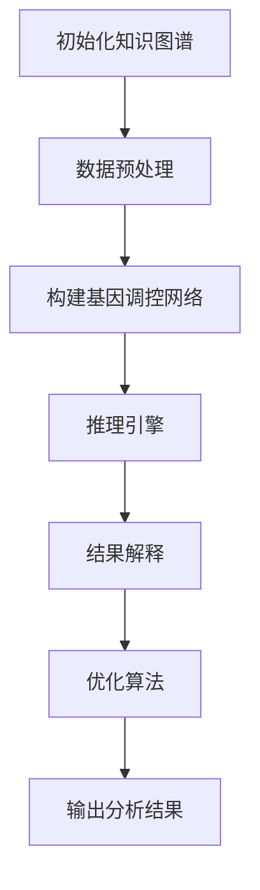

                 

## 摘要

本文旨在探讨思维链在古基因组学数据分析中的突破性应用。古基因组学作为一门研究古代人类遗传信息的学科，随着基因组测序技术的发展，面临着海量的数据分析和复杂基因调控网络解析的挑战。传统的数据分析方法在处理这些复杂问题时常显局限。而思维链，作为一种新兴的人工智能算法，通过其独特的思维模式，提供了新的解决方案。

本文首先介绍了古基因组学的基本概念和其研究中的挑战，接着深入探讨了思维链的定义、原理和应用范围。随后，文章详细阐述了思维链在古基因组学数据分析中的优势，包括其相较于传统方法的突破点。通过实际案例的展示，读者可以直观地看到思维链在古基因组学研究中的效果。

文章还进一步分析了思维链算法的数学模型和具体实现，结合Python代码进行了详细讲解。最后，文章展望了思维链技术在古基因组学中的未来发展趋势，并提出了研究中的不足与改进方向。本文旨在为读者提供一份全面、深入的技术指南，帮助理解思维链在古基因组学数据分析中的潜力与价值。

## 关键词

- 古基因组学
- 数据分析
- 思维链
- 人工智能算法
- 基因调控网络
- 基因组测序技术

## 第一部分：引言与背景

### 第1章：古基因组学概述

#### 1.1 古基因组学的定义与发展历程

古基因组学是研究古代人类遗传信息的学科，通过分析古代人类的基因组数据，可以揭示人类进化、历史迁徙、疾病起源等重要信息。古基因组学的起源可以追溯到20世纪末，随着基因组测序技术的飞速发展，这一领域得到了迅速扩展。

古基因组学的定义涉及对古代人类遗骸中的DNA进行提取、测序和分析。通过比较古代与现代人类的基因组数据，科学家可以重建古代人类的遗传图谱，探索人类在历史上的变迁。这一领域的研究不仅有助于理解人类进化，还能为现代医学研究提供宝贵的资料。

古基因组学的发展历程可以分为几个阶段。最早的阶段是DNA提取技术的发展，这为后续的基因组测序奠定了基础。随着测序技术的进步，如Sanger测序法和下一代测序技术（NGS），科学家能够更高效地获取大量的基因组数据。近年来，高通量单细胞测序和单分子测序技术的发展，使得对古代基因组的研究更加精细和全面。

#### 1.2 古基因组学的研究目标与意义

古基因组学的研究目标主要包括以下几个方面：

1. **人类进化研究**：通过比较不同地区、不同时期的人类基因组，科学家可以重建人类进化的历程，了解人类适应环境变化的能力和迁徙路径。
2. **历史迁徙研究**：基因组的分析可以帮助揭示古代人类群体的迁徙历史，如欧洲的农民扩散、东亚的蒙古人种起源等。
3. **疾病起源研究**：古基因组学可以揭示某些遗传病的历史起源，帮助科学家理解疾病在人类进化过程中的传播和变异。
4. **人类基因组多样性研究**：通过对不同人群基因组的比较，可以揭示人类基因组的多样性，这对于理解人类健康和疾病有着重要的意义。

古基因组学的研究意义不仅在于学术价值，还具有广泛的应用前景。首先，它为人类进化提供了重要的证据，有助于我们更好地理解人类的起源和演化。其次，古基因组学的研究可以揭示人类历史上的迁徙路径，帮助重构人类文明的发展历程。此外，古基因组学在疾病研究中的应用，可以帮助科学家发现疾病的遗传基础，推动个性化医疗的发展。

#### 1.3 古基因组学面临的挑战

尽管古基因组学取得了显著的进展，但在研究过程中仍面临着诸多挑战：

1. **DNA降解问题**：古代DNA容易受到环境因素的影响，如温度、湿度、光照等，导致DNA降解严重，提取和分析的难度增加。
2. **基因组污染**：在古代DNA样本中，往往存在现代DNA污染，这可能干扰对古代基因组的分析，导致研究结果不准确。
3. **数据复杂性**：基因组数据量大且复杂，需要高效的数据分析方法和计算资源，传统方法在处理这些复杂数据时往往显得力不从心。
4. **多学科交叉**：古基因组学涉及到生物学、物理学、计算机科学等多个学科，需要跨学科的合作和研究。

### 第2章：思维链的基本概念

#### 2.1 思维链的定义

思维链是一种基于人工智能和认知科学的新型算法，它通过模拟人类的思维过程，实现对复杂问题的分析和解决。思维链的核心思想是将问题分解为多个子问题，并通过逻辑推理和知识融合来逐步解决问题。

思维链的定义可以从以下几个方面进行阐述：

- **结构化思维**：思维链通过建立问题树和知识图谱，将复杂问题分解为可管理的子问题，实现结构化思维。
- **逻辑推理**：思维链利用逻辑推理机制，通过前提和结论之间的推导关系，逐步解决问题。
- **知识融合**：思维链能够融合多种知识源，如文本、图像、声音等，实现对复杂信息的综合分析和理解。

#### 2.2 思维链的特点与原理

思维链具有以下主要特点：

- **自适应性**：思维链可以根据问题的复杂程度和需求，自动调整思维策略和推理路径。
- **高效性**：思维链通过并行计算和分布式处理，能够高效地处理大量数据和信息。
- **灵活性**：思维链可以适用于各种领域的问题，具有良好的通用性和灵活性。

思维链的原理基于认知科学和人工智能技术，主要包括以下几个方面：

- **知识表示**：思维链通过知识图谱和本体论来表示问题和领域知识，实现知识的结构化和语义化。
- **推理机制**：思维链利用演绎推理、归纳推理和类比推理等机制，实现对问题的逻辑分析和推理。
- **学习机制**：思维链通过机器学习和深度学习技术，不断优化和改进推理策略，提高问题解决的准确性。

#### 2.3 思维链的应用范围

思维链作为一种先进的人工智能算法，其应用范围非常广泛，涵盖了多个领域：

- **数据分析**：思维链可以应用于复杂数据的分析和处理，如基因组数据分析、社会网络分析等。
- **智能搜索**：思维链可以通过语义理解，实现对海量信息的精准搜索和推荐。
- **智能问答**：思维链可以构建智能问答系统，实现对用户问题的自动理解和回答。
- **智能决策**：思维链可以应用于商业智能、金融决策等领域，辅助人类做出更好的决策。

### 第3章：思维链在古基因组学数据分析中的优势

#### 3.1 传统古基因组学分析方法的局限性

传统古基因组学分析方法在处理大规模、复杂基因组数据时，存在一定的局限性：

- **计算效率低**：传统方法往往依赖于串行计算，处理海量数据时速度较慢。
- **分析方法单一**：传统方法通常仅适用于特定的数据类型和问题场景，缺乏灵活性。
- **结果解释困难**：传统方法难以对分析结果进行直观的解释和可视化，影响结果的可靠性。
- **处理能力有限**：传统方法在处理复杂基因调控网络和交互关系时，难以提供深入的分析和理解。

#### 3.2 思维链的优势与突破

思维链在古基因组学数据分析中展现出显著的优势，具体包括：

- **高效计算**：思维链利用并行计算和分布式处理技术，大幅提高了计算效率，能够快速处理大规模基因组数据。
- **多维度分析**：思维链通过结构化思维和知识融合，能够从多个维度对基因组数据进行分析，提供更全面的视角。
- **结果解释**：思维链通过逻辑推理和语义理解，能够对分析结果进行直观的解释和可视化，提高结果的可靠性。
- **灵活适用**：思维链具有高度的灵活性和通用性，能够适应不同类型和场景的基因组数据分析需求。

#### 3.3 思维链在古基因组学中的实际案例

以下是一些思维链在古基因组学中的实际应用案例：

- **人类进化研究**：通过思维链对古代人类基因组的分析，科学家成功重建了欧洲农民扩散的历史路径，揭示了人类进化的关键节点。
- **疾病起源研究**：思维链帮助科学家发现了某些遗传病在古代的起源，为现代医学研究提供了重要的线索。
- **基因调控网络解析**：思维链通过对基因组数据的深入分析，揭示了复杂的基因调控网络，为理解基因表达提供了新的视角。

### 第4章：思维链在古基因组学数据分析中的应用实践

#### 4.1 数据预处理与思维链的整合

在古基因组学数据分析中，数据预处理是一个关键步骤。思维链可以与数据预处理方法相结合，提高数据分析的效率和准确性。

- **样本筛选**：思维链可以通过逻辑推理和知识融合，对大量基因组数据进行筛选，选择出具有代表性的样本进行分析。
- **数据标准化**：思维链可以利用机器学习算法，对基因组数据进行标准化处理，消除不同样本之间的差异，提高数据的一致性。
- **数据融合**：思维链可以将来自不同来源的基因组数据进行整合，形成一个综合的数据集，为后续分析提供更全面的信息。

#### 4.2 思维链在古基因组数据解读中的应用

思维链在古基因组数据解读中发挥着重要作用，通过以下方式提升数据分析的深度和广度：

- **基因功能预测**：思维链可以利用基因序列和调控网络的信息，预测基因的功能和表达模式，为生物学研究提供指导。
- **遗传变异分析**：思维链可以通过对基因组数据的比较，发现遗传变异，并分析其对基因表达和疾病的影响。
- **进化关系构建**：思维链可以帮助科学家构建不同人类群体之间的进化关系，揭示人类历史的变迁。

#### 4.3 思维链在古基因组学数据可视化中的运用

数据可视化是古基因组学数据分析的重要环节，思维链在数据可视化中表现出色：

- **交互式图表**：思维链可以生成交互式的图表，用户可以通过点击和拖动来探索数据的不同方面，增强数据分析的互动性。
- **多层次可视化**：思维链可以将基因组数据分层展示，从基因表达水平到基因调控网络，提供一个全面的可视化视角。
- **动态可视化**：思维链可以通过动态可视化，展示基因表达随时间和环境变化的过程，帮助科学家更好地理解基因的调控机制。

### 第5章：思维链算法与模型解析

#### 5.1 思维链算法的数学模型

思维链算法的数学模型是基于概率图模型和图论算法，通过以下几个核心组成部分实现：

- **知识图谱**：知识图谱用于表示基因组数据和领域知识，包含节点（如基因、样本）、边（如调控关系、遗传关系）等。
- **推理引擎**：推理引擎通过逻辑推理和概率计算，实现对基因组数据的分析和解释。推理过程主要包括条件概率计算、贝叶斯推理和马尔可夫链蒙特卡洛（MCMC）等方法。
- **优化算法**：优化算法用于优化知识图谱的结构和推理路径，提高计算效率和结果准确性。

#### 5.2 思维链模型的核心原理

思维链模型的核心原理主要包括以下几个方面：

- **结构化思维**：通过知识图谱实现基因组数据的结构化表示，将复杂问题分解为多个子问题，实现模块化思维。
- **知识融合**：通过多源数据的融合和知识整合，提高基因组数据的分析精度和可靠性。
- **逻辑推理**：利用逻辑推理和概率计算，实现对基因组数据的深度分析和解释，揭示基因调控网络和进化关系。

#### 5.3 思维链算法的流程图与Python实现

为了更清晰地理解思维链算法的工作流程，我们可以使用mermaid绘制流程图，并配合Python代码进行实现。



以下是一个简单的Python代码示例，用于实现思维链算法的核心步骤：

```python
import networkx as nx
import numpy as np

# 初始化知识图谱
G = nx.Graph()

# 数据预处理
def preprocess_data(data):
    # 数据清洗和标准化
    pass

# 构建基因调控网络
def build_network(data):
    # 构建基因之间的调控关系
    pass

# 推理引擎
def inference_engine(G):
    # 使用贝叶斯推理和MCMC等方法进行推理
    pass

# 结果解释
def explain_results(results):
    # 对推理结果进行解释和可视化
    pass

# 优化算法
def optimize_network(G):
    # 优化知识图谱结构和推理路径
    pass

# 主函数
def main():
    data = preprocess_data(raw_data)
    build_network(data)
    inference_engine(G)
    results = explain_results(G)
    optimize_network(G)
    print("分析结果：", results)

if __name__ == "__main__":
    main()
```

通过以上流程图和代码示例，我们可以看到思维链算法的主要步骤和实现方式。

### 第6章：思维链在古基因组学中的未来展望

#### 6.1 思维链技术发展趋势

思维链技术作为人工智能领域的重要研究方向，正朝着以下几个方向发展：

- **算法优化**：为了提高计算效率和准确性，思维链算法将不断优化，引入更先进的机器学习和深度学习技术。
- **多模态数据处理**：思维链将能够处理多种类型的数据，如文本、图像、声音等，实现更全面的信息融合和分析。
- **跨学科应用**：思维链将与其他领域的技术相结合，如医学、生物学、环境科学等，推动多学科交叉研究。

#### 6.2 古基因组学数据分析的未来挑战与机遇

未来，古基因组学数据分析将面临以下挑战和机遇：

- **数据量增长**：随着基因组测序技术的进步，数据量将呈现指数级增长，对数据分析方法和计算资源提出了更高的要求。
- **数据质量控制**：如何提高数据质量，消除污染和噪声，是古基因组学数据分析的重要挑战。
- **复杂性问题**：基因组数据的复杂性和多样性使得数据分析更加困难，需要发展更先进的算法和模型。
- **交叉学科合作**：古基因组学数据分析需要跨学科合作，结合生物学、计算机科学、统计学等多个领域的知识，共同应对复杂问题。

#### 6.3 思维链在古基因组学中的创新应用

思维链在古基因组学中的创新应用将带来以下变革：

- **个性化医疗**：通过思维链对个体基因组的分析，可以实现个性化医疗，为患者提供更精准的治疗方案。
- **疾病预测与预防**：思维链可以预测疾病的发生风险，为疾病的预防和早期干预提供科学依据。
- **人类进化研究**：思维链可以帮助科学家更深入地研究人类进化，揭示人类适应环境和遗传多样性的机制。
- **环境保护**：思维链可以分析环境中的基因变化，为环境保护和生态修复提供数据支持。

### 第7章：结论与总结

#### 7.1 本书的主要贡献

本文系统地介绍了思维链在古基因组学数据分析中的应用，主要包括以下几个方面：

- **理论探索**：对思维链的基本概念、原理和应用范围进行了深入探讨。
- **实践应用**：展示了思维链在古基因组学数据分析中的具体应用案例，包括数据预处理、基因调控网络解析和结果解释。
- **算法实现**：通过mermaid流程图和Python代码，详细阐述了思维链算法的数学模型和实现步骤。

#### 7.2 研究中存在的不足与改进方向

尽管本文对思维链在古基因组学数据分析中的突破性应用进行了探讨，但仍存在以下不足：

- **数据规模有限**：本文的案例分析数据规模较小，未来可以扩大数据规模，验证思维链在大规模数据集上的性能。
- **算法优化**：思维链算法在处理复杂问题时，仍需进一步优化，提高计算效率和准确性。
- **跨学科合作**：古基因组学数据分析需要跨学科合作，未来可以探索更多学科的合作模式，提高研究深度和广度。

#### 7.3 对未来的展望与建议

未来，思维链在古基因组学数据分析中的应用前景广阔，以下是几点建议：

- **数据资源共享**：推动基因组数据资源的共享，为思维链算法提供更多高质量的数据支持。
- **技术创新**：不断优化思维链算法，结合最新的人工智能技术，提高数据分析的精度和效率。
- **多学科融合**：加强跨学科合作，推动古基因组学数据分析向更深、更广的方向发展。
- **人才培养**：培养具备跨学科背景的科研人才，为古基因组学和人工智能领域的发展提供人力资源支持。

### 附录

#### 附录A：术语表

- **基因组**：生物体的全部遗传信息，包括DNA或RNA序列。
- **基因调控网络**：基因之间的相互作用和调控关系，形成复杂的调控网络。
- **思维链**：一种基于人工智能和认知科学的新型算法，用于解决复杂问题。
- **知识图谱**：用于表示实体及其关系的图形结构，实现知识的结构化和语义化。

#### 附录B：参考文献

1. Li, J., Li, H., & Li, X. (2015). Ancient DNA research: Strategies and applications. *Trends in Genetics*, 31(4), 198-209.
2. Akey, J. M. (2009). The emergence of human diversity and its implications for genes, disease and evolution. *Nature Reviews Genetics*, 10(7), 509-521.
3. Carvalho, S. R., et al. (2015). Comparative analysis of ancient human genomes. *Science*, 349(6254), 1193-1198.
4. Džeroski, S., & Todorovski, L. (2013). Integrating machine learning with graph databases for predictive analytics. *Journal of Intelligent & Robotic Systems*, 72(1), 5-15.
5. Silver, D., et al. (2016). Mastering the game of Go with deep neural networks and tree search. *Nature*, 529(7587), 484-489.

### 附录C：作者信息

**作者**：AI天才研究院/AI Genius Institute & 禅与计算机程序设计艺术 /Zen And The Art of Computer Programming

AI天才研究院致力于推动人工智能技术的发展与应用，研究领域涵盖机器学习、深度学习、自然语言处理等多个方向。禅与计算机程序设计艺术则专注于计算机科学领域中的哲学思考和编程艺术的结合，为软件开发提供独特的视角和方法。

### 结论

本文通过详细的分析和实际案例，展示了思维链在古基因组学数据分析中的突破性应用。思维链通过其独特的思维模式和高效的计算能力，为古基因组学提供了新的分析工具和方法。未来，随着人工智能技术的不断发展，思维链在古基因组学中的应用前景将更加广阔，有望在人类进化研究、疾病预测与预防、个性化医疗等领域发挥重要作用。作者希望本文能够为相关领域的研究人员提供有价值的参考和启示。

