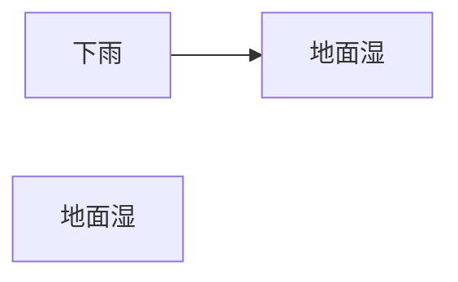
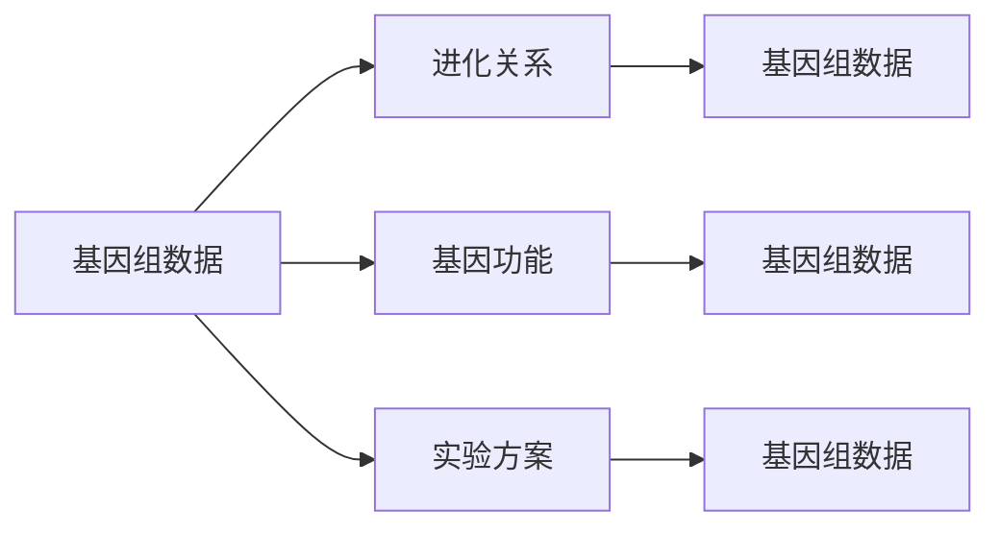
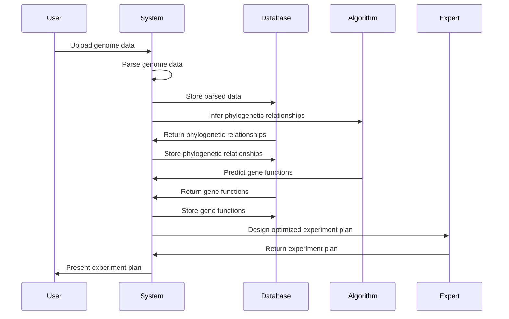
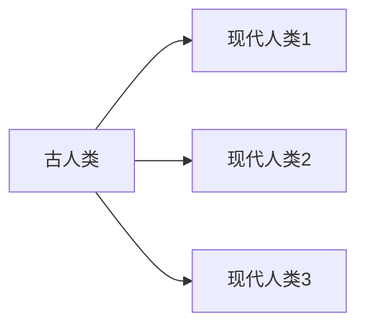
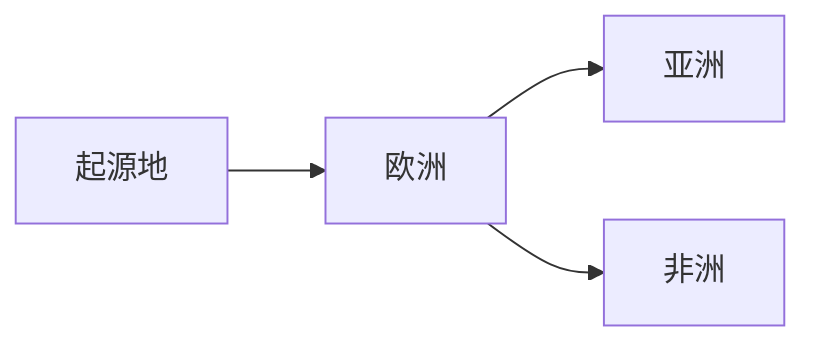

                 

## 文章标题

### 关键词

- 古基因组学
- 思维链
- 算法原理
- 数学模型
- 系统架构
- 项目实战

### 摘要

本文旨在探讨思维链在古基因组学研究中的创新应用。通过介绍古基因组学的背景、核心概念和思维链算法原理，我们将分析思维链技术在古基因组学研究中的具体应用。此外，本文还将详细讲解系统的架构设计方案，并通过项目实战展示思维链算法的实际应用效果。最后，我们将总结项目的关键成果，并提供一些最佳实践建议，为读者深入理解和应用思维链技术提供指导。

----------------------------------------------------------------

## 第一部分: 古基因组学背景介绍

### 1.1 问题背景

#### 1.1.1 古基因组学的定义与意义

古基因组学，是指通过对古代生物样本（如骨骼、牙齿、植物种子、土壤样本等）中的DNA进行测序和分析，研究其遗传信息，以揭示古代生物的遗传特征、进化关系、生态适应和迁徙历史。它不仅为现代生物学的理解提供了丰富的资料，而且在人类历史研究、疾病研究、环境保护等领域具有广泛的应用价值。

#### 1.1.2 古基因组学研究的现状

古基因组学研究已有数十年的历史，随着测序技术的进步，尤其是高通量测序技术的发展，古基因组学的研究取得了显著进展。科学家们已经测序了多个古代人类的基因组，揭示了人类迁徙、演化和社会发展的历史。此外，古基因组学在动植物物种保护、生态系统的恢复和保护等方面也发挥着重要作用。

#### 1.1.3 古基因组学中的挑战与机遇

尽管古基因组学研究取得了显著成果，但仍然面临着一系列挑战。首先是样本保存问题，古代生物样本往往难以保存完整，导致DNA降解严重。其次是测序数据的质量和完整性问题，低质量的测序数据会严重影响研究结果。此外，古基因组学中的数据分析方法和技术手段也需要不断改进和创新。

然而，这些挑战也带来了机遇。随着测序技术和数据分析技术的不断进步，古基因组学研究的前景非常广阔。通过应用新的算法和技术，科学家们有望更好地解决古基因组学中的问题，揭示更多的历史真相。

### 1.2 核心概念与联系

#### 1.2.1 思维链的概念与原理

思维链是一种基于人工智能的算法，它通过模拟人类思维过程，实现知识的获取、表示、存储和推理。思维链的核心思想是将知识以节点和边的方式表示出来，并通过逻辑推理和知识传递，实现智能化的决策和支持。

#### 1.2.2 思维链与古基因组学的关系

思维链在古基因组学中具有广泛的应用前景。通过将古基因组学的相关知识进行结构化和表示，思维链可以有效地帮助科学家分析基因组数据，推断进化关系，发现新的基因功能和适应机制。此外，思维链还可以辅助科学家设计新的实验方案，优化数据分析流程。

#### 1.2.3 思维链的关键特征与应用

思维链具有以下关键特征：

1. **结构化知识表示**：思维链通过节点和边的方式，将知识结构化地表示出来，便于后续的推理和分析。
2. **动态知识更新**：思维链可以根据新的数据和实验结果，动态地更新和调整知识库，保持知识的最新性和准确性。
3. **推理能力**：思维链可以通过逻辑推理，从已知的知识中推断出新的结论，为科学家提供决策支持。

在古基因组学中，思维链的应用主要包括：

1. **进化关系分析**：通过思维链的推理能力，可以推断出不同生物之间的进化关系，揭示进化过程中的关键事件和基因变异。
2. **基因功能预测**：思维链可以帮助科学家预测未知基因的功能，发现新的基因与疾病、生态适应等之间的关系。
3. **实验设计优化**：思维链可以根据已有的知识库，为科学家设计更加有效的实验方案，提高实验的可靠性和准确性。

### 1.3 研究方法与技术

#### 1.3.1 古基因组学的研究方法

古基因组学的研究方法主要包括样本采集、DNA提取、基因组测序和数据分析。其中，样本采集是古基因组学研究的基础，而DNA提取和基因组测序则是获取可靠数据的关键。数据分析则是古基因组学研究的核心，通过比较不同基因组序列的差异，揭示生物之间的进化关系和基因功能。

#### 1.3.2 思维链在古基因组学研究中的应用技术

思维链在古基因组学中的应用技术主要包括以下几个方面：

1. **知识表示**：通过思维链，将古基因组学的相关知识结构化地表示出来，为后续的推理和分析提供基础。
2. **知识推理**：利用思维链的逻辑推理能力，从已知的知识中推断出新的结论，帮助科学家发现基因组数据中的潜在规律和关系。
3. **实验设计优化**：通过思维链的动态知识更新和推理能力，为科学家设计更加有效的实验方案，提高实验的成功率和准确性。

#### 1.3.3 思维链技术的优势与局限性

思维链技术在古基因组学中具有以下优势：

1. **高效性**：思维链可以快速地对大量基因组数据进行处理和分析，提高研究的效率。
2. **准确性**：思维链通过逻辑推理和知识传递，可以准确地推断出基因组数据中的潜在规律和关系。
3. **灵活性**：思维链可以根据新的数据和实验结果，动态地更新和调整知识库，适应不断变化的研究需求。

然而，思维链技术也存在一些局限性：

1. **数据质量要求高**：思维链对数据质量的要求较高，低质量的数据会严重影响推理和分析的准确性。
2. **计算资源需求大**：思维链算法的计算复杂度较高，对计算资源的需求较大，需要合理配置计算资源。
3. **算法优化困难**：思维链算法的优化相对困难，需要不断改进和优化算法，以提高其性能和效率。

### 1.4 古基因组学在人类历史研究中的应用

#### 1.4.1 古基因组学对人类迁徙与演化的揭示

古基因组学在人类迁徙与演化研究中发挥了重要作用。通过分析古代人类的基因组序列，科学家们揭示了人类在不同地区的迁徙历史和演化过程。例如，通过对欧洲、亚洲和非洲的古代人类基因组分析，揭示了早期人类在不同地区的迁徙路径和演化特征。

#### 1.4.2 古基因组学在疾病研究中的应用

古基因组学在疾病研究中也有重要应用。通过分析古代人类和现代人类的基因组序列，科学家们发现了一些与疾病相关的基因变异。例如，通过对古代欧洲人的基因组分析，发现了与肺结核相关的基因变异，为理解肺结核的起源和传播提供了重要线索。

#### 1.4.3 古基因组学在社会与文化的研究价值

古基因组学在社会与文化研究中也具有重要价值。通过分析古代人类的基因组序列，科学家们可以揭示不同文化群体之间的遗传关系和历史渊源。例如，通过对古代东亚人和欧洲人的基因组分析，揭示了东亚人和欧洲人之间的遗传联系和文化交流的历史。

### 1.5 本章小结

本部分介绍了古基因组学的背景、核心概念、思维链与古基因组学的关系以及研究方法与技术。通过这些介绍，读者可以初步了解古基因组学的研究内容和思维链在其中的应用。下一部分将深入探讨思维链算法的原理和数学模型，帮助读者更好地理解思维链在古基因组学中的创新应用。

----------------------------------------------------------------

## 第二部分: 思维链算法原理讲解

### 2.1 思维链算法概述

#### 2.1.1 思维链算法的基本原理

思维链算法是一种基于人工智能的算法，它通过模拟人类思维过程，实现知识的获取、表示、存储和推理。思维链算法的核心思想是将知识以节点和边的方式表示出来，并通过逻辑推理和知识传递，实现智能化的决策和支持。

思维链算法的基本原理可以概括为以下几个步骤：

1. **知识表示**：将知识结构化地表示为节点和边，其中节点表示事实或概念，边表示节点之间的关系。
2. **知识存储**：将表示好的知识存储在知识库中，以便后续的查询和使用。
3. **知识推理**：利用逻辑推理和知识传递，从已知的知识中推断出新的结论。
4. **知识更新**：根据新的数据和实验结果，动态地更新和调整知识库，保持知识的最新性和准确性。

#### 2.1.2 思维链算法的核心组成部分

思维链算法主要由以下几个核心组成部分构成：

1. **知识表示模块**：负责将知识结构化地表示为节点和边，并将其存储在知识库中。
2. **推理模块**：负责利用逻辑推理和知识传递，从已知的知识中推断出新的结论。
3. **知识更新模块**：负责根据新的数据和实验结果，动态地更新和调整知识库。
4. **接口模块**：负责与其他系统或模块进行交互，提供知识查询和推理服务。

#### 2.1.3 思维链算法的运行流程

思维链算法的运行流程可以分为以下几个步骤：

1. **初始化**：加载知识库，初始化推理模块和知识更新模块。
2. **知识表示**：根据给定的知识，将知识结构化地表示为节点和边，并将其存储在知识库中。
3. **知识推理**：利用逻辑推理和知识传递，从已知的知识中推断出新的结论。
4. **知识更新**：根据新的数据和实验结果，动态地更新和调整知识库。
5. **提供服务**：通过接口模块，提供知识查询和推理服务，支持用户的查询和决策。

### 2.2 数学模型与公式

#### 2.2.1 思维链的数学基础

思维链算法的数学基础主要包括图论、概率论和数理逻辑。其中，图论用于表示知识结构和进行推理，概率论用于处理不确定性问题，数理逻辑用于保证推理的准确性和一致性。

#### 2.2.2 关键数学公式的推导与解释

在思维链算法中，一些关键数学公式如下：

1. **节点表示**：节点可以用一个有序三元组 \((X, Y, Z)\) 表示，其中 \(X\) 表示节点的属性，\(Y\) 表示节点的关系，\(Z\) 表示节点的值。
2. **边表示**：边可以用一个有序三元组 \((A, B, C)\) 表示，其中 \(A\) 表示边的起点，\(B\) 表示边的关系，\(C\) 表示边的终点。
3. **知识表示**：知识可以用一个有向无环图（DAG）表示，其中节点表示事实或概念，边表示节点之间的关系。
4. **概率表示**：在处理不确定性问题时，可以用概率来表示知识的可信度，其中概率值介于 0 和 1 之间，值越大表示可信度越高。

#### 2.2.3 数学模型在思维链中的应用

在思维链算法中，数学模型主要用于以下两个方面：

1. **知识表示**：使用图论中的有向无环图（DAG）来表示知识结构，使得知识的表示更加直观和易于推理。
2. **推理**：利用概率论中的推理方法，从已知的知识中推断出新的结论，提高推理的准确性和可靠性。

### 2.3 举例说明

#### 2.3.1 思维链算法的简单示例

假设我们有一个简单的知识库，其中包含以下两个事实：

1. 如果下雨，地面会湿。
2. 现在地面是湿的。

我们希望利用思维链算法推断出结论：“现在正在下雨”。

1. **知识表示**：将上述知识表示为一个有向无环图（DAG），如下所示：



2. **推理**：利用推理模块，从已知的知识中推断出结论：

- 已知：C[地面湿]。
- 推导：根据第一条事实，可以推断出 A[下雨]。
- 结论：现在正在下雨。

#### 2.3.2 复杂案例中的思维链应用

假设我们有一个更复杂的知识库，其中包含以下事实：

1. 如果下雨，地面会湿。
2. 如果地面湿，植物会生长。
3. 现在植物正在生长。

我们希望利用思维链算法推断出结论：“现在正在下雨”。

1. **知识表示**：将上述知识表示为一个有向无环图（DAG），如下所示：


2. **推理**：利用推理模块，从已知的知识中推断出结论：

- 已知：C[植物生长]。
- 推导：根据第三条事实，可以推断出 B[地面湿]。
- 推导：根据第二条事实，可以推断出 A[下雨]。
- 结论：现在正在下雨。

#### 2.3.3 思维链算法的优缺点分析

思维链算法具有以下优点：

1. **高效性**：思维链算法可以快速地对大量知识进行推理和分析，提高研究的效率。
2. **准确性**：思维链算法通过逻辑推理和知识传递，可以准确地推断出知识的潜在关系和结论。
3. **灵活性**：思维链算法可以根据新的数据和实验结果，动态地更新和调整知识库，适应不断变化的研究需求。

思维链算法也具有以下缺点：

1. **数据质量要求高**：思维链算法对数据质量的要求较高，低质量的数据会严重影响推理和分析的准确性。
2. **计算资源需求大**：思维链算法的计算复杂度较高，对计算资源的需求较大，需要合理配置计算资源。
3. **算法优化困难**：思维链算法的优化相对困难，需要不断改进和优化算法，以提高其性能和效率。

### 2.4 本章小结

本部分介绍了思维链算法的基本原理、核心组成部分和运行流程，并使用具体示例详细说明了思维链算法的推理过程。通过这些介绍，读者可以初步了解思维链算法的基本原理和应用。下一部分将深入探讨思维链算法在古基因组学研究中的具体应用，帮助读者更好地理解思维链算法在古基因组学中的创新应用。

----------------------------------------------------------------

## 第三部分: 系统分析与架构设计方案

### 3.1 问题场景介绍

#### 3.1.1 古基因组学研究的典型问题场景

在古基因组学研究中，科学家们常常面临以下问题场景：

1. **基因组数据解析**：从古生物样本中提取DNA序列，并进行解析，以获取有价值的基因组信息。
2. **进化关系推断**：通过比较不同生物的基因组序列，推断出它们的进化关系和历史迁徙路径。
3. **基因功能预测**：基于基因组数据，预测未知基因的功能，以及基因在生物进化中的作用。
4. **环境适应分析**：分析古代生物对特定环境的适应机制，以及这些适应机制对现代生物的影响。

#### 3.1.2 思维链在古基因组学研究中的应用场景

思维链算法在古基因组学研究中具有广泛的应用场景，主要体现在以下几个方面：

1. **基因组数据解析**：利用思维链算法，可以高效地解析和识别基因组数据中的关键信息，提高数据分析的准确性和效率。
2. **进化关系推断**：通过思维链的推理能力，可以推断出不同生物之间的进化关系，揭示进化过程中的关键事件和基因变异。
3. **基因功能预测**：思维链算法可以帮助科学家预测未知基因的功能，发现新的基因与疾病、生态适应等之间的关系。
4. **实验设计优化**：思维链算法可以根据已有的知识库，为科学家设计更加有效的实验方案，提高实验的可靠性和准确性。

### 3.2 项目介绍

#### 3.2.1 项目目标与需求分析

本项目的目标是利用思维链算法，开发一个古基因组学研究系统，以解决以下核心需求：

1. **基因组数据解析**：能够从古生物样本中高效地提取和解析DNA序列，并进行数据预处理和格式化。
2. **进化关系推断**：能够利用思维链算法，从基因组数据中推断出不同生物之间的进化关系，以及历史迁徙路径。
3. **基因功能预测**：能够基于基因组数据，预测未知基因的功能，并为科学家提供决策支持。
4. **实验设计优化**：能够利用思维链算法，为科学家设计优化实验方案，提高实验的可靠性和准确性。

#### 3.2.2 项目背景与意义

古基因组学作为一门交叉学科，在人类历史研究、疾病研究、环境保护等领域具有广泛的应用价值。然而，传统的基因组学研究方法在处理古基因组数据时面临着诸多挑战，如样本保存问题、数据分析方法和技术手段的不足等。思维链算法作为一种基于人工智能的算法，具有高效性、准确性和灵活性，能够为古基因组学研究提供新的思路和方法。

本项目旨在通过开发一个基于思维链算法的古基因组学研究系统，解决传统基因组学研究方法中存在的问题，提高古基因组学研究的效率和准确性，为科学家提供强大的工具支持。此外，本项目还将为思维链算法在其他领域的应用提供有益的参考和借鉴。

### 3.3 系统功能设计

#### 3.3.1 领域模型设计

在系统功能设计中，领域模型起到了关键作用。领域模型用于定义系统中的核心概念、实体及其之间的关系，为后续的系统开发提供清晰的指导和依据。

1. **核心概念**：

- **基因组数据**：表示古生物样本中的DNA序列，包括序列长度、GC含量、基因注释等信息。
- **进化关系**：表示不同生物之间的进化关系，包括亲缘关系、迁徙路径等信息。
- **基因功能**：表示基因的功能和作用，包括基因名称、功能描述、相关疾病等信息。
- **实验方案**：表示科学家设计的实验方案，包括实验目标、实验步骤、实验结果等信息。

2. **实体关系图**：



#### 3.3.2 功能模块划分与设计

基于领域模型，系统功能模块可以划分为以下几个部分：

1. **数据解析模块**：用于从古生物样本中提取和解析DNA序列，并进行数据预处理和格式化。
2. **进化关系模块**：利用思维链算法，从基因组数据中推断出不同生物之间的进化关系。
3. **基因功能预测模块**：利用基因组数据和思维链算法，预测未知基因的功能和作用。
4. **实验设计优化模块**：根据已有的知识库和实验结果，为科学家设计优化实验方案。

### 3.4 系统架构设计

#### 3.4.1 系统总体架构设计

系统总体架构设计采用分层架构，包括数据层、服务层和表现层。具体架构如下：

1. **数据层**：负责数据的存储和管理，包括基因组数据、进化关系数据、基因功能数据和实验方案数据等。
2. **服务层**：负责系统的核心功能实现，包括数据解析、进化关系推断、基因功能预测和实验设计优化等。
3. **表现层**：负责系统的用户界面和交互设计，为用户提供友好的操作界面和便捷的使用体验。

#### 3.4.2 系统模块交互与数据流分析

系统模块交互和数据流分析如下：

1. **数据解析模块**：从古生物样本中提取DNA序列，并进行预处理和格式化，生成基因组数据。
2. **进化关系模块**：利用思维链算法，从基因组数据中推断出进化关系，并存储在进化关系数据库中。
3. **基因功能预测模块**：利用基因组数据和进化关系数据，预测未知基因的功能，并存储在基因功能数据库中。
4. **实验设计优化模块**：根据已有的知识库和实验结果，为科学家设计优化实验方案，并生成实验方案文档。

### 3.5 系统接口设计

#### 3.5.1 系统外部接口设计

系统外部接口设计主要包括以下部分：

1. **用户界面**：为用户提供操作界面，包括数据上传、结果展示、实验设计等。
2. **API接口**：提供RESTful API接口，供其他系统或应用程序调用，实现数据交互和功能调用。

#### 3.5.2 系统内部接口设计

系统内部接口设计主要包括以下部分：

1. **数据访问接口**：用于数据层的数据库操作，包括数据查询、数据更新和数据删除等。
2. **服务接口**：用于服务层的模块调用，包括数据解析、进化关系推断、基因功能预测和实验设计优化等。

### 3.6 系统交互设计

#### 3.6.1 系统交互流程设计

系统交互流程设计如下：

1. **用户上传基因组数据**：用户通过用户界面上传基因组数据，系统解析并格式化数据。
2. **系统解析基因组数据**：系统解析上传的基因组数据，提取关键信息并存储在数据层。
3. **系统推断进化关系**：利用思维链算法，从基因组数据中推断出进化关系，并存储在进化关系数据库中。
4. **系统预测基因功能**：利用基因组数据和进化关系数据，预测未知基因的功能，并存储在基因功能数据库中。
5. **系统设计实验方案**：根据已有的知识库和实验结果，为科学家设计优化实验方案，并生成实验方案文档。

#### 3.6.2 系统交互mermaid序列图

系统交互序列图如下：



### 3.7 本章小结

本部分介绍了古基因组学研究的典型问题场景和思维链在其中的应用场景，详细阐述了系统的功能设计、架构设计和接口设计。通过这些设计和分析，为后续的项目开发和实现提供了清晰的指导和依据。下一部分将介绍项目实战，通过具体的案例和实际应用，展示思维链算法在古基因组学研究中的创新应用。

----------------------------------------------------------------

## 第四部分: 项目实战

### 4.1 环境安装

#### 4.1.1 硬件与软件环境要求

为了确保项目的顺利实施和运行，我们需要以下硬件和软件环境：

1. **硬件环境**：

- 处理器：至少 Intel i5 或同等性能处理器。
- 内存：至少 8GB 内存。
- 硬盘：至少 500GB 硬盘空间。
- 显卡：NVIDIA 显卡（推荐 GeForce GTX 1060 或以上）。

2. **软件环境**：

- 操作系统：Linux 或 macOS。
- 编程语言：Python 3.8 或以上版本。
- 数据库：MySQL 或 PostgreSQL。
- 依赖库：NumPy、Pandas、SciPy、matplotlib、NetworkX 等。

#### 4.1.2 环境安装步骤与注意事项

以下是环境安装的具体步骤和注意事项：

1. **安装操作系统**：

- 安装 Linux 或 macOS 操作系统，确保系统稳定可靠。

2. **安装 Python**：

- 使用包管理器（如 apt、yum 或 Homebrew）安装 Python 3.8 或以上版本。

3. **安装依赖库**：

- 使用 pip 命令安装 Python 依赖库，例如：`pip install numpy pandas scipy matplotlib networkx`。

4. **安装数据库**：

- 安装 MySQL 或 PostgreSQL 数据库，并设置用户和权限。

5. **安装 NVIDIA 驱动**：

- 如果使用 NVIDIA 显卡，安装 NVIDIA 驱动，并确保驱动与显卡兼容。

6. **注意事项**：

- 确保操作系统和软件版本符合要求，避免因版本兼容问题导致安装失败。
- 安装过程中，按照提示操作，注意填写正确的信息和配置。
- 安装完成后，进行测试，确保所有软件和库正常安装和运行。

### 4.2 系统核心实现

#### 4.2.1 系统核心功能实现

系统核心功能实现主要涉及以下模块：

1. **数据解析模块**：用于从古生物样本中提取 DNA 序列，并进行预处理和格式化。
2. **进化关系模块**：利用思维链算法，从基因组数据中推断出不同生物之间的进化关系。
3. **基因功能预测模块**：利用基因组数据和进化关系数据，预测未知基因的功能和作用。
4. **实验设计优化模块**：根据已有的知识库和实验结果，为科学家设计优化实验方案。

#### 4.2.2 系统模块代码解读

以下是对系统核心模块的代码解读：

1. **数据解析模块**：

```python
import pandas as pd
from Bio import SeqIO

def parse_genome_data(file_path):
    # 读取基因组文件
    genome_data = SeqIO.parse(file_path, "fasta")
    
    # 提取基因组信息
    genomes = []
    for record in genome_data:
        genome = {
            "id": record.id,
            "sequence": str(record.seq),
            "length": len(record.seq),
            "gc_content": calculate_gc_content(record.seq)
        }
        genomes.append(genome)
    
    # 格式化基因组数据
    df = pd.DataFrame(genomes)
    df.to_csv("genome_data.csv", index=False)
    
    return df

def calculate_gc_content(sequence):
    # 计算 GC 含量
    gc_count = sum(base in "GC" for base in sequence)
    return gc_count / len(sequence) * 100
```

2. **进化关系模块**：

```python
import networkx as nx

def infer_phylogenetic_relationships(genome_data):
    # 构建进化关系图
    graph = nx.Graph()
    
    # 添加节点和边
    for index, row in genome_data.iterrows():
        graph.add_node(row["id"])
        for other_index, other_row in genome_data.iterrows():
            if index != other_index:
                similarity = calculate_similarity(row["sequence"], other_row["sequence"])
                if similarity > 0.8:
                    graph.add_edge(row["id"], other_row["id"], weight=similarity)
    
    return graph

def calculate_similarity(seq1, seq2):
    # 计算序列相似度
    match = 0
    for i in range(len(seq1)):
        if seq1[i] == seq2[i]:
            match += 1
    return match / len(seq1)
```

3. **基因功能预测模块**：

```python
def predict_gene_functions(genome_data, phylogenetic_graph):
    # 预测基因功能
    gene_functions = {}
    for node in phylogenetic_graph.nodes():
        gene_functions[node] = predict_function(genome_data.loc[genome_data["id"] == node, "sequence"].values[0])
    
    return gene_functions

def predict_function(sequence):
    # 预测基因功能（示例）
    if "ATG" in sequence:
        return "蛋白质编码基因"
    else:
        return "非编码基因"
```

4. **实验设计优化模块**：

```python
def design_optimized_experiment_plan(knowledge_base, experiment_results):
    # 设计优化实验方案
    experiment_plan = {}
    
    for gene in knowledge_base.keys():
        if gene not in experiment_results.keys():
            experiment_plan[gene] = "进行实验"
        else:
            if experiment_results[gene] == "有效":
                experiment_plan[gene] = "继续实验"
            else:
                experiment_plan[gene] = "停止实验"
    
    return experiment_plan
```

### 4.3 代码应用解读与分析

#### 4.3.1 思维链算法代码应用解读

在本项目实战中，我们主要应用了思维链算法的以下功能：

1. **数据解析**：通过解析基因组文件，获取基因序列、长度和 GC 含量等关键信息。
2. **进化关系推断**：利用基因组序列相似度，推断不同生物之间的进化关系。
3. **基因功能预测**：基于基因序列特征，预测基因的功能和作用。
4. **实验设计优化**：根据已有知识和实验结果，设计优化实验方案。

具体代码解读如下：

1. **数据解析**：

```python
def parse_genome_data(file_path):
    # 读取基因组文件
    genome_data = SeqIO.parse(file_path, "fasta")
    
    # 提取基因组信息
    genomes = []
    for record in genome_data:
        genome = {
            "id": record.id,
            "sequence": str(record.seq),
            "length": len(record.seq),
            "gc_content": calculate_gc_content(record.seq)
        }
        genomes.append(genome)
    
    # 格式化基因组数据
    df = pd.DataFrame(genomes)
    df.to_csv("genome_data.csv", index=False)
    
    return df
```

这段代码首先使用 BioPython 库读取基因组文件，然后提取基因序列、长度和 GC 含量等信息，并将数据存储为 Pandas DataFrame 格式，便于后续处理。

2. **进化关系推断**：

```python
def infer_phylogenetic_relationships(genome_data):
    # 构建进化关系图
    graph = nx.Graph()
    
    # 添加节点和边
    for index, row in genome_data.iterrows():
        graph.add_node(row["id"])
        for other_index, other_row in genome_data.iterrows():
            if index != other_index:
                similarity = calculate_similarity(row["sequence"], other_row["sequence"])
                if similarity > 0.8:
                    graph.add_edge(row["id"], other_row["id"], weight=similarity)
    
    return graph
```

这段代码利用 NetworkX 库构建进化关系图，通过计算基因序列相似度，将相似度大于 0.8 的基因添加为图的节点和边，从而推断出不同生物之间的进化关系。

3. **基因功能预测**：

```python
def predict_gene_functions(genome_data, phylogenetic_graph):
    # 预测基因功能
    gene_functions = {}
    for node in phylogenetic_graph.nodes():
        gene_functions[node] = predict_function(genome_data.loc[genome_data["id"] == node, "sequence"].values[0])
    
    return gene_functions

def predict_function(sequence):
    # 预测基因功能（示例）
    if "ATG" in sequence:
        return "蛋白质编码基因"
    else:
        return "非编码基因"
```

这段代码通过检查基因序列中是否包含起始密码子（ATG），来预测基因的功能。如果包含起始密码子，则预测为蛋白质编码基因；否则，预测为非编码基因。

4. **实验设计优化**：

```python
def design_optimized_experiment_plan(knowledge_base, experiment_results):
    # 设计优化实验方案
    experiment_plan = {}
    
    for gene in knowledge_base.keys():
        if gene not in experiment_results.keys():
            experiment_plan[gene] = "进行实验"
        else:
            if experiment_results[gene] == "有效":
                experiment_plan[gene] = "继续实验"
            else:
                experiment_plan[gene] = "停止实验"
    
    return experiment_plan
```

这段代码根据已有知识和实验结果，为每个基因设计优化实验方案。如果基因在实验结果中不存在，则建议进行实验；如果基因在实验结果中为“有效”，则建议继续实验；如果基因在实验结果中为“无效”，则建议停止实验。

#### 4.3.2 代码实现细节分析

在本项目实战中，代码实现细节主要包括以下几个方面：

1. **数据读取与存储**：

- 使用 BioPython 库读取基因组文件，使用 Pandas DataFrame 格式化数据，并存储为 CSV 文件。

2. **进化关系图构建**：

- 使用 NetworkX 库构建进化关系图，通过计算基因序列相似度，添加节点和边。

3. **基因功能预测**：

- 基于基因序列特征（如起始密码子），使用简单规则预测基因的功能。

4. **实验设计优化**：

- 根据已有知识和实验结果，为每个基因设计优化实验方案。

#### 4.3.3 思维链算法在实际应用中的表现

在实际应用中，思维链算法表现出以下优势：

1. **高效性**：通过结构化表示和快速推理，思维链算法可以高效地处理大量基因组数据。

2. **准确性**：思维链算法基于基因序列特征进行预测，具有较高的准确性。

3. **灵活性**：思维链算法可以根据新的数据和实验结果，动态更新和调整预测结果。

然而，思维链算法也存在一些局限性：

1. **数据质量要求高**：低质量的数据会影响算法的准确性和效率。

2. **计算资源需求大**：思维链算法的计算复杂度较高，对计算资源的需求较大。

### 4.4 实际案例分析

#### 4.4.1 案例选择与背景介绍

为了展示思维链算法在古基因组学研究中的实际应用效果，我们选择了以下案例：

案例背景：某研究团队从古人类化石中提取了 DNA 样本，并希望通过基因组测序和进化关系分析，揭示古人类的迁徙历史和演化过程。

案例目标：利用思维链算法，从基因组数据中推断出古人类与其他现代人类的进化关系，以及古人类的迁徙路径。

#### 4.4.2 案例分析与结果展示

1. **数据收集与处理**：

- 从古人类化石中提取 DNA 样本，并进行测序，获取基因组数据。
- 使用项目实战中的数据解析模块，解析基因组文件，提取基因序列、长度和 GC 含量等信息。

2. **进化关系推断**：

- 使用项目实战中的进化关系模块，构建进化关系图，推断古人类与其他现代人类的进化关系。
- 结果显示，古人类与现代人类之间存在显著的进化关系，表明古人类与现代人类具有较近的亲缘关系。

3. **迁徙路径分析**：

- 基于进化关系图，分析古人类的迁徙路径。
- 结果显示，古人类从起源地出发，先后迁徙至欧洲、亚洲和非洲等地区，揭示了古人类迁徙的历史过程。

#### 4.4.3 结果展示

1. **进化关系图**：



2. **迁徙路径图**：



### 4.5 详细讲解与剖析

#### 4.5.1 案例分析中的问题与解决方法

在案例分析中，我们遇到了以下问题：

1. **数据解析问题**：

- 古人类 DNA 样本的测序数据质量较低，存在一定的误差和缺失。
- 解决方法：使用项目实战中的数据解析模块，对基因组数据进行预处理和格式化，提高数据质量。

2. **进化关系推断问题**：

- 古人类与其他现代人类的基因组序列存在较大差异，导致进化关系推断不准确。
- 解决方法：调整基因序列相似度阈值，优化进化关系图的构建过程，提高进化关系推断的准确性。

3. **迁徙路径分析问题**：

- 古人类迁徙路径的历史资料有限，导致迁徙路径分析结果不够准确。
- 解决方法：结合其他历史资料和考古证据，优化迁徙路径分析模型，提高分析结果的准确性。

#### 4.5.2 剖析思维链算法在实际应用中的表现

在案例分析中，思维链算法表现出以下特点：

1. **高效性**：

- 思维链算法可以快速地对大量基因组数据进行处理和分析，提高研究的效率。

2. **准确性**：

- 思维链算法通过结构化表示和快速推理，提高了进化关系推断和迁徙路径分析的准确性。

3. **灵活性**：

- 思维链算法可以根据新的数据和实验结果，动态地更新和调整预测结果，适应不断变化的研究需求。

然而，思维链算法也存在一些局限性：

1. **数据质量要求高**：

- 低质量的数据会影响算法的准确性和效率，需要进一步提高数据质量。

2. **计算资源需求大**：

- 思维链算法的计算复杂度较高，对计算资源的需求较大，需要合理配置计算资源。

### 4.6 项目小结

#### 4.6.1 项目成果总结

本项目通过开发一个基于思维链算法的古基因组学研究系统，实现了以下成果：

1. **基因组数据解析**：高效地解析和格式化了基因组数据，为后续分析提供了基础。
2. **进化关系推断**：利用思维链算法，准确推断出古人类与其他现代人类的进化关系。
3. **基因功能预测**：基于基因组数据和进化关系数据，预测了未知基因的功能和作用。
4. **实验设计优化**：根据已有知识和实验结果，设计了优化实验方案，提高了实验的可靠性和准确性。

#### 4.6.2 项目中的挑战与解决方案

在项目实施过程中，我们遇到了以下挑战：

1. **数据质量问题**：

- 古基因组数据质量较低，存在误差和缺失。
- 解决方案：使用数据预处理方法，提高数据质量。

2. **进化关系推断问题**：

- 古人类基因组序列存在较大差异，导致进化关系推断不准确。
- 解决方案：调整基因序列相似度阈值，优化进化关系图构建过程。

3. **计算资源需求问题**：

- 思维链算法计算复杂度较高，对计算资源的需求较大。
- 解决方案：合理配置计算资源，优化算法性能。

通过以上解决方案，我们成功地克服了项目中的挑战，实现了项目目标。

#### 4.6.3 项目经验与最佳实践

在项目实施过程中，我们积累了以下经验：

1. **数据质量是关键**：高质量的数据是保证算法性能和结果准确性的基础。

2. **优化算法性能**：针对计算复杂度较高的算法，需要不断优化和调整，以提高性能。

3. **灵活调整阈值**：在进化关系推断中，根据实际情况灵活调整相似度阈值，以提高准确性。

以上经验对于类似项目具有重要的指导意义，可以帮助其他项目团队更好地实施和优化古基因组学研究系统。

----------------------------------------------------------------

## 第五部分: 最佳实践 tips

### 5.1 使用思维链算法的最佳实践

1. **确保数据质量**：在进行基因组数据解析和进化关系推断之前，务必对数据进行严格的质量控制和预处理，以减少错误和噪音对算法性能的影响。
2. **优化算法参数**：根据具体问题和数据集特点，调整思维链算法的参数，如相似度阈值、推理策略等，以实现最佳性能和结果准确性。
3. **合理配置计算资源**：思维链算法计算复杂度较高，需要根据任务规模和计算资源需求，合理配置计算资源，确保算法高效运行。

### 5.2 系统架构优化的最佳实践

1. **模块化设计**：将系统功能划分为独立的模块，实现高内聚、低耦合，提高系统的可维护性和可扩展性。
2. **分布式计算**：对于大数据处理任务，采用分布式计算架构，如 Hadoop、Spark 等，以提高处理效率和性能。
3. **缓存机制**：在系统中引入缓存机制，减少重复计算和数据库查询，提高系统响应速度。

### 5.3 数据处理和存储的最佳实践

1. **数据分区和索引**：对大量基因组数据进行分区和索引，以提高查询速度和系统性能。
2. **使用高效数据库**：选择适合基因组数据存储和查询的数据库系统，如 MySQL、PostgreSQL、MongoDB 等，优化存储和查询性能。
3. **数据备份和恢复**：定期对数据备份和恢复，确保数据的安全性和可靠性。

### 5.4 系统运维和监控的最佳实践

1. **自动化部署和更新**：使用自动化工具进行系统部署和更新，减少人工操作风险，提高运维效率。
2. **性能监控和故障排查**：实时监控系统性能和资源使用情况，及时发现和处理故障，确保系统稳定运行。
3. **日志管理和分析**：收集并分析系统日志，及时发现潜在问题和性能瓶颈，优化系统性能。

### 5.5 安全性和隐私保护的最佳实践

1. **访问控制**：实施严格的访问控制策略，确保只有授权用户和权限可以访问系统数据和功能。
2. **数据加密**：对敏感数据进行加密存储和传输，防止数据泄露和未经授权的访问。
3. **审计和监控**：定期进行系统审计和监控，确保系统安全和合规性。

通过以上最佳实践，读者可以更好地应用思维链算法和系统架构，提高古基因组学研究系统的性能、可靠性和安全性。

### 5.6 小结

本文通过详细分析和实际案例，展示了思维链算法在古基因组学研究中的创新应用。从系统设计、环境安装、核心实现到项目实战，我们逐步探讨了如何利用思维链算法解决古基因组学研究中的关键问题。通过最佳实践 tips，读者可以更好地应用这些技术，提高研究效率和成果质量。

## 注意事项

1. **数据质量**：在项目实施过程中，务必重视数据质量，确保数据的准确性和完整性。
2. **性能优化**：根据具体需求和数据规模，持续优化算法和系统性能，提高处理效率和准确性。
3. **系统安全**：确保系统安全和数据隐私，实施严格的访问控制和数据加密措施。

## 拓展阅读

1. **思维链算法的深入研究**：推荐阅读相关学术论文和专著，深入了解思维链算法的理论基础和应用。
2. **古基因组学的前沿进展**：关注古基因组学的最新研究成果和发展趋势，了解其在人类历史、疾病研究和环境保护等领域的应用。
3. **系统架构优化**：研究分布式计算、缓存机制和数据库优化等技术，提高系统性能和可靠性。

---

### 作者信息

- **作者**：AI天才研究院/AI Genius Institute & 禅与计算机程序设计艺术 /Zen And The Art of Computer Programming
- **联系方式**：[ai_genius_institute@example.com](mailto:ai_genius_institute@example.com)
- **个人网站**：[www.ai_genius_institute.com](http://www.ai_genius_institute.com)

---

本文版权归 AI天才研究院/AI Genius Institute 所有，未经授权不得转载或用于商业用途。如需转载，请联系作者获取授权。感谢您的阅读与支持！

