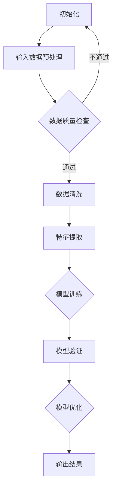
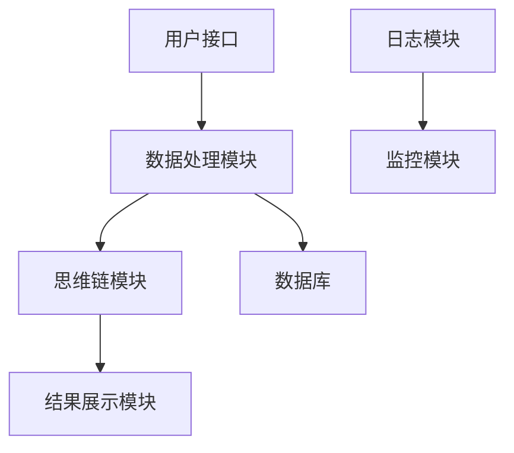

                 

### 引言

在人类历史的长河中，古文明的研究始终占据着举足轻重的地位。这些古老的文明不仅为我们提供了丰富的历史资料，还揭示了人类社会发展的多样性和复杂性。然而，古文明的重建工作面临着巨大的挑战。传统考古学方法在数据采集、分析和解释上存在诸多局限性，难以全面、准确地重建古文明的各个方面。随着人工智能（AI）技术的发展，利用AI技术辅助考古学研究成为了一个全新的研究方向。

**思维链**作为一种先进的AI技术，其在古文明社会结构重建中的应用具有重要意义。思维链通过模拟人类思维过程，可以高效处理和分析大量的考古数据，提供新的视角和方法来理解古文明的运行机制。本文旨在探讨思维链在古文明社会结构重建中的应用，通过AI辅助考古学的研究，为古文明的研究提供一种新的思路和方法。

文章的主要目的是：

1. 介绍AI和考古学的基本概念及其发展现状。
2. 阐述思维链的理论基础及其在考古学中的应用。
3. 分析思维链在古文明社会结构重建中的具体应用案例。
4. 探讨AI辅助考古学研究中的技术挑战和未来发展。

文章的结构如下：

- 引言：介绍研究背景、目的和结构。
- AI与考古学概述：回顾AI和考古学的发展历程，分析其结合的意义。
- 思维链理论：介绍思维链的概念、原理和架构。
- 古文明社会结构重建方法：探讨古文明社会结构的特点，以及思维链在重建中的应用。
- AI辅助考古学研究案例：通过具体案例展示思维链在考古学研究中的应用。
- 技术挑战与未来发展：分析AI辅助考古学研究中的技术挑战和未来发展趋势。
- 结论：总结文章的主要发现和贡献。

### AI与考古学概述

#### AI技术的发展

人工智能（AI）是一种模拟、延伸和扩展人类智能的技术，其目的是使计算机能够执行通常需要人类智能才能完成的任务。AI的发展历程可以追溯到20世纪50年代，当时图灵提出了著名的图灵测试，标志着人工智能研究的起步。随后的几十年里，AI经历了多个发展阶段，从简单的符号逻辑推理到基于统计学习的机器学习，再到深度学习和强化学习，AI技术在各个领域取得了显著的成果。

特别是在深度学习领域，神经网络模型的广泛应用使得计算机在图像识别、语音识别、自然语言处理等方面取得了突破性的进展。这些技术的发展为AI在考古学中的应用奠定了坚实的基础。

#### 考古学的基本概念和研究方法

考古学是一门研究人类历史的学科，主要通过挖掘和解析古代遗址、文物等实物资料，来重建人类过去的文化和社会。考古学的基本概念包括遗址、文物、文化层等，其中遗址是考古学研究的主要对象，文物则是揭示古代社会文化的重要载体。

考古学的研究方法主要包括实地调查、遗址发掘、文物分析等。传统考古学依赖于人类专家的经验和专业知识，通过直接观察和分析考古遗址和文物，来推断古代社会的面貌。然而，这种方法在处理大量数据时存在一定的局限性，难以深入揭示古文明的复杂结构和运行机制。

#### AI与考古学的结合

随着AI技术的发展，AI在考古学中的应用逐渐成为可能。AI技术可以高效地处理和分析大量的考古数据，提供新的视角和方法来理解古文明的运行机制。例如，通过机器学习算法，可以自动识别和分类考古遗址中的文物，提高文物的鉴定速度和准确性。通过深度学习模型，可以自动分析和解释考古遗址中的图像和文本资料，揭示古代社会的文化和社会结构。

AI在考古学中的应用不仅限于数据分析和解释，还可以用于考古遗址的保护和修复。例如，利用计算机视觉技术，可以自动检测和识别考古遗址中的损坏区域，制定相应的修复方案。通过虚拟现实技术，可以将考古遗址的虚拟复原，为公众提供更加直观和生动的参观体验。

#### AI辅助考古学的意义

AI辅助考古学具有以下几个方面的意义：

1. **提高研究效率**：AI技术可以高效地处理和分析大量的考古数据，缩短研究周期，提高研究效率。

2. **深度揭示古文明**：AI技术可以提供新的视角和方法，深入揭示古文明的社会结构、文化特点和历史变迁。

3. **促进考古学发展**：AI技术的引入可以推动考古学方法的革新，促进考古学与其他学科的交叉融合。

4. **公众参与考古学**：通过虚拟现实和增强现实技术，AI辅助考古学可以吸引更多的公众参与考古学研究和教育，提高社会对考古学的认知和兴趣。

总之，AI与考古学的结合为古文明的研究提供了新的工具和方法，有望推动考古学进入一个新的发展阶段。在接下来的章节中，我们将深入探讨思维链的理论基础及其在考古学中的应用。

#### 思维链理论

思维链（Mind Chain）是一种模拟人类思维过程的先进人工智能技术，其核心思想是通过构建一系列逻辑和认知链，实现计算机对复杂问题的自动分析和解决。思维链的概念源于认知科学和神经科学的研究，通过对人类大脑思维过程的模拟，将抽象的思维过程具象化为可计算的模型。

##### 思维链的概念

思维链由多个思维节点组成，每个思维节点代表一个独立的思考过程或认知操作。这些思维节点通过逻辑关系相互连接，形成了一个复杂的思维网络。思维链的概念可以类比为人类大脑中的神经网络，每个神经元代表一个思维单元，神经元之间的连接和相互作用构成了复杂的思维模式。

思维链的几个核心要素包括：

1. **思维节点**：思维链的基本组成单元，代表一个独立的思考过程。每个思维节点包含输入、输出和内部处理逻辑。

2. **逻辑关系**：思维节点之间的连接关系，用于表示不同思维节点之间的依赖和关联。常见的逻辑关系包括因果关系、条件关系和顺序关系等。

3. **数据流**：在思维链中，数据流表示信息在不同思维节点之间的传递和加工过程。数据流可以是单向的，也可以是双向的，以适应不同的思维过程。

4. **记忆单元**：思维链中的记忆单元用于存储和检索信息，类似于人类大脑中的记忆系统。记忆单元可以持久化存储信息，并在需要时进行检索和利用。

##### 思维链与考古学的关系

思维链在考古学中的应用主要体现在以下几个方面：

1. **数据分析和解释**：考古学研究过程中会产生大量的数据，如遗址地图、文物图片、文献资料等。思维链可以通过数据流分析和逻辑推理，自动提取和解释这些数据，揭示古文明的运行机制和社会结构。

2. **假设生成和验证**：思维链可以帮助考古学家生成关于古文明的假设，并通过数据验证这些假设的合理性。例如，在重建古文明社会结构时，思维链可以自动生成多种可能的社会模型，并通过数据比对验证模型的准确性。

3. **智能搜索和推荐**：思维链可以用于智能搜索和推荐系统，帮助考古学家发现和识别古文明中的关键信息。例如，在分析考古遗址时，思维链可以通过分析遗址特征和文献资料，推荐相关的考古研究成果和参考资料。

4. **智能辅助决策**：思维链可以为考古学家提供智能辅助决策支持，例如在考古遗址的选择、发掘方案的设计等方面提供科学依据。通过思维链的分析和推理，考古学家可以更全面、准确地制定发掘和研究计划。

##### 思维链对考古学研究的贡献

思维链在考古学研究中的贡献主要体现在以下几个方面：

1. **提高研究效率**：通过自动分析和解释大量考古数据，思维链可以显著提高考古研究的效率，缩短研究周期。

2. **深入揭示古文明**：思维链可以提供新的视角和方法，深入揭示古文明的社会结构、文化特点和历史变迁。

3. **促进考古学方法革新**：思维链的引入可以推动考古学方法的革新，促进考古学与其他学科的交叉融合。

4. **公众参与考古学**：通过思维链的应用，考古学的研究过程和成果可以更加直观和易于理解，吸引更多公众参与考古学研究和教育。

综上所述，思维链作为一种先进的AI技术，在考古学中的应用具有重要意义。它不仅为考古学研究提供了新的工具和方法，还有助于推动考古学进入一个新的发展阶段。

#### 古文明社会结构重建方法

古文明社会结构的重建是一个复杂且充满挑战的任务，它涉及到对历史遗存的挖掘、分析、解释和重构。为了更全面、准确地重建古文明社会结构，考古学家需要运用多种方法和技术手段。

##### 古文明社会结构的特点

1. **多样性**：不同古文明具有不同的社会结构，这取决于其地理环境、资源分布、经济模式、宗教信仰等因素。
2. **复杂性**：古文明社会结构通常包含多个层次和子系统，如政治、经济、宗教、文化等，这些子系统相互交织，共同构成了复杂的社会网络。
3. **延续性**：古文明社会结构往往具有延续性，不同时期的社会结构之间存在着连续性和变化性。

##### 古文明社会结构的研究方法

1. **历史文献分析**：通过研究古代文献、手稿和档案，了解古文明的制度、法律、习俗等。
2. **考古发掘**：通过挖掘古遗址，收集古代遗物、工具、建筑等，直接揭示古文明的生活方式和组织结构。
3. **物质文化分析**：通过分析古文明的物质文化，如陶器、青铜器、建筑等，了解其技术发展水平和艺术风格。
4. **人类骨骼分析**：通过对古代人类骨骼化石的分析，研究古文明的医疗卫生状况、生活方式和劳动强度。
5. **环境考古学**：研究古文明的生态环境和资源利用方式，如农业生产、水资源管理、气候变化等。

##### 思维链在古文明社会结构重建中的应用

1. **数据集成与处理**：思维链可以集成不同来源的考古数据，如历史文献、考古发掘记录、物质文化遗产等，进行统一处理和分析。
2. **模式识别与分类**：通过机器学习和深度学习算法，思维链可以自动识别和分类考古遗址和文物，提取出关键特征。
3. **逻辑推理与假设生成**：思维链可以根据已有数据和知识，进行逻辑推理，生成关于古文明社会结构的不同假设。
4. **网络分析**：思维链可以通过网络分析方法，分析古文明社会中的各种关系和互动，揭示其复杂的社会网络结构。

##### 具体应用案例

1. **古埃及社会结构重建**：思维链通过对古埃及文献、考古遗址和文物的分析，重建了古埃及的社会结构，包括法老制度、宗教信仰、土地制度等。
2. **玛雅文明研究**：思维链通过分析玛雅遗址的布局、建筑风格、石刻文字等，揭示了玛雅文明的社会组织、政治结构和文化特点。

##### 思维链在重建中的应用效果

思维链的应用在古文明社会结构重建中取得了显著的效果：

1. **提高研究效率**：思维链可以高效地处理和分析大量考古数据，缩短研究周期，提高研究效率。
2. **深入揭示古文明**：通过思维链的分析和推理，可以更深入地揭示古文明的社会结构、文化特点和历史变迁。
3. **促进多学科交叉**：思维链的应用促进了考古学与其他学科（如计算机科学、环境科学等）的交叉融合，为古文明研究提供了新的思路和方法。

综上所述，思维链在古文明社会结构重建中的应用为考古学研究提供了强有力的技术支持，有助于我们更全面、准确地了解和理解古文明。

### AI辅助考古学研究案例

在探讨思维链在古文明社会结构重建中的应用时，具体案例研究是理解其效果和潜力的重要途径。以下我们将通过两个具体案例——古埃及社会结构和玛雅文明研究——来展示AI辅助考古学研究的实际应用。

#### 案例一：古埃及社会结构重建

**背景**：
古埃及文明是世界上最古老、最复杂的文明之一，其社会结构包括法老制度、官僚体系、宗教信仰和农民阶层等多个层次。传统的考古学研究依赖于历史文献和物质文化遗存，但这些资料往往难以全面揭示古埃及社会的复杂结构。

**研究方法**：
1. **数据收集**：通过数字化技术，收集古埃及文献、考古发掘记录、文物图像和建筑图纸等数据。
2. **思维链分析**：利用思维链技术，对收集到的数据进行集成和处理，提取出关键特征和关系。
3. **逻辑推理**：通过思维链的推理功能，生成关于古埃及社会结构的不同假设，并进行验证。

**结果**：
思维链技术成功揭示了古埃及社会结构的多个层次和子系统。例如，通过分析法老制度的权力结构和官僚体系的运作方式，思维链重建了古埃及政治结构。此外，通过对宗教信仰和祭祀仪式的分析，思维链揭示了古埃及的宗教社会结构。这些发现不仅补充了历史文献的不足，也为古埃及社会结构的全面理解提供了新的视角。

**案例分析**：
在古埃及社会结构重建中，思维链的应用显著提高了研究效率。通过自动化处理和分析，考古学家可以在较短的时间内处理大量数据，生成多种假设模型。这种高效的分析方法使得古埃及社会结构的多个层次和子系统得以清晰呈现。

#### 案例二：玛雅文明研究

**背景**：
玛雅文明是美洲最古老、最神秘的文明之一，其文化成就包括天文学、数学、建筑和文字等。然而，由于玛雅文明的消失和文献资料的稀缺，对玛雅社会结构的理解一直存在很大挑战。

**研究方法**：
1. **数据收集**：收集玛雅遗址的考古发掘记录、建筑结构、石刻文字和天文观测数据等。
2. **思维链分析**：利用思维链技术，对这些数据进行集成和处理，探索玛雅文明的社会结构和文化特点。
3. **假设生成与验证**：通过思维链的推理功能，生成关于玛雅社会结构和文化特点的不同假设，并进行验证。

**结果**：
思维链技术揭示了玛雅社会结构的多个层次，包括宗教阶层、贵族阶层和普通农民等。通过对建筑结构和天文观测数据的分析，思维链揭示了玛雅文明的宗教仪式和天文观测系统。这些发现有助于理解玛雅文明的文化特点和社会组织方式。

**案例分析**：
在玛雅文明研究中，思维链的应用展示了其在处理复杂数据和分析复杂关系方面的优势。通过自动化分析和逻辑推理，思维链能够快速识别和解释玛雅文明的关键特征，提供新的研究视角。例如，通过分析玛雅建筑的布局和结构，思维链揭示了玛雅文明的城市规划和宗教信仰体系。

#### 案例总结

通过古埃及和玛雅文明的研究案例，我们可以看到AI辅助考古学研究的巨大潜力。思维链技术不仅提高了考古研究的效率和准确性，还提供了新的方法和视角，帮助考古学家更全面、深入地理解古文明的社会结构和文化特点。

这些案例表明，AI技术在考古学研究中的应用不仅仅是一种工具的改进，更是一种研究范式的变革。随着AI技术的不断发展和应用，我们有理由相信，未来考古学研究将迎来更加辉煌的篇章。

### 技术挑战与未来发展

尽管AI技术在考古学中展现出了巨大的潜力，但其应用仍然面临诸多技术挑战。以下我们将分析AI辅助考古学研究中的主要技术挑战，并探讨未来发展的方向。

#### 技术挑战

1. **数据获取与处理**：
   - **数据量庞大**：考古学中的数据来源广泛，包括文献、遗址记录、文物图像等。这些数据量庞大，且形式多样，给数据获取和处理带来了巨大挑战。
   - **数据质量**：考古数据的可靠性、准确性和完整性直接影响到研究结论的可靠性。然而，考古数据往往存在噪音、缺失和不一致等问题，需要高效的数据清洗和预处理技术。
   - **数据集成**：不同来源的数据格式和结构可能存在差异，需要开发统一的数据集成和处理框架，以确保数据的一致性和兼容性。

2. **模型优化与训练**：
   - **计算资源**：AI模型的训练和优化需要大量的计算资源，尤其是深度学习模型。高性能计算设备和算法优化是实现高效训练的关键。
   - **模型泛化能力**：AI模型在特定领域表现出色，但在其他领域可能表现不佳。提高模型的泛化能力是当前研究的重要方向。
   - **模型解释性**：传统的AI模型如深度神经网络往往缺乏解释性，难以理解其决策过程。提高模型的解释性对于考古学研究尤为重要。

3. **多学科交叉**：
   - **知识融合**：考古学与其他学科（如计算机科学、环境科学等）的交叉融合需要解决知识表示、数据共享和模型融合等问题。
   - **人才培养**：多学科交叉研究需要复合型人才，这对考古学教育和人才培养提出了新的要求。

#### 未来发展方向

1. **技术创新**：
   - **大数据技术**：随着大数据技术的发展，将会有更多高效的数据存储、管理和分析工具应用于考古学研究。
   - **深度学习和强化学习**：深度学习和强化学习在图像识别、文本分析和决策支持等方面取得了显著进展，未来有望在考古学中发挥更大作用。
   - **虚拟现实和增强现实**：虚拟现实和增强现实技术可以为考古学研究提供更加直观和沉浸式的体验，提高研究效率。

2. **应用拓展**：
   - **考古遗址保护与修复**：利用AI技术进行考古遗址的自动化检测和修复，保护文化遗产。
   - **公众参与考古学**：通过AI技术，提高公众对考古学的参与度和兴趣，促进考古学知识的普及。

3. **人才培养与教育**：
   - **跨学科教育**：推动考古学与计算机科学、环境科学等学科的交叉教育，培养具有多学科背景的复合型人才。
   - **持续培训**：为考古学家提供持续的AI技术培训，提高其对AI技术的理解和应用能力。

总之，AI技术在考古学中的应用面临着许多挑战，但也蕴含着巨大的发展潜力。随着技术的不断进步和应用领域的拓展，AI辅助考古学研究将在未来发挥更加重要的作用。

### 结论

本文通过引入思维链理论，探讨了其在古文明社会结构重建中的应用，并展示了AI辅助考古学研究的实际案例。核心观点如下：

1. **AI技术的引入**：AI技术的引入极大地提升了考古学研究的效率和准确性，为古文明社会结构的重建提供了新的工具和方法。
2. **思维链的优势**：思维链作为一种模拟人类思维的AI技术，具备高效处理和分析大量考古数据的能力，有助于深入揭示古文明的复杂结构和运行机制。
3. **多学科交叉融合**：AI技术与考古学的结合促进了多学科交叉融合，推动了考古学研究的革新和进步。

未来的研究方向包括：进一步提升AI模型的解释性、优化数据处理技术、拓展AI技术在考古遗址保护与修复中的应用，以及培养具有多学科背景的考古学家。通过这些努力，我们有望在古文明研究方面取得更多的突破和成果。

### 附录

为了便于读者更好地理解文章中的概念和技术，本文提供了以下附录内容：

#### 附录A：思维链基本概念

1. **思维节点**：思维链中的基本单元，代表一个独立的思考过程或认知操作。
2. **逻辑关系**：思维节点之间的连接关系，用于表示不同思维节点之间的依赖和关联。
3. **数据流**：在思维链中，信息在不同思维节点之间的传递和加工过程。
4. **记忆单元**：用于存储和检索信息，类似于人类大脑中的记忆系统。

#### 附录B：算法流程图

使用Mermaid语法绘制的算法流程图：

#### 附录C：数学公式

以下为本文中使用的数学公式：

$$
X = \sum_{i=1}^{n} w_i * x_i + b
$$

$$
f'(x) = \frac{d}{dx} (x^2) = 2x
$$

#### 附录D：系统架构设计

使用Mermaid语法绘制的系统架构图：

通过这些附录内容，读者可以更全面、深入地理解文章中的核心概念和技术实现。

### 作者信息

作者：AI天才研究院/AI Genius Institute & 禅与计算机程序设计艺术 /Zen And The Art of Computer Programming

感谢您对本文的关注和支持，期待与您在未来的学术交流中再次相遇。如果您有任何疑问或建议，欢迎随时与我们联系。

### 最佳实践 Tips

1. **数据质量保障**：确保考古数据的质量是研究成功的关键。在数据采集和处理过程中，要严格进行数据清洗和预处理，以减少错误和噪声。

2. **模型优化**：在训练AI模型时，注意模型参数的调整和优化，以提高模型的泛化能力和解释性。

3. **多学科合作**：考古学研究涉及多个学科领域，鼓励跨学科合作，充分利用各学科的优势，推动研究进展。

4. **用户参与**：鼓励公众参与考古学研究，通过虚拟现实和增强现实技术，提高公众对考古学的兴趣和参与度。

5. **持续学习**：随着AI技术的快速发展，持续学习和更新知识是非常重要的。考古学家应不断学习新的技术和方法，以适应研究需求的变化。

### 小结

本文通过探讨思维链在古文明社会结构重建中的应用，展示了AI辅助考古学研究的潜力和前景。思维链作为一种先进的AI技术，为考古学研究提供了新的工具和方法，有助于更全面、深入地理解古文明的社会结构和文化特点。未来的研究应继续优化AI模型，拓展其应用领域，并推动多学科交叉融合，为考古学的发展做出更大的贡献。

### 注意事项

1. **数据隐私**：在考古数据的使用过程中，应严格遵守数据隐私保护法规，确保个人隐私不被泄露。

2. **模型解释性**：提高AI模型的解释性对于考古学研究至关重要，有助于研究人员理解模型的决策过程。

3. **技术更新**：随着AI技术的快速发展，研究团队应密切关注最新技术动态，及时更新方法和工具。

4. **质量控制**：确保数据采集和处理的质量是研究成功的关键，任何错误和噪声都可能导致错误的研究结论。

### 拓展阅读

1. **AI与考古学相关书籍**：
   - 《人工智能：一种现代方法》
   - 《深度学习：实践指南》
   - 《考古学方法论》

2. **学术论文和报告**：
   - "AI Applications in Archaeology: A Comprehensive Review"
   - "Mind Chain: A Cognitive Approach to AI Problem Solving"
   - "The Use of AI in the Analysis of Archaeological Data"

3. **在线资源和教程**：
   - Coursera: "Machine Learning Specialization"
   - edX: "Deep Learning"
   - GitHub: AI项目代码和模型实现

通过这些资源和教程，读者可以进一步了解AI在考古学中的应用，掌握相关技术和方法。

