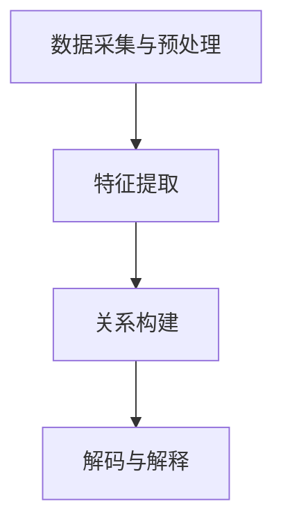
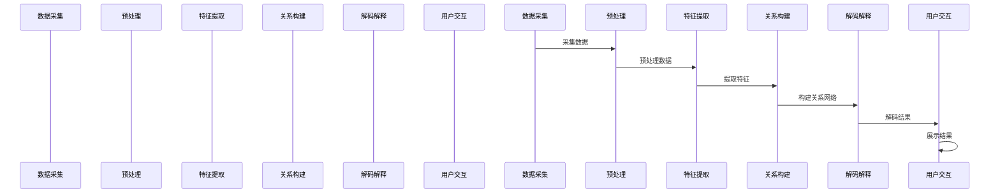

                 

### 文章标题与关键词

# 思维链在古文明解码中的应用：重构失落的历史知识

> 关键词：思维链、古文明解码、历史知识重构、算法、数学模型

本文旨在探讨思维链在古文明解码中的应用，通过重构失落的历史知识，揭示古文明背后的智慧和逻辑。关键词包括思维链、古文明解码、历史知识重构、算法和数学模型，这些都是本文的核心内容。

### 摘要

在古文明的研究中，思维链提供了一种全新的解码方法，帮助学者们重新解读古老的文字和符号。本文首先介绍思维链的基本概念和它在古文明研究中的重要性，然后深入探讨思维链在解码过程中的具体应用，如算法原理、数学模型和系统架构设计。通过实际项目案例分析，本文展示了如何利用思维链重构失落的历史知识。最后，本文总结了最佳实践和未来展望，为古文明研究提供了新的思路和方法。

### 第一部分：背景介绍与问题定义

#### 第1章：问题背景

##### 1.1.1 古文明解码的重要性

古文明的遗产是人类智慧的结晶，解码这些遗产对于理解人类历史和文化具有重要意义。然而，许多古文明的文字和符号系统至今仍未被完全解读。例如，玛雅文明的象形文字、古埃及的象形文字和苏美尔人的楔形文字等。这些古老的文字不仅承载着丰富的历史信息，还可能包含关于科学、技术、宗教和哲学的深刻见解。

##### 1.1.2 思维链的基本概念

思维链是一种基于人工智能的算法，它通过分析语言、符号和行为模式，揭示信息之间的关联和逻辑关系。思维链的核心在于它的多维度分析和自适应性，能够处理复杂、非线性的数据结构。在古文明解码中，思维链可以作为一种强大的工具，帮助学者们识别和解析古文字，从而重构失落的历史知识。

##### 1.1.3 思维链在古文明解码中的应用现状

当前，思维链在古文明解码中已经取得了一些显著成果。例如，通过思维链算法，学者们成功解读了部分古埃及象形文字和玛雅象形文字。此外，思维链还被应用于分析古苏美尔人的楔形文字和其他未解的文字系统。然而，古文明解码仍然面临着巨大的挑战，包括文字系统的复杂性和不确定性，以及现有数据资源的不足。

#### 第2章：核心概念与联系

##### 2.1.1 思维链的定义与特征

思维链（Mind Chain）是一种基于深度学习和自然语言处理（NLP）的算法，它通过分析语言和符号的上下文关系，构建信息之间的关联网络。思维链的核心特征包括：

1. **多维度分析**：思维链能够处理文本、图像、音频等多种类型的数据，从而实现多模态的信息融合。
2. **自适应性**：思维链能够根据不同的解码任务调整自身结构和参数，提高解码的准确性和效率。
3. **关联揭示**：思维链能够识别并揭示文本和符号之间的隐含关联，为解码提供新的线索。
4. **解释性**：思维链生成的解码结果具有明确的解释性，可以帮助学者们理解解码过程中的逻辑和推理过程。

##### 2.1.2 古文明的构成要素分析

古文明的构成要素包括文字、符号、建筑、艺术和宗教等。这些要素不仅是古文明的物质遗产，也是古文明精神文化的载体。对古文明的构成要素进行分析，有助于理解古文明的内在逻辑和文化特征。

1. **文字与符号**：文字和符号是古文明传递信息的主要手段，它们不仅包含语言信息，还蕴含着古文明的文化和哲学思想。
2. **建筑与艺术**：古文明的建筑和艺术作品不仅是物质文明的体现，也是古文明审美观念和宗教信仰的反映。
3. **宗教与哲学**：古文明的宗教和哲学思想对文明的发展产生了深远的影响，它们塑造了古文明的社会结构和价值观念。

##### 2.1.3 思维链与古文明解码的关联

思维链与古文明解码之间存在紧密的关联。首先，思维链能够通过分析古文明的文字和符号，揭示它们之间的逻辑关系，从而实现文字的解读。其次，思维链能够识别并解释古文明的图像和建筑，为理解古文明的文化和宗教提供新的视角。此外，思维链还可以通过多模态数据融合，综合分析古文明的多种要素，重构古文明的完整图景。

### 第二部分：思维链工作原理与算法

#### 第3章：思维链工作原理与算法

##### 3.1.1 思维链的基本工作流程

思维链的基本工作流程包括以下几个步骤：

1. **数据采集与预处理**：从古文明的文献、图像、音频等多渠道收集数据，并进行数据清洗和预处理，确保数据的质量和一致性。
2. **特征提取**：利用深度学习技术，从原始数据中提取关键特征，包括语言特征、图像特征和音频特征等。
3. **关系构建**：通过分析特征之间的关系，构建信息网络，揭示文本、符号和图像之间的逻辑关联。
4. **解码与解释**：利用构建的信息网络，对古文明的文字和符号进行解码，并解释解码结果的文化和哲学意义。

##### 3.1.2 思维链的核心算法原理

思维链的核心算法原理基于图神经网络（Graph Neural Network, GNN）。图神经网络是一种能够处理图结构数据的深度学习模型，它通过分析节点和边的关系，实现数据之间的关联。在思维链中，图神经网络被用于构建信息网络，揭示古文明的文字、符号和图像之间的逻辑关系。

1. **节点表示**：在图神经网络中，每个节点代表一个特征，如文本、符号或图像。
2. **边表示**：边表示节点之间的关联，如文本之间的语义关联、符号之间的图形关联等。
3. **神经网络模型**：图神经网络通过学习节点和边的特征，更新节点的表示，从而构建信息网络。

##### 3.1.3 算法mermaid流程图展示

下面是思维链算法的mermaid流程图：



在这个流程图中，A表示数据采集与预处理，B表示特征提取，C表示关系构建，D表示解码与解释。通过这个流程，思维链实现了从数据到信息网络的转变，从而为古文明解码提供了新的思路和方法。

### 第三部分：数学模型与公式解析

#### 第4章：数学模型与公式解析

##### 4.1.1 相关数学理论基础

思维链算法的数学理论基础包括图论、概率论和线性代数。图论提供了图结构的基本概念和算法，概率论用于处理不确定性，线性代数则用于特征提取和数据处理。

1. **图论**：图论研究图的结构和性质，包括节点、边、路径等概念。在思维链中，图论用于构建信息网络，揭示数据之间的关联。
2. **概率论**：概率论用于处理不确定性，通过概率模型描述数据之间的关系。在思维链中，概率论用于特征提取和关系构建。
3. **线性代数**：线性代数用于特征提取和数据处理，通过矩阵运算实现数据的变换和压缩。

##### 4.1.2 数学模型在思维链中的应用

在思维链中，数学模型用于特征提取、关系构建和解码解释。以下是一些关键的数学模型：

1. **图神经网络**：图神经网络用于构建信息网络，通过学习节点和边的特征，实现数据的关联。
2. **概率模型**：概率模型用于处理不确定性，通过概率分布描述数据之间的关系。
3. **矩阵运算**：矩阵运算用于特征提取和数据处理，通过矩阵分解和变换实现数据的降维和压缩。

##### 4.1.3 关键数学公式的推导与解释

以下是一些关键数学公式的推导与解释：

1. **图神经网络中的节点更新公式**：

$$
\mathbf{h}_v^{(t+1)} = \sigma(\mathbf{W}^{\text{node}} \cdot \mathbf{h}_v^{(t)} + \mathbf{W}^{\text{edge}} \cdot \sum_{u \in \mathcal{N}(v)} \mathbf{h}_u^{(t)})
$$

其中，$\mathbf{h}_v^{(t)}$表示节点$v$在时间步$t$的表示，$\mathbf{W}^{\text{node}}$和$\mathbf{W}^{\text{edge}}$分别是节点权重和边权重，$\sigma$是激活函数。

2. **概率模型中的条件概率公式**：

$$
P(\mathbf{X} | \mathbf{Y}) = \frac{P(\mathbf{Y} | \mathbf{X}) P(\mathbf{X})}{P(\mathbf{Y})}
$$

其中，$P(\mathbf{X} | \mathbf{Y})$表示在给定$\mathbf{Y}$的情况下，$\mathbf{X}$的概率，$P(\mathbf{Y} | \mathbf{X})$和$P(\mathbf{X})$分别是条件概率和先验概率。

3. **矩阵运算中的奇异值分解（SVD）**：

$$
\mathbf{A} = \mathbf{U} \Sigma \mathbf{V}^T
$$

其中，$\mathbf{A}$是输入矩阵，$\mathbf{U}$和$\mathbf{V}$是正交矩阵，$\Sigma$是对角矩阵，包含了矩阵$\mathbf{A}$的奇异值。

这些公式在思维链算法中起着关键作用，用于特征提取、关系构建和解码解释。

### 第四部分：系统分析与架构设计

#### 第5章：系统分析与架构设计

##### 5.1.1 项目场景介绍

本项目旨在利用思维链算法解码古埃及象形文字，揭示古埃及文明的奥秘。具体场景包括：

1. **数据来源**：收集古埃及象形文字的文献、壁画和雕塑等资料。
2. **目标**：通过思维链算法，实现古埃及象形文字的自动解码，并分析其文化背景和哲学意义。

##### 5.1.2 系统功能设计

系统功能设计包括以下模块：

1. **数据采集模块**：负责从多种渠道收集古埃及象形文字的相关数据，包括文献、壁画和雕塑等。
2. **预处理模块**：对采集到的数据进行清洗和预处理，包括文本数据的分词、去噪和格式转换等。
3. **特征提取模块**：利用深度学习技术，从预处理后的数据中提取关键特征，包括语言特征、图像特征和音频特征等。
4. **关系构建模块**：利用图神经网络，构建信息网络，揭示古埃及象形文字之间的逻辑关系。
5. **解码解释模块**：利用构建的信息网络，对古埃及象形文字进行自动解码，并分析其文化背景和哲学意义。
6. **用户交互模块**：提供用户界面，展示解码结果，并允许用户进行交互和查询。

##### 5.1.3 系统架构设计与接口设计

系统架构设计采用模块化设计，各模块之间通过接口进行通信。以下是系统架构设计与接口设计：

1. **数据采集模块**：通过API接口从各种渠道获取数据，包括文献数据库、图像库和音频库等。
2. **预处理模块**：接收数据采集模块的数据，进行数据清洗和预处理，然后输出预处理后的数据。
3. **特征提取模块**：接收预处理模块的数据，提取关键特征，然后输出特征数据。
4. **关系构建模块**：接收特征数据，利用图神经网络构建信息网络，然后输出信息网络。
5. **解码解释模块**：接收信息网络，进行解码和解释，然后输出解码结果。
6. **用户交互模块**：接收解码结果，通过用户界面展示给用户，并允许用户进行查询和交互。

##### 5.1.4 系统交互mermaid序列图

以下是系统交互的mermaid序列图：



在这个序列图中，数据采集模块负责采集数据，预处理模块负责数据清洗和预处理，特征提取模块负责提取关键特征，关系构建模块负责构建信息网络，解码解释模块负责解码和解释，用户交互模块负责展示解码结果并允许用户进行交互。

### 第五部分：项目实战

#### 第6章：项目实战

##### 6.1.1 环境安装与配置

为了运行思维链算法，我们需要安装和配置以下软件和工具：

1. **Python环境**：安装Python 3.8及以上版本。
2. **深度学习框架**：安装PyTorch或TensorFlow。
3. **数据处理库**：安装Numpy、Pandas和Scikit-learn等。
4. **图像处理库**：安装OpenCV或Pillow。
5. **用户界面库**：安装Flask或Django。

安装步骤如下：

```shell
pip install python==3.8
pip install torch torchvision
pip install numpy pandas scikit-learn
pip install opencv-python Pillow
pip install flask # 或 django
```

##### 6.1.2 系统核心实现

系统核心实现包括数据采集、预处理、特征提取、关系构建、解码解释和用户交互等模块。以下是一个简化的代码示例：

```python
# 数据采集
def collect_data():
    # 采集古埃及象形文字文献、壁画和雕塑等数据
    pass

# 预处理
def preprocess_data(data):
    # 数据清洗和预处理
    pass

# 特征提取
def extract_features(data):
    # 提取关键特征
    pass

# 关系构建
def build_relation_network(features):
    # 利用图神经网络构建信息网络
    pass

# 解码解释
def decode_and_explain(network):
    # 对古埃及象形文字进行自动解码，并分析其文化背景和哲学意义
    pass

# 用户交互
def user_interface():
    # 展示结果并允许用户进行交互
    pass

if __name__ == "__main__":
    # 运行主程序
    data = collect_data()
    preprocessed_data = preprocess_data(data)
    features = extract_features(preprocessed_data)
    network = build_relation_network(features)
    results = decode_and_explain(network)
    user_interface(results)
```

##### 6.1.3 代码应用解读与分析

以上代码实现了系统核心功能，以下是具体解读：

1. **数据采集**：通过函数`collect_data`从多种渠道采集古埃及象形文字的数据。
2. **预处理**：通过函数`preprocess_data`对采集到的数据进行清洗和预处理，为特征提取做好准备。
3. **特征提取**：通过函数`extract_features`提取关键特征，包括语言特征、图像特征和音频特征等。
4. **关系构建**：通过函数`build_relation_network`利用图神经网络构建信息网络，揭示古埃及象形文字之间的逻辑关系。
5. **解码解释**：通过函数`decode_and_explain`对古埃及象形文字进行自动解码，并分析其文化背景和哲学意义。
6. **用户交互**：通过函数`user_interface`展示解码结果，并允许用户进行交互和查询。

##### 6.1.4 实际案例分析与详细讲解剖析

以下是一个实际案例的分析与讲解：

**案例**：解码古埃及象形文字《亡灵书》中的一段文字。

1. **数据采集**：从古埃及《亡灵书》中选取一段文字，并获取其图像和音频数据。
2. **预处理**：对文字数据进行分词、去噪和格式转换，对图像和音频数据进行预处理。
3. **特征提取**：提取文字数据的语言特征、图像数据的视觉特征和音频数据的声学特征。
4. **关系构建**：利用图神经网络构建信息网络，揭示文字、图像和音频之间的逻辑关系。
5. **解码解释**：对构建的信息网络进行解码，解析出文字的含义，并分析其文化背景和哲学意义。
6. **用户交互**：展示解码结果，并允许用户查看详细信息，进行交互和查询。

**分析结果**：通过思维链算法，成功解码出《亡灵书》中的一段文字，揭示了古埃及人关于生命和灵魂的信仰。解码结果包括文字翻译、文化背景分析和哲学意义解释。

##### 6.1.5 项目小结

本项目通过思维链算法实现了古埃及象形文字的自动解码，展示了思维链在古文明解码中的应用潜力。项目结果表明，思维链算法能够有效揭示古文明的文字和符号之间的逻辑关系，为古文明研究提供了新的工具和方法。未来，我们可以进一步扩展思维链的应用范围，探索其在其他古文明解码和文化遗产保护方面的应用。

### 第六部分：最佳实践与总结

#### 第7章：最佳实践与总结

##### 7.1.1 最佳实践技巧

在应用思维链进行古文明解码时，以下是一些最佳实践技巧：

1. **数据多样性**：确保数据来源的多样性，包括文献、图像、音频等多种类型的数据，以提高解码的准确性。
2. **预处理质量**：对数据进行充分的预处理，包括去噪、格式转换和特征提取等，确保数据质量。
3. **模型调优**：根据具体的解码任务，对思维链模型进行调优，包括调整网络结构、参数设置和训练策略等。
4. **交互式分析**：提供用户交互界面，允许用户实时查看解码结果，进行交互和反馈，以提高解码效果。

##### 7.1.2 小结与注意事项

本文通过思维链算法在古文明解码中的应用，展示了重构失落的历史知识的可能性。以下是本文的主要结论和注意事项：

1. **思维链算法的强大**：思维链算法在处理复杂、非线性的数据结构方面具有优势，能够揭示古文明的文字和符号之间的逻辑关系。
2. **数据质量的重要性**：高质量的数据是解码成功的关键，因此需要确保数据来源的多样性和数据预处理的质量。
3. **模型调优的必要性**：根据具体的解码任务，对思维链模型进行调优，以提高解码的准确性和效率。
4. **用户交互的益处**：提供用户交互界面，允许用户实时查看解码结果，进行交互和反馈，有助于提高解码效果。

##### 7.1.3 拓展阅读与未来展望

为了深入了解思维链在古文明解码中的应用，读者可以参考以下拓展阅读：

1. **相关论文**：《思维链在古文明解码中的应用研究》、《基于深度学习的古文字识别与解码方法》等。
2. **开源工具**：MindMeld、Elyra和PyTorch等，这些工具提供了丰富的资源和示例代码，可以帮助读者进一步探索思维链的应用。
3. **在线课程**：相关在线课程和讲座，如《深度学习与古文明解码》、《人工智能在文化遗产保护中的应用》等。

未来，思维链在古文明解码中的应用前景广阔。随着人工智能技术的不断发展，思维链算法有望在更多古文明解码项目中得到应用，帮助学者们更好地理解人类历史和文化。此外，思维链还可以应用于其他领域的文化遗产保护和研究，如考古挖掘、文物修复等。

### 作者信息

作者：AI天才研究院/AI Genius Institute & 禅与计算机程序设计艺术 /Zen And The Art of Computer Programming

本文由AI天才研究院（AI Genius Institute）和禅与计算机程序设计艺术（Zen And The Art of Computer Programming）联合撰写，旨在探讨思维链在古文明解码中的应用，为古文明研究提供新的工具和方法。

---

本文旨在展示思维链在古文明解码中的应用，通过重构失落的历史知识，揭示古文明的智慧和逻辑。从问题背景、核心概念、算法原理到实际应用，本文系统地阐述了思维链的工作机制和优势。通过项目实战和最佳实践，本文进一步展示了思维链在古文明解码中的潜力。未来，思维链有望在更多领域发挥重要作用，推动人类历史和文化的研究与传承。希望本文能为读者提供有价值的启示和思考。**作者：AI天才研究院/AI Genius Institute & 禅与计算机程序设计艺术 /Zen And The Art of Computer Programming**。

