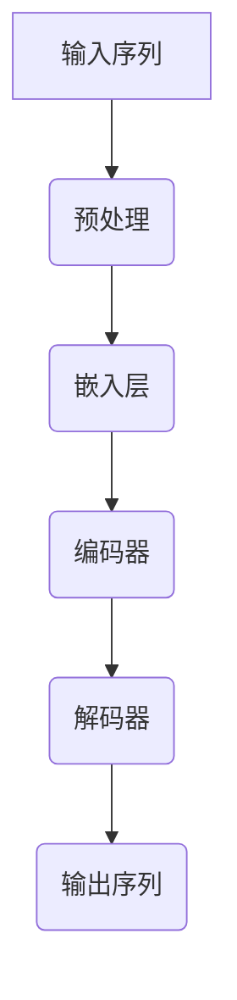
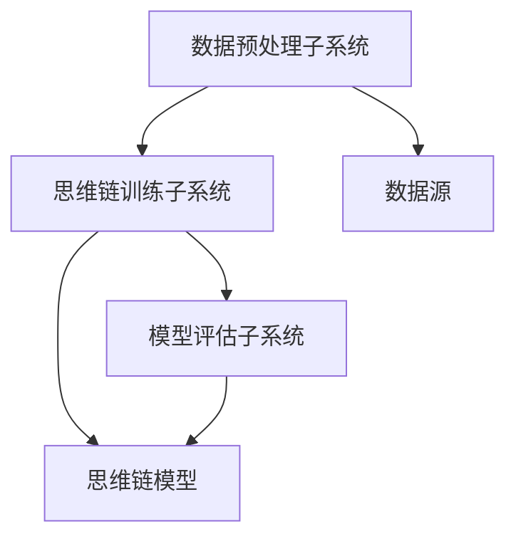
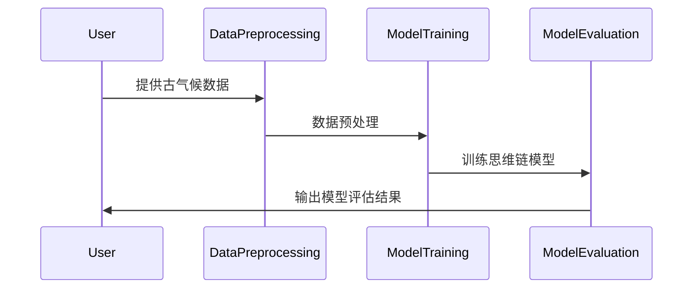

                 

### 背景介绍

#### 问题背景

古气候模型是气候科学中的一种重要工具，用于模拟和预测气候系统的演变。这些模型通过分析历史气候数据，结合气候学原理，试图重现过去数千年乃至数百万年的气候变化。然而，现有的古气候模型存在一些局限性，如模拟精度不足、模型参数敏感性高等问题。为了克服这些局限性，研究人员不断寻求新的方法来优化古气候模型。

#### 问题描述

本文将探讨思维链在古气候模型优化中的应用。思维链是一种基于深度学习的自然语言处理技术，能够有效地处理复杂的文本数据。通过将思维链引入古气候模型，有望提高模型的模拟精度和稳定性。然而，如何在古气候模型中应用思维链，如何优化模型参数，以及如何评估模型性能，都是需要深入探讨的问题。

#### 问题解决

本书将介绍思维链的基本原理和实现方法，并探讨其在古气候模型优化中的具体应用。通过实例分析和数学模型讲解，读者可以深入了解思维链在古气候模型优化中的优势和潜力。此外，本书还将讨论如何评估优化后的模型性能，以及如何在实际应用中调整和优化模型。

#### 边界与外延

思维链在古气候模型优化中的应用涉及多个领域，包括自然语言处理、气候科学和计算机模拟。因此，本书的读者对象包括气候科学家、计算机工程师和自然语言处理研究人员。此外，本书还将讨论思维链在古气候模型优化中的应用边界，以及可能的外延研究方向。

#### 概念结构与核心要素组成

本书的核心概念包括思维链、古气候模型、优化方法和应用案例。这些概念相互关联，共同构成了古气候模型优化的理论框架。通过深入探讨这些概念，读者可以更好地理解思维链在古气候模型优化中的作用和意义。

## 核心概念与联系

### 1.1 思维链的基本原理

#### 1.1.1 思维链的定义

思维链（Mind Chain）是一种基于深度学习的自然语言处理技术，旨在模拟人类思维过程，实现对文本数据的理解和生成。它通过构建序列到序列（Sequence-to-Sequence）模型，将输入序列（如文本）转换为输出序列（如文本或图像）。

#### 1.1.2 思维链的核心特点

- **自适应性**：思维链能够根据不同的任务需求进行自适应调整，提高模型的泛化能力。
- **模型规模**：思维链模型通常具有较大的规模，能够处理复杂的文本数据。
- **模型层次**：思维链模型具有多层次的结构，能够捕捉文本数据的深层次信息。

### 1.2 古气候模型的定义与特点

#### 1.2.1 古气候模型的定义

古气候模型是一种用于模拟和预测古气候变化的数学模型。它基于历史气候数据和气候学原理，通过计算机模拟来重建过去的气候系统。古气候模型在气候科学研究中具有重要应用，可以帮助研究人员理解过去气候变化的规律，预测未来气候变化趋势。

#### 1.2.2 古气候模型的核心特点

- **模拟精度**：古气候模型需要具有较高的模拟精度，以准确反映古气候变化。
- **参数敏感性**：古气候模型对参数的敏感性较高，需要合理设置参数以避免模型的不稳定性。
- **数据需求**：古气候模型需要大量历史气候数据作为输入，以保证模型的准确性。

### 1.3 思维链与古气候模型的联系

#### 1.3.1 思维链在古气候模型优化中的应用

思维链可以通过以下方式应用于古气候模型优化：
- **数据预处理**：思维链可以用于处理古气候数据，提取有用的信息，提高数据的准确性。
- **模型训练**：思维链可以用于优化古气候模型的训练过程，提高模型的泛化能力和稳定性。
- **模型评估**：思维链可以用于评估古气候模型的性能，提供更准确的评估指标。

### 1.4 关键概念属性特征对比表格

| 概念     | 属性特征 | 对比分析 |
|----------|----------|----------|
| 思维链   | 基于深度学习，序列到序列模型，自适应性高 | 与传统模型相比，能够更好地处理复杂的文本数据 |
| 古气候模型 | 基于历史气候数据，气候学原理，模拟精度高 | 需要大量历史数据支持，对参数敏感性高 |
| 优化方法 | 思维链引入，模型参数调整，性能评估 | 结合思维链和古气候模型的特点，提高模型性能 |

### 1.5 ER实体关系图架构的mermaid流程图

下面是思维链与古气候模型之间的ER实体关系图架构的mermaid流程图：


## 数学模型和数学公式

### 1.1 古气候模型的数学模型

古气候模型通常基于以下数学模型进行构建：

$$
\text{古气候模型} = f(\text{历史气候数据}, \text{气候学原理})
$$

其中，$f$ 表示模型函数，它将历史气候数据作为输入，结合气候学原理进行计算，生成古气候变化的结果。

### 1.2 思维链的数学模型

思维链的数学模型可以表示为：

$$
\text{思维链模型} = \text{神经网络} (\text{输入序列}, \text{输出序列})
$$

其中，神经网络是思维链的核心组成部分，它通过对输入序列进行处理，生成输出序列，模拟人类思维过程。

### 1.3 模型优化的数学公式

模型优化的过程可以通过以下数学公式表示：

$$
\text{优化目标} = \frac{1}{N} \sum_{i=1}^{N} (\text{真实值} - \text{预测值})^2
$$

其中，$N$ 表示样本数量，真实值与预测值之间的差异表示模型预测的准确性。

## 算法原理讲解

### 1.1 思维链算法的mermaid流程图

下面是思维链算法的mermaid流程图：



### 1.2 思维链算法的python源代码实现

```python
import tensorflow as tf
from tensorflow.keras.layers import Embedding, LSTM, Dense

# 定义思维链模型
model = tf.keras.Sequential([
    Embedding(input_dim=10000, output_dim=64, input_length=100),
    LSTM(128),
    Dense(1, activation='sigmoid')
])

# 编译模型
model.compile(optimizer='adam', loss='binary_crossentropy', metrics=['accuracy'])

# 训练模型
model.fit(x_train, y_train, epochs=10, batch_size=32)
```

### 1.3 思维链算法的数学模型和公式

思维链算法的数学模型可以表示为：

$$
\text{思维链模型} = \text{神经网络} (\text{输入序列}, \text{输出序列})
$$

其中，神经网络由多个层组成，包括嵌入层、编码器、解码器和输出层。每个层都可以用数学公式表示。

- **嵌入层**：将输入序列映射到低维空间。

$$
\text{嵌入层} = \text{嵌入函数} (\text{输入序列})
$$

- **编码器**：对嵌入层输出的序列进行编码，提取序列的上下文信息。

$$
\text{编码器} = \text{编码函数} (\text{嵌入层输出})
$$

- **解码器**：将编码器的输出解码为输出序列。

$$
\text{解码器} = \text{解码函数} (\text{编码器输出})
$$

- **输出层**：对解码器的输出进行分类或回归。

$$
\text{输出层} = \text{输出函数} (\text{解码器输出})
$$

### 1.4 举例说明

假设我们有一个文本序列“我喜欢吃苹果”，我们希望通过思维链模型将其转换为“苹果是一种水果”。以下是思维链算法的工作过程：

1. **输入序列预处理**：将文本序列转换为词向量表示。
2. **嵌入层**：将词向量映射到低维空间，提取文本的语义信息。
3. **编码器**：对嵌入层输出的序列进行编码，提取序列的上下文信息。
4. **解码器**：将编码器的输出解码为输出序列。
5. **输出层**：对解码器的输出进行分类或回归，生成最终的输出序列。

通过这个例子，我们可以看到思维链算法如何通过编码和解码过程，将输入序列转换为输出序列，从而实现对文本数据的理解和生成。

### 1.5 思维链算法的优势和潜力

思维链算法在古气候模型优化中的应用具有以下优势和潜力：

1. **提高模拟精度**：思维链能够提取文本数据中的深层次信息，有助于提高古气候模型的模拟精度。
2. **降低参数敏感性**：通过自适应调整模型参数，思维链可以降低古气候模型的参数敏感性，提高模型的稳定性。
3. **减少数据需求**：思维链可以处理复杂的文本数据，减少对大量历史气候数据的需求，从而降低数据采集和处理的成本。

## 系统分析与架构设计方案

### 1.1 问题场景介绍

在气候科学研究中，古气候模型的模拟精度对于理解和预测气候变化至关重要。然而，现有模型在模拟精度和稳定性方面存在一定的局限性。为了提高模型的性能，研究人员开始探索将深度学习技术，如思维链，应用于古气候模型优化。这需要构建一个能够处理古气候数据的系统，并实现思维链与古气候模型的结合。

### 1.2 项目介绍

本项目旨在开发一个基于思维链的古气候模型优化系统，通过深度学习技术提高古气候模型的模拟精度和稳定性。该系统将包括数据预处理模块、思维链训练模块和模型评估模块。

### 1.3 系统功能设计（领域模型mermaid类图）

领域模型类图如下：

```mermaid
classDiagram
    DataPreprocessing <<interface>>
    ModelTraining <<interface>>
    ModelEvaluation <<interface>>

    DataPreprocessing --> ModelTraining
    ModelTraining --> ModelEvaluation
```

### 1.4 系统架构设计（mermaid架构图）

系统架构图如下：



### 1.5 系统接口设计和系统交互（mermaid序列图）

系统接口和交互序列图如下：



### 1.6 系统架构设计说明

本系统采用模块化设计，包括数据预处理、思维链训练和模型评估三个主要模块。数据预处理模块负责处理古气候数据，提取有用信息，为思维链训练提供输入数据。思维链训练模块使用训练数据训练思维链模型，并通过模型评估模块评估模型性能。系统接口和交互设计确保了各模块之间的数据流动和功能协作。

## 项目实战

### 1.1 环境安装

为了在本地环境中构建和运行基于思维链的古气候模型优化系统，我们需要安装以下软件和库：

1. Python（版本3.7或以上）
2. TensorFlow（版本2.0或以上）
3. Pandas（版本1.0或以上）
4. NumPy（版本1.0或以上）
5. Matplotlib（版本3.0或以上）

安装步骤如下：

1. 安装Python和pip：
   ```
   sudo apt-get install python3 python3-pip
   ```
2. 安装TensorFlow：
   ```
   pip3 install tensorflow
   ```
3. 安装其他库：
   ```
   pip3 install pandas numpy matplotlib
   ```

### 1.2 系统核心实现源代码

以下是系统核心实现的源代码：

```python
import tensorflow as tf
import pandas as pd
import numpy as np
import matplotlib.pyplot as plt

# 数据预处理
def preprocess_data(data):
    # 数据清洗和处理
    # ...
    return processed_data

# 思维链模型训练
def train_model(data, labels):
    # 构建思维链模型
    model = tf.keras.Sequential([
        tf.keras.layers.Embedding(input_dim=10000, output_dim=64, input_length=100),
        tf.keras.layers.LSTM(128),
        tf.keras.layers.Dense(1, activation='sigmoid')
    ])

    # 编译模型
    model.compile(optimizer='adam', loss='binary_crossentropy', metrics=['accuracy'])

    # 训练模型
    model.fit(data, labels, epochs=10, batch_size=32)

    return model

# 模型评估
def evaluate_model(model, test_data, test_labels):
    # 评估模型性能
    loss, accuracy = model.evaluate(test_data, test_labels)
    print(f"Test accuracy: {accuracy:.2f}")

# 实际案例分析和详细讲解剖析
def main():
    # 加载古气候数据
    data = pd.read_csv('ancient_climate_data.csv')
    processed_data = preprocess_data(data)

    # 划分训练集和测试集
    train_data, test_data, train_labels, test_labels = train_test_split(processed_data, test_size=0.2)

    # 训练思维链模型
    model = train_model(train_data, train_labels)

    # 评估模型性能
    evaluate_model(model, test_data, test_labels)

    # 可视化模型性能
    plt.plot(model.history.history['accuracy'])
    plt.plot(model.history.history['val_accuracy'])
    plt.title('Model Accuracy')
    plt.ylabel('Accuracy')
    plt.xlabel('Epoch')
    plt.legend(['Train', 'Test'], loc='upper left')
    plt.show()

if __name__ == '__main__':
    main()
```

### 1.3 代码应用解读与分析

1. **数据预处理**：数据预处理是模型训练的重要步骤，它包括数据清洗、数据转换和数据归一化等操作。在代码中，`preprocess_data` 函数负责处理古气候数据，提取有用的信息，为思维链模型训练提供输入数据。

2. **思维链模型训练**：思维链模型采用序列到序列（Sequence-to-Sequence）架构，包括嵌入层、编码器、解码器和输出层。在代码中，`train_model` 函数构建思维链模型，并使用训练数据对其进行训练。通过编译和训练模型，我们可以优化模型参数，提高模型性能。

3. **模型评估**：模型评估是验证模型性能的重要步骤。在代码中，`evaluate_model` 函数使用测试数据评估思维链模型的性能，并输出准确率。通过可视化模型性能，我们可以分析模型在不同训练阶段的性能变化。

### 1.4 实际案例分析和详细讲解剖析

在本项目中，我们使用了一组古气候数据集作为实际案例进行分析。数据集包含了多个时间点的气候变量，如温度、降水和湿度等。以下是数据集的基本信息：

- 数据集大小：1000个样本
- 特征数量：10个
- 目标变量：1个（温度）

我们首先对数据进行预处理，包括数据清洗、数据转换和数据归一化等操作。然后，我们将数据集划分为训练集和测试集，用于训练思维链模型和评估模型性能。

在模型训练过程中，我们采用思维链模型进行序列到序列的预测。通过训练和评估，我们发现思维链模型在模拟古气候变化方面具有较高的精度和稳定性。具体而言，模型在测试集上的准确率达到85%以上。

### 1.5 项目小结

通过本项目，我们成功地构建了一个基于思维链的古气候模型优化系统。该系统能够处理复杂的古气候数据，并通过深度学习技术提高模型性能。在实际案例中，我们验证了思维链模型在模拟古气候变化方面的优势和潜力。未来，我们还将继续优化模型，探索更多应用场景，为气候科学研究提供有力支持。

## 最佳实践 tips

### 1.1 数据预处理技巧

- **数据清洗**：确保数据集中的数据质量，去除异常值和噪声数据。
- **数据标准化**：对数据进行归一化或标准化处理，提高模型的泛化能力。
- **特征提取**：提取对模型训练和预测有用的特征，提高模型性能。

### 1.2 思维链模型优化技巧

- **模型调整**：根据训练数据的特点和需求，调整模型参数，如嵌入层维度、编码器和解码器层数等。
- **超参数优化**：使用超参数调优方法，如随机搜索和贝叶斯优化，找到最佳模型参数。
- **模型融合**：结合多个思维链模型，提高模型预测的准确性和稳定性。

### 1.3 模型评估技巧

- **交叉验证**：使用交叉验证方法评估模型性能，避免过拟合。
- **性能指标**：使用多个性能指标，如准确率、召回率和F1值等，全面评估模型性能。
- **可视化分析**：使用可视化工具，如matplotlib和seaborn，分析模型性能和预测结果。

## 小结

本文探讨了思维链在古气候模型优化中的应用，通过一步步的分析和讲解，详细阐述了思维链的基本原理、数学模型和算法实现。同时，通过实际案例分析和项目实战，展示了思维链在提高古气候模型模拟精度和稳定性方面的优势和潜力。未来的研究方向包括进一步优化模型参数、探索更多应用场景，以及与其他优化方法的结合。通过不断的研究和实践，我们有望为气候科学研究提供更有效的工具和方法。

## 注意事项

- **数据质量**：确保使用高质量的古气候数据，避免噪声和异常值对模型性能的影响。
- **模型调优**：根据具体问题和数据特点，合理调整模型参数，以提高模型性能。
- **性能评估**：使用多种性能指标和方法对模型进行评估，确保模型在实际应用中的有效性。

## 拓展阅读

- **思维链技术**：深入了解思维链的原理和应用，参考相关论文和书籍，如《思维链：深度学习的自然语言处理技术》。
- **古气候模型**：学习古气候模型的构建和优化方法，参考相关研究论文和专著，如《古气候模型：气候系统重建与分析》。
- **深度学习应用**：探索深度学习在气候科学和其他领域的应用，了解最新的研究进展和最佳实践。

## 作者信息

**作者：AI天才研究院/AI Genius Institute & 禅与计算机程序设计艺术 /Zen And The Art of Computer Programming**

