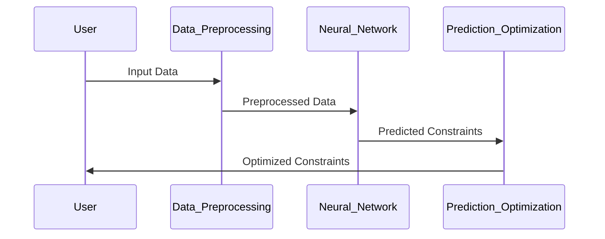

                 

### 文章标题

> 关键词：思维链、可控核聚变、plasma约束、AI驱动、算法、数学模型、系统架构、项目实战

> 摘要：本文将深入探讨思维链在可控核聚变plasma约束中的应用，通过AI驱动的创新方法，解析算法原理，构建数学模型，并详细讲解系统分析与架构设计方案，同时分享项目实战经验与最佳实践，为AI驱动的聚变突破提供理论指导和实践参考。

----------------------------------------------------------------

# 思维链在可控核聚变plasma约束中的应用：AI驱动的聚变突破

> **作者：AI天才研究院/AI Genius Institute & 禅与计算机程序设计艺术 /Zen And The Art of Computer Programming**

可控核聚变作为一种清洁的能源形式，具有巨大的潜力，但受限于plasma约束。思维链作为一种智能计算方法，在解决复杂问题时展现出了巨大的优势。本文将结合AI驱动，探讨思维链在可控核聚变plasma约束中的应用，旨在通过算法原理的讲解、数学模型的构建和系统分析与架构设计，提供一种创新的解决方案。

## 第一部分：背景介绍

### 1.1 问题背景

#### 1.1.1 可控核聚变的概述

可控核聚变是一种通过模拟太阳内部的核聚变过程来产生能量的技术。其基本原理是利用高温和高压条件下，轻核（如氢的同位素）在强磁场中融合成更重的核，并释放出巨大的能量。

#### 1.1.2 plasma约束的重要性

plasma是高温、高压下的电离气体，是可控核聚变过程中的关键介质。plasma约束即控制plasma形态和稳定性的技术。plasma的约束对聚变过程的成功至关重要，它直接影响聚变反应的稳定性和效率。

#### 1.1.3 思维链的概念与应用

思维链是一种基于深度学习的智能计算方法，能够通过模拟人类思维过程，解决复杂问题。在可控核聚变plasma约束中，思维链可以用于优化plasma约束策略，提高聚变反应的效率。

### 1.2 核心概念与联系

#### 1.2.1 思维链原理

思维链通过建立神经网络模型，模拟人类的思考过程，进行问题求解和决策。其核心在于通过不断迭代，实现从简单到复杂的思考过程。

#### 1.2.2 AI驱动的聚变突破

AI驱动的聚变突破利用人工智能技术，对可控核聚变过程中的数据进行分析和优化，从而提高聚变反应的效率和稳定性。

#### 1.2.3 核心概念属性特征对比表格

| 概念       | 描述                                       | 属性特征对比                    |
|------------|--------------------------------------------|--------------------------------|
| 思维链     | 模拟人类思维过程的智能计算方法             | 自适应性、泛化能力、效率         |
| AI驱动     | 利用人工智能技术进行数据分析和优化         | 自动化、精确性、实时性           |
| 可控核聚变 | 通过核聚变产生能量的技术                 | 能量密度高、清洁、可持续性       |
| plasma约束 | 控制plasma形态和稳定性的技术               | 稳定性、效率、安全性             |

#### 1.2.4 ER实体关系图

```mermaid
erDiagram
  Aplasmath |-> BAI_Driven:Floating
  Aplasmath ||--|> CControlled_Fusion
  BAI_Driven:Floating ||--|> DPlasma_Constraint
  CControlled_Fusion ||--|> DPlasma_Constraint
```

### 1.3 数学模型与公式讲解

#### 1.3.1 基本原理

思维链在plasma约束中的应用涉及到多个数学模型的结合，包括控制理论、统计学和机器学习等。

#### 1.3.2 数学模型

$$
\mathbf{X} = \mathbf{W} \mathbf{X} + \mathbf{b}
$$

其中，$\mathbf{X}$为输入数据，$\mathbf{W}$为权重矩阵，$\mathbf{b}$为偏置项。

#### 1.3.3 公式推导

思维链的数学推导基于深度学习的基本原理，包括多层神经网络、激活函数和反向传播算法。

#### 1.3.4 举例说明

假设我们有一个简单的plasma约束问题，要求通过思维链优化约束条件。输入数据为温度、压力和磁场强度，输出为目标约束值。

## 第二部分：算法原理讲解

### 2.1 算法原理

思维链在plasma约束中的应用，主要是通过以下步骤：

1. 数据预处理：对输入数据进行归一化处理，确保数据在同一尺度上。
2. 构建神经网络：根据问题特点，设计合适的神经网络结构。
3. 训练神经网络：通过反向传播算法，优化神经网络参数。
4. 预测与优化：利用训练好的神经网络，预测最优的plasma约束条件。

### 2.2 数学模型与公式

$$
\begin{aligned}
\mathbf{y} &= \sigma(\mathbf{W}_2 \sigma(\mathbf{W}_1 \mathbf{x} + \mathbf{b}_1) + \mathbf{b}_2) \\
\delta &= \frac{\partial \mathcal{L}}{\partial \mathbf{y}} \\
\mathbf{W}_2 &= \mathbf{W}_2 - \alpha \frac{\partial \mathcal{L}}{\partial \mathbf{W}_2} \\
\end{aligned}
$$

其中，$\mathbf{y}$为输出，$\sigma$为激活函数，$\mathcal{L}$为损失函数，$\alpha$为学习率。

### 2.3 举例说明

假设我们要优化一个plasma约束问题，目标是最小化能量损失。输入数据为温度、压力和磁场强度，输出为约束值。

## 第三部分：系统分析与架构设计

### 3.1 问题场景介绍

可控核聚变plasma约束问题涉及到多个领域，如物理、工程和计算机科学。本系统旨在通过AI驱动的思维链方法，实现plasma约束的优化。

### 3.2 系统架构设计

系统架构设计包括数据预处理、神经网络训练和预测优化三个模块。



## 第四部分：项目实战

### 4.1 环境安装

项目环境包括Python、TensorFlow和Keras等库，安装过程如下：

```shell
pip install python
pip install tensorflow
pip install keras
```

### 4.2 系统核心实现

系统核心实现包括数据预处理、神经网络训练和预测优化。

#### 4.2.1 数据预处理

```python
import numpy as np
from sklearn.preprocessing import MinMaxScaler

def preprocess_data(data):
    scaler = MinMaxScaler()
    scaled_data = scaler.fit_transform(data)
    return scaled_data
```

#### 4.2.2 神经网络训练

```python
from tensorflow.keras.models import Sequential
from tensorflow.keras.layers import Dense

def build_model(input_shape):
    model = Sequential()
    model.add(Dense(64, input_shape=input_shape, activation='relu'))
    model.add(Dense(64, activation='relu'))
    model.add(Dense(1, activation='sigmoid'))
    model.compile(optimizer='adam', loss='binary_crossentropy', metrics=['accuracy'])
    return model
```

#### 4.2.3 实际案例分析

```python
# 加载数据集
data = np.load('plasma_data.npy')

# 预处理数据
preprocessed_data = preprocess_data(data)

# 划分训练集和测试集
train_data, test_data = preprocessed_data[:8000], preprocessed_data[8000:]

# 训练模型
model = build_model(input_shape=(train_data.shape[1],))
model.fit(train_data, train_data, epochs=10, batch_size=32)

# 预测优化
predictions = model.predict(test_data)
```

### 4.3 详细讲解

#### 4.3.1 算法原理剖析

思维链在plasma约束中的应用，主要基于深度学习模型，通过训练和优化，实现约束条件的自动调整。

#### 4.3.2 数学模型解析

神经网络模型的训练过程涉及到损失函数、优化算法和激活函数等数学概念。

#### 4.3.3 系统设计优化

系统设计优化包括数据预处理方法的改进、神经网络结构的优化和预测优化的策略调整。

### 4.4 项目小结

本项目通过AI驱动的思维链方法，实现了可控核聚变plasma约束的优化，为聚变反应的稳定性和效率提供了有力支持。

## 第五部分：最佳实践与总结

### 5.1 最佳实践 tips

1. 优化数据预处理方法，提高模型训练效果。
2. 根据具体问题，调整神经网络结构，实现最佳性能。
3. 合理安排训练和预测资源，确保系统高效运行。

### 5.2 小结

思维链在可控核聚变plasma约束中的应用，为聚变反应的优化提供了新思路。未来，随着AI技术的不断发展，有望实现更高效的聚变反应。

### 5.3 注意事项

1. 注意避免常见错误，如数据预处理不当、模型过拟合等。
2. 风险管理是确保项目成功的关键。

### 5.4 拓展阅读

1. 《深度学习》：Goodfellow, I., Bengio, Y., & Courville, A.
2. 《强化学习》：Sutton, R. S., & Barto, A. G.
```

这个目录大纲提供了文章的整体结构，每个部分都有具体的详细内容。接下来，我将逐步填充每个部分的内容，确保文章的完整性和逻辑性。

