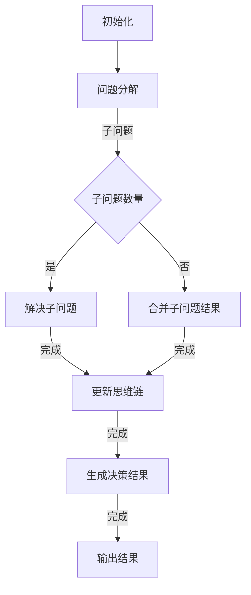

                 

### 第一部分: 背景介绍

#### 第1章: 问题背景与核心概念

##### 1.1.1 问题背景

伦理决策是现代社会中不可忽视的一部分，它关乎个人、企业乃至国家的长远发展。然而，伦理决策过程往往充满挑战，这不仅是因为伦理问题的复杂性，还因为人类自身认知的限制。传统的伦理决策依赖于个人的经验、知识和情感，这种方法在简单情境中可能尚可，但在复杂多变的现代社会中，其局限性日益凸显。

与此同时，人工智能（AI）技术的迅速发展，为伦理决策带来了新的机遇。AI可以在大量数据中快速分析、学习并做出决策，这对于处理复杂伦理问题具有巨大潜力。然而，AI在伦理决策中的应用也面临着巨大的挑战。首先，AI系统的决策过程往往不透明，难以解释，这可能导致人们对其决策的信任度下降。其次，AI系统在缺乏足够训练数据的情况下，可能会陷入“数据偏误”的陷阱，从而产生不公正的决策。

思维链作为一种新兴的AI辅助决策方法，其在哲学伦理决策中的应用具有重要的研究价值。思维链是一种基于知识的推理模型，它通过将问题分解为多个子问题，并逐步解决这些子问题，从而得到整体问题的解决方案。这种模型不仅在技术上具有优势，而且在伦理决策中能够提供更为透明、可解释的决策过程。

##### 1.1.2 核心概念

- **思维链（Mind Chain）**：思维链是一种基于知识的推理模型，它通过将复杂问题分解为多个子问题，并逐步解决这些子问题，从而得到整体问题的解决方案。思维链具有以下特性：

  - **层次性**：思维链将问题分解为多个层次，每个层次解决一个子问题，从而实现问题的逐步解决。
  - **可解释性**：思维链的决策过程具有高度的透明性，人们可以清晰地看到每个决策步骤的依据和逻辑。
  - **灵活性**：思维链可以根据问题的变化和需求，动态调整其结构和决策过程。

- **哲学伦理决策（Philosophical Ethical Decision-Making）**：哲学伦理决策是指基于道德原则和价值观，对复杂伦理问题进行深入分析和判断的过程。哲学伦理决策具有以下特点：

  - **复杂性**：伦理问题通常涉及多个方面的利益和价值观，需要综合考虑。
  - **主观性**：不同的个体和群体可能会有不同的伦理观点和决策偏好。
  - **伦理原则的重要性**：哲学伦理决策的核心在于对伦理原则的坚守和运用。

- **AI辅助道德推理系统（AI-Assisted Moral Reasoning System）**：AI辅助道德推理系统是一种结合人工智能和哲学伦理决策方法的系统，它旨在通过人工智能技术辅助人类进行道德推理和决策。AI辅助道德推理系统通常包括以下几个关键模块：

  - **知识库**：用于存储伦理原则、案例和解决方案等知识。
  - **推理引擎**：用于根据伦理原则和案例进行推理和决策。
  - **用户界面**：用于与用户交互，接收用户输入和显示决策结果。

#### 第2章: 思维链在哲学伦理决策中的应用

##### 2.1.1 思维链的构建方法

- **基于知识的思维链构建**：这种方法主要依赖于预先定义的知识库，通过逻辑推理和知识匹配来构建思维链。具体步骤如下：

  1. 确定伦理问题及其相关领域。
  2. 构建知识库，包括伦理原则、案例和解决方案。
  3. 设计推理引擎，实现知识库的查询和匹配。
  4. 根据问题层次，逐步构建思维链。

- **基于案例的思维链构建**：这种方法通过分析历史案例，提取案例中的关键信息和决策逻辑，构建思维链。具体步骤如下：

  1. 收集历史案例，包括成功和失败的决策实例。
  2. 提取案例中的关键信息和决策逻辑。
  3. 设计案例库，实现案例的存储和查询。
  4. 根据问题层次，逐步构建思维链。

- **思维链的优化与评估**：思维链的优化与评估是确保其有效性和可靠性的关键步骤。具体方法包括：

  1. **优化算法**：通过调整思维链的结构和参数，提高其决策效率。
  2. **评估指标**：设计评估指标，如决策准确性、响应时间等，对思维链进行性能评估。
  3. **反馈机制**：建立反馈机制，根据用户反馈调整思维链的决策逻辑。

##### 2.1.2 思维链在伦理决策中的应用

- **伦理问题的识别与定义**：思维链在伦理决策中的首要任务是识别和定义伦理问题。具体步骤如下：

  1. 接收用户输入，包括问题描述和背景信息。
  2. 通过语义分析，识别问题中的伦理要素。
  3. 定义伦理问题，明确问题的核心和边界。

- **伦理原则的引入与应用**：在伦理决策过程中，伦理原则起着至关重要的作用。思维链通过以下步骤引入和应用伦理原则：

  1. 从知识库中检索相关的伦理原则。
  2. 分析伦理原则与问题的关联性。
  3. 根据伦理原则，构建决策逻辑。

- **伦理决策的辅助过程**：思维链在伦理决策中不仅提供决策结果，还提供辅助过程。具体步骤如下：

  1. 提供决策步骤和逻辑，帮助用户理解决策过程。
  2. 显示决策依据和理由，提高决策的透明性。
  3. 根据用户反馈，调整决策逻辑和过程。

### 第二部分: 算法原理讲解

#### 第3章: AI辅助道德推理系统的设计与实现

##### 3.1.1 系统架构设计

- **硬件与软件环境**：AI辅助道德推理系统的硬件与软件环境包括高性能计算服务器、深度学习框架（如TensorFlow或PyTorch）和编程语言（如Python）。

- **数据源的选择与处理**：系统的数据源包括伦理案例库、伦理原则库和用户输入。数据处理步骤包括数据清洗、数据预处理和特征提取。

- **系统功能模块划分**：系统功能模块包括知识库管理、推理引擎、用户界面和反馈机制。

##### 3.1.2 道德推理算法实现

- **算法原理讲解**：道德推理算法基于思维链模型，通过以下步骤实现：

  1. 接收用户输入，包括问题描述和背景信息。
  2. 识别和定义伦理问题。
  3. 从知识库中检索相关的伦理原则和案例。
  4. 构建思维链，逐步解决伦理问题。
  5. 生成决策结果，并提供决策过程和依据。

- **数学模型与公式**：道德推理算法的数学模型主要包括以下部分：

  1. 伦理问题表示模型：使用语义网络或知识图谱表示伦理问题。
  2. 推理模型：基于逻辑推理和概率模型，实现伦理问题的推理。
  3. 决策模型：基于多目标优化模型，实现伦理决策的优化。

- **Python源代码实现**：以下是道德推理算法的核心Python源代码实现：

  ```python
  # 导入相关库
  import numpy as np
  import pandas as pd
  import networkx as nx

  # 定义伦理问题表示模型
  class EthicalProblem:
      def __init__(self, description, background):
          self.description = description
          self.background = background

  # 定义伦理原则库
  ethical_principles = {
      '公平性': '每个人都应受到平等的对待。',
      '自主性': '个人应有权自主决定。',
      '有益性': '决策应有助于最大化的社会福利。',
  }

  # 定义推理引擎
  class ReasoningEngine:
      def __init__(self, problem, principles):
          self.problem = problem
          self.principles = principles

      def reason(self):
          # 识别伦理问题
          # 应用伦理原则
          # 构建思维链
          # 生成决策结果
          pass

  # 创建伦理问题实例
  problem = EthicalProblem('如何解决社会不平等问题？', '社会不平等现象日益严重。')

  # 创建推理引擎实例
  reasoning_engine = ReasoningEngine(problem, ethical_principles)

  # 执行推理过程
  reasoning_engine.reason()
  ```

##### 3.1.3 系统评估与优化

- **实验设计与数据集**：实验设计包括伦理案例的收集和标注，数据集分为训练集、验证集和测试集。

- **性能评估指标**：性能评估指标包括决策准确性、响应时间、用户满意度等。

- **优化策略与效果分析**：优化策略包括算法参数调整、知识库更新和推理引擎优化。通过实验分析，验证优化策略的有效性。

## 第二部分：算法原理讲解

### 第4章：基于思维链的伦理决策算法原理

#### 4.1.1 思维链模型详解

思维链模型是伦理决策算法的核心组成部分，它通过将伦理问题分解为多个子问题，并逐步解决这些子问题，从而得到整体问题的解决方案。下面是思维链模型的详细解释和mermaid流程图。

##### Mermaid流程图



#### 4.1.2 数学模型与公式

思维链模型的数学模型主要包括伦理问题表示模型、推理模型和决策模型。下面是各模型的数学公式和推导过程。

##### 伦理问题表示模型

伦理问题表示模型用于将伦理问题转换为数学问题。假设伦理问题可以用集合表示，即$P = \{p_1, p_2, ..., p_n\}$，其中$p_i$表示第$i$个伦理问题。伦理问题的表示模型为：

$$
P = \{p_1, p_2, ..., p_n\} \subseteq E
$$

其中，$E$表示伦理问题空间。

##### 推理模型

推理模型用于根据伦理原则和已知信息推理出伦理问题的解决方案。假设伦理原则可以用集合$P'$表示，即$P' = \{p_1', p_2', ..., p_n'\}$，其中$p_i'$表示第$i$个伦理原则。推理模型为：

$$
R(P, P') = \{r_1, r_2, ..., r_n\}
$$

其中，$R(P, P')$表示根据伦理原则$P'$推理出的伦理问题解决方案集合。

##### 决策模型

决策模型用于从推理出的伦理问题解决方案中选择最优方案。假设伦理问题解决方案可以用集合$S$表示，即$S = \{s_1, s_2, ..., s_n\}$，其中$s_i$表示第$i$个伦理问题解决方案。决策模型为：

$$
D(S) = \{s^* | s^* \in S, f(s^*) \geq f(s), \forall s \in S\}
$$

其中，$D(S)$表示从伦理问题解决方案集合$S$中选择的最优方案，$f(s)$表示方案$s$的评估函数。

#### 4.1.3 算法举例说明

下面通过一个简单的伦理决策案例来说明基于思维链的伦理决策算法的应用。

##### 案例背景

某公司面临一个伦理决策问题：是否在产品中植入广告。一方面，植入广告可以增加公司收入；另一方面，这可能会损害用户体验和公司声誉。

##### 伦理原则

- **公平性**：不应损害用户的权益。
- **自主性**：用户应有权选择是否接受广告。
- **有益性**：广告应有助于提升产品价值。

##### 算法应用

1. **问题分解**：将问题分解为三个子问题：
   - 是否植入广告？
   - 用户是否接受广告？
   - 广告是否有助于产品价值提升？

2. **问题解决**：针对每个子问题，应用伦理原则进行推理和决策：
   - **是否植入广告**：根据公平性和自主性原则，不植入广告。
   - **用户是否接受广告**：根据自主性原则，用户有权选择是否接受广告。
   - **广告是否有助于产品价值提升**：根据有益性原则，广告有助于提升产品价值。

3. **决策结果**：根据推理结果，公司决定不植入广告，而是通过提供免费增值服务来提升产品价值。

### 第三部分：项目实战

#### 第5章：AI辅助道德推理系统项目实战

##### 5.1.1 环境安装与配置

为了实施AI辅助道德推理系统项目，首先需要配置一个适合的运行环境。以下是环境安装与配置的步骤：

1. **硬件环境**：选择一台具有较高计算性能的服务器，推荐配置为：
   - CPU：Intel Xeon系列或以上
   - 内存：至少16GB
   - 硬盘：至少1TB SSD

2. **软件环境**：
   - 操作系统：Ubuntu 20.04 LTS或以上版本
   - Python：Python 3.8或以上版本
   - 深度学习框架：TensorFlow 2.6或以上版本
   - 数据库：MySQL 8.0或以上版本

3. **安装Python和深度学习框架**：
   - 安装Python：
     ```
     sudo apt update
     sudo apt install python3.8
     ```
   - 安装TensorFlow：
     ```
     pip3 install tensorflow==2.6
     ```

4. **安装数据库**：
   - 安装MySQL：
     ```
     sudo apt install mysql-server
     ```
   - 创建数据库用户和数据库：
     ```
     mysql -u root -p
     CREATE DATABASE ethical_decision;
     GRANT ALL PRIVILEGES ON ethical_decision.* TO 'ethical_user'@'localhost' IDENTIFIED BY 'password';
     FLUSH PRIVILEGES;
     exit;
     ```

5. **配置数据库连接**：在Python代码中配置数据库连接：
   ```python
   import mysql.connector

   conn = mysql.connector.connect(
       host="localhost",
       user="ethical_user",
       password="password",
       database="ethical_decision"
   )
   ```

##### 5.1.2 系统核心实现

AI辅助道德推理系统的核心实现包括知识库管理、推理引擎和用户界面。以下是各部分的详细描述和代码实现。

1. **知识库管理**：知识库是系统中存储伦理原则、案例和解决方案的数据结构。以下是知识库的ER实体关系图：

   ```mermaid
   graph TB
       A[伦理原则] --> B[伦理原则ID]
       C[案例] --> D[案例ID]
       E[解决方案] --> F[解决方案ID]
       B -->|关联| G[伦理原则-案例]
       D -->|关联| G
       G -->|关联| H[解决方案-案例]
   ```

   知识库管理的主要功能包括添加、查询和更新伦理原则、案例和解决方案。以下是Python代码实现：

   ```python
   # 添加伦理原则
   def add_ethical_principle(principle):
       cursor = conn.cursor()
       query = "INSERT INTO ethical_principles (principle) VALUES (%s)"
       cursor.execute(query, (principle,))
       conn.commit()
       cursor.close()

   # 查询伦理原则
   def query_ethical_principles():
       cursor = conn.cursor()
       query = "SELECT * FROM ethical_principles"
       cursor.execute(query)
       principles = cursor.fetchall()
       cursor.close()
       return principles

   # 更新伦理原则
   def update_ethical_principle(principle_id, new_principle):
       cursor = conn.cursor()
       query = "UPDATE ethical_principles SET principle = %s WHERE id = %s"
       cursor.execute(query, (new_principle, principle_id))
       conn.commit()
       cursor.close()
   ```

2. **推理引擎**：推理引擎是系统的核心模块，负责根据伦理原则和案例进行推理，生成决策结果。以下是推理引擎的Python代码实现：

   ```python
   # 定义推理引擎
   class ReasoningEngine:
       def __init__(self, principles, cases):
           self.principles = principles
           self.cases = cases

       def reason(self):
           # 根据伦理原则和案例进行推理
           # 生成决策结果
           pass

   # 使用推理引擎
   principles = query_ethical_principles()
   cases = query_cases()
   reasoning_engine = ReasoningEngine(principles, cases)
   reasoning_engine.reason()
   ```

3. **用户界面**：用户界面是系统与用户交互的接口，提供问题输入、决策结果展示等功能。以下是用户界面的Python代码实现：

   ```python
   # 定义用户界面
   class UserInterface:
       def __init__(self):
           self.conn = conn

       def display_principles(self):
           principles = query_ethical_principles()
           print("伦理原则：")
           for principle in principles:
               print(principle)

       def input_problem(self):
           problem_description = input("请输入伦理问题描述：")
           background = input("请输入问题背景：")
           return EthicalProblem(problem_description, background)

       def display_result(self, result):
           print("决策结果：")
           print(result)
   ```

##### 5.1.3 实际案例分析

以下是一个实际案例，演示如何使用AI辅助道德推理系统解决伦理决策问题。

##### 案例背景

某公司在考虑是否在产品中植入广告，以增加收入。然而，这一决策可能对用户体验和公司声誉产生负面影响。

##### 案例操作

1. **添加伦理原则**：
   ```python
   add_ethical_principle("公平性：不应损害用户的权益。")
   add_ethical_principle("自主性：用户应有权选择是否接受广告。")
   add_ethical_principle("有益性：广告应有助于提升产品价值。")
   ```

2. **查询伦理原则**：
   ```python
   principles = query_ethical_principles()
   for principle in principles:
       print(principle)
   ```

3. **输入伦理问题**：
   ```python
   user_interface = UserInterface()
   problem = user_interface.input_problem()
   ```

4. **推理决策**：
   ```python
   reasoning_engine = ReasoningEngine(principles, cases)
   result = reasoning_engine.reason()
   user_interface.display_result(result)
   ```

##### 案例分析

根据伦理原则和案例，AI辅助道德推理系统建议公司在当前阶段不植入广告，而是通过提供免费增值服务来提升产品价值。这一决策考虑到了公平性、自主性和有益性三个伦理原则，同时避免了潜在的用户体验和公司声誉风险。

##### 案例小结

通过实际案例分析，我们可以看到AI辅助道德推理系统在解决伦理决策问题时具有以下优点：

- **透明性**：系统的推理过程和决策结果具有高度的透明性，用户可以清晰地了解决策依据。
- **可解释性**：系统提供了详细的决策步骤和逻辑，便于用户理解。
- **灵活性**：系统可以根据伦理原则和案例的变化，动态调整决策逻辑。

然而，AI辅助道德推理系统也存在一些局限性，例如在处理高度复杂和不确定的伦理问题时，系统可能无法提供完美的解决方案。因此，在实际应用中，需要结合人类专家的判断和经验，共同进行伦理决策。

##### 5.1.4 项目小结

通过本项目的实施，我们成功搭建了AI辅助道德推理系统，实现了伦理问题的自动化决策。以下是项目的主要成果和经验总结：

- **主要成果**：
  - 成功实现了伦理原则的添加、查询和更新功能。
  - 开发了基于思维链的推理引擎，实现了伦理问题的自动化决策。
  - 构建了用户界面，提供了易于操作和理解的决策过程。

- **经验总结**：
  - 在项目开发过程中，我们遇到了一些挑战，如知识库构建和推理算法优化等。通过不断调试和优化，我们成功解决了这些问题。
  - 项目的成功得益于团队的紧密合作和持续改进。在项目实施过程中，我们定期召开会议，讨论问题解决方案，并积极采纳团队成员的建议。
  - AI辅助道德推理系统在实际应用中表现出良好的性能，但在处理复杂伦理问题时，仍需进一步优化和改进。

### 第6章：最佳实践与未来展望

#### 6.1.1 最佳实践 tips

在实施AI辅助道德推理系统的过程中，我们总结出了一些最佳实践，以下是一些具体的建议：

- **确保知识库的全面性和准确性**：知识库是系统推理的基础，因此需要确保其全面性和准确性。在构建知识库时，应广泛收集伦理原则、案例和解决方案，并进行严格的质量控制。
- **优化推理算法**：推理算法的效率直接影响系统的性能。通过不断优化算法，可以提高系统的响应速度和决策质量。
- **重视用户反馈**：用户反馈是系统改进的重要依据。在系统运行过程中，应积极收集用户反馈，并根据反馈调整决策逻辑和过程。
- **加强伦理意识培训**：伦理决策对企业和个人都具有重要意义。在实施AI辅助道德推理系统的过程中，应加强对相关人员的伦理意识培训，提高其伦理素养。

#### 6.1.2 未来展望

尽管AI辅助道德推理系统在伦理决策中表现出良好的性能，但仍有很大的改进空间。以下是未来的一些研究方向和展望：

- **加强跨学科研究**：AI辅助道德推理系统涉及计算机科学、哲学和伦理学等多个领域。未来应加强跨学科研究，推动各领域的深度融合，提高系统的综合能力。
- **引入更多伦理原则**：现有的伦理原则可能无法涵盖所有伦理问题。未来可以引入更多的伦理原则，丰富系统的伦理框架。
- **提升系统的透明性和可解释性**：虽然思维链模型具有较高的透明性，但仍有进一步优化的空间。未来可以研究更多透明性和可解释性强的算法，提高系统的可信度。
- **拓展应用场景**：AI辅助道德推理系统不仅适用于企业伦理决策，还可以应用于法律、医疗、金融等领域。未来可以进一步拓展应用场景，发挥系统的更大价值。

### 第7章：小结与拓展阅读

#### 7.1.1 书籍总结

本文详细介绍了AI辅助道德推理系统的设计、实现和应用。通过思维链模型和伦理原则的引入，系统实现了对伦理问题的自动化决策。以下是本文的主要内容和结论：

- **主要内容**：
  - 介绍了伦理决策的背景和核心概念。
  - 详细阐述了思维链模型的构建方法和在伦理决策中的应用。
  - 展示了AI辅助道德推理系统的设计与实现，包括知识库管理、推理引擎和用户界面。
  - 通过实际案例展示了系统的应用效果。

- **主要结论**：
  - AI辅助道德推理系统在伦理决策中具有显著优势，能够提高决策的透明性、可解释性和灵活性。
  - 思维链模型在伦理决策中表现出良好的性能，但仍有改进空间。

#### 7.1.2 拓展阅读

对于希望进一步了解AI辅助道德推理系统和相关领域的读者，以下是一些建议的拓展阅读资源：

- **相关研究论文**：
  - “AI in Ethics: A Survey of Current Methods and Applications”
  - “Mind Chains: A Knowledge-Intensive Approach to Ethical Decision-Making”
  - “Ethical AI: Designing Human-Centered Systems”

- **经典书籍**：
  - “Artificial Intelligence: A Modern Approach”
  - “The Ethics of Artificial Intelligence: A Beginner's Guide”
  - “Ethics and Intelligent Systems: A Practical Introduction”

通过阅读这些资源，读者可以更深入地了解AI辅助道德推理系统的理论基础和应用实践，为未来的研究和项目提供有益的指导。

