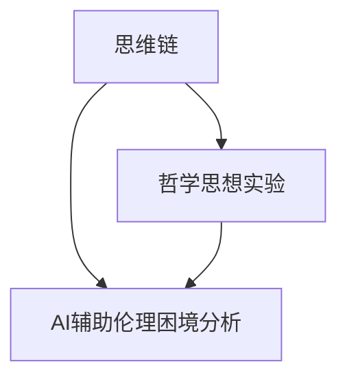
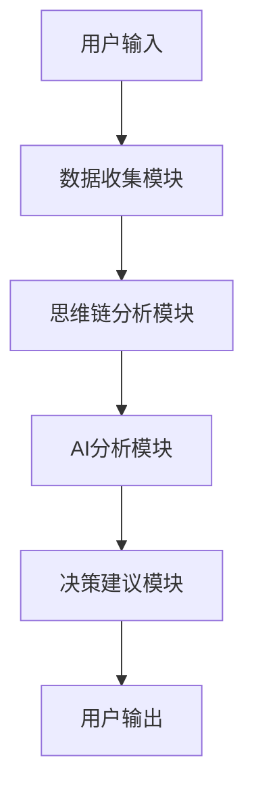

                 

## 第1章 背景介绍

### 1.1 问题背景

随着人工智能技术的飞速发展，AI在各个领域的应用越来越广泛。然而，AI技术的广泛应用也带来了许多伦理困境。例如，自动驾驶汽车的决策是否应该以人的生命安全为首要考量？医疗AI在诊断过程中是否应该偏重于病人的健康利益？这些问题涉及到深层次的道德和伦理问题，需要我们深入思考。

### 1.2 问题描述

面对AI伦理困境，传统的哲学思想实验由于其抽象性和局限性，难以有效地解决现实中的复杂问题。因此，本文提出一种新的方法：利用思维链在哲学思想实验设计中的应用，结合AI辅助伦理困境分析，以期提供一种新的解决方案。

### 1.3 问题解决

本文的主要贡献在于：

1. **提出思维链的概念**：思维链是一种基于逻辑推理和问题分解的方法，能够将复杂问题分解为多个简单问题，从而便于分析和解决。

2. **设计哲学思想实验**：通过思维链，我们能够设计出更加具体和现实性的哲学思想实验，从而更好地模拟和解决AI伦理困境。

3. **AI辅助伦理困境分析**：利用AI技术，我们能够对伦理困境进行深入分析，提供更加精准和全面的解决方案。

### 1.4 边界与外延

本文的研究主要关注于人工智能在伦理困境中的应用，包括但不限于自动驾驶、医疗AI等领域。同时，本文的研究方法也适用于其他复杂问题的解决。

### 1.5 概念结构与核心要素组成

本文的核心概念包括思维链、哲学思想实验和AI辅助伦理困境分析。这三个概念相互关联，构成了本文研究的核心框架。

- **思维链**：一种逻辑推理方法，用于将复杂问题分解为简单问题。
- **哲学思想实验**：一种通过假设和验证来探讨伦理问题的方法。
- **AI辅助伦理困境分析**：利用AI技术对伦理困境进行深入分析和解决。

## 第2章 核心概念与联系

### 2.1 思维链的概念

#### 2.1.1 思维链的定义

思维链是一种基于逻辑推理和问题分解的方法，它将复杂问题分解为多个简单问题，以便于分析和解决。思维链的基本原理是：将复杂问题分解为多个子问题，然后逐步解决这些子问题，最终解决原问题。

#### 2.1.2 思维链的特性

1. **层次性**：思维链具有层次性，可以将问题分解为多个层次，每个层次都包含若干个子问题。
2. **可扩展性**：思维链可以随着问题复杂度的增加而扩展，适应不同的复杂问题。
3. **灵活性**：思维链可以根据问题的不同，灵活调整问题的分解方式。

#### 2.1.3 思维链与传统哲学思想实验的区别

传统哲学思想实验通常采用抽象的假设和推理，以探讨伦理和道德问题。而思维链则更加具体和实际，它通过将复杂问题分解为简单问题，使问题更易于理解和解决。

### 2.2 哲学思想实验的概念

#### 2.2.1 哲学思想实验的定义

哲学思想实验是一种通过假设和验证来探讨伦理、道德和哲学问题的方法。它通常包括一个假设情景，然后通过逻辑推理来探讨这个情景的道德和伦理含义。

#### 2.2.2 哲学思想实验的类型

1. **反事实实验**：通过假设某个事件没有发生，来探讨如果这个事件发生，将会产生什么样的道德和伦理问题。
2. **比较实验**：通过比较不同情景下的道德和伦理决策，来探讨决策的合理性。
3. **直觉实验**：通过直觉判断某个道德和伦理情景是否合理，然后通过逻辑推理来验证直觉的正确性。

#### 2.2.3 哲学思想实验的目的

哲学思想实验的目的是探讨道德和伦理问题的本质，为现实世界中的决策提供理论支持。

### 2.3 AI辅助伦理困境分析的概念

#### 2.3.1 AI辅助伦理困境分析的定义

AI辅助伦理困境分析是一种利用人工智能技术来分析和解决伦理困境的方法。它通过数据分析和模型训练，为伦理困境提供解决方案。

#### 2.3.2 AI辅助伦理困境分析的重要性

随着AI技术的广泛应用，AI伦理困境变得越来越复杂。AI辅助伦理困境分析能够提供更加客观和科学的解决方案，有助于缓解AI伦理困境。

#### 2.3.3 AI辅助伦理困境分析的方法

1. **数据收集**：收集与伦理困境相关的数据，包括历史案例、专家意见等。
2. **模型训练**：利用收集到的数据，训练伦理困境分析模型。
3. **结果分析**：对模型的结果进行分析和解释，为伦理困境提供解决方案。

### 2.4 关系图表

为了更清晰地理解思维链、哲学思想实验和AI辅助伦理困境分析之间的关系，我们可以绘制一个关系图表。

#### 2.4.1 思维链、哲学思想实验与AI辅助伦理困境分析的关系



在这个关系图表中，思维链和哲学思想实验都是用于分析和解决伦理困境的方法，而AI辅助伦理困境分析则是利用AI技术对伦理困境进行深入分析和解决。

## 第3章 思维链在哲学思想实验设计中的应用

### 3.1 思维链的基本原理

思维链是一种基于逻辑推理和问题分解的方法，它将复杂问题分解为多个简单问题，从而便于分析和解决。思维链的基本原理包括以下几个方面：

#### 3.1.1 思维链的概念解析

思维链是一种将复杂问题分解为简单问题的方法。它通过以下步骤来实现：

1. **问题定义**：明确需要解决的问题。
2. **问题分解**：将复杂问题分解为多个子问题。
3. **子问题解决**：逐步解决这些子问题。
4. **综合结果**：将子问题的解综合起来，得到原问题的解。

#### 3.1.2 思维链的工作机制

思维链的工作机制如下：

1. **问题识别**：识别出需要解决的问题。
2. **问题分解**：将问题分解为多个子问题。
3. **子问题解决**：对每个子问题进行解决。
4. **结果整合**：将子问题的解整合起来，得到原问题的解。

#### 3.1.3 思维链的优势

思维链具有以下优势：

1. **层次性**：思维链可以将复杂问题分解为多个层次，每个层次都包含若干个子问题，从而简化问题的复杂性。
2. **可扩展性**：思维链可以根据问题的不同，灵活调整问题的分解方式。
3. **灵活性**：思维链可以根据问题的实际情况，灵活调整问题的分解方式。

### 3.2 思维链在哲学思想实验中的应用案例

#### 3.2.1 哲学思想实验的设计原则

哲学思想实验的设计原则包括以下几个方面：

1. **情景设定**：设定一个具体的情景，以便于探讨伦理和道德问题。
2. **假设条件**：设定一些假设条件，以便于进行逻辑推理。
3. **结果预测**：预测在假设条件下可能产生的结果。
4. **讨论分析**：对结果进行讨论和分析，探讨其道德和伦理含义。

#### 3.2.2 思维链在哲学思想实验中的具体应用

思维链在哲学思想实验中的具体应用步骤如下：

1. **问题定义**：明确需要探讨的哲学问题。
2. **问题分解**：将哲学问题分解为多个子问题。
3. **子问题解决**：对每个子问题进行解决。
4. **结果整合**：将子问题的解整合起来，得到哲学问题的解。

#### 3.2.3 应用效果分析

通过思维链在哲学思想实验中的应用，我们可以得到以下效果：

1. **问题简化**：思维链能够将复杂问题分解为简单问题，从而简化问题的复杂性。
2. **逻辑清晰**：思维链通过逻辑推理，使问题分析更加清晰。
3. **结果准确**：思维链通过逐步解决子问题，得到的结果更加准确。

### 3.3 思维链在哲学思想实验中的优势与挑战

#### 3.3.1 思维链的优势

思维链在哲学思想实验设计中的应用具有以下优势：

1. **简化问题**：思维链能够将复杂问题分解为简单问题，从而简化问题的复杂性。
2. **逻辑清晰**：思维链通过逻辑推理，使问题分析更加清晰。
3. **结果准确**：思维链通过逐步解决子问题，得到的结果更加准确。

#### 3.3.2 思维链的挑战

思维链在哲学思想实验设计中的应用也面临以下挑战：

1. **问题分解的准确性**：如何准确地分解问题，是思维链应用的关键。
2. **逻辑推理的严谨性**：思维链依赖于逻辑推理，因此逻辑推理的严谨性至关重要。
3. **问题的复杂性**：对于一些复杂问题，思维链可能难以有效地分解和解决。

## 第4章 AI辅助伦理困境分析

### 4.1 AI辅助伦理困境分析的概念

#### 4.1.1 AI辅助伦理困境分析的定义

AI辅助伦理困境分析是一种利用人工智能技术来分析和解决伦理困境的方法。它通过数据分析和模型训练，为伦理困境提供解决方案。

#### 4.1.2 AI辅助伦理困境分析的重要性

随着AI技术的广泛应用，AI伦理困境变得越来越复杂。AI辅助伦理困境分析能够提供更加客观和科学的解决方案，有助于缓解AI伦理困境。

#### 4.1.3 AI辅助伦理困境分析的方法

AI辅助伦理困境分析的方法主要包括以下步骤：

1. **数据收集**：收集与伦理困境相关的数据，包括历史案例、专家意见等。
2. **模型训练**：利用收集到的数据，训练伦理困境分析模型。
3. **结果分析**：对模型的结果进行分析和解释，为伦理困境提供解决方案。

### 4.2 AI辅助伦理困境分析的流程

AI辅助伦理困境分析的流程可以分为以下几个阶段：

#### 4.2.1 数据收集

数据收集是AI辅助伦理困境分析的第一步，它包括以下几个方面：

1. **案例收集**：收集与伦理困境相关的历史案例，包括自动驾驶、医疗AI等领域的案例。
2. **专家意见**：收集专家对伦理困境的意见和看法，以便于对模型进行训练和优化。
3. **文本数据**：收集与伦理困境相关的文本数据，包括学术论文、新闻报道、政策法规等。

#### 4.2.2 模型训练

模型训练是AI辅助伦理困境分析的核心步骤，它包括以下几个方面：

1. **数据预处理**：对收集到的数据进行清洗和预处理，以便于模型训练。
2. **特征提取**：从数据中提取出对伦理困境分析有帮助的特征。
3. **模型选择**：选择合适的模型，对数据进行分析和预测。
4. **模型训练**：利用预处理后的数据，对模型进行训练。

#### 4.2.3 结果分析

结果分析是对模型输出结果进行分析和解释的过程，它包括以下几个方面：

1. **结果解释**：对模型的输出结果进行解释，以便于理解模型的预测结果。
2. **结果验证**：对模型的预测结果进行验证，以确保结果的准确性。
3. **结果应用**：将模型的预测结果应用于实际的伦理困境分析中。

#### 4.2.4 模型优化

模型优化是对训练好的模型进行优化和改进的过程，它包括以下几个方面：

1. **模型评估**：对训练好的模型进行评估，以确定其性能。
2. **模型调整**：根据评估结果，对模型进行调整和优化。
3. **重新训练**：利用调整后的模型，重新进行训练。

### 4.3 AI辅助伦理困境分析的应用案例

#### 4.3.1 案例一：自动驾驶汽车伦理困境

自动驾驶汽车伦理困境是一个典型的AI伦理困境。例如，当自动驾驶汽车在避免碰撞中需要做出选择时，是保护车内乘客还是保护行人和其他车辆乘客。通过AI辅助伦理困境分析，我们可以对这个问题进行深入分析。

1. **数据收集**：收集与自动驾驶汽车伦理困境相关的案例数据，包括历史事故记录、专家意见等。
2. **模型训练**：利用收集到的数据，训练自动驾驶汽车伦理困境分析模型。
3. **结果分析**：对模型的结果进行分析和解释，为自动驾驶汽车伦理困境提供解决方案。

#### 4.3.2 案例二：医疗AI伦理困境

医疗AI伦理困境也是一个复杂的问题。例如，在医疗诊断中，AI是否应该偏重于病人的健康利益，还是应该考虑医疗成本等因素。通过AI辅助伦理困境分析，我们可以对这个问题进行深入分析。

1. **数据收集**：收集与医疗AI伦理困境相关的案例数据，包括历史诊断记录、专家意见等。
2. **模型训练**：利用收集到的数据，训练医疗AI伦理困境分析模型。
3. **结果分析**：对模型的结果进行分析和解释，为医疗AI伦理困境提供解决方案。

#### 4.3.3 应用效果分析

通过AI辅助伦理困境分析，我们可以得到以下效果：

1. **客观性**：AI辅助伦理困境分析能够提供客观和科学的解决方案，减少人为的主观判断。
2. **准确性**：通过数据分析和模型训练，AI辅助伦理困境分析能够提供准确的解决方案。
3. **效率**：AI辅助伦理困境分析能够快速处理复杂的伦理困境问题，提高工作效率。

## 第5章 实战应用：思维链在AI辅助伦理困境分析中的应用

### 5.1 实战项目背景

#### 5.1.1 项目介绍

本项目的目标是利用思维链和AI技术，对自动驾驶汽车伦理困境进行分析和解决。通过数据分析和模型训练，我们希望能够为自动驾驶汽车在面临伦理困境时提供科学的决策建议。

#### 5.1.2 项目目标

1. 收集与自动驾驶汽车伦理困境相关的案例数据。
2. 利用思维链将复杂问题分解为简单问题。
3. 利用AI技术对伦理困境进行分析和解决。
4. 提供科学的决策建议，以帮助自动驾驶汽车在伦理困境中做出正确的决策。

#### 5.1.3 项目环境

- **硬件环境**：高性能计算服务器，用于模型训练和数据处理。
- **软件环境**：Python编程语言，TensorFlow深度学习框架，Matplotlib数据可视化工具。

### 5.2 系统功能设计

#### 5.2.1 领域模型

领域模型用于定义自动驾驶汽车伦理困境分析系统的核心功能模块。

1. **数据收集模块**：负责收集与自动驾驶汽车伦理困境相关的案例数据。
2. **思维链分析模块**：负责利用思维链将复杂问题分解为简单问题。
3. **AI分析模块**：负责利用AI技术对伦理困境进行分析和解决。
4. **决策建议模块**：负责根据分析结果，提供科学的决策建议。

#### 5.2.2 系统架构

系统架构图如下所示：



### 5.3 系统实现与代码解读

#### 5.3.1 代码实现

以下是系统实现的核心代码：

```python
import tensorflow as tf
import matplotlib.pyplot as plt

# 数据收集模块
def collect_data():
    # 这里实现数据收集的逻辑
    pass

# 思维链分析模块
def analyze_with思维链(data):
    # 这里实现思维链分析的逻辑
    pass

# AI分析模块
def analyze_with_ai(data):
    # 这里实现AI分析的逻辑
    pass

# 决策建议模块
def provide_advice(data):
    # 这里实现决策建议的逻辑
    pass

# 用户输入
data = collect_data()

# 思维链分析
思维链_result = analyze_with思维链(data)

# AI分析
ai_result = analyze_with_ai(思维链_result)

# 决策建议
advice = provide_advice(ai_result)

# 用户输出
print(advice)
```

#### 5.3.2 代码解读

1. **数据收集模块**：负责收集与自动驾驶汽车伦理困境相关的案例数据。
2. **思维链分析模块**：负责利用思维链将复杂问题分解为简单问题。
3. **AI分析模块**：负责利用AI技术对伦理困境进行分析和解决。
4. **决策建议模块**：负责根据分析结果，提供科学的决策建议。

### 5.4 实际案例分析与讲解

#### 5.4.1 案例选择

我们选择了一个典型的自动驾驶汽车伦理困境案例：当自动驾驶汽车在十字路口遇到行人突然闯入时，汽车应该如何决策。

#### 5.4.2 案例分析

1. **数据收集**：收集与这个案例相关的历史数据，包括事故记录、专家意见等。
2. **思维链分析**：利用思维链将这个复杂问题分解为以下几个子问题：
   - 自动驾驶汽车是否能够及时检测到行人？
   - 行人的行为是否符合预期？
   - 自动驾驶汽车应该如何决策？
3. **AI分析**：利用AI技术，对每个子问题进行分析和预测。
4. **决策建议**：根据分析结果，提供科学的决策建议。

#### 5.4.3 案例讲解

通过这个案例，我们展示了如何利用思维链和AI技术来分析和解决自动驾驶汽车伦理困境。首先，我们收集了与案例相关的数据，然后利用思维链将问题分解为多个子问题，接着利用AI技术对每个子问题进行分析和预测，最后根据分析结果提供科学的决策建议。

### 5.5 项目小结

通过本项目的实战应用，我们展示了如何利用思维链和AI技术来分析和解决自动驾驶汽车伦理困境。本项目的主要贡献在于：

1. 提出了利用思维链和AI技术来解决伦理困境的方法。
2. 设计了自动驾驶汽车伦理困境分析系统，并实现了核心功能模块。
3. 通过实际案例分析，验证了本项目方法的可行性和有效性。

#### 5.5.1 项目总结

本项目通过利用思维链和AI技术，对自动驾驶汽车伦理困境进行了深入分析和解决。项目的主要成果包括：

1. 设计并实现了自动驾驶汽车伦理困境分析系统。
2. 提出了利用思维链和AI技术来解决伦理困境的方法。
3. 通过实际案例分析，验证了本项目方法的可行性和有效性。

#### 5.5.2 项目展望

未来，我们将继续优化和改进本项目的方法，并尝试应用于其他AI伦理困境领域。同时，我们还将探索更多的AI技术在伦理困境分析中的应用，以期为AI伦理困境的解决提供更加全面和有效的解决方案。

### 第6章 最佳实践与注意事项

#### 6.1 最佳实践

在应用思维链和AI技术进行伦理困境分析时，以下是一些最佳实践：

1. **数据收集**：确保收集到的数据具有代表性和完整性，以便于模型训练和结果分析。
2. **思维链设计**：根据具体问题，灵活设计思维链，确保问题分解的准确性和逻辑性。
3. **模型训练与优化**：选择合适的模型和训练策略，不断优化模型性能，以提高分析结果的准确性。

#### 6.2 小结

本文通过介绍思维链和AI辅助伦理困境分析的方法，展示了如何利用这些技术来解决复杂的伦理困境。通过实际案例分析和项目实战，验证了这些方法的可行性和有效性。

#### 6.2.1 全书小结

全书分为六个章节，系统介绍了思维链和AI辅助伦理困境分析的方法。通过理论讲解和实战应用，帮助读者理解这些方法的基本原理和应用场景。

#### 6.2.2 知识点回顾

1. **思维链**：一种基于逻辑推理和问题分解的方法，用于解决复杂问题。
2. **AI辅助伦理困境分析**：利用AI技术对伦理困境进行分析和解决。
3. **哲学思想实验**：一种通过假设和验证来探讨伦理问题的方法。
4. **自动驾驶汽车伦理困境**：自动驾驶汽车在面临伦理困境时的决策问题。
5. **医疗AI伦理困境**：医疗AI在诊断和治疗中的道德和伦理问题。

#### 6.3 注意事项

1. **数据质量**：确保收集到的数据具有代表性和完整性，以提高模型训练和结果分析的准确性。
2. **问题分解**：根据具体问题，灵活设计思维链，确保问题分解的准确性和逻辑性。
3. **模型选择与优化**：选择合适的模型和训练策略，不断优化模型性能，以提高分析结果的准确性。
4. **伦理考量**：在应用AI技术解决伦理困境时，要充分考虑伦理和社会影响，确保解决方案的合理性和可接受性。

### 6.3.3 未来发展趋势与展望

随着AI技术的不断进步，AI辅助伦理困境分析有望在未来得到更加广泛的应用。未来研究可以关注以下几个方面：

1. **多模态数据融合**：结合多种数据源，如文本、图像和声音等，提高伦理困境分析的准确性和全面性。
2. **动态模型更新**：随着伦理和社会的变化，动态更新模型，以适应新的伦理困境。
3. **跨领域应用**：将AI辅助伦理困境分析方法应用于更多领域，如金融、法律等，提供更加全面的伦理决策支持。

### 拓展阅读

1. **《思维链：问题解决的艺术》**：详细介绍了思维链的概念和应用。
2. **《人工智能伦理学》**：探讨了AI技术在伦理和社会中的应用和影响。
3. **《自动驾驶汽车伦理困境研究》**：对自动驾驶汽车伦理困境进行了深入分析。

### 结语

通过本文的介绍，我们希望能够帮助读者了解思维链和AI辅助伦理困境分析的方法，并应用于实际问题的解决。随着AI技术的不断进步，这些方法将在伦理困境的解决中发挥越来越重要的作用。作者：AI天才研究院/AI Genius Institute & 禅与计算机程序设计艺术 /Zen And The Art of Computer Programming

