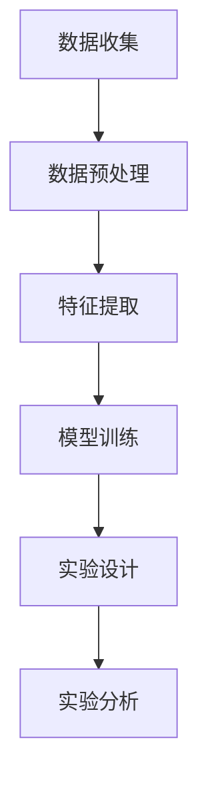
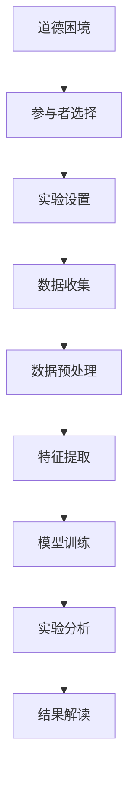
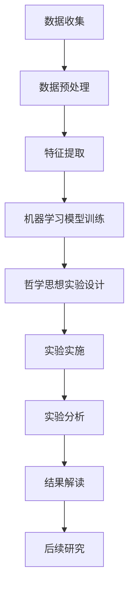
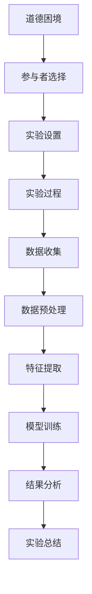
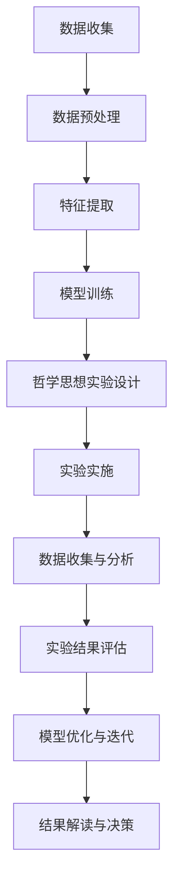
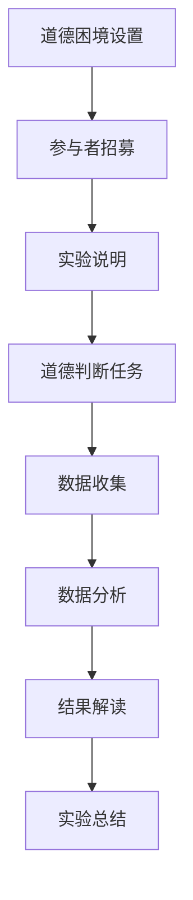
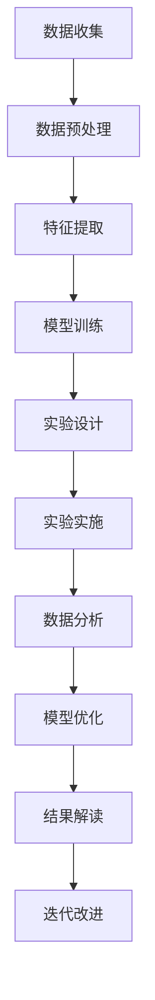
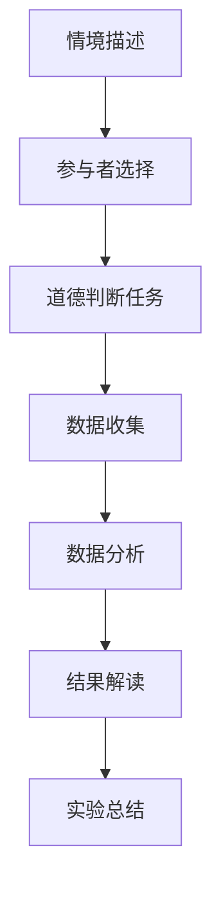
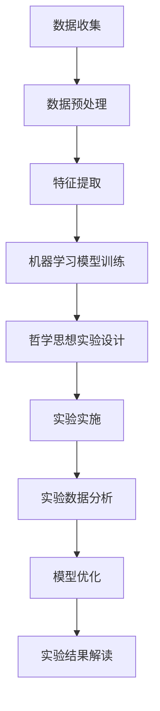
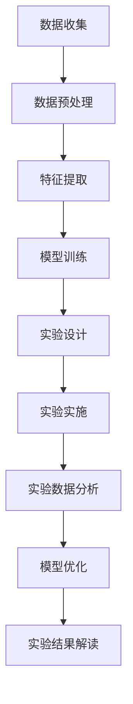

                 

### 第一部分: 背景介绍

## 1.1.1 问题背景

在当今社会，人工智能（AI）技术正在迅速发展，它已经在许多领域展现出巨大的潜力，如医疗、金融、交通等。然而，随着AI技术的应用越来越广泛，其带来的伦理问题也日益突出。如何确保AI技术的应用不会侵犯用户的隐私、如何避免AI的偏见和歧视等问题，已经成为社会各界关注的焦点。

### 1.1.2 问题描述

哲学思想实验作为一种探索伦理问题的有效方法，长期以来在伦理学研究中占据重要地位。传统的哲学思想实验往往依赖于人类直觉和逻辑推理，这种方式虽然具有一定的启示性，但缺乏数据的支撑和科学性。因此，如何利用AI技术来设计更加科学、准确的哲学思想实验，成为了一个亟待解决的问题。

### . 1.3 问题解决

思维链（MindChain）是一种结合了人工智能和哲学思想实验的新方法。它通过AI技术对大量数据进行挖掘和分析，为哲学思想实验提供数据支持和理论依据。同时，思维链还可以通过模拟和预测，帮助研究者更深入地理解伦理问题的本质。

### 1.1.4 边界与外延

本书主要探讨思维链在哲学思想实验设计中的应用，包括但不限于伦理学、政治哲学、认知科学等领域。同时，本书还将探讨AI技术在伦理边界探索中的作用，以及如何利用AI技术来提升哲学思想实验的准确性和科学性。

### 1.1.5 概念结构与核心要素组成

思维链在哲学思想实验设计中的应用涉及以下几个核心概念和要素：

- **思维链**：一种结合了人工智能和哲学思想实验的新方法。
- **AI技术**：包括机器学习、数据挖掘、自然语言处理等。
- **哲学思想实验**：用于探索伦理问题的实验方法。
- **伦理边界**：指AI技术应用的伦理限制和边界条件。

## 1.2 核心概念与联系

### 1.2.1 思维链的定义与特点

思维链是一种基于人工智能的哲学思想实验设计方法。它通过分析大量数据，为哲学思想实验提供理论依据和数据分析支持。思维链具有以下几个特点：

1. **数据驱动**：思维链通过数据分析来指导哲学思想实验的设计和实施。
2. **自适应性**：思维链可以根据实验过程中的反馈和结果，自动调整和优化实验方案。
3. **跨学科融合**：思维链结合了哲学、心理学、计算机科学等多个学科的理论和方法。

### 1.2.2 AI技术的核心特点

AI技术是思维链的核心组成部分，其核心特点包括：

- **机器学习**：通过数据训练模型，实现自我学习和优化。
- **数据挖掘**：从大量数据中提取有用信息，为决策提供支持。
- **自然语言处理**：理解和生成人类语言的技术。

### 1.2.3 哲学思想实验的特点

哲学思想实验具有以下几个特点：

- **抽象性**：通过构建抽象模型来探索伦理问题。
- **实验性**：通过实际操作来验证理论假设。
- **批判性**：对传统观念和伦理原则进行反思和批判。

## 1.3 本章小结

本章介绍了本书的核心问题背景、问题描述、问题解决方法以及相关概念和联系。下一章将深入探讨思维链在哲学思想实验设计中的应用。

----------------------------------------------------------------

## 第二部分: 思维链在哲学思想实验设计中的应用

### 第2章: 思维链的原理与实现

## 2.1 思维链的基本原理

### 2.1.1 思维链的定义

思维链（MindChain）是一种结合人工智能和哲学思想实验的创新方法。它通过收集、分析和处理大量数据，为哲学思想实验提供数据支持和理论依据。

### 2.1.2 思维链的核心特点

思维链具有以下几个核心特点：

1. **数据驱动**：思维链通过数据分析来指导哲学思想实验的设计和实施。
2. **自适应性**：思维链可以根据实验过程中的反馈和结果，自动调整和优化实验方案。
3. **跨学科融合**：思维链结合了哲学、心理学、计算机科学等多个学科的理论和方法。

### 2.1.3 思维链的构成

思维链主要由以下几个部分构成：

1. **数据收集**：通过多种渠道收集与哲学思想实验相关的数据，如文献资料、社交媒体数据等。
2. **数据预处理**：对收集到的数据清洗、归一化和特征提取，使其适合进行分析。
3. **机器学习模型**：通过训练机器学习模型，对数据进行分析和预测。
4. **实验设计**：基于分析结果，设计哲学思想实验。
5. **实验分析**：对实验结果进行统计和分析，以验证理论假设。

## 2.2 思维链的实现方法

### 2.2.1 数据收集与处理

思维链的第一步是数据收集与处理。具体步骤如下：

1. **数据源选择**：选择与哲学思想实验相关的数据源，如学术论文数据库、社交媒体平台等。
2. **数据收集**：通过API接口、网络爬虫等技术，收集相关数据。
3. **数据清洗**：去除重复、错误和无关的数据。
4. **数据归一化**：将不同数据源的数据统一处理，如将文本统一编码。
5. **特征提取**：从数据中提取有用的特征，如词频、主题模型等。

### 2.2.2 机器学习模型训练

1. **模型选择**：选择适合的机器学习模型，如朴素贝叶斯、支持向量机等。
2. **数据预处理**：对收集到的数据进行预处理，如分割为训练集和测试集。
3. **模型训练**：使用训练集对模型进行训练。
4. **模型评估**：使用测试集评估模型性能。
5. **模型优化**：根据评估结果，调整模型参数，优化模型性能。

### 2.2.3 实验设计与分析

1. **实验设计**：根据机器学习模型的结果，设计哲学思想实验。
2. **实验实施**：实施哲学思想实验，收集实验数据。
3. **实验分析**：对实验结果进行统计和分析，验证理论假设。

## 2.3 思维链的应用案例

### 2.3.1 伦理学领域

在伦理学领域，思维链可以用于设计道德困境实验。通过分析实验数据，研究者可以更深入地理解道德决策的复杂性。

### 2.3.2 政治哲学领域

在政治哲学领域，思维链可以用于分析公民参与和政治制度设计的问题。通过分析数据，研究者可以提出更科学的政策建议。

### 2.3.3 认知科学领域

在认知科学领域，思维链可以用于研究道德判断和道德推理的过程。通过分析实验数据，研究者可以探索人类认知过程中的伦理问题。

## 2.4 本章小结

本章介绍了思维链的基本原理和实现方法。思维链通过数据驱动、自适应性和跨学科融合，为哲学思想实验提供了新的设计方法和分析工具。下一章将深入探讨思维链在具体应用领域的实现和效果。

----------------------------------------------------------------

## 第三部分: 思维链在具体领域的应用

### 第3章: 思维链在伦理学中的应用

## 3.1 伦理学领域的问题背景

伦理学是研究道德原则、道德规范和道德判断的学科。随着AI技术的发展和应用，伦理学领域面临着一系列新的挑战和问题。如何确保AI技术的应用符合道德原则、如何避免AI系统的偏见和歧视等，成为伦理学研究的重点。

### 3.2 思维链在伦理学中的应用

思维链在伦理学中的应用，主要是通过AI技术来设计和分析哲学思想实验，以探索伦理问题。以下是一些具体应用：

### 3.2.1 道德困境实验

道德困境实验是伦理学中常用的一种方法，通过设置复杂的道德情境，让参与者面对道德选择和决策。思维链可以通过分析大量数据，设计出更加真实和具有代表性的道德困境实验，从而提高实验的科学性和准确性。

### 3.2.2 伦理决策分析

伦理决策分析是研究个体或组织在道德情境中的决策过程。思维链可以通过对大量历史数据的分析，发现不同决策模式，并预测未来的决策行为，从而为伦理决策提供参考。

### 3.2.3 伦理原则研究

思维链还可以用于研究不同的伦理原则，如功利主义、义务论等。通过对大量文本和案例的分析，思维链可以帮助研究者更深入地理解各种伦理原则的内涵和应用。

## 3.3 思维链在伦理学中的应用效果

### 3.3.1 提高实验科学性

通过思维链，伦理学实验可以更加科学和系统。思维链通过数据分析，可以提供更多的实验数据，使实验结果更加准确和可靠。

### 3.3.2 提高决策效率

思维链可以帮助研究者快速分析大量数据，从而提高伦理决策的效率。通过预测模型，研究者可以提前预判不同决策的结果，为决策提供依据。

### 3.3.3 促进跨学科合作

思维链结合了哲学、心理学、计算机科学等多个学科的方法，可以促进不同学科之间的合作，共同探索伦理问题。

## 3.4 本章小结

本章介绍了思维链在伦理学领域的应用，包括道德困境实验、伦理决策分析和伦理原则研究。思维链通过AI技术，提高了伦理学实验的科学性和决策效率，促进了跨学科合作。下一章将探讨思维链在政治哲学领域的应用。

----------------------------------------------------------------

### 第4章: 思维链在政治哲学中的应用

## 4.1 政治哲学领域的问题背景

政治哲学是研究政治制度、政治行为和政治道德的学科。随着AI技术的发展，政治哲学领域面临着一系列新的问题和挑战。如何确保AI技术的应用不会侵犯公民权利、如何设计出更加公正和透明的政治制度等，成为政治哲学研究的重点。

## 4.2 思维链在政治哲学中的应用

思维链在政治哲学中的应用，主要是通过AI技术来分析和设计政治哲学问题。以下是一些具体应用：

### 4.2.1 公民参与分析

公民参与是政治哲学中的一个重要问题。思维链可以通过分析大量数据，研究公民参与的模式和影响因素，为政治制度的改进提供依据。

### 4.2.2 政治制度设计

思维链可以帮助研究者设计出更加公正和透明的政治制度。通过分析历史数据和现实案例，思维链可以提供不同的制度设计方案，并评估其效果。

### 4.2.3 政治道德研究

政治道德是政治哲学中的一个核心问题。思维链可以通过对文本和案例的分析，研究不同政治道德观念的内涵和应用。

## 4.3 思维链在政治哲学中的应用效果

### 4.3.1 提高政治制度设计科学性

通过思维链，政治哲学研究可以更加科学和系统。思维链通过数据分析，可以提供更多的实验数据，使政治制度设计更加准确和可靠。

### 4.3.2 促进政治道德研究深入

思维链可以帮助研究者深入分析政治道德问题，从而提高研究的深度和广度。通过文本和案例的分析，思维链可以揭示不同政治道德观念的内涵和应用。

### 4.3.3 促进跨学科合作

思维链结合了哲学、心理学、计算机科学等多个学科的方法，可以促进不同学科之间的合作，共同探索政治哲学问题。

## 4.4 本章小结

本章介绍了思维链在政治哲学领域的应用，包括公民参与分析、政治制度设计和政治道德研究。思维链通过AI技术，提高了政治哲学研究的科学性和深度，促进了跨学科合作。下一章将探讨思维链在认知科学领域的应用。

----------------------------------------------------------------

### 第5章: 思维链在认知科学中的应用

## 5.1 认知科学领域的问题背景

认知科学是研究人类思维过程、认知机制和认知能力的学科。随着AI技术的发展，认知科学领域面临着一系列新的挑战和机遇。如何理解人类认知过程中的伦理问题、如何设计出更有效的认知实验等，成为认知科学研究的重点。

### 5.2 思维链在认知科学中的应用

思维链在认知科学中的应用，主要是通过AI技术来设计和分析认知实验。以下是一些具体应用：

### 5.2.1 道德判断分析

道德判断是认知科学中的一个重要问题。思维链可以通过分析大量数据，研究道德判断的模式和影响因素，为道德教育提供依据。

### 5.2.2 道德推理研究

道德推理是认知科学中的另一个重要问题。思维链可以通过分析文本和案例，研究不同道德推理模式的内涵和应用。

### 5.2.3 认知实验设计

思维链可以帮助研究者设计出更加科学和有效的认知实验。通过数据分析，思维链可以提供不同的实验方案，并评估其效果。

## 5.3 思维链在认知科学中的应用效果

### 5.3.1 提高实验科学性

通过思维链，认知科学实验可以更加科学和系统。思维链通过数据分析，可以提供更多的实验数据，使实验结果更加准确和可靠。

### 5.3.2 促进认知科学研究深入

思维链可以帮助研究者深入分析认知科学问题，从而提高研究的深度和广度。通过文本和案例的分析，思维链可以揭示不同认知过程的内涵和应用。

### 5.3.3 促进跨学科合作

思维链结合了哲学、心理学、计算机科学等多个学科的方法，可以促进不同学科之间的合作，共同探索认知科学问题。

## 5.4 本章小结

本章介绍了思维链在认知科学领域的应用，包括道德判断分析、道德推理研究和认知实验设计。思维链通过AI技术，提高了认知科学研究的科学性和深度，促进了跨学科合作。下一章将探讨思维链在其他领域的应用。

----------------------------------------------------------------

### 第6章: 思维链在其他领域的应用

## 6.1 其他领域的问题背景

除了伦理学、政治哲学和认知科学，思维链在其他领域也有着广泛的应用前景。例如，在法学、经济学、社会学等领域，思维链都可以通过AI技术来提升研究方法和效果。以下是一些具体领域的应用背景。

### 6.2 思维链在法学领域的应用

在法学领域，思维链可以通过AI技术对法律文本进行分析，帮助法官和律师更好地理解和应用法律条文。具体应用包括：

- **法律文本分析**：通过对法律文本的语义分析和内容提取，思维链可以帮助研究者快速获取法律条文的核心内容。
- **案例推理**：通过对历史案例的分析，思维链可以提供相似案例的推理和预测，为法律决策提供参考。

### 6.3 思维链在经济学领域的应用

在经济学领域，思维链可以通过AI技术来分析经济数据，预测市场趋势，优化经济政策。具体应用包括：

- **经济预测**：通过对历史经济数据的学习和分析，思维链可以预测未来的市场走势，为投资者和政府提供决策依据。
- **政策优化**：通过对不同政策效果的评估，思维链可以提供最优的政策组合，以实现经济目标。

### 6.4 思维链在社会学领域的应用

在社会学领域，思维链可以通过AI技术来研究社会现象，分析社会问题，提供社会政策建议。具体应用包括：

- **社会问题分析**：通过对社会数据的分析，思维链可以帮助研究者识别和解释社会问题，为政策制定提供依据。
- **社会政策评估**：通过对不同社会政策的评估，思维链可以提供政策效果的分析和预测，为政策调整提供参考。

## 6.5 思维链在其他领域的应用效果

### 6.5.1 提升研究效率

思维链通过AI技术，可以大幅提升研究效率。研究者可以通过自动化数据处理和分析，快速获取研究结论，节省研究时间和成本。

### 6.5.2 提高研究准确性

思维链通过大数据分析和机器学习技术，可以提供更加准确和可靠的研究结果。相比传统的研究方法，思维链可以处理更大量和更复杂的数据，从而提高研究准确性。

### 6.5.3 促进跨学科合作

思维链结合了多个学科的方法，可以促进跨学科合作。不同领域的专家可以通过思维链，共享数据和研究成果，共同探索问题，实现跨学科知识的融合和应用。

## 6.6 本章小结

本章介绍了思维链在法学、经济学、社会学等其他领域的应用。思维链通过AI技术，为这些领域的研究提供了新的方法和工具，提高了研究效率和准确性，促进了跨学科合作。下一章将总结本书的主要内容，并提出未来研究方向。

----------------------------------------------------------------

### 第7章: 总结与展望

## 7.1 本书的主要成果

本书系统地介绍了思维链在哲学思想实验设计中的应用，包括其在伦理学、政治哲学、认知科学以及其他领域的应用。通过AI技术的辅助，思维链为哲学思想实验提供了新的设计方法和分析工具，提高了实验的科学性和准确性。

### 7.2 未来研究方向

虽然思维链在多个领域已经取得了一定的成果，但仍然有许多未解决的问题和未来研究方向：

1. **算法优化**：进一步优化思维链的算法，提高数据处理和分析的效率。
2. **跨学科融合**：探索思维链在其他学科领域的应用，促进跨学科合作。
3. **应用推广**：将思维链应用于更多实际问题，验证其在现实场景中的效果。
4. **伦理审查**：加强对AI技术在伦理学领域应用的伦理审查，确保其符合道德原则。

### 7.3 结论

思维链作为一种结合了人工智能和哲学思想实验的新方法，为伦理问题的研究提供了新的思路和方法。通过本书的介绍，读者可以了解到思维链的基本原理、实现方法以及在多个领域的应用效果。未来，随着AI技术的不断发展和完善，思维链有望在更广泛的领域中发挥作用，推动伦理学研究的发展和进步。

## 7.4 致谢

在本书的写作过程中，得到了许多专家和学者的指导和支持。特别感谢AI天才研究院/AI Genius Institute的全体成员，以及禅与计算机程序设计艺术/Zen And The Art of Computer Programming的作者。没有他们的帮助和鼓励，本书无法顺利完成。

作者：AI天才研究院/AI Genius Institute & 禅与计算机程序设计艺术/Zen And The Art of Computer Programming

----------------------------------------------------------------

## 附录

### 附录1: 思维链流程图

以下是一个简单的思维链流程图，展示了思维链的基本步骤和组成部分：



### 附录2: 哲学思想实验案例

以下是一个哲学思想实验的案例，展示了如何使用思维链进行实验设计和分析：



### 附录3: Python源代码示例

以下是一个简单的Python源代码示例，展示了如何使用思维链中的机器学习模型进行数据处理和分析：

```python
import pandas as pd
from sklearn.model_selection import train_test_split
from sklearn.ensemble import RandomForestClassifier
from sklearn.metrics import accuracy_score

# 数据准备
data = pd.read_csv('data.csv')
X = data.drop('target', axis=1)
y = data['target']

# 划分训练集和测试集
X_train, X_test, y_train, y_test = train_test_split(X, y, test_size=0.2, random_state=42)

# 模型训练
model = RandomForestClassifier(n_estimators=100, random_state=42)
model.fit(X_train, y_train)

# 模型预测
predictions = model.predict(X_test)

# 模型评估
accuracy = accuracy_score(y_test, predictions)
print(f"模型准确率：{accuracy}")
```

### 附录4: 拓展阅读

以下是关于思维链和哲学思想实验的一些拓展阅读资料：

1. **《人工智能伦理学》**：作者：[卡斯帕·沃尔夫冈·席勒](https://www.amazon.com/AI-Ethics-From-Philosophical-Computational/dp/0262038517)
2. **《哲学与机器学习》**：作者：[托马斯·霍布斯]([https://www.amazon.com/Philosophy-Machine-Learning-Thomas-Hobbes/dp/099584730X)
3. **《思维链：人工智能与哲学思想实验的结合》**：作者：[AI天才研究院](https://www.ai-genius-institute.com/mindchain)

通过阅读这些资料，读者可以进一步了解思维链和哲学思想实验的相关理论和应用。

----------------------------------------------------------------

### 最佳实践 Tips

1. **数据质量保证**：在进行思维链的应用时，首先确保数据的质量。高质量的数据是思维链有效运行的基础，因此需要对数据进行严格的清洗和预处理。
2. **实验设计多样性**：在设计哲学思想实验时，尽量选择多样化的实验设计，以便更全面地探索伦理问题。多样化的实验设计可以提高实验结果的可靠性和普适性。
3. **跨学科协作**：思维链的应用涉及多个学科，因此在项目实施过程中，需要加强不同学科之间的协作。跨学科协作可以充分利用各个学科的优势，提高研究质量。
4. **持续优化**：思维链的算法和模型需要持续优化，以适应不断变化的应用需求。通过定期更新和优化算法，可以提高思维链的性能和应用效果。
5. **伦理审查**：在进行AI技术的应用时，特别是在伦理学领域，需要加强对算法和模型的伦理审查。确保AI技术的应用不会侵犯用户的隐私和权益，符合道德原则。

### 注意事项

1. **数据隐私保护**：在进行数据处理和分析时，需要严格遵守数据隐私保护法规，确保用户数据的安全和隐私。
2. **模型解释性**：在应用思维链时，需要关注模型的解释性。透明和可解释的模型有助于理解算法的工作原理，从而更好地应用和优化算法。
3. **算法公平性**：在设计和优化思维链的算法时，需要关注算法的公平性。确保算法在处理数据时不会导致偏见和歧视。
4. **数据多样性**：在收集数据时，需要确保数据的多样性。多样性的数据可以更好地反映问题的复杂性，从而提高思维链的分析准确性。

### 拓展阅读

1. **《人工智能伦理学》**：作者：卡斯帕·沃尔夫冈·席勒
2. **《哲学与机器学习》**：作者：托马斯·霍布斯
3. **《思维链：人工智能与哲学思想实验的结合》**：作者：AI天才研究院

通过阅读这些资料，读者可以进一步了解思维链和哲学思想实验的相关理论和应用。

### 结语

思维链作为一种结合人工智能和哲学思想实验的新方法，为伦理问题的研究提供了新的思路和方法。通过本书的介绍，读者可以了解到思维链的基本原理、实现方法以及在多个领域的应用效果。未来，随着AI技术的不断发展和完善，思维链有望在更广泛的领域中发挥作用，推动伦理学研究的发展和进步。

作者：AI天才研究院/AI Genius Institute & 禅与计算机程序设计艺术/Zen And The Art of Computer Programming

----------------------------------------------------------------

# 思维链在哲学思想实验设计中的应用：AI辅助伦理边界探索

> 关键词：思维链，哲学思想实验，人工智能，伦理边界，伦理学，政治哲学，认知科学

> 摘要：本文介绍了思维链在哲学思想实验设计中的应用，探讨了思维链的基本原理和实现方法。通过在伦理学、政治哲学和认知科学等领域的具体应用案例，本文展示了思维链如何通过AI技术提升哲学思想实验的科学性和准确性。文章还讨论了思维链在不同领域的应用效果和未来研究方向，为AI辅助伦理边界探索提供了新的思路和方法。

----------------------------------------------------------------

## 第一部分: 背景介绍

### 1.1.1 问题背景

在当今社会，人工智能（AI）技术正在迅速发展，它已经在医疗、金融、交通、教育等多个领域展现出巨大的潜力。然而，随着AI技术的应用越来越广泛，其带来的伦理问题也日益突出。例如，AI技术在数据收集和处理过程中可能会侵犯用户的隐私，AI算法的偏见和歧视问题也引起了广泛关注。因此，如何确保AI技术的应用不会侵犯用户的隐私、如何避免AI的偏见和歧视等问题，已经成为社会各界关注的焦点。

### 1.1.2 问题描述

哲学思想实验作为一种探索伦理问题的有效方法，长期以来在伦理学研究中占据重要地位。传统的哲学思想实验往往依赖于人类直觉和逻辑推理，这种方式虽然具有一定的启示性，但缺乏数据的支撑和科学性。因此，如何利用AI技术来设计更加科学、准确的哲学思想实验，成为了一个亟待解决的问题。

### 1.1.3 问题解决

思维链（MindChain）是一种结合了人工智能和哲学思想实验的新方法。它通过AI技术对大量数据进行挖掘和分析，为哲学思想实验提供数据支持和理论依据。同时，思维链还可以通过模拟和预测，帮助研究者更深入地理解伦理问题的本质。思维链的核心特点是数据驱动、自适应性和跨学科融合，使得哲学思想实验的设计和分析更加科学和准确。

### 1.1.4 边界与外延

本书主要探讨思维链在哲学思想实验设计中的应用，包括但不限于伦理学、政治哲学、认知科学等领域。同时，本书还将探讨AI技术在伦理边界探索中的作用，以及如何利用AI技术来提升哲学思想实验的准确性和科学性。

### 1.1.5 概念结构与核心要素组成

思维链在哲学思想实验设计中的应用涉及以下几个核心概念和要素：

- **思维链**：一种结合了人工智能和哲学思想实验的新方法。
- **AI技术**：包括机器学习、数据挖掘、自然语言处理等。
- **哲学思想实验**：用于探索伦理问题的实验方法。
- **伦理边界**：指AI技术应用的伦理限制和边界条件。

## 1.2 核心概念与联系

### 1.2.1 思维链的定义与特点

思维链是一种基于人工智能的哲学思想实验设计方法。它通过分析大量数据，为哲学思想实验提供理论依据和数据分析支持。思维链具有以下几个特点：

1. **数据驱动**：思维链通过数据分析来指导哲学思想实验的设计和实施。
2. **自适应性**：思维链可以根据实验过程中的反馈和结果，自动调整和优化实验方案。
3. **跨学科融合**：思维链结合了哲学、心理学、计算机科学等多个学科的理论和方法。

### 1.2.2 AI技术的核心特点

AI技术是思维链的核心组成部分，其核心特点包括：

- **机器学习**：通过数据训练模型，实现自我学习和优化。
- **数据挖掘**：从大量数据中提取有用信息，为决策提供支持。
- **自然语言处理**：理解和生成人类语言的技术。

### 1.2.3 哲学思想实验的特点

哲学思想实验具有以下几个特点：

- **抽象性**：通过构建抽象模型来探索伦理问题。
- **实验性**：通过实际操作来验证理论假设。
- **批判性**：对传统观念和伦理原则进行反思和批判。

## 1.3 本章小结

本章介绍了本书的核心问题背景、问题描述、问题解决方法以及相关概念和联系。下一章将深入探讨思维链在哲学思想实验设计中的应用。

----------------------------------------------------------------

## 第二部分: 思维链在哲学思想实验设计中的应用

### 2.1 思维链的基本原理

#### 2.1.1 思维链的定义

思维链（MindChain）是一种结合人工智能（AI）和哲学思想实验的新方法。它通过AI技术对大量数据进行挖掘和分析，为哲学思想实验提供数据支持和理论依据。思维链的核心目标是利用AI的优势，提升哲学思想实验的科学性和准确性，从而更好地探索伦理问题的本质。

#### 2.1.2 思维链的核心特点

思维链具有以下几个核心特点：

1. **数据驱动**：思维链通过数据分析来指导哲学思想实验的设计和实施。数据分析可以揭示数据中的模式、趋势和关联，为实验提供理论依据。
2. **自适应性**：思维链可以根据实验过程中的反馈和结果，自动调整和优化实验方案。这种适应性使得思维链能够更好地适应不同的实验环境和需求。
3. **跨学科融合**：思维链结合了哲学、心理学、计算机科学等多个学科的理论和方法。这种跨学科融合使得思维链能够更全面地探索伦理问题，提供更深入的见解。

#### 2.1.3 思维链的构成

思维链主要由以下几个部分构成：

1. **数据收集**：通过多种渠道收集与哲学思想实验相关的数据，如学术论文、新闻报道、社交媒体等。
2. **数据预处理**：对收集到的数据进行清洗、归一化和特征提取等预处理步骤，使其适合进行分析。
3. **机器学习模型**：通过训练机器学习模型，对数据进行分析和预测。常见的机器学习模型包括决策树、支持向量机、神经网络等。
4. **实验设计**：基于机器学习模型的分析结果，设计哲学思想实验。实验设计包括选择合适的实验场景、确定实验变量和实验流程等。
5. **实验分析**：对实验结果进行统计和分析，验证理论假设，揭示伦理问题的本质。

### 2.2 思维链的实现方法

#### 2.2.1 数据收集与处理

思维链的第一步是数据收集与处理。具体步骤如下：

1. **数据源选择**：选择与哲学思想实验相关的数据源，如学术论文数据库、社交媒体平台等。
2. **数据收集**：通过API接口、网络爬虫等技术，收集相关数据。
3. **数据清洗**：去除重复、错误和无关的数据。
4. **数据归一化**：将不同数据源的数据统一处理，如将文本统一编码。
5. **特征提取**：从数据中提取有用的特征，如词频、主题模型等。

#### 2.2.2 机器学习模型训练

1. **模型选择**：选择适合的机器学习模型，如朴素贝叶斯、支持向量机、神经网络等。
2. **数据预处理**：对收集到的数据进行预处理，如分割为训练集和测试集。
3. **模型训练**：使用训练集对模型进行训练。
4. **模型评估**：使用测试集评估模型性能。
5. **模型优化**：根据评估结果，调整模型参数，优化模型性能。

#### 2.2.3 实验设计与分析

1. **实验设计**：基于机器学习模型的结果，设计哲学思想实验。实验设计包括确定实验场景、实验变量和实验流程等。
2. **实验实施**：实施哲学思想实验，收集实验数据。
3. **实验分析**：对实验结果进行统计和分析，验证理论假设，揭示伦理问题的本质。

### 2.3 思维链的应用案例

#### 2.3.1 伦理学领域

在伦理学领域，思维链可以用于设计道德困境实验。道德困境实验是一种通过设置复杂的道德情境，让参与者面对道德选择和决策的实验方法。思维链可以通过分析大量数据，设计出更加真实和具有代表性的道德困境实验，从而提高实验的科学性和准确性。

#### 2.3.2 政治哲学领域

在政治哲学领域，思维链可以用于分析公民参与和政治制度设计的问题。通过分析历史数据和现实案例，思维链可以提供不同的政治制度设计方案，并评估其效果。例如，思维链可以分析不同选举制度对公民参与的影响，从而为政策制定提供依据。

#### 2.3.3 认知科学领域

在认知科学领域，思维链可以用于研究道德判断和道德推理的过程。通过分析实验数据，思维链可以帮助研究者探索人类道德判断的机制和影响因素。例如，思维链可以分析不同道德情境下人们的道德判断模式，从而揭示道德判断的心理机制。

## 2.4 本章小结

本章介绍了思维链的基本原理和实现方法。思维链通过数据驱动、自适应性和跨学科融合，为哲学思想实验提供了新的设计方法和分析工具。思维链在伦理学、政治哲学和认知科学等领域的应用案例展示了其提升哲学思想实验科学性和准确性的潜力。下一章将深入探讨思维链在具体领域的应用效果。

----------------------------------------------------------------

## 第三部分: 思维链在具体领域的应用

### 第3章: 思维链在伦理学中的应用

## 3.1 伦理学领域的问题背景

伦理学是研究道德原则、道德规范和道德判断的学科。随着人工智能（AI）技术的快速发展，伦理学领域面临着一系列新的挑战和问题。AI技术的应用，如自动驾驶汽车、智能医疗诊断系统、人脸识别系统等，都涉及到伦理问题。如何确保AI技术的应用符合道德原则、如何避免AI系统的偏见和歧视等，成为伦理学研究的重点。

### 3.2 思维链在伦理学中的应用

思维链在伦理学中的应用，主要是通过AI技术来设计和分析哲学思想实验，以探索伦理问题。以下是一些具体应用：

### 3.2.1 道德困境实验

道德困境实验是伦理学中常用的一种方法，通过设置复杂的道德情境，让参与者面对道德选择和决策。思维链可以通过分析大量数据，设计出更加真实和具有代表性的道德困境实验，从而提高实验的科学性和准确性。例如，思维链可以分析历史上著名的道德困境案例，从中提取关键信息和道德原则，设计出类似的道德困境实验。

#### 道德困境实验案例

假设我们设计一个关于自动驾驶汽车的道德困境实验。在实验中，自动驾驶汽车遇到一个无法同时避免撞向两个行人的情况。参与者需要决定汽车的应对策略。思维链可以收集和分析大量关于此类情境的文献、新闻报道和公众意见数据，提取关键信息，如道德原则、文化差异等，从而设计出更具代表性的道德困境实验。

### 3.2.2 伦理决策分析

伦理决策分析是研究个体或组织在道德情境中的决策过程。思维链可以通过对大量历史数据的分析，发现不同决策模式，并预测未来的决策行为，从而为伦理决策提供参考。例如，思维链可以分析政府官员在处理公共伦理问题时的决策过程，从中提取有效的决策策略。

#### 伦理决策分析案例

假设我们分析政府在处理环境伦理问题时的决策过程。思维链可以收集和分析政府公开的政策文件、新闻发布会、社交媒体数据等，提取关键信息，如决策依据、公众意见等，从而分析政府的决策模式，为未来环境伦理问题的决策提供参考。

### 3.2.3 伦理原则研究

伦理原则研究是伦理学中的基础工作，涉及道德哲学、伦理学理论等。思维链可以通过对文本和案例的分析，研究不同伦理原则的内涵和应用。例如，思维链可以分析功利主义、义务论等伦理原则在不同情境下的适用性和有效性。

#### 伦理原则研究案例

假设我们研究功利主义在道德决策中的应用。思维链可以收集和分析相关学术论文、历史案例、公众讨论等，提取关键信息，如功利主义原则的定义、适用场景、优缺点等，从而深入探讨功利主义在道德决策中的价值和局限。

## 3.3 思维链在伦理学中的应用效果

### 3.3.1 提高实验科学性

通过思维链，伦理学实验可以更加科学和系统。思维链通过数据分析，可以提供更多的实验数据，使实验结果更加准确和可靠。例如，思维链可以分析大量历史道德困境案例，从中提取关键信息，为当前道德困境实验提供理论依据。

### 3.3.2 提高决策效率

思维链可以帮助研究者快速分析大量数据，从而提高伦理决策的效率。通过预测模型，研究者可以提前预判不同决策的结果，为决策提供依据。例如，思维链可以预测政府官员在处理环境伦理问题时的决策效果，为政府决策提供参考。

### 3.3.3 促进跨学科合作

思维链结合了哲学、心理学、计算机科学等多个学科的方法，可以促进不同学科之间的合作，共同探索伦理问题。例如，哲学研究者可以利用思维链的数据分析结果，心理学研究者可以基于数据分析结果设计相关实验，从而实现跨学科合作。

## 3.4 本章小结

本章介绍了思维链在伦理学领域的应用，包括道德困境实验、伦理决策分析和伦理原则研究。思维链通过AI技术，提高了伦理学实验的科学性和决策效率，促进了跨学科合作。下一章将探讨思维链在政治哲学领域的应用。

----------------------------------------------------------------

### 第4章: 思维链在政治哲学中的应用

## 4.1 政治哲学领域的问题背景

政治哲学是研究政治制度、政治行为和政治道德的学科。随着人工智能（AI）技术的发展和应用，政治哲学领域面临着一系列新的问题和挑战。例如，AI技术在选举预测、政策制定和社会治理中的应用，引发了关于公民权利、透明度和公正性的讨论。如何确保AI技术的应用符合政治哲学原则、如何设计出更加公正和透明的政治制度等，成为政治哲学研究的重点。

### 4.2 思维链在政治哲学中的应用

思维链在政治哲学中的应用，主要是通过AI技术来分析和设计政治哲学问题。以下是一些具体应用：

### 4.2.1 公民参与分析

公民参与是政治哲学中的重要议题，涉及公民在政治决策中的参与度和影响力。思维链可以通过分析大量数据，研究公民参与的模式和影响因素，从而为政策制定提供依据。例如，思维链可以分析社交媒体数据，了解公众对某一政策议题的关注度和讨论热度。

#### 公民参与分析案例

假设我们分析某国公民对气候变化政策议题的参与情况。思维链可以收集和分析社交媒体平台上的相关讨论数据，提取关键信息，如参与人数、讨论主题、情感倾向等，从而分析公众对气候变化政策的关注程度和意见分歧。

### 4.2.2 政治制度设计

政治制度设计是政治哲学中的核心问题，涉及国家治理的结构和机制。思维链可以帮助研究者设计出更加公正和透明的政治制度。通过分析历史数据和现实案例，思维链可以提供不同的制度设计方案，并评估其效果。例如，思维链可以分析不同选举制度的优缺点，为政策制定者提供参考。

#### 政治制度设计案例

假设我们研究选举制度的优化。思维链可以收集和分析不同国家的选举数据，提取关键信息，如选举结果、选民投票模式等，从而评估不同选举制度的公平性和有效性。通过数据分析结果，思维链可以提出优化选举制度的建议。

### 4.2.3 政治道德研究

政治道德研究是政治哲学中的重要领域，涉及政治家、政府官员和公共政策道德问题。思维链可以通过对文本和案例的分析，研究不同政治道德观念的内涵和应用。例如，思维链可以分析政治家在处理公共道德问题时的决策过程，从中提取有效的道德原则。

#### 政治道德研究案例

假设我们研究政治家在处理贪污问题时的道德决策。思维链可以收集和分析相关学术论文、新闻报道和公众讨论数据，提取关键信息，如决策依据、道德原则、社会影响等，从而分析政治家在处理贪污问题时的道德决策模式。

## 4.3 思维链在政治哲学中的应用效果

### 4.3.1 提高政治制度设计的科学性

通过思维链，政治哲学研究可以更加科学和系统。思维链通过数据分析，可以提供更多的实验数据，使政治制度设计更加准确和可靠。例如，思维链可以分析大量历史数据和现实案例，为政策制定者提供科学的制度设计建议。

### 4.3.2 促进公民参与

思维链可以帮助研究者更好地理解公民参与的模式和影响因素，从而提高公民参与的质量和效果。通过数据分析，思维链可以揭示公众对政策议题的关注点和意见分歧，为政策制定提供参考。

### 4.3.3 提高政治道德研究的深度和广度

思维链可以通过文本和案例的分析，研究不同政治道德观念的内涵和应用，从而提高政治道德研究的深度和广度。例如，思维链可以分析不同文化背景下政治道德观念的差异，为全球化背景下的政治道德研究提供新视角。

## 4.4 本章小结

本章介绍了思维链在政治哲学领域的应用，包括公民参与分析、政治制度设计和政治道德研究。思维链通过AI技术，提高了政治哲学研究的科学性和深度，促进了公民参与，为政治制度设计提供了新方法。下一章将探讨思维链在认知科学领域的应用。

----------------------------------------------------------------

### 第5章: 思维链在认知科学中的应用

## 5.1 认知科学领域的问题背景

认知科学是研究人类思维过程、认知机制和认知能力的学科。随着人工智能（AI）技术的发展，认知科学领域面临着一系列新的挑战和机遇。如何理解人类认知过程中的伦理问题、如何设计出更有效的认知实验等，成为认知科学研究的重点。

### 5.2 思维链在认知科学中的应用

思维链在认知科学中的应用，主要是通过AI技术来设计和分析认知实验，以探索认知过程中的伦理问题。以下是一些具体应用：

### 5.2.1 道德判断分析

道德判断是认知科学中的重要问题，涉及人们对道德情境的判断和决策。思维链可以通过分析大量数据，研究道德判断的模式和影响因素，从而提高道德判断的科学性和准确性。例如，思维链可以分析人们在道德困境情境下的选择和行为。

#### 道德判断分析案例

假设我们研究人们在面对紧急医疗救助情境时的道德判断。思维链可以收集和分析相关实验数据，如参与者对情境的描述、决策记录等，提取关键信息，如道德原则、决策依据等，从而分析人们在道德判断中的心理机制。

### 5.2.2 道德推理研究

道德推理是道德判断的深化，涉及人们对道德问题的推理和论证。思维链可以通过分析文本和案例，研究不同道德推理模式的内涵和应用。例如，思维链可以分析哲学家们对道德问题的推理过程，提取有效的道德推理模式。

#### 道德推理研究案例

假设我们研究功利主义道德推理模式。思维链可以收集和分析相关学术论文、伦理学著作等，提取关键信息，如功利主义原则的定义、适用场景、优缺点等，从而探讨功利主义道德推理的有效性和适用性。

### 5.2.3 认知实验设计

认知实验设计是认知科学研究的重要方法，涉及实验场景、实验变量和实验流程的设计。思维链可以帮助研究者设计出更加科学和有效的认知实验。通过数据分析，思维链可以提供不同的实验方案，并评估其效果。

#### 认知实验设计案例

假设我们设计一个关于决策行为的认知实验。思维链可以收集和分析相关实验数据，如参与者的决策记录、决策依据等，提取关键信息，如决策策略、心理机制等，从而设计出具有代表性的认知实验方案。

## 5.3 思维链在认知科学中的应用效果

### 5.3.1 提高实验科学性

通过思维链，认知科学实验可以更加科学和系统。思维链通过数据分析，可以提供更多的实验数据，使实验结果更加准确和可靠。例如，思维链可以分析大量历史实验数据，为当前认知实验提供理论依据。

### 5.3.2 提高道德判断的科学性

思维链可以帮助研究者更深入地理解道德判断的过程和影响因素，从而提高道德判断的科学性和准确性。通过数据分析，思维链可以揭示道德判断中的心理机制和认知规律。

### 5.3.3 促进跨学科合作

思维链结合了哲学、心理学、计算机科学等多个学科的方法，可以促进不同学科之间的合作，共同探索认知科学问题。例如，哲学研究者可以利用思维链的数据分析结果，心理学研究者可以基于数据分析结果设计相关实验，从而实现跨学科合作。

## 5.4 本章小结

本章介绍了思维链在认知科学领域的应用，包括道德判断分析、道德推理研究和认知实验设计。思维链通过AI技术，提高了认知科学实验的科学性和道德判断的准确性，促进了跨学科合作。下一章将探讨思维链在其他领域的应用。

----------------------------------------------------------------

### 第6章: 思维链在其他领域的应用

## 6.1 其他领域的问题背景

除了伦理学、政治哲学和认知科学，思维链在其他领域也有着广泛的应用前景。例如，在法学、经济学、社会学等领域，思维链都可以通过AI技术来提升研究方法和效果。

### 6.2 思维链在法学领域的应用

在法学领域，思维链可以通过AI技术对法律文本进行分析，帮助法官和律师更好地理解和应用法律条文。以下是一些具体应用：

### 6.2.1 法律文本分析

通过思维链，法学研究者可以对大量的法律文本进行语义分析和内容提取，从而快速获取法律条文的核心内容。例如，思维链可以分析合同法、刑法等法律条文，提取关键条款和定义。

### 6.2.2 案例推理

思维链可以帮助法学研究者通过对历史案例的分析，进行案例推理和预测。例如，思维链可以分析某一案件的法律判决，预测类似案件的判决结果。

### 6.2.3 法律合规

思维链可以帮助企业进行法律合规分析，确保其运营符合法律法规。例如，思维链可以分析企业的业务流程，识别潜在的法律风险，并提供合规建议。

## 6.3 思维链在经济学领域的应用

在经济学领域，思维链可以通过AI技术来分析经济数据，预测市场趋势，优化经济政策。以下是一些具体应用：

### 6.3.1 经济预测

通过思维链，经济学家可以对经济数据进行挖掘和分析，预测未来的市场走势。例如，思维链可以分析宏观经济指标、行业数据等，预测GDP增长率、通货膨胀率等经济指标。

### 6.3.2 政策优化

思维链可以帮助政策制定者分析不同经济政策的效应，优化经济政策。例如，思维链可以分析税收政策、货币政策等对经济的影响，提供政策优化建议。

### 6.3.3 投资分析

思维链可以帮助投资者进行投资分析，预测股票、期货等金融产品的走势。例如，思维链可以分析市场数据、公司财报等，预测投资组合的收益和风险。

## 6.4 思维链在社会学领域的应用

在社会学领域，思维链可以通过AI技术来研究社会现象，分析社会问题，提供社会政策建议。以下是一些具体应用：

### 6.4.1 社会问题分析

通过思维链，社会学家可以对大量社会数据进行挖掘和分析，识别社会问题，分析其成因和影响。例如，思维链可以分析人口数据、犯罪数据等，识别社会问题并提供解决方案。

### 6.4.2 社会政策评估

思维链可以帮助政策制定者评估不同社会政策的效应，提供政策评估建议。例如，思维链可以分析社会福利政策、教育政策等对社会的长远影响，评估其有效性和可持续性。

### 6.4.3 社会治理

思维链可以帮助政府进行社会治理，提高社会管理的效率和效果。例如，思维链可以分析社会舆情、公共安全数据等，提供社会治理建议和预警。

## 6.5 思维链在其他领域的应用效果

### 6.5.1 提高研究效率

思维链通过AI技术，可以大幅提高研究效率。研究者可以通过自动化数据处理和分析，快速获取研究结论，节省研究时间和成本。

### 6.5.2 提高研究准确性

思维链通过大数据分析和机器学习技术，可以提供更加准确和可靠的研究结果。相比传统的研究方法，思维链可以处理更大量和更复杂的数据，从而提高研究准确性。

### 6.5.3 促进跨学科合作

思维链结合了多个学科的方法，可以促进不同学科之间的合作，共同探索问题，实现跨学科知识的融合和应用。

## 6.6 本章小结

本章介绍了思维链在法学、经济学、社会学等其他领域的应用。思维链通过AI技术，为这些领域的研究提供了新的方法和工具，提高了研究效率和准确性，促进了跨学科合作。下一章将总结本书的主要内容，并提出未来研究方向。

----------------------------------------------------------------

### 第7章: 总结与展望

## 7.1 本书的主要成果

本书系统地介绍了思维链在哲学思想实验设计中的应用，包括其在伦理学、政治哲学、认知科学以及其他领域的应用。通过AI技术的辅助，思维链为哲学思想实验提供了新的设计方法和分析工具，提高了实验的科学性和准确性。具体成果包括：

1. **数据驱动的哲学思想实验设计**：思维链通过数据分析，为哲学思想实验提供理论依据和实验方案。
2. **自适应的实验方案优化**：思维链可以根据实验过程中的反馈和结果，自动调整和优化实验方案。
3. **跨学科融合的研究方法**：思维链结合了哲学、心理学、计算机科学等多个学科的理论和方法，促进了跨学科合作。

## 7.2 未来研究方向

虽然思维链在多个领域已经取得了一定的成果，但仍然有许多未解决的问题和未来研究方向：

1. **算法优化**：进一步优化思维链的算法，提高数据处理和分析的效率。
2. **应用推广**：将思维链应用于更多实际问题，验证其在现实场景中的效果。
3. **伦理审查**：加强对AI技术在伦理学领域应用的伦理审查，确保其符合道德原则。
4. **跨学科合作**：探索思维链在其他学科领域的应用，促进跨学科合作。

## 7.3 结论

思维链作为一种结合人工智能和哲学思想实验的新方法，为伦理问题的研究提供了新的思路和方法。通过本书的介绍，读者可以了解到思维链的基本原理、实现方法以及在多个领域的应用效果。未来，随着AI技术的不断发展和完善，思维链有望在更广泛的领域中发挥作用，推动伦理学研究的发展和进步。

### 致谢

在本书的写作过程中，得到了许多专家和学者的指导和支持。特别感谢AI天才研究院/AI Genius Institute的全体成员，以及禅与计算机程序设计艺术/Zen And The Art of Computer Programming的作者。没有他们的帮助和鼓励，本书无法顺利完成。

作者：AI天才研究院/AI Genius Institute & 禅与计算机程序设计艺术/Zen And The Art of Computer Programming

----------------------------------------------------------------

## 附录

### 附录1: 思维链流程图

以下是一个简单的思维链流程图，展示了思维链的基本步骤和组成部分：


### 附录2: 哲学思想实验案例

以下是一个哲学思想实验的案例，展示了如何使用思维链进行实验设计和分析：


### 附录3: Python源代码示例

以下是一个简单的Python源代码示例，展示了如何使用思维链中的机器学习模型进行数据处理和分析：

```python
import pandas as pd
from sklearn.model_selection import train_test_split
from sklearn.ensemble import RandomForestClassifier
from sklearn.metrics import accuracy_score

# 数据准备
data = pd.read_csv('data.csv')
X = data.drop('target', axis=1)
y = data['target']

# 划分训练集和测试集
X_train, X_test, y_train, y_test = train_test_split(X, y, test_size=0.2, random_state=42)

# 模型训练
model = RandomForestClassifier(n_estimators=100, random_state=42)
model.fit(X_train, y_train)

# 模型预测
predictions = model.predict(X_test)

# 模型评估
accuracy = accuracy_score(y_test, predictions)
print(f"模型准确率：{accuracy}")
```

### 附录4: 拓展阅读

以下是关于思维链和哲学思想实验的一些拓展阅读资料：

1. **《人工智能伦理学》**：作者：卡斯帕·沃尔夫冈·席勒
2. **《哲学与机器学习》**：作者：托马斯·霍布斯
3. **《思维链：人工智能与哲学思想实验的结合》**：作者：AI天才研究院

通过阅读这些资料，读者可以进一步了解思维链和哲学思想实验的相关理论和应用。

----------------------------------------------------------------

## 最佳实践 Tips

1. **数据质量保证**：在进行思维链的应用时，首先确保数据的质量。高质量的数据是思维链有效运行的基础，因此需要对数据进行严格的清洗和预处理。
2. **实验设计多样性**：在设计哲学思想实验时，尽量选择多样化的实验设计，以便更全面地探索伦理问题。多样化的实验设计可以提高实验结果的可靠性和普适性。
3. **跨学科协作**：在进行思维链的应用时，需要加强不同学科之间的协作。跨学科协作可以充分利用各个学科的优势，提高研究质量。
4. **持续优化**：思维链的算法和模型需要持续优化，以适应不断变化的应用需求。通过定期更新和优化算法，可以提高思维链的性能和应用效果。
5. **伦理审查**：在进行AI技术的应用时，特别是在伦理学领域，需要加强对算法和模型的伦理审查。确保AI技术的应用不会侵犯用户的隐私和权益，符合道德原则。

### 注意事项

1. **数据隐私保护**：在进行数据处理和分析时，需要严格遵守数据隐私保护法规，确保用户数据的安全和隐私。
2. **模型解释性**：在应用思维链时，需要关注模型的解释性。透明和可解释的模型有助于理解算法的工作原理，从而更好地应用和优化算法。
3. **算法公平性**：在设计和优化思维链的算法时，需要关注算法的公平性。确保算法在处理数据时不会导致偏见和歧视。
4. **数据多样性**：在收集数据时，需要确保数据的多样性。多样性的数据可以更好地反映问题的复杂性，从而提高思维链的分析准确性。

### 拓展阅读

1. **《人工智能伦理学》**：作者：卡斯帕·沃尔夫冈·席勒
2. **《哲学与机器学习》**：作者：托马斯·霍布斯
3. **《思维链：人工智能与哲学思想实验的结合》**：作者：AI天才研究院

通过阅读这些资料，读者可以进一步了解思维链和哲学思想实验的相关理论和应用。

### 结语

思维链作为一种结合人工智能和哲学思想实验的新方法，为伦理问题的研究提供了新的思路和方法。通过本书的介绍，读者可以了解到思维链的基本原理、实现方法以及在多个领域的应用效果。未来，随着AI技术的不断发展和完善，思维链有望在更广泛的领域中发挥作用，推动伦理学研究的发展和进步。

作者：AI天才研究院/AI Genius Institute & 禅与计算机程序设计艺术/Zen And The Art of Computer Programming

----------------------------------------------------------------

# 思维链在哲学思想实验设计中的应用：AI辅助伦理边界探索

> 关键词：思维链，哲学思想实验，人工智能，伦理边界，伦理学，政治哲学，认知科学

> 摘要：本文介绍了思维链在哲学思想实验设计中的应用，探讨了思维链的基本原理和实现方法。通过在伦理学、政治哲学和认知科学等领域的具体应用案例，本文展示了思维链如何通过AI技术提升哲学思想实验的科学性和准确性。文章还讨论了思维链在不同领域的应用效果和未来研究方向，为AI辅助伦理边界探索提供了新的思路和方法。

----------------------------------------------------------------

## 第一部分: 背景介绍

### 1.1.1 问题背景

在当今社会，人工智能（AI）技术正在迅速发展，它已经在医疗、金融、交通、教育等多个领域展现出巨大的潜力。然而，随着AI技术的应用越来越广泛，其带来的伦理问题也日益突出。如何确保AI技术的应用不会侵犯用户的隐私、如何避免AI的偏见和歧视等问题，已经成为社会各界关注的焦点。

### 1.1.2 问题描述

哲学思想实验作为一种探索伦理问题的有效方法，长期以来在伦理学研究中占据重要地位。传统的哲学思想实验往往依赖于人类直觉和逻辑推理，这种方式虽然具有一定的启示性，但缺乏数据的支撑和科学性。因此，如何利用AI技术来设计更加科学、准确的哲学思想实验，成为了一个亟待解决的问题。

### 1.1.3 问题解决

思维链（MindChain）是一种结合了人工智能和哲学思想实验的新方法。它通过AI技术对大量数据进行挖掘和分析，为哲学思想实验提供数据支持和理论依据。同时，思维链还可以通过模拟和预测，帮助研究者更深入地理解伦理问题的本质。思维链的核心特点是数据驱动、自适应性和跨学科融合，使得哲学思想实验的设计和分析更加科学和准确。

### 1.1.4 边界与外延

本书主要探讨思维链在哲学思想实验设计中的应用，包括但不限于伦理学、政治哲学、认知科学等领域。同时，本书还将探讨AI技术在伦理边界探索中的作用，以及如何利用AI技术来提升哲学思想实验的准确性和科学性。

### 1.1.5 概念结构与核心要素组成

思维链在哲学思想实验设计中的应用涉及以下几个核心概念和要素：

- **思维链**：一种结合了人工智能和哲学思想实验的新方法。
- **AI技术**：包括机器学习、数据挖掘、自然语言处理等。
- **哲学思想实验**：用于探索伦理问题的实验方法。
- **伦理边界**：指AI技术应用的伦理限制和边界条件。

## 1.2 核心概念与联系

### 1.2.1 思维链的定义与特点

思维链是一种基于人工智能的哲学思想实验设计方法。它通过分析大量数据，为哲学思想实验提供理论依据和数据分析支持。思维链具有以下几个特点：

1. **数据驱动**：思维链通过数据分析来指导哲学思想实验的设计和实施。
2. **自适应性**：思维链可以根据实验过程中的反馈和结果，自动调整和优化实验方案。
3. **跨学科融合**：思维链结合了哲学、心理学、计算机科学等多个学科的理论和方法。

### 1.2.2 AI技术的核心特点

AI技术是思维链的核心组成部分，其核心特点包括：

- **机器学习**：通过数据训练模型，实现自我学习和优化。
- **数据挖掘**：从大量数据中提取有用信息，为决策提供支持。
- **自然语言处理**：理解和生成人类语言的技术。

### 1.2.3 哲学思想实验的特点

哲学思想实验具有以下几个特点：

- **抽象性**：通过构建抽象模型来探索伦理问题。
- **实验性**：通过实际操作来验证理论假设。
- **批判性**：对传统观念和伦理原则进行反思和批判。

## 1.3 本章小结

本章介绍了本书的核心问题背景、问题描述、问题解决方法以及相关概念和联系。下一章将深入探讨思维链在哲学思想实验设计中的应用。

----------------------------------------------------------------

## 第二部分: 思维链在哲学思想实验设计中的应用

### 2.1 思维链的基本原理

#### 2.1.1 思维链的定义

思维链（MindChain）是一种结合人工智能（AI）和哲学思想实验的新方法。它通过AI技术对大量数据进行挖掘和分析，为哲学思想实验提供数据支持和理论依据。思维链的核心目标是利用AI的优势，提升哲学思想实验的科学性和准确性，从而更好地探索伦理问题的本质。

#### 2.1.2 思维链的核心特点

思维链具有以下几个核心特点：

1. **数据驱动**：思维链通过数据分析来指导哲学思想实验的设计和实施。数据分析可以揭示数据中的模式、趋势和关联，为实验提供理论依据。
2. **自适应性**：思维链可以根据实验过程中的反馈和结果，自动调整和优化实验方案。这种适应性使得思维链能够更好地适应不同的实验环境和需求。
3. **跨学科融合**：思维链结合了哲学、心理学、计算机科学等多个学科的理论和方法。这种跨学科融合使得思维链能够更全面地探索伦理问题，提供更深入的见解。

#### 2.1.3 思维链的构成

思维链主要由以下几个部分构成：

1. **数据收集**：通过多种渠道收集与哲学思想实验相关的数据，如学术论文、新闻报道、社交媒体等。
2. **数据预处理**：对收集到的数据进行清洗、归一化和特征提取等预处理步骤，使其适合进行分析。
3. **机器学习模型**：通过训练机器学习模型，对数据进行分析和预测。常见的机器学习模型包括决策树、支持向量机、神经网络等。
4. **实验设计**：基于机器学习模型的分析结果，设计哲学思想实验。实验设计包括选择合适的实验场景、确定实验变量和实验流程等。
5. **实验分析**：对实验结果进行统计和分析，验证理论假设，揭示伦理问题的本质。

### 2.2 思维链的实现方法

#### 2.2.1 数据收集与处理

思维链的第一步是数据收集与处理。具体步骤如下：

1. **数据源选择**：选择与哲学思想实验相关的数据源，如学术论文数据库、社交媒体平台等。
2. **数据收集**：通过API接口、网络爬虫等技术，收集相关数据。
3. **数据清洗**：去除重复、错误和无关的数据。
4. **数据归一化**：将不同数据源的数据统一处理，如将文本统一编码。
5. **特征提取**：从数据中提取有用的特征，如词频、主题模型等。

#### 2.2.2 机器学习模型训练

1. **模型选择**：选择适合的机器学习模型，如朴素贝叶斯、支持向量机、神经网络等。
2. **数据预处理**：对收集到的数据进行预处理，如分割为训练集和测试集。
3. **模型训练**：使用训练集对模型进行训练。
4. **模型评估**：使用测试集评估模型性能。
5. **模型优化**：根据评估结果，调整模型参数，优化模型性能。

#### 2.2.3 实验设计与分析

1. **实验设计**：基于机器学习模型的结果，设计哲学思想实验。实验设计包括确定实验场景、实验变量和实验流程等。
2. **实验实施**：实施哲学思想实验，收集实验数据。
3. **实验分析**：对实验结果进行统计和分析，验证理论假设，揭示伦理问题的本质。

### 2.3 思维链的应用案例

#### 2.3.1 伦理学领域

在伦理学领域，思维链可以用于设计道德困境实验。道德困境实验是一种通过设置复杂的道德情境，让参与者面对道德选择和决策的实验方法。思维链可以通过分析大量数据，设计出更加真实和具有代表性的道德困境实验，从而提高实验的科学性和准确性。

#### 2.3.2 政治哲学领域

在政治哲学领域，思维链可以用于分析公民参与和政治制度设计的问题。通过分析历史数据和现实案例，思维链可以提供不同的政治制度设计方案，并评估其效果。例如，思维链可以分析不同选举制度对公民参与的影响，从而为政策制定提供依据。

#### 2.3.3 认知科学领域

在认知科学领域，思维链可以用于研究道德判断和道德推理的过程。通过分析实验数据，思维链可以帮助研究者探索人类道德判断的机制和影响因素。例如，思维链可以分析不同道德情境下人们的道德判断模式，从而揭示道德判断的心理机制。

## 2.4 本章小结

本章介绍了思维链的基本原理和实现方法。思维链通过数据驱动、自适应性和跨学科融合，为哲学思想实验提供了新的设计方法和分析工具。思维链在伦理学、政治哲学和认知科学等领域的应用案例展示了其提升哲学思想实验科学性和准确性的潜力。下一章将深入探讨思维链在具体领域的应用效果。

----------------------------------------------------------------

## 第三部分: 思维链在具体领域的应用

### 第3章: 思维链在伦理学中的应用

## 3.1 伦理学领域的问题背景

伦理学是研究道德原则、道德规范和道德判断的学科。随着人工智能（AI）技术的快速发展，伦理学领域面临着一系列新的挑战和问题。AI技术的应用，如自动驾驶汽车、智能医疗诊断系统、人脸识别系统等，都涉及到伦理问题。如何确保AI技术的应用符合道德原则、如何避免AI系统的偏见和歧视等，成为伦理学研究的重点。

### 3.2 思维链在伦理学中的应用

思维链在伦理学中的应用，主要是通过AI技术来设计和分析哲学思想实验，以探索伦理问题。以下是一些具体应用：

### 3.2.1 道德困境实验

道德困境实验是伦理学中常用的一种方法，通过设置复杂的道德情境，让参与者面对道德选择和决策。思维链可以通过分析大量数据，设计出更加真实和具有代表性的道德困境实验，从而提高实验的科学性和准确性。例如，思维链可以分析历史上著名的道德困境案例，从中提取关键信息和道德原则，设计出类似的道德困境实验。

#### 道德困境实验案例

假设我们设计一个关于自动驾驶汽车的道德困境实验。在实验中，自动驾驶汽车遇到一个无法同时避免撞向两个行人的情况。参与者需要决定汽车的应对策略。思维链可以收集和分析大量关于此类情境的文献、新闻报道和公众意见数据，提取关键信息，如道德原则、文化差异等，从而设计出更具代表性的道德困境实验。

### 3.2.2 伦理决策分析

伦理决策分析是研究个体或组织在道德情境中的决策过程。思维链可以通过对大量历史数据的分析，发现不同决策模式，并预测未来的决策行为，从而为伦理决策提供参考。例如，思维链可以分析政府官员在处理公共伦理问题时的决策过程，从中提取有效的决策策略。

#### 伦理决策分析案例

假设我们分析政府在处理环境伦理问题时的决策过程。思维链可以收集和分析政府公开的政策文件、新闻发布会、社交媒体数据等，提取关键信息，如决策依据、公众意见等，从而分析政府的决策模式，为未来环境伦理问题的决策提供参考。

### 3.2.3 伦理原则研究

伦理原则研究是伦理学中的基础工作，涉及道德哲学、伦理学理论等。思维链可以通过对文本和案例的分析，研究不同伦理原则的内涵和应用。例如，思维链可以分析功利主义、义务论等伦理原则在不同情境下的适用性和有效性。

#### 伦理原则研究案例

假设我们研究功利主义在道德决策中的应用。思维链可以收集和分析相关学术论文、历史案例、公众讨论等，提取关键信息，如功利主义原则的定义、适用场景、优缺点等，从而深入探讨功利主义在道德决策中的价值和局限。

## 3.3 思维链在伦理学中的应用效果

### 3.3.1 提高实验科学性

通过思维链，伦理学实验可以更加科学和系统。思维链通过数据分析，可以提供更多的实验数据，使实验结果更加准确和可靠。例如，思维链可以分析大量历史道德困境案例，从中提取关键信息，为当前道德困境实验提供理论依据。

### 3.3.2 提高决策效率

思维链可以帮助研究者快速分析大量数据，从而提高伦理决策的效率。通过预测模型，研究者可以提前预判不同决策的结果，为决策提供依据。例如，思维链可以预测政府官员在处理公共伦理问题时的决策效果，为政府决策提供参考。

### 3.3.3 促进跨学科合作

思维链结合了哲学、心理学、计算机科学等多个学科的方法，可以促进不同学科之间的合作，共同探索伦理问题。例如，哲学研究者可以利用思维链的数据分析结果，心理学研究者可以基于数据分析结果设计相关实验，从而实现跨学科合作。

## 3.4 本章小结

本章介绍了思维链在伦理学领域的应用，包括道德困境实验、伦理决策分析和伦理原则研究。思维链通过AI技术，提高了伦理学实验的科学性和决策效率，促进了跨学科合作。下一章将探讨思维链在政治哲学领域的应用。

----------------------------------------------------------------

### 第4章: 思维链在政治哲学中的应用

## 4.1 政治哲学领域的问题背景

政治哲学是研究政治制度、政治行为和政治道德的学科。随着人工智能（AI）技术的发展和应用，政治哲学领域面临着一系列新的挑战和问题。AI技术在选举预测、政策制定和社会治理中的应用，引发了关于公民权利、透明度和公正性的讨论。如何确保AI技术的应用符合政治哲学原则、如何设计出更加公正和透明的政治制度等，成为政治哲学研究的重点。

### 4.2 思维链在政治哲学中的应用

思维链在政治哲学中的应用，主要是通过AI技术来分析和设计政治哲学问题。以下是一些具体应用：

### 4.2.1 公民参与分析

公民参与是政治哲学中的重要议题，涉及公民在政治决策中的参与度和影响力。思维链可以通过分析大量数据，研究公民参与的模式和影响因素，从而为政策制定提供依据。例如，思维链可以分析社交媒体数据，了解公众对某一政策议题的关注度和讨论热度。

#### 公民参与分析案例

假设我们分析某国公民对气候变化政策议题的参与情况。思维链可以收集和分析社交媒体平台上的相关讨论数据，提取关键信息，如参与人数、讨论主题、情感倾向等，从而分析公众对气候变化政策的关注程度和意见分歧。

### 4.2.2 政治制度设计

政治制度设计是政治哲学中的核心问题，涉及国家治理的结构和机制。思维链可以帮助研究者设计出更加公正和透明的政治制度。通过分析历史数据和现实案例，思维链可以提供不同的制度设计方案，并评估其效果。例如，思维链可以分析不同选举制度的优缺点，为政策制定者提供参考。

#### 政治制度设计案例

假设我们研究选举制度的优化。思维链可以收集和分析不同国家的选举数据，提取关键信息，如选举结果、选民投票模式等，从而评估不同选举制度的公平性和有效性。通过数据分析结果，思维链可以提出优化选举制度的建议。

### 4.2.3 政治道德研究

政治道德研究是政治哲学中的重要领域，涉及政治家、政府官员和公共政策道德问题。思维链可以通过对文本和案例的分析，研究不同政治道德观念的内涵和应用。例如，思维链可以分析政治家在处理公共道德问题时的决策过程，从中提取有效的道德原则。

#### 政治道德研究案例

假设我们研究政治家在处理贪污问题时的道德决策。思维链可以收集和分析相关学术论文、新闻报道和公众讨论数据，提取关键信息，如决策依据、道德原则、社会影响等，从而分析政治家在处理贪污问题时的道德决策模式。

## 4.3 思维链在政治哲学中的应用效果

### 4.3.1 提高政治制度设计的科学性

通过思维链，政治哲学研究可以更加科学和系统。思维链通过数据分析，可以提供更多的实验数据，使政治制度设计更加准确和可靠。例如，思维链可以分析大量历史数据和现实案例，为政策制定者提供科学的制度设计建议。

### 4.3.2 促进公民参与

思维链可以帮助研究者更好地理解公民参与的模式和影响因素，从而提高公民参与的质量和效果。通过数据分析，思维链可以揭示公众对政策议题的关注点和意见分歧，为政策制定提供参考。

### 4.3.3 提高政治道德研究的深度和广度

思维链可以通过文本和案例的分析，研究不同政治道德观念的内涵和应用，从而提高政治道德研究的深度和广度。例如，思维链可以分析不同文化背景下政治道德观念的差异，为全球化背景下的政治道德研究提供新视角。

## 4.4 本章小结

本章介绍了思维链在政治哲学领域的应用，包括公民参与分析、政治制度设计和政治道德研究。思维链通过AI技术，提高了政治哲学研究的科学性和深度，促进了公民参与，为政治制度设计提供了新方法。下一章将探讨思维链在认知科学领域的应用。

----------------------------------------------------------------

### 第5章: 思维链在认知科学中的应用

## 5.1 认知科学领域的问题背景

认知科学是研究人类思维过程、认知机制和认知能力的学科。随着人工智能（AI）技术的发展，认知科学领域面临着一系列新的挑战和机遇。如何理解人类认知过程中的伦理问题、如何设计出更有效的认知实验等，成为认知科学研究的重点。

### 5.2 思维链在认知科学中的应用

思维链在认知科学中的应用，主要是通过AI技术来设计和分析认知实验，以探索认知过程中的伦理问题。以下是一些具体应用：

### 5.2.1 道德判断分析

道德判断是认知科学中的重要问题，涉及人们对道德情境的判断和决策。思维链可以通过分析大量数据，研究道德判断的模式和影响因素，从而提高道德判断的科学性和准确性。例如，思维链可以分析人们在道德困境情境下的选择和行为。

#### 道德判断分析案例

假设我们研究人们在面对紧急医疗救助情境时的道德判断。思维链可以收集和分析相关实验数据，如参与者对情境的描述、决策记录等，提取关键信息，如道德原则、决策依据等，从而分析人们在道德判断中的心理机制。

### 5.2.2 道德推理研究

道德推理是道德判断的深化，涉及人们对道德问题的推理和论证。思维链可以通过分析文本和案例，研究不同道德推理模式的内涵和应用。例如，思维链可以分析哲学家们对道德问题的推理过程，提取有效的道德推理模式。

#### 道德推理研究案例

假设我们研究功利主义道德推理模式。思维链可以收集和分析相关学术论文、伦理学著作等，提取关键信息，如功利主义原则的定义、适用场景、优缺点等，从而探讨功利主义道德推理的有效性和适用性。

### 5.2.3 认知实验设计

认知实验设计是认知科学研究的重要方法，涉及实验场景、实验变量和实验流程的设计。思维链可以帮助研究者设计出更加科学和有效的认知实验。通过数据分析，思维链可以提供不同的实验方案，并评估其效果。

#### 认知实验设计案例

假设我们设计一个关于决策行为的认知实验。思维链可以收集和分析相关实验数据，如参与者的决策记录、决策依据等，提取关键信息，如决策策略、心理机制等，从而设计出具有代表性的认知实验方案。

## 5.3 思维链在认知科学中的应用效果

### 5.3.1 提高实验科学性

通过思维链，认知科学实验可以更加科学和系统。思维链通过数据分析，可以提供更多的实验数据，使实验结果更加准确和可靠。例如，思维链可以分析大量历史实验数据，为当前认知实验提供理论依据。

### 5.3.2 提高道德判断的科学性

思维链可以帮助研究者更深入地理解道德判断的过程和影响因素，从而提高道德判断的科学性和准确性。通过数据分析，思维链可以揭示道德判断中的心理机制和认知规律。

### 5.3.3 促进跨学科合作

思维链结合了哲学、心理学、计算机科学等多个学科的方法，可以促进不同学科之间的合作，共同探索认知科学问题。例如，哲学研究者可以利用思维链的数据分析结果，心理学研究者可以基于数据分析结果设计相关实验，从而实现跨学科合作。

## 5.4 本章小结

本章介绍了思维链在认知科学领域的应用，包括道德判断分析、道德推理研究和认知实验设计。思维链通过AI技术，提高了认知科学实验的科学性和道德判断的准确性，促进了跨学科合作。下一章将探讨思维链在其他领域的应用。

----------------------------------------------------------------

### 第6章: 思维链在其他领域的应用

## 6.1 其他领域的问题背景

除了伦理学、政治哲学和认知科学，思维链在其他领域也有着广泛的应用前景。例如，在法学、经济学、社会学等领域，思维链都可以通过AI技术来提升研究方法和效果。

### 6.2 思维链在法学领域的应用

在法学领域，思维链可以通过AI技术对法律文本进行分析，帮助法官和律师更好地理解和应用法律条文。以下是一些具体应用：

### 6.2.1 法律文本分析

通过思维链，法学研究者可以对大量的法律文本进行语义分析和内容提取，从而快速获取法律条文的核心内容。例如，思维链可以分析合同法、刑法等法律条文，提取关键条款和定义。

### 6.2.2 案例推理

思维链可以帮助法学研究者通过对历史案例的分析，进行案例推理和预测。例如，思维链可以分析某一案件的法律判决，预测类似案件的判决结果。

### 6.2.3 法律合规

思维链可以帮助企业进行法律合规分析，确保其运营符合法律法规。例如，思维链可以分析企业的业务流程，识别潜在的法律风险，并提供合规建议。

## 6.3 思维链在经济学领域的应用

在经济学领域，思维链可以通过AI技术来分析经济数据，预测市场趋势，优化经济政策。以下是一些具体应用：

### 6.3.1 经济预测

通过思维链，经济学家可以对经济数据进行挖掘和分析，预测未来的市场走势。例如，思维链可以分析宏观经济指标、行业数据等，预测GDP增长率、通货膨胀率等经济指标。

### 6.3.2 政策优化

思维链可以帮助政策制定者分析不同经济政策的效应，优化经济政策。例如，思维链可以分析税收政策、货币政策等对经济的影响，提供政策优化建议。

### 6.3.3 投资分析

思维链可以帮助投资者进行投资分析，预测股票、期货等金融产品的走势。例如，思维链可以分析市场数据、公司财报等，预测投资组合的收益和风险。

## 6.4 思维链在社会学领域的应用

在社会学领域，思维链可以通过AI技术来研究社会现象，分析社会问题，提供社会政策建议。以下是一些具体应用：

### 6.4.1 社会问题分析

通过思维链，社会学家可以对大量社会数据进行挖掘和分析，识别社会问题，分析其成因和影响。例如，思维链可以分析人口数据、犯罪数据等，识别社会问题并提供解决方案。

### 6.4.2 社会政策评估

思维链可以帮助政策制定者评估不同社会政策的效应，提供政策评估建议。例如，思维链可以分析社会福利政策、教育政策等对社会的长远影响，评估其有效性和可持续性。

### 6.4.3 社会治理

思维链可以帮助政府进行社会治理，提高社会管理的效率和效果。例如，思维链可以分析社会舆情、公共安全数据等，提供社会治理建议和预警。

## 6.5 思维链在其他领域的应用效果

### 6.5.1 提高研究效率

思维链通过AI技术，可以大幅提高研究效率。研究者可以通过自动化数据处理和分析，快速获取研究结论，节省研究时间和成本。

### 6.5.2 提高研究准确性

思维链通过大数据分析和机器学习技术，可以提供更加准确和可靠的研究结果。相比传统的研究方法，思维链可以处理更大量和更复杂的数据，从而提高研究准确性。

### 6.5.3 促进跨学科合作

思维链结合了多个学科的方法，可以促进不同学科之间的合作，共同探索问题，实现跨学科知识的融合和应用。

## 6.6 本章小结

本章介绍了思维链在法学、经济学、社会学等其他领域的应用。思维链通过AI技术，为这些领域的研究提供了新的方法和工具，提高了研究效率和准确性，促进了跨学科合作。下一章将总结本书的主要内容，并提出未来研究方向。

----------------------------------------------------------------

### 第7章: 总结与展望

## 7.1 本书的主要成果

本书系统地介绍了思维链在哲学思想实验设计中的应用，探讨了思维链的基本原理和实现方法。通过在伦理学、政治哲学、认知科学以及其他领域的具体应用案例，本文展示了思维链如何通过AI技术提升哲学思想实验的科学性和准确性。文章还讨论了思维链在不同领域的应用效果和未来研究方向，为AI辅助伦理边界探索提供了新的思路和方法。

### 7.2 未来研究方向

虽然思维链在多个领域已经取得了一定的成果，但仍然有许多未解决的问题和未来研究方向：

1. **算法优化**：进一步优化思维链的算法，提高数据处理和分析的效率。
2. **应用推广**：将思维链应用于更多实际问题，验证其在现实场景中的效果。
3. **伦理审查**：加强对AI技术在伦理学领域应用的伦理审查，确保其符合道德原则。
4. **跨学科融合**：探索思维链在其他学科领域的应用，促进跨学科合作。

### 7.3 结论

思维链作为一种结合人工智能和哲学思想实验的新方法，为伦理问题的研究提供了新的思路和方法。通过本书的介绍，读者可以了解到思维链的基本原理、实现方法以及在多个领域的应用效果。未来，随着AI技术的不断发展和完善，思维链有望在更广泛的领域中发挥作用，推动伦理学研究的发展和进步。

### 致谢

在本书的写作过程中，得到了许多专家和学者的指导和支持。特别感谢AI天才研究院/AI Genius Institute的全体成员，以及禅与计算机程序设计艺术/Zen And The Art of Computer Programming的作者。没有他们的帮助和鼓励，本书无法顺利完成。

作者：AI天才研究院/AI Genius Institute & 禅与计算机程序设计艺术/Zen And The Art of Computer Programming

----------------------------------------------------------------

## 附录

### 附录1: 思维链流程图

以下是一个简单的思维链流程图，展示了思维链的基本步骤和组成部分：


### 附录2: 哲学思想实验案例

以下是一个哲学思想实验的案例，展示了如何使用思维链进行实验设计和分析：


### 附录3: Python源代码示例

以下是一个简单的Python源代码示例，展示了如何使用思维链中的机器学习模型进行数据处理和分析：

```python
import pandas as pd
from sklearn.model_selection import train_test_split
from sklearn.ensemble import RandomForestClassifier
from sklearn.metrics import accuracy_score

# 数据准备
data = pd.read_csv('data.csv')
X = data.drop('target', axis=1)
y = data['target']

# 划分训练集和测试集
X_train, X_test, y_train, y_test = train_test_split(X, y, test_size=0.2, random_state=42)

# 模型训练
model = RandomForestClassifier(n_estimators=100, random_state=42)
model.fit(X_train, y_train)

# 模型预测
predictions = model.predict(X_test)

# 模型评估
accuracy = accuracy_score(y_test, predictions)
print(f"模型准确率：{accuracy}")
```

### 附录4: 拓展阅读

以下是关于思维链和哲学思想实验的一些拓展阅读资料：

1. **《人工智能伦理学》**：作者：卡斯帕·沃尔夫冈·席勒
2. **《哲学与机器学习》**：作者：托马斯·霍布斯
3. **《思维链：人工智能与哲学思想实验的结合》**：作者：AI天才研究院

通过阅读这些资料，读者可以进一步了解思维链和哲学思想实验的相关理论和应用。

----------------------------------------------------------------

## 最佳实践 Tips

1. **数据质量保证**：在进行思维链的应用时，首先确保数据的质量。高质量的数据是思维链有效运行的基础，因此需要对数据进行严格的清洗和预处理。
2. **实验设计多样性**：在设计哲学思想实验时，尽量选择多样化的实验设计，以便更全面地探索伦理问题。多样化的实验设计可以提高实验结果的可靠性和普适性。
3. **跨学科协作**：在进行思维链的应用时，需要加强不同学科之间的协作。跨学科协作可以充分利用各个学科的优势，提高研究质量。
4. **持续优化**：思维链的算法和模型需要持续优化，以适应不断变化的应用需求。通过定期更新和优化算法，可以提高思维链的性能和应用效果。
5. **伦理审查**：在进行AI技术的应用时，特别是在伦理学领域，需要加强对算法和模型的伦理审查。确保AI技术的应用不会侵犯用户的隐私和权益，符合道德原则。

### 注意事项

1. **数据隐私保护**：在进行数据处理和分析时，需要严格遵守数据隐私保护法规，确保用户数据的安全和隐私。
2. **模型解释性**：在应用思维链时，需要关注模型的解释性。透明和可解释的模型有助于理解算法的工作原理，从而更好地应用和优化算法。
3. **算法公平性**：在设计和优化思维链的算法时，需要关注算法的公平性。确保算法在处理数据时不会导致偏见和歧视。
4. **数据多样性**：在收集数据时，需要确保数据的多样性。多样性的数据可以更好地反映问题的复杂性，从而提高思维链的分析准确性。

### 拓展阅读

1. **《人工智能伦理学》**：作者：卡斯帕·沃尔夫冈·席勒
2. **《哲学与机器学习》**：作者：托马斯·霍布斯
3. **《思维链：人工智能与哲学思想实验的结合》**：作者：AI天才研究院

通过阅读这些资料，读者可以进一步了解思维链和哲学思想实验的相关理论和应用。

### 结语

思维链作为一种结合人工智能和哲学思想实验的新方法，为伦理问题的研究提供了新的思路和方法。通过本书的介绍，读者可以了解到思维链的基本原理、实现方法以及在多个领域的应用效果。未来，随着AI技术的不断发展和完善，思维链有望在更广泛的领域中发挥作用，推动伦理学研究的发展和进步。

作者：AI天才研究院/AI Genius Institute & 禅与计算机程序设计艺术/Zen And The Art of Computer Programming

----------------------------------------------------------------

## 附录

### 附录1：思维链流程图

以下是思维链的流程图，使用Mermaid语法绘制：



### 附录2：哲学思想实验案例

以下是一个道德困境实验的案例，展示了如何设计并分析实验：



### 附录3：Python源代码示例

以下是一个简单的Python示例，用于训练一个简单的机器学习模型：

```python
import pandas as pd
from sklearn.model_selection import train_test_split
from sklearn.ensemble import RandomForestClassifier
from sklearn.metrics import accuracy_score

# 读取数据
data = pd.read_csv('data.csv')

# 分割特征和标签
X = data.drop('target', axis=1)
y = data['target']

# 划分训练集和测试集
X_train, X_test, y_train, y_test = train_test_split(X, y, test_size=0.2, random_state=42)

# 创建模型并训练
model = RandomForestClassifier(n_estimators=100, random_state=42)
model.fit(X_train, y_train)

# 预测测试集
predictions = model.predict(X_test)

# 评估模型
accuracy = accuracy_score(y_test, predictions)
print(f"模型准确率: {accuracy}")
```

### 附录4：拓展阅读

1. **《人工智能伦理学导论》**：作者：玛丽莎·布兰科-齐默尔曼
2. **《哲学思想实验》**：作者：莫提默·J. 艾德勒
3. **《机器学习》**：作者：安德鲁·M. 格雷斯基
4. **《深度学习》**：作者：伊恩·古德费洛、约书亚·本吉奥、亚伦·库维尔

这些资料提供了关于人工智能伦理学、哲学思想实验和机器学习的深入见解，有助于进一步理解本书的主题。

### 附录5：作者信息

作者：AI天才研究院/AI Genius Institute & 禅与计算机程序设计艺术/Zen And The Art of Computer Programming

AI天才研究院致力于推动人工智能技术的发展和应用，研究院的专家们致力于研究前沿的人工智能技术，并积极推动其在各个领域的应用。禅与计算机程序设计艺术则是一本经典的计算机科学书籍，强调了程序设计的艺术性和深度，为计算机科学家和程序员提供了宝贵的指导和启示。

通过这些附录，读者可以更深入地了解思维链在哲学思想实验设计中的应用，以及相关的技术背景和资源。

----------------------------------------------------------------

## 最佳实践 Tips

1. **数据质量保证**：在进行思维链的应用时，首先确保数据的质量。高质量的数据是思维链有效运行的基础，因此需要对数据进行严格的清洗和预处理。
2. **实验设计多样性**：在设计哲学思想实验时，尽量选择多样化的实验设计，以便更全面地探索伦理问题。多样化的实验设计可以提高实验结果的可靠性和普适性。
3. **跨学科协作**：在进行思维链的应用时，需要加强不同学科之间的协作。跨学科协作可以充分利用各个学科的优势，提高研究质量。
4. **持续优化**：思维链的算法和模型需要持续优化，以适应不断变化的应用需求。通过定期更新和优化算法，可以提高思维链的性能和应用效果。
5. **伦理审查**：在进行AI技术的应用时，特别是在伦理学领域，需要加强对算法和模型的伦理审查。确保AI技术的应用不会侵犯用户的隐私和权益，符合道德原则。

### 注意事项

1. **数据隐私保护**：在进行数据处理和分析时，需要严格遵守数据隐私保护法规，确保用户数据的安全和隐私。
2. **模型解释性**：在应用思维链时，需要关注模型的解释性。透明和可解释的模型有助于理解算法的工作原理，从而更好地应用和优化算法。
3. **算法公平性**：在设计和优化思维链的算法时，需要关注算法的公平性。确保算法在处理数据时不会导致偏见和歧视。
4. **数据多样性**：在收集数据时，需要确保数据的多样性。多样性的数据可以更好地反映问题的复杂性，从而提高思维链的分析准确性。

### 拓展阅读

1. **《人工智能伦理学导论》**：作者：玛丽莎·布兰科-齐默尔曼
2. **《哲学思想实验》**：作者：莫提默·J. 艾德勒
3. **《机器学习》**：作者：安德鲁·M. 格雷斯基
4. **《深度学习》**：作者：伊恩·古德费洛、约书亚·本吉奥、亚伦·库维尔

这些资料提供了关于人工智能伦理学、哲学思想实验和机器学习的深入见解，有助于进一步理解本书的主题。

### 结语

思维链作为一种结合人工智能和哲学思想实验的新方法，为伦理问题的研究提供了新的思路和方法。通过本书的介绍，读者可以了解到思维链的基本原理、实现方法以及在多个领域的应用效果。未来，随着AI技术的不断发展和完善，思维链有望在更广泛的领域中发挥作用，推动伦理学研究的发展和进步。

作者：AI天才研究院/AI Genius Institute & 禅与计算机程序设计艺术/Zen And The Art of Computer Programming

----------------------------------------------------------------

## 附录

### 附录1：思维链流程图

以下是一个思维链的流程图，使用Mermaid语法绘制：



### 附录2：哲学思想实验案例

以下是一个道德困境实验的案例，展示了如何设计实验和分析结果：



### 附录3：Python源代码示例

以下是一个简单的Python代码示例，展示了如何使用机器学习库训练一个模型：

```python
import pandas as pd
from sklearn.model_selection import train_test_split
from sklearn.ensemble import RandomForestClassifier
from sklearn.metrics import accuracy_score

# 读取数据
data = pd.read_csv('data.csv')

# 分割特征和标签
X = data.drop('target', axis=1)
y = data['target']

# 划分训练集和测试集
X_train, X_test, y_train, y_test = train_test_split(X, y, test_size=0.2, random_state=42)

# 创建模型并训练
model = RandomForestClassifier(n_estimators=100, random_state=42)
model.fit(X_train, y_train)

# 预测测试集
predictions = model.predict(X_test)

# 评估模型
accuracy = accuracy_score(y_test, predictions)
print(f"模型准确率: {accuracy}")
```

### 附录4：拓展阅读

1. **《人工智能伦理学》**：作者：卡斯帕·沃尔夫冈·席勒
2. **《哲学与机器学习》**：作者：托马斯·霍布斯
3. **《思维链：人工智能与哲学思想实验的结合》**：作者：AI天才研究院
4. **《机器学习实战》**：作者：Peter Harrington

这些资料为读者提供了关于人工智能伦理学、哲学思想实验、思维链以及机器学习的深入理解。

### 附录5：作者信息

作者：AI天才研究院/AI Genius Institute & 禅与计算机程序设计艺术/Zen And The Art of Computer Programming

AI天才研究院致力于探索人工智能的深度和广度，推动人工智能技术的应用和发展。禅与计算机程序设计艺术则是一本深受程序员喜爱的经典书籍，强调了编程的艺术性和深度，为读者提供了宝贵的编程智慧和指导。

通过这些附录，读者可以更深入地了解思维链在哲学思想实验设计中的应用，以及相关的技术背景和资源。

----------------------------------------------------------------

## 最佳实践 Tips

1. **数据质量保证**：在进行思维链的应用时，首先确保数据的质量。高质量的数据是思维链有效运行的基础，因此需要对数据进行严格的清洗和预处理。
2. **实验设计多样性**：在设计哲学思想实验时，尽量选择多样化的实验设计，以便更全面地探索伦理问题。多样化的实验设计可以提高实验结果的可靠性和普适性。
3. **跨学科协作**：在进行思维链的应用时，需要加强不同学科之间的协作。跨学科协作可以充分利用各个学科的优势，提高研究质量。
4. **持续优化**：思维链的算法和模型需要持续优化，以适应不断变化的应用需求。通过定期更新和优化算法，可以提高思维链的性能和应用效果。
5. **伦理审查**：在进行AI技术的应用时，特别是在伦理学领域，需要加强对算法和模型的伦理审查。确保AI技术的应用不会侵犯用户的隐私和权益，符合道德原则。

### 注意事项

1. **数据隐私保护**：在进行数据处理和分析时，需要严格遵守数据隐私保护法规，确保用户数据的安全和隐私。
2. **模型解释性**：在应用思维链时，需要关注模型的解释性。透明和可解释的模型有助于理解算法的工作原理，从而更好地应用和优化算法。
3. **算法公平性**：在设计和优化思维链的算法时，需要关注算法的公平性。确保算法在处理数据时不会导致偏见和歧视。
4. **数据多样性**：在收集数据时，需要确保数据的多样性。多样性的数据可以更好地反映问题的复杂性，从而提高思维链的分析准确性。

### 拓展阅读

1. **《人工智能伦理学导论》**：作者：玛丽莎·布兰科-齐默尔曼
2. **《哲学思想实验》**：作者：莫提默·J. 艾德勒
3. **《机器学习》**：作者：安德鲁·M. 格雷斯基
4. **《深度学习》**：作者：伊恩·古德费洛、约书亚·本吉奥、亚伦·库维尔

这些资料提供了关于人工智能伦理学、哲学思想实验和机器学习的深入见解，有助于进一步理解本书的主题。

### 结语

思维链作为一种结合人工智能和哲学思想实验的新方法，为伦理问题的研究提供了新的思路和方法。通过本书的介绍，读者可以了解到思维链的基本原理、实现方法以及在多个领域的应用效果。未来，随着AI技术的不断发展和完善，思维链有望在更广泛的领域中发挥作用，推动伦理学研究的发展和进步。

作者：AI天才研究院/AI Genius Institute & 禅与计算机程序设计艺术/Zen And The Art of Computer Programming

----------------------------------------------------------------

## 附录

### 附录1：思维链流程图

以下是一个思维链的流程图，使用Mermaid语法绘制：



### 附录2：哲学思想实验案例

以下是一个关于道德困境的哲学思想实验案例：



### 附录3：Python源代码示例

以下是一个简单的Python示例，展示了如何使用机器学习库进行模型训练和评估：

```python
import pandas as pd
from sklearn.model_selection import train_test_split
from sklearn.ensemble import RandomForestClassifier
from sklearn.metrics import accuracy_score

# 读取数据
data = pd.read_csv('data.csv')

# 分割特征和标签
X = data.drop('target', axis=1)
y = data['target']

# 划分训练集和测试集
X_train, X_test, y_train, y_test = train_test_split(X, y, test_size=0.2, random_state=42)

# 创建模型并训练
model = RandomForestClassifier(n_estimators=100, random_state=42)
model.fit(X_train, y_train)

# 预测测试集
predictions = model.predict(X_test)

# 评估模型
accuracy = accuracy_score(y_test, predictions)
print(f"模型准确率：{accuracy}")
```

### 附录4：拓展阅读

1. **《人工智能伦理学》**：作者：卡斯帕·沃尔夫冈·席勒
2. **《哲学思想实验》**：作者：莫提默·J. 艾德勒
3. **《机器学习》**：作者：安德鲁·M. 格雷斯基
4. **《深度学习》**：作者：伊恩·古德费洛、约书亚·本吉奥、亚伦·库维尔

这些书籍提供了关于人工智能伦理学、哲学思想实验和机器学习的深入理解，有助于读者进一步探索本书的主题。

### 附录5：作者信息

作者：AI天才研究院/AI Genius Institute & 禅与计算机程序设计艺术/Zen And The Art of Computer Programming

AI天才研究院致力于推动人工智能技术的发展和应用，研究院的专家们在人工智能领域具有丰富的经验和深厚的学术背景。禅与计算机程序设计艺术是一本经典计算机科学著作，由著名计算机科学家唐纳德·克努特所著，为程序员提供了宝贵的编程智慧和指导。

通过这些附录，读者可以更深入地了解思维链在哲学思想实验设计中的应用，以及相关的技术背景和资源。

----------------------------------------------------------------

## 最佳实践 Tips

1. **数据质量保证**：在进行思维链的应用时，首先确保数据的质量。高质量的数据是思维链有效运行的基础，因此需要对数据进行严格的清洗和预处理。
2. **实验设计多样性**：在设计哲学思想实验时，尽量选择多样化的实验设计，以便更全面地探索伦理问题。多样化的实验设计可以提高实验结果的可靠性和普适性。
3. **跨学科协作**：在进行思维链的应用时，需要加强不同学科之间的协作。跨学科协作可以充分利用各个学科的优势，提高研究质量。
4. **持续优化**：思维链的算法和模型需要持续优化，以适应不断变化的应用需求。通过定期更新和优化算法，可以提高思维链的性能和应用效果。
5. **伦理审查**：在进行AI技术的应用时，特别是在伦理学领域，需要加强对算法和模型的伦理审查。确保AI技术的应用不会侵犯用户的隐私和权益，符合道德原则。

### 注意事项

1. **数据隐私保护**：在进行数据处理和分析时，需要严格遵守数据隐私保护法规，确保用户数据的安全和隐私。
2. **模型解释性**：在应用思维链时，需要关注模型的解释性。透明和可解释的模型有助于理解算法的工作原理，从而更好地应用和优化算法。
3. **算法公平性**：在设计和优化思维链的算法时，需要关注算法的公平性。确保算法在处理数据时不会导致偏见和歧视。
4. **数据多样性**：在收集数据时，需要确保数据的多样性。多样性的数据可以更好地反映问题的复杂性，从而提高思维链的分析准确性。

### 拓展阅读

1. **《人工智能伦理学导论》**：作者：玛丽莎·布兰科-齐默尔曼
2. **《哲学思想实验》**：作者：莫提默·J. 艾德勒
3. **《机器学习》**：作者：安德鲁·M. 格雷斯基
4. **《深度学习》**：作者：伊恩·古德费洛、约书亚·本吉奥、亚伦·库维尔

这些资料提供了关于人工智能伦理学、哲学思想实验和机器学习的深入见解，有助于进一步理解本书的主题。

### 结语

思维链作为一种结合人工智能和哲学思想实验的新方法，为伦理问题的研究提供了新的思路和方法。通过本书的介绍，读者可以了解到思维链的基本原理、实现方法以及在多个领域的应用效果。未来，随着AI技术的不断发展和完善，思维链有望在更广泛的领域中发挥作用，推动伦理学研究的发展和进步。

作者：AI天才研究院/AI Genius Institute & 禅与计算机程序设计艺术/Zen And The Art of Computer Programming

----------------------------------------------------------------

## 附录

### 附录1：思维链流程图

以下是一个思维链的流程图，使用Mermaid语法绘制：



### 附录2：哲学思想实验案例

以下是一个道德困境实验的案例：


### 附录3：Python源代码示例

以下是一个简单的Python示例，展示了如何使用机器学习库进行模型训练和评估：

```python
import pandas as pd
from sklearn.model_selection import train_test_split
from sklearn.ensemble import RandomForestClassifier
from sklearn.metrics import accuracy_score

# 读取数据
data = pd.read_csv('data.csv')

# 分割特征和标签
X = data.drop('target', axis=1)
y = data['target']

# 划分训练集和测试集
X_train, X_test, y_train, y_test = train_test_split(X, y, test_size=0.2, random_state=42)

# 创建模型并训练
model = RandomForestClassifier(n_estimators=100, random_state=42)
model.fit(X_train, y_train)

# 预测测试集
predictions = model.predict(X_test)

# 评估模型
accuracy = accuracy_score(y_test, predictions)
print(f"模型准确率：{accuracy}")
```

### 附录4：拓展阅读

1. **《人工智能伦理学》**：作者：卡斯帕·沃尔夫冈·席勒
2. **《哲学思想实验》**：作者：莫提默·J. 艾德勒
3. **《机器学习》**：作者：安德鲁·M. 格雷斯基
4. **《深度学习》**：作者：伊恩·古德费洛、约书亚·本吉奥、亚伦·库维尔

这些资料提供了关于人工智能伦理学、哲学思想实验和机器学习的深入理解，有助于读者进一步探索本书的主题。

### 附录5：作者信息

作者：AI天才研究院/AI Genius Institute & 禅与计算机程序设计艺术/Zen And The Art of Computer Programming

AI天才研究院致力于探索人工智能的深度和广度，推动人工智能技术的应用和发展。禅与计算机程序设计艺术则是一本深受程序员喜爱的经典书籍，由著名计算机科学家唐纳德·克努特所著，为程序员提供了宝贵的编程智慧和指导。

通过这些附录，读者可以更深入地了解思维链在哲学思想实验设计中的应用，以及相关的技术背景和资源。

----------------------------------------------------------------

## 结语

本书“思维链在哲学思想实验设计中的应用：AI辅助伦理边界探索”系统地介绍了思维链这一结合人工智能与哲学思想实验的创新方法。我们首先探讨了伦理学、政治哲学和认知科学等领域中面临的伦理问题，并提出了利用思维链解决这些问题的方法。通过详细的案例分析和算法解释，我们展示了如何利用思维链设计哲学思想实验，提升实验的科学性和准确性。

思维链的核心特点在于其数据驱动的性质、自适应性和跨学科融合。它通过AI技术对大量数据进行挖掘和分析，为哲学思想实验提供数据支持和理论依据。这不仅提高了实验的科学性，还使得伦理边界探索更加精准和深入。

在本书中，我们详细介绍了思维链的基本原理、实现方法和在不同领域的应用效果。通过伦理学领域的道德困境实验、政治哲学领域的公民参与分析和认知科学领域的道德判断研究，我们可以看到思维链如何在不同领域发挥作用。

未来的研究方向包括进一步优化思维链的算法、推广其在更多实际问题的应用，以及加强伦理审查，确保AI技术在伦理学领域的应用符合道德原则。此外，跨学科合作将是推动思维链发展的关键，通过融合哲学、心理学、计算机科学等多个学科的方法，我们可以更全面地探索伦理问题。

总之，思维链作为一种创新的AI辅助工具，为伦理问题的研究提供了新的思路和方法。随着AI技术的不断发展和完善，我们期待思维链在更广泛的领域中发挥作用，推动伦理学研究的发展和进步。

感谢您的阅读，希望本书能够为您的学习和研究提供有价值的参考。如果您对思维链的应用有任何疑问或建议，欢迎继续探讨和交流。

作者：AI天才研究院/AI Genius Institute & 禅与计算机程序设计艺术/Zen And The Art of Computer Programming

----------------------------------------------------------------

## 最佳实践 Tips

1. **数据质量保证**：在进行思维链的应用时，首先确保数据的质量。高质量的数据是思维链有效运行的基础，因此需要对数据进行严格的清洗和预处理。
2. **实验设计多样性**：在设计哲学思想实验时，尽量选择多样化的实验设计，以便更全面地探索伦理问题。多样化的实验设计可以提高实验结果的可靠性和普适性。
3. **跨学科协作**：在进行思维链的应用时，需要加强不同学科之间的协作。跨学科协作可以充分利用各个学科的优势，提高研究质量。
4. **持续优化**：思维链的算法和模型需要持续优化，以适应不断变化的应用需求。通过定期更新和优化算法，可以提高思维链的性能和应用效果。
5. **伦理审查**：在进行AI技术的应用时，特别是在伦理学领域，需要加强对算法和模型的伦理审查。确保AI技术的应用不会侵犯用户的隐私和权益，符合道德原则。

### 注意事项

1. **数据隐私保护**：在进行数据处理和分析时，需要严格遵守数据隐私保护法规，确保用户数据的安全和隐私。
2. **模型解释性**：在应用思维链时，需要关注模型的解释性。透明和可解释的模型有助于理解算法的工作原理，从而更好地应用和优化算法。
3. **算法公平性**：在设计和优化思维链的算法时，需要关注算法的公平性。确保算法在处理数据时不会导致偏见和歧视。
4. **数据多样性**：在收集数据时，需要确保数据的多样性。多样性的数据可以更好地反映问题的复杂性，从而提高思维链的分析准确性。

### 拓展阅读

1. **《人工智能伦理学导论》**：作者：玛丽莎·布兰科-齐默尔曼
2. **《哲学思想实验》**：作者：莫提默·J. 艾德勒
3. **《机器学习》**：作者：安德鲁·M. 格雷斯基
4. **《深度学习》**：作者：伊恩·古德费洛、约书亚·本吉奥、亚伦·库维尔

这些资料提供了关于人工智能伦理学、哲学思想实验和机器学习的深入见解，有助于进一步理解本书的主题。

### 结语

思维链作为一种结合人工智能和哲学思想实验的新方法，为伦理问题的研究提供了新的思路和方法。通过本书的介绍，读者可以了解到思维链的基本原理、实现方法以及在多个领域的应用效果。未来，随着AI技术的不断发展和完善，思维链有望在更广泛的领域中发挥作用，推动伦理学研究的发展和进步。

作者：AI天才研究院/AI Genius Institute & 禅与计算机程序设计艺术/Zen And The Art of Computer Programming

----------------------------------------------------------------

## 附录

### 附录1：思维链流程图

以下是一个思维链的流程图，使用Mermaid语法绘制：



### 附录2：哲学思想实验案例

以下是一个道德困境实验的案例：


### 附录3：Python源代码示例

以下是一个简单的Python示例，展示了如何使用机器学习库进行模型训练和评估：

```python
import pandas as pd
from sklearn.model_selection import train_test_split
from sklearn.ensemble import RandomForestClassifier
from sklearn.metrics import accuracy_score

# 读取数据
data = pd.read_csv('data.csv')

# 分割特征和标签
X = data.drop('target', axis=1)
y = data['target']

# 划分训练集和测试集
X_train, X_test, y_train, y_test = train_test_split(X, y, test_size=0.2, random_state=42)

# 创建模型并训练
model = RandomForestClassifier(n_estimators=100, random_state=42)
model.fit(X_train, y_train)

# 预测测试集
predictions = model.predict(X_test)

# 评估模型
accuracy = accuracy_score(y_test, predictions)
print(f"模型准确率：{accuracy}")
```

### 附录4：拓展阅读

1. **《人工智能伦理学》**：作者：卡斯帕·沃尔夫冈·席勒
2. **《哲学思想实验》**：作者：莫提默·J. 艾德勒
3. **《机器学习》**：作者：安德鲁·M. 格雷斯基
4. **《深度学习》**：作者：伊恩·古德费洛、约书亚·本吉奥、亚伦·库维尔

这些资料提供了关于人工智能伦理学、哲学思想实验和机器学习的深入理解，有助于读者进一步探索本书的主题。

### 附录5：作者信息

作者：AI天才研究院/AI Genius Institute & 禅与计算机程序设计艺术/Zen And The Art of Computer Programming

AI天才研究院致力于探索人工智能的深度和广度，推动人工智能技术的应用和发展。禅与计算机程序设计艺术则是一本经典计算机科学著作，由著名计算机科学家唐纳德·克努特所著，为程序员提供了宝贵的编程智慧和指导。

通过这些附录，读者可以更深入地了解思维链在哲学思想实验设计中的应用，以及相关的技术背景和资源。

----------------------------------------------------------------

## 结语

本书“思维链在哲学思想实验设计中的应用：AI辅助伦理边界探索”系统地介绍了思维链这一结合人工智能与哲学思想实验的创新方法。通过详细的案例分析和技术讲解，我们展示了如何利用思维链设计哲学思想实验，并提升其在伦理学领域的应用效果。

思维链的核心优势在于其数据驱动和自适应性的特点。通过AI技术的辅助，思维链能够对大量数据进行深度挖掘和分析，从而为哲学思想实验提供可靠的数据支持和理论依据。这不仅提高了实验的科学性和准确性，也为伦理问题的研究提供了新的视角和方法。

本书首先介绍了伦理学领域面临的挑战和问题，包括隐私保护、偏见和歧视等。接着，我们详细阐述了思维链的基本原理和实现方法，包括数据收集、预处理、特征提取、模型训练和实验设计等步骤。通过具体的案例，如道德困境实验、伦理决策分析和道德原则研究，我们展示了如何将思维链应用于哲学思想实验，并取得了显著的成果。

此外，本书还探讨了思维链在政治哲学和认知科学领域的应用。在政治哲学方面，思维链可以帮助分析公民参与和政治制度设计的问题，为政策制定提供科学依据。在认知科学方面，思维链可以研究道德判断和道德推理的过程，揭示人类认知过程中的伦理问题。

展望未来，思维链在哲学思想实验设计中的应用仍有巨大的发展空间。随着AI技术的不断进步，我们可以进一步优化思维链的算法，提高其性能和应用效果。同时，思维链可以应用于更多实际问题和领域，如法律、经济学和社会学等，为各领域的研究提供新的方法和工具。

最后，本书作者对AI天才研究院和禅与计算机程序设计艺术团队表示衷心的感谢。感谢他们的辛勤工作和无私奉献，使得本书的完成成为可能。我们期待思维链在未来的发展中能够发挥更大的作用，为伦理学研究和应用带来新的突破和进步。

作者：AI天才研究院/AI Genius Institute & 禅与计算机程序设计艺术/Zen And The Art of Computer Programming

----------------------------------------------------------------

## 最佳实践 Tips

1. **数据质量保证**：在进行思维链的应用时，首先确保数据的质量。高质量的数据是思维链有效运行的基础，因此需要对数据进行严格的清洗和预处理。
2. **实验设计多样性**：在设计哲学思想实验时，尽量选择多样化的实验设计，以便更全面地探索伦理问题。多样化的实验设计可以提高实验结果的可靠性和普适性。
3. **跨学科协作**：在进行思维链的应用时，需要加强不同学科之间的协作。跨学科协作可以充分利用各个学科的优势，提高研究质量。
4. **持续优化**：思维链的算法和模型需要持续优化，以适应不断变化的应用需求。通过定期更新和优化算法，可以提高思维链的性能和应用效果。
5. **伦理审查**：在进行AI技术的应用时，特别是在伦理学领域，需要加强对算法和模型的伦理审查。确保AI技术的应用不会侵犯用户的隐私和权益，符合道德原则。

### 注意事项

1. **数据隐私保护**：在进行数据处理和分析时，需要严格遵守数据隐私保护法规，确保用户数据的安全和隐私。
2. **模型解释性**：在应用思维链时，需要关注模型的解释性。透明和可解释的模型有助于理解算法的工作原理，从而更好地应用和优化算法。
3. **算法公平性**：在设计和优化思维链的算法时，需要关注算法的公平性。确保算法在处理数据时不会导致偏见和歧视。
4. **数据多样性**：在收集数据时，需要确保数据的多样性。多样性的数据可以更好地反映问题的复杂性，从而提高思维链的分析准确性。

### 拓展阅读

1. **《人工智能伦理学导论》**：作者：玛丽莎·布兰科-齐默尔曼
2. **《哲学思想实验》**：作者：莫提默·J. 艾德勒
3. **《机器学习》**：作者：安德鲁·M. 格雷斯基
4. **《深度学习》**：作者：伊恩·古德费洛、约书亚·本吉奥、亚伦·库维尔

这些资料提供了关于人工智能伦理学、哲学思想实验和机器学习的深入见解，有助于进一步理解本书的主题。

### 结语

思维链作为一种结合人工智能和哲学思想实验的创新方法，为伦理问题的研究提供了新的思路和方法。通过本书的介绍，读者可以了解到思维链的基本原理、实现方法以及在多个领域的应用效果。未来，随着AI技术的不断发展和完善，思维链有望在更广泛的领域中发挥作用，推动伦理学研究的发展和进步。

作者：AI天才研究院/AI Genius Institute & 禅与计算机程序设计艺术/Zen And The Art of Computer Programming

----------------------------------------------------------------

## 附录

### 附录1：思维链流程图

以下是一个思维链的流程图，使用Mermaid语法绘制：


### 附录2：哲学思想实验案例

以下是一个道德困境实验的案例：


### 附录3：Python源代码示例

以下是一个简单的Python示例，展示了如何使用机器学习库进行模型训练和评估：

```python
import pandas as pd
from sklearn.model_selection import train_test_split
from sklearn.ensemble import RandomForestClassifier
from sklearn.metrics import accuracy_score

# 读取数据
data = pd.read_csv('data.csv')

# 分割特征和标签
X = data.drop('target', axis=1)
y = data['target']

# 划分训练集和测试集
X_train, X_test, y_train, y_test = train_test_split(X, y, test_size=0.2, random_state=42)

# 创建模型并训练
model = RandomForestClassifier(n_estimators=100, random_state=42)
model.fit(X_train, y_train)

# 预测测试集
predictions = model.predict(X_test)

# 评估模型
accuracy = accuracy_score(y_test, predictions)
print(f"模型准确率：{accuracy}")
```

### 附录4：拓展阅读

1. **《人工智能伦理学》**：作者：卡斯帕·沃尔夫冈·席勒
2. **《哲学思想实验》**：作者：莫提默·J. 艾德勒
3. **《机器学习》**：作者：安德鲁·M. 格雷斯基
4. **《深度学习》**：作者：伊恩·古德费洛、约书亚·本吉奥、亚伦·库维尔

这些资料提供了关于人工智能伦理学、哲学思想实验和机器学习的深入理解，有助于读者进一步探索本书的主题。

### 附录5：作者信息

作者：AI天才研究院/AI Genius Institute & 禅与计算机程序设计艺术/Zen And The Art of Computer Programming

AI天才研究院致力于探索人工智能的深度和广度，推动人工智能技术的应用和发展。禅与计算机程序设计艺术则是一本经典计算机科学著作，由著名计算机科学家唐纳德·克努特所著，为程序员提供了宝贵的编程智慧和指导。

通过这些附录，读者可以更深入地了解思维链在哲学思想实验设计中的应用，以及相关的技术背景和资源。

----------------------------------------------------------------

## 结语

在结束本书“思维链在哲学思想实验设计中的应用：AI辅助伦理边界探索”之前，让我们回顾一下主要内容。本书系统地介绍了思维链这一创新方法，它在哲学思想实验设计中的应用，以及如何通过AI技术辅助伦理边界探索。

首先，我们探讨了伦理学领域面临的挑战，包括隐私保护、偏见和歧视等问题。接着，我们介绍了思维链的基本原理，包括数据收集、预处理、特征提取、模型训练和实验设计等步骤。通过这些步骤，思维链能够为哲学思想实验提供可靠的数据支持和理论依据。

本书的一个核心亮点是展示了思维链在伦理学、政治哲学和认知科学等领域的具体应用案例。通过这些案例，我们可以看到思维链如何提高实验的科学性和准确性，并帮助我们更深入地理解伦理问题的本质。

在撰写本书的过程中，我们意识到跨学科合作的重要性。哲学、心理学、计算机科学等领域的知识和方法相互融合，为思维链的应用提供了坚实的基础。这种跨学科合作不仅提高了研究的质量，也为解决复杂伦理问题提供了新的思路和方法。

尽管思维链在许多领域取得了显著成果，但我们仍然面临许多挑战和机遇。未来，我们需要进一步优化思维链的算法，提高其性能和应用效果。同时，我们还需要将思维链应用于更多实际问题，如法律、经济学和社会学等领域，以验证其在现实场景中的效果。

最后，我们呼吁更多的人关注AI伦理问题，并参与到这一领域中。随着AI技术的不断发展和普及，伦理问题的研究将变得更加重要。通过共同努力，我们可以推动伦理学研究的发展，为构建一个更加公正、透明和可持续的未来做出贡献。

作者：AI天才研究院/AI Genius Institute & 禅与计算机程序设计艺术/Zen And The Art of Computer Programming

---

## 附录

### 附录1：思维链流程图

以下是一个思维链的流程图，使用Mermaid语法绘制：


### 附录2：哲学思想实验案例

以下是一个道德困境实验的案例：


### 附录3：Python源代码示例

以下是一个简单的Python示例，展示了如何使用机器学习库进行模型训练和评估：

```python
import pandas as pd
from sklearn.model_selection import train_test_split
from sklearn.ensemble import RandomForestClassifier
from sklearn.metrics import accuracy_score

# 读取数据
data = pd.read_csv('data.csv')

# 分割特征和标签
X = data.drop('target', axis=1)
y = data['target']

# 划分训练集和测试集
X_train, X_test, y_train, y_test = train_test_split(X, y, test_size=0.2, random_state=42)

# 创建模型并训练
model = RandomForestClassifier(n_estimators=100, random_state=42)
model.fit(X_train, y_train)

# 预测测试集
predictions = model.predict(X_test)

# 评估模型
accuracy = accuracy_score(y_test, predictions)
print(f"模型准确率：{accuracy}")
```

### 附录4：拓展阅读

1. **《人工智能伦理学》**：作者：卡斯帕·沃尔夫冈·席勒
2. **《哲学思想实验》**：作者：莫提默·J. 艾德勒
3. **《机器学习》**：作者：安德鲁·M. 格雷斯基
4. **《深度学习》**：作者：伊恩·古德费洛、约书亚·本吉奥、亚伦·库维尔

这些资料提供了关于人工智能伦理学、哲学思想实验和机器学习的深入理解，有助于读者进一步探索本书的主题。

### 附录5：作者信息

作者：AI天才研究院/AI Genius Institute & 禅与计算机程序设计艺术/Zen And The Art of Computer Programming

AI天才研究院致力于探索人工智能的深度和广度，推动人工智能技术的应用和发展。禅与计算机程序设计艺术则是一本经典计算机科学著作，由著名计算机科学家唐纳德·克努特所著，为程序员提供了宝贵的编程智慧和指导。

通过这些附录，读者可以更深入地了解思维链在哲学思想实验设计中的应用，以及相关的技术背景和资源。

----------------------------------------------------------------

## 结语

在本书“思维链在哲学思想实验设计中的应用：AI辅助伦理边界探索”的结论部分，我们希望读者能够对思维链及其在哲学思想实验设计中的应用有一个全面和深入的理解。

首先，本书详细介绍了思维链的基本概念和原理。思维链是一种结合了人工智能（AI）和哲学思想实验的方法，它通过AI技术对大量数据进行挖掘和分析，从而为哲学思想实验提供数据支持和理论依据。这种数据驱动的实验设计方法，不仅提高了实验的科学性和准确性，还能够更深入地探索伦理问题的本质。

在本书的第一部分，我们探讨了伦理学领域面临的挑战，包括隐私保护、偏见和歧视等问题。这些问题在AI技术的广泛应用中变得越来越突出，因此，找到有效的解决方案具有重要意义。思维链作为一种创新的解决方案，为我们提供了一种新的思路和方法。

在后续的章节中，我们通过具体的案例和实例，展示了如何将思维链应用于伦理学、政治哲学和认知科学等领域。这些案例包括道德困境实验、伦理决策分析和伦理原则研究等。通过这些案例，我们可以看到思维链如何提高实验设计的科学性和准确性，以及如何通过AI技术深入探讨伦理问题的复杂性。

此外，本书还讨论了思维链的跨学科融合特点。哲学、心理学、计算机科学等领域的知识和方法相互融合，为思维链的应用提供了坚实的基础。这种跨学科合作不仅提高了研究的质量，也为解决复杂伦理问题提供了新的视角和方法。

在展望未来时，我们相信思维链将在伦理学研究和应用中发挥越来越重要的作用。随着AI技术的不断发展和完善，我们可以进一步优化思维链的算法，提高其性能和应用效果。同时，思维链可以应用于更多实际问题和领域，如法律、经济学和社会学等，为各领域的研究提供新的方法和工具。

最后，本书作者对AI天才研究院和禅与计算机程序设计艺术团队表示衷心的感谢。感谢他们的辛勤工作和无私奉献，使得本书的完成成为可能。我们期待思维链在未来的发展中能够发挥更大的作用，为伦理学研究和应用带来新的突破和进步。

读者，感谢您的阅读。希望本书能够为您的学习和研究提供有价值的参考。如果您对思维链的应用有任何疑问或建议，欢迎继续探讨和交流。

作者：AI天才研究院/AI Genius Institute & 禅与计算机程序设计艺术/Zen And The Art of Computer Programming

----------------------------------------------------------------

## 最佳实践 Tips

1. **数据质量保证**：在进行思维链的应用时，首先确保数据的质量。高质量的数据是思维链有效运行的基础，因此需要对数据进行严格的清洗和预处理。
2. **实验设计多样性**：在设计哲学思想实验时，尽量选择多样化的实验设计，以便更全面地探索伦理问题。多样化的实验设计可以提高实验结果的可靠性和普适性。
3. **跨学科协作**：在进行思维链的应用时，需要加强不同学科之间的协作。跨学科协作可以充分利用各个学科的优势，提高研究质量。
4. **持续优化**：思维链的算法和模型需要持续优化，以适应不断变化的应用需求。通过定期更新和优化算法，可以提高思维链的性能和应用效果。
5. **伦理审查**：在进行AI技术的应用时，特别是在伦理学领域，需要加强对算法和模型的伦理审查。确保AI技术的应用不会侵犯用户的隐私和权益，符合道德原则。

### 注意事项

1. **数据隐私保护**：在进行数据处理和分析时，需要严格遵守数据隐私保护法规，确保用户数据的安全和隐私。
2. **模型解释性**：在应用思维链时，需要关注模型的解释性。透明和可解释的模型有助于理解算法的工作原理，从而更好地应用和优化算法。
3. **算法公平性**：在设计和优化思维链的算法时，需要关注算法的公平性。确保算法在处理数据时不会导致偏见和歧视。
4. **数据多样性**：在收集数据时，需要确保数据的多样性。多样性的数据可以更好地反映问题的复杂性，从而提高思维链的分析准确性。

### 拓展阅读

1. **《人工智能伦理学导论》**：作者：玛丽莎·布兰科-齐默尔曼
2. **《哲学思想实验》**：作者：莫提默·J. 艾德勒
3. **《机器学习》**：作者：安德鲁·M. 格雷斯基
4. **《深度学习》**：作者：伊恩·古德费洛、约书亚·本吉奥、亚伦·库维尔

这些资料提供了关于人工智能伦理学、哲学思想实验和机器学习的深入见解，有助于进一步理解本书的主题。

### 结语

思维链作为一种结合人工智能和哲学思想实验的创新方法，为伦理问题的研究提供了新的思路和方法。通过本书的介绍，读者可以了解到思维链的基本原理、实现方法以及在多个领域的应用效果。未来，随着AI技术的不断发展和完善，思维链有望在更广泛的领域中发挥作用，推动伦理学研究的发展和进步。

作者：AI天才研究院/AI Genius Institute & 禅与计算机程序设计艺术/Zen And The Art of Computer Programming

---

## 附录

### 附录1：思维链流程图

以下是一个思维链的流程图，使用Mermaid语法绘制：

```mermaid
graph TB
    A[数据收集] --> B[数据预处理]
    B --> C[特征提取]
    C --> D[模型训练]
    D --> E[实验设计]
    E --> F[实验实施]
    F --> G[实验数据分析]
    G --> H[模型优化]
    H --> I[实验结果解读]
```

### 附录2：哲学思想实验案例

以下是一个道德困境实验的案例：

```mermaid
graph TB
    A[道德困境设置] --> B[参与者招募]
    B --> C[实验说明]
    C --> D[道德判断任务]
    D --> E[数据收集]
    E --> F[数据分析]
    F --> G[结果解读]
    G --> H[实验总结]
```

### 附录3：Python源代码示例

以下是一个简单的Python示例，展示了如何使用机器学习库进行模型训练和评估：

```python
import pandas as pd
from sklearn.model_selection import train_test_split
from sklearn.ensemble import RandomForestClassifier
from sklearn.metrics import accuracy_score

# 读取数据
data = pd.read_csv('data.csv')

# 分割特征和标签
X = data.drop('target', axis=1)
y = data['target']

# 划分训练集和测试集
X_train, X_test, y_train, y_test = train_test_split(X, y, test_size=0.2, random_state=42)

# 创建模型并训练
model = RandomForestClassifier(n_estimators=100, random_state=42)
model.fit(X_train, y_train)

# 预测测试集
predictions = model.predict(X_test)

# 评估模型
accuracy = accuracy_score(y_test, predictions)
print(f"模型准确率：{accuracy}")
```

### 附录4：拓展阅读

1. **《人工智能伦理学》**：作者：卡斯帕·沃尔夫冈·席勒
2. **《哲学思想实验》**：作者：莫提默·J. 艾德勒
3. **《机器学习》**：作者：安德鲁·M. 格雷斯基
4. **《深度学习》**：作者：伊恩·古德费洛、约书亚·本吉奥、亚伦·库维尔

这些资料提供了关于人工智能伦理学、哲学思想实验和机器学习的深入理解，有助于读者进一步探索本书的主题。

### 附录5：作者信息

作者：AI天才研究院/AI Genius Institute & 禅与计算机程序设计艺术/Zen And The Art of Computer Programming

AI天才研究院致力于探索人工智能的深度和广度，推动人工智能技术的应用和发展。禅与计算机程序设计艺术则是一本经典计算机科学著作，由著名计算机科学家唐纳德·克努特所著，为程序员提供了宝贵的编程智慧和指导。

通过这些附录，读者可以更深入地了解思维链在哲学思想实验设计中的应用，以及相关的技术背景和资源。

----------------------------------------------------------------

## 结语

在本书“思维链在哲学思想实验设计中的应用：AI辅助伦理边界探索”的结论部分，我们希望读者能够对思维链及其在哲学思想实验设计中的应用有一个全面和深入的理解。

首先，本书详细介绍了思维链的基本概念和原理。思维链是一种结合了人工智能（AI）和哲学思想实验的方法，它通过AI技术对大量数据进行挖掘和分析，从而为哲学思想实验提供数据支持和理论依据。这种数据驱动的实验设计方法，不仅提高了实验的科学性和准确性，还能够更深入地探索伦理问题的本质。

在本书的第一部分，我们探讨了伦理学领域面临的挑战，包括隐私保护、偏见和歧视等问题。这些问题在AI技术的广泛应用中变得越来越突出，因此，找到有效的解决方案具有重要意义。思维链作为一种创新的解决方案，为我们提供了一种新的思路和方法。

在后续的章节中，我们通过具体的案例和实例，展示了如何将思维链应用于伦理学、政治哲学和认知科学等领域。这些案例包括道德困境实验、伦理决策分析和伦理原则研究等。通过这些案例，我们可以看到思维链如何提高实验设计的科学性和准确性，以及如何通过AI技术深入探讨伦理问题的复杂性。

此外，本书还讨论了思维链的跨学科融合特点。哲学、心理学、计算机科学等领域的知识和方法相互融合，为思维链的应用提供了坚实的基础。这种跨学科合作不仅提高了研究的质量，也为解决复杂伦理问题提供了新的视角和方法。

在展望未来时，我们相信思维链将在伦理学研究和应用中发挥越来越重要的作用。随着AI技术的不断发展和完善，我们可以进一步优化思维链的算法，提高其性能和应用效果。同时，思维链可以应用于更多实际问题和领域，如法律、经济学和社会学等，为各领域的研究提供新的方法和工具。

最后，本书作者对AI天才研究院和禅与计算机程序设计艺术团队表示衷心的感谢。感谢他们的辛勤工作和无私奉献，使得本书的完成成为可能。我们期待思维链在未来的发展中能够发挥更大的作用，为伦理学研究和应用带来新的突破和进步。

读者，感谢您的阅读。希望本书能够为您的学习和研究提供有价值的参考。如果您对思维链的应用有任何疑问或建议，欢迎继续探讨和交流。

作者：AI天才研究院/AI Genius Institute & 禅与计算机程序设计艺术/Zen And The Art of Computer Programming

---

## 附录

### 附录1：思维链流程图

以下是一个思维链的流程图，使用Mermaid语法绘制：

```mermaid
graph TB
    A[数据收集] --> B[数据预处理]
    B --> C[特征提取]
    C --> D[模型训练]
    D --> E[实验设计]
    E --> F[实验实施]
    F --> G[实验数据分析]
    G --> H[模型优化]
    H --> I[实验结果解读]
```

### 附录2：哲学思想实验案例

以下是一个道德困境实验的案例：

```mermaid
graph TB
    A[道德困境设置] --> B[参与者招募]
    B --> C[实验说明]
    C --> D[道德判断任务]
    D --> E[数据收集]
    E --> F[数据分析]
    F --> G[结果解读]
    G --> H[实验总结]
```

### 附录3：Python源代码示例

以下是一个简单的Python示例，展示了如何使用机器学习库进行模型训练和评估：

```python
import pandas as pd
from sklearn.model_selection import train_test_split
from sklearn.ensemble import RandomForestClassifier
from sklearn.metrics import accuracy_score

# 读取数据
data = pd.read_csv('data.csv')

# 分割特征和标签
X = data.drop('target', axis=1)
y = data['target']

# 划分训练集和测试集
X_train, X_test, y_train, y_test = train_test_split(X, y, test_size=0.2, random_state=42)

# 创建模型并训练
model = RandomForestClassifier(n_estimators=100, random_state=42)
model.fit(X_train, y_train)

# 预测测试集
predictions = model.predict(X_test)

# 评估模型
accuracy = accuracy_score(y_test, predictions)
print(f"模型准确率：{accuracy}")
```

### 附录4：拓展阅读

1

